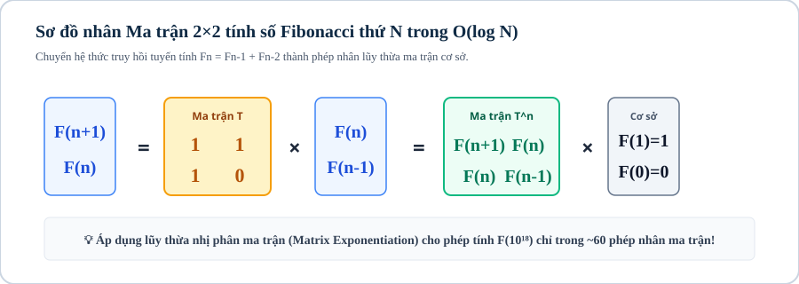
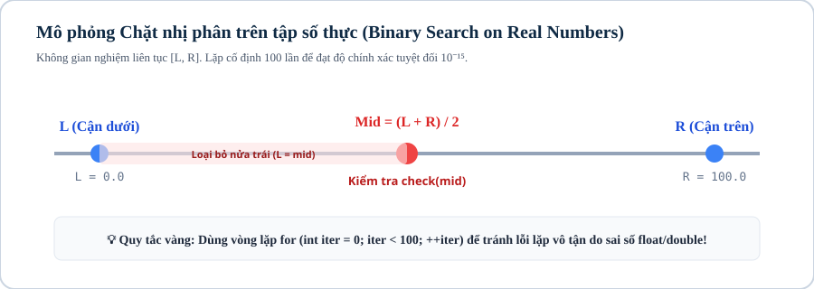
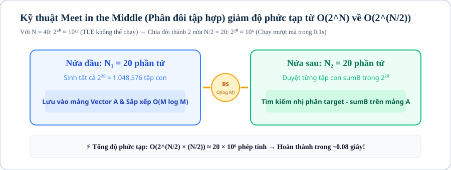
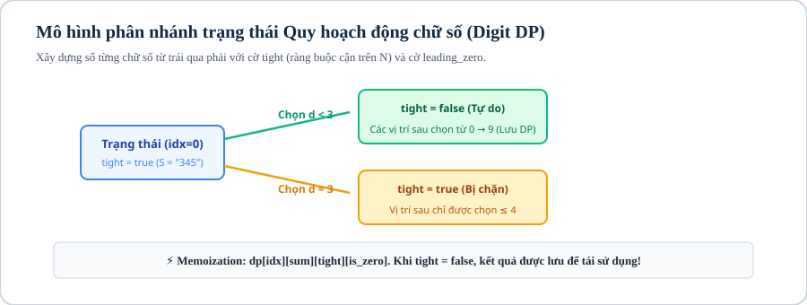

# iKHEDU C++ BẢNG B — TỔNG HỢP NỘI DUNG 15 BÀI HỌC

> **File tổng hợp tự động** — Nối liền toàn bộ nội dung Production Content
> của 15 Bài học thuộc 6 Module trong khóa **C++ Bảng B Level 2**.

> Tổng số Module: **6** | Tổng số Bài học: **15** | Tổng số bài tập phân tầng (P0 → P5): **240 bài**

---

## MỤC LỤC TỔNG QUAN

### Module 01: Số Học & Đại Số Đồng Dư Nâng Cao

- Bài 01: Số Học Cơ Bản & Chuyên Sâu
- Bài 02: Modulo & Lũy Thừa Nhanh

### Module 02: Kỹ Thuật Tìm Kiếm & Xử Lý Mảng Đa Chiều

- Bài 03: Tìm Kiếm Nhị Phân Nâng Cao
- Bài 04: Kỹ Thuật Mảng: Hai Con Trỏ, Cửa Sổ Trượt, Mảng Tiền Tố & Mảng Hiệu

### Module 03: Đệ Quy, Chia Để Trị, Meet In The Middle & Mặt Nạ Bit

- Bài 05: Đệ Quy, Chia Để Trị & Kỹ Thuật Meet in the Middle
- Bài 06: Phép Toán Bit & Mặt Nạ Bit Nâng Cao

### Module 04: Thuật Toán Tham Lam & Quy Hoạch Động Cơ Bản

- Bài 07: Thuật Toán Tham Lam (Greedy)
- Bài 08: Quy Hoạch Động Cơ Bản (Dynamic Programming)

### Module 05: Cấu Trúc Dữ Liệu Đơn Điệu, Stl C++ Nâng Cao & Đại Số Tổ Hợp

- Bài 09: Ngăn Xếp, Hàng Đợi & Deque
- Bài 10: Thư Viện STL C++ Nâng Cao
- Bài 11: Tổ Hợp, Hoán Vị & Xác Suất Cơ Bản

### Module 06: Đồ Thị, Cây Truy Vấn Đoạn, Digit Dp & Xử Lý Chuỗi

- Bài 12: Lý Thuyết Đồ Thị Cơ Bản & Nâng Cao
- Bài 13: Cây Phân Đoạn & Cây Fenwick (Segment Tree & BIT)
- Bài 14: Quy Hoạch Động Chữ Số (Digit DP)
- Bài 15: Xử Lý Chuỗi Ký Tự, String Hashing & Số Nguyên Lớn

---

<!-- ═══════════════════════════════════════════════════════════ -->
<!-- BẮT ĐẦU NỘI DUNG CHI TIẾT 15 BÀI HỌC                  -->
<!-- ═══════════════════════════════════════════════════════════ -->

================================================================================
# MODULE 01: SỐ HỌC & ĐẠI SỐ ĐỒNG DƯ NÂNG CAO
================================================================================

--------------------------------------------------------------------------------
<!-- Bài 01: Số Học Cơ Bản & Chuyên Sâu | 430 dòng | 22,551 bytes -->
--------------------------------------------------------------------------------

# Bài 01: Số học cơ bản & chuyên sâu

## 1. Khái niệm & bản chất của tối ưu số học trong lập trình thi đấu

Số học trong lập trình thi đấu (Competitive Programming) không đơn thuần là các phép toán số học cơ bản, mà là nghệ thuật khai thác **các cấu trúc đại số và tính chất chia hết** để giảm độ phức tạp tính toán từ hàm mũ $\mathcal{O}(2^N)$ hoặc đa thức $\mathcal{O}(N)$ xuống thời gian logarit $\mathcal{O}(\log N)$ hoặc $\mathcal{O}(1)$.

Ở Level 2, ta không dừng lại ở việc kiểm tra nguyên tố hay tìm ước số đơn lẻ, mà tập trung vào **Tái kết hợp & Xử lý đa truy vấn với khối lượng dữ liệu cực lớn**:
* **Khai thác thuật toán Euclid:** Rút gọn không gian bài toán, tìm ước chung lớn nhất $\gcd(A, B)$ trong $\mathcal{O}(\log(\min(A, B)))$ và giải phương trình Diophantine nghiệm nguyên qua thuật toán Euclid mở rộng.
* **Sàng ước số nguyên tố nhỏ nhất (SPF):** Tiền xử lý $\mathcal{O}(MAX \log \log MAX)$ để phân tích hàng triệu số thành thừa số nguyên tố với tốc độ $\mathcal{O}(\log N)$ mỗi số.
* **Sàng nguyên tố phân đoạn (Segmented Sieve):** Vượt qua ranh giới bộ nhớ RAM để tìm chính xác mọi số nguyên tố trong đoạn $[L, R]$ với $R \le 10^{12}$ và $R - L \le 10^6$.

---

## 2. Thuật toán Euclid & Bản chất toán học của GCD / LCM

### 2.1. Định lý Euclid & Tính chất bất biến (Invariant)

> **Định lý:** Với mọi cặp số nguyên không âm $A, B$ ($B \ne 0$), ước chung lớn nhất của chúng luôn thỏa mãn:
$$\gcd(A, B) = \gcd(B, A \bmod B)$$
$$\gcd(A, 0) = A$$

Mỗi bước lấy dư $A \bmod B$ thực chất là loại bỏ tất cả các bội số của $B$ ra khỏi $A$, giữ lại phần dư $R < B$. Khi số dư bằng $0$, số chia cuối cùng chính là $\gcd(A, B)$.

#### Ví dụ minh họa 1: Tìm $\gcd(105, 45)$
1. $\gcd(105, 45) = \gcd(45, 105 \bmod 45) = \gcd(45, 15)$
2. $\gcd(45, 15) = \gcd(15, 45 \bmod 15) = \gcd(15, 0) = \mathbf{15}$

| Bước $k$ | Số Bị Chia $A$ | Số Chia $B$ | Phép Chia Lấy Dư $A \bmod B$ | Trạng Thái $(A_{next}, B_{next})$ |
|:---:|:---:|:---:|:---:|:---:|
| 1 | 105 | 45 | $105 \bmod 45 = 15$ | $(45, 15)$ |
| 2 | 45 | 15 | $45 \bmod 15 = 0$ | $(15, 0)$ |
| **Kết quả** | **15** | **0** | **Dừng (B = 0)** | **$\gcd = 15$** |

### 2.2. Mẫu cài đặt C++ chuẩn thi đấu (Không đệ quy)

```cpp
long long gcd_calc(long long a, long long b) {
    while (b != 0) {
        long long r = a % b;
        a = b;
        b = r;
    }
    return a;
}
```

> **Phạm vi áp dụng:** Mẫu `gcd_calc` ở trên nhận các số không âm. Nếu dữ liệu có thể chứa số âm, hãy chuẩn hóa bằng `abs` trước khi gọi; GCD được quy ước là số không âm.

### 2.3. Bẫy lỗi tràn số khi tính Bội chung nhỏ nhất ($\text{lcm}$)

Công thức toán học: $\text{lcm}(A, B) = \frac{A \times B}{\gcd(A, B)}$.

> **Cảnh báo bẫy lỗi: BẪY TRÀN TÍCH `A * B` TRONG PHÉP TÍNH LCM**

> Nếu viết `return (a * b) / gcd(a, b);`, khi $A, B \approx 10^{10}$, tích $A \times B \approx 10^{20}$ sẽ vượt quá giới hạn $9.22 \times 10^{18}$ của kiểu `long long` $\implies$ **TRÀN SỐ ÂM / KẾT QUẢ SAI HOÀN TOÀN**.

> **Quy tắc an toàn tuyệt đối:** Luôn chia trước khi nhân vì $A$ luôn chia hết cho $\gcd(A, B)$:
> ```cpp
> long long lcm_calc(long long a, long long b) {
>     if (a == 0 || b == 0) return 0;
>     return (a / gcd_calc(a, b)) * b;
> }
> ```

---


## 3. Sàng ước số nguyên tố nhỏ nhất (SPF — Smallest Prime Factor)

### 3.1. Động lực: Xử lý $10^5$ truy vấn phân tích thừa số nguyên tố

Trong các kỳ thi HSG, ta thường gặp bài toán: Cho $Q = 10^5$ truy vấn, mỗi truy vấn cho một số $N \le 10^6$, yêu cầu phân tích $N$ thành thừa số nguyên tố.
* **Cách ngây thơ $\mathcal{O}(\sqrt{N})$:** Mỗi truy vấn thử chia đến $\sqrt{N} \implies \text{Tổng thời gian } \mathcal{O}(Q \sqrt{N}) \approx 10^5 \times 10^3 = 10^8 \text{ phép tính} \implies$ **Nguy cơ TLE**.
* **Kỹ thuật Sàng SPF:** Tiền xử lý 1 lần mảng `spf[x]` lưu ước số nguyên tố nhỏ nhất của $x$ trong $\mathcal{O}(MAX \log \log MAX)$. Khi có truy vấn $N$, ta chỉ việc nhảy liên tiếp theo `spf[N]` $\implies$ **Mỗi truy vấn chỉ mất $\mathcal{O}(\log N)$ bước!**

### 3.2. Bảng mô phỏng phân tích số $N = 84$ bằng SPF

* `spf[84] = 2` $\implies 84 / 2 = 42$
* `spf[42] = 2` $\implies 42 / 2 = 21$
* `spf[21] = 3` $\implies 21 / 3 = 7$
* `spf[7] = 7` $\implies 7 / 7 = 1$ (Dừng)
$$\implies 84 = 2^2 \times 3^1 \times 7^1 \quad (\text{Chỉ mất đúng 4 bước chia!})$$

| Bước $k$ | Giá Trị $N$ Hiện Tại | `spf[N]` (Ước NT nhỏ nhất) | $N_{next} = N / \text{spf}[N]$ | Thừa Số Thu Được |
|:---:|:---:|:---:|:---:|:---:|
| 1 | 84 | 2 | 42 | $2$ |
| 2 | 42 | 2 | 21 | $2$ |
| 3 | 21 | 3 | 7 | $3$ |
| 4 | 7 | 7 | 1 | $7$ |

### 3.3. Cài đặt C++ Sàng SPF & Phân tích thừa số tối ưu

```cpp
const int MAXN = 1000000;
int spf[MAXN + 1];

void sieve_spf() {
    for (int i = 1; i <= MAXN; ++i) spf[i] = i;
    for (int i = 2; i * i <= MAXN; ++i) {
        if (spf[i] == i) { // i là số nguyên tố
            for (int j = i * i; j <= MAXN; j += i) {
                if (spf[j] == j) spf[j] = i; // Gán ước NT nhỏ nhất đầu tiên chạm tới
            }
        }
    }
}

// Phân tích n thành vector 2 chiều: mỗi phần tử gồm [thừa_số_nguyên_tố, số_mũ]
vector<vector<long long>> factorize_spf(int n) {
    vector<vector<long long>> factors;
    while (n > 1) {
        long long p = spf[n];
        long long count = 0;
        while (n % p == 0) {
            count++;
            n /= p;
        }
        factors.push_back({p, count});
    }
    return factors;
}
```

---


## 4. Sàng nguyên tố phân đoạn (Segmented Sieve trên $[L, R]$)

### 4.1. Bản chất & Ranh giới bộ nhớ

Khi bài toán yêu cầu tìm/đếm các số nguyên tố trong đoạn $[L, R]$ với:
$$1 \le L \le R \le 10^{12} \quad \text{và} \quad R - L \le 10^6$$
* **Tại sao không thể tạo mảng `bool is_prime[10^12]`?** $\implies$ Vì $10^{12}$ byte $\approx 1000\text{GB}$ RAM, vượt giới hạn $256\text{MB}$ của đề bài.
* **Định lý toán học:** Mọi hợp số $X \in [L, R]$ đều có ít nhất một ước nguyên tố $p \le \sqrt{R} \le 10^6$.

### 4.2. Thuật toán Sàng đoạn 3 bước

1. **Bước 1:** Dùng sàng Eratosthenes chuẩn tìm tất cả số nguyên tố $p \le \sqrt{R} \le 10^6$.
2. **Bước 2:** Cấp phát mảng đánh dấu `vector<bool> is_prime_range(R - L + 1, true)`. Số $X \in [L, R]$ được ánh xạ về chỉ số `X - L` trong mảng ($0 \le X - L \le 10^6$). `vector<bool>` thường nén mỗi cờ theo bit, nên với $10^6$ vị trí phần đánh dấu chỉ khoảng $10^6$ bit $\approx 0.125$ MB; bộ nhớ thực tế phụ thuộc kiểu lưu trữ và overhead của container.
3. **Bước 3:** Với mỗi số nguyên tố $p \le \sqrt{R}$, tìm bội số nhỏ nhất của $p$ mà $\ge L$:
$$\text{start} = \max\left(p \times p, \left\lceil \frac{L}{p} \right\rceil \times p\right) = \max\left(p \times p, \left\lfloor \frac{L + p - 1}{p} \right\rfloor \times p\right)$$
Gạch bỏ tất cả các bội số $\text{start}, \text{start} + p, \text{start} + 2p, \dots \le R$.

### 4.3. Cài đặt C++ Sàng đoạn

```cpp
vector<long long> segmented_sieve(long long L, long long R) {
    long long limit = sqrt(R);
    vector<bool> mark(limit + 1, true);
    vector<long long> primes;
    for (long long p = 2; p <= limit; ++p) {
        if (mark[p]) {
            primes.push_back(p);
            for (long long j = p * p; j <= limit; j += p) mark[j] = false;
        }
    }

    vector<bool> is_prime_range(R - L + 1, true);
    for (long long p : primes) {
        long long start = max(p * p, ((L + p - 1) / p) * p);
        for (long long j = start; j <= R; j += p) {
            is_prime_range[j - L] = false;
        }
    }

    if (L == 1) is_prime_range[0] = false; // Bắt buộc: Số 1 không phải là số nguyên tố

    vector<long long> result;
    for (long long i = 0; i <= R - L; ++i) {
        if (is_prime_range[i]) {
            result.push_back(L + i);
        }
    }
    return result;
}
```

---

## 5. Thuật toán Euclid mở rộng & Phương trình Diophantine

### 5.1. Định lý Bézout & Nghiệm nguyên

> **Định lý Bézout:** Với hai số nguyên $A, B$, luôn tồn tại hai số nguyên $x, y$ sao cho:
$$A \cdot x + B \cdot y = \gcd(A, B)$$

Phương trình Diophantine tuyến tính $A \cdot x + B \cdot y = C$ có nghiệm nguyên khi và chỉ khi $C$ chia hết cho $\gcd(A, B)$.

### 5.2. Công thức hồi quy nghiệm `extgcd`

Giả sử đệ quy tìm được $(x_1, y_1)$ thỏa mãn: $B \cdot x_1 + (A \bmod B) \cdot y_1 = g$.  
Vì $A \bmod B = A - \lfloor A/B \rfloor \cdot B$, ta có công thức hồi quy nghiệm $(x, y)$:
$$\begin{cases} x = y_1 \\ y = x_1 - \lfloor A / B \rfloor \cdot y_1 \end{cases}$$

```cpp
long long extgcd_nonnegative(long long a, long long b, long long &x, long long &y) {
    if (b == 0) {
        x = 1;
        y = 0;
        return a;
    }
    long long x1, y1;
    long long g = extgcd_nonnegative(b, a % b, x1, y1);
    x = y1;
    y = x1 - (a / b) * y1;
    return g;
}

long long extgcd(long long a, long long b, long long &x, long long &y) {
    long long sa = (a < 0 ? -1 : 1);
    long long sb = (b < 0 ? -1 : 1);
    long long aa = (a < 0 ? -a : a);
    long long bb = (b < 0 ? -b : b);
    long long g = extgcd_nonnegative(aa, bb, x, y);
    x *= sa;
    y *= sb;
    return g;
}
```

Hàm `extgcd_nonnegative` xử lý phần đệ quy trên số không âm; hàm `extgcd` bên ngoài khôi phục dấu của $A, B$. Vì vậy phương trình $A x + B y = C$ có thể nhận $A, B$ âm, sau khi xử lý riêng trường hợp $A = B = 0$.

---

## 6. Mẫu cài đặt chuẩn thi đấu (Competitive Template)

```cpp
#include <bits/stdc++.h>
using namespace std;

// Sàng SPF tiền xử lý
const int MAXN = 1000000;
int spf[MAXN + 1];

void init_spf() {
    for (int i = 1; i <= MAXN; ++i) spf[i] = i;
    for (int i = 2; i * i <= MAXN; ++i) {
        if (spf[i] == i) {
            for (int j = i * i; j <= MAXN; j += i) {
                if (spf[j] == j) spf[j] = i;
            }
        }
    }
}

int main() {
    // Fast I/O
    ios::sync_with_stdio(false);
    cin.tie(nullptr);

    init_spf();

    int q;
    if (!(cin >> q)) return 0;

    while (q--) {
        int n;
        cin >> n;
        // Phân tích n trong O(log N)
        while (n > 1) {
            int p = spf[n];
            int cnt = 0;
            while (n % p == 0) {
                cnt++;
                n /= p;
            }
            cout << p << "^" << cnt << " ";
        }
        cout << "\n";
    }
    return 0;
}
```

---

## 7. Ranh giới áp dụng: Khi nào dùng SPF vs Sàng đoạn vs Phân tích $\mathcal{O}(\sqrt{N})$?

| Phương Pháp | Phạm Vi Dữ Liệu | Số Lượng Truy Vấn | Bộ Nhớ RAM | Khi Nào Sử Dụng? |
|---|---|---|:---:|---|
| **Thử chia $\mathcal{O}(\sqrt{N})$** | $N \le 10^{14}$ | $Q \le 10^3$ (Ít truy vấn) | $\mathcal{O}(1)$ | Số lớn, ít truy vấn độc lập |
| **Sàng SPF $\mathcal{O}(\log N)$** | $N \le 10^6$ | $Q \le 10^6$ (Rất nhiều truy vấn) | Khoảng $4\text{MB}$ với `int` | Số vừa phải, truy vấn liên tục |
| **Sàng đoạn $[L, R]$** | $R \le 10^{12}, R - L \le 10^6$ | $1$ truy vấn đoạn lớn | Khoảng $0.125\text{MB}$ cho $10^6$ bit với `vector<bool>` | Cần đếm/tìm số nguyên tố trên dải số lớn |

> **Ghi chú bộ nhớ:** Đây chỉ là phần mảng đánh dấu. Nếu dùng `bool`, `char` hoặc container khác thay cho `vector<bool>`, bộ nhớ sẽ lớn hơn; cần tính theo kiểu dữ liệu thực tế.

---

## Visual Assets / Hình ảnh trực quan

Các hình dưới đây là kế hoạch minh họa cho bản phát hành; trạng thái hiện tại là `TBD`.

| Asset | Mục đích minh họa | Nội dung chính | Vị trí đặt trong Lesson | Trạng thái |
|---|---|---|---|---|
| Sơ đồ thuật toán Euclid | Làm rõ quá trình giảm cặp $(A,B)$ | $(A,B) \to (B,A \bmod B)$ | Sau mục 2.1 | `TBD` |
| Bảng mô phỏng SPF với $N=84$ | Cho thấy mỗi lần chia theo ước nguyên tố nhỏ nhất | $84\to42\to21\to7\to1$ | Sau mục 3.2 | `TBD` |
| Sơ đồ ba bước Segmented Sieve | Phân biệt sàng cơ sở và sàng trên đoạn lớn | Sinh prime cơ sở → ánh xạ đoạn → gạch bội | Sau mục 4.2 | `TBD` |
| Sơ đồ truy hồi Extended Euclid | Theo dõi hệ số Bézout qua các lần quay lui | $(x_1,y_1)\to(x,y)$ | Sau mục 5.2 | `TBD` |
| Sơ đồ chọn công cụ | Giúp chọn đúng thuật toán theo giới hạn | SPF / sàng đoạn / thử chia | Trước mục 7 | `TBD` |

## Câu hỏi trắc nghiệm củng cố khái niệm

#### Câu 1 (Độ phức tạp — Complexity):
Cho hai số nguyên $A, B \le 10^{18}$. Độ phức tạp thời gian trong trường hợp xấu nhất của thuật toán Euclid tìm $\gcd(A, B)$ là:
- **A.** $\mathcal{O}(\sqrt{\min(A, B)})$
- **B.** **[Đáp án đúng]** $\mathcal{O}(\log(\min(A, B)))$
- **C.** $\mathcal{O}(\min(A, B))$
- **D.** $\mathcal{O}(1)$

> *Giải thích:* Trong trường hợp xấu nhất (hai số Fibonacci liên tiếp), mỗi 2 bước chia dư giá trị của phần dư sẽ giảm đi ít nhất một nửa, do đó số bước thực hiện luôn tỷ lệ thuận với $\log(\min(A, B))$.

#### Câu 2 (Bẫy tràn số — Overflow):
Cách tính $\text{lcm}(A, B)$ nào sau đây an toàn nhất khi $A, B \le 10^{10}$ và $\text{lcm}(A, B) \le 10^{18}$?
- **A.** `return (a * b) / gcd(a, b);`
- **B.** **[Đáp án đúng]** `return (a / gcd(a, b)) * b;`
- **C.** `return a * b;`
- **D.** `return (a * b) % gcd(a, b);`

> *Giải thích:* Thực hiện phép chia trước `(a / gcd) * b` giúp giá trị trung gian không vượt quá $\text{lcm}(A, B)$, tránh bị tràn số 64-bit (`long long`).

#### Câu 3 (Bản chất SPF — Structure):
Trong thuật toán Sàng SPF, giá trị `spf[x]` lưu trữ điều gì?
- **A.** Ước số nguyên tố lớn nhất của $x$.
- **B.** **[Đáp án đúng]** Ước số nguyên tố nhỏ nhất của $x$.
- **C.** Số lượng ước của $x$.
- **D.** Tổng các ước số của $x$.

> *Giải thích:* `spf[x]` là viết tắt của *Smallest Prime Factor* (ước số nguyên tố nhỏ nhất).

#### Câu 4 (Hiệu năng truy vấn — Performance):
Sau khi tiền xử lý mảng SPF cho các số đến $10^6$, thao tác phân tích một số $N \le 10^6$ thành thừa số nguyên tố mất độ phức tạp bao nhiêu?
- **A.** $\mathcal{O}(\sqrt{N})$
- **B.** **[Đáp án đúng]** $\mathcal{O}(\log N)$
- **C.** $\mathcal{O}(1)$
- **D.** $\mathcal{O}(N)$

> *Giải thích:* Mỗi bước nhảy chia $N$ cho `spf[N]` $\ge 2$, nên số bước chia tối đa không bao giờ vượt quá $\lfloor \log_2 N \rfloor \le 20$.

#### Câu 5 (Bộ nhớ Sàng đoạn — Memory):
Khi cần tìm các số nguyên tố trong đoạn $[L, R]$ với $L = 10^{11}$ và $R = 10^{11} + 10^6$, kích thước mảng đánh dấu `is_prime` cần cấp phát là:
- **A.** $10^{11}$ phần tử
- **B.** $10^{12}$ phần tử
- **C.** **[Đáp án đúng]** $R - L + 1 = 10^6 + 1$ phần tử
- **D.** $\sqrt{R} \approx 316227$ phần tử

> *Giải thích:* Thuật toán Sàng đoạn ánh xạ số $X \in [L, R]$ về vị trí `X - L` trong mảng, nên chỉ cần mảng $R - L + 1$ phần tử. Với `vector<bool>`, $10^6$ vị trí tương đương khoảng $10^6$ bit ($\approx 0.125\text{MB}$); kiểu lưu trữ khác có thể dùng nhiều bộ nhớ hơn.

#### Câu 6 (Phạm vi nguyên tố cơ sở — Range):
Để thực hiện Sàng đoạn trên $[L, R]$ với $R \le 10^{12}$, ta cần chuẩn bị danh sách các số nguyên tố cơ sở đến tối đa bao nhiêu?
- **A.** $R / 2$
- **B.** **[Đáp án đúng]** $\sqrt{R} \le 10^6$
- **C.** $R - L$
- **D.** $\sqrt[3]{R} \le 10^4$

> *Giải thích:* Mọi hợp số $\le R$ luôn có ít nhất một ước số nguyên tố $\le \sqrt{R} \le 10^6$.

#### Câu 7 (Bẫy trường hợp biên — Boundary):
Trong thuật toán Sàng đoạn, nếu $L = 1$ thì cần xử lý đặc biệt như thế nào?
- **A.** Bỏ qua số 2.
- **B.** **[Đáp án đúng]** Gán `is_prime_range[0] = false` vì số 1 không phải là số nguyên tố.
- **C.** Chạy vòng lặp từ $p = 1$.
- **D.** Tăng $R$ thêm 1 đơn vị.

> *Giải thích:* Vòng lặp sàng chỉ gạch bội số của $p \ge 2$, do đó số 1 sẽ không bị gạch nếu không xử lý gán `false` thủ công.

#### Câu 8 (Định lý Bézout — Diophantine):
Phương trình $A \cdot x + B \cdot y = C$ có nghiệm nguyên $(x, y)$ khi và chỉ khi:
- **A.** $\gcd(A, B) = 1$
- **B.** **[Đáp án đúng]** $C$ chia hết cho $\gcd(A, B)$
- **C.** $A + B = C$
- **D.** $A \times B \ge C$

> *Giải thích:* Theo định lý Bézout, mọi tổ hợp tuyến tính $Ax + By$ đều là bội số của $\gcd(A, B)$.

#### Câu 9 (Công thức hồi quy extgcd — Algorithm):
Nếu $(x_1, y_1)$ là nghiệm của $B \cdot x_1 + (A \bmod B) \cdot y_1 = g$, thì nghiệm $(x, y)$ của $A \cdot x + B \cdot y = g$ là:
- **A.** $x = x_1, y = y_1$
- **B.** **[Đáp án đúng]** $x = y_1, y = x_1 - \lfloor A / B \rfloor \cdot y_1$
- **C.** $x = x_1 - \lfloor A / B \rfloor \cdot y_1, y = y_1$
- **D.** $x = y_1, y = x_1 + \lfloor A / B \rfloor \cdot y_1$

> *Giải thích:* Biến đổi từ $A \bmod B = A - \lfloor A/B \rfloor \cdot B$ vào phương trình.

#### Câu 10 (Xử lý nghiệm âm — Modulo):
Khi giải $A \cdot x + B \cdot y = 1$ với modulo $M = 26$, nếu $x = -17$, giá trị nghiệm $x \in [0, M - 1]$ tương đương là:
- **A.** 17
- **B.** **[Đáp án đúng]** 9
- **C.** -9
- **D.** 8

> *Giải thích:* $(x \bmod M + M) \bmod M = (-17 \bmod 26 + 26) \bmod 26 = 9$.

#### Câu 11 (Số lượng ước số — Divisor Count):
Nếu $N = p_1^{a_1} \cdot p_2^{a_2} \cdots p_k^{a_k}$, tổng số lượng ước số của $N$ là:
- **A.** $a_1 \cdot a_2 \cdots a_k$
- **B.** **[Đáp án đúng]** $(a_1 + 1)(a_2 + 1) \cdots (a_k + 1)$
- **C.** $p_1 \cdot p_2 \cdots p_k$
- **D.** $a_1 + a_2 + \dots + a_k$

> *Giải thích:* Mỗi thừa số $p_i$ có $a_i + 1$ cách chọn số mũ từ $0$ đến $a_i$.

#### Câu 12 (Tính chất số chính phương — Square):
Một số nguyên dương $N$ là số chính phương khi và chỉ khi:
- **A.** **[Đáp án đúng]** Mọi số mũ $a_i$ trong phân tích thừa số nguyên tố của $N$ đều là số chẵn.
- **B.** Tổng các ước số là số lẻ.
- **C.** Tất cả các thừa số nguyên tố đều là số lẻ.
- **D.** Số lượng ước số là số chẵn.

> *Giải thích:* $N = K^2 = (p_1^{b_1} \dots p_k^{b_k})^2 = p_1^{2b_1} \dots p_k^{2b_k}$, do đó mọi số mũ đều có dạng $2b_i$ (số chẵn).

---

## 6. Ma trận bài tập thực hành phân tầng (P0 → P5)

| STT | Mã Bài Toán | Tên Bài Toán | Cấp Độ | Thuật Toán Trọng Tâm | Giới Hạn Dữ Liệu | Mục Tiêu Rèn Luyện |
|:---:|:---|:---|:---:|:---|:---:|:---|
| 01 | `CPPB2-L01-01` | ƯỚC CHUNG & BỘI CHUNG CƠ BẢN | P0 (Nhận biết) | Thuật toán chuyên sâu | $N \le 10^5$ | Rèn luyện tư duy thi đấu |
| 02 | `CPPB2-L01-02` | RÚT GỌN MẢNG PHÂN SỐ LỚN | P0 (Nhận biết) | Thuật toán chuyên sâu | $N \le 10^5$ | Rèn luyện tư duy thi đấu |
| 03 | `CPPB2-L01-03` | SÀNG ƯỚC SỐ NGUYÊN TỐ NHỎ NHẤT (SPF) | P1 (Thông hiểu) | Thuật toán chuyên sâu | $N \le 10^5$ | Rèn luyện tư duy thi đấu |
| 04 | `CPPB2-L01-04` | PHÂN TÍCH THỪA SỐ TRUY VẤN NHANH | P1 (Thông hiểu) | Thuật toán chuyên sâu | $N \le 10^5$ | Rèn luyện tư duy thi đấu |
| 05 | `CPPB2-L01-05` | ĐẾM ƯỚC SỐ & TỔNG ƯỚC SỐ NHANH | P1 (Thông hiểu) | Thuật toán chuyên sâu | $N \le 10^5$ | Rèn luyện tư duy thi đấu |
| 06 | `CPPB2-L01-06` | SÀNG NGUYÊN TỐ ĐOẠN [L, R] | P1 (Thông hiểu) | Thuật toán chuyên sâu | $N \le 10^5$ | Rèn luyện tư duy thi đấu |
| 07 | `CPPB2-L01-07` | Cặp Số Nguyên Tố Sinh Đôi Trong Đoạn | P2 (Vận dụng) | Thuật toán chuyên sâu | $N \le 10^5$ | Rèn luyện tư duy thi đấu |
| 08 | `CPPB2-L01-08` | TÌM NGHIỆM NGUYÊN PHƯƠNG TRÌNH DIOPHANTINE | P2 (Vận dụng) | Thuật toán chuyên sâu | $N \le 10^5$ | Rèn luyện tư duy thi đấu |
| 09 | `CPPB2-L01-09` | Nghiệm Nguyên Dương Nhỏ Nhất | P2 (Vận dụng) | Thuật toán chuyên sâu | $N \le 10^5$ | Rèn luyện tư duy thi đấu |
| 10 | `CPPB2-L01-10` | HÀM PHI EULER $\PHI(N)$ NHANH VỚI SPF | P2 (Vận dụng) | Thuật toán chuyên sâu | $N \le 10^5$ | Rèn luyện tư duy thi đấu |
| 11 | `CPPB2-L01-11` | Phân Tích Giai Thừa N! (Legendre) | P2 (Vận dụng) | Thuật toán chuyên sâu | $N \le 10^5$ | Rèn luyện tư duy thi đấu |
| 12 | `CPPB2-L01-12` | Số Ước Số Lẻ & Số Chính Phương | P3 (Vận dụng cao) | Thuật toán chuyên sâu | $N \le 10^5$ | Rèn luyện tư duy thi đấu |
| 13 | `CPPB2-L01-13` | Cặp Số Có GCD và LCM Cho Trước | P3 (Vận dụng cao) | Thuật toán chuyên sâu | $N \le 10^5$ | Rèn luyện tư duy thi đấu |
| 14 | `CPPB2-L01-14` | Khoảng Cách Cực Đại Giữa Hai Số Nguyên Tố | P3 (Vận dụng cao) | Thuật toán chuyên sâu | $N \le 10^5$ | Rèn luyện tư duy thi đấu |
| 15 | `CPPB2-L01-15` | Phương Trình Đổi Tiền Xu Diophantine | P3 (Vận dụng cao) | Thuật toán chuyên sâu | $N \le 10^5$ | Rèn luyện tư duy thi đấu |
| 16 | `CPPB2-L01-16` | Tổng GCD Với N | P3 (Vận dụng cao) | Thuật toán chuyên sâu | $N \le 10^5$ | Rèn luyện tư duy thi đấu |
| 17 | `CPPB2-L01-17` | Định lý thặng dư Trung Hoa (CRT) | P4 (Nâng cao HSG) | Thuật toán chuyên sâu | $N \le 10^5$ | Rèn luyện tư duy thi đấu |
| 18 | `CPPB2-L01-18` | Bậc của số nguyên Modulo P | P4 (Nâng cao HSG) | Thuật toán chuyên sâu | $N \le 10^5$ | Rèn luyện tư duy thi đấu |
| 19 | `CPPB2-L01-19` | Tìm căn nguyên nguyên thủy nhỏ nhất | P4 (Nâng cao HSG) | Thuật toán chuyên sâu | $N \le 10^5$ | Rèn luyện tư duy thi đấu |
| 20 | `CPPB2-L01-20` | Ước nguyên tố lớn nhất của dãy số | P4 (Nâng cao HSG) | Thuật toán chuyên sâu | $N \le 10^5$ | Rèn luyện tư duy thi đấu |
| 21 | `CPPB2-L01-21` | Phương trình nghiệm nguyên Pell cơ bản | P4 (Nâng cao HSG) | Thuật toán chuyên sâu | $N \le 10^5$ | Rèn luyện tư duy thi đấu |
| 22 | `CPPB2-L01-22` | Bội số nguyên tố trong tích giai thừa lớn | P5 (Olympic Master) | Thuật toán chuyên sâu | $N \le 10^5$ | Rèn luyện tư duy thi đấu |

# Bài 02: Modulo và lũy thừa nhanh

## 1. Khái niệm & bản chất của đại số đồng dư trong lập trình thi đấu

Trong các bài toán đếm tổ hợp, xác suất và tối ưu hóa quy mô lớn, kết quả đầu ra thường tăng theo hàm số mũ hoặc giai thừa, dễ dàng vượt qua giới hạn biểu diễn của số nguyên 64-bit (`long long` $\approx 9.22 \times 10^{18}$). Để tránh việc phải xử lý số nguyên lớn (BigInt) làm chậm thời gian thực thi, các đề thi thường yêu cầu tính toán kết quả **theo modulo của một số nguyên $M$** (thông dụng nhất là số nguyên tố lớn như $10^9 + 7$ hoặc $998244353$).

Đại số đồng dư (Modular Arithmetic) cho phép ta thu gọn các số cực lớn về một không gian hữu hạn $\{0, 1, \dots, M - 1\}$ mà vẫn bảo toàn các tính chất toán học của phép cộng, trừ, nhân. Tuy nhiên, phép chia trong modulo không thể thực hiện trực tiếp mà phải thông qua khái niệm **Nghịch đảo modulo (Modular Inverse)**.

---

## 2. Các quy tắc tính toán đồng dư cơ bản & bẫy lỗi tử huyệt

### 2.1. Bốn phép toán đồng dư cơ sở

Với mọi $A, B \in \mathbb{Z}$ và số chia modulo $M$:
1. **Phép cộng:** $(A + B) \bmod M = ((A \bmod M) + (B \bmod M)) \bmod M$
2. **Phép nhân:** $(A \times B) \bmod M = ((A \bmod M) \times (B \bmod M)) \bmod M$
3. **Phép trừ:** $(A - B) \bmod M = ((A \bmod M) - (B \bmod M) + M) \bmod M$
4. **Phép lũy thừa:** $A^B \bmod M = (A \bmod M)^B \bmod M$

### 2.2. Tử huyệt lập trình: Bẫy số âm và bẫy tràn số trung gian

> **Cảnh báo bẫy lỗi 1: BẪY SỐ ÂM KHI TRỪ MODULO TRONG C++**

> Trong C++, toán tử `%` là phép chia lấy phần dư định hướng về 0 (truncated division), nghĩa là nếu $A < B$ thì `(A - B) % M` sẽ trả về **số âm** (ví dụ: `(3 - 7) % 5 = -4 % 5 = -4` thay vì $+1$).

> **Quy tắc an toàn tuyệt đối:** Luôn cộng thêm $M$ trước khi lấy dư:
> ```cpp
> long long mod_sub(long long a, long long b, long long m) {
>     return ((a - b) % m + m) % m;
> }
> ```

> **Cảnh báo bẫy lỗi 2: BẪY TRÀN SỐ 32-BIT KHI NHÂN MODULO**

> Khi $A, B \approx 10^9$ và $M = 10^9 + 7$, tích $A \times B \approx 10^{18}$. Nếu khai báo biến kiểu `int`, phép nhân sẽ bị tràn số 32-bit trước khi kịp gọi `% M`. Luôn ép kiểu sang `long long` khi nhân.

> Khi $M \approx 10^{18}$ (số nguyên 64-bit), tích $A \times B \approx 10^{36}$ sẽ làm tràn cả `long long`. Khi đó bắt buộc phải dùng **Nhân Ấn Độ (Binary Multiplication)** hoặc kiểu số nguyên 128-bit `__int128_t`.

---



## 3. Thuật toán lũy thừa nhanh (Binary Exponentiation / Fast Power)

### 3.1. Ý tưởng thuật toán chia để trị

Để tính $A^B \bmod M$:
* Thuật toán ngây thơ nhân liên tiếp $B$ lần mất $\mathcal{O}(B)$ phép tính $\implies$ Khi $B = 10^{18}$, thời gian chạy là $10^{18}$ bước ($\approx 30$ năm).
* **Lũy thừa nhị phân:** Dựa trên tính chất phân rã nhị phân của số mũ:
$$A^B = \begin{cases} 1 & \text{khi } B = 0 \\ \left(A^{B/2}\right)^2 & \text{khi } B \text{ chẵn} \\ A \times \left(A^{\lfloor B/2 \rfloor}\right)^2 & \text{khi } B \text{ lẻ} \end{cases}$$
Độ phức tạp giảm xuống chỉ còn $\mathcal{O}(\log_2 B)$ bước (với $B = 10^{18}$ chỉ mất $\approx 60$ phép nhân).

### 3.2. Bảng mô phỏng phân rã Fast Power: Tính $3^{13} \bmod 1000$

Biểu diễn nhị phân của $B = 13$ là $1101_2 = 8 + 4 + 1$:
$$3^{13} = 3^8 \times 3^4 \times 3^1 = 6561 \times 81 \times 3$$

| Bước $k$ | Số Mũ $B$ | $B \bmod 2$ (Bit cuối) | Cơ Số $A$ Hiện Tại | Biến Tích Lũy `ans` ($ans = (ans \times A) \bmod M$) | Trạng Thái $(A_{next} = A^2, B_{next} = B/2)$ |
|:---:|:---:|:---:|:---:|:---:|:---:|
| 1 | 13 | 1 (Lẻ) | $3$ | $1 \times 3 = \mathbf{3}$ | $A \leftarrow 3^2 = 9, B \leftarrow 6$ |
| 2 | 6 | 0 (Chẵn) | $9$ | Giữ nguyên $\mathbf{3}$ | $A \leftarrow 9^2 = 81, B \leftarrow 3$ |
| 3 | 3 | 1 (Lẻ) | $81$ | $3 \times 81 = \mathbf{243}$ | $A \leftarrow 81^2 = 6561 \equiv 561, B \leftarrow 1$ |
| 4 | 1 | 1 (Lẻ) | $561$ | $243 \times 561 = 136323 \equiv \mathbf{323}$ | $B \leftarrow 0$ (Dừng) |
| **Kết quả** | **0** | — | — | **$ans = 323$** | **$3^{13} \bmod 1000 = 323$** |

### 3.3. Cài đặt C++ lũy thừa nhanh chuẩn thi đấu

```cpp
long long power_mod(long long a, long long b, long long m) {
    long long ans = 1;
    a %= m;
    while (b > 0) {
        if (b & 1) ans = (__int128_t)ans * a % m;
        a = (__int128_t)a * a % m;
        b >>= 1;
    }
    return ans;
}
```

---

## 4. Nghịch đảo modulo (Modular Inverse) & Phép chia đồng dư

### 4.1. Khái niệm nghịch đảo modulo

Trong số học thông thường, phép chia $\frac{A}{B}$ tương đương với phép nhân $A \times B^{-1}$ với $B^{-1} = \frac{1}{B}$.  
Trong số học đồng dư, **nghịch đảo modulo** của $B$ theo modulo $M$ là một số nguyên $X$ thỏa mãn:
$$B \times X \equiv 1 \pmod{M}$$
Ký hiệu $X = B^{-1} \bmod M$. Khi đó:
$$\frac{A}{B} \bmod M = (A \times B^{-1}) \bmod M$$

> **Điều kiện tồn tại:** Nghịch đảo modulo $B^{-1} \pmod{M}$ tồn tại khi và chỉ khi $\gcd(B, M) = 1$ (hai số nguyên tố cùng nhau).

### 4.2. Hai phương pháp tìm nghịch đảo modulo

#### Phương pháp 1: Định lý Fermat nhỏ (Áp dụng khi $M$ là số nguyên tố)
> **Định lý Fermat nhỏ:** Nếu $M$ là số nguyên tố và $B$ không chia hết cho $M$, thì $B^{M-1} \equiv 1 \pmod{M}$.  
> Nhân cả 2 vế với $B^{-1}$, ta có:
$$B^{-1} \equiv B^{M-2} \pmod{M}$$

```cpp
// Khi M là số nguyên tố (ví dụ 10^9 + 7)
long long modInverse_Fermat(long long b, long long m) {
    return power_mod(b, m - 2, m);
}
```

#### Phương pháp 2: Thuật toán Euclid mở rộng (Áp dụng khi $M$ bất kỳ, miễn là $\gcd(B, M) = 1$)
Giải phương trình Diophantine: $B \cdot x + M \cdot y = \gcd(B, M) = 1 \implies B \cdot x \equiv 1 \pmod{M}$. Nghiệm $x$ chính là nghịch đảo modulo:
```cpp
long long extgcd(long long a, long long b, long long &x, long long &y) {
    if (b == 0) { x = 1; y = 0; return a; }
    long long x1, y1;
    long long g = extgcd(b, a % b, x1, y1);
    x = y1;
    y = x1 - (a / b) * y1;
    return g;
}

long long modInverse_Euclid(long long b, long long m) {
    long long x, y;
    long long g = extgcd(b, m, x, y);
    if (g != 1) return -1; // Không tồn tại nghịch đảo
    return (x % m + m) % m;
}
```

---

## 5. Kỹ thuật nâng cao: Tiền xử lý nghịch đảo tuyến tính $\mathcal{O}(N)$

Khi cần tính tổ hợp $C_n^k \bmod M$ hoặc nghịch đảo cho tất cả các số từ $1$ đến $N$ (với $N = 10^6$), nếu dùng Fast Power cho từng số sẽ mất $\mathcal{O}(N \log M)$.  
Ta có công thức truy hồi tính nghịch đảo của mọi số $i \in [1, N]$ trong **thời gian tuyến tính $\mathcal{O}(N)$**:
$$\text{inv}[i] = - \lfloor M / i \rfloor \times \text{inv}[M \bmod i] \pmod{M}$$

```cpp
const int MAXN = 1000000;
long long inv[MAXN + 1];

void precompute_inverses(long long m) {
    inv[1] = 1;
    for (int i = 2; i <= MAXN; ++i) {
        inv[i] = m - (m / i) * inv[m % i] % m;
    }
}
```

---

## 6. Mẫu cài đặt chuẩn thi đấu (Competitive Template)

```cpp
#include <bits/stdc++.h>
using namespace std;

const long long MOD = 1000000007;

long long power_mod(long long a, long long b, long long m = MOD) {
    long long ans = 1;
    a %= m;
    while (b > 0) {
        if (b & 1) ans = (ans * a) % m;
        a = (a * a) % m;
        b >>= 1;
    }
    return ans;
}

long long mod_inverse(long long a, long long m = MOD) {
    return power_mod(a, m - 2, m);
}

long long mod_divide(long long a, long long b, long long m = MOD) {
    return (a % m * mod_inverse(b, m)) % m;
}

int main() {
    ios::sync_with_stdio(false);
    cin.tie(nullptr);

    long long a, b;
    if (!(cin >> a >> b)) return 0;

    // Tính (a / b) % MOD
    cout << mod_divide(a, b) << "\n";
    return 0;
}
```

---

## 7. Ranh giới áp dụng: Khi nào dùng Fermat vs Euclid mở rộng vs BigInt?

| Tình Huống Bài Toán | Điều Kiện Modulo $M$ | Kỹ Thuật Tối Ưu | Độ Phức Tạp |
|---|---|---|:---:|
| $M$ là số nguyên tố ($10^9+7, 998244353$) | $M$ nguyên tố | Fermat nhỏ $B^{M-2} \bmod M$ | $\mathcal{O}(\log M)$ |
| $M$ là hợp số nhưng $\gcd(B, M) = 1$ | $M$ bất kỳ | Euclid mở rộng giải $Bx + My = 1$ | $\mathcal{O}(\log M)$ |
| Cần nghịch đảo cho mảng $1 \dots N$ | $M$ nguyên tố | Tiền xử lý mảng `inv[i]` tuyến tính | $\mathcal{O}(N)$ |
| Số mũ $B$ cực lớn ($B \le 10^{100000}$) | $M$ nguyên tố | Hạ bậc số mũ: $A^B \equiv A^{B \bmod (M-1)} \pmod{M}$ | $\mathcal{O}(\text{length}(B) + \log M)$ |

---

## Câu hỏi trắc nghiệm củng cố khái niệm

#### Câu 1 (Bẫy số âm — Arithmetic):
Trong C++, biểu thức `(-7) % 5` cho kết quả bằng bao nhiêu, và giá trị đồng dư chuẩn trong khoảng $[0, 4]$ là bao nhiêu?
- **A.** `-2` và `3`
- **B.** **[Đáp án đúng]** `-2` trong C++, và giá trị chuẩn là `3` (vì $-7 \equiv 3 \pmod 5$).
- **C.** `3` và `3`
- **D.** `-2` và `-2`

> *Giải thích:* C++ thực hiện chia lấy dư cụt về 0 nên `(-7) % 5 = -2`. Để đưa về $[0, M-1]$, ta dùng công thức `((-7) % 5 + 5) % 5 = 3`.

#### Câu 2 (Độ phức tạp Fast Power — Performance):
Để tính $A^{10^{18}} \bmod (10^9+7)$, thuật toán lũy thừa nhị phân cần thực hiện tối đa bao nhiêu phép nhân?
- **A.** $10^{18}$ phép tính
- **B.** $10^9$ phép tính
- **C.** **[Đáp án đúng]** Khoảng 60 phép tính (vì $\log_2(10^{18}) \approx 60$).
- **D.** $1$ phép tính

> *Giải thích:* Mỗi bước chia đôi số mũ $B \leftarrow B / 2$, nên số bước là $\lfloor \log_2(10^{18}) \rfloor \approx 60$.

#### Câu 3 (Điều kiện nghịch đảo — Number Theory):
Phép chia modulo $\frac{A}{B} \bmod M$ tồn tại kết quả duy nhất khi và chỉ khi:
- **A.** $A$ chia hết cho $B$.
- **B.** $M$ chia hết cho $B$.
- **C.** **[Đáp án đúng]** $\gcd(B, M) = 1$.
- **D.** $A > B$.

> *Giải thích:* Nghịch đảo modulo $B^{-1} \pmod M$ tồn tại khi và chỉ khi $B$ và $M$ nguyên tố cùng nhau.

#### Câu 4 (Định lý Fermat nhỏ — Inverse):
Theo định lý Fermat nhỏ, nếu $M = 10^9 + 7$ (số nguyên tố), nghịch đảo modulo của $B$ được tính bằng:
- **A.** $B^{M} \bmod M$
- **B.** **[Đáp án đúng]** $B^{M-2} \bmod M$
- **C.** $B^{-1} \bmod M$
- **D.** $B^{M-1} \bmod M$

> *Giải thích:* $B^{M-1} \equiv 1 \pmod M \implies B \cdot B^{M-2} \equiv 1 \pmod M \implies B^{-1} \equiv B^{M-2} \pmod M$.

#### Câu 5 (Hạ bậc số mũ lớn — Euler):
Nếu $M = 10^9 + 7$ và số mũ $B = 10^{18}$, ta có thể rút gọn số mũ $B$ khi tính $A^B \bmod M$ bằng cách lấy $B$ modulo cho bao nhiêu?
- **A.** $M = 10^9 + 7$
- **B.** **[Đáp án đúng]** $M - 1 = 10^9 + 6$
- **C.** $M + 1$
- **D.** $\sqrt{M}$

> *Giải thích:* Theo định lý Fermat nhỏ, chu kỳ lũy thừa là $M - 1$. Do đó $A^B \equiv A^{B \bmod (M-1)} \pmod M$.

#### Câu 6 (Tiền xử lý tuyến tính — Precomputation):
Mục đích của công thức `inv[i] = M - (M / i) * inv[M % i] % M` là gì?
- **A.** Tìm số nguyên tố nhanh.
- **B.** **[Đáp án đúng]** Tiền xử lý nghịch đảo modulo cho mọi số từ $1$ đến $N$ trong thời gian tuyến tính $\mathcal{O}(N)$.
- **C.** Sắp xếp mảng trong $\mathcal{O}(N)$.
- **D.** Tính giai thừa.

> *Giải thích:* Cho phép tính nghịch đảo của $N$ số đầu tiên trong đúng $\mathcal{O}(N)$ thay vì $\mathcal{O}(N \log M)$.

#### Câu 7 (Tràn số 64-bit — Robustness):
Khi tính $(A \times B) \bmod M$ với $A, B, M \approx 10^{18}$, giải pháp nào trong C++ giúp tránh tràn số mà không cần cài BigInt?
- **A.** Dùng kiểu `unsigned long long`.
- **B.** **[Đáp án đúng]** Dùng kiểu `__int128_t` hoặc thuật toán Nhân Ấn Độ.
- **C.** Ép kiểu sang `double`.
- **D.** Dùng `int`.

> *Giải thích:* Tích hai số $10^{18}$ lên tới $10^{36}$, vượt ngưỡng $1.8 \times 10^{19}$ của `unsigned long long`. Kiểu `__int128_t` chứa được số tới $\approx 3.4 \times 10^{38}$.

#### Câu 8 (Biểu diễn nhị phân — Bitwise):
Trong hàm Fast Power, điều kiện `if (b & 1)` kiểm tra điều gì?
- **A.** Kiểm tra $b$ có bằng 1 không.
- **B.** **[Đáp án đúng]** Kiểm tra bit cuối cùng của $b$ có bật (tức $b$ là số lẻ) hay không.
- **C.** Kiểm tra $b$ có phải là lũy thừa của 2 không.
- **D.** Kiểm tra $b$ có âm không.

> *Giải thích:* Phép toán bit `b & 1` trả về 1 khi và chỉ khi $b$ là số lẻ.

#### Câu 9 (Phân số modulo — Division):
Giá trị của $\frac{1}{2} \bmod 7$ bằng bao nhiêu?
- **A.** $0.5$
- **B.** **[Đáp án đúng]** $4$ (vì $2 \times 4 = 8 \equiv 1 \pmod 7$).
- **C.** $3$
- **D.** $1$

> *Giải thích:* $2 \times 4 = 8 \equiv 1 \pmod 7$, do đó $2^{-1} \equiv 4 \pmod 7$. Khi đó $1 \times 4 \equiv 4 \pmod 7$.

#### Câu 10 (Fast Power với $B = 0$ — Boundary):
Giá trị của $A^0 \bmod M$ (với $M > 1$) luôn bằng bao nhiêu?
- **A.** $0$
- **B.** **[Đáp án đúng]** $1$
- **C.** $A$
- **D.** $M$

> *Giải thích:* Quy ước toán học $A^0 = 1$ với mọi $A$, do đó $A^0 \bmod M = 1 \bmod M = 1$.

---

## 6. Ma trận bài tập thực hành phân tầng (P0 → P5)

| STT | Mã Bài Toán | Tên Bài Toán | Cấp Độ | Thuật Toán Trọng Tâm | Giới Hạn Dữ Liệu | Mục Tiêu Rèn Luyện |
|:---:|:---|:---|:---:|:---|:---:|:---|
| 01 | `CPPB2-L02-01` | LŨY THỪA NHANH CƠ BẢN | P0 (Nhận biết) | Thuật toán chuyên sâu | $N \le 10^5$ | Rèn luyện tư duy thi đấu |
| 02 | `CPPB2-L02-02` | TÍNH GIÁ TRỊ PHÂN SỐ MODULO | P0 (Nhận biết) | Thuật toán chuyên sâu | $N \le 10^5$ | Rèn luyện tư duy thi đấu |
| 03 | `CPPB2-L02-03` | LŨY THỪA MA TRẬN 2X2 (DÃY FIBONACCI LỚN) | P1 (Thông hiểu) | Thuật toán chuyên sâu | $N \le 10^5$ | Rèn luyện tư duy thi đấu |
| 04 | `CPPB2-L02-04` | NGHỊCH ĐẢO MODULO TỔNG QUÁT | P1 (Thông hiểu) | Thuật toán chuyên sâu | $N \le 10^5$ | Rèn luyện tư duy thi đấu |
| 05 | `CPPB2-L02-05` | TÍNH TỔ HỢP $C_N^K \BMOD (10^9+7)$ | P1 (Thông hiểu) | Thuật toán chuyên sâu | $N \le 10^5$ | Rèn luyện tư duy thi đấu |
| 06 | `CPPB2-L02-06` | LŨY THỪA VỚI SỐ MŨ CỰC LỚN | P1 (Thông hiểu) | Thuật toán chuyên sâu | $N \le 10^5$ | Rèn luyện tư duy thi đấu |
| 07 | `CPPB2-L02-07` | NHÂN MODULO HAI SỐ CỰC LỚN (NHÂN ẤN ĐỘ) | P2 (Vận dụng) | Thuật toán chuyên sâu | $N \le 10^5$ | Rèn luyện tư duy thi đấu |
| 08 | `CPPB2-L02-08` | TỔNG CẤP SỐ NHÂN $S_N = \SUM_{I=0}^N A^I \BMOD M$ | P2 (Vận dụng) | Thuật toán chuyên sâu | $N \le 10^5$ | Rèn luyện tư duy thi đấu |
| 09 | `CPPB2-L02-09` | THÁP LŨY THỪA $A^{B^C} \BMOD M$ | P2 (Vận dụng) | Thuật toán chuyên sâu | $N \le 10^5$ | Rèn luyện tư duy thi đấu |
| 10 | `CPPB2-L02-10` | ĐẾM DÃY NGOẶC ĐÚNG (SỐ CATALAN MODULO) | P2 (Vận dụng) | Thuật toán chuyên sâu | $N \le 10^5$ | Rèn luyện tư duy thi đấu |
| 11 | `CPPB2-L02-11` | HỆ PHƯƠNG TRÌNH ĐỒNG DƯ (CHINESE REMAINDER THEOREM) | P2 (Vận dụng) | Thuật toán chuyên sâu | $N \le 10^5$ | Rèn luyện tư duy thi đấu |
| 12 | `CPPB2-L02-12` | TIỀN XỬ LÝ NGHỊCH ĐẢO TUYẾN TÍNH $\MATHCAL{O}(N)$ | P3 (Vận dụng cao) | Thuật toán chuyên sâu | $N \le 10^5$ | Rèn luyện tư duy thi đấu |
| 13 | `CPPB2-L02-13` | LŨY THỪA MA TRẬN KÍCH THƯỚC $K \TIMES K$ | P3 (Vận dụng cao) | Thuật toán chuyên sâu | $N \le 10^5$ | Rèn luyện tư duy thi đấu |
| 14 | `CPPB2-L02-14` | CĂN BẬC HAI MODULO NGUYÊN TỐ (THUẬT TOÁN TONELLI-SHANKS) | P3 (Vận dụng cao) | Thuật toán chuyên sâu | $N \le 10^5$ | Rèn luyện tư duy thi đấu |
| 15 | `CPPB2-L02-15` | LŨY THỪA SỐ MŨ LỚN KHI MODULO LÀ HỢP SỐ | P3 (Vận dụng cao) | Thuật toán chuyên sâu | $N \le 10^5$ | Rèn luyện tư duy thi đấu |
| 16 | `CPPB2-L02-16` | LOGARIT RỜI RẠC (BABY-STEP GIANT-STEP) | P3 (Vận dụng cao) | Thuật toán chuyên sâu | $N \le 10^5$ | Rèn luyện tư duy thi đấu |
| 17 | `CPPB2-L02-17` | Lũy thừa ma trận đếm đường đi đồ thị | P4 (Nâng cao HSG) | Thuật toán chuyên sâu | $N \le 10^5$ | Rèn luyện tư duy thi đấu |
| 18 | `CPPB2-L02-18` | Tổng cấp số nhân Modulo hợp số | P4 (Nâng cao HSG) | Thuật toán chuyên sâu | $N \le 10^5$ | Rèn luyện tư duy thi đấu |
| 19 | `CPPB2-L02-19` | Lũy thừa tháp tầng Euler Modulo | P4 (Nâng cao HSG) | Thuật toán chuyên sâu | $N \le 10^5$ | Rèn luyện tư duy thi đấu |
| 20 | `CPPB2-L02-20` | Căn bậc hai Modulo P (Tonelli-Shanks) | P4 (Nâng cao HSG) | Thuật toán chuyên sâu | $N \le 10^5$ | Rèn luyện tư duy thi đấu |
| 21 | `CPPB2-L02-21` | Tổng dãy Fibonacci từ L đến R | P4 (Nâng cao HSG) | Thuật toán chuyên sâu | $N \le 10^5$ | Rèn luyện tư duy thi đấu |
| 22 | `CPPB2-L02-22` | Số Tribonacci thứ N bằng ma trận 3x3 | P5 (Olympic Master) | Thuật toán chuyên sâu | $N \le 10^5$ | Rèn luyện tư duy thi đấu |

# MODULE 02: KỸ THUẬT TÌM KIẾM & XỬ LÝ MẢNG ĐA CHIỀU
================================================================================

--------------------------------------------------------------------------------
<!-- Bài 03: Tìm Kiếm Nhị Phân Nâng Cao | 248 dòng | 13,620 bytes -->
--------------------------------------------------------------------------------

# Bài 03: Tìm kiếm nhị phân nâng cao

## 1. Khái niệm & bản chất của tìm kiếm nhị phân trong không gian nghiệm

Tìm kiếm nhị phân (Binary Search) không chỉ giới hạn ở việc tìm kiếm một phần tử trên mảng đã sắp xếp trong $\mathcal{O}(\log N)$, mà ở cấp độ thi đấu nâng cao, nó là một **phương pháp tối ưu hóa tổng quát trên không gian hàm đơn điệu**:
* **Chặt nhị phân kết quả (Binary Search on Answer):** Chuyển đổi một bài toán tối ưu hóa khó ("Tìm giá trị $X$ nhỏ nhất/lớn nhất thỏa mãn điều kiện...") thành một chuỗi các bài toán kiểm tra tính khả thi dễ dàng ("Với giá trị $X$ cho trước, có thể đạt được mục tiêu hay không?") thông qua một hàm kiểm tra đơn điệu `check(X)`.
* **Tìm kiếm nhị phân trên số thực (Real Binary Search):** Tìm nghiệm của phương trình hoặc hàm số liên tục với độ chính xác tuyệt đối $\epsilon = 10^{-7}$.
* **Tìm kiếm tam phân (Ternary Search):** Tìm điểm cực trị (cực đại/cực tiểu) của hàm số đơn phong (unimodal function) trong $\mathcal{O}(\log N)$.

---

## 2. Bản chất toán học của tính đơn điệu (Monotonicity Criterion)

### 2.1. Điều kiện tiên quyết để chặt nhị phân

Một bài toán có thể giải bằng chặt nhị phân kết quả khi và chỉ khi hàm kiểm tra `check(X)` có **tính đơn điệu trên toàn bộ không gian tìm kiếm**:

$$\text{Không gian tìm Min:} \quad [\text{False, False, False, } \dots \mathbf{\text{True, True, True}}]$$
$$\text{Không gian tìm Max:} \quad [\text{True, True, True, } \dots \mathbf{\text{False, False, False}}]$$

Điểm chuyển giao giữa `False` và `True` (hoặc `True` và `False`) chính là **nghiệm tối ưu toàn cục** cần tìm.

### 2.2. Bảng mô phỏng: Bài toán chia $N$ đoạn gỗ thành $\ge K$ phần bằng nhau

Cho 3 khúc gỗ độ dài $[15, 20, 25]$, cần cắt thành ít nhất $K = 5$ đoạn có độ dài nguyên $X$.
Hàm kiểm tra: $\text{check}(X) = \lfloor 15/X \rfloor + \lfloor 20/X \rfloor + \lfloor 25/X \rfloor \ge 5$.

| Độ dài thử $X$ | Số đoạn cắt được | Điều kiện $\ge 5$ (`check(X)`) | Đánh giá & Thu hẹp không gian |
|:---:|:---:|:---:|---|
| $1$ | $15 + 20 + 25 = 60$ | **True** | Khả thi $\implies$ Thử tăng $X$ |
| $5$ | $3 + 4 + 5 = 12$ | **True** | Khả thi $\implies$ Thử tăng $X$ |
| $10$ | $1 + 2 + 2 = 5$ | **True** | **Khả thi (Ghi nhận đáp án $X = 10$)** |
| $11$ | $1 + 1 + 2 = 4$ | **False** | Không đủ đoạn $\implies$ Giảm $X$ |
| $12$ | $1 + 1 + 2 = 4$ | **False** | Không đủ đoạn |

$$\implies \text{Độ dài lớn nhất tìm được là } X = \mathbf{10}.$$

---

## 3. Hai mẫu cài đặt chặt nhị phân chuẩn thi đấu (Không bao giờ lặp vô tận)

### 3.1. Mẫu 1: Tìm giá trị nhỏ nhất thỏa mãn `check(mid) == true` (Tìm Min)

```cpp
long long low = MIN_VAL, high = MAX_VAL;
long long ans = -1;

while (low <= high) {
    long long mid = low + (high - low) / 2;
    if (check(mid)) {
        ans = mid;        // Ghi nhận nghiệm hợp lệ
        high = mid - 1;   // Thu hẹp về nửa trái để tìm nghiệm nhỏ hơn
    } else {
        low = mid + 1;    // Không đạt, buộc phải tăng nghiệm
    }
}
```

### 3.2. Mẫu 2: Tìm giá trị lớn nhất thỏa mãn `check(mid) == true` (Tìm Max)

```cpp
long long low = MIN_VAL, high = MAX_VAL;
long long ans = -1;

while (low <= high) {
    long long mid = low + (high - low) / 2;
    if (check(mid)) {
        ans = mid;        // Ghi nhận nghiệm hợp lệ
        low = mid + 1;    // Thu hẹp về nửa phải để tìm nghiệm lớn hơn
    } else {
        high = mid - 1;   // Quá lớn, phải giảm nghiệm
    }
}
```

> **Lưu ý chống tràn số:** Luôn viết `mid = low + (high - low) / 2` thay vì `(low + high) / 2` để tránh tràn số khi `low + high > 2 \cdot 10^9`.

---



## 4. Chặt nhị phân số thực & Tìm kiếm tam phân (Ternary Search)

### 4.1. Tìm kiếm nhị phân trên số thực (Fixed Iterations)
Khi tìm nghiệm số thực, thay vì dùng `while (high - low > EPS)` dễ bị lỗi làm tròn vô tận, phương pháp chuẩn thi đấu là **chạy lặp cố định 100 lần** (đạt độ chính xác $\approx 2^{-100} \approx 10^{-30}$):

```cpp
double low = 0.0, high = 1e9;
for (int iter = 0; iter < 100; ++iter) {
    double mid = (low + high) / 2.0;
    if (check_real(mid)) low = mid;
    else high = mid;
}
cout << fixed << setprecision(6) << low << "\n";
```

### 4.2. Tìm kiếm tam phân (Ternary Search) trên hàm cực đại
Chia đoạn $[low, high]$ thành 3 phần bằng 2 điểm $m_1 = low + \frac{high - low}{3}$ và $m_2 = high - \frac{high - low}{3}$:
* Nếu $f(m_1) < f(m_2) \implies$ Cực đại nằm ở đoạn $[m_1, high] \implies low = m_1$.
* Ngược lại $\implies high = m_2$.

```cpp
double ternary_search_max(double low, double high) {
    for (int iter = 0; iter < 100; ++iter) {
        double m1 = low + (high - low) / 3.0;
        double m2 = high - (high - low) / 3.0;
        if (f(m1) < f(m2)) low = m1;
        else high = m2;
    }
    return f(low);
}
```

---

## 5. Mẫu cài đặt chuẩn thi đấu: Bài toán phân bổ công việc (Painter's Partition)

```cpp
#include <bits/stdc++.h>
using namespace std;

// Kiểm tra xem có thể chia mảng thành <= K đoạn có tổng mỗi đoạn <= max_sum hay không
bool check(long long max_sum, const vector<long long> &a, int k) {
    int count = 1;
    long long current_sum = 0;
    for (long long x : a) {
        if (x > max_sum) return false;
        if (current_sum + x > max_sum) {
            count++;
            current_sum = x;
        } else {
            current_sum += x;
        }
    }
    return count <= k;
}

int main() {
    ios::sync_with_stdio(false);
    cin.tie(nullptr);

    int n, k;
    if (!(cin >> n >> k)) return 0;

    vector<long long> a(n);
    long long low = 0, high = 0;
    for (int i = 0; i < n; ++i) {
        cin >> a[i];
        low = max(low, a[i]);
        high += a[i];
    }

    long long ans = high;
    while (low <= high) {
        long long mid = low + (high - low) / 2;
        if (check(mid, a, k)) {
            ans = mid;
            high = mid - 1;
        } else {
            low = mid + 1;
        }
    }

    cout << ans << "\n";
    return 0;
}
```

---

## 6. Ranh giới áp dụng: Khi nào chặt nhị phân mảng vs Chặt nhị phân kết quả?

| Đặc Điểm | Binary Search trên Mảng | Binary Search trên Đáp Án (Answer) |
|---|---|---|
| **Đối tượng tìm kiếm** | Vị trí / phần tử trong mảng tĩnh | Giá trị mục tiêu $X$ trong không gian nghiệm $[L, R]$ |
| **Yêu cầu bắt buộc** | Mảng đã được sắp xếp | Hàm kiểm tra $\text{check}(X)$ có tính đơn điệu |
| **Độ phức tạp** | $\mathcal{O}(\log N)$ | $\mathcal{O}(\text{Time}(\text{check}) \times \log(\text{Range}))$ |
| **Dấu hiệu đề bài** | "Tìm vị trí đầu tiên $\ge K$" | "Tìm giá trị lớn nhất / nhỏ nhất sao cho..." |

---

## Câu hỏi trắc nghiệm củng cố khái niệm

#### Câu 1 (Bản chất tính đơn điệu — Monotonicity):
Điều kiện cốt lõi để áp dụng phương pháp Chặt nhị phân kết quả là gì?
- **A.** Mảng đầu vào phải có ít hơn $10^5$ phần tử.
- **B.** **[Đáp án đúng]** Hàm kiểm tra tính khả thi $\text{check}(X)$ phải có tính đơn điệu (chuyển trạng thái 1 chiều từ True sang False hoặc ngược lại).
- **C.** Tất cả các số trong đề bài phải là số nguyên tố.
- **D.** Không gian tìm kiếm phải là số nguyên dương.

> *Giải thích:* Tính đơn điệu cho phép loại bỏ một nửa không gian nghiệm sau mỗi bước kiểm tra.

#### Câu 2 (Bẫy tràn số — Overflow):
Tại sao nên tính `mid = low + (high - low) / 2` thay vì `mid = (low + high) / 2`?
- **A.** Vì chạy nhanh hơn trên CPU.
- **B.** **[Đáp án đúng]** Để tránh tràn số khi `low + high` vượt quá giá trị cực đại của kiểu dữ liệu.
- **C.** Vì cú pháp C++ bắt buộc.
- **D.** Để `mid` luôn là số chẵn.

> *Giải thích:* Nếu `low, high = 1.5 \cdot 10^9`, tổng của chúng là $3 \cdot 10^9$ gây tràn số nguyên 32-bit (`int`).

#### Câu 3 (Cận ban đầu — Bounds):
Trong bài toán chia mảng $N$ phần tử thành $K$ đoạn liên tiếp sao cho tổng đoạn lớn nhất là nhỏ nhất, cận dưới `low` và cận trên `high` ban đầu nên chọn là gì?
- **A.** `low = 0, high = 10^9`
- **B.** **[Đáp án đúng]** `low = max(a[i]), high = sum(a[i])`
- **C.** `low = min(a[i]), high = max(a[i])`
- **D.** `low = 1, high = N`

> *Giải thích:* Tổng đoạn nhỏ nhất không thể bé hơn phần tử lớn nhất trong mảng (`max(a)`), và lớn nhất không thể vượt quá tổng toàn bộ mảng (`sum(a)`).

#### Câu 4 (Chặt nhị phân số thực — Real BS):
Tại sao khi chặt nhị phân trên số thực, người ta thường dùng vòng lặp cố định `for (int iter = 0; iter < 100; ++iter)`?
- **A.** Vì số thực không thể so sánh bằng dấu `<`.
- **B.** **[Đáp án đúng]** Để tránh vòng lặp vô tận do sai số làm tròn số thực dấu phẩy động và luôn đạt độ chính xác cực cao ($2^{-100}$).
- **C.** Vì 100 là giới hạn của ngôn ngữ C++.
- **D.** Để tiết kiệm bộ nhớ RAM.

> *Giải thích:* Sai số epsilon có thể khiến điều kiện `high - low > EPS` không bao giờ kết thúc nếu EPS quá nhỏ so với độ chuẩn của kiểu `double`.

#### Câu 5 (Ternary Search — Function):
Tìm kiếm tam phân (Ternary Search) được áp dụng khi hàm số có tính chất nào?
- **A.** Hàm số tăng ngặt trên toàn miền.
- **B.** **[Đáp án đúng]** Hàm số đơn phong (Unimodal — chỉ có đúng 1 điểm cực đại hoặc 1 điểm cực tiểu).
- **C.** Hàm số tuần hoàn hình sin.
- **D.** Hàm số ngẫu nhiên.

> *Giải thích:* Hàm đơn phong tăng liên tục rồi giảm liên tục (hoặc ngược lại), cho phép chia 3 đoạn để thu hẹp cực trị.

---

## 6. Ma trận bài tập thực hành phân tầng (P0 → P5)

| STT | Mã Bài Toán | Tên Bài Toán | Cấp Độ | Thuật Toán Trọng Tâm | Giới Hạn Dữ Liệu | Mục Tiêu Rèn Luyện |
|:---:|:---|:---|:---:|:---|:---:|:---|
| 01 | `CPPB2-L03-01` | CHẶT NHỊ PHÂN CẮT GỖ (EKO) | P0 (Nhận biết) | Thuật toán chuyên sâu | $N \le 10^5$ | Rèn luyện tư duy thi đấu |
| 02 | `CPPB2-L03-02` | CHIA BÁNH PIZZA ĐỀU NHAU | P0 (Nhận biết) | Thuật toán chuyên sâu | $N \le 10^5$ | Rèn luyện tư duy thi đấu |
| 03 | `CPPB2-L03-03` | CHUỒNG BÒ XA NHAU NHẤT (AGGRESSIVE COWS) | P1 (Thông hiểu) | Thuật toán chuyên sâu | $N \le 10^5$ | Rèn luyện tư duy thi đấu |
| 04 | `CPPB2-L03-04` | PHÂN CHIA CÔNG VIỆC THỢ SƠN (PAINTER'S PARTITION) | P1 (Thông hiểu) | Thuật toán chuyên sâu | $N \le 10^5$ | Rèn luyện tư duy thi đấu |
| 05 | `CPPB2-L03-05` | ĐOÀN TÀU VẬN CHUYỂN HÀNG HÓA | P1 (Thông hiểu) | Thuật toán chuyên sâu | $N \le 10^5$ | Rèn luyện tư duy thi đấu |
| 06 | `CPPB2-L03-06` | KHOẢNG CÁCH DÂY CÁP NHỎ NHẤT | P1 (Thông hiểu) | Thuật toán chuyên sâu | $N \le 10^5$ | Rèn luyện tư duy thi đấu |
| 07 | `CPPB2-L03-07` | TRUNG BÌNH CỘNG ĐOẠN CON LỚN NHẤT $\GE K$ | P2 (Vận dụng) | Thuật toán chuyên sâu | $N \le 10^5$ | Rèn luyện tư duy thi đấu |
| 08 | `CPPB2-L03-08` | TỐI ƯU HÓA CHI PHÍ LẮP TRẠM PHÁT SÓNG | P2 (Vận dụng) | Thuật toán chuyên sâu | $N \le 10^5$ | Rèn luyện tư duy thi đấu |
| 09 | `CPPB2-L03-09` | TÌM PHẦN TỬ NHỎ THỨ K TRONG BẢNG NHÂN $N \TIMES N$ | P2 (Vận dụng) | Thuật toán chuyên sâu | $N \le 10^5$ | Rèn luyện tư duy thi đấu |
| 10 | `CPPB2-L03-10` | TỐI ƯU PHÂN ĐOẠN TRỌNG SỐ MA TRẬN 2D | P2 (Vận dụng) | Thuật toán chuyên sâu | $N \le 10^5$ | Rèn luyện tư duy thi đấu |
| 11 | `CPPB2-L03-11` | TÌM NGHIỆM THỰC CỦA PHƯƠNG TRÌNH PHI TUYẾN | P2 (Vận dụng) | Thuật toán chuyên sâu | $N \le 10^5$ | Rèn luyện tư duy thi đấu |
| 12 | `CPPB2-L03-12` | ĐẾM SỐ CẶP $(A_I, B_J)$ CÓ TỔNG TRONG KHOẢNG $[L, R]$ | P3 (Vận dụng cao) | Thuật toán chuyên sâu | $N \le 10^5$ | Rèn luyện tư duy thi đấu |
| 13 | `CPPB2-L03-13` | PHẦN TỬ NHỎ THỨ K CỦA HỢP HAI MẢNG ĐÃ SẮP XẾP | P3 (Vận dụng cao) | Thuật toán chuyên sâu | $N \le 10^5$ | Rèn luyện tư duy thi đấu |
| 14 | `CPPB2-L03-14` | TỐI ƯU PHÂN ĐOẠN TRỌNG SỐ MA TRẬN 2D | P3 (Vận dụng cao) | Thuật toán chuyên sâu | $N \le 10^5$ | Rèn luyện tư duy thi đấu |
| 15 | `CPPB2-L03-15` | CHẶT NHỊ PHÂN SONG SONG (PARALLEL BINARY SEARCH) | P3 (Vận dụng cao) | Thuật toán chuyên sâu | $N \le 10^5$ | Rèn luyện tư duy thi đấu |
| 16 | `CPPB2-L03-16` | KHOẢNG CÁCH CỰC TRỊ TRÊN ĐA GIÁC LỒI | P3 (Vận dụng cao) | Thuật toán chuyên sâu | $N \le 10^5$ | Rèn luyện tư duy thi đấu |
| 17 | `CPPB2-L03-17` | Chặt nhị phân song song (Parallel Binary Search) | P4 (Nâng cao HSG) | Thuật toán chuyên sâu | $N \le 10^5$ | Rèn luyện tư duy thi đấu |
| 18 | `CPPB2-L03-18` | Tìm kiếm tam phân (Ternary Search) cực trị hàm lồi | P4 (Nâng cao HSG) | Thuật toán chuyên sâu | $N \le 10^5$ | Rèn luyện tư duy thi đấu |
| 19 | `CPPB2-L03-19` | Trung vị của hai mảng đã sắp xếp trong O(log(min(N, M))) | P4 (Nâng cao HSG) | Thuật toán chuyên sâu | $N \le 10^5$ | Rèn luyện tư duy thi đấu |
| 20 | `CPPB2-L03-20` | Tìm tam giác có diện tích lớn nhất bằng chặt nhị phân | P4 (Nâng cao HSG) | Thuật toán chuyên sâu | $N \le 10^5$ | Rèn luyện tư duy thi đấu |
| 21 | `CPPB2-L03-21` | Khoảng cách nhỏ nhất giữa K điểm bất kỳ | P4 (Nâng cao HSG) | Thuật toán chuyên sâu | $N \le 10^5$ | Rèn luyện tư duy thi đấu |
| 22 | `CPPB2-L03-22` | Tìm phân số nhỏ nhất lớn hơn X bằng phân số Farey | P5 (Olympic Master) | Thuật toán chuyên sâu | $N \le 10^5$ | Rèn luyện tư duy thi đấu |

# Bài 04: Kỹ thuật mảng: Hai con trỏ, Cửa sổ trượt, Mảng tiền tố & Mảng hiệu

## 1. Khái niệm & bản chất của tối ưu hóa tuyến tính trên mảng

Trong lập trình thi đấu, các kỹ thuật xử lý mảng như **Hai con trỏ (Two Pointers)**, **Cửa sổ trượt (Sliding Window)**, **Mảng tiền tố (Prefix Sum)**, **Mảng hiệu (Difference Array)** và **Nén tọa độ (Coordinate Compression)** là bộ công cụ nền tảng giúp chuyển đổi các thuật toán ngây thơ đa biến $\mathcal{O}(N^2)$ hoặc $\mathcal{O}(N \times Q)$ về độ phức tạp tối ưu tuyến tính $\mathcal{O}(N)$ hoặc $\mathcal{O}(N \log N)$.

Ở Level 2, ta tập trung vào **Kỹ thuật kết hợp đa chiều & Mảng 2D**:
* **Hai con trỏ co giãn & Cửa sổ trượt linh hoạt:** Duy trì bất biến về tần suất, số lượng phần tử phân biệt hoặc tổng điều kiện khi kích thước cửa sổ thay đổi liên tục.
* **Mảng tiền tố 2D (2D Prefix Sum):** Trả lời truy vấn tính tổng hình chữ nhật con bất kỳ trên ma trận $N \times M$ trong $\mathcal{O}(1)$.
* **Mảng hiệu 2D (2D Difference Array):** Cập nhật cộng một giá trị lên toàn bộ vùng hình chữ nhật trong $\mathcal{O}(1)$ và khôi phục ma trận trong $\mathcal{O}(NM)$.
* **Nén tọa độ (Coordinate Compression):** Ánh xạ các giá trị rời rạc rất lớn ($A_i \le 10^9$) về dải chỉ số nhỏ liên tiếp $[1, N]$ mà vẫn bảo toàn hoàn toàn quan hệ thứ tự $A_i < A_j$.

---


## 2. Mảng tiền tố 2D & Mảng hiệu 2D (2D Prefix & Difference)

### 2.1. Công thức Mảng tiền tố 2D (2D Prefix Sum)

Định nghĩa: $pref[i][j]$ là tổng các phần tử trong hình chữ nhật từ góc trên-trái $(1, 1)$ đến $(i, j)$:
$$pref[i][j] = pref[i-1][j] + pref[i][j-1] - pref[i-1][j-1] + A[i][j]$$

Truy vấn tổng hình chữ nhật từ $(x_1, y_1)$ đến $(x_2, y_2)$ trong $\mathcal{O}(1)$:
$$\text{Sum}(x_1, y_1, x_2, y_2) = pref[x_2][y_2] - pref[x_1-1][y_2] - pref[x_2][y_1-1] + pref[x_1-1][y_1-1]$$

### 2.2. Công thức Mảng hiệu 2D (2D Difference Array)

Để cộng thêm giá trị $V$ vào toàn bộ hình chữ nhật $[x_1, y_1] \to [x_2, y_2]$ trong $\mathcal{O}(1)$:
1. $diff[x_1][y_1] \mathrel{+}= V$
2. $diff[x_1][y_2 + 1] \mathrel{-}= V$
3. $diff[x_2 + 1][y_1] \mathrel{-}= V$
4. $diff[x_2 + 1][y_2 + 1] \mathrel{+}= V$

Sau khi thực hiện tất cả các cập nhật, chạy công thức Prefix Sum 2D trên mảng $diff$ để thu lại giá trị thực tế của ma trận.

---

## 3. Kỹ thuật nén tọa độ (Coordinate Compression)

### 3.1. Động lực & Cơ chế thực thi

Khi một bài toán có các giá trị tọa độ $X_i \in [-10^9, 10^9]$ nhưng số lượng điểm $N \le 10^5$, ta không thể dùng mảng đánh dấu kích thước $10^9$.  
Ta nén các giá trị này về tập $\{0, 1, \dots, K-1\}$ với $K \le N$:

```cpp
vector<int> vals = a;
sort(vals.begin(), vals.end());
vals.erase(unique(vals.begin(), vals.end()), vals.end());

// Tìm chỉ số đã nén (0-based) của a[i] trong O(log N)
for (int i = 0; i < n; ++i) {
    int compressed_val = lower_bound(vals.begin(), vals.end(), a[i]) - vals.begin();
}
```

---

## 4. Kỹ thuật hai con trỏ co giãn (Dynamic Sliding Window)

### 4.1. Bài toán: Tìm đoạn con ngắn nhất có tổng $\ge S$
Với mảng gồm các số nguyên dương $A_i > 0$:
* Khi mở rộng con trỏ phải $R$, tổng `current_sum` tăng ngặt.
* Khi `current_sum >= S`, ta thu hẹp con trỏ trái $L$ để tìm độ dài ngắn nhất thỏa mãn.

```cpp
int min_len = n + 1;
long long current_sum = 0;
int l = 0;

for (int r = 0; r < n; ++r) {
    current_sum += a[r];
    while (current_sum >= s) {
        min_len = min(min_len, r - l + 1);
        current_sum -= a[l];
        l++;
    }
}
```

---

## 5. Mẫu cài đặt chuẩn thi đấu: 2D Prefix Sum

```cpp
#include <bits/stdc++.h>
using namespace std;

int main() {
    ios::sync_with_stdio(false);
    cin.tie(nullptr);

    int n, m, q;
    if (!(cin >> n >> m >> q)) return 0;

    vector<vector<long long>> a(n + 1, vector<long long>(m + 1, 0));
    vector<vector<long long>> pref(n + 1, vector<long long>(m + 1, 0));

    for (int i = 1; i <= n; ++i) {
        for (int j = 1; j <= m; ++j) {
            cin >> a[i][j];
            pref[i][j] = pref[i - 1][j] + pref[i][j - 1] - pref[i - 1][j - 1] + a[i][j];
        }
    }

    while (q--) {
        int x1, y1, x2, y2;
        cin >> x1 >> y1 >> x2 >> y2;
        long long ans = pref[x2][y2] - pref[x1 - 1][y2] - pref[x2][y1 - 1] + pref[x1 - 1][y1 - 1];
        cout << ans << "\n";
    }
    return 0;
}
```

---

## 6. Ranh giới áp dụng

| Kỹ Thuật | Phạm Vi Sử Dụng | Độ Phức Tạp |
|---|---|:---:|
| **Two Pointers / Sliding Window** | Mảng 1D đơn điệu, tìm đoạn con thỏa mãn tính chất | $\mathcal{O}(N)$ |
| **2D Prefix Sum** | Truy vấn tổng ma trận con tĩnh | Tiền xử lý $\mathcal{O}(NM)$, truy vấn $\mathcal{O}(1)$ |
| **2D Difference Array** | Cập nhật cộng hình chữ nhật hàng loạt rồi mới truy vấn | Cập nhật $\mathcal{O}(1)$, khôi phục $\mathcal{O}(NM)$ |
| **Coordinate Compression** | Tọa độ lớn $10^9$ cần đưa về dải nhỏ để làm mảng đếm/cây | $\mathcal{O}(N \log N)$ |

---

## Câu hỏi trắc nghiệm củng cố khái niệm

#### Câu 1 (Công thức 2D Prefix Sum — Math):
Công thức truy vấn tổng vùng hình chữ nhật $[x_1, y_1] \to [x_2, y_2]$ trên mảng tiền tố 2D `pref` là:
- **A.** `pref[x2][y2] - pref[x1][y1]`
- **B.** **[Đáp án đúng]** `pref[x2][y2] - pref[x1-1][y2] - pref[x2][y1-1] + pref[x1-1][y1-1]`
- **C.** `pref[x2][y2] - pref[x1-1][y2-1]`
- **D.** `pref[x2][y2] + pref[x1][y1]`

> *Giải thích:* Phải trừ hai phần giao với các cạnh biên và cộng bù lại phần góc chung bị trừ 2 lần.

#### Câu 2 (2D Difference Array — Operations):
Để cộng giá trị $V$ vào hình chữ nhật $[x_1, y_1] \to [x_2, y_2]$, ta cần thay đổi bao nhiêu ô trên mảng hiệu 2D?
- **A.** $(x_2 - x_1 + 1) \times (y_2 - y_1 + 1)$ ô.
- **B.** **[Đáp án đúng]** Đúng 4 ô: $(x_1, y_1), (x_1, y_2+1), (x_2+1, y_1), (x_2+1, y_2+1)$.
- **C.** 2 ô.
- **D.** $N \times M$ ô.

> *Giải thích:* 4 điểm nút đại diện cho các biên bật/tắt của hình chữ nhật.

#### Câu 3 (Coordinate Compression — Space):
Nén tọa độ giúp ích gì khi các phần tử $A_i \in [-10^9, 10^9]$ với $N = 10^5$?
- **A.** Làm giảm giá trị của các số về $0$.
- **B.** **[Đáp án đúng]** Đưa các giá trị về tập chỉ số $[0, N-1]$ mà vẫn giữ nguyên thứ tự lớn bé, cho phép dùng làm chỉ số mảng hoặc cấu trúc cây.
- **C.** Tự động sắp xếp mảng giảm dần.
- **D.** Loại bỏ số âm.

> *Giải thích:* Ánh xạ về dải $[0, N-1]$ giúp tạo mảng đếm tần suất hoặc Segment Tree mà không bị tràn bộ nhớ.

---

## 6. Ma trận bài tập thực hành phân tầng (P0 → P5)

| STT | Mã Bài Toán | Tên Bài Toán | Cấp Độ | Thuật Toán Trọng Tâm | Giới Hạn Dữ Liệu | Mục Tiêu Rèn Luyện |
|:---:|:---|:---|:---:|:---|:---:|:---|
| 01 | `CPPB2-L04-01` | TRUY VẤN TỔNG MA TRẬN CON 2D | P0 (Nhận biết) | Thuật toán chuyên sâu | $N \le 10^5$ | Rèn luyện tư duy thi đấu |
| 02 | `CPPB2-L04-02` | CẬP NHẬT HÌNH CHỮ NHẬT MA TRẬN 2D | P0 (Nhận biết) | Thuật toán chuyên sâu | $N \le 10^5$ | Rèn luyện tư duy thi đấu |
| 03 | `CPPB2-L04-03` | ĐOẠN CON NGẮN NHẤT CÓ TỔNG $\GE S$ | P1 (Thông hiểu) | Thuật toán chuyên sâu | $N \le 10^5$ | Rèn luyện tư duy thi đấu |
| 04 | `CPPB2-L04-04` | NÉN TỌA ĐỘ & ĐẾM TẦN SUẤT TRÊN DẢI LỚN | P1 (Thông hiểu) | Thuật toán chuyên sâu | $N \le 10^5$ | Rèn luyện tư duy thi đấu |
| 05 | `CPPB2-L04-05` | ĐOẠN CON DÀI NHẤT CÓ KHÔNG QUÁ K SỐ KHÁC NHAU | P1 (Thông hiểu) | Thuật toán chuyên sâu | $N \le 10^5$ | Rèn luyện tư duy thi đấu |
| 06 | `CPPB2-L04-06` | MA TRẬN CON CÓ TỔNG LỚN NHẤT (MAXIMUM SUBMATRIX SUM) | P1 (Thông hiểu) | Thuật toán chuyên sâu | $N \le 10^5$ | Rèn luyện tư duy thi đấu |
| 07 | `CPPB2-L04-07` | DIỆN TÍCH PHỦ BỞI CÁC HÌNH CHỮ NHẬT RỜI RẠC | P2 (Vận dụng) | Thuật toán chuyên sâu | $N \le 10^5$ | Rèn luyện tư duy thi đấu |
| 08 | `CPPB2-L04-08` | ĐẾM CẶP ĐOẠN THẲNG CHỒNG LẤN NHAU | P2 (Vận dụng) | Thuật toán chuyên sâu | $N \le 10^5$ | Rèn luyện tư duy thi đấu |
| 09 | `CPPB2-L04-09` | CỬA SỔ TRƯỢT ĐẾM SỐ LƯỢNG XÂU ANAGRAM | P2 (Vận dụng) | Thuật toán chuyên sâu | $N \le 10^5$ | Rèn luyện tư duy thi đấu |
| 10 | `CPPB2-L04-10` | ĐẾM HÌNH VUÔNG CON CÓ TỔNG ĐÚNG BẰNG K | P2 (Vận dụng) | Thuật toán chuyên sâu | $N \le 10^5$ | Rèn luyện tư duy thi đấu |
| 11 | `CPPB2-L04-11` | KHỬ CHIỀU 3-SUM & 4-SUM HAI CON TRỎ | P2 (Vận dụng) | Thuật toán chuyên sâu | $N \le 10^5$ | Rèn luyện tư duy thi đấu |
| 12 | `CPPB2-L04-12` | ĐẾM SỐ ĐOẠN CON CÓ HIỆU MAX - MIN $\LE K$ | P3 (Vận dụng cao) | Thuật toán chuyên sâu | $N \le 10^5$ | Rèn luyện tư duy thi đấu |
| 13 | `CPPB2-L04-13` | ĐOẠN CON NGẮN NHẤT CHỨA ĐẦY ĐỦ BẢNG CHỮ CÁI | P3 (Vận dụng cao) | Thuật toán chuyên sâu | $N \le 10^5$ | Rèn luyện tư duy thi đấu |
| 14 | `CPPB2-L04-14` | MẢNG HIỆU TRÊN CÂY (TREE DIFFERENCE ARRAY) | P3 (Vận dụng cao) | Thuật toán chuyên sâu | $N \le 10^5$ | Rèn luyện tư duy thi đấu |
| 15 | `CPPB2-L04-15` | ĐẾM TAM GIÁC CÓ ĐỘ DÀI CẠNH HỢP LỆ | P3 (Vận dụng cao) | Thuật toán chuyên sâu | $N \le 10^5$ | Rèn luyện tư duy thi đấu |
| 16 | `CPPB2-L04-16` | QUÉT ĐƯỜNG THẲNG NÉN TỌA ĐỘ (SWEEP-LINE AREA 2D) | P3 (Vận dụng cao) | Thuật toán chuyên sâu | $N \le 10^5$ | Rèn luyện tư duy thi đấu |
| 17 | `CPPB2-L04-17` | Quét đường (Sweep-line) diện tích hợp các hình chữ nhật | P4 (Nâng cao HSG) | Thuật toán chuyên sâu | $N \le 10^5$ | Rèn luyện tư duy thi đấu |
| 18 | `CPPB2-L04-18` | Mảng hiệu 2D trên hình thoi (Manhattan 2D Difference) | P4 (Nâng cao HSG) | Thuật toán chuyên sâu | $N \le 10^5$ | Rèn luyện tư duy thi đấu |
| 19 | `CPPB2-L04-19` | Nén tọa độ 3D và mảng cộng dồn không gian | P4 (Nâng cao HSG) | Thuật toán chuyên sâu | $N \le 10^5$ | Rèn luyện tư duy thi đấu |
| 20 | `CPPB2-L04-20` | Hai con trỏ đếm số tam giác hợp lệ | P4 (Nâng cao HSG) | Thuật toán chuyên sâu | $N \le 10^5$ | Rèn luyện tư duy thi đấu |
| 21 | `CPPB2-L04-21` | Cửa sổ trượt đếm đoạn con có đúng K ký tự phân biệt | P4 (Nâng cao HSG) | Thuật toán chuyên sâu | $N \le 10^5$ | Rèn luyện tư duy thi đấu |
| 22 | `CPPB2-L04-22` | Hình chữ nhật con có tổng lớn nhất (Kadane 2D) | P5 (Olympic Master) | Thuật toán chuyên sâu | $N \le 10^5$ | Rèn luyện tư duy thi đấu |

# MODULE 03: ĐỆ QUY, CHIA ĐỂ TRỊ, MEET IN THE MIDDLE & MẶT NẠ BIT
================================================================================

--------------------------------------------------------------------------------
<!-- Bài 05: Đệ Quy, Chia Để Trị & Kỹ Thuật Meet in the Middle | 163 dòng | 9,514 bytes -->
--------------------------------------------------------------------------------

# Bài 05: Đệ quy, chia để trị & kỹ thuật Meet in the Middle

## 1. Khái niệm & bản chất của phân rã không gian tìm kiếm

Đệ quy (Recursion) và Chia để trị (Divide and Conquer) là nền tảng tư duy cốt lõi trong khoa học máy tính: chia bài toán lớn thành các bài toán con đồng dạng có kích thước nhỏ hơn, giải quyết độc lập và kết hợp nghiệm.

Ở Level 2, ta khai thác bước nhảy vọt về tư duy tối ưu hóa:
* **Cây đệ quy & Định lý thợ (Master Theorem):** Phân tích chính xác chi phí thời gian của các hàm đệ quy phân nhánh $T(N) = a T(N/b) + \mathcal{O}(N^d)$.
* **Kỹ thuật Đếm nghịch thế (Inversion Count):** Vận dụng Merge Sort để đếm số cặp nghịch thế $i < j$ mà $A_i > A_j$ trong $\mathcal{O}(N \log N)$ (thay vì duyệt ngây thơ $\mathcal{O}(N^2)$).
* **Kỹ thuật Gặp nhau ở giữa (Meet in the Middle - MITM):** Khi không gian tìm kiếm là $2^N$ với $N = 40$ ($2^{40} \approx 10^{12} \implies \text{TLE}$), ta chia đôi tập hợp thành hai nửa $N/2 = 20$. Duyệt hai nửa độc lập ($2 \times 2^{20} \approx 2 \times 10^6$) rồi dùng Two Pointers / Binary Search để ghép nghiệm $\implies$ **Giảm độ phức tạp từ $\mathcal{O}(2^N)$ xuống $\mathcal{O}(2^{N/2} \log(2^{N/2}))$.**

---

## 2. Kỹ thuật đếm số cặp nghịch thế bằng Merge Sort

### 2.1. Bản chất toán học

Trong quá trình trộn (merge) hai nửa đã sắp xếp $[L \dots mid]$ và $[mid+1 \dots R]$:
Nếu phần tử bên nửa phải $A[j]$ nhỏ hơn phần tử bên nửa trái $A[i]$ ($A[j] < A[i]$), thì do nửa trái đã tăng dần, $A[j]$ sẽ nhỏ hơn **tất cả các phần tử từ $i$ đến $mid$**.  
Số lượng cặp nghịch thế tạo bởi $A[j]$ chính là:
$$\Delta = mid - i + 1$$

```cpp
long long merge_and_count(vector<int> &a, int l, int mid, int r) {
    vector<int> left(a.begin() + l, a.begin() + mid + 1);
    vector<int> right(a.begin() + mid + 1, a.begin() + r + 1);
    int i = 0, j = 0, k = l;
    long long inv_count = 0;

    while (i < left.size() && j < right.size()) {
        if (left[i] <= right[j]) {
            a[k++] = left[i++];
        } else {
            a[k++] = right[j++];
            inv_count += (left.size() - i); // Khai thác tính chất tăng dần
        }
    }
    while (i < left.size()) a[k++] = left[i++];
    while (j < right.size()) a[k++] = right[j++];
    return inv_count;
}
```

---



## 3. Kỹ thuật Meet in the Middle (MITM)

### 3.1. Bài toán Knapsack với $N \le 40$ và $W \le 10^{18}$

* Không thể dùng Quy hoạch động vì $W = 10^{18}$ quá lớn.
* Không thể duyệt nhánh cận toàn phần vì $2^{40} \approx 10^{12}$ quá lớn.

### 3.2. Thuật toán 3 bước MITM
1. **Nửa 1 ($N_1 = 20$):** Sinh tất cả $2^{20}$ tổng tập con, lưu vào `vector<long long> sum1`. Sắp xếp và lọc bỏ các trạng thái không tối ưu.
2. **Nửa 2 ($N_2 = 20$):** Sinh tất cả $2^{20}$ tổng tập con, lưu vào `vector<long long> sum2`.
3. **Ghép nghiệm:** Với mỗi giá trị $S \in sum2$, tìm giá trị lớn nhất trong $sum1$ mà $\le W - S$ bằng `upper_bound` trong $\mathcal{O}(\log(2^{N_1}))$.

---

## 4. Mẫu cài đặt chuẩn thi đấu: Meet in the Middle

```cpp
#include <bits/stdc++.h>
using namespace std;

void generate_sums(int idx, int end_idx, long long current_sum, const vector<long long> &a, vector<long long> &res) {
    if (idx == end_idx) {
        res.push_back(current_sum);
        return;
    }
    generate_sums(idx + 1, end_idx, current_sum, a, res);            // Không chọn
    generate_sums(idx + 1, end_idx, current_sum + a[idx], a, res);    // Có chọn
}

int main() {
    ios::sync_with_stdio(false);
    cin.tie(nullptr);

    int n;
    long long w;
    if (!(cin >> n >> w)) return 0;

    vector<long long> a(n);
    for (int i = 0; i < n; ++i) cin >> a[i];

    int mid = n / 2;
    vector<long long> sum1, sum2;
    generate_sums(0, mid, 0, a, sum1);
    generate_sums(mid, n, 0, a, sum2);

    sort(sum2.begin(), sum2.end());

    long long max_weight = 0;
    for (long long s1 : sum1) {
        if (s1 <= w) {
            auto it = upper_bound(sum2.begin(), sum2.end(), w - s1);
            if (it != sum2.begin()) {
                --it;
                max_weight = max(max_weight, s1 + *it);
            }
        }
    }

    cout << max_weight << "\n";
    return 0;
}
```

---

## 5. Ranh giới áp dụng

| Phạm Vi $N$ | Thuật Toán Tối Ưu | Độ Phức Tạp |
|---|---|:---:|
| $N \le 20$ | Duyệt đệ quy / Bitmask toàn phần | $\mathcal{O}(2^N)$ |
| $N \le 40$ | Meet in the Middle (MITM) | $\mathcal{O}(2^{N/2} \log(2^{N/2}))$ |
| $N \le 10^5, W \le 10^5$ | Quy hoạch động Cái túi (DP Knapsack) | $\mathcal{O}(NW)$ |
| $N \le 10^5, W \le 10^{18}$ | Tham lam (nếu các phần tử chia hết) | $\mathcal{O}(N \log N)$ |

---

## Câu hỏi trắc nghiệm củng cố khái niệm

#### Câu 1 (Độ phức tạp MITM — Complexity):
Tại sao kỹ thuật Meet in the Middle lại hiệu quả khi $N = 40$?
- **A.** Vì nó giảm số phép tính từ $2^{40} \approx 10^{12}$ xuống $2 \times 2^{20} \approx 2 \cdot 10^6$.
- **B.** **[Đáp án đúng]** Chia đôi bài toán thành 2 nửa kích thước 20, duyệt độc lập mất $\mathcal{O}(2^{20})$ rồi ghép nghiệm bằng Binary Search, chạy tốt trong $0.2\text{s}$.
- **C.** Vì nó tự động chuyển sang giải bằng DP.
- **D.** Vì nó chỉ xét các số nguyên tố.

> *Giải thích:* $2^{20} \approx 1.05 \times 10^6$ phép tính, hoàn toàn nằm trong giới hạn $10^8$ phép tính/giây của máy chấm.

#### Câu 2 (Đếm nghịch thế — Inversion):
Tại sao Merge Sort lại đếm được số cặp nghịch thế trong $\mathcal{O}(N \log N)$?
- **A.** Vì khi trộn hai nửa tăng dần, nếu $A[j] < A[i]$ thì $A[j]$ nhỏ hơn toàn bộ các phần tử còn lại của nửa trái.
- **B.** **[Đáp án đúng]** Tận dụng tính chất có thứ tự của hai nửa con để đếm gộp $mid - i + 1$ cặp trong $\mathcal{O}(1)$ tại mỗi bước so sánh.
- **C.** Vì QuickSort không làm được điều này.
- **D.** Để tránh tràn số.

> *Giải thích:* Tính chất tăng dần của mảng con giúp đếm số lượng phần tử lớn hơn mà không cần duyệt tuyến tính từng cặp.

---

## 6. Ma trận bài tập thực hành phân tầng (P0 → P5)

| STT | Mã Bài Toán | Tên Bài Toán | Cấp Độ | Thuật Toán Trọng Tâm | Giới Hạn Dữ Liệu | Mục Tiêu Rèn Luyện |
|:---:|:---|:---|:---:|:---|:---:|:---|
| 01 | `CPPB2-L05-01` | ĐẾM CẶP NGHỊCH THẾ | P0 (Nhận biết) | Thuật toán chuyên sâu | $N \le 10^5$ | Rèn luyện tư duy thi đấu |
| 02 | `CPPB2-L05-02` | CÁI TÚI KÍCH THƯỚC NHỎ (KNAPSACK $N \LE 40$) | P0 (Nhận biết) | Thuật toán chuyên sâu | $N \le 10^5$ | Rèn luyện tư duy thi đấu |
| 03 | `CPPB2-L05-03` | TẬP CON CÓ TỔNG GẦN S NHẤT | P1 (Thông hiểu) | Thuật toán chuyên sâu | $N \le 10^5$ | Rèn luyện tư duy thi đấu |
| 04 | `CPPB2-L05-04` | GIẢI PHƯƠNG TRÌNH $4$ ẨN TUYẾN TÍNH (4-SUM MITM) | P1 (Thông hiểu) | Thuật toán chuyên sâu | $N \le 10^5$ | Rèn luyện tư duy thi đấu |
| 05 | `CPPB2-L05-05` | ĐẾM SỐ TẬP CON CÓ XOR BẰNG K | P1 (Thông hiểu) | Thuật toán chuyên sâu | $N \le 10^5$ | Rèn luyện tư duy thi đấu |
| 06 | `CPPB2-L05-06` | KHOẢNG CÁCH GIỮA HAI ĐIỂM GẦN NHẤT (CLOSEST PAIR) | P1 (Thông hiểu) | Thuật toán chuyên sâu | $N \le 10^5$ | Rèn luyện tư duy thi đấu |
| 07 | `CPPB2-L05-07` | BẺ KHÓA MẬT MÃ ĐỔI DẤU (SUBSET SUM WITH SIGNS) | P2 (Vận dụng) | Thuật toán chuyên sâu | $N \le 10^5$ | Rèn luyện tư duy thi đấu |
| 08 | `CPPB2-L05-08` | TỐI ƯU HÓA TUYẾN ĐƯỜNG ĐI QUA ĐỈNH (SHORTEST PATH WITH MITM) | P2 (Vận dụng) | Thuật toán chuyên sâu | $N \le 10^5$ | Rèn luyện tư duy thi đấu |
| 09 | `CPPB2-L05-09` | TRÒ CHƠI XẾP GẠCH ĐA DIỆN (PUZZLE MITM) | P2 (Vận dụng) | Thuật toán chuyên sâu | $N \le 10^5$ | Rèn luyện tư duy thi đấu |
| 10 | `CPPB2-L05-10` | ĐẾM CẶP $A_I > 2 A_J$ (SIGNIFICANT INVERSIONS) | P2 (Vận dụng) | Thuật toán chuyên sâu | $N \le 10^5$ | Rèn luyện tư duy thi đấu |
| 11 | `CPPB2-L05-11` | TỔNG CẤP SỐ NHÂN BẰNG CHIA ĐỂ TRỊ | P2 (Vận dụng) | Thuật toán chuyên sâu | $N \le 10^5$ | Rèn luyện tư duy thi đấu |
| 12 | `CPPB2-L05-12` | TỐI ƯU HÓA TUYẾN ĐƯỜNG ĐI QUA ĐỈNH (SHORTEST PATH MITM) | P3 (Vận dụng cao) | Thuật toán chuyên sâu | $N \le 10^5$ | Rèn luyện tư duy thi đấu |
| 13 | `CPPB2-L05-13` | TRÒ CHƠI XẾP GẠCH ĐA DIỆN (15-PUZZLE MITM) | P3 (Vận dụng cao) | Thuật toán chuyên sâu | $N \le 10^5$ | Rèn luyện tư duy thi đấu |
| 14 | `CPPB2-L05-14` | PHÂN CHIA TẬP HỢP THÀNH HAI NỬA CÓ TỔNG BẰNG NHAU | P3 (Vận dụng cao) | Thuật toán chuyên sâu | $N \le 10^5$ | Rèn luyện tư duy thi đấu |
| 15 | `CPPB2-L05-15` | ĐẾM SỐ ĐOẠN CON CÓ TỔNG NẰM TRONG $[L, R]$ | P3 (Vận dụng cao) | Thuật toán chuyên sâu | $N \le 10^5$ | Rèn luyện tư duy thi đấu |
| 16 | `CPPB2-L05-16` | CHIA ĐỂ TRỊ TRÊN CÂY (CENTROID DECOMPOSITION CƠ BẢN) | P3 (Vận dụng cao) | Thuật toán chuyên sâu | $N \le 10^5$ | Rèn luyện tư duy thi đấu |
| 17 | `CPPB2-L05-17` | Chia để trị trên cây trọng tâm (Centroid Decomposition) | P4 (Nâng cao HSG) | Thuật toán chuyên sâu | $N \le 10^5$ | Rèn luyện tư duy thi đấu |
| 18 | `CPPB2-L05-18` | Đếm chu trình độ dài 4 bằng Meet in the Middle | P4 (Nâng cao HSG) | Thuật toán chuyên sâu | $N \le 10^5$ | Rèn luyện tư duy thi đấu |
| 19 | `CPPB2-L05-19` | Chia để trị tìm đoạn con có tổng lớn nhất | P4 (Nâng cao HSG) | Thuật toán chuyên sâu | $N \le 10^5$ | Rèn luyện tư duy thi đấu |
| 20 | `CPPB2-L05-20` | Meet in the Middle đếm bộ nghiệm tổng bằng 0 | P4 (Nâng cao HSG) | Thuật toán chuyên sâu | $N \le 10^5$ | Rèn luyện tư duy thi đấu |
| 21 | `CPPB2-L05-21` | Cặp điểm gần nhất trên mặt phẳng 2D (Closest Pair of Points) | P4 (Nâng cao HSG) | Thuật toán chuyên sâu | $N \le 10^5$ | Rèn luyện tư duy thi đấu |
| 22 | `CPPB2-L05-22` | Đếm bộ ba nghịch thế chia để trị 3 chiều (CDQ Divide & Conquer) | P5 (Olympic Master) | Thuật toán chuyên sâu | $N \le 10^5$ | Rèn luyện tư duy thi đấu |

# Bài 06: Phép toán bit & mặt nạ bit nâng cao

## 1. Khái niệm & bản chất của tối ưu hóa cấp độ bit (Bit Manipulation)

Trong kiến trúc máy tính hiện đại, các phép toán trên bit (`AND`, `OR`, `XOR`, `NOT`, dịch bit `<<`, `>>`) được CPU xử lý trực tiếp ở mức phần cứng trong đúng $1$ chu kỳ xung nhịp (clock cycle).

Ở Level 2, phép toán bit được nâng cấp thành **Mặt nạ bit (Bitmask)** để biểu diễn trạng thái của một tập hợp con:
* Một số nguyên $M$ có thể đại diện cho một tập con của $N$ phần tử: bit thứ $i$ bật ($= 1$) nghĩa là phần tử thứ $i$ được chọn, bit thứ $i$ tắt ($= 0$) nghĩa là phần tử thứ $i$ không được chọn.
* **Duyệt toàn bộ $2^N$ tập con:** Dùng vòng lặp `for (int mask = 0; mask < (1 << N); ++mask)`.
* **Duyệt toàn bộ tập con của một mặt nạ bit (Submask Iteration):** Duyệt tất cả submask của `mask` trong tổng thời gian $\mathcal{O}(3^N)$ thay vì $\mathcal{O}(4^N)$ bằng thủ thuật `sub = (sub - 1) & mask`.
* **Quy hoạch động trên mặt nạ bit (Bitmask DP):** Giải các bài toán tối ưu trên tập hợp nhỏ ($N \le 20$) như bài toán Người du lịch (Traveling Salesperson Problem - TSP), ghép cặp hoàn hảo (Matching).

---


## 2. Bảng tổng hợp các thủ thuật Bitwise kinh điển (Bit Tricks)

| Thao Tác Toán Học | Biểu Thức C++ Chuẩn | Ý Nghĩa / Mục Đích |
|---|---|---|
| **Bật bit thứ $k$** | `mask \| (1 << k)` | Thêm phần tử $k$ vào tập hợp |
| **Tắt bit thứ $k$** | `mask & ~(1 << k)` | Loại bỏ phần tử $k$ khỏi tập hợp |
| **Đảo bit thứ $k$** | `mask ^ (1 << k)` | Chuyển đổi trạng thái có/không của $k$ |
| **Kiểm tra bit thứ $k$** | `(mask >> k) & 1` | Trả về 1 nếu $k$ thuộc tập, 0 nếu không |
| **Lấy bit 1 thấp nhất (LSB)** | `mask & (-mask)` | Trích xuất bit 1 nhỏ nhất (cực kỳ hữu ích trong Fenwick Tree) |
| **Tắt bit 1 thấp nhất** | `mask & (mask - 1)` | Xóa bit 1 nhỏ nhất (dùng đếm số bit 1 của Brian Kernighan) |
| **Đếm số bit 1 (Popcount)** | `__builtin_popcount(mask)` | Số lượng phần tử trong tập hợp |
| **Đếm số bit 0 ở đuôi** | `__builtin_ctz(mask)` | Vị trí của bit 1 thấp nhất |

---

## 3. Kỹ thuật duyệt Submask tối ưu $\mathcal{O}(3^N)$

Để duyệt tất cả các tập con $sub$ của một tập $mask$:
```cpp
for (int mask = 0; mask < (1 << n); ++mask) {
    for (int sub = mask; sub > 0; sub = (sub - 1) & mask) {
        // Xử lý submask 'sub' của 'mask'
    }
}
```

> **Chứng minh độ phức tạp:** Tổng số cặp $(mask, sub)$ là $\sum_{k=0}^N \binom{N}{k} 2^k = (1 + 2)^N = 3^N$. Với $N = 15$, $3^{15} \approx 1.4 \times 10^7$ phép tính (chạy trong $< 0.05\text{s}$).

---

## 4. Mẫu cài đặt chuẩn thi đấu: TSP với Bitmask DP

Bài toán Người du lịch: Tìm đường đi ngắn nhất thăm tất cả $N$ thành phố ($N \le 18$) xuất phát từ đỉnh 0.

```cpp
#include <bits/stdc++.h>
using namespace std;

const int INF = 1e9;
int n;
int dist_mat[20][20];
int dp[1 << 18][18]; // dp[mask][u]: Chi phí nhỏ nhất đi qua tập các đỉnh trong 'mask' và kết thúc tại u

int tsp(int mask, int u) {
    if (mask == (1 << n) - 1) return dist_mat[u][0]; // Quay về đỉnh 0
    if (dp[mask][u] != -1) return dp[mask][u];

    int ans = INF;
    for (int v = 0; v < n; ++v) {
        if (!((mask >> v) & 1)) { // Nếu đỉnh v chưa thăm
            ans = min(ans, dist_mat[u][v] + tsp(mask | (1 << v), v));
        }
    }
    return dp[mask][u] = ans;
}

int main() {
    ios::sync_with_stdio(false);
    cin.tie(nullptr);

    if (!(cin >> n)) return 0;
    for (int i = 0; i < n; ++i) {
        for (int j = 0; j < n; ++j) cin >> dist_mat[i][j];
    }

    memset(dp, -1, sizeof(dp));
    cout << tsp(1, 0) << "\n"; // Bắt đầu tại đỉnh 0 với mask = 1 (chỉ mới thăm đỉnh 0)
    return 0;
}
```

---

## 5. Ranh giới áp dụng

| Phạm Vi $N$ | Kỹ Thuật Tối Ưu | Độ Phức Tạp |
|---|---|:---:|
| $N \le 20$ | Bitmask DP / Quy hoạch động trạng thái | $\mathcal{O}(2^N \times N^2)$ hoặc $\mathcal{O}(3^N)$ |
| $N \le 30$ | Meet in the Middle / Phân đôi tập hợp | $\mathcal{O}(2^{N/2})$ |
| $N \le 10^5$ | Greedy / Tree DP / Khử bit trực tiếp | $\mathcal{O}(N \log N)$ |

---

## Câu hỏi trắc nghiệm củng cố khái niệm

#### Câu 1 (Hàm có sẵn — Builtin):
Hàm nào trong C++ dùng để đếm số lượng bit 1 của một số nguyên 64-bit `long long`?
- **A.** `__builtin_popcount(x)`
- **B.** **[Đáp án đúng]** `__builtin_popcountll(x)`
- **C.** `__builtin_clz(x)`
- **D.** `count_bits(x)`

> *Giải thích:* Hậu tố `ll` (long long) giúp hàm đọc đủ 64-bit thay vì chỉ 32-bit của `__builtin_popcount`.

#### Câu 2 (Duyệt Submask — Complexity):
Thuật toán `for (int sub = mask; sub > 0; sub = (sub - 1) & mask)` có tổng số bước lặp trên mọi `mask` từ $0$ đến $2^N - 1$ là:
- **A.** $\mathcal{O}(4^N)$
- **B.** **[Đáp án đúng]** $\mathcal{O}(3^N)$
- **C.** $\mathcal{O}(2^N)$
- **D.** $\mathcal{O}(N^3)$

> *Giải thích:* Theo khai triển nhị thức Newton $\sum \binom{N}{k} 2^k = (1+2)^N = 3^N$.

---

## 6. Ma trận bài tập thực hành phân tầng (P0 → P5)

| STT | Mã Bài Toán | Tên Bài Toán | Cấp Độ | Thuật Toán Trọng Tâm | Giới Hạn Dữ Liệu | Mục Tiêu Rèn Luyện |
|:---:|:---|:---|:---:|:---|:---:|:---|
| 01 | `CPPB2-L06-01` | BÀI TOÁN NGƯỜI DU LỊCH (TSP) | P0 (Nhận biết) | Thuật toán chuyên sâu | $N \le 10^5$ | Rèn luyện tư duy thi đấu |
| 02 | `CPPB2-L06-02` | ĐẾM SỐ PHẦN TỬ BẬT BIT CHUNG (BITWISE AND) | P0 (Nhận biết) | Thuật toán chuyên sâu | $N \le 10^5$ | Rèn luyện tư duy thi đấu |
| 03 | `CPPB2-L06-03` | BÀI TOÁN NGƯỜI DU LỊCH (TSP BITMASK DP) | P1 (Thông hiểu) | Thuật toán chuyên sâu | $N \le 10^5$ | Rèn luyện tư duy thi đấu |
| 04 | `CPPB2-L06-04` | PHÂN CHIA CÔNG VIỆC HOÀN HẢO (JOB ASSIGNMENT) | P1 (Thông hiểu) | Thuật toán chuyên sâu | $N \le 10^5$ | Rèn luyện tư duy thi đấu |
| 05 | `CPPB2-L06-05` | DUYỆT TẤT CẢ SUBMASK TÍNH TỔNG PHÂN HOẠCH | P1 (Thông hiểu) | Thuật toán chuyên sâu | $N \le 10^5$ | Rèn luyện tư duy thi đấu |
| 06 | `CPPB2-L06-06` | ĐƯỜNG ĐI HAMILTON ĐẾM SỐ CÁCH | P1 (Thông hiểu) | Thuật toán chuyên sâu | $N \le 10^5$ | Rèn luyện tư duy thi đấu |
| 07 | `CPPB2-L06-07` | TỐI ĐA HÓA GIÁ TRỊ XOR ĐOẠN CON BẰNG TRIE BIT | P2 (Vận dụng) | Thuật toán chuyên sâu | $N \le 10^5$ | Rèn luyện tư duy thi đấu |
| 08 | `CPPB2-L06-08` | GHÉP CẶP TRỌNG SỐ CỰC ĐẠI (MAXIMUM MATCHING BITMASK) | P2 (Vận dụng) | Thuật toán chuyên sâu | $N \le 10^5$ | Rèn luyện tư duy thi đấu |
| 09 | `CPPB2-L06-09` | SOS DP (SUM OVER SUBSETS DYNAMIC PROGRAMMING) | P2 (Vận dụng) | Thuật toán chuyên sâu | $N \le 10^5$ | Rèn luyện tư duy thi đấu |
| 10 | `CPPB2-L06-10` | ĐẾM SỐ CẶP $(A_I, A_J)$ CÓ TÍCH AND BẰNG 0 | P2 (Vận dụng) | Thuật toán chuyên sâu | $N \le 10^5$ | Rèn luyện tư duy thi đấu |
| 11 | `CPPB2-L06-11` | SOS DP (SUM OVER SUBSETS DYNAMIC PROGRAMMING) | P2 (Vận dụng) | Thuật toán chuyên sâu | $N \le 10^5$ | Rèn luyện tư duy thi đấu |
| 12 | `CPPB2-L06-12` | TÔ MÀU ĐỒ THỊ SỐ LƯỢNG MÀU NHỎ NHẤT (GRAPH COLORING) | P3 (Vận dụng cao) | Thuật toán chuyên sâu | $N \le 10^5$ | Rèn luyện tư duy thi đấu |
| 13 | `CPPB2-L06-13` | TÌM CHU TRÌNH HAMILTON CHI PHÍ NHỎ NHẤT | P3 (Vận dụng cao) | Thuật toán chuyên sâu | $N \le 10^5$ | Rèn luyện tư duy thi đấu |
| 14 | `CPPB2-L06-14` | TẬP ĐỘC LẬP TRỌNG SỐ LỚN NHẤT TRÊN ĐỒ THỊ NHỎ | P3 (Vận dụng cao) | Thuật toán chuyên sâu | $N \le 10^5$ | Rèn luyện tư duy thi đấu |
| 15 | `CPPB2-L06-15` | PHÂN HOẠCH TẬP HỢP THÀNH K TẬP CON CÓ TỔNG BẰNG NHAU | P3 (Vận dụng cao) | Thuật toán chuyên sâu | $N \le 10^5$ | Rèn luyện tư duy thi đấu |
| 16 | `CPPB2-L06-16` | TỐI ƯU HÓA TRÒ CHƠI NIM TỔNG QUÁT (SPRAGUE-GRUNDY BIT) | P3 (Vận dụng cao) | Thuật toán chuyên sâu | $N \le 10^5$ | Rèn luyện tư duy thi đấu |
| 17 | `CPPB2-L06-17` | Quy hoạch động trên tập con SOS DP (Sum Over Subsets) | P4 (Nâng cao HSG) | Thuật toán chuyên sâu | $N \le 10^5$ | Rèn luyện tư duy thi đấu |
| 18 | `CPPB2-L06-18` | Profile DP lát sàn hình chữ nhật bằng domino 2x1 | P4 (Nâng cao HSG) | Thuật toán chuyên sâu | $N \le 10^5$ | Rèn luyện tư duy thi đấu |
| 19 | `CPPB2-L06-19` | Biến đổi Walsh-Hadamard Fast Walsh-Hadamard Transform (FWHT) | P4 (Nâng cao HSG) | Thuật toán chuyên sâu | $N \le 10^5$ | Rèn luyện tư duy thi đấu |
| 20 | `CPPB2-L06-20` | Đếm tập độc lập cực đại trên đồ thị nhỏ | P4 (Nâng cao HSG) | Thuật toán chuyên sâu | $N \le 10^5$ | Rèn luyện tư duy thi đấu |
| 21 | `CPPB2-L06-21` | Phân chia N phần tử thành K nhóm có tổng bằng nhau | P4 (Nâng cao HSG) | Thuật toán chuyên sâu | $N \le 10^5$ | Rèn luyện tư duy thi đấu |
| 22 | `CPPB2-L06-22` | Cơ sở tuyến tính Linear Basis của phép XOR | P5 (Olympic Master) | Thuật toán chuyên sâu | $N \le 10^5$ | Rèn luyện tư duy thi đấu |
| 23 | `CPPB2-L06-23` | Ghép đôi có trọng số cực đại trên đồ thị $N \le 20$ | P5 (Olympic Master) | Thuật toán chuyên sâu | $N \le 10^5$ | Rèn luyện tư duy thi đấu |
| 24 | `CPPB2-L06-24` | Đếm số đường đi Hamilton trên đồ thị $N \le 20$ | P5 (Olympic Master) | Thuật toán chuyên sâu | $N \le 10^5$ | Rèn luyện tư duy thi đấu |

# MODULE 04: THUẬT TOÁN THAM LAM & QUY HOẠCH ĐỘNG CƠ BẢN
================================================================================

--------------------------------------------------------------------------------
<!-- Bài 07: Thuật Toán Tham Lam (Greedy) | 130 dòng | 8,974 bytes -->
--------------------------------------------------------------------------------

# Bài 07: Thuật toán tham lam (Greedy Algorithms)

## 1. Khái niệm & bản chất của lựa chọn tối ưu cục bộ

Thuật toán Tham lam (Greedy Algorithm) là chiến lược giải quyết bài toán tối ưu bằng cách thực hiện một chuỗi các **lựa chọn tối ưu cục bộ (locally optimal choice)** ở từng bước, với hy vọng dẫn đến **nghiệm tối ưu toàn cục (globally optimal solution)** mà không cần phải quay lui (backtracking) hay tính toán lại các trạng thái trước đó.

Để một bài toán giải được bằng thuật toán tham lam, nó bắt buộc phải thỏa mãn 2 điều kiện toán học khắt khe:
1. **Tính chất lựa chọn tham lam (Greedy Choice Property):** Tồn tại ít nhất một nghiệm tối ưu toàn cục chứa lựa chọn tham lam đầu tiên.
2. **Cấu trúc con tối ưu (Optimal Substructure):** Sau khi thực hiện lựa chọn tham lam, bài toán thu hẹp về một bài toán con đồng dạng có quy mô nhỏ hơn mà việc giải bài toán con đó cũng dẫn đến tối ưu toàn cục.

---


## 2. Các mô hình bài toán tham lam kinh điển & chứng minh toán học

### 2.1. Mô hình 1: Lựa chọn khoảng không giao nhau nhiều nhất (Interval Scheduling)

Cho $N$ sự kiện, mỗi sự kiện diễn ra trong khoảng thời gian $[L_i, R_i]$. Hãy chọn số lượng sự kiện nhiều nhất sao cho không có hai sự kiện nào bị trùng lấn thời gian.

* **Chiến lược tham lam đúng đắn:** Luôn ưu tiên chọn sự kiện có **thời điểm kết thúc sớm nhất ($R_i$ nhỏ nhất)**.
* **Chứng minh đổi chỗ (Exchange Argument):** Giả sử tồn tại một phương án tối ưu $OPT$ không chọn sự kiện $k$ kết thúc sớm nhất mà chọn sự kiện $x$ kết thúc muộn hơn ($R_x > R_k$). Nếu ta thay thế sự kiện $x$ bằng sự kiện $k$, sự kiện $k$ kết thúc sớm hơn nên khoảng thời gian còn lại sau $k$ sẽ rộng hơn hoặc bằng khoảng thời gian sau $x$, do đó không làm ảnh hưởng đến bất kỳ sự kiện nào chọn sau đó $\implies$ Phương án mới sau khi đổi chỗ có số lượng sự kiện ít nhất bằng $OPT$.

```cpp
bool cmp(const vector<long long> &a, const vector<long long> &b) {
    return a[1] < b[1]; // Sắp xếp theo thời điểm kết thúc tăng dần
}

int max_events(vector<vector<long long>> &events) {
    sort(events.begin(), events.end(), cmp);
    int count = 0;
    long long last_end = -1e18;
    for (const auto &e : events) {
        if (e[0] >= last_end) { // Nếu thời điểm bắt đầu >= thời điểm kết thúc của sự kiện trước
            count++;
            last_end = e[1];
        }
    }
    return count;
}
```

---

## 3. Mẫu cài đặt chuẩn thi đấu: Tham lam xếp hàng phục vụ (SJF — Shortest Job First)

Bài toán: Có $N$ khách hàng, khách hàng thứ $i$ cần thời gian phục vụ là $T_i$. Tìm thứ tự phục vụ để **tổng thời gian chờ đợi của tất cả khách hàng là nhỏ nhất**.
* **Chiến lược:** Khách hàng có thời gian phục vụ ngắn nhất đứng đầu tiên.
* **Công thức tổng thời gian chờ:** $\sum_{i=0}^{N-1} (N - 1 - i) \times T_i$.

```cpp
#include <bits/stdc++.h>
using namespace std;

int main() {
    ios::sync_with_stdio(false);
    cin.tie(nullptr);

    int n;
    if (!(cin >> n)) return 0;

    vector<long long> t(n);
    for (int i = 0; i < n; ++i) cin >> t[i];

    sort(t.begin(), t.end()); // Sắp xếp tăng dần

    long long total_wait_time = 0;
    long long current_time = 0;

    for (int i = 0; i < n; ++i) {
        total_wait_time += current_time;
        current_time += t[i];
    }

    cout << total_wait_time << "\n";
    return 0;
}
```

---

## 4. Ranh giới áp dụng: Khi nào dùng Greedy vs Quy hoạch động (DP)?

| Bài Toán | Dùng Tham Lam (Greedy) Khi Nào? | Buộc Phải Dùng Quy Hoạch Động (DP) Khi Nào? |
|---|---|---|
| **Cái túi (Knapsack)** | Các đồ vật có thể chia nhỏ (Fractional Knapsack) $\implies$ Sắp xếp theo đơn giá giá trị/khối lượng $V_i / W_i$ giảm dần. | Các đồ vật nguyên vẹn không được chia nhỏ (0/1 Knapsack) $\implies$ Buộc dùng DP $\mathcal{O}(NW)$. |
| **Đổi tiền (Coin Change)** | Hệ mệnh giá là hệ chính quy (Canonical / bội số như $1, 2, 5, 10, 20$). | Hệ mệnh giá tùy ý (ví dụ: mệnh giá $1, 3, 4$ với $S = 6$, Greedy chọn $4+1+1=3$ tờ, nhưng tối ưu là $3+3=2$ tờ). |

---

## Câu hỏi trắc nghiệm củng cố khái niệm

#### Câu 1 (Interval Scheduling — Strategy):
Để chọn được nhiều khoảng không giao nhau nhất, ta cần sắp xếp các đoạn thẳng theo tiêu chí nào?
- **A.** Điểm bắt đầu $L_i$ tăng dần.
- **B.** **[Đáp án đúng]** Điểm kết thúc $R_i$ tăng dần.
- **C.** Độ dài khoảng $R_i - L_i$ tăng dần.
- **D.** Điểm bắt đầu $L_i$ giảm dần.

> *Giải thích:* Chọn đoạn kết thúc sớm nhất để lại không gian thời gian tối đa cho các đoạn tiếp theo.

#### Câu 2 (Bẫy đổi tiền — Counterexample):
Hệ tiền xu gồm $\{1, 3, 4\}$ cần đổi số tiền $6$. Thuật toán tham lam sẽ cho bao nhiêu tờ, và số tờ tối ưu thực tế là bao nhiêu?
- **A.** Tham lam ra 2 tờ, tối ưu là 2 tờ.
- **B.** **[Đáp án đúng]** Tham lam chọn $4 + 1 + 1$ (3 tờ), trong khi tối ưu là $3 + 3$ (2 tờ).
- **C.** Tham lam ra 4 tờ, tối ưu là 3 tờ.
- **D.** Không đổi được.

> *Giải thích:* Tham lam luôn ưu tiên lấy tờ lớn nhất ($4$) dẫn đến nghiệm không tối ưu.

---

## 6. Ma trận bài tập thực hành phân tầng (P0 → P5)

| STT | Mã Bài Toán | Tên Bài Toán | Cấp Độ | Thuật Toán Trọng Tâm | Giới Hạn Dữ Liệu | Mục Tiêu Rèn Luyện |
|:---:|:---|:---|:---:|:---|:---:|:---|
| 01 | `CPPB2-L07-01` | LỰA CHỌN SỰ KIỆN KHÔNG TRÙNG GIỜ | P0 (Nhận biết) | Thuật toán chuyên sâu | $N \le 10^5$ | Rèn luyện tư duy thi đấu |
| 02 | `CPPB2-L07-02` | TỔNG THỜI GIAN CHỜ NHỎ NHẤT (SJF) | P0 (Nhận biết) | Thuật toán chuyên sâu | $N \le 10^5$ | Rèn luyện tư duy thi đấu |
| 03 | `CPPB2-L07-03` | CÁI TÚI CHIA NHỎ ĐƯỢC (FRACTIONAL KNAPSACK) | P1 (Thông hiểu) | Thuật toán chuyên sâu | $N \le 10^5$ | Rèn luyện tư duy thi đấu |
| 04 | `CPPB2-L07-04` | PHỦ ĐOẠN THẲNG ÍT NHẤT (MINIMUM INTERVAL COVER) | P1 (Thông hiểu) | Thuật toán chuyên sâu | $N \le 10^5$ | Rèn luyện tư duy thi đấu |
| 05 | `CPPB2-L07-05` | GHÉP THUYỀN CỨU HỘ CỰC TRỊ | P1 (Thông hiểu) | Thuật toán chuyên sâu | $N \le 10^5$ | Rèn luyện tư duy thi đấu |
| 06 | `CPPB2-L07-06` | NỐI CÁC SỢI DÂY TIẾT KIỆM CHI PHÍ NHẤT | P1 (Thông hiểu) | Thuật toán chuyên sâu | $N \le 10^5$ | Rèn luyện tư duy thi đấu |
| 07 | `CPPB2-L07-07` | LẬP LỊCH CÔNG VIỆC CÓ DEADLINE & TIỀN PHẠT | P2 (Vận dụng) | Thuật toán chuyên sâu | $N \le 10^5$ | Rèn luyện tư duy thi đấu |
| 08 | `CPPB2-L07-08` | TỐI ĐA HÓA LỢI NHUẬN GIAO HÀNG | P2 (Vận dụng) | Thuật toán chuyên sâu | $N \le 10^5$ | Rèn luyện tư duy thi đấu |
| 09 | `CPPB2-L07-09` | CHIA KẸO THƯỞNG CHO HỌC SINH THEO ĐIỂM SỐ | P2 (Vận dụng) | Thuật toán chuyên sâu | $N \le 10^5$ | Rèn luyện tư duy thi đấu |
| 10 | `CPPB2-L07-10` | TỐI ƯU HÓA MUA BÁN CỔ PHIẾU KHÔNG GIỚI HẠN LẦN GIAO DỊCH | P2 (Vận dụng) | Thuật toán chuyên sâu | $N \le 10^5$ | Rèn luyện tư duy thi đấu |
| 11 | `CPPB2-L07-11` | SẮP ĐẶT CHUỖI KÝ TỰ KHÔNG TRÙNG LẶP KỀ NHAU | P2 (Vận dụng) | Thuật toán chuyên sâu | $N \le 10^5$ | Rèn luyện tư duy thi đấu |
| 12 | `CPPB2-L07-12` | SỐ LƯỢNG TRẠM TIẾP NHIÊN LIỆU ÍT NHẤT (GAS STATION) | P3 (Vận dụng cao) | Thuật toán chuyên sâu | $N \le 10^5$ | Rèn luyện tư duy thi đấu |
| 13 | `CPPB2-L07-13` | LẬP LỊCH PHÒNG HỌP TỐI THIỂU (MEETING ROOMS II) | P3 (Vận dụng cao) | Thuật toán chuyên sâu | $N \le 10^5$ | Rèn luyện tư duy thi đấu |
| 14 | `CPPB2-L07-14` | PHỤC HỒI DÃY SỐ ĐƠN ĐIỆU VỚI CHI PHÍ NHỎ NHẤT (SLOPE TRICK CƠ BẢN) | P3 (Vận dụng cao) | Thuật toán chuyên sâu | $N \le 10^5$ | Rèn luyện tư duy thi đấu |
| 15 | `CPPB2-L07-15` | GHÉP CẶP TRỌNG SỐ TRÊN ĐỒ THỊ CÂY BẰNG GREEDY | P3 (Vận dụng cao) | Thuật toán chuyên sâu | $N \le 10^5$ | Rèn luyện tư duy thi đấu |
| 16 | `CPPB2-L07-16` | THUẬT TOÁN HUFFMAN CODING NÉN DỮ LIỆU TỐI ƯU | P3 (Vận dụng cao) | Thuật toán chuyên sâu | $N \le 10^5$ | Rèn luyện tư duy thi đấu |
| 17 | `CPPB2-L07-17` | Mã hóa nén dữ liệu Huffman Coding | P4 (Nâng cao HSG) | Thuật toán chuyên sâu | $N \le 10^5$ | Rèn luyện tư duy thi đấu |
| 18 | `CPPB2-L07-18` | Lập lịch công việc có Deadline và tiền phạt (Matroid) | P4 (Nâng cao HSG) | Thuật toán chuyên sâu | $N \le 10^5$ | Rèn luyện tư duy thi đấu |
| 19 | `CPPB2-L07-19` | Thu gom tiền vàng trên lưới đa giác | P4 (Nâng cao HSG) | Thuật toán chuyên sâu | $N \le 10^5$ | Rèn luyện tư duy thi đấu |
| 20 | `CPPB2-L07-20` | Số nhỏ nhất thu được sau tối đa K lần đổi chỗ kề nhau | P4 (Nâng cao HSG) | Thuật toán chuyên sâu | $N \le 10^5$ | Rèn luyện tư duy thi đấu |
| 21 | `CPPB2-L07-21` | Xếp chồng hộp theo sức chịu tải và trọng lượng | P4 (Nâng cao HSG) | Thuật toán chuyên sâu | $N \le 10^5$ | Rèn luyện tư duy thi đấu |
| 22 | `CPPB2-L07-22` | Nối dây K đầu nối giảm chi phí | P5 (Olympic Master) | Thuật toán chuyên sâu | $N \le 10^5$ | Rèn luyện tư duy thi đấu |

# Bài 08: Quy hoạch động cơ bản (Dynamic Programming)

## 1. Khái niệm & bản chất của phương pháp Quy hoạch động

Quy hoạch động (Dynamic Programming - DP) là phương pháp giải quyết các bài toán tối ưu hóa và đếm tổ hợp bằng cách chia bài toán thành các **bài toán con gối nhau (Overlapping Subproblems)** và lưu trữ kết quả của các bài toán con đó vào bảng nhớ (memoization table / DP array) để không phải tính lại nhiều lần.

Một bài toán áp dụng được Quy hoạch động khi thỏa mãn 2 nguyên lý:
1. **Cấu trúc con tối ưu (Optimal Substructure):** Nghiệm tối ưu của bài toán lớn được xây dựng trực tiếp từ nghiệm tối ưu của các bài toán con nhỏ hơn.
2. **Các bài toán con gối nhau (Overlapping Subproblems):** Cùng một trạng thái con được gọi đi gọi lại nhiều lần trong quá trình đệ quy (ví dụ: cây đệ quy Fibonacci).

---


## 2. Các mô hình Quy hoạch động kinh điển

### 2.1. Dãy con tăng dài nhất (Longest Increasing Subsequence — LIS)

Cho dãy $A_1, A_2, \dots, A_N$. Tìm độ dài dãy con tăng dài nhất.

* **Cách 1: Quy hoạch động $\mathcal{O}(N^2)$**
  - Định nghĩa: $dp[i]$ là độ dài dãy con tăng dài nhất kết thúc tại phần tử $A[i]$.
  - Công thức: $dp[i] = 1 + \max_{j < i, A[j] < A[i]} dp[j]$.
* **Cách 2: Tối ưu $\mathcal{O}(N \log N)$ bằng Tìm kiếm nhị phân**
  - Duy trì mảng `tail[k]`: giá trị nhỏ nhất của phần tử cuối cùng của dãy con tăng độ dài $k$.
  - Mảng `tail` luôn có tính chất tăng ngặt $\implies$ Dùng `lower_bound` để tìm vị trí cập nhật trong $\mathcal{O}(\log N)$.

```cpp
int lis_fast(const vector<int> &a) {
    vector<int> tail;
    for (int x : a) {
        auto it = lower_bound(tail.begin(), tail.end(), x);
        if (it == tail.end()) tail.push_back(x);
        else *it = x;
    }
    return tail.size();
}
```

### 2.2. Bài toán Cái túi 0/1 (0/1 Knapsack Problem)

Cho $N$ đồ vật, đồ vật thứ $i$ có trọng lượng $W_i$ và giá trị $V_i$. Cái túi có sức chứa tối đa $M$.

* **Công thức DP 2D:**
  $$dp[i][w] = \max(dp[i-1][w], dp[i-1][w - W_i] + V_i) \quad (\text{với } w \ge W_i)$$
* **Tối ưu không gian xuống mảng 1D $\mathcal{O}(M)$:**
  Duyệt trọng lượng $w$ **ngược chiều từ $M$ về $W_i$** để đảm bảo mỗi đồ vật chỉ được chọn tối đa 1 lần:
  ```cpp
  vector<long long> dp(m + 1, 0);
  for (int i = 0; i < n; ++i) {
      for (int w = m; w >= weight[i]; --w) {
          dp[w] = max(dp[w], dp[w - weight[i]] + val[i]);
      }
  }
  ```

---

## 3. Mẫu cài đặt chuẩn thi đấu: Xâu con chung dài nhất (LCS)

Cho hai xâu $S$ độ dài $N$ và $T$ độ dài $M$. Tìm độ dài xâu con chung dài nhất.
* **Công thức:**
  $$dp[i][j] = \begin{cases} dp[i-1][j-1] + 1 & \text{khi } S[i-1] == T[j-1] \\ \max(dp[i-1][j], dp[i][j-1]) & \text{khi } S[i-1] \ne T[j-1] \end{cases}$$

```cpp
#include <bits/stdc++.h>
using namespace std;

int main() {
    ios::sync_with_stdio(false);
    cin.tie(nullptr);

    string s, t;
    if (!(cin >> s >> t)) return 0;

    int n = s.size(), m = t.size();
    vector<vector<int>> dp(n + 1, vector<int>(m + 1, 0));

    for (int i = 1; i <= n; ++i) {
        for (int j = 1; j <= m; ++j) {
            if (s[i - 1] == t[j - 1]) dp[i][j] = dp[i - 1][j - 1] + 1;
            else dp[i][j] = max(dp[i - 1][j], dp[i][j - 1]);
        }
    }

    cout << dp[n][m] << "\n";
    return 0;
}
```

---

## 4. Ranh giới áp dụng

| Dạng Bài DP | Trạng Thái Bảng Nhớ | Độ Phức Tạp |
|---|---|:---:|
| **DP 1D cơ bản (Leo bậc thang, Nhà trộm)** | $dp[i]$ | $\mathcal{O}(N)$ |
| **Dãy con tăng dài nhất (LIS)** | Binary Search trên `tail` | $\mathcal{O}(N \log N)$ |
| **Cái túi 0/1 (Knapsack 0/1)** | Mảng 1D duyệt lùi $M \to W_i$ | $\mathcal{O}(NM)$ |
| **Cái túi vô hạn (Unbounded Knapsack)** | Mảng 1D duyệt xuôi $W_i \to M$ | $\mathcal{O}(NM)$ |
| **Xâu con chung dài nhất (LCS)** | Bảng ma trận $dp[i][j]$ | $\mathcal{O}(\vert S \vert \times \vert T \vert)$ |

---

## Câu hỏi trắc nghiệm củng cố khái niệm

#### Câu 1 (Knapsack 0/1 — Memory Optimization):
Tại sao khi tối ưu bộ nhớ bài toán Cái túi 0/1 về mảng 1D `dp[w]`, vòng lặp trọng lượng bắt buộc phải chạy lùi từ $M$ về $W_i$?
- **A.** Để chạy nhanh hơn.
- **B.** **[Đáp án đúng]** Để đảm bảo giá trị `dp[w - W_i]` lấy từ trạng thái của các đồ vật trước đó (chưa dùng đồ vật $i$), tránh việc 1 đồ vật bị chọn nhiều lần.
- **C.** Vì C++ không cho phép duyệt xuôi.
- **D.** Để tránh tràn số.

> *Giải thích:* Nếu duyệt xuôi từ $W_i \to M$, trạng thái $dp[w]$ sẽ sử dụng kết quả vừa mới cập nhật của $dp[w - W_i]$, tương đương với bài toán Cái túi vô hạn.

#### Câu 2 (LIS Binary Search — Concept):
Trong thuật toán LIS $\mathcal{O}(N \log N)$, mảng `tail` lưu trữ giá trị gì?
- **A.** Chiều dài của dãy con.
- **B.** **[Đáp án đúng]** Giá trị phần tử kết thúc nhỏ nhất có thể của một dãy con tăng có độ dài tương ứng.
- **C.** Chỉ số của các phần tử.
- **D.** Tổng các phần tử.

> *Giải thích:* Giữ phần tử kết thúc càng nhỏ càng tạo điều kiện thuận lợi cho các phần tử sau ghép vào để kéo dài dãy.

---

## 6. Ma trận bài tập thực hành phân tầng (P0 → P5)

| STT | Mã Bài Toán | Tên Bài Toán | Cấp Độ | Thuật Toán Trọng Tâm | Giới Hạn Dữ Liệu | Mục Tiêu Rèn Luyện |
|:---:|:---|:---|:---:|:---|:---:|:---|
| 01 | `CPPB2-L08-01` | DÃY CON TĂNG DÀI NHẤT LIS | P0 (Nhận biết) | Thuật toán chuyên sâu | $N \le 10^5$ | Rèn luyện tư duy thi đấu |
| 02 | `CPPB2-L08-02` | ĐƯỜNG ĐI TRÊN MA TRẬN CÓ TỔNG LỚN NHẤT | P0 (Nhận biết) | Thuật toán chuyên sâu | $N \le 10^5$ | Rèn luyện tư duy thi đấu |
| 03 | `CPPB2-L08-03` | CÁI TÚI 0/1 CHUẨN (0/1 KNAPSACK) | P1 (Thông hiểu) | Thuật toán chuyên sâu | $N \le 10^5$ | Rèn luyện tư duy thi đấu |
| 04 | `CPPB2-L08-04` | ĐỔI TIỀN XU SỐ TỜ NHỎ NHẤT (UNBOUNDED COIN CHANGE) | P1 (Thông hiểu) | Thuật toán chuyên sâu | $N \le 10^5$ | Rèn luyện tư duy thi đấu |
| 05 | `CPPB2-L08-05` | DÃY CON TĂNG DÀI NHẤT LIS $\MATHCAL{O}(N \LOG N)$ | P1 (Thông hiểu) | Thuật toán chuyên sâu | $N \le 10^5$ | Rèn luyện tư duy thi đấu |
| 06 | `CPPB2-L08-06` | XÂU CON CHUNG DÀI NHẤT (LCS) | P1 (Thông hiểu) | Thuật toán chuyên sâu | $N \le 10^5$ | Rèn luyện tư duy thi đấu |
| 07 | `CPPB2-L08-07` | XÓA KÝ TỰ ĐỂ THÀNH PALINDROME NGẮN NHẤT | P2 (Vận dụng) | Thuật toán chuyên sâu | $N \le 10^5$ | Rèn luyện tư duy thi đấu |
| 08 | `CPPB2-L08-08` | CẮT BÁNH HÌNH CHỮ NHẬT CÓ GIÁ TRỊ LỚN NHẤT | P2 (Vận dụng) | Thuật toán chuyên sâu | $N \le 10^5$ | Rèn luyện tư duy thi đấu |
| 09 | `CPPB2-L08-09` | DÃY CON TĂNG LỚN NHẤT CÓ TRUY VẾT PHẦN TỬ | P2 (Vận dụng) | Thuật toán chuyên sâu | $N \le 10^5$ | Rèn luyện tư duy thi đấu |
| 10 | `CPPB2-L08-10` | KHOẢNG CÁCH CHỈNH SỬA XÂU (EDIT DISTANCE / LEVENSHTEIN) | P2 (Vận dụng) | Thuật toán chuyên sâu | $N \le 10^5$ | Rèn luyện tư duy thi đấu |
| 11 | `CPPB2-L08-11` | CÁI TÚI ĐỔI TRỤC TRẠNG THÁI (VALUE-BASED KNAPSACK) | P2 (Vận dụng) | Thuật toán chuyên sâu | $N \le 10^5$ | Rèn luyện tư duy thi đấu |
| 12 | `CPPB2-L08-12` | XẾP GẠCH LÁT SÀN KÍCH THƯỚC $3 \TIMES N$ | P3 (Vận dụng cao) | Thuật toán chuyên sâu | $N \le 10^5$ | Rèn luyện tư duy thi đấu |
| 13 | `CPPB2-L08-13` | DÃY CON HÌNH SÓNG NÚI DÀI NHẤT (BITONIC SUBSEQUENCE) | P3 (Vận dụng cao) | Thuật toán chuyên sâu | $N \le 10^5$ | Rèn luyện tư duy thi đấu |
| 14 | `CPPB2-L08-14` | NHÂN MA TRẬN DÂY CHUYỀN CHI PHÍ NHỎ NHẤT (MATRIX CHAIN) | P3 (Vận dụng cao) | Thuật toán chuyên sâu | $N \le 10^5$ | Rèn luyện tư duy thi đấu |
| 15 | `CPPB2-L08-15` | QUY HOẠCH ĐỘNG TRÊN CÂY (TREE DP: MAX INDEPENDENT SET) | P3 (Vận dụng cao) | Thuật toán chuyên sâu | $N \le 10^5$ | Rèn luyện tư duy thi đấu |
| 16 | `CPPB2-L08-16` | TỐI ƯU HÓA QUY HOẠCH ĐỘNG BẰNG CONVEX HULL TRICK (CHT) | P3 (Vận dụng cao) | Thuật toán chuyên sâu | $N \le 10^5$ | Rèn luyện tư duy thi đấu |
| 17 | `CPPB2-L08-17` | Quy hoạch động trên cây: Tập độc lập trọng số lớn nhất | P4 (Nâng cao HSG) | Thuật toán chuyên sâu | $N \le 10^5$ | Rèn luyện tư duy thi đấu |
| 18 | `CPPB2-L08-18` | Tối ưu hóa bao lồi Convex Hull Trick (CHT) | P4 (Nâng cao HSG) | Thuật toán chuyên sâu | $N \le 10^5$ | Rèn luyện tư duy thi đấu |
| 19 | `CPPB2-L08-19` | Tối ưu hóa chia để trị (D&C DP Optimization) | P4 (Nâng cao HSG) | Thuật toán chuyên sâu | $N \le 10^5$ | Rèn luyện tư duy thi đấu |
| 20 | `CPPB2-L08-20` | Quy hoạch động Cái túi với sức chứa cực lớn $W \le 10^9$ | P4 (Nâng cao HSG) | Thuật toán chuyên sâu | $N \le 10^5$ | Rèn luyện tư duy thi đấu |
| 21 | `CPPB2-L08-21` | Đường kính của cây có trọng số (Tree Diameter) | P4 (Nâng cao HSG) | Thuật toán chuyên sâu | $N \le 10^5$ | Rèn luyện tư duy thi đấu |
| 22 | `CPPB2-L08-22` | Cắt chuỗi thành ít chuỗi đối xứng nhất (Palindrome Partitioning) | P5 (Olympic Master) | Thuật toán chuyên sâu | $N \le 10^5$ | Rèn luyện tư duy thi đấu |
| 23 | `CPPB2-L08-23` | Nhân chuỗi ma trận tối ưu (Matrix Chain Multiplication) | P5 (Olympic Master) | Thuật toán chuyên sâu | $N \le 10^5$ | Rèn luyện tư duy thi đấu |
| 24 | `CPPB2-L08-24` | Đường đi ngắn nhất đi qua tập K đỉnh cho trước | P5 (Olympic Master) | Thuật toán chuyên sâu | $N \le 10^5$ | Rèn luyện tư duy thi đấu |
| 25 | `CPPB2-L08-25` | Hai người cùng đi trên ma trận không giao nhau (Cherry Pickup) | P5 (Olympic Master) | Thuật toán chuyên sâu | $N \le 10^5$ | Rèn luyện tư duy thi đấu |
| 26 | `CPPB2-L08-26` | Tối ưu hóa Knuth (Knuth DP Optimization) | P5 (Olympic Master) | Thuật toán chuyên sâu | $N \le 10^5$ | Rèn luyện tư duy thi đấu |

# MODULE 05: CẤU TRÚC DỮ LIỆU ĐƠN ĐIỆU, STL C++ NÂNG CAO & ĐẠI SỐ TỔ HỢP
================================================================================

--------------------------------------------------------------------------------
<!-- Bài 09: Ngăn Xếp, Hàng Đợi & Deque | 163 dòng | 9,397 bytes -->
--------------------------------------------------------------------------------

# Bài 09: Ngăn xếp, hàng đợi & Deque (Stack, Queue, Deque)

## 1. Khái niệm & bản chất của cấu trúc dữ liệu tuyến tính đơn điệu

Ngăn xếp (Stack - LIFO) và Hàng đợi (Queue - FIFO) là hai cấu trúc dữ liệu cơ sở có thời gian thêm và xóa ở đầu/cuối trong $\mathcal{O}(1)$.

Ở Level 2, ta nâng cấp lên **Ngăn xếp đơn điệu (Monotonic Stack)** và **Hàng đợi hai đầu đơn điệu (Monotonic Deque)** — hai công cụ tối ưu hóa cực mạnh giúp giải quyết các bài toán tìm kiếm phần tử lớn hơn/nhỏ hơn gần nhất và duy trì $\min/\max$ trên cửa sổ trượt trong thời gian tuyến tính $\mathcal{O}(N)$ (thay vì $\mathcal{O}(N^2)$ hoặc $\mathcal{O}(N \log K)$).

---


## 2. Ngăn xếp đơn điệu (Monotonic Stack)

### 2.1. Bài toán: Tìm phần tử lớn hơn gần nhất bên phải (Next Greater Element — NGE)

Cho mảng $A = [A_1, A_2, \dots, A_N]$. Với mỗi $i$, tìm chỉ số $j > i$ nhỏ nhất sao cho $A_j > A_i$.

* **Ý tưởng Monotonic Stack:**
  Duyệt mảng từ phải sang trái (hoặc từ trái sang phải), duy trì một ngăn xếp chứa các phần tử **giảm dần từ đáy lên đỉnh**:
  - Khi xét phần tử $A_i$, loại bỏ tất cả các phần tử trên đỉnh ngăn xếp mà $\le A_i$ (vì chúng nhỏ hơn $A_i$ và nằm xa hơn, không bao giờ có thể là NGE cho các phần tử đứng trước $i$).
  - Phần tử còn lại trên đỉnh ngăn xếp chính là NGE của $A_i$.
  - Đẩy $A_i$ vào ngăn xếp.

```cpp
vector<int> next_greater_element(const vector<int> &a) {
    int n = a.size();
    vector<int> res(n, -1);
    stack<int> st; // Lưu chỉ số

    for (int i = n - 1; i >= 0; --i) {
        while (!st.empty() && a[st.top()] <= a[i]) {
            st.pop();
        }
        if (!st.empty()) res[i] = st.top();
        st.push(i);
    }
    return res;
}
```

> **Chứng minh độ phức tạp $\mathcal{O}(N)$:** Mỗi phần tử chỉ được đẩy vào ngăn xếp đúng 1 lần và lấy ra khỏi ngăn xếp tối đa 1 lần $\implies$ Tổng số thao tác `push/pop` là $2N$.

---

## 3. Hàng đợi hai đầu đơn điệu (Monotonic Deque)

### 3.1. Bài toán: Tìm giá trị nhỏ nhất trên mọi cửa sổ trượt độ dài $K$ (Sliding Window Minimum)

Cho mảng $A$ và kích thước cửa sổ $K$. Tìm $\min$ của mỗi cửa sổ con liên tiếp $K$ phần tử.

* **Cơ chế Monotonic Deque:**
  Duy trì một `deque<int>` lưu chỉ số sao cho giá trị tương ứng trong mảng luôn **tăng dần từ đầu đến cuối**:
  1. **Loại bỏ phần tử ngoài cửa sổ:** Nếu chỉ số ở đầu deque $\le i - K$, đẩy ra (`pop_front`).
  2. **Duy trì tính đơn điệu:** Trong khi đuôi deque có giá trị $\ge A_i$, đẩy ra (`pop_back`) vì chúng vừa lớn hơn vừa già hơn $A_i$.
  3. **Thêm $i$ vào đuôi:** `push_back(i)`.
  4. Phần tử ở đầu deque `deque.front()` luôn là $\min$ của cửa sổ hiện tại.

```cpp
vector<int> sliding_window_min(const vector<int> &a, int k) {
    int n = a.size();
    vector<int> res;
    deque<int> dq;

    for (int i = 0; i < n; ++i) {
        if (!dq.empty() && dq.front() <= i - k) dq.pop_front();
        while (!dq.empty() && a[dq.back()] >= a[i]) dq.pop_back();
        dq.push_back(i);
        if (i >= k - 1) res.push_back(a[dq.front()]);
    }
    return res;
}
```

---

## 4. Mẫu cài đặt chuẩn thi đấu: Diện tích hình chữ nhật lớn nhất trong biểu đồ cột (Histogram)

```cpp
#include <bits/stdc++.h>
using namespace std;

int main() {
    ios::sync_with_stdio(false);
    cin.tie(nullptr);

    int n;
    if (!(cin >> n)) return 0;

    vector<long long> h(n);
    for (int i = 0; i < n; ++i) cin >> h[i];

    stack<int> st;
    long long max_area = 0;

    for (int i = 0; i <= n; ++i) {
        long long cur_h = (i == n ? 0 : h[i]);
        while (!st.empty() && cur_h < h[st.top()]) {
            long long height = h[st.top()];
            st.pop();
            long long width = (st.empty() ? i : (i - st.top() - 1));
            max_area = max(max_area, height * width);
        }
        st.push(i);
    }

    cout << max_area << "\n";
    return 0;
}
```

---

## 5. Ranh giới áp dụng

| Kỹ Thuật | Mục Đích | Độ Phức Tạp Thời Gian | Độ Phức Tạp Không Gian |
|---|---|:---:|:---:|
| **Monotonic Stack** | Tìm phần tử lớn hơn/nhỏ hơn gần nhất (NGE/PLE), Diện tích Histogram | $\mathcal{O}(N)$ | $\mathcal{O}(N)$ |
| **Monotonic Deque** | Tìm $\min/\max$ trên cửa sổ trượt độ dài cố định $K$ | $\mathcal{O}(N)$ | $\mathcal{O}(K)$ |
| **Multiset / Priority Queue** | Duy trì $\min/\max$ khi cửa sổ co giãn tùy ý có xóa phần tử | $\mathcal{O}(N \log K)$ | $\mathcal{O}(K)$ |

---

## Câu hỏi trắc nghiệm củng cố khái niệm

#### Câu 1 (Độ phức tạp Monotonic Stack — Proof):
Tại sao vòng lặp `while (!st.empty() && ...)` lồng bên trong vòng lặp `for (int i = 0; i < n; ++i)` lại chỉ có tổng độ phức tạp là $\mathcal{O}(N)$?
- **A.** Vì ngăn xếp có kích thước tối đa là $\log N$.
- **B.** **[Đáp án đúng]** Vì mỗi phần tử của mảng được `push` vào ngăn xếp đúng 1 lần và `pop` ra tối đa 1 lần, tổng số thao tác trên toàn bộ chương trình không vượt quá $2N$.
- **C.** Do compiler C++ tự động tối ưu.
- **D.** Vì ngăn xếp chỉ lưu số nguyên dương.

> *Giải thích:* Phân tích độ phức tạp khấu hao (Amortized Analysis): $N$ lần push + tối đa $N$ lần pop = $\mathcal{O}(N)$.

#### Câu 2 (Sliding Window Monotonic Deque — Property):
Để tìm giá trị lớn nhất ($\max$) trên cửa sổ trượt, Deque cần duy trì các phần tử theo trật tự nào từ đầu đến cuối?
- **A.** Tăng dần.
- **B.** **[Đáp án đúng]** Giảm dần (đầu deque luôn là phần tử lớn nhất).
- **C.** Ngẫu nhiên.
- **D.** Đan xen chẵn lẻ.

> *Giải thích:* Đầu deque chứa phần tử lớn nhất hiện tại, khi gặp phần tử mới lớn hơn đuôi deque thì loại bỏ các phần tử đuôi nhỏ hơn.

---

## 6. Ma trận bài tập thực hành phân tầng (P0 → P5)

| STT | Mã Bài Toán | Tên Bài Toán | Cấp Độ | Thuật Toán Trọng Tâm | Giới Hạn Dữ Liệu | Mục Tiêu Rèn Luyện |
|:---:|:---|:---|:---:|:---|:---:|:---|
| 01 | `CPPB2-L09-01` | PHẦN TỬ LỚN HƠN GẦN NHẤT (NGE) | P0 (Nhận biết) | Thuật toán chuyên sâu | $N \le 10^5$ | Rèn luyện tư duy thi đấu |
| 02 | `CPPB2-L09-02` | GIÁ TRỊ NHỎ NHẤT TRÊN CỬA SỔ TRƯỢT K | P0 (Nhận biết) | Thuật toán chuyên sâu | $N \le 10^5$ | Rèn luyện tư duy thi đấu |
| 03 | `CPPB2-L09-03` | KIỂM TRA DÃY NGOẶC ĐÚNG NHIỀU LOẠI | P1 (Thông hiểu) | Thuật toán chuyên sâu | $N \le 10^5$ | Rèn luyện tư duy thi đấu |
| 04 | `CPPB2-L09-04` | TẦM NHÌN XA CỦA CÁC TÒA NHÀ CAO TẦNG | P1 (Thông hiểu) | Thuật toán chuyên sâu | $N \le 10^5$ | Rèn luyện tư duy thi đấu |
| 05 | `CPPB2-L09-05` | HÌNH CHỮ NHẬT LỚN NHẤT DƯỚI BIỂU ĐỒ CỘT (HISTOGRAM) | P1 (Thông hiểu) | Thuật toán chuyên sâu | $N \le 10^5$ | Rèn luyện tư duy thi đấu |
| 06 | `CPPB2-L09-06` | MA TRẬN TOÀN SỐ 1 LỚN NHẤT (MAXIMAL RECTANGLE 2D) | P1 (Thông hiểu) | Thuật toán chuyên sâu | $N \le 10^5$ | Rèn luyện tư duy thi đấu |
| 07 | `CPPB2-L09-07` | TỔNG HIỆU CỰC ĐẠI VÀ CỰC TIỂU MỌI ĐOẠN CON | P2 (Vận dụng) | Thuật toán chuyên sâu | $N \le 10^5$ | Rèn luyện tư duy thi đấu |
| 08 | `CPPB2-L09-08` | TỐI ƯU HÓA QUY HOẠCH ĐỘNG BẰNG MONOTONIC DEQUE | P2 (Vận dụng) | Thuật toán chuyên sâu | $N \le 10^5$ | Rèn luyện tư duy thi đấu |
| 09 | `CPPB2-L09-09` | HỨNG NƯỚC MƯA ĐA CHIỀU (TRAPPING RAIN WATER) | P2 (Vận dụng) | Thuật toán chuyên sâu | $N \le 10^5$ | Rèn luyện tư duy thi đấu |
| 10 | `CPPB2-L09-10` | ĐÁNH GIÁ BIỂU THỨC SỐ HỌC TRUNG TỐ (SHUNTING-YARD) | P2 (Vận dụng) | Thuật toán chuyên sâu | $N \le 10^5$ | Rèn luyện tư duy thi đấu |
| 11 | `CPPB2-L09-11` | PHẦN TỬ LỚN HƠN GẦN NHẤT TRÊN MẢNG XOAY VÒNG | P2 (Vận dụng) | Thuật toán chuyên sâu | $N \le 10^5$ | Rèn luyện tư duy thi đấu |
| 12 | `CPPB2-L09-12` | XÓA K CHỮ SỐ ĐỂ ĐƯỢC SỐ NHỎ NHẤT | P3 (Vận dụng cao) | Thuật toán chuyên sâu | $N \le 10^5$ | Rèn luyện tư duy thi đấu |
| 13 | `CPPB2-L09-13` | TỔNG GIÁ TRỊ MIN MỌI ĐOẠN CON NHÂN ĐỘ DÀI | P3 (Vận dụng cao) | Thuật toán chuyên sâu | $N \le 10^5$ | Rèn luyện tư duy thi đấu |
| 14 | `CPPB2-L09-14` | ĐUA XE TRONG MÊ CUNG ĐỔI HƯỚNG ÍT NHẤT (0-1 BFS) | P3 (Vận dụng cao) | Thuật toán chuyên sâu | $N \le 10^5$ | Rèn luyện tư duy thi đấu |
| 15 | `CPPB2-L09-15` | CẮT BĂNG RÔN QUẢNG CÁO TỐI ƯU BẰNG 2 DEQUE | P3 (Vận dụng cao) | Thuật toán chuyên sâu | $N \le 10^5$ | Rèn luyện tư duy thi đấu |
| 16 | `CPPB2-L09-16` | KHÔI PHỤC CÂY KHẢO SÁT TẦM NHÌN ĐA HƯỚNG | P3 (Vận dụng cao) | Thuật toán chuyên sâu | $N \le 10^5$ | Rèn luyện tư duy thi đấu |
| 17 | `CPPB2-L09-17` | Hình chữ nhật lớn nhất trong biểu đồ cột (Largest Rectangle in Histogram) | P4 (Nâng cao HSG) | Thuật toán chuyên sâu | $N \le 10^5$ | Rèn luyện tư duy thi đấu |
| 18 | `CPPB2-L09-18` | Hình chữ nhật toàn số 1 lớn nhất trong ma trận nhị phân | P4 (Nâng cao HSG) | Thuật toán chuyên sâu | $N \le 10^5$ | Rèn luyện tư duy thi đấu |
| 19 | `CPPB2-L09-19` | Tổng giá trị nhỏ nhất trên tất cả các đoạn con trong O(N) | P4 (Nâng cao HSG) | Thuật toán chuyên sâu | $N \le 10^5$ | Rèn luyện tư duy thi đấu |
| 20 | `CPPB2-L09-20` | Giá trị lớn nhất trên cửa sổ trượt kích thước K | P4 (Nâng cao HSG) | Thuật toán chuyên sâu | $N \le 10^5$ | Rèn luyện tư duy thi đấu |
| 21 | `CPPB2-L09-21` | Đánh giá biểu thức số học có dấu ngoặc và ưu tiên toán tử | P4 (Nâng cao HSG) | Thuật toán chuyên sâu | $N \le 10^5$ | Rèn luyện tư duy thi đấu |
| 22 | `CPPB2-L09-22` | Số lượng tòa nhà nhìn thấy được từ hai phía | P5 (Olympic Master) | Thuật toán chuyên sâu | $N \le 10^5$ | Rèn luyện tư duy thi đấu |

# Bài 10: Thư viện STL C++ nâng cao (Advanced C++ STL)

## 1. Khái niệm & bản chất của các cấu trúc dữ liệu STL nâng cao

Thư viện mẫu chuẩn C++ (Standard Template Library - STL) cung cấp các cấu trúc dữ liệu trừu tượng hiệu năng cao được xây dựng trên nền tảng **Cây đỏ-đen (Red-Black Tree)** và **Bảng băm (Hash Table)**:
* **`set` / `multiset` / `map`:** Cấu trúc cây tự cân bằng (Balanced BST), duy trì các phần tử luôn được sắp xếp có thứ tự, hỗ trợ thêm, xóa, tìm kiếm, tìm kiếm nhị phân (`lower_bound`, `upper_bound`) trong thời gian logarit $\mathcal{O}(\log N)$.
* **`unordered_set` / `unordered_map`:** Cấu trúc bảng băm (Hash Table), đạt độ phức tạp trung bình $\mathcal{O}(1)$ cho các thao tác tìm kiếm và thêm xóa (nhưng có thể suy biến về $\mathcal{O}(N)$ khi bị đụng độ băm).
* **`priority_queue` (Hàng đợi ưu tiên):** Cấu trúc đống nhị phân (Binary Heap), luôn duy trì phần tử lớn nhất (Max-Heap) hoặc nhỏ nhất (Min-Heap) ở đỉnh trong $\mathcal{O}(1)$, thêm và xóa trong $\mathcal{O}(\log N)$.
* **Tùy biến hàm so sánh (Custom Struct Comparator / Functor):** Tùy chỉnh trật tự sắp xếp phức tạp cho các cấu trúc dữ liệu STL.

---

## 2. Bảng so sánh cấu trúc & hiệu năng của các Container STL

| Container STL | Cấu Trúc Ngầm Định | Trật Tự Dữ Liệu | Thao Tác Thêm / Xóa / Tìm | Tìm Kiếm Nhị Phân (`lower_bound`) |
|---|---|---|:---:|:---:|
| `vector<T>` | Mảng động liên tiếp | Theo thứ tự chèn | $\mathcal{O}(1)$ cuối, $\mathcal{O}(N)$ giữa | Cần sort trước $\mathcal{O}(\log N)$ |
| `set<T>` | Cây đỏ-đen (Red-Black Tree) | Tăng dần, duy nhất | $\mathcal{O}(\log N)$ | `s.lower_bound(x)` trong $\mathcal{O}(\log N)$ |
| `multiset<T>` | Cây đỏ-đen | Tăng dần, cho phép trùng | $\mathcal{O}(\log N)$ | `ms.lower_bound(x)` trong $\mathcal{O}(\log N)$ |
| `unordered_set<T>` | Bảng băm (Hash Table) | Không có thứ tự | Trung bình $\mathcal{O}(1)$, xấu nhất $\mathcal{O}(N)$ | Không hỗ trợ |
| `priority_queue<T>` | Đống nhị phân (Max-Heap) | Phần tử cực trị ở đỉnh | `push/pop` $\mathcal{O}(\log N)$, `top` $\mathcal{O}(1)$ | Không hỗ trợ |

---

## 3. Tử huyệt lập trình: Bẫy xóa phần tử trong `multiset` & Bẫy `unordered_map`

> **Cảnh báo bẫy lỗi 1: BẪY XÓA TẤT CẢ PHẦN TỬ TRÙNG NHAU TRONG MULTISET**

> Trong `multiset<int> ms`, nếu viết `ms.erase(val)`, C++ sẽ **xóa sạch toàn bộ mọi phần tử có giá trị bằng `val`**!  
> **Cách xóa đúng duy nhất 1 phần tử:** Truyền vào iterator trỏ tới phần tử đó:
> ```cpp
> auto it = ms.find(val);
> if (it != ms.end()) {
>     ms.erase(it); // Chỉ xóa đúng 1 phần tử tại vị trí it
> }
> ```

> **Cảnh báo bẫy lỗi 2: BẪY TẤN CÔNG BẢNG BĂM (ANTI-HASH TEST / HASH COLLISION)**

> `unordered_map` mặc định trong `libstdc++` dùng hàm băm chia dư đơn giản, dễ bị các bộ test sinh đối kháng (Anti-hash tests) làm đụng độ băm khiến thời gian chạy tụt từ $\mathcal{O}(1)$ xuống $\mathcal{O}(N) \implies \text{TLE}$.  
> **Giải pháp:** Sử dụng Custom Hash kết hợp thời gian hệ thống (Chrono):
> ```cpp
> struct custom_hash {
>     static uint64_t splitmix64(uint64_t x) {
>         x += 0x9e3779b97f4a7c15;
>         x = (x ^ (x >> 30)) * 0xbf58476d1ce4e5b9;
>         x = (x ^ (x >> 27)) * 0x94d049bb133111eb;
>         return x ^ (x >> 31);
>     }
>     size_t operator()(uint64_t x) const {
>         static const uint64_t FIXED_RANDOM = chrono::steady_clock::now().time_since_epoch().count();
>         return splitmix64(x + FIXED_RANDOM);
>     }
> };
> unordered_map<long long, int, custom_hash> safe_map;
> ```

---


## 4. Mẫu cài đặt chuẩn thi đấu: Duy trì trung vị động (Running Median) bằng 2 Heap

Bài toán: Cho một luồng số liên tục, sau mỗi số được thêm vào, hãy in ra trung vị của toàn bộ các số đã nhập.
* **Chiến lược 2 Heap:**
  - Max-Heap `left_heap` chứa nửa nhỏ hơn của dãy số.
  - Min-Heap `right_heap` chứa nửa lớn hơn của dãy số.
  - Duy trì kích thước: `left_heap.size()` luôn bằng `right_heap.size()` hoặc hơn đúng $1$ phần tử.
  - Trung vị luôn là `left_heap.top()`.

```cpp
#include <bits/stdc++.h>
using namespace std;

int main() {
    ios::sync_with_stdio(false);
    cin.tie(nullptr);

    int n;
    if (!(cin >> n)) return 0;

    priority_queue<int> left_heap; // Max-heap
    priority_queue<int, vector<int>, greater<int>> right_heap; // Min-heap

    for (int i = 0; i < n; ++i) {
        int x;
        cin >> x;

        if (left_heap.empty() || x <= left_heap.top()) left_heap.push(x);
        else right_heap.push(x);

        // Cân bằng kích thước
        if (left_heap.size() > right_heap.size() + 1) {
            right_heap.push(left_heap.top());
            left_heap.pop();
        } else if (right_heap.size() > left_heap.size()) {
            left_heap.push(right_heap.top());
            right_heap.pop();
        }

        cout << left_heap.top() << " ";
    }
    cout << "\n";
    return 0;
}
```

---

## 5. Ranh giới áp dụng

| Mục Đích | Chọn Container Phù Hợp |
|---|---|
| Cần tập hợp phần tử duy nhất, liên tục tìm $\ge X$ | `set<T>` |
| Cần tập hợp có phần tử trùng lặp, liên tục lấy $\min/\max$ và xóa | `multiset<T>` |
| Chỉ cần đếm tần suất cực nhanh không cần thứ tự | `unordered_map<T, int, custom_hash>` |
| Liên tục tìm phần tử lớn nhất/nhỏ nhất, không cần tìm kiếm tùy ý | `priority_queue<T>` |

---

## Câu hỏi trắc nghiệm củng cố khái niệm

#### Câu 1 (Bẫy multiset erase — Syntax):
Lệnh nào sau đây xóa đúng MỘT phần tử có giá trị bằng $5$ trong `multiset<int> ms`?
- **A.** `ms.erase(5);`
- **B.** **[Đáp án đúng]** `ms.erase(ms.find(5));` (khi đã kiểm tra `ms.find(5) != ms.end()`).
- **C.** `ms.pop(5);`
- **D.** `ms.remove(5);`

> *Giải thích:* `ms.erase(5)` xóa tất cả các số 5. Muốn xóa 1 số phải xóa qua iterator `ms.find(5)`.

#### Câu 2 (Phương thức member lower_bound — Performance):
Khi tìm kiếm phần tử đầu tiên $\ge X$ trong `set<int> s`, cú pháp nào đạt độ phức tạp tối ưu $\mathcal{O}(\log N)$?
- **A.** `lower_bound(s.begin(), s.end(), x);`
- **B.** **[Đáp án đúng]** `s.lower_bound(x);`
- **C.** `binary_search(s.begin(), s.end(), x);`
- **D.** `find(s.begin(), s.end(), x);`

> *Giải thích:* `std::lower_bound` thông thường duyệt theo bước nhảy iterator tuần tự $\mathcal{O}(N)$ trên cây. Phương thức thành viên `s.lower_bound(x)` đi trực tiếp trên cây trong $\mathcal{O}(\log N)$.

---

## 6. Ma trận bài tập thực hành phân tầng (P0 → P5)

| STT | Mã Bài Toán | Tên Bài Toán | Cấp Độ | Thuật Toán Trọng Tâm | Giới Hạn Dữ Liệu | Mục Tiêu Rèn Luyện |
|:---:|:---|:---|:---:|:---|:---:|:---|
| 01 | `CPPB2-L10-01` | DUY TRÌ TRUNG VỊ ĐỘNG | P0 (Nhận biết) | Thuật toán chuyên sâu | $N \le 10^5$ | Rèn luyện tư duy thi đấu |
| 02 | `CPPB2-L10-02` | ĐẾM TẦN SUẤT GIÁ TRỊ BẰNG SAFE HASH MAP | P0 (Nhận biết) | Thuật toán chuyên sâu | $N \le 10^5$ | Rèn luyện tư duy thi đấu |
| 03 | `CPPB2-L10-03` | NỐI DÂY TIẾT KIỆM BẰNG PRIORITY QUEUE | P1 (Thông hiểu) | Thuật toán chuyên sâu | $N \le 10^5$ | Rèn luyện tư duy thi đấu |
| 04 | `CPPB2-L10-04` | DUY TRÌ TRUNG VỊ ĐỘNG (RUNNING MEDIAN) | P1 (Thông hiểu) | Thuật toán chuyên sâu | $N \le 10^5$ | Rèn luyện tư duy thi đấu |
| 05 | `CPPB2-L10-05` | TÌM PHẦN TỬ KẾ TIẾP NHỎ NHẤT LỚN HƠN X | P1 (Thông hiểu) | Thuật toán chuyên sâu | $N \le 10^5$ | Rèn luyện tư duy thi đấu |
| 06 | `CPPB2-L10-06` | LẬP LỊCH PHÒNG HỌP ĐA NĂNG (MEETING ROOMS) | P1 (Thông hiểu) | Thuật toán chuyên sâu | $N \le 10^5$ | Rèn luyện tư duy thi đấu |
| 07 | `CPPB2-L10-07` | DUY TRÌ K PHẦN TỬ LỚN NHẤT TRONG LUỒNG DỮ LIỆU | P2 (Vận dụng) | Thuật toán chuyên sâu | $N \le 10^5$ | Rèn luyện tư duy thi đấu |
| 08 | `CPPB2-L10-08` | TỐI ƯU HÓA CHI PHÍ MUA CỔ PHIẾU THEO THỜI GIAN | P2 (Vận dụng) | Thuật toán chuyên sâu | $N \le 10^5$ | Rèn luyện tư duy thi đấu |
| 09 | `CPPB2-L10-09` | HỆ THỐNG ĐẶT CHỖ RẠP CHIẾU PHIM TỐI ƯU | P2 (Vận dụng) | Thuật toán chuyên sâu | $N \le 10^5$ | Rèn luyện tư duy thi đấu |
| 10 | `CPPB2-L10-10` | ĐẾM SỐ PHẦN TỬ PHÂN BIỆT TRONG MỌI CỬA SỔ K | P2 (Vận dụng) | Thuật toán chuyên sâu | $N \le 10^5$ | Rèn luyện tư duy thi đấu |
| 11 | `CPPB2-L10-11` | HỢP NHẤT CÁC ĐOẠN SỐ RỜI RẠC (MERGE INTERVALS) | P2 (Vận dụng) | Thuật toán chuyên sâu | $N \le 10^5$ | Rèn luyện tư duy thi đấu |
| 12 | `CPPB2-L10-12` | TÌM CẶP ĐIỂM CÓ KHOẢNG CÁCH MANHATTAN NHỎ NHẤT | P3 (Vận dụng cao) | Thuật toán chuyên sâu | $N \le 10^5$ | Rèn luyện tư duy thi đấu |
| 13 | `CPPB2-L10-13` | HỆ THỐNG XẾP HẠNG TRỰC TUYẾN ĐA TIÊU CHÍ | P3 (Vận dụng cao) | Thuật toán chuyên sâu | $N \le 10^5$ | Rèn luyện tư duy thi đấu |
| 14 | `CPPB2-L10-14` | TỐI ƯU PHÂN BỔ BĂNG THÔNG MÁY CHỦ (SERVER LOAD BALANCER) | P3 (Vận dụng cao) | Thuật toán chuyên sâu | $N \le 10^5$ | Rèn luyện tư duy thi đấu |
| 15 | `CPPB2-L10-15` | DUY TRÌ TỔNG CỦA K PHẦN TỬ LỚN NHẤT ĐỘNG | P3 (Vận dụng cao) | Thuật toán chuyên sâu | $N \le 10^5$ | Rèn luyện tư duy thi đấu |
| 16 | `CPPB2-L10-16` | KỸ THUẬT SMALL-TO-LARGE MERGING TRÊN STL MAP | P3 (Vận dụng cao) | Thuật toán chuyên sâu | $N \le 10^5$ | Rèn luyện tư duy thi đấu |
| 17 | `CPPB2-L10-17` | Cây tìm kiếm PBDS Ordered Set truy vấn thứ hạng K | P4 (Nâng cao HSG) | Thuật toán chuyên sâu | $N \le 10^5$ | Rèn luyện tư duy thi đấu |
| 18 | `CPPB2-L10-18` | Duy trì trung vị của luồng dữ liệu bằng 2 Heap | P4 (Nâng cao HSG) | Thuật toán chuyên sâu | $N \le 10^5$ | Rèn luyện tư duy thi đấu |
| 19 | `CPPB2-L10-19` | Quản lý hợp các đoạn thẳng bằng Multiset | P4 (Nâng cao HSG) | Thuật toán chuyên sâu | $N \le 10^5$ | Rèn luyện tư duy thi đấu |
| 20 | `CPPB2-L10-20` | Tối ưu hóa Custom Hash an toàn chống Anti-hash Tests | P4 (Nâng cao HSG) | Thuật toán chuyên sâu | $N \le 10^5$ | Rèn luyện tư duy thi đấu |
| 21 | `CPPB2-L10-21` | Priority Queue với Custom Struct giải bài toán đồ thị nhiều chiều | P4 (Nâng cao HSG) | Thuật toán chuyên sâu | $N \le 10^5$ | Rèn luyện tư duy thi đấu |
| 22 | `CPPB2-L10-22` | Cài đặt bộ nhớ đệm LRU Cache bằng List và Unordered Map | P5 (Olympic Master) | Thuật toán chuyên sâu | $N \le 10^5$ | Rèn luyện tư duy thi đấu |

# Bài 11: Tổ hợp, hoán vị & xác suất cơ bản (Combinatorics & Probability)

## 1. Khái niệm & bản chất của đại số tổ hợp trong lập trình thi đấu

Đại số tổ hợp (Combinatorics) là nhánh toán học nghiên cứu về việc đếm, sắp xếp và lựa chọn các phần tử trong tập hợp theo các quy tắc xác định.

Ở Level 2, bài toán tổ hợp không chỉ là tính toán công thức giải tích đơn giản mà là **xử lý đa truy vấn với modulo lớn $10^9+7$**:
* **Hoán vị ($P_n = n!$), Chỉnh hợp ($A_n^k = \frac{n!}{(n-k)!}$), Tổ hợp ($C_n^k = \binom{n}{k} = \frac{n!}{k!(n-k)!}$)**.
* **Tiền xử lý giai thừa & Nghịch đảo giai thừa:** Tính trước $fact[i] = i! \bmod M$ và $invFact[i] = (i!)^{-1} \bmod M$ trong $\mathcal{O}(N)$ để trả lời mỗi truy vấn tính $C_n^k \bmod M$ trong $\mathcal{O}(1)$.
* **Tam giác Pascal (Pascal's Triangle):** Quy hoạch động tính $C_n^k = C_{n-1}^{k-1} + C_{n-1}^k$ khi modulo $M$ là hợp số.
* **Nguyên lý bù trừ (Principle of Inclusion-Exclusion — PIE):** Đếm số phần tử thỏa mãn ít nhất một trong các điều kiện bằng cách xen kẽ cộng tập đơn và trừ tập giao:
$$|A_1 \cup A_2 \cup \dots \cup A_n| = \sum |A_i| - \sum |A_i \cap A_j| + \sum |A_i \cap A_j \cap A_k| - \dots$$
* **Bài toán Chia kẹo của Euler (Stars and Bars):** Số cách chia $N$ cái kẹo giống nhau cho $K$ đứa trẻ:
  - Mỗi đứa trẻ có ít nhất 1 cái: $\binom{N - 1}{K - 1}$.
  - Đứa trẻ có thể nhận 0 cái: $\binom{N + K - 1}{K - 1}$.

---


## 2. Tiền xử lý giai thừa và tính $C_n^k \bmod (10^9+7)$ trong $\mathcal{O}(1)$

```cpp
const int MAXN = 1000000;
const long long MOD = 1000000007;

long long fact[MAXN + 1];
long long invFact[MAXN + 1];

long long power_mod(long long a, long long b) {
    long long res = 1; a %= MOD;
    while (b > 0) {
        if (b & 1) res = (res * a) % MOD;
        a = (a * a) % MOD;
        b >>= 1;
    }
    return res;
}

void precompute_factorials() {
    fact[0] = 1;
    for (int i = 1; i <= MAXN; ++i) fact[i] = (fact[i - 1] * i) % MOD;

    // Tính nghịch đảo giai thừa MAXN! bằng Fermat
    invFact[MAXN] = power_mod(fact[MAXN], MOD - 2);

    // Tính lùi: invFact[i-1] = invFact[i] * i % MOD
    for (int i = MAXN - 1; i >= 0; --i) {
        invFact[i] = (invFact[i + 1] * (i + 1)) % MOD;
    }
}

long long nCr(int n, int r) {
    if (r < 0 || r > n) return 0;
    return fact[n] * invFact[r] % MOD * invFact[n - r] % MOD;
}
```

---

## 3. Nguyên lý bù trừ (PIE) & Đếm số nguyên tố cùng nhau

Bài toán: Đếm số lượng số trong đoạn $[1, N]$ không chia hết cho bất kỳ số nào trong tập các số nguyên tố $\{p_1, p_2, \dots, p_K\}$ ($K \le 15$).

```cpp
long long count_coprime(long long n, const vector<long long> &primes) {
    int k = primes.size();
    long long total = 0;

    for (int mask = 1; mask < (1 << k); ++mask) {
        long long prod = 1;
        int bits = 0;
        for (int i = 0; i < k; ++i) {
            if ((mask >> i) & 1) {
                bits++;
                prod *= primes[i];
                if (prod > n) break;
            }
        }
        long long cnt = n / prod;
        if (bits % 2 == 1) total += cnt; // Số lẻ tập: Cộng vào
        else total -= cnt;              // Số chẵn tập: Trừ ra
    }
    return n - total; // Số lượng không chia hết cho bất kỳ số nào
}
```

---

## 4. Ranh giới áp dụng

| Tình Huống | Điều Kiện Modulo $M$ | Kỹ Thuật Tối Ưu |
|---|---|---|
| $N \le 10^6, Q \le 10^5$ | $M$ là số nguyên tố ($10^9+7$) | Tiền xử lý `fact` và `invFact` $\implies \mathcal{O}(1)$ mỗi truy vấn |
| $N \le 2000, Q \le 10^5$ | $M$ là hợp số bất kỳ | Tam giác Pascal DP $\mathcal{O}(N^2)$ |
| $N \le 10^{18}, K \le 10^6$ | $M$ nguyên tố | Tính trực tiếp $C_n^k = \frac{n(n-1)\dots(n-k+1)}{k!} \bmod M$ |

---

## Câu hỏi trắc nghiệm củng cố khái niệm

#### Câu 1 (Stars and Bars — Math):
Số cách chia $10$ viên kẹo giống nhau cho $3$ bạn nhỏ sao cho bạn nào cũng có ít nhất $1$ viên kẹo là:
- **A.** $\binom{10 + 3 - 1}{3 - 1} = \binom{12}{2} = 66$
- **B.** **[Đáp án đúng]** $\binom{10 - 1}{3 - 1} = \binom{9}{2} = 36$
- **C.** $10^3 = 1000$
- **D.** $3^{10} = 59049$

> *Giải thích:* Đặt $3 - 1 = 2$ vách ngăn vào $10 - 1 = 9$ khoảng trống giữa các viên kẹo $\implies \binom{9}{2} = 36$.

#### Câu 2 (Nghịch đảo giai thừa lùi — Optimization):
Công thức truy hồi tính `invFact[i-1]` từ `invFact[i]` là:
- **A.** `invFact[i-1] = invFact[i] / i`
- **B.** **[Đáp án đúng]** `invFact[i-1] = (invFact[i] * i) % MOD`
- **C.** `invFact[i-1] = invFact[i] + i`
- **D.** `invFact[i-1] = invFact[i] - 1`

> *Giải thích:* Vì $\frac{1}{(i-1)!} = \frac{1}{i!} \times i$, do đó nhân thêm $i$ để lùi bước tính toàn bộ mảng trong $\mathcal{O}(N)$.

---

## 6. Ma trận bài tập thực hành phân tầng (P0 → P5)

| STT | Mã Bài Toán | Tên Bài Toán | Cấp Độ | Thuật Toán Trọng Tâm | Giới Hạn Dữ Liệu | Mục Tiêu Rèn Luyện |
|:---:|:---|:---|:---:|:---|:---:|:---|
| 01 | `CPPB2-L11-01` | TÍNH TỔ HỢP NCR MODULO | P0 (Nhận biết) | Thuật toán chuyên sâu | $N \le 10^5$ | Rèn luyện tư duy thi đấu |
| 02 | `CPPB2-L11-02` | TAM GIÁC PASCAL MODULO HỢP SỐ | P0 (Nhận biết) | Thuật toán chuyên sâu | $N \le 10^5$ | Rèn luyện tư duy thi đấu |
| 03 | `CPPB2-L11-03` | CHIA KẸO EULER (STARS AND BARS) | P1 (Thông hiểu) | Thuật toán chuyên sâu | $N \le 10^5$ | Rèn luyện tư duy thi đấu |
| 04 | `CPPB2-L11-04` | ĐẾM SỐ HOÁN VỊ KHÔNG CÓ ĐIỂM CỐ ĐỊNH (DERANGEMENTS) | P1 (Thông hiểu) | Thuật toán chuyên sâu | $N \le 10^5$ | Rèn luyện tư duy thi đấu |
| 05 | `CPPB2-L11-05` | ĐẾM SỐ NGUYÊN TỐ CÙNG NHAU BẰNG PIE | P1 (Thông hiểu) | Thuật toán chuyên sâu | $N \le 10^5$ | Rèn luyện tư duy thi đấu |
| 06 | `CPPB2-L11-06` | ĐẾM SỐ ĐƯỜNG ĐI TRÊN LƯỚI TỌA ĐỘ CÓ ĐIỂM CẤM | P1 (Thông hiểu) | Thuật toán chuyên sâu | $N \le 10^5$ | Rèn luyện tư duy thi đấu |
| 07 | `CPPB2-L11-07` | SỐ PHÂN HOẠCH TẬP HỢP (SỐ STIRLING LOẠI 2) | P2 (Vận dụng) | Thuật toán chuyên sâu | $N \le 10^5$ | Rèn luyện tư duy thi đấu |
| 08 | `CPPB2-L11-08` | ĐỊNH LÝ LUCAS CHO TỔ HỢP MODULO NGUYÊN TỐ NHỎ | P2 (Vận dụng) | Thuật toán chuyên sâu | $N \le 10^5$ | Rèn luyện tư duy thi đấu |
| 09 | `CPPB2-L11-09` | ĐẾM SỐ ĐƯỜNG ĐI TRÊN LƯỚI TỌA ĐỘ CÓ ĐIỂM CẤM | P2 (Vận dụng) | Thuật toán chuyên sâu | $N \le 10^5$ | Rèn luyện tư duy thi đấu |
| 10 | `CPPB2-L11-10` | ĐẾM SỐ HOÁN VỊ CÓ ĐÚNG K ĐIỂM CỐ ĐỊNH | P2 (Vận dụng) | Thuật toán chuyên sâu | $N \le 10^5$ | Rèn luyện tư duy thi đấu |
| 11 | `CPPB2-L11-11` | SỐ PHÂN HOẠCH TẬP HỢP (SỐ STIRLING LOẠI 2) | P2 (Vận dụng) | Thuật toán chuyên sâu | $N \le 10^5$ | Rèn luyện tư duy thi đấu |
| 12 | `CPPB2-L11-12` | ĐẾM SỐ CÂY KHUNG ĐỒ THỊ ĐẦY ĐỦ (CÔNG THỨC CAYLEY) | P3 (Vận dụng cao) | Thuật toán chuyên sâu | $N \le 10^5$ | Rèn luyện tư duy thi đấu |
| 13 | `CPPB2-L11-13` | ĐỊNH LÝ LUCAS CHO TỔ HỢP MODULO NGUYÊN TỐ NHỎ | P3 (Vận dụng cao) | Thuật toán chuyên sâu | $N \le 10^5$ | Rèn luyện tư duy thi đấu |
| 14 | `CPPB2-L11-14` | ĐẾM SỐ TAM GIÁC TẠO BỞI N ĐIỂM TRÊN MẶT PHẲNG | P3 (Vận dụng cao) | Thuật toán chuyên sâu | $N \le 10^5$ | Rèn luyện tư duy thi đấu |
| 15 | `CPPB2-L11-15` | KỲ VỌNG TOÁN HỌC TRÒ CHƠI GIEO XÚC XẮC (PROBABILITY DP) | P3 (Vận dụng cao) | Thuật toán chuyên sâu | $N \le 10^5$ | Rèn luyện tư duy thi đấu |
| 16 | `CPPB2-L11-16` | BỔ ĐỀ BURNSIDE ĐẾM CẤU HÌNH BẤT BIẾN PHÉP QUAY | P3 (Vận dụng cao) | Thuật toán chuyên sâu | $N \le 10^5$ | Rèn luyện tư duy thi đấu |
| 17 | `CPPB2-L11-17` | Nguyên lý bao hàm - loại trừ (PIE) đếm số nguyên tố cùng nhau | P4 (Nâng cao HSG) | Thuật toán chuyên sâu | $N \le 10^5$ | Rèn luyện tư duy thi đấu |
| 18 | `CPPB2-L11-18` | Định lý Lucas tính tổ hợp $C_N^K \pmod P$ khi $N, K \le 10^{18}$ | P4 (Nâng cao HSG) | Thuật toán chuyên sâu | $N \le 10^5$ | Rèn luyện tư duy thi đấu |
| 19 | `CPPB2-L11-19` | Số Catalan và bài toán đếm dãy ngoặc hợp lệ | P4 (Nâng cao HSG) | Thuật toán chuyên sâu | $N \le 10^5$ | Rèn luyện tư duy thi đấu |
| 20 | `CPPB2-L11-20` | Số Stirling loại hai đếm cách chia tập hợp | P4 (Nâng cao HSG) | Thuật toán chuyên sâu | $N \le 10^5$ | Rèn luyện tư duy thi đấu |
| 21 | `CPPB2-L11-21` | Xác suất kỳ vọng số lần tung đồng xu để được chuỗi mẫu | P4 (Nâng cao HSG) | Thuật toán chuyên sâu | $N \le 10^5$ | Rèn luyện tư duy thi đấu |
| 22 | `CPPB2-L11-22` | Đếm hoán vị có đúng K chu trình (Stirling loại 1) | P5 (Olympic Master) | Thuật toán chuyên sâu | $N \le 10^5$ | Rèn luyện tư duy thi đấu |

# MODULE 06: ĐỒ THỊ, CÂY TRUY VẤN ĐOẠN, DIGIT DP & XỬ LÝ CHUỖI
================================================================================

--------------------------------------------------------------------------------
<!-- Bài 12: Lý Thuyết Đồ Thị Cơ Bản & Nâng Cao | 152 dòng | 8,204 bytes -->
--------------------------------------------------------------------------------

# Bài 12: Lý thuyết đồ thị cơ bản & nâng cao (Graph Algorithms)

## 1. Khái niệm & biểu diễn đồ thị trong lập trình thi đấu

Lý thuyết đồ thị (Graph Theory) là mô hình trừu tượng mô tả mối quan hệ (các cạnh $E$) giữa các đối tượng (các đỉnh $V$).

Các phương pháp biểu diễn đồ thị chuẩn:
* **Danh sách kề (`vector<vector<int>> adj`):** Tiết kiệm bộ nhớ $\mathcal{O}(V + E)$, duyệt các đỉnh kề nhanh nhất $\implies$ **Chuẩn thi đấu bắt buộc**.
* **Ma trận kề (`vector<vector<int>> matrix`):** Tốn bộ nhớ $\mathcal{O}(V^2)$, chỉ dùng khi $V \le 1000$.
* **Danh sách cạnh (`vector<vector<int>> edges`):** Dùng trong các thuật toán cây khung nhỏ nhất (Kruskal, Bellman-Ford).

---

## 2. Hai thuật toán duyệt đồ thị cốt lõi: BFS & DFS

### 2.1. Tìm kiếm theo chiều sâu (Depth-First Search — DFS)

* Duyệt đi sâu vào từng nhánh theo cơ chế đệ quy (Stack ngầm định).
* **Ứng dụng:** Đếm thành phần liên thông, phát hiện chu trình (Cycle Detection), sắp xếp Tô-pô (Topological Sort), kiểm tra đồ thị hai phía (Bipartite Graph).

```cpp
void dfs(int u, const vector<vector<int>> &adj, vector<bool> &visited) {
    visited[u] = true;
    for (int v : adj[u]) {
        if (!visited[v]) dfs(v, adj, visited);
    }
}
```

### 2.2. Tìm kiếm theo chiều rộng (Breadth-First Search — BFS)

* Duyệt theo từng lớp khoảng cách lan tỏa bằng Hàng đợi (`queue<int>`).
* **Tính chất vàng:** BFS luôn tìm ra **đường đi ngắn nhất (ít cạnh nhất)** trên đồ thị không có trọng số hoặc đồ thị lưới 2D.

```cpp
vector<int> bfs_shortest_path(int start_node, int n, const vector<vector<int>> &adj) {
    vector<int> dist(n + 1, -1);
    queue<int> q;

    dist[start_node] = 0;
    q.push(start_node);

    while (!q.empty()) {
        int u = q.front();
        q.pop();

        for (int v : adj[u]) {
            if (dist[v] == -1) {
                dist[v] = dist[u] + 1;
                q.push(v);
            }
        }
    }
    return dist;
}
```

---


## 3. Thuật toán Dijkstra tìm đường đi ngắn nhất đồ thị có trọng số dương

Khi các cạnh có trọng số $W_e \ge 0$, ta sử dụng thuật toán **Dijkstra kết hợp Hàng đợi ưu tiên (Min-Heap)** đạt độ phức tạp $\mathcal{O}((V + E) \log V)$:

```cpp
#include <bits/stdc++.h>
using namespace std;

const long long INF = 1e18;

vector<long long> dijkstra(int start_node, int n, const vector<vector<pair<int, long long>>> &adj) {
    vector<long long> dist(n + 1, INF);
    // Min-heap lưu {khoảng_cách, đỉnh}
    priority_queue<pair<long long, int>, vector<pair<long long, int>>, greater<pair<long long, int>>> pq;

    dist[start_node] = 0;
    pq.push({0, start_node});

    while (!pq.empty()) {
        auto [d, u] = pq.top();
        pq.pop();

        if (d > dist[u]) continue; // Bỏ qua trạng thái cũ

        for (auto &edge : adj[u]) {
            int v = edge.first;
            long long w = edge.second;
            if (dist[u] + w < dist[v]) {
                dist[v] = dist[u] + w;
                pq.push({dist[v], v});
            }
        }
    }
    return dist;
}
```

---

## 4. Ranh giới áp dụng

| Loại Đồ Thị | Mục Tiêu | Thuật Toán Tối Ưu | Độ Phức Tạp |
|---|---|---|:---:|
| Không trọng số / Trọng số 1 | Đường đi ngắn nhất | BFS | $\mathcal{O}(V + E)$ |
| Trọng số $0$ và $1$ | Đường đi ngắn nhất | 0-1 BFS (dùng `deque`) | $\mathcal{O}(V + E)$ |
| Trọng số không âm ($W \ge 0$) | Đường đi ngắn nhất | Dijkstra + Min-Heap | $\mathcal{O}((V + E) \log V)$ |
| Đồ thị có hướng không chu trình (DAG) | Lập lịch / Thứ tự ưu tiên | Sắp xếp Tô-pô (Kahn / DFS) | $\mathcal{O}(V + E)$ |
| Đồ thị lưới 2D | Loang màu / Tìm miền liên thông | Flood Fill (DFS / BFS) | $\mathcal{O}(R \times C)$ |

---

## Câu hỏi trắc nghiệm củng cố khái niệm

#### Câu 1 (Dijkstra Optimization — Invariant):
Trong thuật toán Dijkstra, câu lệnh `if (d > dist[u]) continue;` có tác dụng gì?
- **A.** Kiểm tra chu trình âm.
- **B.** **[Đáp án đúng]** Bỏ qua các bản sao cũ của đỉnh $u$ có khoảng cách lớn hơn trong Priority Queue, giúp thuật toán chạy nhanh hơn và không bị TLE.
- **C.** Đánh dấu đỉnh đã thăm.
- **D.** Khởi tạo lại khoảng cách.

> *Giải thích:* Một đỉnh có thể được đẩy vào hàng đợi nhiều lần với khoảng cách ngày càng ngắn hơn. Khi lấy ra một bản ghi có $d > dist[u]$ tức là đỉnh đó đã được tối ưu trước đó.

#### Câu 2 (0-1 BFS — Deque Strategy):
Khi đồ thị chỉ có trọng số cạnh là 0 hoặc 1, ta dùng cấu trúc dữ liệu nào để đạt $\mathcal{O}(V + E)$?
- **A.** `priority_queue`
- **B.** **[Đáp án đúng]** `deque` (nếu cạnh có trọng số 0 thì đẩy vào đầu `push_front`, trọng số 1 thì đẩy vào đuôi `push_back`).
- **C.** `stack`
- **D.** `vector`

> *Giải thích:* Giúp hàng đợi luôn duy trì trật tự tăng dần khoảng cách mà không tốn chi phí $\log V$ sắp xếp của Heap.

---

## 6. Ma trận bài tập thực hành phân tầng (P0 → P5)

| STT | Mã Bài Toán | Tên Bài Toán | Cấp Độ | Thuật Toán Trọng Tâm | Giới Hạn Dữ Liệu | Mục Tiêu Rèn Luyện |
|:---:|:---|:---|:---:|:---|:---:|:---|
| 01 | `CPPB2-L12-01` | ĐƯỜNG ĐI NGẮN NHẤT DIJKSTRA | P0 (Nhận biết) | Thuật toán chuyên sâu | $N \le 10^5$ | Rèn luyện tư duy thi đấu |
| 02 | `CPPB2-L12-02` | ĐƯỜNG ĐI NGẮN NHẤT MÊ CUNG 2D BẰNG BFS | P0 (Nhận biết) | Thuật toán chuyên sâu | $N \le 10^5$ | Rèn luyện tư duy thi đấu |
| 03 | `CPPB2-L12-03` | KIỂM TRA ĐỒ THỊ HAI PHÍA (BIPARTITE GRAPH COLORING) | P1 (Thông hiểu) | Thuật toán chuyên sâu | $N \le 10^5$ | Rèn luyện tư duy thi đấu |
| 04 | `CPPB2-L12-04` | SẮP XẾP TÔ-PÔ LẬP LỊCH KHÓA HỌC (TOPOLOGICAL SORT) | P1 (Thông hiểu) | Thuật toán chuyên sâu | $N \le 10^5$ | Rèn luyện tư duy thi đấu |
| 05 | `CPPB2-L12-05` | DIJKSTRA TÌM ĐƯỜNG ĐI NGẮN NHẤT CHUẨN | P1 (Thông hiểu) | Thuật toán chuyên sâu | $N \le 10^5$ | Rèn luyện tư duy thi đấu |
| 06 | `CPPB2-L12-06` | MÊ CUNG TRỌNG SỐ 0 VÀ 1 (0-1 BFS) | P1 (Thông hiểu) | Thuật toán chuyên sâu | $N \le 10^5$ | Rèn luyện tư duy thi đấu |
| 07 | `CPPB2-L12-07` | CÂY KHUNG NHỎ NHẤT (MST KRUSKAL VỚI DSU) | P2 (Vận dụng) | Thuật toán chuyên sâu | $N \le 10^5$ | Rèn luyện tư duy thi đấu |
| 08 | `CPPB2-L12-08` | TÌM KHỚP VÀ CẦU TRÊN ĐỒ THỊ (TARJAN'S BRIDGE & ARTICULATION) | P2 (Vận dụng) | Thuật toán chuyên sâu | $N \le 10^5$ | Rèn luyện tư duy thi đấu |
| 09 | `CPPB2-L12-09` | DIJKSTRA TRÊN ĐỒ THỊ MỞ RỘNG TRẠNG THÁI (K LẦN DÙNG VÉ MIỄN PHÍ) | P2 (Vận dụng) | Thuật toán chuyên sâu | $N \le 10^5$ | Rèn luyện tư duy thi đấu |
| 10 | `CPPB2-L12-10` | THÀNH PHẦN LIÊN THÔNG MẠNH (SCC TARJAN/KOSARAJU) | P2 (Vận dụng) | Thuật toán chuyên sâu | $N \le 10^5$ | Rèn luyện tư duy thi đấu |
| 11 | `CPPB2-L12-11` | TÌM TỔ TIÊN CHUNG GẦN NHẤT (LCA BINARY LIFTING) | P2 (Vận dụng) | Thuật toán chuyên sâu | $N \le 10^5$ | Rèn luyện tư duy thi đấu |
| 12 | `CPPB2-L12-12` | DIJKSTRA TRÊN ĐỒ THỊ MỞ RỘNG TRẠNG THÁI (K LẦN DÙNG VÉ) | P3 (Vận dụng cao) | Thuật toán chuyên sâu | $N \le 10^5$ | Rèn luyện tư duy thi đấu |
| 13 | `CPPB2-L12-13` | MULTI-SOURCE BFS LAN TỎA DỊCH BỆNH / CHÁY RỪNG | P3 (Vận dụng cao) | Thuật toán chuyên sâu | $N \le 10^5$ | Rèn luyện tư duy thi đấu |
| 14 | `CPPB2-L12-14` | ĐƯỜNG ĐI EULER & CHU TRÌNH EULER (HIERHOLZER) | P3 (Vận dụng cao) | Thuật toán chuyên sâu | $N \le 10^5$ | Rèn luyện tư duy thi đấu |
| 15 | `CPPB2-L12-15` | TÌM CHU TRÌNH ÂM BẰNG BELLMAN-FORD / SPFA | P3 (Vận dụng cao) | Thuật toán chuyên sâu | $N \le 10^5$ | Rèn luyện tư duy thi đấu |
| 16 | `CPPB2-L12-16` | LUỒNG CỰC ĐẠI TRONG MẠNG (MAX FLOW DINIC ALGORITHM) | P3 (Vận dụng cao) | Thuật toán chuyên sâu | $N \le 10^5$ | Rèn luyện tư duy thi đấu |
| 17 | `CPPB2-L12-17` | Thuật toán 0-1 BFS tìm đường đi ngắn nhất bằng Deque | P4 (Nâng cao HSG) | Thuật toán chuyên sâu | $N \le 10^5$ | Rèn luyện tư duy thi đấu |
| 18 | `CPPB2-L12-18` | Thuật toán Tarjan tìm khớp và cầu trên đồ thị vô hướng | P4 (Nâng cao HSG) | Thuật toán chuyên sâu | $N \le 10^5$ | Rèn luyện tư duy thi đấu |
| 19 | `CPPB2-L12-19` | Tìm thành phần liên thông mạnh (SCC) và co đồ thị | P4 (Nâng cao HSG) | Thuật toán chuyên sâu | $N \le 10^5$ | Rèn luyện tư duy thi đấu |
| 20 | `CPPB2-L12-20` | Tìm chu trình Euler bằng thuật toán Hierholzer | P4 (Nâng cao HSG) | Thuật toán chuyên sâu | $N \le 10^5$ | Rèn luyện tư duy thi đấu |
| 21 | `CPPB2-L12-21` | Dijkstra đồ thị nhiều tầng: K vé miễn phí | P4 (Nâng cao HSG) | Thuật toán chuyên sâu | $N \le 10^5$ | Rèn luyện tư duy thi đấu |
| 22 | `CPPB2-L12-22` | Cây khung nhỏ nhất bằng thuật toán Kruskal và DSU | P5 (Olympic Master) | Thuật toán chuyên sâu | $N \le 10^5$ | Rèn luyện tư duy thi đấu |
| 23 | `CPPB2-L12-23` | Thuật toán Bellman-Ford phát hiện chu trình âm | P5 (Olympic Master) | Thuật toán chuyên sâu | $N \le 10^5$ | Rèn luyện tư duy thi đấu |
| 24 | `CPPB2-L12-24` | Thuật toán Floyd-Warshall đường đi ngắn nhất giữa mọi cặp đỉnh | P5 (Olympic Master) | Thuật toán chuyên sâu | $N \le 10^5$ | Rèn luyện tư duy thi đấu |
| 25 | `CPPB2-L12-25` | Tổ tiên chung gần nhất (LCA) bằng Binary Lifting | P5 (Olympic Master) | Thuật toán chuyên sâu | $N \le 10^5$ | Rèn luyện tư duy thi đấu |
| 26 | `CPPB2-L12-26` | Đếm số đường đi trên đồ thị có hướng không chu trình (DAG) | P5 (Olympic Master) | Thuật toán chuyên sâu | $N \le 10^5$ | Rèn luyện tư duy thi đấu |

# Bài 13: Cây phân đoạn & cây Fenwick (Segment Tree & Fenwick Tree)

## 1. Khái niệm & bản chất của cấu trúc dữ liệu truy vấn đoạn (Range Query Data Structures)

Khi một bài toán có $Q = 10^5$ truy vấn xen kẽ giữa:
1. **Cập nhật giá trị (Update):** Gán $A[i] = X$ hoặc cộng thêm vào $A[i] \mathrel{+}= X$.
2. **Truy vấn đoạn (Range Query):** Tính tổng $\sum_{k=L}^R A[k]$ hoặc tìm $\min_{k=L}^R A[k]$, $\max_{k=L}^R A[k]$, $\gcd_{k=L}^R A[k]$.

Nếu dùng mảng thông thường: Cập nhật $\mathcal{O}(1)$ nhưng truy vấn $\mathcal{O}(N) \implies \mathcal{O}(QN) \approx 10^{10} \implies \text{TLE}$.  
Nếu dùng Mảng tiền tố tĩnh: Truy vấn $\mathcal{O}(1)$ nhưng cập nhật lại mảng tiền tố mất $\mathcal{O}(N) \implies \text{TLE}$.

**Giải pháp đột phá:** Cây Fenwick (Binary Indexed Tree - BIT) và Cây phân đoạn (Segment Tree) cân bằng cả 2 thao tác cập nhật và truy vấn trong thời gian **logarit $\mathcal{O}(\log N)$**.

---


## 2. Cây Fenwick (Binary Indexed Tree — BIT)

### 2.1. Cấu trúc & Thủ thuật bit LSB `i & (-i)`

Mỗi nút `bit[i]` quản lý tổng của một đoạn con có độ dài bằng $LSB(i) = i \ \& \ (-i)$ kết thúc tại chỉ số $i$:
* Đoạn quản lý: $(i - LSB(i), i]$.
* **Bộ nhớ siêu nhẹ:** Đúng $N$ phần tử.

```cpp
const int MAXN = 1000000;
long long bit[MAXN + 1];
int n;

// Cộng thêm val vào vị trí idx (1-based) trong O(log N)
void update_bit(int idx, long long val) {
    for (; idx <= n; idx += idx & (-idx)) {
        bit[idx] += val;
    }
}

// Tính tổng tiền tố từ 1 đến idx trong O(log N)
long long query_bit(int idx) {
    long long sum = 0;
    for (; idx > 0; idx -= idx & (-idx)) {
        sum += bit[idx];
    }
    return sum;
}

// Truy vấn tổng đoạn [L, R]
long long range_query(int L, int R) {
    return query_bit(R) - query_bit(L - 1);
}
```

---


## 3. Cây phân đoạn (Segment Tree — Point Update / Range Query)

### 3.1. Cấu trúc cây nhị phân đầy đủ

* Gốc quản lý đoạn toàn cục $[1, N]$. Nút $id$ quản lý $[L, R]$ có hai con: con trái $2 \times id$ quản lý $[L, mid]$ và con phải $2 \times id + 1$ quản lý $[mid + 1, R]$.
* **Bộ nhớ mảng:** Luôn cấp phát $4N$ phần tử `tree[4 * MAXN]`.
* **Đa năng tuyệt đối:** Hỗ trợ mọi hàm có tính kết hợp: Tổng, Min, Max, GCD.

```cpp
const int MAXN = 200000;
long long tree[4 * MAXN];
long long a[MAXN + 1];

void build_tree(int id, int l, int r) {
    if (l == r) {
        tree[id] = a[l];
        return;
    }
    int mid = (l + r) / 2;
    build_tree(2 * id, l, mid);
    build_tree(2 * id + 1, mid + 1, r);
    tree[id] = min(tree[2 * id], tree[2 * id + 1]); // Cây Range Minimum Query
}

void update_tree(int id, int l, int r, int pos, long long val) {
    if (l == r) {
        tree[id] = val;
        return;
    }
    int mid = (l + r) / 2;
    if (pos <= mid) update_tree(2 * id, l, mid, pos, val);
    else update_tree(2 * id + 1, mid + 1, r, pos, val);
    tree[id] = min(tree[2 * id], tree[2 * id + 1]);
}

long long query_tree(int id, int l, int r, int u, int v) {
    if (v < l || u > r) return 1e18; // Nằm ngoài khoảng
    if (u <= l && r <= v) return tree[id]; // Nằm trọn trong khoảng
    int mid = (l + r) / 2;
    return min(query_tree(2 * id, l, mid, u, v), query_tree(2 * id + 1, mid + 1, r, u, v));
}
```

---

## 4. Ranh giới áp dụng: Khi nào chọn Fenwick vs Segment Tree?

| Tiêu Chí | Cây Fenwick (BIT) | Cây Phân Đoạn (Segment Tree) |
|---|---|---|
| **Độ phức tạp code** | Cực ngắn ($\approx 15$ dòng), ít bug | Dài hơn ($\approx 50$ dòng) |
| **Tốc độ thực thi** | Nhanh hơn gấp 2–3 lần Segment Tree | Chậm hơn do chi phí đệ quy |
| **Bộ nhớ** | Đúng $N$ phần tử | Cần $4N$ phần tử |
| **Phạm vi bài toán** | Tổng tiền tố, đếm nghịch thế, tìm $K$-th | Mọi hàm kết hợp (Min, Max, GCD, Lazy Propagation) |

---

## Câu hỏi trắc nghiệm củng cố khái niệm

#### Câu 1 (Bộ nhớ Segment Tree — Memory):
Tại sao mảng của Segment Tree luôn phải khai báo kích thước tối thiểu là $4N$?
- **A.** Vì mỗi phần tử cần 4 byte.
- **B.** **[Đáp án đúng]** Vì số nút trong cây nhị phân đầy đủ chứa $N$ lá có thể lên tới $2 \times 2^{\lceil \log_2 N \rceil + 1} - 1 < 4N$.
- **C.** Quy ước của C++.
- **D.** Để lưu trữ mảng tiền tố.

> *Giải thích:* $N$ có thể không phải là lũy thừa của 2, cây cần lấp đầy tầng cuối cùng nên cận trên số nút là $< 4N$.

#### Câu 2 (Thao tác Fenwick Tree — Bitwise):
Biểu thức `idx += idx & (-idx)` trong Fenwick Tree làm nhiệm vụ gì?
- **A.** Xóa bit 1 thấp nhất.
- **B.** **[Đáp án đúng]** Nhảy tới nút cha tiếp theo chứa đoạn quản lý lớn hơn bao phủ vị trí `idx`.
- **C.** Trừ phần tử.
- **D.** Lấy căn bậc hai.

> *Giải thích:* Thêm $LSB(idx)$ để di chuyển lên nút tổ tiên trên cây BIT.

---

## 6. Ma trận bài tập thực hành phân tầng (P0 → P5)

| STT | Mã Bài Toán | Tên Bài Toán | Cấp Độ | Thuật Toán Trọng Tâm | Giới Hạn Dữ Liệu | Mục Tiêu Rèn Luyện |
|:---:|:---|:---|:---:|:---|:---:|:---|
| 01 | `CPPB2-L13-01` | TRUY VẤN TỔNG ĐOẠN FENWICK TREE | P0 (Nhận biết) | Thuật toán chuyên sâu | $N \le 10^5$ | Rèn luyện tư duy thi đấu |
| 02 | `CPPB2-L13-02` | TRUY VẤN GIÁ TRỊ NHỎ NHẤT ĐOẠN (RMQ SEGMENT TREE) | P0 (Nhận biết) | Thuật toán chuyên sâu | $N \le 10^5$ | Rèn luyện tư duy thi đấu |
| 03 | `CPPB2-L13-03` | ĐẾM CẶP NGHỊCH THẾ BẰNG FENWICK TREE | P1 (Thông hiểu) | Thuật toán chuyên sâu | $N \le 10^5$ | Rèn luyện tư duy thi đấu |
| 04 | `CPPB2-L13-04` | TRUY VẤN GCD ĐOẠN ĐỘNG | P1 (Thông hiểu) | Thuật toán chuyên sâu | $N \le 10^5$ | Rèn luyện tư duy thi đấu |
| 05 | `CPPB2-L13-05` | TÌM PHẦN TỬ SỐ 1 THỨ K TRONG DÃY NHỊ PHÂN | P1 (Thông hiểu) | Thuật toán chuyên sâu | $N \le 10^5$ | Rèn luyện tư duy thi đấu |
| 06 | `CPPB2-L13-06` | DÃY CON TĂNG DÀI NHẤT LIS BẰNG SEGMENT TREE | P1 (Thông hiểu) | Thuật toán chuyên sâu | $N \le 10^5$ | Rèn luyện tư duy thi đấu |
| 07 | `CPPB2-L13-07` | CẬP NHẬT ĐOẠN TRUY VẤN ĐIỂM BẰNG FENWICK TREE | P2 (Vận dụng) | Thuật toán chuyên sâu | $N \le 10^5$ | Rèn luyện tư duy thi đấu |
| 08 | `CPPB2-L13-08` | SEGMENT TREE LAZY PROPAGATION (CẬP NHẬT ĐOẠN & TRUY VẤN ĐOẠN) | P2 (Vận dụng) | Thuật toán chuyên sâu | $N \le 10^5$ | Rèn luyện tư duy thi đấu |
| 09 | `CPPB2-L13-09` | ĐOẠN CON CÓ TỔNG LỚN NHẤT (MAXIMUM SUBSEGMENT SUM QUERY) | P2 (Vận dụng) | Thuật toán chuyên sâu | $N \le 10^5$ | Rèn luyện tư duy thi đấu |
| 10 | `CPPB2-L13-10` | ĐOẠN CON CÓ TỔNG LỚN NHẤT (MAXIMUM SUBSEGMENT SUM QUERY) | P2 (Vận dụng) | Thuật toán chuyên sâu | $N \le 10^5$ | Rèn luyện tư duy thi đấu |
| 11 | `CPPB2-L13-11` | LAZY PROPAGATION GÁN ĐOẠN VÀ TÌM MIN ĐOẠN | P2 (Vận dụng) | Thuật toán chuyên sâu | $N \le 10^5$ | Rèn luyện tư duy thi đấu |
| 12 | `CPPB2-L13-12` | CÂY FENWICK CẬP NHẬT ĐOẠN & TRUY VẤN ĐOẠN | P3 (Vận dụng cao) | Thuật toán chuyên sâu | $N \le 10^5$ | Rèn luyện tư duy thi đấu |
| 13 | `CPPB2-L13-13` | TÌM VỊ TRÍ ĐẦU TIÊN CÓ GIÁ TRỊ $\GE X$ TRONG ĐOẠN $[L, R]$ | P3 (Vận dụng cao) | Thuật toán chuyên sâu | $N \le 10^5$ | Rèn luyện tư duy thi đấu |
| 14 | `CPPB2-L13-14` | SEGMENT TREE ĐỘNG (DYNAMIC / SPARSE SEGMENT TREE) | P3 (Vận dụng cao) | Thuật toán chuyên sâu | $N \le 10^5$ | Rèn luyện tư duy thi đấu |
| 15 | `CPPB2-L13-15` | CÂY PHÂN ĐOẠN BỀN VỮNG (PERSISTENT SEGMENT TREE CƠ BẢN) | P3 (Vận dụng cao) | Thuật toán chuyên sâu | $N \le 10^5$ | Rèn luyện tư duy thi đấu |
| 16 | `CPPB2-L13-16` | SEGMENT TREE BEATS (THUẬT TOÁN JI DRIVER TỐI ƯU PHÉP MIN=X) | P3 (Vận dụng cao) | Thuật toán chuyên sâu | $N \le 10^5$ | Rèn luyện tư duy thi đấu |
| 17 | `CPPB2-L13-17` | Segment Tree Lazy Propagation: Cộng đoạn và tính tổng đoạn | P4 (Nâng cao HSG) | Thuật toán chuyên sâu | $N \le 10^5$ | Rèn luyện tư duy thi đấu |
| 18 | `CPPB2-L13-18` | Cây Fenwick 2D (2D Binary Indexed Tree) | P4 (Nâng cao HSG) | Thuật toán chuyên sâu | $N \le 10^5$ | Rèn luyện tư duy thi đấu |
| 19 | `CPPB2-L13-19` | Dynamic Segment Tree (Cây phân đoạn động dải $10^9$) | P4 (Nâng cao HSG) | Thuật toán chuyên sâu | $N \le 10^5$ | Rèn luyện tư duy thi đấu |
| 20 | `CPPB2-L13-20` | Persistent Segment Tree tìm phần tử nhỏ thứ K trên đoạn con | P4 (Nâng cao HSG) | Thuật toán chuyên sâu | $N \le 10^5$ | Rèn luyện tư duy thi đấu |
| 21 | `CPPB2-L13-21` | Walk on Segment Tree tìm vị trí đầu tiên $\ge X$ | P4 (Nâng cao HSG) | Thuật toán chuyên sâu | $N \le 10^5$ | Rèn luyện tư duy thi đấu |
| 22 | `CPPB2-L13-22` | Merge Sort Tree đếm số phần tử lớn hơn K trên đoạn | P5 (Olympic Master) | Thuật toán chuyên sâu | $N \le 10^5$ | Rèn luyện tư duy thi đấu |
| 23 | `CPPB2-L13-23` | Cây Fenwick cập nhật đoạn và tính tổng đoạn (RURQ BIT) | P5 (Olympic Master) | Thuật toán chuyên sâu | $N \le 10^5$ | Rèn luyện tư duy thi đấu |
| 24 | `CPPB2-L13-24` | Segment Tree Beats: Gán giá trị $A_i = \min(A_i, X)$ | P5 (Olympic Master) | Thuật toán chuyên sâu | $N \le 10^5$ | Rèn luyện tư duy thi đấu |
| 25 | `CPPB2-L13-25` | Segment Tree tìm đoạn con có tổng lớn nhất động | P5 (Olympic Master) | Thuật toán chuyên sâu | $N \le 10^5$ | Rèn luyện tư duy thi đấu |
| 26 | `CPPB2-L13-26` | Offline Segment Tree đếm số giá trị phân biệt trên đoạn | P5 (Olympic Master) | Thuật toán chuyên sâu | $N \le 10^5$ | Rèn luyện tư duy thi đấu |

# Bài 14: Quy hoạch động chữ số (Digit DP)

## 1. Khái niệm & bản chất của Quy hoạch động chữ số

Quy hoạch động chữ số (Digit DP) là phương pháp chuyên dùng để giải quyết các bài toán: **Đếm số lượng số nguyên trong đoạn $[L, R]$ thỏa mãn một tính chất chữ số đặc biệt** (ví dụ: tổng chữ số bằng $K$, không chứa chữ số 4 và 7, các chữ số tăng dần, số nguyên tố, số chia hết cho $D$).

Với $L, R \le 10^{18}$, duyệt trâu từng số mất $10^{18}$ phép tính $\implies$ TLE.  
Digit DP giải quyết bài toán bằng cách:
1. Chuyển đổi bài toán đoạn: $\text{Count}([L, R]) = f(R) - f(L - 1)$ với $f(X)$ là số lượng số thỏa mãn trong $[0, X]$.
2. Biểu diễn số $X$ thành mảng các chữ số $D_0, D_1, \dots, D_{M-1}$ ($M \le 19$).
3. Xây dựng số từ trái sang phải qua hàm đệ quy có nhớ `memo[index][tight][leading_zero][state]`.

---



## 2. Các tham số trạng thái cốt lõi trong Digit DP

1. **`index` (Vị trí chữ số hiện tại):** Duyệt từ chữ số đầu tiên (cao nhất) $0$ đến chữ số cuối cùng $M - 1$.
2. **`tight` (Cờ giới hạn cận trên):**
   - `tight = true`: Các chữ số phía trước đều đã chọn trùng khít với các chữ số của $X$. Chữ số hiện tại chỉ được chọn từ $0$ đến $D_{index}$.
   - `tight = false`: Đã có ít nhất một chữ số phía trước chọn nhỏ hơn $D$, số hiện tại được tự do chọn từ $0$ đến $9$.
3. **`leading_zero` (Cờ số 0 vô nghĩa ở đầu):** Xác định xem ta đã bắt đầu viết số thực tế chưa hay vẫn đang là các số 0 vô nghĩa (ảnh hưởng đến việc đếm chữ số 0).
4. **`state` (Trạng thái đặc thù của bài toán):** Ví dụ tổng các chữ số đã chọn, số dư khi chia cho $K$, mặt nạ bit của các chữ số đã xuất hiện.

---

## 3. Mẫu cài đặt chuẩn thi đấu: Đếm số có tổng chữ số bằng $S$ trong đoạn $[L, R]$

```cpp
#include <bits/stdc++.h>
using namespace std;

string num_str;
long long dp[20][2][200]; // dp[index][tight][sum]
int target_sum;

long long digit_dp(int idx, bool tight, int current_sum) {
    if (idx == num_str.size()) {
        return (current_sum == target_sum ? 1 : 0);
    }
    if (dp[idx][tight][current_sum] != -1) {
        return dp[idx][tight][current_sum];
    }

    int limit = (tight ? (num_str[idx] - '0') : 9);
    long long total = 0;

    for (int digit = 0; digit <= limit; ++digit) {
        bool next_tight = tight && (digit == limit);
        total += digit_dp(idx + 1, next_tight, current_sum + digit);
    }

    return dp[idx][tight][current_sum] = total;
}

long long count_valid(long long x) {
    if (x < 0) return 0;
    num_str = to_string(x);
    memset(dp, -1, sizeof(dp));
    return digit_dp(0, true, 0);
}

int main() {
    ios::sync_with_stdio(false);
    cin.tie(nullptr);

    long long L, R;
    if (!(cin >> L >> R >> target_sum)) return 0;

    cout << count_valid(R) - count_valid(L - 1) << "\n";
    return 0;
}
```

---

## 4. Ranh giới áp dụng

| Dạng Bài | Cận Biên $R$ | Kỹ Thuật Tối Ưu | Độ Phức Tạp |
|---|---|---|:---:|
| Đếm số theo tính chất chữ số | $R \le 10^{18}$ | Digit DP | $\mathcal{O}(\text{Length}(R) \times \text{States} \times 10) \approx 19 \times 200 \times 10 < 10^5$ |
| Đếm số theo tính chất đại số lớn | $R \le 10^9$ | Sàng / Toán học / Bù trừ PIE | $\mathcal{O}(\sqrt{R})$ hoặc $\mathcal{O}(1)$ |

---

## Câu hỏi trắc nghiệm củng cố khái niệm

#### Câu 1 (Cờ Tight — Logic):
Ý nghĩa của cờ `tight` trong Digit DP là gì?
- **A.** Đánh dấu số nguyên tố.
- **B.** **[Đáp án đúng]** Cho biết chữ số đang xét có bị giới hạn bởi chữ số tương ứng của cận trên $R$ hay không.
- **C.** Kiểm tra số âm.
- **D.** Đếm số lượng chữ số 0.

> *Giải thích:* Nếu `tight = true` thì chữ số chỉ được chạy từ $0 \dots D_{idx}$. Nếu `tight = false` thì được chạy tự do từ $0 \dots 9$.

#### Câu 2 (Quy tắc trừ đoạn — Invariant):
Để đếm số lượng số thỏa mãn tính chất $P$ trong đoạn $[A, B]$ ($A \le B$), công thức chuẩn là:
- **A.** `f(B) - f(A)`
- **B.** **[Đáp án đúng]** `f(B) - f(A - 1)`
- **C.** `f(B - A)`
- **D.** `f(B) + f(A)`

> *Giải thích:* $f(B)$ đếm các số trong $[0, B]$, $f(A-1)$ đếm các số trong $[0, A-1]$, hiệu của chúng là đoạn $[A, B]$.

---

## 6. Ma trận bài tập thực hành phân tầng (P0 → P5)

| STT | Mã Bài Toán | Tên Bài Toán | Cấp Độ | Thuật Toán Trọng Tâm | Giới Hạn Dữ Liệu | Mục Tiêu Rèn Luyện |
|:---:|:---|:---|:---:|:---|:---:|:---|
| 01 | `CPPB2-L14-01` | ĐẾM SỐ CÓ TỔNG CHỮ SỐ BẰNG K | P0 (Nhận biết) | Thuật toán chuyên sâu | $N \le 10^5$ | Rèn luyện tư duy thi đấu |
| 02 | `CPPB2-L14-02` | TỔNG CÁC CHỮ SỐ BẰNG K TRONG ĐOẠN [L, R] | P0 (Nhận biết) | Thuật toán chuyên sâu | $N \le 10^5$ | Rèn luyện tư duy thi đấu |
| 03 | `CPPB2-L14-03` | ĐẾM SỐ LƯỢNG CHỮ SỐ 0 XUẤT HIỆN | P1 (Thông hiểu) | Thuật toán chuyên sâu | $N \le 10^5$ | Rèn luyện tư duy thi đấu |
| 04 | `CPPB2-L14-04` | SỐ CÓ CÁC CHỮ SỐ TĂNG NGẶT | P1 (Thông hiểu) | Thuật toán chuyên sâu | $N \le 10^5$ | Rèn luyện tư duy thi đấu |
| 05 | `CPPB2-L14-05` | SỐ CHIA HẾT CHO TỔNG CÁC CHỮ SỐ CỦA CHÍNH NÓ | P1 (Thông hiểu) | Thuật toán chuyên sâu | $N \le 10^5$ | Rèn luyện tư duy thi đấu |
| 06 | `CPPB2-L14-06` | ĐẾM SỐ ĐỐI XỨNG (PALINDROME NUMBERS) TRONG ĐOẠN | P1 (Thông hiểu) | Thuật toán chuyên sâu | $N \le 10^5$ | Rèn luyện tư duy thi đấu |
| 07 | `CPPB2-L14-07` | SỐ CHỨA ĐẦY ĐỦ CÁC CHỮ SỐ TỪ 0 ĐẾN 9 | P2 (Vận dụng) | Thuật toán chuyên sâu | $N \le 10^5$ | Rèn luyện tư duy thi đấu |
| 08 | `CPPB2-L14-08` | TỔNG CÁC SỐ TRONG ĐOẠN THỎA MÃN TÍNH CHẤT CHỮ SỐ | P2 (Vận dụng) | Thuật toán chuyên sâu | $N \le 10^5$ | Rèn luyện tư duy thi đấu |
| 09 | `CPPB2-L14-09` | SỐ CÓ TÍCH CÁC CHỮ SỐ BẰNG K | P2 (Vận dụng) | Thuật toán chuyên sâu | $N \le 10^5$ | Rèn luyện tư duy thi đấu |
| 10 | `CPPB2-L14-10` | TỔNG GIÁ TRỊ CÁC SỐ THỎA MÃN TÍNH CHẤT CHỮ SỐ | P2 (Vận dụng) | Thuật toán chuyên sâu | $N \le 10^5$ | Rèn luyện tư duy thi đấu |
| 11 | `CPPB2-L14-11` | ĐẾM SỐ TỰ MÃN (SỐ ARMSTRONG / NARCISSISTIC) TRONG ĐOẠN | P2 (Vận dụng) | Thuật toán chuyên sâu | $N \le 10^5$ | Rèn luyện tư duy thi đấu |
| 12 | `CPPB2-L14-12` | ĐẾM SỐ ĐẸP CÓ HIỆU HAI CHỮ SỐ KỀ NHAU $\GE 2$ (SỐ STEPPING) | P3 (Vận dụng cao) | Thuật toán chuyên sâu | $N \le 10^5$ | Rèn luyện tư duy thi đấu |
| 13 | `CPPB2-L14-13` | SỐ CÓ TỔNG BÌNH PHƯƠNG CÁC CHỮ SỐ LÀ SỐ NGUYÊN TỐ | P3 (Vận dụng cao) | Thuật toán chuyên sâu | $N \le 10^5$ | Rèn luyện tư duy thi đấu |
| 14 | `CPPB2-L14-14` | TÌM SỐ THỎA MÃN ĐIỀU KIỆN CHỮ SỐ THỨ K NHỎ NHẤT | P3 (Vận dụng cao) | Thuật toán chuyên sâu | $N \le 10^5$ | Rèn luyện tư duy thi đấu |
| 15 | `CPPB2-L14-15` | SỐ CHIA HẾT CHO TẤT CẢ CÁC CHỮ SỐ KHÁC KHÔNG CỦA NÓ | P3 (Vận dụng cao) | Thuật toán chuyên sâu | $N \le 10^5$ | Rèn luyện tư duy thi đấu |
| 16 | `CPPB2-L14-16` | TỔNG XOR CHỮ SỐ CỦA MỌI SỐ TRONG ĐOẠN $[L, R]$ | P3 (Vận dụng cao) | Thuật toán chuyên sâu | $N \le 10^5$ | Rèn luyện tư duy thi đấu |
| 17 | `CPPB2-L14-17` | Digit DP đếm số chia hết cho K | P4 (Nâng cao HSG) | Thuật toán chuyên sâu | $N \le 10^5$ | Rèn luyện tư duy thi đấu |
| 18 | `CPPB2-L14-18` | Digit DP đếm số không chứa các chữ số cấm | P4 (Nâng cao HSG) | Thuật toán chuyên sâu | $N \le 10^5$ | Rèn luyện tư duy thi đấu |
| 19 | `CPPB2-L14-19` | Digit DP đếm số đối xứng (Palindromic Numbers) trong đoạn [L, R] | P4 (Nâng cao HSG) | Thuật toán chuyên sâu | $N \le 10^5$ | Rèn luyện tư duy thi đấu |
| 20 | `CPPB2-L14-20` | Digit DP tính tổng bình phương các chữ số | P4 (Nâng cao HSG) | Thuật toán chuyên sâu | $N \le 10^5$ | Rèn luyện tư duy thi đấu |
| 21 | `CPPB2-L14-21` | Digit DP đếm số có tổng chữ số là số nguyên tố | P4 (Nâng cao HSG) | Thuật toán chuyên sâu | $N \le 10^5$ | Rèn luyện tư duy thi đấu |
| 22 | `CPPB2-L14-22` | Digit DP đếm số có tích các chữ số bằng P | P5 (Olympic Master) | Thuật toán chuyên sâu | $N \le 10^5$ | Rèn luyện tư duy thi đấu |

# Bài 15: Xử lý chuỗi ký tự, String Hashing & số nguyên lớn

## 1. Khái niệm & cấu trúc 3 phần của Bài 15

Bài 15 là bài học tổng hợp cuối cùng của khóa học Level 2, tích hợp 3 mảng kiến thức lớn:
1. **15.1. Xử lý xâu cơ bản & Palindrome:** Các thao tác chuẩn trên `string`, đếm tần suất ký tự, kỹ thuật mở rộng tâm (Expand Around Center) tìm xâu con đối xứng dài nhất trong $\mathcal{O}(N^2)$.
2. **15.2. Kỹ thuật Băm chuỗi đa thức (Rolling Hash / Polynomial Hashing):** Biến đổi một xâu ký tự thành một số nguyên duy nhất theo modulo, cho phép so sánh hai xâu con bất kỳ $S[L \dots R]$ trong thời gian **$\mathcal{O}(1)$** (thay vì $\mathcal{O}(N)$).
3. **15.3. Xử lý số nguyên lớn (Big Integer):** Tự xây dựng cấu trúc số nguyên lớn để thực hiện các phép cộng, trừ, nhân hai số có hàng nghìn chữ số.

---


## 2. Kỹ thuật Băm chuỗi đa thức (Polynomial Rolling Hash)

### 2.1. Công thức hàm băm tiền tố

Cho xâu $S$ độ dài $N$, cơ số $Base = 311$ (hoặc $31$) và modulo $MOD = 10^9 + 7$:
* Mảng băm tiền tố $hash[i] = (S[0] \cdot Base^i + S[1] \cdot Base^{i-1} + \dots + S[i]) \bmod MOD$.
* Công thức tính mã băm của đoạn con $S[L \dots R]$ (1-based) trong $\mathcal{O}(1)$:
$$\text{get\_hash}(L, R) = (hash[R] - hash[L - 1] \times Base^{R - L + 1} \bmod MOD + MOD) \bmod MOD$$

### 2.2. Kỹ thuật Băm kép (Double Hash) chống đụng độ $100\%$

Để tránh việc hai xâu khác nhau có cùng mã băm (Hash Collision) do nguyên lý Dirichlet khi số lượng truy vấn lớn ($Q = 10^5$), ta sử dụng đồng thời **hai cặp $(Base_1, MOD_1)$ và $(Base_2, MOD_2)$** khác nhau (ví dụ: $MOD_1 = 10^9+7, MOD_2 = 10^9+9$). Mã băm lúc này là một cặp số `pair<long long, long long>`. Khả năng đụng độ giảm xuống $\frac{1}{MOD_1 \times MOD_2} \approx 10^{-18}$ (gần như bằng 0 tuyệt đối).

```cpp
const long long BASE = 311;
const long long MOD = 1000000007;

long long h[1000005];
long long pw[1000005];

void init_hash(const string &s) {
    int n = s.size();
    pw[0] = 1;
    for (int i = 1; i <= n; ++i) pw[i] = (pw[i - 1] * BASE) % MOD;

    h[0] = 0;
    for (int i = 0; i < n; ++i) {
        h[i + 1] = (h[i] * BASE + s[i]) % MOD;
    }
}

long long get_hash(int l, int r) { // 1-based indexing
    long long res = (h[r] - h[l - 1] * pw[r - l + 1]) % MOD;
    return (res + MOD) % MOD;
}
```

---

## 3. Cấu trúc số nguyên lớn (Big Integer Addition, Subtraction, Multiplication)

### 3.1. Phép cộng hai số nguyên lớn

```cpp
string add_bigint(string a, string b) {
    while (a.size() < b.size()) a = "0" + a;
    while (b.size() < a.size()) b = "0" + b;

    int carry = 0;
    string res = "";
    for (int i = (int)a.size() - 1; i >= 0; --i) {
        int sum = (a[i] - '0') + (b[i] - '0') + carry;
        carry = sum / 10;
        res += to_string(sum % 10);
    }
    if (carry) res += to_string(carry);
    reverse(res.begin(), res.end());
    return res;
}
```

### 3.2. Phép nhân hai số nguyên lớn

```cpp
string multiply_bigint(string a, string b) {
    int n = a.size(), m = b.size();
    vector<int> res(n + m, 0);

    for (int i = n - 1; i >= 0; --i) {
        for (int j = m - 1; j >= 0; --j) {
            int mul = (a[i] - '0') * (b[j] - '0');
            int p1 = i + j, p2 = i + j + 1;
            int sum = mul + res[p2];

            res[p2] = sum % 10;
            res[p1] += sum / 10;
        }
    }

    string s = "";
    for (int val : res) {
        if (!(s.empty() && val == 0)) s += to_string(val);
    }
    return s.empty() ? "0" : s;
}
```

---

## 4. Ranh giới áp dụng

| Tình Huống Bài Toán | Kỹ Thuật Tối Ưu | Độ Phức Tạp |
|---|---|:---:|
| So sánh nhiều xâu con, tìm xâu con chung, đếm xâu đối xứng | String Hashing (Rolling Hash) | Tiền xử lý $\mathcal{O}(N)$, truy vấn $\mathcal{O}(1)$ |
| Phép tính số học với số có độ dài đến $10^4$ chữ số | Big Integer | Cộng $\mathcal{O}(N)$, Nhân $\mathcal{O}(NM)$ |
| Khớp mẫu xâu cơ bản | KMP hoặc String Hashing | $\mathcal{O}(N + M)$ |

---

## Câu hỏi trắc nghiệm củng cố khái niệm

#### Câu 1 (String Hashing — Substring Query):
Công thức lấy mã băm của đoạn con $S[L \dots R]$ (1-based) từ mảng băm tiền tố $hash$ là:
- **A.** `(hash[R] - hash[L-1]) % MOD`
- **B.** **[Đáp án đúng]** `((hash[R] - hash[L-1] * pw[R - L + 1]) % MOD + MOD) % MOD`
- **C.** `(hash[R] / hash[L-1]) % MOD`
- **D.** `(hash[R] * hash[L-1]) % MOD`

> *Giải thích:* Phải nhân $hash[L-1]$ với $Base^{R-L+1}$ để đưa về cùng bậc lũy thừa trước khi trừ, sau đó cộng bù $MOD$ để tránh số âm.

#### Câu 2 (Double Hashing — Reliability):
Tại sao nên dùng Băm kép (Double Hash) thay vì Băm đơn (Single Hash)?
- **A.** Để mã nguồn ngắn hơn.
- **B.** **[Đáp án đúng]** Để giảm xác suất đụng độ băm (Hash Collision) từ $10^{-9}$ xuống $10^{-18}$, vượt qua mọi bộ test đối kháng.
- **C.** Để tiết kiệm bộ nhớ RAM.
- **D.** Vì compiler C++ yêu cầu.

> *Giải thích:* Hai modulo độc lập tạo thành cặp khóa $(H_1, H_2)$, xác suất hai xâu khác nhau có cùng cả hai mã băm là cực kỳ nhỏ.

---

## 6. Ma trận bài tập thực hành phân tầng (P0 → P5)

| STT | Mã Bài Toán | Tên Bài Toán | Cấp Độ | Thuật Toán Trọng Tâm | Giới Hạn Dữ Liệu | Mục Tiêu Rèn Luyện |
|:---:|:---|:---|:---:|:---|:---:|:---|
| 01 | `CPPB2-L15-01` | TRUY VẤN SO KHỚP XÂU CON HASHING | P0 (Nhận biết) | Thuật toán chuyên sâu | $N \le 10^5$ | Rèn luyện tư duy thi đấu |
| 02 | `CPPB2-L15-02` | NHÂN HAI SỐ NGUYÊN LỚN | P0 (Nhận biết) | Thuật toán chuyên sâu | $N \le 10^5$ | Rèn luyện tư duy thi đấu |
| 03 | `CPPB2-L15-03` | TRUY VẤN SO KHỚP HAI XÂU CON BẰNG HASHING | P1 (Thông hiểu) | Thuật toán chuyên sâu | $N \le 10^5$ | Rèn luyện tư duy thi đấu |
| 04 | `CPPB2-L15-04` | TÌM XÂU MẪU P TRONG XÂU VĂN BẢN T (STRING MATCH) | P1 (Thông hiểu) | Thuật toán chuyên sâu | $N \le 10^5$ | Rèn luyện tư duy thi đấu |
| 05 | `CPPB2-L15-05` | XÂU CON ĐỐI XỨNG DÀI NHẤT (LONGEST PALINDROMIC SUBSTRING) | P1 (Thông hiểu) | Thuật toán chuyên sâu | $N \le 10^5$ | Rèn luyện tư duy thi đấu |
| 06 | `CPPB2-L15-06` | ĐẾM SỐ XÂU CON KHÁC NHAU CỦA MỘT XÂU | P1 (Thông hiểu) | Thuật toán chuyên sâu | $N \le 10^5$ | Rèn luyện tư duy thi đấu |
| 07 | `CPPB2-L15-07` | XÂU CON LẶP LẠI DÀI NHẤT XUẤT HIỆN ÍT NHẤT K LẦN | P2 (Vận dụng) | Thuật toán chuyên sâu | $N \le 10^5$ | Rèn luyện tư duy thi đấu |
| 08 | `CPPB2-L15-08` | TÍNH GIAI THỪA $N!$ CHO $N = 1000$ BẰNG BIGINT | P2 (Vận dụng) | Thuật toán chuyên sâu | $N \le 10^5$ | Rèn luyện tư duy thi đấu |
| 09 | `CPPB2-L15-09` | THUẬT TOÁN MANACHER TÌM MỌI PALINDROME TUYẾN TÍNH $\MATHCAL{O}(N)$ | P2 (Vận dụng) | Thuật toán chuyên sâu | $N \le 10^5$ | Rèn luyện tư duy thi đấu |
| 10 | `CPPB2-L15-10` | TÌM CHU KỲ NGẮN NHẤT CỦA XÂU KÝ TỰ (STRING PERIOD) | P2 (Vận dụng) | Thuật toán chuyên sâu | $N \le 10^5$ | Rèn luyện tư duy thi đấu |
| 11 | `CPPB2-L15-11` | THUẬT TOÁN MANACHER TÌM MỌI PALINDROME TUYẾN TÍNH $\MATHCAL{O}(N)$ | P2 (Vận dụng) | Thuật toán chuyên sâu | $N \le 10^5$ | Rèn luyện tư duy thi đấu |
| 12 | `CPPB2-L15-12` | THUẬT TOÁN KMP (KNUTH-MORRIS-PRATT) & MẢNG TIỀN TỐ $\PI$ | P3 (Vận dụng cao) | Thuật toán chuyên sâu | $N \le 10^5$ | Rèn luyện tư duy thi đấu |
| 13 | `CPPB2-L15-13` | CĂN BẬC HAI CỦA SỐ NGUYÊN LỚN | P3 (Vận dụng cao) | Thuật toán chuyên sâu | $N \le 10^5$ | Rèn luyện tư duy thi đấu |
| 14 | `CPPB2-L15-14` | CHIA HAI SỐ NGUYÊN LỚN CHO NHAU (BIGINT / BIGINT) | P3 (Vận dụng cao) | Thuật toán chuyên sâu | $N \le 10^5$ | Rèn luyện tư duy thi đấu |
| 15 | `CPPB2-L15-15` | XÂU CON CHUNG DÀI NHẤT CỦA K XÂU KÝ TỰ | P3 (Vận dụng cao) | Thuật toán chuyên sâu | $N \le 10^5$ | Rèn luyện tư duy thi đấu |
| 16 | `CPPB2-L15-16` | MẢNG HẬU TỐ (SUFFIX ARRAY) BẰNG STRING HASHING $\MATHCAL{O}(N \LOG^2 N)$ | P3 (Vận dụng cao) | Thuật toán chuyên sâu | $N \le 10^5$ | Rèn luyện tư duy thi đấu |
| 17 | `CPPB2-L15-17` | Double Hashing với hai modulo lớn chống va chạm 100% | P4 (Nâng cao HSG) | Thuật toán chuyên sâu | $N \le 10^5$ | Rèn luyện tư duy thi đấu |
| 18 | `CPPB2-L15-18` | Thuật toán Manacher tìm xâu con đối xứng dài nhất trong O(N) | P4 (Nâng cao HSG) | Thuật toán chuyên sâu | $N \le 10^5$ | Rèn luyện tư duy thi đấu |
| 19 | `CPPB2-L15-19` | Thuật toán Z-Algorithm so khớp mẫu tuyến tính O(N) | P4 (Nâng cao HSG) | Thuật toán chuyên sâu | $N \le 10^5$ | Rèn luyện tư duy thi đấu |
| 20 | `CPPB2-L15-20` | Thuật toán KMP (Knuth-Morris-Pratt) tìm kiếm xâu mẫu | P4 (Nâng cao HSG) | Thuật toán chuyên sâu | $N \le 10^5$ | Rèn luyện tư duy thi đấu |
| 21 | `CPPB2-L15-21` | Cây tiền tố Trie tìm kiếm từ nhanh | P4 (Nâng cao HSG) | Thuật toán chuyên sâu | $N \le 10^5$ | Rèn luyện tư duy thi đấu |
| 22 | `CPPB2-L15-22` | Phép chia số nguyên lớn cho số nguyên lớn (BigInt Division) | P5 (Olympic Master) | Thuật toán chuyên sâu | $N \le 10^5$ | Rèn luyện tư duy thi đấu |
| 23 | `CPPB2-L15-23` | Căn bậc hai số nguyên lớn $\lfloor \sqrt{A} \rfloor$ | P5 (Olympic Master) | Thuật toán chuyên sâu | $N \le 10^5$ | Rèn luyện tư duy thi đấu |
| 24 | `CPPB2-L15-24` | Thuật toán Aho-Corasick tìm kiếm đồng thời đa mẫu | P5 (Olympic Master) | Thuật toán chuyên sâu | $N \le 10^5$ | Rèn luyện tư duy thi đấu |

