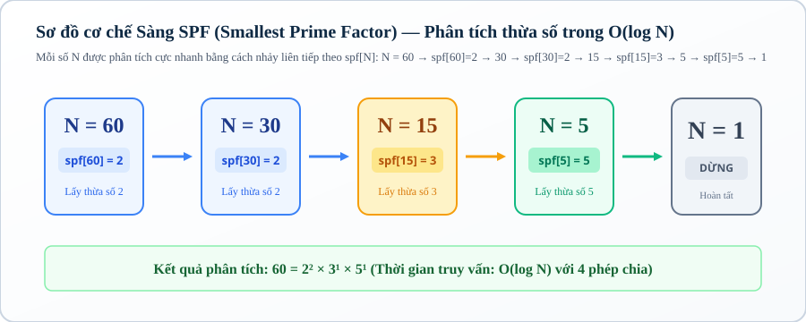
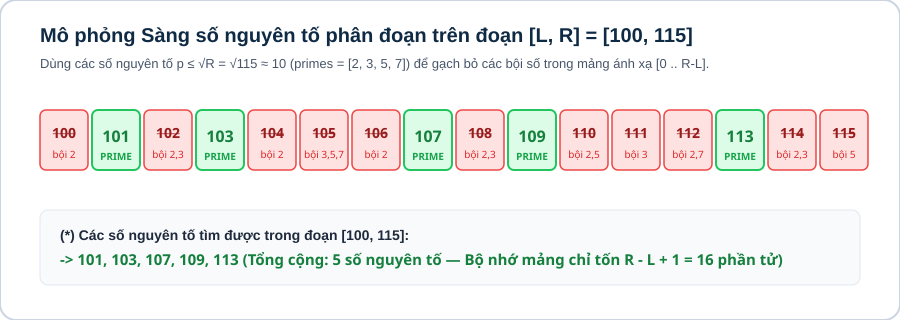

# Bài 01: Số học cơ bản & chuyên sâu

## 1. Khái niệm & bản chất của tối ưu số học trong lập trình thi đấu

Số học trong lập trình thi đấu (Competitive Programming) không đơn thuần là các phép toán số học cơ bản, mà là nghệ thuật khai thác **các cấu trúc đại số và tính chất chia hết** để giảm độ phức tạp tính toán từ hàm mũ $\mathcal{O}(2^N)$ hoặc đa thức $\mathcal{O}(N)$ xuống thời gian logarit $\mathcal{O}(\log N)$ hoặc $\mathcal{O}(1)$.

Ở Level 2, ta không dừng lại ở việc kiểm tra nguyên tố hay tìm ước số đơn lẻ, mà tập trung vào **Tái kết hợp & Xử lý đa truy vấn với khối lượng dữ liệu cực lớn**:
* **Khai thác thuật toán Euclid:** Rút gọn không gian bài toán, tìm ước chung lớn nhất $\gcd(A, B)$ trong $\mathcal{O}(\log(\min(A, B)))$ và giải phương trình Diophantine nghiệm nguyên qua thuật toán Euclid mở rộng.
* **Sàng ước số nguyên tố nhỏ nhất (SPF):** Tiền xử lý $\mathcal{O}(MAX \log \log MAX)$ để phân tích hàng triệu số thành thừa số nguyên tố với tốc độ $\mathcal{O}(\log N)$ mỗi số.
* **Sàng nguyên tố phân đoạn (Segmented Sieve):** Vượt qua ranh giới bộ nhớ RAM để tìm chính xác mọi số nguyên tố trong đoạn $[L, R]$ với $R \le 10^{12}$ và $R - L \le 10^6$.

---

## 2. Thuật toán Euclid & Bản chất toán học của GCD / LCM

### 2.1. Định lý Euclid & Tính chất bất biến (Invariant)

> **Định lý:** Với mọi cặp số nguyên không âm $A, B$ ($B \ne 0$), ước chung lớn nhất của chúng luôn thỏa mãn:
$$\gcd(A, B) = \gcd(B, A \bmod B)$$
$$\gcd(A, 0) = A$$

Mỗi bước lấy dư $A \bmod B$ thực chất là loại bỏ tất cả các bội số của $B$ ra khỏi $A$, giữ lại phần dư $R < B$. Khi số dư bằng $0$, số chia cuối cùng chính là $\gcd(A, B)$.

#### Ví dụ minh họa 1: Tìm $\gcd(105, 45)$
1. $\gcd(105, 45) = \gcd(45, 105 \bmod 45) = \gcd(45, 15)$
2. $\gcd(45, 15) = \gcd(15, 45 \bmod 15) = \gcd(15, 0) = \mathbf{15}$

| Bước $k$ | Số Bị Chia $A$ | Số Chia $B$ | Phép Chia Lấy Dư $A \bmod B$ | Trạng Thái $(A_{next}, B_{next})$ |
|:---:|:---:|:---:|:---:|:---:|
| 1 | 105 | 45 | $105 \bmod 45 = 15$ | $(45, 15)$ |
| 2 | 45 | 15 | $45 \bmod 15 = 0$ | $(15, 0)$ |
| **Kết quả** | **15** | **0** | **Dừng (B = 0)** | **$\gcd = 15$** |

### 2.2. Mẫu cài đặt C++ chuẩn thi đấu (Không đệ quy)

```cpp
long long gcd_calc(long long a, long long b) {
    while (b != 0) {
        long long r = a % b;
        a = b;
        b = r;
    }
    return a;
}
```

> **Phạm vi áp dụng:** Mẫu `gcd_calc` ở trên nhận các số không âm. Nếu dữ liệu có thể chứa số âm, hãy chuẩn hóa bằng `abs` trước khi gọi; GCD được quy ước là số không âm.

### 2.3. Bẫy lỗi tràn số khi tính Bội chung nhỏ nhất ($\text{lcm}$)

Công thức toán học: $\text{lcm}(A, B) = \frac{A \times B}{\gcd(A, B)}$.

> **Cảnh báo bẫy lỗi: BẪY TRÀN TÍCH `A * B` TRONG PHÉP TÍNH LCM**

> Nếu viết `return (a * b) / gcd(a, b);`, khi $A, B \approx 10^{10}$, tích $A \times B \approx 10^{20}$ sẽ vượt quá giới hạn $9.22 \times 10^{18}$ của kiểu `long long` $\implies$ **TRÀN SỐ ÂM / KẾT QUẢ SAI HOÀN TOÀN**.

> **Quy tắc an toàn tuyệt đối:** Luôn chia trước khi nhân vì $A$ luôn chia hết cho $\gcd(A, B)$:
> ```cpp
> long long lcm_calc(long long a, long long b) {
>     if (a == 0 || b == 0) return 0;
>     return (a / gcd_calc(a, b)) * b;
> }
> ```

---



## 3. Sàng ước số nguyên tố nhỏ nhất (SPF — Smallest Prime Factor)

### 3.1. Động lực: Xử lý $10^5$ truy vấn phân tích thừa số nguyên tố

Trong các kỳ thi HSG, ta thường gặp bài toán: Cho $Q = 10^5$ truy vấn, mỗi truy vấn cho một số $N \le 10^6$, yêu cầu phân tích $N$ thành thừa số nguyên tố.
* **Cách ngây thơ $\mathcal{O}(\sqrt{N})$:** Mỗi truy vấn thử chia đến $\sqrt{N} \implies \text{Tổng thời gian } \mathcal{O}(Q \sqrt{N}) \approx 10^5 \times 10^3 = 10^8 \text{ phép tính} \implies$ **Nguy cơ TLE**.
* **Kỹ thuật Sàng SPF:** Tiền xử lý 1 lần mảng `spf[x]` lưu ước số nguyên tố nhỏ nhất của $x$ trong $\mathcal{O}(MAX \log \log MAX)$. Khi có truy vấn $N$, ta chỉ việc nhảy liên tiếp theo `spf[N]` $\implies$ **Mỗi truy vấn chỉ mất $\mathcal{O}(\log N)$ bước!**

### 3.2. Bảng mô phỏng phân tích số $N = 84$ bằng SPF

* `spf[84] = 2` $\implies 84 / 2 = 42$
* `spf[42] = 2` $\implies 42 / 2 = 21$
* `spf[21] = 3` $\implies 21 / 3 = 7$
* `spf[7] = 7` $\implies 7 / 7 = 1$ (Dừng)
$$\implies 84 = 2^2 \times 3^1 \times 7^1 \quad (\text{Chỉ mất đúng 4 bước chia!})$$

| Bước $k$ | Giá Trị $N$ Hiện Tại | `spf[N]` (Ước NT nhỏ nhất) | $N_{next} = N / \text{spf}[N]$ | Thừa Số Thu Được |
|:---:|:---:|:---:|:---:|:---:|
| 1 | 84 | 2 | 42 | $2$ |
| 2 | 42 | 2 | 21 | $2$ |
| 3 | 21 | 3 | 7 | $3$ |
| 4 | 7 | 7 | 1 | $7$ |

### 3.3. Cài đặt C++ Sàng SPF & Phân tích thừa số tối ưu

```cpp
const int MAXN = 1000000;
int spf[MAXN + 1];

void sieve_spf() {
    for (int i = 1; i <= MAXN; ++i) spf[i] = i;
    for (int i = 2; i * i <= MAXN; ++i) {
        if (spf[i] == i) { // i là số nguyên tố
            for (int j = i * i; j <= MAXN; j += i) {
                if (spf[j] == j) spf[j] = i; // Gán ước NT nhỏ nhất đầu tiên chạm tới
            }
        }
    }
}

// Phân tích n thành vector 2 chiều: mỗi phần tử gồm [thừa_số_nguyên_tố, số_mũ]
vector<vector<long long>> factorize_spf(int n) {
    vector<vector<long long>> factors;
    while (n > 1) {
        long long p = spf[n];
        long long count = 0;
        while (n % p == 0) {
            count++;
            n /= p;
        }
        factors.push_back({p, count});
    }
    return factors;
}
```

---



## 4. Sàng nguyên tố phân đoạn (Segmented Sieve

### 4.1. Bản chất & Ranh giới bộ nhớ

Khi bài toán yêu cầu tìm/đếm các số nguyên tố trong đoạn $[L, R]$ với:
$$1 \le L \le R \le 10^{12} \quad \text{và} \quad R - L \le 10^6$$
* **Tại sao không thể tạo mảng `bool is_prime[10^12]`?** $\implies$ Vì $10^{12}$ byte $\approx 1000\text{GB}$ RAM, vượt giới hạn $256\text{MB}$ của đề bài.
* **Định lý toán học:** Mọi hợp số $X \in [L, R]$ đều có ít nhất một ước nguyên tố $p \le \sqrt{R} \le 10^6$.

### 4.2. Thuật toán Sàng đoạn 3 bước

1. **Bước 1:** Dùng sàng Eratosthenes chuẩn tìm tất cả số nguyên tố $p \le \sqrt{R} \le 10^6$.
2. **Bước 2:** Cấp phát mảng đánh dấu `vector<bool> is_prime_range(R - L + 1, true)`. Số $X \in [L, R]$ được ánh xạ về chỉ số `X - L` trong mảng ($0 \le X - L \le 10^6$). `vector<bool>` thường nén mỗi cờ theo bit, nên với $10^6$ vị trí phần đánh dấu chỉ khoảng $10^6$ bit $\approx 0.125$ MB; bộ nhớ thực tế phụ thuộc kiểu lưu trữ và overhead của container.
3. **Bước 3:** Với mỗi số nguyên tố $p \le \sqrt{R}$, tìm bội số nhỏ nhất của $p$ mà $\ge L$:
$$\text{start} = \max\left(p \times p, \left\lceil \frac{L}{p} \right\rceil \times p\right) = \max\left(p \times p, \left\lfloor \frac{L + p - 1}{p} \right\rfloor \times p\right)$$
Gạch bỏ tất cả các bội số $\text{start}, \text{start} + p, \text{start} + 2p, \dots \le R$.

### 4.3. Cài đặt C++ Sàng đoạn

```cpp
vector<long long> segmented_sieve(long long L, long long R) {
    long long limit = sqrt(R);
    vector<bool> mark(limit + 1, true);
    vector<long long> primes;
    for (long long p = 2; p <= limit; ++p) {
        if (mark[p]) {
            primes.push_back(p);
            for (long long j = p * p; j <= limit; j += p) mark[j] = false;
        }
    }

    vector<bool> is_prime_range(R - L + 1, true);
    for (long long p : primes) {
        long long start = max(p * p, ((L + p - 1) / p) * p);
        for (long long j = start; j <= R; j += p) {
            is_prime_range[j - L] = false;
        }
    }

    if (L == 1) is_prime_range[0] = false; // Bắt buộc: Số 1 không phải là số nguyên tố

    vector<long long> result;
    for (long long i = 0; i <= R - L; ++i) {
        if (is_prime_range[i]) {
            result.push_back(L + i);
        }
    }
    return result;
}
```

---

## 5. Thuật toán Euclid mở rộng & Phương trình Diophantine

### 5.1. Định lý Bézout & Nghiệm nguyên

> **Định lý Bézout:** Với hai số nguyên $A, B$, luôn tồn tại hai số nguyên $x, y$ sao cho:
$$A \cdot x + B \cdot y = \gcd(A, B)$$

Phương trình Diophantine tuyến tính $A \cdot x + B \cdot y = C$ có nghiệm nguyên khi và chỉ khi $C$ chia hết cho $\gcd(A, B)$.

### 5.2. Công thức hồi quy nghiệm `extgcd`

Giả sử đệ quy tìm được $(x_1, y_1)$ thỏa mãn: $B \cdot x_1 + (A \bmod B) \cdot y_1 = g$.  
Vì $A \bmod B = A - \lfloor A/B \rfloor \cdot B$, ta có công thức hồi quy nghiệm $(x, y)$:
$$\begin{cases} x = y_1 \\ y = x_1 - \lfloor A / B \rfloor \cdot y_1 \end{cases}$$

```cpp
long long extgcd_nonnegative(long long a, long long b, long long &x, long long &y) {
    if (b == 0) {
        x = 1;
        y = 0;
        return a;
    }
    long long x1, y1;
    long long g = extgcd_nonnegative(b, a % b, x1, y1);
    x = y1;
    y = x1 - (a / b) * y1;
    return g;
}

long long extgcd(long long a, long long b, long long &x, long long &y) {
    long long sa = (a < 0 ? -1 : 1);
    long long sb = (b < 0 ? -1 : 1);
    long long aa = (a < 0 ? -a : a);
    long long bb = (b < 0 ? -b : b);
    long long g = extgcd_nonnegative(aa, bb, x, y);
    x *= sa;
    y *= sb;
    return g;
}
```

Hàm `extgcd_nonnegative` xử lý phần đệ quy trên số không âm; hàm `extgcd` bên ngoài khôi phục dấu của $A, B$. Vì vậy phương trình $A x + B y = C$ có thể nhận $A, B$ âm, sau khi xử lý riêng trường hợp $A = B = 0$.

---

## 6. Mẫu cài đặt chuẩn thi đấu (Competitive Template)

```cpp
#include <bits/stdc++.h>
using namespace std;

// Sàng SPF tiền xử lý
const int MAXN = 1000000;
int spf[MAXN + 1];

void init_spf() {
    for (int i = 1; i <= MAXN; ++i) spf[i] = i;
    for (int i = 2; i * i <= MAXN; ++i) {
        if (spf[i] == i) {
            for (int j = i * i; j <= MAXN; j += i) {
                if (spf[j] == j) spf[j] = i;
            }
        }
    }
}

int main() {
    // Fast I/O
    ios::sync_with_stdio(false);
    cin.tie(nullptr);

    init_spf();

    int q;
    if (!(cin >> q)) return 0;

    while (q--) {
        int n;
        cin >> n;
        // Phân tích n trong O(log N)
        while (n > 1) {
            int p = spf[n];
            int cnt = 0;
            while (n % p == 0) {
                cnt++;
                n /= p;
            }
            cout << p << "^" << cnt << " ";
        }
        cout << "\n";
    }
    return 0;
}
```

---

## 7. Ranh giới áp dụng: Khi nào dùng SPF vs Sàng đoạn vs Phân tích $\mathcal{O}(\sqrt{N})$?

| Phương Pháp | Phạm Vi Dữ Liệu | Số Lượng Truy Vấn | Bộ Nhớ RAM | Khi Nào Sử Dụng? |
|---|---|---|:---:|---|
| **Thử chia $\mathcal{O}(\sqrt{N})$** | $N \le 10^{14}$ | $Q \le 10^3$ (Ít truy vấn) | $\mathcal{O}(1)$ | Số lớn, ít truy vấn độc lập |
| **Sàng SPF $\mathcal{O}(\log N)$** | $N \le 10^6$ | $Q \le 10^6$ (Rất nhiều truy vấn) | Khoảng $4\text{MB}$ với `int` | Số vừa phải, truy vấn liên tục |
| **Sàng đoạn $[L, R]$** | $R \le 10^{12}, R - L \le 10^6$ | $1$ truy vấn đoạn lớn | Khoảng $0.125\text{MB}$ cho $10^6$ bit với `vector<bool>` | Cần đếm/tìm số nguyên tố trên dải số lớn |

> **Ghi chú bộ nhớ:** Đây chỉ là phần mảng đánh dấu. Nếu dùng `bool`, `char` hoặc container khác thay cho `vector<bool>`, bộ nhớ sẽ lớn hơn; cần tính theo kiểu dữ liệu thực tế.

---

## Visual Assets / Hình ảnh trực quan

Các hình dưới đây là kế hoạch minh họa cho bản phát hành; trạng thái hiện tại là `TBD`.

| Asset | Mục đích minh họa | Nội dung chính | Vị trí đặt trong Lesson | Trạng thái |
|---|---|---|---|---|
| Sơ đồ thuật toán Euclid | Làm rõ quá trình giảm cặp $(A,B)$ | $(A,B) \to (B,A \bmod B)$ | Sau mục 2.1 | `TBD` |
| Bảng mô phỏng SPF với $N=84$ | Cho thấy mỗi lần chia theo ước nguyên tố nhỏ nhất | $84\to42\to21\to7\to1$ | Sau mục 3.2 | `TBD` |
| Sơ đồ ba bước Segmented Sieve | Phân biệt sàng cơ sở và sàng trên đoạn lớn | Sinh prime cơ sở → ánh xạ đoạn → gạch bội | Sau mục 4.2 | `TBD` |
| Sơ đồ truy hồi Extended Euclid | Theo dõi hệ số Bézout qua các lần quay lui | $(x_1,y_1)\to(x,y)$ | Sau mục 5.2 | `TBD` |
| Sơ đồ chọn công cụ | Giúp chọn đúng thuật toán theo giới hạn | SPF / sàng đoạn / thử chia | Trước mục 7 | `TBD` |

## Câu hỏi trắc nghiệm củng cố khái niệm

#### Câu 1 (Độ phức tạp — Complexity):
Cho hai số nguyên $A, B \le 10^{18}$. Độ phức tạp thời gian trong trường hợp xấu nhất của thuật toán Euclid tìm $\gcd(A, B)$ là:
- **A.** $\mathcal{O}(\sqrt{\min(A, B)})$
- **B.** **[Đáp án đúng]** $\mathcal{O}(\log(\min(A, B)))$
- **C.** $\mathcal{O}(\min(A, B))$
- **D.** $\mathcal{O}(1)$

> *Giải thích:* Trong trường hợp xấu nhất (hai số Fibonacci liên tiếp), mỗi 2 bước chia dư giá trị của phần dư sẽ giảm đi ít nhất một nửa, do đó số bước thực hiện luôn tỷ lệ thuận với $\log(\min(A, B))$.

#### Câu 2 (Bẫy tràn số — Overflow):
Cách tính $\text{lcm}(A, B)$ nào sau đây an toàn nhất khi $A, B \le 10^{10}$ và $\text{lcm}(A, B) \le 10^{18}$?
- **A.** `return (a * b) / gcd(a, b);`
- **B.** **[Đáp án đúng]** `return (a / gcd(a, b)) * b;`
- **C.** `return a * b;`
- **D.** `return (a * b) % gcd(a, b);`

> *Giải thích:* Thực hiện phép chia trước `(a / gcd) * b` giúp giá trị trung gian không vượt quá $\text{lcm}(A, B)$, tránh bị tràn số 64-bit (`long long`).

#### Câu 3 (Bản chất SPF — Structure):
Trong thuật toán Sàng SPF, giá trị `spf[x]` lưu trữ điều gì?
- **A.** Ước số nguyên tố lớn nhất của $x$.
- **B.** **[Đáp án đúng]** Ước số nguyên tố nhỏ nhất của $x$.
- **C.** Số lượng ước của $x$.
- **D.** Tổng các ước số của $x$.

> *Giải thích:* `spf[x]` là viết tắt của *Smallest Prime Factor* (ước số nguyên tố nhỏ nhất).

#### Câu 4 (Hiệu năng truy vấn — Performance):
Sau khi tiền xử lý mảng SPF cho các số đến $10^6$, thao tác phân tích một số $N \le 10^6$ thành thừa số nguyên tố mất độ phức tạp bao nhiêu?
- **A.** $\mathcal{O}(\sqrt{N})$
- **B.** **[Đáp án đúng]** $\mathcal{O}(\log N)$
- **C.** $\mathcal{O}(1)$
- **D.** $\mathcal{O}(N)$

> *Giải thích:* Mỗi bước nhảy chia $N$ cho `spf[N]` $\ge 2$, nên số bước chia tối đa không bao giờ vượt quá $\lfloor \log_2 N \rfloor \le 20$.

#### Câu 5 (Bộ nhớ Sàng đoạn — Memory):
Khi cần tìm các số nguyên tố trong đoạn $[L, R]$ với $L = 10^{11}$ và $R = 10^{11} + 10^6$, kích thước mảng đánh dấu `is_prime` cần cấp phát là:
- **A.** $10^{11}$ phần tử
- **B.** $10^{12}$ phần tử
- **C.** **[Đáp án đúng]** $R - L + 1 = 10^6 + 1$ phần tử
- **D.** $\sqrt{R} \approx 316227$ phần tử

> *Giải thích:* Thuật toán Sàng đoạn ánh xạ số $X \in [L, R]$ về vị trí `X - L` trong mảng, nên chỉ cần mảng $R - L + 1$ phần tử. Với `vector<bool>`, $10^6$ vị trí tương đương khoảng $10^6$ bit ($\approx 0.125\text{MB}$); kiểu lưu trữ khác có thể dùng nhiều bộ nhớ hơn.

#### Câu 6 (Phạm vi nguyên tố cơ sở — Range):
Để thực hiện Sàng đoạn trên $[L, R]$ với $R \le 10^{12}$, ta cần chuẩn bị danh sách các số nguyên tố cơ sở đến tối đa bao nhiêu?
- **A.** $R / 2$
- **B.** **[Đáp án đúng]** $\sqrt{R} \le 10^6$
- **C.** $R - L$
- **D.** $\sqrt[3]{R} \le 10^4$

> *Giải thích:* Mọi hợp số $\le R$ luôn có ít nhất một ước số nguyên tố $\le \sqrt{R} \le 10^6$.

#### Câu 7 (Bẫy trường hợp biên — Boundary):
Trong thuật toán Sàng đoạn, nếu $L = 1$ thì cần xử lý đặc biệt như thế nào?
- **A.** Bỏ qua số 2.
- **B.** **[Đáp án đúng]** Gán `is_prime_range[0] = false` vì số 1 không phải là số nguyên tố.
- **C.** Chạy vòng lặp từ $p = 1$.
- **D.** Tăng $R$ thêm 1 đơn vị.

> *Giải thích:* Vòng lặp sàng chỉ gạch bội số của $p \ge 2$, do đó số 1 sẽ không bị gạch nếu không xử lý gán `false` thủ công.

#### Câu 8 (Định lý Bézout — Diophantine):
Phương trình $A \cdot x + B \cdot y = C$ có nghiệm nguyên $(x, y)$ khi và chỉ khi:
- **A.** $\gcd(A, B) = 1$
- **B.** **[Đáp án đúng]** $C$ chia hết cho $\gcd(A, B)$
- **C.** $A + B = C$
- **D.** $A \times B \ge C$

> *Giải thích:* Theo định lý Bézout, mọi tổ hợp tuyến tính $Ax + By$ đều là bội số của $\gcd(A, B)$.

#### Câu 9 (Công thức hồi quy extgcd — Algorithm):
Nếu $(x_1, y_1)$ là nghiệm của $B \cdot x_1 + (A \bmod B) \cdot y_1 = g$, thì nghiệm $(x, y)$ của $A \cdot x + B \cdot y = g$ là:
- **A.** $x = x_1, y = y_1$
- **B.** **[Đáp án đúng]** $x = y_1, y = x_1 - \lfloor A / B \rfloor \cdot y_1$
- **C.** $x = x_1 - \lfloor A / B \rfloor \cdot y_1, y = y_1$
- **D.** $x = y_1, y = x_1 + \lfloor A / B \rfloor \cdot y_1$

> *Giải thích:* Biến đổi từ $A \bmod B = A - \lfloor A/B \rfloor \cdot B$ vào phương trình.

#### Câu 10 (Xử lý nghiệm âm — Modulo):
Khi giải $A \cdot x + B \cdot y = 1$ với modulo $M = 26$, nếu $x = -17$, giá trị nghiệm $x \in [0, M - 1]$ tương đương là:
- **A.** 17
- **B.** **[Đáp án đúng]** 9
- **C.** -9
- **D.** 8

> *Giải thích:* $(x \bmod M + M) \bmod M = (-17 \bmod 26 + 26) \bmod 26 = 9$.

#### Câu 11 (Số lượng ước số — Divisor Count):
Nếu $N = p_1^{a_1} \cdot p_2^{a_2} \cdots p_k^{a_k}$, tổng số lượng ước số của $N$ là:
- **A.** $a_1 \cdot a_2 \cdots a_k$
- **B.** **[Đáp án đúng]** $(a_1 + 1)(a_2 + 1) \cdots (a_k + 1)$
- **C.** $p_1 \cdot p_2 \cdots p_k$
- **D.** $a_1 + a_2 + \dots + a_k$

> *Giải thích:* Mỗi thừa số $p_i$ có $a_i + 1$ cách chọn số mũ từ $0$ đến $a_i$.

#### Câu 12 (Tính chất số chính phương — Square):
Một số nguyên dương $N$ là số chính phương khi và chỉ khi:
- **A.** **[Đáp án đúng]** Mọi số mũ $a_i$ trong phân tích thừa số nguyên tố của $N$ đều là số chẵn.
- **B.** Tổng các ước số là số lẻ.
- **C.** Tất cả các thừa số nguyên tố đều là số lẻ.
- **D.** Số lượng ước số là số chẵn.

> *Giải thích:* $N = K^2 = (p_1^{b_1} \dots p_k^{b_k})^2 = p_1^{2b_1} \dots p_k^{2b_k}$, do đó mọi số mũ đều có dạng $2b_i$ (số chẵn).

---

## Ma trận bài tập thực hành (P0 → P5)

| STT | Mã Bài | Tên Bài Toán | Cấp Độ | Ràng Buộc Dữ Liệu | Mục Tiêu Rèn Luyện |
|:---:|:---:|---|:---:|---|---|
| 01 | `CPPB2-L01-01` | **Ước Chung & Bội Chung Cơ Bản** | `P0` | $T \le 10^5, A, B \le 10^9$ | Cài đặt Euclid $\gcd$ và $\text{lcm}$ chống tràn số |
| 02 | `CPPB2-L01-02` | **Rút Gọn Mảng Phân Số Lớn** | `P0` | $N \le 10^5, \vert A_i \vert \le 10^9$ | Ứng dụng $\gcd$ tối giản phân số |
| 03 | `CPPB2-L01-03` | **Sàng Ước Số Nguyên Tố Nhỏ Nhất** | `P1` | $Q \le 10^6, x \le 10^6$ | Cài đặt mảng `spf[x]` tiền xử lý |
| 04 | `CPPB2-L01-04` | **Phân Tích Thừa Số Truy Vấn Nhanh** | `P1` | $Q \le 10^5, N \le 10^6$ | Phân tích thừa số nguyên tố $\mathcal{O}(\log N)$ |
| 05 | `CPPB2-L01-05` | **Đếm Ước Số & Tổng Ước Số Nhanh** | `P2` | $Q \le 10^5, N \le 10^6$ | Áp dụng công thức số lượng và tổng ước qua SPF |
| 06 | `CPPB2-L01-06` | **Sàng Nguyên Tố Đoạn $[L, R]$** | `P2` | $R \le 10^{12}, R - L \le 10^6$ | Cài đặt Segmented Sieve dải lớn |
| 07 | `CPPB2-L01-07` | **Cặp Số Nguyên Tố Sinh Đôi Trong Đoạn** | `P2` | $R \le 10^{12}, R - L \le 10^6$ | Tìm cặp $(p, p+2)$ nguyên tố trên dải lớn |
| 08 | `CPPB2-L01-08` | **Tìm Nghiệm Nguyên Phương Trình Diophantine** | `P3` | $\vert A \vert, \vert B \vert, \vert C \vert \le 10^9$ | Thuật toán Euclid mở rộng `extgcd` |
| 09 | `CPPB2-L01-09` | **Nghiệm Nguyên Dương Nhỏ Nhất** | `P3` | $A, B, C \le 10^9$ | Biến đổi họ nghiệm Diophantine tìm $x > 0$ min |
| 10 | `CPPB2-L01-10` | **Hàm Phi Euler $\phi(N)$ Nhanh Với SPF** | `P3` | $Q \le 10^5, N \le 10^6$ | Đếm số nguyên tố cùng nhau qua SPF |
| 11 | `CPPB2-L01-11` | **Phân Tích Giai Thừa $N!$ (Legendre)** | `P4` | $N \le 10^7$, $p$ là số nguyên tố và $p \le N$ | Công thức Legendre đếm số mũ của $p$ trong $N!$ |
| 12 | `CPPB2-L01-12` | **Số Ước Số Lẻ & Số Chính Phương** | `P4` | $A, B \le 10^{14}$ | Đếm số chính phương trong đoạn $[A, B]$ |
| 13 | `CPPB2-L01-13` | **Cặp Số Có GCD và LCM Cho Trước** | `P4` | $G, L \le 10^{12}$ | Đếm cặp $(A, B)$ thỏa $\gcd=G, \text{lcm}=L$ |
| 14 | `CPPB2-L01-14` | **Khoảng Cách Cực Đại Giữa Hai Số Nguyên Tố** | `P5` | $R \le 10^{12}, R - L \le 10^6$ | Segmented Sieve kết hợp quét cực trị |
| 15 | `CPPB2-L01-15` | **Phương Trình Đổi Tiền Xu Diophantine** | `P5` | $A, B, S \le 10^9$ | Tối ưu hóa số tờ tiền qua họ nghiệm Diophantine |
| 16 | `CPPB2-L01-16` | **Tổng $\gcd(i, N)$ Với $1 \le i \le N$** | `P5` | $N \le 10^{12}$ | Công thức $S(N) = \sum_{d \vert N} d \cdot \phi(N/d)$ |
