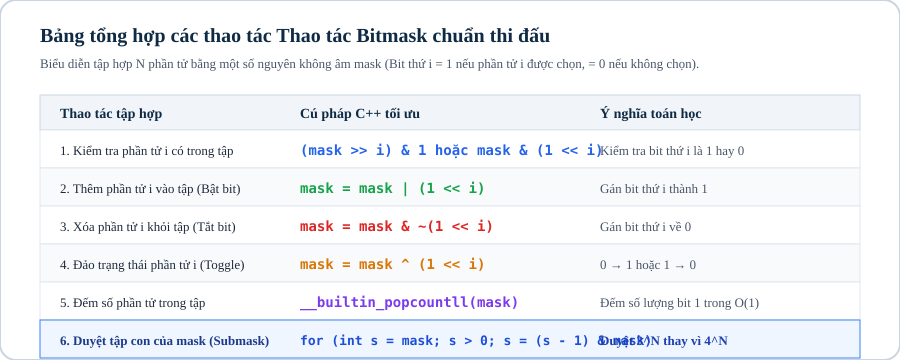

# Chuyên đề 06: Phép toán bit & mặt nạ bit nâng cao

## 1. Khái niệm & bản chất của tối ưu hóa cấp độ bit (Bit Manipulation)

Trong kiến trúc máy tính hiện đại, các phép toán trên bit (`AND`, `OR`, `XOR`, `NOT`, dịch bit `<<`, `>>`) được CPU xử lý trực tiếp ở mức phần cứng trong đúng $1$ chu kỳ xung nhịp (clock cycle).

Ở Level 2, phép toán bit được nâng cấp thành **Mặt nạ bit (Bitmask)** để biểu diễn trạng thái của một tập hợp con:
* Một số nguyên $M$ có thể đại diện cho một tập con của $N$ phần tử: bit thứ $i$ bật ($= 1$) nghĩa là phần tử thứ $i$ được chọn, bit thứ $i$ tắt ($= 0$) nghĩa là phần tử thứ $i$ không được chọn.
* **Duyệt toàn bộ $2^N$ tập con:** Dùng vòng lặp `for (int mask = 0; mask < (1 << N); ++mask)`.
* **Duyệt toàn bộ tập con của một mặt nạ bit (Submask Iteration):** Duyệt tất cả submask của `mask` trong tổng thời gian $\mathcal{O}(3^N)$ thay vì $\mathcal{O}(4^N)$ bằng thủ thuật `sub = (sub - 1) & mask`.
* **Quy hoạch động trên mặt nạ bit (Bitmask DP):** Giải các bài toán tối ưu trên tập hợp nhỏ ($N \le 20$) như bài toán Người du lịch (Traveling Salesperson Problem - TSP), ghép cặp hoàn hảo (Matching).

---



## 2. Bảng tổng hợp các thủ thuật Bitwise

| Thao Tác Toán Học | Biểu Thức C++ Chuẩn | Ý Nghĩa / Mục Đích |
|---|---|---|
| **Bật bit thứ $k$** | `mask \| (1 << k)` | Thêm phần tử $k$ vào tập hợp |
| **Tắt bit thứ $k$** | `mask & ~(1 << k)` | Loại bỏ phần tử $k$ khỏi tập hợp |
| **Đảo bit thứ $k$** | `mask ^ (1 << k)` | Chuyển đổi trạng thái có/không của $k$ |
| **Kiểm tra bit thứ $k$** | `(mask >> k) & 1` | Trả về 1 nếu $k$ thuộc tập, 0 nếu không |
| **Lấy bit 1 thấp nhất (LSB)** | `mask & (-mask)` | Trích xuất bit 1 nhỏ nhất (cực kỳ hữu ích trong Fenwick Tree) |
| **Tắt bit 1 thấp nhất** | `mask & (mask - 1)` | Xóa bit 1 nhỏ nhất (dùng đếm số bit 1 của Brian Kernighan) |
| **Đếm số bit 1 (Popcount)** | `__builtin_popcount(mask)` | Số lượng phần tử trong tập hợp |
| **Đếm số bit 0 ở đuôi** | `__builtin_ctz(mask)` | Vị trí của bit 1 thấp nhất |

---

## 3. Kỹ thuật duyệt Submask tối ưu $\mathcal{O}(3^N)$

Để duyệt tất cả các tập con $sub$ của một tập $mask$:
```cpp
for (int mask = 0; mask < (1 << n); ++mask) {
    for (int sub = mask; sub > 0; sub = (sub - 1) & mask) {
        // Xử lý submask 'sub' của 'mask'
    }
}
```

> **Chứng minh độ phức tạp:** Tổng số cặp $(mask, sub)$ là $\sum_{k=0}^N \binom{N}{k} 2^k = (1 + 2)^N = 3^N$. Với $N = 15$, $3^{15} \approx 1.4 \times 10^7$ phép tính (chạy trong $< 0.05\text{s}$).

---

## 4. Mẫu cài đặt chuẩn thi đấu: TSP với Bitmask DP

Bài toán Người du lịch: Tìm đường đi ngắn nhất thăm tất cả $N$ thành phố ($N \le 18$) xuất phát từ đỉnh 0.

```cpp
#include <bits/stdc++.h>
using namespace std;

const int INF = 1e9;
int n;
int dist_mat[20][20];
int dp[1 << 18][18]; // dp[mask][u]: Chi phí nhỏ nhất đi qua tập các đỉnh trong 'mask' và kết thúc tại u

int tsp(int mask, int u) {
    if (mask == (1 << n) - 1) return dist_mat[u][0]; // Quay về đỉnh 0
    if (dp[mask][u] != -1) return dp[mask][u];

    int ans = INF;
    for (int v = 0; v < n; ++v) {
        if (!((mask >> v) & 1)) { // Nếu đỉnh v chưa thăm
            ans = min(ans, dist_mat[u][v] + tsp(mask | (1 << v), v));
        }
    }
    return dp[mask][u] = ans;
}

int main() {
    ios::sync_with_stdio(false);
    cin.tie(nullptr);

    if (!(cin >> n)) return 0;
    for (int i = 0; i < n; ++i) {
        for (int j = 0; j < n; ++j) cin >> dist_mat[i][j];
    }

    memset(dp, -1, sizeof(dp));
    cout << tsp(1, 0) << "\n"; // Bắt đầu tại đỉnh 0 với mask = 1 (chỉ mới thăm đỉnh 0)
    return 0;
}
```

---

## 5. Ranh giới áp dụng

| Phạm Vi $N$ | Kỹ Thuật Tối Ưu | Độ Phức Tạp |
|---|---|:---:|
| $N \le 20$ | Bitmask DP / Quy hoạch động trạng thái | $\mathcal{O}(2^N \times N^2)$ hoặc $\mathcal{O}(3^N)$ |
| $N \le 30$ | Meet in the Middle / Phân đôi tập hợp | $\mathcal{O}(2^{N/2})$ |
| $N \le 10^5$ | Greedy / Tree DP / Khử bit trực tiếp | $\mathcal{O}(N \log N)$ |

---

## Câu hỏi trắc nghiệm củng cố khái niệm

#### Câu 1 (Hàm có sẵn — Builtin):
Hàm nào trong C++ dùng để đếm số lượng bit 1 của một số nguyên 64-bit `long long`?
- **A.** `__builtin_popcount(x)`
- **B.** **[Đáp án đúng]** `__builtin_popcountll(x)`
- **C.** `__builtin_clz(x)`
- **D.** `count_bits(x)`

> *Giải thích:* Hậu tố `ll` (long long) giúp hàm đọc đủ 64-bit thay vì chỉ 32-bit của `__builtin_popcount`.

#### Câu 2 (Duyệt Submask — Complexity):
Thuật toán `for (int sub = mask; sub > 0; sub = (sub - 1) & mask)` có tổng số bước lặp trên mọi `mask` từ $0$ đến $2^N - 1$ là:
- **A.** $\mathcal{O}(4^N)$
- **B.** **[Đáp án đúng]** $\mathcal{O}(3^N)$
- **C.** $\mathcal{O}(2^N)$
- **D.** $\mathcal{O}(N^3)$

> *Giải thích:* Theo khai triển nhị thức Newton $\sum \binom{N}{k} 2^k = (1+2)^N = 3^N$.

---

## Ma trận bài tập thực hành (P0 → P5)

| STT | Mã Bài | Tên Bài Toán | Cấp Độ | Ràng Buộc Dữ Liệu | Mục Tiêu Rèn Luyện |
|:---:|:---:|---|:---:|---|---|
| 01 | `CPPB2-L06-01` | **Duyệt Tập Con Sinh Tổ Hợp Bằng Bitmask** | `P0` | $N \le 20$ | Duyệt $2^N$ với `1 << N` |
| 02 | `CPPB2-L06-02` | **Đếm Số Phần Tử Bật Bit Chung (Bitwise AND)** | `P0` | $N \le 10^5, A_i \le 10^9$ | Đếm bit độc lập theo từng cột $0 \dots 30$ |
| 03 | `CPPB2-L06-03` | **Tìm Hai Phần Tử Đơn Lẻ Bằng XOR** | `P1` | $N \le 10^5, A_i \le 10^9$ | Tách nhóm bằng bit phân biệt $XOR \& (-XOR)$ |
| 04 | `CPPB2-L06-04` | **Bài Toán Người Du Lịch (TSP Bitmask DP)** | `P1` | $N \le 18$ | DP trạng thái $dp[mask][u]$ |
| 05 | `CPPB2-L06-05` | **Phân Chia Công Việc Hoàn Hảo (Job Assignment)** | `P2` | $N \le 20$ | Bitmask DP ghép cặp trọng số nhỏ nhất |
| 06 | `CPPB2-L06-06` | **Duyệt Tất Cả Submask Tính Tổng Phân Hoạch** | `P2` | $N \le 15$ | Vòng lặp `sub = (sub - 1) & mask` $\mathcal{O}(3^N)$ |
| 07 | `CPPB2-L06-07` | **Đường Đi Hamilton Đếm Số Cách** | `P2` | $N \le 19$, đồ thị có hướng | DP Bitmask đếm số đường đi qua mọi đỉnh |
| 08 | `CPPB2-L06-08` | **Tối Đa Hóa Giá Trị XOR Đoạn Con Bằng Trie Bit** | `P3` | $N \le 10^5, A_i \le 10^9$ | Cây Trie nhị phân tìm Max XOR $\mathcal{O}(30N)$ |
| 09 | `CPPB2-L06-09` | **Ghép Cặp Trọng Số Cực Đại (Maximum Matching Bitmask)** | `P3` | $N \le 22$ | Bitmask DP khử chiều đối xứng |
| 10 | `CPPB2-L06-10` | **Đếm Số Cặp $(A_i, A_j)$ Có Tích AND Bằng 0** | `P3` | $N \le 10^5, A_i \le 10^6$ | SOS DP đếm số phần tử là submask |
| 11 | `CPPB2-L06-11` | **SOS DP (Sum Over Subsets Dynamic Programming)** | `P4` | $N \le 20$ | DP tính tổng hàm trên mọi submask $\mathcal{O}(N 2^N)$ |
| 12 | `CPPB2-L06-12` | **Tô Màu Đồ Thị Số Lượng Màu Nhỏ Nhất (Graph Coloring)** | `P4` | $N \le 18$ | Bitmask DP trên tập độc lập cực đại (MIS) |
| 13 | `CPPB2-L06-13` | **Tìm Chu Trình Hamilton Chi Phí Nhỏ Nhất** | `P4` | $N \le 20, C_{i, j} \ge 0$ | Bitmask DP kết hợp truy vết chu trình |
| 14 | `CPPB2-L06-14` | **Tập Độc Lập Trọng Số Lớn Nhất Trên Đồ Thị Nhỏ** | `P5` | $N \le 22$ | DP Bitmask duyệt cấu hình không kề nhau |
| 15 | `CPPB2-L06-15` | **Phân Hoạch Tập Hợp Thành K Tập Con Có Tổng Bằng Nhau** | `P5` | $N \le 16, K \le N$ | Bitmask DP kiểm tra tính khả thi |
| 16 | `CPPB2-L06-16` | **Tối Ưu Hóa Trò Chơi Nim Tổng Quát (Sprague-Grundy Bit)** | `P5` | $N \le 10^5, A_i \le 10^9$ | Trò chơi toán học kết hợp phép toán XOR |
