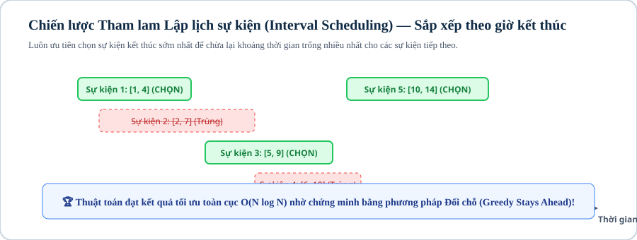

# Bài 07: Thuật toán tham lam (Greedy Algorithms)

## 1. Khái niệm & bản chất của lựa chọn tối ưu cục bộ

Thuật toán Tham lam (Greedy Algorithm) là chiến lược giải quyết bài toán tối ưu bằng cách thực hiện một chuỗi các **lựa chọn tối ưu cục bộ (locally optimal choice)** ở từng bước, với hy vọng dẫn đến **nghiệm tối ưu toàn cục (globally optimal solution)** mà không cần phải quay lui (backtracking) hay tính toán lại các trạng thái trước đó.

Để một bài toán giải được bằng thuật toán tham lam, nó bắt buộc phải thỏa mãn 2 điều kiện toán học khắt khe:
1. **Tính chất lựa chọn tham lam (Greedy Choice Property):** Tồn tại ít nhất một nghiệm tối ưu toàn cục chứa lựa chọn tham lam đầu tiên.
2. **Cấu trúc con tối ưu (Optimal Substructure):** Sau khi thực hiện lựa chọn tham lam, bài toán thu hẹp về một bài toán con đồng dạng có quy mô nhỏ hơn mà việc giải bài toán con đó cũng dẫn đến tối ưu toàn cục.

---



## 2. Các mô hình bài toán tham lam

### 2.1. Mô hình 1: Lựa chọn khoảng không giao nhau nhiều nhất (Interval Scheduling)

Cho $N$ sự kiện, mỗi sự kiện diễn ra trong khoảng thời gian $[L_i, R_i]$. Hãy chọn số lượng sự kiện nhiều nhất sao cho không có hai sự kiện nào bị trùng lấn thời gian.

* **Chiến lược tham lam đúng đắn:** Luôn ưu tiên chọn sự kiện có **thời điểm kết thúc sớm nhất ($R_i$ nhỏ nhất)**.
* **Chứng minh đổi chỗ (Exchange Argument):** Giả sử tồn tại một phương án tối ưu $OPT$ không chọn sự kiện $k$ kết thúc sớm nhất mà chọn sự kiện $x$ kết thúc muộn hơn ($R_x > R_k$). Nếu ta thay thế sự kiện $x$ bằng sự kiện $k$, sự kiện $k$ kết thúc sớm hơn nên khoảng thời gian còn lại sau $k$ sẽ rộng hơn hoặc bằng khoảng thời gian sau $x$, do đó không làm ảnh hưởng đến bất kỳ sự kiện nào chọn sau đó $\implies$ Phương án mới sau khi đổi chỗ có số lượng sự kiện ít nhất bằng $OPT$.

```cpp
bool cmp(const vector<long long> &a, const vector<long long> &b) {
    return a[1] < b[1]; // Sắp xếp theo thời điểm kết thúc tăng dần
}

int max_events(vector<vector<long long>> &events) {
    sort(events.begin(), events.end(), cmp);
    int count = 0;
    long long last_end = -1e18;
    for (const auto &e : events) {
        if (e[0] >= last_end) { // Nếu thời điểm bắt đầu >= thời điểm kết thúc của sự kiện trước
            count++;
            last_end = e[1];
        }
    }
    return count;
}
```

---

## 3. Mẫu cài đặt chuẩn thi đấu: Tham lam xếp hàng phục vụ (SJF — Shortest Job First)

Bài toán: Có $N$ khách hàng, khách hàng thứ $i$ cần thời gian phục vụ là $T_i$. Tìm thứ tự phục vụ để **tổng thời gian chờ đợi của tất cả khách hàng là nhỏ nhất**.
* **Chiến lược:** Khách hàng có thời gian phục vụ ngắn nhất đứng đầu tiên.
* **Công thức tổng thời gian chờ:** $\sum_{i=0}^{N-1} (N - 1 - i) \times T_i$.

```cpp
#include <bits/stdc++.h>
using namespace std;

int main() {
    ios::sync_with_stdio(false);
    cin.tie(nullptr);

    int n;
    if (!(cin >> n)) return 0;

    vector<long long> t(n);
    for (int i = 0; i < n; ++i) cin >> t[i];

    sort(t.begin(), t.end()); // Sắp xếp tăng dần

    long long total_wait_time = 0;
    long long current_time = 0;

    for (int i = 0; i < n; ++i) {
        total_wait_time += current_time;
        current_time += t[i];
    }

    cout << total_wait_time << "\n";
    return 0;
}
```

---

## 4. Ranh giới áp dụng: Khi nào dùng Greedy vs Quy hoạch động (DP)?

| Bài Toán | Dùng Tham Lam (Greedy) Khi Nào? | Buộc Phải Dùng Quy Hoạch Động (DP) Khi Nào? |
|---|---|---|
| **Cái túi (Knapsack)** | Các đồ vật có thể chia nhỏ (Fractional Knapsack) $\implies$ Sắp xếp theo đơn giá giá trị/khối lượng $V_i / W_i$ giảm dần. | Các đồ vật nguyên vẹn không được chia nhỏ (0/1 Knapsack) $\implies$ Buộc dùng DP $\mathcal{O}(NW)$. |
| **Đổi tiền (Coin Change)** | Hệ mệnh giá là hệ chính quy (Canonical / bội số như $1, 2, 5, 10, 20$). | Hệ mệnh giá tùy ý (ví dụ: mệnh giá $1, 3, 4$ với $S = 6$, Greedy chọn $4+1+1=3$ tờ, nhưng tối ưu là $3+3=2$ tờ). |

---

## Câu hỏi trắc nghiệm củng cố khái niệm

#### Câu 1 (Interval Scheduling — Strategy):
Để chọn được nhiều khoảng không giao nhau nhất, ta cần sắp xếp các đoạn thẳng theo tiêu chí nào?
- **A.** Điểm bắt đầu $L_i$ tăng dần.
- **B.** **[Đáp án đúng]** Điểm kết thúc $R_i$ tăng dần.
- **C.** Độ dài khoảng $R_i - L_i$ tăng dần.
- **D.** Điểm bắt đầu $L_i$ giảm dần.

> *Giải thích:* Chọn đoạn kết thúc sớm nhất để lại không gian thời gian tối đa cho các đoạn tiếp theo.

#### Câu 2 (Bẫy đổi tiền — Counterexample):
Hệ tiền xu gồm $\{1, 3, 4\}$ cần đổi số tiền $6$. Thuật toán tham lam sẽ cho bao nhiêu tờ, và số tờ tối ưu thực tế là bao nhiêu?
- **A.** Tham lam ra 2 tờ, tối ưu là 2 tờ.
- **B.** **[Đáp án đúng]** Tham lam chọn $4 + 1 + 1$ (3 tờ), trong khi tối ưu là $3 + 3$ (2 tờ).
- **C.** Tham lam ra 4 tờ, tối ưu là 3 tờ.
- **D.** Không đổi được.

> *Giải thích:* Tham lam luôn ưu tiên lấy tờ lớn nhất ($4$) dẫn đến nghiệm không tối ưu.

---

## Ma trận bài tập thực hành (P0 → P5)

| STT | Mã Bài | Tên Bài Toán | Cấp Độ | Ràng Buộc Dữ Liệu | Mục Tiêu Rèn Luyện |
|:---:|:---:|---|:---:|---|---|
| 01 | `CPPB2-L07-01` | **Lựa Chọn Sự Kiện Không Trùng Giờ** | `P0` | $N \le 10^5, [L_i, R_i] \le 10^9$ | Sắp xếp thời điểm kết thúc tăng dần |
| 02 | `CPPB2-L07-02` | **Tổng Thời Gian Chờ Nhỏ Nhất (SJF)** | `P0` | $N \le 10^5, T_i \le 10^6$ | Sắp xếp thời gian phục vụ tăng dần |
| 03 | `CPPB2-L07-03` | **Cái Túi Chia Nhỏ Được (Fractional Knapsack)** | `P1` | $N \le 10^5, W \le 10^9$ | Sắp xếp theo đơn giá $V_i / W_i$ |
| 04 | `CPPB2-L07-04` | **Phủ Đoạn Thẳng Ít Nhất (Minimum Interval Cover)** | `P1` | $N \le 10^5$, phủ đoạn $[0, L]$ | Tham lam chọn đoạn vươn xa nhất |
| 05 | `CPPB2-L07-05` | **Ghép Thuyền Cứu Hộ Cực Trị** | `P1` | $N \le 10^5, W_i \le C$ | Hai con trỏ ghép kiện nặng nhất + nhẹ nhất |
| 06 | `CPPB2-L07-06` | **Nối Các Sợi Dây Tiết Kiệm Chi Phí Nhất** | `P2` | $N \le 10^5, L_i \le 10^6$ | Hàng đợi ưu tiên `priority_queue` (Cây Huffman) |
| 07 | `CPPB2-L07-07` | **Lập Lịch Công Việc Có Deadline & Tiền Phạt** | `P2` | $N \le 10^5, D_i \le 10^5$ | Tham lam kết hợp Disjoint Set Union (DSU) |
| 08 | `CPPB2-L07-08` | **Tối Đa Hóa Lợi Nhuận Giao Hàng** | `P2` | $N \le 10^5, P_i \le 10^9$ | Min-heap duy trì tập công việc được chọn |
| 09 | `CPPB2-L07-09` | **Chia Kẹo Thưởng Cho Học Sinh Theo Điểm Số** | `P3` | $N \le 10^5, A_i \le 10^9$ | Quét hai chiều trái $\to$ phải và phải $\to$ trái |
| 10 | `CPPB2-L07-10` | **Tối Ưu Hóa Mua Bán Cổ Phiếu Không Giới Hạn Lần Giao Dịch** | `P3` | $N \le 2 \times 10^5, P_i \le 10^9$ | Tham lam gom mọi khoảng giá tăng $\max(0, P_{i+1} - P_i)$ |
| 11 | `CPPB2-L07-11` | **Sắp Đặt Chuỗi Ký Tự Không Trùng Lặp Kề Nhau** | `P3` | $\vert S \vert \le 10^5$, khoảng cách $D$ | Max-Heap xếp ký tự có tần suất cao nhất |
| 12 | `CPPB2-L07-12` | **Số Lượng Trạm Tiếp Nhiên Liệu Ít Nhất (Gas Station)** | `P4` | $N \le 10^5, D \le 10^9$ | Max-Heap chọn cây xăng có trữ lượng lớn nhất khi hết xăng |
| 13 | `CPPB2-L07-13` | **Lập Lịch Phòng Họp Tối Thiểu (Meeting Rooms II)** | `P4` | $N \le 10^5, [S_i, E_i] \le 10^9$ | Min-Heap theo dõi phòng họp trống sớm nhất |
| 14 | `CPPB2-L07-14` | **Phục Hồi Dãy Số Đơn Điệu Với Chi Phí Nhỏ Nhất (Slope Trick Cơ Bản)** | `P5` | $N \le 10^5, A_i \le 10^9$ | Duy trì hàm lỗi lồi bằng Priority Queue |
| 15 | `CPPB2-L07-15` | **Ghép Cặp Trọng Số Trên Đồ Thị Cây Bằng Greedy** | `P5` | Cây $N \le 10^5$ đỉnh | Tham lam từ lá lên gốc (Bottom-up Tree Greedy) |
| 16 | `CPPB2-L07-16` | **Thuật Toán Huffman Coding Nén Dữ Liệu Tối Ưu** | `P5` | $N \le 10^5$ tần suất | Cây mã hóa nhị phân tiền tố tối ưu |
