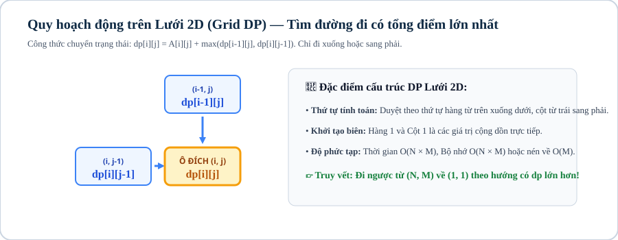

# Bài 08: Quy hoạch động cơ bản (Dynamic Programming)

## 1. Khái niệm & bản chất của phương pháp Quy hoạch động

Quy hoạch động (Dynamic Programming - DP) là phương pháp giải quyết các bài toán tối ưu hóa và đếm tổ hợp bằng cách chia bài toán thành các **bài toán con gối nhau (Overlapping Subproblems)** và lưu trữ kết quả của các bài toán con đó vào bảng nhớ (memoization table / DP array) để không phải tính lại nhiều lần.

Một bài toán áp dụng được Quy hoạch động khi thỏa mãn 2 nguyên lý:
1. **Cấu trúc con tối ưu (Optimal Substructure):** Nghiệm tối ưu của bài toán lớn được xây dựng trực tiếp từ nghiệm tối ưu của các bài toán con nhỏ hơn.
2. **Các bài toán con gối nhau (Overlapping Subproblems):** Cùng một trạng thái con được gọi đi gọi lại nhiều lần trong quá trình đệ quy (ví dụ: cây đệ quy Fibonacci).

---



## 2. Các mô hình Quy hoạch động

### 2.1. Dãy con tăng dài nhất (Longest Increasing Subsequence — LIS)

Cho dãy $A_1, A_2, \dots, A_N$. Tìm độ dài dãy con tăng dài nhất.

* **Cách 1: Quy hoạch động $\mathcal{O}(N^2)$**
  - Định nghĩa: $dp[i]$ là độ dài dãy con tăng dài nhất kết thúc tại phần tử $A[i]$.
  - Công thức: $dp[i] = 1 + \max_{j < i, A[j] < A[i]} dp[j]$.
* **Cách 2: Tối ưu $\mathcal{O}(N \log N)$ bằng Tìm kiếm nhị phân**
  - Duy trì mảng `tail[k]`: giá trị nhỏ nhất của phần tử cuối cùng của dãy con tăng độ dài $k$.
  - Mảng `tail` luôn có tính chất tăng ngặt $\implies$ Dùng `lower_bound` để tìm vị trí cập nhật trong $\mathcal{O}(\log N)$.

```cpp
int lis_fast(const vector<int> &a) {
    vector<int> tail;
    for (int x : a) {
        auto it = lower_bound(tail.begin(), tail.end(), x);
        if (it == tail.end()) tail.push_back(x);
        else *it = x;
    }
    return tail.size();
}
```

### 2.2. Bài toán Cái túi 0/1 (0/1 Knapsack Problem)

Cho $N$ đồ vật, đồ vật thứ $i$ có trọng lượng $W_i$ và giá trị $V_i$. Cái túi có sức chứa tối đa $M$.

* **Công thức DP 2D:**
  $$dp[i][w] = \max(dp[i-1][w], dp[i-1][w - W_i] + V_i) \quad (\text{với } w \ge W_i)$$
* **Tối ưu không gian xuống mảng 1D $\mathcal{O}(M)$:**
  Duyệt trọng lượng $w$ **ngược chiều từ $M$ về $W_i$** để đảm bảo mỗi đồ vật chỉ được chọn tối đa 1 lần:
  ```cpp
  vector<long long> dp(m + 1, 0);
  for (int i = 0; i < n; ++i) {
      for (int w = m; w >= weight[i]; --w) {
          dp[w] = max(dp[w], dp[w - weight[i]] + val[i]);
      }
  }
  ```

---

## 3. Mẫu cài đặt chuẩn thi đấu: Xâu con chung dài nhất (LCS)

Cho hai xâu $S$ độ dài $N$ và $T$ độ dài $M$. Tìm độ dài xâu con chung dài nhất.
* **Công thức:**
  $$dp[i][j] = \begin{cases} dp[i-1][j-1] + 1 & \text{khi } S[i-1] == T[j-1] \\ \max(dp[i-1][j], dp[i][j-1]) & \text{khi } S[i-1] \ne T[j-1] \end{cases}$$

```cpp
#include <bits/stdc++.h>
using namespace std;

int main() {
    ios::sync_with_stdio(false);
    cin.tie(nullptr);

    string s, t;
    if (!(cin >> s >> t)) return 0;

    int n = s.size(), m = t.size();
    vector<vector<int>> dp(n + 1, vector<int>(m + 1, 0));

    for (int i = 1; i <= n; ++i) {
        for (int j = 1; j <= m; ++j) {
            if (s[i - 1] == t[j - 1]) dp[i][j] = dp[i - 1][j - 1] + 1;
            else dp[i][j] = max(dp[i - 1][j], dp[i][j - 1]);
        }
    }

    cout << dp[n][m] << "\n";
    return 0;
}
```

---

## 4. Ranh giới áp dụng

| Dạng Bài DP | Trạng Thái Bảng Nhớ | Độ Phức Tạp |
|---|---|:---:|
| **DP 1D cơ bản (Leo bậc thang, Nhà trộm)** | $dp[i]$ | $\mathcal{O}(N)$ |
| **Dãy con tăng dài nhất (LIS)** | Binary Search trên `tail` | $\mathcal{O}(N \log N)$ |
| **Cái túi 0/1 (Knapsack 0/1)** | Mảng 1D duyệt lùi $M \to W_i$ | $\mathcal{O}(NM)$ |
| **Cái túi vô hạn (Unbounded Knapsack)** | Mảng 1D duyệt xuôi $W_i \to M$ | $\mathcal{O}(NM)$ |
| **Xâu con chung dài nhất (LCS)** | Bảng ma trận $dp[i][j]$ | $\mathcal{O}(\vert S \vert \times \vert T \vert)$ |

---

## Câu hỏi trắc nghiệm củng cố khái niệm

#### Câu 1 (Knapsack 0/1 — Memory Optimization):
Tại sao khi tối ưu bộ nhớ bài toán Cái túi 0/1 về mảng 1D `dp[w]`, vòng lặp trọng lượng bắt buộc phải chạy lùi từ $M$ về $W_i$?
- **A.** Để chạy nhanh hơn.
- **B.** **[Đáp án đúng]** Để đảm bảo giá trị `dp[w - W_i]` lấy từ trạng thái của các đồ vật trước đó (chưa dùng đồ vật $i$), tránh việc 1 đồ vật bị chọn nhiều lần.
- **C.** Vì C++ không cho phép duyệt xuôi.
- **D.** Để tránh tràn số.

> *Giải thích:* Nếu duyệt xuôi từ $W_i \to M$, trạng thái $dp[w]$ sẽ sử dụng kết quả vừa mới cập nhật của $dp[w - W_i]$, tương đương với bài toán Cái túi vô hạn.

#### Câu 2 (LIS Binary Search — Concept):
Trong thuật toán LIS $\mathcal{O}(N \log N)$, mảng `tail` lưu trữ giá trị gì?
- **A.** Chiều dài của dãy con.
- **B.** **[Đáp án đúng]** Giá trị phần tử kết thúc nhỏ nhất có thể của một dãy con tăng có độ dài tương ứng.
- **C.** Chỉ số của các phần tử.
- **D.** Tổng các phần tử.

> *Giải thích:* Giữ phần tử kết thúc càng nhỏ càng tạo điều kiện thuận lợi cho các phần tử sau ghép vào để kéo dài dãy.

---

## Ma trận bài tập thực hành (P0 → P5)

| STT | Mã Bài | Tên Bài Toán | Cấp Độ | Ràng Buộc Dữ Liệu | Mục Tiêu Rèn Luyện |
|:---:|:---:|---|:---:|---|---|
| 01 | `CPPB2-L08-01` | **Bước Nhảy Bậc Thang (Climbing Stairs Modulo)** | `P0` | $N \le 10^6, M = 10^9+7$ | DP 1D Fibonacci mở rộng |
| 02 | `CPPB2-L08-02` | **Đường Đi Trên Ma Trận Có Tổng Lớn Nhất** | `P0` | $N, M \le 1000$ | DP 2D $dp[i][j] = \max(dp[i-1][j], dp[i][j-1]) + A[i][j]$ |
| 03 | `CPPB2-L08-03` | **Cái Túi 0/1 Chuẩn (0/1 Knapsack)** | `P1` | $N \le 1000, W \le 10^5$ | DP Cái túi tối ưu bộ nhớ 1D duyệt lùi |
| 04 | `CPPB2-L08-04` | **Đổi Tiền Xu Số Tờ Nhỏ Nhất (Unbounded Coin Change)** | `P1` | $N \le 100, S \le 10^5$ | DP Cái túi vô hạn duyệt xuôi |
| 05 | `CPPB2-L08-05` | **Dãy Con Tăng Dài Nhất LIS $\mathcal{O}(N \log N)$** | `P2` | $N \le 2 \times 10^5, A_i \le 10^9$ | `lower_bound` trên mảng `tail` |
| 06 | `CPPB2-L08-06` | **Xâu Con Chung Dài Nhất (LCS)** | `P2` | $\vert S \vert, \vert T \vert \le 3000$ | DP chuỗi 2D bảng nhớ ma trận |
| 07 | `CPPB2-L08-07` | **Xóa Ký Tự Để Thành Palindrome Ngắn Nhất** | `P2` | $\vert S \vert \le 2000$ | DP khoảng $[l, r]$ (Interval DP) |
| 08 | `CPPB2-L08-08` | **Cắt Bánh Hình Chữ Nhật Có Giá Trị Lớn Nhất** | `P3` | $W, H \le 600, N \le 200$ | DP 2D chia đôi hình chữ nhật |
| 09 | `CPPB2-L08-09` | **Dãy Con Tăng Lớn Nhất Có Truy Vết Phần Tử** | `P3` | $N \le 10^5$ | LIS $\mathcal{O}(N \log N)$ kèm mảng truy vết $parent[i]$ |
| 10 | `CPPB2-L08-10` | **Khoảng Cách Chỉnh Sửa Xâu (Edit Distance / Levenshtein)** | `P3` | $\vert S \vert, \vert T \vert \le 3000$ | DP 2D tính 3 thao tác Thêm, Xóa, Thay thế |
| 11 | `CPPB2-L08-11` | **Cái Túi Đổi Trục Trạng Thái (Value-based Knapsack)** | `P4` | $N \le 100, W \le 10^9, \sum V_i \le 10^5$ | Đổi trục DP $dp[v]$ là trọng lượng nhỏ nhất đạt giá trị $v$ |
| 12 | `CPPB2-L08-12` | **Xếp Gạch Lát Sàn Kích Thước $3 \times N$** | `P4` | $N \le 10^5, M = 10^9+7$ | DP ma trận trạng thái chẵn lẻ |
| 13 | `CPPB2-L08-13` | **Dãy Con Hình Sóng Núi Dài Nhất (Bitonic Subsequence)** | `P4` | $N \le 10^5, A_i \le 10^9$ | Kết hợp LIS xuôi và LDS ngược trong $\mathcal{O}(N \log N)$ |
| 14 | `CPPB2-L08-14` | **Nhân Ma Trận Dây Chuyền Chi Phí Nhỏ Nhất (Matrix Chain)** | `P5` | $N \le 500$ | Interval DP $\mathcal{O}(N^3)$ tìm vị trí chia cắt tối ưu |
| 15 | `CPPB2-L08-15` | **Quy Hoạch Động Trên Cây (Tree DP: Max Independent Set)** | `P5` | Cây $N \le 10^5$ đỉnh | DP $dp[u][0/1]$ chọn hoặc không chọn đỉnh $u$ |
| 16 | `CPPB2-L08-16` | **Tối Ưu Hóa Quy Hoạch Động Bằng Convex Hull Trick (CHT)** | `P5` | $N \le 10^5$ | CHT tối ưu $dp[i] = \min(dp[j] + m_j x_i + c_j)$ từ $\mathcal{O}(N^2) \to \mathcal{O}(N \log N)$ |
