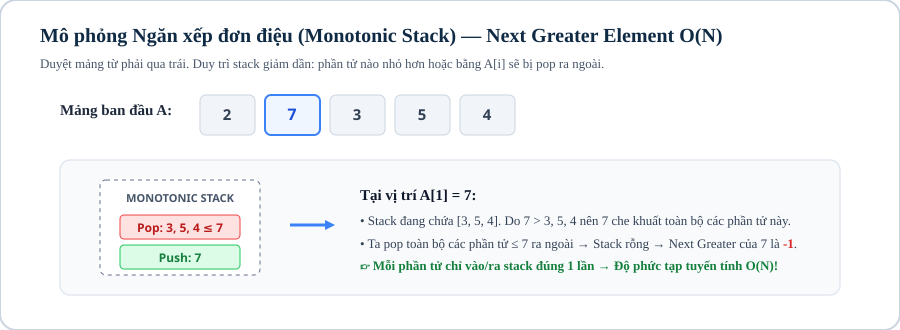

# Bài 09: Ngăn xếp, hàng đợi & Deque (Stack, Queue, Deque)

## 1. Khái niệm & bản chất của cấu trúc dữ liệu tuyến tính đơn điệu

Ngăn xếp (Stack - LIFO) và Hàng đợi (Queue - FIFO) là hai cấu trúc dữ liệu cơ sở có thời gian thêm và xóa ở đầu/cuối trong $\mathcal{O}(1)$.

Ở Level 2, ta nâng cấp lên **Ngăn xếp đơn điệu (Monotonic Stack)** và **Hàng đợi hai đầu đơn điệu (Monotonic Deque)** — hai công cụ tối ưu hóa cực mạnh giúp giải quyết các bài toán tìm kiếm phần tử lớn hơn/nhỏ hơn gần nhất và duy trì $\min/\max$ trên cửa sổ trượt trong thời gian tuyến tính $\mathcal{O}(N)$ (thay vì $\mathcal{O}(N^2)$ hoặc $\mathcal{O}(N \log K)$).

---



## 2. Ngăn xếp đơn điệu

### 2.1. Bài toán: Tìm phần tử lớn hơn gần nhất bên phải (Next Greater Element — NGE)

Cho mảng $A = [A_1, A_2, \dots, A_N]$. Với mỗi $i$, tìm chỉ số $j > i$ nhỏ nhất sao cho $A_j > A_i$.

* **Ý tưởng Monotonic Stack:**
  Duyệt mảng từ phải sang trái (hoặc từ trái sang phải), duy trì một ngăn xếp chứa các phần tử **giảm dần từ đáy lên đỉnh**:
  - Khi xét phần tử $A_i$, loại bỏ tất cả các phần tử trên đỉnh ngăn xếp mà $\le A_i$ (vì chúng nhỏ hơn $A_i$ và nằm xa hơn, không bao giờ có thể là NGE cho các phần tử đứng trước $i$).
  - Phần tử còn lại trên đỉnh ngăn xếp chính là NGE của $A_i$.
  - Đẩy $A_i$ vào ngăn xếp.

```cpp
vector<int> next_greater_element(const vector<int> &a) {
    int n = a.size();
    vector<int> res(n, -1);
    stack<int> st; // Lưu chỉ số

    for (int i = n - 1; i >= 0; --i) {
        while (!st.empty() && a[st.top()] <= a[i]) {
            st.pop();
        }
        if (!st.empty()) res[i] = st.top();
        st.push(i);
    }
    return res;
}
```

> **Chứng minh độ phức tạp $\mathcal{O}(N)$:** Mỗi phần tử chỉ được đẩy vào ngăn xếp đúng 1 lần và lấy ra khỏi ngăn xếp tối đa 1 lần $\implies$ Tổng số thao tác `push/pop` là $2N$.

---

## 3. Hàng đợi hai đầu đơn điệu (Monotonic Deque)

### 3.1. Bài toán: Tìm giá trị nhỏ nhất trên mọi cửa sổ trượt độ dài $K$ (Sliding Window Minimum)

Cho mảng $A$ và kích thước cửa sổ $K$. Tìm $\min$ của mỗi cửa sổ con liên tiếp $K$ phần tử.

* **Cơ chế Monotonic Deque:**
  Duy trì một `deque<int>` lưu chỉ số sao cho giá trị tương ứng trong mảng luôn **tăng dần từ đầu đến cuối**:
  1. **Loại bỏ phần tử ngoài cửa sổ:** Nếu chỉ số ở đầu deque $\le i - K$, đẩy ra (`pop_front`).
  2. **Duy trì tính đơn điệu:** Trong khi đuôi deque có giá trị $\ge A_i$, đẩy ra (`pop_back`) vì chúng vừa lớn hơn vừa già hơn $A_i$.
  3. **Thêm $i$ vào đuôi:** `push_back(i)`.
  4. Phần tử ở đầu deque `deque.front()` luôn là $\min$ của cửa sổ hiện tại.

```cpp
vector<int> sliding_window_min(const vector<int> &a, int k) {
    int n = a.size();
    vector<int> res;
    deque<int> dq;

    for (int i = 0; i < n; ++i) {
        if (!dq.empty() && dq.front() <= i - k) dq.pop_front();
        while (!dq.empty() && a[dq.back()] >= a[i]) dq.pop_back();
        dq.push_back(i);
        if (i >= k - 1) res.push_back(a[dq.front()]);
    }
    return res;
}
```

---

## 4. Mẫu cài đặt chuẩn thi đấu: Diện tích hình chữ nhật lớn nhất trong biểu đồ cột (Histogram)

```cpp
#include <bits/stdc++.h>
using namespace std;

int main() {
    ios::sync_with_stdio(false);
    cin.tie(nullptr);

    int n;
    if (!(cin >> n)) return 0;

    vector<long long> h(n);
    for (int i = 0; i < n; ++i) cin >> h[i];

    stack<int> st;
    long long max_area = 0;

    for (int i = 0; i <= n; ++i) {
        long long cur_h = (i == n ? 0 : h[i]);
        while (!st.empty() && cur_h < h[st.top()]) {
            long long height = h[st.top()];
            st.pop();
            long long width = (st.empty() ? i : (i - st.top() - 1));
            max_area = max(max_area, height * width);
        }
        st.push(i);
    }

    cout << max_area << "\n";
    return 0;
}
```

---

## 5. Ranh giới áp dụng

| Kỹ Thuật | Mục Đích | Độ Phức Tạp Thời Gian | Độ Phức Tạp Không Gian |
|---|---|:---:|:---:|
| **Monotonic Stack** | Tìm phần tử lớn hơn/nhỏ hơn gần nhất (NGE/PLE), Diện tích Histogram | $\mathcal{O}(N)$ | $\mathcal{O}(N)$ |
| **Monotonic Deque** | Tìm $\min/\max$ trên cửa sổ trượt độ dài cố định $K$ | $\mathcal{O}(N)$ | $\mathcal{O}(K)$ |
| **Multiset / Priority Queue** | Duy trì $\min/\max$ khi cửa sổ co giãn tùy ý có xóa phần tử | $\mathcal{O}(N \log K)$ | $\mathcal{O}(K)$ |

---

## Câu hỏi trắc nghiệm củng cố khái niệm

#### Câu 1 (Độ phức tạp Monotonic Stack — Proof):
Tại sao vòng lặp `while (!st.empty() && ...)` lồng bên trong vòng lặp `for (int i = 0; i < n; ++i)` lại chỉ có tổng độ phức tạp là $\mathcal{O}(N)$?
- **A.** Vì ngăn xếp có kích thước tối đa là $\log N$.
- **B.** **[Đáp án đúng]** Vì mỗi phần tử của mảng được `push` vào ngăn xếp đúng 1 lần và `pop` ra tối đa 1 lần, tổng số thao tác trên toàn bộ chương trình không vượt quá $2N$.
- **C.** Do compiler C++ tự động tối ưu.
- **D.** Vì ngăn xếp chỉ lưu số nguyên dương.

> *Giải thích:* Phân tích độ phức tạp khấu hao (Amortized Analysis): $N$ lần push + tối đa $N$ lần pop = $\mathcal{O}(N)$.

#### Câu 2 (Sliding Window Monotonic Deque — Property):
Để tìm giá trị lớn nhất ($\max$) trên cửa sổ trượt, Deque cần duy trì các phần tử theo trật tự nào từ đầu đến cuối?
- **A.** Tăng dần.
- **B.** **[Đáp án đúng]** Giảm dần (đầu deque luôn là phần tử lớn nhất).
- **C.** Ngẫu nhiên.
- **D.** Đan xen chẵn lẻ.

> *Giải thích:* Đầu deque chứa phần tử lớn nhất hiện tại, khi gặp phần tử mới lớn hơn đuôi deque thì loại bỏ các phần tử đuôi nhỏ hơn.

---

## Ma trận bài tập thực hành (P0 → P5)

| STT | Mã Bài | Tên Bài Toán | Cấp Độ | Ràng Buộc Dữ Liệu | Mục Tiêu Rèn Luyện |
|:---:|:---:|---|:---:|---|---|
| 01 | `CPPB2-L09-01` | **Phần Tử Lớn Hơn Gần Nhất Bên Phải (NGE)** | `P0` | $N \le 10^5, A_i \le 10^9$ | Cài đặt Monotonic Stack cơ bản |
| 02 | `CPPB2-L09-02` | **Giá Trị Nhỏ Nhất Trên Cửa Sổ Trượt K** | `P0` | $N \le 10^6, K \le N$ | Cài đặt Monotonic Deque $\mathcal{O}(N)$ |
| 03 | `CPPB2-L09-03` | **Kiểm Tra Dãy Ngoặc Đúng Nhiều Loại** | `P1` | $\vert S \vert \le 10^5$, gồm `()[]{}` | Ứng dụng Stack cơ bản |
| 04 | `CPPB2-L09-04` | **Tầm Nhìn Xa Của Các Tòa Nhà Cao Tầng** | `P1` | $N \le 2 \times 10^5, H_i \le 10^9$ | Monotonic Stack đếm số tòa nhà quan sát được |
| 05 | `CPPB2-L09-05` | **Hình Chữ Nhật Lớn Nhất Dưới Biểu Đồ Cột (Histogram)** | `P2` | $N \le 10^5, H_i \le 10^9$ | Monotonic Stack tìm biên trái & biên phải |
| 06 | `CPPB2-L09-06` | **Ma Trận Toàn Số 1 Lớn Nhất (Maximal Rectangle 2D)** | `P2` | $N, M \le 1000$ | Histogram DP 2D kết hợp Monotonic Stack |
| 07 | `CPPB2-L09-07` | **Tổng Hiệu Cực Đại Và Cực Tiểu Mọi Đoạn Con** | `P2` | $N \le 10^5, A_i \le 10^9$ | Monotonic Stack đếm số đoạn con mà $A_i$ là $\min/\max$ |
| 08 | `CPPB2-L09-08` | **Tối Ưu Hóa Quy Hoạch Động Bằng Monotonic Deque** | `P3` | $N \le 10^5, K \le N$ | DP $dp[i] = \min_{i-K \le j < i} (dp[j]) + A[i]$ qua Deque |
| 09 | `CPPB2-L09-09` | **Hứng Nước Mưa Đa Chiều (Trapping Rain Water)** | `P3` | $N \le 10^5, H_i \le 10^9$ | Monotonic Stack tính thể tích nước đọng |
| 10 | `CPPB2-L09-10` | **Đánh Giá Biểu Thức Số Học Trung Tố (Shunting-yard)** | `P3` | $\vert S \vert \le 10^5$, có `+,-,*,/,(,)` | Thuật toán Shunting-yard của Dijkstra dùng 2 Stack |
| 11 | `CPPB2-L09-11` | **Phần Tử Lớn Hơn Gần Nhất Trên Mảng Xoay Vòng** | `P4` | $N \le 10^5, A_i \le 10^9$ | Monotonic Stack duyệt $2N$ phần tử |
| 12 | `CPPB2-L09-12` | **Xóa K Chữ Số Để Được Số Nhỏ Nhất** | `P4` | $\vert S \vert \le 10^5, K \le \vert S \vert$ | Monotonic Stack duy trì các chữ số tăng dần |
| 13 | `CPPB2-L09-13` | **Tổng Giá Trị Min Mọi Đoạn Con Nhân Độ Dài** | `P4` | $N \le 10^5, A_i \le 10^6$ | Monotonic Stack kết hợp Prefix Sum |
| 14 | `CPPB2-L09-14` | **Đua Xe Trong Mê Cung Đổi Hướng Ít Nhất (0-1 BFS)** | `P5` | $N, M \le 1000$ | Hàng đợi Deque tìm đường tối ưu góc rẽ |
| 15 | `CPPB2-L09-15` | **Cắt Băng Rôn Quảng Cáo Tối Ưu Bằng 2 Deque** | `P5` | $N \le 10^5, C \le 10^9$ | Duy trì $\max - \min \le C$ trên cửa sổ co giãn |
| 16 | `CPPB2-L09-16` | **Khôi Phục Cây Khảo Sát Tầm Nhìn Đa Hướng** | `P5` | $N \le 2 \times 10^5$ | Monotonic Stack 2 chiều xây dựng Cartesian Tree |
