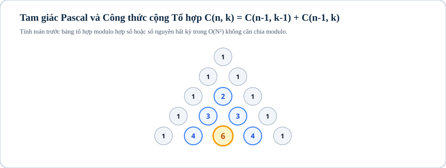

# Bài 11: Tổ hợp, hoán vị & xác suất cơ bản (Combinatorics & Probability)

## 1. Khái niệm & bản chất của đại số tổ hợp trong lập trình thi đấu

Đại số tổ hợp (Combinatorics) là nhánh toán học nghiên cứu về việc đếm, sắp xếp và lựa chọn các phần tử trong tập hợp theo các quy tắc xác định.

Ở Level 2, bài toán tổ hợp không chỉ là tính toán công thức giải tích đơn giản mà là **xử lý đa truy vấn với modulo lớn $10^9+7$**:
* **Hoán vị ($P_n = n!$), Chỉnh hợp ($A_n^k = \frac{n!}{(n-k)!}$), Tổ hợp ($C_n^k = \binom{n}{k} = \frac{n!}{k!(n-k)!}$)**.
* **Tiền xử lý giai thừa & Nghịch đảo giai thừa:** Tính trước $fact[i] = i! \bmod M$ và $invFact[i] = (i!)^{-1} \bmod M$ trong $\mathcal{O}(N)$ để trả lời mỗi truy vấn tính $C_n^k \bmod M$ trong $\mathcal{O}(1)$.
* **Tam giác Pascal (Pascal's Triangle):** Quy hoạch động tính $C_n^k = C_{n-1}^{k-1} + C_{n-1}^k$ khi modulo $M$ là hợp số.
* **Nguyên lý bù trừ (Principle of Inclusion-Exclusion — PIE):** Đếm số phần tử thỏa mãn ít nhất một trong các điều kiện bằng cách xen kẽ cộng tập đơn và trừ tập giao:
$$|A_1 \cup A_2 \cup \dots \cup A_n| = \sum |A_i| - \sum |A_i \cap A_j| + \sum |A_i \cap A_j \cap A_k| - \dots$$
* **Bài toán Chia kẹo của Euler (Stars and Bars):** Số cách chia $N$ cái kẹo giống nhau cho $K$ đứa trẻ:
  - Mỗi đứa trẻ có ít nhất 1 cái: $\binom{N - 1}{K - 1}$.
  - Đứa trẻ có thể nhận 0 cái: $\binom{N + K - 1}{K - 1}$.

---



## 2. Tiền xử lý giai thừa

```cpp
const int MAXN = 1000000;
const long long MOD = 1000000007;

long long fact[MAXN + 1];
long long invFact[MAXN + 1];

long long power_mod(long long a, long long b) {
    long long res = 1; a %= MOD;
    while (b > 0) {
        if (b & 1) res = (res * a) % MOD;
        a = (a * a) % MOD;
        b >>= 1;
    }
    return res;
}

void precompute_factorials() {
    fact[0] = 1;
    for (int i = 1; i <= MAXN; ++i) fact[i] = (fact[i - 1] * i) % MOD;

    // Tính nghịch đảo giai thừa MAXN! bằng Fermat
    invFact[MAXN] = power_mod(fact[MAXN], MOD - 2);

    // Tính lùi: invFact[i-1] = invFact[i] * i % MOD
    for (int i = MAXN - 1; i >= 0; --i) {
        invFact[i] = (invFact[i + 1] * (i + 1)) % MOD;
    }
}

long long nCr(int n, int r) {
    if (r < 0 || r > n) return 0;
    return fact[n] * invFact[r] % MOD * invFact[n - r] % MOD;
}
```

---

## 3. Nguyên lý bù trừ (PIE) & Đếm số nguyên tố cùng nhau

Bài toán: Đếm số lượng số trong đoạn $[1, N]$ không chia hết cho bất kỳ số nào trong tập các số nguyên tố $\{p_1, p_2, \dots, p_K\}$ ($K \le 15$).

```cpp
long long count_coprime(long long n, const vector<long long> &primes) {
    int k = primes.size();
    long long total = 0;

    for (int mask = 1; mask < (1 << k); ++mask) {
        long long prod = 1;
        int bits = 0;
        for (int i = 0; i < k; ++i) {
            if ((mask >> i) & 1) {
                bits++;
                prod *= primes[i];
                if (prod > n) break;
            }
        }
        long long cnt = n / prod;
        if (bits % 2 == 1) total += cnt; // Số lẻ tập: Cộng vào
        else total -= cnt;              // Số chẵn tập: Trừ ra
    }
    return n - total; // Số lượng không chia hết cho bất kỳ số nào
}
```

---

## 4. Ranh giới áp dụng

| Tình Huống | Điều Kiện Modulo $M$ | Kỹ Thuật Tối Ưu |
|---|---|---|
| $N \le 10^6, Q \le 10^5$ | $M$ là số nguyên tố ($10^9+7$) | Tiền xử lý `fact` và `invFact` $\implies \mathcal{O}(1)$ mỗi truy vấn |
| $N \le 2000, Q \le 10^5$ | $M$ là hợp số bất kỳ | Tam giác Pascal DP $\mathcal{O}(N^2)$ |
| $N \le 10^{18}, K \le 10^6$ | $M$ nguyên tố | Tính trực tiếp $C_n^k = \frac{n(n-1)\dots(n-k+1)}{k!} \bmod M$ |

---

## Câu hỏi trắc nghiệm củng cố khái niệm

#### Câu 1 (Stars and Bars — Math):
Số cách chia $10$ viên kẹo giống nhau cho $3$ bạn nhỏ sao cho bạn nào cũng có ít nhất $1$ viên kẹo là:
- **A.** $\binom{10 + 3 - 1}{3 - 1} = \binom{12}{2} = 66$
- **B.** **[Đáp án đúng]** $\binom{10 - 1}{3 - 1} = \binom{9}{2} = 36$
- **C.** $10^3 = 1000$
- **D.** $3^{10} = 59049$

> *Giải thích:* Đặt $3 - 1 = 2$ vách ngăn vào $10 - 1 = 9$ khoảng trống giữa các viên kẹo $\implies \binom{9}{2} = 36$.

#### Câu 2 (Nghịch đảo giai thừa lùi — Optimization):
Công thức truy hồi tính `invFact[i-1]` từ `invFact[i]` là:
- **A.** `invFact[i-1] = invFact[i] / i`
- **B.** **[Đáp án đúng]** `invFact[i-1] = (invFact[i] * i) % MOD`
- **C.** `invFact[i-1] = invFact[i] + i`
- **D.** `invFact[i-1] = invFact[i] - 1`

> *Giải thích:* Vì $\frac{1}{(i-1)!} = \frac{1}{i!} \times i$, do đó nhân thêm $i$ để lùi bước tính toàn bộ mảng trong $\mathcal{O}(N)$.

---

## Ma trận bài tập thực hành (P0 → P5)

| STT | Mã Bài | Tên Bài Toán | Cấp Độ | Ràng Buộc Dữ Liệu | Mục Tiêu Rèn Luyện |
|:---:|:---:|---|:---:|---|---|
| 01 | `CPPB2-L11-01` | **Tính Tổ Hợp $C_n^k \bmod (10^9+7)$ Truy Vấn Nhanh** | `P0` | $Q \le 10^5, N, K \le 10^6$ | Tiền xử lý `fact` & `invFact` $\mathcal{O}(1)$ |
| 02 | `CPPB2-L11-02` | **Tam Giác Pascal Modulo Hợp Số** | `P0` | $N, K \le 2000, M \le 10^9$ | DP Tam giác Pascal $C_n^k = C_{n-1}^{k-1} + C_{n-1}^k$ |
| 03 | `CPPB2-L11-03` | **Chia Kẹo Euler Có Ít Nhất 1 Viên (Stars and Bars)** | `P1` | $N, K \le 10^6, M = 10^9+7$ | Công thức $\binom{N-1}{K-1} \bmod M$ |
| 04 | `CPPB2-L11-04` | **Chia Kẹo Euler Cho Phép 0 Viên** | `P1` | $N, K \le 10^6, M = 10^9+7$ | Công thức $\binom{N+K-1}{K-1} \bmod M$ |
| 05 | `CPPB2-L11-05` | **Đếm Số Hoán Vị Không Có Điểm Cố Định (Derangements)** | `P1` | $N \le 10^6, M = 10^9+7$ | Công thức $D_n = (n-1)(D_{n-1} + D_{n-2})$ |
| 06 | `CPPB2-L11-06` | **Đếm Số Nguyên Tố Cùng Nhau Bằng PIE** | `P2` | $N \le 10^{12}, K \le 15$ | Nguyên lý bù trừ kết hợp Bitmask |
| 07 | `CPPB2-L11-07` | **Đếm Số Xâu Nhị Phân Chứa Ít Nhất K Số 1** | `P2` | $N \le 10^6, K \le N$ | Tổng tổ hợp $\sum_{i=K}^N \binom{N}{i} \bmod M$ |
| 08 | `CPPB2-L11-08` | **Đếm Số Cách Phân Hoạch Tập Hợp (Số Bell)** | `P2` | $N \le 2000, M = 10^9+7$ | Tam giác Bell qua tổ hợp |
| 09 | `CPPB2-L11-09` | **Đếm Số Đường Đi Trên Lưới Tọa Độ Có Điểm Cấm** | `P3` | $N, M \le 10^5, K \le 2000$ điểm cấm | DP sắp xếp điểm cấm + PIE |
| 10 | `CPPB2-L11-10` | **Đếm Số Hoán Vị Có Đúng K Điểm Cố Định** | `P3` | $N \le 10^6, K \le N$ | Công thức $\binom{N}{K} \times D_{N-K} \bmod M$ |
| 11 | `CPPB2-L11-11` | **Số Phân Hoạch Tập Hợp (Số Stirling Loại 2)** | `P3` | $N, K \le 2000, M = 10^9+7$ | DP tính $S(n, k) = S(n-1, k-1) + k \cdot S(n-1, k)$ |
| 12 | `CPPB2-L11-12` | **Đếm Số Cây Khung Đồ Thị Đầy Đủ (Công Thức Cayley)** | `P4` | $N \le 10^6, M = 10^9+7$ | Công thức $N^{N-2} \bmod M$ bằng Fast Power |
| 13 | `CPPB2-L11-13` | **Định Lý Lucas Cho Tổ Hợp Modulo Nguyên Tố Nhỏ** | `P4` | $N, K \le 10^{18}, P \le 10^5$ | Định lý Lucas $\binom{n}{k} \equiv \prod \binom{n_i}{k_i} \pmod P$ |
| 14 | `CPPB2-L11-14` | **Đếm Số Tam Giác Tạo Bởi N Điểm Trên Mặt Phẳng** | `P4` | $N \le 2000$, tọa độ nguyên | $\binom{N}{3}$ trừ các bộ 3 điểm thẳng hàng qua $\gcd$ |
| 15 | `CPPB2-L11-15` | **Kỳ Vọng Toán Học Trò Chơi Gieo Xúc Xắc (Probability DP)** | `P5` | $N \le 10^5, K \le 6$ | DP tính kỳ vọng bước đi $E[i]$ |
| 16 | `CPPB2-L11-16` | **Bổ Đề Burnside Đếm Cấu Hình Bất Biến Phép Quay** | `P5` | $N, K \le 10^5, M = 10^9+7$ | Lý thuyết nhóm & Bổ đề Burnside đếm vòng cổ |
