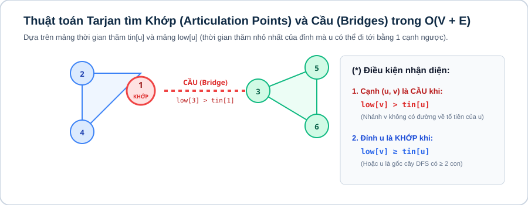

# Bài 12: Lý thuyết đồ thị cơ bản & nâng cao (Graph Algorithms)

## 1. Khái niệm & biểu diễn đồ thị trong lập trình thi đấu

Lý thuyết đồ thị (Graph Theory) là mô hình trừu tượng mô tả mối quan hệ (các cạnh $E$) giữa các đối tượng (các đỉnh $V$).

Các phương pháp biểu diễn đồ thị chuẩn:
* **Danh sách kề (`vector<vector<int>> adj`):** Tiết kiệm bộ nhớ $\mathcal{O}(V + E)$, duyệt các đỉnh kề nhanh nhất $\implies$ **Chuẩn thi đấu bắt buộc**.
* **Ma trận kề (`vector<vector<int>> matrix`):** Tốn bộ nhớ $\mathcal{O}(V^2)$, chỉ dùng khi $V \le 1000$.
* **Danh sách cạnh (`vector<vector<int>> edges`):** Dùng trong các thuật toán cây khung nhỏ nhất (Kruskal, Bellman-Ford).

---

## 2. Hai thuật toán duyệt đồ thị cốt lõi: BFS & DFS

### 2.1. Tìm kiếm theo chiều sâu (Depth-First Search — DFS)

* Duyệt đi sâu vào từng nhánh theo cơ chế đệ quy (Stack ngầm định).
* **Ứng dụng:** Đếm thành phần liên thông, phát hiện chu trình (Cycle Detection), sắp xếp Tô-pô (Topological Sort), kiểm tra đồ thị hai phía (Bipartite Graph).

```cpp
void dfs(int u, const vector<vector<int>> &adj, vector<bool> &visited) {
    visited[u] = true;
    for (int v : adj[u]) {
        if (!visited[v]) dfs(v, adj, visited);
    }
}
```

### 2.2. Tìm kiếm theo chiều rộng (Breadth-First Search — BFS)

* Duyệt theo từng lớp khoảng cách lan tỏa bằng Hàng đợi (`queue<int>`).
* **Tính chất vàng:** BFS luôn tìm ra **đường đi ngắn nhất (ít cạnh nhất)** trên đồ thị không có trọng số hoặc đồ thị lưới 2D.

```cpp
vector<int> bfs_shortest_path(int start_node, int n, const vector<vector<int>> &adj) {
    vector<int> dist(n + 1, -1);
    queue<int> q;

    dist[start_node] = 0;
    q.push(start_node);

    while (!q.empty()) {
        int u = q.front();
        q.pop();

        for (int v : adj[u]) {
            if (dist[v] == -1) {
                dist[v] = dist[u] + 1;
                q.push(v);
            }
        }
    }
    return dist;
}
```

---



## 3. Thuật toán Dijkstra

Khi các cạnh có trọng số $W_e \ge 0$, ta sử dụng thuật toán **Dijkstra kết hợp Hàng đợi ưu tiên (Min-Heap)** đạt độ phức tạp $\mathcal{O}((V + E) \log V)$:

```cpp
#include <bits/stdc++.h>
using namespace std;

const long long INF = 1e18;

vector<long long> dijkstra(int start_node, int n, const vector<vector<pair<int, long long>>> &adj) {
    vector<long long> dist(n + 1, INF);
    // Min-heap lưu {khoảng_cách, đỉnh}
    priority_queue<pair<long long, int>, vector<pair<long long, int>>, greater<pair<long long, int>>> pq;

    dist[start_node] = 0;
    pq.push({0, start_node});

    while (!pq.empty()) {
        auto [d, u] = pq.top();
        pq.pop();

        if (d > dist[u]) continue; // Bỏ qua trạng thái cũ

        for (auto &edge : adj[u]) {
            int v = edge.first;
            long long w = edge.second;
            if (dist[u] + w < dist[v]) {
                dist[v] = dist[u] + w;
                pq.push({dist[v], v});
            }
        }
    }
    return dist;
}
```

---

## 4. Ranh giới áp dụng

| Loại Đồ Thị | Mục Tiêu | Thuật Toán Tối Ưu | Độ Phức Tạp |
|---|---|---|:---:|
| Không trọng số / Trọng số 1 | Đường đi ngắn nhất | BFS | $\mathcal{O}(V + E)$ |
| Trọng số $0$ và $1$ | Đường đi ngắn nhất | 0-1 BFS (dùng `deque`) | $\mathcal{O}(V + E)$ |
| Trọng số không âm ($W \ge 0$) | Đường đi ngắn nhất | Dijkstra + Min-Heap | $\mathcal{O}((V + E) \log V)$ |
| Đồ thị có hướng không chu trình (DAG) | Lập lịch / Thứ tự ưu tiên | Sắp xếp Tô-pô (Kahn / DFS) | $\mathcal{O}(V + E)$ |
| Đồ thị lưới 2D | Loang màu / Tìm miền liên thông | Flood Fill (DFS / BFS) | $\mathcal{O}(R \times C)$ |

---

## Câu hỏi trắc nghiệm củng cố khái niệm

#### Câu 1 (Dijkstra Optimization — Invariant):
Trong thuật toán Dijkstra, câu lệnh `if (d > dist[u]) continue;` có tác dụng gì?
- **A.** Kiểm tra chu trình âm.
- **B.** **[Đáp án đúng]** Bỏ qua các bản sao cũ của đỉnh $u$ có khoảng cách lớn hơn trong Priority Queue, giúp thuật toán chạy nhanh hơn và không bị TLE.
- **C.** Đánh dấu đỉnh đã thăm.
- **D.** Khởi tạo lại khoảng cách.

> *Giải thích:* Một đỉnh có thể được đẩy vào hàng đợi nhiều lần với khoảng cách ngày càng ngắn hơn. Khi lấy ra một bản ghi có $d > dist[u]$ tức là đỉnh đó đã được tối ưu trước đó.

#### Câu 2 (0-1 BFS — Deque Strategy):
Khi đồ thị chỉ có trọng số cạnh là 0 hoặc 1, ta dùng cấu trúc dữ liệu nào để đạt $\mathcal{O}(V + E)$?
- **A.** `priority_queue`
- **B.** **[Đáp án đúng]** `deque` (nếu cạnh có trọng số 0 thì đẩy vào đầu `push_front`, trọng số 1 thì đẩy vào đuôi `push_back`).
- **C.** `stack`
- **D.** `vector`

> *Giải thích:* Giúp hàng đợi luôn duy trì trật tự tăng dần khoảng cách mà không tốn chi phí $\log V$ sắp xếp của Heap.

---

## Ma trận bài tập thực hành (P0 → P5)

| STT | Mã Bài | Tên Bài Toán | Cấp Độ | Ràng Buộc Dữ Liệu | Mục Tiêu Rèn Luyện |
|:---:|:---:|---|:---:|---|---|
| 01 | `CPPB2-L12-01` | **Đếm Số Thành Phần Liên Thông Bằng DFS** | `P0` | $V, E \le 10^5$ | DFS đếm thành phần liên thông |
| 02 | `CPPB2-L12-02` | **Đường Đi Ngắn Nhất Mê Cung 2D Bằng BFS** | `P0` | $N, M \le 1000$ | BFS trên lưới ma trận 2D |
| 03 | `CPPB2-L12-03` | **Kiểm Tra Đồ Thị Hai Phía (Bipartite Graph Coloring)** | `P1` | $V, E \le 10^5$ | Tô màu 2 màu bằng BFS/DFS |
| 04 | `CPPB2-L12-04` | **Sắp Xếp Tô-pô Lập Lịch Khóa Học (Topological Sort)** | `P1` | $V, E \le 10^5$ | Thuật toán Kahn (Bán bậc vào `in_degree`) |
| 05 | `CPPB2-L12-05` | **Dijkstra Tìm Đường Đi Ngắn Nhất Chuẩn** | `P2` | $V \le 10^5, E \le 2 \times 10^5$ | Cài đặt Dijkstra Min-Heap |
| 06 | `CPPB2-L12-06` | **Mê Cung Trọng Số 0 và 1 (0-1 BFS)** | `P2` | $N, M \le 1000$ | 0-1 BFS với `std::deque` |
| 07 | `CPPB2-L12-07` | **Cây Khung Nhỏ Nhất (MST Kruskal với DSU)** | `P2` | $V \le 10^5, E \le 2 \times 10^5$ | Kruskal + Disjoint Set Union |
| 08 | `CPPB2-L12-08` | **Đường Kính Của Cây (Diameter of Tree)** | `P3` | Cây $N \le 2 \times 10^5$ đỉnh | 2 lần chạy BFS/DFS tìm đường kính cây |
| 09 | `CPPB2-L12-09` | **Tìm Khớp Và Cầu Trên Đồ Thị (Tarjan's Bridge & Articulation)** | `P3` | $V, E \le 10^5$ | Mảng `num` và `low` trong DFS |
| 10 | `CPPB2-L12-10` | **Thành Phần Liên Thông Mạnh (SCC Tarjan/Kosaraju)** | `P3` | $V, E \le 10^5$ | Co đồ thị có hướng thành DAG |
| 11 | `CPPB2-L12-11` | **Tìm Tổ Tiên Chung Gần Nhất (LCA Binary Lifting)** | `P4` | Cây $N \le 10^5, Q \le 10^5$ | Bảng nhảy nhị phân $up[u][k]$ trong $\mathcal{O}(\log N)$ |
| 12 | `CPPB2-L12-12` | **Dijkstra Trên Đồ Thị Mở Rộng Trạng Thái (K Lần Dùng Vé)** | `P4` | $V \le 10^5, K \le 10$ | Dijkstra đa tầng $dist[u][k]$ |
| 13 | `CPPB2-L12-13` | **Multi-Source BFS Lan Tỏa Dịch Bệnh / Cháy Rừng** | `P4` | $N, M \le 1000$ | BFS đồng thời từ nhiều đỉnh nguồn ban đầu |
| 14 | `CPPB2-L12-14` | **Đường Đi Euler & Chu Trình Euler (Hierholzer)** | `P5` | $V, E \le 2 \times 10^5$ | Thuật toán Hierholzer tìm hành trình Euler |
| 15 | `CPPB2-L12-15` | **Tìm Chu Trình Âm Bằng Bellman-Ford / SPFA** | `P5` | $V \le 2500, E \le 5000$ | Kiểm tra nới lỏng lần thứ $V$ phát hiện chu trình âm |
| 16 | `CPPB2-L12-16` | **Luồng Cực Đại Trong Mạng (Max Flow Dinic Algorithm)** | `P5` | $V \le 500, E \le 5000$ | Thuật toán Dinic dùng đồ thị tầng Level Graph |
