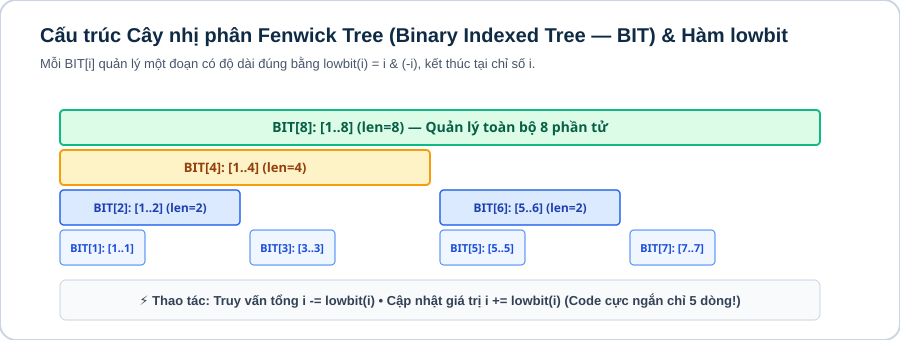
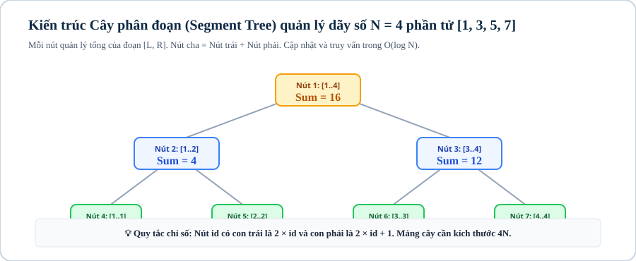

# Bài 13: Cây phân đoạn & cây Fenwick (Segment Tree & Fenwick Tree)

## 1. Khái niệm & bản chất của cấu trúc dữ liệu truy vấn đoạn (Range Query Data Structures)

Khi một bài toán có $Q = 10^5$ truy vấn xen kẽ giữa:
1. **Cập nhật giá trị (Update):** Gán $A[i] = X$ hoặc cộng thêm vào $A[i] \mathrel{+}= X$.
2. **Truy vấn đoạn (Range Query):** Tính tổng $\sum_{k=L}^R A[k]$ hoặc tìm $\min_{k=L}^R A[k]$, $\max_{k=L}^R A[k]$, $\gcd_{k=L}^R A[k]$.

Nếu dùng mảng thông thường: Cập nhật $\mathcal{O}(1)$ nhưng truy vấn $\mathcal{O}(N) \implies \mathcal{O}(QN) \approx 10^{10} \implies \text{TLE}$.  
Nếu dùng Mảng tiền tố tĩnh: Truy vấn $\mathcal{O}(1)$ nhưng cập nhật lại mảng tiền tố mất $\mathcal{O}(N) \implies \text{TLE}$.

**Giải pháp đột phá:** Cây Fenwick (Binary Indexed Tree - BIT) và Cây phân đoạn (Segment Tree) cân bằng cả 2 thao tác cập nhật và truy vấn trong thời gian **logarit $\mathcal{O}(\log N)$**.

---



## 2. Cây Fenwick

### 2.1. Cấu trúc & Thủ thuật bit LSB `i & (-i)`

Mỗi nút `bit[i]` quản lý tổng của một đoạn con có độ dài bằng $LSB(i) = i \ \& \ (-i)$ kết thúc tại chỉ số $i$:
* Đoạn quản lý: $(i - LSB(i), i]$.
* **Bộ nhớ siêu nhẹ:** Đúng $N$ phần tử.

```cpp
const int MAXN = 1000000;
long long bit[MAXN + 1];
int n;

// Cộng thêm val vào vị trí idx (1-based) trong O(log N)
void update_bit(int idx, long long val) {
    for (; idx <= n; idx += idx & (-idx)) {
        bit[idx] += val;
    }
}

// Tính tổng tiền tố từ 1 đến idx trong O(log N)
long long query_bit(int idx) {
    long long sum = 0;
    for (; idx > 0; idx -= idx & (-idx)) {
        sum += bit[idx];
    }
    return sum;
}

// Truy vấn tổng đoạn [L, R]
long long range_query(int L, int R) {
    return query_bit(R) - query_bit(L - 1);
}
```

---



## 3. Cây phân đoạn

### 3.1. Cấu trúc cây nhị phân đầy đủ

* Gốc quản lý đoạn toàn cục $[1, N]$. Nút $id$ quản lý $[L, R]$ có hai con: con trái $2 \times id$ quản lý $[L, mid]$ và con phải $2 \times id + 1$ quản lý $[mid + 1, R]$.
* **Bộ nhớ mảng:** Luôn cấp phát $4N$ phần tử `tree[4 * MAXN]`.
* **Đa năng tuyệt đối:** Hỗ trợ mọi hàm có tính kết hợp: Tổng, Min, Max, GCD.

```cpp
const int MAXN = 200000;
long long tree[4 * MAXN];
long long a[MAXN + 1];

void build_tree(int id, int l, int r) {
    if (l == r) {
        tree[id] = a[l];
        return;
    }
    int mid = (l + r) / 2;
    build_tree(2 * id, l, mid);
    build_tree(2 * id + 1, mid + 1, r);
    tree[id] = min(tree[2 * id], tree[2 * id + 1]); // Cây Range Minimum Query
}

void update_tree(int id, int l, int r, int pos, long long val) {
    if (l == r) {
        tree[id] = val;
        return;
    }
    int mid = (l + r) / 2;
    if (pos <= mid) update_tree(2 * id, l, mid, pos, val);
    else update_tree(2 * id + 1, mid + 1, r, pos, val);
    tree[id] = min(tree[2 * id], tree[2 * id + 1]);
}

long long query_tree(int id, int l, int r, int u, int v) {
    if (v < l || u > r) return 1e18; // Nằm ngoài khoảng
    if (u <= l && r <= v) return tree[id]; // Nằm trọn trong khoảng
    int mid = (l + r) / 2;
    return min(query_tree(2 * id, l, mid, u, v), query_tree(2 * id + 1, mid + 1, r, u, v));
}
```

---

## 4. Ranh giới áp dụng: Khi nào chọn Fenwick vs Segment Tree?

| Tiêu Chí | Cây Fenwick (BIT) | Cây Phân Đoạn (Segment Tree) |
|---|---|---|
| **Độ phức tạp code** | Cực ngắn ($\approx 15$ dòng), ít bug | Dài hơn ($\approx 50$ dòng) |
| **Tốc độ thực thi** | Nhanh hơn gấp 2–3 lần Segment Tree | Chậm hơn do chi phí đệ quy |
| **Bộ nhớ** | Đúng $N$ phần tử | Cần $4N$ phần tử |
| **Phạm vi bài toán** | Tổng tiền tố, đếm nghịch thế, tìm $K$-th | Mọi hàm kết hợp (Min, Max, GCD, Lazy Propagation) |

---

## Câu hỏi trắc nghiệm củng cố khái niệm

#### Câu 1 (Bộ nhớ Segment Tree — Memory):
Tại sao mảng của Segment Tree luôn phải khai báo kích thước tối thiểu là $4N$?
- **A.** Vì mỗi phần tử cần 4 byte.
- **B.** **[Đáp án đúng]** Vì số nút trong cây nhị phân đầy đủ chứa $N$ lá có thể lên tới $2 \times 2^{\lceil \log_2 N \rceil + 1} - 1 < 4N$.
- **C.** Quy ước của C++.
- **D.** Để lưu trữ mảng tiền tố.

> *Giải thích:* $N$ có thể không phải là lũy thừa của 2, cây cần lấp đầy tầng cuối cùng nên cận trên số nút là $< 4N$.

#### Câu 2 (Thao tác Fenwick Tree — Bitwise):
Biểu thức `idx += idx & (-idx)` trong Fenwick Tree làm nhiệm vụ gì?
- **A.** Xóa bit 1 thấp nhất.
- **B.** **[Đáp án đúng]** Nhảy tới nút cha tiếp theo chứa đoạn quản lý lớn hơn bao phủ vị trí `idx`.
- **C.** Trừ phần tử.
- **D.** Lấy căn bậc hai.

> *Giải thích:* Thêm $LSB(idx)$ để di chuyển lên nút tổ tiên trên cây BIT.

---

## Ma trận bài tập thực hành (P0 → P5)

| STT | Mã Bài | Tên Bài Toán | Cấp Độ | Ràng Buộc Dữ Liệu | Mục Tiêu Rèn Luyện |
|:---:|:---:|---|:---:|---|---|
| 01 | `CPPB2-L13-01` | **Truy Vấn Tổng Đoạn Cập Nhật Điểm (Fenwick)** | `P0` | $N, Q \le 10^5, A_i \le 10^9$ | Cài đặt Fenwick Tree cơ bản |
| 02 | `CPPB2-L13-02` | **Truy Vấn Giá Trị Nhỏ Nhất Đoạn (RMQ Segment Tree)** | `P0` | $N, Q \le 10^5, A_i \le 10^9$ | Cài đặt Segment Tree Point Update |
| 03 | `CPPB2-L13-03` | **Đếm Cặp Nghịch Thế Bằng Fenwick Tree** | `P1` | $N \le 10^5, A_i \le 10^9$ | Nén tọa độ + Fenwick Tree |
| 04 | `CPPB2-L13-04` | **Truy Vấn GCD Đoạn Động** | `P1` | $N, Q \le 10^5, A_i \le 10^9$ | Segment Tree với hàm $\gcd(A, B)$ |
| 05 | `CPPB2-L13-05` | **Tìm Phần Tử Số 1 Thứ K Trong Dãy Nhị Phân** | `P2` | $N, Q \le 10^5$ | Chặt nhị phân trực tiếp trên Segment Tree |
| 06 | `CPPB2-L13-06` | **Dãy Con Tăng Dài Nhất LIS Bằng Segment Tree** | `P2` | $N \le 10^5, A_i \le 10^9$ | DP kết hợp Segment Tree Range Max |
| 07 | `CPPB2-L13-07` | **Cập Nhật Đoạn Truy Vấn Điểm Bằng Fenwick Tree** | `P2` | $N, Q \le 10^5$ | Fenwick trên mảng hiệu (Difference BIT) |
| 08 | `CPPB2-L13-08` | **Đếm Số Điểm Nằm Trong Hình Chữ Nhật (2D Fenwick Tree)** | `P3` | $N, Q \le 1000$ | Fenwick Tree 2 chiều độc lập |
| 09 | `CPPB2-L13-09` | **Segment Tree Lazy Propagation (Cộng Đoạn & Tổng Đoạn)** | `P3` | $N, Q \le 10^5$ | Kỹ thuật Lazy Propagation cập nhật khoảng |
| 10 | `CPPB2-L13-10` | **Đoạn Con Có Tổng Lớn Nhất (Maximum Subsegment Sum Query)** | `P3` | $N, Q \le 10^5$ | Segment Tree lưu 4 trường (sum, pref, suff, ans) |
| 11 | `CPPB2-L13-11` | **Lazy Propagation Gán Đoạn Và Tìm Min Đoạn** | `P4` | $N, Q \le 10^5$ | Lazy gán giá trị mới lên khoảng |
| 12 | `CPPB2-L13-12` | **Cây Fenwick Cập Nhật Đoạn & Truy Vấn Đoạn** | `P4` | $N, Q \le 10^5$ | 2 mảng BIT quản lý $\sum (d_1 \cdot i - d_2)$ |
| 13 | `CPPB2-L13-13` | **Tìm Vị Trí Đầu Tiên Có Giá Trị $\ge X$ Trong Đoạn $[L, R]$** | `P4` | $N, Q \le 10^5$ | Binary Search trên Segment Tree nhánh trái/phải |
| 14 | `CPPB2-L13-14` | **Segment Tree Động (Dynamic / Sparse Segment Tree)** | `P5` | Tọa độ $10^9, Q \le 10^5$ | Tạo nút cây theo yêu cầu bằng con trỏ |
| 15 | `CPPB2-L13-15` | **Cây Phân Đoạn Bền Vững (Persistent Segment Tree Cơ Bản)** | `P5` | $N, Q \le 10^5$ | Cây lưu vết phiên bản tìm phần tử nhỏ thứ $K$ trên đoạn |
| 16 | `CPPB2-L13-16` | **Segment Tree Beats (Thuật Toán Ji Driver Tối Ưu Phép Min=X)** | `P5` | $N, Q \le 10^5$ | Phân rã lịch sử giá trị lớn nhất/nhì |
