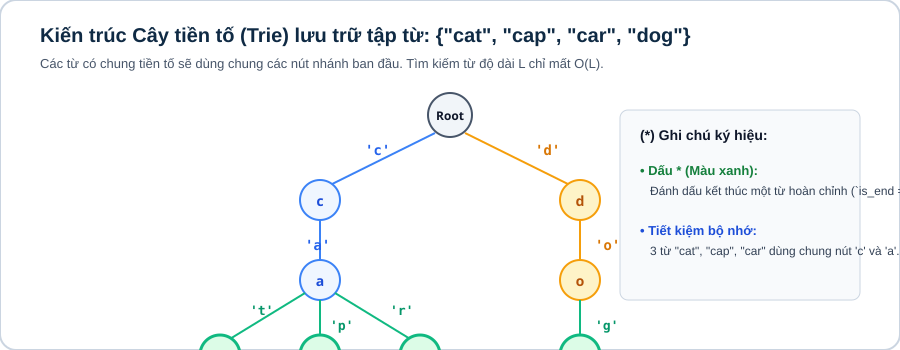

# Bài 15: Xử lý chuỗi ký tự, String Hashing & số nguyên lớn

## 1. Khái niệm & cấu trúc 3 phần của Bài 15

Bài 15 là bài học tổng hợp cuối cùng của khóa học Level 2, tích hợp 3 mảng kiến thức lớn:
1. **15.1. Xử lý xâu cơ bản & Palindrome:** Các thao tác chuẩn trên `string`, đếm tần suất ký tự, kỹ thuật mở rộng tâm (Expand Around Center) tìm xâu con đối xứng dài nhất trong $\mathcal{O}(N^2)$.
2. **15.2. Kỹ thuật Băm chuỗi đa thức (Rolling Hash / Polynomial Hashing):** Biến đổi một xâu ký tự thành một số nguyên duy nhất theo modulo, cho phép so sánh hai xâu con bất kỳ $S[L \dots R]$ trong thời gian **$\mathcal{O}(1)$** (thay vì $\mathcal{O}(N)$).
3. **15.3. Xử lý số nguyên lớn (Big Integer):** Tự xây dựng cấu trúc số nguyên lớn để thực hiện các phép cộng, trừ, nhân hai số có hàng nghìn chữ số.

---



## 2. Kỹ thuật Băm chuỗi đa thức

### 2.1. Công thức hàm băm tiền tố

Cho xâu $S$ độ dài $N$, cơ số $Base = 311$ (hoặc $31$) và modulo $MOD = 10^9 + 7$:
* Mảng băm tiền tố $hash[i] = (S[0] \cdot Base^i + S[1] \cdot Base^{i-1} + \dots + S[i]) \bmod MOD$.
* Công thức tính mã băm của đoạn con $S[L \dots R]$ (1-based) trong $\mathcal{O}(1)$:
$$\text{get\_hash}(L, R) = (hash[R] - hash[L - 1] \times Base^{R - L + 1} \bmod MOD + MOD) \bmod MOD$$

### 2.2. Kỹ thuật Băm kép (Double Hash) chống đụng độ $100\%$

Để tránh việc hai xâu khác nhau có cùng mã băm (Hash Collision) do nguyên lý Dirichlet khi số lượng truy vấn lớn ($Q = 10^5$), ta sử dụng đồng thời **hai cặp $(Base_1, MOD_1)$ và $(Base_2, MOD_2)$** khác nhau (ví dụ: $MOD_1 = 10^9+7, MOD_2 = 10^9+9$). Mã băm lúc này là một cặp số `pair<long long, long long>`. Khả năng đụng độ giảm xuống $\frac{1}{MOD_1 \times MOD_2} \approx 10^{-18}$ (gần như bằng 0 tuyệt đối).

```cpp
const long long BASE = 311;
const long long MOD = 1000000007;

long long h[1000005];
long long pw[1000005];

void init_hash(const string &s) {
    int n = s.size();
    pw[0] = 1;
    for (int i = 1; i <= n; ++i) pw[i] = (pw[i - 1] * BASE) % MOD;

    h[0] = 0;
    for (int i = 0; i < n; ++i) {
        h[i + 1] = (h[i] * BASE + s[i]) % MOD;
    }
}

long long get_hash(int l, int r) { // 1-based indexing
    long long res = (h[r] - h[l - 1] * pw[r - l + 1]) % MOD;
    return (res + MOD) % MOD;
}
```

---

## 3. Cấu trúc số nguyên lớn (Big Integer Addition, Subtraction, Multiplication)

### 3.1. Phép cộng hai số nguyên lớn

```cpp
string add_bigint(string a, string b) {
    while (a.size() < b.size()) a = "0" + a;
    while (b.size() < a.size()) b = "0" + b;

    int carry = 0;
    string res = "";
    for (int i = (int)a.size() - 1; i >= 0; --i) {
        int sum = (a[i] - '0') + (b[i] - '0') + carry;
        carry = sum / 10;
        res += to_string(sum % 10);
    }
    if (carry) res += to_string(carry);
    reverse(res.begin(), res.end());
    return res;
}
```

### 3.2. Phép nhân hai số nguyên lớn

```cpp
string multiply_bigint(string a, string b) {
    int n = a.size(), m = b.size();
    vector<int> res(n + m, 0);

    for (int i = n - 1; i >= 0; --i) {
        for (int j = m - 1; j >= 0; --j) {
            int mul = (a[i] - '0') * (b[j] - '0');
            int p1 = i + j, p2 = i + j + 1;
            int sum = mul + res[p2];

            res[p2] = sum % 10;
            res[p1] += sum / 10;
        }
    }

    string s = "";
    for (int val : res) {
        if (!(s.empty() && val == 0)) s += to_string(val);
    }
    return s.empty() ? "0" : s;
}
```

---

## 4. Ranh giới áp dụng

| Tình Huống Bài Toán | Kỹ Thuật Tối Ưu | Độ Phức Tạp |
|---|---|:---:|
| So sánh nhiều xâu con, tìm xâu con chung, đếm xâu đối xứng | String Hashing (Rolling Hash) | Tiền xử lý $\mathcal{O}(N)$, truy vấn $\mathcal{O}(1)$ |
| Phép tính số học với số có độ dài đến $10^4$ chữ số | Big Integer | Cộng $\mathcal{O}(N)$, Nhân $\mathcal{O}(NM)$ |
| Khớp mẫu xâu cơ bản | KMP hoặc String Hashing | $\mathcal{O}(N + M)$ |

---

## Câu hỏi trắc nghiệm củng cố khái niệm

#### Câu 1 (String Hashing — Substring Query):
Công thức lấy mã băm của đoạn con $S[L \dots R]$ (1-based) từ mảng băm tiền tố $hash$ là:
- **A.** `(hash[R] - hash[L-1]) % MOD`
- **B.** **[Đáp án đúng]** `((hash[R] - hash[L-1] * pw[R - L + 1]) % MOD + MOD) % MOD`
- **C.** `(hash[R] / hash[L-1]) % MOD`
- **D.** `(hash[R] * hash[L-1]) % MOD`

> *Giải thích:* Phải nhân $hash[L-1]$ với $Base^{R-L+1}$ để đưa về cùng bậc lũy thừa trước khi trừ, sau đó cộng bù $MOD$ để tránh số âm.

#### Câu 2 (Double Hashing — Reliability):
Tại sao nên dùng Băm kép (Double Hash) thay vì Băm đơn (Single Hash)?
- **A.** Để mã nguồn ngắn hơn.
- **B.** **[Đáp án đúng]** Để giảm xác suất đụng độ băm (Hash Collision) từ $10^{-9}$ xuống $10^{-18}$, vượt qua mọi bộ test đối kháng.
- **C.** Để tiết kiệm bộ nhớ RAM.
- **D.** Vì compiler C++ yêu cầu.

> *Giải thích:* Hai modulo độc lập tạo thành cặp khóa $(H_1, H_2)$, xác suất hai xâu khác nhau có cùng cả hai mã băm là cực kỳ nhỏ.

---

## Ma trận bài tập thực hành (P0 → P5)

| STT | Mã Bài | Tên Bài Toán | Cấp Độ | Ràng Buộc Dữ Liệu | Mục Tiêu Rèn Luyện |
|:---:|:---:|---|:---:|---|---|
| 01 | `CPPB2-L15-01` | **Cộng & Trừ Hai Số Nguyên Lớn** | `P0` | Chiều dài $\le 1000$ chữ số | Cài đặt BigInt Addition/Subtraction |
| 02 | `CPPB2-L15-02` | **Nhân Hai Số Nguyên Lớn** | `P0` | Chiều dài $\le 1000$ chữ số | Cài đặt BigInt Multiplication $\mathcal{O}(NM)$ |
| 03 | `CPPB2-L15-03` | **Truy Vấn So Khớp Hai Xâu Con Bằng Hashing** | `P1` | $\vert S \vert \le 10^5, Q \le 10^5$ | Cài đặt Rolling Hash $\mathcal{O}(1)$ |
| 04 | `CPPB2-L15-04` | **Tìm Xâu Mẫu P Trong Xâu Văn Bản T (String Match)** | `P1` | $\vert T \vert \le 10^6, \vert P \vert \le 10^5$ | So khớp mã băm trượt (Rabin-Karp) |
| 05 | `CPPB2-L15-05` | **Xâu Con Đối Xứng Dài Nhất (Longest Palindromic Substring)** | `P2` | $\vert S \vert \le 10^5$ | Băm xuôi + Băm ngược + Chặt nhị phân độ dài |
| 06 | `CPPB2-L15-06` | **Đếm Số Xâu Con Khác Nhau Của Một Xâu** | `P2` | $\vert S \vert \le 2000$ | String Hashing + `unordered_set` |
| 07 | `CPPB2-L15-07` | **Chia Số Nguyên Lớn Cho Số Nguyên Nhỏ** | `P2` | Chiều dài $\le 10^5$ chữ số, $D \le 10^9$ | Phép chia lấy thương và chia lấy dư BigInt / int |
| 08 | `CPPB2-L15-08` | **Xâu Con Lặp Lại Dài Nhất Xuất Hiện Ít Nhất K Lần** | `P3` | $\vert S \vert \le 10^5, K \le \vert S \vert$ | Chặt nhị phân độ dài kết hợp Double Hash |
| 09 | `CPPB2-L15-09` | **Tính Giai Thừa $N!$ Cho $N = 1000$ Bằng BigInt** | `P3` | $N \le 1000$ | Nhân BigInt với số nguyên liên tiếp |
| 10 | `CPPB2-L15-10` | **Tìm Chu Kỳ Ngắn Nhất Của Xâu Ký Tự (String Period)** | `P3` | $\vert S \vert \le 10^5$ | String Hashing kiểm tra chu kỳ lặp |
| 11 | `CPPB2-L15-11` | **Thuật Toán Manacher Tìm Mọi Palindrome Tuyến Tính $\mathcal{O}(N)$** | `P4` | $\vert S \vert \le 10^6$ | Thuật toán Manacher tìm mảng bán kính đối xứng |
| 12 | `CPPB2-L15-12` | **Thuật Toán KMP (Knuth-Morris-Pratt) & Mảng Tiền Tố $\pi$** | `P4` | $\vert T \vert \le 10^6, \vert P \vert \le 10^6$ | Cài đặt hàm tiền xử lý $\pi$ của KMP |
| 13 | `CPPB2-L15-13` | **Căn Bậc Hai Của Số Nguyên Lớn** | `P4` | Chiều dài $\le 200$ chữ số | Chặt nhị phân kết hợp nhân BigInt |
| 14 | `CPPB2-L15-14` | **Chia Hai Số Nguyên Lớn Cho Nhau (BigInt / BigInt)** | `P5` | Chiều dài $\le 500$ chữ số | Thuật toán chia dài Knuth (Algorithm D) |
| 15 | `CPPB2-L15-15` | **Xâu Con Chung Dài Nhất Của K Xâu Ký Tự** | `P5` | $K \le 10, \vert S_i \vert \le 10^5$ | Chặt nhị phân độ dài + Băm đa chuỗi |
| 16 | `CPPB2-L15-16` | **Mảng Hậu Tố (Suffix Array) Bằng String Hashing $\mathcal{O}(N \log^2 N)$** | `P5` | $\vert S \vert \le 10^5$ | Sắp xếp các hậu tố bằng so sánh mã băm và LCP |
