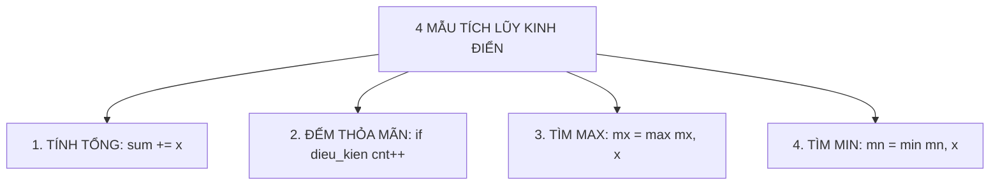

# LỜI NÓI ĐẦU

Chào mừng các em học sinh và quý thầy cô đến với bộ giáo trình **Khoá học C++ cơ bản — QUYỂN 1: KỸ THUẬT LẬP TRÌNH & NỀN TẢNG THUẬT TOÁN** của Trung tâm tin học iKH.

Bộ tài liệu này được biên soạn công phu nhằm cung cấp lộ trình học tập lập trình thi đấu bài bản, chuẩn mực và hiện đại nhất dành cho học sinh THCS, THPT và sinh viên đam mê thuật toán.

Phần nội dung này gồm **5 Chương trọng tâm (Chương 01 đến Chương 05)** với **15 Bài học** và **212 bài toán thực hành**, trang bị toàn diện nền tảng lập trình C++, mảng, con trỏ, cửa sổ trượt, tìm kiếm nhị phân, bit, số học, đệ quy và quay lui.

Mỗi bài học được thiết kế theo cấu trúc sư phạm chặt chẽ:

- **Khái niệm & Bản chất toán học**: Giải thích trực quan, dễ hiểu kèm chứng minh toán học ngắn gọn.
- **Mô hình bài toán kinh điển**: Các dạng bài đặc trưng kèm phân tích độ phức tạp thời gian/không gian.
- **Mẫu cài đặt chuẩn thi đấu**: Code C++ chuẩn, tối ưu, dễ hiểu và tuân thủ các quy chuẩn lập trình hiện đại.
- **Hệ thống bài tập thực hành**: Phân tầng từ cơ bản đến nâng cao (P0 đến P5), có đầy đủ giới hạn thời gian, bộ nhớ, sample test và giải thích chi tiết.
- **Lời giải tham khảo có chọn lọc**: Phụ lục B cung cấp mã nguồn C++ chuẩn mực cho 3 bài tập đầu tiên của mỗi chuyên đề.

Chúc các em học tập hiệu quả và chinh phục những giải thưởng cao trong các kỳ thi học sinh giỏi Tin học và Olympic lập trình!

\begin{flushright}
\textbf{Trung tâm tin học iKH}
\end{flushright}

# CHƯƠNG 01: NỀN TẢNG LẬP TRÌNH C++

# Bài 01: Biến, kiểu dữ liệu, toán tử & nhập xuất an toàn

## 1. Khung tư duy của một lập trình viên: Mô hình Input – Process – Output


Mọi chương trình máy tính viết ra dù phức tạp hay đơn giản đều vận hành dựa trên một chu trình khép kín gồm ba giai đoạn: **Nhận dữ liệu vào (Input)** $\longrightarrow$ **Xử lý dữ liệu (Process)** $\longrightarrow$ **Xuất kết quả ra (Output)**.

| Giai đoạn | Nhiệm vụ chính | Câu hỏi tự đặt ra trước khi viết code |
|---|---|---|
| **1. Input** | Tiếp nhận dữ liệu đề bài cung cấp | Đề bài cho những giá trị nào Số lượng bao nhiêu Giới hạn nhỏ nhất và lớn nhất là bao nhiêu |
| **2. Process** | Tính toán, biến đổi, kiểm tra điều kiện | Cần dùng công thức toán học nào Cần lưu trữ dữ liệu vào ô nhớ nào Có cần rẽ nhánh hay lặp không |
| **3. Output** | Hiển thị kết quả đúng định dạng | In ra số hay chữ Cách nhau bởi dấu cách hay xuống dòng Lấy bao nhiêu chữ số thập phân |

> **Mẹo nhớ:** Tuyệt đối không viết code ngay khi vừa đọc xong đề bài! Hãy viết ra giấy nháp theo thứ tự:
> 1. Dữ liệu đề bài cho là gì $\implies$ Cần khai báo các biến nào
> 2. Quy tắc tính toán là gì $\implies$ Biểu thức toán học tương ứng là gì
> 3. Kết quả cần in là gì $\implies$ Cú pháp `cout` tương ứng ra sao

---

## 2. Cấu trúc chương trình C++ chuẩn thi đấu (Boilerplate)

Trong thi đấu lập trình và các kỳ thi học sinh giỏi, chương trình C++ được viết theo một cấu trúc tối giản, tốc độ thực thi cao và bảo đảm an toàn bộ nhớ:

```cpp
#include <bits/stdc++.h>
using namespace std;

int main() {
// Kỹ thuật Fast I/O giúp tăng tốc độ đọc và xuất dữ liệu
ios::sync_with_stdio(false);
cin.tie(nullptr);

// 1. Khai báo biến
// 2. Đọc dữ liệu an toàn
// 3. Xử lý tính toán
// 4. In kết quả ra màn hình

return 0;
}
```

### Ý nghĩa từng dòng lệnh:

1. `#include <bits/stdc++.h>`: Thư viện tổng hợp chứa toàn bộ các thư viện chuẩn của C++ (như nhập xuất `iostream`, mảng động `vector`, chuỗi `string`, thuật toán `algorithm`). Học sinh không cần nhớ từng thư viện riêng lẻ.
2. `using namespace std;`: Khai báo sử dụng không gian tên chuẩn, giúp ta có thể gọi trực tiếp `cin`, `cout`, `vector`, `string`, `min`, `max`, `sort` mà không cần viết tiền tố rườm rà.
3. `int main()`: Hàm chính của chương trình, nơi hệ điều hành bắt đầu thực thi các dòng lệnh.
4. `ios::sync_with_stdio(false); cin.tie(nullptr);`: Bộ đôi lệnh tối ưu nhập xuất (Fast I/O). Trong các bài thi có tới $10^5$ hoặc $10^6$ dòng dữ liệu, bộ đôi này giúp chương trình chạy nhanh hơn gấp 5 đến 10 lần, tránh bị lỗi chạy quá thời gian (Time Limit Exceeded - TLE).
5. `return 0;`: Báo hiệu cho hệ thống chấm thi rằng chương trình đã kết thúc thành công và không gặp bất kỳ sự cố nào.

---

## 3. Biến và hệ thống kiểu dữ liệu trong C++


> **Biến (Variable)** là một ô nhớ trong bộ nhớ RAM của máy tính được đặt tên để lưu trữ dữ liệu. Mỗi biến khi khai báo bắt buộc phải có một **Kiểu dữ liệu (Data Type)** xác định để máy tính biết cần cấp phát bao nhiêu byte bộ nhớ.

| Kiểu dữ liệu | Kích thước | Phạm vi biểu diễn | Trường hợp nên sử dụng | Ví dụ khai báo |
|---|:---:|---|---|---|
| `int` | 4 bytes (32-bit) | $-2 \times 10^9$ đến $+2 \times 10^9$ | Đếm số lượng nhỏ, chỉ số mảng, số có giá trị dưới 2 tỷ | `int age = 15;` |
| `long long` | 8 bytes (64-bit) | $-9 \times 10^{18}$ đến $+9 \times 10^{18}$ | **Tổng mảng, tích hai số, thời gian, số tiền lớn** | `long long sum = 0;` |
| `double` | 8 bytes (64-bit) | Khoảng 15 chữ số có nghĩa | Điểm trung bình, số thực, tỉ lệ phần trăm, khoảng cách tọa độ | `double score = 8.75;` |
| `char` | 1 byte (8-bit) | 1 ký tự duy nhất trong bảng mã ASCII | Ký tự chữ cái, chữ số, ký hiệu phép toán | `char grade = 'A';` |
| `string` | Động | Chuỗi các ký tự liên tiếp | Tên người, đoạn văn bản, từ ngữ, chuỗi mã hóa | `string name = "An";` |
| `bool` | 1 byte | Đúng (`true` / `1`) hoặc Sai (`false` / `0`) | Cờ đánh dấu, kết quả kiểm tra điều kiện | `bool is_prime = true;` |

### Tử huyệt lập trình: Hiện tượng Tràn số (Integer Overflow)
Kiểu số nguyên `int` chỉ chứa được tối đa xấp xỉ $2.14 \times 10^9$. Khi ta nhân hai số nguyên:
$$a = 10^6, \quad b = 10^6 \implies a \times b = 10^{12}$$
Giá trị $10^{12}$ vượt quá giới hạn của `int`, máy tính sẽ bị tràn số và biến kết quả thành một số âm ngẫu nhiên!
```cpp
// SAI: Tràn số ngay trong phép nhân
int a = 1000000;
int b = 1000000;
long long s = a * b; // Vẫn tràn số! Vì a * b tính trên kiểu int trước rồi mới gán

// ĐÚNG: Khai báo ngay từ đầu bằng long long hoặc ép kiểu
long long a = 1000000;
long long b = 1000000;
long long s = a * b; // Kết quả 1000000000000 hoàn toàn chính xác
```

> **Quy tắc vàng:** Trong lập trình thi đấu, bất cứ khi nào bài toán có phép nhân hai số hoặc tính tổng của một dãy số, hãy ưu tiên sử dụng `long long` để phòng ngừa 100% nguy cơ tràn số!

---

## 4. Nhập xuất an toàn & Định dạng số thực

### 4.1. Đọc dữ liệu bằng `cin` và xuất dữ liệu bằng `cout`
C++ sử dụng dòng vào chuẩn `cin` với toán tử trích xuất `>>` và dòng ra chuẩn `cout` với toán tử chèn `<<`:
```cpp
int a, b;
cin >> a >> b; // Đọc hai số cách nhau bởi khoảng trắng hoặc xuống dòng
cout << a + b << '\n'; // In tổng và xuống dòng bằng '\n'
```

> **Lưu ý:** Hãy dùng `'\n'` thay vì `endl`. Lệnh `endl` sẽ ép máy tính xả bộ đệm (flush buffer) liên tục, làm chậm chương trình nghiêm trọng khi in ra nhiều dòng dữ liệu.

### 4.2. Kỹ thuật Safe Input (Đọc dữ liệu an toàn chống treo chương trình)
Khi đọc các tham số đầu vào quan trọng, hãy tập thói quen kiểm tra dữ liệu vào:
```cpp
long long a, b;
if (!(cin >> a >> b)) return 0; // Nếu file rỗng hoặc hết dữ liệu, kết thúc an toàn
```

### 4.3. Định dạng in số thực bằng `fixed` và `setprecision`
Mặc định `cout` sẽ tự động làm tròn và hiển thị số thực ở dạng khoa học (ví dụ `1e+06`) nếu số quá lớn hoặc in không đủ chữ số thập phân. Để in chính xác $k$ chữ số sau dấu chấm:
```cpp
double avg = 8.0;
cout << fixed << setprecision(2) << avg << '\n'; // In ra chính xác: 8.00
```
- `fixed`: Cố định cách biểu diễn số thập phân thông thường.
- `setprecision(2)`: Yêu cầu lấy đúng 2 chữ số sau dấu chấm phẩy thập phân.

---

## 5. Toán tử số học, phép chia nguyên `/` và chia dư `%`

C++ cung cấp đầy đủ các phép toán số học: cộng `+`, trừ `-`, nhân `*`, chia `/`, và chia lấy phần dư `%`.

### 5.1. Phép chia nguyên `/` và phép chia dư `%`
Đây là hai toán tử quan trọng bậc nhất đối với học sinh mới làm quen với lập trình:

- Khi cả hai toán hạng đều là số nguyên, phép chia `/` thực hiện **chia lấy phần nguyên** (bỏ đi toàn bộ phần lẻ phía sau).
- Toán tử `%` chỉ áp dụng cho số nguyên, trả về **phần dư của phép chia**.

| Phép toán | Kết quả trong C++ | Ý nghĩa toán học |
|:---:|:---:|---|
| `17 / 5` | `3` | Thương nguyên: 17 chia 5 được 3 |
| `17 % 5` | `2` | Phần dư: 17 chia 5 dư 2 ($17 = 3 \times 5 + 2$) |
| `8 / 2` | `4` | Chia hết |
| `8 % 2` | `0` | Phần dư bằng 0 nghĩa là 8 chia hết cho 2 |

### 5.2. Các ứng dụng kinh điển của toán tử `%` và `/`

1. **Kiểm tra chẵn lẻ:**
- `x % 2 == 0`: Số chẵn.
- `x % 2 != 0`: Số lẻ.
2. **Kiểm tra chia hết:** `a % b == 0` nghĩa là $a$ chia hết cho $b$.
3. **Rút trích chữ số tận cùng (Hệ thập phân):**
- Lấy chữ số hàng đơn vị: `don_vi = n % 10;`
- Bỏ chữ số hàng đơn vị: `n = n / 10;`
- Lấy chữ số hàng chục của $N$: `hang_chuc = (n / 10) % 10;`

### 5.3. Bẫy chia nguyên khi tính giá trị trung bình
Khi cần tính kết quả là số thực nhưng dữ liệu đầu vào là các số nguyên:
```cpp
int sum = 23;
int n = 3;

// SAI: 23 / 3 là phép chia nguyên cho ra kết quả 7, sau đó mới gán vào avg
double avg = sum / n; // avg nhận giá trị 7.0 (MẤT PHẦN THẬP PHÂN!)

// ĐÚNG: Ép một trong hai toán hạng về số thực bằng cách nhân với 1.0
double avg = 1.0 * sum / n; // Kết quả: 7.666667 (CHÍNH XÁC)
```

---

## 6. Tổng kết ghi nhớ Bài 01

```text
KHUNG TƯ DUY: Đọc Input -> Tính toán Process -> In Output
BOILERPLATE: #include <bits/stdc++.h> + using namespace std; + Fast I/O
KIỂU DỮ LIỆU: Số nguyên nhỏ dùng int, số lớn hoặc tổng dùng long long, số thực dùng double
TOÁN TỬ: / lấy phần nguyên, % lấy phần dư, 1.0 * a / b để giữ phần thập phân
XUẤT DỮ LIỆU: cout << fixed << setprecision(k) để in đúng k chữ số thập phân
```

## Bài tập thực hành

### Bài 01 [CPPB-L0-01]: Tính tổng hai số

Bối cảnh: Trong giờ học lập trình C++ đầu tiên, thầy giáo giao cho mỗi bạn học sinh hai số nguyên và yêu cầu viết chương trình tính tổng của chúng. Bạn An muốn hoàn thành thật nhanh bài toán này để làm quen với việc đọc và in dữ liệu trong C++.

Nhiệm vụ: Cho hai số nguyên $a$ và $b$. Hãy lập trình tính và in ra tổng $a + b$.

Đầu vào (Input):

- Một dòng duy nhất chứa hai số nguyên $a$ và $b$ ($-10^9 \le a, b \le 10^9$), cách nhau bởi một khoảng trắng.

Đầu ra (Output):

- In ra một số nguyên duy nhất là tổng $a + b$.

Ví dụ mẫu (Sample 1):

| Đầu vào (Input) | Đầu ra (Output) |
|---|---|
| 3 5 | 8 |

Giải thích:

Ta có hai số nguyên $a = 3$ và $b = 5$.
Tổng của hai số là: $3 + 5 = 8$.
Chương trình in ra kết quả: 8.

Ràng buộc & Giới hạn:

- $100\%$ số test có $-10^9 \le a, b \le 10^9$.

- Thời gian: $1.0\text{s}$, Bộ nhớ: $256\text{MB}$.

### Bài 02 [CPPB-L0-02]: Tính chu vi và diện tích hình chữ nhật

Bối cảnh: Bác An vừa mua một mảnh đất hình chữ nhật để trồng rau sạch. Bác cần tính chu vi mảnh đất để mua lưới rào xung quanh, đồng thời tính diện tích để mua phân bón hữu cơ phù hợp. Bạn hãy lập trình giúp bác An tính toán nhanh chóng.

Nhiệm vụ: Cho chiều dài $a$ và chiều rộng $b$ của hình chữ nhật. Hãy lập trình tính và in ra chu vi cùng diện tích của hình chữ nhật đó trên cùng một dòng.

Đầu vào (Input):

- Một dòng duy nhất chứa hai số nguyên dương $a$ và $b$ ($1 \le a, b \le 10^9$), cách nhau bởi một khoảng trắng.

Đầu ra (Output):

- In ra hai số nguyên cách nhau bởi một khoảng trắng lần lượt là chu vi và diện tích của hình chữ nhật.

Ví dụ mẫu (Sample 1):

| Đầu vào (Input) | Đầu ra (Output) |
|---|---|
| 4 7 | 22 28 |

Giải thích:

Hình chữ nhật có chiều dài $a = 4$ và chiều rộng $b = 7$:

- Chu vi: $(4 + 7) \times 2 = 22$.
- Diện tích: $4 \times 7 = 28$.
Kết quả in ra: `22 28`.

Ràng buộc & Giới hạn:

- $100\%$ số test có $1 \le a, b \le 10^9$.

- Thời gian: $1.0\text{s}$, Bộ nhớ: $256\text{MB}$.

### Bài 03 [CPPB-L0-03]: Tính giá trị trung bình cộng ba số

Bối cảnh: Kết thúc kỳ thi học kỳ, bạn Bình nhận được điểm số của ba môn thi: Toán, Văn và Ngoại ngữ. Để biết được học lực tổng kết sơ bộ, Bình cần tính điểm trung bình cộng của ba môn này và làm tròn đến đúng hai chữ số thập phân.

Nhiệm vụ: Cho ba số nguyên $a, b, c$ lần lượt là điểm số của ba môn thi. Hãy lập trình tính và in ra điểm trung bình cộng của ba môn, lấy đúng 2 chữ số sau dấu phẩy thập phân.

Đầu vào (Input):

- Một dòng duy nhất chứa ba số nguyên $a, b, c$ ($0 \le a, b, c \le 10$), cách nhau bởi một khoảng trắng.

Đầu ra (Output):

- In ra một số thực là điểm trung bình cộng của ba môn thi, định dạng đúng 2 chữ số thập phân.

Ví dụ mẫu (Sample 1):

| Đầu vào (Input) | Đầu ra (Output) |
|---|---|
| 8 7 9 | 8.00 |

Giải thích:

Tổng điểm ba môn: $8 + 7 + 9 = 24$.
Điểm trung bình cộng: $24 / 3 = 8.0$.
In ra đúng 2 chữ số thập phân: `8.00`.

Ví dụ mẫu (Sample 2):

| Đầu vào (Input) | Đầu ra (Output) |
|---|---|
| 7 8 8 | 7.67 |

Giải thích:

Tổng điểm: $7 + 8 + 8 = 23$.
Điểm trung bình: $23 / 3 = 7.6666...$ làm tròn 2 chữ số thập phân là `7.67`.

Ràng buộc & Giới hạn:

- $100\%$ số test có $0 \le a, b, c \le 10$.

- Thời gian: $1.0\text{s}$, Bộ nhớ: $256\text{MB}$.

### Bài 04 [CPPB-L0-04]: Tìm chữ số hàng đơn vị

Bối cảnh: Trong trò chơi bốc thăm may mắn tại hội chợ xuân, mỗi người tham gia nhận được một tấm vé có in một mã số nguyên dương. Hai chữ số cuối cùng của mã vé (chữ số hàng chục và chữ số hàng đơn vị) sẽ quyết định giải thưởng mà người đó nhận được.

Nhiệm vụ: Cho một số nguyên dương $N$ có ít nhất hai chữ số. Hãy lập trình tìm và in ra chữ số hàng chục cùng chữ số hàng đơn vị của $N$, cách nhau bởi một khoảng trắng.

Đầu vào (Input):

- Một dòng duy nhất chứa số nguyên dương $N$ ($10 \le N \le 10^9$).

Đầu ra (Output):

- In ra hai chữ số cách nhau bởi một khoảng trắng lần lượt là chữ số hàng chục và chữ số hàng đơn vị của $N$.

Ví dụ mẫu (Sample 1):

| Đầu vào (Input) | Đầu ra (Output) |
|---|---|
| 357 | 5 7 |

Giải thích:

Số $N = 357$:

- Chữ số hàng đơn vị là: $357 \% 10 = 7$.
- Để lấy chữ số hàng chục: chia nguyên bỏ chữ số cuối $357 / 10 = 35$, sau đó lấy phần dư $35 \% 10 = 5$.
Kết quả in ra: `5 7`.

Ví dụ mẫu (Sample 2):

| Đầu vào (Input) | Đầu ra (Output) |
|---|---|
| 80 | 8 0 |

Giải thích:

Số $N = 80$ có chữ số hàng chục là $8$ và chữ số hàng đơn vị là $0$.

Ràng buộc & Giới hạn:

- $100\%$ số test có $10 \le N \le 10^9$.

- Thời gian: $1.0\text{s}$, Bộ nhớ: $256\text{MB}$.

### Bài 05 [CPPB-L0-05]: Chia kẹo công bằng và tính kẹo dư

Bối cảnh: Trong môn Toán tư duy, các bạn nhỏ được làm quen với khái niệm "Tổng các chữ số". Cô giáo đố bạn Nam tính thật nhanh tổng các chữ số của một số nguyên dương có đúng 3 chữ số mà không cần dùng đến vòng lặp.

Nhiệm vụ: Cho một số nguyên dương $N$ có đúng ba chữ số ($100 \le N \le 999$). Hãy lập trình tính và in ra tổng của ba chữ số tạo nên số $N$.

Đầu vào (Input):

- Một dòng duy nhất chứa số nguyên dương $N$ ($100 \le N \le 999$).

Đầu ra (Output):

- In ra một số nguyên duy nhất là tổng các chữ số của $N$.

Ví dụ mẫu (Sample 1):

| Đầu vào (Input) | Đầu ra (Output) |
|---|---|
| 357 | 15 |

Giải thích:

Số $N = 357$ có 3 chữ số:

- Chữ số hàng trăm: $357 / 100 = 3$.
- Chữ số hàng chục: $(357 / 10) \% 10 = 5$.
- Chữ số hàng đơn vị: $357 \% 10 = 7$.
Tổng ba chữ số là: $3 + 5 + 7 = 15$.

Ví dụ mẫu (Sample 2):

| Đầu vào (Input) | Đầu ra (Output) |
|---|---|
| 505 | 10 |

Giải thích:

Tổng các chữ số: $5 + 0 + 5 = 10$.

Ràng buộc & Giới hạn:

- $100\%$ số test có $100 \le N \le 999$.

- Thời gian: $1.0\text{s}$, Bộ nhớ: $256\text{MB}$.

### Bài 06 [CPPB-L0-06]: Đổi đơn vị độ dài từ mét sang centimet

Bối cảnh: Nhân dịp Tết Trung Thu, cô giáo chủ nhiệm mang đến lớp một gói kẹo gồm $N$ chiếc kẹo để chia đều cho $K$ bạn học sinh trong lớp. Mỗi bạn học sinh đều nhận được số lượng kẹo bằng nhau. Số kẹo còn dư lại (nếu có) sẽ được cho vào hòm quà chung của lớp.

Nhiệm vụ: Cho hai số nguyên dương $N$ và $K$ lần lượt là số lượng kẹo và số bạn học sinh. Hãy lập trình tính và in ra số kẹo mỗi bạn nhận được và số kẹo còn dư vào hòm quà chung.

Đầu vào (Input):

- Một dòng duy nhất chứa hai số nguyên dương $N$ và $K$ ($1 \le N, K \le 10^9$), cách nhau bởi một khoảng trắng.

Đầu ra (Output):

- In ra hai số nguyên cách nhau bởi một khoảng trắng: số thứ nhất là số kẹo mỗi bạn nhận được, số thứ hai là số kẹo còn dư.

Ví dụ mẫu (Sample 1):

| Đầu vào (Input) | Đầu ra (Output) |
|---|---|
| 23 5 | 4 3 |

Giải thích:

Có $23$ cái kẹo chia cho $5$ bạn:

- Mỗi bạn nhận được: $23 / 5 = 4$ cái kẹo.
- Số kẹo đã chia: $4 \times 5 = 20$ cái.
- Số kẹo còn dư: $23 \% 5 = 3$ cái.
Kết quả in ra: `4 3`.

Ví dụ mẫu (Sample 2):

| Đầu vào (Input) | Đầu ra (Output) |
|---|---|
| 30 6 | 5 0 |

Giải thích:

$30$ chia hết cho $6$, mỗi bạn nhận đúng $5$ cái và không dư cái nào.

Ràng buộc & Giới hạn:

- $100\%$ số test có $1 \le N, K \le 10^9$.

- Thời gian: $1.0\text{s}$, Bộ nhớ: $256\text{MB}$.

### Bài 07 [CPPB-L0-07]: Đổi thời gian từ giờ phút sang giây

Bối cảnh: Trong một giải chạy marathon quốc tế, thiết bị đo thời gian tự động của ban tổ chức ghi nhận thành tích của vận động viên dưới dạng tổng số giây kể từ thời điểm xuất phát. Để hiển thị lên bảng điện tử cho khán giả dễ theo dõi, ban tổ chức cần chuyển đổi tổng số giây này thành định dạng giờ, phút và giây.

Nhiệm vụ: Cho một số nguyên không âm $T$ là tổng số giây. Hãy lập trình đổi $T$ thành $h$ giờ, $m$ phút và $s$ giây, in ra theo định dạng `h:m:s`.

Đầu vào (Input):

- Một dòng duy nhất chứa số nguyên không âm $T$ ($0 \le T \le 10^9$).

Đầu ra (Output):

- In ra một dòng duy nhất theo định dạng `h:m:s`.

Ví dụ mẫu (Sample 1):

| Đầu vào (Input) | Đầu ra (Output) |
|---|---|
| 3665 | 1:1:5 |

Giải thích:

Ta có $1\text{ giờ} = 3600\text{ giây}$, $1\text{ phút} = 60\text{ giây}$:

- Số giờ: $3665 / 3600 = 1$ giờ.
- Số giây còn lại sau khi trừ giờ: $3665 \% 3600 = 65$ giây.
- Số phút: $65 / 60 = 1$ phút.
- Số giây còn lại: $65 \% 60 = 5$ giây.
Định dạng kết quả: `1:1:5`.

Ví dụ mẫu (Sample 2):

| Đầu vào (Input) | Đầu ra (Output) |
|---|---|
| 125 | 0:2:5 |

Giải thích:

$125$ giây gồm $0$ giờ, $2$ phút và $5$ giây. Kết quả: `0:2:5`.

Ràng buộc & Giới hạn:

- $100\%$ số test có $0 \le T \le 10^9$.

- Thời gian: $1.0\text{s}$, Bộ nhớ: $256\text{MB}$.

### Bài 08 [CPPB-L0-08]: Tính tiền mua vở có chương trình khuyến mãi

Bối cảnh: Đầu năm học mới, một nhà sách tổ chức chương trình khuyến mãi đặc biệt cho học sinh: Mỗi quyển vở có giá niêm yết là $P$ đồng. Cứ mỗi khi khách hàng mua $5$ quyển vở thì sẽ được tặng thêm $1$ quyển vở hoàn toàn miễn phí. Bạn Nam cần có đúng $N$ quyển vở để phục vụ việc ghi chép các môn học. Bạn hãy tính xem Nam cần trả ít nhất bao nhiêu tiền để có đủ $N$ quyển vở.

Nhiệm vụ: Cho hai số nguyên dương $N$ (số quyển vở Nam cần có) và $P$ (giá niêm yết một quyển vở). Hãy lập trình tính và in ra số tiền tối thiểu mà Nam phải thanh toán.

Đầu vào (Input):

- Một dòng duy nhất chứa hai số nguyên dương $N$ và $P$ ($1 \le N \le 10^9, 1 \le P \le 10^6$), cách nhau bởi một khoảng trắng.

Đầu ra (Output):

- In ra một số nguyên duy nhất là số tiền tối thiểu Nam cần thanh toán.

Ví dụ mẫu (Sample 1):

| Đầu vào (Input) | Đầu ra (Output) |
|---|---|
| 13 5000 | 55000 |

Giải thích:

Nam cần có $13$ quyển vở:

- Cứ mỗi nhóm $6$ quyển (gồm mua $5$ tặng $1$), Nam chỉ cần trả tiền cho $5$ quyển.
- Với $13$ quyển, Nam có thể chia thành: $2$ nhóm $6$ quyển (được $12$ quyển, trong đó mua $10$ tặng $2$) và còn thiếu $1$ quyển cần mua thêm.
- Tổng số quyển Nam phải trả tiền là: $2 \times 5 + 1 = 11$ quyển.
- Số tiền thanh toán: $11 \times 5000 = 55000$ đồng.

Ví dụ mẫu (Sample 2):

| Đầu vào (Input) | Đầu ra (Output) |
|---|---|
| 5 6000 | 30000 |

Giải thích:

Nam mua đúng $5$ quyển (chưa đủ 6 quyển để nhận quà tặng kèm lúc lấy), cần thanh toán $5 \times 6000 = 30000$ đồng (Nam sẽ nhận thêm 1 quyển quà tặng là 6 quyển, vẫn thỏa mãn có đủ ít nhất 5 quyển).

Ràng buộc & Giới hạn:

- $100\%$ số test có $1 \le N \le 10^9, 1 \le P \le 10^6$.

- Thời gian: $1.0\text{s}$, Bộ nhớ: $256\text{MB}$.

# Bài 02: Cấu trúc rẽ nhánh & cấu trúc vòng lặp

## 1. Cấu trúc rẽ nhánh: Kiểm soát ngã rẽ chương trình


Trong thực tế, máy tính không chỉ thực hiện tuần tự các dòng lệnh từ trên xuống dưới mà phải đưa ra quyết định dựa trên các điều kiện cụ thể. Trong C++, điều này được thực hiện thông qua câu lệnh điều kiện `if`, `else if`, và `else`.

### 1.1. Cú pháp cơ bản
```cpp
if (dieu_kien) {
// Khối lệnh thực hiện khi dieu_kien ĐÚNG (true)
} else {
// Khối lệnh thực hiện khi dieu_kien SAI (false)
}
```

### 1.2. Chuỗi rẽ nhánh nhiều trường hợp loại trừ nhau
Khi một bài toán có nhiều trường hợp phụ thuộc vào các ngưỡng giá trị (ví dụ xếp loại học sinh, tính thuế, phân loại cước phí), ta sử dụng cấu trúc chuỗi:
```cpp
if (score >= 8.0) {
cout << "GIOI\n";
} else if (score >= 6.5) {
// Khi chạy đến đây, máy tính đã ngầm hiểu score < 8.0
cout << "KHA\n";
} else if (score >= 5.0) {
// Tương tự, tại đây ngầm hiểu score < 6.5
cout << "TRUNG BINH\n";
} else {
cout << "CHUA DAT\n";
}
```

> **Tử huyệt lập trình số 1:** Tuyệt đối không nhầm lẫn giữa toán tử gán `=` và toán tử so sánh bằng `==`!
> - `a = b`: Gán giá trị của $b$ cho biến $a$.
> - `a == b`: So sánh xem giá trị của $a$ có bằng $b$ hay không (trả về `true` hoặc `false`).
> Nếu viết `if (a = 5)`, biểu thức gán này luôn có giá trị 5 (khác 0 tức là `true`), câu lệnh `if` sẽ luôn luôn được thực thi bất kể $a$ ban đầu bằng bao nhiêu!

---

## 2. Toán tử so sánh và Toán tử logic

### 2.1. Bảng toán tử so sánh trong C++
| Toán tử | Ý nghĩa toán học | Ví dụ hợp lệ |
|:---:|:---:|:---:|
| `==` | So sánh bằng nhau | `x == 10` |
| `!=` | So sánh khác nhau | `x != 0` |
| `>` | Lớn hơn hẳn | `age > 18` |
| `<` | Nhỏ hơn hẳn | `score < 5.0` |
| `>=` | Lớn hơn hoặc bằng | `score >= 8.0` |
| `<=` | Nhỏ hơn hoặc bằng | `n <= 100` |

### 2.2. Bảng toán tử logic kết hợp
| Toán tử | Tên gọi | Quy tắc chân trị | Ví dụ thực tế |
|:---:|:---:|---|---|
| `&&` | VÀ (AND) | Chỉ đúng khi **TẤT CẢ** các điều kiện con đều đúng | Ba cạnh tam giác: `a + b > c && a + c > b && b + c > a` |
| `||` | HOẶC (OR) | Đúng khi có **ÍT NHẤT MỘT** điều kiện con đúng | Năm nhuận: `y % 400 == 0 || (y % 4 == 0 && y % 100 != 0)` |
| `!` | PHỦ ĐỊNH (NOT) | Đảo ngược đúng thành sai, sai thành đúng | `!is_prime` (nếu không phải là số nguyên tố) |

---

## 3. Cấu trúc vòng lặp: Làm một việc nhiều lần

Khi cần lặp đi lặp lại một thao tác (như duyệt $N$ phần tử, tính tổng dồn, đếm số lượng), con người nhanh mệt mỏi nhưng máy tính có thể thực hiện hàng trăm triệu phép tính trong một giây thông qua **Vòng lặp**.

Trước khi viết bất kỳ vòng lặp nào, hãy luôn tự trả lời **3 câu hỏi bất biến**:

1. **Việc gì được lặp lại** (Cộng dồn In ra Kiểm tra)
2. **Biến nào thay đổi sau mỗi lần lặp** (Biến chỉ số $i$ tăng thêm 1 đơn vị)
3. **Khi nào vòng lặp dừng lại** (Khi $i > N$ hoặc khi $N = 0$)

### 3.1. Vòng lặp `for`: Khi biết trước số lần lặp
Cú pháp:
```cpp
for (khoi_tao; dieu_kien_lap; buoc_nhay) {
// Thân vòng lặp
}
```
Ví dụ: Tính tổng các số từ $1$ đến $N$:
```cpp
long long sum = 0;
for (int i = 1; i <= n; i++) {
sum += i;
}
```

### 3.2. Vòng lặp `while`: Khi lặp theo một điều kiện
Vòng lặp `while` tiếp tục thực hiện chừng nào điều kiện trong ngoặc còn đúng:
```cpp
while (dieu_kien) {
// Khối lệnh
// Bắt buộc phải có câu lệnh làm thay đổi dieu_kien để tránh lặp vô tận!
}
```
Ví dụ: Rút trích từng chữ số của số nguyên dương $N$:
```cpp
while (n > 0) {
int digit = n % 10; // Lấy chữ số cuối
sum_digits += digit; // Cộng tích lũy
n /= 10; // Bỏ chữ số cuối đi
}
```

### 3.3. Đọc dữ liệu đến khi hết file bằng `while (cin >> x)`
Trong nhiều đề thi HSG hoặc nền tảng Online Judge, đề bài không cho trước số lượng phần tử $N$ mà yêu cầu đọc cho đến khi hết dữ liệu:
```cpp
long long x;
long long sum = 0;
while (cin >> x) {
sum += x;
}
```

---

## 4. Bốn mẫu tích lũy kinh điển


Mọi bài toán vòng lặp cơ bản đều xoay quanh 4 mẫu tích lũy cốt lõi sau:



| Mẫu tích lũy | Ý nghĩa | Giá trị khởi tạo chuẩn | Cú pháp trong vòng lặp |
|---|---|---|---|
| **1. Tính tổng** | Cộng dồn các giá trị | `long long sum = 0;` | `sum += x;` |
| **2. Đếm số lượng** | Đếm phần tử thỏa mãn tính chất | `int cnt = 0;` | `if (x % 2 == 0) cnt++;` |
| **3. Tìm Max** | Lưu phần tử lớn nhất đã gặp | `long long mx = a[0];` hoặc `mx = -1e18;` | `mx = max(mx, x);` |
| **4. Tìm Min** | Lưu phần tử nhỏ nhất đã gặp | `long long mn = a[0];` hoặc `mn = 1e18;` | `mn = min(mn, x);` |

### Bẫy khởi tạo giá trị cực trị

- **Khi tìm Max:** Không được khởi tạo `mx = 0` nếu dãy có thể chứa toàn số âm (ví dụ: mảng `[-5, -2, -9]` có max là `-2`, nhưng nếu để `mx = 0` thì kết quả in ra sẽ là `0` sai hoàn toàn!). Cách tốt nhất: `mx = a[0]`.
- **Khi tìm Min:** Tương tự, phải khởi tạo `mn = a[0]` hoặc một số vô cùng lớn `mn = 2e18`.

---

## 5. Kỹ thuật lập bảng Trace tay để tự kiểm tra lỗi

Khi viết một vòng lặp và kết quả ra không như mong muốn, đừng đoán mò! Hãy vẽ một bảng theo dõi từng bước chạy của biến:

**Ví dụ:** Mô phỏng vòng lặp tính tổng $S = 1 + 2 + 3 + 4$ với `sum = 0`:

| Bước lặp ($i$) | Giá trị $i$ trước cộng | Thao tác cộng dồn | Giá trị `sum` sau cộng | Điều kiện $i \le 4$ tiếp theo |
|:---:|:---:|:---:|:---:|:---:|
| Khởi tạo | — | — | `0` | $1 \le 4$ (Đúng, vào lặp) |
| Lần 1 | `1` | `sum = 0 + 1` | `1` | $2 \le 4$ (Đúng) |
| Lần 2 | `2` | `sum = 1 + 2` | `3` | $3 \le 4$ (Đúng) |
| Lần 3 | `3` | `sum = 3 + 3` | `6` | $4 \le 4$ (Đúng) |
| Lần 4 | `4` | `sum = 6 + 4` | `10` | $5 \le 4$ (Sai $\implies$ DỪNG) |

$$\implies 	ext{Kết quả cuối cùng: } \mathbf{10}$$

---

## 6. Tổng kết ghi nhớ Bài 02

```text
RẼ NHÁNH: if (đúng) ... else if (đúng) ... else ...
SO SÁNH: Dùng == để so sánh bằng, cấm dùng =
LOGIC: && là VÀ (cả hai phải đúng), || là HOẶC (chỉ cần một đúng)
VÒNG LẶP: for khi biết số lần, while khi lặp theo điều kiện
TÍCH LŨY: sum = 0 (tổng), cnt = 0 (đếm), mx = a[0] (max), mn = a[0] (min)
TRACE TAY: Kẻ bảng theo dõi biến từng bước để bắt sạch mọi lỗi sai
```

## Bài tập thực hành

### Bài 09 [CPPB-L0-09]: Tìm số lớn hơn trong hai số

Bối cảnh: Trong cuộc thi đo chiều cao tại phòng y tế học đường, bác sĩ cần so sánh chiều cao của hai bạn An và Bình để ghi nhận bạn nào có chiều cao nhỉnh hơn. Nếu hai bạn cao bằng nhau thì bác sĩ ghi nhận kết quả là bằng nhau.

Nhiệm vụ: Cho hai số nguyên $a$ và $b$. Hãy lập trình so sánh hai số:

- Nếu $a > b$, in ra giá trị của $a$.
- Nếu $b > a$, in ra giá trị của $b$.
- Nếu $a = b$, in ra chuỗi `BANG NHAU`.

Đầu vào (Input):

- Một dòng duy nhất chứa hai số nguyên $a$ và $b$ ($-10^9 \le a, b \le 10^9$), cách nhau bởi một khoảng trắng.

Đầu ra (Output):

- In ra một dòng duy nhất theo yêu cầu của đề bài.

Ví dụ mẫu (Sample 1):

| Đầu vào (Input) | Đầu ra (Output) |
|---|---|
| 7 12 | 12 |

Giải thích:

Vì $12 > 7$ nên chương trình in ra số lớn hơn là `12`.

Ví dụ mẫu (Sample 2):

| Đầu vào (Input) | Đầu ra (Output) |
|---|---|
| 9 9 | BANG NHAU |

Giải thích:

Vì hai số bằng nhau nên chương trình in ra `BANG NHAU`.

Ràng buộc & Giới hạn:

- $100\%$ số test có $-10^9 \le a, b \le 10^9$.

- Thời gian: $1.0\text{s}$, Bộ nhớ: $256\text{MB}$.

### Bài 10 [CPPB-L0-10]: Kiểm tra tính chẵn lẻ của số nguyên

Bối cảnh: Trong các bài toán số học, tính chẵn lẻ (parity) là một tính chất căn bản. Một số nguyên chia hết cho 2 được gọi là số chẵn, ngược lại được gọi là số lẻ. Bạn hãy lập trình kiểm tra tính chẵn lẻ của một số nguyên được nhập từ bàn phím.

Nhiệm vụ: Cho một số nguyên $N$. Hãy lập trình kiểm tra:

- Nếu $N$ là số chẵn, in ra `CHAN`.
- Nếu $N$ là số lẻ, in ra `LE`.

Đầu vào (Input):

- Một dòng duy nhất chứa số nguyên $N$ ($-10^{18} \le N \le 10^{18}$).

Đầu ra (Output):

- In ra một dòng duy nhất chữ `CHAN` hoặc `LE`.

Ví dụ mẫu (Sample 1):

| Đầu vào (Input) | Đầu ra (Output) |
|---|---|
| 8 | CHAN |

Giải thích:

Số $8$ chia hết cho $2$ (phần dư bằng $0$) nên là số chẵn. In ra `CHAN`.

Ví dụ mẫu (Sample 2):

| Đầu vào (Input) | Đầu ra (Output) |
|---|---|
| -7 | LE |

Giải thích:

Số $-7$ không chia hết cho $2$ nên là số lẻ. In ra `LE`.

Ràng buộc & Giới hạn:

- $100\%$ số test có $-10^{18} \le N \le 10^{18}$.

- Thời gian: $1.0\text{s}$, Bộ nhớ: $256\text{MB}$.

### Bài 11 [CPPB-L0-11]: Kiểm tra điều kiện ba cạnh tam giác

Bối cảnh: Trong giờ thực hành môn Hình học, thầy giáo phát cho mỗi nhóm học sinh ba thanh gỗ có độ dài lần lượt là $a, b, c$. Các bạn cần kiểm tra xem ba thanh gỗ này có thể ghép lại thành một hình tam giác hay không.

Nhiệm vụ: Cho ba số nguyên dương $a, b, c$. Hãy lập trình kiểm tra xem $a, b, c$ có thể là độ dài ba cạnh của một tam giác hợp lệ hay không:

- Nếu tạo thành tam giác, in ra `YES`.
- Nếu không tạo thành tam giác, in ra `NO`.

Đầu vào (Input):

- Một dòng duy nhất chứa ba số nguyên dương $a, b, c$ ($1 \le a, b, c \le 10^9$), cách nhau bởi một khoảng trắng.

Đầu ra (Output):

- In ra một dòng duy nhất chữ `YES` hoặc `NO`.

Ví dụ mẫu (Sample 1):

| Đầu vào (Input) | Đầu ra (Output) |
|---|---|
| 3 4 5 | YES |

Giải thích:

Ba số $3, 4, 5$ thỏa mãn bất đẳng thức tam giác:

- $3 + 4 = 7 > 5$
- $3 + 5 = 8 > 4$
- $4 + 5 = 9 > 3$
Do đó tạo thành tam giác hợp lệ. In ra `YES`.

Ví dụ mẫu (Sample 2):

| Đầu vào (Input) | Đầu ra (Output) |
|---|---|
| 1 2 5 | NO |

Giải thích:

Ta có $1 + 2 = 3 < 5$, tổng hai cạnh không lớn hơn cạnh còn lại nên không thể tạo thành tam giác. In ra `NO`.

Ràng buộc & Giới hạn:

- $100\%$ số test có $1 \le a, b, c \le 10^9$.

- Thời gian: $1.0\text{s}$, Bộ nhớ: $256\text{MB}$.

### Bài 12 [CPPB-L0-12]: Xếp loại học lực theo điểm số

Bối cảnh: Cuối năm học, nhà trường tiến hành phân loại danh hiệu cho học sinh dựa trên điểm trung bình tổng kết môn học $S$. Điểm số hợp lệ phải nằm trong thang điểm từ $0.0$ đến $10.0$. Bạn hãy lập trình tự động hóa việc kiểm tra điểm và xếp loại học sinh.

Nhiệm vụ: Cho một số thực $S$ là điểm trung bình của học sinh:

- Nếu $S < 0.0$ hoặc $S > 10.0$: In ra `DIEM KHONG HOP LE`.
- Ngược lại, xếp loại theo thang điểm:
- Nếu $8.0 \le S \le 10.0$: In ra `GIOI`.
- Nếu $6.5 \le S < 8.0$: In ra `KHA`.
- Nếu $5.0 \le S < 6.5$: In ra `TRUNG BINH`.
- Nếu $S < 5.0$: In ra `CHUA DAT`.

Đầu vào (Input):

- Một dòng duy nhất chứa số thực $S$ ($-10.0 \le S \le 20.0$).

Đầu ra (Output):

- In ra một dòng duy nhất kết quả xếp loại tương ứng.

Ví dụ mẫu (Sample 1):

| Đầu vào (Input) | Đầu ra (Output) |
|---|---|
| 8.5 | GIOI |

Giải thích:

Điểm $S = 8.5$ nằm trong khoảng $[8.0, 10.0]$ nên đạt loại `GIOI`.

Ví dụ mẫu (Sample 2):

| Đầu vào (Input) | Đầu ra (Output) |
|---|---|
| 11.5 | DIEM KHONG HOP LE |

Giải thích:

Điểm $11.5 > 10.0$ vượt quá thang điểm quy định, in ra `DIEM KHONG HOP LE`.

Ràng buộc & Giới hạn:

- $100\%$ số test có $-10.0 \le S \le 20.0$.

- Thời gian: $1.0\text{s}$, Bộ nhớ: $256\text{MB}$.

### Bài 13 [CPPB-L0-13]: Tính tổng các số từ 1 đến N

Bối cảnh: Trong tuần lễ rèn luyện tính toán nhanh, các bạn học sinh lớp 6 được yêu cầu tính tổng dãy số nguyên liên tiếp $S = 1 + 2 + 3 + \dots + N$. Bạn An muốn viết một chương trình C++ sử dụng vòng lặp để vừa kiểm tra kết quả tính tay, vừa hiểu rõ cách máy tính thực hiện các phép tính tích lũy lặp đi lặp lại.

Nhiệm vụ: Cho một số nguyên dương $N$. Hãy lập trình sử dụng vòng lặp tính và in ra tổng của tất cả các số nguyên từ $1$ đến $N$.

Đầu vào (Input):

- Một dòng duy nhất chứa số nguyên dương $N$ ($1 \le N \le 10^6$).

Đầu ra (Output):

- In ra một số nguyên duy nhất là tổng $S = 1 + 2 + \dots + N$.

Ví dụ mẫu (Sample 1):

| Đầu vào (Input) | Đầu ra (Output) |
|---|---|
| 5 | 15 |

Giải thích:

Tổng các số từ $1$ đến $5$ là:
$1 + 2 + 3 + 4 + 5 = 15$.
Chương trình in ra `15`.

Ví dụ mẫu (Sample 2):

| Đầu vào (Input) | Đầu ra (Output) |
|---|---|
| 100 | 5050 |

Giải thích:

Tổng các số từ $1$ đến $100$ là $5050$.

Ràng buộc & Giới hạn:

- $100\%$ số test có $1 \le N \le 10^6$.

- Thời gian: $1.0\text{s}$, Bộ nhớ: $256\text{MB}$.

### Bài 14 [CPPB-L0-14]: Đếm số lượng ước số nguyên dương

Bối cảnh: Trong các bài kiểm tra toán học, việc tìm và đếm các ước số của một số nguyên dương $N$ là nền tảng để kiểm tra số nguyên tố và số hoàn hảo. Bạn hãy lập trình đếm xem số nguyên dương $N$ có bao nhiêu ước số nguyên dương.

Nhiệm vụ: Cho một số nguyên dương $N$ ($1 \le N \le 10^5$). Hãy lập trình đếm và in ra số lượng các ước số nguyên dương của $N$.

Đầu vào (Input):

- Một dòng duy nhất chứa số nguyên dương $N$ ($1 \le N \le 10^5$).

Đầu ra (Output):

- In ra một số nguyên duy nhất là số lượng ước số nguyên dương của $N$.

Ví dụ mẫu (Sample 1):

| Đầu vào (Input) | Đầu ra (Output) |
|---|---|
| 12 | 6 |

Giải thích:

Các ước số nguyên dương của $12$ là: $1, 2, 3, 4, 6, 12$.
Tổng cộng có $6$ ước số.

Ví dụ mẫu (Sample 2):

| Đầu vào (Input) | Đầu ra (Output) |
|---|---|
| 7 | 2 |

Giải thích:

Số $7$ là số nguyên tố, chỉ có đúng $2$ ước là $1$ và $7$.

Ràng buộc & Giới hạn:

- $100\%$ số test có $1 \le N \le 10^5$.

- Thời gian: $1.0\text{s}$, Bộ nhớ: $256\text{MB}$.

### Bài 15 [CPPB-L0-15]: Kiểm tra năm nhuận theo dương lịch

Bối cảnh: Theo Dương lịch, một năm thông thường có 365 ngày, riêng năm nhuận có 366 ngày với tháng Hai có 29 ngày thay vì 28 ngày. Quy tắc xác định năm nhuận là: Năm đó phải chia hết cho 400, HOẶC chia hết cho 4 nhưng KHÔNG chia hết cho 100. Bạn hãy lập trình giúp xác định xem một năm có phải là năm nhuận hay không và cho biết tháng Hai của năm đó có bao nhiêu ngày.

Nhiệm vụ: Cho một số nguyên dương $Y$ là năm cần kiểm tra. Hãy lập trình:

- Nếu $Y$ là năm nhuận: In ra `NHUAN 29`.
- Nếu $Y$ không phải năm nhuận: In ra `KHONG NHUAN 28`.

Đầu vào (Input):

- Một dòng duy nhất chứa số nguyên dương $Y$ ($1 \le Y \le 10^5$).

Đầu ra (Output):

- In ra một dòng duy nhất theo định dạng yêu cầu của đề bài.

Ví dụ mẫu (Sample 1):

| Đầu vào (Input) | Đầu ra (Output) |
|---|---|
| 2024 | NHUAN 29 |

Giải thích:

Năm 2024 chia hết cho 4 và không chia hết cho 100, do đó là năm nhuận và tháng Hai có 29 ngày.

Ví dụ mẫu (Sample 2):

| Đầu vào (Input) | Đầu ra (Output) |
|---|---|
| 1900 | KHONG NHUAN 28 |

Giải thích:

Năm 1900 chia hết cho 4 và chia hết cho 100, nhưng không chia hết cho 400 nên không phải năm nhuận. Tháng Hai có 28 ngày.

Ví dụ mẫu (Sample 3):

| Đầu vào (Input) | Đầu ra (Output) |
|---|---|
| 2000 | NHUAN 29 |

Giải thích:

Năm 2000 chia hết cho 400 nên là năm nhuận.

Ràng buộc & Giới hạn:

- $100\%$ số test có $1 \le Y \le 10^5$.

- Thời gian: $1.0\text{s}$, Bộ nhớ: $256\text{MB}$.

### Bài 16 [CPPB-L0-16]: Đếm số chữ số và tính tổng các chữ số

Bối cảnh: Trong khoa học mật mã và lý thuyết số, tổng chữ số và số lượng chữ số của một số nguyên lớn đóng vai trò quan trọng trong việc tính toán mã kiểm tra (checksum) để phát hiện sai sót dữ liệu truyền qua mạng.

Nhiệm vụ: Cho một số nguyên không âm $N$. Hãy lập trình đếm số lượng chữ số và tính tổng tất cả các chữ số của $N$.

Đầu vào (Input):

- Một dòng duy nhất chứa số nguyên không âm $N$ ($0 \le N \le 10^{18}$).

Đầu ra (Output):

- In ra hai số nguyên cách nhau bởi một khoảng trắng: số thứ nhất là số lượng chữ số, số thứ hai là tổng các chữ số của $N$.

Ví dụ mẫu (Sample 1):

| Đầu vào (Input) | Đầu ra (Output) |
|---|---|
| 12345 | 5 15 |

Giải thích:

Số $12345$ có $5$ chữ số.
Tổng các chữ số là: $1 + 2 + 3 + 4 + 5 = 15$.
Kết quả in ra: `5 15`.

Ví dụ mẫu (Sample 2):

| Đầu vào (Input) | Đầu ra (Output) |
|---|---|
| 0 | 1 0 |

Giải thích:

Số $0$ có đúng $1$ chữ số và tổng các chữ số bằng $0$.

Ràng buộc & Giới hạn:

- $100\%$ số test có $0 \le N \le 10^{18}$.

- Thời gian: $1.0\text{s}$, Bộ nhớ: $256\text{MB}$.

# Bài 03: Mảng 1 chiều, vector, xâu ký tự & tổ chức hàm

## 1. Mảng 1 chiều & Cấu trúc dữ liệu hiện đại: `vector<int>`


Khi cần xử lý điểm số của $1000$ học sinh hoặc tọa độ của $10^5$ điểm, ta không thể khai báo $1000$ biến riêng lẻ như `a1, a2, ..., a1000`. C++ cung cấp **Mảng 1 chiều** để gom các biến cùng kiểu dữ liệu vào một dãy liên tiếp trong bộ nhớ.

Trong C++ hiện đại và chuẩn lập trình thi đấu, **`vector` là cấu trúc mảng động được ưu tiên sử dụng 100%** thay cho mảng tĩnh cổ điển (`int a[100]`) vì:

1. **Quản lý kích thước linh hoạt:** Có thể khai báo đúng số lượng $N$ sau khi đọc từ bàn phím.
2. **An toàn bộ nhớ:** Tự động giải phóng khi ra khỏi phạm vi hàm, không bị tràn bộ nhớ Stack.
3. **Tương thích toàn diện:** Tương thích trực tiếp với các thuật toán chuẩn như `sort`, `reverse`, `min_element`.

### 1.1. Khởi tạo và truy xuất phần tử `vector`
```cpp
int n;
cin >> n;

// Khởi tạo vector gồm n phần tử số nguyên
vector<int> a(n);

// Đọc n phần tử vào vector
for (int i = 0; i < n; i++) {
cin >> a[i];
}
```

### 1.2. Quy tắc chỉ số bất biến trong C++
> **Quy tắc chỉ số (0-based Indexing):**
> Trong C++, chỉ số phần tử của mảng có $N$ phần tử **BẮT BUỘC BẮT ĐẦU TỪ 0 VÀ KẾT THÚC TẠI $N - 1$**:
> $$a[0], \quad a[1], \quad a[2], \quad \dots, \quad a[N - 1]$$
> Phần tử `a[n]` **KHÔNG HỢP LỆ**. Việc truy cập `a[n]` sẽ gây ra lỗi nghiêm trọng vượt quá giới hạn bộ nhớ (`Out of bounds / Segmentation Fault`).

### 1.3. Bảng các thao tác cơ bản với `vector`
| Lệnh | Ý nghĩa | Ví dụ |
|---|---|---|
| `vector<int> a(n);` | Tạo vector gồm $n$ phần tử | `vector<int> a(5);` (mặc định các phần tử bằng 0) |
| `a.size()` | Lấy số lượng phần tử hiện tại | `int len = a.size();` |
| `a.push_back(x);` | Thêm phần tử $x$ vào cuối mảng | `a.push_back(10);` |
| `a.pop_back();` | Xóa phần tử cuối cùng của mảng | `a.pop_back();` |
| `a.empty()` | Kiểm tra mảng có rỗng không | `if (a.empty()) cout << "Rong";` |
| `a.front()` / `a.back()` | Lấy phần tử đầu tiên / phần tử cuối cùng | `cout << a.front();` |

---

## 2. Hai cách duyệt mảng: Duyệt theo chỉ số và Duyệt theo giá trị

C++ cung cấp hai cách duyệt mảng cực kỳ mạnh mẽ:

### Cách 1: Duyệt theo chỉ số
Dùng khi **cần biết vị trí phần tử** hoặc **cần thay đổi giá trị** `a[i]`:
```cpp
for (int i = 0; i < n; i++) {
cout << "Phan tu thu " << i << " la: " << a[i] << '\n';
}
```

### Cách 2: Duyệt theo giá trị
Dùng khi **chỉ cần đọc từng giá trị** mà không quan tâm đến chỉ số:
```cpp
for (int x : a) {
cout << x << ' ';
}
cout << '\n';
```

---

## 3. Xâu ký tự (`string`): Mảng các ký tự


Một xâu ký tự (`string`) trong C++ thực chất là một mảng động chứa các ký tự `char` liên tiếp nhau.

```cpp
string s = "IKHEDU";
cout << s.size(); // In ra độ dài xâu: 6
cout << s[0]; // Ký tự đầu tiên: 'I'
cout << s.back(); // Ký tự cuối cùng: 'U'
```

### 3.1. Phép trừ mã ASCII và Kỹ thuật Bảng đếm tần suất
Bảng mã ASCII quy định mỗi ký tự có một mã số nguyên tương ứng. Trong đó, 26 chữ cái in thường `'a'` đến `'z'` được xếp liên tục nhau:
$$\text{ext}(‘a’) = 97, \quad \text{ext}(‘b’) = 98, \quad \dots, \quad \text{ext}(‘z’) = 122$$
Do đó, khi ta lấy một ký tự chữ cái trừ đi ký tự `'a'`:
$$c - \text{ext}(‘a’)$$
Kết quả nhận được luôn là một số nguyên từ `0` đến `25`:

- $\text{ext}(‘a’) - \text{ext}(‘a’) = 0$
- $\text{ext}(‘b’) - \text{ext}(‘a’) = 1$
- $\text{ext}(‘z’) - \text{ext}(‘a’) = 25$

> **Ứng dụng thực tế:** Mảng đếm tần suất 26 chữ cái trong $\mathcal{O}(|S|)$:
Thay vì phải dùng hai vòng lặp lồng nhau $\mathcal{O}(|S|^2)$ để đếm ký tự xuất hiện nhiều nhất, ta dùng một mảng tần suất 26 phần tử:
```cpp
string s;
cin >> s;

int freq[26] = {}; // Khởi tạo toàn bộ bằng 0
for (char c : s) {
freq[c - 'a']++; // Tăng số lần xuất hiện của ký tự c
}
```

---

## 4. Tổ chức mã nguồn sạch bằng Hàm (Functions)

> **Hàm (Function)** là một khối công việc độc lập được đặt tên, nhận dữ liệu vào (tham số), thực hiện một nhiệm vụ cụ thể và có thể trả về một kết quả.

### 4.1. Cấu trúc một hàm chuẩn
```cpp
kieu_tra_ve ten_ham(cac_tham_so) {
// Các lệnh xử lý
return gia_tri; // Trả về kết quả
}
```

Ví dụ: Hàm kiểm tra tính đối xứng của một xâu ký tự (Palindrome):
```cpp
bool isPalindrome(const string& s) {
int l = 0;
int r = (int)s.size() - 1;
while (l < r) {
if (s[l] != s[r]) return false; // Thấy khác nhau thì dừng ngay
l++;
r--;
}
return true; // Tất cả đều khớp
}
```

### 4.2. Kỹ thuật truyền tham chiếu `&` (Reference) và tham chiếu hằng `const &`
Đây là một trong những kỹ thuật tối quan trọng để đạt tốc độ tối đa trong C++:

- **Truyền tham trị (Mặc định `vector<int> a`):** Khi gọi hàm, C++ sẽ **sao chép toàn bộ** mảng sang một vùng nhớ mới. Nếu mảng có $10^5$ phần tử, việc sao chép này tốn thời gian và bộ nhớ, dễ gây TLE/MLE!
- **Truyền tham chiếu hằng (`const vector<int>& a`):** Dấu `&` cho phép hàm sử dụng trực tiếp mảng gốc mà không sao chép (tốn $0$ byte phụ trội), từ khóa `const` bảo đảm hàm chỉ đọc mà không làm thay đổi nhầm dữ liệu gốc.
- **Truyền tham chiếu sửa đổi (`vector<int>& a`):** Dùng khi hàm cần trực tiếp thay đổi nội dung mảng (ví dụ: hàm đảo ngược mảng `reverseArray(vector<int>& a)`).

---

## 5. Trực giác về độ phức tạp thuật toán và giới hạn thời gian 1 giây

Trong các kỳ thi lập trình, mỗi bài toán thường có giới hạn thời gian là **$1.0$ giây**. Máy tính tiêu chuẩn của hệ thống chấm thi có thể thực hiện được khoảng:
$$\mathbf{10^8}\ \text{phép tính} / 1.0\ \text{s}$$

| Giới hạn $N$ của đề bài | Thuật toán phù hợp | Độ phức tạp thời gian | Giải thích |
|:---:|:---:|:---:|---|
| $N \le 10^5$ hoặc $2 \times 10^5$ | Duyệt một vòng lặp | $\mathcal{O}(N)$ hoặc $\mathcal{O}(N \log N)$ | $10^5$ phép tính chạy trong $0.002\,\text{s}$ (RẤT NHANH) |
| $N \le 10^3$ | Hai vòng lặp lồng nhau | $\mathcal{O}(N^2)$ | $(10^3)^2 = 10^6$ phép tính chạy trong $0.01\,\text{s}$ (ĐẠT) |
| $N \le 10^5$ | Hai vòng lặp lồng nhau | $\mathcal{O}(N^2)$ | $(10^5)^2 = 10^{10}$ phép tính $\implies$ **TLE CHẮC CHẮN (chạy mất 100 giây)!** |

> **Mẹo đọc đề:** Nhìn vào giới hạn $N$ ở mục Ràng buộc để biết mình được phép dùng thuật toán gì! Nếu $N = 10^5$, tuyệt đối không được viết 2 vòng lặp lồng nhau duyệt mọi cặp!

---

## 6. Tổng kết ghi nhớ Bài 03

```text
MẢNG ĐỘNG: vector<int> a(n) - Kích thước linh hoạt, an toàn, hỗ trợ hàm chuẩn
CHỈ SỐ: Bắt đầu từ 0 đến n - 1. Tuyệt đối không truy cập a[n] (Out of bounds)
XÂU STRING: Duyệt xâu bằng for (char c : s), ánh xạ chỉ số c - 'a' cho 26 chữ cái
HÀM FUNCTION: Chia nhỏ bài toán, truyền const vector<int>& để tránh sao chép tốn RAM
ĐỘ PHỨC TẠP: 1.0s chứa được ~10^8 phép tính. N = 10^5 chỉ dùng thuật toán O(N) hoặc O(N log N)
```

## Bài tập thực hành

### Bài 17 [CPPB-L0-17]: Đọc và in mảng số nguyên theo thứ tự ngược

Bối cảnh: Trong trò chơi ghi nhớ chuỗi số, người quản trò đọc ra một dãy gồm $N$ số nguyên. Người chơi có nhiệm vụ đọc lại dãy số đó theo thứ tự ngược lại từ số cuối cùng về số đầu tiên. Bạn An muốn viết một chương trình sử dụng `vector` trong C++ để ghi lại dãy số và in ngược thật chính xác.

Nhiệm vụ: Cho một dãy gồm $N$ số nguyên. Hãy lập trình đọc dữ liệu vào một `vector<int>` và in các phần tử theo thứ tự ngược lại từ phần tử cuối cùng về phần tử đầu tiên, cách nhau bởi một khoảng trắng.

Đầu vào (Input):

- Dòng thứ nhất chứa số nguyên dương $N$ ($1 \le N \le 10^5$).
- Dòng thứ hai chứa $N$ số nguyên $a_1, a_2, \dots, a_N$ ($-10^9 \le a_i \le 10^9$), cách nhau bởi một khoảng trắng.

Đầu ra (Output):

- In ra trên một dòng duy nhất $N$ số nguyên theo thứ tự từ cuối về đầu, cách nhau bởi một khoảng trắng.

Ví dụ mẫu (Sample 1):

| Đầu vào (Input) | Đầu ra (Output) |
|---|---|
| 5 <br> 1 3 5 7 9 | 9 7 5 3 1 |

Giải thích:

Dãy số ban đầu là $[1, 3, 5, 7, 9]$.
Thứ tự in ngược lại từ cuối về đầu là: $9, 7, 5, 3, 1$.

Ràng buộc & Giới hạn:

- $100\%$ số test có $1 \le N \le 10^5, -10^9 \le a_i \le 10^9$.

- Thời gian: $1.0\text{s}$, Bộ nhớ: $256\text{MB}$.

### Bài 18 [CPPB-L0-18]: Đếm số lượng số chẵn trong vector

Bối cảnh: Thầy giáo thể dục ghi lại số lần nhảy dây của $N$ học sinh trong lớp thành một danh sách số nguyên. Thầy muốn thống kê xem có bao nhiêu bạn đạt số lần nhảy dây là một số chẵn. Bạn hãy lập trình giúp thầy giải quyết bài toán này.

Nhiệm vụ: Cho một dãy gồm $N$ số nguyên. Hãy lập trình sử dụng `vector` để lưu trữ và đếm xem trong dãy có bao nhiêu số chẵn.

Đầu vào (Input):

- Dòng thứ nhất chứa số nguyên dương $N$ ($1 \le N \le 10^5$).
- Dòng thứ hai chứa $N$ số nguyên $a_1, a_2, \dots, a_N$ ($-10^9 \le a_i \le 10^9$), cách nhau bởi một khoảng trắng.

Đầu ra (Output):

- In ra một số nguyên duy nhất là số lượng phần tử chẵn trong dãy.

Ví dụ mẫu (Sample 1):

| Đầu vào (Input) | Đầu ra (Output) |
|---|---|
| 6 <br> 4 7 2 9 8 5 | 3 |

Giải thích:

Trong dãy có 3 số chẵn là: $4, 2, 8$. Kết quả in ra: `3`.

Ví dụ mẫu (Sample 2):

| Đầu vào (Input) | Đầu ra (Output) |
|---|---|
| 4 <br> 1 3 5 7 | 0 |

Giải thích:

Không có số chẵn nào trong dãy, in ra `0`.

Ràng buộc & Giới hạn:

- $100\%$ số test có $1 \le N \le 10^5, -10^9 \le a_i \le 10^9$.

- Thời gian: $1.0\text{s}$, Bộ nhớ: $256\text{MB}$.

### Bài 19 [CPPB-L0-19]: Tìm giá trị lớn nhất và vị trí xuất hiện

Bối cảnh: Trong cuộc thi bắn cung, ban giám khảo ghi nhận điểm số của $N$ lượt bắn vào một bảng điện tử. Bạn hãy viết chương trình giúp ban tổ chức tìm ra điểm số cao nhất đạt được và vị trí của lượt bắn đạt điểm số cao nhất đó (tính theo thứ tự từ $1$ đến $N$). Nếu có nhiều lượt bắn cùng đạt điểm cao nhất, hãy in ra vị trí xuất hiện đầu tiên.

Nhiệm vụ: Cho một dãy gồm $N$ số nguyên. Hãy lập trình tìm giá trị lớn nhất trong dãy và chỉ số $1$-based của vị trí xuất hiện đầu tiên của giá trị lớn nhất đó.

Đầu vào (Input):

- Dòng thứ nhất chứa số nguyên dương $N$ ($1 \le N \le 10^5$).
- Dòng thứ hai chứa $N$ số nguyên $a_1, a_2, \dots, a_N$ ($-10^9 \le a_i \le 10^9$), cách nhau bởi một khoảng trắng.

Đầu ra (Output):

- In ra hai số nguyên cách nhau bởi một khoảng trắng: số thứ nhất là giá trị lớn nhất, số thứ hai là vị trí (bắt đầu từ $1$) xuất hiện đầu tiên.

Ví dụ mẫu (Sample 1):

| Đầu vào (Input) | Đầu ra (Output) |
|---|---|
| 5 <br> 3 7 2 7 5 | 7 2 |

Giải thích:

Giá trị lớn nhất trong dãy là $7$.
Giá trị $7$ xuất hiện ở vị trí thứ $2$ và vị trí thứ $4$. Vị trí xuất hiện đầu tiên là $2$. Kết quả: `7 2`.

Ví dụ mẫu (Sample 2):

| Đầu vào (Input) | Đầu ra (Output) |
|---|---|
| 4 <br> -5 -2 -8 -2 | -2 2 |

Giải thích:

Giá trị lớn nhất là $-2$ tại vị trí thứ $2$.

Ràng buộc & Giới hạn:

- $100\%$ số test có $1 \le N \le 10^5, -10^9 \le a_i \le 10^9$.

- Thời gian: $1.0\text{s}$, Bộ nhớ: $256\text{MB}$.

### Bài 20 [CPPB-L0-20]: Viết hàm kiểm tra mảng tăng dần nghiêm ngặt

Bối cảnh: Trước khi áp dụng thuật toán Tìm kiếm nhị phân (sẽ học ở các chương sau), một điều kiện tiên quyết bắt buộc là dãy số phải được sắp xếp theo thứ tự không giảm (tăng dần). Bạn hãy lập trình viết một hàm chuyên dụng để kiểm tra xem một dãy số đã được sắp xếp tăng dần hay chưa.

Nhiệm vụ: Cho một dãy gồm $N$ số nguyên. Hãy viết hàm `bool isSorted(const vector<int>& a)` kiểm tra tính tăng dần của mảng:

- Nếu mảng đã sắp xếp không giảm ($a_0 \le a_1 \le \dots \le a_{n-1}$), in ra `YES`.
- Ngược lại, in ra `NO`.

Đầu vào (Input):

- Dòng thứ nhất chứa số nguyên dương $N$ ($1 \le N \le 10^5$).
- Dòng thứ hai chứa $N$ số nguyên $a_1, a_2, \dots, a_N$ ($-10^9 \le a_i \le 10^9$), cách nhau bởi một khoảng trắng.

Đầu ra (Output):

- In ra một dòng duy nhất chữ `YES` hoặc `NO`.

Ví dụ mẫu (Sample 1):

| Đầu vào (Input) | Đầu ra (Output) |
|---|---|
| 5 <br> 2 4 4 7 9 | YES |

Giải thích:

Dãy $2 \le 4 \le 4 \le 7 \le 9$ thỏa mãn thứ tự không giảm. In ra `YES`.

Ví dụ mẫu (Sample 2):

| Đầu vào (Input) | Đầu ra (Output) |
|---|---|
| 4 <br> 1 5 3 8 | NO |

Giải thích:

Tại vị trí $5$ và $3$, ta có $5 > 3$ vi phạm tính chất tăng dần. In ra `NO`.

Ràng buộc & Giới hạn:

- $100\%$ số test có $1 \le N \le 10^5, -10^9 \le a_i \le 10^9$.

- Thời gian: $1.0\text{s}$, Bộ nhớ: $256\text{MB}$.

### Bài 21 [CPPB-L0-21]: Đếm số lần xuất hiện của ký tự trong xâu

Bối cảnh: Trong việc xử lý văn bản và công cụ tìm kiếm, thao tác đếm số lần xuất hiện của một ký tự cụ thể trong một đoạn văn bản là thao tác cơ bản nhất. Bạn hãy lập trình đọc một chuỗi ký tự và đếm xem một ký tự mục tiêu xuất hiện bao nhiêu lần trong chuỗi đó.

Nhiệm vụ: Cho một xâu ký tự $S$ (không chứa khoảng trắng) và một ký tự $C$. Hãy lập trình đếm và in ra số lần ký tự $C$ xuất hiện trong xâu $S$.

Đầu vào (Input):

- Dòng thứ nhất chứa xâu ký tự $S$ ($1 \le |S| \le 10^5$), chỉ gồm các chữ cái tiếng Anh.
- Dòng thứ hai chứa một ký tự $C$.

Đầu ra (Output):

- In ra một số nguyên duy nhất là số lần xuất hiện của ký tự $C$ trong xâu $S$.

Ví dụ mẫu (Sample 1):

| Đầu vào (Input) | Đầu ra (Output) |
|---|---|
| banana <br> a | 3 |

Giải thích:

Trong xâu `banana`, ký tự `a` xuất hiện $3$ lần (tại các vị trí chỉ số 1, 3, 5). In ra `3`.

Ví dụ mẫu (Sample 2):

| Đầu vào (Input) | Đầu ra (Output) |
|---|---|
| Programming <br> z | 0 |

Giải thích:

Ký tự `z` không xuất hiện lần nào trong xâu, in ra `0`.

Ràng buộc & Giới hạn:

- $100\%$ số test có $1 \le |S| \le 10^5$.

- Thời gian: $1.0\text{s}$, Bộ nhớ: $256\text{MB}$.

### Bài 22 [CPPB-L0-22]: Lập bảng đếm tần suất các chữ cái thường

Bối cảnh: Trong cuộc thi đánh vần tiếng Anh, ban tổ chức đưa ra một từ vựng và đố các thí sinh: "Ký tự nào xuất hiện nhiều lần nhất trong từ này và xuất hiện bao nhiêu lần". Bạn hãy lập trình xây dựng bảng đếm tần suất để giải quyết bài toán một cách nhanh chóng và chính xác nhất.

Nhiệm vụ: Cho một xâu ký tự $S$ chỉ gồm các chữ cái tiếng Anh in thường (`a`–`z`). Hãy lập trình tìm ký tự xuất hiện nhiều nhất cùng số lần xuất hiện của nó. Nếu có nhiều ký tự có cùng số lần xuất hiện lớn nhất, hãy in ra ký tự có thứ tự bảng chữ cái nhỏ nhất.

Đầu vào (Input):

- Một dòng duy nhất chứa xâu ký tự $S$ ($1 \le |S| \le 10^5$), chỉ gồm các chữ cái tiếng Anh in thường.

Đầu ra (Output):

- In ra trên một dòng duy nhất: ký tự xuất hiện nhiều nhất và số lần xuất hiện, cách nhau bởi một khoảng trắng.

Ví dụ mẫu (Sample 1):

| Đầu vào (Input) | Đầu ra (Output) |
|---|---|
| abracadabra | a 5 |

Giải thích:

Xâu `abracadabra` có 11 ký tự. Thống kê tần suất:

- `a`: xuất hiện $5$ lần.
- `b`: xuất hiện $2$ lần.
- `r`: xuất hiện $2$ lần.
- `c`: xuất hiện $1$ lần.
- `d`: xuất hiện $1$ lần.
Ký tự `a` xuất hiện nhiều nhất ($5$ lần). Kết quả in ra: `a 5`.

Ví dụ mẫu (Sample 2):

| Đầu vào (Input) | Đầu ra (Output) |
|---|---|
| baab | a 2 |

Giải thích:

Cả `a` và `b` đều xuất hiện $2$ lần. Vì ký tự `a` đứng trước `b` trong bảng chữ cái nên ta chọn `a`.

Ràng buộc & Giới hạn:

- $100\%$ số test có $1 \le |S| \le 10^5$.

- Thời gian: $1.0\text{s}$, Bộ nhớ: $256\text{MB}$.

### Bài 23 [CPPB-L0-23]: Đảo ngược mảng bằng kỹ thuật swap hai đầu

Bối cảnh: Trong tối ưu thuật toán, thay vì tạo ra một mảng mới tốn thêm bộ nhớ để chứa kết quả đảo ngược, các lập trình viên thường dùng kỹ thuật Hai con trỏ đối xứng từ hai đầu mảng và hoán đổi trực tiếp các cặp phần tử (`in-place reversal`). Bạn hãy viết một hàm thực hiện công việc này.

Nhiệm vụ: Cho một dãy gồm $N$ số nguyên. Hãy viết hàm `void reverseArray(vector<int>& a)` sử dụng kỹ thuật hoán đổi (`swap`) để đảo ngược dãy số ngay trên mảng ban đầu, sau đó in ra dãy số sau khi đã đảo ngược.

Đầu vào (Input):

- Dòng thứ nhất chứa số nguyên dương $N$ ($1 \le N \le 10^5$).
- Dòng thứ hai chứa $N$ số nguyên $a_1, a_2, \dots, a_N$ ($-10^9 \le a_i \le 10^9$), cách nhau bởi một khoảng trắng.

Đầu ra (Output):

- In ra một dòng duy nhất gồm $N$ số nguyên của mảng sau khi đã đảo ngược, cách nhau bởi một khoảng trắng.

Ví dụ mẫu (Sample 1):

| Đầu vào (Input) | Đầu ra (Output) |
|---|---|
| 5 <br> 1 2 3 4 5 | 5 4 3 2 1 |

Giải thích:

- Bước 1: Hoán đổi $a[0]$ và $a[4]$ $\implies [5, 2, 3, 4, 1]$.
- Bước 2: Hoán đổi $a[1]$ và $a[3]$ $\implies [5, 4, 3, 2, 1]$.
- Bước 3: Hai con trỏ gặp nhau tại phần tử giữa $a[2]$, kết thúc. Kết quả: `5 4 3 2 1`.

Ví dụ mẫu (Sample 2):

| Đầu vào (Input) | Đầu ra (Output) |
|---|---|
| 4 <br> 10 20 30 40 | 40 30 20 10 |

Giải thích:

Hoán đổi $(10, 40)$ và $(20, 30)$ thu được `40 30 20 10`.

Ràng buộc & Giới hạn:

- $100\%$ số test có $1 \le N \le 10^5, -10^9 \le a_i \le 10^9$.

- Thời gian: $1.0\text{s}$, Bộ nhớ: $256\text{MB}$.

### Bài 24 [CPPB-L0-24]: Kiểm tra xâu đối xứng (Palindrome)

Bối cảnh: Một xâu ký tự được gọi là đối xứng (Palindrome) nếu đọc từ trái sang phải hay từ phải sang trái đều thu được chuỗi ký tự hoàn toàn giống nhau (ví dụ: `radar`, `madam`, `racecar`). Kiểm tra xâu đối xứng là một bài toán kinh điển trong xử lý chuỗi và là tiền đề cho các thuật toán quy hoạch động chuỗi sau này.

Nhiệm vụ: Cho một xâu ký tự $S$ chỉ gồm các chữ cái tiếng Anh in thường. Hãy viết hàm `bool isPalindrome(const string& s)` để kiểm tra:

- Nếu $S$ là xâu đối xứng, in ra `YES`.
- Nếu $S$ không phải xâu đối xứng, in ra `NO`.

Đầu vào (Input):

- Một dòng duy nhất chứa xâu ký tự $S$ ($1 \le |S| \le 10^5$), chỉ gồm các chữ cái in thường không chứa khoảng trắng.

Đầu ra (Output):

- In ra một dòng duy nhất chữ `YES` hoặc `NO`.

Ví dụ mẫu (Sample 1):

| Đầu vào (Input) | Đầu ra (Output) |
|---|---|
| racecar | YES |

Giải thích:

Xâu `racecar` đọc xuôi hay ngược đều là `racecar`. Kết quả in ra: `YES`.

Ví dụ mẫu (Sample 2):

| Đầu vào (Input) | Đầu ra (Output) |
|---|---|
| algorithm | NO |

Giải thích:

Xâu `algorithm` đọc ngược là `mihtirogla`, không trùng khớp với xâu ban đầu. Kết quả: `NO`.

Ràng buộc & Giới hạn:

- $100\%$ số test có $1 \le |S| \le 10^5$.

- Thời gian: $1.0\text{s}$, Bộ nhớ: $256\text{MB}$.

# CHƯƠNG 02: THUẬT TOÁN SẮP XẾP & KỸ THUẬT MẢNG

# Bài 04: Thuật toán sắp xếp

## 1. Khái niệm & bản chất của sắp xếp trong tối ưu thuật toán

**Sắp xếp** là quá trình tái sắp đặt các phần tử trong một tập dữ liệu theo một trật tự xác định (thường là tăng dần hoặc giảm dần theo một hoặc nhiều tiêu chí).

Trong lập trình thi đấu và khoa học máy tính, sắp xếp không đơn thuần là định dạng lại dữ liệu hiển thị, mà là một **phép biến đổi cấu trúc dữ liệu** nhằm:

* **Tạo tính đơn điệu:** Đưa dãy số về trạng thái có trật tự để áp dụng các kỹ thuật tối ưu như *Hai con trỏ (Two Pointers)*, *Tìm kiếm nhị phân* hoặc *Tham lam (Greedy)*.
* **Khai thác tính chất lân cận (Adjacency Property):** Gom các phần tử có giá trị bằng nhau hoặc gần nhau nhất về các vị trí liền kề, giúp giảm không gian tìm kiếm từ $\mathcal{O}(N^2)$ xuống $\mathcal{O}(N)$.

## 2. Tính chất lân cận & chứng minh toán học

### 2.1. Định lý về cặp phần tử có khoảng cách nhỏ nhất

> **Định lý:** Trong một tập hợp các số thực $A = \{A_1, A_2, \dots, A_N\}$, sau khi sắp xếp tăng dần $A_1 \le A_2 \le \dots \le A_N$, giá trị nhỏ nhất của $|A_i - A_j|$ giữa hai phần tử phân biệt ($i < j$) luôn đạt được tại ít nhất một cặp phần tử kề nhau $(A_k, A_{k+1})$.

### 2.2. Chứng minh toán học
Xét hai chỉ số bất kỳ $i < j$. Nếu $j > i + 1$ (hai phần tử không kề nhau), tồn tại phần tử trung gian $A_{i+1}$ thỏa mãn:

$$A_i \le A_{i+1} \le A_j$$

Hiệu khoảng cách giữa $A_i$ và $A_j$:
$$A_j - A_i = (A_j - A_{i+1}) + (A_{i+1} - A_i)$$

Vì $A_j - A_{i+1} \ge 0$, ta luôn có:
$$A_j - A_i \ge A_{i+1} - A_i$$

**Hệ quả:** Mọi cặp phần tử không kề nhau đều có khoảng cách lớn hơn hoặc bằng khoảng cách của cặp kề nhau $(A_i, A_{i+1})$. Do đó, để tìm khoảng cách nhỏ nhất, ta chỉ cần duyệt qua $N - 1$ cặp kề nhau sau khi sắp xếp.

#### Ví dụ minh họa 1: Tìm khoảng cách nhỏ nhất giữa hai phần tử
Cho mảng gồm 6 phần tử chưa sắp xếp: $A = [15, 3, 9, 22, 4, 11]$

1. **Bước 1: Sắp xếp tăng dần $\mathcal{O}(N \log N)$:**
$$A = [3, 4, 9, 11, 15, 22]$$

2. **Bước 2: Quét $N - 1 = 5$ cặp kề nhau $\mathcal{O}(N)$:**

| Cặp Kề Nhau $(A_i, A_{i+1})$ | Tính Hiệu Số $A_{i+1} - A_i$ | Hiệu Nhỏ Nhất Tạm Thời ($\min$) |
|:---:|:---:|:---:|
| $(3, 4)$ | $4 - 3 = \mathbf{1}$ | $\mathbf{1}$ |
| $(4, 9)$ | $9 - 4 = 5$ | $1$ |
| $(9, 11)$ | $11 - 9 = 2$ | $1$ |
| $(11, 15)$ | $15 - 11 = 4$ | $1$ |
| $(15, 22)$ | $22 - 15 = 7$ | $1$ |

$$\implies \text{Kết quả: Khoảng cách nhỏ nhất là } \mathbf{1} \text{ (giữa cặp 3 và 4), tìm ra trong đúng 5 phép trừ!}$$

## 3. Các ứng dụng thuật toán kinh điển của sắp xếp

| Dạng Bài Toán | Cách Xử Lý Chưa Sắp Xếp | Sau Khi Sắp Xếp $\mathcal{O}(N \log N)$ | Độ Phức Tạp Tối Ưu |
|---|---|---|:---:|
| **Tìm cặp có hiệu nhỏ nhất** | Duyệt mọi cặp $(i, j)$ | So sánh $N-1$ cặp kề $(A_i, A_{i+1})$ | $\mathcal{O}(N \log N)$ |
| **Đếm số giá trị phân biệt** | Quét trùng lặp từng phần tử | Đếm khi $A_i \ne A_{i-1}$ | $\mathcal{O}(N \log N)$ |
| **Tìm phần tử có tần suất cực đại** | Bảng đếm / Quét lặp $\mathcal{O}(N^2)$ | Đếm độ dài khối bằng nhau liên tiếp | $\mathcal{O}(N \log N)$ |
| **Gom cụm chênh lệch $\le K$** | Tìm kiếm nhánh cận | Duyệt tuyến tính gom đoạn kề nhau | $\mathcal{O}(N \log N)$ |

## 4. Hàm `sort` & nguyên lý Strict Weak Ordering

### 4.1. Cú pháp chuẩn trong C++
C++ cung cấp hai hàm sắp xếp có sẵn:

* `sort(first, last)`: Sử dụng thuật toán **IntroSort** (kết hợp giữa QuickSort, HeapSort và InsertionSort), đạt độ phức tạp thời gian $\mathcal{O}(N \log N)$ trong mọi trường hợp (trung bình và xấu nhất). Không bảo toàn thứ tự ban đầu của các phần tử bằng nhau.
* `stable_sort(first, last)`: Sử dụng thuật toán **MergeSort**, độ phức tạp $\mathcal{O}(N \log N)$, đảm bảo bảo toàn nguyên vẹn thứ tự xuất hiện ban đầu của các phần tử có giá trị bằng nhau.

### 4.2. Cấu trúc 3 tham số của `sort` (bắt buộc nắm vững)
Chữ ký đầy đủ của hàm `sort`:

```cpp
sort(first, last, cmp);
```

| Tham số | Bản chất | Ý nghĩa cụ thể |
|:---:|---|---|
| `first` | Iterator trỏ đến **phần tử đầu tiên** của đoạn cần sắp | Với `vector<int> a` là `a.begin()`; với mảng tĩnh `a` là `a` |
| `last` | Iterator trỏ đến **vị trí ngay sau phần tử cuối cùng** (past-the-end) | Với `vector<int> a` là `a.end()`; với mảng tĩnh `a` có `n` phần tử là `a + n` |
| `cmp` | Hàm so sánh (tùy chọn) | Nếu bỏ qua, `sort` dùng toán tử `<` mặc định (tăng dần) |

> **Quy tắc nửa mở (Half-open range):** Đoạn được sắp xếp là $[first, last)$ — bao gồm `first` nhưng **không bao gồm** `last`. Vì vậy `sort(a.begin(), a.end())` sắp đúng $N$ phần tử, còn `sort(a.begin(), a.begin() + k)` chỉ sắp $k$ phần tử đầu tiên.

### 4.3. Sắp xếp tăng dần và giảm dần
Mặc định `sort` xếp **tăng dần**. Muốn xếp **giảm dần** có 2 cách tương đương:

```cpp
vector<int> a = {3, 1, 4, 1, 5};

// Cách 1: dùng functor greater<int>() có sẵn
sort(a.begin(), a.end(), greater<int>());

// Cách 2: đảo cặp iterator (không cần tham số thứ ba)
sort(a.rbegin(), a.rend());
```

Cả hai cách đều cho kết quả: $\{5, 4, 3, 1, 1\}$.

> **Lưu ý quan trọng:** `greater<int>()` là functor so sánh "lớn hơn" chuẩn của C++ (không cần tự viết, không tốn thêm chi phí). Muốn tự định nghĩa quy tắc riêng thì viết hàm `cmp` như mục 5.0 dưới đây.

### 4.4. Nguyên lý Strict Weak Ordering (toán tử so sánh nghiêm ngặt)
Một hàm so sánh `cmp(a, b)` truyền vào `sort` **bắt buộc** phải thỏa mãn 3 tiên đề toán học:

1. **Tính bất phản xạ (Irreflexivity):** `cmp(a, a)` luôn trả về `false`.
2. **Tính bất đối xứng (Asymmetry):** Nếu `cmp(a, b)` là `true` thì `cmp(b, a)` bắt buộc phải là `false`.
3. **Tính bắc cầu (Transitivity):** Nếu `cmp(a, b)` là `true` và `cmp(b, c)` là `true` thì `cmp(a, c)` phải là `true`.

### Cảnh báo quan trọng:
**Cảnh báo bẫy lỗi: BẪY DẤU `<= ` TRONG COMPARATOR**

> Nếu viết `return a <= b;`, khi `a == b` thì cả `cmp(a, b)` và `cmp(b, a)` đều trả về `true` $\implies$ Vi phạm tiên đề Bất phản xạ và Bất đối xứng $\implies$ `sort` sẽ tiếp tục truy cập vùng nhớ ngoài biên của mảng $\implies$ **RUNTIME ERROR / CRASH CHƯƠNG TRÌNH**.
> **Lưu ý quan trọng:** Luôn dùng toán tử so sánh nghiêm ngặt (`<` hoặc `>`). Khi hai phần tử bằng nhau (`a == b`), hàm so sánh bắt buộc phải trả về `false`!

## 5. Các kỹ thuật Custom Comparator nâng cao

### 5.0. Comparator cơ bản: tự định nghĩa quy tắc "đứng trước" (nấc thang đầu tiên)
Trước khi học đa tiêu chí, phải nắm vững comparator một tiêu chí. Quy ước của `sort`: `cmp(a, b)` trả về `true` **khi và chỉ khi** `a` phải đứng trước `b` trong kết quả:

```cpp
// Sắp xếp giảm dần: a đứng trước b khi a lớn hơn b
bool cmpDesc(int a, int b) {
return a > b;
}

vector<int> a = {3, 1, 4, 1, 5};
sort(a.begin(), a.end(), cmpDesc);
// Kết quả: {5, 4, 3, 1, 1}
```

Bảng chạy tay quy tắc `cmpDesc` trên cặp phần tử:

| Cặp `(a, b)` | `a > b` | Kết luận của `sort` |
|:---:|:---:|---|
| `(3, 1)` | `true` | `3` đứng trước `1` |
| `(1, 4)` | `false` | `4` đứng trước `1` |
| `(1, 1)` | `false` | Giữ nguyên (hai phần tử bằng nhau, comparator phải trả `false`) |

> **Mẹo nhớ:** Muốn tăng dần dùng `<`, muốn giảm dần dùng `>`. Dòng cuối bảng chính là tiên đề Bất phản xạ ở mục 4.4 — mọi comparator phức tạp ở mục 5.1–5.3 đều phải tuân thủ quy tắc này.

### 5.1. Sắp xếp đa tiêu chí với vector lồng nhau (multi-criteria sorting)
Khi mỗi phần tử gồm nhiều thuộc tính số (ví dụ: điểm bắt đầu $L = a[0]$ và điểm kết thúc $R = a[1]$ của một đoạn thẳng), ta sử dụng **vector lồng nhau `vector<vector<int>>`** để tận dụng mảng sẵn có:

```cpp
// Ví dụ: Sắp xếp các đoạn thẳng theo điểm kết thúc a[1] tăng dần,
// nếu trùng điểm kết thúc thì theo điểm bắt đầu a[0] giảm dần
bool cmpInterval(const vector<int> &a, const vector<int> &b) {

if (a[1] != b[1]) {
return a[1] < b[1]; // Ưu tiên kết thúc sớm hơn đứng trước
}
return a[0] > b[0]; // Cùng điểm kết thúc: Bắt đầu muộn hơn đứng trước

}
```

#### Ví dụ minh họa 2: Sắp xếp danh sách 4 đoạn thẳng
Cho 4 đoạn thẳng: $\{ [1, 5], [2, 3], [3, 6], [1, 3] \}$

* **Trước khi sắp xếp:** $[1, 5], [2, 3], [3, 6], [1, 3]$
* **Tiêu chí 1 (Điểm kết thúc tăng dần):** Các đoạn kết thúc tại $3$ đứng trước, sau đó đến $5$, rồi đến $6$.
* **Tiêu chí 2 (Cùng điểm kết thúc $\implies$ bắt đầu giảm dần):** Giữa $[2, 3]$ và $[1, 3]$, đoạn $[2, 3]$ có điểm bắt đầu $2 > 1$ nên được xếp trước.

> **Kết quả sau sắp xếp:** $[[2, 3], [1, 3], [1, 5], [3, 6]]$

### 5.2. Sắp xếp lưu chỉ số ban đầu (index tracking)
Khi bài toán yêu cầu in ra vị trí gốc của các phần tử sau khi sắp xếp, sử dụng **vector 2 chiều `vector<vector<long long>>`** lưu cặp `{giá_trị, chỉ_số_gốc}`:

```cpp
// Khởi tạo vector 2 chiều n hàng, 2 cột: a[i][0] là giá trị, a[i][1] là chỉ số gốc
vector<vector<long long>> a(n, vector<long long>(2));

for (int i = 0; i < n; ++i) {
cin >> a[i][0]; // Giá trị phần tử

a[i][1] = i + 1; // Chỉ số ban đầu (1-based)
}

// sort mặc định so sánh cột 0 (giá trị), nếu bằng nhau so sánh tiếp cột 1 (chỉ số gốc)
sort(a.begin(), a.end());
```

### 5.3. Comparator hàm mục tiêu (objective comparison)
Bài toán ghép $N$ chuỗi số để tạo thành số lớn nhất:

```cpp
bool cmpConcat(const string &a, const string &b) {
// Sắp xếp sao cho chuỗi ghép a + b lớn hơn chuỗi ghép b + a
return a + b > b + a;

}
```

## 6. Mẫu cài đặt chuẩn thi đấu (competitive template)

```cpp
#include <bits/stdc++.h>
using namespace std;

int main() {
// Tối ưu hóa tốc độ I/O
ios::sync_with_stdio(false);
cin.tie(nullptr);

int n;
if (!(cin >> n)) return 0;

vector<long long> a(n);

for (int i = 0; i < n; ++i) {
cin >> a[i];

}

// Bước 1: Sắp xếp mảng O(N log N)
sort(a.begin(), a.end());

// Bước 2: Khai thác trật tự tuyến tính O(N)
if (n < 2) return 0; // Mảng dưới 2 phần tử không có cặp kề để so sánh
long long min_diff = a[1] - a[0];
for (int i = 1; i < n - 1; ++i) {
min_diff = min(min_diff, a[i + 1] - a[i]);
}

cout << min_diff << "\n";
return 0;
}
```

## 7. Ranh giới áp dụng: Khi nào được & không được sắp xếp

* **ĐƯỢC PHÉP SẮP XẾP:** Khi bài toán khảo sát tính chất trên **toàn bộ tập hợp** mà không phụ thuộc vào vị trí ban đầu của phần tử (như tìm $\min/\max$, đếm giá trị phân biệt, tìm cặp thỏa mãn điều kiện đại số).
* **KHÔNG ĐƯỢC PHÉP SẮP XẾP:** Khi bài toán có ràng buộc gắn liền với **dòng thời gian hoặc vị trí liền kề nguyên thủy** (như tìm đoạn con liên tiếp, chuỗi con tăng dài nhất bảo toàn thứ tự ban đầu).

## Bài tập thực hành

### Bài 25 [CPPB-SX-01]: Xếp Hàng Điểm Danh

Bối cảnh: Trong buổi học thể dục đầu năm, thầy giáo muốn xếp hàng $N$ bạn học sinh theo thứ tự chiều cao từ thấp đến cao để chuẩn bị cho bài tập đồng diễn.

Nhiệm vụ: Cho danh sách chiều cao của $N$ bạn học sinh. Hãy in ra danh sách chiều cao sau khi đã xếp hàng theo thứ tự tăng dần.

Đầu vào (Input):

- Dòng 1: Chứa số nguyên dương $N$ ($1 \le N \le 1000$).
- Dòng 2: Chứa $N$ số nguyên dương $A_1, A_2, \dots, A_N$ ($1 \le A_i \le 10^6$).

Đầu ra (Output):

- In ra trên một dòng gồm $N$ số nguyên biểu diễn chiều cao sau khi sắp xếp tăng dần, cách nhau bởi khoảng trắng.

Ví dụ mẫu (Sample 1):

| Đầu vào (Input) | Đầu ra (Output) |
|---|---|
| 5 <br> 1550 1420 1680 1500 1600 | 1420 1500 1550 1600 1680 |

Giải thích:

Chiều cao ban đầu của 5 bạn học sinh lần lượt là: $1550, 1420, 1680, 1500, 1600$ (đơn vị: mm).
Sau khi sắp xếp theo thứ tự chiều cao tăng dần từ thấp đến cao, thứ tự đứng vào hàng chuẩn xác sẽ là:
$1420 \le 1500 \le 1550 \le 1600 \le 1680$.

Ràng buộc & Giới hạn:

- $100\%$ số test có $1 \le N \le 1000, 1 \le A_i \le 10^6$.

- Thời gian: $1.0\text{s}$, Bộ nhớ: $256\text{MB}$.

### Bài 26 [CPPB-SX-02]: Khoảng Cách Nhỏ Nhất

Bối cảnh: Trên trục đường chính của một khu đô thị thông minh, ban quản lý đã cho lắp đặt $N$ trạm cảm biến đo lường môi trường tại các vị trí có tọa độ $A_1, A_2, \dots, A_N$. Nhằm đảm bảo vùng phủ sóng không bị can nhiễu tín hiệu tần số vô tuyến giữa hai trạm kề sát nhau, trung tâm điều hành cần xác định khoảng cách ngắn nhất giữa hai trạm cảm biến bất kỳ trên toàn tuyến.

Nhiệm vụ: Cho danh sách tọa độ của $N$ trạm cảm biến. Hãy tính và in ra khoảng cách nhỏ nhất giữa hai trạm cảm biến bất kỳ trong hệ thống.

Đầu vào (Input):

- Dòng 1: Số nguyên dương $N$ ($2 \le N \le 10^5$) — số lượng trạm cảm biến.
- Dòng 2: $N$ số nguyên $A_1, A_2, \dots, A_N$ ($1 \le A_i \le 10^9$) — tọa độ các trạm cảm biến.

Đầu ra (Output):

- In ra một số nguyên duy nhất là khoảng cách nhỏ nhất giữa hai trạm cảm biến bất kỳ.

Ví dụ mẫu (Sample 1):

| Đầu vào (Input) | Đầu ra (Output) |
|---|---|
| 5 <br> 8 3 14 6 10 | 2 |

Giải thích:

Tọa độ các trạm cảm biến ban đầu là: $8, 3, 14, 6, 10$.
Sau khi sắp xếp lại theo chiều tăng dần của vị trí trên trục đường:
$3, 6, 8, 10, 14$.
Khoảng cách giữa các cặp trạm liền kề nhau:

- Giữa trạm $3$ và $6$: khoảng cách là $6 - 3 = 3$.
- Giữa trạm $6$ và $8$: khoảng cách là $8 - 6 = 2$.
- Giữa trạm $8$ và $10$: khoảng cách là $10 - 8 = 2$.
- Giữa trạm $10$ và $14$: khoảng cách là $14 - 10 = 4$.

Do đó, khoảng cách nhỏ nhất giữa hai trạm bất kỳ là $2$ (đạt được giữa trạm $6$ và $8$, hoặc trạm $8$ và $10$).

Ràng buộc & Giới hạn:

- $40\%$ số test có $N \le 1000$.

- $60\%$ số test có $N \le 10^5$.

- Thời gian: $1.0\text{s}$, Bộ nhớ: $256\text{MB}$.

### Bài 27 [CPPB-SX-03]: Sắp Xếp Theo Trị Tuyệt Đối

Bối cảnh: Trong phòng thí nghiệm địa chất, các chuyên gia đang theo dõi sự biến thiên độ lệch nhiệt độ của $N$ mẫu khoáng thạch so với ngưỡng tiêu chuẩn $0^\circ\text{C}$. Độ lệch được ghi nhận dưới dạng các số nguyên: giá trị dương thể hiện mẫu bị nóng lên, giá trị âm thể hiện mẫu bị làm lạnh, và $0$ nghĩa là ổn định. Để ưu tiên kiểm định các mẫu có độ lệch biên độ nhỏ trước (ít biến dạng cấu trúc nhất), chuyên gia muốn sắp xếp danh sách các mẫu theo độ lớn biến thiên (tức giá trị tuyệt đối). Trong trường hợp hai mẫu có cùng độ lớn biên độ biến thiên, mẫu bị làm lạnh (số âm) cần được xử lý trước mẫu bị nóng lên (số dương).

Nhiệm vụ: Cho một dãy gồm $N$ số nguyên $A_1, A_2, \dots, A_N$. Hãy sắp xếp các phần tử theo giá trị tuyệt đối tăng dần. Nếu hai phần tử có cùng giá trị tuyệt đối, phần tử mang dấu âm phải đứng trước phần tử mang dấu dương.

Đầu vào (Input):

- Dòng 1: Số nguyên dương $N$ ($1 \le N \le 10^5$) — số lượng mẫu thí nghiệm.
- Dòng 2: $N$ số nguyên $A_1, A_2, \dots, A_N$ ($-10^9 \le A_i \le 10^9$) — độ lệch nhiệt độ của các mẫu.

Đầu ra (Output):

- In ra dãy số sau khi sắp xếp trên một dòng, các phần tử cách nhau bởi một khoảng trắng.

Ví dụ mẫu (Sample 1):

| Đầu vào (Input) | Đầu ra (Output) |
|---|---|
| 5 <br> 5 -8 2 -3 8 | 2 -3 5 -8 8 |

Giải thích:

Xét dãy số ban đầu: $5, -8, 2, -3, 8$.

- Giá trị tuyệt đối của các phần tử lần lượt là: $|5| = 5$, $|-8| = 8$, $|2| = 2$, $|-3| = 3$, $|8| = 8$.
- Sắp xếp theo thứ tự độ lớn tăng dần:
- $|2| = 2 \implies 2$ đứng đầu.
- $|-3| = 3 \implies -3$ đứng tiếp theo.
- $|5| = 5 \implies 5$ đứng tiếp theo.
- Với hai phần tử có độ lớn bằng nhau là $-8$ và $8$ (cùng có trị tuyệt đối là $8$): theo quy tắc ưu tiên, số âm $-8$ phải đứng trước số dương $8$.
Kết quả thu được: `2 -3 5 -8 8`.

Ràng buộc & Giới hạn:

- $40\%$ số test có $N \le 1000$.

- $60\%$ số test có $N \le 10^5$.

- Thời gian: $1.0\text{s}$, Bộ nhớ: $256\text{MB}$.

### Bài 28 [CPPB-SX-04]: Đếm Giá Trị Phân Biệt

Bối cảnh: Tại một cổng kiểm soát vé vào hội chợ công nghệ, hệ thống quét mã vạch ghi nhận mã số thẻ của $N$ lượt khách ra vào trong ngày. Do một số khách hàng có thể quét thẻ nhiều lần khi di chuyển qua lại giữa các khu vực triển lãm, danh sách các mã vé thu thập được có hiện tượng lặp lại. Ban tổ chức cần thống kê chính xác số lượng khách tham quan thực tế (tức số lượng mã số thẻ độc nhất, phân biệt nhau) đã đến dự hội chợ.

Nhiệm vụ: Cho danh sách $N$ mã số thẻ nguyên $A_1, A_2, \dots, A_N$. Hãy đếm và in ra số lượng giá trị phân biệt trong dãy số đó.

Đầu vào (Input):

- Dòng 1: Số nguyên dương $N$ ($1 \le N \le 2 \cdot 10^5$) — số lượt quét mã vé.
- Dòng 2: $N$ số nguyên $A_1, A_2, \dots, A_N$ ($-10^9 \le A_i \le 10^9$) — danh sách mã vé được ghi nhận.

Đầu ra (Output):

- In ra một số nguyên duy nhất là số lượng giá trị phân biệt xuất hiện trong dãy.

Ví dụ mẫu (Sample 1):

| Đầu vào (Input) | Đầu ra (Output) |
|---|---|
| 6 <br> 2 3 2 1 3 5 | 4 |

Giải thích:

Danh sách mã vé ghi nhận là: $2, 3, 2, 1, 3, 5$.
Sau khi sắp xếp tăng dần: $1, 2, 2, 3, 3, 5$.
Các nhóm giá trị trùng nhau được gom liền kề:

- Giá trị $1$ (xuất hiện 1 lần)
- Giá trị $2$ (xuất hiện 2 lần)
- Giá trị $3$ (xuất hiện 2 lần)
- Giá trị $5$ (xuất hiện 1 lần)
Tổng cộng có $4$ giá trị phân biệt khác nhau là $\{1, 2, 3, 5\}$. Do đó in ra kết quả là `4`.

Ràng buộc & Giới hạn:

- $40\%$ số test có $N \le 1000$.

- $60\%$ số test có $N \le 2 \cdot 10^5$.

- Thời gian: $1.0\text{s}$, Bộ nhớ: $256\text{MB}$.

### Bài 29 [CPPB-SX-05]: Hai Trạm Kiểm Soát Gần Nhau Nhất

Bối cảnh: Trên một tuyến hành lang vận tải đường sắt cao tốc thẳng tắp kéo dài, ban điều hành dự án bố trí $N$ trạm kiểm soát tự động tại các vị trí có tọa độ $X_1, X_2, \dots, X_N$ (tính theo mét so với điểm gốc $0$). Vì tuyến đường rất dài (tọa độ có thể lên đến $10^{12}$ m), các thiết bị cảm biến liên lạc giữa các trạm đòi hỏi một khoảng cách đệm an toàn tối thiểu để tránh xung đột kênh truyền. Bộ phận kỹ thuật cần tìm ra khoảng cách nhỏ nhất giữa hai trạm bất kỳ để kiểm tra mức độ an toàn kỹ thuật.

Nhiệm vụ: Cho danh sách tọa độ của $N$ trạm kiểm soát. Hãy tìm và in ra khoảng cách ngắn nhất giữa hai trạm kiểm soát bất kỳ trên tuyến đường.

Đầu vào (Input):

- Dòng 1: Số nguyên dương $N$ ($2 \le N \le 10^5$) — số lượng trạm kiểm soát.
- Dòng 2: $N$ số nguyên không âm $X_1, X_2, \dots, X_N$ ($0 \le X_i \le 10^{12}$) — tọa độ của các trạm.

Đầu ra (Output):

- In ra một số nguyên duy nhất là khoảng cách ngắn nhất giữa hai trạm.

Ví dụ mẫu (Sample 1):

| Đầu vào (Input) | Đầu ra (Output) |
|---|---|
| 6 <br> 1500 300 2800 800 1200 3150 | 300 |

Giải thích:

Tọa độ ban đầu của 6 trạm là: $1500, 300, 2800, 800, 1200, 3150$.
Sắp xếp các trạm theo thứ tự tăng dần của tọa độ dọc tuyến đường:
$300, 800, 1200, 1500, 2800, 3150$.
Khoảng cách giữa các trạm liên tiếp:

- $800 - 300 = 500$
- $1200 - 800 = 400$
- $1500 - 1200 = 300$
- $2800 - 1500 = 1300$
- $3150 - 2800 = 350$

Khoảng cách ngắn nhất đạt được là $300$ mét (giữa hai trạm tại tọa độ $1200$ và $1500$).

Ràng buộc & Giới hạn:

- $40\%$ số test có $N \le 1000$.

- $60\%$ số test có $N \le 10^5, X_i \le 10^{12}$.

- Thời gian: $1.0\text{s}$, Bộ nhớ: $256\text{MB}$.

### Bài 30 [CPPB-SX-06]: Khoảng Trống Lớn Nhất Trên Trục Tọa Độ

Bối cảnh: Trong một trò chơi thám hiểm vũ trụ ảo, một con tàu không gian phải di chuyển dọc theo một hành lang hẹp trên trục tọa độ 1 chiều. Trên hành lang này xuất hiện $N$ chướng ngại vật thiên thạch tại các tọa độ $A_1, A_2, \dots, A_N$. Để con tàu có thể kích hoạt động cơ siêu tốc một cách an toàn, nó cần tìm ra khoảng không gian trống lớn nhất giữa hai chướng ngại vật liên tiếp nhau dọc theo hành trình.

Nhiệm vụ: Cho danh sách tọa độ của $N$ chướng ngại vật. Hãy tìm và in ra khoảng cách lớn nhất giữa hai chướng ngại vật liên tiếp sau khi sắp xếp vị trí của chúng theo thứ tự tăng dần trên trục tọa độ.

Đầu vào (Input):

- Dòng 1: Số nguyên dương $N$ ($2 \le N \le 10^5$) — số lượng chướng ngại vật.
- Dòng 2: $N$ số nguyên $A_1, A_2, \dots, A_N$ ($-10^{18} \le A_i \le 10^{18}$) — tọa độ các chướng ngại vật.

Đầu ra (Output):

- In ra một số nguyên duy nhất là khoảng cách lớn nhất giữa hai chướng ngại vật liên tiếp.

Ví dụ mẫu (Sample 1):

| Đầu vào (Input) | Đầu ra (Output) |
|---|---|
| 5 <br> 10 3 25 8 12 | 13 |

Giải thích:

Tọa độ các chướng ngại vật ban đầu là: $10, 3, 25, 8, 12$.
Sau khi sắp xếp tăng dần theo chiều dọc hành lang:
$3, 8, 10, 12, 25$.
Khoảng cách giữa các chướng ngại vật liên tiếp lần lượt là:

- $8 - 3 = 5$
- $10 - 8 = 2$
- $12 - 10 = 2$
- $25 - 12 = 13$

Khoảng trống lớn nhất giữa hai chướng ngại vật liên tiếp là $13$ (giữa vị trí $12$ và $25$).

Ràng buộc & Giới hạn:

- $40\%$ số test có $N \le 1000, \vert A_i \vert \le 10^9$.

- $60\%$ số test có $N \le 10^5, \vert A_i \vert \le 10^{18}$.

- Thời gian: $1.0\text{s}$, Bộ nhớ: $256\text{MB}$.

### Bài 31 [CPPB-SX-07]: Sắp Xếp Theo Tổng Chữ Số

Bối cảnh: Trong một trò chơi giải mật mã cổ xưa, người chơi nhận được $N$ phiến đá mang các con số nguyên dương bí ẩn $A_1, A_2, \dots, A_N$. Quy luật mở cánh cổng cổ thành yêu cầu người chơi phải đặt các phiến đá vào rãnh theo thứ tự tăng dần của **tổng các chữ số** cấu thành nên con số đó. Trong trường hợp có nhiều con số có cùng tổng chữ số, phiến đá có giá trị nhỏ hơn sẽ được ưu tiên đặt trước.

Nhiệm vụ: Cho danh sách $N$ số nguyên dương. Hãy sắp xếp dãy số theo quy tắc:

1. Tổng các chữ số tăng dần.
2. Nếu hai số có cùng tổng các chữ số, số có giá trị nguyên nhỏ hơn sẽ đứng trước.

Đầu vào (Input):

- Dòng 1: Số nguyên dương $N$ ($1 \le N \le 10^5$) — số lượng phiến đá.
- Dòng 2: $N$ số nguyên dương $A_1, A_2, \dots, A_N$ ($1 \le A_i \le 10^9$) — giá trị ghi trên các phiến đá.

Đầu ra (Output):

- In ra dãy số sau khi sắp xếp trên một dòng, các số cách nhau bởi một khoảng trắng.

Ví dụ mẫu (Sample 1):

| Đầu vào (Input) | Đầu ra (Output) |
|---|---|
| 5 <br> 13 20 4 103 11 | 11 20 4 13 103 |

Giải thích:

Tính tổng chữ số của từng số trong dãy ban đầu:

- Số $13$: tổng chữ số là $1 + 3 = 4$.
- Số $20$: tổng chữ số là $2 + 0 = 2$.
- Số $4$: tổng chữ số là $4$.
- Số $103$: tổng chữ số là $1 + 0 + 3 = 4$.
- Số $11$: tổng chữ số là $1 + 1 = 2$.

Sắp xếp theo tổng chữ số tăng dần:

- Nhóm có tổng chữ số bằng $2$: gồm $\{20, 11\}$. Vì $11 < 20$ nên $11$ đứng trước $20$.
- Nhóm có tổng chữ số bằng $4$: gồm $\{13, 4, 103\}$. Sắp xếp theo giá trị tăng dần: $4 < 13 < 103$.

Kết quả cuối cùng: `11 20 4 13 103`.

Ràng buộc & Giới hạn:

- $100\%$ số test có $1 \le N \le 10^5, 1 \le A_i \le 10^9$.

- Thời gian: $1.0\text{s}$, Bộ nhớ: $256\text{MB}$.

### Bài 32 [CPPB-SX-08]: Gom Cụm Chênh Lệch Không Quá K

Bối cảnh: Để chuẩn bị cho kỳ thi học sinh giỏi, câu lạc bộ Tin học có $N$ bạn học sinh tham gia với mức điểm năng lực khảo sát ban đầu lần lượt là $A_1, A_2, \dots, A_N$. Huấn luyện viên muốn chia các bạn học sinh thành các nhóm học tập sao cho trình độ trong mỗi nhóm tương đối đồng đều: chênh lệch điểm số giữa bạn có điểm cao nhất và bạn có điểm thấp nhất trong cùng một nhóm không được vượt quá $K$. Để việc giảng dạy và quản lý lớp học đạt hiệu quả cao nhất, huấn luyện viên mong muốn số lượng nhóm cần chia là ít nhất có thể.

Nhiệm vụ: Cho điểm năng lực của $N$ bạn học sinh và số nguyên $K$. Hãy tìm số lượng nhóm ít nhất để phân chia toàn bộ $N$ học sinh thỏa mãn điều kiện chênh lệch tối đa giữa bạn cao nhất và bạn thấp nhất trong mỗi nhóm không quá $K$.

Đầu vào (Input):

- Dòng 1: Chứa 2 số nguyên dương $N$ và $K$ ($1 \le N \le 2 \cdot 10^5, 0 \le K \le 10^9$).
- Dòng 2: $N$ số nguyên dương $A_1, A_2, \dots, A_N$ ($1 \le A_i \le 10^9$) — điểm năng lực của các học sinh.

Đầu ra (Output):

- In ra một số nguyên duy nhất là số lượng nhóm ít nhất cần chia.

Ví dụ mẫu (Sample 1):

| Đầu vào (Input) | Đầu ra (Output) |
|---|---|
| 6 3 <br> 1 10 3 4 12 15 | 3 |

Giải thích:

Sắp xếp điểm năng lực của 6 bạn học sinh theo thứ tự tăng dần:
$1, 3, 4, 10, 12, 15$.
Với $K = 3$, ta có thể gom tối ưu thành 3 nhóm như sau:

- Nhóm 1: $\{1, 3, 4\}$ (Điểm cao nhất là $4$, thấp nhất là $1$, chênh lệch $4 - 1 = 3 \le 3$).
- Nhóm 2: $\{10, 12\}$ (Điểm cao nhất là $12$, thấp nhất là $10$, chênh lệch $12 - 10 = 2 \le 3$).
- Nhóm 3: $\{15\}$ (Chỉ gồm 1 bạn, chênh lệch bằng $0 \le 3$).

Không thể chia thành ít hơn 3 nhóm mà vẫn thỏa mãn điều kiện. Vì vậy kết quả là `3`.

Ràng buộc & Giới hạn:

- $100\%$ số test có $N \le 2 \cdot 10^5, K \le 10^9, A_i \le 10^9$.

- Thời gian: $1.0\text{s}$, Bộ nhớ: $256\text{MB}$.

### Bài 33 [CPPB-SX-09]: Tìm Phần Tử Xuất Hiện Nhiều Nhất

Bối cảnh: Trong một đợt khảo sát ý kiến bình chọn sản phẩm được yêu thích nhất của một trang thương mại điện tử, ban tổ chức thu thập được $N$ phiếu bầu có mã định danh sản phẩm lần lượt là $A_1, A_2, \dots, A_N$. Ban tổ chức cần công bố sản phẩm chiến thắng — tức sản phẩm nhận được số lượng phiếu bầu nhiều nhất. Trong trường hợp có nhiều sản phẩm cùng đạt được số phiếu bầu cao nhất, ban tổ chức sẽ ưu tiên trao giải cho sản phẩm có mã số định danh nhỏ nhất.

Nhiệm vụ: Cho danh sách $N$ số nguyên đại diện cho các mã phiếu bầu. Hãy tìm phần tử có tần suất xuất hiện nhiều nhất trong dãy. Nếu có nhiều phần tử có cùng tần suất cực đại, hãy in ra phần tử có giá trị nhỏ nhất cùng với số lần xuất hiện của nó.

Đầu vào (Input):

- Dòng 1: Số nguyên dương $N$ ($1 \le N \le 2 \cdot 10^5$) — số lượng phiếu bầu.
- Dòng 2: $N$ số nguyên $A_1, A_2, \dots, A_N$ ($-10^9 \le A_i \le 10^9$) — danh sách mã phiếu bầu.

Đầu ra (Output):

- In ra hai số nguyên cách nhau bởi khoảng trắng: số đầu tiên là giá trị của phần tử xuất hiện nhiều nhất, số thứ hai là số lần xuất hiện của phần tử đó.

Ví dụ mẫu (Sample 1):

| Đầu vào (Input) | Đầu ra (Output) |
|---|---|
| 7 <br> 3 5 2 3 5 3 2 | 3 3 |

Giải thích:

Danh sách các phiếu bầu là: $3, 5, 2, 3, 5, 3, 2$.
Thống kê tần suất xuất hiện của từng giá trị:

- Mã số $2$: xuất hiện 2 lần.
- Mã số $3$: xuất hiện 3 lần.
- Mã số $5$: xuất hiện 2 lần.

Mã số xuất hiện nhiều nhất là $3$ với số lần xuất hiện là $3$. Do đó kết quả in ra là `3 3`.

Ràng buộc & Giới hạn:

- $100\%$ số test có $N \le 2 \cdot 10^5, \vert A_i \vert \le 10^9$.

- Thời gian: $1.0\text{s}$, Bộ nhớ: $256\text{MB}$.

### Bài 34 [CPPB-SX-10]: Sắp Xếp Lưu Vị Trí Ban Đầu

Bối cảnh: Trong một cuộc thi marathon tiếp sức, ban tổ chức gắn chip định vị ghi nhận tốc độ chạy trung bình của $N$ vận động viên. Mỗi vận động viên xuất phát từ một vị trí tương ứng với số thứ tự đăng ký ban đầu từ $1$ đến $N$, với tốc độ đạt được lần lượt là $A_1, A_2, \dots, A_N$. Để phục vụ công tác xếp hạng phân loại và trao huy chương sau chặng đua, ban trọng tài cần sắp xếp lại các vận động viên theo thứ tự tốc độ tăng dần, đồng thời phải truy vết chính xác số thứ tự xuất phát ban đầu của từng người. Nếu có hai vận động viên đạt cùng một mức tốc độ, người nào xuất phát trước (có số thứ tự ban đầu nhỏ hơn) sẽ được xếp đứng trước.

Nhiệm vụ: Cho một dãy gồm $N$ số nguyên $A_1, A_2, \dots, A_N$. Hãy sắp xếp các phần tử theo thứ tự giá trị tăng dần, đồng thời in ra giá trị và vị trí ban đầu (chỉ số 1-indexed) của mỗi phần tử trong mảng gốc. Nếu hai phần tử có cùng giá trị, phần tử xuất hiện trước trong mảng gốc sẽ đứng trước.

Đầu vào (Input):

- Dòng 1: Số nguyên dương $N$ ($1 \le N \le 10^5$) — số lượng phần tử.
- Dòng 2: $N$ số nguyên $A_1, A_2, \dots, A_N$ ($-10^9 \le A_i \le 10^9$) — giá trị của các phần tử.

Đầu ra (Output):

- In ra $N$ dòng, mỗi dòng gồm 2 số nguyên cách nhau bởi khoảng trắng: số đầu tiên là giá trị phần tử sau khi sắp xếp, số thứ hai là chỉ số ban đầu của nó trong mảng gốc.

Ví dụ mẫu (Sample 1):

| Đầu vào (Input) | Đầu ra (Output) |
|---|---|
| 5 <br> 40 10 20 10 30 | 10 2 <br> 10 4 <br> 20 3 <br> 30 5 <br> 40 1 |

Giải thích:

Dãy ban đầu cùng vị trí gốc (1-indexed) là:

- Vị trí 1: $40$
- Vị trí 2: $10$
- Vị trí 3: $20$
- Vị trí 4: $10$
- Vị trí 5: $30$

Sau khi sắp xếp theo giá trị tăng dần:

- Giá trị $10$: có ở vị trí 2 và vị trí 4. Vì $2 < 4$ nên in `10 2` trước, sau đó in `10 4`.
- Giá trị $20$: ở vị trí 3 $\implies$ in `20 3`.
- Giá trị $30$: ở vị trí 5 $\implies$ in `30 5`.
- Giá trị $40$: ở vị trí 1 $\implies$ in `40 1`.

Ràng buộc & Giới hạn:

- $100\%$ số test có $N \le 10^5, \vert A_i \vert \le 10^9$.

- Thời gian: $1.0\text{s}$, Bộ nhớ: $256\text{MB}$.

### Bài 35 [CPPB-SX-11]: Ghép Chuỗi Tạo Số Lớn Nhất

Bối cảnh: Tại một triển lãm công nghệ robot tương tác, một thiết bị điều khiển cần thiết lập mã khóa bảo mật cấp cao bằng cách ghép $N$ mảnh thẻ từ chứa các chữ số $S_1, S_2, \dots, S_N$. Mỗi mảnh thẻ là một chuỗi ký tự số không âm. Để hệ thống đạt mức bảo mật tối đa, mã số cuối cùng thu được sau khi ghép toàn bộ $N$ mảnh thẻ lại với nhau thành một con số duy nhất phải là số có giá trị lớn nhất có thể.

Nhiệm vụ: Cho danh sách $N$ chuỗi số nguyên không âm. Hãy tìm cách sắp xếp và ghép nối toàn bộ $N$ chuỗi số này lại với nhau để tạo thành một số có giá trị lớn nhất.

Đầu vào (Input):

- Dòng 1: Số nguyên dương $N$ ($1 \le N \le 10^4$) — số lượng chuỗi số.
- Dòng 2: $N$ chuỗi số $S_1, S_2, \dots, S_N$ (độ dài mỗi chuỗi không quá 10 ký tự).

Đầu ra (Output):

- In ra chuỗi số lớn nhất có thể tạo được. Nếu kết quả chỉ gồm toàn các chữ số $0$, chỉ cần in ra đúng một chữ số `0`.

Ví dụ mẫu (Sample 1):

| Đầu vào (Input) | Đầu ra (Output) |
|---|---|
| 4 <br> 3 30 34 5 | 534330 |

Giải thích:

Xét 4 mảnh thẻ: `"3"`, `"30"`, `"34"`, `"5"`.

- Khi so sánh giữa `"3"` và `"30"`, ghép `"3" + "30" = "330"`, còn `"30" + "3" = "303"`. Vì `"330" > "303"` nên `"3"` phải đứng trước `"30"`.
- Tương tự, `"34" + "3" = "343"` lớn hơn `"3" + "34" = "334"`, nên `"34"` phải đứng trước `"3"`.
- Mảnh `"5"` khi ghép với bất kỳ mảnh nào khác ở đầu luôn tạo ra tiền tố $5...$ lớn nhất.

Thứ tự ghép tối ưu từ trước ra sau là: `"5"`, `"34"`, `"3"`, `"30"`.
Chuỗi kết quả thu được là `534330`.

Ràng buộc & Giới hạn:

- $100\%$ số test có $N \le 10^4$.

- Thời gian: $1.0\text{s}$, Bộ nhớ: $256\text{MB}$.

### Bài 36 [CPPB-SX-12]: Bảng Điểm Học Sinh Đa Trường

Bối cảnh: Tại kỳ thi Olympic Khoa học Trẻ liên trường, hội đồng chấm thi tổng hợp kết quả của $N$ thí sinh tham gia hai môn thi bắt buộc là Toán và Tin học. Mỗi thí sinh có một mã định danh $ID$ duy nhất, cùng điểm số môn Toán ($Math$) và điểm số môn Tin học ($Info$). Để công bố danh sách tuyên dương và xét học bổng, hội đồng thi cần xây dựng bảng xếp hạng chung toàn cuộc thi dựa trên nhiều tiêu chí chặt chẽ.

Nhiệm vụ: Cho danh sách $N$ học sinh cùng điểm số của hai môn thi. Hãy sắp xếp danh sách học sinh theo các quy tắc ưu tiên sau:

1. Tổng điểm hai môn ($Math + Info$) giảm dần.
2. Nếu bằng tổng điểm, thí sinh có điểm môn Tin học ($Info$) cao hơn sẽ đứng trước.
3. Nếu vẫn bằng nhau cả về điểm Tin học, thí sinh có mã số định danh $ID$ nhỏ hơn sẽ đứng trước.

Đầu vào (Input):

- Dòng 1: Số nguyên dương $N$ ($1 \le N \le 10^5$) — số lượng thí sinh.
- $N$ dòng tiếp theo: Mỗi dòng gồm 3 số nguyên $ID, Math, Info$ ($1 \le ID \le 10^9, 0 \le Math, Info \le 100$) lần lượt là mã số, điểm Toán và điểm Tin học của thí sinh.

Đầu ra (Output):

- In ra danh sách học sinh sau khi đã sắp xếp thứ tự, mỗi học sinh trên một dòng gồm 3 số nguyên $ID, Math, Info$ cách nhau bởi khoảng trắng.

Ví dụ mẫu (Sample 1):

| Đầu vào (Input) | Đầu ra (Output) |
|---|---|
| 3 <br> 101 8 9 <br> 102 9 8 <br> 103 10 10 | 103 10 10 <br> 101 8 9 <br> 102 9 8 |

Giải thích:

Thống kê điểm của 3 thí sinh:

- Thí sinh $103$: Điểm Toán = $10$, Điểm Tin = $10 \implies$ Tổng điểm = $20$.
- Thí sinh $101$: Điểm Toán = $8$, Điểm Tin = $9 \implies$ Tổng điểm = $17$.
- Thí sinh $102$: Điểm Toán = $9$, Điểm Tin = $8 \implies$ Tổng điểm = $17$.

Xếp hạng theo các tiêu chí:

- Thí sinh $103$ có tổng điểm cao nhất ($20$) nên đứng vị trí số 1.
- Giữa hai thí sinh $101$ và $102$ có cùng tổng điểm là $17$: xét tiêu chí phụ điểm Tin học, thí sinh $101$ có điểm Tin $9 > 8$ của thí sinh $102$, do đó thí sinh $101$ xếp trước thí sinh $102$.

Kết quả in ra đúng thứ tự: `103 10 10`, tiếp theo là `101 8 9`, và cuối cùng là `102 9 8`.

Ràng buộc & Giới hạn:

- $100\%$ số test có $N \le 10^5$.

- Thời gian: $1.0\text{s}$, Bộ nhớ: $256\text{MB}$.

### Bài 37 [CPPB-SX-13]: Bảng Xếp Hạng Giải Đấu Thể Thao

Bối cảnh: Vòng bảng giải bóng đá thanh thiếu niên quy tụ $N$ đội tuyển tranh tài vừa kết thúc. Ban tổ chức đã tổng hợp đầy đủ các thông số kỹ thuật của từng đội bóng để xác định thứ hạng vào vòng loại trực tiếp, bao gồm: Mã đội $ID$, Điểm số tích lũy $Points$, Hiệu số bàn thắng bại $GoalDiff$ (bàn thắng trừ bàn thua), và Tổng số bàn thắng ghi được $Goals$. Theo điều lệ thi đấu chuẩn quốc tế, bảng xếp hạng phải được phân định dựa trên một chuỗi các chỉ số phụ công bằng.

Nhiệm vụ: Cho thông số thi đấu của $N$ đội bóng. Hãy xếp hạng các đội theo thứ tự ưu tiên sau:

1. Điểm số tích lũy ($Points$) giảm dần.
2. Nếu bằng điểm số, đội có Hiệu số bàn thắng bại ($GoalDiff$) lớn hơn sẽ đứng trước.
3. Nếu vẫn bằng cả điểm số và hiệu số, đội ghi được Tổng số bàn thắng ($Goals$) nhiều hơn sẽ đứng trước.
4. Nếu cả 3 chỉ số trên đều hoàn toàn bằng nhau, đội có Mã số định danh ($ID$) nhỏ hơn sẽ đứng trước.

Đầu vào (Input):

- Dòng 1: Số nguyên dương $N$ ($1 \le N \le 10^5$) — số lượng đội bóng.
- $N$ dòng tiếp theo: Mỗi dòng gồm 4 số nguyên $ID, Points, GoalDiff, Goals$ ($1 \le ID \le 10^9, 0 \le Points, Goals \le 100, -100 \le GoalDiff \le 100$).

Đầu ra (Output):

- In ra danh sách mã đội $ID$ sau khi đã sắp xếp hoàn tất thứ hạng từ cao xuống thấp trên một dòng, cách nhau bởi một khoảng trắng.

Ví dụ mẫu (Sample 1):

| Đầu vào (Input) | Đầu ra (Output) |
|---|---|
| 3 <br> 1 10 5 12 <br> 2 10 5 15 <br> 3 12 2 8 | 3 2 1 |

Giải thích:

Xét thông số của 3 đội bóng:

- Đội 3: có $12$ điểm (cao nhất) $\implies$ xếp vị trí số 1.
- Đội 1 và Đội 2: đều có $10$ điểm và cùng có hiệu số bàn thắng bại là $5$.
- Xét chỉ số phụ số bàn thắng ghi được: Đội 2 ghi được $15$ bàn, trong khi Đội 1 chỉ ghi được $12$ bàn ($15 > 12$).
- Do đó Đội 2 xếp thứ nhì, Đội 1 xếp thứ ba.

Thứ tự mã đội trên bảng xếp hạng là: `3 2 1`.

Ràng buộc & Giới hạn:

- $100\%$ số test có $N \le 10^5$.

- Thời gian: $1.0\text{s}$, Bộ nhớ: $256\text{MB}$.

### Bài 38 [CPPB-SX-14]: Sắp Xếp Đoạn Thẳng Không Giao Lỗi

Bối cảnh: Trong đồ họa máy tính và xử lý bản đồ số, một hệ thống cần hiển thị $N$ đoạn thẳng nằm ngang trên trục tọa độ, mỗi đoạn được xác định bởi cặp mút đầu và mút cuối $[L_i, R_i]$. Để thuật toán quét đường biên (Sweep-line) hoạt động chính xác và không bị treo do vi phạm nguyên lý so sánh nghiêm ngặt (Strict Weak Ordering), các đoạn thẳng cần được sắp xếp theo một trật tự chuẩn mực: các đoạn bắt đầu sớm hơn phải được quét trước; nếu cùng điểm bắt đầu, đoạn dài hơn (điểm kết thúc xa hơn) quét trước; và nếu hai đoạn thẳng hoàn toàn trùng khít nhau, hệ thống phải đảm bảo bảo toàn tuyệt đối thứ tự ban đầu xuất hiện trong file bản đồ (sắp xếp ổn định - Stable Sort).

Nhiệm vụ: Cho danh sách $N$ đoạn thẳng $[L_i, R_i]$ trên trục số. Hãy sắp xếp các đoạn thẳng theo các tiêu chí sau:

1. Tọa độ đầu mút bắt đầu $L_i$ tăng dần.
2. Nếu cùng tọa độ $L_i$, tọa độ mút kết thúc $R_i$ giảm dần.
3. Nếu trùng cả $L_i$ và $R_i$, giữ nguyên thứ tự ban đầu xuất hiện trong dữ liệu vào.

Đầu vào (Input):

- Dòng 1: Số nguyên dương $N$ ($1 \le N \le 2 \cdot 10^5$) — số lượng đoạn thẳng.
- $N$ dòng tiếp theo: Mỗi dòng gồm 2 số nguyên $L_i, R_i$ ($-10^9 \le L_i \le R_i \le 10^9$) mô tả đoạn thẳng thứ $i$.

Đầu ra (Output):

- In ra $N$ dòng, mỗi dòng gồm 2 số nguyên $L_i, R_i$ sau khi đã sắp xếp thỏa mãn toàn bộ tiêu chí trên.

Ví dụ mẫu (Sample 1):

| Đầu vào (Input) | Đầu ra (Output) |
|---|---|
| 3 <br> 2 8 <br> 1 5 <br> 2 10 | 1 5 <br> 2 10 <br> 2 8 |

Giải thích:

Danh sách 3 đoạn thẳng ban đầu là: $[2, 8]$, $[1, 5]$, $[2, 10]$.

- Xét điểm đầu mút $L$: đoạn $[1, 5]$ có $L = 1$ nhỏ nhất nên đứng đầu tiên.
- Hai đoạn còn lại là $[2, 8]$ và $[2, 10]$ đều có cùng $L = 2$:
- Xét điểm kết thúc $R$ giảm dần: đoạn $[2, 10]$ có $R = 10 > 8$ nên đoạn $[2, 10]$ phải đứng trước đoạn $[2, 8]$.

Thứ tự sau khi sắp xếp chuẩn là: `1 5`, tiếp đến `2 10`, và cuối cùng là `2 8`.

Ràng buộc & Giới hạn:

- $100\%$ số test có $N \le 2 \cdot 10^5$.

- Thời gian: $1.0\text{s}$, Bộ nhớ: $256\text{MB}$.

# Bài 05: Kỹ thuật hai con trỏ

## 1. Khái niệm & nguyên lý hoạt động

**Kỹ thuật Hai con trỏ** là phương pháp sử dụng hai biến chỉ số (thường ký hiệu là $L$ và $R$) duyệt trên cấu trúc dữ liệu tuyến tính (mảng hoặc chuỗi) nhằm thu hẹp không gian tìm kiếm từ $\mathcal{O}(N^2)$ xuống $\mathcal{O}(N)$.

Trong mô hình **Hai con trỏ đối đầu**:

* Con trỏ trái $L$ khởi tạo tại đầu mảng ($L = 0$).
* Con trỏ phải $R$ khởi tạo tại cuối mảng ($R = N - 1$).
* Dãy số bắt buộc phải có **tính đơn điệu** (thường là mảng đã sắp xếp tăng dần $A_0 \le A_1 \le \dots \le A_{N-1}$).

Tại mỗi bước, thuật toán tính toán một hàm mục tiêu trên cặp phần tử $(A_L, A_R)$ (ví dụ: $\text{Sum} = A_L + A_R$) và so sánh với giá trị đích $S$:

* **Nếu $\text{Sum} == S$:** Tìm thấy nghiệm hợp lệ.
* **Nếu $\text{Sum} < S$:** Tổng hiện tại nhỏ hơn mục tiêu $\implies$ Tăng con trỏ trái (`++L`) để tìm kiếm tổng lớn hơn.
* **Nếu $\text{Sum} > S$:** Tổng hiện tại lớn hơn mục tiêu $\implies$ Giảm con trỏ phải (`--R`) để tìm kiếm tổng nhỏ hơn.

## 2. Chứng minh bất biến lặp (loop invariant) & tính đúng đắn

### 2.1. Phát biểu bất biến lặp

> **Bất biến lặp:** Tại bất kỳ thời điểm nào trong quá trình thực thi, nếu tồn tại một cặp nghiệm $(i, j)$ thỏa mãn $A_i + A_j = S$ ($i < j$), thì cặp nghiệm đó chắc chắn nằm trọn vẹn trong đoạn chỉ số đang xét: $L \le i < j \le R$.

### 2.2. Chứng minh quy nạp toán học

1. **Khởi tạo:** Ban đầu $L = 0, R = N - 1$, đoạn $[L, R]$ bao phủ toàn bộ mảng, bất biến lặp hiển nhiên đúng.
2. **Duy trì:** Giả sử bất biến lặp đúng tại bước hiện tại $[L, R]$.
* **Trường hợp 1: $A_L + A_R > S$ (Thao tác `--R`):**

Vì mảng tăng dần, với mọi chỉ số $k \in [L, R-1]$, ta luôn có $A_k \ge A_L \implies A_k + A_R \ge A_L + A_R > S$.

Do đó, phần tử $A_R$ không thể tạo thành tổng $S$ với bất kỳ phần tử nào trong đoạn $[L, R-1]$. Việc loại bỏ $R$ bằng cách giảm $R \to R - 1$ không làm mất bất kỳ nghiệm hợp lệ nào.

* **Trường hợp 2: $A_L + A_R < S$ (Thao tác `++L`):**
Vì mảng tăng dần, với mọi chỉ số $k \in [L+1, R]$, ta luôn có $A_k \le A_R \implies A_L + A_k \le A_L + A_R < S$.
Do đó, phần tử $A_L$ không thể tạo thành tổng $S$ với bất kỳ phần tử nào trong đoạn $[L+1, R]$. Việc loại bỏ $L$ bằng cách tăng $L \to L + 1$ là an toàn $100\%$.

3. **Kết thúc:** Vòng lặp dừng khi $L \ge R$. Nếu không tìm thấy nghiệm, chứng tỏ không tồn tại cặp $(i, j)$ nào thỏa mãn $A_i + A_j = S$.

## 3. Các mô hình bài toán đặc trưng

### 3.1. Mô hình 1: Tìm cặp số có tổng đúng bằng $S$ (two sum)

* **Mục tiêu:** Tìm $i < j$ sao cho $A_i + A_j = S$.
* **Quy tắc di chuyển:**
* Nếu $A_L + A_R < S \implies L \leftarrow L + 1$ (Tổng nhỏ hơn mục tiêu, tăng cận dưới).
* Nếu $A_L + A_R > S \implies R \leftarrow R - 1$ (Tổng lớn hơn mục tiêu, giảm cận trên).

* Nếu $A_L + A_R = S \implies$ Ghi nhận nghiệm và dừng thuật toán.

#### Ví dụ minh họa 1: Tìm cặp số có tổng $S = 14$
Cho mảng $N = 6$ phần tử đã sắp xếp: $A = [2, 3, 5, 8, 11, 15]$ (0-based indexing).

| Phần tử | $A[0]$ | $A[1]$ | $A[2]$ | $A[3]$ | $A[4]$ | $A[5]$ |
| :---: | :---: | :---: | :---: | :---: | :---: | :---: |
| **Giá trị** | $\mathbf{2}$ | $\mathbf{3}$ | $\mathbf{5}$ | $\mathbf{8}$ | $\mathbf{11}$ | $\mathbf{15}$ |

**Bảng mô phỏng từng bước lặp Hai con trỏ:**

| Bước | Con trỏ $(L, R)$ | Giá trị $(A_L, A_R)$ | Tổng $A_L + A_R$ | Đánh giá & Hành động |
| :---: | :---: | :---: | :---: | :--- |
| **1** | $(0, 5)$ | $(2, 15)$ | $2 + 15 = 17$ | $17 > 14 \implies$ Giảm con trỏ phải: $R \leftarrow 4$ |
| **2** | $(0, 4)$ | $(2, 11)$ | $2 + 11 = 13$ | $13 < 14 \implies$ Tăng con trỏ trái: $L \leftarrow 1$ |
| **3** | $(1, 4)$ | $(3, 11)$ | $3 + 11 = \mathbf{14}$ | $14 = 14 \implies$ **Khớp mục tiêu!** Cặp nghiệm $(A_1, A_4) = (3, 11)$ |

### 3.2. Mô hình 2: Đếm số cặp có tổng thỏa mãn bất đẳng thức $A_i + A_j \le S$

* **Mục tiêu:** Đếm số lượng cặp $(i, j)$ với $i < j$ thỏa mãn $A_i + A_j \le S$.
* **Khai thác tổ hợp:**
Nếu tại bước $(L, R)$ ta có $A_L + A_R \le S$, thì do mảng tăng dần, mọi phần tử $A_k$ với $L < k \le R$ khi ghép với $A_L$ đều thỏa mãn:
$$A_L + A_k \le A_L + A_R \le S$$
Do đó, có đúng **$R - L$ cặp hợp lệ** xuất phát từ $L$: $(L, L+1), (L, L+2), \dots, (L, R)$.

* **Thao tác:** Cộng $(R - L)$ vào kết quả đếm, sau đó tăng $L \leftarrow L + 1$. Ngược lại, nếu $A_L + A_R > S$, giảm $R \leftarrow R - 1$.

#### Ví dụ minh họa 2: Đếm số cặp có tổng $\le 10$ trên mảng $A = [1, 2, 4, 7, 9]$

| Bước | Con trỏ $(L, R)$ | Tổng $A_L + A_R$ | Điều kiện $\le 10$ | Số cặp đếm được ($R - L$) | Hành động kế tiếp |
| :---: | :---: | :---: | :---: | :---: | :--- |
| **1** | $(0, 4) \to (1, 9)$ | $1 + 9 = 10$ | $\le 10$ (Hợp lệ) | $+ (4 - 0) = \mathbf{4}$ cặp: $(1,2), (1,4), (1,7), (1,9)$ | Tăng $L \leftarrow 1$ |
| **2** | $(1, 4) \to (2, 9)$ | $2 + 9 = 11$ | $> 10$ (Vi phạm) | $+ 0$ cặp | Giảm $R \leftarrow 3$ |
| **3** | $(1, 3) \to (2, 7)$ | $2 + 7 = 9$ | $\le 10$ (Hợp lệ) | $+ (3 - 1) = \mathbf{2}$ cặp: $(2,4), (2,7)$ | Tăng $L \leftarrow 2$ |
| **4** | $(2, 3) \to (4, 7)$ | $4 + 7 = 11$ | $> 10$ (Vi phạm) | $+ 0$ cặp | Giảm $R \leftarrow 2$ |
| **Dừng** | $(2, 2)$ | — | $L \ge R$ | **Tổng số cặp thỏa mãn = $4 + 2 = \mathbf{6}$ cặp** | Kết thúc thuật toán |

### 3.3. Mô hình 3: Ghép cặp cực trị tham lam (bài toán thuyền cứu hộ / xe chở hàng)

* **Bài toán:** Mỗi xe chở tối đa 2 kiện hàng có tổng trọng lượng $\le C$. Tìm số xe ít nhất để chở hết $N$ kiện hàng.
* **Chiến lược:** Sắp xếp mảng trọng lượng tăng dần. Đặt $L = 0, R = N - 1$.
* Thử ghép kiện nặng nhất $A_R$ với kiện nhẹ nhất $A_L$.
* Nếu $A_L + A_R \le C$: Cả hai kiện đi chung xe $\implies L \leftarrow L + 1, R \leftarrow R - 1$.
* Nếu $A_L + A_R > C$: Kiện $A_R$ buộc phải đi xe riêng $\implies R \leftarrow R - 1$.

* Mỗi lần lặp tốn 1 xe (`++ans`).

### 3.4. Mô hình 4: Khử chiều đa biến (bài toán 3-sum và 4-sum)

* **Bài toán 3-Sum:** Tìm bộ ba $(i, j, k)$ có tổng $A_i + A_j + A_k = S$.
* **Chiến lược:** Sắp xếp mảng. Cố định phần tử thứ nhất $i$ từ $0$ đến $N - 3$, chuyển bài toán về tìm 2 số trong đoạn $[i+1 \dots N-1]$ có tổng bằng $S - A_i$ bằng Two Pointers.
* **Độ phức tạp:** Giảm từ $\mathcal{O}(N^3)$ xuống $\mathcal{O}(N^2)$.

## 4. Phân tích độ phức tạp thời gian & không gian

* **Thời gian (Time Complexity):**
* Bước sắp xếp: $\mathcal{O}(N \log N)$.
* Bước duyệt Hai con trỏ: $\mathcal{O}(N)$ (do tại mỗi phép so sánh, ít nhất một trong hai con trỏ di chuyển 1 bước, tổng số bước di chuyển tối đa là $N$).
* Tổng thời gian: $\mathcal{O}(N \log N + N) = \mathcal{O}(N \log N)$.
* **Không gian bộ nhớ (Space Complexity):**
* $\mathcal{O}(1)$ bộ nhớ phụ trợ khi xử lý trực tiếp trên mảng (in-place).

## 5. Mẫu cài đặt chuẩn thi đấu (competitive template)

```cpp
#include <bits/stdc++.h>
using namespace std;

int main() {
ios::sync_with_stdio(false);
cin.tie(nullptr);

int n;
long long s;
if (!(cin >> n >> s)) return 0;

vector<long long> a(n);

for (int i = 0; i < n; ++i) {
cin >> a[i];

}

// Bước 1: Sắp xếp mảng tạo tính đơn điệu O(N log N)
sort(a.begin(), a.end());

// Bước 2: Khởi tạo Hai con trỏ đối đầu O(N)
int l = 0, r = n - 1;
bool found = false;

while (l < r) {
long long current_sum = a[l] + a[r];
if (current_sum == s) {
cout << a[l] << " " << a[r] << "\n";
found = true;
break;
} else if (current_sum < s) {
++l; // Tổng nhỏ hơn mục tiêu -> tăng giá trị cận dưới

} else {
--r; // Tổng lớn hơn mục tiêu -> giảm giá trị cận trên

}
}

if (!found) {
cout << -1 << "\n";
}

return 0;
}
```

## 6. Các bẫy lỗi kỹ thuật thường gặp

1. **Bẫy điều kiện dừng `l <= r` thay vì `l < r`:** Khi $L = R$, phần tử $A_L$ tự cộng với chính nó ($2 \cdot A_L$), vi phạm yêu cầu chọn hai vị trí phân biệt ($i < j$).
2. **Bẫy tràn số nguyên 32-bit:** Khi các phần tử $A_i \approx 10^9$, tổng $A_L + A_R$ có thể đạt $2 \cdot 10^9$, suýt soát giới hạn kiểu `int` ($2^{31}-1$). Bắt buộc sử dụng `long long` cho biến tính tổng.
3. **Bẫy mảng chưa sắp xếp:** Áp dụng Hai con trỏ trên mảng chưa có trật tự đơn điệu sẽ dẫn đến sai lệch logic hoàn toàn.

## Bài tập thực hành

### Bài 39 [CPPB-HCT-01]: Mô Phỏng Hai Con Trỏ Đối Đầu

Bối cảnh: Trong một hệ thống thanh toán tự động của siêu thị thông minh, máy chủ cần kết hợp giá trị của 2 phiếu giảm giá đã được sắp xếp tăng dần trong ví điện tử của khách hàng để thanh toán một hóa đơn có tổng trị giá đúng bằng S. Hệ thống cần phản hồi tức thì xem liệu có tồn tại hai phiếu giảm giá ở hai vị trí khác nhau có tổng giá trị khớp chính xác với số tiền S hay không.

Nhiệm vụ: Cho mảng N số nguyên đã được sắp xếp tăng dần và một số nguyên S. Hãy kiểm tra xem trong mảng có tồn tại cặp chỉ số (i, j) với i < j sao cho A[i] + A[j] = S hay không. Nếu có in ra YES, ngược lại in ra NO.

Đầu vào (Input):

- Dòng 1: Chứa 2 số nguyên $N$ và $S$ ($2 \le N \le 10^5, -10^{18} \le S \le 10^{18}$).
- Dòng 2: Chứa $N$ số nguyên đã sắp xếp tăng dần $A_1 \le A_2 \le \dots \le A_N$ ($-10^9 \le A_i \le 10^9$).

Đầu ra (Output):

- In ra `YES` nếu tồn tại cặp số có tổng bằng $S$, ngược lại in ra `NO`.

Ví dụ mẫu (Sample 1):

| Đầu vào (Input) | Đầu ra (Output) |
|---|---|
| 5 20 <br> 2 5 8 12 19 | YES |

Giải thích:

Xét mảng đã sắp xếp: [2, 5, 8, 12, 19] và S = 20. Khởi tạo hai con trỏ L trỏ vào 2 (chỉ số 1) và R trỏ vào 19 (chỉ số 5). Tổng 2 + 19 = 21 > 20 -> giảm R xuống trỏ vào 12. Tiếp tục tính tổng 2 + 12 = 14 < 20 -> tăng L trỏ vào 5. Tổng 5 + 12 = 17 < 20 -> tăng L trỏ vào 8. Khi L trỏ vào 8 và R trỏ vào 12, tổng 8 + 12 = 20 đúng bằng S. Do đó in ra YES.

Ràng buộc & Giới hạn:

- $40\%$ số test có $N \le 1000$.

- $60\%$ số test có $N \le 10^5$.

- Thời gian: $1.0\text{s}$, Bộ nhớ: $256\text{MB}.

### Bài 40 [CPPB-HCT-02]: Cặp Số Có Tổng Bằng S (Two Sum)

Bối cảnh: Tại một trung tâm phân phối năng lượng, người điều hành cần ghép nối đúng 2 bình ắc-quy dự phòng trong kho lưu trữ gồm N bình chưa được sắp xếp sao cho tổng dung lượng tích trữ của hai bình được chọn đạt đúng công suất yêu cầu S. Nếu có nhiều cặp bình thỏa mãn, người điều hành muốn chọn một cặp bất kỳ và in ra dung lượng của 2 bình theo thứ tự tăng dần.

Nhiệm vụ: Cho một mảng gồm N số nguyên và một số nguyên S. Hãy tìm hai phần tử ở hai vị trí khác nhau trong mảng có tổng đúng bằng S. Nếu có nhiều cặp thỏa mãn, in ra một cặp bất kỳ theo thứ tự tăng dần. Nếu không tồn tại bất kỳ cặp nào, in ra -1.

Đầu vào (Input):

- Dòng 1: Chứa 2 số nguyên $N$ và $S$ ($2 \le N \le 10^5, -10^{18} \le S \le 10^{18}$).
- Dòng 2: Chứa $N$ số nguyên $A_1, A_2, \dots, A_N$ ($-10^9 \le A_i \le 10^9$).

Đầu ra (Output):

- In ra 2 số nguyên là giá trị của 2 phần tử tìm được theo thứ tự tăng dần, hoặc `-1` nếu không có nghiệm.

Ví dụ mẫu (Sample 1):

| Đầu vào (Input) | Đầu ra (Output) |
|---|---|
| 5 20 <br> 19 2 8 12 5 | 8 12 |

Giải thích:

Danh sách dung lượng các bình ắc-quy là: 19, 2, 8, 12, 5. Sau khi sắp xếp tăng dần: [2, 5, 8, 12, 19]. Cặp phần tử có giá trị 8 và 12 có tổng là 8 + 12 = 20 đúng bằng S. Kết quả in ra theo thứ tự tăng dần là: 8 12.

Ràng buộc & Giới hạn:

- $40\%$ số test có $N \le 1000$.

- $60\%$ số test có $N \le 10^5$.

- Thời gian: $1.0\text{s}$, Bộ nhớ: $256\text{MB}.

### Bài 41 [CPPB-HCT-03]: Đếm Cặp Có Tổng Không Quá S

Bối cảnh: Một phòng thí nghiệm vật lý tổ chức ghép cặp 2 hạt mang điện tích khác nhau trong chùm gồm N hạt để thực hiện phản ứng va chạm trong buồng từ trường. Để phản ứng diễn ra an toàn và không phá hủy thành buồng chứa, tổng mức năng lượng kích hoạt của hai hạt được ghép không được vượt quá ngưỡng giới hạn an toàn S. Các nhà khoa học cần đếm xem có tổng cộng bao nhiêu cặp hạt thỏa mãn tiêu chí an toàn này.

Nhiệm vụ: Cho mảng gồm N số nguyên và một số nguyên S. Hãy đếm số lượng cặp chỉ số (i, j) với 1 <= i < j <= N thỏa mãn: A[i] + A[j] <= S.

Đầu vào (Input):

- Dòng 1: Chứa 2 số nguyên $N$ và $S$ ($2 \le N \le 2 \cdot 10^5, -10^{18} \le S \le 10^{18}$).
- Dòng 2: Chứa $N$ số nguyên $A_1, A_2, \dots, A_N$ ($-10^9 \le A_i \le 10^9$).

Đầu ra (Output):

- In ra một số nguyên duy nhất là số lượng cặp thỏa mãn.

Ví dụ mẫu (Sample 1):

| Đầu vào (Input) | Đầu ra (Output) |
|---|---|
| 5 8 <br> 2 5 1 4 3 | 9 |

Giải thích:

Sắp xếp mảng tăng dần: [1, 2, 3, 4, 5] và S = 8. Tổng số cặp phân biệt từ 5 phần tử là 5*4/2 = 10 cặp. Cặp duy nhất có tổng lớn hơn 8 là (4, 5) với tổng 4 + 5 = 9 > 8. Còn lại tất cả 9 cặp khác đều có tổng <= 8: (1, 2), (1, 3), (1, 4), (1, 5), (2, 3), (2, 4), (2, 5), (3, 4), (3, 5). Vì vậy kết quả là 9.

Ràng buộc & Giới hạn:

- $100\%$ số test có $N \le 2 \cdot 10^5$.

- Thời gian: $1.0\text{s}$, Bộ nhớ: $256\text{MB}.

### Bài 42 [CPPB-HCT-04]: Đếm Cặp Có Tổng Lớn Hơn Hoặc Bằng S

Bối cảnh: Trong một trò chơi đối kháng trực tuyến, hệ thống cần ghép cặp 2 người chơi trong danh sách N game thủ để tạo thành một đội đặc nhiệm tham gia chiến dịch liên server. Để đội có đủ sức mạnh hoàn thành chiến dịch, tổng điểm chiến lực của hai thành viên trong đội phải đạt từ mức chuẩn S trở lên. Ban quản trị cần tính toán có bao nhiêu cách chọn 2 người chơi thỏa mãn tiêu chuẩn này.

Nhiệm vụ: Cho mảng gồm N số nguyên và một số nguyên S. Hãy đếm số lượng cặp chỉ số (i, j) với 1 <= i < j <= N thỏa mãn: A[i] + A[j] >= S.

Đầu vào (Input):

- Dòng 1: Chứa 2 số nguyên $N$ và $S$ ($2 \le N \le 2 \cdot 10^5, -10^{18} \le S \le 10^{18}$).
- Dòng 2: Chứa $N$ số nguyên $A_1, A_2, \dots, A_N$ ($-10^9 \le A_i \le 10^9$).

Đầu ra (Output):

- In ra một số nguyên duy nhất là số lượng cặp thỏa mãn.

Ví dụ mẫu (Sample 1):

| Đầu vào (Input) | Đầu ra (Output) |
|---|---|
| 5 8 <br> 2 5 1 4 3 | 2 |

Giải thích:

Sắp xếp dãy điểm chiến lực tăng dần: [1, 2, 3, 4, 5]. Các cặp có tổng >= 8 là: cặp (3, 5) có tổng 3 + 5 = 8 >= 8 và cặp (4, 5) có tổng 4 + 5 = 9 >= 8. Tổng cộng có đúng 2 cặp thỏa mãn.

Ràng buộc & Giới hạn:

- $100\%$ số test có $N \le 2 \cdot 10^5$.

- Thời gian: $1.0\text{s}$, Bộ nhớ: $256\text{MB}.

### Bài 43 [CPPB-HCT-05]: Ghép Thuyền Cứu Hộ Tối Ưu

Bối cảnh: Trong một đợt cứu hộ bão lụt khẩn cấp, đội cứu nạn tiếp cận một khu dân cư có N người dân cần di tản qua sông an toàn. Mỗi người thứ i có cân nặng Wi. Lực lượng cứu nạn trang bị loại xuồng cứu hộ chuyên dụng: mỗi chiếc xuồng chỉ có thể chở tối đa 2 người và tổng trọng lượng của hai người trên cùng một xuồng không được vượt quá tải trọng định mức C. Để tiết kiệm phương tiện và thời gian cứu nạn, chỉ huy cần tìm số lượng xuồng cứu hộ ít nhất cần dùng.

Nhiệm vụ: Cho cân nặng của N người và tải trọng tối đa C của thuyền. Biết mỗi thuyền chở tối đa 2 người và tổng cân nặng không vượt quá C. Hãy tìm số lượng thuyền ít nhất để chở hết toàn bộ N người sang sông.

Đầu vào (Input):

- Dòng 1: 2 số nguyên $N$ và $C$ ($1 \le N \le 10^5, 1 \le C \le 10^9$).
- Dòng 2: $N$ số nguyên $W_1, W_2, \dots, W_N$ ($1 \le W_i \le C$).

Đầu ra (Output):

- In ra một số nguyên duy nhất là số thuyền ít nhất cần dùng.

Ví dụ mẫu (Sample 1):

| Đầu vào (Input) | Đầu ra (Output) |
|---|---|
| 4 50 <br> 30 20 40 50 | 3 |

Giải thích:

Sắp xếp cân nặng 4 người tăng dần: [20, 30, 40, 50] với tải trọng C = 50. Người nặng 50 kg bắt buộc phải đi một mình 1 thuyền (tốn 1 thuyền). Người nặng 40 kg không thể ghép với ai (vì 40 + 20 = 60 > 50) nên cũng đi một mình 1 thuyền (tốn thêm 1 thuyền). Hai người còn lại có cân nặng 20 kg và 30 kg ghép chung 1 thuyền vì 20 + 30 = 50 <= 50 (tốn 1 thuyền). Tổng số thuyền ít nhất cần dùng là 1 + 1 + 1 = 3 thuyền.

Ràng buộc & Giới hạn:

- $100\%$ số test có $N \le 10^5, C \le 10^9$.

- Thời gian: $1.0\text{s}$, Bộ nhớ: $256\text{MB}.

### Bài 44 [CPPB-HCT-06]: Vận Chuyển Thùng Hàng Cực Đại

Bối cảnh: Một công ty logistics quốc tế phụ trách điều phối N container hàng hóa hạng nặng có khối lượng lần lượt là W1, W2, ..., Wn (có thể lên tới 10^12 kg) từ tổng kho ra cảng biển. Công ty sử dụng dàn xe đầu kéo rơ-moóc đặc chủng: mỗi chuyến xe chỉ được chở tối đa 2 kiện hàng và tổng khối lượng không được vượt quá giới hạn tải trọng cầu đường C. Để tối ưu chi phí nhiên liệu và nhân công, điều độ viên cần tính toán số chuyến xe tối thiểu cần thực hiện.

Nhiệm vụ: Cho khối lượng N kiện hàng và tải trọng C của xe đầu kéo. Mỗi chuyến xe chở tối đa 2 kiện hàng và tổng khối lượng không quá C. Hãy tính số chuyến xe ít nhất cần dùng để vận chuyển toàn bộ N kiện hàng.

Đầu vào (Input):

- Dòng 1: 2 số nguyên dương $N$ và $C$ ($1 \le N \le 10^5, 1 \le C \le 10^{12}$).
- Dòng 2: $N$ số nguyên dương $W_1, W_2, \dots, W_N$ ($1 \le W_i \le C$).

Đầu ra (Output):

- In ra số chuyến xe ít nhất.

Ví dụ mẫu (Sample 1):

| Đầu vào (Input) | Đầu ra (Output) |
|---|---|
| 5 10 <br> 3 5 8 2 7 | 3 |

Giải thích:

Sắp xếp khối lượng 5 kiện hàng tăng dần: [2, 3, 5, 7, 8] với tải trọng C = 10. Chiến thuật ghép con trỏ hai đầu: kiện nặng nhất 8 ghép với nhẹ nhất 2 (8 + 2 = 10 <= 10 -> Chuyến 1); kiện nặng tiếp theo 7 ghép với nhẹ tiếp theo 3 (7 + 3 = 10 <= 10 -> Chuyến 2); kiện còn lại 5 đi riêng một xe (Chuyến 3). Tổng cộng cần 3 chuyến xe.

Ràng buộc & Giới hạn:

- $100\%$ số test có $N \le 10^5, C \le 10^{12}$.

- Thời gian: $1.0\text{s}$, Bộ nhớ: $256\text{MB}.

### Bài 45 [CPPB-HCT-07]: Tìm Cặp Có Tổng Gần S Nhất

Bối cảnh: Trong kỹ thuật vi mạch điện tử, kỹ sư cần ghép nối 2 điện trở có giá trị điện trở kháng lần lượt trong danh sách N linh kiện có sẵn để mạch thu được giá trị điện trở kháng tương đương gần nhất với thông số thiết kế S. Do giá trị các linh kiện có sai số chế tạo, kỹ sư muốn tìm ra cặp linh kiện sao cho độ lệch tuyệt đối giữa tổng giá trị của cặp và thông số S là nhỏ nhất. Nếu có nhiều cặp có cùng độ lệch nhỏ nhất, ưu tiên chọn cặp có tổng giá trị nhỏ hơn.

Nhiệm vụ: Cho mảng gồm N số nguyên và một số nguyên S. Hãy tìm một cặp số (A[i], A[j]) với i < j sao cho độ chênh lệch |(A[i] + A[j]) - S| là nhỏ nhất có thể. Nếu có nhiều cặp, in ra cặp có tổng nhỏ hơn theo thứ tự tăng dần.

Đầu vào (Input):

- Dòng 1: Chứa 2 số nguyên $N$ và $S$ ($2 \le N \le 10^5, -10^{18} \le S \le 10^{18}$).
- Dòng 2: Chứa $N$ số nguyên $A_1, A_2, \dots, A_N$ ($-10^9 \le A_i \le 10^9$).

Đầu ra (Output):

- In ra 2 số nguyên biểu diễn cặp số tìm được theo thứ tự tăng dần.

Ví dụ mẫu (Sample 1):

| Đầu vào (Input) | Đầu ra (Output) |
|---|---|
| 5 20 <br> 2 8 13 4 25 | 8 13 |

Giải thích:

Sắp xếp danh sách điện trở tăng dần: [2, 4, 8, 13, 25] và S = 20. Xét các cặp có tổng gần 20: cặp (8, 13) có tổng 8 + 13 = 21 (chênh lệch |21 - 20| = 1); cặp (4, 13) có tổng 17 (chênh lệch |17 - 20| = 3). Cặp có độ chênh lệch nhỏ nhất đạt được là (8, 13) với khoảng cách chênh lệch chỉ là 1. Kết quả in ra: 8 13.

Ràng buộc & Giới hạn:

- $100\%$ số test có $N \le 10^5$.

- Thời gian: $1.0\text{s}$, Bộ nhớ: $256\text{MB}.

### Bài 46 [CPPB-HCT-08]: Tìm Cặp Có Hiệu Đúng Bằng K

Bối cảnh: Trên trục đường đua mô tô mạo hiểm, hệ thống radar đo vận tốc ghi nhận N chỉ số tốc độ của các xe tham gia. Để trao giải cho màn rượt đuổi kịch tính nhất, trọng tài cần kiểm tra xem trong cuộc đua có tồn tại hai chiếc xe mà vận tốc của xe chạy sau vượt trội hơn xe chạy trước đúng một lượng chênh lệch chuẩn K hay không.

Nhiệm vụ: Cho mảng gồm N số nguyên và số nguyên không âm K. Hãy kiểm tra xem có tồn tại cặp chỉ số (i, j) với i != j sao cho A[j] - A[i] = K hay không. Nếu có in ra YES, ngược lại in ra NO.

Đầu vào (Input):

- Dòng 1: Chứa 2 số nguyên $N$ và $K$ ($2 \le N \le 10^5, 0 \le K \le 10^{18}$).
- Dòng 2: Chứa $N$ số nguyên $A_1, A_2, \dots, A_N$ ($-10^9 \le A_i \le 10^9$).

Đầu ra (Output):

- In ra `YES` hoặc `NO`.

Ví dụ mẫu (Sample 1):

| Đầu vào (Input) | Đầu ra (Output) |
|---|---|
| 5 3 <br> 1 8 5 3 2 | YES |

Giải thích:

Sắp xếp mảng tăng dần: [1, 2, 3, 5, 8] với K = 3. Sử dụng hai con trỏ cùng chiều: cặp số (2, 5) có hiệu 5 - 2 = 3 = K hoặc cặp (5, 8) có hiệu 8 - 5 = 3 = K. Vì tồn tại ít nhất một cặp thỏa mãn nên kết quả in ra là YES.

Ràng buộc & Giới hạn:

- $100\%$ số test có $N \le 10^5$.

- Thời gian: $1.0\text{s}$, Bộ nhớ: $256\text{MB}.

### Bài 47 [CPPB-HCT-09]: Bộ Ba Số Có Tổng Bằng S (3-Sum)

Bối cảnh: Trong một trò chơi tam giác ma thuật trên truyền hình, ban tổ chức đưa ra N viên xúc xắc khắc các số nguyên khác nhau. Người chơi cần chọn ra đúng 3 viên xúc xắc ở 3 vị trí phân biệt sao cho tổng các mặt số ghi trên 3 viên xúc xắc đúng bằng con số mục tiêu S do ban giám khảo chỉ định. Nếu có nhiều bộ ba thỏa mãn, người chơi chỉ cần công bố một bộ bất kỳ theo thứ tự giá trị tăng dần.

Nhiệm vụ: Cho mảng gồm N số nguyên và một số nguyên S. Hãy tìm 3 phần tử ở 3 vị trí phân biệt trong mảng có tổng đúng bằng S. Nếu có nhiều bộ, in ra một bộ bất kỳ theo thứ tự tăng dần. Nếu không tồn tại, in ra -1.

Đầu vào (Input):

- Dòng 1: Chứa 2 số nguyên $N$ và $S$ ($3 \le N \le 3000, -10^{18} \le S \le 10^{18}$).
- Dòng 2: Chứa $N$ số nguyên $A_1, A_2, \dots, A_N$ ($-10^9 \le A_i \le 10^9$).

Đầu ra (Output):

- In ra 3 số nguyên theo thứ tự tăng dần, hoặc `-1`.

Ví dụ mẫu (Sample 1):

| Đầu vào (Input) | Đầu ra (Output) |
|---|---|
| 6 15 <br> 2 7 5 1 8 4 | 2 5 8 |

Giải thích:

Sắp xếp mảng tăng dần: [1, 2, 4, 5, 7, 8] với mục tiêu S = 15. Cố định phần tử đầu tiên là 2, ta cần tìm hai phần tử còn lại có tổng là 15 - 2 = 13. Sử dụng hai con trỏ trên đoạn còn lại [4, 5, 7, 8], ta tìm được cặp (5, 8) có 5 + 8 = 13. Do đó bộ ba số tìm được là 2, 5, 8 thỏa mãn 2 + 5 + 8 = 15. Kết quả in ra: 2 5 8.

Ràng buộc & Giới hạn:

- $100\%$ số test có $N \le 3000$.

- Thời gian: $1.0\text{s}$, Bộ nhớ: $256\text{MB}.

### Bài 48 [CPPB-HCT-10]: Đếm Số Tam Giác Có Thể Tạo Thành

Bối cảnh: Một nghệ nhân điêu khắc kiến trúc gỗ có N que gỗ thẳng với độ dài lần lượt là A1, A2, ..., An. Để tạo các mắt lưới tam giác trang trí chịu lực cho mái vòm công trình, nghệ nhân cần chọn ra bộ 3 que gỗ bất kỳ có thể ghép thành một tam giác không suy biến (nghĩa là độ dài của que bất kỳ phải nhỏ hơn tổng độ dài hai que còn lại). Hãy giúp nghệ nhân đếm xem có bao nhiêu cách chọn ra bộ 3 que gỗ hợp lệ.

Nhiệm vụ: Cho N đoạn que với độ dài A1, A2, ..., An. Hãy đếm số lượng bộ 3 que có thể ghép lại thành một tam giác không suy biến.

Đầu vào (Input):

- Dòng 1: Số nguyên dương $N$ ($3 \le N \le 3000$).
- Dòng 2: $N$ số nguyên dương $A_1, A_2, \dots, A_N$ ($1 \le A_i \le 10^9$).

Đầu ra (Output):

- In ra một số nguyên duy nhất là số lượng tam giác tạo được.

Ví dụ mẫu (Sample 1):

| Đầu vào (Input) | Đầu ra (Output) |
|---|---|
| 4 <br> 4 6 3 7 | 3 |

Giải thích:

Sắp xếp độ dài 4 que gỗ tăng dần: [3, 4, 6, 7]. Xét các bộ ba que gỗ: (3, 4, 6) có 3 + 4 = 7 > 6 -> lập được tam giác; (3, 6, 7) có 3 + 6 = 9 > 7 -> lập được tam giác; (4, 6, 7) có 4 + 6 = 10 > 7 -> lập được tam giác; (3, 4, 7) có 3 + 4 = 7 không lớn hơn 7 -> bị suy biến (không lập được tam giác). Tổng cộng tạo được đúng 3 tam giác không suy biến.

Ràng buộc & Giới hạn:

- $100\%$ số test có $N \le 3000, 1 \le A_i \le 10^9$.

- Thời gian: $1.0\text{s}$, Bộ nhớ: $256\text{MB}.

### Bài 49 [CPPB-HCT-11]: Đếm Cặp Tổng S Trên Mảng Trùng Lặp

Bối cảnh: Một sàn giao dịch tài chính phân tích sổ lệnh khớp giá của N giao dịch diễn ra trong phiên mở cửa. Mỗi giao dịch có giá trị khớp lệnh là một số nguyên, và có rất nhiều giao dịch có cùng một mức giá (mảng chứa nhiều phần tử trùng lặp). Thuật toán thị trường cần kiểm tra xem có bao nhiêu cặp lệnh giao dịch ở hai thời điểm khác nhau (i < j) có tổng giá trị giao dịch đạt đúng mức chỉ số S.

Nhiệm vụ: Cho mảng gồm N số nguyên có thể chứa nhiều phần tử trùng lặp và số nguyên S. Hãy đếm số lượng cặp chỉ số (i, j) với 1 <= i < j <= N sao cho A[i] + A[j] = S.

Đầu vào (Input):

- Dòng 1: 2 số nguyên $N$ và $S$ ($2 \le N \le 2 \cdot 10^5, -10^{18} \le S \le 10^{18}$).
- Dòng 2: $N$ số nguyên $A_1, A_2, \dots, A_N$ ($-10^9 \le A_i \le 10^9$).

Đầu ra (Output):

- In ra một số nguyên duy nhất là số lượng cặp chỉ số thỏa mãn.

Ví dụ mẫu (Sample 1):

| Đầu vào (Input) | Đầu ra (Output) |
|---|---|
| 6 6 <br> 3 3 3 3 3 3 | 15 |

Giải thích:

Mảng gồm 6 phần tử đều bằng 3 và mục tiêu S = 6. Vì mọi cặp chỉ số (i, j) với 1 <= i < j <= 6 đều có tổng A[i] + A[j] = 3 + 3 = 6, nên số lượng cặp thỏa mãn chính là số cách chọn 2 phần tử từ 6 phần tử: C(6, 2) = 6 * 5 / 2 = 15 cặp.

Ràng buộc & Giới hạn:

- $100\%$ số test có $N \le 2 \cdot 10^5$.

- Thời gian: $1.0\text{s}$, Bộ nhớ: $256\text{MB}.

### Bài 50 [CPPB-HCT-12]: Ghép Cặp Trẻ Em Và Bánh Quy

Bối cảnh: Tại một buổi tiệc sinh nhật thiếu nhi, cô giáo chuẩn bị M chiếc bánh quy với các kích thước S1, S2, ..., Sm để phát cho N đứa trẻ. Mỗi đứa trẻ thứ i có mức độ thèm ăn tối thiểu là Gi và chỉ cảm thấy hài lòng nếu nhận được một chiếc bánh có kích thước không nhỏ hơn Gi (Sj >= Gi). Để công bằng, mỗi đứa trẻ chỉ nhận tối đa 1 chiếc bánh và mỗi chiếc bánh chỉ chia cho đúng 1 đứa trẻ. Hãy tìm cách phân phát bánh sao cho số lượng đứa trẻ được thỏa mãn là nhiều nhất có thể.

Nhiệm vụ: Cho mức độ thèm ăn của N đứa trẻ và kích thước của M chiếc bánh quy. Hãy tính số lượng đứa trẻ tối đa có thể được thỏa mãn.

Đầu vào (Input):

- Dòng 1: 2 số nguyên $N$ và $M$ ($1 \le N, M \le 10^5$).
- Dòng 2: $N$ số nguyên $G_1, G_2, \dots, G_N$ ($1 \le G_i \le 10^9$).
- Dòng 3: $M$ số nguyên $S_1, S_2, \dots, S_M$ ($1 \le S_j \le 10^9$).

Đầu ra (Output):

- In ra số lượng đứa trẻ tối đa được thỏa mãn.

Ví dụ mẫu (Sample 1):

| Đầu vào (Input) | Đầu ra (Output) |
|---|---|
| 3 2 <br> 1 2 3 <br> 1 1 | 1 |

Giải thích:

Có 3 đứa trẻ với mức độ thèm ăn là [1, 2, 3] và 2 chiếc bánh quy kích thước [1, 1]. Chiếc bánh đầu tiên kích thước 1 phát cho đứa trẻ có mức thèm ăn 1 (thỏa mãn 1 trẻ). Chiếc bánh thứ hai cũng có kích thước 1, nhưng hai đứa trẻ còn lại yêu cầu bánh kích thước tối thiểu là 2 và 3, nên chiếc bánh này không thể làm hài lòng thêm đứa trẻ nào. Do đó số đứa trẻ tối đa được thỏa mãn là 1.

Ràng buộc & Giới hạn:

- $100\%$ số test có $N, M \le 10^5$.

- Thời gian: $1.0\text{s}$, Bộ nhớ: $256\text{MB}.

### Bài 51 [CPPB-HCT-13]: Bộ Bốn Số Có Tổng Bằng S (4-Sum)

Bối cảnh: Trong một hệ thống mã hóa bảo mật tứ phân, máy chủ phân tích N giá trị khóa lượng tử A1, A2, ..., An. Để tạo ra khóa ký số chu kỳ tiếp theo, hệ thống cần chọn ra 4 thành phần khóa ở 4 vị trí phân biệt sao cho tổng năng lượng của 4 thành phần này đạt đúng giá trị kích hoạt S. Nếu có nhiều bộ bốn số thỏa mãn, hệ thống ghi nhận một bộ bất kỳ theo thứ tự tăng dần.

Nhiệm vụ: Cho mảng gồm N số nguyên và số nguyên S. Hãy tìm 4 phần tử ở 4 vị trí phân biệt có tổng đúng bằng S. Nếu có nhiều bộ, in ra một bộ theo thứ tự tăng dần. Nếu không tồn tại, in ra -1.

Đầu vào (Input):

- Dòng 1: 2 số nguyên $N$ và $S$ ($4 \le N \le 1000, -10^{18} \le S \le 10^{18}$).
- Dòng 2: $N$ số nguyên $A_1, A_2, \dots, A_N$ ($-10^9 \le A_i \le 10^9$).

Đầu ra (Output):

- In ra 4 số nguyên tăng dần hoặc `-1`.

Ví dụ mẫu (Sample 1):

| Đầu vào (Input) | Đầu ra (Output) |
|---|---|
| 6 20 <br> 2 7 5 1 8 4 | 1 4 7 8 |

Giải thích:

Sắp xếp mảng tăng dần: [1, 2, 4, 5, 7, 8] và S = 20. Bộ bốn số gồm các phần tử 1, 4, 7, 8 có tổng là 1 + 4 + 7 + 8 = 20 đúng bằng S. Kết quả in ra: 1 4 7 8.

Ràng buộc & Giới hạn:

- $100\%$ số test có $N \le 1000$.

- Thời gian: $1.0\text{s}$, Bộ nhớ: $256\text{MB}.

### Bài 52 [CPPB-HCT-14]: Cặp Số Tối Ưu Với Chênh Lệch Cực Hạn

Bối cảnh: Tại một trạm quan trắc địa chấn liên vùng, hai trạm cảm biến đặt ở hai thung lũng ghi nhận N xung địa chấn dãy A và M xung địa chấn dãy B (với biên độ có thể lên tới 10^18). Để đồng bộ pha tín hiệu giữa hai trạm, các nhà địa chấn học cần tìm một xung địa chấn Ai từ trạm A và một xung địa chấn Bj từ trạm B sao cho độ lệch biên độ tuyệt đối giữa chúng |Ai - Bj| là nhỏ nhất có thể.

Nhiệm vụ: Cho 2 dãy số nguyên A gồm N phần tử và B gồm M phần tử. Hãy tìm một phần tử A[i] và một phần tử B[j] sao cho độ chênh lệch |A[i] - B[j]| là nhỏ nhất có thể.

Đầu vào (Input):

- Dòng 1: 2 số nguyên $N$ và $M$ ($1 \le N, M \le 2 \cdot 10^5$).
- Dòng 2: $N$ số nguyên $A_1, A_2, \dots, A_N$ ($-10^{18} \le A_i \le 10^{18}$).
- Dòng 3: $M$ số nguyên $B_1, B_2, \dots, B_M$ ($-10^{18} \le B_j \le 10^{18}$).

Đầu ra (Output):

- In ra một số nguyên duy nhất là giá trị chênh lệch nhỏ nhất $|A_i - B_j|$.

Ví dụ mẫu (Sample 1):

| Đầu vào (Input) | Đầu ra (Output) |
|---|---|
| 3 3 <br> 1 5 10 <br> 2 8 14 | 1 |

Giải thích:

Dãy A = [1, 5, 10] và dãy B = [2, 8, 14]. So sánh các cặp phần tử: chọn A[0] = 1 và B[0] = 2 cho độ chênh lệch |1 - 2| = 1. Đây là mức chênh lệch nhỏ nhất có thể đạt được giữa hai dãy.

Ràng buộc & Giới hạn:

- $100\%$ số test có $N, M \le 2 \cdot 10^5$.

- Thời gian: $1.0\text{s}$, Bộ nhớ: $256\text{MB}.

# Bài 06: Kỹ thuật cửa sổ trượt

## 1. Khái niệm & bản chất của kỹ thuật cửa sổ trượt

**Kỹ thuật Cửa sổ trượt** là phương pháp tối ưu hóa trên cấu trúc dữ liệu mảng hoặc chuỗi nhằm giải quyết các bài toán liên quan đến **đoạn con liên tiếp**.

Thay vì phải tính toán lại từ đầu hàm mục tiêu trên từng đoạn con $[i \dots j]$ với độ phức tạp $\mathcal{O}(K)$ hoặc $\mathcal{O}(N)$, kỹ thuật này duy trì một "khung cửa sổ" $[L \dots R]$ và cập nhật trạng thái mục tiêu trong **$\mathcal{O}(1)$ thời gian** bằng cách:
$$\text{State}_{\text{mới}} = \text{State}_{\text{cũ}} + \text{Phần tử nạp vào } A_R - \text{Phần tử nhả ra } A_{L-1}$$

## 2. Cơ chế chuyển dịch & phân tích độ phức tạp $\mathcal{O}(N)$

### 2.1. Cơ chế hai con trỏ cùng chiều ($L \longrightarrow R$)

* **Con trỏ phải $R$:** Mở rộng biên phải để nạp thêm phần tử $A_R$ vào cửa sổ nhằm thỏa mãn điều kiện bài toán.
* **Con trỏ trái $L$:** Co hẹp biên trái để loại bỏ phần tử $A_L$ ra khỏi cửa sổ nhằm tối ưu hóa kích thước hoặc khôi phục tính hợp lệ của cửa sổ.

### 2.2. Phân tích chi phí khấu hao
Mặc dù thuật toán thường được cài đặt dưới dạng một vòng lặp `while` lồng bên trong một vòng lặp `for`:

* Con trỏ $R$ duyệt từ $0$ đến $N - 1$ (thực hiện đúng $N$ bước tăng).
* Con trỏ $L$ duyệt từ $0$ đến $N$ (thực hiện tối đa $N$ bước tăng).
* **Mỗi phần tử trong mảng chỉ đi vào cửa sổ đúng 1 lần và ra khỏi cửa sổ tối đa 1 lần**.

Do đó, tổng số thao tác thêm/bớt phần tử trong toàn bộ chương trình không bao giờ vượt quá $2N$. Độ phức tạp thời gian đạt **$\mathcal{O}(N)$ tuyến tính tuyệt đối**.

## 3. Phân loại hai dạng cửa sổ trượt chuẩn mực

### 3.1. Dạng 1: Cửa sổ cố định độ dài $K$
Áp dụng cho các bài toán yêu cầu khảo sát mọi đoạn con liên tiếp có độ dài đúng bằng $K$.

* **Công thức trượt $\mathcal{O}(1)$:**
* Khởi tạo: $\text{Current\_Sum} = \sum_{i=0}^{K-1} A_i$.
* Trượt từ vị trí $i = K$ đến $N - 1$:
$$\text{Current\_Sum} \leftarrow \text{Current\_Sum} + A_i - A_{i-K}$$

* Cập nhật giá trị cực trị: $\text{Ans} = \max(\text{Ans}, \text{Current\_Sum})$.

#### Ví dụ minh họa 1: Tìm tổng đoạn con $K = 3$ lớn nhất trên dãy $A = [2, 1, 5, 1, 3, 2]$

| Phần tử | $A[0]$ | $A[1]$ | $A[2]$ | $A[3]$ | $A[4]$ | $A[5]$ |
| :---: | :---: | :---: | :---: | :---: | :---: | :---: |
| **Giá trị** | $\mathbf{2}$ | $\mathbf{1}$ | $\mathbf{5}$ | $\mathbf{1}$ | $\mathbf{3}$ | $\mathbf{2}$ |

**Bảng mô phỏng quá trình trượt cửa sổ:**

| Vị trí $i$ | Đoạn cửa sổ | Thao tác nạp / loại | Tổng mới ($\text{Sum}$) | $\text{Max\_Sum}$ |
| :---: | :---: | :---: | :---: | :---: |
| **Khởi tạo ($i=2$)** | $[2, 1, 5]$ (đoạn $0..2$) | Tính tổng $3$ phần tử đầu | $2 + 1 + 5 = \mathbf{8}$ | $\mathbf{8}$ |
| **$i = 3$** | $[1, 5, 1]$ (đoạn $1..3$) | $+ A_3(1) - A_0(2)$ | $8 + 1 - 2 = \mathbf{7}$ | $8$ |
| **$i = 4$** | $[5, 1, 3]$ (đoạn $2..4$) | $+ A_4(3) - A_1(1)$ | $7 + 3 - 1 = \mathbf{9}$ | $\mathbf{9}$ |
| **$i = 5$** | $[1, 3, 2]$ (đoạn $3..5$) | $+ A_5(2) - A_2(5)$ | $9 + 2 - 5 = \mathbf{6}$ | $9$ |

$$\implies \text{Kết quả: Tổng lớn nhất của đoạn dài 3 là } \mathbf{9} \text{ (đoạn } [5, 1, 3]\text{), trượt trong đúng } \mathcal{O}(1) \text{ mỗi bước!}$$

### 3.2. Dạng 2: Cửa sổ biến thiên
Áp dụng cho các bài toán tìm đoạn con liên tiếp dài nhất/ngắn nhất hoặc đếm số lượng đoạn con thỏa mãn điều kiện $f([L \dots R])$.

| Dạng Bài Toán | Chiến Lược Điều Khiển Con Trỏ | Công Thức Cập Nhật Kết Quả |
|---|---|---|
| **Đoạn con ngắn nhất có tổng $\ge S$** | Mở $R$ cho đến khi $\text{Sum} \ge S$, sau đó co $L$ tối đa để tìm $\min(R - L + 1)$ | $\text{Min\_Len} = \min(\text{Min\_Len}, R - L + 1)$ |
| **Đoạn con dài nhất có tổng $\le S$** | Mở $R$, nếu $\text{Sum} > S$ thì co $L$ cho đến khi $\text{Sum} \le S$ | $\text{Max\_Len} = \max(\text{Max\_Len}, R - L + 1)$ |
| **Đếm số lượng đoạn con có tổng $\le S$** | Mở $R$, co $L$ cho đến khi $\text{Sum} \le S$. Mọi đoạn con kết thúc tại $R$ bắt đầu từ $[L \dots R]$ đều thỏa mãn | $\text{Total} \leftarrow \text{Total} + (R - L + 1)$ |

#### Ví dụ minh họa 2: Tìm đoạn con ngắn nhất có tổng $\ge S = 7$ trên $A = [2, 3, 1, 2, 4, 3]$

| Bước ($R$) | Nạp $A_R$ | Tổng cửa sổ | Đánh giá $\ge 7$ | Thao tác co $L$ & Độ dài tìm được | $\text{Min\_Len}$ |
| :---: | :---: | :---: | :---: | :--- | :---: |
| $R = 0$ | $A_0 = 2$ | $2$ | Chưa đủ | — | $\infty$ |
| $R = 1$ | $A_1 = 3$ | $5$ | Chưa đủ | — | $\infty$ |
| $R = 2$ | $A_2 = 1$ | $6$ | Chưa đủ | — | $\infty$ |
| $R = 3$ | $A_3 = 2$ | $8$ | $\ge 7$ (Thỏa mãn) | Co $L=0 \to 1$ (bỏ $A_0=2$, tổng còn $6 < 7$) $\implies$ Đoạn $[3, 1, 2]$ dài $3$ | **$3$** |
| $R = 4$ | $A_4 = 4$ | $10$ | $\ge 7$ (Thỏa mãn) | Co $L=1 \to 3$ (bỏ $A_1, A_2$, tổng còn $6 < 7$) $\implies$ Đoạn $[2, 4]$ dài $2$ | **$2$** |
| $R = 5$ | $A_5 = 3$ | $9$ | $\ge 7$ (Thỏa mãn) | Co $L=3 \to 5$ (bỏ $A_3, A_4$, tổng còn $3 < 7$) $\implies$ Đoạn $[4, 3]$ dài $2$ | **$2$** |

$$\implies \text{Kết quả: Độ dài ngắn nhất là } \mathbf{2} \text{ (đoạn } [2, 4] \text{ hoặc } [4, 3]\text{)!}$$

## 4. Điều kiện áp dụng & giới hạn thất bại khi mảng có số âm

### 4.1. Điều kiện tiên quyết: Tính đơn điệu của hàm trạng thái
Cửa sổ trượt biến thiên **bắt buộc yêu cầu hàm mục tiêu phải có tính đơn điệu**:

* Khi mở rộng $R$ ($R \to R + 1$): Trạng thái phải tăng dần (hoặc không giảm).
* Khi co hẹp $L$ ($L \to L + 1$): Trạng thái phải giảm dần (hoặc không tăng).

Đối với bài toán tổng đoạn con, điều này tương đương với điều kiện: **Tất cả các phần tử trong mảng phải là số không âm ($A_i \ge 0$)**.

### 4.2. Giới hạn: Vì sao Sliding Window thất bại khi có số âm
Xét mảng $A = [2, -5, 10, -2, 8]$ với mục tiêu tìm đoạn con ngắn nhất có tổng $\ge 8$.

* Khi $R$ nạp thêm số âm $-5$, tổng cửa sổ bị giảm.
* Khi $L$ dịch qua số âm $-5$, tổng cửa sổ lại tăng lên.
* Tính chất đơn điệu bị phá vỡ $\implies$ Con trỏ $L$ không thể đưa ra quyết định di chuyển một chiều chắc chắn $\implies$ Bỏ sót nghiệm tối ưu.
* **Giải pháp chuẩn:** Chuyển sang sử dụng **Mảng cộng dồn (Prefix Sum)** kết hợp **Hàng đợi hai đầu (Deque) / Cây chỉ số Fenwick / Segment Tree**.

## 5. Mẫu cài đặt chuẩn thi đấu (competitive template)

### Mẫu: Đoạn con liên tiếp ngắn nhất có tổng $\ge S$ ($A_i \ge 0$)

```cpp
#include <bits/stdc++.h>
using namespace std;

int main() {
ios::sync_with_stdio(false);
cin.tie(nullptr);

int n;
long long s;
if (!(cin >> n >> s)) return 0;

vector<long long> a(n);

for (int i = 0; i < n; ++i) {
cin >> a[i];

}

int l = 0;
long long current_sum = 0;
int min_len = n + 1; // Khởi tạo vô cực

// Duyệt con trỏ R tuyến tính O(N)
for (int r = 0; r < n; ++r) {
current_sum += a[r]; // Nạp a[r] vào cửa sổ

// Co hẹp con trỏ L khi cửa sổ đã thỏa mãn điều kiện
while (current_sum >= s) {
min_len = min(min_len, r - l + 1); // Cập nhật độ dài nhỏ nhất
current_sum -= a[l]; // Nhả a[l] ra khỏi cửa sổ
++l; // Dịch chuyển biên trái
}
}

if (min_len > n) {

cout << 0 << "\n"; // Không tồn tại đoạn thỏa mãn
} else {
cout << min_len << "\n";
}

return 0;
}
```

## 6. Kỹ thuật cửa sổ trượt với bảng đếm ký tự / trạng thái

Khi xử lý bài toán chuỗi ký tự (như Đoạn con dài nhất chứa tối đa $K$ ký tự khác nhau):

* Sử dụng mảng đếm tần suất `int count[256]` hoặc `int count[26]` và biến `distinct_count` lưu số ký tự khác nhau hiện có trong cửa sổ.
* Khi nạp ký tự $S[R]$: nếu `count[S[R]] == 0`, tăng `distinct_count`. Tăng `count[S[R]]++`.
* Khi `distinct_count > K`: co con trỏ $L$, giảm `count[S[L]]--`; nếu `count[S[L]] == 0`, giảm `distinct_count`. Tăng `++L`.

## 7. Các bẫy lỗi thường gặp

1. **Bẫy tràn số nguyên khi tính tổng cửa sổ:** Tổng đoạn con của mảng $N = 10^5$ phần tử với $A_i = 10^9$ có thể lên tới $10^{14}$. Khai báo biến `current_sum` kiểu `long long`.
2. **Bẫy điều kiện khởi tạo kết quả cực trị:** Khi tìm $\min$, khởi tạo `ans = n + 1` (hoặc $\infty$); khi không tìm thấy nghiệm phải in ra `0` hoặc `-1` theo đúng quy cách đề bài.
3. **Bẫy chỉ số âm khi trượt cửa sổ cố định:** Luôn đảm bảo chỉ thực hiện phép trừ `a[i - k]` khi chỉ số $i \ge K$.

## Bài tập thực hành

### Bài 53 [CPPB-CST-01]: Tổng Cửa Sổ Cố Định K

Bối cảnh: Một thiết bị quan trắc lượng mưa tự động ghi nhận lượng nước mưa rơi xuống trong N giờ liên tiếp, ký hiệu là A1, A2, ..., An. Trung tâm khí tượng thủy văn cần đánh giá nguy cơ sạt lở bằng cách tìm ra giai đoạn mưa lớn nhất kéo dài đúng K giờ liên tục (tổng lượng mưa lớn nhất trong K giờ liên tiếp) và xác định chỉ số giờ bắt đầu của đợt mưa đó.

Nhiệm vụ: Cho dãy N số nguyên và số nguyên dương K (K <= N). Hãy tìm đoạn con gồm K phần tử liên tiếp có tổng lớn nhất. In ra tổng lớn nhất và chỉ số bắt đầu (1-indexed) của đoạn con đó. Nếu có nhiều đoạn cùng đạt tổng lớn nhất, in ra chỉ số bắt đầu nhỏ nhất.

Đầu vào (Input):

- Dòng 1: Chứa 2 số nguyên dương $N$ và $K$ ($1 \le K \le N \le 10^5$).
- Dòng 2: Chứa $N$ số nguyên $A_1, A_2, \dots, A_N$ ($-10^9 \le A_i \le 10^9$).

Đầu ra (Output):

- In ra 2 số nguyên trên một dòng cách nhau bởi khoảng trắng: tổng lớn nhất và vị trí bắt đầu.

Ví dụ mẫu (Sample 1):

| Đầu vào (Input) | Đầu ra (Output) |
|---|---|
| 7 3 <br> 2 1 5 1 3 2 4 | 9 3 |

Giải thích:

Các cửa sổ độ dài K = 3 gồm: [2, 1, 5] (tổng 8), [1, 5, 1] (tổng 7), [5, 1, 3] (tổng 9 tại vị trí 3), [1, 3, 2] (tổng 6), [3, 2, 4] (tổng 9 tại vị trí 5). Tổng lớn nhất là 9, đạt được sớm nhất tại vị trí bắt đầu 3. Kết quả in ra: 9 3.

Ràng buộc & Giới hạn:

- $100\%$ số test có $N \le 10^5$.

- Thời gian: $1.0\text{s}$, Bộ nhớ: $256\text{MB}.

### Bài 54 [CPPB-CST-02]: Giá Trị Trung Bình Lớn Nhất Của Đoạn K

Bối cảnh: Trong phân tích kỹ thuật chứng khoán, chỉ báo đường trung bình động MA(K) được dùng để xác định xu hướng giá cổ phiếu. Nhà phân tích cần khảo sát lịch sử giá đóng cửa trong N phiên giao dịch liên tiếp để tìm ra khoảng thời gian K phiên liên tiếp có giá trị trung bình đạt mức cao nhất.

Nhiệm vụ: Cho dãy gồm N số nguyên và số nguyên K (K <= N). Hãy tìm giá trị trung bình lớn nhất của một đoạn con gồm K phần tử liên tiếp, làm tròn đến đúng 3 chữ số thập phân.

Đầu vào (Input):

- Dòng 1: Chứa 2 số nguyên $N$ và $K$ ($1 \le K \le N \le 10^5$).
- Dòng 2: Chứa $N$ số nguyên $A_1, A_2, \dots, A_N$ ($-10^9 \le A_i \le 10^9$).

Đầu ra (Output):

- In ra giá trị trung bình lớn nhất tìm được với đúng 3 chữ số sau dấu phẩy.

Ví dụ mẫu (Sample 1):

| Đầu vào (Input) | Đầu ra (Output) |
|---|---|
| 4 4 <br> 1 12 -5 -6 | 0.500 |

Giải thích:

Với N = 4 và K = 4, chỉ có duy nhất 1 đoạn con gồm 4 phần tử: [1, 12, -5, -6]. Tổng của đoạn là 1 + 12 - 5 - 6 = 2. Giá trị trung bình là 2 / 4 = 0.500. Kết quả in ra: 0.500.

Ràng buộc & Giới hạn:

- $100\%$ số test có $N \le 10^5$.

- Thời gian: $1.0\text{s}$, Bộ nhớ: $256\text{MB}.

### Bài 55 [CPPB-CST-03]: Đoạn Con Ngắn Nhất Có Tổng Đạt S

Bối cảnh: Một vận động viên cử tạ thực hiện N hiệp nâng tạ trong tuần với khối lượng tích lũy mỗi hiệp là các số không âm A1, A2, ..., An. Huấn luyện viên đặt ra chỉ tiêu thành tích là phải đạt tổng khối lượng nâng tối thiểu S trong một chuỗi các hiệp thi đấu liên tiếp. Để tiết kiệm thể lực, vận động viên muốn tìm chuỗi hiệp đấu ngắn nhất (số lượng hiệp ít nhất) đạt được tổng chỉ tiêu S.

Nhiệm vụ: Cho dãy gồm N số nguyên không âm A1, A2, ..., An và số nguyên dương S. Hãy tìm độ dài nhỏ nhất của một đoạn con liên tiếp có tổng lớn hơn hoặc bằng S. Nếu không tồn tại đoạn con nào thỏa mãn, in ra 0.

Đầu vào (Input):

- Dòng 1: Chứa 2 số nguyên dương $N$ và $S$ ($1 \le N \le 10^5, 1 \le S \le 10^{14}$).
- Dòng 2: Chứa $N$ số nguyên không âm $A_1, A_2, \dots, A_N$ ($0 \le A_i \le 10^9$).

Đầu ra (Output):

- In ra một số nguyên duy nhất là độ dài nhỏ nhất tìm được, hoặc `0` nếu không thể đạt tổng $S$.

Ví dụ mẫu (Sample 1):

| Đầu vào (Input) | Đầu ra (Output) |
|---|---|
| 6 7 <br> 2 3 1 2 4 3 | 2 |

Giải thích:

Đoạn con [4, 3] ở cuối dãy có tổng là 4 + 3 = 7 >= 7 và có độ dài bằng 2. Không tồn tại bất kỳ phần tử đơn lẻ nào có giá trị >= 7. Vì vậy độ dài nhỏ nhất đạt chỉ tiêu là 2.

Ràng buộc & Giới hạn:

- $100\%$ số test có $N \le 10^5, S \le 10^{14}$.

- Thời gian: $1.0\text{s}$, Bộ nhớ: $256\text{MB}.

### Bài 56 [CPPB-CST-04]: Đoạn Con Dài Nhất Có Tổng Không Quá S

Bối cảnh: Tại một trạm sạc xe điện nhanh trên cao tốc, các xe xếp hàng chờ sạc với nhu cầu tiêu thụ điện năng lần lượt là A1, A2, ..., An (kWh). Nguồn pin tích năng lượng mặt trời của trạm tại thời điểm hiện tại chỉ còn lại dung lượng tối đa S. Trạm muốn phục vụ một đợt xe liên tiếp dài nhất sao cho tổng năng lượng cung cấp không vượt quá giới hạn S để không làm sập nguồn.

Nhiệm vụ: Cho dãy gồm N số nguyên không âm và một số nguyên dương S. Hãy tìm độ dài lớn nhất của một đoạn con liên tiếp có tổng không vượt quá S.

Đầu vào (Input):

- Dòng 1: Chứa 2 số nguyên dương $N$ và $S$ ($1 \le N \le 10^5, 1 \le S \le 10^{14}$).
- Dòng 2: Chứa $N$ số nguyên không âm $A_1, A_2, \dots, A_N$ ($0 \le A_i \le 10^9$).

Đầu ra (Output):

- In ra độ dài lớn nhất của đoạn con thỏa mãn.

Ví dụ mẫu (Sample 1):

| Đầu vào (Input) | Đầu ra (Output) |
|---|---|
| 5 10 <br> 1 2 3 4 5 | 4 |

Giải thích:

Đoạn con [1, 2, 3, 4] có tổng 1 + 2 + 3 + 4 = 10 <= 10 và có độ dài bằng 4. Nếu xét cả 5 phần tử thì tổng là 15 > 10. Do đó độ dài lớn nhất là 4.

Ràng buộc & Giới hạn:

- $100\%$ số test có $N \le 10^5, S \le 10^{14}$.

- Thời gian: $1.0\text{s}$, Bộ nhớ: $256\text{MB}.

### Bài 57 [CPPB-CST-05]: Đoạn Con Chứa Tối Đa K Số 0 (Lật Bit)

Bối cảnh: Trong đường truyền dữ liệu viễn thông cáp quang, chuỗi bit truyền đi gồm N ký tự 0 và 1. Do suy hao tín hiệu quang, một số bit 1 bị biến thành bit 0. Bộ giải mã thông minh tại đầu nhận được phép phục hồi (lật) tối đa K bit 0 trở lại thành bit 1. Kỹ sư viễn thông cần tìm chuỗi bit 1 liên tiếp dài nhất có thể tạo ra sau khi thực hiện tối đa K phép lật bit.

Nhiệm vụ: Cho một mảng nhị phân A gồm N phần tử (Ai thuộc {0, 1}) và số nguyên không âm K. Hãy tìm độ dài lớn nhất của một đoạn con liên tiếp chỉ toàn bit 1 sau khi lật tối đa K số 0 thành số 1.

Đầu vào (Input):

- Dòng 1: Chứa 2 số nguyên $N$ và $K$ ($1 \le N \le 10^5, 0 \le K \le N$).
- Dòng 2: Chứa $N$ số nguyên $A_1, A_2, \dots, A_N$ ($A_i \in \{0, 1\}$).

Đầu ra (Output):

- In ra độ dài lớn nhất của đoạn con toàn số 1 tạo được.

Ví dụ mẫu (Sample 1):

| Đầu vào (Input) | Đầu ra (Output) |
|---|---|
| 11 2 <br> 1 1 1 0 0 0 1 1 1 1 0 | 6 |

Giải thích:

Xét đoạn từ vị trí 5 đến vị trí 10: [0, 0, 1, 1, 1, 1]. Đoạn này có độ dài 6 và chứa đúng hai số 0. Khi lật 2 số 0 này thành 1, ta thu được chuỗi 6 số 1 liên tiếp. Đây là độ dài dài nhất có thể tạo được.

Ràng buộc & Giới hạn:

- $100\%$ số test có $N \le 10^5$.

- Thời gian: $1.0\text{s}$, Bộ nhớ: $256\text{MB}.

### Bài 58 [CPPB-CST-06]: Giám Sát Camera Giao Thông Thông Minh

Bối cảnh: Trên một tuyến cao tốc huyết mạch dài, cảnh sát giao thông thiết lập N cột gắn camera giám sát, trạng thái mỗi camera được ghi nhận: 1 là hoạt động tốt, 0 là bị hư hỏng. Để đảm bảo an toàn tuyệt đối, quy chế cao tốc quy định mọi đoạn đường liên tiếp có chiều dài K cột camera bắt buộc phải có ít nhất B camera hoạt động bình thường. Đội bảo trì cần tính toán số lượng camera hư hỏng tối thiểu cần sửa chữa để mọi phân đoạn K cột đều đạt chuẩn an toàn.

Nhiệm vụ: Cho mảng nhị phân A gồm N phần tử (1: hoạt động, 0: hỏng). Hãy tìm số lượng camera hỏng ít nhất cần sửa thành hoạt động sao cho trong mọi đoạn gồm K camera liên tiếp đều có ít nhất B camera hoạt động.

Đầu vào (Input):

- Dòng 1: Chứa 3 số nguyên $N, K, B$ ($1 \le B \le K \le N \le 10^5$).
- Dòng 2: Chứa $N$ số nguyên $A_1, A_2, \dots, A_N$ ($A_i \in \{0, 1\}$).

Đầu ra (Output):

- In ra số camera tối thiểu cần sửa chữa.

Ví dụ mẫu (Sample 1):

| Đầu vào (Input) | Đầu ra (Output) |
|---|---|
| 10 6 5 <br> 1 0 1 1 0 1 1 1 0 1 | 1 |

Giải thích:

Đoạn từ vị trí 1 đến 6 là [1, 0, 1, 1, 0, 1] chỉ có 4 camera hoạt động (thiếu 1 camera so với chuẩn B = 5). Ta sửa camera thứ 2 (hoặc thứ 5) từ 0 thành 1. Khi đó mọi đoạn 6 camera liên tiếp đều có ít nhất 5 camera hoạt động. Do đó chỉ cần sửa tối thiểu 1 camera.

Ràng buộc & Giới hạn:

- $100\%$ số test có $N \le 10^5$.

- Thời gian: $1.0\text{s}$, Bộ nhớ: $256\text{MB}.

### Bài 59 [CPPB-CST-07]: Tìm Min Trong Mọi Cửa Sổ Độ Dài K

Bối cảnh: Trong hệ thống giám sát tải máy chủ trung tâm, thông số mức tải CPU được ghi nhận liên tục qua N thời điểm. Để phát hiện những khoảng thời gian hệ thống hoạt động ổn định nhất, quản trị viên cần trượt một khung thời gian gồm K chu kỳ liên tiếp từ đầu đến cuối và tìm mức tải thấp nhất (giá trị nhỏ nhất) trong từng khung thời gian đó.

Nhiệm vụ: Cho mảng gồm N số nguyên và số nguyên K. Với mỗi cửa sổ gồm K phần tử liên tiếp từ trái sang phải, hãy tìm giá trị nhỏ nhất trong cửa sổ đó.

Đầu vào (Input):

- Dòng 1: Chứa 2 số nguyên $N$ và $K$ ($1 \le K \le N \le 10^4$).
- Dòng 2: $N$ số nguyên $A_1, A_2, \dots, A_N$ ($-10^9 \le A_i \le 10^9$).

Đầu ra (Output):

- In ra $N - K + 1$ số nguyên cách nhau bởi khoảng trắng là giá trị nhỏ nhất của các cửa sổ.

Ví dụ mẫu (Sample 1):

| Đầu vào (Input) | Đầu ra (Output) |
|---|---|
| 6 3 <br> 4 2 12 3 5 1 | 2 2 3 1 |

Giải thích:

Các cửa sổ độ dài K = 3 gồm: [4, 2, 12] có min = 2; [2, 12, 3] có min = 2; [12, 3, 5] có min = 3; [3, 5, 1] có min = 1. Kết quả in ra lần lượt là: 2 2 3 1.

Ràng buộc & Giới hạn:

- $100\%$ số test có $N \le 10^4, K \le N$.

- Thời gian: $1.0\text{s}$, Bộ nhớ: $256\text{MB}.

### Bài 60 [CPPB-CST-08]: Đếm Số Lượng Đoạn Con Có Tổng Không Quá S

Bối cảnh: Tại một trạm cân hàng hóa thông minh, băng chuyền chuyển qua N gói bưu kiện liên tiếp có trọng lượng không âm A1, A2, ..., An. Xe nâng tự động nhận nhiệm vụ bốc xếp các kiện hàng liên tiếp nhau sao cho tổng tải trọng bốc một lần không vượt quá định mức S. Bộ điều khiển cần tính toán có bao nhiêu phương án chọn đoạn bưu kiện liên tiếp thỏa mãn tải trọng cho phép.

Nhiệm vụ: Cho mảng gồm N số nguyên không âm A1, A2, ..., An và số nguyên S. Hãy đếm số lượng đoạn con liên tiếp có tổng không vượt quá S.

Đầu vào (Input):

- Dòng 1: Chứa 2 số nguyên $N$ và $S$ ($1 \le N \le 10^5, 0 \le S \le 10^{14}$).
- Dòng 2: Chứa $N$ số nguyên không âm $A_1, A_2, \dots, A_N$ ($0 \le A_i \le 10^9$).

Đầu ra (Output):

- In ra một số nguyên duy nhất là số lượng đoạn con thỏa mãn.

Ví dụ mẫu (Sample 1):

| Đầu vào (Input) | Đầu ra (Output) |
|---|---|
| 4 3 <br> 1 2 1 4 | 4 |

Giải thích:

Các đoạn con liên tiếp có tổng <= 3 là: [1] (tổng 1), [2] (tổng 2), [1] (ở vị trí 3, tổng 1), và [1, 2] (tổng 3). Tổng cộng có 4 đoạn con thỏa mãn.

Ràng buộc & Giới hạn:

- $100\%$ số test có $N \le 10^5, S \le 10^{14}$.

- Thời gian: $1.0\text{s}$, Bộ nhớ: $256\text{MB}.

### Bài 61 [CPPB-CST-09]: Đếm Số Lượng Đoạn Con Có Tổng Đúng Bằng S

Bối cảnh: Một người thợ kim hoàn cắt gọt thanh vàng nguyên khối được chia thành N đoạn nhỏ liên tiếp với trọng lượng vàng nguyên chất mỗi đoạn là các số nguyên dương A1, A2, ..., An. Khách hàng đặt mua một chuỗi các đoạn vàng liền kề nhau sao cho tổng trọng lượng của chuỗi đúng bằng S chỉ vàng. Hãy tính số lượng cách chọn đoạn liền kề đáp ứng đúng yêu cầu của khách.

Nhiệm vụ: Cho mảng gồm N số nguyên dương A1, A2, ..., An (Ai > 0) và số nguyên dương S. Hãy đếm số lượng đoạn con liên tiếp có tổng đúng bằng S.

Đầu vào (Input):

- Dòng 1: Chứa 2 số nguyên $N$ và $S$ ($1 \le N \le 10^5, 1 \le S \le 10^{14}$).
- Dòng 2: Chứa $N$ số nguyên dương $A_1, A_2, \dots, A_N$ ($1 \le A_i \le 10^9$).

Đầu ra (Output):

- In ra số lượng đoạn con có tổng đúng bằng S.

Ví dụ mẫu (Sample 1):

| Đầu vào (Input) | Đầu ra (Output) |
|---|---|
| 5 5 <br> 1 2 3 2 1 | 2 |

Giải thích:

Các đoạn con liên tiếp có tổng đúng bằng 5 là: đoạn [2, 3] (2 + 3 = 5) và đoạn [3, 2] (3 + 2 = 5). Tổng cộng có đúng 2 đoạn con thỏa mãn.

Ràng buộc & Giới hạn:

- $100\%$ số test có $N \le 10^5, S \le 10^{14}$.

- Thời gian: $1.0\text{s}$, Bộ nhớ: $256\text{MB}.

### Bài 62 [CPPB-CST-10]: Đoạn Con Dài Nhất Chứa Tối Đa K Ký Tự Khác Nhau

Bối cảnh: Trong kỹ thuật nén văn bản không mất dữ liệu, một bộ mã hóa cần phân tích một chuỗi ký tự văn bản S. Để tối ưu từ điển ký tự trong bộ đệm nhanh, bộ mã hóa muốn trích xuất một đoạn văn bản liên tiếp dài nhất mà trong đó chỉ sử dụng không quá K loại ký tự khác nhau.

Nhiệm vụ: Cho chuỗi ký tự S gồm các chữ cái tiếng Anh in thường và số nguyên dương K. Hãy tìm độ dài lớn nhất của một chuỗi con liên tiếp chứa tối đa K ký tự khác nhau.

Đầu vào (Input):

- Dòng 1: Chứa chuỗi ký tự $S$ ($1 \le |S| \le 10^5$).
- Dòng 2: Chứa số nguyên dương $K$ ($1 \le K \le 26$).

Đầu ra (Output):

- In ra độ dài lớn nhất của chuỗi con tìm được.

Ví dụ mẫu (Sample 1):

| Đầu vào (Input) | Đầu ra (Output) |
|---|---|
| eceba <br> 2 | 3 |

Giải thích:

Chuỗi con liên tiếp dài nhất chứa tối đa 2 ký tự khác nhau là 'ece' (chỉ chứa 2 ký tự 'e' và 'c') với độ dài bằng 3. Kết quả in ra: 3.

Ràng buộc & Giới hạn:

- $100\%$ số test có $|S| \le 10^5, 1 \le K \le 26$.

- Thời gian: $1.0\text{s}$, Bộ nhớ: $256\text{MB}.

### Bài 63 [CPPB-CST-11]: Đoạn Con Ngắn Nhất Chứa Đủ Mọi Ký Tự Của Tập Hợp

Bối cảnh: Một chuyên gia giải mật mã cần tìm dấu vết của một tổ hợp mật mã T gồm M ký tự độc nhất bên trong một chuỗi tín hiệu thô S. Đoạn tín hiệu được trích xuất để giải mã cần phải chứa đầy đủ mọi ký tự xuất hiện trong T (mỗi ký tự có mặt ít nhất một lần). Để việc giải mã diễn ra nhanh nhất, đoạn tín hiệu trích xuất phải có độ dài ngắn nhất có thể.

Nhiệm vụ: Cho chuỗi S gồm các chữ cái in thường và chuỗi mẫu T gồm M ký tự phân biệt. Hãy tìm độ dài nhỏ nhất của một đoạn con liên tiếp trong S chứa đầy đủ toàn bộ các ký tự của chuỗi T. Nếu không tồn tại, in ra -1.

Đầu vào (Input):

- Dòng 1: Chuỗi $S$ ($1 \le |S| \le 10^5$).
- Dòng 2: Chuỗi $T$ ($1 \le |T| \le 26$, các ký tự trong $T$ đôi một khác nhau).

Đầu ra (Output):

- In ra độ dài nhỏ nhất tìm được, hoặc `-1` nếu không có đoạn con nào chứa đủ các ký tự của $T$.

Ví dụ mẫu (Sample 1):

| Đầu vào (Input) | Đầu ra (Output) |
|---|---|
| adobecodebanc <br> abc | 4 |

Giải thích:

Chuỗi T = 'abc' yêu cầu phải có đủ 3 ký tự 'a', 'b', 'c'. Đoạn con ngắn nhất trong S chứa đủ cả 3 ký tự này là 'banc' ở cuối chuỗi S, có độ dài bằng 4. Kết quả in ra: 4.

Ràng buộc & Giới hạn:

- $100\%$ số test có $|S| \le 10^5$.

- Thời gian: $1.0\text{s}$, Bộ nhớ: $256\text{MB}.

### Bài 64 [CPPB-CST-12]: Phủ Sóng Trạm Phát Sóng Wifi Đô Thị

Bối cảnh: Dọc theo một đại lộ thẳng tắp, có N căn nhà đặt tại các tọa độ X1, X2, ..., Xn. Một nhà mạng viễn thông muốn phủ sóng dịch vụ wifi cộng đồng bằng các bộ phát có bán kính phủ sóng R (nghĩa là một trạm phủ được đoạn [x - R, x + R], tức tầm phủ dài tối đa 2R). Hãy tính số lượng căn nhà tối đa có thể cùng được phủ sóng bởi một trạm phát wifi duy nhất có đường kính phủ sóng 2R.

Nhiệm vụ: Cho danh sách tọa độ của N căn nhà đã sắp xếp tăng dần và số nguyên R. Hãy tìm số lượng căn nhà nhiều nhất nằm gọn trong một đoạn có độ dài không vượt quá 2R.

Đầu vào (Input):

- Dòng 1: 2 số nguyên $N$ và $R$ ($1 \le N \le 10^5, 0 \le R \le 10^9$).
- Dòng 2: $N$ số nguyên đã sắp xếp tăng dần $X_1 < X_2 < \dots < X_N$ ($0 \le X_i \le 10^9$).

Đầu ra (Output):

- In ra số lượng căn nhà tối đa được phủ sóng.

Ví dụ mẫu (Sample 1):

| Đầu vào (Input) | Đầu ra (Output) |
|---|---|
| 5 3 <br> 1 3 5 8 10 | 3 |

Giải thích:

Với bán kính R = 3, đường kính phủ sóng tối đa là 2R = 6. Xét đoạn từ nhà tọa độ 1 đến nhà tọa độ 5: độ dài khoảng cách là 5 - 1 = 4 <= 6, phủ sóng được 3 căn nhà tại các tọa độ {1, 3, 5}. Tương tự, đoạn {3, 5, 8} có 8 - 3 = 5 <= 6 cũng phủ được 3 nhà. Số lượng nhà tối đa phủ được là 3.

Ràng buộc & Giới hạn:

- $100\%$ số test có $N \le 10^5, R \le 10^9$.

- Thời gian: $1.0\text{s}$, Bộ nhớ: $256\text{MB}.

### Bài 65 [CPPB-CST-13]: Đoạn Con Có Độ Chênh Lệch Max - Min Không Quá K

Bối cảnh: Trong một dây chuyền sản xuất vi thấu kính chính xác cao, các thấu kính đi qua cảm biến đo độ dày lần lượt ghi nhận các số đo A1, A2, ..., An. Một kiện hàng đóng gói hợp chuẩn đòi hỏi các thấu kính liên tiếp trong cùng một lô phải có độ chênh lệch giữa thấu kính dày nhất và mỏng nhất không vượt quá dung sai K. Nhà máy cần tìm lô sản phẩm liên tiếp dài nhất thỏa mãn yêu cầu dung sai này.

Nhiệm vụ: Cho mảng gồm N số nguyên và số nguyên không âm K. Hãy tìm độ dài lớn nhất của đoạn con liên tiếp sao cho chênh lệch giữa phần tử lớn nhất và phần tử nhỏ nhất trong đoạn không vượt quá K: max(đoạn) - min(đoạn) <= K.

Đầu vào (Input):

- Dòng 1: Chứa 2 số nguyên $N$ và $K$ ($1 \le N \le 10^5, 0 \le K \le 10^9$).
- Dòng 2: $N$ số nguyên $A_1, A_2, \dots, A_N$ ($-10^9 \le A_i \le 10^9$).

Đầu ra (Output):

- In ra độ dài lớn nhất của đoạn con tìm được.

Ví dụ mẫu (Sample 1):

| Đầu vào (Input) | Đầu ra (Output) |
|---|---|
| 6 2 <br> 1 3 6 7 9 4 | 2 |

Giải thích:

Với dung sai K = 2, các đoạn con liên tiếp có chênh lệch max - min <= 2 là [1, 3] (3 - 1 = 2) hoặc [6, 7] (7 - 6 = 1). Độ dài lớn nhất của đoạn con hợp lệ là 2.

Ràng buộc & Giới hạn:

- $100\%$ số test có $N \le 10^5$.

- Thời gian: $1.0\text{s}$, Bộ nhớ: $256\text{MB}.

### Bài 66 [CPPB-CST-14]: Tối Ưu Cửa Sổ Trượt Tuyến Tính Khi N = 2.10⁵

Bối cảnh: Một máy chủ phân tích dữ liệu lớn thu thập N giá trị dung lượng truy cập mỗi giây từ cổng Internet quốc tế. Để phát hiện các mẫu tấn công từ chối dịch vụ (DDoS) tiềm ẩn, thuật toán an ninh mạng cần đếm số lượng đoạn thời gian liên tiếp nhau mà tổng lưu lượng đúng bằng ngưỡng cảnh báo S, với dữ liệu cực lớn lên tới N = 200.000 phần tử đòi hỏi xử lý thời gian thực nghiêm ngặt O(N).

Nhiệm vụ: Cho mảng gồm N số nguyên dương và số nguyên S. Hãy tìm số lượng đoạn con liên tiếp có tổng đúng bằng S trong thời gian O(N).

Đầu vào (Input):

- Dòng 1: 2 số nguyên $N$ và $S$ ($1 \le N \le 2 \cdot 10^5, 1 \le S \le 10^{14}$).
- Dòng 2: $N$ số nguyên dương $A_1, A_2, \dots, A_N$ ($1 \le A_i \le 10^9$).

Đầu ra (Output):

- In ra số lượng đoạn con thỏa mãn.

Ví dụ mẫu (Sample 1):

| Đầu vào (Input) | Đầu ra (Output) |
|---|---|
| 5 7 <br> 2 3 2 5 2 | 2 |

Giải thích:

Các đoạn con liên tiếp có tổng đúng bằng 7 là: [2, 3, 2] (2 + 3 + 2 = 7) và [5, 2] (5 + 2 = 7). Tổng cộng có đúng 2 đoạn con thỏa mãn.

Ràng buộc & Giới hạn:

- $100\%$ số test có $N \le 2 \cdot 10^5, S \le 10^{14}$.

- Thời gian: $1.0\text{s}$, Bộ nhớ: $256\text{MB}.

# CHƯƠNG 03: MẢNG TIỀN TỐ & TÌM KIẾM NHỊ PHÂN

# Bài 07: Mảng tiền tố & mảng hiệu

## 1. Khái niệm & bản chất của mảng tiền tố (Prefix Sum 1D)

**Mảng tiền tố (Prefix Sum)** là một kỹ thuật tiền xử lý dữ liệu mảng ban đầu thành một mảng cộng dồn tích lũy, cho phép tính toán tổng của bất kỳ đoạn con liên tiếp $[L \dots R]$ nào chỉ trong **$\mathcal{O}(1)$ thời gian**, thay vì phải duyệt vòng lặp $\mathcal{O}(N)$.

### 1.1. Công thức xây dựng mảng tiền tố
Cho mảng số nguyên $A$ gồm $N$ phần tử. Quy ước đánh số chỉ số từ $1$ đến $N$ (**1-based indexing**):

* Khởi tạo: $P_0 = 0$.
* Công thức truy hồi với $i$ từ $1$ đến $N$:
$$P_i = P_{i-1} + A_i \quad \Longleftrightarrow \quad P_i = \sum_{k=1}^{i} A_k$$

### 1.2. Công thức truy vấn tổng đoạn con trong $\mathcal{O}(1)$
Tổng các phần tử trong đoạn từ chỉ số $L$ đến chỉ số $R$ ($1 \le L \le R \le N$) được tính bằng hiệu của hai giá trị tiền tố:
$$\text{Sum}(L, R) = \sum_{k=L}^{R} A_k = P_R - P_{L-1}$$

### 1.3. Chứng minh toán học
Theo định nghĩa:
$$P_R = A_1 + A_2 + \cdots + A_{L-1} + A_L + \cdots + A_R$$
$$P_{L-1} = A_1 + A_2 + \cdots + A_{L-1}$$

Lấy hiệu hai vế:
$$P_R - P_{L-1} = (A_1 + \cdots + A_{L-1} + A_L + \cdots + A_R) - (A_1 + \cdots + A_{L-1}) = A_L + A_{L+1} + \cdots + A_R = \text{Sum}(L, R)$$

> **Bất biến toán học:** Phép trừ $P_R - P_{L-1}$ đã loại bỏ chính xác đoạn tiền tố thừa từ $1$ đến $L-1$, chỉ giữ lại trọn vẹn đoạn con $[L \dots R]$ cần tính.

#### Ví dụ minh họa 1: Xây dựng và truy vấn Prefix Sum 1D
Cho mảng $N = 6$ phần tử: $A = [3, 1, 4, 1, 5, 9]$ (1-based indexing).

| Chỉ số $i$ | $0$ | $1$ | $2$ | $3$ | $4$ | $5$ | $6$ |
| :--- | :---: | :---: | :---: | :---: | :---: | :---: | :---: |
| **Mảng gốc $A[i]$** | — | $3$ | $1$ | $4$ | $1$ | $5$ | $9$ |
| **Tiền tố $P[i]$** | $\mathbf{0}$ | $\mathbf{3}$ | $\mathbf{4}$ | $\mathbf{8}$ | $\mathbf{9}$ | $\mathbf{14}$ | $\mathbf{23}$ |

*Quy tắc cộng dồn:* $P[0] = 0$, $P[i] = P[i-1] + A[i]$ (ví dụ: $P[3] = 4 + 4 = 8, P[6] = 14 + 9 = 23$).

* **Truy vấn 1:** Tính tổng đoạn từ $L = 2$ đến $R = 5$ (đoạn $[1, 4, 1, 5]$):
$$\text{Sum}(2, 5) = P[5] - P[2 - 1] = P[5] - P[1] = 14 - 3 = \mathbf{11}$$
(Kiểm tra trực tiếp: $1 + 4 + 1 + 5 = 11$ — Hoàn toàn chính xác trong $\mathcal{O}(1)$).

* **Truy vấn 2:** Tính tổng toàn bộ mảng từ $L = 1$ đến $R = 6$:
$$\text{Sum}(1, 6) = P[6] - P[0] = 23 - 0 = \mathbf{23}$$

## 2. Kỹ thuật mảng tiền tố hai chiều (Prefix Sum 2D)

### 2.1. Bản chất nguyên lý bao hàm - Loại trừ (inclusion-exclusion principle)
Trên ma trận 2 chiều kích thước $N \times M$, gọi $P[i][j]$ là tổng của tất cả các phần tử trong hình chữ nhật có góc trái trên tại $(1, 1)$ và góc phải dưới tại $(i, j)$:
$$P[i][j] = \sum_{r=1}^{i} \sum_{c=1}^{j} A[r][c]$$

### 2.2. Công thức xây dựng bảng tiền tố 2D trong $\mathcal{O}(N \times M)$
Tại mỗi ô $(i, j)$:
$$P[i][j] = P[i-1][j] + P[i][j-1] - P[i-1][j-1] + A[i][j]$$
(Giải thích: Cộng vùng phía trên và vùng bên trái, trừ đi phần giao nhau bị cộng lặp $P[i-1][j-1]$, rồi cộng thêm giá trị ô hiện tại $A[i][j]$).

### 2.3. Công thức truy vấn tổng hình chữ nhật $(x_1, y_1) \to (x_2, y_2)$ trong $\mathcal{O}(1)$
$$\text{Sum}((x_1, y_1), (x_2, y_2)) = P[x_2][y_2] - P[x_1-1][y_2] - P[x_2][y_1-1] + P[x_1-1][y_1-1]$$

#### Ví dụ minh họa 2: Truy vấn hình chữ nhật trên ma trận $3 \times 3$
Cho ma trận $A$:
$$\begin{bmatrix} 1 & 2 & 3 \\ 4 & 5 & 6 \\ 7 & 8 & 9 \end{bmatrix} \quad \xrightarrow{\text{Xây dựng } P} \quad P = \begin{bmatrix} 0 & 0 & 0 & 0 \\ 0 & 1 & 3 & 6 \\ 0 & 5 & 12 & 21 \\ 0 & 12 & 27 & 45 \end{bmatrix}$$

Cần tính tổng hình chữ nhật từ $(x_1=2, y_1=2)$ đến $(x_2=3, y_2=3)$ (vùng các ô $\begin{bmatrix} 5 & 6 \\ 8 & 9 \end{bmatrix}$):
$$\begin{aligned}
\text{Sum} &= P[3][3] - P[1][3] - P[3][1] + P[1][1] \\
&= 45 - 6 - 12 + 1 = \mathbf{28}
\end{aligned}$$
(Kiểm tra trực tiếp: $5 + 6 + 8 + 9 = 28$ — Tính toán trong đúng 4 phép toán $\mathcal{O}(1)$).

## 3. Kỹ thuật mảng hiệu (Difference Array 1D)

### 3.1. Bài toán đặt ra
Cho mảng ban đầu gồm $N$ phần tử (toàn số 0 hoặc có giá trị sẵn). Thực hiện $Q$ thao tác, mỗi thao tác yêu cầu: **Cộng thêm một giá trị $V$ vào tất cả các phần tử từ chỉ số $L$ đến $R$**. Sau $Q$ thao tác, in ra mảng kết quả cuối cùng.

* **Cách tiếp cận ngây thơ:** Với mỗi thao tác, dùng vòng lặp chạy từ $L$ đến $R$ để cộng. Tổng thời gian: $\mathcal{O}(Q \times N) \approx 10^5 \times 10^5 = 10^{10}$ phép tính $\implies$ **Time Limit Exceeded (TLE)**.
* **Tối ưu bằng Mảng hiệu:** Thực hiện mỗi thao tác cộng đoạn trong **$\mathcal{O}(1)$ thời gian**.

### 3.2. Cơ chế hoạt động của mảng hiệu
Xây dựng mảng hiệu $D$ thỏa mãn: $A_i = \sum_{k=1}^{i} D_k$ (Mảng ban đầu chính là mảng tiền tố của mảng hiệu).
Để cộng giá trị $V$ vào mọi phần tử trong đoạn $[L \dots R]$, ta chỉ cần thực hiện 2 thao tác điểm:

* **Tại điểm bắt đầu đoạn $L$:** $D[L] \mathrel{+}= V$
* **Tại điểm sau kết thúc đoạn $R + 1$:** $D[R + 1] \mathrel{-}= V$

### 3.3. Khôi phục mảng kết quả sau $Q$ thao tác
Sau khi hoàn thành tất cả $Q$ thao tác cập nhật $\mathcal{O}(1)$, ta khôi phục lại mảng kết quả $A$ bằng một lần chạy tiền tố duy nhất trong **$\mathcal{O}(N)$ thời gian**:
$$A_i = A_{i-1} + D_i \quad (i = 1 \dots N)$$

#### Ví dụ minh họa 3: Mảng hiệu trên dãy $N = 5$ phần tử
Ban đầu dãy toàn số 0: $A = [0, 0, 0, 0, 0]$, mảng hiệu $D = [0, 0, 0, 0, 0, 0, 0]$ (kích thước $N+2$).

1. **Thao tác 1:** Cộng $V = 3$ vào đoạn $[1 \dots 3] \implies D[1] += 3, D[4] -= 3$.
$$D = [0, \mathbf{+3}, 0, 0, \mathbf{-3}, 0, 0]$$

2. **Thao tác 2:** Cộng $V = 2$ vào đoạn $[2 \dots 5] \implies D[2] += 2, D[6] -= 2$.
$$D = [0, +3, \mathbf{+2}, 0, -3, 0, \mathbf{-2}]$$

**Bước khôi phục mảng kết quả $A$ bằng Prefix Sum trên $D$:**

* $A_1 = D_1 = 3$
* $A_2 = A_1 + D_2 = 3 + 2 = 5$
* $A_3 = A_2 + D_3 = 5 + 0 = 5$
* $A_4 = A_3 + D_4 = 5 + (-3) = 2$
* $A_5 = A_4 + D_5 = 2 + 0 = 2$

> **Kết quả cuối cùng:** $A = [3, 5, 5, 2, 2]$

## 4. Kỹ thuật mảng hiệu hai chiều (Difference Array 2D)

Để cộng thêm giá trị $V$ vào tất cả các ô trong hình chữ nhật từ $(x_1, y_1)$ đến $(x_2, y_2)$ trên ma trận $N \times M$, ta chỉ cần tác động lên **4 điểm góc** của mảng hiệu $2D$ trong $\mathcal{O}(1)$:

| Điểm Góc Tác Động | Tọa Độ Ô Mảng Hiệu | Thao Tác Cập Nhật $\mathcal{O}(1)$ |
|---|:---:|:---:|
| **Góc trên - trái** | $(x_1, y_1)$ | `D[x1][y1] += V` |
| **Góc trên - phải** | $(x_1, y_2 + 1)$ | `D[x1][y2 + 1] -= V` |
| **Góc dưới - trái** | $(x_2 + 1, y_1)$ | `D[x2 + 1][y1] -= V` |
| **Góc dưới - phải** | $(x_2 + 1, y_2 + 1)$ | `D[x2 + 1][y2 + 1] += V` |

Sau khi thực hiện xong $Q$ thao tác, khôi phục ma trận gốc bằng công thức Prefix Sum 2D trong $\mathcal{O}(N \times M)$.

## 5. Mẫu cài đặt chuẩn thi đấu (competitive template)

### Mẫu 1: Prefix Sum 1D (truy vấn tổng đoạn)

```cpp
#include <bits/stdc++.h>
using namespace std;

int main() {
ios::sync_with_stdio(false);
cin.tie(nullptr);

int n, q;
if (!(cin >> n >> q)) return 0;

vector<long long> a(n + 1);

vector<long long> p(n + 1, 0);

// Bước 1: Đọc dữ liệu và xây dựng mảng tiền tố O(N)
for (int i = 1; i <= n; ++i) {
cin >> a[i];

p[i] = p[i - 1] + a[i];
}

// Bước 2: Trả lời từng truy vấn trong O(1)
while (q--) {
int l, r;
cin >> l >> r;

cout << p[r] - p[l - 1] << "\n";
}

return 0;
}
```

### Mẫu 2: Difference Array 1D (cập nhật đoạn)

```cpp
#include <bits/stdc++.h>
using namespace std;

int main() {
ios::sync_with_stdio(false);
cin.tie(nullptr);

int n, q;
if (!(cin >> n >> q)) return 0;

// Khởi tạo mảng hiệu kích thước n + 2 để an toàn khi truy cập r + 1
vector<long long> d(n + 2, 0);

// Bước 1: Tiếp nhận Q thao tác cập nhật O(1)
while (q--) {
int l, r;
long long v;
cin >> l >> r >> v;

d[l] += v;
d[r + 1] -= v;
}

// Bước 2: Khôi phục mảng kết quả bằng tiền tố O(N)
vector<long long> a(n + 1, 0);

for (int i = 1; i <= n; ++i) {
a[i] = a[i - 1] + d[i];
cout << a[i] << (i == n ? "" : " ");
}
cout << "\n";

return 0;
}
```

## 6. Các bẫy lỗi lập trình thường gặp

1. **Bẫy chỉ số 0-based vs 1-based:** Khi dùng chỉ số 0-based, truy vấn đoạn bắt đầu từ $L=0$ sẽ phải tính $P[R] - P[-1]$ dẫn đến lỗi truy cập vùng nhớ ngoài biên. **Khuyến nghị chuẩn:** Luôn chuyển toàn bộ mảng tiền tố và mảng hiệu sang **1-based indexing** với $P[0] = 0$.
2. **Bẫy tràn số nguyên 32-bit khi cộng dồn:** Mảng $N = 2 \cdot 10^5$ phần tử với $A_i = 10^9$ sẽ có tổng tiền tố lên tới $2 \cdot 10^{14}$, vượt ngưỡng $2 \cdot 10^9$ của `int`. Khai báo toàn bộ mảng $P$ và $D$ kiểu `long long`.
3. **Bẫy tràn biên $R + 1$ trong mảng hiệu:** Khi đoạn cập nhật có $R = N$, thao tác $D[R+1] -= V$ sẽ ghi vào vị trí $N + 1$. Bắt buộc phải cấp phát mảng hiệu có kích thước tối thiểu là `N + 2`.

## 7. Ranh giới áp dụng: Khi nào nên & không nên dùng

* **KHI NÀO ÁP DỤNG TỐI ƯU:**
* **Mảng tĩnh (Static Queries):** Toàn bộ dữ liệu mảng cố định, chỉ nhận các truy vấn tính tổng đoạn liên tiếp $\implies$ **Prefix Sum đạt $\mathcal{O}(1)$ tuyệt đối**.
* **Cập nhật Offline (Batch Updates):** Nhận toàn bộ $Q$ thao tác cộng đoạn $[L, R]$ trước, sau đó mới cần in kết quả một lần ở cuối $\implies$ **Difference Array đạt $\mathcal{O}(Q + N)$**.

* **KHI NÀO KHÔNG ÁP DỤNG ĐƯỢC (Bẫy Lỗi KỸ THUẬT):**
* **Cập nhật và truy vấn xen kẽ Online:** Nếu chương trình vừa yêu cầu cập nhật giá trị một phần tử/đoạn, vừa yêu cầu truy vấn tổng đoạn ngay lập tức lặp đi lặp lại $Q$ lần:
* Dùng Prefix Sum sẽ tốn $\mathcal{O}(N)$ để cập nhật lại mảng $P \implies$ Tổng thời gian $\mathcal{O}(Q \times N)$ (TLE).
* Dùng Difference Array sẽ tốn $\mathcal{O}(N)$ để khôi phục mỗi khi có truy vấn $\implies$ Tổng thời gian $\mathcal{O}(Q \times N)$ (TLE).
* **Giải pháp chuẩn thi đấu:** Khi có cập nhật và truy vấn xen kẽ liên tục, bắt buộc phải sử dụng các cấu trúc dữ liệu cây động như **Cây chỉ số nhị phân (Fenwick Tree)** hoặc **Cây phân đoạn (Segment Tree)** (thuộc Module 08).

## Bài tập thực hành

### Bài 67 [CPPB-PT-01]: Truy Vấn Tổng Đoạn Con 1D

Bối cảnh: Tại một trạm thu phí cao tốc thông minh, doanh thu thu được theo từng giờ trong ngày được ghi nhận thành dãy N số nguyên A1, A2, ..., An. Ban kiểm toán tài chính thường xuyên gửi Q câu hỏi truy vấn độc lập, mỗi câu hỏi yêu cầu báo cáo tổng doanh thu thu được trong khoảng thời gian từ giờ L đến giờ R.

Nhiệm vụ: Cho dãy số nguyên gồm N phần tử. Với mỗi truy vấn [L, R] (1 <= L <= R <= N), hãy tính và in ra tổng các phần tử từ chỉ số L đến chỉ số R bằng kỹ thuật Mảng tiền tố.

Đầu vào (Input):

- Dòng 1: Chứa 2 số nguyên dương $N$ và $Q$ ($1 \le N, Q \le 10^5$).
- Dòng 2: Chứa $N$ số nguyên $A_1, A_2, \dots, A_N$ ($-10^9 \le A_i \le 10^9$).
- $Q$ dòng tiếp theo: Mỗi dòng chứa 2 số nguyên $L$ và $R$ ($1 \le L \le R \le N$).

Đầu ra (Output):

- In ra $Q$ dòng, mỗi dòng chứa một số nguyên là kết quả của truy vấn tương ứng.

Ví dụ mẫu (Sample 1):

| Đầu vào (Input) | Đầu ra (Output) |
|---|---|
| 5 3 <br> 1 2 3 4 5 <br> 1 3 <br> 2 4 <br> 1 5 | 6 <br> 9 <br> 15 |

Giải thích:

Mảng tiền tố Pref = [0, 1, 3, 6, 10, 15].

- Truy vấn [1, 3]: Pref[3] - Pref[0] = 6 - 0 = 6.
- Truy vấn [2, 4]: Pref[4] - Pref[1] = 10 - 1 = 9.
- Truy vấn [1, 5]: Pref[5] - Pref[0] = 15 - 0 = 15.

Ràng buộc & Giới hạn:

- $100\%$ số test có $N, Q \le 10^5$.

- Thời gian: $1.0\text{s}$, Bộ nhớ: $256\text{MB}.

### Bài 68 [CPPB-PT-02]: Đếm Số Lượng Số Chẵn Trong Đoạn

Bối cảnh: Một máy quét an ninh tại sân bay kiểm tra mã barcode của N kiện hành lý liên tiếp. Để phân luồng vào băng chuyền đặc biệt, hệ thống cần đếm nhanh số lượng kiện hành lý mang mã số chẵn trong từng phân đoạn bưu kiện liên tiếp [L, R] qua Q đợt kiểm tra đột xuất.

Nhiệm vụ: Cho dãy gồm N số nguyên. Hãy trả lời Q truy vấn [L, R], mỗi truy vấn yêu cầu đếm xem có bao nhiêu số chẵn trong đoạn từ vị trí L đến R.

Đầu vào (Input):

- Dòng 1: Chứa 2 số nguyên dương $N$ và $Q$ ($1 \le N, Q \le 10^5$).
- Dòng 2: Chứa $N$ số nguyên $A_1, A_2, \dots, A_N$ ($-10^9 \le A_i \le 10^9$).
- $Q$ dòng tiếp theo: Mỗi dòng chứa 2 số nguyên $L$ và $R$ ($1 \le L \le R \le N$).

Đầu ra (Output):

- In ra $Q$ dòng, mỗi dòng là số lượng số chẵn trong đoạn tương ứng.

Ví dụ mẫu (Sample 1):

| Đầu vào (Input) | Đầu ra (Output) |
|---|---|
| 6 3 <br> 2 3 4 6 7 8 <br> 1 4 <br> 2 5 <br> 1 6 | 3 <br> 2 <br> 4 |

Giải thích:

Mảng nhị phân đánh dấu số chẵn: [1, 0, 1, 1, 0, 1]. Mảng tiền tố đếm số chẵn: [0, 1, 1, 2, 3, 3, 4].

- Đoạn [1, 4]: gồm {2, 3, 4, 6} có 3 số chẵn.
- Đoạn [2, 5]: gồm {3, 4, 6, 7} có 2 số chẵn.
- Đoạn [1, 6]: có 4 số chẵn.

Ràng buộc & Giới hạn:

- $100\%$ số test có $N, Q \le 10^5$.

- Thời gian: $1.0\text{s}$, Bộ nhớ: $256\text{MB}.

### Bài 69 [CPPB-PT-03]: Tìm Vị Trí Cân Bằng Của Mảng

Bối cảnh: Trong trò chơi bập bênh chịu lực, N quả cân được xếp thẳng hàng tại các vị trí từ 1 đến N với khối lượng lần lượt là A1, A2, ..., An. Một vị trí đặt điểm tựa i được coi là điểm cân bằng hoàn hảo nếu tổng khối lượng các quả cân bên trái bằng đúng tổng khối lượng các quả cân bên phải điểm tựa đó. Hãy tìm vị trí cân bằng đầu tiên.

Nhiệm vụ: Cho mảng N số nguyên. Hãy tìm chỉ số i nhỏ nhất (1-indexed) sao cho tổng các phần tử bên trái i bằng tổng các phần tử bên phải i. Nếu không tồn tại, in ra -1.

Đầu vào (Input):

- Dòng 1: Số nguyên dương $N$ ($1 \le N \le 10^5$).
- Dòng 2: $N$ số nguyên $A_1, A_2, \dots, A_N$ ($-10^9 \le A_i \le 10^9$).

Đầu ra (Output):

- In ra chỉ số cân bằng nhỏ nhất (1-indexed), hoặc `-1`.

Ví dụ mẫu (Sample 1):

| Đầu vào (Input) | Đầu ra (Output) |
|---|---|
| 7 <br> -7 1 5 2 -4 3 0 | 4 |

Giải thích:

Tại vị trí i = 4 (giá trị 2):

- Tổng bên trái (vị trí 1 đến 3): (-7) + 1 + 5 = -1.
- Tổng bên phải (vị trí 5 đến 7): (-4) + 3 + 0 = -1.
Hai tổng bằng nhau (-1 = -1) nên vị trí cân bằng là 4.

Ràng buộc & Giới hạn:

- $100\%$ số test có $N \le 10^5$.

- Thời gian: $1.0\text{s}$, Bộ nhớ: $256\text{MB}.

### Bài 70 [CPPB-PT-04]: Đoạn Con Có Tổng Bằng 0

Bối cảnh: Một tài khoản ngân hàng ghi nhận lịch sử N giao dịch biến động số dư liên tiếp (số dương là tiền vào, số âm là tiền ra). Chuyên viên kiểm toán nội bộ cần kiểm tra xem trong lịch sử giao dịch có tồn tại bất kỳ chuỗi giao dịch liên tiếp nào mà tổng dòng tiền ròng đúng bằng 0 hay không.

Nhiệm vụ: Cho mảng gồm N số nguyên. Hãy kiểm tra xem có tồn tại ít nhất một đoạn con liên tiếp có tổng đúng bằng 0 hay không. Nếu có in ra YES, ngược lại in ra NO.

Đầu vào (Input):

- Dòng 1: Số nguyên dương $N$ ($1 \le N \le 10^5$).
- Dòng 2: $N$ số nguyên $A_1, A_2, \dots, A_N$ ($-10^9 \le A_i \le 10^9$).

Đầu ra (Output):

- In ra `YES` nếu có đoạn con tổng bằng 0, ngược lại in ra `NO`.

Ví dụ mẫu (Sample 1):

| Đầu vào (Input) | Đầu ra (Output) |
|---|---|
| 5 <br> 4 2 -3 1 6 | YES |

Giải thích:

Đoạn con [2, -3, 1] từ vị trí 2 đến vị trí 4 có tổng là 2 + (-3) + 1 = 0. Do đó in ra YES.

Ràng buộc & Giới hạn:

- $100\%$ số test có $N \le 10^5$.

- Thời gian: $1.0\text{s}$, Bộ nhớ: $256\text{MB}.

### Bài 71 [CPPB-PT-05]: Cập Nhật Cộng Đoạn Tuyến Tính (Mảng Hiệu)

Bối cảnh: Một tuyến đê biển dài được chia thành N phân đoạn ban đầu có độ cao gia cố bằng 0. Trải qua Q đợt bồi đắp phù sa, mỗi đợt người ta gia cố thêm một lượng đất đá X trên đoạn từ cọc L đến cọc R. Kỹ sư thủy lợi cần biết độ cao cuối cùng của toàn bộ N phân đoạn đê sau khi hoàn thành tất cả Q đợt gia cố.

Nhiệm vụ: Cho mảng N số nguyên ban đầu toàn số 0. Thực hiện Q thao tác cộng giá trị X vào đoạn [L, R]. Hãy in ra mảng kết quả cuối cùng sau Q thao tác bằng kỹ thuật Mảng hiệu.

Đầu vào (Input):

- Dòng 1: Chứa 2 số nguyên $N$ và $Q$ ($1 \le N, Q \le 10^5$).
- $Q$ dòng tiếp theo: Mỗi dòng chứa 3 số nguyên $L, R, X$ ($1 \le L \le R \le N, -10^9 \le X \le 10^9$).

Đầu ra (Output):

- In ra $N$ số nguyên trên một dòng biểu diễn mảng sau khi hoàn thành toàn bộ $Q$ thao tác.

Ví dụ mẫu (Sample 1):

| Đầu vào (Input) | Đầu ra (Output) |
|---|---|
| 5 3 <br> 1 3 2 <br> 2 5 3 <br> 3 4 -1 | 2 5 4 2 3 |

Giải thích:

Sử dụng mảng hiệu D kích thước N + 2:

- Cộng 2 vào [1, 3]: D[1] += 2, D[4] -= 2.
- Cộng 3 vào [2, 5]: D[2] += 3, D[6] -= 3.
- Cộng -1 vào [3, 4]: D[3] -= 1, D[5] += 1.
Tính tổng tiền tố của D để thu được mảng kết quả: 2 5 4 2 3.

Ràng buộc & Giới hạn:

- $100\%$ số test có $N, Q \le 10^5$.

- Thời gian: $1.0\text{s}$, Bộ nhớ: $256\text{MB}.

### Bài 72 [CPPB-PT-06]: Trồng Cây Phủ Đoạn Tối Ưu

Bối cảnh: Để phủ xanh đô thị, ban quản lý công viên có N hố trồng cây được đánh số từ 1 đến N dọc tuyến phố. Có Q tình nguyện viên tham gia, mỗi người nhận phụ trách tưới nước bổ sung cho các hố cây trong đoạn từ L đến R. Sau chiến dịch, ban tổ chức cần kiểm tra xem mỗi hố cây đã được bao nhiêu lượt tình nguyện viên tưới nước.

Nhiệm vụ: Cho N vị trí và Q đoạn [L, R]. Hãy đếm số lượt phủ của mỗi vị trí từ 1 đến N sau Q lần thao tác.

Đầu vào (Input):

- Dòng 1: Chứa 2 số nguyên $N$ và $Q$ ($1 \le N, Q \le 10^5$).
- $Q$ dòng tiếp theo: Mỗi dòng chứa 2 số nguyên $L$ và $R$ ($1 \le L \le R \le N$).

Đầu ra (Output):

- In ra $N$ số nguyên cách nhau bởi khoảng trắng là số lượt phủ tại mỗi vị trí từ $1$ đến $N$.

Ví dụ mẫu (Sample 1):

| Đầu vào (Input) | Đầu ra (Output) |
|---|---|
| 5 3 <br> 1 3 <br> 2 4 <br> 2 5 | 1 3 3 2 1 |

Giải thích:

Mỗi đoạn [L, R] tương ứng với thao tác cộng 1 vào đoạn [L, R]. Mảng hiệu ghi nhận số lượt tưới tại từng vị trí lần lượt là: vị trí 1 được 1 lượt, vị trí 2 được 3 lượt, vị trí 3 được 3 lượt, vị trí 4 được 2 lượt, vị trí 5 được 1 lượt. Kết quả in ra: 1 3 3 2 1.

Ràng buộc & Giới hạn:

- $100\%$ số test có $N, Q \le 10^5$.

- Thời gian: $1.0\text{s}$, Bộ nhớ: $256\text{MB}.

### Bài 73 [CPPB-PT-07]: Truy Vấn Tổng Hình Chữ Nhật 2D

Bối cảnh: Bản đồ nhiệt độ của một vùng biển được mô phỏng dưới dạng ma trận số nguyên kích thước N hàng và M cột. Các nhà hải dương học cần trả lời Q truy vấn độc lập từ trạm khí tượng, mỗi truy vấn yêu cầu tính tổng nhiệt độ trong một vùng hình chữ nhật giới hạn bởi góc trên-trái (r1, c1) và góc dưới-phải (r2, c2).

Nhiệm vụ: Cho ma trận số nguyên A kích thước N x M. Hãy trả lời Q truy vấn tính tổng các phần tử trong hình chữ nhật từ (r1, c1) đến (r2, c2) bằng kỹ thuật Mảng tiền tố 2D.

Đầu vào (Input):

- Dòng 1: Chứa 3 số nguyên $N, M, Q$ ($1 \le N, M \le 1000, 1 \le Q \le 10^5$).
- $N$ dòng tiếp theo: Mỗi dòng gồm $M$ số nguyên $A_{i, j}$ ($-10^9 \le A_{i, j} \le 10^9$).
- $Q$ dòng tiếp theo: Mỗi dòng gồm 4 số nguyên $r_1, c_1, r_2, c_2$ ($1 \le r_1 \le r_2 \le N, 1 \le c_1 \le c_2 \le M$).

Đầu ra (Output):

- In ra $Q$ dòng tương ứng với kết quả của mỗi truy vấn.

Ví dụ mẫu (Sample 1):

| Đầu vào (Input) | Đầu ra (Output) |
|---|---|
| 3 3 2 <br> 1 2 3 <br> 4 5 6 <br> 7 8 9 <br> 1 1 2 2 <br> 2 2 3 3 | 12 <br> 28 |

Giải thích:

- Vùng từ (1, 1) đến (2, 2) gồm các ô {1, 2, 4, 5} có tổng: 1 + 2 + 4 + 5 = 12.
- Vùng từ (2, 2) đến (3, 3) gồm các ô {5, 6, 8, 9} có tổng: 5 + 6 + 8 + 9 = 28.

Ràng buộc & Giới hạn:

- $100\%$ số test có $N, M \le 1000, Q \le 10^5$.

- Thời gian: $1.0\text{s}$, Bộ nhớ: $256\text{MB}.

### Bài 74 [CPPB-PT-08]: Tìm Hình Vuông K x K Có Tổng Lớn Nhất

Bối cảnh: Một vệ tinh nông nghiệp chụp ảnh khu đất canh tác dưới dạng ma trận N x M, mỗi ô thể hiện sản lượng lúa dự kiến thu hoạch. Nhà đầu tư muốn thuê một mảnh đất hình vuông kích thước đúng K x K ô đất liền kề nhau sao cho tổng sản lượng thu hoạch trên mảnh đất thuê là lớn nhất có thể.

Nhiệm vụ: Cho ma trận A kích thước N x M và số nguyên dương K (K <= min(N, M)). Hãy tìm tổng lớn nhất của một ma trận con hình vuông kích thước K x K.

Đầu vào (Input):

- Dòng 1: Chứa 3 số nguyên $N, M, K$ ($1 \le K \le \min(N, M) \le 1000$).
- $N$ dòng tiếp theo: Mỗi dòng chứa $M$ số nguyên $A_{i, j}$ ($-10^9 \le A_{i, j} \le 10^9$).

Đầu ra (Output):

- In ra một số nguyên duy nhất là tổng lớn nhất của hình vuông $K \times K$.

Ví dụ mẫu (Sample 1):

| Đầu vào (Input) | Đầu ra (Output) |
|---|---|
| 3 3 2 <br> 1 1 1 <br> 1 2 2 <br> 1 2 3 | 9 |

Giải thích:

Hình vuông kích thước 2 x 2 ở góc dưới phải gồm các ô: {2, 2, 2, 3} có tổng là 2 + 2 + 2 + 3 = 9. Đây là hình vuông kích thước 2 x 2 có tổng lớn nhất.

Ràng buộc & Giới hạn:

- $100\%$ số test có $N, M \le 1000$.

- Thời gian: $1.0\text{s}$, Bộ nhớ: $256\text{MB}.

### Bài 75 [CPPB-PT-09]: Cập Nhật Cộng Hình Chữ Nhật (Mảng Hiệu 2D)

Bối cảnh: Trong một trò chơi chiến thuật, bản đồ kích thước N x M ô ban đầu có mức phòng thủ bằng 0. Các người chơi lần lượt kích hoạt Q lá bùa gia cố, mỗi lá bùa cộng thêm X điểm phòng thủ cho một khu vực hình chữ nhật từ tọa độ (r1, c1) đến (r2, c2). Hãy xác định bảng điểm phòng thủ cuối cùng của toàn bộ bản đồ sau khi kết thúc Q đợt kích hoạt bùa.

Nhiệm vụ: Cho ma trận N x M ban đầu toàn số 0. Thực hiện Q thao tác cộng giá trị X vào hình chữ nhật từ (r1, c1) đến (r2, c2). Hãy in ra ma trận kết quả sau Q thao tác bằng Mảng hiệu 2D.

Đầu vào (Input):

- Dòng 1: Chứa 3 số nguyên $N, M, Q$ ($1 \le N, M \le 1000, 1 \le Q \le 10^5$).
- $Q$ dòng tiếp theo: Mỗi dòng gồm 5 số nguyên $r_1, c_1, r_2, c_2, X$.

Đầu ra (Output):

- In ra ma trận $N \times M$ sau khi hoàn tất toàn bộ $Q$ thao tác.

Ví dụ mẫu (Sample 1):

| Đầu vào (Input) | Đầu ra (Output) |
|---|---|
| 3 3 1 <br> 1 1 2 2 5 | 5 5 0 <br> 5 5 0 <br> 0 0 0 |

Giải thích:

Thao tác cộng 5 vào hình chữ nhật từ (1, 1) đến (2, 2) làm cho 4 ô ở góc trên bên trái đều có giá trị 5, các ô còn lại giữ nguyên giá trị 0.

Ràng buộc & Giới hạn:

- $100\%$ số test có $N, M \le 1000, Q \le 10^5$.

- Thời gian: $1.0\text{s}$, Bộ nhớ: $256\text{MB}.

### Bài 76 [CPPB-PT-10]: Đoạn Con Có Tổng Chia Hết Cho K

Bối cảnh: Một chuỗi các container hàng hóa có khối lượng A1, A2, ..., An cần được xếp lên các chuyến tàu vận tải, trong đó mỗi chuyến tàu chỉ có thể chở đúng các lô hàng có tổng khối lượng chia hết cho K tấn để đảm bảo cân bằng trọng tải đáy tàu. Hãy đếm xem có bao nhiêu đoạn con container liên tiếp có tổng khối lượng chia hết cho K.

Nhiệm vụ: Cho mảng gồm N số nguyên và số nguyên dương K. Hãy đếm số lượng đoạn con liên tiếp có tổng chia hết cho K.

Đầu vào (Input):

- Dòng 1: Chứa 2 số nguyên $N$ và $K$ ($1 \le N \le 2 \cdot 10^5, 1 \le K \le 10^9$).
- Dòng 2: Chứa $N$ số nguyên $A_1, A_2, \dots, A_N$ ($-10^9 \le A_i \le 10^9$).

Đầu ra (Output):

- In ra một số nguyên duy nhất là số lượng đoạn con thỏa mãn.

Ví dụ mẫu (Sample 1):

| Đầu vào (Input) | Đầu ra (Output) |
|---|---|
| 5 3 <br> 1 2 3 4 5 | 4 |

Giải thích:

Các đoạn con liên tiếp có tổng chia hết cho 3 là: [1, 2] (tổng 3), [3] (tổng 3), [4, 5] (tổng 9), và [1, 2, 3] (tổng 6). Tổng cộng có 4 đoạn con thỏa mãn.

Ràng buộc & Giới hạn:

- $100\%$ số test có $N \le 2 \cdot 10^5, K \le 10^9$.

- Thời gian: $1.0\text{s}$, Bộ nhớ: $256\text{MB}.

### Bài 77 [CPPB-PT-11]: Mảng Tiền Tố XOR Đoạn Con

Bối cảnh: Trong kỹ thuật mật mã hóa luồng, một chuỗi gồm N khóa bit số nguyên A1, A2, ..., An được lưu trữ liên tiếp. Để giải mã thông điệp truyền đi trong khoảng thời gian từ L đến R, máy chủ giải mã cần tính toán nhanh giá trị tích XOR của toàn bộ các phần tử từ vị trí L đến vị trí R cho Q yêu cầu độc lập.

Nhiệm vụ: Cho dãy số nguyên gồm N phần tử. Có Q truy vấn, mỗi truy vấn yêu cầu tính tích XOR của các phần tử trong đoạn [L, R]: A[L] xor A[L+1] xor ... xor A[R].

Đầu vào (Input):

- Dòng 1: Chứa 2 số nguyên $N$ và $Q$ ($1 \le N, Q \le 10^5$).
- Dòng 2: Chứa $N$ số nguyên không âm $A_1, A_2, \dots, A_N$ ($0 \le A_i \le 10^9$).
- $Q$ dòng tiếp theo: Mỗi dòng gồm 2 số nguyên $L$ và $R$ ($1 \le L \le R \le N$).

Đầu ra (Output):

- In ra $Q$ dòng, mỗi dòng là kết quả XOR tương ứng.

Ví dụ mẫu (Sample 1):

| Đầu vào (Input) | Đầu ra (Output) |
|---|---|
| 5 3 <br> 1 2 3 4 5 <br> 1 3 <br> 2 4 <br> 1 5 | 0 <br> 5 <br> 1 |

Giải thích:

Mảng tiền tố XOR PrefXOR = [0, 1, 1^2=3, 3^3=0, 0^4=4, 4^5=1].

- Đoạn [1, 3]: PrefXOR[3] ^ PrefXOR[0] = 0 ^ 0 = 0.
- Đoạn [2, 4]: PrefXOR[4] ^ PrefXOR[1] = 4 ^ 1 = 5.
- Đoạn [1, 5]: PrefXOR[5] ^ PrefXOR[0] = 1 ^ 0 = 1.

Ràng buộc & Giới hạn:

- $100\%$ số test có $N, Q \le 10^5$.

- Thời gian: $1.0\text{s}$, Bộ nhớ: $256\text{MB}.

### Bài 78 [CPPB-PT-12]: Đoạn Con Cân Bằng Số Lượng 0 và 1

Bối cảnh: Một hệ thống phân phối tải nhị phân gồm chuỗi N tác vụ chỉ mang nhãn 0 hoặc 1. Để máy chủ xử lý đạt trạng thái cân bằng tài nguyên hoàn hảo, bộ điều phối cần chọn ra một chuỗi tác vụ liên tiếp dài nhất có số lượng tác vụ nhãn 0 bằng đúng số lượng tác vụ nhãn 1.

Nhiệm vụ: Cho mảng nhị phân gồm N phần tử chỉ chứa các số 0 và 1. Hãy tìm độ dài lớn nhất của một đoạn con liên tiếp có số lượng số 0 bằng số lượng số 1.

Đầu vào (Input):

- Dòng 1: Số nguyên dương $N$ ($1 \le N \le 2 \cdot 10^5$).
- Dòng 2: $N$ số nguyên $A_1, A_2, \dots, A_N$ ($A_i \in \{0, 1\}$).

Đầu ra (Output):

- In ra độ dài lớn nhất tìm được, hoặc `0` nếu không có đoạn con nào thỏa mãn.

Ví dụ mẫu (Sample 1):

| Đầu vào (Input) | Đầu ra (Output) |
|---|---|
| 6 <br> 0 1 0 0 1 1 | 6 |

Giải thích:

Toàn bộ mảng gồm 6 phần tử có 3 số 0 và 3 số 1 (số lượng số 0 bằng số lượng số 1). Do đó đoạn con cân bằng dài nhất có độ dài bằng 6.

Ràng buộc & Giới hạn:

- $100\%$ số test có $N \le 2 \cdot 10^5$.

- Thời gian: $1.0\text{s}$, Bộ nhớ: $256\text{MB}.

### Bài 79 [CPPB-PT-13]: Truy Vấn Ma Trận Đa Vùng Cực Đại

Bối cảnh: Trong phân tích viễn thám tài nguyên mặt đất, một bản đồ độ che phủ thực vật ma trận N x M cần được thống kê sản lượng cho các vùng dự án nông lâm kết hợp. Mỗi truy vấn cung cấp tọa độ của hai vùng hình chữ nhật rời nhau hoàn toàn, yêu cầu tính tổng sinh khối của cả hai vùng dự án này.

Nhiệm vụ: Cho một ma trận N x M. Mỗi truy vấn cung cấp tọa độ của hai hình chữ nhật rời nhau, hãy tính tổng giá trị của tất cả các phần tử thuộc về cả hai hình chữ nhật đó.

Đầu vào (Input):

- Dòng 1: 3 số nguyên $N, M, Q$ ($1 \le N, M \le 1000, 1 \le Q \le 10^5$).
- $N$ dòng tiếp theo: Mỗi dòng gồm $M$ số nguyên $A_{i, j}$ ($-10^9 \le A_{i, j} \le 10^9$).
- $Q$ dòng tiếp theo: Mỗi dòng gồm 8 số nguyên $r_{1a}, c_{1a}, r_{2a}, c_{2a}, r_{1b}, c_{1b}, r_{2b}, c_{2b}$.

Đầu ra (Output):

- In ra $Q$ dòng, mỗi dòng là tổng giá trị của hai vùng tương ứng.

Ví dụ mẫu (Sample 1):

| Đầu vào (Input) | Đầu ra (Output) |
|---|---|
| 3 3 1 <br> 1 1 1 <br> 1 1 1 <br> 1 1 1 <br> 1 1 1 1 2 2 3 3 | 5 |

Giải thích:

Hình chữ nhật 1 là ô (1, 1) có giá trị 1. Hình chữ nhật 2 là vùng từ (2, 2) đến (3, 3) gồm 4 ô giá trị 1 (tổng bằng 4). Tổng hai vùng là 1 + 4 = 5.

Ràng buộc & Giới hạn:

- $100\%$ số test có $N, M \le 1000, Q \le 10^5$.

- Thời gian: $1.0\text{s}$, Bộ nhớ: $256\text{MB}.

### Bài 80 [CPPB-PT-14]: Phân Phối Tài Nguyên Không Gian Tuyến Tính

Bối cảnh: Một tuyến đường ống cấp nước đô thị dài N mét ban đầu lưu lượng nước bổ sung bằng 0. Trải qua Q lượt cấp nước bổ trợ dạng cấp số cộng: lượt thứ k cấp nước vào đoạn từ L đến R với lưu lượng tại mét L là V và mỗi mét tiếp theo tăng thêm D đơn vị lưu lượng (dạng cấp số cộng). Hãy xác định lượng nước phân phối cuối cùng tại mỗi mét đường ống.

Nhiệm vụ: Cho dãy số N phần tử ban đầu toàn số 0. Thực hiện Q thao tác cộng vào đoạn [L, R] một dãy cấp số cộng với số hạng đầu V và công sai D. Hãy in ra mảng kết quả cuối cùng.

Đầu vào (Input):

- Dòng 1: Chứa 2 số nguyên $N$ và $Q$ ($1 \le N, Q \le 10^5$).
- $Q$ dòng tiếp theo: Mỗi dòng gồm 4 số nguyên $L, R, V, D$ ($1 \le L \le R \le N, -10^9 \le V, D \le 10^9$).

Đầu ra (Output):

- In ra $N$ số nguyên trên một dòng biểu diễn mảng sau khi hoàn thành $Q$ thao tác.

Ví dụ mẫu (Sample 1):

| Đầu vào (Input) | Đầu ra (Output) |
|---|---|
| 5 1 <br> 2 4 1 2 | 0 1 3 5 0 |

Giải thích:

Thao tác trên đoạn [2, 4] với V = 1, D = 2: vị trí 2 nhận 1; vị trí 3 nhận 1 + 2 = 3; vị trí 4 nhận 1 + 2*2 = 5. Kết quả in ra: 0 1 3 5 0.

Ràng buộc & Giới hạn:

- $100\%$ số test có $N, Q \le 10^5$.

- Thời gian: $1.0\text{s}$, Bộ nhớ: $256\text{MB}.

### Bài 81 [CPPB-PT-15]: Tìm Ma Trận Con Có Tổng Lớn Nhất (Max Submatrix Sum)

Bối cảnh: Một tấm kim loại công nghiệp kích thước N x M có các điểm chịu nhiệt với hệ số truyền dẫn nhiệt ghi nhận trên từng ô ma trận (có cả số âm và số dương). Các kỹ sư cần cắt ra một tấm kim loại con hình chữ nhật bất kỳ sao cho tổng hệ số dẫn nhiệt của tấm cắt ra đạt mức cực đại.

Nhiệm vụ: Cho ma trận số nguyên A kích thước N x M. Hãy tìm một ma trận con chữ nhật có tổng các phần tử là lớn nhất.

Đầu vào (Input):

- Dòng 1: Chứa 2 số nguyên $N$ và $M$ ($1 \le N, M \le 300$).
- $N$ dòng tiếp theo: Mỗi dòng gồm $M$ số nguyên $A_{i, j}$ ($-10^9 \le A_{i, j} \le 10^9$).

Đầu ra (Output):

- In ra một số nguyên duy nhất là tổng lớn nhất của ma trận con tìm được.

Ví dụ mẫu (Sample 1):

| Đầu vào (Input) | Đầu ra (Output) |
|---|---|
| 3 3 <br> 1 2 -1 <br> -8 -9 -2 <br> 3 4 5 | 12 |

Giải thích:

Ma trận con ở hàng 3 gồm các phần tử [3, 4, 5] có tổng 3 + 4 + 5 = 12. Đây là ma trận con có tổng lớn nhất trong bảng.

Ràng buộc & Giới hạn:

- $100\%$ số test có $N, M \le 300$.

- Thời gian: $1.0\text{s}$, Bộ nhớ: $256\text{MB}.

### Bài 82 [CPPB-PT-16]: Cân Bằng Tiền Tố Đa Chiều

Bối cảnh: Trong chuỗi mã hóa di truyền sinh học gồm N phân tử thuộc ba loại 'A', 'B', 'C', các nhà sinh học phân tử cần tìm một đoạn gen liên tiếp dài nhất mà trong đó số lượng các phân tử loại 'A', 'B' và 'C' xuất hiện hoàn toàn bằng nhau.

Nhiệm vụ: Cho một chuỗi gồm N ký tự chỉ gồm các chữ cái 'A', 'B', 'C'. Hãy tìm độ dài lớn nhất của một đoạn con liên tiếp có số lượng ký tự 'A', 'B' và 'C' bằng nhau.

Đầu vào (Input):

- Dòng 1: Chuỗi ký tự $S$ có độ dài $N$ ($1 \le N \le 10^5$).

Đầu ra (Output):

- In ra độ dài lớn nhất của chuỗi con thỏa mãn, hoặc `0` nếu không có đoạn nào.

Ví dụ mẫu (Sample 1):

| Đầu vào (Input) | Đầu ra (Output) |
|---|---|
| ABACBC | 6 |

Giải thích:

Chuỗi 'ABACBC' có độ dài 6 chứa đúng hai ký tự 'A', hai ký tự 'B' và hai ký tự 'C' (số lượng bằng nhau = 2). Vì vậy độ dài lớn nhất là 6.

Ràng buộc & Giới hạn:

- $100\%$ số test có $N \le 10^5$.

- Thời gian: $1.0\text{s}$, Bộ nhớ: $256\text{MB}.

# Bài 08: Thuật toán tìm kiếm nhị phân

## 1. Khái niệm & bản chất của tìm kiếm nhị phân

**Tìm kiếm nhị phân** là thuật toán tìm kiếm dựa trên nguyên lý **chia để trị**. Bằng cách so sánh giá trị cần tìm với phần tử ở chính giữa không gian tìm kiếm, thuật toán loại bỏ chính xác **một nửa không gian tìm kiếm** sau mỗi bước lặp.

### 1.1. Điều kiện tiên quyết
Thuật toán tìm kiếm nhị phân **CHỈ HOẠT ĐỘNG ĐƯỢC** khi không gian tìm kiếm hoặc mảng dữ liệu có **tính chất đơn điệu**:

* Mảng đã được sắp xếp tăng dần hoặc giảm dần.
* Hoặc một hàm mệnh đề logic $f(x) \in \{\text{True}, \text{False}\}$ thỏa mãn: nếu $f(x_0) = \text{True}$ thì $\forall x \ge x_0, f(x) = \text{True}$ (hoặc ngược lại).

### 1.2. Phân tích độ phức tạp thời gian $\mathcal{O}(\log N)$
Giả sử không gian tìm kiếm ban đầu có kích thước $N$:

* Bước 1: Thu hẹp còn $\frac{N}{2}$.
* Bước 2: Thu hẹp còn $\frac{N}{4} = \frac{N}{2^2}$.
* Bước $k$: Thu hẹp còn $\frac{N}{2^k}$.

Quá trình dừng lại khi kích thước không gian tìm kiếm bằng $1 \implies \frac{N}{2^k} = 1 \iff 2^k = N \iff k = \log_2 N$.

* Với $N = 10^5 \implies \log_2(10^5) \approx 17$ lần thu hẹp không gian.
* Với $N = 10^9 \implies \log_2(10^9) \approx 30$ lần thu hẹp không gian.
* Với $N = 10^{18} \implies \log_2(10^{18}) \approx 60$ lần thu hẹp không gian.

> **Bản chất hiệu năng:** Trên không gian nghiệm lên tới $10^{18}$, thuật toán chỉ cần khoảng **$60$ lần thu hẹp không gian**. Tổng thời gian thực tế của chương trình sẽ bằng:

> $\text{Total Time} = \mathcal{O}\Big(\log(\text{Range}) \times \text{Complexity}(\text{check})\Big)$
> Nếu hàm kiểm tra $\text{check}(mid)$ chạy trong $\mathcal{O}(N)$ với $N = 10^5$, chương trình chỉ mất khoảng $60 \times 10^5 = 6 \cdot 10^6$ phép tính (thực thi trong khoảng $0.02$ giây).

## 2. Tìm kiếm nhị phân trên mảng đã sắp xếp

### 2.1. Tìm chính xác giá trị $X$ (exact search)
Khởi tạo hai con trỏ biên: $low = 0, high = N - 1$.

* Tính trung điểm an toàn: $mid = low + \frac{high - low}{2}$.
* Nếu $A[mid] == X \implies$ Tìm thấy tại vị trí $mid$.
* Nếu $A[mid] < X \implies$ Giá trị $X$ chỉ có thể nằm ở nửa phải $\implies low = mid + 1$.
* Nếu $A[mid] > X \implies$ Giá trị $X$ chỉ có thể nằm ở nửa trái $\implies high = mid - 1$.

#### Ví dụ minh họa 1: Tìm kiếm giá trị $X = 23$
Cho mảng đã sắp xếp gồm 10 phần tử: $A = [2, 5, 8, 12, 16, 23, 38, 56, 72, 91]$

| Phần tử | $A[0]$ | $A[1]$ | $A[2]$ | $A[3]$ | $A[4]$ | $A[5]$ | $A[6]$ | $A[7]$ | $A[8]$ | $A[9]$ |
| :---: | :---: | :---: | :---: | :---: | :---: | :---: | :---: | :---: | :---: | :---: |
| **Giá trị** | $\mathbf{2}$ | $\mathbf{5}$ | $\mathbf{8}$ | $\mathbf{12}$ | $\mathbf{16}$ | $\mathbf{23}$ | $\mathbf{38}$ | $\mathbf{56}$ | $\mathbf{72}$ | $\mathbf{91}$ |

**Bảng mô phỏng từng bước thu hẹp không gian tìm kiếm:**

| Bước | Đoạn $[low, high]$ | Vị trí $mid$ | Giá trị $A[mid]$ | So sánh với $X = 23$ | Quyết định thu hẹp |
| :---: | :---: | :---: | :---: | :---: | :--- |
| **1** | $[0, 9]$ | $mid = 4$ | $A[4] = 16$ | $16 < 23$ | $X$ nằm bên phải $\implies low \leftarrow 5$ |
| **2** | $[5, 9]$ | $mid = 7$ | $A[7] = 56$ | $56 > 23$ | $X$ nằm bên trái $\implies high \leftarrow 6$ |
| **3** | $[5, 6]$ | $mid = 5$ | $A[5] = 23$ | $23 = 23$ | **Khớp chính xác!** Tìm thấy tại chỉ số $index = 5$ |

### 2.2. Tìm kiếm phần tử biên: `lower_bound` và `upper_bound`

### Bảng cú pháp đầy đủ (điều kiện tiên quyết: mảng đã sắp xếp tăng dần)

| Hàm | Từng tham số | Trả về |
|:---|:---|:---|
| `lower_bound(first, last, val)` | `first`: iterator đầu đoạn; `last`: iterator cuối đoạn (past-the-end); `val`: giá trị cần tìm | Iterator trỏ đến phần tử **đầu tiên $\ge$ `val`**; nếu không có thì trả về `last` |
| `upper_bound(first, last, val)` | Giống hệt `lower_bound` | Iterator trỏ đến phần tử **đầu tiên $>$ `val`**; nếu không có thì trả về `last` |

> **Đổi iterator thành chỉ số:** trừ đi `begin()`, ví dụ `lower_bound(A.begin(), A.end(), 5) - A.begin()`. Đếm số lần xuất hiện: $\text{Count}(X) = \text{upper\_bound}(X) - \text{lower\_bound}(X)$.

Trong lập trình thi đấu, dạng toán tìm vị trí biên quan trọng hơn nhiều so với tìm chính xác:

1. **`lower_bound` (Tìm phần tử nhỏ nhất $\ge X$):**
* Tìm vị trí đầu tiên mà giá trị tại đó $\ge X$.
* Nếu tất cả các phần tử đều $< X$, trả về vị trí sau phần tử cuối cùng ($N$).
2. **`upper_bound` (Tìm phần tử nhỏ nhất $> X$):**

* Tìm vị trí đầu tiên mà giá trị tại đó $> X$.

* Vị trí phần tử lớn nhất $\le X$ chính là `upper_bound - 1`.

#### Ví dụ minh họa 2: Mảng có phần tử lặp lại
Cho mảng: $A = [1, 3, 5, 5, 5, 8, 12]$, tìm các mốc biên với $X = 5$:

| Chỉ số (0-based) | $0$ | $1$ | $2$ | $3$ | $4$ | $5$ | $6$ |
|---|:---:|:---:|:---:|:---:|:---:|:---:|:---:|
| **Giá trị mảng $A$** | $1$ | $3$ | $5$ | $5$ | $5$ | $8$ | $12$ |
| **Vị trí con trỏ STL** | — | — | **`lower_bound(5)`** (chỉ số 2) | — | — | **`upper_bound(5)`** (chỉ số 5) | — |

* `lower_bound(A.begin(), A.end(), 5) - A.begin()` $\implies$ Trả về **chỉ số 2** (số 5 đầu tiên).
* `upper_bound(A.begin(), A.end(), 5) - A.begin()` $\implies$ Trả về **chỉ số 5** (phần tử đầu tiên $> 5$).

* Số lần xuất hiện của số 5: $\text{Count}(5) = \text{upper} - \text{lower} = 5 - 2 = \mathbf{3}$ phần tử.
* Vị trí xuất hiện cuối cùng của số 5: $\text{upper} - 1 = 5 - 1 = \mathbf{4}$.

## 3. Kỹ thuật chặt nhị phân trên tập kết quả (Binary Search on answer)

Đây là kỹ thuật cốt lõi trong các kỳ thi học sinh giỏi và Olympic tin học.

### 3.1. Nhận diện tính chất đơn điệu & phân loại 2 hướng
Trước khi cài đặt, **bắt buộc phải xác định hướng biến thiên đơn điệu** của hàm kiểm tra `check(x)`:

* **Hướng 1: Dạng `True → False` (Tìm giá trị $X$ LỚN NHẤT thỏa mãn):**
* Đồ thị nghiệm: $[\text{True}, \text{True}, \dots, \text{True}, \mathbf{True_{\text{max}}}, \text{False}, \dots, \text{False}]$.
* Nếu `check(mid) == true` $\implies$ $mid$ thỏa mãn, ghi nhận `ans = mid` và tìm nghiệm lớn hơn ở bên phải: `low = mid + 1`.
* Nếu `check(mid) == false` $\implies$ $mid$ quá lớn, thu hẹp về bên trái: `high = mid - 1`.
* *Ví dụ điển hình:* Cắt gỗ lấy tối thiểu $M$ mét (độ cao cưa càng thấp càng nhiều gỗ $\implies$ tìm độ cao Max).

* **Hướng 2: Dạng `False → True` (Tìm giá trị $X$ NHỎ NHẤT thỏa mãn):**
* Đồ thị nghiệm: $[\text{False}, \text{False}, \dots, \text{False}, \mathbf{True_{\text{min}}}, \text{True}, \dots, \text{True}]$.
* Nếu `check(mid) == true` $\implies$ $mid$ thỏa mãn, ghi nhận `ans = mid` và tìm nghiệm nhỏ hơn ở bên trái: `high = mid - 1`.
* Nếu `check(mid) == false` $\implies$ $mid$ chưa đủ lớn, tăng giá trị lên: `low = mid + 1`.
* *Ví dụ điển hình:* Vận chuyển hàng trong $D$ ngày (tải trọng thuyền càng lớn càng dễ chở $\implies$ tìm tải trọng Min).

#### Ví dụ minh họa 3: Bài toán cắt gỗ lấy tối thiểu $M = 7$ mét gỗ
Cho $N = 4$ cây có chiều cao: $A = [20, 15, 10, 17]$. Cần tìm độ cao máy cưa $H$ **lớn nhất** sao cho tổng lượng gỗ thu được $\ge 7$.

* Không gian tìm kiếm: $low = 0, high = \max(A) = 20$.
* Hàm `check(H)`: Tính tổng $\sum \max(0, A_i - H)$. Nếu $\ge 7 \implies$ `True`, ngược lại `False`.

**Bảng mô phỏng từng bước chặt nhị phân:**

| Bước | Khoảng $[low, high]$ | Thử độ cao $H = mid$ | Tổng gỗ cắt được | Đánh giá $\ge 7\text{m}$ & Quyết định |
| :---: | :---: | :---: | :---: | :--- |
| **1** | $[0, 20]$ | $H = 10$ | $10 + 5 + 0 + 7 = \mathbf{22\text{m}}$ | $\ge 7 \implies$ Đủ gỗ! Lưu `ans = 10`, thử cưa cao hơn: $low \leftarrow 11$ |
| **2** | $[11, 20]$ | $H = 15$ | $5 + 0 + 0 + 2 = \mathbf{7\text{m}}$ | $\ge 7 \implies$ Đủ gỗ! Lưu `ans = 15`, thử cưa cao hơn: $low \leftarrow 16$ |
| **3** | $[16, 20]$ | $H = 18$ | $2 + 0 + 0 + 0 = \mathbf{2\text{m}}$ | $< 7 \implies$ Thiếu gỗ! Phải hạ cưa: $high \leftarrow 17$ |
| **4** | $[16, 17]$ | $H = 16$ | $4 + 0 + 0 + 1 = \mathbf{5\text{m}}$ | $< 7 \implies$ Thiếu gỗ! Phải hạ cưa: $high \leftarrow 15$ |
| **Dừng** | $[16, 15]$ | — | $low > high \implies$ Kết thúc | **Đáp án tối ưu: $H = 15$** |

## 4. Chặt nhị phân trên tập số thực (real-number Binary Search)

Khi đề bài yêu cầu tìm nghiệm thực với độ chính xác sai số tuyệt đối $\le 10^{-6}$:

* **Vấn đề của điều kiện `while (high - low > 1e-7)`:** Khi khoảng cách giữa $low$ và $high$ đạt tới giới hạn độ phân giải của kiểu `double` (bit mantissa), phép tính trung điểm `mid = (low + high) / 2.0` có thể bị làm tròn thành đúng $low$ hoặc $high$, khiến hiệu số $high - low$ không thể thu hẹp thêm, dẫn đến nguy cơ vòng lặp không tiến triển hoặc chạy vô hạn.

* **Giải pháp chuẩn thi đấu:** Sử dụng vòng lặp với **số lần lặp cố định** ($60 \dots 100$ lần):
$$\text{Độ thu hẹp} = \frac{\text{high} - \text{low}}{2^{100}} \approx \frac{10^9}{1.26 \times 10^{30}} \approx 10^{-21} \ll 10^{-6}$$
Đảm bảo thuật toán luôn dừng đúng số bước, an toàn tuyệt đối và đạt độ chính xác tối đa của phần cứng.

## 5. Mẫu cài đặt chuẩn thi đấu (competitive templates)

### Mẫu 1a: Tìm giá trị lớn nhất thỏa mãn (dạng `True -> False`)

```cpp
#include <bits/stdc++.h>
using namespace std;

// Hàm kiểm tra: Lượng gỗ thu được khi cưa ở độ cao mid có >= M hay không
bool check(long long mid, const vector<long long>& a, long long m) {
long long wood = 0;
for (long long x : a) {
if (x > mid) wood += (x - mid);

}
return wood >= m;
}

int main() {
ios::sync_with_stdio(false);
cin.tie(nullptr);

int n;
long long m;
if (!(cin >> n >> m)) return 0;

vector<long long> a(n);

long long max_val = 0;
for (int i = 0; i < n; ++i) {
cin >> a[i];

max_val = max(max_val, a[i]);
}

long long low = 0, high = max_val;
long long ans = 0;

while (low <= high) {
long long mid = low + (high - low) / 2;
if (check(mid, a, m)) {
ans = mid; // Ghi nhận nghiệm hợp lệ
low = mid + 1; // Tìm giá trị lớn hơn ở bên phải
} else {
high = mid - 1; // Không thỏa mãn, thu hẹp về bên trái
}
}

cout << ans << "\n";
return 0;
}
```

### Mẫu 1b: Tìm giá trị nhỏ nhất thỏa mãn (dạng `False -> True`)

```cpp
#include <bits/stdc++.h>
using namespace std;

// Hàm kiểm tra: Với tải trọng phà là mid, có chở hết hàng trong <= D ngày hay không
bool check(long long mid, const vector<long long>& w, int d) {
int days = 1;
long long current_load = 0;
for (long long x : w) {
if (current_load + x > mid) {

days++;
current_load = x;
} else {
current_load += x;
}
}
return days <= d;
}

int main() {
ios::sync_with_stdio(false);
cin.tie(nullptr);

int n, d;
if (!(cin >> n >> d)) return 0;

vector<long long> w(n);

long long max_w = 0, sum_w = 0;
for (int i = 0; i < n; ++i) {
cin >> w[i];

max_w = max(max_w, w[i]);
sum_w += w[i];
}

// Không gian tìm kiếm: Tải trọng tối thiểu phải chở được kiện nặng nhất
long long low = max_w, high = sum_w;
long long ans = sum_w;

while (low <= high) {
long long mid = low + (high - low) / 2;
if (check(mid, w, d)) {
ans = mid; // Ghi nhận nghiệm hợp lệ
high = mid - 1; // Tìm giá trị nhỏ hơn ở bên trái
} else {
low = mid + 1; // Tải trọng chưa đủ, phải tăng lên
}
}

cout << ans << "\n";
return 0;
}
```

### Mẫu 2: Binary Search số thực (100 vòng lặp robust)

```cpp
#include <bits/stdc++.h>
using namespace std;

bool check_real(double mid) {
return (mid * mid * mid + 2.0 * mid * mid + 10.0 * mid >= 100.0);
}

int main() {
ios::sync_with_stdio(false);
cin.tie(nullptr);

double low = 0.0, high = 1e9;

// Lặp cố định 100 lần để đạt sai số < 10^-15
for (int iter = 0; iter < 100; ++iter) {
double mid = low + (high - low) / 2.0;
if (check_real(mid)) {
high = mid;
} else {
low = mid;
}
}

cout << fixed << setprecision(7) << low << "\n";
return 0;
}
```

## 6. Các bẫy lỗi lập trình kinh điển

1. **Bẫy tràn số khi tính `mid`:** Biểu thức $mid = (low + high)/2$ sẽ bị tràn số kiểu `int` 32-bit nếu $low + high \ge 2 \cdot 10^9$. **Quy tắc bắt buộc:** Luôn viết $mid = low + (high - low)/2$.
2. **Bẫy vòng lặp vô tận (Infinite Loop):** Khi không gian tìm kiếm chỉ còn 2 phần tử ($low = high - 1$), nếu cập nhật `low = mid` trong khi `mid` bị làm tròn xuống sẽ khiến $low$ không bao giờ tăng, gây TLE. Cần cập nhật `low = mid + 1` hoặc `high = mid - 1`.
3. **Bẫy biên không gian tìm kiếm $[low, high]$:** Đặt $high$ quá nhỏ dẫn đến bỏ sót nghiệm đúng, hoặc đặt $low = 0$ dẫn đến lỗi chia cho 0 (`mid = 0`) trong hàm `check`.
4. **Bẫy phần tử trùng lặp trong mảng xoay vòng:** Nếu mảng xoay vòng có các phần tử trùng lặp thỏa mãn $A[low] == A[mid] == A[high]$, ta không thể xác định nửa nào được sắp xếp đơn điệu $\implies$ Trường hợp xấu nhất phải co cả hai đầu `low++` và `high--`, làm độ phức tạp suy biến về $\mathcal{O}(N)$.

## 7. Ranh giới áp dụng: Khi nào nên & không nên dùng

* **KHI NÀO ÁP DỤNG:**
* Không gian tìm kiếm có tính chất **đơn điệu (Monotonic)**: Đồ thị hàm kiểm tra có dạng dải phân cách rõ ràng: $[\text{True}, \dots, \text{True}, \text{False}, \dots, \text{False}]$.
* Cần tối ưu nghiệm trên miền cực lớn ($1 \dots 10^{18}$) mà không thể duyệt tuần tự.
* **KHI NÀO THẤT BẠI:**
* Không gian tìm kiếm **không đơn điệu** (hàm dao động, có nhiều cực trị cục bộ). Lúc này chặt nhị phân sẽ bỏ sót nghiệm tối ưu toàn cục. Bắt buộc phải dùng **Ternary Search (Tìm kiếm Tam phân)** nếu hàm lồi/lõm, hoặc Quy hoạch động / Duyệt đồ thị.

## Bài tập thực hành

### Bài 83 [CPPB-BS-01]: Tìm Kiếm Phần Tử Trên Mảng Đã Sắp Xếp

Bối cảnh: Tại một thư viện điện tử quốc gia, danh mục gồm N cuốn sách quý hiếm đã được sắp xếp theo số hiệu mã vạch tăng dần. Để phục vụ độc giả tra cứu nhanh trong hàng trăm ngàn đầu sách, thủ thư nhận Q yêu cầu tìm kiếm xem mã sách X có tồn tại trong hệ thống hay không.

Nhiệm vụ: Cho mảng N số nguyên đã sắp xếp tăng dần. Với mỗi truy vấn chứa số nguyên X, hãy kiểm tra xem X có xuất hiện trong mảng hay không bằng thuật toán Tìm kiếm nhị phân. Nếu có in YES, ngược lại in NO.

Đầu vào (Input):

- Dòng 1: Chứa 2 số nguyên $N$ và $Q$ ($1 \le N, Q \le 10^5$).
- Dòng 2: Chứa $N$ số nguyên tăng dần $A_1 \le A_2 \le \dots \le A_N$ ($-10^9 \le A_i \le 10^9$).
- $Q$ dòng tiếp theo: Mỗi dòng chứa một số nguyên $X$ ($-10^9 \le X \le 10^9$).

Đầu ra (Output):

- In ra $Q$ dòng, mỗi dòng là `YES` hoặc `NO`.

Ví dụ mẫu (Sample 1):

| Đầu vào (Input) | Đầu ra (Output) |
|---|---|
| 5 3 <br> 1 3 5 7 9 <br> 5 <br> 4 <br> 9 | YES <br> NO <br> YES |

Giải thích:

- Truy vấn 1: Số 5 xuất hiện tại vị trí 3 -> YES.
- Truy vấn 2: Số 4 không có trong mảng -> NO.
- Truy vấn 3: Số 9 xuất hiện tại vị trí 5 -> YES.

Ràng buộc & Giới hạn:

- $100\%$ số test có $N, Q \le 10^5$.

- Thời gian: $1.0\text{s}$, Bộ nhớ: $256\text{MB}.

### Bài 84 [CPPB-BS-02]: Tìm Vị Trí Xuất Hiện Đầu Tiên & Cuối Cùng

Bối cảnh: Trong cơ sở dữ liệu phân tích tín hiệu âm thanh số, N mẫu tần số đã được sắp xếp tăng dần và có nhiều mẫu trùng lặp cùng tần số. Kỹ sư âm thanh gửi Q yêu cầu truy vấn giá trị tần số X, cần xác định chính xác vị trí xuất hiện đầu tiên và vị trí xuất hiện cuối cùng (1-indexed) của tần số đó trong cơ sở dữ liệu.

Nhiệm vụ: Cho mảng N phần tử đã sắp xếp tăng dần. Với mỗi giá trị X trong Q truy vấn, hãy tìm vị trí xuất hiện đầu tiên và cuối cùng của X. Nếu X không có trong mảng, in ra `-1 -1`.

Đầu vào (Input):

- Dòng 1: Chứa 2 số nguyên $N$ và $Q$ ($1 \le N, Q \le 10^5$).
- Dòng 2: Chứa $N$ số nguyên tăng dần $A_1 \le A_2 \le \dots \le A_N$ ($-10^9 \le A_i \le 10^9$).
- $Q$ dòng tiếp theo: Mỗi dòng chứa một số nguyên $X$.

Đầu ra (Output):

- In ra $Q$ dòng, mỗi dòng gồm 2 số nguyên là vị trí đầu và vị trí cuối (1-indexed), hoặc `-1 -1`.

Ví dụ mẫu (Sample 1):

| Đầu vào (Input) | Đầu ra (Output) |
|---|---|
| 7 3 <br> 1 2 2 2 3 4 5 <br> 2 <br> 3 <br> 6 | 2 4 <br> 5 5 <br> -1 -1 |

Giải thích:

- Số 2 xuất hiện từ vị trí 2 đến vị trí 4 -> in `2 4`.
- Số 3 chỉ xuất hiện tại vị trí 5 -> in `5 5`.
- Số 6 không có trong mảng -> in `-1 -1`.

Ràng buộc & Giới hạn:

- $100\%$ số test có $N, Q \le 10^5$.

- Thời gian: $1.0\text{s}$, Bộ nhớ: $256\text{MB}.

### Bài 85 [CPPB-BS-03]: Đếm Số Phần Tử Trong Đoạn [L, R]

Bối cảnh: Một cơ quan khí tượng tổng hợp N chỉ số nhiệt độ đo được tại các trạm quan trắc (chưa sắp xếp). Các nhà nghiên cứu khí hậu gửi Q câu hỏi truy vấn độc lập, mỗi câu hỏi cần biết có bao nhiêu trạm quan trắc ghi nhận nhiệt độ nằm trong khoảng từ ngưỡng L đến ngưỡng R.

Nhiệm vụ: Cho mảng gồm N số nguyên. Với mỗi câu hỏi gồm khoảng [L, R] (L <= R), hãy đếm số lượng phần tử của mảng có giá trị nằm trong đoạn [L, R] (L <= A[i] <= R).

Đầu vào (Input):

- Dòng 1: Chứa 2 số nguyên $N$ và $Q$ ($1 \le N, Q \le 10^5$).
- Dòng 2: Chứa $N$ số nguyên $A_1, A_2, \dots, A_N$ ($-10^9 \le A_i \le 10^9$).
- $Q$ dòng tiếp theo: Mỗi dòng gồm 2 số nguyên $L$ và $R$ ($-10^9 \le L \le R \le 10^9$).

Đầu ra (Output):

- In ra $Q$ dòng, mỗi dòng là số lượng phần tử thỏa mãn.

Ví dụ mẫu (Sample 1):

| Đầu vào (Input) | Đầu ra (Output) |
|---|---|
| 5 3 <br> 5 1 8 3 2 <br> 2 5 <br> 1 1 <br> 6 7 | 3 <br> 1 <br> 0 |

Giải thích:

Sắp xếp mảng: [1, 2, 3, 5, 8].

- Đoạn [2, 5]: có 3 phần tử {2, 3, 5} -> in 3.
- Đoạn [1, 1]: có 1 phần tử {1} -> in 1.
- Đoạn [6, 7]: không có phần tử nào -> in 0.

Ràng buộc & Giới hạn:

- $100\%$ số test có $N, Q \le 10^5$.

- Thời gian: $1.0\text{s}$, Bộ nhớ: $256\text{MB}.

### Bài 86 [CPPB-BS-04]: Tìm Căn Bậc Hai Số Nguyên Lớn

Bối cảnh: Trong một bài toán mật mã học khóa công khai, máy chủ cần tính toán phần nguyên của căn bậc hai của một số nguyên dương cực lớn N (lên đến 10^18). Kỹ sư cần tìm số nguyên dương X lớn nhất sao cho bình phương của X không vượt quá N.

Nhiệm vụ: Cho số nguyên dương N (1 <= N <= 10^18). Hãy tìm số nguyên dương X lớn nhất thỏa mãn X^2 <= N bằng tìm kiếm nhị phân trên tập kết quả.

Đầu vào (Input):

- Một dòng duy nhất chứa số nguyên dương $N$ ($1 \le N \le 10^{18}$).

Đầu ra (Output):

- In ra số nguyên dương $X$ lớn nhất thỏa mãn.

Ví dụ mẫu (Sample 1):

| Đầu vào (Input) | Đầu ra (Output) |
|---|---|
| 17 | 4 |

Giải thích:

4^2 = 16 <= 17, trong khi 5^2 = 25 > 17. Số nguyên lớn nhất có bình phương <= 17 là 4.

Ràng buộc & Giới hạn:

- $100\%$ số test có $N \le 10^{18}$.

- Thời gian: $1.0\text{s}$, Bộ nhớ: $256\text{MB}.

### Bài 87 [CPPB-BS-05]: Tìm Phần Tử Nhỏ Nhất Lớn Hơn X

Bối cảnh: Tại một sàn đấu giá kim cương trực tuyến, danh sách mức giá đề xuất của N món đồ đã được sắp xếp tăng dần. Một nhà sưu tầm đặt ra mức giá trần X và muốn hệ thống đề xuất món đồ tiếp theo có giá thấp nhất nhưng phải nghiêm ngặt cao hơn mức giá X để xem xét đấu giá tiếp.

Nhiệm vụ: Cho mảng N số nguyên đã sắp xếp tăng dần. Với mỗi truy vấn X, hãy tìm phần tử nhỏ nhất trong mảng có giá trị nghiêm ngặt lớn hơn X. Nếu không có, in ra -1.

Đầu vào (Input):

- Dòng 1: Chứa 2 số nguyên $N$ và $Q$ ($1 \le N, Q \le 10^5$).
- Dòng 2: Chứa $N$ số nguyên tăng dần $A_1 \le A_2 \le \dots \le A_N$ ($-10^9 \le A_i \le 10^9$).
- $Q$ dòng tiếp theo: Mỗi dòng chứa một số nguyên $X$.

Đầu ra (Output):

- In ra $Q$ dòng, mỗi dòng là giá trị phần tử tìm được hoặc `-1`.

Ví dụ mẫu (Sample 1):

| Đầu vào (Input) | Đầu ra (Output) |
|---|---|
| 5 3 <br> 2 3 5 6 8 <br> 4 <br> 2 <br> 8 | 5 <br> 3 <br> -1 |

Giải thích:

- Với X = 4: phần tử nhỏ nhất > 4 là 5.
- Với X = 2: phần tử nhỏ nhất > 2 là 3.
- Với X = 8: không có phần tử nào > 8 -> in -1.

Ràng buộc & Giới hạn:

- $100\%$ số test có $N, Q \le 10^5$.

- Thời gian: $1.0\text{s}$, Bộ nhớ: $256\text{MB}.

### Bài 88 [CPPB-BS-06]: Chia Kẹo Cho Học Sinh Đạt Chuẩn

Bối cảnh: Một trường tiểu học nhận được N thùng kẹo, thùng thứ i có Ai chiếc kẹo. Thầy hiệu trưởng muốn chia đều kẹo cho K em học sinh đạt danh hiệu cháu ngoan Bác Hồ sao cho mỗi em nhận được đúng X chiếc kẹo và kẹo phát cho mỗi em chỉ được lấy ra từ một thùng kẹo duy nhất (không ghép mảnh kẹo từ nhiều thùng khác nhau). Hãy tìm số lượng kẹo X lớn nhất có thể phát cho mỗi em.

Nhiệm vụ: Cho N gói kẹo và số học sinh K. Mỗi học sinh chỉ nhận kẹo từ cùng 1 gói. Hãy tìm số kẹo X lớn nhất phát đều cho K học sinh.

Đầu vào (Input):

- Dòng 1: Chứa 2 số nguyên $N$ và $K$ ($1 \le N \le 10^5, 1 \le K \le 10^9$).
- Dòng 2: Chứa $N$ số nguyên dương $A_1, A_2, \dots, A_N$ ($1 \le A_i \le 10^9$).

Đầu ra (Output):

- In ra số kẹo lớn nhất $X$ có thể chia cho mỗi học sinh. Nếu không chia được chiếc nào, in `0`.

Ví dụ mẫu (Sample 1):

| Đầu vào (Input) | Đầu ra (Output) |
|---|---|
| 4 6 <br> 15 8 10 7 | 5 |

Giải thích:

Nếu mỗi em nhận X = 5 chiếc kẹo:

- Thùng 1 (15 kẹo) chia được 15/5 = 3 em.
- Thùng 2 (8 kẹo) chia được 8/5 = 1 em.
- Thùng 3 (10 kẹo) chia được 10/5 = 2 em.
- Thùng 4 (7 kẹo) chia được 7/5 = 1 em.
Tổng số em được nhận là 3 + 1 + 2 + 1 = 7 >= 6 em. Nếu tăng X = 6 sẽ không đủ 6 phần. Vậy X lớn nhất là 5.

Ràng buộc & Giới hạn:

- $100\%$ số test có $N \le 10^5, K \le 10^9, A_i \le 10^9$.

- Thời gian: $1.0\text{s}$, Bộ nhớ: $256\text{MB}.

### Bài 89 [CPPB-BS-07]: Cắt Gỗ Xây Dựng (Woodcutting / EKO)

Bối cảnh: Bác thợ mộc nhận hợp đồng cung ứng gỗ xây dựng trường học vùng cao và cần thu hoạch ít nhất M mét gỗ. Khu rừng có N cây cổ thụ với chiều cao lần lượt là H1, H2, ..., Hn. Máy cắt gỗ công nghiệp có thể thiết lập độ cao cưa H: tất cả các cây có chiều cao lớn hơn H sẽ bị cưa phần ngọn thừa ra (chiều dài gỗ thu được từ mỗi cây là Hi - H nếu Hi > H). Để bảo vệ tài nguyên rừng, bác thợ mộc muốn đặt độ cao cưa H lớn nhất có thể sao cho tổng lượng gỗ thu được vẫn đạt ít nhất M mét.

Nhiệm vụ: Cho chiều cao N cây gỗ và lượng gỗ tối thiểu cần lấy M. Hãy tìm độ cao cắt H lớn nhất của máy cưa.

Đầu vào (Input):

- Dòng 1: Chứa 2 số nguyên $N$ và $M$ ($1 \le N \le 10^6, 1 \le M \le 2 \cdot 10^9$).
- Dòng 2: Chứa $N$ số nguyên dương $H_1, H_2, \dots, H_N$ ($1 \le H_i \le 10^9$).

Đầu ra (Output):

- In ra một số nguyên duy nhất là độ cao cắt $H$ lớn nhất.

Ví dụ mẫu (Sample 1):

| Đầu vào (Input) | Đầu ra (Output) |
|---|---|
| 4 7 <br> 20 15 10 17 | 15 |

Giải thích:

Khi đặt độ cao cắt H = 15:

- Cây 20m cắt được: 20 - 15 = 5m.
- Cây 15m cắt được: 15 - 15 = 0m.
- Cây 10m không bị cắt: 0m.
- Cây 17m cắt được: 17 - 15 = 2m.
Tổng gỗ thu được là 5 + 0 + 0 + 2 = 7 mét đúng bằng M. Đây là độ cao H lớn nhất.

Ràng buộc & Giới hạn:

- $100\%$ số test có $N \le 10^6, M \le 2 \cdot 10^9$.

- Thời gian: $1.0\text{s}$, Bộ nhớ: $256\text{MB}.

### Bài 90 [CPPB-BS-08]: Đặt Trạm Phát Sóng Cách Nhau Xa Nhất (Aggressive Cows)

Bối cảnh: Dọc theo một rặng núi thẳng dài, ban viễn thông quân sự khảo sát được N vị trí địa lý thuận lợi có thể lắp đặt trạm phát sóng tại các tọa độ X1, X2, ..., Xn. Đơn vị cần chọn ra đúng C vị trí để lắp đặt C trạm phát sóng sao cho khoảng cách giữa hai trạm gần nhau nhất là lớn nhất có thể nhằm tránh tối đa hiện tượng giao thoa sóng vô tuyến cực ngắn.

Nhiệm vụ: Cho N vị trí khả dụng và số trạm cần đặt C. Hãy tìm khoảng cách nhỏ nhất lớn nhất giữa hai trạm bất kỳ.

Đầu vào (Input):

- Dòng 1: Chứa 2 số nguyên $N$ và $C$ ($2 \le C \le N \le 10^5$).
- Dòng 2: Chứa $N$ số nguyên không âm $X_1, X_2, \dots, X_N$ ($0 \le X_i \le 10^9$).

Đầu ra (Output):

- In ra khoảng cách nhỏ nhất lớn nhất có thể đạt được.

Ví dụ mẫu (Sample 1):

| Đầu vào (Input) | Đầu ra (Output) |
|---|---|
| 5 3 <br> 1 2 8 4 9 | 3 |

Giải thích:

Sắp xếp tọa độ các vị trí: [1, 2, 4, 8, 9]. Để đặt 3 trạm với khoảng cách tối thiểu giữa hai trạm kề nhau là 3: ta đặt tại các tọa độ 1, 4 và 8 (hoặc 9). Khoảng cách giữa 1 và 4 là 3; giữa 4 và 8 là 4 (đều >= 3). Không thể đặt với khoảng cách tối thiểu >= 4. Vì vậy kết quả là 3.

Ràng buộc & Giới hạn:

- $100\%$ số test có $N \le 10^5, X_i \le 10^9$.

- Thời gian: $1.0\text{s}$, Bộ nhớ: $256\text{MB}.

### Bài 91 [CPPB-BS-09]: Chia Mảng Thành K Đoạn Có Tổng Max Nhỏ Nhất

Bối cảnh: Một dự án phần mềm gồm N module công việc với thời gian thực hiện lần lượt là A1, A2, ..., An theo đúng quy trình tuần tự. Dự án được phân chia cho K nhóm lập trình viên độc lập làm việc song song, mỗi nhóm phụ trách một phân đoạn các module liên tiếp nhau. Để cả dự án hoàn thành sớm nhất, người quản lý cần phân chia sao cho thời gian làm việc của nhóm có khối lượng công việc lớn nhất (tổng thời gian lớn nhất) là nhỏ nhất có thể.

Nhiệm vụ: Cho mảng N số nguyên dương và số nguyên K. Hãy chia mảng thành K đoạn con liên tiếp sao cho tổng lớn nhất trong các đoạn là nhỏ nhất có thể.

Đầu vào (Input):

- Dòng 1: Chứa 2 số nguyên $N$ và $K$ ($1 \le K \le N \le 10^5$).
- Dòng 2: Chứa $N$ số nguyên dương $A_1, A_2, \dots, A_N$ ($1 \le A_i \le 10^9$).

Đầu ra (Output):

- In ra giá trị tổng đoạn con lớn nhất nhỏ nhất có thể.

Ví dụ mẫu (Sample 1):

| Đầu vào (Input) | Đầu ra (Output) |
|---|---|
| 5 2 <br> 7 2 5 10 8 | 18 |

Giải thích:

Chia thành 2 đoạn con: đoạn 1 là [7, 2, 5] có tổng 14; đoạn 2 là [10, 8] có tổng 18. Tổng lớn nhất giữa hai đoạn là 18. Không thể chia cách nào khác để có tổng cực đại nhỏ hơn 18. Vì vậy kết quả là 18.

Ràng buộc & Giới hạn:

- $100\%$ số test có $N \le 10^5$.

- Thời gian: $1.0\text{s}$, Bộ nhớ: $256\text{MB}.

### Bài 92 [CPPB-BS-10]: Vận Chuyển Hàng Hóa Qua Phà Trong D Ngày

Bối cảnh: Tại một bến cảng trung chuyển đường thủy, có N kiện hàng được xếp thành một hàng dài trên băng chuyền theo thứ tự nghiêm ngặt với trọng lượng W1, W2, ..., Wn. Chiếc phà vận tải phải chở hết toàn bộ các kiện hàng này sang bờ bên kia trong thời gian đúng D ngày (mỗi ngày phà chỉ bốc xếp một chuỗi các kiện hàng liên tiếp nhau theo thứ tự băng tải). Hãy tính tải trọng tối thiểu của phà để hoàn thành nhiệm vụ trong đúng D ngày.

Nhiệm vụ: Cho trọng lượng N kiện hàng và số ngày D. Tìm tải trọng nhỏ nhất của phà để chở hết hàng trong D ngày.

Đầu vào (Input):

- Dòng 1: Chứa 2 số nguyên $N$ và $D$ ($1 \le D \le N \le 10^5$).
- Dòng 2: Chứa $N$ số nguyên dương $W_1, W_2, \dots, W_N$ ($1 \le W_i \le 10^9$).

Đầu ra (Output):

- In ra tải trọng tối thiểu của phà.

Ví dụ mẫu (Sample 1):

| Đầu vào (Input) | Đầu ra (Output) |
|---|---|
| 10 5 <br> 1 2 3 4 5 6 7 8 9 10 | 15 |

Giải thích:

Với tải trọng 15:

- Ngày 1: chở [1, 2, 3, 4, 5] (tổng 15)
- Ngày 2: chở [6, 7] (tổng 13)
- Ngày 3: chở [8] (tổng 8)
- Ngày 4: chở [9] (tổng 9)
- Ngày 5: chở [10] (tổng 10)
Tổng cộng 5 ngày chở hết 10 kiện hàng. Tải trọng nhỏ nhất là 15.

Ràng buộc & Giới hạn:

- $100\%$ số test có $N \le 10^5, D \le N$.

- Thời gian: $1.0\text{s}$, Bộ nhớ: $256\text{MB}.

### Bài 93 [CPPB-BS-11]: Tìm Nghiệm Thực Của Phương Trình Đơn Điệu

Bối cảnh: Trong mô phỏng khí động lực học của tên lửa đẩy, hàm tiêu hao nhiên liệu theo thời gian tuân theo phương trình bậc ba đơn điệu tăng ngặt: f(x) = x^3 + 2x^2 + 10x - C = 0 (với x >= 0 và C là hằng số tiêu hao năng lượng). Các kỹ sư cần xác định thời điểm thực x với độ chính xác cao (sai số tuyệt đối không quá 10^-6).

Nhiệm vụ: Cho số thực C dương (1 <= C <= 10^9). Hãy tìm nghiệm thực dương x của phương trình x^3 + 2x^2 + 10x - C = 0 với độ chính xác 6 chữ số thập phân.

Đầu vào (Input):

- Một dòng chứa số thực $C$ ($1 \le C \le 10^9$).

Đầu ra (Output):

- In ra nghiệm thực $x$ lấy đúng 6 chữ số sau dấu phẩy.

Ví dụ mẫu (Sample 1):

| Đầu vào (Input) | Đầu ra (Output) |
|---|---|
| 20.0 | 1.233519 |

Giải thích:

Thay x = 1.233519 vào f(x): 1.233519^3 + 2*1.233519^2 + 10*1.233519 - 20 = 0.000000. Nghiệm chính xác đến 6 chữ số thập phân là 1.233519.

Ràng buộc & Giới hạn:

- $100\%$ số test có $1 \le C \le 10^9$.

- Thời gian: $1.0\text{s}$, Bộ nhớ: $256\text{MB}.

### Bài 94 [CPPB-BS-12]: Phần Tử Thứ K Của Hai Mảng Đã Sắp Xếp

Bối cảnh: Hai sàn thương mại điện tử lớn nhất khu vực có danh sách giá các mặt hàng công nghệ đã được sắp xếp tăng dần: sàn A gồm N món đồ và sàn B gồm M món đồ. Người tiêu dùng muốn biết nếu gộp toàn bộ danh sách hàng hóa của hai sàn lại với nhau thành một mảng có thứ tự thì mặt hàng rẻ thứ K trên thị trường chung có giá trị là bao nhiêu.

Nhiệm vụ: Cho hai mảng số nguyên đã sắp xếp A (kích thước N) và B (kích thước M) cùng số nguyên dương K (1 <= K <= N + M). Hãy tìm giá trị của phần tử đứng ở vị trí thứ K sau khi hợp nhất hai mảng trong thời gian O(log(min(N, M))).

Đầu vào (Input):

- Dòng 1: Chứa 3 số nguyên $N, M, K$ ($1 \le N, M \le 10^5, 1 \le K \le N + M$).
- Dòng 2: Chứa $N$ số nguyên tăng dần của mảng $A$.
- Dòng 3: Chứa $M$ số nguyên tăng dần của mảng $B$.

Đầu ra (Output):

- In ra giá trị phần tử thứ $K$.

Ví dụ mẫu (Sample 1):

| Đầu vào (Input) | Đầu ra (Output) |
|---|---|
| 5 4 5 <br> 2 3 6 7 9 <br> 1 4 8 10 | 6 |

Giải thích:

Hợp nhất hai mảng có thứ tự: [1, 2, 3, 4, 6, 7, 8, 9, 10]. Phần tử đứng thứ K = 5 là số 6. Kết quả in ra: 6.

Ràng buộc & Giới hạn:

- $100\%$ số test có $N, M \le 10^5$.

- Thời gian: $1.0\text{s}$, Bộ nhớ: $256\text{MB}.

### Bài 95 [CPPB-BS-13]: Tìm Đoạn Con Có Trung Bình Lớn Nhất Độ Dài >= K

Bối cảnh: Trong đánh giá hiệu quả chuỗi cung ứng, chuyên gia tài chính theo dõi chuỗi doanh thu N ngày A1, A2, ..., An. Một giai đoạn tăng trưởng bền vững bắt buộc phải kéo dài ít nhất K ngày liên tiếp. Chuyên gia muốn tìm xem giá trị doanh thu trung bình lớn nhất của một giai đoạn kéo dài tối thiểu K ngày có thể đạt tới mức nào.

Nhiệm vụ: Cho dãy số nguyên gồm N phần tử và số nguyên K. Hãy tìm giá trị trung bình lớn nhất của một đoạn con có độ dài ít nhất K, làm tròn đến đúng 3 chữ số thập phân.

Đầu vào (Input):

- Dòng 1: Chứa 2 số nguyên $N$ và $K$ ($1 \le K \le N \le 10^5$).
- Dòng 2: Chứa $N$ số nguyên $A_1, A_2, \dots, A_N$ ($-10^9 \le A_i \le 10^9$).

Đầu ra (Output):

- In ra giá trị trung bình lớn nhất tìm được với 3 chữ số sau dấu phẩy.

Ví dụ mẫu (Sample 1):

| Đầu vào (Input) | Đầu ra (Output) |
|---|---|
| 4 2 <br> 1 12 -5 -6 | 6.500 |

Giải thích:

Đoạn con [1, 12] có độ dài 2 >= K = 2 có tổng 13 và trung bình là 13/2 = 6.500. Đây là giá trị trung bình lớn nhất của các đoạn con có độ dài >= 2.

Ràng buộc & Giới hạn:

- $100\%$ số test có $N \le 10^5, K \le N$.

- Thời gian: $1.0\text{s}$, Bộ nhớ: $256\text{MB}.

### Bài 96 [CPPB-BS-14]: Tối Ưu Hóa Tuyến Đường Vận Tải Đa Điểm

Bối cảnh: Trên trục đường liên tỉnh dài, có N thành phố nối tiếp nhau từ 1 đến N. Tại thành phố thứ i có nhu cầu tiếp nhận Ai tấn hàng hóa. Một đội tàu vận tải gồm K đoàn tàu xuất phát từ ga đầu mối cần chia sẻ vận chuyển hàng đến các thành phố. Để không gây quá tải cho các đoàn tàu, cơ quan điều vận cần tìm mức tải trọng trần nhỏ nhất để K đoàn tàu vận chuyển trọn vẹn toàn bộ hàng hóa.

Nhiệm vụ: Cho mảng N số nguyên và số nguyên K. Hãy tìm giá trị cận trên tải trọng nhỏ nhất cho mỗi đoàn tàu.

Đầu vào (Input):

- Dòng 1: Chứa 2 số nguyên $N$ và $K$ ($1 \le K \le N \le 10^5$).
- Dòng 2: Chứa $N$ số nguyên dương $A_1, A_2, \dots, A_N$ ($1 \le A_i \le 10^9$).

Đầu ra (Output):

- In ra giá trị cận trên tải trọng tối ưu nhỏ nhất.

Ví dụ mẫu (Sample 1):

| Đầu vào (Input) | Đầu ra (Output) |
|---|---|
| 4 2 <br> 1 2 3 4 | 6 |

Giải thích:

Chia thành 2 đoàn: [1, 2, 3] có tổng 6 và [4] có tổng 4. Mức tải trọng lớn nhất giữa hai đoàn là 6. Đây là mức tải trọng trần nhỏ nhất có thể đạt được.

Ràng buộc & Giới hạn:

- $100\%$ số test có $N \le 10^5$.

- Thời gian: $1.0\text{s}$, Bộ nhớ: $256\text{MB}.

### Bài 97 [CPPB-BS-15]: Tìm Kiếm Trên Mảng Sắp Xếp Bị Xoay Vòng (Rotated Array)

Bối cảnh: Trong bộ nhớ vòng (ring buffer) của một hệ thống xử lý camera an ninh, danh sách N chỉ số thời gian ban đầu được sắp xếp tăng dần nhưng sau một số chu kỳ ghi đè đã bị xoay vòng tại một trục xoay k nào đó. Hệ thống nhận Q yêu cầu tra cứu mã mốc thời gian X xem nó nằm ở vị trí nào trong bộ nhớ.

Nhiệm vụ: Cho mảng N số nguyên phân biệt bị xoay vòng tại một trục không xác định. Có Q truy vấn tìm vị trí xuất hiện (0-indexed) của số nguyên X. Nếu không tìm thấy, in ra -1.

Đầu vào (Input):

- Dòng 1: Chứa 2 số nguyên $N$ và $Q$ ($1 \le N, Q \le 10^5$).
- Dòng 2: Chứa $N$ số nguyên phân biệt bị xoay vòng.
- $Q$ dòng tiếp theo: Mỗi dòng chứa một số nguyên $X$.

Đầu ra (Output):

- In ra $Q$ dòng, mỗi dòng là chỉ số (0-indexed) của $X$, hoặc `-1`.

Ví dụ mẫu (Sample 1):

| Đầu vào (Input) | Đầu ra (Output) |
|---|---|
| 7 3 <br> 4 5 6 7 0 1 2 <br> 0 <br> 3 <br> 5 | 4 <br> -1 <br> 1 |

Giải thích:

Mảng bị xoay vòng [4, 5, 6, 7, 0, 1, 2]:

- Số 0 ở vị trí chỉ số 4.
- Số 3 không tồn tại -> -1.
- Số 5 ở vị trí chỉ số 1.

Ràng buộc & Giới hạn:

- $100\%$ số test có $N, Q \le 10^5$.

- Thời gian: $1.0\text{s}$, Bộ nhớ: $256\text{MB}.

### Bài 98 [CPPB-BS-16]: Tìm Kiếm Trên Ma Trận 2D Đã Sắp Xếp (Matrix Search)

Bối cảnh: Một bảng cơ sở dữ liệu dạng ma trận kích thước N x M ô chứa các bản ghi mã định danh tài khoản, trong đó mỗi hàng được sắp xếp tăng dần từ trái qua phải, và phần tử đầu tiên của mỗi hàng lớn hơn phần tử cuối cùng của hàng trước đó. Hãy kiểm tra xem tài khoản có mã X có tồn tại trong cơ sở dữ liệu hay không.

Nhiệm vụ: Cho ma trận N x M đã sắp xếp theo quy tắc trên và số nguyên X. Hãy kiểm tra xem X có tồn tại trong ma trận không. In YES nếu có, ngược lại in NO.

Đầu vào (Input):

- Dòng 1: Chứa 3 số nguyên $N, M, X$ ($1 \le N, M \le 1000, -10^9 \le X \le 10^9$).
- $N$ dòng tiếp theo: Mỗi dòng gồm $M$ số nguyên đã sắp xếp.

Đầu ra (Output):

- In ra `YES` hoặc `NO`.

Ví dụ mẫu (Sample 1):

| Đầu vào (Input) | Đầu ra (Output) |
|---|---|
| 3 4 3 <br> 1 3 5 7 <br> 10 11 16 20 <br> 23 30 34 60 | YES |

Giải thích:

Số X = 3 nằm ở hàng 1, cột 2 của ma trận -> in YES.

Ràng buộc & Giới hạn:

- $100\%$ số test có $N, M \le 1000$.

- Thời gian: $1.0\text{s}$, Bộ nhớ: $256\text{MB}.

### Bài 99 [CPPB-BS-17]: Tìm Đỉnh Của Dãy Núi (Peak in Mountain Array)

Bối cảnh: Một thiết bị bay không người lái (drone) bay qua một đỉnh núi cao và ghi nhận liên tục N độ cao địa hình. Dãy độ cao tạo thành dạng dãy núi: ban đầu tăng nghiêm ngặt lên đỉnh cao nhất, sau đó giảm nghiêm ngặt xuống chân núi. Hãy tìm vị trí đỉnh núi (vị trí có độ cao lớn nhất) trong thời gian O(log N).

Nhiệm vụ: Cho mảng dãy núi A gồm N phần tử (tăng dần rồi giảm dần). Hãy tìm chỉ số (0-indexed) của phần tử đỉnh núi.

Đầu vào (Input):

- Dòng 1: Số nguyên dương $N$ ($3 \le N \le 10^5$).
- Dòng 2: $N$ số nguyên $A_0, A_1, \dots, A_{N-1}$ ($-10^9 \le A_i \le 10^9$).

Đầu ra (Output):

- In ra chỉ số (0-indexed) của đỉnh núi.

Ví dụ mẫu (Sample 1):

| Đầu vào (Input) | Đầu ra (Output) |
|---|---|
| 4 <br> 0 2 1 0 | 1 |

Giải thích:

Đỉnh núi có độ cao lớn nhất là 2, nằm ở chỉ số 1 (0-indexed). Kết quả in ra: 1.

Ràng buộc & Giới hạn:

- $100\%$ số test có $N \le 10^5$.

- Thời gian: $1.0\text{s}$, Bộ nhớ: $256\text{MB}.

### Bài 100 [CPPB-BS-18]: Trung Vị Của Hai Mảng Đã Sắp Xếp (Median of Two Sorted)

Bối cảnh: Hai trạm y tế thành phố ghi nhận chỉ số nhịp tim của bệnh nhân theo hai mảng số nguyên đã sắp xếp tăng dần: trạm 1 có N người và trạm 2 có M người. Để báo cáo thống kê y tế quốc tế, ban giám đốc cần tìm giá trị trung vị (median) của tập hợp chung gồm toàn bộ N + M bệnh nhân với độ chính xác cao.

Nhiệm vụ: Cho hai mảng đã sắp xếp A (kích thước N) và B (kích thước M). Hãy tìm giá trị trung vị của mảng hợp nhất với độ chính xác 1 chữ số thập phân.

Đầu vào (Input):

- Dòng 1: Chứa 2 số nguyên $N$ và $M$ ($1 \le N, M \le 10^5$).
- Dòng 2: Chứa $N$ số nguyên tăng dần của mảng $A$.
- Dòng 3: Chứa $M$ số nguyên tăng dần của mảng $B$.

Đầu ra (Output):

- In ra giá trị trung vị làm tròn đúng 1 chữ số thập phân.

Ví dụ mẫu (Sample 1):

| Đầu vào (Input) | Đầu ra (Output) |
|---|---|
| 2 2 <br> 1 3 <br> 2 4 | 2.5 |

Giải thích:

Mảng hợp nhất: [1, 2, 3, 4] có 4 phần tử. Hai phần tử ở giữa là 2 và 3. Giá trị trung vị là (2 + 3) / 2 = 2.5. Kết quả in ra: 2.5.

Ràng buộc & Giới hạn:

- $100\%$ số test có $N, M \le 10^5$.

- Thời gian: $1.0\text{s}$, Bộ nhớ: $256\text{MB}.

# Bài 09: Phép toán BIT & biểu diễn trạng thái

## 1. Khái niệm & 6 phép toán BIT cơ bản

Máy tính biểu diễn tất cả dữ liệu dưới dạng chuỗi nhị phân (gồm các bit $0$ và $1$). **Phép toán bit (Bitwise Operations)** là các thao tác tác động trực tiếp lên từng bit của thanh ghi CPU, đạt tốc độ thực thi nhanh nhất trong mọi câu lệnh phần mềm.

### 1.1. Bảng chân trị của 6 phép toán BIT trong C++

| Toán Tử C++ | Tên Phép Toán | Ký Hiệu Toán | Quy Tắc Bit | Ví dụ ($a = 5 = 101_2, b = 3 = 011_2$) |
|:---:|---|:---:|---|---|
| `&` | **AND** (Và) | $\wedge$ | Ra $1$ khi và chỉ khi cả 2 bit đều là $1$ | $5 \ \& \ 3 = 101_2 \ \& \ 011_2 = 001_2 = 1$ |
| `\|` | **OR** (Hoặc) | $\vee$ | Ra $1$ khi có ít nhất một bit là $1$ | $5 \text{ OR } 3 = 101_2 \text{ OR } 011_2 = 111_2 = 7$ |
| `^` | **XOR** (Hoặc loại trừ) | $\oplus$ | Ra $1$ khi 2 bit khác nhau, ra $0$ khi 2 bit giống nhau | $5 \ \hat{} \ 3 = 101_2 \ \hat{} \ 011_2 = 110_2 = 6$ |
| `~` | **NOT** (Đảo bit) | $\neg$ | Đổi $0 \to 1$ và $1 \to 0$ | $\sim 5 = \sim(00\dots0101_2) = -6$ |
| `<<` | **Dịch trái** (Left Shift) | $\ll$ | Dịch các bit sang trái $k$ vị trí (nhân $2^k$) | $5 \ll 2 = 10100_2 = 20$ |
| `>>` | **Dịch phải** (Right Shift) | $\gg$ | Dịch các bit sang phải $k$ vị trí (chia nguyên $2^k$) | $5 \gg 1 = 10_2 = 2$ |

### 1.2. Các tính chất đại số quan trọng của phép XOR ($\oplus$)

* Tính tự triệt tiêu: $A \oplus A = 0$.
* Phần tử trung hòa: $A \oplus 0 = A$.
* Giao hoán & Kết hợp: $A \oplus B = B \oplus A$ và $(A \oplus B) \oplus C = A \oplus (B \oplus C)$.
* Đổi giá trị 2 biến không cần biến phụ: `a ^= b; b ^= a; a ^= b;`.

## 2. 4 thao tác thao tác BIT chuẩn thi đấu

Quy ước đánh số các bit từ phải sang trái, bắt đầu từ bit $0$ (bit có trọng số nhỏ nhất $2^0$).

### 2.1. Kiểm tra BIT thứ $k$ có đang bật (bằng 1) hay không:
```cpp
bool is_set = (mask >> k) & 1;

// Hoặc: bool is_set = (mask & (1LL << k)) != 0;
```

### 2.2. Bật BIT thứ $k$ (gán thành 1):
```cpp
mask = mask | (1LL << k);
// Viết gọn: mask |= (1LL << k);
```

### 2.3. Tắt BIT thứ $k$ (gán thành 0):
```cpp
mask = mask & ~(1LL << k);
// Viết gọn: mask &= ~(1LL << k);
```

### 2.4. Đảo BIT thứ $k$ ($0 \to 1, 1 \to 0$):
```cpp
mask = mask ^ (1LL << k);
// Viết gọn: mask ^= (1LL << k);
```

#### Ví dụ minh họa 1: Thao tác trên số $N = 13 = 1101_2$


Bảng chạy tay 4 thao tác trên $N = 13$ ($1101_2$, các bit $3$ và $0$ đang bật):

| Thao tác | Biểu thức | Tính toán nhị phân | Kết quả thập phân |
|:---|:---|:---|:---:|
| Kiểm tra bit $2$ | `(13 >> 2) & 1` | `1101_2 \to 11_2$, bit cuối $= 1$ | Bit $2$ đang **bật** |
| Bật bit $1$ | `13 \| (1 << 1)` | $1101_2 \lor 0010_2 = 1111_2$ | $15$ |
| Tắt bit $0$ | `13 & ~(1 << 0)` | $1101_2 \land 1110_2 = 1100_2$ | $12$ |
| Đảo bit $3$ | `13 ^ (1 << 3)` | $1101_2 \oplus 1000_2 = 0101_2$ | $5$ |

> **Cảnh báo tràn số khi dịch bit:** `1 << k` là số nguyên 32-bit, **tràn số (Undefined Behavior) khi $k \ge 31$**. Trong thi đấu luôn viết `1LL << k` (64-bit) và chỉ duyệt toàn bộ tập con khi $n \le 20$ (vì $2^{20} \approx 10^6$ vừa đủ nhanh, còn $2^{25}$ đã quá chậm).

## 3. Các tuyệt kỹ BIT & hàm nội tại CPU (builtin functions)

### 3.1. Kiểm tra một số nguyên dương có phải là lũy thừa của 2
Một số $N > 0$ là lũy thừa của 2 ($2^k$) khi và chỉ khi trong biểu diễn nhị phân của nó có **đúng duy nhất một bit 1**:

```cpp
bool is_power_of_two = (n > 0) && ((n & (n - 1)) == 0);

```

### 3.2. Lấy BIT 1 nhỏ nhất (lowest set BIT / lowbit)
Dùng trong cấu trúc Fenwick Tree và giải thuật bit:
```cpp
long long lowbit = x & (-x);
```

### 3.3. Các hàm nội tại tối ưu hóa phần cứng trong gcc/clang:

* `__builtin_popcount(unsigned int x)` / `__builtin_popcountll(unsigned long long x)`: Đếm số lượng bit 1 trong $\mathcal{O}(1)$ chu kỳ CPU.
* `__builtin_clz(x)` / `__builtin_clzll(x)`: Đếm số lượng bit 0 liên tiếp ở đầu (Count Leading Zeros).
* `__builtin_ctz(x)` / `__builtin_ctzll(x)`: Đếm số lượng bit 0 liên tiếp ở cuối (Count Trailing Zeros).

## 4. Kỹ thuật mặt nạ BIT (bitmask & subset enumeration)

Mặt nạ bit (**Bitmask**) là kỹ thuật dùng một số nguyên $N$ bit để biểu diễn một tập hợp con gồm các phần tử được chọn từ tập $N$ phần tử:

* Bit thứ $i = 1 \implies$ Phần tử thứ $i$ được chọn.
* Bit thứ $i = 0 \implies$ Phần tử thứ $i$ không được chọn.

### 4.1. Duyệt toàn bộ $2^N$ tập con (vét cạn nhị phân):
```cpp
int n = 4;
for (int mask = 0; mask < (1 << n); ++mask) {
for (int i = 0; i < n; ++i) {
if ((mask >> i) & 1) {

// Phần tử i thuộc tập con hiện tại
}
}
}
```

### 4.2. Duyệt tất cả tập con (submasks) của một mask trong $\mathcal{O}(3^N)$:
```cpp
for (int sub = mask; sub > 0; sub = (sub - 1) & mask) {

// sub là một tập con hợp lệ của mask
}
```

#### Ví dụ minh họa 2: Biểu diễn tập con của tập 3 phần tử $S = \{A_0, A_1, A_2\}$
Với $N = 3$, có $2^3 = 8$ mặt nạ bit từ $0$ đến $7$:

| Giá Trị Mask (Thập phân) | Biểu Diễn Nhị Phân ($b_2 b_1 b_0$) | Bit $2$ ($A_2$) | Bit $1$ ($A_1$) | Bit $0$ ($A_0$) | Tập Con Tương Ứng |
|:---:|:---:|:---:|:---:|:---:|---|
| **0** | `000` | $0$ | $0$ | $0$ | $\emptyset$ (Tập rỗng) |
| **1** | `001` | $0$ | $0$ | $1$ | $\{A_0\}$ |
| **2** | `010` | $0$ | $1$ | $0$ | $\{A_1\}$ |
| **3** | `011` | $0$ | $1$ | $1$ | $\{A_0, A_1\}$ |
| **4** | `100` | $1$ | $0$ | $0$ | $\{A_2\}$ |
| **5** | `101` | $1$ | $0$ | $1$ | $\{A_0, A_2\}$ |
| **6** | `110` | $1$ | $1$ | $0$ | $\{A_1, A_2\}$ |
| **7** | `111` | $1$ | $1$ | $1$ | $\{A_0, A_1, A_2\}$ (Tập đầy đủ) |

## 5. Mẫu cài đặt chuẩn thi đấu (competitive template)

### Mẫu 1: Vét cạn tập con bằng mặt nạ BIT (subset sum)

```cpp
#include <bits/stdc++.h>
using namespace std;

int main() {
ios::sync_with_stdio(false);
cin.tie(nullptr);

int n;
long long target_s;
if (!(cin >> n >> target_s)) return 0;

vector<long long> a(n);

for (int i = 0; i < n; ++i) {
cin >> a[i];

}

bool found = false;
int total_masks = (1 << n);

for (int mask = 0; mask < total_masks; ++mask) {
long long current_sum = 0;
for (int i = 0; i < n; ++i) {
if ((mask >> i) & 1) {

current_sum += a[i];
}
}
if (current_sum == target_s) {
found = true;
break;
}
}

cout << (found ? "YES\n" : "NO\n");
return 0;
}
```

## 6. Các bẫy lỗi lập trình kinh điển

1. **Bẫy thứ tự ưu tiên toán tử (Operator Precedence Bug):** Trong C++, các phép toán bit `&`, `|`, `^` có độ ưu tiên **thấp hơn** các phép toán so sánh `==`, `!=`, `<`, `>`.
* **Lỗi sai:** `if (mask & (1 << k) != 0)` sẽ bị hiểu thành `if (mask & ((1 << k) != 0))` $\implies$ Sai kết quả!
* **Cú pháp chuẩn:** `if ((mask & (1 << k)) != 0)` hoặc `if ((mask >> k) & 1)`.

2. **Bẫy tràn số khi dịch bit quá 31:** Hằng số `1` mặc định là số nguyên 32-bit có dấu. Biểu thức `1 << 40` sẽ gây tràn số và lỗi hành vi không xác định (Undefined Behavior).
* **Quy tắc bắt buộc:** Luôn viết `1LL << k` khi $k \ge 31$.

## 7. Ranh giới áp dụng: Khi nào nên & không nên dùng

* **KHI NÀO ÁP DỤNG:**
* Kích thước tập hợp nhỏ: $N \le 20$ ($2^{20} \approx 10^6$ phép tính) hoặc $N \le 24$ ($2^{24} \approx 1.6 \cdot 10^7$ phép tính).
* Cần tối ưu bộ nhớ trạng thái và tốc độ truy vấn tập hợp $\mathcal{O}(1)$.
* **KHI NÀO THẤT BẠI:**
* Khi $N \ge 30$ ($2^{30} \approx 10^9$ phép tính $\implies$ TLE). Lúc này bắt buộc phải dùng:
* **Chia đôi tập hợp (Meet-in-the-middle)** khi $N \le 40$ ($\mathcal{O}(2^{N/2}) = 2^{20} \approx 10^6$).
* Quy hoạch động hoặc Thuật toán Tham lam nếu bài toán có cấu trúc con tối ưu.

## Bài tập thực hành

### Bài 101 [CPPB-BIT-01]: Bật, Tắt Và Kiểm Tra Bit Thứ K

Bối cảnh: Trong kiến trúc hệ điều hành nhúng, thanh ghi trạng thái phần cứng của vi điều khiển được biểu diễn dưới dạng số nguyên không âm N (64-bit). Mỗi bit thứ k đại diện cho trạng thái của một cổng kết nối cảm biến ngoại vi (1 là đang bật, 0 là đang tắt). Người lập trình viên nhận Q lệnh điều khiển từ xa để thao tác trực tiếp trên các bit của thanh ghi.

Nhiệm vụ: Cho số nguyên không âm N và Q thao tác: loại 1 (bật bit thứ k), loại 2 (tắt bit thứ k), loại 3 (kiểm tra trạng thái bit thứ k). Với thao tác loại 3, in ra 1 nếu bit đang bật, ngược lại in 0.

Đầu vào (Input):

- Dòng 1: Chứa 2 số nguyên $N$ và $Q$ ($0 \le N \le 10^{18}, 1 \le Q \le 10^5$).
- $Q$ dòng tiếp theo: Mỗi dòng gồm 2 số nguyên thể hiện loại thao tác và chỉ số bit $k$ ($0 \le k \le 62$).

Đầu ra (Output):

- Với mỗi thao tác loại 3, in ra kết quả trên một dòng.

Ví dụ mẫu (Sample 1):

| Đầu vào (Input) | Đầu ra (Output) |
|---|---|
| 5 4 <br> 3 0 <br> 3 1 <br> 1 1 <br> 3 1 | 1 <br> 0 <br> 1 |

Giải thích:

N = 5 có biểu diễn nhị phân là 101_2:

- Thao tác 3 0: Bit thứ 0 có giá trị 1 -> in 1.
- Thao tác 3 1: Bit thứ 1 có giá trị 0 -> in 0.
- Thao tác 1 1: Bật bit thứ 1 lên 1 -> N trở thành 111_2 = 7.
- Thao tác 3 1: Bit thứ 1 hiện tại là 1 -> in 1.

Ràng buộc & Giới hạn:

- $100\%$ số test có $N \le 10^{18}, Q \le 10^5$.

- Thời gian: $1.0\text{s}$, Bộ nhớ: $256\text{MB}.

### Bài 102 [CPPB-BIT-02]: Đếm Số Lượng Bit 1 (Popcount)

Bối cảnh: Một giao thức mã hóa dữ liệu mạng kiểm tra tính toàn vẹn của gói tin bằng cách đếm trọng số Hamming — tức số lượng bit 1 xuất hiện trong mã khóa nhị phân 64-bit của số nguyên N. Hãy đếm chính xác số lượng bit 1 trong biểu diễn nhị phân của N.

Nhiệm vụ: Cho số nguyên không âm N (0 <= N <= 10^18). Hãy đếm và in ra số lượng bit có giá trị bằng 1 trong biểu diễn nhị phân của N.

Đầu vào (Input):

- Một dòng duy nhất chứa số nguyên không âm $N$ ($0 \le N \le 10^{18}$).

Đầu ra (Output):

- In ra một số nguyên duy nhất là số lượng bit 1 của $N$.

Ví dụ mẫu (Sample 1):

| Đầu vào (Input) | Đầu ra (Output) |
|---|---|
| 13 | 3 |

Giải thích:

13 biểu diễn nhị phân là 1101_2, có tổng cộng 3 bit 1 (tại các vị trí bit 0, 2, 3). Kết quả in ra: 3.

Ràng buộc & Giới hạn:

- $100\%$ số test có $N \le 10^{18}$.

- Thời gian: $1.0\text{s}$, Bộ nhớ: $256\text{MB}.

### Bài 103 [CPPB-BIT-03]: Kiểm Tra Số Có Phải Lũy Thừa Của 2

Bối cảnh: Trong kỹ thuật cấu hình bộ nhớ đệm máy tính, dung lượng bộ nhớ hợp chuẩn bắt buộc phải là một lũy thừa của 2 (nghĩa là có dạng 2^k với k >= 0). Hệ thống kiểm tra hợp lệ cần xác định nhanh xem số nguyên dương N có phải là một lũy thừa của 2 hay không bằng phép toán bit O(1).

Nhiệm vụ: Cho số nguyên dương N (1 <= N <= 10^18). Kiểm tra N có phải là lũy thừa của 2 không. In YES nếu đúng, ngược lại in NO.

Đầu vào (Input):

- Một dòng chứa số nguyên dương $N$ ($1 \le N \le 10^{18}$).

Đầu ra (Output):

- In ra `YES` hoặc `NO`.

Ví dụ mẫu (Sample 1):

| Đầu vào (Input) | Đầu ra (Output) |
|---|---|
| 16 | YES |

Giải thích:

16 = 2^4 là một lũy thừa của 2. Phép toán bit: (16 & 15) = 0. Do đó in YES.

Ràng buộc & Giới hạn:

- $100\%$ số test có $N \le 10^{18}$.

- Thời gian: $1.0\text{s}$, Bộ nhớ: $256\text{MB}.

### Bài 104 [CPPB-BIT-04]: Tìm Phần Tử Xuất Hiện 1 Lần Duy Nhất

Bối cảnh: Trong một trò chơi ghép thẻ bài đôi gồm 2N + 1 lá bài mang các con số nguyên, toàn bộ các lá bài đều có cặp trùng khớp ngoại trừ đúng một lá bài duy nhất không có đối tác ghép cặp. Hãy tìm giá trị của lá bài cô độc đó trong thời gian O(N) và bộ nhớ O(1).

Nhiệm vụ: Cho mảng gồm 2N + 1 số nguyên, trong đó mọi phần tử đều xuất hiện đúng 2 lần trừ 1 phần tử xuất hiện đúng 1 lần. Hãy tìm phần tử duy nhất đó.

Đầu vào (Input):

- Dòng 1: Số nguyên dương $N$ ($1 \le N \le 10^5$).
- Dòng 2: Chứa $2N + 1$ số nguyên $A_1, A_2, \dots, A_{2N+1}$ ($-10^9 \le A_i \le 10^9$).

Đầu ra (Output):

- In ra giá trị phần tử xuất hiện một lần duy nhất.

Ví dụ mẫu (Sample 1):

| Đầu vào (Input) | Đầu ra (Output) |
|---|---|
| 2 <br> 4 1 2 1 2 | 4 |

Giải thích:

Các số 1 và 2 đều xuất hiện 2 lần. Số 4 chỉ xuất hiện 1 lần duy nhất. Phép XOR toàn bộ mảng triệt tiêu các cặp giống nhau và giữ lại đúng số 4. Kết quả in ra: 4.

Ràng buộc & Giới hạn:

- $100\%$ số test có $N \le 10^5$.

- Thời gian: $1.0\text{s}$, Bộ nhớ: $256\text{MB}.

### Bài 105 [CPPB-BIT-05]: Tìm Hai Số Xuất Hiện 1 Lần Duy Nhất

Bối cảnh: Trong một sự kiện bắt cặp khiêu vũ gồm 2N + 2 người tham gia mang các số định danh nguyên, sau khi các cặp đôi ghép thành công thì còn lại đúng 2 người chưa tìm được bạn nhảy. Hãy tìm ra số định danh của 2 người đó theo thứ tự tăng dần.

Nhiệm vụ: Cho mảng gồm 2N + 2 số nguyên, trong đó mọi phần tử xuất hiện 2 lần trừ đúng 2 phần tử X và Y xuất hiện 1 lần duy nhất. Hãy tìm và in ra X, Y theo thứ tự tăng dần.

Đầu vào (Input):

- Dòng 1: Số nguyên dương $N$ ($1 \le N \le 10^5$).
- Dòng 2: Chứa $2N + 2$ số nguyên $A_1, A_2, \dots, A_{2N+2}$ ($-10^9 \le A_i \le 10^9$).

Đầu ra (Output):

- In ra 2 số nguyên $X, Y$ ($X < Y$) cách nhau bởi khoảng trắng.

Ví dụ mẫu (Sample 1):

| Đầu vào (Input) | Đầu ra (Output) |
|---|---|
| 2 <br> 1 2 3 2 1 4 | 3 4 |

Giải thích:

Các số 1 và 2 đều xuất hiện 2 lần. Hai số chỉ xuất hiện 1 lần duy nhất là 3 và 4. Kết quả in theo thứ tự tăng dần: 3 4.

Ràng buộc & Giới hạn:

- $100\%$ số test có $N \le 10^5$.

- Thời gian: $1.0\text{s}$, Bộ nhớ: $256\text{MB}.

### Bài 106 [CPPB-BIT-06]: Đảo Bit Và Giá Trị Bù 1

Bối cảnh: Trong thiết kế mạch logic số ALU, phép bù 1 (đảo toàn bộ các bit 0 thành 1 và 1 thành 0) trên biểu diễn nhị phân hiệu dụng của số nguyên dương N được sử dụng để tính giá trị đối trong biểu diễn số bù. Hãy tìm giá trị thập phân của số thu được sau khi đảo toàn bộ bit của N.

Nhiệm vụ: Cho số nguyên dương N. Hãy đảo toàn bộ các bit từ bit có trọng số lớn nhất đến bit 0 của N và in ra giá trị thập phân của số mới.

Đầu vào (Input):

- Một dòng chứa số nguyên dương $N$ ($1 \le N \le 10^{18}$).

Đầu ra (Output):

- In ra số nguyên sau khi đã đảo bit.

Ví dụ mẫu (Sample 1):

| Đầu vào (Input) | Đầu ra (Output) |
|---|---|
| 5 | 2 |

Giải thích:

5 = 101_2. Đảo toàn bộ 3 bit hiệu dụng: bit 1 thành 0, bit 0 thành 1 -> ta được 010_2 = 2. Kết quả in ra: 2.

Ràng buộc & Giới hạn:

- $100\%$ số test có $N \le 10^{18}$.

- Thời gian: $1.0\text{s}$, Bộ nhớ: $256\text{MB}.

### Bài 107 [CPPB-BIT-07]: Duyệt Toàn Bộ 2^N Tập Con Bằng Mặt Nạ Bit

Bối cảnh: Một người đầu tư mạo hiểm cần phân tích toàn bộ 2^N kịch bản danh mục đầu tư từ N dự án khởi nghiệp tiềm năng. Mỗi kịch bản tương ứng với việc chọn hoặc không chọn từng dự án. Hãy sử dụng kỹ thuật mặt nạ bit (Bitmask) để liệt kê tổng giá trị vốn của tất cả 2^N tập con có thể lập ra.

Nhiệm vụ: Cho tập hợp gồm N số nguyên. Hãy in ra tổng các phần tử của tất cả 2^N tập con theo thứ tự mặt nạ bit tăng dần từ 0 đến 2^N - 1.

Đầu vào (Input):

- Dòng 1: Số nguyên dương $N$ ($1 \le N \le 16$).
- Dòng 2: $N$ số nguyên $A_0, A_1, \dots, A_{N-1}$ ($-10^9 \le A_i \le 10^9$).

Đầu ra (Output):

- In ra $2^N$ dòng, mỗi dòng là tổng các phần tử của tập con tương ứng với mặt nạ bit từ $0$ đến $2^N - 1$.

Ví dụ mẫu (Sample 1):

| Đầu vào (Input) | Đầu ra (Output) |
|---|---|
| 2 <br> 3 5 | 0 <br> 3 <br> 5 <br> 8 |

Giải thích:

- Mask 0 (00_2): tập rỗng -> tổng 0.
- Mask 1 (01_2): tập {A[0]} = {3} -> tổng 3.
- Mask 2 (10_2): tập {A[1]} = {5} -> tổng 5.
- Mask 3 (11_2): tập {A[0], A[1]} = {3, 5} -> tổng 8.

Ràng buộc & Giới hạn:

- $100\%$ số test có $1 \le N \le 16$.

- Thời gian: $1.0\text{s}$, Bộ nhớ: $256\text{MB}.

### Bài 108 [CPPB-BIT-08]: Bài Toán Tổng Tập Con Bằng S (Subset Sum)

Bối cảnh: Trong két sắt chứa N thỏi vàng có khối lượng lần lượt là A1, A2, ..., An. Một khách hàng muốn mua đúng lượng vàng có tổng khối lượng bằng S chỉ vàng. Hãy kiểm tra xem có thể chọn ra một tập con các thỏi vàng trong két để có tổng khối lượng đúng bằng S hay không.

Nhiệm vụ: Cho dãy gồm N số nguyên dương và số nguyên dương S. Hãy kiểm tra xem có tồn tại một tập con có tổng đúng bằng S hay không. In YES nếu có, ngược lại in NO.

Đầu vào (Input):

- Dòng 1: Chứa 2 số nguyên $N$ và $S$ ($1 \le N \le 20, 1 \le S \le 10^9$).
- Dòng 2: Chứa $N$ số nguyên dương $A_1, A_2, \dots, A_N$ ($1 \le A_i \le 10^9$).

Đầu ra (Output):

- In ra `YES` hoặc `NO`.

Ví dụ mẫu (Sample 1):

| Đầu vào (Input) | Đầu ra (Output) |
|---|---|
| 4 9 <br> 3 34 4 12 | NO |

Giải thích:

Các tập con có thể tạo được từ {3, 34, 4, 12} có tổng lần lượt là: 0, 3, 34, 37, 4, 7, 38, 41, 12, 15, 46, 49, 16, 19, 50, 53. Không có tập con nào có tổng bằng 9. Vì vậy in NO.

Ràng buộc & Giới hạn:

- $100\%$ số test có $N \le 20$.

- Thời gian: $1.0\text{s}$, Bộ nhớ: $256\text{MB}.

### Bài 109 [CPPB-BIT-09]: Chia Tập Hợp Thành 2 Phần Có Tổng Chênh Lệch Nhỏ Nhất

Bối cảnh: Có N kiện hàng với khối lượng lần lượt là P1, P2, ..., Pn cần chia cho hai chiếc xe tải cùng loại để vận chuyển đường dài. Hãy tìm cách phân chia toàn bộ N kiện hàng thành hai phần sao cho độ chênh lệch khối lượng hàng hóa giữa hai xe tải là nhỏ nhất có thể.

Nhiệm vụ: Cho N quả táo với khối lượng P1, P2, ..., Pn. Hãy chia táo vào 2 rổ sao cho độ chênh lệch tổng khối lượng giữa hai rổ là nhỏ nhất có thể.

Đầu vào (Input):

- Dòng 1: Số nguyên dương $N$ ($1 \le N \le 20$).
- Dòng 2: $N$ số nguyên dương $P_1, P_2, \dots, P_N$ ($1 \le P_i \le 10^9$).

Đầu ra (Output):

- In ra độ chênh lệch nhỏ nhất giữa hai phần.

Ví dụ mẫu (Sample 1):

| Đầu vào (Input) | Đầu ra (Output) |
|---|---|
| 5 <br> 3 2 7 4 1 | 1 |

Giải thích:

Tổng khối lượng 5 quả táo là 3 + 2 + 7 + 4 + 1 = 17. Chia thành hai nhóm: nhóm 1 gồm {2, 7} có tổng 9; nhóm 2 gồm {3, 4, 1} có tổng 8. Độ chênh lệch giữa hai nhóm là |9 - 8| = 1. Đây là mức chênh lệch nhỏ nhất.

Ràng buộc & Giới hạn:

- $100\%$ số test có $N \le 20$.

- Thời gian: $1.0\text{s}$, Bộ nhớ: $256\text{MB}.

### Bài 110 [CPPB-BIT-10]: Đếm Cặp Có Tích Bit AND Bằng 0

Bối cảnh: Trong phân bổ kênh truyền vô tuyến số, hai thiết bị được coi là không xung đột tần số nếu các dải tần biểu diễn dưới dạng mặt nạ bit của chúng không có chung bất kỳ kênh nào, nghĩa là tích bit AND của chúng bằng 0 (A[i] & A[j] == 0). Hãy đếm số lượng cặp thiết bị không xung đột.

Nhiệm vụ: Cho dãy gồm N số nguyên không âm. Hãy đếm số lượng cặp chỉ số (i, j) với 1 <= i < j <= N thỏa mãn: A[i] & A[j] == 0.

Đầu vào (Input):

- Dòng 1: Số nguyên dương $N$ ($2 \le N \le 10^5$).
- Dòng 2: $N$ số nguyên không âm $A_1, A_2, \dots, A_N$ ($0 \le A_i < 2^{16}$).

Đầu ra (Output):

- In ra một số nguyên duy nhất là số lượng cặp thỏa mãn.

Ví dụ mẫu (Sample 1):

| Đầu vào (Input) | Đầu ra (Output) |
|---|---|
| 4 <br> 1 2 4 8 | 6 |

Giải thích:

Các số 1 (0001_2), 2 (0010_2), 4 (0100_2), 8 (1000_2) đều có các bit 1 ở vị trí hoàn toàn khác nhau. Do đó tích bit AND giữa hai số bất kỳ đều bằng 0. Số cặp là C(4, 2) = 6 cặp.

Ràng buộc & Giới hạn:

- $100\%$ số test có $N \le 10^5, A_i < 2^{16}$.

- Thời gian: $1.0\text{s}$, Bộ nhớ: $256\text{MB}.

### Bài 111 [CPPB-BIT-11]: Tìm Cặp Có XOR Lớn Nhất Trong Mảng

Bối cảnh: Trong thuật toán tạo mã băm ngẫu nhiên, hệ thống cần tìm hai khóa bit số nguyên A[i] và A[j] trong danh sách N khóa để giá trị biểu thức XOR giữa chúng đạt mức độ tương phản nhị phân cao nhất (A[i] xor A[j] đạt giá trị lớn nhất).

Nhiệm vụ: Cho mảng N số nguyên không âm. Hãy tìm giá trị lớn nhất của biểu thức A[i] ^ A[j] với 1 <= i < j <= N.

Đầu vào (Input):

- Dòng 1: Số nguyên dương $N$ ($2 \le N \le 10^5$).
- Dòng 2: $N$ số nguyên không âm $A_1, A_2, \dots, A_N$ ($0 \le A_i \le 10^9$).

Đầu ra (Output):

- In ra giá trị XOR lớn nhất tìm được.

Ví dụ mẫu (Sample 1):

| Đầu vào (Input) | Đầu ra (Output) |
|---|---|
| 4 <br> 3 10 5 25 | 28 |

Giải thích:

Cặp (5, 25) có 5 ^ 25 = 00101_2 ^ 11001_2 = 11100_2 = 28. Đây là giá trị XOR lớn nhất giữa 2 phần tử bất kỳ trong mảng.

Ràng buộc & Giới hạn:

- $100\%$ số test có $N \le 10^5$.

- Thời gian: $1.0\text{s}$, Bộ nhớ: $256\text{MB}.

### Bài 112 [CPPB-BIT-12]: Duyệt Tất Cả Các Tập Con Của Một Mặt Nạ Bit

Bối cảnh: Trong kỹ thuật tối ưu hóa thuật toán quy hoạch động trên tập con SOS DP (Sum Over Subsets), với một mặt nạ bit N cho trước, việc duyệt qua toàn bộ các mặt nạ con (submask) có bit là tập con của N đòi hỏi thuật toán chuyển giao submask hiệu quả.

Nhiệm vụ: Cho số nguyên dương N. Hãy liệt kê tất cả các số nguyên dương s là tập con bit của N (nghĩa là (s & N) == s với s > 0) theo thứ tự giảm dần.

Đầu vào (Input):

- Một dòng duy nhất chứa số nguyên dương $N$ ($1 \le N \le 10^6$).

Đầu ra (Output):

- In ra các số nguyên thỏa mãn cách nhau bởi khoảng trắng theo thứ tự giảm dần.

Ví dụ mẫu (Sample 1):

| Đầu vào (Input) | Đầu ra (Output) |
|---|---|
| 5 | 5 4 1 |

Giải thích:

5 có biểu diễn nhị phân là 101_2. Các tập con bit dương của 101_2 gồm có: 101_2 (5), 100_2 (4) và 001_2 (1). Thứ tự giảm dần là: 5 4 1.

Ràng buộc & Giới hạn:

- $100\%$ số test có $N \le 10^6$.

- Thời gian: $1.0\text{s}$, Bộ nhớ: $256\text{MB}.

### Bài 113 [CPPB-BIT-13]: Tìm Dãy Con Có Tổng XOR Bằng K

Bối cảnh: Trong một giao thức mã kiểm tra dư thừa nhị phân, máy thu nhận được N khối dữ liệu A1, A2, ..., An. Người nhận cần kiểm tra xem có tồn tại một tập con khác rỗng nào các khối dữ liệu có tích lũy phép toán XOR đúng bằng mã chứng thực K hay không.

Nhiệm vụ: Cho tập hợp gồm N số nguyên dương và số nguyên K. Hãy kiểm tra xem có tồn tại một dãy con khác rỗng có tổng XOR bằng K hay không. In YES nếu có, ngược lại in NO.

Đầu vào (Input):

- Dòng 1: Chứa 2 số nguyên $N$ và $K$ ($1 \le N \le 20, 0 \le K \le 10^9$).
- Dòng 2: Chứa $N$ số nguyên dương $A_1, A_2, \dots, A_N$ ($1 \le A_i \le 10^9$).

Đầu ra (Output):

- In ra `YES` hoặc `NO`.

Ví dụ mẫu (Sample 1):

| Đầu vào (Input) | Đầu ra (Output) |
|---|---|
| 4 7 <br> 1 2 4 8 | YES |

Giải thích:

Chọn tập con gồm 3 phần tử {1, 2, 4} có tổng XOR là 1 ^ 2 ^ 4 = 7 đúng bằng K. Kết quả in ra: YES.

Ràng buộc & Giới hạn:

- $100\%$ số test có $N \le 20$.

- Thời gian: $1.0\text{s}$, Bộ nhớ: $256\text{MB}.

### Bài 114 [CPPB-BIT-14]: Tối Ưu Hóa Gán Việc Cho N Người (N <= 20)

Bối cảnh: Một giám đốc điều hành dự án cần phân công N công việc cho N kỹ sư phần mềm (mỗi kỹ sư nhận đúng 1 việc). Chi phí để kỹ sư i hoàn thành công việc j được cho bởi ma trận chi phí C[i][j]. Hãy tìm phương án phân công sao cho tổng chi phí hoàn thành tất cả N công việc là nhỏ nhất.

Nhiệm vụ: Cho ma trận chi phí C kích thước N x N (N <= 16). Hãy tìm tổng chi phí phân công nhỏ nhất để giao N việc cho N người bằng quy hoạch động trạng thái bitmask.

Đầu vào (Input):

- Dòng 1: Số nguyên dương $N$ ($1 \le N \le 16$).
- $N$ dòng tiếp theo: Mỗi dòng gồm $N$ số nguyên biểu diễn ma trận chi phí $C_{i, j}$ ($0 \le C_{i, j} \le 10^6$).

Đầu ra (Output):

- In ra tổng chi phí tối thiểu.

Ví dụ mẫu (Sample 1):

| Đầu vào (Input) | Đầu ra (Output) |
|---|---|
| 3 <br> 9 2 7 <br> 6 4 3 <br> 5 8 1 | 6 |

Giải thích:

Phương án phân công tối ưu có tổng chi phí nhỏ nhất là $6$:

- Kỹ sư 1 làm việc 2 (chi phí $C_{1, 2} = 2$).
- Kỹ sư 2 làm việc 3 (chi phí $C_{2, 3} = 3$).
- Kỹ sư 3 làm việc 1 (chi phí $C_{3, 1} = 1$).
Tổng chi phí tối thiểu: $2 + 3 + 1 = 6$.

Ràng buộc & Giới hạn:

- $100\%$ số test có $N \le 16$.

- Thời gian: $1.0\text{s}$, Bộ nhớ: $256\text{MB}.

### Bài 115 [CPPB-BIT-15]: Đếm Số Cặp Có Tổng Bằng Lũy Thừa Của 2

Bối cảnh: Trong một hệ thống tính toán lượng tử, hai trạng thái qubit có năng lượng A[i] và A[j] chỉ có thể tương tác cộng hưởng nếu tổng năng lượng của chúng đúng bằng một lũy thừa của 2 (nghĩa là A[i] + A[j] = 2^k với k >= 0). Hãy đếm số lượng cặp trạng thái có thể tương tác cộng hưởng.

Nhiệm vụ: Cho dãy gồm N số nguyên dương. Hãy đếm số lượng cặp chỉ số (i, j) với 1 <= i < j <= N sao cho A[i] + A[j] là một lũy thừa của 2.

Đầu vào (Input):

- Dòng 1: Số nguyên dương $N$ ($2 \le N \le 10^5$).
- Dòng 2: $N$ số nguyên dương $A_1, A_2, \dots, A_N$ ($1 \le A_i \le 10^9$).

Đầu ra (Output):

- In ra số lượng cặp thỏa mãn.

Ví dụ mẫu (Sample 1):

| Đầu vào (Input) | Đầu ra (Output) |
|---|---|
| 4 <br> 1 1 3 3 | 4 |

Giải thích:

Các cặp chỉ số $(i, j)$ có tổng là lũy thừa của 2 gồm 3 cặp:

- $(1, 3)$: tổng $1 + 3 = 4 = 2^2$.
- $(1, 7)$: tổng $1 + 7 = 8 = 2^3$.
- $(1, 15)$: tổng $1 + 15 = 16 = 2^4$.
Vậy có đúng 3 cặp thỏa mãn.

Ràng buộc & Giới hạn:

- $100\%$ số test có $N \le 10^5$.

- Thời gian: $1.0\text{s}$, Bộ nhớ: $256\text{MB}.

### Bài 116 [CPPB-BIT-16]: Tập Hợp Độc Lập Về Bit Lớn Nhất

Bối cảnh: Một tập hợp N từ mã nhị phân được lưu trữ trong bộ nhớ ROM. Hai từ mã được coi là hoàn toàn độc lập nếu chúng không có bất kỳ bit 1 nào trùng nhau (tức A[i] & A[j] == 0). Hãy tìm kích thước lớn nhất của một tập con các từ mã mà giữa hai từ mã bất kỳ trong tập con đều không xung đột bit (đôi một có tích bit AND bằng 0).

Nhiệm vụ: Cho tập hợp N số nguyên dương (N <= 22). Hãy tìm kích thước lớn nhất của một tập con mà hai phần tử bất kỳ trong tập con đều có tích bit AND bằng 0.

Đầu vào (Input):

- Dòng 1: Số nguyên dương $N$ ($1 \le N \le 22$).
- Dòng 2: $N$ số nguyên dương $A_0, A_1, \dots, A_{N-1}$ ($1 \le A_i \le 10^9$).

Đầu ra (Output):

- In ra số lượng phần tử lớn nhất của tập con độc lập về bit.

Ví dụ mẫu (Sample 1):

| Đầu vào (Input) | Đầu ra (Output) |
|---|---|
| 4 <br> 1 2 4 3 | 3 |

Giải thích:

Tập con {1, 2, 4} gồm 3 số có các bit 1 độc lập từng đôi một: (1&2=0, 1&4=0, 2&4=0). Số lượng phần tử lớn nhất là 3.

Ràng buộc & Giới hạn:

- $100\%$ số test có $N \le 22$.

- Thời gian: $1.0\text{s}$, Bộ nhớ: $256\text{MB}.

# CHƯƠNG 04: SỐ HỌC & ĐẠI SỐ MODULAR

# Bài 10: Lý thuyết số & số nguyên tố

## 1. Bản chất vấn đề & trực giác thuật toán

Trong khoa học máy tính và lập trình thi đấu, các bài toán xoay quanh **ước số, bội số và số nguyên tố** là nền tảng của mật mã học (như thuật toán mã hóa khóa công khai RSA), phân tích độ phức tạp thuật toán và tối ưu hóa tài nguyên.

### Vấn đề 1: Tìm ước chung lớn nhất (GCD)
Cho hai số nguyên dương $A$ và $B$. Ước chung lớn nhất $\gcd(A, B)$ là số nguyên dương lớn nhất đồng thời chia hết cả $A$ và $B$.

* **Cách ngây thơ:** Thử tất cả các số từ $\min(A, B)$ giảm dần về $1 \implies \mathcal{O}(\min(A, B))$. Khi $A, B \approx 10^{18}$, cách này hoàn toàn bất khả thi.
* **Định lý Euclid:** $\gcd(A, B) = \gcd(B, A \pmod B)$.
* Mỗi bước lấy dư $A \pmod B$, giá trị giảm ít nhất một nửa sau mỗi 2 bước lặp $\implies$ Thuật toán dừng lại sau tối đa $\mathcal{O}(\log(\min(A, B)))$ bước (khoảng $\le 60$ phép tính với số $10^{18}$).

### Vấn đề 2: Kiểm tra số nguyên tố & phân tích thừa số nguyên tố
Một số nguyên $N > 1$ là số nguyên tố nếu nó chỉ có đúng 2 ước là $1$ và chính nó.

* **Tính chất đối xứng của ước số:** Nếu $d$ là ước của $N$ thì $\frac{N}{d}$ cũng là ước của $N$.
* **Bất biến $\sqrt{N}$:** Nếu $N$ là hợp số, nó **bắt buộc phải có ít nhất một ước nguyên tố $p \le \sqrt{N}$**. Do đó, ta chỉ cần duyệt kiểm tra các số từ $2$ đến $\lfloor \sqrt{N} \rfloor$ trong $\mathcal{O}(\sqrt{N})$ thay vì $\mathcal{O}(N)$.

### Hàm mẫu kiểm tra số nguyên tố $\mathcal{O}(\sqrt{N})$ (bắt buộc thuộc lòng)
```cpp
// Trả về true khi và chỉ khi N là số nguyên tố
bool isPrime(long long N) {
if (N < 2) return false;
for (long long i = 2; i * i <= N; ++i) {
if (N % i == 0) return false; // Tìm được ước thật sự => hợp số
}
return true;
}
```

Bảng chạy tay `isPrime(29)` ($\lfloor \sqrt{29} \rfloor = 5$, chỉ xét $i = 2, 3, 4, 5$):

| $i$ | $i \times i \le 29$? | $29 \pmod i$ | Kết luận |
|:---:|:---:|:---:|---|
| $2$ | $4 \le 29$ | $1$ | Chưa tìm được ước, xét tiếp |
| $3$ | $9 \le 29$ | $2$ | Chưa tìm được ước, xét tiếp |
| $4$ | $16 \le 29$ | $1$ | Chưa tìm được ước, xét tiếp |
| $5$ | $25 \le 29$ | $4$ | Chưa tìm được ước, xét tiếp |
| $6$ | $36 > 29$ | Dừng vòng lặp | **$29$ là số nguyên tố** |

### Bảng cú pháp `std::gcd` / `std::lcm` (thư viện `<numeric>`)

| Hàm | Tham số | Trả về | Ví dụ |
|:---|:---|:---|---|
| `std::gcd(a, b)` | Hai số nguyên (kiểu nguyên bất kỳ) | Ước chung lớn nhất của `a` và `b` | `std::gcd(252, 105)` $\implies$ `21` |
| `std::lcm(a, b)` | Hai số nguyên (kiểu nguyên bất kỳ) | Bội chung nhỏ nhất của `a` và `b` | `std::lcm(4, 6)` $\implies$ `12` |

> **Lưu ý quan trọng:** `std::lcm` tính theo công thức $a / \gcd(a,b) \times b$ (chia trước nhân sau để tránh tràn số). Khi tự viết hàm `getGcd` bằng Euclid thì kết quả phải khớp `std::gcd` trên cùng bộ test.

## 2. Mô phỏng từng bước

### Ví dụ 1: Mô phỏng thuật toán euclid tìm $\gcd(252, 105)$

| Bước lặp | $A$ | $B$ | Phép chia lấy dư $A \pmod B$ | Trạng thái tiếp theo $(A', B') = (B, A \pmod B)$ |
|:---:|:---:|:---:|:---:|:---:|
| **1** | $252$ | $105$ | $252 \pmod{105} = 42$ | $(105, 42)$ |
| **2** | $105$ | $42$ | $105 \pmod{42} = 21$ | $(42, 21)$ |
| **3** | $42$ | $21$ | $42 \pmod{21} = 0$ | $(21, 0)$ |
| **Kết thúc** | $21$ | $0$ | $B = 0 \implies \text{Dừng}$ | **$\gcd(252, 105) = 21$** |

### Ví dụ 2: Mô phỏng sàng Eratosthenes tìm các số nguyên tố $\le 20$

1. Khởi tạo mảng đánh dấu `isPrime` từ $2 \dots 20$ đều là `true`.
2. Xét $i = 2$ (nguyên tố) $\implies$ Gạch bỏ các bội $4, 6, 8, 10, 12, 14, 16, 18, 20$.
3. Xét $i = 3$ (nguyên tố) $\implies$ Gạch bỏ các bội $9, 12, 15, 18$ (bắt đầu gạch từ $i^2 = 9$).
4. Xét $i = 4$ (đã bị gạch) $\implies$ Bỏ qua.
5. Vì $i^2 = 5^2 = 25 > 20$, vòng lặp dừng lại.


> **Danh sách số nguyên tố $\le 20$:** $\{2, 3, 5, 7, 11, 13, 17, 19\}$ (gồm 8 số).

## 3. Lý thuyết cốt lõi & bất biến toán học

### 3.1. Mối quan hệ giữa GCD và LCM
$$\gcd(A, B) \times \text{lcm}(A, B) = A \times B \implies \text{lcm}(A, B) = \frac{A}{\gcd(A, B)} \times B$$

### Cảnh báo quan trọng:
**Bẫy Lỗi TRÀN SỐ KHI TÍNH BỘI CHUNG NHỎ NHẤT (LCM):**

> * Không viết `(A * B) / gcd(A, B)` vì tích $A \times B$ có thể lên tới $10^{36}$ gây tràn số `long long`.
> * Luôn viết: `long long lcm = (a / gcd(a, b)) * b;`

> * **Lưu ý chuyên sâu:** Việc chia trước giúp triệt tiêu nguy cơ tràn số ở bước trung gian; tuy nhiên, nếu bản thân giá trị $\text{lcm}(A, B)$ thực tế vượt quá $9 \cdot 10^{18}$ (giới hạn của `long long`), ta bắt buộc phải sử dụng `__int128` hoặc kiểu dữ liệu số lớn (Big Integer).

### 3.2. Định lý cơ bản của số học & công thức nhân tính
Mọi số nguyên $N > 1$ đều phân tích duy nhất thành tích các thừa số nguyên tố:

$$N = p_1^{a_1} \times p_2^{a_2} \times \cdots \times p_k^{a_k}$$

* **Số lượng ước số của $N$ ($\sigma_0(N)$):**
$$\text{d}(N) = (a_1 + 1)(a_2 + 1)\dots(a_k + 1)$$

* **Tổng các ước số của $N$ ($\sigma_1(N)$):**
$$\sigma(N) = \frac{p_1^{a_1+1} - 1}{p_1 - 1} \times \frac{p_2^{a_2+1} - 1}{p_2 - 1} \times \cdots \times \frac{p_k^{a_k+1} - 1}{p_k - 1}$$

### 3.3. Sàng ước nguyên tố nhỏ nhất (spf - Smallest prime factor)
Thay vì chỉ lưu mảng `bool`, ta lưu mảng `spf[x]` là **ước số nguyên tố nhỏ nhất của $x$**.

* Phân tích thừa số nguyên tố bằng SPF cần tối đa $\mathcal{O}(\log X)$ lần chia liên tiếp, giúp trả lời cực nhanh cho hàng trăm nghìn truy vấn độc lập.

### 3.4. Phi hàm Euler (Euler's totient function $\phi(N)$)
Phi hàm Euler $\phi(N)$ đếm số lượng số nguyên dương trong đoạn $[1, N]$ nguyên tố cùng nhau với $N$ ($\gcd(k, N) = 1$):
$$\phi(N) = N \times \left(1 - \frac{1}{p_1}\right) \times \left(1 - \frac{1}{p_2}\right) \dots \left(1 - \frac{1}{p_k}\right)$$

* **Tính chất bất biến:** $\sum_{d | N} \phi(d) = N$.
* **Sàng Phi hàm Euler trong $\mathcal{O}(N \log \log N)$:** Cho phép tính $\phi(1) \dots \phi(N)$ đồng thời trên mảng, dùng để đếm tổng số cặp số $(x, y) \le N$ thỏa mãn $\gcd(x, y) = 1$ qua công thức $2 \sum_{i=1}^N \phi(i) - 1$.

## 4. Các bẫy lỗi lập trình kinh điển

1. **Tràn số khi so sánh vòng lặp căn bậc hai:**
* Viết `for (int i = 2; i * i <= n; ++i)` sẽ bị tràn số số nguyên 32-bit nếu $i \approx 46341 \implies i^2 < 0$ dẫn đến vòng lặp vô tận (TLE).
* **Cách sửa:** Dùng `1LL * i * i <= n` hoặc `i <= n / i`.

2. **Quên xử lý phần dư cuối cùng sau khi phân tích $\mathcal{O}(\sqrt{N})$:**
* Sau khi chia triệt để cho các ước nguyên tố $p \le \sqrt{N}$, nếu $N > 1$ thì giá trị còn lại của $N$ **chắc chắn là một số nguyên tố lớn hơn $\sqrt{N}$**. Nếu bỏ qua bước này sẽ thiếu thừa số cuối cùng.

3. **Số $0$ và số $1$ không phải là số nguyên tố:**
* Hàm kiểm tra số nguyên tố bắt buộc phải kiểm tra `if (n < 2) return false;`.

## 5. Mẫu cài đặt chuẩn thi đấu (competitive templates)

### Mẫu 1: Ước chung lớn nhất & bội chung nhỏ nhất
```cpp
#include <bits/stdc++.h>
using namespace std;

// GCD bằng thuật toán Euclid lặp O(log(min(A, B)))
long long getGcd(long long a, long long b) {
while (b != 0) {
long long r = a % b;
a = b;
b = r;
}
return a;
}

// LCM an toàn chống tràn số
long long getLcm(long long a, long long b) {
if (a == 0 || b == 0) return 0;
return (a / getGcd(a, b)) * b;
}

int main() {
ios::sync_with_stdio(false);
cin.tie(nullptr);

long long a, b;
if (!(cin >> a >> b)) return 0;

cout << getGcd(a, b) << " " << getLcm(a, b) << "\n";
return 0;
}
```

### Mẫu 2: Sàng Eratosthenes & sàng spf (tối ưu phân tích thừa số)
```cpp
#include <bits/stdc++.h>
using namespace std;

const int MAXN = 1000000;
vector<int> spf(MAXN + 1);

// Tiền xử lý Sàng SPF trong O(N log log N)
void sieveSPF() {
for (int i = 1; i <= MAXN; ++i) spf[i] = i;
for (int i = 2; 1LL * i * i <= MAXN; ++i) {
if (spf[i] == i) { // i là số nguyên tố
for (int j = i * i; j <= MAXN; j += i) {
if (spf[j] == j) {
spf[j] = i;
}
}
}
}
}

// Phân tích thừa số nguyên tố O(log N) cho mỗi truy vấn
vector<pair<int, int>> factorize(int n) {

vector<pair<int, int>> factors;

while (n > 1) {

int p = spf[n];
int count = 0;
while (n % p == 0) {
count++;
n /= p;
}
factors.push_back({p, count});
}
return factors;
}

int main() {
ios::sync_with_stdio(false);
cin.tie(nullptr);

sieveSPF();

int q;
if (!(cin >> q)) return 0;

while (q--) {
int n;
cin >> n;

auto factors = factorize(n);
for (int i = 0; i < (int)factors.size(); ++i) {
cout << factors[i].first << "^" << factors[i].second << (i + 1 == (int)factors.size() ? "" : " * ");
}
cout << "\n";
}
return 0;
}
```

## Bài tập thực hành

### Bài 117 [CPPB-NT-01]: Ước Chung Lớn Nhất & Bội Chung Nhỏ Nhất

Bối cảnh: Trong kỹ thuật thiết kế bánh răng truyền động cơ khí, hai bánh răng A và B có số răng lần lượt là A và B. Để hai bánh răng ăn khớp nhịp nhàng theo chu kỳ mà không làm mòn lệch răng, các kỹ sư cần xác định ước chung lớn nhất (để thiết kế bước răng chung) và bội chung nhỏ nhất (để xác định chu kỳ quay lặp lại trạng thái ban đầu).

Nhiệm vụ: Cho hai số nguyên dương A và B. Hãy tìm ước chung lớn nhất gcd(A, B) và bội chung nhỏ nhất lcm(A, B).

Đầu vào (Input):

- Một dòng duy nhất chứa 2 số nguyên dương $A$ và $B$ ($1 \le A, B \le 10^{12}$).

Đầu ra (Output):

- In ra 2 số nguyên cách nhau bởi khoảng trắng: $\gcd(A, B)$ và $\text{lcm}(A, B)$.

Ví dụ mẫu (Sample 1):

| Đầu vào (Input) | Đầu ra (Output) |
|---|---|
| 12 18 | 6 36 |

Giải thích:

gcd(12, 18) = 6 và lcm(12, 18) = (12 * 18) / 6 = 36. Kết quả in ra: 6 36.

Ràng buộc & Giới hạn:

- $100\%$ số test có $A, B \le 10^{12}$.

- Thời gian: $1.0\text{s}$, Bộ nhớ: $256\text{MB}.

### Bài 118 [CPPB-NT-02]: Kiểm Tra Số Nguyên Tố Cơ Bản

Bối cảnh: Trong hệ thống xác thực bảo mật tài khoản ngân hàng, mã khóa OTP được coi là đạt chuẩn an toàn nếu nó là một số nguyên tố (chỉ có đúng 2 ước số dương là 1 và chính nó). Hệ thống cần xác định nhanh xem số nguyên dương N có phải là số nguyên tố hay không.

Nhiệm vụ: Cho một số nguyên dương N. Hãy kiểm tra xem N có phải là số nguyên tố hay không. In YES nếu đúng, ngược lại in NO.

Đầu vào (Input):

- Một dòng duy nhất chứa số nguyên dương $N$ ($1 \le N \le 10^{12}$).

Đầu ra (Output):

- In ra `YES` nếu $N$ là số nguyên tố, ngược lại in `NO`.

Ví dụ mẫu (Sample 1):

| Đầu vào (Input) | Đầu ra (Output) |
|---|---|
| 29 | YES |

Giải thích:

Số 29 chỉ chia hết cho 1 và 29, do đó 29 là số nguyên tố -> in YES.

Ràng buộc & Giới hạn:

- $100\%$ số test có $N \le 10^{12}$.

- Thời gian: $1.0\text{s}$, Bộ nhớ: $256\text{MB}.

### Bài 119 [CPPB-NT-03]: Phân Tích Thừa Số Nguyên Tố

Bối cảnh: Một thuật toán nén dữ liệu số học cần phân rã một mã định danh nguyên dương N thành tích các thừa số nguyên tố lũy thừa để tối ưu không gian lưu trữ dạng cơ số tối giản.

Nhiệm vụ: Cho số nguyên dương N. Hãy phân tích N thành tích các thừa số nguyên tố theo dạng p1^e1 * p2^e2 * ... với p1 < p2 < ...

Đầu vào (Input):

- Một dòng duy nhất chứa số nguyên dương $N$ ($2 \le N \le 10^{12}$).

Đầu ra (Output):

- In ra chuỗi phân tích thừa số nguyên tố theo định dạng `p^e` nối với nhau bởi dấu `*`.

Ví dụ mẫu (Sample 1):

| Đầu vào (Input) | Đầu ra (Output) |
|---|---|
| 60 | 2^2 * 3^1 * 5^1 |

Giải thích:

60 = 4 * 3 * 5 = 2^2 * 3^1 * 5^1. Kết quả in ra: `2^2 * 3^1 * 5^1`.

Ràng buộc & Giới hạn:

- $100\%$ số test có $2 \le N \le 10^{12}$.

- Thời gian: $1.0\text{s}$, Bộ nhớ: $256\text{MB}.

### Bài 120 [CPPB-NT-04]: Đếm Số Lượng & Tính Tổng Các Ước Số

Bối cảnh: Trong nghiên cứu lý thuyết số giải thuật, hàm số lượng ước d(N) và hàm tổng các ước sigma(N) đóng vai trò then chốt trong việc phân loại số phong phú, số hoàn hảo và số khuyết thiếu. Hãy tính giá trị của hai hàm này cho số nguyên dương N.

Nhiệm vụ: Cho số nguyên dương N. Hãy tính số lượng ước số nguyên dương d(N) và tổng tất cả các ước số nguyên dương của N.

Đầu vào (Input):

- Một dòng duy nhất chứa số nguyên dương $N$ ($1 \le N \le 10^{12}$).

Đầu ra (Output):

- In ra 2 số nguyên cách nhau bởi khoảng trắng: số lượng ước và tổng các ước.

Ví dụ mẫu (Sample 1):

| Đầu vào (Input) | Đầu ra (Output) |
|---|---|
| 12 | 6 28 |

Giải thích:

Các ước số của 12 là {1, 2, 3, 4, 6, 12}, tổng cộng có 6 ước. Tổng các ước là 1 + 2 + 3 + 4 + 6 + 12 = 28. Kết quả in ra: 6 28.

Ràng buộc & Giới hạn:

- $100\%$ số test có $N \le 10^{12}$.

- Thời gian: $1.0\text{s}$, Bộ nhớ: $256\text{MB}.

### Bài 121 [CPPB-NT-05]: Kiểm Tra Số Chính Phương

Bối cảnh: Một người thợ lát sàn gạch vuông cần kiểm tra xem diện tích sàn gồm N viên gạch nhỏ có thể xếp thành một hình vuông lớn hoàn hảo (cạnh nguyên k) hay không.

Nhiệm vụ: Cho số nguyên dương N. Hãy kiểm tra xem N có phải là số chính phương (N = k^2 với k nguyên dương) hay không. In YES nếu đúng, ngược lại in NO.

Đầu vào (Input):

- Một dòng duy nhất chứa số nguyên dương $N$ ($1 \le N \le 10^{18}$).

Đầu ra (Output):

- In ra `YES` hoặc `NO`.

Ví dụ mẫu (Sample 1):

| Đầu vào (Input) | Đầu ra (Output) |
|---|---|
| 49 | YES |

Giải thích:

49 = 7^2 là bình phương của số nguyên 7, do đó 49 là số chính phương -> in YES.

Ràng buộc & Giới hạn:

- $100\%$ số test có $N \le 10^{18}$.

- Thời gian: $1.0\text{s}$, Bộ nhớ: $256\text{MB}.

### Bài 122 [CPPB-NT-06]: Sàng Nguyên Tố Eratosthenes

Bối cảnh: Để phục vụ các bài toán mã hóa khóa công khai RSA quy mô nhỏ, máy chủ cần khởi tạo sẵn bảng tra cứu tất cả các số nguyên tố từ 2 đến N bằng thuật toán Sàng Eratosthenes kinh điển.

Nhiệm vụ: Cho số nguyên dương N. Hãy in ra tất cả các số nguyên tố không vượt quá N theo thứ tự tăng dần.

Đầu vào (Input):

- Một dòng duy nhất chứa số nguyên dương $N$ ($2 \le N \le 10^6$).

Đầu ra (Output):

- In ra các số nguyên tố trên một dòng cách nhau bởi khoảng trắng.

Ví dụ mẫu (Sample 1):

| Đầu vào (Input) | Đầu ra (Output) |
|---|---|
| 15 | 2 3 5 7 11 13 |

Giải thích:

Các số nguyên tố không vượt quá 15 là: 2, 3, 5, 7, 11, 13.

Ràng buộc & Giới hạn:

- $100\%$ số test có $N \le 10^6$.

- Thời gian: $1.0\text{s}$, Bộ nhớ: $256\text{MB}.

### Bài 123 [CPPB-NT-07]: Đếm Số Nguyên Tố Trong Đoạn [L, R]

Bối cảnh: Một viện nghiên cứu toán học cần thống kê mật độ phân bố các số nguyên tố trên các khoảng số liệu thực nghiệm [L, R] qua Q truy vấn liên tục.

Nhiệm vụ: Cho Q truy vấn, mỗi truy vấn gồm 2 số nguyên L, R (1 <= L <= R <= 10^6). Hãy đếm số lượng số nguyên tố nằm trong đoạn [L, R].

Đầu vào (Input):

- Dòng 1: Số nguyên dương $Q$ ($1 \le Q \le 10^5$).
- $Q$ dòng tiếp theo: Mỗi dòng gồm 2 số nguyên $L$ và $R$ ($1 \le L \le R \le 10^6$).

Đầu ra (Output):

- In ra $Q$ dòng, mỗi dòng là số lượng số nguyên tố tìm được.

Ví dụ mẫu (Sample 1):

| Đầu vào (Input) | Đầu ra (Output) |
|---|---|
| 3 <br> 1 10 <br> 10 20 <br> 20 30 | 4 <br> 4 <br> 2 |

Giải thích:

- Đoạn [1, 10]: có 4 số nguyên tố {2, 3, 5, 7}.
- Đoạn [10, 20]: có 4 số nguyên tố {11, 13, 17, 19}.
- Đoạn [20, 30]: có 2 số nguyên tố {23, 29}.

Ràng buộc & Giới hạn:

- $100\%$ số test có $Q \le 10^5, R \le 10^6$.

- Thời gian: $1.0\text{s}$, Bộ nhớ: $256\text{MB}.

### Bài 124 [CPPB-NT-08]: Sàng Ước Nguyên Tố Nhỏ Nhất (SPF)

Bối cảnh: Trong phân tích nhân tử nhanh O(log N) cho hàng triệu số nguyên, thuật toán Sàng ước nguyên tố nhỏ nhất (Smallest Prime Factor - SPF) là công cụ tối thượng để phân tích thừa số nguyên tố cực nhanh.

Nhiệm vụ: Cho Q truy vấn, mỗi truy vấn chứa một số nguyên N (2 <= N <= 10^6). Hãy in ra ước số nguyên tố nhỏ nhất của N.

Đầu vào (Input):

- Dòng 1: Số nguyên dương $Q$ ($1 \le Q \le 10^5$).
- $Q$ dòng tiếp theo: Mỗi dòng chứa một số nguyên $N$ ($2 \le N \le 10^6$).

Đầu ra (Output):

- In ra $Q$ dòng, mỗi dòng là ước số nguyên tố nhỏ nhất của $N$.

Ví dụ mẫu (Sample 1):

| Đầu vào (Input) | Đầu ra (Output) |
|---|---|
| 3 <br> 15 <br> 7 <br> 20 | 3 <br> 7 <br> 2 |

Giải thích:

- SPF(15) = 3 (vì 15 chia hết cho số nguyên tố nhỏ nhất là 3).
- SPF(7) = 7 (vì 7 là số nguyên tố).
- SPF(20) = 2 (vì 20 chia hết cho 2).

Ràng buộc & Giới hạn:

- $100\%$ số test có $Q \le 10^5, N \le 10^6$.

- Thời gian: $1.0\text{s}$, Bộ nhớ: $256\text{MB}.

### Bài 125 [CPPB-NT-09]: Sàng Phân Đoạn (Segmented Sieve)

Bối cảnh: Khi cần tìm số nguyên tố trong một đoạn [L, R] với giá trị L, R có thể rất lớn (lên tới 10^12) nhưng độ dài đoạn R - L không quá 10^6, việc lập mảng thông thường bị tràn bộ nhớ. Kỹ thuật Sàng phân đoạn (Segmented Sieve) cho phép giải quyết bài toán này trong giới hạn bộ nhớ chặt chẽ.

Nhiệm vụ: Cho hai số nguyên L, R (1 <= L <= R <= 10^12, R - L <= 10^6). Hãy đếm số lượng số nguyên tố trong đoạn [L, R].

Đầu vào (Input):

- Một dòng duy nhất chứa 2 số nguyên $L$ và $R$.

Đầu ra (Output):

- In ra một số nguyên duy nhất là số lượng số nguyên tố trong đoạn $[L, R]$.

Ví dụ mẫu (Sample 1):

| Đầu vào (Input) | Đầu ra (Output) |
|---|---|
| 10 20 | 4 |

Giải thích:

Các số nguyên tố trong đoạn [10, 20] gồm {11, 13, 17, 19}, tổng cộng có 4 số.

Ràng buộc & Giới hạn:

- $100\%$ số test có $1 \le L \le R \le 10^{12}, R - L \le 10^6$.

- Thời gian: $1.0\text{s}$, Bộ nhớ: $256\text{MB}.

### Bài 126 [CPPB-NT-10]: Cặp Số Nguyên Tố Sinh Đôi (Twin Primes)

Bối cảnh: Trong lý thuyết số giải thuật, giả thuyết về số nguyên tố sinh đôi là một bài toán nổi tiếng. Một cặp số (p, p + 2) được gọi là cặp số nguyên tố sinh đôi nếu cả p và p + 2 đều là số nguyên tố. Hãy đếm số lượng cặp nguyên tố sinh đôi không vượt quá N.

Nhiệm vụ: Cho số nguyên dương N. Hãy đếm số lượng cặp số nguyên tố sinh đôi (p, p + 2) sao cho p + 2 <= N.

Đầu vào (Input):

- Một dòng duy nhất chứa số nguyên dương $N$ ($1 \le N \le 10^6$).

Đầu ra (Output):

- In ra số lượng cặp số nguyên tố sinh đôi.

Ví dụ mẫu (Sample 1):

| Đầu vào (Input) | Đầu ra (Output) |
|---|---|
| 20 | 4 |

Giải thích:

Các cặp nguyên tố sinh đôi <= 20 là: (3, 5), (5, 7), (11, 13), (17, 19). Tổng cộng có 4 cặp.

Ràng buộc & Giới hạn:

- $100\%$ số test có $N \le 10^6$.

- Thời gian: $1.0\text{s}$, Bộ nhớ: $256\text{MB}.

### Bài 127 [CPPB-NT-11]: Kiểm Tra Số Hoàn Hảo

Bối cảnh: Từ thời Hy Lạp cổ đại, các nhà toán học đã tôn vinh các 'số hoàn hảo' — những số nguyên dương có tổng tất cả các ước số thực sự (không kể chính nó) bằng đúng con số đó (ví dụ 6 = 1 + 2 + 3). Hãy kiểm tra xem số N có phải là số hoàn hảo hay không.

Nhiệm vụ: Cho số nguyên dương N. Hãy kiểm tra xem N có phải là số hoàn hảo hay không. In YES nếu đúng, ngược lại in NO.

Đầu vào (Input):

- Một dòng duy nhất chứa số nguyên dương $N$ ($1 \le N \le 10^{18}$).

Đầu ra (Output):

- In ra `YES` hoặc `NO`.

Ví dụ mẫu (Sample 1):

| Đầu vào (Input) | Đầu ra (Output) |
|---|---|
| 28 | YES |

Giải thích:

Các ước số thực sự của 28 là {1, 2, 4, 7, 14}. Tổng của chúng là 1 + 2 + 4 + 7 + 14 = 28. Vì vậy 28 là số hoàn hảo -> in YES.

Ràng buộc & Giới hạn:

- $100\%$ số test có $N \le 10^{18}$.

- Thời gian: $1.0\text{s}$, Bộ nhớ: $256\text{MB}.

### Bài 128 [CPPB-NT-12]: Số Có Đúng 3 Ước Số

Bối cảnh: Một mã định danh số học đặc biệt có tính chất độc đáo: nó chỉ có đúng 3 ước số nguyên dương. Theo định lý toán học, một số có đúng 3 ước số khi và chỉ khi nó là bình phương của một số nguyên tố (dạng p^2 với p nguyên tố). Hãy đếm xem có bao nhiêu số như vậy không vượt quá N.

Nhiệm vụ: Cho số nguyên dương N. Hãy đếm số lượng số nguyên dương <= N có đúng 3 ước số nguyên dương.

Đầu vào (Input):

- Một dòng duy nhất chứa số nguyên dương $N$ ($1 \le N \le 10^{12}$).

Đầu ra (Output):

- In ra một số nguyên duy nhất là số lượng số thỏa mãn.

Ví dụ mẫu (Sample 1):

| Đầu vào (Input) | Đầu ra (Output) |
|---|---|
| 50 | 4 |

Giải thích:

Các số có đúng 3 ước số <= 50 là bình phương các số nguyên tố: 2^2=4, 3^2=9, 5^2=25, 7^2=49. Tổng cộng có 4 số.

Ràng buộc & Giới hạn:

- $100\%$ số test có $N \le 10^{12}$.

- Thời gian: $1.0\text{s}$, Bộ nhớ: $256\text{MB}.

### Bài 129 [CPPB-NT-13]: Số Gần Nguyên Tố (Almost Prime)

Bối cảnh: Trong lý thuyết sàng lọc số học, một số nguyên dương được gọi là 'gần nguyên tố' (2-Almost Prime) nếu nó có đúng 2 ước số nguyên tố phân biệt (ví dụ 6 = 2 * 3, 18 = 2 * 3^2). Hãy đếm xem trong khoảng từ 1 đến N có bao nhiêu số gần nguyên tố.

Nhiệm vụ: Cho số nguyên dương N. Hãy đếm số lượng số nguyên trong đoạn [1, N] có đúng 2 ước số nguyên tố phân biệt.

Đầu vào (Input):

- Một dòng chứa số nguyên dương $N$ ($1 \le N \le 3000$).

Đầu ra (Output):

- In ra số lượng số gần nguyên tố.

Ví dụ mẫu (Sample 1):

| Đầu vào (Input) | Đầu ra (Output) |
|---|---|
| 10 | 2 |

Giải thích:

Trong đoạn [1, 10], các số có đúng 2 ước nguyên tố phân biệt là: 6 (ước 2, 3) và 10 (ước 2, 5). Tổng cộng có 2 số.

Ràng buộc & Giới hạn:

- $100\%$ số test có $N \le 3000$.

- Thời gian: $1.0\text{s}$, Bộ nhớ: $256\text{MB}.

### Bài 130 [CPPB-NT-14]: Phân Tích Giai Thừa Ra Thừa Số (Định Lý Legendre)

Bối cảnh: Định lý Legendre cung cấp công thức tính chính xác số mũ của thừa số nguyên tố P trong khai triển giai thừa N! mà không cần tính trực tiếp giá trị N! (vốn khổng lồ và tràn số). Kỹ sư cần tính số mũ lớn nhất K sao cho N! chia hết cho P^K.

Nhiệm vụ: Cho số nguyên dương N và số nguyên tố P. Hãy tìm số mũ lớn nhất K sao cho N! chia hết cho P^K bằng công thức Legendre.

Đầu vào (Input):

- Một dòng chứa 2 số nguyên $N$ và $P$ ($1 \le N \le 10^9, 2 \le P \le 10^9$, $P$ là số nguyên tố).

Đầu ra (Output):

- In ra số mũ $K$ lớn nhất.

Ví dụ mẫu (Sample 1):

| Đầu vào (Input) | Đầu ra (Output) |
|---|---|
| 10 3 | 4 |

Giải thích:

Áp dụng công thức Legendre: floor(10/3) + floor(10/9) = 3 + 1 = 4. Do đó 10! chia hết cho 3^4 và K = 4.

Ràng buộc & Giới hạn:

- $100\%$ số test có $N, P \le 10^9$.

- Thời gian: $1.0\text{s}$, Bộ nhớ: $256\text{MB}.

### Bài 131 [CPPB-NT-15]: Đếm Số Lượng Số Không Tận Cùng Của N!

Bối cảnh: Trong tính toán số lớn, số lượng chữ số 0 liên tiếp ở tận cùng của giai thừa N! được quyết định bởi số lần xuất hiện của thừa số 10 = 2 * 5. Do số lượng thừa số 2 luôn nhiều hơn thừa số 5, ta chỉ cần đếm số mũ của thừa số 5 trong khai triển N!.

Nhiệm vụ: Cho số nguyên dương N. Hãy đếm số lượng chữ số 0 liên tiếp tận cùng trong biểu diễn thập phân của N!.

Đầu vào (Input):

- Một dòng duy nhất chứa số nguyên dương $N$ ($1 \le N \le 10^9$).

Đầu ra (Output):

- In ra số lượng chữ số 0 tận cùng của $N!$.

Ví dụ mẫu (Sample 1):

| Đầu vào (Input) | Đầu ra (Output) |
|---|---|
| 25 | 6 |

Giải thích:

Số lượng thừa số 5 trong 25! là: floor(25/5) + floor(25/25) = 5 + 1 = 6. Vì vậy 25! có đúng 6 chữ số 0 tận cùng.

Ràng buộc & Giới hạn:

- $100\%$ số test có $N \le 10^9$.

- Thời gian: $1.0\text{s}$, Bộ nhớ: $256\text{MB}.

### Bài 132 [CPPB-NT-16]: Số Học Cực Hạn: Cặp Nguyên Tố Cùng Nhau & Phi Hàm Euler

Bối cảnh: Trong hệ mật mã phi đối xứng hiện đại, phi hàm Euler phi(N) đếm số lượng các số nguyên dương nhỏ hơn hoặc bằng N nguyên tố cùng nhau với N. Hãy tính số lượng cặp số (x, y) với 1 <= x, y <= N sao cho gcd(x, y) = 1.

Nhiệm vụ: Cho số nguyên dương N. Hãy đếm số lượng cặp số nguyên (x, y) thỏa mãn 1 <= x, y <= N và gcd(x, y) = 1.

Đầu vào (Input):

- Một dòng chứa số nguyên dương $N$ ($1 \le N \le 10^6$).

Đầu ra (Output):

- In ra số lượng cặp nguyên tố cùng nhau.

Ví dụ mẫu (Sample 1):

| Đầu vào (Input) | Đầu ra (Output) |
|---|---|
| 3 | 5 |

Giải thích:

Các cặp thỏa mãn với N = 3 gồm: (1, 1), (1, 2), (2, 1), (1, 3), (3, 1). Tổng cộng có 5 cặp.

Ràng buộc & Giới hạn:

- $100\%$ số test có $N \le 10^6$.

- Thời gian: $1.0\text{s}$, Bộ nhớ: $256\text{MB}.

# Bài 11: Đồng dư thức, lũy thừa nhị phân & nghịch đảo modulo

## 1. Bản chất vấn đề & trực giác thuật toán

Trong nhiều bài toán lập trình và thi đấu thuật toán, kết quả tính toán hoặc số cách đếm tổ hợp thường tăng rất nhanh và vượt quá giới hạn lưu trữ của kiểu số nguyên 64-bit (`long long`). Để tránh việc phải xử lý số lớn phức tạp, đề bài thường yêu cầu: **"In ra kết quả sau khi chia lấy dư cho $M$"** (thông thường $M = 10^9 + 7$ hoặc $998244353$ — là các số nguyên tố lớn).

Từ yêu cầu thực tế này, bộ ba kỹ thuật nền tảng được hình thành:
$\text{Đồng Dư Cơ Bản (+, -, *)} \longrightarrow \text{Lũy Thừa Nhị Phân } \mathcal{O}(\log B) \longrightarrow \text{Nghịch Đảo Modulo } (B^{-1})$

### Vấn đề 1: Phép tính lũy thừa $A^B \pmod M$

* **Cách ngây thơ:** Nhân $B$ lần liên tiếp: $A \times A \times \cdots \times A \implies \mathcal{O}(B)$. Khi $B = 10^{18}$, cách này hoàn toàn bất khả thi.
* **Trực giác Chia để trị (Binary Exponentiation):**
* Nếu $B$ chẵn: $A^B = (A^2)^{B / 2} = (A^{B / 2})^2$.
* Nếu $B$ lẻ: $A^B = A \times A^{B - 1}$.
* Sau mỗi bước, số mũ $B$ giảm đi một nửa $\implies$ Số phép nhân chỉ còn $\mathcal{O}(\log_2 B)$ (chưa tới $60$ phép tính với $B = 10^{18}$).

### Vấn đề 2: Phép chia trên vành modulo $\left(\frac{A}{B} \pmod M\right)$

* Trong số học đồng dư, **không thể thực hiện phép chia bằng phép chia số nguyên thông thường** (tức $\frac{A}{B} \pmod M \not\equiv \frac{A \pmod M}{B \pmod M}$).
* **Nghịch đảo Modulo ($B^{-1}$):** Muốn tính $\frac{A}{B} \pmod M$, ta chuyển phép chia thành phép nhân với nghịch đảo modulo $B^{-1}$ (nếu nghịch đảo tồn tại):
$$\frac{A}{B} \pmod M \equiv (A \times B^{-1}) \pmod M$$
với $B^{-1}$ là số nguyên thỏa mãn: $(B \times B^{-1}) \equiv 1 \pmod M$.

## 2. Mô phỏng từng bước

### Ví dụ 1: Mô phỏng tính $3^{13} \pmod{1000}$ bằng lũy thừa nhị phân

Biểu diễn nhị phân của số mũ $13 = 1101_2 = 8 + 4 + 1$.
Do đó: $3^{13} = 3^8 \times 3^4 \times 3^1$.

| Bước lặp | Số mũ $B$ | Trạng thái ($B$ chẵn hay lẻ) | Cơ số $A$ ($A \gets A^2 \pmod M$) | Kết quả tích lũy $ans$ ($ans \gets ans \times A \pmod M$) |
|:---:|:---:|:---:|:---:|:---:|
| **Khởi tạo** | $13$ | Lẻ (bit $0 = 1$) | $A = 3$ | $ans = 1 \times 3 = 3$ |
| **1** | $6$ | Chẵn (bit $1 = 0$) | $A \gets 3^2 = 9$ | $ans = 3$ (không nhân) |
| **2** | $3$ | Lẻ (bit $2 = 1$) | $A \gets 9^2 = 81$ | $ans \gets (3 \times 81) = 243$ |
| **3** | $1$ | Lẻ (bit $3 = 1$) | $A \gets 81^2 = 6561 \equiv 561$ | $ans \gets (243 \times 561) \pmod{1000} = \mathbf{323}$ |
| **Kết thúc** | $0$ | Dừng | — | **Đáp án:** $3^{13} \pmod{1000} = \mathbf{323}$ (vì $3^{13} = 1594323$) |

### Ví dụ 2: Mô phỏng tìm nghịch đảo modulo của $3 \pmod 7$
Ta cần tìm số nguyên $X \in \{1, \dots, 6\}$ sao cho $(3 \times X) \pmod 7 = 1$.

| Thử giá trị $X$ | Phép nhân $3 \times X$ | Lấy dư $(3 \times X) \pmod 7$ | Kết luận |
|:---:|:---:|:---:|:---:|
| $X = 1$ | $3 \times 1 = 3$ | $3$ | Không thỏa mãn |
| $X = 2$ | $3 \times 2 = 6$ | $6$ | Không thỏa mãn |
| $X = 3$ | $3 \times 3 = 9$ | $2$ | Không thỏa mãn |
| $X = 4$ | $3 \times 4 = 12$ | $5$ | Không thỏa mãn |
| **$X = 5$** | $3 \times 5 = 15$ | **$1$** | **$3^{-1} \equiv 5 \pmod 7$ (Thỏa mãn)** |

> **Kiểm chứng bằng Định lý Fermat nhỏ:** $3^{7-2} = 3^5 = 243 \equiv 5 \pmod 7$.

## 3. Lý thuyết cốt lõi & bất biến toán học

### 3.1. Các quy tắc đồng dư cơ bản (+, -, \*)

1. **Phép Cộng:** $(A + B) \pmod M = ((A \pmod M) + (B \pmod M)) \pmod M$.
2. **Phép Trừ (Tránh số âm):** $(A - B) \pmod M = ((A \pmod M) - (B \pmod M) + M) \pmod M$.
3. **Phép Nhân:** $(A \times B) \pmod M = ((A \pmod M) \times (B \pmod M)) \pmod M$.

### Cảnh báo quan trọng:
**2 Bẫy Lỗi KHI THỰC HIỆN PHÉP TOÁN ĐỒNG DƯ:**

> 1. **Số dư âm trong C++:** Trong C++, phép toán `-7 % 5` trả về `-2` (không phải `3`). Để luôn nhận kết quả không âm, bắt buộc phải viết: `(a % m + m) % m`.
> 2. **Tràn số 32-bit khi nhân:** Nếu $A, B \approx 10^9$, tích $A \times B \approx 10^{18}$ vượt giới hạn kiểu `int`. Bắt buộc phải ép kiểu 64-bit trước khi nhân: `(1LL * a * b) % m`.

### 3.2. Định lý Fermat nhỏ & nghịch đảo modulo
Nếu $M$ là một **số nguyên tố** và $A$ không chia hết cho $M$ ($\gcd(A, M) = 1$), thì:
$$A^{M - 1} \equiv 1 \pmod M \implies A \times A^{M - 2} \equiv 1 \pmod M$$

$$\implies \mathbf{A^{-1} \equiv A^{M - 2} \pmod M}$$

Ta có thể tính $A^{-1} \pmod M$ chỉ bằng một hàm Lũy thừa nhị phân: `power(A, M - 2, M)` trong $\mathcal{O}(\log M)$.

### Chú ý:
**ĐIỀU KIỆN TIÊN QUYẾT CỦA ĐỊNH LÝ FERMAT NHỎ:**

> * Quy tắc $A^{M - 1} \equiv 1 \pmod M$ và việc rút gọn số mũ $B \gets B \pmod{(M - 1)}$ **CHỈ ĐÚNG KHI $M$ LÀ SỐ NGUYÊN TỐ VÀ $\gcd(A, M) = 1$**.
> * Tuyệt đối không tùy tiện áp dụng nếu $A$ chia hết cho $M$ hoặc $M$ là hợp số.

### 3.3. Thuật toán euclid mở rộng (extended euclidean algorithm)
Khi $M$ **không phải là số nguyên tố** (nhưng $\gcd(A, M) = 1$), định lý Fermat nhỏ không áp dụng được. Ta dùng thuật toán Euclid mở rộng để giải phương trình nghiệm nguyên:
$$A \times x + M \times y = \gcd(A, M) = 1$$
Khi đó, $x \pmod M$ chính là nghịch đảo modulo $A^{-1}$.

### 3.4. Tính tổ hợp $C(N, K) \pmod M$ trong $\mathcal{O}(1)$ mỗi truy vấn
Công thức số tổ hợp chập $K$ của $N$:
$$C(N, K) = \frac{N!}{K! \times (N - K)!} \equiv N! \times (K!)^{-1} \times ((N - K)!)^{-1} \pmod M$$

* **Tiền xử lý trong $\mathcal{O}(N)$:**
1. Tính mảng giai thừa: `fact[i] = (fact[i-1] * i) % M`.
2. Tính mảng nghịch đảo giai thừa: `invFact[N] = power(fact[N], M - 2, M)`, sau đó đi ngược về 0: `invFact[i - 1] = (invFact[i] * i) % M`.
* **Trả lời mỗi truy vấn trong $\mathcal{O}(1)$:**
$$C(N, K) = \text{fact}[N] \times \text{invFact}[K] \pmod M \times \text{invFact}[N - K] \pmod M$$

### 3.5. Tính tổng cấp số nhân modulo bằng chia để trị
Cần tính tổng:
$$S_N = 1 + A + A^2 + \cdots + A^N \pmod M$$

* **Trường hợp cơ sở:** Nếu $N = 0 \implies S_0 = 1$.
* **Nếu $N$ lẻ (Tổng có $N + 1$ số hạng chẵn):**
$$S_N = (1 + A + \cdots + A^{(N-1)/2}) + A^{(N+1)/2} (1 + A + \cdots + A^{(N-1)/2})$$
$$S_N = S_{(N-1)/2} \times \left(1 + A^{(N+1)/2}\right) \pmod M$$

* **Nếu $N$ chẵn:** Tách riêng số hạng cuối cùng:
$$S_N = 1 + A \times S_{N-1} \pmod M$$

* **Độ phức tạp:** $\mathcal{O}(\log^2 N)$ hoặc $\mathcal{O}(\log N)$, mở đường cho kỹ thuật nhân lũy thừa ma trận và quy hoạch động cấu trúc đại số.

## 4. Các bẫy lỗi lập trình kinh điển

1. **Chia trực tiếp trên Modulo:**
* Viết `((A % M) / (B % M)) % M` là **HOÀN TOÀN SAI BẢN CHẤT TOÁN HỌC**. Phép chia bắt buộc phải chuyển thành nhân với nghịch đảo: `(A * inverse(B)) % M`.
2. **Quên xử lý trường hợp $K > N$ hoặc $K < 0$ khi tính tổ hợp:**

* $C(N, K) = 0$ khi $K < 0$ hoặc $K > N$. Nếu không kiểm tra sẽ bị truy cập ô nhớ âm hoặc rác.

3. **Trường hợp $M = 1$:**
* $A^B \pmod 1$ luôn bằng $0$. Hàm lũy thừa cần trả về `0` khi $M = 1$.

## 5. Mẫu cài đặt chuẩn thi đấu (competitive templates)

### Mẫu 1: Lũy thừa nhị phân & nghịch đảo modulo chuẩn
```cpp
#include <bits/stdc++.h>
using namespace std;

// Tính (a^b) % m trong O(log b)
long long powerMod(long long a, long long b, long long m) {
if (m == 1) return 0;
long long ans = 1 % m;
a %= m;
while (b > 0) {

if (b & 1) ans = (ans * a) % m;
a = (a * a) % m;
b >>= 1;
}
return ans;
}

// Nghịch đảo Modulo bằng Định lý Fermat nhỏ (khi m là số nguyên tố)
long long modInversePrime(long long a, long long m) {
return powerMod(a, m - 2, m);
}

int main() {
ios::sync_with_stdio(false);
cin.tie(nullptr);

long long a, b, m;
if (!(cin >> a >> b >> m)) return 0;

cout << powerMod(a, b, m) << "\n";
return 0;
}
```

### Mẫu 2: Tiền xử lý tổ hợp $C(N, K) \pmod M$ trong $\mathcal{O}(1)$ mỗi truy vấn
```cpp
#include <bits/stdc++.h>
using namespace std;

const int MAXN = 1000000;
const long long MOD = 1000000007;

vector<long long> fact(MAXN + 1);

vector<long long> invFact(MAXN + 1);

long long powerMod(long long a, long long b, long long m) {
long long ans = 1;
a %= m;
while (b > 0) {

if (b & 1) ans = (ans * a) % m;
a = (a * a) % m;
b >>= 1;
}
return ans;
}

void precomputeCombinatorics() {
fact[0] = 1;
for (int i = 1; i <= MAXN; ++i) {
fact[i] = (fact[i - 1] * i) % MOD;
}
invFact[MAXN] = powerMod(fact[MAXN], MOD - 2, MOD);
for (int i = MAXN; i >= 1; --i) {
invFact[i - 1] = (invFact[i] * i) % MOD;
}
}

long long nCr(int n, int r) {
if (r < 0 || r > n) return 0;

return fact[n] * invFact[r] % MOD * invFact[n - r] % MOD;
}

int main() {
ios::sync_with_stdio(false);
cin.tie(nullptr);

precomputeCombinatorics();

int q;
if (!(cin >> q)) return 0;

while (q--) {
int n, r;
cin >> n >> r;

cout << nCr(n, r) << "\n";
}
return 0;
}
```

## Bài tập thực hành

### Bài 133 [CPPB-MOD-01]: Phép Tính Đồng Dư Cơ Bản (+, -, *)

Bối cảnh: Trong kỹ thuật mã hóa dữ liệu đối xứng, các phép toán cộng, trừ, nhân trên số nguyên lớn đòi hỏi phải luôn được thu hẹp về vành số nguyên hữu hạn Z_M với M = 10^9 + 7 để tránh hoàn toàn hiện tượng tràn số nguyên 64-bit và duy trì tính khép kín của thuật toán.

Nhiệm vụ: Cho 2 số nguyên A, B và số nguyên dương M = 10^9 + 7. Hãy tính (A + B) mod M, (A - B) mod M và (A * B) mod M sao cho kết quả luôn thuộc [0, M - 1].

Đầu vào (Input):

- Một dòng duy nhất chứa 2 số nguyên $A$ và $B$ ($0 \le A, B \le 10^{18}$).

Đầu ra (Output):

- In ra 3 số nguyên cách nhau bởi khoảng trắng lần lượt là tổng, hiệu và tích theo modulo $M = 10^9 + 7$.

Ví dụ mẫu (Sample 1):

| Đầu vào (Input) | Đầu ra (Output) |
|---|---|
| 10 15 | 25 1000000002 150 |

Giải thích:

Với M = 10^9 + 7:

- Tổng: (10 + 15) mod M = 25.
- Hiệu: (10 - 15) mod M = -5 mod M = 10^9 + 7 - 5 = 1000000002.
- Tích: (10 * 15) mod M = 150.

Ràng buộc & Giới hạn:

- $100\%$ số test có $A, B \le 10^{18}$.

- Thời gian: $1.0\text{s}$, Bộ nhớ: $256\text{MB}.

### Bài 134 [CPPB-MOD-02]: Lũy Thừa Nhị Phân Cơ Bản

Bối cảnh: Trong giải thuật mã hóa RSA và chữ ký số ElGamal, phép tính lũy thừa bậc cao A^B mod M là thao tác cốt lõi được gọi hàng triệu lần mỗi giây. Thuật toán Lũy thừa nhị phân (Binary Exponentiation) cho phép tính kết quả này chỉ trong O(log B) phép nhân thay vì O(B).

Nhiệm vụ: Cho 3 số nguyên A, B, M. Hãy tính A^B mod M bằng thuật toán Lũy thừa nhị phân.

Đầu vào (Input):

- Một dòng duy nhất chứa 3 số nguyên $A, B, M$ ($0 \le A, B \le 10^{18}, 1 \le M \le 10^9$).

Đầu ra (Output):

- In ra giá trị của $A^B \pmod M$.

Ví dụ mẫu (Sample 1):

| Đầu vào (Input) | Đầu ra (Output) |
|---|---|
| 2 10 1000 | 24 |

Giải thích:

2^10 = 1024. Khi chia lấy dư cho 1000 ta được: 1024 mod 1000 = 24. Kết quả in ra: 24.

Ràng buộc & Giới hạn:

- $100\%$ số test có $A, B \le 10^{18}, 1 \le M \le 10^9$.

- Thời gian: $1.0\text{s}$, Bộ nhớ: $256\text{MB}.

### Bài 135 [CPPB-MOD-03]: Lũy Thừa Chuỗi Số Lớn

Bối cảnh: Khi số mũ B là một chuỗi số nguyên khổng lồ có hàng trăm ngàn chữ số (không thể chứa vừa trong bất kỳ kiểu số nguyên nguyên bản nào), việc áp dụng định lý Fermat nhỏ hoặc phân rã cơ số 10 kết hợp lũy thừa nhị phân giúp tính toán chính xác giá trị A^B mod (10^9 + 7).

Nhiệm vụ: Cho số nguyên A và số nguyên B rất lớn biểu diễn dưới dạng chuỗi ký tự. Hãy tính A^B mod (10^9 + 7).

Đầu vào (Input):

- Dòng 1: Số nguyên dương $A$ ($1 \le A \le 10^9$).
- Dòng 2: Chuỗi ký tự số $B$ ($1 \le |B| \le 10^5$, $B$ không bắt đầu bằng số 0).

Đầu ra (Output):

- In ra giá trị $A^B \pmod{10^9 + 7}$.

Ví dụ mẫu (Sample 1):

| Đầu vào (Input) | Đầu ra (Output) |
|---|---|
| 2 <br> 10 | 1024 |

Giải thích:

2^10 = 1024. Khi lấy dư cho 10^9 + 7 ta được: 1024 mod (10^9 + 7) = 1024.

Ràng buộc & Giới hạn:

- $100\%$ số test có $|B| \le 10^5, A \le 10^9$.

- Thời gian: $1.0\text{s}$, Bộ nhớ: $256\text{MB}.

### Bài 136 [CPPB-MOD-04]: Nhân Ấn Độ Chống Tràn Số 64-bit

Bối cảnh: Khi thực hiện phép nhân hai số nguyên 64-bit A và B dưới một modulo M cũng lên tới 10^18, phép nhân thông thường A * B sẽ vượt quá giới hạn 2^63 - 1 gây tràn số âm nghiêm trọng. Thuật toán nhân Ấn Độ (tương tự lũy thừa nhị phân bằng phép cộng) giúp nhân an toàn hai số 64-bit mà không bị tràn.

Nhiệm vụ: Cho 3 số nguyên A, B, M (0 <= A, B, M <= 10^18, M > 0). Hãy tính (A * B) mod M bằng thuật toán nhân Ấn Độ chống tràn số.

Đầu vào (Input):

- Một dòng chứa 3 số nguyên $A, B, M$ ($0 \le A, B \le 10^{18}, 1 \le M \le 10^{18}$).

Đầu ra (Output):

- In ra giá trị $(A \times B) \pmod M$.

Ví dụ mẫu (Sample 1):

| Đầu vào (Input) | Đầu ra (Output) |
|---|---|
| 1000000000000000000 2 1000000000000000007 | 999999999999999986 |

Giải thích:

A = 10^18. Tích 2 * 10^18 = 2000000000000000000. Chia lấy dư cho M = 10^18 + 7: 2000000000000000000 - (10^18 + 7) = 999999999999999986.

Ràng buộc & Giới hạn:

- $100\%$ số test có $A, B, M \le 10^{18}$.

- Thời gian: $1.0\text{s}$, Bộ nhớ: $256\text{MB}.

### Bài 137 [CPPB-MOD-05]: Tính Tổng Cấp Số Nhân Đồng Dư

Bối cảnh: Trong tính toán lãi suất kép liên tục qua N chu kỳ kinh tế với hệ số sinh lời A, tổng giá trị tích lũy tạo thành một chuỗi cấp số nhân S = 1 + A + A^2 + ... + A^N. Để tránh tràn số, giá trị này cần được tính đồng dư theo modulo M = 10^9 + 7 bằng kỹ thuật chia để trị O(log N).

Nhiệm vụ: Cho A, N và M = 10^9 + 7. Hãy tính tổng S = 1 + A + A^2 + ... + A^N mod M.

Đầu vào (Input):

- Một dòng chứa 2 số nguyên $A$ và $N$ ($0 \le A, N \le 10^9$).

Đầu ra (Output):

- In ra giá trị tổng $S \pmod{10^9 + 7}$.

Ví dụ mẫu (Sample 1):

| Đầu vào (Input) | Đầu ra (Output) |
|---|---|
| 2 3 | 15 |

Giải thích:

S = 1 + 2 + 2^2 + 2^3 = 1 + 2 + 4 + 8 = 15. Kết quả in ra: 15.

Ràng buộc & Giới hạn:

- $100\%$ số test có $A, N \le 10^9$.

- Thời gian: $1.0\text{s}$, Bộ nhớ: $256\text{MB}.

### Bài 138 [CPPB-MOD-06]: Nghịch Đảo Modulo Bằng Fermat Nhỏ

Bối cảnh: Khi chia hai số trong vành modulo nguyên tố M = 10^9 + 7, phép chia A / B được chuyển hóa thành phép nhân với nghịch đảo modulo: A * B^(M - 2) mod M theo định lý Fermat nhỏ. Hãy tìm nghịch đảo modulo của số nguyên A.

Nhiệm vụ: Cho số nguyên A và số nguyên tố M = 10^9 + 7. Hãy tìm số nguyên X trong khoảng [1, M - 1] sao cho (A * X) mod M = 1.

Đầu vào (Input):

- Một dòng duy nhất chứa số nguyên $A$ ($1 \le A < 10^9 + 7$).

Đầu ra (Output):

- In ra số nghịch đảo modulo $A^{-1} \pmod{10^9 + 7}$.

Ví dụ mẫu (Sample 1):

| Đầu vào (Input) | Đầu ra (Output) |
|---|---|
| 2 | 500000004 |

Giải thích:

2 * 500000004 = 1000000008 = (10^9 + 7) + 1 = 1 mod (10^9 + 7). Do đó nghịch đảo modulo của 2 là 500000004.

Ràng buộc & Giới hạn:

- $100\%$ số test có $1 \le A < 10^9 + 7$.

- Thời gian: $1.0\text{s}$, Bộ nhớ: $256\text{MB}.

### Bài 139 [CPPB-MOD-07]: Nghịch Đảo Modulo Bằng Euclid Mở Rộng

Bối cảnh: Khi modulo M không nhất thiết phải là số nguyên tố mà chỉ cần nguyên tố cùng nhau với A (gcd(A, M) = 1), định lý Fermat nhỏ không áp dụng được. Thuật toán Euclid mở rộng (Extended Euclidean Algorithm) giải phương trình Diophantine A*x + M*y = 1 để tìm nghịch đảo modulo x.

Nhiệm vụ: Cho hai số nguyên dương A và M với gcd(A, M) = 1. Hãy tìm nghịch đảo modulo của A theo modulo M.

Đầu vào (Input):

- Một dòng chứa 2 số nguyên dương $A$ và $M$ ($1 \le A < M \le 10^9$).

Đầu ra (Output):

- In ra nghịch đảo modulo của $A$ trong đoạn $[0, M - 1]$.

Ví dụ mẫu (Sample 1):

| Đầu vào (Input) | Đầu ra (Output) |
|---|---|
| 3 11 | 4 |

Giải thích:

3 * 4 = 12 = 1 * 11 + 1 = 1 mod 11. Vì vậy nghịch đảo modulo của 3 theo mod 11 là 4.

Ràng buộc & Giới hạn:

- $100\%$ số test có $A < M \le 10^9, \gcd(A, M) = 1$.

- Thời gian: $1.0\text{s}$, Bộ nhớ: $256\text{MB}.

### Bài 140 [CPPB-MOD-08]: Phép Chia Đồng Dư A / B mod M

Bối cảnh: Trong các bài toán đếm xác suất tổ hợp, phân số dạng A / B cần được biểu diễn dưới dạng số nguyên modulo M = 10^9 + 7. Hãy thực hiện phép chia đồng dư chuẩn xác.

Nhiệm vụ: Cho 2 số nguyên A, B và số nguyên tố M = 10^9 + 7 (B không chia hết cho M). Hãy tính giá trị (A / B) mod M.

Đầu vào (Input):

- Một dòng chứa 2 số nguyên $A$ và $B$ ($0 \le A, B \le 10^{18}, B \not\equiv 0 \pmod M$).

Đầu ra (Output):

- In ra giá trị $(A / B) \pmod{10^9 + 7}$.

Ví dụ mẫu (Sample 1):

| Đầu vào (Input) | Đầu ra (Output) |
|---|---|
| 8 2 | 4 |

Giải thích:

(8 / 2) mod M = 8 * 2^(M-2) mod M = 4.

Ràng buộc & Giới hạn:

- $100\%$ số test có $A, B \le 10^{18}$.

- Thời gian: $1.0\text{s}$, Bộ nhớ: $256\text{MB}.

### Bài 141 [CPPB-MOD-09]: Tính Số Tổ Hợp C(N, K) mod M

Bối cảnh: Tại một giải đấu cờ vua quốc tế, ban tổ chức cần chọn ra K kỳ thủ từ danh sách N người tham gia để lập đội tuyển. Số cách chọn chính là số tổ hợp C(N, K). Vì số cách chọn rất lớn, ban tổ chức cần tính C(N, K) mod (10^9 + 7) cho Q câu hỏi truy vấn độc lập.

Nhiệm vụ: Cho Q truy vấn, mỗi truy vấn chứa 2 số N và K. Hãy tính C(N, K) mod (10^9 + 7) bằng phương pháp tiền xử lý giai thừa và nghịch đảo giai thừa.

Đầu vào (Input):

- Dòng 1: Số nguyên dương $Q$ ($1 \le Q \le 10^5$).
- $Q$ dòng tiếp theo: Mỗi dòng chứa 2 số nguyên $N$ và $K$ ($0 \le K \le N \le 10^6$).

Đầu ra (Output):

- In ra $Q$ dòng, mỗi dòng là giá trị $C(N, K) \pmod{10^9 + 7}$.

Ví dụ mẫu (Sample 1):

| Đầu vào (Input) | Đầu ra (Output) |
|---|---|
| 2 <br> 5 2 <br> 10 3 | 10 <br> 120 |

Giải thích:

- C(5, 2) = 5! / (2! * 3!) = 10.
- C(10, 3) = 10! / (3! * 7!) = 120.

Ràng buộc & Giới hạn:

- $100\%$ số test có $Q \le 10^5, N \le 10^6$.

- Thời gian: $1.0\text{s}$, Bộ nhớ: $256\text{MB}.

### Bài 142 [CPPB-MOD-10]: Tính Số Chỉnh Hợp A(N, K) mod M

Bối cảnh: Một giải chạy marathon có N vận động viên tranh tài. Ban tổ chức trao các giải Nhất, Nhì, ..., thứ K cho K vận động viên về đích đầu tiên theo thứ tự xếp hạng. Số cách trao giải là số chỉnh hợp A(N, K). Hãy tính giá trị này theo modulo 10^9 + 7 cho Q truy vấn.

Nhiệm vụ: Cho Q truy vấn, mỗi truy vấn gồm 2 số N và K. Hãy tính số chỉnh hợp A(N, K) mod (10^9 + 7).

Đầu vào (Input):

- Dòng 1: Số nguyên dương $Q$ ($1 \le Q \le 10^5$).
- $Q$ dòng tiếp theo: Mỗi dòng chứa 2 số $N$ và $K$ ($0 \le K \le N \le 10^6$).

Đầu ra (Output):

- In ra $Q$ dòng tương ứng là $A(N, K) \pmod{10^9 + 7}$.

Ví dụ mẫu (Sample 1):

| Đầu vào (Input) | Đầu ra (Output) |
|---|---|
| 2 <br> 5 2 <br> 4 3 | 20 <br> 24 |

Giải thích:

- A(5, 2) = 5 * 4 = 20.
- A(4, 3) = 4 * 3 * 2 = 24.

Ràng buộc & Giới hạn:

- $100\%$ số test có $Q \le 10^5, N \le 10^6$.

- Thời gian: $1.0\text{s}$, Bộ nhớ: $256\text{MB}.

### Bài 143 [CPPB-MOD-11]: Dãy Fibonacci Đồng Dư Lớn

Bối cảnh: Trong mô hình tăng trưởng quần thể sinh học, số lượng cá thể ở chu kỳ thứ N tuân theo dãy số Fibonacci F(N). Với N có thể lên tới 10^18, thuật toán nhân ma trận kết hợp lũy thừa nhị phân ma trận cho phép tìm số F(N) mod (10^9 + 7) trong thời gian O(log N).

Nhiệm vụ: Cho số nguyên dương N (1 <= N <= 10^18). Hãy tìm số Fibonacci thứ N (với F(1) = 1, F(2) = 1, F(3) = 2, ...) theo modulo 10^9 + 7.

Đầu vào (Input):

- Một dòng chứa số nguyên dương $N$ ($1 \le N \le 10^{18}$).

Đầu ra (Output):

- In ra $F_N \pmod{10^9 + 7}$.

Ví dụ mẫu (Sample 1):

| Đầu vào (Input) | Đầu ra (Output) |
|---|---|
| 6 | 8 |

Giải thích:

Dãy số Fibonacci: F(1)=1, F(2)=1, F(3)=2, F(4)=3, F(5)=5, F(6)=8. Kết quả in ra: 8.

Ràng buộc & Giới hạn:

- $100\%$ số test có $N \le 10^{18}$.

- Thời gian: $1.0\text{s}$, Bộ nhớ: $256\text{MB}.

### Bài 144 [CPPB-MOD-12]: Số Catalan Đồng Dư

Bối cảnh: Số Catalan C_N là con số huyền thoại trong toán học tổ hợp, xuất hiện trong bài toán đếm số dãy ngoặc đúng gồm N cặp ngoặc, số cây nhị phân có N đỉnh, và số cách chia đa giác lồi thành các tam giác. Hãy tính số Catalan thứ N theo modulo 10^9 + 7.

Nhiệm vụ: Cho số nguyên N. Hãy tính số Catalan C_N = C(2N, N) / (N + 1) theo modulo 10^9 + 7.

Đầu vào (Input):

- Một dòng chứa số nguyên dương $N$ ($1 \le N \le 10^6$).

Đầu ra (Output):

- In ra số Catalan $C_N \pmod{10^9 + 7}$.

Ví dụ mẫu (Sample 1):

| Đầu vào (Input) | Đầu ra (Output) |
|---|---|
| 3 | 5 |

Giải thích:

C_3 = C(6, 3) / (3 + 1) = 20 / 4 = 5. Kết quả in ra: 5.

Ràng buộc & Giới hạn:

- $100\%$ số test có $N \le 10^6$.

- Thời gian: $1.0\text{s}$, Bộ nhớ: $256\text{MB}.

### Bài 145 [CPPB-MOD-13]: Lũy Thừa Tầng (Tower of Powers)

Bối cảnh: Trong bài toán tháp lũy thừa A^(B^C) mod M với M = 10^9 + 7, theo định lý Fermat nhỏ, số mũ B^C ở trên tầng tháp phải được tính theo modulo phi(M) = M - 1 = 10^9 + 6 trước khi hạ xuống làm số mũ cho cơ số A.

Nhiệm vụ: Cho 3 số nguyên A, B, C. Hãy tính giá trị của tháp lũy thừa A^(B^C) theo modulo 10^9 + 7.

Đầu vào (Input):

- Một dòng chứa 3 số nguyên $A, B, C$ ($0 \le A, B, C \le 10^9$).

Đầu ra (Output):

- In ra giá trị của $A^{B^C} \pmod{10^9 + 7}$.

Ví dụ mẫu (Sample 1):

| Đầu vào (Input) | Đầu ra (Output) |
|---|---|
| 3 2 2 | 81 |

Giải thích:

B^C = 2^2 = 4. Do đó A^(B^C) = 3^4 = 81. Kết quả in ra: 81.

Ràng buộc & Giới hạn:

- $100\%$ số test có $A, B, C \le 10^9$.

- Thời gian: $1.0\text{s}$, Bộ nhớ: $256\text{MB}.

### Bài 146 [CPPB-MOD-14]: Nghịch Đảo Tuyến Tính 1..N Trong O(N)

Bối cảnh: Khi cần tính nghịch đảo modulo cho toàn bộ các số từ 1 đến N (với N lên tới 10^6) theo modulo M = 10^9 + 7, nếu tính riêng lẻ bằng lũy thừa nhị phân Fermat sẽ tốn O(N log M) dễ bị vượt quá thời gian. Công thức nghịch đảo tuyến tính cho phép tính trước toàn bộ mảng nghịch đảo chỉ trong đúng O(N).

Nhiệm vụ: Cho số nguyên N và M = 10^9 + 7. Hãy tính và in ra nghịch đảo modulo của tất cả các số từ 1 đến N theo modulo M trong thời gian O(N).

Đầu vào (Input):

- Một dòng chứa số nguyên dương $N$ ($1 \le N \le 10^6$).

Đầu ra (Output):

- In ra $N$ số nguyên cách nhau bởi khoảng trắng là nghịch đảo modulo tương ứng của các số từ $1$ đến $N$.

Ví dụ mẫu (Sample 1):

| Đầu vào (Input) | Đầu ra (Output) |
|---|---|
| 3 | 1 500000004 333333336 |

Giải thích:

- inv(1) = 1.
- inv(2) = 500000004 (vì 2 * 500000004 = 1 mod M).
- inv(3) = 333333336 (vì 3 * 333333336 = 1000000008 = 1 mod M).

Ràng buộc & Giới hạn:

- $100\%$ số test có $N \le 10^6$.

- Thời gian: $1.0\text{s}$, Bộ nhớ: $256\text{MB}.

### Bài 147 [CPPB-MOD-15]: Giải Phương Trình Đồng Dư Tuyến Tính Ax = B mod M

Bối cảnh: Trong kỹ thuật mã hóa và phá mã cổ điển Affine Cipher, việc giải mã đòi hỏi giải phương trình đồng dư tuyến tính dạng Ax = B mod M để tìm lại bản rõ ban đầu x.

Nhiệm vụ: Cho 3 số nguyên A, B, M. Hãy tìm nghiệm nguyên không âm nhỏ nhất X của phương trình Ax = B mod M. Nếu vô nghiệm, in ra -1.

Đầu vào (Input):

- Một dòng chứa 3 số nguyên $A, B, M$ ($1 \le A, B, M \le 10^9$).

Đầu ra (Output):

- In ra nghiệm nguyên nhỏ nhất $X$ trong khoảng $[0, M - 1]$, hoặc `-1`.

Ví dụ mẫu (Sample 1):

| Đầu vào (Input) | Đầu ra (Output) |
|---|---|
| 2 4 6 | 2 |

Giải thích:

Thay X = 2: 2 * 2 = 4 = 4 mod 6. Nghiệm không âm nhỏ nhất là 2.

Ràng buộc & Giới hạn:

- $100\%$ số test có $A, B, M \le 10^9$.

- Thời gian: $1.0\text{s}$, Bộ nhớ: $256\text{MB}.

### Bài 148 [CPPB-MOD-16]: Đồng Dư Cực Hạn: Căn Bậc Hai Modulo

Bối cảnh: Trong mã hóa đường cong elliptic (ECC), việc giải mã điểm tọa độ đòi hỏi tìm căn bậc hai theo modulo nguyên tố P = 10^9 + 7 (thỏa mãn P = 3 mod 4). Theo thuật toán số học, nếu A là thặng dư chính phương theo mod P, nghiệm căn bậc hai có thể tính trực tiếp bằng công thức A^((P + 1) / 4) mod P.

Nhiệm vụ: Cho số nguyên A và số nguyên tố P = 10^9 + 7. Hãy tìm số nguyên X nhỏ nhất (0 <= X < P) sao cho X^2 = A mod P. Nếu không tồn tại, in ra -1.

Đầu vào (Input):

- Một dòng duy nhất chứa số nguyên $A$ ($0 \le A < 10^9 + 7$).

Đầu ra (Output):

- In ra nghiệm $X$ nhỏ nhất, hoặc `-1`.

Ví dụ mẫu (Sample 1):

| Đầu vào (Input) | Đầu ra (Output) |
|---|---|
| 4 | 2 |

Giải thích:

2^2 = 4 = 4 mod (10^9 + 7). Nghiệm nhỏ nhất là 2.

Ràng buộc & Giới hạn:

- $100\%$ số test có $0 \le A < 10^9 + 7$.

- Thời gian: $1.0\text{s}$, Bộ nhớ: $256\text{MB}.

# Bài 12: Xử lý số nguyên lớn (BigInt)

## 1. Bản chất vấn đề & trực giác thuật toán

Trong ngôn ngữ lập trình C++, kiểu dữ liệu số nguyên có kích thước lớn nhất được hỗ trợ phần cứng là `unsigned long long` (64-bit, tối đa xấp xỉ $1.84 \times 10^{19}$) hoặc phần mở rộng GCC `__int128` (128-bit, tối đa xấp xỉ $3.4 \times 10^{38}$).

Tuy nhiên, trong các bài toán thực tế và đề thi học sinh giỏi (như tính $100!$, tính số Fibonacci thứ $1000$, hoặc tính $2^{10000}$ **mà không lấy dư modulo**), kết quả có thể dài hàng nghìn đến hàng chục nghìn chữ số. Vì C++ không có sẵn kiểu dữ liệu BigInteger như Python hay Java, lập trình viên thi đấu C++ bắt buộc phải **tự mô phỏng các phép tính số học đặt tính rồi tính như toán tiểu học** trên mảng ký tự (`string`) hoặc mảng số nguyên (`vector<int>`).

### Big integer hay modular arithmetic: Chọn vũ khí nào


| Đề bài yêu cầu | Quy mô kết quả | Vũ khí tối ưu | Kỹ thuật cốt lõi |
|---|:---:|:---:|---|
| Tính $A^B \pmod M$ ($B \le 10^{18}$) | $\le M$ | **Modulo** | Lũy thừa nhị phân $\mathcal{O}(\log B)$ |
| Tính $\frac{A}{B} \pmod M$ | $\le M$ | **Modulo** | Nghịch đảo Modulo $A \times B^{-1}$ |
| Tính $F_{10^6} \pmod M$ | $\le M$ | **Modulo** | Nhân ma trận nhị phân $\mathcal{O}(\log N)$ |
| Tính chính xác $2^{10000}$ | $\approx 3011$ chữ số | **Big Integer** | Lũy thừa nhị phân trên BigInt |
| Tính chính xác $1000!$ | $2568$ chữ số | **Big Integer** | Nhân BigInt $\times$ int liên tiếp |
| Tính chính xác số Fibonacci $F_{1000}$ | $209$ chữ số | **Big Integer** | Cộng BigInt + BigInt quy hoạch động |
| Số có $10^5$ chữ số nhưng chỉ cần $\% M$ | $\le M$ | **Modulo** | Vòng lặp Horner: `cur = (cur * 10 + d) % M` |

## 2. Mô phỏng từng bước

### Ví dụ 1: Mô phỏng phép cộng số lớn $A = 9876$ và $B = 543$

* **Quy tắc:** Đảo ngược chuỗi để chữ số hàng đơn vị nằm ở chỉ số `0`.
* $A' = [6, 7, 8, 9]$, $B' = [3, 4, 5]$.

| Vị trí hàng ($i$) | Cặp chữ số $(A'_i, B'_i)$ | Biến nhớ vào | Phép tính tổng | Ghi nhận & Nhớ mới |
| :---: | :---: | :---: | :---: | :--- |
| **0** (Hàng đơn vị) | $(6, 3)$ | $0$ | $6 + 3 + 0 = 9$ | Ghi **$9$**, nhớ $0$ |
| **1** (Hàng chục) | $(7, 4)$ | $0$ | $7 + 4 + 0 = 11$ | Ghi **$1$**, nhớ $1$ |
| **2** (Hàng trăm) | $(8, 5)$ | $1$ | $8 + 5 + 1 = 14$ | Ghi **$4$**, nhớ $1$ |
| **3** (Hàng nghìn) | $(9, 0)$ | $1$ | $9 + 0 + 1 = 10$ | Ghi **$0$**, nhớ $1$ |
| **Dư cuối** | — | $1$ | $\text{carry} = 1$ | Ghi **$1$**, nhớ $0$ |

* Kết quả đảo ngược: $[9, 1, 4, 0, 1] \implies \mathbf{10419}$.

### Ví dụ 2: Mô phỏng phép nhân số lớn $A = 48$ với số nhỏ $b = 7$

* $A' = [8, 4]$.
* **Bước 0 ($i = 0$):** $8 \times 7 + 0 = 56 \implies$ Ghi $6$, `carry` $= 5$.
* **Bước 1 ($i = 1$):** $4 \times 7 + 5 = 33 \implies$ Ghi $3$, `carry` $= 3$.
* **Dư cuối:** Ghi `carry` $= 3$.
* Kết quả đảo ngược: $[6, 3, 3] \implies \mathbf{336}$.

## 3. Lý thuyết cốt lõi & bất biến thuật toán

### 3.1. Mô hình biểu diễn số lớn & little-endian

* **Biểu diễn Little-Endian:** Lưu các chữ số theo thứ tự từ hàng thấp đến hàng cao (chữ số hàng đơn vị nằm ở chỉ số `0`).
* **Ưu điểm cốt lõi:** Hàng đơn vị nằm ở `index = 0`, nên khi cộng, trừ hoặc nhân ta có thể xử lý trực tiếp từ hàng thấp lên hàng cao và truyền biến nhớ `carry/borrow` sang phần tử kế tiếp ($a[0] \to a[1] \to a[2] \dots$). Ngoài ra, chữ số mới ở cuối có thể được thêm bằng `push_back()` với chi phí amortized $\mathcal{O}(1)$.
* **Biểu diễn Base 10 vs Base $10^9$:**
* **Base 10 (`string` / `vector<int>`):** Mỗi phần tử lưu 1 chữ số thập phân ($0 \dots 9$).
* **Base $10^9$ (`vector<int>` / `vector<long long>`):** Nhóm các cụm 9 chữ số từ phải sang trái.
* *Cấu trúc dữ liệu:* Mỗi chunk lưu kiểu `int` ($0 \dots 999,999,999$); phép nhân giữa 2 chunks lưu kiểu `long long` (vì $(10^9 - 1) \times (10^9 - 1) \approx 10^{18} < 2^{63}-1$).
* *Ví dụ:* Số $1234567890123456789$ (19 chữ số) được tách từ phải sang trái thành từng cụm 9 chữ số (chunk bậc thấp đứng trước):
$$\text{chunks} = [234567890, 123456789, 1]$$
$$\text{Giá trị} = 234567890 + 123456789 \times 10^9 + 1 \times (10^9)^2$$

### 3.2. Bảng tổng hợp các phép toán số nguyên lớn ($\mathcal{O}(L^2)$)

| Phép toán | Bản chất thuật toán | Độ phức tạp thời gian | Lưu ý quan trọng |
|---|---|:---:|---|
| **So sánh ($A, B$)** | So sánh độ dài trước, sau đó so sánh từ điển | $\mathcal{O}(\max(L_A, L_B))$ | Xóa sạch số 0 ở đầu trước khi so sánh |
| **Cộng ($A + B$)** | Mô phỏng cộng từng hàng kèm biến nhớ `carry` | $\mathcal{O}(\max(L_A, L_B))$ | Xử lý `carry` còn dư sau khi hết chữ số |
| **Trừ ($A - B$)** | Mô phỏng trừ có mượn `borrow` ($A \ge B$) | $\mathcal{O}(L_A)$ | Xóa sạch số $0$ vô nghĩa ở đầu (`leading zeros`) |
| **Nhân nhỏ ($A \times b$)** | Nhân từng chữ số của $A$ với số nguyên $b$ | $\mathcal{O}(L_A)$ | Biến `carry` có thể vượt quá $10$, cần kiểu `long long` |
| **Nhân lớn ($A \times B$)** | Tích lũy $C[i + j] += A[i] \times B[j]$ rồi normalize | $\mathcal{O}(L_A \times L_B)$ | Khởi tạo mảng $L_A + L_B$ (áp dụng cho $L \le 5000$) |
| **Chia nhỏ ($A / b, A \% b$)** | Chia từ hàng cao nhất xuống hàng đơn vị | $\mathcal{O}(L_A)$ | Biến tích lũy `cur = cur * 10 + A[i]` |

### 3.3. Thuật toán chia số lớn cho số nhỏ & bất biến horner
Khi chia số lớn $A$ cho số nguyên $b$ ($1 \le b \le 10^9$), ta duyệt từ chữ số hàng cao nhất xuống hàng đơn vị:
```cpp
string divSmall(string a, long long b) {
string res = "";
long long cur = 0;
for (char c : a) {
cur = cur * 10 + (c - '0');
int digit = cur / b;
res.push_back(char('0' + digit));
cur %= b; // cur luôn là số dư hiện tại
}
// Xóa số 0 vô nghĩa ở đầu
int pos = 0;
while (pos + 1 < (int)res.size() && res[pos] == '0') pos++;
return res.substr(pos);
}
```

### Ghi chú:
**BẤT BIẾN TOÁN HỌC CỦA PHÉP CHIA TỪNG BƯỚC:**

> Vì trước mỗi bước lặp ta luôn duy trì số dư $0 \le cur < b$, nên sau khi nhận thêm một chữ số mới $cur = cur \times 10 + \text{digit}$, giá trị luôn thỏa mãn $cur < 10b$. Do đó thương tại mỗi bước `digit = cur / b` **chắc chắn luôn nằm trong khoảng $[0, 9]$** (là một chữ số thập phân hợp lệ duy nhất).

### 3.4. Tối ưu hóa base $10^9$ (chunking optimization)

* Thay vì thực hiện phép nhân trên từng chữ số đơn lẻ (Base 10 có $L$ chữ số), ta nén số lớn thành $\frac{L}{9}$ chunks trong Base $10^9$.
* **Đánh giá hiệu năng:** Số lượng cặp chunk cần nhân giảm xấp xỉ $\left(\frac{L}{9}\right) \times \left(\frac{L}{9}\right) = \frac{L^2}{81}$ (giảm khoảng 81 lần về số lượng phép nhân chunk). Tốc độ thực tế tăng vọt từ hàng chục lần giúp vượt qua các bài toán $N \le 10^5$.

## 4. Các bẫy lỗi lập trình kinh điển

1. **Quên xóa số 0 vô nghĩa ở đầu (Leading Zeros):**
* Sau phép trừ (ví dụ $1000 - 999 = 0001$), nếu không xóa số 0 thì chuỗi sẽ in ra `0001`.
* **Cách xử lý:** `while (res.size() > 1 && res.back() == '0') res.pop_back();`.

2. **Không xét trường hợp số $0$:**
* Phép nhân $A \times 0$ phải trả về `"0"`, không được trả về rỗng `""`.
3. **Biến `carry` trong phép nhân số nhỏ có thể rất lớn:**
* Trong phép nhân $A \times b$ với $b = 10^9$, `carry` sau mỗi bước có thể lên tới $10^9$, do đó kiểu dữ liệu của `carry` bắt buộc phải là `long long`.

## 5. Mẫu cài đặt chuẩn thi đấu (competitive templates)

```cpp
#include <bits/stdc++.h>
using namespace std;

// Hàm xóa số 0 vô nghĩa ở đầu chuỗi đảo ngược
void removeLeadingZeros(string &s) {
while (s.size() > 1 && s.back() == '0') {

s.pop_back();
}
}

// Phép cộng 2 số nguyên lớn không âm (A + B)
string addBig(string a, string b) {
reverse(a.begin(), a.end());
reverse(b.begin(), b.end());

string res = "";
int carry = 0;
int n = max(a.size(), b.size());

for (int i = 0; i < n || carry; ++i) {
int sum = carry;
if (i < (int)a.size()) sum += a[i] - '0';
if (i < (int)b.size()) sum += b[i] - '0';
res.push_back((sum % 10) + '0');
carry = sum / 10;
}

reverse(res.begin(), res.end());
return res;
}

// Phép trừ 2 số nguyên lớn không âm (A - B với A >= B)
string subBig(string a, string b) {
reverse(a.begin(), a.end());
reverse(b.begin(), b.end());

string res = "";
int borrow = 0;

for (int i = 0; i < (int)a.size(); ++i) {
int diff = (a[i] - '0') - borrow;
if (i < (int)b.size()) diff -= (b[i] - '0');
if (diff < 0) {
diff += 10;
borrow = 1;
} else {
borrow = 0;
}
res.push_back(diff + '0');
}

removeLeadingZeros(res);
reverse(res.begin(), res.end());
return res;
}

// Phép nhân 2 số nguyên lớn chuẩn mực và an toàn (A * B)
string mulBig(string a, string b) {
if (a == "0" || b == "0") return "0";

reverse(a.begin(), a.end());
reverse(b.begin(), b.end());

int n = a.size(), m = b.size();
vector<int> c(n + m, 0);

for (int i = 0; i < n; ++i) {
for (int j = 0; j < m; ++j) {
c[i + j] += (a[i] - '0') * (b[j] - '0');
}
}

// Normalize: Đẩy biến nhớ carry sang các ô kế tiếp
for (int i = 0; i + 1 < n + m; ++i) {
c[i + 1] += c[i] / 10;
c[i] %= 10;
}

while (c.size() > 1 && c.back() == 0) {

c.pop_back();
}

string res = "";
for (int i = (int)c.size() - 1; i >= 0; --i) {
res.push_back(c[i] + '0');
}

return res;
}

int main() {
ios::sync_with_stdio(false);
cin.tie(nullptr);

string a, b;
if (!(cin >> a >> b)) return 0;

cout << "A + B = " << addBig(a, b) << "\n";
cout << "A * B = " << mulBig(a, b) << "\n";
return 0;
}
```

## Bài tập thực hành

### Bài 149 [CPPB-BIG-01]: So Sánh Hai Số Nguyên Lớn

Bối cảnh: Trong hệ thống xác thực chứng thực số quốc gia, hai chứng thư điện tử có chuỗi khóa băm bảo mật biểu diễn dưới dạng hai số nguyên dương khổng lồ A và B (có độ dài lên đến 100.000 chữ số). Hệ thống cần xác định nhanh mối quan hệ thứ tự giữa A và B (A > B, A < B, hay A = B).

Nhiệm vụ: Cho 2 số nguyên dương lớn A và B. Hãy so sánh A và B, in ra '>' nếu A > B, '<' nếu A < B, '=' nếu A = B.

Đầu vào (Input):

- Dòng 1: Chuỗi ký tự số $A$ ($1 \le |A| \le 10^5$).
- Dòng 2: Chuỗi ký tự số $B$ ($1 \le |B| \le 10^5$).

Đầu ra (Output):

- In ra `>`, `<` hoặc `=`.

Ví dụ mẫu (Sample 1):

| Đầu vào (Input) | Đầu ra (Output) |
|---|---|
| 123456789 <br> 98765432 | > |

Giải thích:

Số A có 9 chữ số trong khi số B chỉ có 8 chữ số. Do đó A > B. Kết quả in ra: `>`.

Ràng buộc & Giới hạn:

- $100\%$ số test có $|A|, |B| \le 10^5$.

- Thời gian: $1.0\text{s}$, Bộ nhớ: $256\text{MB}.

### Bài 150 [CPPB-BIG-02]: Cộng Hai Số Nguyên Lớn

Bối cảnh: Tại ngân hàng thanh toán quốc tế, doanh thu gộp từ hai thị trường tài chính toàn cầu được biểu diễn bằng hai số nguyên dương khổng lồ A và B với độ dài mỗi số có thể lên tới 100.000 chữ số. Hãy tính toán chính xác tổng A + B mà không làm mất bất kỳ chữ số nào.

Nhiệm vụ: Cho 2 số nguyên dương lớn A và B. Hãy tính và in ra giá trị tổng A + B.

Đầu vào (Input):

- Dòng 1: Chuỗi ký tự số $A$ ($1 \le |A| \le 10^5$).
- Dòng 2: Chuỗi ký tự số $B$ ($1 \le |B| \le 10^5$).

Đầu ra (Output):

- In ra chuỗi số biểu diễn tổng $A + B$.

Ví dụ mẫu (Sample 1):

| Đầu vào (Input) | Đầu ra (Output) |
|---|---|
| 999 <br> 1 | 1000 |

Giải thích:

999 + 1 = 1000. Kết quả in ra: 1000.

Ràng buộc & Giới hạn:

- $100\%$ số test có $|A|, |B| \le 10^5$.

- Thời gian: $1.0\text{s}$, Bộ nhớ: $256\text{MB}.

### Bài 151 [CPPB-BIG-03]: Trừ Hai Số Nguyên Lớn (A >= B)

Bối cảnh: Trong cơ chế cân bằng dự trữ vàng quốc gia, tổng khối lượng xuất kho ban đầu A và khối lượng tiêu hao B (với A >= B) là các số nguyên khổng lồ. Kỹ sư cần tính khối lượng vàng còn lại sau khi trừ A - B.

Nhiệm vụ: Cho 2 số nguyên dương lớn A và B (A >= B). Hãy tính hiệu A - B.

Đầu vào (Input):

- Dòng 1: Chuỗi ký tự số $A$ ($1 \le |A| \le 10^5$).
- Dòng 2: Chuỗi ký tự số $B$ ($1 \le |B| \le |A|$, $A \ge B$).

Đầu ra (Output):

- In ra chuỗi số biểu diễn hiệu $A - B$.

Ví dụ mẫu (Sample 1):

| Đầu vào (Input) | Đầu ra (Output) |
|---|---|
| 1000 <br> 1 | 999 |

Giải thích:

1000 - 1 = 999. Kết quả in ra: 999.

Ràng buộc & Giới hạn:

- $100\%$ số test có $|A| \le 10^5, A \ge B$.

- Thời gian: $1.0\text{s}$, Bộ nhớ: $256\text{MB}.

### Bài 152 [CPPB-BIG-04]: Trừ Hai Số Lớn Tổng Quát (Có Thể Âm)

Bối cảnh: Báo cáo cán cân thương mại quốc tế cần tính toán mức chênh lệch giữa kim ngạch xuất khẩu A và kim ngạch nhập khẩu B (cả A và B đều là số nguyên lớn). Nếu kim ngạch nhập khẩu lớn hơn xuất khẩu (A < B), cán cân sẽ thâm hụt và kết quả phải mang dấu âm '-'.

Nhiệm vụ: Cho 2 số nguyên dương lớn A và B. Hãy tính hiệu A - B (in dấu '-' phía trước nếu kết quả mang giá trị âm).

Đầu vào (Input):

- Dòng 1: Chuỗi số $A$ ($1 \le |A| \le 10^5$).
- Dòng 2: Chuỗi số $B$ ($1 \le |B| \le 10^5$).

Đầu ra (Output):

- In ra kết quả phép trừ $A - B$.

Ví dụ mẫu (Sample 1):

| Đầu vào (Input) | Đầu ra (Output) |
|---|---|
| 1 <br> 1000 | -999 |

Giải thích:

1 - 1000 = -999. Kết quả in ra: -999.

Ràng buộc & Giới hạn:

- $100\%$ số test có $|A|, |B| \le 10^5$.

- Thời gian: $1.0\text{s}$, Bộ nhớ: $256\text{MB}.

### Bài 153 [CPPB-BIG-05]: Nhân Số Lớn Với Số Nhỏ

Bối cảnh: Một phòng thí nghiệm thiên văn học đo đạc chu kỳ quay của một chuẩn tinh với số lượng xung năng lượng là số nguyên lớn A, và mỗi xung kéo dài b nano giây (b <= 10^9). Hãy tính tổng thời gian chính xác A * b.

Nhiệm vụ: Cho số nguyên lớn A và số nguyên nhỏ b (0 <= b <= 10^9). Hãy tính tích A * b.

Đầu vào (Input):

- Dòng 1: Chuỗi số $A$ ($1 \le |A| \le 10^5$).
- Dòng 2: Số nguyên $b$ ($0 \le b \le 10^9$).

Đầu ra (Output):

- In ra giá trị của $A \times b$.

Ví dụ mẫu (Sample 1):

| Đầu vào (Input) | Đầu ra (Output) |
|---|---|
| 123456789 <br> 5 | 617283945 |

Giải thích:

123456789 * 5 = 617283945.

Ràng buộc & Giới hạn:

- $100\%$ số test có $|A| \le 10^5, 0 \le b \le 10^9$.

- Thời gian: $1.0\text{s}$, Bộ nhớ: $256\text{MB}.

### Bài 154 [CPPB-BIG-06]: Nhân Hai Số Nguyên Lớn

Bối cảnh: Trong bài toán nhân đa thức và số học chính xác cao, việc tính tích của hai số nguyên khổng lồ A và B (mỗi số có tới hàng ngàn chữ số) là nền tảng cho việc giả lập các hằng số toán học vũ trụ.

Nhiệm vụ: Cho 2 số nguyên lớn A và B. Hãy tính tích A * B.

Đầu vào (Input):

- Dòng 1: Chuỗi số $A$ ($1 \le |A| \le 3000$).
- Dòng 2: Chuỗi số $B$ ($1 \le |B| \le 3000$).

Đầu ra (Output):

- In ra chuỗi số biểu diễn tích $A \times B$.

Ví dụ mẫu (Sample 1):

| Đầu vào (Input) | Đầu ra (Output) |
|---|---|
| 123 <br> 456 | 56088 |

Giải thích:

123 * 456 = 56088.

Ràng buộc & Giới hạn:

- $100\%$ số test có $|A|, |B| \le 3000$.

- Thời gian: $1.0\text{s}$, Bộ nhớ: $256\text{MB}.

### Bài 155 [CPPB-BIG-07]: Chia Số Lớn Cho Số Nhỏ (Lấy Thương)

Bối cảnh: Một kho quỹ dự trữ có số tiền là số nguyên lớn A muốn chia đều cho b quỹ từ thiện xã hội (b <= 10^9). Hãy tính số tiền chính xác (phần nguyên thương số) mà mỗi quỹ nhận được.

Nhiệm vụ: Cho số nguyên lớn A và số nguyên nhỏ b (1 <= b <= 10^9). Hãy tìm phần nguyên thương số floor(A / b).

Đầu vào (Input):

- Dòng 1: Chuỗi số $A$ ($1 \le |A| \le 10^5$).
- Dòng 2: Số nguyên dương $b$ ($1 \le b \le 10^9$).

Đầu ra (Output):

- In ra chuỗi số là thương của phép chia.

Ví dụ mẫu (Sample 1):

| Đầu vào (Input) | Đầu ra (Output) |
|---|---|
| 1000 <br> 3 | 333 |

Giải thích:

1000 chia cho 3 được phần nguyên thương là 333.

Ràng buộc & Giới hạn:

- $100\%$ số test có $|A| \le 10^5, 1 \le b \le 10^9$.

- Thời gian: $1.0\text{s}$, Bộ nhớ: $256\text{MB}.

### Bài 156 [CPPB-BIG-08]: Chia Lấy Dư Số Lớn Cho Số Nhỏ

Bối cảnh: Để băm (hashing) một chuỗi số lớn A có độ dài hàng trăm ngàn chữ số vào bảng băm kích thước b (b <= 10^18), kỹ sư cần tính phần dư A mod b trong thời gian O(|A|).

Nhiệm vụ: Cho số nguyên lớn A và số nguyên nhỏ b (1 <= b <= 10^18). Hãy tính A mod b.

Đầu vào (Input):

- Dòng 1: Chuỗi số $A$ ($1 \le |A| \le 10^5$).
- Dòng 2: Số nguyên $b$ ($1 \le b \le 10^{18}$).

Đầu ra (Output):

- In ra số dư $A \pmod b$.

Ví dụ mẫu (Sample 1):

| Đầu vào (Input) | Đầu ra (Output) |
|---|---|
| 123456789123456789 <br> 10 | 9 |

Giải thích:

Chữ số tận cùng của A là 9 nên khi chia cho 10 phần dư là 9.

Ràng buộc & Giới hạn:

- $100\%$ số test có $|A| \le 10^5, 1 \le b \le 10^{18}$.

- Thời gian: $1.0\text{s}$, Bộ nhớ: $256\text{MB}.

### Bài 157 [CPPB-BIG-09]: Tính Giai Thừa Số Lớn (N!)

Bối cảnh: Trong phân tích tổ hợp cấu hình ma trận gen, số lượng hoán vị của N đối tượng phân biệt là N! = 1 * 2 * ... * N. Khi N đạt tới 1000, N! có hàng ngàn chữ số. Hãy tính giá trị chính xác của N!.

Nhiệm vụ: Cho số nguyên dương N (1 <= N <= 1000). Hãy in ra giá trị chính xác của N!.

Đầu vào (Input):

- Một dòng chứa số nguyên dương $N$ ($1 \le N \le 1000$).

Đầu ra (Output):

- In ra giá trị chính xác của $N!$.

Ví dụ mẫu (Sample 1):

| Đầu vào (Input) | Đầu ra (Output) |
|---|---|
| 5 | 120 |

Giải thích:

5! = 1 * 2 * 3 * 4 * 5 = 120.

Ràng buộc & Giới hạn:

- $100\%$ số test có $N \le 1000$.

- Thời gian: $1.0\text{s}$, Bộ nhớ: $256\text{MB}.

### Bài 158 [CPPB-BIG-10]: Lũy Thừa Số Lớn Chính Xác (A^B)

Bối cảnh: Trong lý thuyết vũ trụ học đa chiều, số lượng trạng thái vi mô của một hố đen được mô hình hóa bởi biểu thức A^B. Hãy tính toán giá trị chính xác không làm tròn của A^B.

Nhiệm vụ: Cho 2 số nguyên A và B (1 <= A <= 1000, 0 <= B <= 1000). Hãy in ra giá trị chính xác của A^B.

Đầu vào (Input):

- Một dòng chứa 2 số nguyên $A$ và $B$ ($1 \le A \le 1000, 0 \le B \le 1000$).

Đầu ra (Output):

- In ra giá trị chính xác của $A^B$.

Ví dụ mẫu (Sample 1):

| Đầu vào (Input) | Đầu ra (Output) |
|---|---|
| 2 10 | 1024 |

Giải thích:

2^10 = 1024.

Ràng buộc & Giới hạn:

- $100\%$ số test có $A, B \le 1000$.

- Thời gian: $1.0\text{s}$, Bộ nhớ: $256\text{MB}.

### Bài 159 [CPPB-BIG-11]: Số Fibonacci Lớn Thứ N

Bối cảnh: Dãy số Fibonacci F(N) biểu diễn quy luật sinh trưởng tự nhiên hình xoắn ốc của vỏ ốc anh vũ. Với N = 1000, F(N) có hàng trăm chữ số. Hãy in ra giá trị chính xác của số Fibonacci thứ N.

Nhiệm vụ: Cho số nguyên N (0 <= N <= 1000). Hãy in ra giá trị chính xác của F(N) (với F(0) = 0, F(1) = 1, F(N) = F(N-1) + F(N-2)).

Đầu vào (Input):

- Một dòng chứa số nguyên $N$ ($0 \le N \le 1000$).

Đầu ra (Output):

- In ra giá trị chính xác của $F_N$.

Ví dụ mẫu (Sample 1):

| Đầu vào (Input) | Đầu ra (Output) |
|---|---|
| 10 | 55 |

Giải thích:

Dãy Fibonacci: F(0)=0, F(1)=1, ..., F(10)=55. Kết quả in ra: 55.

Ràng buộc & Giới hạn:

- $100\%$ số test có $N \le 1000$.

- Thời gian: $1.0\text{s}$, Bộ nhớ: $256\text{MB}.

### Bài 160 [CPPB-BIG-12]: Tổng Các Chữ Số Của N!

Bối cảnh: Trong các cuộc thi Olympic Toán - Tin học quốc tế, bài toán tính tổng tất cả các chữ số trong biểu diễn thập phân của giai thừa N! là một thử thách kinh điển đòi hỏi kết hợp xử lý BigInt và cộng dồn chữ số.

Nhiệm vụ: Cho số nguyên N (1 <= N <= 1000). Hãy tính tổng tất cả các chữ số của N!.

Đầu vào (Input):

- Một dòng duy nhất chứa số nguyên $N$ ($1 \le N \le 1000$).

Đầu ra (Output):

- In ra tổng các chữ số của $N!$.

Ví dụ mẫu (Sample 1):

| Đầu vào (Input) | Đầu ra (Output) |
|---|---|
| 10 | 27 |

Giải thích:

10! = 3628800. Tổng các chữ số là: 3 + 6 + 2 + 8 + 8 + 0 + 0 = 27.

Ràng buộc & Giới hạn:

- $100\%$ số test có $N \le 1000$.

- Thời gian: $1.0\text{s}$, Bộ nhớ: $256\text{MB}.

### Bài 161 [CPPB-BIG-13]: Chia Hai Số Nguyên Lớn (A / B)

Bối cảnh: Phép chia hai số nguyên lớn A / B là phép toán phức tạp nhất trong thư viện BigInt chuẩn, đòi hỏi kỹ thuật tìm kiếm nhị phân chữ số thương kết hợp nhân số lớn để tìm phần nguyên thương số.

Nhiệm vụ: Cho 2 số nguyên dương lớn A và B. Hãy tìm phần nguyên thương số floor(A / B).

Đầu vào (Input):

- Dòng 1: Chuỗi số $A$ ($1 \le |A| \le 1000$).
- Dòng 2: Chuỗi số $B$ ($1 \le |B| \le 1000$).

Đầu ra (Output):

- In ra phần nguyên thương số $\lfloor A / B \rfloor$.

Ví dụ mẫu (Sample 1):

| Đầu vào (Input) | Đầu ra (Output) |
|---|---|
| 100 <br> 3 | 33 |

Giải thích:

100 / 3 = 33 (dư 1). Phần nguyên thương là 33.

Ràng buộc & Giới hạn:

- $100\%$ số test có $|A|, |B| \le 1000$.

- Thời gian: $1.0\text{s}$, Bộ nhớ: $256\text{MB}.

### Bài 162 [CPPB-BIG-14]: Căn Bậc Hai Số Nguyên Lớn

Bối cảnh: Để giải mã mật mã RSA khi biết giá trị tích hai số nguyên tố N = p * q xấp xỉ nhau, việc tính phần nguyên căn bậc hai của số nguyên lớn A là bước then chốt.

Nhiệm vụ: Cho số nguyên dương lớn A (có tới 1000 chữ số). Hãy tìm phần nguyên căn bậc hai floor(sqrt(A)).

Đầu vào (Input):

- Một dòng duy nhất chứa chuỗi số $A$ ($1 \le |A| \le 1000$).

Đầu ra (Output):

- In ra phần nguyên căn bậc hai của $A$.

Ví dụ mẫu (Sample 1):

| Đầu vào (Input) | Đầu ra (Output) |
|---|---|
| 17 | 4 |

Giải thích:

sqrt(17) = 4.123... Phần nguyên là 4.

Ràng buộc & Giới hạn:

- $100\%$ số test có $|A| \le 1000$.

- Thời gian: $1.0\text{s}$, Bộ nhớ: $256\text{MB}.

### Bài 163 [CPPB-BIG-15]: Ước Chung Lớn Nhất Số Lớn

Bối cảnh: Trong việc rút gọn phân số chứa các hệ số siêu lớn, tìm ước chung lớn nhất gcd(A, B) giữa hai số nguyên lớn A và B bằng thuật toán Euclid kết hợp chia lấy dư BigInt là thao tác không thể thiếu.

Nhiệm vụ: Cho 2 số nguyên dương lớn A và B. Hãy tìm ước chung lớn nhất gcd(A, B).

Đầu vào (Input):

- Dòng 1: Chuỗi số $A$ ($1 \le |A| \le 1000$).
- Dòng 2: Chuỗi số $B$ ($1 \le |B| \le 1000$).

Đầu ra (Output):

- In ra $\gcd(A, B)$.

Ví dụ mẫu (Sample 1):

| Đầu vào (Input) | Đầu ra (Output) |
|---|---|
| 12 <br> 18 | 6 |

Giải thích:

gcd(12, 18) = 6.

Ràng buộc & Giới hạn:

- $100\%$ số test có $|A|, |B| \le 1000$.

- Thời gian: $1.0\text{s}$, Bộ nhớ: $256\text{MB}.

### Bài 164 [CPPB-BIG-16]: Số Lớn Cực Hạn: Tổ Hợp C(N, K) Chính Xác

Bối cảnh: Khi cần tính số cách chia tổ hợp C(N, K) chính xác tuyệt đối mà không áp dụng modulo, việc giản ước thừa số chung giữa tử số và mẫu số kết hợp nhân BigInt cho phép tính chính xác đến chữ số cuối cùng.

Nhiệm vụ: Cho 2 số nguyên N và K. Hãy tính giá trị chính xác tuyệt đối của C(N, K) = N! / (K! * (N - K)!).

Đầu vào (Input):

- Một dòng chứa 2 số nguyên $N$ và $K$ ($0 \le K \le N \le 200$).

Đầu ra (Output):

- In ra giá trị chính xác tuyệt đối của $C(N, K)$.

Ví dụ mẫu (Sample 1):

| Đầu vào (Input) | Đầu ra (Output) |
|---|---|
| 5 2 | 10 |

Giải thích:

C(5, 2) = 10.

Ràng buộc & Giới hạn:

- $100\%$ số test có $N \le 200$.

- Thời gian: $1.0\text{s}$, Bộ nhớ: $256\text{MB}.

# CHƯƠNG 05: ĐỆ QUY, CHIA ĐỂ TRỊ & QUAY LUI

# Bài 13: Thuật toán đệ quy & cây gọi hàm

## 1. Bản chất vấn đề & trực giác thuật toán

Trong các bài toán lập trình cơ bản, chúng ta quen thuộc với tư duy lặp tuần tự (`for`, `while`): xử lý từng phần tử lần lượt từ đầu đến cuối. Tuy nhiên, trong thế giới cấu trúc dữ liệu và giải thuật nâng cao, rất nhiều bài toán mang bản chất **tự đồng dạng**: Để giải một bài toán quy mô $N$, ta có thể giải bài toán tương tự nhưng ở quy mô nhỏ hơn $N-1$ hoặc $N/2$, sau đó kết hợp kết quả lại.

### Khái niệm đệ quy (recursion):
Đệ quy là kỹ thuật lập trình trong đó **một hàm tự gọi lại chính nó** (trực tiếp hoặc gián tiếp) với các tham số đại diện cho bài toán con nhỏ hơn.

Mỗi hàm đệ quy chuẩn mực bắt buộc phải có đủ 2 thành phần cốt lõi:

1. **Điểm Dừng:** Trường hợp bài toán đơn giản nhất đã biết trước đáp án mà không cần gọi tiếp đệ quy. Điểm dừng có nhiệm vụ **ngắt chuỗi lời gọi vô tận**.
2. **Bước Đệ Quy:** Thu nhỏ quy mô bài toán bằng cách gọi lại chính hàm đó với tham số tiến dần về phía Base Case.


## 2. Mô phỏng từng bước hoạt động của Call Stack

Để hiểu đệ quy, lập trình viên không được nhìn code như một vòng lặp phẳng, mà bắt buộc phải hình dung hoạt động của **Ngăn xếp cuộc gọi (Call Stack)** qua hai pha riêng biệt:

* **Pha Xuôi:** Các hàm được gọi liên tiếp và đẩy đè lên nhau trên đỉnh ngăn xếp (`Stack Frame Push`).
* **Pha Ngược (Unwinding Phase):** Khi chạm Base Case, các hàm lần lượt tính xong kết quả, trả về (`Return`) và được giải phóng khỏi ngăn xếp (`Stack Frame Pop`).

### Ví dụ 1: Mô phỏng hàm tính giai thừa `fact(4)`

```cpp
long long fact(int n) {
if (n <= 1) return 1; // Base Case
return n * fact(n - 1); // Recursive Step
}
```

#### Bảng mô phỏng từng bước ngăn xếp (Call Stack trace):

| Bước | Hành động | Trạng thái Call Stack (Đỉnh stack ở trên cùng) | Giá trị trả về tại bước đó |
|:---:|---|---|:---:|
| **1** | Gọi `fact(4)` | `[fact(4)]` | Đang đợi `fact(3)` |
| **2** | Gọi `fact(3)` | `[fact(3)] -> [fact(4)]` | Đang đợi `fact(2)` |

| **3** | Gọi `fact(2)` | `[fact(2)] -> [fact(3)] -> [fact(4)]` | Đang đợi `fact(1)` |

| **4** | Gọi `fact(1)` | `[fact(1)] -> [fact(2)] -> [fact(3)] -> [fact(4)]` | **Chạm Base Case: Trả về 1** |

| **5** | Unwind `fact(2)` | `[fact(2)] -> [fact(3)] -> [fact(4)]` | `fact(2) = 2 * 1 = 2` |

| **6** | Unwind `fact(3)` | `[fact(3)] -> [fact(4)]` | `fact(3) = 3 * 2 = 6` |

| **7** | Unwind `fact(4)` | `[fact(4)]` | `fact(4) = 4 * 6 = 24` |
| **8** | Kết thúc | Stack rỗng | **Đáp án: 24** |

### Ví dụ 2: So sánh vị trí lệnh in (winding vs unwinding)

Quan sát sự khác biệt khi đặt lệnh `cout` **trước** vs **sau** lời gọi đệ quy:

```cpp
// Dạng A: In trong Winding Phase (Trước khi gọi đệ quy)
void printBackward(int n) {
if (n == 0) return;
cout << n << " "; // In ngay khi vào hàm
printBackward(n - 1);
}
// Gọi printBackward(3) -> Output: 3 2 1

// Dạng B: In trong Unwinding Phase (Sau khi gọi đệ quy)
void printForward(int n) {
if (n == 0) return;
printForward(n - 1);
cout << n << " "; // In khi hàm quay lui trở về
}
// Gọi printForward(3) -> Output: 1 2 3

```

### Quy luật vàng (winding vs unwinding):

* Các thao tác viết **trước lời gọi đệ quy** sẽ thực thi theo thứ tự từ ngoài vào trong ($N \to 1$).
* Các thao tác viết **sau lời gọi đệ quy** sẽ thực thi theo thứ tự từ trong ra ngoài ($1 \to N$), khi stack bắt đầu rút lui (Unwind).

## 3. Lý thuyết cốt lõi & bất biến thuật toán

### 3.1. Khái niệm stack frame & phân tích an toàn bộ nhớ (stack safety)

* Khi một hàm được gọi, mô hình thực thi của chương trình tạo ra một **Stack Frame (Activation Record)** lưu trữ trạng thái thực thi riêng biệt: tham số truyền vào, các biến cục bộ và địa chỉ trả về (Return Address) theo quy ước gọi (Calling Convention / ABI).
* Vùng nhớ ngăn xếp (Stack Memory) có kích thước hữu hạn và giới hạn cụ thể phụ thuộc vào môi trường thực thi, hệ điều hành và cấu hình của từng Online Judge.
* **Độ sâu đệ quy (Recursion Depth) vs Kích thước Stack Frame:**
* Để đánh giá an toàn bộ nhớ của hàm đệ quy, ta phải xem xét đồng thời **Độ sâu đệ quy tối đa (Maximum Depth)** và **Dung lượng bộ nhớ tiêu thụ trên mỗi Frame**. Nếu mỗi frame chứa mảng cục bộ lớn hoặc đệ quy vượt quá giới hạn bộ nhớ stack, chương trình sẽ gặp lỗi tràn ngăn xếp (**Stack Overflow / Segmentation Fault**).

### Lưu ý kỹ thuật về tail recursion trong C++:
Trong lý thuyết ngôn ngữ, *Đệ quy đuôi (Tail Recursion)* là hàm đệ quy mà lời gọi hàm là câu lệnh cuối cùng. Tuy nhiên, **chuẩn ngôn ngữ C++ không bắt buộc trình biên dịch phải tối ưu hóa đệ quy đuôi (Tail-Call Optimization - TCO)** trong mọi cờ biên dịch thi đấu. Do đó, học sinh không được chủ quan giả định đệ quy đuôi sẽ luôn tự biến thành vòng lặp $\mathcal{O}(1)$ bộ nhớ. Luôn phân tích độ sâu stack cẩn trọng!

### 3.2. Hệ thống phân loại thuật ngữ đệ quy (recursion taxonomy)


1. **Đệ quy Tuyến tính (Linear Recursion - 1 nhánh gọi / Frame):**
* Trong mỗi Stack Frame chỉ thực hiện **đúng 1 lời gọi đệ quy con**. Cây gọi hàm là một đường thẳng đơn tuyến.
* *Ví dụ:*
* Giai thừa $N!$: Độ sâu $N$, thời gian $\Theta(N)$, Stack Space $\Theta(N)$.
* Thuật toán Euclid $\gcd(A, B)$: Độ sâu $\Theta(\log(\min(A, B)))$, thời gian $\Theta(\log(\min(A, B)))$.
Lũy thừa nhị phân `powerRec(A, B/2)` (khi lưu biến tạm `half`): Độ sâu $\Theta(\log B)$, thời gian $\Theta(\log B)$. Lưu ý:* Mặc dù quy mô bài toán giảm theo cấp số nhân ($B \to B/2$), cấu trúc cây gọi hàm vẫn là đường thẳng 1 nhánh đơn tuyến.

2. **Đệ quy Phân nhánh (Branching / Tree Recursion - $\ge 2$ nhánh gọi / Frame):**
* Trong mỗi Stack Frame xuất hiện **từ 2 lời gọi đệ quy con trở lên**, làm bùng nổ không gian trạng thái tạo thành cây nhị phân hoặc cây đa phân.
* *Ví dụ:*
* Tháp Hà Nội: $T(N) = 2T(N-1) + 1 \implies \Theta(2^N)$ bước, Độ sâu $N$.
* Cây chia đôi tìm Min/Max: $T(N) = 2T(N/2) + \mathcal{O}(1) \implies \Theta(N)$ thao tác, Độ sâu $\Theta(\log N)$.
* Fibonacci đệ quy thuần túy $F(N) = F(N-1) + F(N-2)$.

### 3.3. Độ phức tạp toán học của fibonacci đệ quy & cầu nối sang quy hoạch động

Xét cây gọi hàm khi tính $F(5)$ bằng đệ quy phân nhánh:


* **Phân tích độ phức tạp tiệm cận chính xác:**
Số lời gọi hàm thỏa mãn hệ thức truy hồi $T(N) = T(N-1) + T(N-2) + 1$. Bằng phương trình đặc trưng $r^2 - r - 1 = 0$, ta chứng minh được số phép tính thực tế tăng theo **cấp số nhân chính xác**:
$$\Theta(\varphi^N) \quad \text{với} \quad \varphi = \frac{1 + \sqrt{5}}{2} \approx 1.618 \text{ (Tỉ lệ vàng)}$$
Chặn trên $O(2^N)$ là một cận trên lỏng (Upper Bound).

* **Hiện tượng Overlapping Subproblems:**
Để tính $F(5)$, hàm $F(3)$ bị tính lại 2 lần, $F(2)$ bị tính lại 3 lần. Với $N = 40$, số lượng lời gọi đã lên tới hàng trăm triệu theo mô hình Fibonacci ($\Theta(\varphi^N)$), minh họa rõ hiện tượng bùng nổ thời gian.

* **Bài học sư phạm:** Đệ quy thuần túy rất đẹp nhưng sẽ bị tê liệt khi không gian trạng thái có các bài toán con trùng lặp. Việc **lưu lại kết quả đã tính vào bảng nhớ (Memoization)** sẽ được học bài bản ở **Module 05: Quy hoạch động (Dynamic Programming)**.

## 4. Các bẫy lỗi lập trình kinh điển

1. **Thiếu Base Case hoặc Base Case không bao giờ chạm tới (Infinite Recursion):**
* Viết `if (n == 0)` nhưng tham số truyền vào là số âm $\implies$ Gọi đệ quy vô tận cho tới khi sập ngăn xếp.
* **Cách phòng chống:** Luôn chặn cận bằng dấu `<=` (ví dụ `if (n <= 1) return 1;`).
2. **Khai báo mảng lớn cục bộ bên trong hàm đệ quy:**
* Viết `int temp[100000];` trong hàm đệ quy sẽ khiến mỗi Stack Frame tốn hàng trăm KB bộ nhớ $\implies$ Tràn stack chỉ sau vài chục lời gọi.
* **Cách phòng chống:** Dùng biến toàn cục hoặc truyền tham chiếu `const vector<int> &a`.

3. **Bẫy Gọi Lặp Lại Đệ Quy (Recursive Call Duplication):**
* Trong bài lũy thừa nhị phân, nếu viết `return power(a, b/2) * power(a, b/2);` thì từ đệ quy tuyến tính $\mathcal{O}(\log B)$ sẽ bị nổ thành cây đệ quy phân nhánh $\Theta(B)$ thao tác.
* **Quy tắc vàng:** *Không có Memoization, hai lời gọi hàm giống nhau là hai lần tính toán hoàn toàn độc lập.* Tính 1 lần vào biến tạm: `long long half = power(a, b/2, m); return (half * half) % m;`.

## 5. Mẫu cài đặt chuẩn thi đấu (competitive templates)

```cpp
#include <bits/stdc++.h>
using namespace std;

// 1. In dãy số 1..N và N..1 chuẩn Winding / Unwinding
void printForward(int n) {
if (n <= 0) return;
printForward(n - 1);
cout << n << " ";
}

void printBackward(int n) {
if (n <= 0) return;
cout << n << " ";
printBackward(n - 1);
}

// 2. Lũy thừa nhị phân đệ quy O(log B) an toàn với M <= 10^9
long long powerRec(long long a, long long b, long long m) {
if (b == 0) return 1 % m;
long long half = powerRec(a, b / 2, m);
long long res = (1LL * (half % m) * (half % m)) % m;
if (b % 2 == 1) res = (1LL * res * (a % m)) % m;
return res;
}

// 3. Tháp Hà Nội chuẩn Theta(2^N)
void solveHanoi(int n, char from_rod, char to_rod, char aux_rod) {
if (n == 0) return;
solveHanoi(n - 1, from_rod, aux_rod, to_rod);
cout << from_rod << " -> " << to_rod << "\n";

solveHanoi(n - 1, aux_rod, to_rod, from_rod);
}

int main() {
ios::sync_with_stdio(false);
cin.tie(nullptr);

int n = 4;
cout << "Day so 1..N: ";
printForward(n);
cout << "\n";

cout << "Day so N..1: ";
printBackward(n);
cout << "\n";

cout << "2^10 mod 1000 = " << powerRec(2, 10, 1000) << "\n";
return 0;
}
```

## Bài tập thực hành

### Bài 165 [CPPB-REC-01]: In Dãy Số Đệ Quy 1..N và N..1

Bối cảnh: Để làm quen với cơ chế hoạt động của ngăn xếp cuộc gọi hàm (Call Stack), một huấn luyện viên lập trình yêu cầu học viên viết hàm đệ quy in ra dãy số từ 1 đến N (theo chiều xuôi) và từ N về 1 (theo chiều ngược) mà tuyệt đối không được sử dụng bất kỳ vòng lặp for hay while nào.

Nhiệm vụ: Cho số nguyên dương N. Hãy in ra 2 dòng: dòng 1 in các số từ 1 đến N, dòng 2 in các số từ N về 1 bằng hàm đệ quy.

Đầu vào (Input):

- Một dòng duy nhất chứa số nguyên dương $N$ ($1 \le N \le 1000$).

Đầu ra (Output):

- Dòng 1: In các số từ $1$ đến $N$ cách nhau bởi khoảng trắng.
- Dòng 2: In các số từ $N$ về $1$ cách nhau bởi khoảng trắng.

Ví dụ mẫu (Sample 1):

| Đầu vào (Input) | Đầu ra (Output) |
|---|---|
| 5 | 1 2 3 4 5 <br> 5 4 3 2 1 |

Giải thích:

- Dòng 1 in xuôi từ 1 đến 5: 1 2 3 4 5.
- Dòng 2 in ngược từ 5 về 1: 5 4 3 2 1.

Ràng buộc & Giới hạn:

- $100\%$ số test có $N \le 1000$.

- Thời gian: $1.0\text{s}$, Bộ nhớ: $256\text{MB}.

### Bài 166 [CPPB-REC-02]: Tính Tổng Dãy Số & Giai Thừa Bằng Đệ Quy

Bối cảnh: Hai công thức toán học cơ bản nhất phản ánh tính chất đệ quy tự nhiên: tổng dãy số nguyên liên tiếp S(N) = S(N - 1) + N và giai thừa N! = (N - 1)! * N. Hãy cài đặt hai hàm đệ quy này để tính toán giá trị đồng thời.

Nhiệm vụ: Cho số nguyên dương N (1 <= N <= 20). Hãy tính tổng S = 1 + 2 + ... + N và giai thừa N! bằng hàm đệ quy.

Đầu vào (Input):

- Một dòng duy nhất chứa số nguyên dương $N$ ($1 \le N \le 20$).

Đầu ra (Output):

- In ra 2 số nguyên cách nhau bởi khoảng trắng: tổng $S$ và giai thừa $N!$.

Ví dụ mẫu (Sample 1):

| Đầu vào (Input) | Đầu ra (Output) |
|---|---|
| 5 | 15 120 |

Giải thích:

S(5) = 1 + 2 + 3 + 4 + 5 = 15; 5! = 1 * 2 * 3 * 4 * 5 = 120. Kết quả in ra: 15 120.

Ràng buộc & Giới hạn:

- $100\%$ số test có $N \le 20$.

- Thời gian: $1.0\text{s}$, Bộ nhớ: $256\text{MB}.

### Bài 167 [CPPB-REC-03]: Đếm & Tính Tổng Chữ Số Của N Bằng Đệ Quy

Bối cảnh: Trong xử lý số học đệ quy, việc phân tách chữ số hàng đơn vị N % 10 và phần còn lại N / 10 cho phép duyệt qua toàn bộ các chữ số của N một cách thanh lịch mà không cần chuyển đổi sang chuỗi ký tự.

Nhiệm vụ: Cho số nguyên dương N (1 <= N <= 10^18). Hãy viết hàm đệ quy để đếm số lượng chữ số và tính tổng các chữ số của N.

Đầu vào (Input):

- Một dòng duy nhất chứa số nguyên dương $N$ ($1 \le N \le 10^{18}$).

Đầu ra (Output):

- In ra 2 số nguyên cách nhau bởi khoảng trắng: số lượng chữ số và tổng các chữ số.

Ví dụ mẫu (Sample 1):

| Đầu vào (Input) | Đầu ra (Output) |
|---|---|
| 12345 | 5 15 |

Giải thích:

Số 12345 có 5 chữ số, tổng các chữ số là 1 + 2 + 3 + 4 + 5 = 15. Kết quả in ra: 5 15.

Ràng buộc & Giới hạn:

- $100\%$ số test có $N \le 10^{18}$.

- Thời gian: $1.0\text{s}$, Bộ nhớ: $256\text{MB}.

### Bài 168 [CPPB-REC-04]: Đảo Ngược Mảng Bằng Đệ Quy Hai Con Trỏ

Bối cảnh: Một thiết bị lưu trữ dữ liệu cảm biến cần đảo chiều một mảng bộ nhớ gồm N phần tử. Kỹ sư hệ thống muốn cài đặt hàm đệ quy đảo ngược mảng theo nguyên lý hai con trỏ đối đầu (hoán đổi A[L] và A[R] rồi đệ quy vào [L + 1, R - 1]).

Nhiệm vụ: Cho mảng số nguyên A gồm N phần tử. Hãy sử dụng hàm đệ quy 2 con trỏ reverseArray(A, L, R) để đảo ngược toàn bộ mảng tại chỗ.

Đầu vào (Input):

- Dòng 1: Số nguyên dương $N$ ($1 \le N \le 1000$).
- Dòng 2: Chứa $N$ số nguyên $A_1, A_2, \dots, A_N$ ($-10^9 \le A_i \le 10^9$).

Đầu ra (Output):

- In ra mảng sau khi đảo ngược trên một dòng.

Ví dụ mẫu (Sample 1):

| Đầu vào (Input) | Đầu ra (Output) |
|---|---|
| 5 <br> 1 2 3 4 5 | 5 4 3 2 1 |

Giải thích:

Mảng ban đầu [1, 2, 3, 4, 5] sau khi đảo ngược trở thành [5, 4, 3, 2, 1].

Ràng buộc & Giới hạn:

- $100\%$ số test có $N \le 1000$.

- Thời gian: $1.0\text{s}$, Bộ nhớ: $256\text{MB}.

### Bài 169 [CPPB-REC-05]: Kiểm Tra Chuỗi Palindrome Bằng Đệ Quy

Bối cảnh: Trong phân tích chuỗi đối xứng đối xứng sinh học DNA, một chuỗi được gọi là Palindrome nếu đọc xuôi hay đọc ngược đều hoàn toàn như nhau. Cơ chế đệ quy so sánh ký tự đầu và cuối S[L] == S[R] rồi thu hẹp chuỗi con bên trong là phương pháp chuẩn xác.

Nhiệm vụ: Cho xâu ký tự S gồm các chữ cái in thường. Hãy viết hàm đệ quy isPalindrome(S, L, R) kiểm tra xâu S có phải là Palindrome không. In YES nếu đúng, ngược lại in NO.

Đầu vào (Input):

- Một dòng chứa chuỗi ký tự $S$ ($1 \le |S| \le 1000$).

Đầu ra (Output):

- In ra `YES` hoặc `NO`.

Ví dụ mẫu (Sample 1):

| Đầu vào (Input) | Đầu ra (Output) |
|---|---|
| radar | YES |

Giải thích:

Xâu 'radar' đọc xuôi hay đọc ngược đều là 'radar' nên là xâu Palindrome -> in YES.

Ràng buộc & Giới hạn:

- $100\%$ số test có $|S| \le 1000$.

- Thời gian: $1.0\text{s}$, Bộ nhớ: $256\text{MB}.

### Bài 170 [CPPB-REC-06]: So Sánh Đệ Quy Tuyến Tính & Chia Đôi Khi Tìm Min/Max

Bối cảnh: Để minh họa sự khác biệt về độ sâu ngăn xếp cuộc gọi giữa đệ quy tuyến tính O(N) và đệ quy chia đôi (Binary Recursion) O(log N), hãy cài đặt hàm đệ quy chia đôi mảng thành 2 nửa để tìm đồng thời giá trị nhỏ nhất và lớn nhất của mảng N phần tử.

Nhiệm vụ: Cho mảng số nguyên A gồm N phần tử. Hãy cài đặt hàm đệ quy chia đôi để tìm giá trị nhỏ nhất (min) và lớn nhất (max) trong mảng.

Đầu vào (Input):

- Dòng 1: Số nguyên dương $N$ ($1 \le N \le 10^5$).
- Dòng 2: $N$ số nguyên $A_1, A_2, \dots, A_N$ ($-10^9 \le A_i \le 10^9$).

Đầu ra (Output):

- In ra 2 số nguyên cách nhau bởi khoảng trắng: giá trị min và giá trị max.

Ví dụ mẫu (Sample 1):

| Đầu vào (Input) | Đầu ra (Output) |
|---|---|
| 5 <br> 3 1 9 4 2 | 1 9 |

Giải thích:

Giá trị nhỏ nhất trong mảng là 1, giá trị lớn nhất là 9. Kết quả in ra: 1 9.

Ràng buộc & Giới hạn:

- $100\%$ số test có $N \le 10^5$.

- Thời gian: $1.0\text{s}$, Bộ nhớ: $256\text{MB}.

### Bài 171 [CPPB-REC-07]: Thuật Toán Euclid Tính GCD & LCM Bằng Đệ Quy

Bối cảnh: Thuật toán Euclid cổ đại phát biểu dưới dạng đệ quy một dòng gcd(A, B) = (B == 0) A : gcd(B, A % B) là một trong những thuật toán đẹp đẽ và hiệu quả nhất lịch sử toán học. Hãy dùng hàm đệ quy này để tính ước chung lớn nhất và bội chung nhỏ nhất.

Nhiệm vụ: Cho 2 số nguyên dương A, B. Hãy tính ước chung lớn nhất gcd(A, B) và bội chung nhỏ nhất lcm(A, B) bằng hàm đệ quy Euclid.

Đầu vào (Input):

- Một dòng chứa 2 số nguyên dương $A$ và $B$ ($1 \le A, B \le 10^{12}$).

Đầu ra (Output):

- In ra $\gcd(A, B)$ và $\text{lcm}(A, B)$ cách nhau bởi khoảng trắng.

Ví dụ mẫu (Sample 1):

| Đầu vào (Input) | Đầu ra (Output) |
|---|---|
| 24 36 | 12 72 |

Giải thích:

gcd(24, 36) = 12 và lcm(24, 36) = (24 * 36) / 12 = 72.

Ràng buộc & Giới hạn:

- $100\%$ số test có $A, B \le 10^{12}$.

- Thời gian: $1.0\text{s}$, Bộ nhớ: $256\text{MB}.

### Bài 172 [CPPB-REC-08]: Lũy Thừa Nhị Phân Đệ Quy A^B mod M

Bối cảnh: Bản chất toán học của lũy thừa nhị phân là hệ thức đệ quy: nếu B chẵn thì A^B = (A^(B/2))^2, nếu B lẻ thì A^B = A * A^(B - 1). Hãy cài đặt thuật toán lũy thừa nhị phân bằng hàm đệ quy thuần túy.

Nhiệm vụ: Cho 3 số nguyên A, B, M. Hãy tính A^B mod M bằng hàm đệ quy.

Đầu vào (Input):

- Một dòng chứa 3 số nguyên $A, B, M$ ($0 \le A, B \le 10^{18}, 1 \le M \le 10^9$).

Đầu ra (Output):

- In ra giá trị $A^B \pmod M$.

Ví dụ mẫu (Sample 1):

| Đầu vào (Input) | Đầu ra (Output) |
|---|---|
| 3 5 100 | 43 |

Giải thích:

3^5 = 243. 243 mod 100 = 43. Kết quả in ra: 43.

Ràng buộc & Giới hạn:

- $100\%$ số test có $A, B \le 10^{18}, 1 \le M \le 10^9$.

- Thời gian: $1.0\text{s}$, Bộ nhớ: $256\text{MB}.

### Bài 173 [CPPB-REC-09]: Bài Toán Tháp Hà Nội (Tower of Hanoi)

Bối cảnh: Bài toán truyền thuyết cổ về các nhà sư chuyển N chiếc đĩa vàng giữa 3 cọc A, B, C tuân theo quy tắc: mỗi lần chỉ chuyển 1 đĩa và đĩa lớn hơn không bao giờ được đặt lên trên đĩa nhỏ hơn. Đây là bài toán mẫu mực kinh điển về tư duy đệ quy phân rã bài toán.

Nhiệm vụ: Cho N đĩa đặt trên cọc A. Hãy in ra số bước chuyển tối thiểu và danh sách các bước di chuyển đĩa từ cọc này sang cọc khác để chuyển hết N đĩa từ cọc A sang cọc C (dùng cọc B làm trung gian).

Đầu vào (Input):

- Một dòng duy nhất chứa số nguyên dương $N$ ($1 \le N \le 15$).

Đầu ra (Output):

- Dòng 1: In số bước di chuyển tối thiểu $2^N - 1$.
- Các dòng tiếp theo: Mỗi dòng in một bước chuyển dạng `X -> Y`.

Ví dụ mẫu (Sample 1):

| Đầu vào (Input) | Đầu ra (Output) |
|---|---|
| 2 | 3 <br> A -> B <br> A -> C <br> B -> C |

Giải thích:

Với N = 2 cần 2^2 - 1 = 3 bước: chuyển đĩa 1 từ A sang B; chuyển đĩa 2 từ A sang C; chuyển đĩa 1 từ B sang C.

Ràng buộc & Giới hạn:

- $100\%$ số test có $1 \le N \le 15$.

- Thời gian: $1.0\text{s}$, Bộ nhớ: $256\text{MB}.

### Bài 174 [CPPB-REC-10]: Dãy Fibonacci Đệ Quy & Khảo Sát Cây Gọi Hàm

Bối cảnh: Để khảo sát sự bùng nổ theo cấp số nhân của cây gọi hàm đệ quy không nhớ (Exponential Call Tree), hãy viết hàm đệ quy tính số Fibonacci thứ N và đếm tổng số lần hàm fibonacci() được gọi thực thi.

Nhiệm vụ: Cho số nguyên N (0 <= N <= 30). Hãy tính giá trị F_N và đếm tổng số lần gọi hàm fibonacci() trong toàn bộ quá trình thực thi.

Đầu vào (Input):

- Một dòng chứa số nguyên $N$ ($0 \le N \le 30$).

Đầu ra (Output):

- In ra 2 số nguyên cách nhau bởi khoảng trắng: giá trị $F_N$ và tổng số lần gọi hàm.

Ví dụ mẫu (Sample 1):

| Đầu vào (Input) | Đầu ra (Output) |
|---|---|
| 4 | 3 9 |

Giải thích:

F(4) = 3. Cây gọi hàm fib(4) gồm 9 lần gọi hàm: fib(4) gọi fib(3) và fib(2); fib(3) gọi fib(2) và fib(1); v.v. Tổng số lần gọi là 9.

Ràng buộc & Giới hạn:

- $100\%$ số test có $N \le 30$.

- Thời gian: $1.0\text{s}$, Bộ nhớ: $256\text{MB}.

### Bài 175 [CPPB-REC-11]: Chuyển Đổi Hệ Cơ Số 10 Sang Nhị Phân Bằng Đệ Quy

Bối cảnh: Cơ chế ngăn xếp gọi hàm đệ quy tự nhiên đảo ngược thứ tự các số dư khi chia liên tiếp cho 2, giúp in ra biểu diễn nhị phân của số nguyên N từ bit có trọng số lớn nhất đến bit 0 một cách tự nhiên mà không cần mảng phụ.

Nhiệm vụ: Cho số nguyên không âm N. Hãy in ra biểu diễn nhị phân của N bằng hàm đệ quy.

Đầu vào (Input):

- Một dòng chứa số nguyên không âm $N$ ($0 \le N \le 10^{18}$).

Đầu ra (Output):

- In ra chuỗi nhị phân của $N$.

Ví dụ mẫu (Sample 1):

| Đầu vào (Input) | Đầu ra (Output) |
|---|---|
| 10 | 1010 |

Giải thích:

Số 10 trong hệ thập phân chuyển sang nhị phân là 1010_2.

Ràng buộc & Giới hạn:

- $100\%$ số test có $N \le 10^{18}$.

- Thời gian: $1.0\text{s}$, Bộ nhớ: $256\text{MB}.

### Bài 176 [CPPB-REC-12]: Xây Dựng Hệ Thức Truy Hồi Cho Dãy Số Đan Dấu

Bối cảnh: Một biểu thức chuỗi số đan dấu xen kẽ S(N) = 1 - 2 + 3 - 4 + ... + (-1)^(N-1) * N có thể được biểu diễn dưới dạng hệ thức truy hồi đệ quy: S(N) = S(N - 1) + (N lẻ N : -N). Hãy tính giá trị biểu thức này bằng đệ quy.

Nhiệm vụ: Cho số nguyên dương N. Hãy tính giá trị của biểu thức S(N) bằng đệ quy.

Đầu vào (Input):

- Một dòng chứa số nguyên dương $N$ ($1 \le N \le 1000$).

Đầu ra (Output):

- In ra giá trị của $S(N)$.

Ví dụ mẫu (Sample 1):

| Đầu vào (Input) | Đầu ra (Output) |
|---|---|
| 5 | 3 |

Giải thích:

S(5) = 1 - 2 + 3 - 4 + 5 = 3.

Ràng buộc & Giới hạn:

- $100\%$ số test có $N \le 1000$.

- Thời gian: $1.0\text{s}$, Bộ nhớ: $256\text{MB}.

### Bài 177 [CPPB-REC-13]: Tháp Hà Nội Có Ràng Buộc Nước Đi

Bối cảnh: Trong một biến thể nâng cao của trò chơi Tháp Hà Nội, giữa cọc A và cọc C có một vách ngăn ngăn cách: cấm tuyệt đối mọi nước đi trực tiếp giữa cọc A và cọc C. Mọi chiếc đĩa muốn chuyển từ A sang C hoặc ngược lại bắt buộc phải đi trung chuyển qua cọc B (A <-> B <-> C).

Nhiệm vụ: Cho N đĩa trên cọc A với quy tắc chuyển qua cọc trung gian B. Hãy tính số bước di chuyển tối thiểu và in ra danh sách các bước đi để chuyển hết N đĩa từ A sang C.

Đầu vào (Input):

- Một dòng chứa số nguyên dương $N$ ($1 \le N \le 10$).

Đầu ra (Output):

- Dòng 1: In số bước chuyển tối thiểu $3^N - 1$.
- Các dòng tiếp theo: Mỗi dòng in một bước chuyển dạng `X -> Y`.

Ví dụ mẫu (Sample 1):

| Đầu vào (Input) | Đầu ra (Output) |
|---|---|
| 1 | 2 <br> A -> B <br> B -> C |

Giải thích:

Với 1 đĩa không được đi trực tiếp A -> C nên phải đi qua B: A -> B rồi B -> C. Tổng cộng 2 bước.

Ràng buộc & Giới hạn:

- $100\%$ số test có $N \le 10$.

- Thời gian: $1.0\text{s}$, Bộ nhớ: $256\text{MB}.

### Bài 178 [CPPB-REC-14]: Sinh Xâu Nhị Phân Không Chứa Hai Số 1 Liền Kề

Bối cảnh: Trong kỹ thuật mã hóa kênh truyền chống can nhiễu từ trường (Run-length Limited RLL), một chuỗi bit nhị phân an toàn không được phép chứa hai bit 1 nằm kề nhau (tránh xung đột điện áp). Hãy sinh ra tất cả các xâu nhị phân độ dài N thỏa mãn điều kiện này theo thứ tự từ điển.

Nhiệm vụ: Cho số nguyên dương N (1 <= N <= 20). Hãy sinh tất cả các xâu nhị phân độ dài N không chứa chuỗi '11' theo thứ tự từ điển.

Đầu vào (Input):

- Một dòng duy nhất chứa số nguyên dương $N$ ($1 \le N \le 20$).

Đầu ra (Output):

- In ra các xâu nhị phân thỏa mãn, mỗi xâu trên một dòng.

Ví dụ mẫu (Sample 1):

| Đầu vào (Input) | Đầu ra (Output) |
|---|---|
| 3 | 000 <br> 001 <br> 010 <br> 100 <br> 101 |

Giải thích:

Các xâu nhị phân độ dài 3 không có '11' gồm: 000, 001, 010, 100, 101. Tổng cộng có 5 xâu.

Ràng buộc & Giới hạn:

- $100\%$ số test có $N \le 20$.

- Thời gian: $1.0\text{s}$, Bộ nhớ: $256\text{MB}.

### Bài 179 [CPPB-REC-15]: Đếm Số Cách Phân Tích Số N Thành Tổng Bằng Đệ Quy

Bối cảnh: Bài toán phân tích số nguyên N thành tổng của các số nguyên dương (Integer Partition) là một bài toán kinh điển của Euler. Hãy đếm số cách viết số nguyên N thành tổng các số nguyên dương không giảm (ví dụ 4 = 1+1+1+1 = 1+1+2 = 1+3 = 2+2 = 4).

Nhiệm vụ: Cho số nguyên dương N (1 <= N <= 40). Hãy đếm số cách phân tích N thành tổng của các số nguyên dương.

Đầu vào (Input):

- Một dòng duy nhất chứa số nguyên dương $N$ ($1 \le N \le 40$).

Đầu ra (Output):

- In ra số cách phân tích.

Ví dụ mẫu (Sample 1):

| Đầu vào (Input) | Đầu ra (Output) |
|---|---|
| 4 | 5 |

Giải thích:

5 cách phân tích số 4 gồm: 4 = 1+1+1+1 = 1+1+2 = 1+3 = 2+2 = 4. Kết quả in ra: 5.

Ràng buộc & Giới hạn:

- $100\%$ số test có $N \le 40$.

- Thời gian: $1.0\text{s}$, Bộ nhớ: $256\text{MB}.

### Bài 180 [CPPB-REC-16]: Đếm Cấu Hình Trạng Thái Phân Nhánh Không Trùng Lặp

Bối cảnh: Trong cấu trúc dữ liệu cây nhị phân tìm kiếm (Binary Search Tree - BST), với N khóa giá trị phân biệt từ 1 đến N, mỗi cấu hình cây khác nhau biểu diễn một trạng thái phân nhánh độc lập. Công thức đệ quy phân chia cây con trái kích thước i và cây con phải kích thước N - 1 - i cho phép đếm chính xác số lượng cây nhị phân tìm kiếm khác nhau.

Nhiệm vụ: Cho số nguyên dương N. Hãy đếm số lượng cây nhị phân tìm kiếm (BST) phân biệt có thể tạo thành từ N nút mang các giá trị từ 1 đến N.

Đầu vào (Input):

- Một dòng chứa số nguyên dương $N$ ($1 \le N \le 15$).

Đầu ra (Output):

- In ra số lượng cây BST phân biệt.

Ví dụ mẫu (Sample 1):

| Đầu vào (Input) | Đầu ra (Output) |
|---|---|
| 3 | 5 |

Giải thích:

Với N = 3 có đúng 5 cấu hình cây BST khác nhau (chính là số Catalan C_3 = 5). Kết quả in ra: 5.

Ràng buộc & Giới hạn:

- $100\%$ số test có $N \le 15$.

- Thời gian: $1.0\text{s}$, Bộ nhớ: $256\text{MB}.

# Bài 14: Kỹ thuật chia để trị

## 1. Cầu nối tư duy: Recurrence $\to$ recursion tree $\to$ complexity

Ở Chuyên đề 10, chúng ta đã làm chủ kỹ thuật Đệ quy: giải bài toán quy mô $N$ bằng cách thu nhỏ dần bài toán. Từ cấu trúc code đệ quy, ta có thể thiết lập **Hệ thức truy hồi (Recurrence)** và phân tích qua **Cây đệ quy (Recursion Tree)** để tìm ra độ phức tạp chính xác:

$\text{Code Đệ Quy} \longrightarrow \text{Hệ Thức Truy Hồi (Recurrence)} \longrightarrow \text{Cây Đệ Quy (Recursion Tree)} \longrightarrow \text{Độ Phức Tạp (Complexity)}$

* **Đệ quy tuyến tính (Chuyên đề 10):**
$$T(N) = T(N-1) + \mathcal{O}(1) \implies \text{Cây 1 nhánh thẳng, độ sâu } N \implies \Theta(N)$$

* **Đệ quy phân nhánh chia đôi (Chuyên đề 11):**
$$T(N) = 2T\left(\frac{N}{2}\right) + \mathcal{O}(N) \implies \text{Cây nhị phân đầy đủ, chiều cao } \log_2 N \implies \Theta(N \log N)$$

* **Đệ quy phân nhánh giảm 1 (Chuyên đề 10):**
$$T(N) = 2T(N-1) + \mathcal{O}(1) \implies \text{Cây nhị phân bùng nổ, } 2^N \text{ lá} \implies \Theta(2^N)$$

> **Quy luật cốt lõi:** "Đệ quy" chỉ là cơ chế cài đặt; cấu trúc cây lời gọi và khối lượng công việc ở mỗi tầng mới là yếu tố quyết định độ phức tạp.

## 2. Phân biệt cốt lõi: Đệ quy (Recursion) và chia để trị (Divide & Conquer)

Học sinh rất dễ nhầm lẫn giữa hai khái niệm này:

| Khái Niệm | Bản Chất | Ví dụ Điển Hình |
|---|---|---|
| **Đệ Quy (Recursion)** | **Cơ chế thực thi:** Kỹ thuật lập trình trong đó một hàm tự gọi lại chính nó thông qua Call Stack. | Tính $N!$, Fibonacci, Duyệt mảng tuần tự. |
| **Chia Để Trị (D&C)** | **Chiến lược thiết kế thuật toán:** Phân rã bài toán thành các bài toán con cùng bản chất nhưng nhỏ hơn, giải từng phần và gộp lại. | Merge Sort, Inversion Count, Closest Pair. |

* Tính $N! = N \times (N-1)!$ là **Đệ quy** nhưng **không phải D&C** (vì chỉ thu nhỏ 1 phần tử mà không có bước chia và gộp cấu trúc).
* Merge Sort là **D&C hoàn chỉnh** sử dụng cơ chế Đệ quy để điều khiển.

## 3. Bản chất vấn đề & hai kiểu phân rã: Divide vs partition

**Divide & Conquer** là chiến lược phân rã một bài toán thành các bài toán con có cùng bản chất nhưng kích thước nhỏ hơn, giải các bài toán con, rồi kết hợp kết quả lại để thu được lời giải cho bài toán ban đầu.

### Phân biệt hai kiểu phân rã dữ liệu:

1. **Divide (Phân chia theo vị trí chỉ số):**
* Chia cố định theo chỉ số mảng (thường là tại trung điểm `mid = l + (r - l) / 2`).
* *Ví dụ:* Merge Sort chia `[1 2 3 4 5 6 7 8]` thành `[1 2 3 4]` và `[5 6 7 8]`.
2. **Partition (Phân hoạch theo quan hệ với Pivot):**
* Chia động dựa trên việc so sánh các phần tử với một giá trị chốt (`pivot`), kích thước 2 nửa có thể không đều nhau.
* *Ví dụ:* QuickSelect phân hoạch `[7 2 9 1 5 3 8]` với `pivot = 5` thành `[2 1 3]` (nhỏ hơn 5), `[5]`, và `[7 9 8]` (lớn hơn 5).


## 4. Khung tư duy d&c (the d&c mental model)

Trước bất kỳ bài toán nào nghi ngờ sử dụng Chia Để Trị, hãy luôn trả lời **4 câu hỏi định hướng**:

1. **Tôi chia bài toán ở đâu** (Tại điểm giữa $mid$, theo trục tọa độ $x$, hay qua $pivot$)
2. **Bài toán con có kích thước bao nhiêu** ($N/2, N_1, N_2$)
3. **Tôi cần giải bao nhiêu bài toán con** (Chỉ 1 nhánh như Binary Search/QuickSelect hay cả 2 nhánh như Merge Sort)
4. **Tôi combine kết quả của các bài toán con như thế nào** (Đây là bước quyết định độ phức tạp!)


## 5. Mô phỏng từng bước thuật toán sắp xếp trộn (Merge Sort simulation)

Xét mảng ban đầu: `A = [38, 27, 43, 3, 9, 82, 10]`.

### Sơ đồ cây phân rã & gộp mảng (divide & merge tree):


## 6. Combine step & loop invariant — Trái tim của Divide & Conquer

> **Chân lý sư phạm:** Sức mạnh và sự tinh tế của Chia Để Trị không nằm ở việc "bẻ nhỏ bài toán", mà nằm ở **cách ta xử lý và kết hợp (Combine) các kết quả ở pha Unwinding**.

### Bất biến vòng lặp (loop invariant) trong hàm `merge()`:
Khi gộp 2 mảng con đã sắp xếp $a[l..mid]$ và $a[mid+1..r]$ vào $temp$:

* **Bất biến:** Tại mỗi bước lặp, mảng đệm $temp[l..k-1]$ luôn chứa chính xác $(k - l)$ phần tử nhỏ nhất đã được chọn từ hai nửa $a[l..mid]$ và $a[mid+1..r]$ theo thứ tự không giảm.
* **Quy tắc chọn:**
* Nếu $a[i] \le a[j]$: Chọn $a[i]$ đưa vào `temp[k]`, tăng $i$ và $k$ (điều kiện $\le$ bảo toàn tính **Stable Sort**).
* Nếu $a[i] > a[j]$: Chọn $a[j]$ đưa vào `temp[k]`, tăng $j$ và $k$.

## 7. Bảng trực giác recurrence & định lý thợ (Master Theorem)

Trước khi dùng công thức tổng quát, hãy nắm vững **4 hệ thức truy hồi kinh điển**:

| Hệ Thức Truy Hồi | Cấu Trúc Nhánh | Chi Phí Từng Tầng | Độ Phức Tạp | Thuật Toán Tiêu Biểu |
|---|---|---|:---:|---|
| $T(N) = T(N/2) + \mathcal{O}(1)$ | 1 nhánh, giảm nửa | $\mathcal{O}(1)$ mỗi tầng | $\Theta(\log N)$ | Binary Search |
| $T(N) = T(N/2) + \mathcal{O}(N)$ | 1 nhánh, quét $N$ | $N + N/2 + N/4 + \dots$ | $\Theta(N)$ (Expected) | QuickSelect |
| $T(N) = 2T(N/2) + \mathcal{O}(1)$| 2 nhánh, gộp $\mathcal{O}(1)$ | Số lá $N$ thống trị | $\Theta(N)$ | Tìm Min/Max chia đôi |
| $T(N) = 2T(N/2) + \mathcal{O}(N)$| 2 nhánh, gộp $\mathcal{O}(N)$ | Mỗi tầng đều tốn $\mathcal{O}(N)$ | $\Theta(N \log N)$ | Merge Sort, Inversion |

### Công thức tổng quát (Master Theorem):
Với $T(N) = a \cdot T(N/b) + \Theta(N^d)$ ($a \ge 1, b > 1$):

1. **$a < b^d$ ($\log_b a < d$):** Chi phí ngoài đệ quy thống trị $\implies T(N) = \Theta(N^d)$.
2. **$a = b^d$ ($\log_b a = d$):** Chi phí phân bố đều trên $\log_b N$ tầng $\implies T(N) = \Theta(N^d \log N)$.
3. **$a > b^d$ ($\log_b a > d$):** Số nút lá bùng nổ thống trị $\implies T(N) = \Theta(N^{\log_b a})$ (ví dụ Karatsuba $a=3, b=2, d=1 \implies \Theta(N^{\log_2 3}) \approx \Theta(N^{1.585})$).

## 8. Bảng nhận diện dấu hiệu thuật toán (d&c pattern recognition)

| Dấu Hiệu Đặc Trưng | Mô Hình Thuật Toán D&C Phù Hợp |
|---|---|
| Mảng đã sắp xếp + cần tìm kiếm một giá trị | **Binary Search đệ quy** (D&C đơn nhánh) |
| Chia đôi mảng + cần sắp xếp cả 2 nửa | **Merge Sort** (D&C đa nhánh + Combine 2 con trỏ) |
| Cần đếm số cặp phần tử có quan hệ giữa 2 nửa | **Inversion Counting** (Đếm khi Merge) |
| Cần tìm phần tử nhỏ thứ $K$ trên mảng chưa sắp xếp | **QuickSelect** (Partition chọn 1 nhánh) |
| Tìm max / min trong mô hình cây thi đấu đấu loại | **Tournament Tree** (Lưu lịch sử đối đầu) |
| Tìm đoạn con liên tiếp có tính chất tối ưu | **Maximum Subarray D&C** (Xét đoạn vắt qua $mid$) |
| Tập điểm trong không gian 2D cần tìm khoảng cách min | **Closest Pair of Points** (Chia hoành độ + Quét Strip) |
| Tìm trung vị của 2 dãy đã sắp xếp | **Binary Partition D&C** ($\mathcal{O}(\log(\min)))$ |

## 9. Chuỗi chuyển giao tri thức: Merge $\to$ Merge Sort $\to$ inversion counting

Điểm đặc sắc nhất của chuyên đề là **chuỗi kế thừa thuật toán**:

$\text{Merge Step (2 con trỏ)} \longrightarrow \text{Merge Sort } \Theta(N \log N) \longrightarrow \text{Đếm Nghịch Thế (Inversion Count)}$

### Ứng dụng đỉnh cao: Đếm cặp nghịch thế (inversion counting) $\mathcal{O}(N \log N)$

* **Khái niệm:** Cặp nghịch thế là cặp chỉ số $(i, j)$ sao cho $i < j$ nhưng $A_i > A_j$.

* **Bất biến gộp kỳ diệu:** Khi chia mảng thành $\text{Left}[l..mid]$ và $\text{Right}[mid+1..r]$ đã sắp xếp:
* Khi duyệt con trỏ $i$ trên $Left$ và $j$ trên $Right$, nếu $L[i] > R[j]$, thì do $L$ đã sắp xếp tăng dần, **toàn bộ các phần tử từ $L[i]$ đến $L[mid]$ đều lớn hơn $R[j]$**!

* Ta cộng ngay một lượng bằng $(mid - i + 1)$ vào biến đếm nghịch thế trong **$\mathcal{O}(1)$ thao tác cộng dồn**.
* Bước $merge$ vẫn tốn $\mathcal{O}(N)$ thời gian, giúp tổng thời gian đếm toàn bộ mảng đạt $\Theta(N \log N)$ chuẩn thi đấu thay vì $\mathcal{O}(N^2)$ vét cạn.

## 10. Các bẫy lỗi lập trình kinh điển

1. **Bẫy cấp phát bộ nhớ đệm trong Merge Sort:**
* Việc tạo các `vector` mới bên trong mỗi lần gọi `mergeSort()` gây thêm nhiều lần cấp phát/giải phóng động và sao chép dữ liệu, làm tăng constant factor.
* **Cách phòng chống:** Khai báo một mảng đệm toàn cục duy nhất `vector<long long> temp(N);` và truyền tham chiếu vào hàm đệ quy để tái sử dụng cho mọi bước gộp, giữ Auxiliary Memory ở mức $\Theta(N)$.

2. **Tràn số nguyên 32-bit khi đếm số cặp nghịch thế:**
* Số lượng cặp nghịch thế tối đa của mảng $N = 10^5$ là $N(N-1)/2 \approx 5 \times 10^9$ (vượt giới hạn của `int` $2 \times 10^9$).
* **Cách phòng chống:** Biến đếm nghịch thế bắt buộc dùng kiểu `long long`.
3. **Bẫy tràn số khi tính Midpoint:**
* Viết `mid = (l + r) / 2;` có thể tràn `int` khi $l + r > 2 \cdot 10^9$. Luôn viết: `mid = l + (r - l) / 2;`.

4. **Bẫy bỏ sót đoạn crossing trong Maximum Subarray:**
* Đoạn con lớn nhất có thể nằm trọn bên trái, trọn bên phải, hoặc vắt ngang qua tâm $mid$. Bắt buộc phải tính $maxCrossingSum$ từ $mid$ lan sang 2 phía.

## 11. Mẫu cài đặt chuẩn thi đấu (competitive templates)

```cpp
#include <bits/stdc++.h>
using namespace std;

using ll = long long;

// 1. Thuật toán Merge Sort chuẩn O(N log N) dùng buffer tái sử dụng
void merge(vector<ll> &a, vector<ll> &temp, int l, int mid, int r) {

int i = l, j = mid + 1, k = l;
while (i <= mid && j <= r) {
// <= giữ tính stable: phần tử bên trái thắng khi bằng nhau
if (a[i] <= a[j]) temp[k++] = a[i++];
else temp[k++] = a[j++];
}
while (i <= mid) temp[k++] = a[i++];
while (j <= r) temp[k++] = a[j++];
for (int idx = l; idx <= r; ++idx) a[idx] = temp[idx];
}

void mergeSort(vector<ll> &a, vector<ll> &temp, int l, int r) {

if (l >= r) return;
int mid = l + (r - l) / 2;
mergeSort(a, temp, l, mid);
mergeSort(a, temp, mid + 1, r);
merge(a, temp, l, mid, r);
}

// 2. Thuật toán Đếm Số Cặp Nghịch Thế O(N log N)
ll countInversions(vector<ll> &a, vector<ll> &temp, int l, int r) {

if (l >= r) return 0;
int mid = l + (r - l) / 2;
ll inv = 0;
inv += countInversions(a, temp, l, mid);
inv += countInversions(a, temp, mid + 1, r);

int i = l, j = mid + 1, k = l;
while (i <= mid && j <= r) {
if (a[i] <= a[j]) {
temp[k++] = a[i++];
} else {
temp[k++] = a[j++];
inv += (mid - i + 1); // Đếm O(1) nhờ cấu trúc đã sắp xếp
}
}
while (i <= mid) temp[k++] = a[i++];
while (j <= r) temp[k++] = a[j++];
for (int idx = l; idx <= r; ++idx) a[idx] = temp[idx];
return inv;
}

int main() {
ios::sync_with_stdio(false);
cin.tie(nullptr);

vector<ll> a = {38, 27, 43, 3, 9, 82, 10};

int n = a.size();
vector<ll> temp(n);

cout << "So cap nghich the: " << countInversions(a, temp, 0, n - 1) << "\n";
return 0;
}
```

## Bài tập thực hành

### Bài 181 [CPPB-DAC-01]: Tìm Kiếm Nhị Phân Bằng Đệ Quy (Cầu Nối Sang D&C)

Bối cảnh: Thuật toán tìm kiếm nhị phân chính là mô hình chia để trị nguyên bản và tinh gọn nhất: chia không gian tìm kiếm thành hai nửa bằng nhau, trị bài toán bằng cách so sánh phần tử ở giữa và loại bỏ hoàn toàn một nửa không gian. Hãy cài đặt tìm kiếm nhị phân bằng hàm chia để trị đệ quy.

Nhiệm vụ: Cho mảng N số nguyên đã sắp xếp tăng dần và số nguyên X. Hãy tìm vị trí (1-indexed) của X bằng đệ quy chia để trị. Nếu không tìm thấy, in ra -1.

Đầu vào (Input):

- Dòng 1: Chứa 2 số nguyên $N$ và $X$ ($1 \le N \le 10^5, -10^9 \le X \le 10^9$).
- Dòng 2: Chứa $N$ số nguyên tăng dần $A_1 \le A_2 \le \dots \le A_N$ ($-10^9 \le A_i \le 10^9$).

Đầu ra (Output):

- In ra vị trí của $X$ (1-indexed), hoặc `-1`.

Ví dụ mẫu (Sample 1):

| Đầu vào (Input) | Đầu ra (Output) |
|---|---|
| 5 7 <br> 1 3 5 7 9 | 4 |

Giải thích:

Số 7 nằm ở vị trí thứ 4 trong mảng đã sắp xếp. Kết quả in ra: 4.

Ràng buộc & Giới hạn:

- $100\%$ số test có $N \le 10^5$.

- Thời gian: $1.0\text{s}$, Bộ nhớ: $256\text{MB}.

### Bài 182 [CPPB-DAC-02]: Tìm Min Trên Đoạn Bằng Chia Để Trị (RMQ D&C Cơ Bản)

Bối cảnh: Để tìm giá trị nhỏ nhất trên đoạn [L, R] của một mảng số nguyên, phương pháp chia để trị chia đoạn thành hai nửa trái [L, Mid] và phải [Mid + 1, R], giải đệ quy tìm min từng nửa rồi kết hợp kết quả: Min(đoạn) = min(Min(trái), Min(phải)).

Nhiệm vụ: Cho mảng N số nguyên và Q truy vấn [L, R]. Hãy tìm giá trị nhỏ nhất trong đoạn [L, R] bằng đệ quy chia để trị.

Đầu vào (Input):

- Dòng 1: Chứa 2 số nguyên $N$ và $Q$ ($1 \le N, Q \le 10^4$).
- Dòng 2: $N$ số nguyên $A_1, A_2, \dots, A_N$ ($-10^9 \le A_i \le 10^9$).
- $Q$ dòng tiếp theo: Mỗi dòng gồm 2 số nguyên $L$ và $R$ ($1 \le L \le R \le N$).

Đầu ra (Output):

- In ra $Q$ dòng, mỗi dòng là giá trị min trên đoạn tương ứng.

Ví dụ mẫu (Sample 1):

| Đầu vào (Input) | Đầu ra (Output) |
|---|---|
| 5 2 <br> 3 1 4 2 5 <br> 1 3 <br> 3 5 | 1 <br> 2 |

Giải thích:

- Đoạn [1, 3] gồm {3, 1, 4} có min = 1.
- Đoạn [3, 5] gồm {4, 2, 5} có min = 2.

Ràng buộc & Giới hạn:

- $100\%$ số test có $N, Q \le 10^4$.

- Thời gian: $1.0\text{s}$, Bộ nhớ: $256\text{MB}.

### Bài 183 [CPPB-DAC-03]: Tìm Phần Tử Lớn Thứ Hai (Tournament Tree)

Bối cảnh: Trong một giải đấu loại trực tiếp (Tournament), các đấu thủ thi đấu đối đầu từng cặp theo cây nhị phân. Đấu thủ về nhì chỉ có thể là người đã từng bị đấu thủ vô địch đánh bại trong hành trình tiến tới trận chung kết. Mô hình chia để trị giúp tìm phần tử lớn thứ hai với số phép so sánh tối thiểu N + log2(N) - 2.

Nhiệm vụ: Cho mảng N số nguyên phân biệt (N là lũy thừa của 2). Hãy tìm phần tử lớn thứ hai trong mảng bằng mô hình cây thi đấu chia để trị.

Đầu vào (Input):

- Dòng 1: Số nguyên dương $N$ ($N = 2^k, 2 \le N \le 10^5$).
- Dòng 2: $N$ số nguyên phân biệt $A_1, A_2, \dots, A_N$ ($-10^9 \le A_i \le 10^9$).

Đầu ra (Output):

- In ra giá trị của phần tử lớn thứ hai.

Ví dụ mẫu (Sample 1):

| Đầu vào (Input) | Đầu ra (Output) |
|---|---|
| 4 <br> 3 8 2 5 | 5 |

Giải thích:

Phần tử lớn nhất là 8, phần tử lớn thứ hai là 5. Kết quả in ra: 5.

Ràng buộc & Giới hạn:

- $100\%$ số test có $N \le 10^5$.

- Thời gian: $1.0\text{s}$, Bộ nhớ: $256\text{MB}.

### Bài 184 [CPPB-DAC-04]: Gộp Hai Mảng Đã Sắp Xếp (Merge Step)

Bối cảnh: Thao tác gộp (Merge) hai mảng đã có thứ tự thành một mảng có thứ tự duy nhất là bước kết hợp (Combine) nền tảng của thuật toán kinh điển Merge Sort. Kỹ thuật hai con trỏ cho phép gộp hai mảng kích thước N và M trong đúng O(N + M).

Nhiệm vụ: Cho 2 mảng tăng dần A (kích thước N) và B (kích thước M). Hãy gộp hai mảng thành một dãy tăng dần duy nhất.

Đầu vào (Input):

- Dòng 1: 2 số nguyên dương $N$ và $M$ ($1 \le N, M \le 10^5$).
- Dòng 2: $N$ số nguyên tăng dần của mảng $A$.
- Dòng 3: $M$ số nguyên tăng dần của mảng $B$.

Đầu ra (Output):

- In ra $N + M$ số nguyên theo thứ tự tăng dần sau khi gộp.

Ví dụ mẫu (Sample 1):

| Đầu vào (Input) | Đầu ra (Output) |
|---|---|
| 3 3 <br> 1 4 7 <br> 2 5 6 | 1 2 4 5 6 7 |

Giải thích:

Gộp hai mảng [1, 4, 7] và [2, 5, 6] ta được mảng tăng dần hoàn chỉnh: 1 2 4 5 6 7.

Ràng buộc & Giới hạn:

- $100\%$ số test có $N, M \le 10^5$.

- Thời gian: $1.0\text{s}$, Bộ nhớ: $256\text{MB}.

### Bài 185 [CPPB-DAC-05]: Thuật Toán Sắp Xếp Trộn (Merge Sort)

Bối cảnh: Thuật toán sắp xếp trộn Merge Sort do John von Neumann phát minh năm 1945 là biểu tượng kinh điển của phương pháp chia để trị, đảm bảo độ phức tạp thời gian O(N log N) trong mọi trường hợp (kể cả trường hợp xấu nhất) và là thuật toán sắp xếp ổn định (Stable Sort).

Nhiệm vụ: Cho mảng N số nguyên. Hãy tự cài đặt hoàn chỉnh thuật toán Merge Sort chia để trị để sắp xếp mảng theo thứ tự tăng dần.

Đầu vào (Input):

- Dòng 1: Số nguyên dương $N$ ($1 \le N \le 10^5$).
- Dòng 2: $N$ số nguyên $A_1, A_2, \dots, A_N$ ($-10^9 \le A_i \le 10^9$).

Đầu ra (Output):

- In ra dãy số sau khi sắp xếp tăng dần.

Ví dụ mẫu (Sample 1):

| Đầu vào (Input) | Đầu ra (Output) |
|---|---|
| 5 <br> 4 2 1 5 3 | 1 2 3 4 5 |

Giải thích:

Mảng sau khi sắp xếp tăng dần bằng Merge Sort là: 1 2 3 4 5.

Ràng buộc & Giới hạn:

- $100\%$ số test có $N \le 10^5$.

- Thời gian: $1.0\text{s}$, Bộ nhớ: $256\text{MB}.

### Bài 186 [CPPB-DAC-06]: Đếm Số Cặp Nghịch Thế (Inversion Count)

Bối cảnh: Trong phân tích thứ tự xếp hạng (Ranking similarity), một cặp chỉ số (i, j) với i < j được gọi là một nghịch thế nếu A[i] > A[j]. Số lượng cặp nghịch thế phản ánh mức độ 'mất trật tự' của dãy số so với trạng thái đã sắp xếp hoàn hảo. Thuật toán Merge Sort cải tiến cho phép đếm số nghịch thế trong O(N log N).

Nhiệm vụ: Cho mảng N số nguyên. Hãy đếm số lượng cặp chỉ số (i, j) với 1 <= i < j <= N sao cho A[i] > A[j].

Đầu vào (Input):

- Dòng 1: Số nguyên dương $N$ ($1 \le N \le 10^5$).
- Dòng 2: $N$ số nguyên $A_1, A_2, \dots, A_N$ ($-10^9 \le A_i \le 10^9$).

Đầu ra (Output):

- In ra một số nguyên duy nhất là số lượng cặp nghịch thế.

Ví dụ mẫu (Sample 1):

| Đầu vào (Input) | Đầu ra (Output) |
|---|---|
| 5 <br> 2 4 1 3 5 | 3 |

Giải thích:

Các cặp nghịch thế gồm: (2, 1) tại vị trí (1, 3); (4, 1) tại vị trí (2, 3); và (4, 3) tại vị trí (2, 4). Tổng cộng có 3 cặp nghịch thế.

Ràng buộc & Giới hạn:

- $100\%$ số test có $N \le 10^5$.

- Thời gian: $1.0\text{s}$, Bộ nhớ: $256\text{MB}.

### Bài 187 [CPPB-DAC-07]: Đoạn Con Tổng Lớn Nhất (Maximum Subarray D&C)

Bối cảnh: Bài toán tìm đoạn con liên tiếp có tổng lớn nhất trong một chuỗi số tài chính (có cả số âm và số dương) được giải quyết bằng chia để trị: đoạn con tối ưu có thể nằm hoàn toàn ở nửa trái, nằm hoàn toàn ở nửa phải, hoặc bắt qua điểm chính giữa (Crossing Subarray).

Nhiệm vụ: Cho mảng N số nguyên. Hãy tìm tổng lớn nhất của một đoạn con liên tiếp khác rỗng bằng thuật toán Chia để trị.

Đầu vào (Input):

- Dòng 1: Số nguyên dương $N$ ($1 \le N \le 10^5$).
- Dòng 2: $N$ số nguyên $A_1, A_2, \dots, A_N$ ($-10^9 \le A_i \le 10^9$).

Đầu ra (Output):

- In ra tổng lớn nhất của đoạn con.

Ví dụ mẫu (Sample 1):

| Đầu vào (Input) | Đầu ra (Output) |
|---|---|
| 8 <br> -2 -3 4 -1 -2 1 5 -3 | 7 |

Giải thích:

Đoạn con [4, -1, -2, 1, 5] từ vị trí 3 đến vị trí 7 có tổng là 4 - 1 - 2 + 1 + 5 = 7. Đây là đoạn con có tổng lớn nhất.

Ràng buộc & Giới hạn:

- $100\%$ số test có $N \le 10^5$.

- Thời gian: $1.0\text{s}$, Bộ nhớ: $256\text{MB}.

### Bài 188 [CPPB-DAC-08]: Tìm Phần Tử Đa Số (Majority Element) D&C

Bối cảnh: Trong các giao thức đồng thuận phân tán Byzantine, một phần tử được gọi là phần tử đa số nếu nó chiếm hơn một nửa tổng số phiếu bầu (tần suất > N / 2). Kỹ thuật chia để trị chia mảng làm 2 nửa: nếu tồn tại phần tử đa số trên toàn mảng thì phần tử đó bắt buộc phải là phần tử đa số của ít nhất một trong hai nửa.

Nhiệm vụ: Cho mảng N số nguyên. Hãy tìm phần tử đa số (xuất hiện > N / 2 lần). Nếu không tồn tại, in ra -1.

Đầu vào (Input):

- Dòng 1: Số nguyên dương $N$ ($1 \le N \le 10^5$).
- Dòng 2: $N$ số nguyên $A_1, A_2, \dots, A_N$ ($-10^9 \le A_i \le 10^9$).

Đầu ra (Output):

- In ra giá trị phần tử đa số, hoặc `-1`.

Ví dụ mẫu (Sample 1):

| Đầu vào (Input) | Đầu ra (Output) |
|---|---|
| 7 <br> 2 2 1 1 1 2 2 | 2 |

Giải thích:

Số 2 xuất hiện 4 lần trên tổng số 7 phần tử (4 > 7/2 = 3.5). Do đó phần tử đa số là 2.

Ràng buộc & Giới hạn:

- $100\%$ số test có $N \le 10^5$.

- Thời gian: $1.0\text{s}$, Bộ nhớ: $256\text{MB}.

### Bài 189 [CPPB-DAC-09]: Lũy Thừa Ma Trận Chia Để Trị 2x2

Bối cảnh: Để tìm số Fibonacci thứ N với N lên tới 10^18 trong thời gian O(log N), ma trận chuyển trạng thái 2x2 được nâng lên lũy thừa N bằng thuật toán chia để trị (nhân ma trận nhị phân).

Nhiệm vụ: Cho ma trận vuông 2x2 gồm các hệ số a, b, c, d và số nguyên N. Hãy tính A^N mod (10^9 + 7).

Đầu vào (Input):

- Dòng 1: 4 số nguyên $a, b, c, d$ ($0 \le a, b, c, d \le 10^9$).
- Dòng 2: Số nguyên $N$ ($0 \le N \le 10^{18}$).

Đầu ra (Output):

- In ra 4 số nguyên trên 2 dòng biểu diễn ma trận $A^N \pmod{10^9 + 7}$.

Ví dụ mẫu (Sample 1):

| Đầu vào (Input) | Đầu ra (Output) |
|---|---|
| 1 1 <br> 1 0 <br> 2 | 2 1 <br> 1 1 |

Giải thích:

A^2 = [[1, 1], [1, 0]] * [[1, 1], [1, 0]] = [[2, 1], [1, 1]].

Ràng buộc & Giới hạn:

- $100\%$ số test có $N \le 10^{18}$.

- Thời gian: $1.0\text{s}$, Bộ nhớ: $256\text{MB}.

### Bài 190 [CPPB-DAC-10]: Tìm Điểm Cực Đại Mảng Unimodal (Peak Index)

Bối cảnh: Một mảng Unimodal (mảng đỉnh núi) tăng nghiêm ngặt đến một điểm cực đại rồi giảm nghiêm ngặt về sau. Kỹ thuật chia để trị so sánh A[Mid] và A[Mid + 1] cho phép xác định sườn dốc đang leo lên hay trượt xuống, từ đó tìm điểm cực đại trong O(log N).

Nhiệm vụ: Cho mảng Unimodal gồm N phần tử. Hãy tìm chỉ số (0-indexed) của phần tử cực đại.

Đầu vào (Input):

- Dòng 1: Số nguyên dương $N$ ($3 \le N \le 10^5$).
- Dòng 2: $N$ số nguyên mô tả mảng Unimodal.

Đầu ra (Output):

- In ra chỉ số (0-indexed) của điểm cực đại.

Ví dụ mẫu (Sample 1):

| Đầu vào (Input) | Đầu ra (Output) |
|---|---|
| 4 <br> 0 2 1 0 | 1 |

Giải thích:

Điểm cực đại là 2 tại chỉ số 1 (0-indexed).

Ràng buộc & Giới hạn:

- $100\%$ số test có $N \le 10^5$.

- Thời gian: $1.0\text{s}$, Bộ nhớ: $256\text{MB}.

### Bài 191 [CPPB-DAC-11]: Tính Tổng Cấp Số Nhân D&C

Bối cảnh: Bằng công thức chia để trị S(N) = 1 + A + ... + A^N = (1 + A^(N/2 + 1)) * S(N/2), tổng cấp số nhân có thể được tính theo bất kỳ modulo M nào trong O(log N) mà không cần chia đồng dư.

Nhiệm vụ: Cho 3 số nguyên A, N, M. Hãy tính tổng cấp số nhân S(N) = A^0 + A^1 + ... + A^N mod M bằng chia để trị.

Đầu vào (Input):

- Một dòng chứa 3 số nguyên $A, N, M$ ($0 \le A, N \le 10^9, 1 \le M \le 10^9$).

Đầu ra (Output):

- In ra giá trị $S(N) \pmod M$.

Ví dụ mẫu (Sample 1):

| Đầu vào (Input) | Đầu ra (Output) |
|---|---|
| 2 3 100 | 15 |

Giải thích:

S(3) = 1 + 2 + 4 + 8 = 15 mod 100 = 15.

Ràng buộc & Giới hạn:

- $100\%$ số test có $A, N \le 10^9, M \le 10^9$.

- Thời gian: $1.0\text{s}$, Bộ nhớ: $256\text{MB}.

### Bài 192 [CPPB-DAC-12]: Đếm Số Cặp A_i > 2 * A_j (Significant Inversions)

Bối cảnh: Trong phân tích sai lệch dữ liệu tài chính quy mô lớn, một nghịch thế có ý nghĩa thống kê (Significant Inversion) là cặp chỉ số i < j thỏa mãn A[i] > 2 * A[j]. Thuật toán Merge Sort nâng cao cho phép đếm số lượng cặp này trong O(N log N).

Nhiệm vụ: Cho mảng N số nguyên. Hãy đếm số cặp chỉ số (i, j) với 1 <= i < j <= N thỏa mãn A[i] > 2 * A[j].

Đầu vào (Input):

- Dòng 1: Số nguyên dương $N$ ($1 \le N \le 10^5$).
- Dòng 2: $N$ số nguyên $A_1, A_2, \dots, A_N$ ($-10^9 \le A_i \le 10^9$).

Đầu ra (Output):

- In ra số lượng cặp nghịch thế có ý nghĩa.

Ví dụ mẫu (Sample 1):

| Đầu vào (Input) | Đầu ra (Output) |
|---|---|
| 5 <br> 1 3 2 3 1 | 2 |

Giải thích:

Các cặp thỏa mãn là: (3, 1) tại vị trí (2, 5) vì 3 > 2*1; và (3, 1) tại vị trí (4, 5) vì 3 > 2*1. Tổng cộng có 2 cặp.

Ràng buộc & Giới hạn:

- $100\%$ số test có $N \le 10^5$.

- Thời gian: $1.0\text{s}$, Bộ nhớ: $256\text{MB}.

### Bài 193 [CPPB-DAC-13]: Thuật Toán QuickSelect Tìm K-th Element

Bối cảnh: Khi cần tìm phần tử nhỏ thứ K trong một danh sách N số mà không muốn tốn thời gian sắp xếp toàn bộ mảng O(N log N), thuật toán QuickSelect của Hoare sử dụng cơ chế chia để trị phân hoạch ngẫu nhiên Pivot để tìm ra phần tử thứ K trong thời gian trung bình tuyến tính O(N).

Nhiệm vụ: Cho mảng N số nguyên và số nguyên K (1 <= K <= N). Hãy tìm giá trị của phần tử nhỏ thứ K bằng thuật toán QuickSelect.

Đầu vào (Input):

- Dòng 1: Chứa 2 số nguyên $N$ và $K$ ($1 \le K \le N \le 10^5$).
- Dòng 2: $N$ số nguyên $A_1, A_2, \dots, A_N$ ($-10^9 \le A_i \le 10^9$).

Đầu ra (Output):

- In ra giá trị của phần tử nhỏ thứ $K$.

Ví dụ mẫu (Sample 1):

| Đầu vào (Input) | Đầu ra (Output) |
|---|---|
| 6 3 <br> 3 2 1 5 6 4 | 3 |

Giải thích:

Mảng có thứ tự: [1, 2, 3, 4, 5, 6]. Phần tử nhỏ thứ K = 3 là số 3. Kết quả in ra: 3.

Ràng buộc & Giới hạn:

- $100\%$ số test có $N \le 10^5$.

- Thời gian: $1.0\text{s}$, Bộ nhớ: $256\text{MB}.

### Bài 194 [CPPB-DAC-14]: Đếm Số Đoạn Con Tổng Trong Đoạn [L, R]

Bối cảnh: Bài toán đếm số lượng đoạn con liên tiếp có tổng nằm trong phạm vi [Lower, Upper] được chuyển hóa về bài toán đếm nghịch thế trên mảng tiền tố bằng phương pháp chia để trị trong O(N log N).

Nhiệm vụ: Cho mảng N số nguyên và hai ngưỡng Lower, Upper. Hãy đếm số lượng đoạn con liên tiếp có tổng nằm trong đoạn [Lower, Upper].

Đầu vào (Input):

- Dòng 1: Chứa 3 số nguyên $N, Lower, Upper$ ($1 \le N \le 10^5, -10^{14} \le Lower \le Upper \le 10^{14}$).
- Dòng 2: $N$ số nguyên $A_1, A_2, \dots, A_N$ ($-10^9 \le A_i \le 10^9$).

Đầu ra (Output):

- In ra số lượng đoạn con thỏa mãn.

Ví dụ mẫu (Sample 1):

| Đầu vào (Input) | Đầu ra (Output) |
|---|---|
| 3 -2 2 <br> 0 -3 -3 | 1 |

Giải thích:

Đoạn con [0] ở vị trí 1 có tổng là 0 nằm trong khoảng [-2, 2]. Tổng cộng có 1 đoạn con thỏa mãn.

Ràng buộc & Giới hạn:

- $100\%$ số test có $N \le 10^5$.

- Thời gian: $1.0\text{s}$, Bộ nhớ: $256\text{MB}.

### Bài 195 [CPPB-DAC-15]: Cặp Điểm Gần Nhất (Closest Pair of Points)

Bối cảnh: Trong hệ thống radar hàng không, việc phát hiện hai máy bay có nguy cơ va chạm đòi hỏi tìm khoảng cách Euclidean nhỏ nhất giữa N điểm trên mặt phẳng 2D. Thuật toán chia để trị của Shamos và Hoey chia mặt phẳng thành hai nửa bởi đường thẳng x = Mid, tìm khoảng cách d nhỏ nhất ở hai nửa rồi quét dải băng biên hẹp 2d trong O(N log N).

Nhiệm vụ: Cho N điểm trên mặt phẳng tọa độ 2D. Hãy tìm khoảng cách Euclidean nhỏ nhất giữa hai điểm bất kỳ, làm tròn đúng 4 chữ số thập phân.

Đầu vào (Input):

- Dòng 1: Số nguyên dương $N$ ($2 \le N \le 10^5$).
- $N$ dòng tiếp theo: Mỗi dòng gồm 2 số nguyên $X_i, Y_i$ ($-10^9 \le X_i, Y_i \le 10^9$).

Đầu ra (Output):

- In ra khoảng cách nhỏ nhất với 4 chữ số sau dấu phẩy.

Ví dụ mẫu (Sample 1):

| Đầu vào (Input) | Đầu ra (Output) |
|---|---|
| 3 <br> 0 0 <br> 1 1 <br> 2 2 | 1.4142 |

Giải thích:

Khoảng cách giữa (0, 0) và (1, 1) là sqrt((1-0)^2 + (1-0)^2) = sqrt(2) = 1.4142. Kết quả in ra: 1.4142.

Ràng buộc & Giới hạn:

- $100\%$ số test có $N \le 10^5$.

- Thời gian: $1.0\text{s}$, Bộ nhớ: $256\text{MB}.

### Bài 196 [CPPB-DAC-16]: Median Của Hai Mảng Đã Sắp Xếp

Bối cảnh: Hợp nhất hai luồng dữ liệu thống kê đã có thứ tự để tìm giá trị trung vị trong thời gian tối ưu O(log(min(N, M))) là bài toán đỉnh cao về chia để trị kết hợp tìm kiếm nhị phân trên đường phân hoạch.

Nhiệm vụ: Cho 2 mảng tăng dần A (kích thước N) và B (kích thước M). Hãy tìm giá trị trung vị của mảng hợp nhất với độ chính xác 1 chữ số thập phân trong thời gian O(log(min(N, M))).

Đầu vào (Input):

- Dòng 1: 2 số nguyên $N$ và $M$ ($1 \le N, M \le 10^5$).
- Dòng 2: $N$ số nguyên tăng dần của mảng $A$.
- Dòng 3: $M$ số nguyên tăng dần của mảng $B$.

Đầu ra (Output):

- In ra giá trị trung vị làm tròn 1 chữ số sau dấu phẩy.

Ví dụ mẫu (Sample 1):

| Đầu vào (Input) | Đầu ra (Output) |
|---|---|
| 2 1 <br> 1 3 <br> 2 | 2.0 |

Giải thích:

Mảng hợp nhất: [1, 2, 3] có 3 phần tử, phần tử ở giữa là 2. Trung vị là 2.0.

Ràng buộc & Giới hạn:

- $100\%$ số test có $N, M \le 10^5$.

- Thời gian: $1.0\text{s}$, Bộ nhớ: $256\text{MB}.

# Bài 15: Thuật toán quay lui & nhánh cận

## 1. Cầu nối kiến trúc: Recursion $\to$ Divide & Conquer $\to$ state-space search $\to$ Dynamic Programming

Để có cái nhìn toàn cảnh về các phương pháp giải thuật lớn trong Lập trình thi đấu:


* **Divide & Conquer:** $\text{Bài toán lớn} \longrightarrow \text{Các bài toán con riêng biệt}$.
* **Backtracking / State-Space Search:** $\text{Trạng thái hiện tại} \longrightarrow \text{Các nhánh quyết định thử nghiệm (Choices)}$.
* **Dynamic Programming:** $\text{Nhiều đường đi khác nhau} \longrightarrow \text{Cùng một State Identity (Overlapping States)} \implies \text{Memoization / Bảng DP}$.

## 2. Bản chất trạng thái

### Khái niệm state (trạng thái) & state identity:

> **Định nghĩa:** **State (Trạng thái)** là tập thông tin tối thiểu cần thiết để xác định chính xác các lựa chọn tiếp theo và kết quả có thể đạt được từ trạng thái hiện tại.
> * **Không phải mọi biến xuất hiện trong hàm đệ quy đều là thành phần của State Identity; chỉ những thông tin có thể làm thay đổi các lựa chọn hoặc kết quả của phần còn lại mới cần thiết.**

> * **Trong cài đặt DFS / Quay lui:** State bao gồm cả dữ liệu cấu hình đang xây dựng và các đại lượng tích lũy (`current_value`, `current_cost`).
> * **Khi chuyển sang Quy Hoạch Động (DP):** Ta chắt lọc những biến thực sự tạo nên **"State Identity"** (ví dụ: `dp[index][remaining_weight]` hoặc `dp[city][mask]`), còn giá trị mục tiêu trở thành giá trị lưu trong bảng DP thay vì là tham số đệ quy.

| Bài Toán | State Trong Cài Đặt DFS | State Identity Khi Chuyển Sang DP (Nếu có Memoization/DP) |
|---|---|---|
| **Sinh Hoán Vị** | `(step, visited[], cur[])` | *Thường không dùng DP kiểu thông thường (trừ Bitmask DP về sau)* |
| **N-Queens** | `(row, col_used[], diag1[], diag2[])` | *Không tự động trở thành DP chỉ vì có State (thiếu cấu trúc con tối ưu)* |
| **Subset Sum** | `(index, current_sum, cur_set[])` | `dp[index][current_sum]` |
| **Cái Túi 0/1 (Knapsack)** | `(index, current_weight, current_value)` | `dp[index][remaining_weight]` |
| **Người Du Lịch (TSP)** | `(current_city, visited_mask, current_cost)` | `dp[current_city][visited_mask]` |
| **Sudoku 9x9** | `(board[9][9], empty_cells_list)` | *Không phải ví dụ DP điển hình (CSP Backtracking)* |

> **Quy luật cốt lõi:** Không phải cứ có State là có thể chuyển sang DP. Để chuyển sang DP, bài toán bắt buộc phải có **State Identity gọn gàng** + **Hiện tượng trùng lặp trạng thái (Overlapping Subproblems)** + **Cấu trúc con tối ưu (Optimal Substructure)**.

## 3. Khung phương pháp luận: Design-time framework vs runtime pattern

### 1. Khung thiết kế thuật toán (design-time framework):

1. **Define State:** Xác định các biến trạng thái tối thiểu cần thiết để mô tả bài toán.
2. **Generate Candidates:** Xác định danh sách các lựa chọn khả dĩ tại mỗi bước đi.
3. **Define Feasibility:** Thiết lập điều kiện ràng buộc hợp lệ (Feasibility Pruning).
4. **Define Bound:** Thiết lập hàm cận dưới $LB$ hoặc cận trên $UB$ nếu là bài toán tối ưu (Branch & Bound).
5. **Define Transition & Restoration:** Thiết lập quy tắc chuyển trạng thái (`Choose`), gọi đệ quy (`Explore`) và hoàn tác (`Unchoose`).

### 2. Khung thực thi mã nguồn (runtime pattern):
```cpp
void search(State state) {
if (isGoal(state)) {
processSolution(state);
return;
}
for (const auto &candidate : getCandidates(state)) {
if (!isFeasible(state, candidate)) continue; // Feasibility Pruning

if (boundSaysImpossible(state, candidate)) continue; // Optimality Pruning (B&B)

choose(state, candidate); // 1. Chuyển sang State_new
search(state); // 2. Đi sâu vào nhánh con (Explore)
unchoose(state, candidate);// 3. Hoàn tác về State_before (Restoration)
}
}
```

#### Ví dụ tối giản + dry-run tay: sinh mọi chuỗi nhị phân độ dài $N = 3$

Mỗi vị trí chọn `0` hoặc `1` (Choose), đi sâu (Explore), rồi hoàn tác (Unchoose) để thử nhánh còn lại:

| Bước | Hành động (Choose–Explore–Unchoose) | `cur` hiện tại | Ghi nhận |
|:---:|---|---|:---:|
| 1 | Chọn vị trí $0 = 0$, đi sâu | `[0]` | — |
| 2 | Chọn vị trí $1 = 0$, đi sâu | `[0, 0]` | — |
| 3 | Chọn vị trí $2 = 0$ $\implies$ đủ độ dài | `[0, 0, 0]` | In `000` |
| 4 | Hoàn tác vị trí $2$, chọn $1$ $\implies$ đủ độ dài | `[0, 0, 1]` | In `001` |
| 5 | Hoàn tác vị trí $1$–$2$, chọn vị trí $1 = 1$, đi sâu | `[0, 1]` | — |
| 6 | Chọn vị trí $2 = 0$ / hoàn tác / chọn $1$ | `[0, 1, 0]` → `[0, 1, 1]` | In `010`, `011` |
| 7 | Hoàn tác toàn bộ nhánh $0$, chọn vị trí $0 = 1$, lặp tương tự | `[1, 0, 0]` … `[1, 1, 1]` | In `100`, `101`, `110`, `111` |

> **Đọc bảng:** Mỗi lần quay lui (Unchoose) là xóa lựa chọn ở vị trí hiện tại để thử giá trị còn lại. Tổng $2^3 = 8$ chuỗi — đây chính là khung Choose–Explore–Unchoose áp dụng cho hoán vị, N-Queens và mọi bài quay lui khác.

## 4. Khung tư duy mental model: Hai sơ đồ cốt lõi của bài học này


### Quy trình 1: Luồng ra quyết định quay lui thuần túy (backtracking)

### Quy trình 2: Luồng ra quyết định nhánh cận (Branch & Bound)

## 5. Bất biến trung tâm: State restoration invariant

> **Quy luật cốt lõi:** `Choose-Explore-Unchoose` là một pattern cài đặt phổ biến. Bản chất kỹ thuật sâu sắc là **Bất biến Khôi phục Trạng Thái (State Restoration Invariant)**:

> $\text{State}_{\text{before}} \xrightarrow{\text{Choose}} \text{State}_{\text{new}} \xrightarrow{\text{Explore}} \text{Subtree} \xrightarrow{\text{Unchoose}} \text{State}_{\text{before}}$
> Sau khi khám phá xong một nhánh con và hàm con return, trạng thái phải được trả về **nguyên vẹn 100%** như trước khi bước vào nhánh đó, đảm bảo nhánh kế tiếp bắt đầu từ cùng một trạng thái cha.

## 6. Phân biệt cắt tỉa ràng buộc (feasibility) vs cắt tỉa tối ưu (Branch & Bound)

* **BACKTRACKING:** *"Xây dựng nghiệm từng bước + quay lui khi cần (có thể không cần pruning như sinh nhị phân)"*
* **FEASIBILITY PRUNING:** *"Cắt những trạng thái chắc chắn không thể dẫn tới nghiệm hợp lệ"*
* **BRANCH AND BOUND:** *"Framework tìm kiếm tối ưu trên không gian trạng thái, kết hợp hàm Cận (Bound) để cắt tỉa nhánh không thể tốt hơn best hiện tại"*

> **Lưu ý mở rộng:** Trong chuyên đề này, ta triển khai Branch & Bound trên nền DFS / Backtracking để nắm vững nguyên lý. Về tổng quát, Branch & Bound là một framework tìm kiếm tối ưu có thể triển khai bằng Best-First Search với hàng đợi ưu tiên `priority_queue` hoặc BFS.

### Định nghĩa chuẩn xác: $OPT(\text{state})$ vs $best$ hiện tại:

* **$OPT(\text{state})$:** Giá trị tốt nhất thực sự có thể đạt được khi hoàn thành nghiệm từ trạng thái hiện tại.
* **$best$ (hoặc $best\_so\_far$ / $incumbent$):** Nghiệm tốt nhất đã tìm thấy trên toàn bộ các nhánh đã khám phá tính đến thời điểm hiện tại (chưa chắc là nghiệm tối ưu toàn cục cho đến khi duyệt xong).

### Nguyên tắc thiết lập hàm bound chuẩn xác:

1. **Với bài toán Cực Tiểu Hóa (Minimization - ví dụ TSP, Đổi tiền ít xu nhất, Job Assignment):**
* Ta duy trì hàm Cận Dưới $LB(\text{state}) \le OPT(\text{state})$.
* **Điều kiện cắt tỉa:** Nếu $LB(\text{state}) \ge \text{best}$, thì $OPT(\text{state}) \ge LB(\text{state}) \ge \text{best} \implies$ **Cắt tỉa ngay!**
* *Ví dụ:* $best = 100$. Nếu tại một nhánh ta tính được $LB = 105 \implies$ Cắt tỉa ngay vì $OPT \ge 105 > 100$. Nếu $LB = 95 \implies$ **Không được cắt tỉa** vì $OPT$ có thể là $95, 98$ tốt hơn $100$.

2. **Với bài toán Cực Đại Hóa (Maximization - ví dụ Cái túi Knapsack $0/1$):**
* Ta duy trì hàm Cận Trên $UB(\text{state}) \ge OPT(\text{state})$.
* **Điều kiện cắt tỉa:** Nếu $UB(\text{state}) \le \text{best}$, thì $OPT(\text{state}) \le UB(\text{state}) \le \text{best} \implies$ **Cắt tỉa ngay!**

> **Mối liên hệ giữa Heuristic Ordering & Branch and Bound:** Heuristic ordering giúp tìm ra nghiệm tốt sớm hơn $\implies best$ được cải thiện nhanh hơn $\implies$ Hàm Bound cắt tỉa được nhiều nhánh hơn $\implies$ Thuật toán B&B chạy nhanh hơn vượt trội!

## 7. Phân loại 4 cấp độ kỹ thuật trong tìm kiếm toàn vẹn

| Kỹ Thuật | Ảnh Hưởng Đến Tính Đúng Đắn | Vai Trò Thuật Toán |
|---|:---:|---|
| **Feasibility Pruning Hợp Lệ** | Không mất nghiệm hợp lệ | Loại bỏ trạng thái chắc chắn vi phạm ràng buộc bài toán. |
| **Valid Lower / Upper Bound** | Không mất nghiệm tối ưu | Loại bỏ trạng thái đã chứng minh toán học không thể vượt qua `best`. |
| **Heuristic Ordering** | Không làm mất nghiệm | Sắp xếp thứ tự thử nhánh (như Warnsdorff) để tìm thấy nghiệm tốt sớm hơn; tính đầy đủ vẫn bảo toàn nếu duyệt hết. |
| **Heuristic Pruning không chứng minh** | Có nguy cơ mất nghiệm | Cắt nhánh theo cảm tính, có nguy cơ bỏ sót nghiệm tối ưu toàn cục. |

## 8. Cầu nối sâu sang DP: Từ cây tìm kiếm (search tree) đến đồ thị trạng thái (state DAG)


* **Duyệt cây thuần túy (Tree Search):** Phải tính toán lại trạng thái `E` nhiều lần ở các nhánh con khác nhau.
* **Quan điểm Đồ thị (State DAG View):** `E` chỉ là một đỉnh duy nhất trong không gian trạng thái.
* **Quy Hoạch Động (Dynamic Programming / Memoization):** Trong những bài toán mà State Identity có số lượng trạng thái đa thức theo kích thước input, Memoization/DP có thể giảm một cây tìm kiếm hàm mũ xuống $\text{Số trạng thái} \times \text{Chi phí chuyển trạng thái}$; ví dụ Knapsack đạt $\mathcal{O}(N \cdot W)$ khi $W$ là tham số giới hạn. Với các bài như TSP, Bitmask DP đạt $\mathcal{O}(N^2 \cdot 2^N)$ nhanh hơn rất nhiều so với vét cạn $N!$.

## 9. Các bẫy lỗi lập trình kinh điển

1. **Quên hoàn tác trạng thái (Missing Unchoose Step):**
* Sau khi gọi đệ quy `backtrack(i + 1)`, quên viết `visited[val] = false;` hoặc `cur_sum -= val;` $\implies$ Trạng thái của nhánh trước bị rò rỉ sang nhánh sau, làm mất toàn bộ các nghiệm tiếp theo.
2. **Bẫy cắt tỉa `break` trong Subset Sum có số âm:**
* Lệnh `if (current_sum + A[i] > S) break;` chỉ an toàn khi **mọi phần tử $A_i > 0$** và mảng đã sort tăng dần. Tuyệt đối không áp dụng nguyên trạng cho mảng có phần tử âm!

3. **Đánh dấu sai mảng các họ đường chéo trong bài $N$-Queens:**
* Với chỉ số 1-based:
* Họ đường chéo xuôi `\`: $row - col \in [-(N-1), N-1] \implies row - col + N \in [1, 2N-1]$.
* Họ đường chéo ngược `/`: $row + col \in [2, 2N]$.
* Khai báo `diag1` và `diag2` tối thiểu kích thước $2N + 1$.
4. **Giả thiết về mệnh giá xu trong Coin Change:**
* Mọi mệnh giá xu $C_i \ge 1$ để đảm bảo độ sâu tối đa bị chặn trên bởi $\lfloor S / C_{\min} \rfloor$.

## 10. Mẫu cài đặt chuẩn thi đấu (competitive templates)

```cpp
#include <bits/stdc++.h>
using namespace std;

using ll = long long;

// 1. Sinh Hoán Vị 1..N chuẩn State Restoration Invariant
int n = 3;
vector<int> cur;

vector<bool> visited;

void genPermutations(int step) {
if (step > n) {

for (int i = 0; i < n; ++i) cout << cur[i] << (i + 1 == n ? "" : " ");
cout << "\n";
return;
}
for (int val = 1; val <= n; ++val) {
if (!visited[val]) {
visited[val] = true; // 1. CHOOSE
cur.push_back(val);
genPermutations(step + 1); // 2. EXPLORE
cur.pop_back(); // 3. UNCHOOSE (Khôi phục)
visited[val] = false;
}
}
}

// 2. Bài Toán N-Queens (Đếm số cách đặt N quân hậu)
int n_queens = 4;
ll queen_ways = 0;
vector<bool> col_used, diag1_used, diag2_used;

void solveNQueens(int row) {
if (row > n_queens) {

queen_ways++;
return;
}
for (int col = 1; col <= n_queens; ++col) {
if (!col_used[col] && !diag1_used[row - col + n_queens] && !diag2_used[row + col]) {
col_used[col] = diag1_used[row - col + n_queens] = diag2_used[row + col] = true; // CHOOSE
solveNQueens(row + 1); // EXPLORE
col_used[col] = diag1_used[row - col + n_queens] = diag2_used[row + col] = false; // UNCHOOSE
}
}
}

int main() {
ios::sync_with_stdio(false);
cin.tie(nullptr);

visited.assign(n + 1, false);
genPermutations(1);

col_used.assign(n_queens + 1, false);
diag1_used.assign(2 * n_queens + 1, false);
diag2_used.assign(2 * n_queens + 1, false);
solveNQueens(1);
cout << "So cach dat " << n_queens << " quan hau: " << queen_ways << "\n";
return 0;
}
```

## Bài tập thực hành

### Bài 197 [CPPB-BKT-01]: Sinh Tất Cả Xâu Nhị Phân Độ Dài N

Bối cảnh: Trong hệ thống truyền tin mật mã của trạm nghiên cứu lượng tử iKH-Quantum, mỗi khóa chuyển trạng thái điều khiển được mã hóa thành một chuỗi nhị phân gồm các bit `0` và `1`. Để kiểm thử tính an toàn và khả năng bao phủ toàn diện của giao thức, hệ thống kiểm toán tự động cần sinh ra toàn bộ các chuỗi tín hiệu có thể có với độ dài $N$, đồng thời yêu cầu các chuỗi phải được kiểm tra lần lượt theo đúng thứ tự từ điển chuẩn mực.

Nhiệm vụ: Cho số nguyên dương $N$. Hãy áp dụng mô hình thuật toán Quay lui chuẩn mực (`Choose` $\to$ `Explore` $\to$ `Unchoose`) để sinh và in ra tất cả các xâu nhị phân độ dài $N$ theo thứ tự từ điển tăng dần.

Đầu vào (Input):

- Một dòng duy nhất chứa số nguyên dương $N$ ($1 \le N \le 16$).

Đầu ra (Output):

- In ra tất cả các xâu nhị phân độ dài $N$, mỗi xâu trên một dòng theo đúng thứ tự từ điển tăng dần.

Ví dụ mẫu (Sample 1):

| Đầu vào (Input) | Đầu ra (Output) |
|---|---|
| 3 | 000 <br> 001 <br> 010 <br> 011 <br> 100 <br> 101 <br> 110 <br> 111 |

Giải thích:

Với độ dài $N = 3$, không gian trạng thái nhị phân gồm $2^3 = 8$ xâu. Bắt đầu từ cấu hình nhỏ nhất theo từ điển là `000` và kết thúc ở cấu hình lớn nhất là `111`.

Ràng buộc & Giới hạn:

- 100% số test có $1 \le N \le 16$.

- Thời gian: 1.0s, Bộ nhớ: 256MB.

### Bài 198 [CPPB-BKT-02]: Sinh Tất Cả Tập Con Của Tập N Phần Tử

Bối cảnh: Hội đồng thẩm định dự án khởi nghiệp công nghệ đang xem xét danh mục $N$ gói giải pháp số được đánh số thứ tự từ $1$ đến $N$. Mỗi phương án đầu tư khả thi thực chất là một tập con các gói giải pháp được chọn phối hợp với nhau (bao gồm cả trường hợp không chọn gói nào). Để chuẩn bị ma trận đánh giá rủi ro cho nhà đầu tư, chuyên viên phân tích cần liệt kê toàn bộ mọi tổ hợp tập con của danh mục này.

Nhiệm vụ: Cho tập hợp gồm $N$ phần tử $\{1, 2, \dots, N\}$. Hãy sử dụng thuật toán Quay lui mô hình nhị phân (ở mỗi bước quyết định chọn hoặc không chọn phần tử hiện tại) để sinh và in ra tất cả các tập con theo đúng thứ tự từ điển.

Đầu vào (Input):

- Một dòng duy nhất chứa số nguyên dương $N$ ($1 \le N \le 16$).

Đầu ra (Output):

- In ra các tập con, mỗi tập con trên một dòng. Các phần tử trong tập con cách nhau bởi dấu cách. Tập rỗng in một dòng trống.

Ví dụ mẫu (Sample 1):

| Đầu vào (Input) | Đầu ra (Output) |
|---|---|
| 3 | 3 <br> 2 <br> 2 3 <br> 1 <br> 1 3 <br> 1 2 <br> 1 2 3 |

Giải thích:

Với $N = 3$, tập $\{1, 2, 3\}$ có tổng cộng $2^3 = 8$ tập con. Theo thứ tự duyệt quay lui với bit 0 (không chọn) đứng trước bit 1 (chọn), tập rỗng được sinh đầu tiên và tập đầy đủ $\{1, 2, 3\}$ sinh cuối cùng.

Ràng buộc & Giới hạn:

- 100% số test có $1 \le N \le 16$.

- Thời gian: 1.0s, Bộ nhớ: 256MB.

### Bài 199 [CPPB-BKT-03]: Sinh Tất Cả Hoán Vị 1..N

Bối cảnh: Tại cuộc thi trình diễn drone nghệ thuật mừng lễ hội ánh sáng, một đội bay gồm $N$ chiếc drone được đánh số từ $1$ đến $N$ cần thay đổi vị trí xuất phát theo các thứ tự khác nhau để tạo ra các hiệu ứng biến hình đặc sắc. Ban tổ chức lập trình một bộ điều khiển trung tâm để thử nghiệm mọi kịch bản đổi chỗ các drone sao cho mỗi vị trí chỉ có duy nhất một drone đảm nhiệm.

Nhiệm vụ: Cho số nguyên dương $N$. Hãy áp dụng thuật toán Quay lui với kỹ thuật đánh dấu mảng `visited[]` để sinh và in ra tất cả các hoán vị của tập hợp $\{1, 2, \dots, N\}$ theo đúng thứ tự từ điển tăng dần.

Đầu vào (Input):

- Một dòng duy nhất chứa số nguyên dương $N$ ($1 \le N \le 8$).

Đầu ra (Output):

- In ra tất cả $N!$ hoán vị, mỗi hoán vị trên một dòng, các phần tử trong mỗi dòng cách nhau bởi dấu cách.

Ví dụ mẫu (Sample 1):

| Đầu vào (Input) | Đầu ra (Output) |
|---|---|
| 3 | 1 2 3 <br> 1 3 2 <br> 2 1 3 <br> 2 3 1 <br> 3 1 2 <br> 3 2 1 |

Giải thích:

Tập $\{1, 2, 3\}$ có đúng $3! = 6$ hoán vị khác nhau. Hoán vị đầu tiên theo thứ tự từ điển là `1 2 3` và hoán vị cuối cùng là `3 2 1`.

Ràng buộc & Giới hạn:

- 100% số test có $1 \le N \le 8$.

- Thời gian: 1.0s, Bộ nhớ: 256MB.

### Bài 200 [CPPB-BKT-04]: Sinh Tất Cả Tổ Hợp Chập K Của N

Bối cảnh: Để chuẩn bị cho kỳ thi Olympic Tin học quốc tế, ban huấn luyện gồm $N$ chuyên gia xuất sắc (được đánh số từ $1$ đến $N$). Trong mỗi vòng phỏng vấn chuyên sâu, hội đồng cần thành lập một tiểu ban gồm đúng $K$ chuyên gia để trực tiếp chấm vấn đáp học sinh. Để đảm bảo tính khách quan và xoay tua công việc, thư ký hội đồng cần lập danh sách tất cả các phương án thành lập tiểu ban $K$ người theo thứ tự từ điển chuẩn.

Nhiệm vụ: Cho hai số nguyên dương $N$ và $K$ ($1 \le K \le N \le 16$). Hãy sử dụng thuật toán Quay lui có điều kiện chặn dưới tăng dần để sinh và in ra tất cả các tổ hợp chập $K$ của tập $\{1, 2, \dots, N\}$ theo thứ tự từ điển tăng dần.

Đầu vào (Input):

- Một dòng duy nhất chứa hai số nguyên dương $N$ và $K$ ($1 \le K \le N \le 16$).

Đầu ra (Output):

- In ra tất cả các tổ hợp chập $K$, mỗi tổ hợp trên một dòng, các phần tử cách nhau bởi dấu cách.

Ví dụ mẫu (Sample 1):

| Đầu vào (Input) | Đầu ra (Output) |
|---|---|
| 4 2 | 1 2 <br> 1 3 <br> 1 4 <br> 2 3 <br> 2 4 <br> 3 4 |

Giải thích:

Số lượng tổ hợp chập 2 của 4 chuyên gia là $C(4, 2) = \frac{4!}{2!2!} = 6$ tiểu ban. Các tiểu ban được liệt kê lần lượt theo thứ tự từ điển: `1 2`, `1 3`, `1 4`, `2 3`, `2 4`, `3 4`.

Ràng buộc & Giới hạn:

- 100% số test có $1 \le K \le N \le 16$.

- Thời gian: 1.0s, Bộ nhớ: 256MB.

### Bài 201 [CPPB-BKT-05]: Sinh Dãy Ngoặc Hợp Lệ Độ Dài 2N

Bối cảnh: Trong trình biên dịch ngôn ngữ lập trình của hệ thống iKH-Compiler, việc phân tích cú pháp biểu thức số học đòi hỏi cấu trúc các cặp dấu ngoặc đóng mở phải hoàn toàn cân bằng và hợp lệ. Trước khi đưa vào kiểm thử bộ parser thực tế, kỹ sư phát triển cần sinh ra một tập dữ liệu chuẩn mực gồm toàn bộ các dãy ngoặc tròn đúng có độ dài $2N$ (tương ứng với $N$ cặp ngoặc).

Nhiệm vụ: Cho số nguyên dương $N$. Hãy áp dụng thuật toán Quay lui có kỹ thuật cắt tỉa điều kiện hợp lệ (`open < N` và `close < open`) để sinh và in ra tất cả các dãy ngoặc đúng gồm $N$ cặp ngoặc tròn `()` theo thứ tự từ điển (`(` đứng trước `)`).

Đầu vào (Input):

- Một dòng duy nhất chứa số nguyên dương $N$ ($1 \le N \le 10$).

Đầu ra (Output):

- In ra tất cả các dãy ngoặc đúng độ dài $2N$, mỗi dãy trên một dòng theo đúng thứ tự từ điển.

Ví dụ mẫu (Sample 1):

| Đầu vào (Input) | Đầu ra (Output) |
|---|---|
| 3 | ((())) <br> (()()) <br> (())() <br> ()(()) <br> ()()() |

Giải thích:

Với $N = 3$ cặp ngoặc (độ dài 6 ký tự), số lượng dãy ngoặc hợp lệ chính là số Catalan $C_3 = \frac{1}{4} \binom{6}{3} = 5$. Các cấu hình hợp lệ được liệt kê theo thứ tự từ điển chuẩn mực.

Ràng buộc & Giới hạn:

- 100% số test có $1 \le N \le 10$.

- Thời gian: 1.0s, Bộ nhớ: 256MB.

### Bài 202 [CPPB-BKT-06]: Bài Toán N-Queens (Đếm Số Cách)

Bối cảnh: Trên một mạng lưới trạm tiếp sóng an ninh vệ tinh được mô phỏng dưới dạng bàn cờ kích thước $N \times N$, trung tâm chỉ huy cần bố trí $N$ ăng-ten phát sóng siêu cao tần (được biểu diễn như những quân Hậu trong cờ vua). Để các chùm sóng không gây nhiễu chéo lẫn nhau, không được có bất kỳ hai trạm phát nào nằm trên cùng một hàng ngang, cùng một cột dọc hoặc cùng một đường chéo.

Nhiệm vụ: Cho số nguyên dương $N$. Hãy áp dụng thuật toán Quay lui kết hợp các mảng đánh dấu cột, đường chéo chính và đường chéo phụ để đếm tổng số cách đặt $N$ quân hậu hợp lệ lên bàn cờ $N \times N$.

Đầu vào (Input):

- Một dòng duy nhất chứa số nguyên dương $N$ ($1 \le N \le 12$).

Đầu ra (Output):

- In ra một số nguyên duy nhất là tổng số cách xếp $N$ quân hậu thỏa mãn yêu cầu.

Ví dụ mẫu (Sample 1):

| Đầu vào (Input) | Đầu ra (Output) |
|---|---|
| 4 | 2 |

Giải thích:

Trên bàn cờ kích thước $4 \times 4$, có đúng 2 cấu hình hợp lệ không quân hậu nào khống chế nhau: hàng 1 đặt ở cột 2, hàng 2 cột 4, hàng 3 cột 1, hàng 4 cột 3 (tức `[2, 4, 1, 3]`) và cấu hình đối xứng qua gương `[3, 1, 4, 2]`.

Ràng buộc & Giới hạn:

- 100% số test có $1 \le N \le 12$.

- Thời gian: 1.0s, Bộ nhớ: 256MB.

### Bài 203 [CPPB-BKT-07]: Mê Cung (Rat in a Maze): Tìm Mọi Đường Đi

Bối cảnh: Một robot thám hiểm thông minh được thả vào một mê cung hình vuông kích thước $N \times N$. Trong mê cung, các ô có giá trị `1` là đường đi thông thoáng an toàn, còn các ô có giá trị `0` là những khối đá cản trở không thể đi qua. Robot bắt đầu hành trình từ ô xuất phát ở góc trên cùng bên trái $(0, 0)$ và cần tìm đường đến điểm cứu hộ ở góc dưới cùng bên phải $(N-1, N-1)$. Để lập kế hoạch cứu nạn dự phòng, robot cần vẽ lại tất cả các tuyến đường khả thi.

Nhiệm vụ: Cho bản đồ mê cung $N \times N$. Giả sử mỗi bước robot chỉ di chuyển sang các ô kề cạnh chưa từng ghé qua theo các hướng: Xuống dưới (`D`), Sang trái (`L`), Sang phải (`R`), Lên trên (`U`). Hãy áp dụng thuật toán Quay lui để tìm và in ra tất cả các chuỗi di chuyển hợp lệ theo thứ tự từ điển (`D < L < R < U`). Nếu ô xuất phát bị chặn hoặc không có đường đi nào, in ra `-1`.

Đầu vào (Input):

- Dòng 1: Số nguyên dương $N$ ($2 \le N \le 8$).
- $N$ dòng tiếp theo: Mỗi dòng gồm $N$ số nguyên `0` hoặc `1` cách nhau bởi dấu cách.

Đầu ra (Output):

- In ra các xâu ký tự đại diện cho các đường đi tìm được (mỗi đường trên một dòng theo thứ tự từ điển), hoặc in `-1` nếu không tồn tại đường đi.

Ví dụ mẫu (Sample 1):

| Đầu vào (Input) | Đầu ra (Output) |
|---|---|
| 4 <br> 1 0 0 0 <br> 1 1 0 1 <br> 0 1 0 0 <br> 1 1 1 1 | DDRDRR <br> DRDDRR |

Giải thích:

Robot xuất phát tại $(0,0)$ và đích đến là $(3,3)$. Có 2 tuyến đường hợp lệ không qua ô 0:

- Tuyến 1: Đi xuống $\to$ xuống $\to$ phải $\to$ xuống $\to$ phải $\to$ phải (`DDRDRR`).
- Tuyến 2: Đi xuống $\to$ phải $\to$ xuống $\to$ xuống $\to$ phải $\to$ phải (`DRDDRR`).

Ràng buộc & Giới hạn:

- 100% số test có $2 \le N \le 8$.

- Thời gian: 1.0s, Bộ nhớ: 256MB.

### Bài 204 [CPPB-BKT-08]: Tập Con Có Tổng Bằng S (Subset Sum)

Bối cảnh: Một kho quỹ ngân hàng đang lưu trữ $N$ thỏi vàng nguyên chất với trọng lượng lần lượt là $A_1, A_2, \dots, A_N$. Khách hàng VIP nộp phiếu yêu cầu rút đúng một khối lượng vàng có tổng trọng lượng bằng $S$. Thủ kho cần lập danh sách tất cả các phương án chọn các thỏi vàng trong kho để giao dịch đúng số lượng yêu cầu mà không phải cắt xẻ bất kỳ thỏi vàng nào.

Nhiệm vụ: Cho mảng số nguyên dương $A$ gồm $N$ phần tử và số nguyên dương $S$. Hãy sử dụng thuật toán Quay lui kết hợp cắt tỉa khả thi (dừng nhánh khi tổng tích lũy vượt quá $S$) để tìm và in ra tất cả các tập con có tổng bằng đúng $S$ theo thứ tự từ điển. Nếu không có phương án nào thỏa mãn, in ra `-1`.

Đầu vào (Input):

- Dòng 1: Hai số nguyên dương $N, S$ ($1 \le N \le 20, 1 \le S \le 1000$).
- Dòng 2: $N$ số nguyên dương $A_1, A_2, \dots, A_N$ ($1 \le A_i \le 100$).

Đầu ra (Output):

- In ra các tập con thỏa mãn (mỗi tập con trên một dòng, các phần tử cách nhau bởi dấu cách), hoặc in `-1` nếu không tìm thấy tập con nào.

Ví dụ mẫu (Sample 1):

| Đầu vào (Input) | Đầu ra (Output) |
|---|---|
| 4 6 <br> 1 2 3 5 | 1 2 3 <br> 1 5 |

Giải thích:

Với kho vàng gồm các thỏi $[1, 2, 3, 5]$ và mục tiêu $S = 6$, có 2 phương án chọn:

- Phương án 1: Chọn các thỏi $\{1, 2, 3\}$ vì $1 + 2 + 3 = 6$.
- Phương án 2: Chọn các thỏi $\{1, 5\}$ vì $1 + 5 = 6$.

Ràng buộc & Giới hạn:

- 100% số test có $1 \le N \le 20, 1 \le S \le 1000$.

- Thời gian: 1.0s, Bộ nhớ: 256MB.

### Bài 205 [CPPB-BKT-09]: Chia Tập Thành 2 Phần Có Tổng Bằng Nhau

Bối cảnh: Trong ngày hội thể thao iKH-Games, ban tổ chức tiếp nhận $N$ thùng dụng cụ thể thao có khối lượng lần lượt là $A_1, A_2, \dots, A_N$. Để vận chuyển lên hai chiếc xe tải cùng một chuyến đi, tổng khối lượng hàng hóa trên mỗi xe bắt buộc phải bằng nhau tuyệt đối nhằm đảm bảo cân bằng tải trọng và an toàn giao thông đường đèo dốc.

Nhiệm vụ: Cho mảng số nguyên dương $A$ gồm $N$ phần tử. Hãy xác định xem có thể chia toàn bộ $N$ phần tử thành hai tập con rời nhau sao cho tổng giá trị của hai tập con bằng nhau hay không. Nếu có thể chia được in `YES`, ngược lại in `NO`.

Đầu vào (Input):

- Dòng 1: Số nguyên dương $N$ ($1 \le N \le 20$).
- Dòng 2: $N$ số nguyên dương $A_1, A_2, \dots, A_N$ ($1 \le A_i \le 100$).

Đầu ra (Output):

- In ra `YES` nếu có thể chia đều thành 2 phần bằng nhau, ngược lại in `NO`.

Ví dụ mẫu (Sample 1):

| Đầu vào (Input) | Đầu ra (Output) |
|---|---|
| 4 <br> 1 5 11 5 | YES |

Giải thích:

Tổng khối lượng của tất cả các thùng là $1 + 5 + 11 + 5 = 22$. Nửa tổng là 11. Ta có thể chia thành 2 phần: tập thứ nhất gồm $\{1, 5, 5\}$ có tổng bằng 11 và tập thứ hai gồm $\{11\}$ có tổng bằng 11. Do đó đáp án là `YES`.

Ràng buộc & Giới hạn:

- 100% số test có $1 \le N \le 20, 1 \le A_i \le 100$.

- Thời gian: 1.0s, Bộ nhớ: 256MB.

### Bài 206 [CPPB-BKT-10]: Đổi Tiền Xu Ít Nhất (B&B Coin Change)

Bối cảnh: Một cây ATM thông minh tại sân bay quốc tế được nạp $N$ loại tiền xu có mệnh giá khác nhau $C_1, C_2, \dots, C_N$ (số lượng mỗi loại xu trong kho không hạn chế). Khi một du khách yêu cầu đổi một lượng tiền lẻ bằng đúng $S$, hệ thống cần chi trả sao cho tổng số đồng xu trao cho khách là ít nhất có thể để tiết kiệm dung lượng khay xuất tiền.

Nhiệm vụ: Cho $N$ mệnh giá tiền xu $C_1, C_2, \dots, C_N$ và số tiền cần đổi $S$. Hãy áp dụng thuật toán Nhánh Cận (Branch and Bound) với hàm cận dưới tối ưu để tìm số lượng đồng xu ít nhất cần dùng để đổi đúng số tiền $S$. Nếu không có phương án đổi tiền nào hợp lệ, in ra `-1`.

Đầu vào (Input):

- Dòng 1: Hai số nguyên dương $N$ và $S$ ($1 \le N \le 15, 1 \le S \le 100$).
- Dòng 2: $N$ số nguyên dương $C_1, C_2, \dots, C_N$ ($1 \le C_i \le 100$).

Đầu ra (Output):

- In ra số lượng đồng xu ít nhất cần dùng, hoặc in `-1` nếu không thể đổi được.

Ví dụ mẫu (Sample 1):

| Đầu vào (Input) | Đầu ra (Output) |
|---|---|
| 3 11 <br> 1 2 5 | 3 |

Giải thích:

Với số tiền $S = 11$ và các mệnh giá $\{1, 2, 5\}$, phương án tối ưu nhất là chọn hai đồng mệnh giá 5 và một đồng mệnh giá 1 ($5 + 5 + 1 = 11$). Tổng số đồng xu sử dụng là 3 đồng.

Ràng buộc & Giới hạn:

- 100% số test có $1 \le N \le 15, 1 \le S \le 100$.

- Thời gian: 1.0s, Bộ nhớ: 256MB.

### Bài 207 [CPPB-BKT-11]: Mã Đi Tuần (Knight's Tour)

Bối cảnh: Trong một trò chơi cờ vua cổ điển tại hoàng gia, vị vua đưa ra câu đố thử thách tài năng hiệp sĩ: Đặt một quân Mã tại ô xuất phát $(R, C)$ trên bàn cờ hình vuông $N \times N$. Hiệp sĩ phải điều khiển quân Mã di chuyển theo đúng quy tắc hình chữ L sao cho ghé thăm tất cả $N^2$ ô cờ trên bàn, mỗi ô đúng một lần duy nhất và ghi lại số thứ tự bước đi tại từng ô.

Nhiệm vụ: Cho kích thước bàn cờ $N$ và tọa độ xuất phát $(R, C)$ (hệ tọa độ 1-based). Hãy sử dụng thuật toán Quay lui kết hợp luật heuristic Warnsdorff (luôn ưu tiên nhảy sang ô có ít nước đi tiếp theo nhất) để tìm một hành trình mã đi tuần hoàn chỉnh. In ra ma trận $N \times N$ ghi số thứ tự các bước đi từ $1$ đến $N^2$, hoặc in `-1` nếu không tìm được hành trình.

Đầu vào (Input):

- Một dòng duy nhất chứa 3 số nguyên $N, R, C$ ($1 \le N \le 6, 1 \le R, C \le N$).

Đầu ra (Output):

- In ra ma trận $N \times N$ ghi số thứ tự các bước đi từ $1$ đến $N^2$ (các số trên cùng hàng cách nhau bởi dấu cách), hoặc in `-1` nếu không tồn tại hành trình hợp lệ.

Ví dụ mẫu (Sample 1):

| Đầu vào (Input) | Đầu ra (Output) |
|---|---|
| 5 1 1 | 1 16 11 6 25 <br> 10 5 24 15 20 <br> 17 2 19 22 7 <br> 4 9 14 21 12 <br> 3 18 23 8 13 |

Giải thích:

Quân mã xuất phát từ ô $(1, 1)$ bước 1, lần lượt nhảy qua các ô theo luật mã và ghé thăm đủ 25 ô trên bàn cờ $5 \times 5$ mà không ô nào bị trùng lặp.

Ràng buộc & Giới hạn:

- 100% số test có $1 \le N \le 6, 1 \le R, C \le N$.

- Thời gian: 1.0s, Bộ nhớ: 256MB.

### Bài 208 [CPPB-BKT-12]: Trò Chơi Sudoku 9x9

Bối cảnh: Tại vòng chung kết cuộc thi Trí tuệ Logic học sinh giỏi, các thí sinh nhận được một bảng Sudoku kích thước tiêu chuẩn $9 \times 9$ trong đó một số ô đã có sẵn số từ $1$ đến $9$, còn các ô trống được ký hiệu bằng số `0`. Để tự động hóa khâu chấm thi và kiểm tra đáp án, ban giám khảo cần một chương trình tự động giải quyết bàn cờ Sudoku này dựa trên các quy tắc chuẩn quốc tế.

Nhiệm vụ: Cho bảng Sudoku $9 \times 9$ với các ô trống mang giá trị `0`. Hãy sử dụng thuật toán Quay lui để điền các chữ số từ $1$ đến $9$ vào các ô trống sao cho: mỗi hàng, mỗi cột và mỗi khối vuông con $3 \times 3$ đều chứa đủ 9 chữ số từ $1$ đến $9$ không lặp lại. Đảm bảo dữ liệu đầu vào luôn có nghiệm duy nhất.

Đầu vào (Input):

- Gồm 9 dòng, mỗi dòng chứa 9 số nguyên từ $0$ đến $9$ cách nhau bởi dấu cách biểu diễn bảng Sudoku ban đầu.

Đầu ra (Output):

- In ra bảng Sudoku hoàn chỉnh sau khi điền gồm 9 dòng, mỗi dòng 9 số cách nhau bởi dấu cách.

Ví dụ mẫu (Sample 1):

| Đầu vào (Input) | Đầu ra (Output) |
|---|---|
| 3 0 6 5 0 8 4 0 0 <br> 5 2 0 0 0 0 0 0 0 <br> 0 8 7 0 0 0 0 3 1 <br> 0 0 3 0 1 0 0 8 0 <br> 9 0 0 8 6 3 0 0 5 <br> 0 5 0 0 9 0 6 0 0 <br> 1 3 0 0 0 0 2 5 0 <br> 0 0 0 0 0 0 0 7 4 <br> 0 0 5 2 0 6 3 0 0 | 3 1 6 5 7 8 4 9 2 <br> 5 2 9 1 3 4 7 6 8 <br> 4 8 7 6 2 9 5 3 1 <br> 2 6 3 4 1 5 9 8 7 <br> 9 7 4 8 6 3 1 2 5 <br> 8 5 1 7 9 2 6 4 3 <br> 1 3 8 9 4 7 2 5 6 <br> 6 9 2 3 5 1 8 7 4 <br> 7 4 5 2 8 6 3 1 9 |

Giải thích:

Tất cả các số 0 được thay thế bằng các chữ số từ 1 đến 9 thỏa mãn trọn vẹn quy tắc: hàng ngang, cột dọc và các phân vùng $3 \times 3$ đều không có số nào bị lặp lại.

Ràng buộc & Giới hạn:

- Dữ liệu đầu vào luôn hợp lệ và đảm bảo có đúng 1 lời giải duy nhất.

- Thời gian: 1.0s, Bộ nhớ: 256MB.

### Bài 209 [CPPB-BKT-13]: Bài Toán Cái Túi 0/1 Nhánh Cận (B&B Knapsack)

Bối cảnh: Một nhà thám hiểm địa chất lạc bước vào một hang động cổ xưa chứa $N$ mẫu khoáng thạch quý hiếm. Mỗi mẫu vật $i$ được xác định có khối lượng $W_i$ và giá trị thương mại là $V_i$. Chiếc ba lô chuyên dụng mang theo chỉ chịu được tải trọng tối đa là $M$. Để tối ưu hóa lợi ích thu được từ chuyến thám hiểm, nhà nghiên cứu cần lựa chọn một tập hợp các mẫu vật cho vào ba lô sao cho không bị quá tải trọng và đạt tổng giá trị lớn nhất.

Nhiệm vụ: Cho $N$ đồ vật với trọng lượng $W_i$ và giá trị $V_i$ tương ứng, cùng sức chứa tối đa $M$ của ba lô. Hãy áp dụng thuật toán Nhánh Cận (Branch and Bound) sử dụng hàm cận trên Fractional Knapsack (sắp xếp theo tỷ lệ đơn giá $\frac{V_i}{W_i}$ giảm dần) để tìm giá trị tài sản lớn nhất có thể mang về.

Đầu vào (Input):

- Dòng 1: Hai số nguyên dương $N, M$ ($1 \le N \le 25, 1 \le M \le 10^9$).
- $N$ dòng tiếp theo: Mỗi dòng gồm hai số nguyên dương $W_i, V_i$ ($1 \le W_i, V_i \le 10^7$).

Đầu ra (Output):

- In ra một số nguyên duy nhất là tổng giá trị lớn nhất đạt được.

Ví dụ mẫu (Sample 1):

| Đầu vào (Input) | Đầu ra (Output) |
|---|---|
| 4 10 <br> 3 40 <br> 4 50 <br> 5 60 <br> 6 70 | 120 |

Giải thích:

Chọn đồ vật thứ 2 (trọng lượng 4, giá trị 50) và đồ vật thứ 4 (trọng lượng 6, giá trị 70). Tổng trọng lượng là $4 + 6 = 10 \le 10$ và tổng giá trị đạt được là $50 + 70 = 120$, là giá trị lớn nhất có thể đạt được.

Ràng buộc & Giới hạn:

- 100% số test có $1 \le N \le 25, 1 \le M \le 10^9$.

- Thời gian: 1.0s, Bộ nhớ: 256MB.

### Bài 210 [CPPB-BKT-14]: Người Du Lịch (TSP) Nhánh Cận

Bối cảnh: Một đại diện thương mại quốc tế của tập đoàn công nghệ cần lên lịch trình công tác ghé thăm trực tiếp đối tác tại $N$ thành phố trọng điểm (được đánh số từ $1$ đến $N$). Doanh nhân bắt đầu chuyến đi từ trụ sở chính tại thành phố $1$, cần bay qua tất cả $N-1$ thành phố còn lại, mỗi thành phố đúng một lần duy nhất, rồi cuối cùng bay về lại thành phố $1$. Chi phí di chuyển giữa mỗi cặp thành phố đã được hãng bay niêm yết cố định.

Nhiệm vụ: Cho số lượng thành phố $N$ và ma trận chi phí vận tải $C$ kích thước $N \times N$, trong đó $C_{i, j}$ là chi phí bay từ thành phố $i$ đến thành phố $j$. Hãy áp dụng thuật toán Nhánh Cận (Branch and Bound) với hàm cận dưới dựa trên cạnh có chi phí nhỏ nhất toàn đồ thị để tìm chu trình di chuyển có tổng chi phí thấp nhất.

Đầu vào (Input):

- Dòng 1: Số nguyên dương $N$ ($2 \le N \le 13$).
- $N$ dòng tiếp theo: Mỗi dòng gồm $N$ số nguyên biểu diễn ma trận chi phí $C$ ($0 \le C_{i, j} \le 10^6, C_{i, i} = 0$).

Đầu ra (Output):

- In ra một số nguyên duy nhất là tổng chi phí nhỏ nhất của chu trình Hamilton tìm được.

Ví dụ mẫu (Sample 1):

| Đầu vào (Input) | Đầu ra (Output) |
|---|---|
| 4 <br> 0 10 15 20 <br> 10 0 35 25 <br> 15 35 0 30 <br> 20 25 30 0 | 80 |

Giải thích:

Lộ trình tối ưu xuất phát từ thành phố 1 là: $1 \to 2 \to 4 \to 3 \to 1$. Tổng chi phí của hành trình là: $C_{1, 2} + C_{2, 4} + C_{4, 3} + C_{3, 1} = 10 + 25 + 30 + 15 = 80$.

Ràng buộc & Giới hạn:

- 100% số test có $2 \le N \le 13$.

- Thời gian: 1.0s, Bộ nhớ: 256MB.

### Bài 211 [CPPB-BKT-15]: Tô Màu Đồ Thị (Graph K-Coloring)

Bối cảnh: Trong thiết kế vi mạch tích hợp và phân bổ tần số vô tuyến cho $V$ trạm phát sóng, các trạm có tầm phủ sóng giao thoa với nhau được kết nối bằng một đường biên xung đột (tương ứng với một cạnh trong đồ thị vô hướng $G = (V, E)$). Để ngăn chặn hiện tượng can nhiễu tín hiệu nghiêm trọng, cơ quan quản lý tần số quy định hai trạm phát sóng kề nhau bắt buộc phải sử dụng các kênh tần số (được mã hóa bởi các màu khác nhau) hoàn toàn độc lập.

Nhiệm vụ: Cho đồ thị vô hướng $G = (V, E)$ gồm $V$ đỉnh và $E$ cạnh, cùng số lượng màu khả dụng $K$. Hãy áp dụng thuật toán Quay lui để kiểm tra xem có thể gán cho mỗi đỉnh của đồ thị một trong $K$ màu sao cho không có bất kỳ hai đỉnh kề nhau nào có cùng màu hay không. Nếu có thể tô màu hợp lệ in ra `YES`, ngược lại in ra `NO`.

Đầu vào (Input):

- Dòng 1: Ba số nguyên $V, E, K$ ($1 \le V \le 12, 0 \le E \le \frac{V(V-1)}{2}, 1 \le K \le 4$).
- $E$ dòng tiếp theo: Mỗi dòng gồm hai số nguyên $u, v$ mô tả một cạnh kết nối giữa đỉnh $u$ và đỉnh $v$ ($1 \le u, v \le V$).

Đầu ra (Output):

- In ra `YES` nếu có thể tô màu đồ thị thỏa mãn yêu cầu, ngược lại in `NO`.

Ví dụ mẫu (Sample 1):

| Đầu vào (Input) | Đầu ra (Output) |
|---|---|
| 4 5 3 <br> 1 2 <br> 2 3 <br> 3 4 <br> 4 1 <br> 1 3 | YES |

Giải thích:

Với 4 đỉnh và 5 cạnh xung đột, đồ thị hoàn toàn có thể được tô hợp lệ bằng 3 màu: đỉnh 1 màu 1, đỉnh 2 màu 2, đỉnh 3 màu 3, đỉnh 4 màu 2. Khi đó mọi cặp đỉnh kề nhau đều mang màu sắc khác nhau. Do đó đáp án là `YES`.

Ràng buộc & Giới hạn:

- 100% số test có $1 \le V \le 12, 1 \le K \le 4$.

- Thời gian: 1.0s, Bộ nhớ: 256MB.

### Bài 212 [CPPB-BKT-16]: Phân Công Công Việc Tối Ưu (Job Assignment B&B)

Bối cảnh: Ban quản trị một trung tâm gia công phần mềm quy mô lớn có $N$ kỹ sư chuyên trách và $N$ dự án công nghệ mới cần triển khai. Qua đánh giá năng lực và kinh nghiệm thực tế, phòng nhân sự đã xây dựng ma trận chi phí $C_{N \times N}$, trong đó $C_{i, j}$ phản ánh chi phí (hoặc thời gian hao tổn) nếu giao kỹ sư $i$ đảm nhiệm dự án $j$. Để đảm bảo tiến độ và chất lượng, mỗi kỹ sư chỉ phụ trách đúng 1 dự án và mỗi dự án được giao cho đúng 1 kỹ sư.

Nhiệm vụ: Cho số lượng $N$ và ma trận chi phí phân công $C_{N \times N}$. Hãy áp dụng thuật toán Nhánh Cận (Branch and Bound) với hàm cận dưới tối ưu để tìm một phương án phân công toàn diện sao cho tổng chi phí hoàn thành tất cả các công việc là nhỏ nhất có thể.

Đầu vào (Input):

- Dòng 1: Số nguyên dương $N$ ($1 \le N \le 12$).
- $N$ dòng tiếp theo: Mỗi dòng gồm $N$ số nguyên biểu diễn hàng của ma trận chi phí $C_{N \times N}$ ($0 \le C_{i, j} \le 10^6$).

Đầu ra (Output):

- In ra một số nguyên duy nhất là tổng chi phí phân công công việc nhỏ nhất có thể đạt được.

Ví dụ mẫu (Sample 1):

| Đầu vào (Input) | Đầu ra (Output) |
|---|---|
| 4 <br> 9 2 7 8 <br> 6 4 3 7 <br> 5 8 1 8 <br> 7 6 9 4 | 13 |

Giải thích:

Phương án phân công tối ưu nhất là:

- Kỹ sư 1 làm việc 2 (chi phí $C_{1, 2} = 2$).
- Kỹ sư 2 làm việc 1 (chi phí $C_{2, 1} = 6$).
- Kỹ sư 3 làm việc 3 (chi phí $C_{3, 3} = 1$).
- Kỹ sư 4 làm việc 4 (chi phí $C_{4, 4} = 4$).
Tổng chi phí nhỏ nhất đạt được là $2 + 6 + 1 + 4 = 13$.

Ràng buộc & Giới hạn:

- 100% số test có $1 \le N \le 12$.

- Thời gian: 1.0s, Bộ nhớ: 256MB.

# Phụ lục: Lời giải bài tập tham khảo

> Phần này cung cấp mã nguồn C++ tham khảo chuẩn thi đấu (Fast I/O, Safe Input, 0 `std::`) cho các bài tập thực hành trong sách.

## Bài 01: Biến, kiểu dữ liệu, toán tử & nhập xuất an toàn

### CPPB-L0-01 — Tính tổng hai số

```cpp
#include <bits/stdc++.h>
using namespace std;

int main() {
    ios::sync_with_stdio(false);
    cin.tie(nullptr);

    long long a, b;
    if (!(cin >> a >> b)) return 0;

    cout << a + b << '\n';
    return 0;
}
```

### CPPB-L0-02 — Tính chu vi và diện tích hình chữ nhật

```cpp
#include <bits/stdc++.h>
using namespace std;

int main() {
    ios::sync_with_stdio(false);
    cin.tie(nullptr);

    long long a, b;
    if (!(cin >> a >> b)) return 0;

    long long perimeter = 2 * (a + b);
    long long area = a * b;

    cout << perimeter << ' ' << area << '\n';
    return 0;
}
```

### CPPB-L0-03 — Tính giá trị trung bình cộng ba số

```cpp
#include <bits/stdc++.h>
using namespace std;

int main() {
    ios::sync_with_stdio(false);
    cin.tie(nullptr);

    double a, b, c;
    if (!(cin >> a >> b >> c)) return 0;

    double avg = (a + b + c) / 3.0;

    cout << fixed << setprecision(2) << avg << '\n';
    return 0;
}
```

## Bài 02: Cấu trúc rẽ nhánh & cấu trúc vòng lặp

### CPPB-L0-09 — Tìm số lớn hơn trong hai số

```cpp
#include <bits/stdc++.h>
using namespace std;

int main() {
    ios::sync_with_stdio(false);
    cin.tie(nullptr);

    long long a, b;
    if (!(cin >> a >> b)) return 0;

    if (a > b) {
        cout << a << '\n';
    } else if (b > a) {
        cout << b << '\n';
    } else {
        cout << "BANG NHAU\n";
    }

    return 0;
}
```

### CPPB-L0-10 — Kiểm tra tính chẵn lẻ của số nguyên

```cpp
#include <bits/stdc++.h>
using namespace std;

int main() {
    ios::sync_with_stdio(false);
    cin.tie(nullptr);

    long long n;
    if (!(cin >> n)) return 0;

    if (n % 2 == 0) {
        cout << "CHAN\n";
    } else {
        cout << "LE\n";
    }

    return 0;
}
```

### CPPB-L0-11 — Kiểm tra điều kiện ba cạnh tam giác

```cpp
#include <bits/stdc++.h>
using namespace std;

int main() {
    ios::sync_with_stdio(false);
    cin.tie(nullptr);

    long long a, b, c;
    if (!(cin >> a >> b >> c)) return 0;

    if (a + b > c && a + c > b && b + c > a) {
        cout << "YES\n";
    } else {
        cout << "NO\n";
    }

    return 0;
}
```

## Bài 03: Mảng 1 chiều, vector, xâu ký tự & tổ chức hàm

### CPPB-L0-17 — Đọc và in mảng số nguyên theo thứ tự ngược

```cpp
#include <bits/stdc++.h>
using namespace std;

int main() {
    ios::sync_with_stdio(false);
    cin.tie(nullptr);

    int n;
    if (!(cin >> n)) return 0;

    vector<int> a(n);
    for (int i = 0; i < n; i++) {
        cin >> a[i];
    }

    for (int i = n - 1; i >= 0; i--) {
        cout << a[i] << (i == 0 ? '\n' : ' ');
    }

    return 0;
}
```

### CPPB-L0-18 — Đếm số lượng số chẵn trong vector

```cpp
#include <bits/stdc++.h>
using namespace std;

int main() {
    ios::sync_with_stdio(false);
    cin.tie(nullptr);

    int n;
    if (!(cin >> n)) return 0;

    vector<int> a(n);
    int count_even = 0;

    for (int i = 0; i < n; i++) {
        cin >> a[i];
        if (a[i] % 2 == 0) {
            count_even++;
        }
    }

    cout << count_even << '\n';
    return 0;
}
```

### CPPB-L0-19 — Tìm giá trị lớn nhất và vị trí xuất hiện

```cpp
#include <bits/stdc++.h>
using namespace std;

int main() {
    ios::sync_with_stdio(false);
    cin.tie(nullptr);

    int n;
    if (!(cin >> n)) return 0;

    vector<long long> a(n);
    for (int i = 0; i < n; i++) {
        cin >> a[i];
    }

    long long max_val = a[0];
    int best_pos = 1; // 1-based index

    for (int i = 1; i < n; i++) {
        if (a[i] > max_val) {
            max_val = a[i];
            best_pos = i + 1;
        }
    }

    cout << max_val << ' ' << best_pos << '\n';
    return 0;
}
```

## Bài 04: Thuật toán sắp xếp

### CPPB-SX-01 — Xếp Hàng Điểm Danh

```cpp
#include <bits/stdc++.h>
using namespace std;

int main() {
    ios::sync_with_stdio(false);
    cin.tie(nullptr);

    int n;
    if (!(cin >> n)) return 0;

    vector<int> a(n);
    for (int i = 0; i < n; ++i) cin >> a[i];

    sort(a.begin(), a.end());

    for (int i = 0; i < n; ++i) {
        cout << a[i] << (i == n - 1 ? "" : " ");
    }
    cout << "\n";
    return 0;
}
```

### CPPB-SX-02 — Khoảng Cách Nhỏ Nhất

```cpp
#include <bits/stdc++.h>
using namespace std;

int main() {
    ios::sync_with_stdio(false);
    cin.tie(nullptr);

    int n;
    if (!(cin >> n)) return 0;

    vector<long long> a(n);
    for (int i = 0; i < n; ++i) cin >> a[i];

    sort(a.begin(), a.end());

    long long ans = a[1] - a[0];
    for (int i = 1; i < n - 1; ++i) {
        ans = min(ans, a[i + 1] - a[i]);
    }

    cout << ans << "\n";
    return 0;
}
```

### CPPB-SX-03 — Sắp Xếp Theo Trị Tuyệt Đối

```cpp
#include <bits/stdc++.h>
using namespace std;

bool cmp(long long u, long long v) {
    if (abs(u) != abs(v)) return abs(u) < abs(v);
    return u < v;
}

int main() {
    ios::sync_with_stdio(false);
    cin.tie(nullptr);

    int n;
    if (!(cin >> n)) return 0;

    vector<long long> a(n);
    for (int i = 0; i < n; ++i) cin >> a[i];

    sort(a.begin(), a.end(), cmp);

    for (int i = 0; i < n; ++i) {
        cout << a[i] << (i == n - 1 ? "" : " ");
    }
    cout << "\n";
    return 0;
}
```

## Bài 05: Kỹ thuật hai con trỏ

### CPPB-HCT-01 — Mô Phỏng Hai Con Trỏ Đối Đầu

```cpp
#include <bits/stdc++.h>
using namespace std;

int main() {
    ios::sync_with_stdio(false);
    cin.tie(nullptr);

    int n;
    long long s;
    if (!(cin >> n >> s)) return 0;

    vector<long long> a(n);
    for (int i = 0; i < n; ++i) cin >> a[i];

    int l = 0, r = n - 1;
    bool found = false;

    while (l < r) {
        long long sum = a[l] + a[r];
        if (sum == s) {
            found = true;
            break;
        } else if (sum < s) {
            ++l;
        } else {
            --r;
        }
    }

    if (found) cout << "YES\n";
    else cout << "NO\n";
    return 0;
}
```

### CPPB-HCT-02 — Cặp Số Có Tổng Bằng S (Two Sum)

```cpp
#include <bits/stdc++.h>
using namespace std;

int main() {
    ios::sync_with_stdio(false);
    cin.tie(nullptr);

    int n;
    long long s;
    if (!(cin >> n >> s)) return 0;

    vector<long long> a(n);
    for (int i = 0; i < n; ++i) cin >> a[i];

    sort(a.begin(), a.end());

    int l = 0, r = n - 1;
    bool found = false;

    while (l < r) {
        long long sum = a[l] + a[r];
        if (sum == s) {
            cout << a[l] << " " << a[r] << "\n";
            found = true;
            break;
        } else if (sum < s) {
            ++l;
        } else {
            --r;
        }
    }

    if (!found) cout << -1 << "\n";
    return 0;
}
```

### CPPB-HCT-03 — Đếm Cặp Có Tổng Không Quá S

```cpp
#include <bits/stdc++.h>
using namespace std;

int main() {
    ios::sync_with_stdio(false);
    cin.tie(nullptr);

    int n;
    long long s;
    if (!(cin >> n >> s)) return 0;

    vector<long long> a(n);
    for (int i = 0; i < n; ++i) cin >> a[i];

    sort(a.begin(), a.end());

    int l = 0, r = n - 1;
    long long count = 0;

    while (l < r) {
        if (a[l] + a[r] <= s) {
            count += (r - l);
            ++l;
        } else {
            --r;
        }
    }

    cout << count << "\n";
    return 0;
}
```

## Bài 06: Kỹ thuật cửa sổ trượt

### CPPB-CST-01 — Tổng Cửa Sổ Cố Định K

```cpp
#include <bits/stdc++.h>
using namespace std;

int main() {
    ios::sync_with_stdio(false);
    cin.tie(nullptr);

    int n, k;
    if (!(cin >> n >> k)) return 0;

    vector<long long> a(n);
    for (int i = 0; i < n; ++i) cin >> a[i];

    long long cur_sum = 0;
    for (int i = 0; i < k; ++i) cur_sum += a[i];

    long long max_sum = cur_sum;
    for (int i = k; i < n; ++i) {
        cur_sum += a[i] - a[i - k];
        max_sum = max(max_sum, cur_sum);
    }

    cout << max_sum << "\n";
    return 0;
}
```

### CPPB-CST-02 — Giá Trị Trung Bình Lớn Nhất Của Đoạn K

```cpp
#include <bits/stdc++.h>
using namespace std;

int main() {
    ios::sync_with_stdio(false);
    cin.tie(nullptr);

    int n, k;
    if (!(cin >> n >> k)) return 0;

    vector<long long> a(n);
    for (int i = 0; i < n; ++i) cin >> a[i];

    long long cur_sum = 0;
    for (int i = 0; i < k; ++i) cur_sum += a[i];

    long long max_sum = cur_sum;
    for (int i = k; i < n; ++i) {
        cur_sum += a[i] - a[i - k];
        max_sum = max(max_sum, cur_sum);
    }

    double ans = (double)max_sum / k;
    cout << fixed << setprecision(3) << ans << "\n";
    return 0;
}
```

### CPPB-CST-03 — Đoạn Con Ngắn Nhất Có Tổng Đạt S

```cpp
#include <bits/stdc++.h>
using namespace std;

int main() {
    ios::sync_with_stdio(false);
    cin.tie(nullptr);

    int n;
    long long s;
    if (!(cin >> n >> s)) return 0;

    vector<long long> a(n);
    for (int i = 0; i < n; ++i) cin >> a[i];

    int l = 0;
    long long cur_sum = 0;
    int min_len = n + 1;

    for (int r = 0; r < n; ++r) {
        cur_sum += a[r];
        while (cur_sum >= s) {
            min_len = min(min_len, r - l + 1);
            cur_sum -= a[l];
            ++l;
        }
    }

    if (min_len > n) cout << -1 << "\n";
    else cout << min_len << "\n";
    return 0;
}
```

## Bài 07: Mảng tiền tố & mảng hiệu

### CPPB-PT-01 — Truy Vấn Tổng Đoạn Con 1D

```cpp
#include <bits/stdc++.h>
using namespace std;

int main() {
    ios::sync_with_stdio(false);
    cin.tie(nullptr);

    int n, q;
    if (!(cin >> n >> q)) return 0;

    vector<long long> p(n + 1, 0);
    for (int i = 1; i <= n; ++i) {
        long long x;
        cin >> x;
        p[i] = p[i - 1] + x;
    }

    while (q--) {
        int l, r;
        cin >> l >> r;
        cout << p[r] - p[l - 1] << "\n";
    }

    return 0;
}
```

### CPPB-PT-02 — Đếm Số Lượng Số Chẵn Trong Đoạn

```cpp
#include <bits/stdc++.h>
using namespace std;

int main() {
    ios::sync_with_stdio(false);
    cin.tie(nullptr);

    int n, q;
    if (!(cin >> n >> q)) return 0;

    vector<int> p(n + 1, 0);
    for (int i = 1; i <= n; ++i) {
        long long x;
        cin >> x;
        p[i] = p[i - 1] + (abs(x) % 2 == 0 ? 1 : 0);
    }

    while (q--) {
        int l, r;
        cin >> l >> r;
        cout << p[r] - p[l - 1] << "\n";
    }

    return 0;
}
```

### CPPB-PT-03 — Tìm Vị Trí Cân Bằng Của Mảng

```cpp
#include <bits/stdc++.h>
using namespace std;

int main() {
    ios::sync_with_stdio(false);
    cin.tie(nullptr);

    int n;
    if (!(cin >> n)) return 0;

    vector<long long> a(n + 1);
    vector<long long> p(n + 1, 0);
    for (int i = 1; i <= n; ++i) {
        cin >> a[i];
        p[i] = p[i - 1] + a[i];
    }

    for (int i = 1; i <= n; ++i) {
        long long left_sum = p[i - 1];
        long long right_sum = p[n] - p[i];
        if (left_sum == right_sum) {
            cout << i << "\n";
            return 0;
        }
    }

    cout << -1 << "\n";
    return 0;
}
```

## Bài 08: Thuật toán tìm kiếm nhị phân

### CPPB-BS-01 — Tìm Kiếm Phần Tử Trên Mảng Đã Sắp Xếp

```cpp
#include <bits/stdc++.h>
using namespace std;

int main() {
    ios::sync_with_stdio(false);
    cin.tie(nullptr);

    int n, q;
    if (!(cin >> n >> q)) return 0;

    vector<long long> a(n);
    for (int i = 0; i < n; ++i) {
        cin >> a[i];
    }

    while (q--) {
        long long x;
        cin >> x;
        if (binary_search(a.begin(), a.end(), x)) {
            cout << "YES\n";
        } else {
            cout << "NO\n";
        }
    }

    return 0;
}
```

### CPPB-BS-02 — Tìm Vị Trí Xuất Hiện Đầu Tiên & Cuối Cùng

```cpp
#include <bits/stdc++.h>
using namespace std;

int main() {
    ios::sync_with_stdio(false);
    cin.tie(nullptr);

    int n, q;
    if (!(cin >> n >> q)) return 0;

    vector<long long> a(n);
    for (int i = 0; i < n; ++i) {
        cin >> a[i];
    }

    while (q--) {
        long long x;
        cin >> x;
        auto it1 = lower_bound(a.begin(), a.end(), x);
        if (it1 == a.end() || *it1 != x) {
            cout << "-1 -1\n";
        } else {
            auto it2 = upper_bound(a.begin(), a.end(), x);
            int first_idx = it1 - a.begin() + 1;
            int last_idx = it2 - a.begin();
            cout << first_idx << " " << last_idx << "\n";
        }
    }

    return 0;
}
```

### CPPB-BS-03 — Đếm Số Phần Tử Trong Đoạn [L, R]

```cpp
#include <bits/stdc++.h>
using namespace std;

int main() {
    ios::sync_with_stdio(false);
    cin.tie(nullptr);

    int n, q;
    if (!(cin >> n >> q)) return 0;

    vector<long long> a(n);
    for (int i = 0; i < n; ++i) {
        cin >> a[i];
    }
    sort(a.begin(), a.end());

    while (q--) {
        long long l, r;
        cin >> l >> r;
        auto it_l = lower_bound(a.begin(), a.end(), l);
        auto it_r = upper_bound(a.begin(), a.end(), r);
        cout << (it_r - it_l) << "\n";
    }

    return 0;
}
```

## Bài 09: Phép toán BIT & biểu diễn trạng thái

### CPPB-BIT-01 — Bật, Tắt Và Kiểm Tra Bit Thứ K

```cpp
#include <bits/stdc++.h>
using namespace std;

int main() {
    ios::sync_with_stdio(false);
    cin.tie(nullptr);

    unsigned long long n;
    int q;
    if (!(cin >> n >> q)) return 0;

    while (q--) {
        int type, k;
        cin >> type >> k;
        if (type == 1) {
            n |= (1ULL << k);
        } else if (type == 2) {
            n &= ~(1ULL << k);
        } else if (type == 3) {
            cout << ((n >> k) & 1ULL) << "\n";
        }
    }

    return 0;
}
```

### CPPB-BIT-02 — Đếm Số Lượng Bit 1 (Popcount)

```cpp
#include <bits/stdc++.h>
using namespace std;

void solve() {
    unsigned long long n;
    cin >> n;
    cout << __builtin_popcountll(n) << "\n";
}

int main() {
    ios::sync_with_stdio(false);
    cin.tie(nullptr);

    int t;
    if (!(cin >> t)) return 0;
    while (t--) {
        solve();
    }
    return 0;
}
```

### CPPB-BIT-03 — Kiểm Tra Số Có Phải Lũy Thừa Của 2

```cpp
#include <bits/stdc++.h>
using namespace std;

void solve() {
    unsigned long long n;
    cin >> n;
    if (n > 0 && (n & (n - 1)) == 0) {
        cout << "YES\n";
    } else {
        cout << "NO\n";
    }
}

int main() {
    ios::sync_with_stdio(false);
    cin.tie(nullptr);

    int t;
    if (!(cin >> t)) return 0;
    while (t--) {
        solve();
    }
    return 0;
}
```

## Bài 10: Lý thuyết số & số nguyên tố

### CPPB-NT-01 — Ước Chung Lớn Nhất & Bội Chung Nhỏ Nhất

```cpp
#include <bits/stdc++.h>
using namespace std;

long long getGcd(long long a, long long b) {
    while (b != 0) {
        long long r = a % b;
        a = b;
        b = r;
    }
    return a;
}

int main() {
    ios::sync_with_stdio(false);
    cin.tie(nullptr);

    long long a, b;
    if (!(cin >> a >> b)) return 0;

    long long g = getGcd(a, b);
    long long l = (a / g) * b;

    cout << g << " " << l << "\n";
    return 0;
}
```

### CPPB-NT-02 — Kiểm Tra Số Nguyên Tố Cơ Bản

```cpp
#include <bits/stdc++.h>
using namespace std;

bool isPrime(long long n) {
    if (n < 2) return false;
    if (n == 2 || n == 3) return true;
    if (n % 2 == 0 || n % 3 == 0) return false;
    for (long long i = 5; i * i <= n; i += 6) {
        if (n % i == 0 || n % (i + 2) == 0) return false;
    }
    return true;
}

int main() {
    ios::sync_with_stdio(false);
    cin.tie(nullptr);

    long long n;
    if (!(cin >> n)) return 0;

    cout << (isPrime(n) ? "YES" : "NO") << "\n";
    return 0;
}
```

### CPPB-NT-03 — Phân Tích Thừa Số Nguyên Tố

```cpp
#include <bits/stdc++.h>
using namespace std;

int main() {
    ios::sync_with_stdio(false);
    cin.tie(nullptr);

    long long n;
    if (!(cin >> n)) return 0;

    vector<pair<long long, int>> factors;
    for (long long i = 2; i * i <= n; ++i) {
        if (n % i == 0) {
            int cnt = 0;
            while (n % i == 0) {
                cnt++;
                n /= i;
            }
            factors.push_back({i, cnt});
        }
    }
    if (n > 1) {
        factors.push_back({n, 1});
    }

    for (int i = 0; i < (int)factors.size(); ++i) {
        cout << factors[i].first << "^" << factors[i].second;
        if (i + 1 < (int)factors.size()) cout << " * ";
    }
    cout << "\n";
    return 0;
}
```

## Bài 11: Đồng dư thức, lũy thừa nhị phân & nghịch đảo modulo

### CPPB-MOD-01 — Phép Tính Đồng Dư Cơ Bản (+, -, *)

```cpp
#include <bits/stdc++.h>
using namespace std;

const long long MOD = 1000000007;

int main() {
    ios::sync_with_stdio(false);
    cin.tie(nullptr);

    long long a, b;
    if (!(cin >> a >> b)) return 0;

    a %= MOD;
    b %= MOD;

    long long add_res = (a + b) % MOD;
    long long sub_res = (a - b + MOD) % MOD;
    long long mul_res = (a * b) % MOD;

    cout << add_res << " " << sub_res << " " << mul_res << "\n";
    return 0;
}
```

### CPPB-MOD-02 — Lũy Thừa Nhị Phân Cơ Bản

```cpp
#include <bits/stdc++.h>
using namespace std;

long long powerMod(long long a, long long b, long long m) {
    if (m == 1) return 0;
    long long ans = 1 % m;
    a %= m;
    while (b > 0) {
        if (b & 1) ans = (ans * a) % m;
        a = (a * a) % m;
        b >>= 1;
    }
    return ans;
}

int main() {
    ios::sync_with_stdio(false);
    cin.tie(nullptr);

    long long a, b, m;
    if (!(cin >> a >> b >> m)) return 0;

    cout << powerMod(a, b, m) << "\n";
    return 0;
}
```

### CPPB-MOD-03 — Lũy Thừa Chuỗi Số Lớn

```cpp
#include <bits/stdc++.h>
using namespace std;

const long long MOD = 1000000007;

long long powerMod(long long a, long long b, long long m) {
    long long ans = 1;
    a %= m;
    while (b > 0) {
        if (b & 1) ans = (ans * a) % m;
        a = (a * a) % m;
        b >>= 1;
    }
    return ans;
}

int main() {
    ios::sync_with_stdio(false);
    cin.tie(nullptr);

    long long a;
    string b_str;
    if (!(cin >> a >> b_str)) return 0;

    if (a % MOD == 0) {
        cout << 0 << "\n";
        return 0;
    }

    long long rem_b = 0;
    for (char c : b_str) {
        rem_b = (rem_b * 10 + (c - '0')) % (MOD - 1);
    }

    cout << powerMod(a, rem_b, MOD) << "\n";
    return 0;
}
```

## Bài 12: Xử lý số nguyên lớn (BigInt)

### CPPB-BIG-01 — So Sánh Hai Số Nguyên Lớn

```cpp
#include <bits/stdc++.h>
using namespace std;

int main() {
    ios::sync_with_stdio(false);
    cin.tie(nullptr);

    string a, b;
    if (!(cin >> a >> b)) return 0;

    if (a.size() > b.size()) cout << ">\n";
    else if (a.size() < b.size()) cout << "<\n";
    else {
        if (a > b) cout << ">\n";
        else if (a < b) cout << "<\n";
        else cout << "=\n";
    }
    return 0;
}
```

### CPPB-BIG-02 — Cộng Hai Số Nguyên Lớn

```cpp
#include <bits/stdc++.h>
using namespace std;

string addBig(string a, string b) {
    reverse(a.begin(), a.end());
    reverse(b.begin(), b.end());

    string res = "";
    int carry = 0;
    int n = max(a.size(), b.size());

    for (int i = 0; i < n || carry; ++i) {
        int sum = carry;
        if (i < (int)a.size()) sum += a[i] - '0';
        if (i < (int)b.size()) sum += b[i] - '0';
        res.push_back((sum % 10) + '0');
        carry = sum / 10;
    }

    reverse(res.begin(), res.end());
    return res;
}

int main() {
    ios::sync_with_stdio(false);
    cin.tie(nullptr);

    string a, b;
    if (!(cin >> a >> b)) return 0;

    cout << addBig(a, b) << "\n";
    return 0;
}
```

### CPPB-BIG-03 — Trừ Hai Số Nguyên Lớn (A >= B)

```cpp
#include <bits/stdc++.h>
using namespace std;

string subBig(string a, string b) {
    reverse(a.begin(), a.end());
    reverse(b.begin(), b.end());

    string res = "";
    int borrow = 0;

    for (int i = 0; i < (int)a.size(); ++i) {
        int diff = (a[i] - '0') - borrow;
        if (i < (int)b.size()) diff -= (b[i] - '0');
        if (diff < 0) {
            diff += 10;
            borrow = 1;
        } else {
            borrow = 0;
        }
        res.push_back(diff + '0');
    }

    while (res.size() > 1 && res.back() == '0') res.pop_back();
    reverse(res.begin(), res.end());
    return res;
}

int main() {
    ios::sync_with_stdio(false);
    cin.tie(nullptr);

    string a, b;
    if (!(cin >> a >> b)) return 0;

    cout << subBig(a, b) << "\n";
    return 0;
}
```

## Bài 13: Thuật toán đệ quy & cây gọi hàm

### CPPB-REC-01 — In Dãy Số Đệ Quy 1..N và N..1

```cpp
#include <bits/stdc++.h>
using namespace std;

void printForward(int n) {
    if (n <= 0) return;
    printForward(n - 1);
    cout << n << " ";
}

void printBackward(int n) {
    if (n <= 0) return;
    cout << n << " ";
    printBackward(n - 1);
}

int main() {
    ios::sync_with_stdio(false);
    cin.tie(nullptr);
    int n;
    if (!(cin >> n)) return 0;
    printForward(n);
    cout << "\n";
    printBackward(n);
    cout << "\n";
    return 0;
}
```

### CPPB-REC-02 — Tính Tổng Dãy Số & Giai Thừa Bằng Đệ Quy

```cpp
#include <bits/stdc++.h>
using namespace std;

long long getSum(int n) {
    if (n <= 1) return n;
    return n + getSum(n - 1);
}

long long getFact(int n) {
    if (n <= 1) return 1;
    return 1LL * n * getFact(n - 1);
}

int main() {
    ios::sync_with_stdio(false);
    cin.tie(nullptr);
    int n;
    if (!(cin >> n)) return 0;
    cout << getSum(n) << " " << getFact(n) << "\n";
    return 0;
}
```

### CPPB-REC-03 — Đếm & Tính Tổng Chữ Số Của N Bằng Đệ Quy

```cpp
#include <bits/stdc++.h>
using namespace std;

int countDigits(long long n) {
    if (n < 10) return 1;
    return 1 + countDigits(n / 10);
}

long long sumDigits(long long n) {
    if (n < 10) return n;
    return (n % 10) + sumDigits(n / 10);
}

int main() {
    ios::sync_with_stdio(false);
    cin.tie(nullptr);
    long long n;
    if (!(cin >> n)) return 0;
    cout << countDigits(n) << " " << sumDigits(n) << "\n";
    return 0;
}
```

## Bài 14: Kỹ thuật chia để trị

### CPPB-DAC-01 — Tìm Kiếm Nhị Phân Bằng Đệ Quy (Cầu Nối Sang D&C)

```cpp
#include <bits/stdc++.h>
using namespace std;

int binarySearchDac(const vector<long long> &a, int l, int r, long long x) {
    if (l > r) return -1;
    int mid = l + (r - l) / 2;
    if (a[mid] == x) {
        int left_res = binarySearchDac(a, l, mid - 1, x);
        if (left_res != -1) return left_res;
        return mid;
    }
    if (a[mid] > x) return binarySearchDac(a, l, mid - 1, x);
    return binarySearchDac(a, mid + 1, r, x);
}

int main() {
    ios::sync_with_stdio(false);
    cin.tie(nullptr);
    int n;
    long long x;
    if (!(cin >> n >> x)) return 0;
    vector<long long> a(n);
    for (int i = 0; i < n; ++i) cin >> a[i];
    int ans = binarySearchDac(a, 0, n - 1, x);
    if (ans != -1) ans += 1;
    cout << ans << "\n";
    return 0;
}
```

### CPPB-DAC-02 — Tìm Min Trên Đoạn Bằng Chia Để Trị (RMQ D&C Cơ Bản)

```cpp
#include <bits/stdc++.h>
using namespace std;

long long queryMin(const vector<long long> &a, int l, int r) {
    if (l == r) return a[l];
    int mid = l + (r - l) / 2;
    return min(queryMin(a, l, mid), queryMin(a, mid + 1, r));
}

int main() {
    ios::sync_with_stdio(false);
    cin.tie(nullptr);
    int n;
    if (!(cin >> n)) return 0;
    vector<long long> a(n);
    for (int i = 0; i < n; ++i) cin >> a[i];
    cout << queryMin(a, 0, n - 1) << "\n";
    return 0;
}
```

### CPPB-DAC-03 — Tìm Phần Tử Lớn Thứ Hai (Tournament Tree)

```cpp
#include <bits/stdc++.h>
using namespace std;

struct Node {
    long long winner;
    vector<long long> losers;
};

Node tournament(const vector<long long> &a, int l, int r) {
    if (l == r) return {a[l], {}};
    int mid = l + (r - l) / 2;
    Node left_node = tournament(a, l, mid);
    Node right_node = tournament(a, mid + 1, r);
    if (left_node.winner > right_node.winner) {
        left_node.losers.push_back(right_node.winner);
        return left_node;
    } else {
        right_node.losers.push_back(left_node.winner);
        return right_node;
    }
}

int main() {
    ios::sync_with_stdio(false);
    cin.tie(nullptr);
    int n;
    if (!(cin >> n)) return 0;
    vector<long long> a(n);
    for (int i = 0; i < n; ++i) cin >> a[i];
    Node res = tournament(a, 0, n - 1);
    long long second_max = res.losers[0];
    for (long long x : res.losers) second_max = max(second_max, x);
    cout << second_max << "\n";
    return 0;
}
```

## Bài 15: Thuật toán quay lui & nhánh cận

### CPPB-BKT-01 — Sinh Tất Cả Xâu Nhị Phân Độ Dài N

```cpp
#include <bits/stdc++.h>
using namespace std;

int n;
string cur = "";

void backtrack(int step) {
    if (step > n) {
        cout << cur << "\n";
        return;
    }
    for (char c : {'0', '1'}) {
        cur.push_back(c);
        backtrack(step + 1);
        cur.pop_back();
    }
}

int main() {
    ios::sync_with_stdio(false);
    cin.tie(nullptr);
    if (!(cin >> n)) return 0;
    backtrack(1);
    return 0;
}
```

### CPPB-BKT-02 — Sinh Tất Cả Tập Con Của Tập N Phần Tử

```cpp
#include <bits/stdc++.h>
using namespace std;

int n;
vector<int> cur;

void backtrack(int step) {
    if (step > n) {
        for (int i = 0; i < (int)cur.size(); ++i) cout << cur[i] << (i + 1 == (int)cur.size() ? "" : " ");
        cout << "\n";
        return;
    }
    // Không chọn step
    backtrack(step + 1);
    // Chọn step
    cur.push_back(step);
    backtrack(step + 1);
    cur.pop_back();
}

int main() {
    ios::sync_with_stdio(false);
    cin.tie(nullptr);
    if (!(cin >> n)) return 0;
    backtrack(1);
    return 0;
}
```

### CPPB-BKT-03 — Sinh Tất Cả Hoán Vị 1..N

```cpp
#include <bits/stdc++.h>
using namespace std;

int n;
vector<int> cur;
vector<bool> visited;

void backtrack(int step) {
    if (step > n) {
        for (int i = 0; i < n; ++i) cout << cur[i] << (i + 1 == n ? "" : " ");
        cout << "\n";
        return;
    }
    for (int val = 1; val <= n; ++val) {
        if (!visited[val]) {
            visited[val] = true;
            cur.push_back(val);
            backtrack(step + 1);
            cur.pop_back();
            visited[val] = false;
        }
    }
}

int main() {
    ios::sync_with_stdio(false);
    cin.tie(nullptr);
    if (!(cin >> n)) return 0;
    visited.assign(n + 1, false);
    backtrack(1);
    return 0;
}
```

# Mục lục

