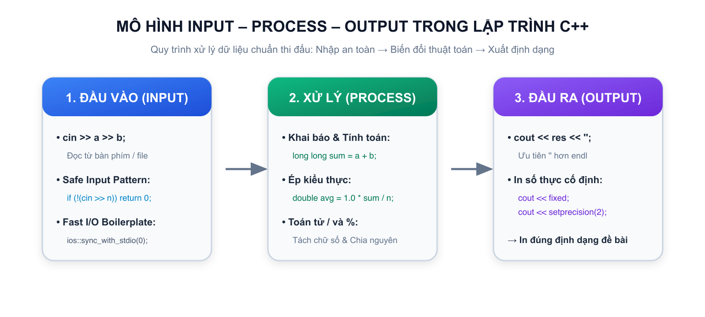
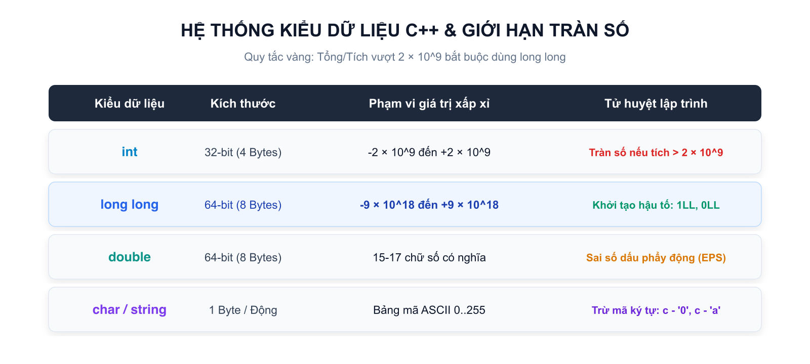

# Bài 01: Biến, kiểu dữ liệu, toán tử & nhập xuất an toàn

## 1. Khung tư duy của một lập trình viên: Mô hình Input – Process – Output



Mọi chương trình máy tính viết ra dù phức tạp hay đơn giản đều vận hành dựa trên một chu trình khép kín gồm ba giai đoạn: **Nhận dữ liệu vào (Input)** $\longrightarrow$ **Xử lý dữ liệu (Process)** $\longrightarrow$ **Xuất kết quả ra (Output)**.

| Giai đoạn | Nhiệm vụ chính | Câu hỏi tự đặt ra trước khi viết code |
|---|---|---|
| **1. Input** | Tiếp nhận dữ liệu đề bài cung cấp | Đề bài cho những giá trị nào Số lượng bao nhiêu Giới hạn nhỏ nhất và lớn nhất là bao nhiêu |
| **2. Process** | Tính toán, biến đổi, kiểm tra điều kiện | Cần dùng công thức toán học nào Cần lưu trữ dữ liệu vào ô nhớ nào Có cần rẽ nhánh hay lặp không |
| **3. Output** | Hiển thị kết quả đúng định dạng | In ra số hay chữ Cách nhau bởi dấu cách hay xuống dòng Lấy bao nhiêu chữ số thập phân |

> **Mẹo nhớ:** Tuyệt đối không viết code ngay khi vừa đọc xong đề bài! Hãy viết ra giấy nháp theo thứ tự:
> 1. Dữ liệu đề bài cho là gì $\implies$ Cần khai báo các biến nào
> 2. Quy tắc tính toán là gì $\implies$ Biểu thức toán học tương ứng là gì
> 3. Kết quả cần in là gì $\implies$ Cú pháp `cout` tương ứng ra sao

---

## 2. Cấu trúc chương trình C++ chuẩn thi đấu (Boilerplate)

Trong thi đấu lập trình và các kỳ thi học sinh giỏi, chương trình C++ được viết theo một cấu trúc tối giản, tốc độ thực thi cao và bảo đảm an toàn bộ nhớ:

```cpp
#include <bits/stdc++.h>
using namespace std;

int main() {
// Kỹ thuật Fast I/O giúp tăng tốc độ đọc và xuất dữ liệu
ios::sync_with_stdio(false);
cin.tie(nullptr);

// 1. Khai báo biến
// 2. Đọc dữ liệu an toàn
// 3. Xử lý tính toán
// 4. In kết quả ra màn hình

return 0;
}
```

### Ý nghĩa từng dòng lệnh:

1. `#include <bits/stdc++.h>`: Thư viện tổng hợp chứa toàn bộ các cấu trúc dữ liệu và hàm tiện ích chuẩn của C++ (nhập xuất `cin`/`cout`, mảng động `vector`, chuỗi `string`, các thuật toán sắp xếp và tìm kiếm). Học sinh không cần khai báo từng thư viện riêng lẻ.
2. `using namespace std;`: Khai báo sử dụng không gian tên chuẩn, giúp ta có thể gọi trực tiếp `cin`, `cout`, `vector`, `string`, `min`, `max`, `sort` mà không cần viết tiền tố rườm rà.
3. `int main()`: Hàm chính của chương trình, nơi hệ điều hành bắt đầu thực thi các dòng lệnh.
4. `ios::sync_with_stdio(false); cin.tie(nullptr);`: Bộ đôi lệnh tối ưu nhập xuất (Fast I/O). Trong các bài thi có tới $10^5$ hoặc $10^6$ dòng dữ liệu, bộ đôi này giúp chương trình chạy nhanh hơn gấp 5 đến 10 lần, tránh bị lỗi chạy quá thời gian (Time Limit Exceeded - TLE).
5. `return 0;`: Báo hiệu cho hệ thống chấm thi rằng chương trình đã kết thúc thành công và không gặp bất kỳ sự cố nào.

---

## 3. Biến và hệ thống kiểu dữ liệu trong C++



> **Biến (Variable)** là một ô nhớ trong bộ nhớ RAM của máy tính được đặt tên để lưu trữ dữ liệu. Mỗi biến khi khai báo bắt buộc phải có một **Kiểu dữ liệu (Data Type)** xác định để máy tính biết cần cấp phát bao nhiêu byte bộ nhớ.

| Kiểu dữ liệu | Kích thước | Phạm vi biểu diễn | Trường hợp nên sử dụng | Ví dụ khai báo |
|---|:---:|---|---|---|
| `int` | 4 bytes (32-bit) | $-2 \times 10^9$ đến $+2 \times 10^9$ | Đếm số lượng nhỏ, chỉ số mảng, số có giá trị dưới 2 tỷ | `int age = 15;` |
| `long long` | 8 bytes (64-bit) | $-9 \times 10^{18}$ đến $+9 \times 10^{18}$ | **Tổng mảng, tích hai số, thời gian, số tiền lớn** | `long long sum = 0;` |
| `double` | 8 bytes (64-bit) | Khoảng 15 chữ số có nghĩa | Điểm trung bình, số thực, tỉ lệ phần trăm, khoảng cách tọa độ | `double score = 8.75;` |
| `char` | 1 byte (8-bit) | 1 ký tự duy nhất trong bảng mã ASCII | Ký tự chữ cái, chữ số, ký hiệu phép toán | `char grade = 'A';` |
| `string` | Động | Chuỗi các ký tự liên tiếp | Tên người, đoạn văn bản, từ ngữ, chuỗi mã hóa | `string name = "An";` |
| `bool` | 1 byte | Đúng (`true` / `1`) hoặc Sai (`false` / `0`) | Cờ đánh dấu, kết quả kiểm tra điều kiện | `bool is_prime = true;` |

### Tử huyệt lập trình: Hiện tượng Tràn số (Integer Overflow)
Kiểu số nguyên `int` chỉ chứa được tối đa xấp xỉ $2.14 \times 10^9$. Khi ta nhân hai số nguyên:
$$a = 10^6, \quad b = 10^6 \implies a \times b = 10^{12}$$
Giá trị $10^{12}$ vượt quá giới hạn của `int`, máy tính sẽ bị tràn số và biến kết quả thành một số âm ngẫu nhiên!
```cpp
// SAI: Tràn số ngay trong phép nhân
int a = 1000000;
int b = 1000000;
long long s = a * b; // Vẫn tràn số! Vì a * b tính trên kiểu int trước rồi mới gán

// ĐÚNG: Khai báo ngay từ đầu bằng long long hoặc ép kiểu
long long a = 1000000;
long long b = 1000000;
long long s = a * b; // Kết quả 1000000000000 hoàn toàn chính xác
```

> **Quy tắc vàng:** Trong lập trình thi đấu, bất cứ khi nào bài toán có phép nhân hai số hoặc tính tổng của một dãy số, hãy ưu tiên sử dụng `long long` để phòng ngừa 100% nguy cơ tràn số!

---

## 4. Nhập xuất an toàn & Định dạng số thực

### 4.1. Đọc dữ liệu bằng `cin` và xuất dữ liệu bằng `cout`
C++ sử dụng dòng vào chuẩn `cin` với toán tử trích xuất `>>` và dòng ra chuẩn `cout` với toán tử chèn `<<`:
```cpp
int a, b;
cin >> a >> b; // Đọc hai số cách nhau bởi khoảng trắng hoặc xuống dòng
cout << a + b << '\n'; // In tổng và xuống dòng bằng '\n'
```

> **Lưu ý:** Hãy dùng `'\n'` thay vì `endl`. Lệnh `endl` sẽ ép máy tính xả bộ đệm (flush buffer) liên tục, làm chậm chương trình nghiêm trọng khi in ra nhiều dòng dữ liệu.

### 4.2. Kỹ thuật Safe Input (Đọc dữ liệu an toàn chống treo chương trình)
Khi đọc các tham số đầu vào quan trọng, hãy tập thói quen kiểm tra dữ liệu vào:
```cpp
long long a, b;
if (!(cin >> a >> b)) return 0; // Nếu file rỗng hoặc hết dữ liệu, kết thúc an toàn
```

### 4.3. Định dạng in số thực bằng `fixed` và `setprecision`
Mặc định `cout` sẽ tự động làm tròn và hiển thị số thực ở dạng khoa học (ví dụ `1e+06`) nếu số quá lớn hoặc in không đủ chữ số thập phân. Để in chính xác $k$ chữ số sau dấu chấm:
```cpp
double avg = 8.0;
cout << fixed << setprecision(2) << avg << '\n'; // In ra chính xác: 8.00
```
- `fixed`: Cố định cách biểu diễn số thập phân thông thường.
- `setprecision(2)`: Yêu cầu lấy đúng 2 chữ số sau dấu chấm phẩy thập phân.

---

## 5. Toán tử số học, phép chia nguyên `/` và chia dư `%`

C++ cung cấp đầy đủ các phép toán số học: cộng `+`, trừ `-`, nhân `*`, chia `/`, và chia lấy phần dư `%`.

### 5.1. Phép chia nguyên `/` và phép chia dư `%`
Đây là hai toán tử quan trọng bậc nhất đối với học sinh mới làm quen với lập trình:

- Khi cả hai toán hạng đều là số nguyên, phép chia `/` thực hiện **chia lấy phần nguyên** (bỏ đi toàn bộ phần lẻ phía sau).
- Toán tử `%` chỉ áp dụng cho số nguyên, trả về **phần dư của phép chia**.

| Phép toán | Kết quả trong C++ | Ý nghĩa toán học |
|:---:|:---:|---|
| `17 / 5` | `3` | Thương nguyên: 17 chia 5 được 3 |
| `17 % 5` | `2` | Phần dư: 17 chia 5 dư 2 ($17 = 3 \times 5 + 2$) |
| `8 / 2` | `4` | Chia hết |
| `8 % 2` | `0` | Phần dư bằng 0 nghĩa là 8 chia hết cho 2 |

### 5.2. Các ứng dụng kinh điển của toán tử `%` và `/`

1. **Kiểm tra chẵn lẻ:**
- `x % 2 == 0`: Số chẵn.
- `x % 2 != 0`: Số lẻ.
2. **Kiểm tra chia hết:** `a % b == 0` nghĩa là $a$ chia hết cho $b$.
3. **Rút trích chữ số tận cùng (Hệ thập phân):**
- Lấy chữ số hàng đơn vị: `don_vi = n % 10;`
- Bỏ chữ số hàng đơn vị: `n = n / 10;`
- Lấy chữ số hàng chục của $N$: `hang_chuc = (n / 10) % 10;`

### 5.3. Bẫy chia nguyên khi tính giá trị trung bình
Khi cần tính kết quả là số thực nhưng dữ liệu đầu vào là các số nguyên:
```cpp
int sum = 23;
int n = 3;

// SAI: 23 / 3 là phép chia nguyên cho ra kết quả 7, sau đó mới gán vào avg
double avg = sum / n; // avg nhận giá trị 7.0 (MẤT PHẦN THẬP PHÂN!)

// ĐÚNG: Ép một trong hai toán hạng về số thực bằng cách nhân với 1.0
double avg = 1.0 * sum / n; // Kết quả: 7.666667 (CHÍNH XÁC)
```

---

## 6. Tổng kết ghi nhớ Bài 01

```text
KHUNG TƯ DUY: Đọc Input -> Tính toán Process -> In Output
BOILERPLATE: #include <bits/stdc++.h> + using namespace std; + Fast I/O
KIỂU DỮ LIỆU: Số nguyên nhỏ dùng int, số lớn hoặc tổng dùng long long, số thực dùng double
TOÁN TỬ: / lấy phần nguyên, % lấy phần dư, 1.0 * a / b để giữ phần thập phân
XUẤT DỮ LIỆU: cout << fixed << setprecision(k) để in đúng k chữ số thập phân
```

---

## 7. Câu hỏi trắc nghiệm củng cố khái niệm (Concept Quiz)

#### Câu 1 (Nhận diện — Recognize):
Đoạn mã cấu trúc (boilerplate) chuẩn thi đấu C++ nào sau đây khai báo đầy đủ Fast I/O và thư viện tổng hợp chuẩn iKHEDU?

- **A.** Thiếu `using namespace std;` và không có cấu hình Fast I/O.
- **B.** **[Đáp án đúng]** `#include <bits/stdc++.h>` đi cùng `using namespace std;` và bộ đôi Fast I/O `ios::sync_with_stdio(false); cin.tie(nullptr);` ở đầu hàm `main()`.
- **C.** Chỉ khai báo hàm `main()` mà không dùng thư viện tổng hợp `#include <bits/stdc++.h>`.
- **D.** Khai báo `using namespace std;` nhưng đặt ngoài cùng sau hàm `main()`.

> *Giải thích:* Trong C++ thi đấu iKHEDU, ta dùng `#include <bits/stdc++.h>` để bao quát toàn bộ thư viện chuẩn của C++, kết hợp `using namespace std;` để gọi trực tiếp các hàm/lệnh, và bộ đôi Fast I/O giúp tăng tốc độ đọc/ghi dữ liệu lên gấp 5–10 lần.

#### Câu 2 (Kiểu dữ liệu & Tràn số — Data Types):
Khi tính tích của hai số nguyên $a$ và $b$ với giới hạn $a, b \le 10^9$, kiểu dữ liệu nào bắt buộc phải sử dụng để lưu kết quả tích $a \times b$?

- **A.** `int` (32-bit có dấu).
- **B.** `float` (số thực độ chính xác đơn).
- **C.** **[Đáp án đúng]** `long long` (64-bit có dấu, lưu được tới $\approx 9 \times 10^{18}$).
- **D.** `short` (16-bit).

> *Giải thích:* Giá trị cực đại của tích là $10^9 \times 10^9 = 10^{18}$, vượt xa ngưỡng cực đại $2 \times 10^9$ của kiểu `int`. Nếu dùng `int` sẽ bị hiện tượng tràn số nguyên (Integer Overflow) ra kết quả sai hoặc số âm.

#### Câu 3 (Toán tử số học — Arithmetic Operators):
Trong C++, kết quả của biểu thức `19 / 4` và `19 % 4` lần lượt là bao nhiêu?

- **A.** `4.75` và `3`.
- **B.** **[Đáp án đúng]** `4` và `3`.
- **C.** `4` và `4`.
- **D.** `5` và `3`.

> *Giải thích:* Khi cả hai toán hạng là số nguyên, toán tử `/` là phép chia lấy phần nguyên ($19 / 4 = 4$), còn toán tử `%` lấy phần dư ($19 = 4 \times 4 + 3 \implies 19 \% 4 = 3$).

#### Câu 4 (Bẫy ép kiểu — Type Casting):
Cho hai biến nguyên `int a = 7, b = 2;`. Câu lệnh nào sau đây tính đúng giá trị trung bình cộng dạng số thực $3.5$?

- **A.** `double ans = a / b;`
- **B.** `double ans = (int)(a / b);`
- **C.** **[Đáp án đúng]** `double ans = 1.0 * a / b;` hoặc `double ans = (double)a / b;`
- **D.** `double ans = a % b;`

> *Giải thích:* Nếu viết `a / b`, máy tính thực hiện phép chia nguyên trước được $3$, sau đó mới gán vào biến `ans` thành $3.0$ (mất phần thập phân). Nhân với `1.0` sẽ ép biểu thức về kiểu `double` trước khi chia.

#### Câu 5 (Rút trích chữ số — Digit Extraction):
Để lấy chữ số hàng chục của một số nguyên dương $N \ge 10$ (ví dụ $N = 358 \implies$ lấy được số $5$), biểu thức nào sau đây là chính xác?

- **A.** `N % 10`
- **B.** `N / 100`
- **C.** **[Đáp án đúng]** `(N / 10) % 10`
- **D.** `N % 100`

> *Giải thích:* Lệnh `N / 10` giúp gạt bỏ chữ số hàng đơn vị ($358 / 10 = 35$), sau đó `% 10` sẽ trích lấy chữ số tận cùng của số mới ($35 \% 10 = 5$).

#### Câu 6 (Định dạng xuất dữ liệu — Output Formatting):
Để in số thực `x` với đúng 2 chữ số sau dấu phẩy thập phân, cú pháp C++ chuẩn là gì?

- **A.** `cout << x << 2;`
- **B.** `cout << round(x);`
- **C.** **[Đáp án đúng]** `cout << fixed << setprecision(2) << x << "\n";`
- **D.** `cout << setprecision(2) << x;`

> *Giải thích:* Cần dùng kết hợp cờ `fixed` và bộ điều khiển `setprecision(2)` để cố định số chữ số phần thập phân xuất ra màn hình.

#### Câu 7 (Đọc dữ liệu an toàn — Safe Input):
Mẫu code nào sau đây giúp đọc dữ liệu an toàn, chống bị crash khi gặp file rỗng hoặc kết thúc tệp (EOF)?

- **A.** `cin >> n;`
- **B.** **[Đáp án đúng]** `if (!(cin >> n)) return 0;`
- **C.** `while (true) cin >> n;`
- **D.** `cin.get();`

> *Giải thích:* Cú pháp `if (!(cin >> n)) return 0;` kiểm tra trạng thái của luồng nhập; nếu đọc thất bại (không có dữ liệu hoặc hết file), chương trình sẽ thoát êm đẹp với mã 0.

#### Câu 8 (Bẫy tràn số trong biểu thức — Intermediate Overflow):
Cho `int a = 1000000; int b = 1000000; long long c;`. Câu lệnh nào sau đây tính đúng giá trị $c = a \times b = 10^{12}$?

- **A.** `c = a * b;`
- **B.** **[Đáp án đúng]** `c = 1LL * a * b;` hoặc `c = (long long)a * b;`
- **C.** `c = (long long)(a * b);`
- **D.** `c = (int)a * b;`

> *Giải thích:* Với `c = a * b;` hoặc `c = (long long)(a * b);`, tích `a * b` được thực hiện trên kiểu `int` 32-bit trước gây tràn số rác rồi mới gán vào `c`. Thêm `1LL *` (số 1 kiểu `long long`) ép phép nhân diễn ra trên miền 64-bit.

#### Câu 9 (Phạm vi biến — Variable Scope):
Khẳng định nào sau đây là **ĐÚNG** về biến trong C++?

- **A.** Có thể đặt tên biến bắt đầu bằng một chữ số (ví dụ: `int 1a = 5;`).
- **B.** Tên biến trong C++ không phân biệt chữ hoa và chữ thường.
- **C.** **[Đáp án đúng]** Tên biến phân biệt chữ hoa, chữ thường (`Sum` khác `sum`) và không được trùng với từ khóa của ngôn ngữ (`int`, `double`, `return`...).
- **D.** Một biến có thể được khai báo lại nhiều lần trong cùng một khối lệnh `{}`.

> *Giải thích:* C++ là ngôn ngữ Case-sensitive (phân biệt hoa thường), biến phải bắt đầu bằng chữ cái hoặc dấu gạch dưới `_`, và không được trùng từ khóa.

#### Câu 10 (Mô hình I-P-O — Computational Thinking):
Thứ tự chuẩn xác nhất của một lập trình viên khi giải quyết một bài toán lập trình là gì?

- **A.** Mở máy gõ code ngay $\longrightarrow$ Chạy thử $\longrightarrow$ Đọc đề bài.
- **B.** Đọc đề $\longrightarrow$ Viết code nộp ngay $\longrightarrow$ Đọc giải thích test khi bị sai.
- **C.** **[Đáp án đúng]** Phân tích Input (xác định kiểu dữ liệu & giới hạn) $\longrightarrow$ Thiết kế Process (công thức toán, bẫy tràn số) $\longrightarrow$ Định dạng Output $\longrightarrow$ Viết code & Test thử các trường hợp biên.
- **D.** Tìm code mẫu trên mạng $\longrightarrow$ Dán vào trình chấm.

> *Giải thích:* Tư duy I-P-O (Input - Process - Output) kết hợp kiểm soát cận dữ liệu và test biên là nền tảng cốt lõi giúp viết code chuẩn xác ngay từ lần nộp đầu tiên.

---

## 8. Ma trận bài tập thực hành (P0 → P2)

| STT | Mã Bài | Tên Bài Toán | Cấp Độ | Ràng Buộc Dữ Liệu | Mục Tiêu Rèn Luyện |
|:---:|:---:|---|:---:|---|---|
| 01 | `CPPB-L0-01` | **Tính Tổng Hai Số** | `P0` | $-10^9 \le a, b \le 10^9$ | Cú pháp `cin`/`cout`, boilerplate chuẩn Fast I/O |
| 02 | `CPPB-L0-02` | **Tính Chu Vi & Diện Tích Hình Chữ Nhật** | `P0` | $1 \le a, b \le 10^9$ | Biểu thức số học, tránh tràn số với tích `long long` |
| 03 | `CPPB-L0-03` | **Tính Giá Trị Trung Bình Cộng Ba Số** | `P1` | $0 \le a, b, c \le 10$ | Ép kiểu số thực `1.0 * sum / 3`, định dạng `fixed` `setprecision` |
| 04 | `CPPB-L0-04` | **Tìm Chữ Số Hàng Đơn Vị** | `P1` | $10 \le N \le 10^9$ | Ứng dụng phép chia dư `% 10` rút trích chữ số |
| 05 | `CPPB-L0-05` | **Tổng Chữ Số Của Số Có Ba Chữ Số** | `P1` | $100 \le N \le 999$ | Tách các chữ số hàng trăm, chục, đơn vị bằng `/` và `%` |
| 06 | `CPPB-L0-06` | **Chia Kẹo Trung Thu** | `P1` | $1 \le N, K \le 10^9$ | Phép chia nguyên `/` (thương) và chia dư `%` (dư) số lớn `long long` |
| 07 | `CPPB-L0-07` | **Đổi Thời Gian Từ Giờ Phút Sang Giây** | `P2` | $0 \le T \le 10^9$ | Phép chia nguyên `/` và chia dư `%` liên hoàn |
| 08 | `CPPB-L0-08` | **Tính Tiền Mua Vở Có Khuyến Mãi** | `P2` | $1 \le N \le 10^9, 1 \le P \le 10^6$ | Xử lý phép toán thực tế, kiểm soát tràn số trung gian `1LL` |

