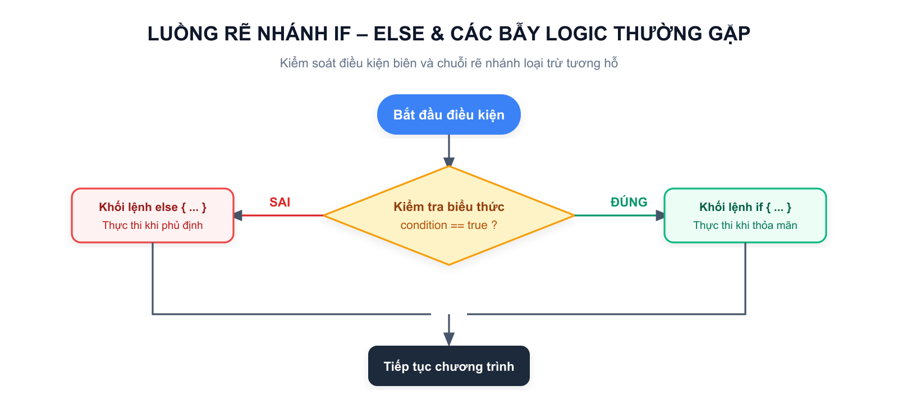
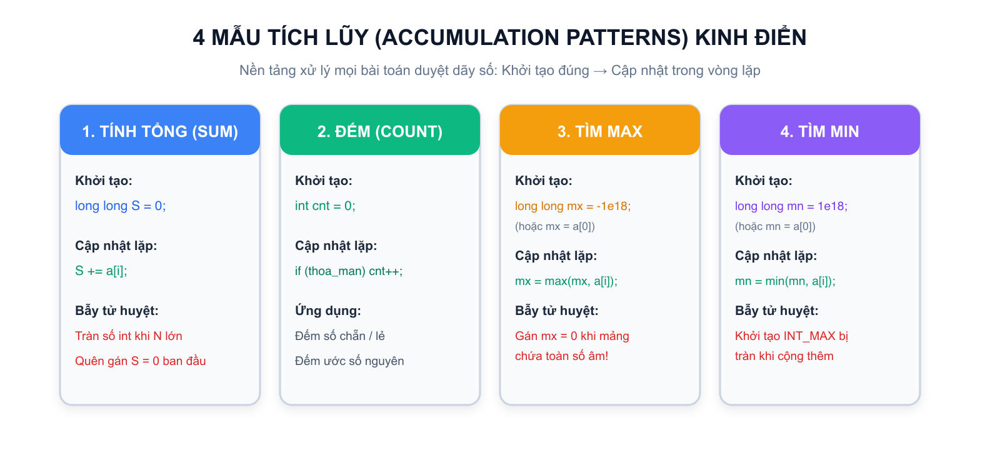
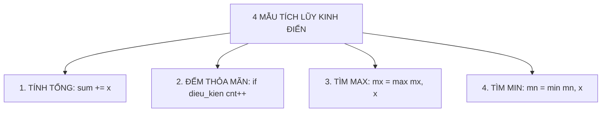

# Bài 02: Cấu trúc rẽ nhánh & cấu trúc vòng lặp

## 1. Cấu trúc rẽ nhánh: Kiểm soát ngã rẽ chương trình



Trong thực tế, máy tính không chỉ thực hiện tuần tự các dòng lệnh từ trên xuống dưới mà phải đưa ra quyết định dựa trên các điều kiện cụ thể. Trong C++, điều này được thực hiện thông qua câu lệnh điều kiện `if`, `else if`, và `else`.

### 1.1. Cú pháp cơ bản
```cpp
if (dieu_kien) {
// Khối lệnh thực hiện khi dieu_kien ĐÚNG (true)
} else {
// Khối lệnh thực hiện khi dieu_kien SAI (false)
}
```

### 1.2. Chuỗi rẽ nhánh nhiều trường hợp loại trừ nhau
Khi một bài toán có nhiều trường hợp phụ thuộc vào các ngưỡng giá trị (ví dụ xếp loại học sinh, tính thuế, phân loại cước phí), ta sử dụng cấu trúc chuỗi:
```cpp
if (score >= 8.0) {
cout << "GIOI\n";
} else if (score >= 6.5) {
// Khi chạy đến đây, máy tính đã ngầm hiểu score < 8.0
cout << "KHA\n";
} else if (score >= 5.0) {
// Tương tự, tại đây ngầm hiểu score < 6.5
cout << "TRUNG BINH\n";
} else {
cout << "CHUA DAT\n";
}
```

> **Tử huyệt lập trình số 1:** Tuyệt đối không nhầm lẫn giữa toán tử gán `=` và toán tử so sánh bằng `==`!
> - `a = b`: Gán giá trị của $b$ cho biến $a$.
> - `a == b`: So sánh xem giá trị của $a$ có bằng $b$ hay không (trả về `true` hoặc `false`).
> Nếu viết `if (a = 5)`, biểu thức gán này luôn có giá trị 5 (khác 0 tức là `true`), câu lệnh `if` sẽ luôn luôn được thực thi bất kể $a$ ban đầu bằng bao nhiêu!

---

## 2. Toán tử so sánh và Toán tử logic

### 2.1. Bảng toán tử so sánh trong C++
| Toán tử | Ý nghĩa toán học | Ví dụ hợp lệ |
|:---:|:---:|:---:|
| `==` | So sánh bằng nhau | `x == 10` |
| `!=` | So sánh khác nhau | `x != 0` |
| `>` | Lớn hơn hẳn | `age > 18` |
| `<` | Nhỏ hơn hẳn | `score < 5.0` |
| `>=` | Lớn hơn hoặc bằng | `score >= 8.0` |
| `<=` | Nhỏ hơn hoặc bằng | `n <= 100` |

### 2.2. Bảng toán tử logic kết hợp
| Toán tử | Tên gọi | Quy tắc chân trị | Ví dụ thực tế |
|:---:|:---:|---|---|
| `&&` | VÀ (AND) | Chỉ đúng khi **TẤT CẢ** các điều kiện con đều đúng | Ba cạnh tam giác: `a + b > c && a + c > b && b + c > a` |
| `||` | HOẶC (OR) | Đúng khi có **ÍT NHẤT MỘT** điều kiện con đúng | Năm nhuận: `y % 400 == 0 || (y % 4 == 0 && y % 100 != 0)` |
| `!` | PHỦ ĐỊNH (NOT) | Đảo ngược đúng thành sai, sai thành đúng | `!is_prime` (nếu không phải là số nguyên tố) |

---

## 3. Cấu trúc vòng lặp: Làm một việc nhiều lần

Khi cần lặp đi lặp lại một thao tác (như duyệt $N$ phần tử, tính tổng dồn, đếm số lượng), con người nhanh mệt mỏi nhưng máy tính có thể thực hiện hàng trăm triệu phép tính trong một giây thông qua **Vòng lặp**.

Trước khi viết bất kỳ vòng lặp nào, hãy luôn tự trả lời **3 câu hỏi bất biến**:

1. **Việc gì được lặp lại** (Cộng dồn In ra Kiểm tra)
2. **Biến nào thay đổi sau mỗi lần lặp** (Biến chỉ số $i$ tăng thêm 1 đơn vị)
3. **Khi nào vòng lặp dừng lại** (Khi $i > N$ hoặc khi $N = 0$)

### 3.1. Vòng lặp `for`: Khi biết trước số lần lặp
Cú pháp:
```cpp
for (khoi_tao; dieu_kien_lap; buoc_nhay) {
// Thân vòng lặp
}
```
Ví dụ: Tính tổng các số từ $1$ đến $N$:
```cpp
long long sum = 0;
for (int i = 1; i <= n; i++) {
sum += i;
}
```

### 3.2. Vòng lặp `while`: Khi lặp theo một điều kiện
Vòng lặp `while` tiếp tục thực hiện chừng nào điều kiện trong ngoặc còn đúng:
```cpp
while (dieu_kien) {
// Khối lệnh
// Bắt buộc phải có câu lệnh làm thay đổi dieu_kien để tránh lặp vô tận!
}
```
Ví dụ: Rút trích từng chữ số của số nguyên dương $N$:
```cpp
while (n > 0) {
int digit = n % 10; // Lấy chữ số cuối
sum_digits += digit; // Cộng tích lũy
n /= 10; // Bỏ chữ số cuối đi
}
```

### 3.3. Đọc dữ liệu đến khi hết file bằng `while (cin >> x)`
Trong nhiều đề thi HSG hoặc nền tảng Online Judge, đề bài không cho trước số lượng phần tử $N$ mà yêu cầu đọc cho đến khi hết dữ liệu:
```cpp
long long x;
long long sum = 0;
while (cin >> x) {
sum += x;
}
```

---

## 4. Bốn mẫu tích lũy kinh điển



Mọi bài toán vòng lặp cơ bản đều xoay quanh 4 mẫu tích lũy cốt lõi sau:



| Mẫu tích lũy | Ý nghĩa | Giá trị khởi tạo chuẩn | Cú pháp trong vòng lặp |
|---|---|---|---|
| **1. Tính tổng** | Cộng dồn các giá trị | `long long sum = 0;` | `sum += x;` |
| **2. Đếm số lượng** | Đếm phần tử thỏa mãn tính chất | `int cnt = 0;` | `if (x % 2 == 0) cnt++;` |
| **3. Tìm Max** | Lưu phần tử lớn nhất đã gặp | `long long mx = a[0];` hoặc `mx = -1e18;` | `mx = max(mx, x);` |
| **4. Tìm Min** | Lưu phần tử nhỏ nhất đã gặp | `long long mn = a[0];` hoặc `mn = 1e18;` | `mn = min(mn, x);` |

### Bẫy khởi tạo giá trị cực trị

- **Khi tìm Max:** Không được khởi tạo `mx = 0` nếu dãy có thể chứa toàn số âm (ví dụ: mảng `[-5, -2, -9]` có max là `-2`, nhưng nếu để `mx = 0` thì kết quả in ra sẽ là `0` sai hoàn toàn!). Cách tốt nhất: `mx = a[0]`.
- **Khi tìm Min:** Tương tự, phải khởi tạo `mn = a[0]` hoặc một số vô cùng lớn `mn = 2e18`.

---

## 5. Kỹ thuật lập bảng Trace tay để tự kiểm tra lỗi

Khi viết một vòng lặp và kết quả ra không như mong muốn, đừng đoán mò! Hãy vẽ một bảng theo dõi từng bước chạy của biến:

**Ví dụ:** Mô phỏng vòng lặp tính tổng $S = 1 + 2 + 3 + 4$ với `sum = 0`:

| Bước lặp ($i$) | Giá trị $i$ trước cộng | Thao tác cộng dồn | Giá trị `sum` sau cộng | Điều kiện $i \le 4$ tiếp theo |
|:---:|:---:|:---:|:---:|:---:|
| Khởi tạo | — | — | `0` | $1 \le 4$ (Đúng, vào lặp) |
| Lần 1 | `1` | `sum = 0 + 1` | `1` | $2 \le 4$ (Đúng) |
| Lần 2 | `2` | `sum = 1 + 2` | `3` | $3 \le 4$ (Đúng) |
| Lần 3 | `3` | `sum = 3 + 3` | `6` | $4 \le 4$ (Đúng) |
| Lần 4 | `4` | `sum = 6 + 4` | `10` | $5 \le 4$ (Sai $\implies$ DỪNG) |

$$\implies 	ext{Kết quả cuối cùng: } \mathbf{10}$$

---

## 6. Tổng kết ghi nhớ Bài 02

```text
RẼ NHÁNH: if (đúng) ... else if (đúng) ... else ...
SO SÁNH: Dùng == để so sánh bằng, cấm dùng =
LOGIC: && là VÀ (cả hai phải đúng), || là HOẶC (chỉ cần một đúng)
VÒNG LẶP: for khi biết số lần, while khi lặp theo điều kiện
TÍCH LŨY: sum = 0 (tổng), cnt = 0 (đếm), mx = a[0] (max), mn = a[0] (min)
TRACE TAY: Kẻ bảng theo dõi biến từng bước để bắt sạch mọi lỗi sai
```
