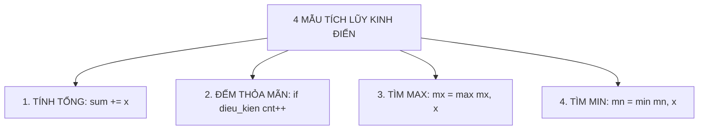

# Bài 02: Cấu trúc rẽ nhánh & cấu trúc vòng lặp

## 1. Cấu trúc rẽ nhánh: Kiểm soát ngã rẽ chương trình


Trong thực tế, máy tính không chỉ thực hiện tuần tự các dòng lệnh từ trên xuống dưới mà phải đưa ra quyết định dựa trên các điều kiện cụ thể. Trong C++, điều này được thực hiện thông qua câu lệnh điều kiện `if`, `else if`, và `else`.

### 1.1. Cú pháp cơ bản
```cpp
if (dieu_kien) {
// Khối lệnh thực hiện khi dieu_kien ĐÚNG (true)
} else {
// Khối lệnh thực hiện khi dieu_kien SAI (false)
}
```

### 1.2. Chuỗi rẽ nhánh nhiều trường hợp loại trừ nhau
Khi một bài toán có nhiều trường hợp phụ thuộc vào các ngưỡng giá trị (ví dụ xếp loại học sinh, tính thuế, phân loại cước phí), ta sử dụng cấu trúc chuỗi:
```cpp
if (score >= 8.0) {
cout << "GIOI\n";
} else if (score >= 6.5) {
// Khi chạy đến đây, máy tính đã ngầm hiểu score < 8.0
cout << "KHA\n";
} else if (score >= 5.0) {
// Tương tự, tại đây ngầm hiểu score < 6.5
cout << "TRUNG BINH\n";
} else {
cout << "CHUA DAT\n";
}
```

> **Tử huyệt lập trình số 1:** Tuyệt đối không nhầm lẫn giữa toán tử gán `=` và toán tử so sánh bằng `==`!
> - `a = b`: Gán giá trị của $b$ cho biến $a$.
> - `a == b`: So sánh xem giá trị của $a$ có bằng $b$ hay không (trả về `true` hoặc `false`).
> Nếu viết `if (a = 5)`, biểu thức gán này luôn có giá trị 5 (khác 0 tức là `true`), câu lệnh `if` sẽ luôn luôn được thực thi bất kể $a$ ban đầu bằng bao nhiêu!

---

## 2. Toán tử so sánh và Toán tử logic

### 2.1. Bảng toán tử so sánh trong C++
| Toán tử | Ý nghĩa toán học | Ví dụ hợp lệ |
|:---:|:---:|:---:|
| `==` | So sánh bằng nhau | `x == 10` |
| `!=` | So sánh khác nhau | `x != 0` |
| `>` | Lớn hơn hẳn | `age > 18` |
| `<` | Nhỏ hơn hẳn | `score < 5.0` |
| `>=` | Lớn hơn hoặc bằng | `score >= 8.0` |
| `<=` | Nhỏ hơn hoặc bằng | `n <= 100` |

### 2.2. Bảng toán tử logic kết hợp
| Toán tử | Tên gọi | Quy tắc chân trị | Ví dụ thực tế |
|:---:|:---:|---|---|
| `&&` | VÀ (AND) | Chỉ đúng khi **TẤT CẢ** các điều kiện con đều đúng | Ba cạnh tam giác: `a + b > c && a + c > b && b + c > a` |
| `||` | HOẶC (OR) | Đúng khi có **ÍT NHẤT MỘT** điều kiện con đúng | Năm nhuận: `y % 400 == 0 || (y % 4 == 0 && y % 100 != 0)` |
| `!` | PHỦ ĐỊNH (NOT) | Đảo ngược đúng thành sai, sai thành đúng | `!is_prime` (nếu không phải là số nguyên tố) |

---

## 3. Cấu trúc vòng lặp: Làm một việc nhiều lần

Khi cần lặp đi lặp lại một thao tác (như duyệt $N$ phần tử, tính tổng dồn, đếm số lượng), con người nhanh mệt mỏi nhưng máy tính có thể thực hiện hàng trăm triệu phép tính trong một giây thông qua **Vòng lặp**.

Trước khi viết bất kỳ vòng lặp nào, hãy luôn tự trả lời **3 câu hỏi bất biến**:

1. **Việc gì được lặp lại** (Cộng dồn In ra Kiểm tra)
2. **Biến nào thay đổi sau mỗi lần lặp** (Biến chỉ số $i$ tăng thêm 1 đơn vị)
3. **Khi nào vòng lặp dừng lại** (Khi $i > N$ hoặc khi $N = 0$)

### 3.1. Vòng lặp `for`: Khi biết trước số lần lặp
Cú pháp:
```cpp
for (khoi_tao; dieu_kien_lap; buoc_nhay) {
// Thân vòng lặp
}
```
Ví dụ: Tính tổng các số từ $1$ đến $N$:
```cpp
long long sum = 0;
for (int i = 1; i <= n; i++) {
sum += i;
}
```

### 3.2. Vòng lặp `while`: Khi lặp theo một điều kiện
Vòng lặp `while` tiếp tục thực hiện chừng nào điều kiện trong ngoặc còn đúng:
```cpp
while (dieu_kien) {
// Khối lệnh
// Bắt buộc phải có câu lệnh làm thay đổi dieu_kien để tránh lặp vô tận!
}
```
Ví dụ: Rút trích từng chữ số của số nguyên dương $N$:
```cpp
while (n > 0) {
int digit = n % 10; // Lấy chữ số cuối
sum_digits += digit; // Cộng tích lũy
n /= 10; // Bỏ chữ số cuối đi
}
```

### 3.3. Đọc dữ liệu đến khi hết file bằng `while (cin >> x)`
Trong nhiều đề thi HSG hoặc nền tảng Online Judge, đề bài không cho trước số lượng phần tử $N$ mà yêu cầu đọc cho đến khi hết dữ liệu:
```cpp
long long x;
long long sum = 0;
while (cin >> x) {
sum += x;
}
```

---

## 4. Bốn mẫu tích lũy kinh điển


Mọi bài toán vòng lặp cơ bản đều xoay quanh 4 mẫu tích lũy cốt lõi sau:



| Mẫu tích lũy | Ý nghĩa | Giá trị khởi tạo chuẩn | Cú pháp trong vòng lặp |
|---|---|---|---|
| **1. Tính tổng** | Cộng dồn các giá trị | `long long sum = 0;` | `sum += x;` |
| **2. Đếm số lượng** | Đếm phần tử thỏa mãn tính chất | `int cnt = 0;` | `if (x % 2 == 0) cnt++;` |
| **3. Tìm Max** | Lưu phần tử lớn nhất đã gặp | `long long mx = a[0];` hoặc `mx = -1e18;` | `mx = max(mx, x);` |
| **4. Tìm Min** | Lưu phần tử nhỏ nhất đã gặp | `long long mn = a[0];` hoặc `mn = 1e18;` | `mn = min(mn, x);` |

### Bẫy khởi tạo giá trị cực trị

- **Khi tìm Max:** Không được khởi tạo `mx = 0` nếu dãy có thể chứa toàn số âm (ví dụ: mảng `[-5, -2, -9]` có max là `-2`, nhưng nếu để `mx = 0` thì kết quả in ra sẽ là `0` sai hoàn toàn!). Cách tốt nhất: `mx = a[0]`.
- **Khi tìm Min:** Tương tự, phải khởi tạo `mn = a[0]` hoặc một số vô cùng lớn `mn = 2e18`.

---

## 5. Kỹ thuật lập bảng Trace tay để tự kiểm tra lỗi

Khi viết một vòng lặp và kết quả ra không như mong muốn, đừng đoán mò! Hãy vẽ một bảng theo dõi từng bước chạy của biến:

**Ví dụ:** Mô phỏng vòng lặp tính tổng $S = 1 + 2 + 3 + 4$ với `sum = 0`:

| Bước lặp ($i$) | Giá trị $i$ trước cộng | Thao tác cộng dồn | Giá trị `sum` sau cộng | Điều kiện $i \le 4$ tiếp theo |
|:---:|:---:|:---:|:---:|:---:|
| Khởi tạo | — | — | `0` | $1 \le 4$ (Đúng, vào lặp) |
| Lần 1 | `1` | `sum = 0 + 1` | `1` | $2 \le 4$ (Đúng) |
| Lần 2 | `2` | `sum = 1 + 2` | `3` | $3 \le 4$ (Đúng) |
| Lần 3 | `3` | `sum = 3 + 3` | `6` | $4 \le 4$ (Đúng) |
| Lần 4 | `4` | `sum = 6 + 4` | `10` | $5 \le 4$ (Sai $\implies$ DỪNG) |

$$\implies 	ext{Kết quả cuối cùng: } \mathbf{10}$$

---

## 6. Tổng kết ghi nhớ Bài 02

```text
RẼ NHÁNH: if (đúng) ... else if (đúng) ... else ...
SO SÁNH: Dùng == để so sánh bằng, cấm dùng =
LOGIC: && là VÀ (cả hai phải đúng), || là HOẶC (chỉ cần một đúng)
VÒNG LẶP: for khi biết số lần, while khi lặp theo điều kiện
TÍCH LŨY: sum = 0 (tổng), cnt = 0 (đếm), mx = a[0] (max), mn = a[0] (min)
TRACE TAY: Kẻ bảng theo dõi biến từng bước để bắt sạch mọi lỗi sai
```

---

## 7. Câu hỏi trắc nghiệm củng cố khái niệm (Concept Quiz)

#### Câu 1 (Bẫy toán tử gán vs so sánh — Syntax Trap):
Đoạn code sau đây in ra kết quả gì màn hình khi chạy?
```cpp
int x = 5;
if (x = 10) {
    cout << "Dung";
} else {
    cout << "Sai";
}
```

- **A.** In ra `Sai`.
- **B.** **[Đáp án đúng]** In ra `Dung` (và giá trị biến `x` bị thay đổi thành `10`).
- **C.** Báo lỗi biên dịch không chạy được.
- **D.** Không in ra gì cả.

> *Giải thích:* Lệnh `x = 10` là phép gán giá trị $10$ cho $x$. Biểu thức gán này trả về giá trị $10$ (khác 0 nên tương đương `true`), khiến nhánh `if` luôn được thực thi. Để so sánh bằng, bắt buộc phải dùng hai dấu bằng `==`.

#### Câu 2 (Toán tử logic kết hợp — Logical Operators):
Điều kiện nào sau đây kiểm tra chính xác: "Số nguyên $N$ là số dương chẵn" ($N > 0$ và $N$ chia hết cho 2)?

- **A.** `if (N > 0 || N % 2 == 0)`
- **B.** **[Đáp án đúng]** `if (N > 0 && N % 2 == 0)`
- **C.** `if (N > 0 & N % 2 == 0)`
- **D.** `if (0 < N % 2 == 0)`

> *Giải thích:* Toán tử `&&` (VÀ logic) yêu cầu cả hai điều kiện đồng thời phải đúng. Toán tử `||` là HOẶC chỉ cần một trong hai đúng.

#### Câu 3 (Cấu trúc If-Else If đa nhánh — Branching Flow):
Xét đoạn code sau với `int diem = 7;`:
```cpp
if (diem >= 5) cout << "Dat ";
if (diem >= 8) cout << "Gioi ";
else cout << "Can co gang ";
```
Màn hình sẽ hiển thị kết quả gì?

- **A.** `Dat `
- **B.** `Can co gang `
- **C.** **[Đáp án đúng]** `Dat Can co gang `
- **D.** `Gioi `

> *Giải thích:* Do viết 2 lệnh `if` độc lập thay vì `else if`, lệnh `if (diem >= 5)` in ra `Dat `, sau đó lệnh `if (diem >= 8) ... else ...` thứ hai kiểm tra `7 >= 8` (sai) nên rơi vào nhánh `else` in tiếp `Can co gang `.

#### Câu 4 (Vòng lặp For & Biến đếm — Loop Counting):
Vòng lặp `for (int i = 1; i <= 10; i += 2)` sẽ thực hiện bao nhiêu lần lặp và giá trị của $i$ ở các bước lặp là gì?

- **A.** 10 lần: $1, 2, 3, 4, 5, 6, 7, 8, 9, 10$.
- **B.** **[Đáp án đúng]** 5 lần: $1, 3, 5, 7, 9$.
- **C.** 4 lần: $1, 3, 5, 7$.
- **D.** Vòng lặp vô tận.

> *Giải thích:* $i$ bắt đầu từ 1, sau mỗi lần tăng thêm 2 đơn vị: $i = 1, 3, 5, 7, 9$. Khi $i = 11$, điều kiện $11 \le 10$ sai nên vòng lặp dừng. Tổng cộng 5 lần lặp.

#### Câu 5 (Vòng lặp While & Điều kiện dừng — Loop Invariant):
Đoạn code sau đây thực hiện bao nhiêu lần lặp trước khi kết thúc?
```cpp
int n = 16;
while (n > 1) {
    n /= 2;
}
```

- **A.** 3 lần.
- **B.** **[Đáp án đúng]** 4 lần (các giá trị của $n$ sau mỗi bước lần lượt là $8, 4, 2, 1$).
- **C.** 5 lần.
- **D.** Vòng lặp vô tận do $n$ không bao giờ giảm về 0.

> *Giải thích:* Các bước biến đổi của $n$: Khởi tạo $16 \longrightarrow$ Lần 1: $n = 8 > 1 \longrightarrow$ Lần 2: $n = 4 > 1 \longrightarrow$ Lần 3: $n = 2 > 1 \longrightarrow$ Lần 4: $n = 1$ (điều kiện $1 > 1$ sai $\implies$ DỪNG). Tổng cộng 4 lần lặp.

#### Câu 6 (Bẫy vòng lặp vô tận — Infinite Loop Trap):
Đoạn code nào sau đây sẽ dẫn đến lỗi chạy quá thời gian (Time Limit Exceeded - TLE) do vòng lặp vô tận?

- **A.** `for (int i = 0; i < n; ++i) sum += i;`
- **B.** **[Đáp án đúng]** `int i = 1; while (i <= 10) { cout << i; }`
- **C.** `for (int i = 10; i >= 1; --i) cout << i;`
- **D.** `while (n > 0) { n /= 10; }`

> *Giải thích:* Trong phương án B, bên trong thân vòng lặp `while` biến $i$ không hề được tăng giá trị (`i++`), do đó điều kiện $i \le 10$ (với $i=1$) luôn luôn đúng $\implies$ lặp vô tận.

#### Câu 7 (Lệnh Break và Continue — Control Flow):
Khẳng định nào sau đây là **CHÍNH XÁC** về tác dụng của `break` và `continue` trong C++?

- **A.** `break` bỏ qua bước lặp hiện tại; `continue` thoát hẳn khỏi vòng lặp.
- **B.** Cả hai lệnh đều lập tức kết thúc toàn bộ chương trình.
- **C.** **[Đáp án đúng]** `break` lập tức thoát khỏi vòng lặp gần nhất chứa nó; `continue` bỏ qua phần còn lại của thân vòng lặp hiện tại và nhảy sang bước lặp tiếp theo.
- **D.** `continue` chỉ được dùng trong cấu trúc `switch-case`.

> *Giải thích:* `break` phá vỡ vòng lặp lập tức; `continue` chỉ bỏ qua các câu lệnh phía dưới nó trong lượt lặp hiện tại và tiến hành bước tăng biến đếm của lượt kế tiếp.

#### Câu 8 (Bẫy khởi tạo giá trị Min/Max — Boundary Initialization):
Khi tìm giá trị nhỏ nhất `mn` trong một dãy số nguyên gồm $N$ phần tử mà các phần tử có thể có giá trị âm hoặc dương bất kỳ trong đoạn $[-10^9, 10^9]$, cách khởi tạo nào sau đây là **AN TOÀN NHẤT**?

- **A.** `int mn = 0;`
- **B.** `int mn = -1e9;`
- **C.** **[Đáp án đúng]** `long long mn = a[0];` (lấy phần tử đầu tiên làm mốc) hoặc `long long mn = 2e18;` (vô cùng lớn).
- **D.** `int mn = 1000;`

> *Giải thích:* Nếu khởi tạo `mn = 0`, khi toàn bộ dãy số đều là các số dương (ví dụ `[5, 8, 12]`), kết quả in ra sẽ là `0` sai hoàn toàn vì `0` không thuộc dãy. Khởi tạo `mn = a[0]` luôn đảm bảo chính xác.

#### Câu 9 (Bất đẳng thức tam giác — Geometry Logic):
Ba số thực dương $a, b, c$ lập thành ba cạnh của một tam giác khi và chỉ khi thỏa mãn điều kiện nào sau đây?

- **A.** `a + b > c || a + c > b || b + c > a`
- **B.** **[Đáp án đúng]** `a + b > c && a + c > b && b + c > a` (và $a > 0, b > 0, c > 0$).
- **C.** `a * a + b * b == c * c`
- **D.** `a + b + c > 0`

> *Giải thích:* Theo bất đẳng thức tam giác, tổng độ dài của hai cạnh bất kỳ phải luôn lớn hơn cạnh còn lại. Cả ba điều kiện phải đồng thời xảy ra nên dùng toán tử `&&`.

#### Câu 10 (Ứng dụng vòng lặp tách chữ số — Digit Processing):
Để tính tổng các chữ số của một số nguyên dương $N$ (ví dụ $N = 456 \implies 4 + 5 + 6 = 15$), mẫu vòng lặp chuẩn nào sau đây được áp dụng?

- **A.** `for (int i = 1; i <= N; ++i) sum += i;`
- **B.** **[Đáp án đúng]** `while (N > 0) { sum += N % 10; N /= 10; }`
- **C.** `while (N > 0) { sum += N / 10; N %= 10; }`
- **D.** `if (N > 0) { sum += N % 10; }`

> *Giải thích:* Trong mỗi lượt lặp, `N % 10` lấy chữ số hàng đơn vị cộng vào `sum`, sau đó `N /= 10` vứt bỏ chữ số hàng đơn vị. Quá trình lặp liên tục cho đến khi $N = 0$.

---

## 8. Ma trận bài tập thực hành (P0 → P2)

| STT | Mã Bài | Tên Bài Toán | Cấp Độ | Ràng Buộc Dữ Liệu | Mục Tiêu Rèn Luyện |
|:---:|:---:|---|:---:|---|---|
| 01 | `CPPB-L0-09` | **Tìm Số Lớn Hơn Trong Hai Số** | `P0` | $-10^9 \le a, b \le 10^9$ | Cấu trúc `if-else` cơ bản, hàm `max(a, b)` |
| 02 | `CPPB-L0-10` | **Kiểm Tra Tính Chẵn Lẻ Của Số Nguyên** | `P0` | $-10^{18} \le N \le 10^{18}$ | Xử lý số âm với toán tử `% 2 != 0`, kiểu `long long` |
| 03 | `CPPB-L0-11` | **Kiểm Tra Điều Kiện Ba Cạnh Tam Giác** | `P1` | $1 \le a, b, c \le 10^9$ | Kết hợp nhiều điều kiện bằng toán tử logic `&&` |
| 04 | `CPPB-L0-12` | **Xếp Loại Học Lực Theo Điểm Số** | `P1` | $-10.0 \le S \le 20.0$ | Cấu trúc `if - else if - else` phân nhánh khoảng giá trị |
| 05 | `CPPB-L0-13` | **Tính Tổng Các Số Từ 1 Đến N** | `P0` | $1 \le N \le 10^6$ | Vòng lặp `for` tích lũy tổng, kiểm soát biến `long long` |
| 06 | `CPPB-L0-14` | **Đếm Số Lượng Ước Số Nguyên Dương** | `P1` | $1 \le N \le 10^5$ | Vòng lặp duyệt kết hợp điều kiện chia hết `N % i == 0` |
| 07 | `CPPB-L0-15` | **Kiểm Tra Năm Nhuận Theo Dương Lịch** | `P1` | $1 \le Y \le 10^5$ | Rèn luyện biểu thức logic phức hợp `(Y % 400 == 0 || ...)` |
| 08 | `CPPB-L0-16` | **Đếm Số Chữ Số & Tính Tổng Các Chữ Số** | `P2` | $0 \le N \le 10^{18}$ | Vòng lặp `while (N > 0)` trích xuất chữ số và xử lý test $N = 0$ |

