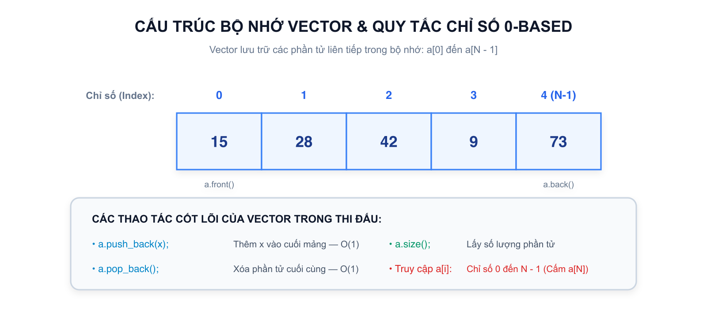
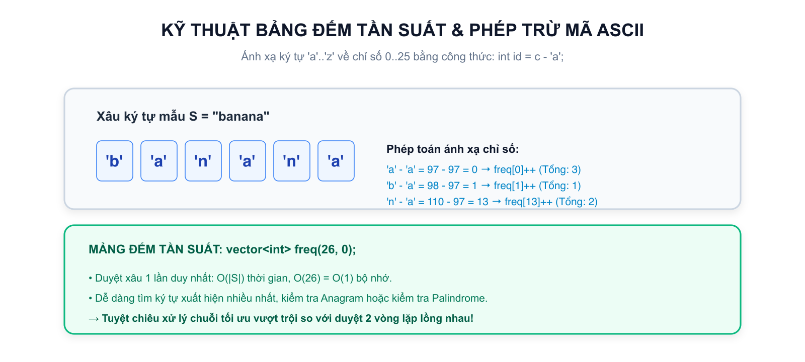

# Bài 03: Mảng 1 chiều, vector, xâu ký tự & tổ chức hàm

## 1. Mảng 1 chiều & Cấu trúc dữ liệu hiện đại: `vector<int>`



Khi cần xử lý điểm số của $1000$ học sinh hoặc tọa độ của $10^5$ điểm, ta không thể khai báo $1000$ biến riêng lẻ như `a1, a2, ..., a1000`. C++ cung cấp **Mảng 1 chiều** để gom các biến cùng kiểu dữ liệu vào một dãy liên tiếp trong bộ nhớ.

Trong C++ hiện đại và chuẩn lập trình thi đấu, **`vector` là cấu trúc mảng động được ưu tiên sử dụng 100%** thay cho mảng tĩnh cổ điển (`int a[100]`) vì:

1. **Quản lý kích thước linh hoạt:** Có thể khai báo đúng số lượng $N$ sau khi đọc từ bàn phím.
2. **An toàn bộ nhớ:** Tự động giải phóng khi ra khỏi phạm vi hàm, không bị tràn bộ nhớ Stack.
3. **Tương thích toàn diện:** Tương thích trực tiếp với các thuật toán chuẩn như `sort`, `reverse`, `min_element`.

### Bảng chữ ký hàm STL Algorithm dùng với `vector` (học thuộc trước khi làm bài tập)

Học sinh chưa cần hiểu con trỏ/iterator là gì — chỉ cần nhớ quy tắc: mọi hàm dưới đây đều nhận cặp **`first` (vị trí đầu) và `last` (vị trí sau phần tử cuối)**, với `vector<int> a` thì `first` là `a.begin()` và `last` là `a.end()`.

| Hàm | Tham số (`first`, `last`) | Trả về / Kết quả |
|:---|:---|:---|
| `reverse(a.begin(), a.end())` | Toàn bộ vector cần đảo ngược | Đảo ngược cả vector tại chỗ, ví dụ $[1, 2, 3] \to [3, 2, 1]$ |
| `*max_element(a.begin(), a.end())` | Toàn bộ vector cần tìm | **Giá trị** lớn nhất (dấu `*` phía trước để lấy giá trị, không phải vị trí) |
| `max_element(a.begin(), a.end()) - a.begin()` | Toàn bộ vector cần tìm | **Chỉ số (0-based)** của phần tử lớn nhất đầu tiên |
| `*min_element(a.begin(), a.end())` | Toàn bộ vector cần tìm | **Giá trị** nhỏ nhất |
| `min_element(a.begin(), a.end()) - a.begin()` | Toàn bộ vector cần tìm | **Chỉ số (0-based)** của phần tử nhỏ nhất đầu tiên |

> **Bẫy dùng sai:** Quên dấu `*` thì nhận được iterator (vị trí) thay vì giá trị — chương trình vẫn biên dịch nhưng in ra địa chỉ rác. Muốn giá trị thì thêm `*`, muốn chỉ số thì trừ `a.begin()`.

### 1.1. Khởi tạo và truy xuất phần tử `vector`
```cpp
int n;
cin >> n;

// Khởi tạo vector gồm n phần tử số nguyên
vector<int> a(n);

// Đọc n phần tử vào vector
for (int i = 0; i < n; i++) {
cin >> a[i];
}
```

### 1.2. Quy tắc chỉ số bất biến trong C++
> **Quy tắc chỉ số (0-based Indexing):**
> Trong C++, chỉ số phần tử của mảng có $N$ phần tử **BẮT BUỘC BẮT ĐẦU TỪ 0 VÀ KẾT THÚC TẠI $N - 1$**:
> $$a[0], \quad a[1], \quad a[2], \quad \dots, \quad a[N - 1]$$
> Phần tử `a[n]` **KHÔNG HỢP LỆ**. Việc truy cập `a[n]` sẽ gây ra lỗi nghiêm trọng vượt quá giới hạn bộ nhớ (`Out of bounds / Segmentation Fault`).

### 1.3. Bảng các thao tác cơ bản với `vector`
| Lệnh | Ý nghĩa | Ví dụ |
|---|---|---|
| `vector<int> a(n);` | Tạo vector gồm $n$ phần tử | `vector<int> a(5);` (mặc định các phần tử bằng 0) |
| `a.size()` | Lấy số lượng phần tử hiện tại | `int len = a.size();` |
| `a.push_back(x);` | Thêm phần tử $x$ vào cuối mảng | `a.push_back(10);` |
| `a.pop_back();` | Xóa phần tử cuối cùng của mảng | `a.pop_back();` |
| `a.empty()` | Kiểm tra mảng có rỗng không | `if (a.empty()) cout << "Rong";` |
| `a.front()` / `a.back()` | Lấy phần tử đầu tiên / phần tử cuối cùng | `cout << a.front();` |

---

## 2. Hai cách duyệt mảng: Duyệt theo chỉ số và Duyệt theo giá trị

C++ cung cấp hai cách duyệt mảng cực kỳ mạnh mẽ:

### Cách 1: Duyệt theo chỉ số
Dùng khi **cần biết vị trí phần tử** hoặc **cần thay đổi giá trị** `a[i]`:
```cpp
for (int i = 0; i < n; i++) {
cout << "Phan tu thu " << i << " la: " << a[i] << '\n';
}
```

### Cách 2: Duyệt theo giá trị
Dùng khi **chỉ cần đọc từng giá trị** mà không quan tâm đến chỉ số:
```cpp
for (int x : a) {
cout << x << ' ';
}
cout << '\n';
```

---

## 3. Xâu ký tự (`string`): Mảng các ký tự



Một xâu ký tự (`string`) trong C++ thực chất là một mảng động chứa các ký tự `char` liên tiếp nhau.

```cpp
string s = "IKHEDU";
cout << s.size(); // In ra độ dài xâu: 6
cout << s[0]; // Ký tự đầu tiên: 'I'
cout << s.back(); // Ký tự cuối cùng: 'U'
```

### 3.1. Phép trừ mã ASCII và Kỹ thuật Bảng đếm tần suất
Bảng mã ASCII quy định mỗi ký tự có một mã số nguyên tương ứng. Trong đó, 26 chữ cái in thường `'a'` đến `'z'` được xếp liên tục nhau:
$$\text{ext}(‘a’) = 97, \quad \text{ext}(‘b’) = 98, \quad \dots, \quad \text{ext}(‘z’) = 122$$
Do đó, khi ta lấy một ký tự chữ cái trừ đi ký tự `'a'`:
$$c - \text{ext}(‘a’)$$
Kết quả nhận được luôn là một số nguyên từ `0` đến `25`:

- $\text{ext}(‘a’) - \text{ext}(‘a’) = 0$
- $\text{ext}(‘b’) - \text{ext}(‘a’) = 1$
- $\text{ext}(‘z’) - \text{ext}(‘a’) = 25$

> **Ứng dụng thực tế:** Mảng đếm tần suất 26 chữ cái trong $\mathcal{O}(|S|)$:
Thay vì phải dùng hai vòng lặp lồng nhau $\mathcal{O}(|S|^2)$ để đếm ký tự xuất hiện nhiều nhất, ta dùng một mảng tần suất 26 phần tử:
```cpp
string s;
cin >> s;

int freq[26] = {}; // Khởi tạo toàn bộ bằng 0
for (char c : s) {
freq[c - 'a']++; // Tăng số lần xuất hiện của ký tự c
}
```

---

## 4. Tổ chức mã nguồn sạch bằng Hàm (Functions)

> **Hàm (Function)** là một khối công việc độc lập được đặt tên, nhận dữ liệu vào (tham số), thực hiện một nhiệm vụ cụ thể và có thể trả về một kết quả.

### 4.1. Cấu trúc một hàm chuẩn
```cpp
kieu_tra_ve ten_ham(cac_tham_so) {
// Các lệnh xử lý
return gia_tri; // Trả về kết quả
}
```

Ví dụ: Hàm kiểm tra tính đối xứng của một xâu ký tự (Palindrome):
```cpp
bool isPalindrome(const string& s) {
int l = 0;
int r = (int)s.size() - 1;
while (l < r) {
if (s[l] != s[r]) return false; // Thấy khác nhau thì dừng ngay
l++;
r--;
}
return true; // Tất cả đều khớp
}
```

### 4.2. Kỹ thuật truyền tham chiếu `&` (Reference) và tham chiếu hằng `const &`
Đây là một trong những kỹ thuật tối quan trọng để đạt tốc độ tối đa trong C++:

- **Truyền tham trị (Mặc định `vector<int> a`):** Khi gọi hàm, C++ sẽ **sao chép toàn bộ** mảng sang một vùng nhớ mới. Nếu mảng có $10^5$ phần tử, việc sao chép này tốn thời gian và bộ nhớ, dễ gây TLE/MLE!
- **Truyền tham chiếu hằng (`const vector<int>& a`):** Dấu `&` cho phép hàm sử dụng trực tiếp mảng gốc mà không sao chép (tốn $0$ byte phụ trội), từ khóa `const` bảo đảm hàm chỉ đọc mà không làm thay đổi nhầm dữ liệu gốc.
- **Truyền tham chiếu sửa đổi (`vector<int>& a`):** Dùng khi hàm cần trực tiếp thay đổi nội dung mảng (ví dụ: hàm đảo ngược mảng `reverseArray(vector<int>& a)`).

---

## 5. Trực giác về độ phức tạp thuật toán và giới hạn thời gian 1 giây

Trong các kỳ thi lập trình, mỗi bài toán thường có giới hạn thời gian là **$1.0$ giây**. Máy tính tiêu chuẩn của hệ thống chấm thi có thể thực hiện được khoảng:
$$\mathbf{10^8}\ \text{phép tính} / 1.0\ \text{s}$$

| Giới hạn $N$ của đề bài | Thuật toán phù hợp | Độ phức tạp thời gian | Giải thích |
|:---:|:---:|:---:|---|
| $N \le 10^5$ hoặc $2 \times 10^5$ | Duyệt một vòng lặp | $\mathcal{O}(N)$ hoặc $\mathcal{O}(N \log N)$ | $10^5$ phép tính chạy trong $0.002\,\text{s}$ (RẤT NHANH) |
| $N \le 10^3$ | Hai vòng lặp lồng nhau | $\mathcal{O}(N^2)$ | $(10^3)^2 = 10^6$ phép tính chạy trong $0.01\,\text{s}$ (ĐẠT) |
| $N \le 10^5$ | Hai vòng lặp lồng nhau | $\mathcal{O}(N^2)$ | $(10^5)^2 = 10^{10}$ phép tính $\implies$ **TLE CHẮC CHẮN (chạy mất 100 giây)!** |

> **Mẹo đọc đề:** Nhìn vào giới hạn $N$ ở mục Ràng buộc để biết mình được phép dùng thuật toán gì! Nếu $N = 10^5$, tuyệt đối không được viết 2 vòng lặp lồng nhau duyệt mọi cặp!

---

## 6. Tổng kết ghi nhớ Bài 03

```text
MẢNG ĐỘNG: vector<int> a(n) - Kích thước linh hoạt, an toàn, hỗ trợ hàm chuẩn
CHỈ SỐ: Bắt đầu từ 0 đến n - 1. Tuyệt đối không truy cập a[n] (Out of bounds)
XÂU STRING: Duyệt xâu bằng for (char c : s), ánh xạ chỉ số c - 'a' cho 26 chữ cái
HÀM FUNCTION: Chia nhỏ bài toán, truyền const vector<int>& để tránh sao chép tốn RAM
ĐỘ PHỨC TẠP: 1.0s chứa được ~10^8 phép tính. N = 10^5 chỉ dùng thuật toán O(N) hoặc O(N log N)
```
