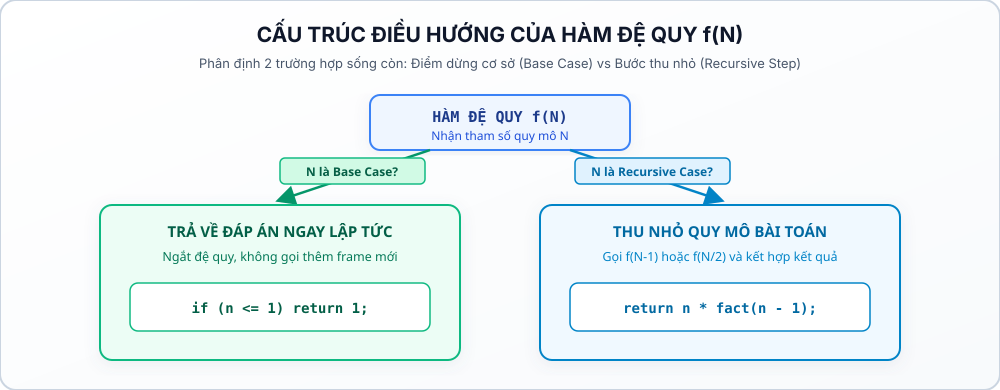
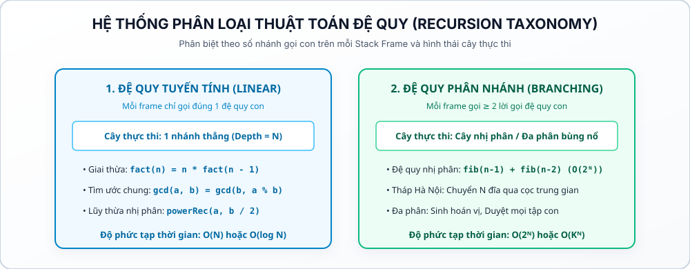
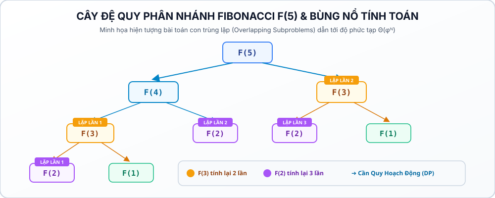

# Bài 13: Thuật toán đệ quy & cây gọi hàm

## 1. Bản chất vấn đề & trực giác thuật toán

Trong các bài toán lập trình cơ bản, chúng ta quen thuộc với tư duy lặp tuần tự (`for`, `while`): xử lý từng phần tử lần lượt từ đầu đến cuối. Tuy nhiên, trong thế giới cấu trúc dữ liệu và giải thuật nâng cao, rất nhiều bài toán mang bản chất **tự đồng dạng**: Để giải một bài toán quy mô $N$, ta có thể giải bài toán tương tự nhưng ở quy mô nhỏ hơn $N-1$ hoặc $N/2$, sau đó kết hợp kết quả lại.

### Khái niệm đệ quy (recursion):
Đệ quy là kỹ thuật lập trình trong đó **một hàm tự gọi lại chính nó** (trực tiếp hoặc gián tiếp) với các tham số đại diện cho bài toán con nhỏ hơn.

Mỗi hàm đệ quy chuẩn mực bắt buộc phải có đủ 2 thành phần cốt lõi:

1. **Điểm Dừng:** Trường hợp bài toán đơn giản nhất đã biết trước đáp án mà không cần gọi tiếp đệ quy. Điểm dừng có nhiệm vụ **ngắt chuỗi lời gọi vô tận**.
2. **Bước Đệ Quy:** Thu nhỏ quy mô bài toán bằng cách gọi lại chính hàm đó với tham số tiến dần về phía Base Case.



## 2. Mô phỏng từng bước hoạt động của Call Stack

Để hiểu đệ quy, lập trình viên không được nhìn code như một vòng lặp phẳng, mà bắt buộc phải hình dung hoạt động của **Ngăn xếp cuộc gọi (Call Stack)** qua hai pha riêng biệt:

* **Pha Xuôi:** Các hàm được gọi liên tiếp và đẩy đè lên nhau trên đỉnh ngăn xếp (`Stack Frame Push`).
* **Pha Ngược (Unwinding Phase):** Khi chạm Base Case, các hàm lần lượt tính xong kết quả, trả về (`Return`) và được giải phóng khỏi ngăn xếp (`Stack Frame Pop`).

### Ví dụ 1: Mô phỏng hàm tính giai thừa `fact(4)`

```cpp
long long fact(int n) {
if (n <= 1) return 1; // Base Case
return n * fact(n - 1); // Recursive Step
}
```

#### Bảng mô phỏng từng bước ngăn xếp (Call Stack trace):

| Bước | Hành động | Trạng thái Call Stack (Đỉnh stack ở trên cùng) | Giá trị trả về tại bước đó |
|:---:|---|---|:---:|
| **1** | Gọi `fact(4)` | `[fact(4)]` | Đang đợi `fact(3)` |
| **2** | Gọi `fact(3)` | `[fact(3)] -> [fact(4)]` | Đang đợi `fact(2)` |

| **3** | Gọi `fact(2)` | `[fact(2)] -> [fact(3)] -> [fact(4)]` | Đang đợi `fact(1)` |

| **4** | Gọi `fact(1)` | `[fact(1)] -> [fact(2)] -> [fact(3)] -> [fact(4)]` | **Chạm Base Case: Trả về 1** |

| **5** | Unwind `fact(2)` | `[fact(2)] -> [fact(3)] -> [fact(4)]` | `fact(2) = 2 * 1 = 2` |

| **6** | Unwind `fact(3)` | `[fact(3)] -> [fact(4)]` | `fact(3) = 3 * 2 = 6` |

| **7** | Unwind `fact(4)` | `[fact(4)]` | `fact(4) = 4 * 6 = 24` |
| **8** | Kết thúc | Stack rỗng | **Đáp án: 24** |

### Ví dụ 2: So sánh vị trí lệnh in (winding vs unwinding)

Quan sát sự khác biệt khi đặt lệnh `cout` **trước** vs **sau** lời gọi đệ quy:

```cpp
// Dạng A: In trong Winding Phase (Trước khi gọi đệ quy)
void printBackward(int n) {
if (n == 0) return;
cout << n << " "; // In ngay khi vào hàm
printBackward(n - 1);
}
// Gọi printBackward(3) -> Output: 3 2 1

// Dạng B: In trong Unwinding Phase (Sau khi gọi đệ quy)
void printForward(int n) {
if (n == 0) return;
printForward(n - 1);
cout << n << " "; // In khi hàm quay lui trở về
}
// Gọi printForward(3) -> Output: 1 2 3

```

### Quy luật vàng (winding vs unwinding):

* Các thao tác viết **trước lời gọi đệ quy** sẽ thực thi theo thứ tự từ ngoài vào trong ($N \to 1$).
* Các thao tác viết **sau lời gọi đệ quy** sẽ thực thi theo thứ tự từ trong ra ngoài ($1 \to N$), khi stack bắt đầu rút lui (Unwind).

## 3. Lý thuyết cốt lõi & bất biến thuật toán

### 3.1. Khái niệm stack frame & phân tích an toàn bộ nhớ (stack safety)

* Khi một hàm được gọi, mô hình thực thi của chương trình tạo ra một **Stack Frame (Activation Record)** lưu trữ trạng thái thực thi riêng biệt: tham số truyền vào, các biến cục bộ và địa chỉ trả về (Return Address) theo quy ước gọi (Calling Convention / ABI).
* Vùng nhớ ngăn xếp (Stack Memory) có kích thước hữu hạn và giới hạn cụ thể phụ thuộc vào môi trường thực thi, hệ điều hành và cấu hình của từng Online Judge.
* **Độ sâu đệ quy (Recursion Depth) vs Kích thước Stack Frame:**
* Để đánh giá an toàn bộ nhớ của hàm đệ quy, ta phải xem xét đồng thời **Độ sâu đệ quy tối đa (Maximum Depth)** và **Dung lượng bộ nhớ tiêu thụ trên mỗi Frame**. Nếu mỗi frame chứa mảng cục bộ lớn hoặc đệ quy vượt quá giới hạn bộ nhớ stack, chương trình sẽ gặp lỗi tràn ngăn xếp (**Stack Overflow / Segmentation Fault**).

### Lưu ý kỹ thuật về tail recursion trong C++:
Trong lý thuyết ngôn ngữ, *Đệ quy đuôi (Tail Recursion)* là hàm đệ quy mà lời gọi hàm là câu lệnh cuối cùng. Tuy nhiên, **chuẩn ngôn ngữ C++ không bắt buộc trình biên dịch phải tối ưu hóa đệ quy đuôi (Tail-Call Optimization - TCO)** trong mọi cờ biên dịch thi đấu. Do đó, học sinh không được chủ quan giả định đệ quy đuôi sẽ luôn tự biến thành vòng lặp $\mathcal{O}(1)$ bộ nhớ. Luôn phân tích độ sâu stack cẩn trọng!

### 3.2. Hệ thống phân loại thuật ngữ đệ quy (recursion taxonomy)



1. **Đệ quy Tuyến tính (Linear Recursion - 1 nhánh gọi / Frame):**
* Trong mỗi Stack Frame chỉ thực hiện **đúng 1 lời gọi đệ quy con**. Cây gọi hàm là một đường thẳng đơn tuyến.
* *Ví dụ:*
* Giai thừa $N!$: Độ sâu $N$, thời gian $\Theta(N)$, Stack Space $\Theta(N)$.
* Thuật toán Euclid $\gcd(A, B)$: Độ sâu $\Theta(\log(\min(A, B)))$, thời gian $\Theta(\log(\min(A, B)))$.
Lũy thừa nhị phân `powerRec(A, B/2)` (khi lưu biến tạm `half`): Độ sâu $\Theta(\log B)$, thời gian $\Theta(\log B)$. Lưu ý:* Mặc dù quy mô bài toán giảm theo cấp số nhân ($B \to B/2$), cấu trúc cây gọi hàm vẫn là đường thẳng 1 nhánh đơn tuyến.

2. **Đệ quy Phân nhánh (Branching / Tree Recursion - $\ge 2$ nhánh gọi / Frame):**
* Trong mỗi Stack Frame xuất hiện **từ 2 lời gọi đệ quy con trở lên**, làm bùng nổ không gian trạng thái tạo thành cây nhị phân hoặc cây đa phân.
* *Ví dụ:*
* Tháp Hà Nội: $T(N) = 2T(N-1) + 1 \implies \Theta(2^N)$ bước, Độ sâu $N$.
* Cây chia đôi tìm Min/Max: $T(N) = 2T(N/2) + \mathcal{O}(1) \implies \Theta(N)$ thao tác, Độ sâu $\Theta(\log N)$.
* Fibonacci đệ quy thuần túy $F(N) = F(N-1) + F(N-2)$.

### 3.3. Độ phức tạp toán học của fibonacci đệ quy & cầu nối sang quy hoạch động

Xét cây gọi hàm khi tính $F(5)$ bằng đệ quy phân nhánh:



* **Phân tích độ phức tạp tiệm cận chính xác:**
Số lời gọi hàm thỏa mãn hệ thức truy hồi $T(N) = T(N-1) + T(N-2) + 1$. Bằng phương trình đặc trưng $r^2 - r - 1 = 0$, ta chứng minh được số phép tính thực tế tăng theo **cấp số nhân chính xác**:
$$\Theta(\varphi^N) \quad \text{với} \quad \varphi = \frac{1 + \sqrt{5}}{2} \approx 1.618 \text{ (Tỉ lệ vàng)}$$
Chặn trên $O(2^N)$ là một cận trên lỏng (Upper Bound).

* **Hiện tượng Overlapping Subproblems:**
Để tính $F(5)$, hàm $F(3)$ bị tính lại 2 lần, $F(2)$ bị tính lại 3 lần. Với $N = 40$, số lượng lời gọi đã lên tới hàng trăm triệu theo mô hình Fibonacci ($\Theta(\varphi^N)$), minh họa rõ hiện tượng bùng nổ thời gian.

* **Bài học sư phạm:** Đệ quy thuần túy rất đẹp nhưng sẽ bị tê liệt khi không gian trạng thái có các bài toán con trùng lặp. Việc **lưu lại kết quả đã tính vào bảng nhớ (Memoization)** sẽ được học bài bản ở **Module 05: Quy hoạch động (Dynamic Programming)**.

## 4. Các bẫy lỗi lập trình kinh điển

1. **Thiếu Base Case hoặc Base Case không bao giờ chạm tới (Infinite Recursion):**
* Viết `if (n == 0)` nhưng tham số truyền vào là số âm $\implies$ Gọi đệ quy vô tận cho tới khi sập ngăn xếp.
* **Cách phòng chống:** Luôn chặn cận bằng dấu `<=` (ví dụ `if (n <= 1) return 1;`).
2. **Khai báo mảng lớn cục bộ bên trong hàm đệ quy:**
* Viết `int temp[100000];` trong hàm đệ quy sẽ khiến mỗi Stack Frame tốn hàng trăm KB bộ nhớ $\implies$ Tràn stack chỉ sau vài chục lời gọi.
* **Cách phòng chống:** Dùng biến toàn cục hoặc truyền tham chiếu `const vector<int> &a`.

3. **Bẫy Gọi Lặp Lại Đệ Quy (Recursive Call Duplication):**
* Trong bài lũy thừa nhị phân, nếu viết `return power(a, b/2) * power(a, b/2);` thì từ đệ quy tuyến tính $\mathcal{O}(\log B)$ sẽ bị nổ thành cây đệ quy phân nhánh $\Theta(B)$ thao tác.
* **Quy tắc vàng:** *Không có Memoization, hai lời gọi hàm giống nhau là hai lần tính toán hoàn toàn độc lập.* Tính 1 lần vào biến tạm: `long long half = power(a, b/2, m); return (half * half) % m;`.

## 5. Mẫu cài đặt chuẩn thi đấu (competitive templates)

```cpp
#include <bits/stdc++.h>
using namespace std;

// 1. In dãy số 1..N và N..1 chuẩn Winding / Unwinding
void printForward(int n) {
if (n <= 0) return;
printForward(n - 1);
cout << n << " ";
}

void printBackward(int n) {
if (n <= 0) return;
cout << n << " ";
printBackward(n - 1);
}

// 2. Lũy thừa nhị phân đệ quy O(log B) an toàn với M <= 10^9
long long powerRec(long long a, long long b, long long m) {
if (b == 0) return 1 % m;
long long half = powerRec(a, b / 2, m);
long long res = (1LL * (half % m) * (half % m)) % m;
if (b % 2 == 1) res = (1LL * res * (a % m)) % m;
return res;
}

// 3. Tháp Hà Nội chuẩn Theta(2^N)
void solveHanoi(int n, char from_rod, char to_rod, char aux_rod) {
if (n == 0) return;
solveHanoi(n - 1, from_rod, aux_rod, to_rod);
cout << from_rod << " -> " << to_rod << "\n";

solveHanoi(n - 1, aux_rod, to_rod, from_rod);
}

int main() {
ios::sync_with_stdio(false);
cin.tie(nullptr);

int n = 4;
cout << "Day so 1..N: ";
printForward(n);
cout << "\n";

cout << "Day so N..1: ";
printBackward(n);
cout << "\n";

cout << "2^10 mod 1000 = " << powerRec(2, 10, 1000) << "\n";
return 0;
}
```

## Câu hỏi trắc nghiệm củng cố khái niệm

#### Câu 1 (Bản chất Base Case):

Thành phần nào trong một hàm đệ quy có vai trò quyết định giúp hàm không bị rơi vào vòng lặp vô tận và tránh lỗi tràn bộ nhớ ngăn xếp (Stack Overflow)

- **A.** Khối lệnh gọi lại chính hàm đó (Recursive Step).

- **B.** **[Đáp án đúng]** Điều kiện dừng cơ sở (Base Case).

- **C.** Kiểu dữ liệu trả về của hàm.

- **D.** Danh sách các tham số truyền vào hàm.

> *Giải thích:* Base Case là điều kiện chặn dưới, khi thỏa mãn điều kiện này hàm sẽ dừng gọi tiếp và bắt đầu quá trình trả lời lui về (Unwinding Phase).

#### Câu 2 (Winding vs Unwinding Trace Prediction):

Xét hàm đệ quy sau:
```cpp
void trace(int n) {
if (n == 0) return;
cout << n << " ";
trace(n - 1);
cout << n << " ";
}
```
Khi gọi `trace(3)`, kết quả in ra màn hình chính xác là gì

- **A.** `3 2 1`

- **B.** `1 2 3 3 2 1`

- **C.** **[Đáp án đúng]** `3 2 1 1 2 3`

- **D.** `3 3 2 2 1 1`

> *Giải thích:* Lệnh `cout` đầu tiên in trong pha Winding (`3 2 1`), lệnh `cout` thứ hai in trong pha Unwinding (`1 2 3`), tạo chuỗi đối xứng `3 2 1 1 2 3`.

#### Câu 3 (Cấu trúc bộ nhớ Stack Frame):

Mỗi lần một hàm đệ quy được gọi, thông tin nào sau đây được lưu vào một Stack Frame (Activation Record)

- **A.** Toàn bộ mã nguồn C++ của chương trình.

- **B.** **[Đáp án đúng]** Các tham số của hàm, biến cục bộ và địa chỉ trả về (Return Address).

- **C.** Bảng mã ASCII của các ký tự.

- **D.** Dữ liệu của file đề bài.

> *Giải thích:* Mỗi Stack Frame lưu trữ ngữ cảnh thực thi riêng biệt của lần gọi hàm đó (biến cục bộ, tham số và địa chỉ lệnh cần thực thi tiếp khi hàm con kết thúc).

#### Câu 4 (Độ phức tạp chính xác của Fibonacci đệ quy):

Hàm đệ quy tính số Fibonacci thuần túy:
```cpp
int fib(int n) {
if (n <= 1) return n;
return fib(n - 1) + fib(n - 2);
}
```
có độ phức tạp thời gian tiệm cận chính xác (Tight Bound) là bao nhiêu

- **A.** $\mathcal{O}(N)$

- **B.** $\mathcal{O}(N^2)$

- **C.** $\mathcal{O}(\log N)$

- **D.** **[Đáp án đúng]** $\Theta(\varphi^N)$ với $\varphi = (1 + \sqrt{5})/2 \approx 1.618$ (thường được chặn trên bởi $\mathcal{O}(2^N)$).

> *Giải thích:* Số lượng lời gọi hàm thỏa mãn hệ thức truy hồi Fibonacci, có nghiệm chính xác tỷ lệ với lũy thừa tỉ lệ vàng $\varphi^N \approx 1.618^N$.

#### Câu 5 (Bẫy tràn Stack Overflow):

Yếu tố nào sau đây quyết định trực tiếp việc một hàm đệ quy có gây ra lỗi tràn bộ nhớ ngăn xếp (Stack Overflow) hay không

- **A.** Hàm đệ quy có quá nhiều tham số kiểu `int`.

- **B.** **[Đáp án đúng]** Tích của độ sâu đệ quy tối đa và dung lượng bộ nhớ tiêu thụ trên mỗi Stack Frame vượt quá giới hạn stack của hệ thống.

- **C.** Hàm đệ quy có kiểu trả về là $void$.

- **D.** Hàm đệ quy chạy trên hệ điều hành 64-bit.

> *Giải thích:* Stack có kích thước hữu hạn. An toàn stack đòi hỏi phải kiểm soát đồng thời cả chiều sâu đệ quy và kích thước biến cục bộ trong mỗi frame.

#### Câu 6 (Bẫy gọi đệ quy lặp lại):

Trong thuật toán lũy thừa nhị phân $A^B$, nếu viết:
`return power(a, b / 2) * power(a, b / 2);`
thay vì lưu vào biến tạm `long long half = power(a, b / 2);`, độ phức tạp thời gian sẽ bị suy biến thành:

- **A.** Vẫn giữ nguyên $\mathcal{O}(\log B)$.

- **B.** **[Đáp án đúng]** Bị suy biến thành `Theta(B)` (tương đương với vòng lặp nhân tuần tự).

- **C.** $\mathcal{O}(1)$.

- **D.** $\mathcal{O}(B^2)$.

> *Giải thích:* Việc gọi lại 2 lần cùng một hàm con biến cây gọi hàm thành cây nhị phân đầy đủ có số lượng nút bằng $2^{\log_2 B} = B$, làm mất hoàn toàn ưu thế của chia để trị.

#### Câu 7 (Đặc điểm Tail Recursion trong C++):

Nhận định nào sau đây là chính xác nhất về Đệ quy đuôi (Tail Recursion) trong ngôn ngữ C++ chuẩn thi đấu

- **A.** C++ luôn tự động tối ưu đệ quy đuôi thành vòng lặp với bộ nhớ $\mathcal{O}(1)$ trong mọi trường hợp.

- **B.** **[Đáp án đúng]** C++ không đảm bảo luôn tối ưu đệ quy đuôi; mức độ tối ưu phụ thuộc vào trình biên dịch, cờ tối ưu và kiến trúc CPU, do đó vẫn có nguy cơ tràn stack.

- **C.** Đệ quy đuôi chạy chậm hơn đệ quy thông thường.

- **D.** Đệ quy đuôi chỉ áp dụng được cho hàm trả về $void$.

> *Giải thích:* Chuẩn ngôn ngữ C++ không bắt buộc Tail Call Optimization (TCO), lập trình viên thi đấu không được phép giả định stack sẽ được giải phóng an toàn.

#### Câu 8 (Số bước di chuyển Tháp Hà Nội):

Với bài toán Tháp Hà Nội chuẩn gồm $N$ đĩa, số bước di chuyển tối thiểu chính xác là:

- **A.** $2N$

- **B.** $N^2$

- **C.** **[Đáp án đúng]** $2^N - 1$ (đạt độ phức tạp thời gian $\Theta(2^N)$).

- **D.** $N!$

> *Giải thích:* Hệ thức truy hồi số bước chuyển đĩa là $T(N) = 2T(N - 1) + 1$ với $T(1) = 1$, giải hệ thức thu được nghiệm tổng quát $T(N) = 2^N - 1$.

#### Câu 9 (Bản chất đệ quy chia đôi tìm Min/Max):

Khi tìm Min/Max của mảng $N$ phần tử bằng hàm đệ quy chia đôi $\text{getMin}(l, r) = \min(\text{getMin}(l, mid), \text{getMin}(mid + 1, r))$, độ phức tạp thời gian tiệm cận là:

- **A.** $\mathcal{O}(\log N)$ vì mảng luôn được chia đôi ở mỗi bước.

- **B.** **[Đáp án đúng]** $\Theta(N)$ vì thuật toán bắt buộc phải thăm và so sánh toàn bộ $N$ phần tử của cả hai nửa mảng.

- **C.** $\mathcal{O}(N \log N)$.

- **D.** $\mathcal{O}(1)$.

> *Giải thích:* Hệ thức thời gian là $T(N) = 2T(N/2) + \mathcal{O}(1)$. Theo định lý thợ (Master Theorem), độ phức tạp là $\Theta(N)$. "Chia đôi" không đồng nghĩa với $\mathcal{O}(\log N)$ nếu phải duyệt cả hai nhánh.

#### Câu 10 (Hiện tượng Overlapping Subproblems):

Hiện tượng nhiều hàm đệ quy con có cùng tham số đầu vào bị tính toán lặp đi lặp lại nhiều lần trên cây đệ quy là tiền đề trực tiếp để phát triển phương pháp tối ưu nào sau đây

- **A.** Tìm kiếm nhị phân.

- **B.** Kỹ thuật hai con trỏ (Two Pointers).

- **C.** **[Đáp án đúng]** Quy hoạch động & Bảng nhớ (Dynamic Programming & Memoization).

- **D.** Sắp xếp trộn (Merge Sort).

> *Giải thích:* Khi một bài toán có tính chất bài toán con trùng lặp (Overlapping Subproblems), ta có thể lưu kết quả tính được lần đầu vào bảng nhớ để tái sử dụng ngay trong $\mathcal{O}(1)$ ở các lần gặp tiếp theo, chính là bản chất của Quy hoạch động.

## Ma trận bài tập thực hành (P0 → P5)

### Phân tầng lộ trình học tập lesson 10:

* **Nhóm Cốt Lõi (Core Foundations - Bắt buộc `CPPB-REC-01` $\to$ `12`):** Nắm vững Winding/Unwinding phase, Base case, Đệ quy tuyến tính vs Đệ quy nhị phân, Tháp Hà Nội, Khảo sát cây Fibonacci.
* **Nhóm Thử Thách Mở Rộng (Advanced & Optional Extension `CPPB-REC-13` $\to$ `16`):** Tháp Hà Nội ràng buộc nước đi ($\Theta(3^N)$), Sinh xâu không 2 số 1 liền kề, Đếm phân tích số thành tổng (Integer Partitioning không xét thứ tự), Đếm cấu hình cây nhị phân (Catalan Tree Recurrence).

| STT | Mã Bài | Tên Bài Toán | Cấp Độ | Phân Loại | Time Complexity | Stack Space | Max Depth |
|:---:|:---:|---|:---:|:---:|:---:|:---:|:---:|
| 01 | `CPPB-REC-01` | **In Dãy Số $1 \dots N$ và $N \dots 1$** | `P0` | **Core** | $\Theta(N)$ | $\Theta(N)$ | $N$ |
| 02 | `CPPB-REC-02` | **Tính Tổng Dãy Số & Giai Thừa $N!$** | `P0` | **Core** | $\Theta(N)$ | $\Theta(N)$ | $N$ |
| 03 | `CPPB-REC-03` | **Đếm & Tính Tổng Chữ Số Của $N$** | `P1` | **Core** | $\Theta(\log_{10} N)$ | $\Theta(\log_{10} N)$ | $\le 19$ |
| 04 | `CPPB-REC-04` | **Đảo Ngược Mảng Bằng Đệ Quy** | `P1` | **Core** | $\Theta(N)$ | $\Theta(N)$ | $N/2$ |
| 05 | `CPPB-REC-05` | **Kiểm Tra Chuỗi Palindrome** | `P1` | **Core** | $\Theta(\vert S \vert)$ | $\Theta(\vert S \vert)$ | $\vert S \vert / 2$ |
| 06 | `CPPB-REC-06` | **So Sánh Đệ Quy Tuyến Tính & Chia Đôi (Min/Max)**| `P2` | **Core** | $\Theta(N)$ | $\Theta(\log N)$ | $\log_2 N$ |
| 07 | `CPPB-REC-07` | **Thuật Toán Euclid Tính $\gcd(A, B)$** | `P2` | **Core** | $\Theta(\log(\min))$ | $\Theta(\log(\min))$ | $\le 90$ |
| 08 | `CPPB-REC-08` | **Lũy Thừa Đệ Quy $A^B \pmod M$** | `P2` | **Core** | $\Theta(\log B)$ | $\Theta(\log B)$ | $\log_2 B$ |
| 09 | `CPPB-REC-09` | **Tháp Hà Nội (Tower of Hanoi)** | `P3` | **Core** | $\Theta(2^N)$ | $\Theta(N)$ | $N$ |
| 10 | `CPPB-REC-10` | **Dãy Fibonacci Đệ Quy & Cây Phân Nhánh** | `P3` | **Core** | $\Theta(\varphi^N)$ | $\Theta(N)$ | $N$ |
| 11 | `CPPB-REC-11` | **Chuyển Đổi Hệ Cơ Số $10 \to 2$** | `P3` | **Core** | $\Theta(\log_2 N)$ | $\Theta(\log_2 N)$ | $\le 60$ |
| 12 | `CPPB-REC-12` | **Xây Dựng Hệ Thức Truy Hồi Dãy Số** | `P3` | **Core** | $\Theta(N)$ | $\Theta(N)$ | $N$ |
| 13 | `CPPB-REC-13` | **Tháp Hà Nội Có Ràng Buộc Nước Đi** | `P4` | *Advanced* | $\Theta(3^N)$ | $\Theta(N)$ | $N$ |
| 14 | `CPPB-REC-14` | **Sinh Xâu Nhị Phân Không 2 Số 1 Liền Kề**| `P4` | *Advanced* | $\Theta(F_{N+2})$ | $\Theta(N)$ | $N$ |
| 15 | `CPPB-REC-15` | **Đếm Phân Hoạch Nguyên Của N Không Thứ Tự**| `P4` | *Extension* | $\Theta(\text{Exp})$ | $\Theta(N)$ | $N$ |
| 16 | `CPPB-REC-16` | **Đếm Cây Nhị Phân Có Thứ Tự (Catalan Rec)**| `P5` | *Extension* | $\Theta(\text{Catalan})$| $\Theta(N)$ | $N$ |
