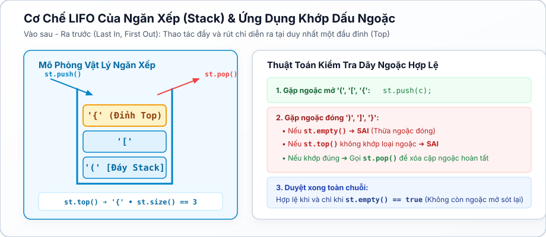
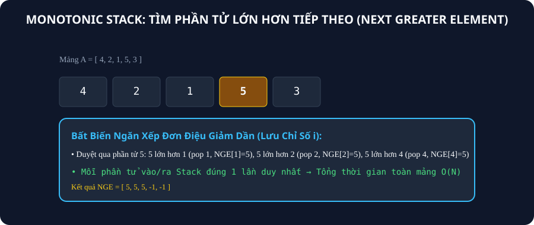
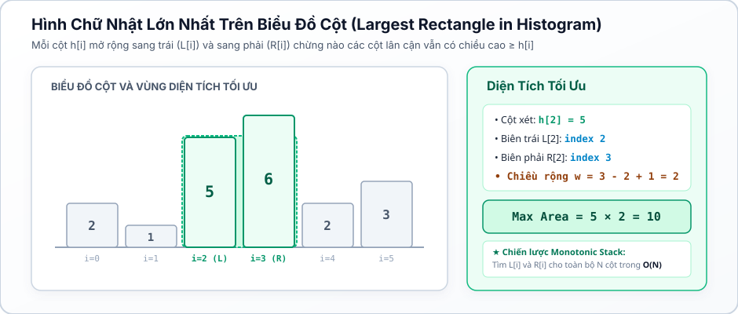

# CHUYÊN ĐỀ 17: NGĂN XẾP & NGĂN XẾP ĐƠN ĐIỆU (STACK & MONOTONIC STACK)

---

## 1. Bản Chất Cấu Trúc Dữ Liệu Ngăn Xếp (Stack)

Ngăn xếp (Stack) là cấu trúc dữ liệu hoạt động theo nguyên lý **LIFO (Last In, First Out — Vào sau, Ra trước)**:
* Phần tử được thêm vào cuối cùng sẽ là phần tử đầu tiên được lấy ra.
* Các thao tác cơ bản trong C++ `std::stack`: `push(x)` (thêm vào đỉnh), `pop()` (xóa đỉnh), `top()` (truy cập đỉnh), `empty()`, `size()`. Toàn bộ thao tác đều đạt thời gian tối ưu tuyệt đối $\mathcal{O}(1)$.



---

## 2. Kỹ Thuật Ngăn Xếp Đơn Điệu (Monotonic Stack)

### 2.1. Bản Chất Bài Toán & Khi Nào Cần Monotonic Stack?
* **Vấn đề:** Cho mảng $A$ gồm $N$ phần tử. Với mỗi vị trí $i$, cần tìm vị trí phần tử **đầu tiên bên phải (hoặc bên trái)** có giá trị lớn hơn (hoặc nhỏ hơn) $A[i]$.
* **Cách ngây thơ:** Duyệt 2 vòng lặp lồng nhau $\implies \mathcal{O}(N^2)$ (bị TLE khi $N = 10^5$).
* **Nguyên lý Monotonic Stack:** Duy trì một ngăn xếp chứa các chỉ số mà giá trị tương ứng trong mảng luôn tuân theo tính chất **đơn điệu** (tăng dần hoặc giảm dần). Khi gặp phần tử mới vi phạm tính đơn điệu, ta liên tục `pop()` các phần tử ở đỉnh ngăn xếp và ghi nhận đáp án cho chúng.



### 2.2. Phân Tích Độ Phức Tạp Khấu Hao (Amortized Analysis $\mathcal{O}(N)$)
Mỗi phần tử của mảng được `push()` vào ngăn xếp đúng $1$ lần và bị `pop()` ra khỏi ngăn xếp tối đa $1$ lần trong toàn bộ quá trình chạy.
$$\text{Tổng số thao tác trên Stack} \le 2N \implies \text{Thời gian trung bình } \mathcal{O}(N)!$$

---

## 3. Bài Toán Kinh Điển: Hình Chữ Nhật Lớn Nhất Trên Biểu Đồ Cột (Largest Rectangle in Histogram)



* **Bản chất:** Với mỗi cột $i$ có chiều cao $H[i]$, ta cần tìm:
  1. $L[i]$: Vị trí cột đầu tiên bên trái có chiều cao $< H[i]$.
  2. $R[i]$: Vị trí cột đầu tiên bên phải có chiều cao $< H[i]$.
* Khi đó, hình chữ nhật lớn nhất nhận $H[i]$ làm chiều cao tối đa sẽ có chiều rộng $W = R[i] - L[i] - 1$, diện tích là $S[i] = H[i] \times (R[i] - L[i] - 1)$.
* Sử dụng 2 lượt Monotonic Stack (hoặc 1 lượt thông minh), ta tính toàn bộ mảng $L$ và $R$ trong $\mathcal{O}(N)$.

---

## 4. Các Bẫy Lỗi Lập Trình Kinh Điển (Bug Traps)

1. **Bẫy gọi `st.top()` hoặc `st.pop()` khi Stack rỗng:**
   * Truy cập đỉnh ngăn xếp khi `st.empty() == true` sẽ dẫn đến lỗi bộ nhớ nghiêm trọng (Segmentation Fault / Runtime Error).
   * **Quy tắc an toàn:** Luôn kiểm tra `while (!st.empty() && ...)` trước khi gọi `st.top()` hay `st.pop()`.
2. **Bẫy quên kiểm tra `st.empty()` ở cuối bài toán Dãy ngoặc đúng:**
   * Sau khi duyệt hết chuỗi, nếu không còn ngoặc đóng nào nhưng trong stack vẫn còn ngoặc mở dư thừa (ví dụ chuỗi `"((()"`), dãy ngoặc vẫn là **KHÔNG HỢP LỆ**.
   * **Điều kiện đủ:** Dãy hợp lệ khi và chỉ khi không bị lỗi giữa chừng VÀ `st.empty() == true` ở cuối.
3. **Bẫy tràn số khi tính diện tích hình chữ nhật lớn nhất:**
   * Chiều cao $H[i] \le 10^9$ và chiều rộng $W \le 10^5 \implies$ Diện tích có thể lên tới $10^{14}$, vượt quá giới hạn 32-bit `int`. Bắt buộc phải ép kiểu sang `long long`.

---

## 5. Mẫu Cài Đặt Chuẩn Thi Đấu (Competitive Templates)

### Mẫu 1: Tìm phần tử lớn hơn tiếp theo (Next Greater Element)

```cpp
#include <bits/stdc++.h>
using namespace std;

int main() {
    ios::sync_with_stdio(false);
    cin.tie(nullptr);

    int n;
    if (!(cin >> n)) return 0;
    if (n <= 0) return 0;

    vector<long long> a(n);
    for (int i = 0; i < n; ++i) {
        cin >> a[i];
    }

    vector<long long> nge(n, -1);
    stack<int> st; // Lưu chỉ số

    for (int i = 0; i < n; ++i) {
        while (!st.empty() && a[i] > a[st.top()]) {
            nge[st.top()] = a[i];
            st.pop();
        }
        st.push(i);
    }

    for (int i = 0; i < n; ++i) {
        cout << nge[i] << (i + 1 == n ? "" : " ");
    }
    cout << "\n";

    return 0;
}
```

---

### Mẫu 2: Hình chữ nhật lớn nhất trên biểu đồ cột (Histogram)

```cpp
#include <bits/stdc++.h>
using namespace std;

int main() {
    ios::sync_with_stdio(false);
    cin.tie(nullptr);

    int n;
    if (!(cin >> n)) return 0;
    if (n <= 0) return 0;

    vector<long long> h(n);
    for (int i = 0; i < n; ++i) {
        cin >> h[i];
    }

    // Thêm phần tử lính canh 0 ở cuối để đẩy toàn bộ stack ra
    h.push_back(0);
    stack<int> st;
    long long max_area = 0;

    for (int i = 0; i <= n; ++i) {
        while (!st.empty() && h[i] < h[st.top()]) {
            long long height = h[st.top()];
            st.pop();
            long long width = st.empty() ? i : (i - st.top() - 1);
            max_area = max(max_area, height * width);
        }
        st.push(i);
    }

    cout << max_area << "\n";
    return 0;
}
```

---

## 6. Hệ Thống Câu Hỏi Kiểm Tra Khái Niệm (Concept Quiz)

#### Câu 1 (Bản chất LIFO của Stack):
Nguyên lý hoạt động cơ bản của cấu trúc dữ liệu Ngăn xếp (Stack) là gì?
* A. FIFO (Vào trước, Ra trước).
* B. **(Đáp án đúng)** LIFO (Vào sau, Ra trước).
* C. Truy cập ngẫu nhiên phần tử bất kỳ trong $\mathcal{O}(1)$.
* D. Tự động sắp xếp các phần tử tăng dần.
> *Giải thích:* Stack chỉ cho phép thêm và lấy phần tử ở một đầu duy nhất gọi là đỉnh (top), tuân theo nguyên lý LIFO.

---

#### Câu 2 (Độ phức tạp Monotonic Stack):
Tại sao thuật toán tìm phần tử lớn hơn tiếp theo dùng Monotonic Stack chỉ mất tổng thời gian $\mathcal{O}(N)$ dù có vòng lặp `while` lồng bên trong vòng `for`?
* A. Vì số vòng lặp `while` luôn nhỏ hơn 3.
* B. **(Đáp án đúng)** Vì mỗi phần tử trong mảng chỉ được `push` vào stack đúng 1 lần và bị `pop` ra tối đa 1 lần trong toàn bộ chương trình (phân tích khấu hao).
* C. Vì stack tự động bỏ qua các phần tử trùng nhau.
* D. Vì mảng đã được sắp xếp trước.
> *Giải thích:* Phân tích khấu hao (Amortized Analysis): Tổng số thao tác `push` và `pop` trên toàn mảng không vượt quá $2N \implies \mathcal{O}(N)$.

---

#### Câu 3 (Điều kiện dãy ngoặc đúng):
Một chuỗi ngoặc chỉ gồm `(` và `)` là hợp lệ khi và chỉ khi thỏa mãn điều kiện nào?
* A. Số lượng ngoặc mở bằng số lượng ngoặc đóng.
* B. **(Đáp án đúng)** Tại mọi vị trí tiền tố, số ngoặc mở luôn $\ge$ số ngoặc đóng, và khi kết thúc chuỗi số ngoặc mở bằng đúng số ngoặc đóng.
* C. Ký tự đầu tiên là ngoặc mở.
* D. Độ dài chuỗi là số chẵn.
> *Giải thích:* Dùng Stack: Không bao giờ bị `pop` khi rỗng (tiền tố hợp lệ) và stack phải rỗng hoàn toàn ở cuối chuỗi.

---

#### Câu 4 (Lưu trữ trong Monotonic Stack):
Trong thuật toán tìm Next Greater Element hay Histogram, thông thường ta nên lưu giá trị gì vào trong `stack`?
* A. Lưu giá trị của phần tử $A[i]$.
* B. **(Đáp án đúng)** Lưu chỉ số vị trí $i$ của phần tử trong mảng.
* C. Lưu số lượng phần tử nhỏ hơn.
* D. Lưu địa chỉ con trỏ.
> *Giải thích:* Lưu chỉ số $i$ cho phép truy cập đồng thời cả giá trị $A[i]$ lẫn tính toán khoảng cách/chiều rộng $j - i$.

---

#### Câu 5 (Hình chữ nhật lớn nhất trong ma trận 0-1):
Bài toán tìm hình chữ nhật toàn số 1 có diện tích lớn nhất trong ma trận nhị phân $N \times M$ có thể quy về bài toán nào?
* A. Quy hoạch động trên cây.
* B. **(Đáp án đúng)** Với mỗi hàng, tính chiều cao các cột 1 liên tiếp rồi áp dụng bài toán Hình chữ nhật lớn nhất trên biểu đồ cột (Histogram).
* C. Thuật toán Dijkstra.
* D. Tìm kiếm nhị phân trên lưới.
> *Giải thích:* Duyệt từng hàng $1 \to N$, duy trì chiều cao cột $h[j] = (matrix[i][j] == 1 ? h[j] + 1 : 0)$, sau đó chạy Monotonic Stack Histogram trong $\mathcal{O}(M) \implies$ Tổng thời gian $\mathcal{O}(N \times M)$.

---

#### Câu 6 (Biểu thức Hậu tố RPN):
Để tính giá trị của một biểu thức toán học dạng Hậu tố (Reverse Polish Notation — RPN, ví dụ `3 4 + 2 *`), ta sử dụng cấu trúc dữ liệu nào?
* A. Hàng đợi Queue.
* B. **(Đáp án đúng)** Ngăn xếp Stack (gặp số thì push, gặp toán tử thì pop 2 số tính rồi push kết quả vào lại).
* C. Cây nhị phân.
* D. Bảng băm.
> *Giải thích:* Stack là công cụ kinh điển để xử lý cú pháp và đánh giá biểu thức toán học.

---

#### Câu 7 (Bẫy runtime error với Stack):
Đoạn mã C++ nào sau đây có nguy cơ gây lỗi sập chương trình (Crash / Runtime Error)?
* A. `if (!st.empty()) st.pop();`
* B. **(Đáp án đúng)** `if (st.top() == '(') st.pop();` khi chưa kiểm tra `st.empty()`.
* C. `st.push(5);`
* D. `int sz = st.size();`
> *Giải thích:* Gọi `st.top()` khi `st.empty() == true` là hành vi không xác định (Undefined Behavior) dẫn đến Segmentation Fault.

---

#### Câu 8 (Phần tử nhỏ hơn gần nhất bên trái):
Để tìm phần tử đầu tiên bên trái nhỏ hơn $A[i]$ (Previous Smaller Element), ta duy trì Monotonic Stack theo tính chất nào?
* A. Đơn điệu giảm dần.
* B. **(Đáp án đúng)** Đơn điệu tăng dần từ đáy lên đỉnh.
* C. Không cần đơn điệu.
* D. Sắp xếp ngẫu nhiên.
> *Giải thích:* Stack đơn điệu tăng dần đảm bảo phần tử ở đỉnh ngay dưới sẽ là phần tử nhỏ hơn gần nhất.

---

#### Câu 9 (Mục đích của phần tử lính canh trong Histogram):
Tại sao khi cài đặt bài toán Histogram, ta thường thêm một cột chiều cao $0$ vào cuối mảng (`h.push_back(0)`)?
* A. Để tăng kích thước mảng cho đẹp.
* B. **(Đáp án đúng)** Để đảm bảo mọi phần tử còn sót lại trong stack đều được kích hoạt `pop()` và tính diện tích khi kết thúc vòng lặp.
* C. Để tránh tràn số nguyên.
* D. Vì cột cuối cùng luôn có chiều cao bằng 0.
> *Giải thích:* Cột chiều cao 0 nhỏ hơn mọi chiều cao dương, đóng vai trò lính canh xả cạn toàn bộ stack.

---

#### Câu 10 (Dãy con có tổng nhỏ nhất / Min Subarray):
Để tìm tổng giá trị nhỏ nhất của mọi đoạn con trong mảng, kỹ thuật nào sau đây kết hợp Monotonic Stack là tối ưu nhất?
* A. Thử mọi cặp $(i, j)$ trong $\mathcal{O}(N^2)$.
* B. **(Đáp án đúng)** Dùng Monotonic Stack tìm phạm vi $[L[i], R[i]]$ mà $A[i]$ là phần tử nhỏ nhất, đóng góp $A[i] \times (i - L[i]) \times (R[i] - i)$ vào tổng toàn cục trong $\mathcal{O}(N)$.
* C. Dùng thuật toán tham lam.
* D. Dùng đệ quy quay lui.
> *Giải thích:* Kỹ thuật đếm số đoạn nhận $A[i]$ làm cực trị trong $\mathcal{O}(N)$ là bài toán kinh điển trong các kỳ thi học sinh giỏi.

---

#### Câu 11 (Xóa K chữ số để được số nhỏ nhất):
Cho chuỗi số $S$ và số $K$. Để xóa $K$ chữ số sao cho số thu được là nhỏ nhất, cấu trúc dữ liệu nào được sử dụng?
* A. Hàng đợi hai đầu Deque.
* B. **(Đáp án đúng)** Monotonic Stack (khi gặp chữ số nhỏ hơn đỉnh stack và còn lượt xóa $K > 0$, ta `pop` đỉnh stack).
* C. Sắp xếp chuỗi.
* D. Chia để trị.
> *Giải thích:* Giữ các chữ số có thứ tự tăng dần từ trái sang phải để cực tiểu hóa các chữ số ở hàng cao nhất.

---

#### Câu 12 (Kiểm tra dãy ngoặc nhiều loại):
Khi kiểm tra chuỗi có cả ngoặc tròn `()`, ngoặc vuông `[]`, ngoặc nhọn `{}`:
* A. Đếm số lượng từng loại độc lập bằng 3 biến đếm.
* B. **(Đáp án đúng)** Bắt buộc phải dùng Stack để kiểm tra thứ tự lồng nhau hợp lệ giữa các loại ngoặc.
* C. Chỉ cần kiểm tra ký tự đầu và cuối.
* D. Dùng mảng tiền tố.
> *Giải thích:* 3 biến đếm không thể phát hiện lỗi giao nhau sai quy tắc như `([)]`. Bắt buộc phải dùng Stack.

---

#### Câu 13 (Thuật toán Shunting-Yard):
Thuật toán Shunting-Yard của Edsger Dijkstra sử dụng Stack để làm gì?
* A. Tìm đường đi ngắn nhất.
* B. **(Đáp án đúng)** Chuyển đổi biểu thức toán học từ dạng Trung tố (Infix: `a + b * c`) sang Hậu tố (Postfix: `a b c * +`).
* C. Sắp xếp mảng số nguyên.
* D. Tìm cây khung nhỏ nhất.
> *Giải thích:* Stack toán tử duy trì độ ưu tiên của các phép toán nhân/chia trước, cộng/trừ sau.

---

#### Câu 14 (Hứng nước mưa — Trapping Rain Water):
Bài toán tính lượng nước mưa đọng lại giữa các cột có thể giải bằng Monotonic Stack trong thời gian bao nhiêu?
* A. $\mathcal{O}(N^2)$
* B. **(Đáp án đúng)** $\mathcal{O}(N)$ thời gian và $\mathcal{O}(N)$ bộ nhớ.
* C. $\mathcal{O}(N \log N)$
* D. $\mathcal{O}(2^N)$
> *Giải thích:* Duy trì stack giảm dần, khi gặp cột cao hơn sẽ hình thành "vũng trũng" giữa cột hiện tại, đáy trũng (đỉnh stack vừa pop) và biên trái (đỉnh stack mới).

---

#### Câu 15 (Stack dùng mảng tự tạo vs std::stack):
Trong C++, việc tự tạo stack bằng một mảng `int st[N]` và biến con trỏ `top_idx = 0` so với dùng `std::stack` có ưu điểm gì?
* A. Giúp code chạy chính xác hơn.
* B. **(Đáp án đúng)** Tốc độ thực thi nhanh hơn do giảm bớt overhead của class và hỗ trợ truy cập ngẫu nhiên các phần tử bên dưới nếu cần.
* C. Tự động kiểm tra tràn mảng.
* D. Không cần khai báo kích thước.
> *Giải thích:* Mảng tĩnh tự cài có hằng số thời gian cực nhỏ, rất được ưa chuộng trong Competitive Programming đỉnh cao.

---

## 7. Ma Trận 15 Bài Tập Thực Hành Theo Mức Độ (P0 → P5)

| Mã Bài Tập | Tên Bài Toán | Mức Độ | Trọng Tâm Kiến Thức & Kỹ Năng Stack |
|---|---|:---:|---|
| `CPPB-STK-01` | Kiểm Tra Dãy Ngoặc Đúng Cơ Bản | **P0** | Cài đặt `std::stack` kiểm tra chuỗi ngoặc đơn loại `()`. |
| `CPPB-STK-02` | Dãy Ngoặc Hỗn Hợp Nhiều Loại | **P1** | Xử lý ghép cặp đồng thời `()`, `[]`, `{}` và bẫy stack rỗng. |
| `CPPB-STK-03` | Đánh Giá Biểu Thức Hậu Tố (RPN) | **P1** | Đọc chuỗi token, thực hiện phép toán số học trên Stack. |
| `CPPB-STK-04` | Xóa Các Ký Tự Trùng Lặp Liền Kề | **P2** | Duyệt chuỗi kết hợp Stack khử các cặp ký tự giống nhau. |
| `CPPB-STK-05` | Phần Tử Lớn Hơn Tiếp Theo (NGE) | **P2** | Monotonic Stack cơ bản $\mathcal{O}(N)$ tìm vị trí đầu tiên bên phải. |
| `CPPB-STK-06` | Phần Tử Nhỏ Hơn Gần Nhất Bên Trái | **P2** | Monotonic Stack tìm biên trái nhỏ hơn cho từng phần tử. |
| `CPPB-STK-07` | Độ Dài Dãy Ngoặc Đúng Dài Nhất | **P2** | Stack lưu chỉ số vị trí tính khoảng cách đoạn ngoặc hợp lệ. |
| `CPPB-STK-08` | Xóa K Chữ Số Để Được Số Nhỏ Nhất | **P3** | Monotonic Stack tham lam giữ các chữ số nhỏ ở hàng cao. |
| `CPPB-STK-09` | Hình Chữ Nhật Lớn Nhất Trên Histogram | **P3** | Tìm biên trái và biên phải nhỏ hơn trong $\mathcal{O}(N)$. |
| `CPPB-STK-10` | Hứng Nước Mưa (Trapping Rain Water) | **P3** | Monotonic Stack tính diện tích nước đọng theo từng lớp ngang. |
| `CPPB-STK-11` | Hình Chữ Nhật Toàn 1 Lớn Nhất Ma Trận | **P3** | Quy đổi ma trận 2D về $N$ bài toán Histogram 1D. |
| `CPPB-STK-12` | Tổng Giá Trị Nhỏ Nhất Mọi Đoạn Con | **P4** | Đếm số đoạn con nhận $A[i]$ làm min, tối ưu hóa tổng $\mathcal{O}(N)$. |
| `CPPB-STK-13` | NGE Trên Mảng Xoay Vòng (Circular Array) | **P4** | Kỹ thuật nhân đôi mảng $2N$ kết hợp Monotonic Stack. |
| `CPPB-STK-14` | Tòa Tháp Tầm Nhìn (Visible Towers) | **P4** | Monotonic Stack đếm số lượng cặp đỉnh có thể nhìn thấy nhau. |
| `CPPB-STK-15` | Đánh Giá Biểu Thức Đại Số Đầy Đủ (Mastery) | **P5** | Thuật toán Shunting-Yard xử lý ngoặc và thứ tự ưu tiên toán tử. |
