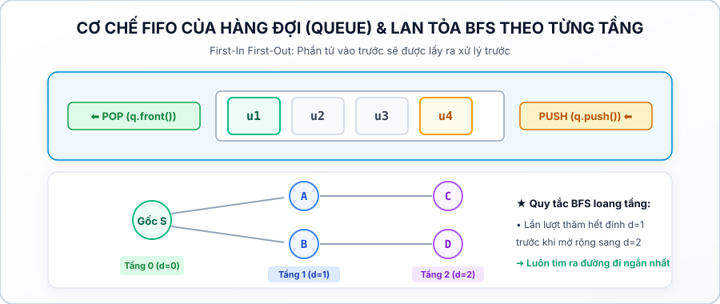
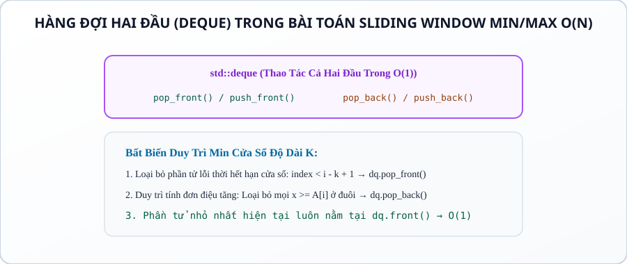
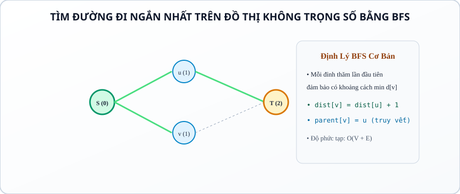

# CHUYÊN ĐỀ 18: HÀNG ĐỢI & HÀNG ĐỢI HAI ĐẦU (QUEUE & DEQUE)

---

## 1. Bản Chất Cấu Trúc Dữ Liệu Hàng Đợi (Queue & Deque)

### 1.1. Hàng Đợi Chuẩn (Queue — FIFO)
Hàng đợi hoạt động theo nguyên lý **FIFO (First In, First Out — Vào trước, Ra trước)**:
* Phần tử được thêm vào ở đuôi (`push`), và được lấy ra ở đầu (`pop`).
* Đây là cấu trúc dữ liệu nền tảng của thuật toán Tìm kiếm theo chiều rộng (BFS).



### 1.2. Hàng Đợi Hai Đầu (Double-Ended Queue — Deque)
`std::deque` cho phép thực hiện thêm và xóa phần tử ở **CẢ HAI ĐẦU** với độ phức tạp tối ưu $\mathcal{O}(1)$:
* `push_front()`, `pop_front()`: Thao tác ở đầu hàng đợi.
* `push_back()`, `pop_back()`: Thao tác ở đuôi hàng đợi.

---

## 2. Kỹ Thuật Deque Cửa Sổ Trượt Min/Max $\mathcal{O}(N)$ (Sliding Window Monotonic Deque)

### 2.1. Bản Chất Bài Toán
* Cho mảng $A$ gồm $N$ phần tử và số $K$. Cần tìm giá trị nhỏ nhất (hoặc lớn nhất) trong mọi cửa sổ trượt độ dài $K$: $[i-K+1 \dots i]$ ($K \le i \le N$).
* **Cách dùng Multiset / Priority Queue:** Mất $\mathcal{O}(N \log K)$.
* **Cách dùng Monotonic Deque:** Đạt thời gian tối ưu tuyệt đối **$\mathcal{O}(N)$ tuyến tính**!



### 2.2. Bất Biến 3 Bước Duy Trì Min Cửa Sổ
Tại mỗi vị trí $i$ khi phần tử $A[i]$ bước vào:
1. **Loại bỏ phần tử hết hạn (Out of Window):** Nếu phần tử ở đầu `dq.front() < i - K + 1` $\implies$ `dq.pop_front()`.
2. **Duy trì tính đơn điệu tăng:** Trong khi `!dq.empty()` và $A[\text{dq.back()}] \ge A[i] \implies$ `dq.pop_back()` (vì $A[i]$ vừa nhỏ hơn vừa tồn tại lâu hơn các phần tử ở đuôi).
3. **Thêm phần tử mới và lấy đáp án:** `dq.push_back(i)`. Khi $i \ge K-1$, giá trị nhỏ nhất của cửa sổ hiện tại chính là $A[\text{dq.front()}]$.

---

## 3. Ứng Dụng Nền Tảng: Tìm Đường Đi Ngắn Nhất Bằng Queue (BFS Nhập Môn)



* Trên đồ thị không có trọng số (hoặc đồ thị lưới di chuyển 4 hướng có chi phí mỗi bước bằng 1), thuật toán BFS sử dụng Queue luôn đảm bảo:
  > **Lần đầu tiên một đỉnh $v$ được lấy ra khỏi Queue, khoảng cách $dist[v]$ chắc chắn là khoảng cách ngắn nhất từ đỉnh nguồn $S$.**

---

## 4. Các Bẫy Lỗi Lập Trình Kinh Điển (Bug Traps)

1. **Bẫy gọi `q.front()` khi Queue rỗng:**
   * Tương tự Stack, gọi `q.front()` hoặc `q.pop()` khi `q.empty() == true` gây Segmentation Fault.
2. **Bẫy lưu giá trị thay vì lưu chỉ số trong Monotonic Deque:**
   * Nếu chỉ lưu giá trị $A[i]$, ta không thể kiểm tra xem phần tử ở đầu `dq.front()` đã vượt ra khỏi phạm vi cửa sổ $i - K + 1$ hay chưa.
   * **Quy tắc bắt buộc:** Luôn lưu chỉ số $i$ vào trong Deque!
3. **Bẫy quên đánh dấu `visited` ngay khi `push` vào Queue trong BFS:**
   * Nếu chờ đến khi `pop` mới đánh dấu `visited[u] = true`, một đỉnh có thể bị đẩy vào Queue hàng chục lần từ các đỉnh lân cận $\implies$ Bùng nổ bộ nhớ và thời gian (TLE/MLE).
   * **Quy tắc sống còn:** Bắt buộc gán `visited[v] = true` ngay tại thời điểm `q.push(v)`.

---

## 5. Mẫu Cài Đặt Chuẩn Thi Đấu (Competitive Templates)

### Mẫu 1: Min trên mọi cửa sổ trượt độ dài K bằng Monotonic Deque $\mathcal{O}(N)$

```cpp
#include <bits/stdc++.h>
using namespace std;

int main() {
    ios::sync_with_stdio(false);
    cin.tie(nullptr);

    int n, k;
    if (!(cin >> n >> k)) return 0;
    if (n <= 0 || k <= 0 || k > n) return 0;

    vector<long long> a(n);
    for (int i = 0; i < n; ++i) {
        cin >> a[i];
    }

    deque<int> dq; // Lưu chỉ số, duy trì A[dq[i]] tăng dần
    vector<long long> result;

    for (int i = 0; i < n; ++i) {
        // 1. Xóa phần tử quá hạn cửa sổ
        while (!dq.empty() && dq.front() < i - k + 1) {
            dq.pop_front();
        }

        // 2. Duy trì tính đơn điệu tăng
        while (!dq.empty() && a[dq.back()] >= a[i]) {
            dq.pop_back();
        }

        // 3. Thêm phần tử hiện tại
        dq.push_back(i);

        // 4. Ghi nhận kết quả khi cửa sổ đủ kích thước k
        if (i >= k - 1) {
            result.push_back(a[dq.front()]);
        }
    }

    for (int i = 0; i < (int)result.size(); ++i) {
        cout << result[i] << (i + 1 == (int)result.size() ? "" : " ");
    }
    cout << "\n";

    return 0;
}
```

---

### Mẫu 2: BFS Tìm bước đi ngắn nhất từ 1 đến N

```cpp
#include <bits/stdc++.h>
using namespace std;

int main() {
    ios::sync_with_stdio(false);
    cin.tie(nullptr);

    int n, m;
    if (!(cin >> n >> m)) return 0;
    if (n <= 0) return 0;

    vector<vector<int>> adj(n + 1);
    for (int i = 0; i < m; ++i) {
        int u, v;
        cin >> u >> v;
        adj[u].push_back(v);
        adj[v].push_back(u);
    }

    vector<int> dist(n + 1, -1);
    queue<int> q;

    // Khởi tạo gốc 1
    dist[1] = 0;
    q.push(1);

    while (!q.empty()) {
        int u = q.front();
        q.pop();

        for (int v : adj[u]) {
            if (dist[v] == -1) { // Chưa thăm
                dist[v] = dist[u] + 1;
                q.push(v); // Đánh dấu ngay khi push
            }
        }
    }

    cout << dist[n] << "\n";
    return 0;
}
```

---

## 6. Hệ Thống Câu Hỏi Kiểm Tra Khái Niệm (Concept Quiz)

#### Câu 1 (Bản chất FIFO của Queue):
Điểm khác biệt cốt lõi giữa `std::queue` và `std::stack` là gì?
* A. Queue cho phép truy cập ngẫu nhiên theo chỉ số.
* B. **(Đáp án đúng)** Queue lấy phần tử vào trước ra trước (FIFO), còn Stack lấy phần tử vào sau ra trước (LIFO).
* C. Queue có dung lượng giới hạn còn Stack thì không.
* D. Queue tự động sắp xếp dữ liệu.
> *Giải thích:* Queue đẩy ở đuôi và lấy ở đầu, phục vụ mô hình hàng đợi thực tế và thuật toán loang BFS.

---

#### Câu 2 (Độ phức tạp Monotonic Deque):
Thuật toán tìm Min trên cửa sổ trượt độ dài $K$ bằng `std::deque` có độ phức tạp thời gian là bao nhiêu?
* A. $\mathcal{O}(N \log K)$
* B. **(Đáp án đúng)** $\mathcal{O}(N)$ tuyến tính (mỗi phần tử vào và ra Deque tối đa 1 lần).
* C. $\mathcal{O}(N \cdot K)$
* D. $\mathcal{O}(N^2)$
> *Giải thích:* Phân tích khấu hao: $N$ phần tử được thêm ở đuôi 1 lần và bị xóa tối đa 1 lần $\implies \mathcal{O}(N)$.

---

#### Câu 3 (Khi nào cần Deque thay vì Queue):
Cấu trúc `std::deque` vượt trội hơn `std::queue` ở điểm nào?
* A. Chiếm ít bộ nhớ hơn.
* B. **(Đáp án đúng)** Cho phép thêm và xóa phần tử ở cả 2 đầu (front và back) trong $\mathcal{O}(1)$ và hỗ trợ toán tử truy cập `[]`.
* C. Chạy nhanh hơn `vector`.
* D. Tự động loại bỏ phần tử trùng nhau.
> *Giải thích:* `std::deque` là double-ended queue cực kỳ linh hoạt cho các kỹ thuật nâng cao.

---

#### Câu 4 (Bẫy đánh dấu visited trong BFS):
Tại sao trong thuật toán BFS, ta bắt buộc phải đánh dấu `visited[v] = true` ngay khi gọi `q.push(v)` thay vì khi `q.pop()`?
* A. Để in ra thứ tự duyệt đẹp hơn.
* B. **(Đáp án đúng)** Để ngăn không cho đỉnh $v$ bị các đỉnh lân cận khác tiếp tục đẩy vào Queue nhiều lần gây tràn bộ nhớ và TLE.
* C. Vì hàm `push` yêu cầu mảng visited.
* D. Để tính khoảng cách chính xác hơn.
> *Giải thích:* Nếu chỉ đánh dấu khi pop, trong khoảng thời gian đỉnh $v$ nằm trong queue, các đỉnh kề khác duyệt tới sẽ lại đẩy thêm $v$ vào hàng đợi nhiều lần.

---

#### Câu 5 (Duy trì Max Cửa Sổ bằng Deque):
Để tìm GIÁ TRỊ LỚN NHẤT (Max) trên cửa sổ trượt, ta duy trì Deque theo thứ tự nào?
* A. Đơn điệu tăng dần.
* B. **(Đáp án đúng)** Đơn điệu giảm dần từ đầu đến đuôi (loại bỏ mọi phần tử ở đuôi $\le A[i]$).
* C. Giữ nguyên thứ tự ban đầu.
* D. Đảo ngược mảng.
> *Giải thích:* Khi duy trì giảm dần, phần tử lớn nhất của cửa sổ hiện tại luôn nằm tại `dq.front()`.

---

#### Câu 6 (Thuật toán BFS 0-1):
Trên đồ thị mà trọng số các cạnh chỉ có thể là $0$ hoặc $1$, ta có thể tìm đường đi ngắn nhất trong $\mathcal{O}(V + E)$ bằng cấu trúc nào?
* A. Dùng Dijkstra với `priority_queue` $\mathcal{O}(E \log V)$.
* B. **(Đáp án đúng)** Dùng `std::deque`: Đi qua cạnh 0 thì `push_front()`, đi qua cạnh 1 thì `push_back()`.
* C. Dùng `std::stack`.
* D. Dùng đệ quy DFS.
> *Giải thích:* Kỹ thuật 0-1 BFS duy trì tính đơn điệu khoảng cách trong Deque mà không cần cấu trúc Heap phức tạp.

---

#### Câu 7 (Bài toán Đổi tiền ít xu nhất bằng BFS):
Bài toán đổi số tiền $S$ với ít đồng xu nhất có thể giải bằng BFS trên đồ thị trạng thái khi nào?
* A. Khi số lượng đồng xu lớn hơn 100.
* B. **(Đáp án đúng)** Luôn luôn giải được vì mỗi bước chuyển từ $x \to x + c$ tương đương cạnh có trọng số bằng 1, đỉnh đầu tiên đạt tới $S$ là nghiệm tối ưu.
* C. Không thể giải bằng BFS.
* D. Chỉ giải được khi các đồng xu là số chẵn.
> *Giải thích:* BFS trên không gian trạng thái $0 \to S$ tìm số bước nhảy ít nhất cực kỳ trực quan.

---

#### Câu 8 (Đoạn con có tổng lớn nhất độ dài tối đa K):
Để tìm đoạn con có tổng lớn nhất có độ dài không vượt quá $K$, ta kết hợp Mảng tiền tố $pref[i]$ với cấu trúc dữ liệu nào?
* A. Monotonic Stack.
* B. **(Đáp án đúng)** Monotonic Deque duy trì giá trị $pref[j]$ nhỏ nhất trong cửa sổ $j \in [i-K, i-1]$.
* C. Bảng băm `unordered_map`.
* D. Sắp xếp mảng.
> *Giải thích:* Tổng đoạn con là $pref[i] - pref[j]$. Để cực đại hóa hiệu này với $i - j \le K$, ta cần cực tiểu hóa $pref[j]$ trong cửa sổ trượt độ dài $K$.

---

#### Câu 9 (Trạng thái rỗng của Deque):
Lệnh nào sau đây xóa sạch toàn bộ các phần tử trong `std::deque<int> dq`?
* A. `dq.erase();`
* B. **(Đáp án đúng)** `dq.clear();`
* C. `dq.reset();`
* D. `dq.empty();`
> *Giải thích:* `dq.clear()` hủy toàn bộ phần tử và đưa kích thước về 0 trong $\mathcal{O}(N)$.

---

#### Câu 10 (Sinh các số nhị phân từ 1 đến N):
Để sinh danh sách $N$ số nhị phân đầu tiên (`"1"`, `"10"`, `"11"`, `"100"`...) theo thứ tự tăng dần, ta sử dụng Queue như thế nào?
* A. Chuyển đổi từng số nguyên sang nhị phân.
* B. **(Đáp án đúng)** Khởi tạo `q.push("1")`, mỗi bước lấy xâu $s = q.front()$, in ra, rồi đẩy $s + \text{"0"}$ và $s + \text{"1"}$ vào đuôi Queue.
* C. Dùng Stack đảo ngược.
* D. Dùng thuật toán đệ quy quay lui.
> *Giải thích:* Cây nhị phân sinh số được duyệt theo từng tầng chuẩn mực bằng Queue BFS.

---

#### Câu 11 (Truy vết đường đi trong BFS):
Để in ra chính xác các đỉnh trên đường đi ngắn nhất từ $S$ đến $T$ trong BFS, ta duy trì mảng phụ nào?
* A. Mảng `visited`.
* B. **(Đáp án đúng)** Mảng `parent[v] = u` ghi nhận đỉnh cha đã dẫn tới $v$, sau đó lần ngược từ $T$ về $S$.
* C. Mảng đếm bậc của đỉnh.
* D. Mảng tính tổng trọng số.
> *Giải thích:* Mỗi khi cập nhật `dist[v] = dist[u] + 1`, ta lưu `parent[v] = u` để khôi phục lộ trình trong $\mathcal{O}(V)$.

---

#### Câu 12 (Queue vòng tròn Circular Queue):
Khi tự cài đặt Queue bằng mảng cố định `a[MAXN]`, công thức tăng con trỏ đuôi `rear` khi thêm phần tử là:
* A. `rear = rear + 1;`
* B. **(Đáp án đúng)** `rear = (rear + 1) % MAXN;`
* C. `rear = rear * 2;`
* D. `rear = 0;`
> *Giải thích:* Phép toán modulo giúp mảng quay vòng tận dụng lại các ô nhớ ở đầu đã bị pop ra.

---

#### Câu 13 (Kiểm tra đồ thị hai phía Bipartite Graph):
Thuật toán BFS kiểm tra đồ thị hai phía (2-coloring) bằng cách tô màu như thế nào?
* A. Tô mọi đỉnh cùng một màu.
* B. **(Đáp án đúng)** Đỉnh gốc tô màu 1, các đỉnh kề tô màu $3 - color[u]$. Nếu gặp đỉnh kề đã tô cùng màu $\implies$ Không phải đồ thị hai phía.
* C. Tô màu ngẫu nhiên.
* D. Đếm số cạnh của đồ thị.
> *Giải thích:* BFS lan tỏa theo từng tầng, các tầng chẵn và lẻ nhận 2 màu xen kẽ nhau.

---

#### Câu 14 (Hàng đợi hai đầu trong Sliding Window Median):
Tại sao `std::deque` không thể dùng trực tiếp để tìm Trung vị (Median) trong cửa sổ trượt?
* A. Vì Deque chạy chậm.
* B. **(Đáp án đúng)** Vì Monotonic Deque loại bỏ các phần tử bị vi phạm tính đơn điệu nên không còn lưu đủ toàn bộ $K$ phần tử để xác định vị trí trung vị.
* C. Vì Deque chỉ chứa số nguyên.
* D. Vì trung vị bắt buộc phải dùng mảng tĩnh.
> *Giải thích:* Monotonic Deque chỉ giữ lại các ứng viên cực trị (Min/Max), không lưu đầy đủ tập hợp phần tử. Tìm Median cần dùng 2 Multiset hoặc PBDS Tree.

---

#### Câu 15 (Số bước biến đổi từ A sang B nhỏ nhất):
Cho số nguyên $A$, mỗi bước có thể nhân 2 ($A \times 2$) hoặc trừ 1 ($A - 1$). Để tìm số bước ít nhất biến $A$ thành $B$, phương pháp tối ưu là:
* A. Thuật toán Tham lam trừ dần.
* B. **(Đáp án đúng)** Tìm kiếm theo chiều rộng (BFS) trên đồ thị trạng thái với Queue.
* C. Thuật toán Quay lui vét cạn.
* D. Quy hoạch động 2 chiều.
> *Giải thích:* Mỗi thao tác tốn 1 bước $\implies$ BFS tìm đường ngắn nhất trên đồ thị không trọng số tìm ra đáp án nhanh nhất.

---

## 7. Ma Trận 15 Bài Tập Thực Hành Theo Mức Độ (P0 → P5)

| Mã Bài Tập | Tên Bài Toán | Mức Độ | Trọng Tâm Kiến Thức & Kỹ Năng Queue/Deque |
|---|---|:---:|---|
| `CPPB-QUE-01` | Cài Đặt Hàng Đợi Cơ Bản | **P0** | Thao tác `push`, `pop`, `front` và kiểm tra rỗng với `std::queue`. |
| `CPPB-QUE-02` | Sinh Chuỗi Số Nhị Phân Bằng Queue | **P1** | Hàng đợi sinh tuần tự $N$ chuỗi nhị phân tăng dần. |
| `CPPB-QUE-03` | BFS Tìm Đường Đi Ngắn Nhất Đồ Thị | **P1** | Cài đặt BFS chuẩn mực trên danh sách kề không trọng số. |
| `CPPB-QUE-04` | Truy Vết Lộ Trình Ngắn Nhất BFS | **P2** | Sử dụng mảng `parent` khôi phục chính xác các đỉnh đi qua. |
| `CPPB-QUE-05` | Min Mọi Cửa Sổ Trượt Độ Dài K | **P2** | Monotonic Deque cơ bản $\mathcal{O}(N)$ duy trì giá trị nhỏ nhất. |
| `CPPB-QUE-06` | Max Mọi Cửa Sổ Trượt Độ Dài K | **P2** | Monotonic Deque duy trì giá trị lớn nhất trên cửa sổ trượt. |
| `CPPB-QUE-07` | Kiểm Tra Đồ Thị Hai Phía (2-Coloring) | **P2** | BFS tô màu luân phiên $1$ và $2$ phát hiện chu trình lẻ. |
| `CPPB-QUE-08` | Biến Đổi Số Bước Nhỏ Nhất (A sang B) | **P3** | BFS trên không gian số nguyên với mảng đánh dấu `visited`. |
| `CPPB-QUE-09` | 0-1 BFS Tìm Đường Ngắn Nhất Trọng Số 0/1 | **P3** | Dùng `std::deque` tối ưu hóa đường đi trong $\mathcal{O}(V + E)$. |
| `CPPB-QUE-10` | Đoạn Con Tổng Lớn Nhất Độ Dài Tối Đa K | **P3** | Kết hợp Prefix Sum và Monotonic Deque cực tiểu hóa $pref[j]$. |
| `CPPB-QUE-11` | Trò Chơi Vòng Tròn Josephus Bằng Queue | **P3** | Mô phỏng loại trừ vòng tròn bằng Queue quay vòng $\mathcal{O}(N \cdot K)$. |
| `CPPB-QUE-12` | Khoảng Cách Đến Trạm Cứu Hỏa Gần Nhất | **P4** | Multi-source BFS (BFS đa nguồn) đẩy toàn bộ trạm vào Queue ban đầu. |
| `CPPB-QUE-13` | Cửa Sổ Trượt Chênh Lệch Max-Min <= C | **P4** | Duy trì đồng thời 2 Monotonic Deque (1 Min, 1 Max) trong $\mathcal{O}(N)$. |
| `CPPB-QUE-14` | Cắt Băng Rôn Quảng Cáo Tối Ưu | **P4** | Deque tối ưu hóa quy hoạch động 1D trên mảng. |
| `CPPB-QUE-15` | Đua Xe Mê Cung Đổi Hướng (Mastery) | **P5** | 0-1 BFS / BFS nhiều chiều trạng thái $(r, c, dir)$ chuẩn Olympic. |
