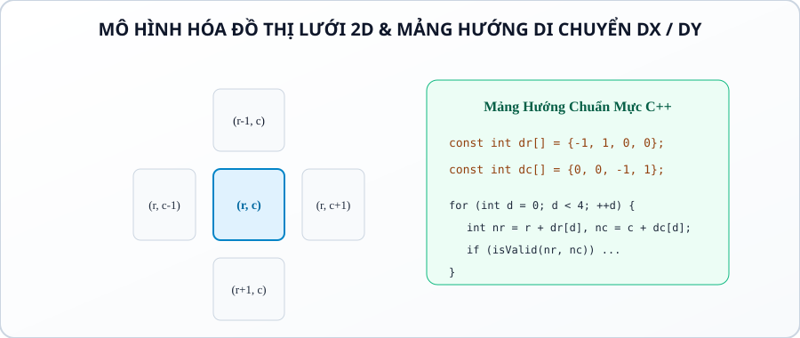
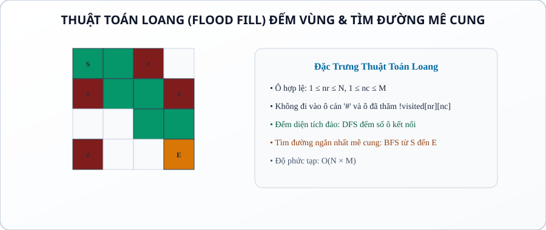
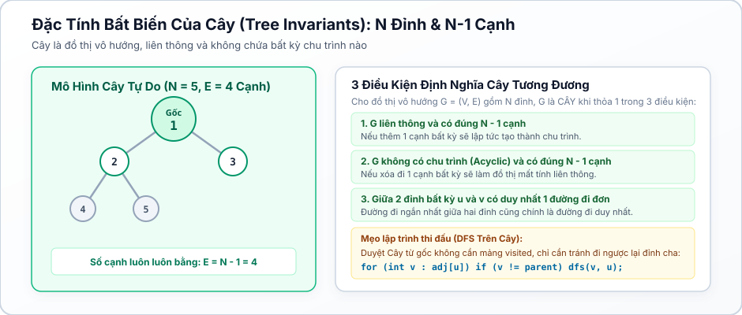

# Bài 23: Đồ thị lưới 2D, kỹ thuật Flood Fill & tính chất cây

## 1. Bản chất mô hình hóa lưới 2D thành đồ thị

Trong lập trình thi đấu, ma trận bảng vuông $N \times M$ có thể được xem là một đồ thị đặc biệt:

* Mỗi ô $(r, c)$ là một **Đỉnh** của đồ thị ($1 \le r \le N, 1 \le c \le M$). Tổng số đỉnh $|V| = N \times M$.
* Mỗi bước di chuyển sang các ô kề cạnh (4 hướng: Trên, Dưới, Trái, Phải) tương đương với một **Cạnh** vô hướng có trọng số bằng 1. Tổng số cạnh $|E| \le 4NM$.
* **Ưu điểm vượt trội:** Không cần dựng danh sách kề `vector<int> adj[]`, ta duyệt trực tiếp trên ma trận bằng **Mảng Hướng Dịch Chuyển (`dr`, `dc`)**.



## 2. Thuật toán loang (Flood Fill)



* **Bản chất:** Từ một ô xuất phát $(r_0, c_0)$, thuật toán lan tỏa (bằng DFS hoặc BFS) sang tất cả các ô lân cận có cùng tính chất (cùng màu, ô đất liền không phải nước biển, ô đường đi không có vật cản).
* **Điều kiện biên hợp lệ (Boundary Invariant):**
```cpp
// Quy ước THỐNG NHẤT toàn bài: chỉ số 0-based (0..n-1, 0..m-1), khớp 100% với code mẫu
bool isValid(int r, int c) {
return (r >= 0 && r < n && c >= 0 && c < m && grid[r][c] != '#' && !visited[r][c]);
}
```
* **Ứng dụng kinh điển:** Đếm số lượng hòn đảo (Number of Islands), tính diện tích vùng lớn nhất, tô màu sơn vùng kín, tìm đường thoát khỏi mê cung.

## 3. Lý thuyết cây trên đồ thị (Tree Properties & invariants)



Cây (Tree) là một dạng đồ thị vô hướng đặc biệt có cấu trúc phân cấp chặt chẽ:

1. Đồ thị liên thông gồm $N$ đỉnh và có **đúng $N - 1$ cạnh**.
2. Giữa 2 đỉnh bất kỳ trong cây có **duy nhất một đường đi đơn**.
3. Không chứa bất kỳ chu trình nào.
4. **Duyệt cây bằng DFS:** Bắt đầu từ gốc `root`, khi duyệt từ $u$ sang $v$ chỉ cần điều kiện `if (v != parent)` mà không cần dùng mảng `visited`!

## 4. Các bẫy lỗi lập trình kinh điển

1. **Bẫy tràn chỉ số biên ma trận (Index Out of Bounds):**
* Truy cập `grid[r + dr[d]][c + dc[d]]` trước khi kiểm tra `1 <= r+dr[d] $\le N$` sẽ gây lỗi Segmentation Fault.
* **Quy tắc an toàn:** Luôn kiểm tra tọa độ trong phạm vi $[1, N] \times [1, M]$ trước tiên!
2. **Bẫy nhầm lẫn thứ tự tọa độ Hàng và Cột (`r` vs `c`, `x` vs `y`):**
* Trong toán học, trục $x$ là ngang, $y$ là dọc. Nhưng trong ma trận máy tính, chỉ số thứ nhất là **Hàng** (chiều dọc, $N$), chỉ số thứ hai là **Cột** (chiều ngang, $M$).
* **Chuẩn hóa đặt tên:** Dùng `r` (row) và `c` (col) hoặc $dr$ và $dc$ để triệt tiêu hoàn toàn sự nhầm lẫn.
3. **Bẫy kích thước ma trận hình chữ nhật (khi $N \ne M$):**
* Viết nhầm `c <= n` thay vì `c <= m` khi ma trận có số hàng khác số cột sẽ dẫn đến truy cập sai vùng nhớ hoặc đọc thiếu dữ liệu.

## 5. Mẫu cài đặt chuẩn thi đấu (competitive templates)

### Mẫu 1: Đếm số lượng hòn đảo và diện tích lớn nhất (Flood Fill DFS)

> **Lưu ý về Stack Overflow:** Hàm DFS đệ quy trên lưới 2D có thể gây tràn ngăn xếp hệ thống khi hòn đảo có kích thước lớn (ví dụ lưới $500 \times 500$ toàn ô đất tạo ra độ sâu đệ quy $250{,}000$ tầng). Trong thi đấu thực tế với lưới lớn ($N \times M \ge 10^5$), **nên dùng BFS bằng `queue` (xem Mẫu 2 bên dưới)** để tránh hoàn toàn rủi ro này. Mẫu DFS đệ quy được giữ lại vì tính trực quan sư phạm.

```cpp
#include <bits/stdc++.h>
using namespace std;

int n, m;
vector<string> grid;

vector<vector<bool>> visited;

const int dr[] = {-1, 1, 0, 0};
const int dc[] = {0, 0, -1, 1};

bool isValid(int r, int c) {
return (r >= 0 && r < n && c >= 0 && c < m && grid[r][c] == '1' && !visited[r][c]);
}

int dfs(int r, int c) {
visited[r][c] = true;
int area = 1;

for (int d = 0; d < 4; ++d) {
int nr = r + dr[d];
int nc = c + dc[d];
if (isValid(nr, nc)) {
area += dfs(nr, nc);
}
}
return area;
}

int main() {
ios::sync_with_stdio(false);
cin.tie(nullptr);

if (!(cin >> n >> m)) return 0;

if (n <= 0 || m <= 0) return 0;

grid.resize(n);
for (int i = 0; i < n; ++i) {
cin >> grid[i];

}

visited.assign(n, vector<bool>(m, false));
int island_count = 0;
int max_area = 0;

for (int r = 0; r < n; ++r) {
for (int c = 0; c < m; ++c) {
if (grid[r][c] == '1' && !visited[r][c]) {
island_count++;
max_area = max(max_area, dfs(r, c));
}
}
}

cout << island_count << " " << max_area << "\n";
return 0;
}
```

### Mẫu 2: Tìm đường đi ngắn nhất trong mê cung (grid BFS)

```cpp
#include <bits/stdc++.h>
using namespace std;

int n, m;
vector<string> grid;

vector<vector<int>> dist;

const int dr[] = {-1, 1, 0, 0};
const int dc[] = {0, 0, -1, 1};

int main() {
ios::sync_with_stdio(false);
cin.tie(nullptr);

if (!(cin >> n >> m)) return 0;

if (n <= 0 || m <= 0) return 0;

grid.resize(n);
int sr = -1, sc = -1, er = -1, ec = -1;

for (int r = 0; r < n; ++r) {
cin >> grid[r];

for (int c = 0; c < m; ++c) {
if (grid[r][c] == 'S') { sr = r; sc = c; }
if (grid[r][c] == 'E') { er = r; ec = c; }
}
}

dist.assign(n, vector<int>(m, -1));
queue<pair<int, int>> q;

dist[sr][sc] = 0;
q.push({sr, sc});

while (!q.empty()) {
auto [r, c] = q.front();
q.pop();

if (r == er && c == ec) break;

for (int d = 0; d < 4; ++d) {
int nr = r + dr[d];
int nc = c + dc[d];

if (nr >= 0 && nr < n && nc >= 0 && nc < m && grid[nr][nc] != '#' && dist[nr][nc] == -1) {
dist[nr][nc] = dist[r][c] + 1;
q.push({nr, nc});
}
}
}

cout << dist[er][ec] << "\n";
return 0;
}
```

## Câu hỏi trắc nghiệm củng cố khái niệm

#### Câu 1 (Số cạnh tối đa trên lưới 2D 4 hướng):

Lưới ma trận $N \times M$ với quy tắc di chuyển 4 hướng có số đỉnh và số cạnh tối đa là:

- **A.** $|V| = N + M, |E| = NM$

- **B.** **[Đáp án đúng]** $|V| = N \cdot M$, $|E| \le 4NM$ (chính xác là $2NM - N - M$ cạnh vô hướng).

- **C.** $|V| = N^2, |E| = M^2$

- **D.** $|V| = 2NM, |E| = N \cdot M$

> *Giải thích:* Mỗi ô là 1 đỉnh ($NM$ đỉnh), mỗi đỉnh có tối đa 4 liên kết với các ô lân cận.

#### Câu 2 (Mảng hướng 8 hướng bao gồm cả đường chéo):

Để di chuyển 8 hướng (kể cả 4 hướng chéo) trên lưới 2D, mảng dịch chuyển $dr$ và $dc$ cần có bao nhiêu phần tử

- **A.** 4 phần tử.

- **B.** **[Đáp án đúng]** 8 phần tử: $dr = {-1,-1,-1, 0, 0, 1, 1, 1}$, $dc = {-1, 0, 1,-1, 1,-1, 0, 1}$.

- **C.** 6 phần tử.

- **D.** 16 phần tử.

> *Giải thích:* 8 hướng gồm 4 hướng chính (trên, dưới, trái, phải) và 4 hướng chéo góc.

#### Câu 3 (Độ phức tạp thuật toán Loang Flood Fill):

Thuật toán Flood Fill duyệt qua toàn bộ ma trận $N \times M$ có độ phức tạp thời gian và bộ nhớ là:

- **A.** Thời gian $\mathcal{O}(N^2 \cdot M^2)$, Bộ nhớ $\mathcal{O}(1)$.

- **B.** **[Đáp án đúng]** Thời gian $\mathcal{O}(N \cdot M)$, Bộ nhớ $\mathcal{O}(N \cdot M)$.

- **C.** Thời gian $\mathcal{O}(2^{N+M})$, Bộ nhớ $\mathcal{O}(N)$.

- **D.** Thời gian $\mathcal{O}(N \log M)$, Bộ nhớ $\mathcal{O}(M)$.

> *Giải thích:* Mỗi ô $(r, c)$ được thăm đúng 1 lần và kiểm tra 4 hướng lân cận trong $\mathcal{O}(1) \implies \mathcal{O}(N \cdot M)$.

#### Câu 4 (Đường đi của Quân Mã trên bàn cờ Knight Moves):

Quân mã trong cờ vua có bao nhiêu bước nhảy hợp lệ và biểu diễn mảng hướng như thế nào

- **A.** 4 bước nhảy dạng chữ thập.

- **B.** **[Đáp án đúng]** 8 bước nhảy hình chữ L: $dr = {-2,-2,-1,-1, 1, 1, 2, 2}$, $dc = {-1, 1,-2, 2,-2, 2,-1, 1}$.

- **C.** 8 bước nhảy đường chéo.

- **D.** 2 bước nhảy.

> *Giải thích:* Quân mã di chuyển 2 ô theo một trục và 1 ô theo trục vuông góc, tạo thành 8 vị trí có thể đến.

#### Câu 5 (Đặc tính bất biến của Cây N đỉnh):

Một đồ thị vô hướng gồm $N$ đỉnh là một Cây khi thỏa mãn đồng thời hai điều kiện nào sau đây

- **A.** Có $N$ cạnh và liên thông.

- **B.** **[Đáp án đúng]** Liên thông và có đúng $N - 1$ cạnh (hoặc không có chu trình và có đúng $N - 1$ cạnh).

- **C.** Mọi đỉnh đều có bậc $\ge 2$.

- **D.** Có chu trình Euler.

> *Giải thích:* Định lý cơ bản của lý thuyết cây: Đồ thị liên thông có $N-1$ cạnh tương đương với đồ thị phi chu trình có $N-1$ cạnh.

#### Câu 6 (Đường kính của Cây — Tree Diameter):

Đường kính của cây (khoảng cách lớn nhất giữa hai đỉnh bất kỳ trên cây) có thể tìm bằng mấy lần BFS/DFS

- **A.** 1 lần duy nhất.

- **B.** **[Đáp án đúng]** 2 lần BFS/DFS: Lần 1 từ đỉnh bất kỳ tìm đỉnh xa nhất $u$; Lần 2 từ $u$ tìm đỉnh xa nhất $v$, khoảng cách $dist(u, v)$ chính là đường kính cây.

- **C.** $N$ lần BFS từ mọi đỉnh $\mathcal{O}(N^2)$.

- **D.** Bắt buộc dùng thuật toán Dijkstra.

> *Giải thích:* Đây là thuật toán 2 lượt BFS kinh điển chạy trong $\mathcal{O}(N)$ cực kỳ đẹp mắt trên cây.

#### Câu 7 (Độ cao của cây khi chọn gốc):

Khi chọn đỉnh $R$ làm gốc (Root) của cây, chiều cao của cây được định nghĩa là:

- **A.** Tổng số đỉnh trong cây.

- **B.** **[Đáp án đúng]** Khoảng cách lớn nhất từ gốc $R$ đến một đỉnh lá bất kỳ ($\max_{v} dist(R, v)$).

- **C.** Bậc lớn nhất của một đỉnh.

- **D.** Số lượng cạnh của cây.

> *Giải thích:* Chiều cao là độ sâu lớn nhất của một nút lá tính từ gốc $R$.

#### Câu 8 (Tô màu vùng kín Enclosed Regions):

Để tìm các vùng nước biển bị bao bọc hoàn toàn bên trong đất liền (không thông ra biên ma trận), chiến lược tối ưu là:

- **A.** Flood fill từ từng ô bên trong.

- **B.** **[Đáp án đúng]** Chạy Flood Fill từ toàn bộ các ô biên ngoài cùng để đánh dấu các ô "thông ra ngoài", các ô còn lại chưa thăm chính là vùng kín bên trong.

- **C.** Dùng thuật toán quay lui.

- **D.** Sắp xếp các ô.

> *Giải thích:* Đảo ngược bài toán: Loang từ biên ngoài vào trong giúp loại bỏ toàn bộ phần không bị bao bọc trong $\mathcal{O}(NM)$.

#### Câu 9 (Số lượng lá tối thiểu của một cây $N \ge 2$):

Mọi cây có $N \ge 2$ đỉnh luôn có ít nhất bao nhiêu đỉnh lá (đỉnh có bậc bằng 1)

- **A.** 0 lá.

- **B.** **[Đáp án đúng]** Ít nhất 2 đỉnh lá.

- **C.** Đúng 1 lá.

- **D.** $N/2$ lá.

> *Giải thích:* Bằng chứng minh phản chứng qua định lý bắt tay, một cây luôn có tối thiểu 2 đỉnh lá ở 2 đầu mút của đường đi dài nhất.

#### Câu 10 (Truy vết đường đi trong Mê cung 2D):

Để in ra chuỗi ký tự các bước đi `'U'`, `'D'`, `'L'`, `'R'` từ $S$ đến $E$ trong mê cung, ta lưu thông tin gì trong BFS

- **A.** Lưu mảng boolean $visited$.

- **B.** **[Đáp án đúng]** Mảng `parent[r][c] = {pr, pc}` và `move_dir[r][c] = 'D'`, sau đó lần ngược từ $E$ về $S$ rồi đảo ngược chuỗi.

- **C.** In trực tiếp khi đang duyệt.

- **D.** Dùng hàm đệ quy in xuôi.

> *Giải thích:* Lưu vết hướng đi và tọa độ cha cho phép tái tạo chính xác lộ trình từng bước.

#### Câu 11 (Thuật toán Loang đa nguồn trên Lưới):

Trong bài toán "Cháy rừng" (nhiều điểm cháy cùng lúc lan sang các cây xung quanh mỗi giây), ta giải bằng cấu trúc nào

- **A.** Chạy DFS độc lập từ từng đám cháy.

- **B.** **[Đáp án đúng]** Multi-source BFS: Đẩy toàn bộ tọa độ các đám cháy ban đầu vào Queue với `dist = 0`, sau đó loang từng lớp theo thời gian.

- **C.** Dùng quy hoạch động 2 chiều.

- **D.** Dùng thuật toán Dijkstra.

> *Giải thích:* BFS đa nguồn mô phỏng chính xác sự lan tỏa đồng thời của các đám cháy theo từng đơn vị thời gian.

#### Câu 12 (Bậc của đỉnh trong Cây):

Trên một Cây có gốc, một đỉnh $u$ có $K$ nút con trực tiếp. Bậc của đỉnh $u$ (vô hướng) bằng bao nhiêu

- **A.** Luôn bằng $K$.

- **B.** **[Đáp án đúng]** Bằng $K$ (nếu $u$ là gốc) hoặc $K + 1$ (nếu $u$ không phải gốc, gồm $K$ con và 1 cha).

- **C.** Bằng $K - 1$.

- **D.** Bằng $2K$.

> *Giải thích:* Nút không phải gốc có 1 cạnh nối lên nút cha và $K$ cạnh nối xuống các nút con.

#### Câu 13 (Cây con Subtree Size):

Để tính kích thước của mọi cây con $sz[u]$ (số lượng đỉnh thuộc cây con gốc $u$), ta sử dụng hàm đệ quy DFS theo thứ tự nào

- **A.** Tiền thứ tự (Pre-order, tính trước khi duyệt con).

- **B.** **[Đáp án đúng]** Hậu thứ tự (Post-order: $sz[u] = 1 + \sum_{v \in children} sz[v]$ sau khi đã tính xong mọi con).

- **C.** Duyệt ngẫu nhiên.

- **D.** Không thể tính bằng DFS.

> *Giải thích:* Kích thước cây con được gom dồn từ dưới đáy lá ngược lên gốc (Post-order DP on Trees).

#### Câu 14 (Chu trình trong Đồ thị lưới):

Một đồ thị lưới 2D kích thước $2 \times 2$ có chứa chu trình hay không

- **A.** Không có chu trình vì lưới là cây.

- **B.** **[Đáp án đúng]** Có chứa đúng 1 chu trình độ dài 4: $(1,1) \to (1,2) \to (2,2) \to (2,1) \to (1,1)$.

- **C.** Có chứa 2 chu trình.

- **D.** Tùy thuộc vào hướng di chuyển.

> *Giải thích:* 4 ô tạo thành một vòng khép kín độ dài 4 $\implies$ Lưới 2D không phải là cây mà là đồ thị tổng quát có nhiều chu trình.

#### Câu 15 (Số thành phần liên thông của tập ô đất liền):

Cho ma trận biển đảo, sau khi biến một ô nước `'0'` thành ô đất `'1'`, số thành phần liên thông đảo sẽ thay đổi tối đa như thế nào

- **A.** Luôn tăng thêm 1.

- **B.** **[Đáp án đúng]** Có thể tăng 1, giữ nguyên, hoặc giảm tối đa 3 (khi ô mới đóng vai trò cầu nối hợp nhất 4 hòn đảo xung quanh lại thành 1).

- **C.** Luôn giảm đi 1.

- **D.** Không bao giờ thay đổi.

> *Giải thích:* Ô đất mới kết nối tối đa 4 đảo kề cạnh thành 1 hòn đảo duy nhất $\implies$ Giảm tối đa $4 - 1 = 3$ thành phần.

## Ma trận bài tập thực hành (P0 → P5)

| Mã Bài Tập | Tên Bài Toán | Mức Độ | Trọng Tâm Kiến Thức & Kỹ Năng Lưới 2D |
|---|---|:---:|---|
| `CPPB-GRD-01` | Duyệt 4 Hướng Trên Ma Trận Cơ Bản | **P0** | Cài đặt mảng hướng `dr`, `dc` và hàm kiểm tra `isValid`. |
| `CPPB-GRD-02` | Đếm Số Lượng Hòn Đảo (Count Islands) | **P1** | Flood Fill DFS đếm số thành phần liên thông các ô đất `'1'`. |
| `CPPB-GRD-03` | Diện Tích Hòn Đảo Lớn Nhất | **P1** | DFS gom dồn số ô đất trong từng thành phần liên thông. |
| `CPPB-GRD-04` | Tìm Đường Thoát Khỏi Mê Cung BFS | **P2** | BFS tìm số bước ngắn nhất từ vị trí $S$ đến $E$. |
| `CPPB-GRD-05` | Truy Vết Đường Đi Mê Cung (L, R, U, D) | **P2** | Lưu mảng `parent` và in ra chuỗi ký tự hướng đi cụ thể. |
| `CPPB-GRD-06` | Đếm Vùng Kín Không Thông Ra Biên | **P2** | Loang từ toàn bộ các ô viền biên để khử các vùng mở. |
| `CPPB-GRD-07` | Chu Vi Hòn Đảo (Island Perimeter) | **P2** | Đếm số cạnh tiếp xúc với nước hoặc tiếp xúc với biên ma trận. |
| `CPPB-GRD-08` | Nước Tràn Mê Cung (Multi-Source BFS) | **P3** | Đẩy đồng thời nhiều nguồn nước vào Queue ban đầu. |
| `CPPB-GRD-09` | Bước Nhảy Quân Mã Ngắn Nhất (Knight Moves) | **P3** | BFS với mảng 8 hướng di chuyển hình chữ L trên bàn cờ $N \times M$. |
| `CPPB-GRD-10` | Đường Kính Của Cây (Tree Diameter) | **P3** | Thuật toán 2 lần BFS/DFS tìm khoảng cách lớn nhất giữa 2 đỉnh cây. |
| `CPPB-GRD-11` | Kích Thước Cây Con & Trọng Tâm Của Cây | **P3** | DFS hậu thứ tự tính `sz[u]` và tìm nút trọng tâm (Centroid). |
| `CPPB-GRD-12` | Mê Cung Có Cửa Dịch Chuyển Tức Thời (Teleport) | **P4** | Mô hình hóa các ô cùng màu kết nối nhau trong $\mathcal{O}(1)$. |
| `CPPB-GRD-13` | Làm Đầy Hồ Chứa Nước (Rotting Oranges) | **P4** | BFS tính thời gian tối thiểu để toàn bộ cam bị hỏng. |
| `CPPB-GRD-14` | Hòn Đảo Nhân Tạo Lớn Nhất (Making A Large Island) | **P4** | Đánh số ID từng đảo rồi thử lật từng ô nước thành đất trong $\mathcal{O}(NM)$. |
| `CPPB-GRD-15` | Thoát Khỏi Mê Cung Quái Vật Olympic (Mastery) | **P5** | 2 lượt BFS đồng thời: Quái vật lan tỏa trước, Người đi sau chuẩn thi đấu. |
