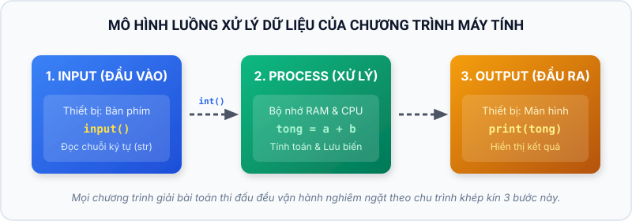
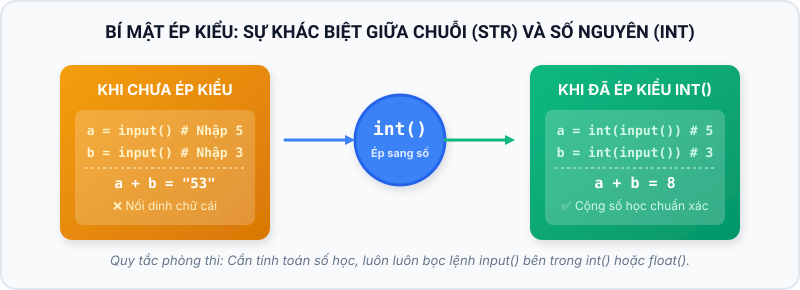
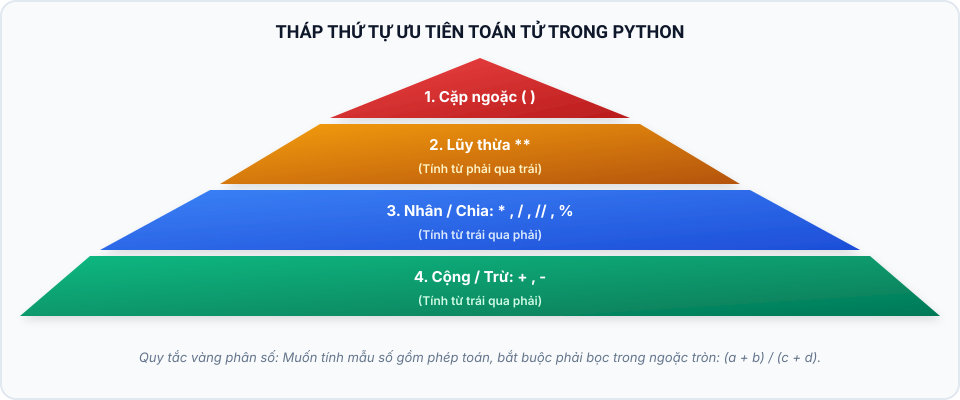
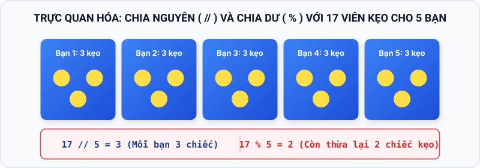
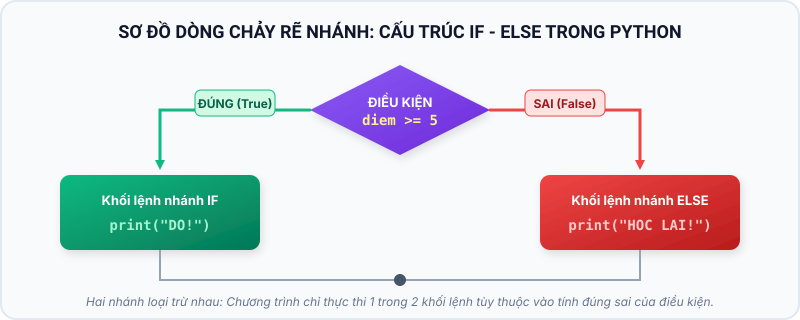
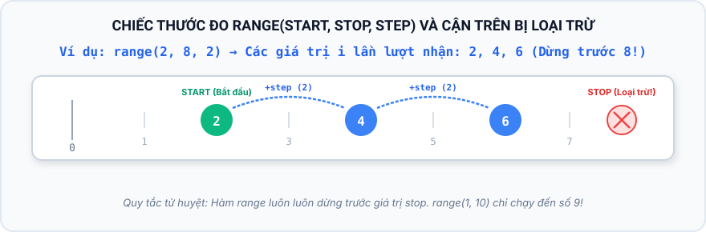
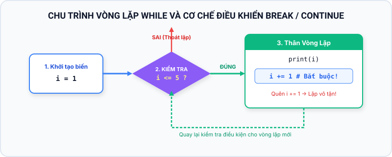
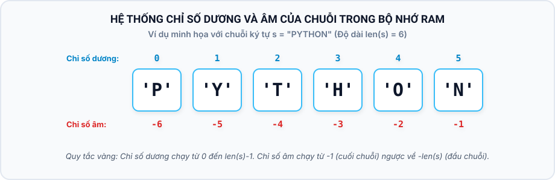
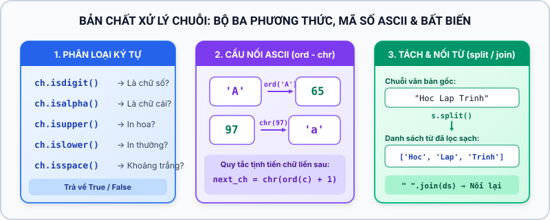

# iKHEDU PYTHON BẢNG A — TỔNG HỢP NỘI DUNG 6 CHƯƠNG

> File tổng hợp tự động toàn bộ nội dung lesson của khóa Python Bảng A — Level 1.
> Nguồn canonical vẫn là các file trong `lessons/`; không chỉnh sửa trực tiếp file này.

## MỤC LỤC TỔNG QUAN

### Chương 1: TÍNH TOÁN CƠ BẢN
- Bài 01: Lệnh xuất nhập, biến số và kiểu dữ liệu
- Bài 02: Toán tử số học và biểu thức toán học
- Bài 03: Phép chia nguyên, chia dư và lũy thừa
### Chương 2: CẤU TRÚC RẼ NHÁNH & CẤU TRÚC VÒNG LẶP
- Bài 04: Cấu trúc rẽ nhánh và điều kiện logic
- Bài 05: Vòng lặp for và hàm range
- Bài 06: Vòng lặp while và biến cờ
### Chương 3: BÀI TOÁN SỐ HỌC & TÁCH CHỮ SỐ
- Bài 07: Quy luật dãy số và tam giác số
- Bài 08: Kỹ thuật tách chữ số và xử lý số nguyên qua vòng lặp while
- Bài 09: Ước số, Bội số và Số nguyên tố
- Bài 10: Đếm số theo quy luật và số đặc biệt
### Chương 4: DANH SÁCH (LIST) & THỐNG KÊ
- Bài 11: Danh sách và thao tác cơ bản
- Bài 12: Thống kê danh sách và sắp xếp
### Chương 5: XỬ LÝ CHUỖI KÝ TỰ
- Bài 13: Chuỗi ký tự — Chỉ số, cắt lát và duyệt ký tự
- Bài 14: Duyệt chuỗi, biến đổi ký tự và tách từ
### Chương 6: LUYỆN THI
- Bài 15: Chiến lược giải đề thi lập trình Python
- Bài 16: Tổng ôn kiến thức và Đề thi thử

================================================================================
# PHẦN I — CURRICULUM AUDIT VÀ ALGORITHM PATTERNS
================================================================================

# CURRICULUM AUDIT — PYTHON BẢNG A LEVEL 1

## Quyết định phạm vi

Khóa học giữ nguyên **6 chương / 16 bài**, tập trung vào Python 3 và tư duy giải bài cho Python Bảng A. Đây là khóa Python định hướng thuật toán, không phải khóa Python tổng quát.

Các nội dung như `def`, `return`, `dict`, `set`, tuple, module, file I/O, exception nâng cao và comprehension không phải chuẩn bắt buộc của Level 1. Có thể giới thiệu ở Level 2 hoặc phụ lục khi cần.

## Tiêu chí kiểm tra từng bài

| Tiêu chí | Câu hỏi kiểm tra |
|---|---|
| Prerequisite | Học sinh cần biết gì trước khi bắt đầu bài? |
| Bắt buộc Knowledge | Kiến thức nào bắt buộc đạt sau bài? |
| Algorithm Pattern | Học sinh có nhận ra mẫu giải có thể chuyển giao không? |
| Practice Coverage | Bài tập có đi từ cơ bản đến thử thách theo độ khó hợp lý không? |
| Exit Skill | Học sinh có thể tự làm được việc gì sau bài? |

## Ma trận audit

| Bài | Prerequisite | Bắt buộc Knowledge | Algorithm Pattern | Practice Coverage | Exit Skill |
|:---:|---|---|---|---|---|
| 01 | Không | `print`, `input`, biến, kiểu dữ liệu | Input → process → output | Cơ bản đến luyện tập | Viết chương trình nhập, tính và in kết quả |
| 02 | Bài 01 | Toán tử, `//`, `%`, `**` | Công thức trực tiếp, modulo | Cơ bản đến vận dụng | Chọn đúng phép toán cho bài toán |
| 03 | Bài 02 | Hình học, đổi đơn vị/thời gian, làm tròn | Tách đại lượng và ghép công thức | Cơ bản đến vận dụng | Mô hình hóa bài toán thực tế bằng công thức |
| 04 | Bài 01–03 | So sánh, Boolean, `if/elif/else`, `and/or/not` | Decision + Classification + Boolean expression | Cơ bản đến thử thách | Viết rẽ nhánh nhiều hướng và điều kiện ghép đúng |
| 05 | Bài 02 | `for`, `range` | Sum / accumulator | Cơ bản đến thử thách | Duyệt một khoảng và tích lũy kết quả |
| 06 | Bài 04–05 | `while`, `break`, `continue` | Sentinel / flag | Cơ bản đến vận dụng | Điều khiển vòng lặp chưa biết trước số lượt |
| 07 | Bài 05–06 | Dãy số, Fibonacci, nested loop | Rolling variables / pattern | Bắt buộc và thử thách | Sinh dãy và in mẫu bằng vòng lặp |
| 08 | Bài 02, 06 | Tách chữ số bằng `// 10`, `% 10` | Digit extraction | Bắt buộc và thử thách | Xử lý từng chữ số của số nguyên |
| 09 | Bài 02, 05 | Ước, bội, nguyên tố, GCD | Divisor scan | Bắt buộc và thử thách | Kiểm tra và đếm tính chất số học |
| 10 | Bài 08–09 | Số đặc biệt và đếm theo đoạn | Predicate + counting | Bắt buộc và thử thách | Đếm phần tử thỏa điều kiện |
| 11 | Bài 05, 13 | List, index, mutable, thao tác cơ bản | List traversal | Cơ bản đến vận dụng | Duyệt và cập nhật danh sách |
| 12 | Bài 11 | Thống kê, sắp xếp, trùng lặp | Statistics / ordering | Bắt buộc và thử thách | Tóm tắt và sắp xếp dữ liệu |
| 13 | Bài 01 | Index, slice, chuỗi là sequence | Sequence access | Cơ bản đến vận dụng | Lấy và cắt đúng phần chuỗi |
| 14 | Bài 13 | Duyệt, biến đổi ký tự, `split/join`, `ord/chr` | String traversal + Tokenize → transform → join | Cơ bản đến vận dụng | Duyệt và biến đổi chuỗi theo quy tắc |
| 15 | Bài 01–14 | Đọc đề, test biên, chiến lược thi | Pattern selection | Cơ bản đến vận dụng | Chọn mô hình giải và tự kiểm thử |
| 16 | Bài 01–15 | Đề contest giấu pattern, subtask, phân bổ thời gian | Pattern selection + vét điểm subtask | Đề thi thử (đang biên soạn) | Tự làm đề thi thử trong giới hạn thời gian |

## Mức độ bài tập

- **Cơ bản:** làm quen và áp dụng trực tiếp kiến thức mới.
- **Luyện tập:** biến đổi dữ liệu hoặc điều kiện trong bài quen thuộc.
- **Vận dụng:** chuyển kiến thức sang bối cảnh mới.
- **Thử thách:** bài mở rộng, không dùng làm điều kiện loại học sinh khỏi Level 1.

## Pattern card dùng xuyên suốt

Các pattern chuẩn được đặt trong [`ALGORITHM_PATTERNS.md`](ALGORITHM_PATTERNS.md) và được gọi lại trong lesson phù hợp: input/process/output, counting, sum, maximum, flag, digit extraction, nested loop, rolling variables, string traversal, list traversal và complexity check.

## Kết luận audit

Phạm vi kiến thức đủ để chốt Level 1. Giai đoạn tiếp theo là chuẩn hóa ví dụ, giảm claim không có nguồn, đánh dấu Core/Thử thách và kiểm tra từng bài theo ma trận trên; không mở rộng thêm chương.

# ALGORITHM PATTERNS — PYTHON BẢNG A LEVEL 1

Các mẫu dưới đây là thẻ nhớ dùng xuyên suốt khóa học. Học sinh cần nhận ra mẫu, hiểu điều kiện dùng và tự thay đổi phần điều kiện hoặc phép cập nhật.

## 1. Input → Process → Output

```python
du_lieu = int(input())
ket_qua = du_lieu + 5
print(ket_qua)
```

## 2. Counting

```python
dem = 0
for x in day:
    if dieu_kien(x):
        dem += 1
```

## 3. Sum / Accumulator

```python
tong = 0
for x in day:
    tong += x
```

## 4. Maximum hoặc minimum

```python
lon_nhat = day[0]
for x in day[1:]:
    if x > lon_nhat:
        lon_nhat = x
```

## 5. Flag / Search

```python
found = False
for x in day:
    if dieu_kien(x):
        found = True
        break
```

## 6. Digit extraction

```python
while n > 0:
    digit = n % 10
    n //= 10
```

## 7. Nested loop

```python
for i in range(so_hang):
    for j in range(so_cot):
        xu_ly(i, j)
```

Hai vòng lặp lồng nhau thường cần kiểm tra lại với giới hạn $N$ trước khi dùng.

## 8. Rolling variables

```python
a, b = b, a + b
```

Mẫu này phù hợp với Fibonacci và các dãy mà trạng thái mới phụ thuộc vào một vài trạng thái ngay trước đó.

## 9. String traversal

```python
for ch in s:
    xu_ly(ch)
```

Khi cần vị trí, dùng `for i in range(len(s))`.

## 10. List traversal

```python
for x in a:
    xu_ly(x)

for i in range(len(a)):
    a[i] = bien_doi(a[i])
```

Dùng cách thứ nhất khi chỉ cần giá trị; dùng cách thứ hai khi cần index hoặc thay đổi phần tử.

## 11. Nghĩ về tốc độ

| Dấu hiệu | Mẫu thường gặp | Cần nhớ |
|---|---|---|
| Không phụ thuộc $N$ | Công thức trực tiếp | $\mathcal{O}(1)$ |
| Duyệt một lần | Một vòng lặp qua $N$ phần tử | $\mathcal{O}(N)$ |
| Duyệt lồng nhau | Hai vòng lặp theo $N$ | $\mathcal{O}(N^2)$ |
| Mỗi bước giảm một phần | Tách chữ số hoặc chia đôi | Thường nhỏ hơn $\mathcal{O}(N)$ |

Trước khi chọn vòng lặp, luôn hỏi: $N$ lớn đến đâu và số lần lặp thực tế là bao nhiêu?


================================================================================
# PHẦN II — NỘI DUNG CHI TIẾT
================================================================================


================================================================================
# CHƯƠNG 01: TÍNH TOÁN CƠ BẢN
================================================================================


--------------------------------------------------------------------------------
<!-- Bài 01: Lệnh xuất nhập, biến số và kiểu dữ liệu -->
--------------------------------------------------------------------------------

## Lý thuyết và Concept Quiz

# Bài 01: Lệnh xuất nhập, biến số và kiểu dữ liệu

## 1. Bản chất chương trình máy tính & Luồng dữ liệu I/O

Trong khoa học máy tính và lập trình thi đấu, một chương trình máy tính thực chất là một **chuỗi các chỉ thị có trật tự** điều khiển phần cứng thực thi để biến đổi dữ liệu đầu vào thành kết quả đầu ra theo yêu cầu bài toán.

Mọi bài toán trong các kỳ thi lập trình đều vận hành nghiêm ngặt theo **luồng dữ liệu 3 bước khép kín (Đầu vào $\to$ Xử lý $\to$ Đầu ra)**:



1. **Đầu vào:** Nhận dữ liệu do đề bài cung cấp từ bàn phím (luồng dữ liệu chuẩn `stdin`) thông qua lệnh `input()`.
2. **Xử lý:** Dữ liệu được nạp vào bộ nhớ RAM dưới dạng các **biến số**. Bộ vi xử lý (CPU) áp dụng các công thức tính toán, phép biến đổi dữ liệu hoặc thuật toán để tính ra kết quả.
3. **Đầu ra:** Xuất kết quả cuối cùng lên màn hình (luồng dữ liệu chuẩn `stdout`) thông qua lệnh `print()`.

---

## 2. Lệnh xuất dữ liệu `print()` toàn tập

Lệnh `print()` là công cụ cơ bản nhất trong Python dùng để hiển thị dữ liệu ra màn hình. Lệnh này có khả năng in văn bản, in giá trị số học và in trực tiếp kết quả của các biểu thức.

### 2.1. Cú pháp in các loại dữ liệu cơ bản

* **In chuỗi ký tự (Văn bản):** Nội dung bắt buộc phải được đặt trong cặp dấu nháy kép `"` hoặc nháy đơn `'`.
  ```python
  print("Chao mung ban den voi ngon ngu lap trinh Python!")
  ```
* **In giá trị số:** Các con số được viết trực tiếp, tuyệt đối không đặt trong dấu nháy.
  ```python
  print(2026)
  ```
* **In kết quả của phép tính:** Máy tính sẽ tính toán giá trị của biểu thức trước, sau đó in con số kết quả ra màn hình.
  ```python
  print(15 + 25)  # Màn hình hiển thị số 40
  ```

> ⚠️ **Lưu ý phân biệt dấu nháy:**
> - `print("15 + 25")` $\implies$ In ra dòng chữ nguyên bản: `15 + 25`.
> - `print(15 + 25)` $\implies$ Máy tính thực hiện phép cộng và in ra kết quả: `40`.

### 2.2. In nhiều đối số trên một dòng

Trong Python, ta có thể in nhiều món dữ liệu khác nhau trên cùng một dòng bằng cách đặt chúng cách nhau bởi **dấu phẩy `,`**.

```python
diem = 10
print("Diem thi lap trinh cua Minh la:", diem, "diem.")
```
**Kết quả hiển thị trên màn hình:**
```text
Diem thi lap trinh cua Minh la: 10 diem.
```
* **Quy tắc ngầm định của Python:** Khi sử dụng dấu phẩy `,` giữa các đối số, Python sẽ tự động chèn thêm **một khoảng trắng (dấu cách)** vào giữa các món dữ liệu đó.

### 2.3. Hai tham số điều khiển cao cấp: `sep` và `end`

Lệnh `print()` cung cấp hai tham số tùy chỉnh cực kỳ quan trọng thường xuyên gặp trong lập trình thi đấu:

| Tham Số | Giá Trị Mặc Định | Ý Nghĩa Kỹ Thuật | Ví Dụ Cài Đặt | Kết Quả Hiển Thị |
|---|:---:|---|---|---|
| **`sep`** | `" "` *(Một dấu cách)* | Ký tự dùng để ngăn cách giữa các đối số trên cùng một dòng. | `print(1, 2, 3, sep="-")` | `1-2-3` |
| **`end`** | `"\n"` *(Ký tự xuống dòng)* | Ký tự được in ra ở vị trí cuối cùng sau khi đã in hết các đối số. | `print("A", end=" ")`<br>`print("B")` | `A B` *(Cùng 1 dòng)* |

#### Ví dụ ứng dụng thực tế:
1. **In dãy số liền nhau không có dấu cách:**
   ```python
   print(1, 2, 3, 4, 5, sep="")  # In ra: 12345
   ```
2. **In ngày tháng năm định dạng chuẩn `dd/mm/yyyy`:**
   ```python
   ngay = 4
   thang = 9
   nam = 2026
   print(ngay, thang, nam, sep="/")  # In ra: 4/9/2026
   ```

---

## 3. Biến số và Bản chất Bộ nhớ RAM

### 3.1. Bản chất kỹ thuật của Biến số

Biến số không phải là một con số cố định. Trong khoa học máy tính, **Biến số là tên định danh gán cho một ô nhớ trong bộ nhớ RAM** dùng để lưu trữ dữ liệu trong suốt quá trình chương trình vận hành.


* **Cú pháp khai báo và gán giá trị:**
  ```python
  ten_bien = gia_tri
  ```
  Dấu `=` ở đây được gọi là **toán tử gán**, không phải là dấu bằng trong toán học.
* **Cơ chế vận hành của toán tử gán `=`:**
  1. Máy tính luôn tính toán giá trị của biểu thức nằm ở **vế bên phải** trước.
  2. Sau khi đã có kết quả cụ thể, máy tính mới nạp giá trị này vào ô nhớ của biến nằm ở **vế bên trái**.

### 3.2. Quy tắc đặt tên biến chuẩn mực

Python kiểm soát quy tắc đặt tên biến rất nghiêm ngặt. Đặt tên biến sai sẽ dẫn đến lỗi cú pháp `SyntaxError`:

| Tiêu Chí | Quy Tắc Bắt Buộc | Tên Hợp Lệ ✅ | Tên Bị Lỗi ❌ (Lý Do) |
|---|---|---|---|
| **Ký tự cho phép** | Chỉ gồm chữ cái tiếng Anh (`a-z`, `A-Z`), chữ số (`0-9`) và dấu gạch dưới `_`. | `tong`, `so_luong_1` | `so-luong` *(Dấu gạch ngang bị hiểu nhầm là phép trừ)* |
| **Ký tự bắt đầu** | **Bắt buộc** bắt đầu bằng chữ cái hoặc dấu `_`. **Tuyệt đối không bắt đầu bằng chữ số**. | `a1`, `_tong` | `1chieu_dai` *(Bắt đầu bằng chữ số 1)* |
| **Khoảng trắng** | **Không được** chứa dấu cách trong tên biến. | `chieu_dai` | `chieu dai` *(Chứa dấu cách giữa 2 chữ)* |
| **Từ khóa hệ thống** | Không được đặt tên trùng với các từ khóa đã dành riêng của Python. | `my_print`, `so_if` | `print`, `if`, `for`, `while`, `True` |
| **Phân biệt hoa - thường**| Python phân biệt chữ hoa và chữ thường (phân biệt chữ hoa và chữ thường). | `Diem` và `diem` là 2 biến hoàn toàn khác nhau. | |

### 3.3. Cơ chế gán đè và Hoán đổi hai biến

Trong quá trình chạy, biến số có thể thay đổi giá trị nhiều lần. Mỗi lần gán mới, giá trị cũ lưu trong ô nhớ RAM sẽ bị xóa bỏ hoàn toàn:

```python
x = 10     # RAM lưu số 10
x = x + 5  # Máy tính lấy 10 + 5 = 15, sau đó nạp đè 15 vào x
x = 99     # RAM xóa 15, nạp đè số 99 vào x
print(x)   # Màn hình in ra 99
```

#### Kỹ thuật hoán đổi giá trị của hai biến:
Trong toán học hoặc các ngôn ngữ khác, để đổi chỗ hai biến `a` và `b`, ta phải mượn một biến trung gian `tam`. Tuy nhiên, Python cung cấp cú pháp gán đồng thời (đóng gói và mở gói dữ liệu) cực kỳ ngắn gọn:
```python
a = 5
b = 10
# Hoán đổi giá trị giữa a và b trên cùng một dòng:
a, b = b, a
print(a, b)  # Màn hình in ra: 10 5
```

---

## 4. Các kiểu dữ liệu cơ bản trong Python

Máy tính cần biết dữ liệu thuộc loại nào để phân bổ dung lượng bộ nhớ RAM và áp dụng các phép toán tương ứng. Python quản lý các kiểu dữ liệu cốt lõi sau:

| Kiểu Dữ Liệu | Tên Trong Python | Ý Nghĩa & Bản Chất | Ví Dụ Giá Trị | Thao Tác / Ứng Dụng |
|:---:|:---:|---|---|:---:|
| **Số nguyên** | `int` | Tập hợp các số nguyên $\mathbb{Z}$ (âm, dương, số 0). Trong Python, số nguyên có thể dài hàng nghìn chữ số mà không lo bị tràn số. | `-15`, `0`, `42`, `1000000` | Thực hiện đầy đủ các phép tính số học: `+`, `-`, `*`, `//`, `%`, `**` |
| **Số thực** | `float` | Tập hợp các số thập phân có dấu chấm `.`. | `3.14`, `-0.5`, `2.0` | Thực hiện các phép tính số học và làm tròn số |
| **Chuỗi ký tự** | `str` | Dãy các ký tự văn bản đặt trong dấu nháy kép hoặc nháy đơn. | `"Ha Noi"`, `'2026'`, `"A"` | Dấu `+` dùng để nối chuỗi, dấu `*` dùng để lặp lại chuỗi |
| **Kiểu dữ liệu logic** | `bool` | Chỉ gồm đúng hai trạng thái: Đúng hoặc Sai. | `True`, `False` | Dùng làm điều kiện trong rẽ nhánh và vòng lặp |
| **Danh sách** | `list` | Tập hợp gồm nhiều phần tử được xếp thứ tự trong cặp ngoặc vuông `[ ]`. | `[1, 2, 3]`, `["An", "Binh"]` | Lưu trữ dãy số, bảng điểm; giới thiệu mở đầu, học sâu tại Bài 11 |

* **Kiểm tra kiểu dữ liệu với hàm `type()`:**
  ```python
  print(type(100))        # Kết quả: <class 'int'>
  print(type(3.14))       # Kết quả: <class 'float'>
  print(type("Python"))   # Kết quả: <class 'str'>
  print(type(True))       # Kết quả: <class 'bool'>
  print(type([1, 2, 3]))  # Kết quả: <class 'list'>
  ```

---

## 5. Lệnh nhập dữ liệu `input()` & Đổi kiểu dữ liệu

### 5.1. Bí mật sống còn: `input()` luôn trả về kiểu Chuỗi (`str`)

Lệnh `input()` tạm dừng chương trình và chờ người dùng nhập một dòng văn bản từ bàn phím, kết thúc khi nhấn phím `Enter`.



> ❌ **TỬ HUYỆT PHÒNG THI KINH ĐIỂN CỦA HỌC SINH:**
> Nếu viết mã như sau:
> ```python
> a = input()  # Học sinh nhập số 5 từ bàn phím
> b = input()  # Học sinh nhập số 3 từ bàn phím
> print(a + b)
> ```
> Màn hình sẽ **KHÔNG IN RA 8**, mà in ra: `53`!
> 
> **Nguyên nhân:** Vì `input()` luôn đọc dữ liệu vào dưới dạng chuỗi ký tự (`str`), nên biến `a` thực chất lưu chữ `"5"` và biến `b` lưu chữ `"3"`. Toán tử `+` khi áp dụng trên chuỗi sẽ thực hiện thao tác **ghép dính chuỗi lại với nhau**: `"5" + "3" = "53"`.

### 5.2. Kỹ thuật đổi kiểu sang số nguyên `int()` và số thực `float()`

Để máy tính hiểu rằng đây là các con số cần tính toán, ta bắt buộc phải đưa dữ liệu chuỗi qua **chuyển đổi kiểu dữ liệu**:

* **Đổi kiểu nhập số nguyên:**
  ```python
  n = int(input())
  ```
* **Đổi kiểu nhập số thực:**
  ```python
  x = float(input())
  ```

#### Chương trình chuẩn mực nhập 2 số nguyên và in tổng:
```python
# Bước 1: Nhập dữ liệu và đổi kiểu dữ liệu
a = int(input())
b = int(input())

# Bước 2: Tính toán
tong = a + b

# Bước 3: Xuất kết quả
print(tong)
```

### 5.3. Kỹ thuật nhập nhiều số trên cùng một dòng (`split`)

Trong đề thi lập trình, dữ liệu đầu vào thường được đặt trên cùng một dòng, cách nhau bởi dấu cách (Ví dụ: dòng 1 chứa 2 số nguyên $A$ và $B$). Nếu dùng hai lệnh `input()` rời rạc, chương trình sẽ đọc nhầm dòng tiếp theo.

* **Cú pháp chuẩn mực đọc 2 số nguyên trên cùng một dòng:**
  ```python
  a, b = map(int, input().split())
  ```
  - `input()`: Đọc trọn vẹn cả dòng dữ liệu văn bản.
  - `.split()`: Cắt dòng văn bản thành các mẩu chuỗi nhỏ dựa theo dấu cách.
  - `map(int, ...)`: Tự động đem từng mẩu chuỗi đó chuyển sang kiểu số nguyên `int`.
  - `a, b = ...`: Lần lượt nạp 2 số nguyên vào 2 biến `a` và `b`.

---

## 6. Bảng mô phỏng biến thiên ô nhớ qua từng bước

Xét đoạn chương trình sau:
```python
a = int(input())   # Nhập 12
b = int(input())   # Nhập 8
hieu = a - b
a = a + 10
tong = a + b
```

### Bảng theo dõi giá trị biến trong bộ nhớ RAM qua từng dòng lệnh:

| Thứ Tự | Dòng Lệnh Thực Thi | Thao Tác Máy Tính Thực Hiện | Biến `a` trong RAM | Biến `b` trong RAM | Biến `hieu` | Biến `tong` |
|:---:|---|---|:---:|:---:|:---:|:---:|
| **1** | `a = int(input())` | Đọc chuỗi `"12"`, ép sang số nguyên `12`, nạp vào `a` | **12** | Chưa có | Chưa có | Chưa có |
| **2** | `b = int(input())` | Đọc chuỗi `"8"`, ép sang số nguyên `8`, nạp vào `b` | 12 | **8** | Chưa có | Chưa có |
| **3** | `hieu = a - b` | Tính $12 - 8 = 4$, nạp vào biến `hieu` | 12 | 8 | **4** | Chưa có |
| **4** | `a = a + 10` | Đọc $a = 12$, tính $12 + 10 = 22$, ghi đè vào biến `a` | **22** | 8 | 4 | Chưa có |
| **5** | `tong = a + b` | Đọc $a = 22, b = 8$, tính $22 + 8 = 30$, nạp vào `tong` | 22 | 8 | 4 | **30** |

---

## 7. Tử huyệt và Các bẫy lỗi lập trình kinh điển

> ❌ **BẪY LỖI 1: IN THỪA CÂU CHỮ TRONG LẬP TRÌNH THI ĐẤU**
> * **Đoạn code sai lầm:**
>   ```python
>   n = int(input("Moi ban nhap vao so n: "))
>   print("Ket qua la:", n * 2)
>   ```
> * **Hậu quả trên máy chấm:** Máy chấm tự động (Themis/DKOJ) so sánh từng ký tự đầu ra. Việc in các thông báo như `"Moi ban nhap..."` hoặc `"Ket qua la: "` sẽ khiến kết quả bị sai lệch và nhận ngay kết quả **Wrong Answer (WA) - 0 điểm**.
> * **Cách viết đúng chuẩn mực thi đấu:**
>   ```python
>   n = int(input())
>   print(n * 2)
>   ```

> ❌ **BẪY LỖI 2: ĐẶT TÊN BIẾN SAI QUY TẮC**
> * Viết `2_ban = 10` $\implies$ Báo lỗi `SyntaxError: invalid decimal literal` (Không được bắt đầu bằng chữ số).
> * Viết `diem toan = 9` $\implies$ Báo lỗi `SyntaxError: invalid syntax` (Không được chứa khoảng trắng).
> * **Cách sửa chuẩn:** Đặt là `ban_2 = 10` và `diem_toan = 9`.

> ❌ **BẪY LỖI 3: QUÊN ĐỔI KIỂU DỮ LIỆU KHI ĐỌC SỐ**
> * Viết `x = input()`, sau đó tính `y = x - 5` $\implies$ Báo lỗi `TypeError: unsupported operand type(s) for -: 'str' and 'int'`. Chuỗi không thể thực hiện phép trừ với số nguyên.

---

## 8. Mẫu code chuẩn thi đấu

```python
# Mẫu 1: Nhập 2 số trên 2 dòng riêng biệt và in tổng
a = int(input())
b = int(input())
print(a + b)

# Mẫu 2: Nhập 2 số trên cùng 1 dòng cách nhau dấu cách và in tổng
x, y = map(int, input().split())
print(x + y)
```

---

## 9. Concept Quiz: 15 câu trắc nghiệm kiểm tra sâu khái niệm

#### Câu 1 (Nhận diện cú pháp):
Lệnh nào sau đây dùng để hiển thị giá trị của biến `k` lên màn hình máy tính?
- **A.** `input(k)`
- **B.** **[Đáp án đúng]** `print(k)`
- **C.** `read(k)`
- **D.** `echo(k)`
> *Giải thích:* Lệnh `print()` có chức năng in dữ liệu ra màn hình.

#### Câu 2 (Dự đoán output — Dấu phẩy trong lệnh `print`):
Đoạn code sau đây sẽ in ra màn hình nội dung gì?
```python
x = "Tin"
y = "Hoc"
print(x, y)
```
- **A.** `TinHoc`
- **B.** **[Đáp án đúng]** `Tin Hoc`
- **C.** `x y`
- **D.** `x, y`
> *Giải thích:* Dấu phẩy giữa các đối số trong hàm `print()` sẽ tự động chèn một khoảng trắng vào giữa.

#### Câu 3 (Dự đoán output — Cộng chuỗi vs Cộng số):
Đoạn code sau đây sẽ in ra kết quả gì?
```python
m = input()
n = input()
print(m + n)
```
(Giả sử người dùng nhập vào dòng 1 là `10` và dòng 2 là `20`).
- **A.** `30`
- **B.** **[Đáp án đúng]** `1020`
- **C.** Báo lỗi `TypeError`
- **D.** `m + n`
> *Giải thích:* `input()` không ép kiểu sẽ lưu trữ dữ liệu dạng chuỗi (`str`). Phép `+` giữa hai chuỗi sẽ nối chúng lại thành `"1020"`.

#### Câu 4 (Bản chất biến số — Gán đè):
Sau khi thực hiện chuỗi lệnh sau, giá trị cuối cùng của biến `a` là bao nhiêu?
```python
a = 5
b = 10
a = a + b
a = 100
```
- **A.** `15`
- **B.** `115`
- **C.** **[Đáp án đúng]** `100`
- **D.** `5`
> *Giải thích:* Lệnh cuối cùng gán đè `a = 100`, mọi giá trị tính toán trước đó của `a` đều bị hủy bỏ.

#### Câu 5 (Bắt bẫy quy tắc — Tên biến hợp lệ):
Tên biến nào sau đây là **HOÀN TOÀN HỢP LỆ** trong Python?
- **A.** `1_diem_toan`
- **B.** `chieu dai`
- **C.** `so-hoc`
- **D.** **[Đáp án đúng]** `_chieu_dai_1`
> *Giải thích:* Tên biến có thể bắt đầu bằng dấu gạch dưới `_`, không được bắt đầu bằng chữ số (loại A), không chứa dấu cách (loại B), không chứa dấu trừ (loại C).

#### Câu 6 (Bản chất ép kiểu):
Để đọc một số thực $X$ từ bàn phím và lưu vào biến, câu lệnh chuẩn xác nhất là gì?
- **A.** `X = input()`
- **B.** `X = int(input())`
- **C.** **[Đáp án đúng]** `X = float(input())`
- **D.** `X = str(input())`
> *Giải thích:* Kiểu số thực trong Python được ép bằng hàm `float()`.

#### Câu 7 (Dự đoán output — Tham số `sep`):
Đoạn code sau sẽ in ra màn hình kết quả gì?
```python
print("20", "11", "2026", sep="-")
```
- **A.** `20 11 2026`
- **B.** **[Đáp án đúng]** `20-11-2026`
- **C.** `20-11-2026-`
- **D.** `20112026`
> *Giải thích:* Tham số `sep="-"` quy định ký tự nằm giữa các đối số là dấu gạch nối.

#### Câu 8 (Dự đoán output — Tham số `end`):
Đoạn code sau đây sẽ in ra nội dung gì?
```python
print("Lop 4A", end=" ")
print("Vo dich!")
```
- **A.** Hai dòng: Dòng 1 `Lop 4A`, Dòng 2 `Vo dich!`
- **B.** **[Đáp án đúng]** Một dòng: `Lop 4A Vo dich!`
- **C.** `Lop 4AVo dich!`
- **D.** Báo lỗi cú pháp
> *Giải thích:* Tham số `end=" "` thay thế ký tự xuống dòng mặc định bằng một khoảng trắng, khiến lệnh in tiếp theo nối liền trên cùng dòng.

#### Câu 9 (Bản chất bộ nhớ — Hoán đổi biến):
Cho hai biến `a = 3`, `b = 7`. Sau khi chạy lệnh `a, b = b, a`, giá trị của `a` và `b` lần lượt là:
- **A.** `a = 3, b = 7`
- **B.** **[Đáp án đúng]** `a = 7, b = 3`
- **C.** `a = 7, b = 7`
- **D.** `a = 3, b = 3`
> *Giải thích:* Lệnh `a, b = b, a` thực hiện hoán đổi đồng thời giá trị giữa 2 biến.

#### Câu 10 (Nhận diện kiểu dữ liệu):
Hàm `type(15.0)` sẽ trả về kết quả nào?
- **A.** `<class 'int'>`
- **B.** **[Đáp án đúng]** `<class 'float'>`
- **C.** `<class 'str'>`
- **D.** `<class 'number'>`
> *Giải thích:* Số có dấu chấm thập phân `.0` luôn thuộc kiểu số thực `float`.

#### Câu 11 (Bắt bẫy cú pháp — Từ khóa hệ thống):
Vì sao ta không nên đặt tên biến là `print = 10`?
- **A.** Máy tính sẽ báo lỗi cú pháp ngay lập tức.
- **B.** **[Đáp án đúng]** Tên biến sẽ ghi đè lên hàm `print()` có sẵn của hệ thống, khiến từ sau đó không thể dùng lệnh `print()` để in được nữa.
- **C.** Không ảnh hưởng gì cả.
- **D.** Giá trị của biến sẽ tự động chuyển thành chuỗi.
> *Giải thích:* `print` là tên hàm dựng sẵn, nếu gán đè biến mang tên `print`, ta sẽ làm mất chức năng in ấn.

#### Câu 12 (Dự đoán output — Nhập 1 dòng nhiều biến):
Người dùng nhập từ bàn phím một dòng duy nhất: `5 12`.
Đoạn code sau:
```python
x, y = map(int, input().split())
print(x * y)
```
sẽ in ra kết quả là:
- **A.** `5 12`
- **B.** `512`
- **C.** **[Đáp án đúng]** `60`
- **D.** Báo lỗi `ValueError`
> *Giải thích:* `map(int, input().split())` tách được $x = 5$ và $y = 12$. Phép nhân $5 \times 12 = 60$.

#### Câu 13 (Bắt bẫy kiểu dữ liệu Boolean):
Giá trị nào sau đây biểu diễn giá trị logic Đúng trong Python?
- **A.** `true`
- **B.** **[Đáp án đúng]** `True`
- **C.** `"True"`
- **D.** `1.0`
> *Giải thích:* Python viết hoa chữ cái đầu tiên của từ khóa Boolean: `True` và `False`. Viết thường `true` sẽ bị báo lỗi chưa định nghĩa biến.

#### Câu 14 (Dự đoán output — Nhân bản chuỗi):
Đoạn code sau đây sẽ in ra màn hình kết quả gì?
```python
chuoi = "Ba"
print(chuoi * 3)
```
- **A.** Báo lỗi `TypeError` vì không thể nhân chữ với số.
- **B.** **[Đáp án đúng]** `BaBaBa`
- **C.** `Ba 3`
- **D.** `9`
> *Giải thích:* Trong Python, toán tử `*` giữa chuỗi và số nguyên dương sẽ nhân bản chuỗi đó nhiều lần liên tiếp.

#### Câu 15 (Tư duy lập trình thi đấu):
Khi làm bài thi lập trình, nếu đề bài yêu cầu in ra tổng của 2 số, cách viết nào sau đây là chuẩn mực nhất để nộp bài lên máy chấm DKOJ/Themis?
- **A.** `print("Tong 2 so la:", a + b)`
- **B.** `print("Ket qua =", a + b)`
- **C.** **[Đáp án đúng]** `print(a + b)`
- **D.** `print("a + b =", a + b)`
> *Giải thích:* Luôn in ra chính xác đáp số đầu ra theo đúng định dạng đề bài yêu cầu, tuyệt đối không in thừa bất kỳ thông báo giải thích nào.

## Bài tập lesson

# Danh Sách Bài Tập Thực Hành: Bài 01

> Nguồn problems: l01 | Tổng 25 bài (sắp từ dễ đến khó theo rubric độ khó).

## Ma Trận Phân Tầng
* P0 (Khởi động): Bài 1-6
* P1 (Cơ bản): Bài 7-12
* P2 (Luyện tập): Bài 13-18
* P3 (Vận dụng): Bài 19-25
---

### Bài 1 (P0): Lời chào robot
* **Mã bài toán:** `pya_l01_p01_loi_chao_robot`
* **Độ khó:** P0 (Khởi động)
* **Bối cảnh:** Khi một hệ thống tự hành hoặc robot công nghiệp được khởi động trong phòng thực hành lập trình, hệ thống cần gửi thông điệp chào mừng đầu tiên ra thiết bị đầu ra tiêu chuẩn.
* **Nhiệm vụ:** Viết chương trình in ra chính xác dòng thông điệp: `Xin chao cac ban! Toi la Robot Python.`
* **Input:** Không có dữ liệu vào.
* **Output:** In ra một dòng chứa câu chào đúng mẫu.
* **Sample:** ### Input
```text

```
### Output
```text
Xin chao cac ban! Toi la Robot Python.
```
### Giải thích
In chính xác câu chào ra màn hình theo đúng quy định.
* **Ràng buộc:** * **Giới hạn thời gian:** $1.0\text{s}$
* **Giới hạn bộ nhớ:** $256\text{MB}$

---

### Bài 2 (P0): Câu đối ngày tết
* **Mã bài toán:** `pya_l01_p02_cau_doi_tet`
* **Độ khó:** P0 (Khởi động)
* **Bối cảnh:** Trong ứng dụng hiển thị bảng điện tử chào mừng năm mới, hệ thống cần in hai vế câu đối truyền thống trên hai dòng riêng biệt.
* **Nhiệm vụ:** In ra đúng hai dòng chữ, mỗi dòng là một vế câu đối:
  - Dòng 1: `Chuc mung nam moi`
  - Dòng 2: `Van su nhu y`
* **Input:** Không có dữ liệu vào.
* **Output:** In ra hai dòng theo đúng quy định.
* **Sample:** ### Input
```text

```
### Output
```text
Chuc mung nam moi
Van su nhu y
```
### Giải thích
Sử dụng hai lệnh `print()` liên tiếp để in trên hai dòng riêng biệt.
* **Ràng buộc:** * **Giới hạn thời gian:** $1.0\text{s}$
* **Giới hạn bộ nhớ:** $256\text{MB}$

---

### Bài 3 (P0): Đọc và in số nguyên
* **Mã bài toán:** `pya_l01_p05_doc_in_so_nguyen`
* **Độ khó:** P0 (Khởi động)
* **Bối cảnh:** Máy đếm vé tham quan cần nhận vào mã số may mắn của khách và hiển thị lại mã số đó.
* **Nhiệm vụ:** Nhập một số nguyên $N$ từ bàn phím và in số nguyên đó ra màn hình.
* **Input:** Một dòng duy nhất chứa số nguyên $N$ ($-10^9 \le N \le 10^9$).
* **Output:** In ra số nguyên $N$.
* **Sample:** ### Input
```text
2026
```
### Output
```text
2026
```
### Giải thích
Nhập vào số 2026 và in lại đúng số 2026.
* **Ràng buộc:** * **Giới hạn thời gian:** $1.0\text{s}$
* **Giới hạn bộ nhớ:** $256\text{MB}$

---

### Bài 4 (P0): In số trên một hàng với sep
* **Mã bài toán:** `pya_l01_p03_in_so_sep`
* **Độ khó:** P0 (Khởi động)
* **Bối cảnh:** Thầy giáo yêu cầu in 5 chữ số đầu tiên từ 1 đến 5 được nối với nhau bằng dấu gạch ngang `-`.
* **Nhiệm vụ:** Viết chương trình in ra dòng chữ: `1-2-3-4-5`.
* **Input:** Không có dữ liệu vào.
* **Output:** In ra dòng chữ `1-2-3-4-5` bằng cách tận dụng tham số `sep`.
* **Sample:** ### Input
```text

```
### Output
```text
1-2-3-4-5
```
### Giải thích
Các số từ 1 đến 5 được in cách nhau bằng dấu `-`.
* **Ràng buộc:** * **Giới hạn thời gian:** $1.0\text{s}$
* **Giới hạn bộ nhớ:** $256\text{MB}$

---

### Bài 5 (P0): Nhân đôi giá trị
* **Mã bài toán:** `pya_l01_p25_nhan_doi_gia_tri`
* **Độ khó:** P0 (Khởi động)
* **Bối cảnh:** Bác Tư là một nông dân giỏi nổi tiếng ở vùng Đồng Tháp Mười. Năm đầu tiên bác trồng thử nghiệm một giống cây ăn trái mới và thu hoạch được $N$ quả. Nhờ áp dụng kỹ thuật chăm sóc tiên tiến, mỗi năm tiếp theo sản lượng lại tăng gấp đôi so với năm trước. Bác muốn dự đoán sản lượng thu hoạch sau đúng một năm tới để lên kế hoạch bán hàng cho đại lý.
* **Nhiệm vụ:** Nhập số nguyên $N$ từ bàn phím. In ra giá trị gấp đôi của $N$ (tức $N \times 2$).
* **Input:** Một dòng chứa số nguyên $N$ ($0 \le N \le 10^9$).
* **Output:** In ra giá trị $N \times 2$.
* **Sample:** ### Input
```text
75
```
### Output
```text
150
```
### Giải thích
Gấp đôi của 75 là $75 \times 2 = 150$.
* **Ràng buộc:** * **Giới hạn thời gian:** $1.0\text{s}$
* **Giới hạn bộ nhớ:** $256\text{MB}$

---

### Bài 6 (P0): In không xuống dòng với end
* **Mã bài toán:** `pya_l01_p19_in_end_cung_dong`
* **Độ khó:** P0 (Khởi động)
* **Bối cảnh:** Máy tính cần in hai từ ghép thành một khẩu hiệu trên cùng một dòng bằng hai lệnh `print()` riêng biệt.
* **Nhiệm vụ:** Viết chương trình dùng hai lệnh `print()` có tham số `end` để in ra trên một dòng: `Lap trinh rat vui!`
* **Input:** Không có dữ liệu vào.
* **Output:** In khẩu hiệu trên một dòng.
* **Sample:** ### Input
```text

```
### Output
```text
Lap trinh rat vui!
```
### Giải thích
Lệnh thứ nhất in `Lap trinh ` có `end=" "`, lệnh thứ hai in `rat vui!`.
* **Ràng buộc:** * **Giới hạn thời gian:** $1.0\text{s}$
* **Giới hạn bộ nhớ:** $256\text{MB}$

---

### Bài 7 (P1): Hoán đổi vị trí hai biến
* **Mã bài toán:** `pya_l01_p11_hoan_doi_hai_bien`
* **Độ khó:** P1 (Cơ bản)
* **Bối cảnh:** Hai bạn An và Bình có hai thẻ số mang giá trị $A$ và $B$. Hai bạn muốn đổi thẻ cho nhau.
* **Nhiệm vụ:** Nhập hai số nguyên $A$ và $B$ trên 2 dòng. Thực hiện hoán đổi giá trị của hai biến, sau đó in ra $A$ và $B$ sau khi hoán đổi trên cùng một dòng cách nhau dấu cách.
* **Input:** Hai dòng chứa hai số nguyên $A$ và $B$ ($-10^9 \le A, B \le 10^9$).
* **Output:** Một dòng in ra giá trị mới của $A$ và $B$ cách nhau dấu cách.
* **Sample:** ### Input
```text
10
 99
```
### Output
```text
99 10
```
### Giải thích
Ban đầu $A = 10, B = 99$. Sau khi đổi chỗ, $A = 99$ và $B = 10$.
* **Ràng buộc:** * **Giới hạn thời gian:** $1.0\text{s}$
* **Giới hạn bộ nhớ:** $256\text{MB}$

---

### Bài 8 (P1): Tổng hai số nguyên 2 dòng
* **Mã bài toán:** `pya_l01_p21_tong_hai_so_2_dong`
* **Độ khó:** P1 (Cơ bản)
* **Bối cảnh:** Bạn Minh có $A$ viên bi, bạn Nam có $B$ viên bi. Cần tính tổng số bi của cả hai bạn.
* **Nhiệm vụ:** Nhập hai số nguyên $A$ và $B$ lần lượt trên 2 dòng riêng biệt. In ra tổng $A + B$.
* **Input:** - Dòng 1: Số nguyên $A$ ($0 \le A \le 10^9$).
 - Dòng 2: Số nguyên $B$ ($0 \le B \le 10^9$).
* **Output:** In ra một số nguyên duy nhất là tổng $A + B$.
* **Sample:** ### Input
```text
15
 25
```
### Output
```text
40
```
### Giải thích
Tổng $15 + 25 = 40$.
* **Ràng buộc:** * **Giới hạn thời gian:** $1.0\text{s}$
* **Giới hạn bộ nhớ:** $256\text{MB}$

---

### Bài 9 (P1): Hiệu hai số nguyên
* **Mã bài toán:** `pya_l01_p22_hieu_hai_so`
* **Độ khó:** P1 (Cơ bản)
* **Bối cảnh:** Bác thợ may có cuộn vải dài $A$ mét, đã cắt may hết $B$ mét. Cần tính độ dài vải còn lại.
* **Nhiệm vụ:** Nhập hai số nguyên $A$ và $B$ trên 2 dòng. In ra hiệu $A - B$.
* **Input:** Hai dòng, mỗi dòng chứa một số nguyên $A, B$ ($0 \le B \le A \le 10^9$).
* **Output:** In ra số nguyên là kết quả của $A - B$.
* **Sample:** ### Input
```text
100
 35
```
### Output
```text
65
```
### Giải thích
Vải còn lại là $100 - 35 = 65$ mét.
* **Ràng buộc:** * **Giới hạn thời gian:** $1.0\text{s}$
* **Giới hạn bộ nhớ:** $256\text{MB}$

---

### Bài 10 (P1): Tích hai số nguyên
* **Mã bài toán:** `pya_l01_p23_tich_hai_so`
* **Độ khó:** P1 (Cơ bản)
* **Bối cảnh:** Tại nhà máy sản xuất bánh kẹo xuất khẩu Đại Phát, dây chuyền đóng gói hoạt động tự động theo quy trình nghiêm ngặt. Mỗi thùng carton tiêu chuẩn chứa đúng $A$ hộp sản phẩm, và bên trong mỗi hộp lại được xếp gọn gàng $B$ chiếc kẹo thơm ngon. Trước mỗi ca xuất hàng, hệ thống quản lý kho cần tính toán chính xác tổng số lượng kẹo thực tế có trong một thùng để đối soát với phiếu giao hàng.
* **Nhiệm vụ:** Nhập hai số nguyên $A$ và $B$ trên 2 dòng. In ra tích $A \times B$.
* **Input:** Hai dòng, mỗi dòng chứa một số nguyên $A, B$ ($0 \le A, B \le 10^4$).
* **Output:** In ra số nguyên là tích $A \times B$.
* **Sample:** ### Input
```text
12
 8
```
### Output
```text
96
```
### Giải thích
Tổng số kẹo là $12 \times 8 = 96$ chiếc.
* **Ràng buộc:** * **Giới hạn thời gian:** $1.0\text{s}$
* **Giới hạn bộ nhớ:** $256\text{MB}$

---

### Bài 11 (P1): Cặp số nhân đôi
* **Mã bài toán:** `pya_l01_p04_cap_so_nhan_doi`
* **Độ khó:** P1 (Cơ bản)
* **Bối cảnh:** Trong module xử lý tín hiệu số, mạch khuếch đại nhận một tín hiệu đầu vào có biên độ $A$ và nhân đôi biên độ đó lên gấp 2 lần.
* **Nhiệm vụ:** Nhập vào số nguyên $A$. Hãy tính và in ra giá trị của tín hiệu sau khi nhân đôi ($A \times 2$).
* **Input:** Gồm một số tự nhiên $A$ ($0 \le A \le 10^6$).
* **Output:** In ra một số nguyên là kết quả nhân đôi ($A \times 2$).
* **Sample:** ### Input
```text
15
```
### Output
```text
30
```
### Giải thích

Giá trị đầu vào là $15$. Khi nhân đôi, ta có: $15 \times 2 = 30$. Do đó, kết quả in ra màn hình là `30`.
* **Ràng buộc:** * **Giới hạn thời gian:** $1.0\text{s}$
* **Giới hạn bộ nhớ:** $256\text{MB}$

---

### Bài 12 (P1): Tuổi của bé sau 5 năm
* **Mã bài toán:** `pya_l01_p18_tuoi_cua_be_sau_5_nam`
* **Độ khó:** P1 (Cơ bản)
* **Bối cảnh:** Trong hệ thống quản lý hồ sơ nhân khẩu học, độ tuổi của một đối tượng được tính toán và dự đoán theo các mốc thời gian trong tương lai.
* **Nhiệm vụ:** Cho số tuổi hiện tại $N$ ($1 \le N \le 12$). Hãy tính và in ra số tuổi của người đó sau 5 năm nữa.
* **Input:** Một dòng duy nhất chứa số tự nhiên $N$ ($1 \le N \le 12$).
* **Output:** Một số nguyên duy nhất là số tuổi của Bo sau 5 năm.
* **Sample:** ### Input
```text
8
```
### Output
```text
13
```
### Giải thích

Học sinh 8 tuổi, sau 5 năm nữa nhỏ: $8 + 5 = 13$ tuổi
* **Ràng buộc:** * **Giới hạn thời gian:** $1.0\text{s}$
* **Giới hạn bộ nhớ:** $256\text{MB}$

---

### Bài 13 (P2): Lời chúc sinh nhật cá nhân hóa
* **Mã bài toán:** `pya_l01_p12_chuc_sinh_nhat`
* **Độ khó:** P2 (Luyện tập)
* **Bối cảnh:** Bạn muốn viết một chương trình in ra thiệp chúc mừng sinh nhật theo tên và tuổi của bạn bè.
* **Nhiệm vụ:** Nhập dòng 1 là tên bạn (chuỗi ký tự), dòng 2 là số tuổi $T$ (số nguyên). In ra dòng chữ: `Chuc mung sinh nhat <Ten>, ban tron <Tuoi> tuoi!`
* **Input:** - Dòng 1: Chuỗi ký tự không dấu $Ten$.
 - Dòng 2: Số nguyên $Tuoi$ ($1 \le Tuoi \le 100$).
* **Output:** In ra câu chúc đúng mẫu.
* **Sample:** ### Input
```text
Nam
 10
```
### Output
```text
Chuc mung sinh nhat Nam, ban tron 10 tuoi!
```
### Giải thích
Ghép tên và tuổi vào đúng vị trí của câu chúc.
* **Ràng buộc:** * **Giới hạn thời gian:** $1.0\text{s}$
* **Giới hạn bộ nhớ:** $256\text{MB}$

---

### Bài 14 (P2): Chiếc hộp hoán đổi bí mật
* **Mã bài toán:** `pya_l01_p07_chiec_hop_hoan_doi_bi_mat`
* **Độ khó:** P2 (Luyện tập)
* **Bối cảnh:** Giờ ra chơi, bạn Tèo có hai chiếc hộp xinh xắn: hộp $A$ đựng số kẹo của Tèo, hộp $B$ đựng số kẹo của Tí. Hai bạn cười khúc khích và đố nhau đổi kẹo cho nhau (số kẹo trong hộp $A$ chuyển sang hộp $B$, và số kẹo trong hộp $B$ chuyển sang hộp $A$). Cả hai loay hoay mãi chưa đổi xong. Hãy giúp hai bạn hoán đổi hai hộp kẹo này.
* **Nhiệm vụ:** Nhập vào 2 số nguyên $A$ và $B$. Hãy hoán đổi giá trị của 2 biến và in ra giá trị mới của $A$ và $B$ sau khi hoán đổi (cách nhau một dấu cách).
* **Input:** Dòng 1 chứa số $A$, dòng 2 chứa số $B$ ($0 \le A, B \le 10^9$).
* **Output:** In ra hai số $A$ và $B$ sau khi hoán đổi trên cùng một dòng.
* **Sample:** ### Input
```text
7
12
```
### Output
```text
12 7
```
### Giải thích

Ban đầu $A=7, B=12$. Sau khi đổi: $A=12, B=7$.
* **Ràng buộc:** * **Giới hạn thời gian:** $1.0\text{s}$
* **Giới hạn bộ nhớ:** $256\text{MB}$

---

### Bài 15 (P2): Tấm danh thiếp thông minh
* **Mã bài toán:** `pya_l01_p17_tam_danh_thiep_thong_minh`
* **Độ khó:** P2 (Luyện tập)
* **Bối cảnh:** Hệ thống quản lý thông tin hội thảo cần in thẻ danh thiếp tự động cho người tham dự sau khi nhập tên.
* **Nhiệm vụ:** Nhập vào tên của một người (chuỗi ký tự). Hãy in ra thông điệp chào mừng theo mẫu: `Xin chao ban [Ten]!`
* **Input:** Một dòng duy nhất chứa chuỗi ký tự tên của người dùng.
* **Output:** In ra dòng thông điệp: `Xin chao ban <Ten>!` (giữa chữ `ban` và tên cách nhau một dấu cách, cuối câu có dấu chấm than `!`).
* **Sample:** ### Input
```text
Nam
```
### Output
```text
Xin chao ban Nam!
```
### Giải thích

Với tên nhập vào là `"Nam"`, chương trình ghép chuỗi `"Xin chao ban "` với `"Nam"` và thêm dấu chấm than `!` ở cuối, tạo thành dòng chữ `Xin chao ban Nam!`.
* **Ràng buộc:** * **Giới hạn thời gian:** $1.0\text{s}$
* **Giới hạn bộ nhớ:** $256\text{MB}$

---

### Bài 16 (P2): Cửa hàng bánh rán
* **Mã bài toán:** `pya_l01_p06_cua_hang_banh_ran`
* **Độ khó:** P2 (Luyện tập)
* **Bối cảnh:** Hệ thống máy tính tiền tự động tại căng-tin cần tính tổng giá trị hóa đơn khi khách hàng mua nhiều sản phẩm cùng loại với đơn giá cố định.
* **Nhiệm vụ:** Nhập vào đơn giá mỗi sản phẩm $a$ (nghìn đồng) và số lượng sản phẩm $b$. Hãy tính tổng số tiền (nghìn đồng) cần thanh toán.
* **Input:** Nhập vào 2 số tự nhiên $a$ và $b$ mỗi số trên một dòng ($1 \le a \le 100, 1 \le b \le 100$).
* **Output:** In ra số tiền Doraemon cần trả.
* **Sample:** ### Input
```text
12
5
```
### Output
```text
60
```
### Giải thích

Mua 5 chiếc bánh, mỗi chiếc 12 nghìn đồng: $12 \times 5 = 60$.
* **Ràng buộc:** * **Giới hạn thời gian:** $1.0\text{s}$
* **Giới hạn bộ nhớ:** $256\text{MB}$

---

### Bài 17 (P2): In bảng phép nhân cơ bản
* **Mã bài toán:** `pya_l01_p15_phep_nhan_bang`
* **Độ khó:** P2 (Luyện tập)
* **Bối cảnh:** Học sinh học bảng nhân muốn in một dòng phép tính dạng `A x B = C` thật đẹp mắt.
* **Nhiệm vụ:** Nhập hai số nguyên $A$ và $B$ trên 2 dòng. In ra chính xác theo định dạng: `A x B = C` (với $C = A \times B$).
* **Input:** Hai dòng, dòng 1 là $A$, dòng 2 là $B$ ($1 \le A, B \le 100$).
* **Output:** In ra dòng phép tính theo đúng mẫu, các thành phần cách nhau bởi dấu cách.
* **Sample:** ### Input
```text
7
 9
```
### Output
```text
7 x 9 = 63
```
### Giải thích
Tính $7 \times 9 = 63$ và in theo mẫu `7 x 9 = 63`.
* **Ràng buộc:** * **Giới hạn thời gian:** $1.0\text{s}$
* **Giới hạn bộ nhớ:** $256\text{MB}$

---

### Bài 18 (P2): Tổng hai số trên cùng 1 dòng
* **Mã bài toán:** `pya_l01_p09_tong_hai_so_cung_dong`
* **Độ khó:** P2 (Luyện tập)
* **Bối cảnh:** Trong đề thi chuẩn, hai số $A$ và $B$ thường được nhập trên cùng 1 dòng ngăn cách bởi dấu cách.
* **Nhiệm vụ:** Nhập hai số nguyên $A, B$ trên cùng một dòng. In ra tổng $A + B$.
* **Input:** Một dòng duy nhất chứa hai số nguyên $A$ và $B$ cách nhau một dấu cách ($-10^9 \le A, B \le 10^9$).
* **Output:** In ra tổng $A + B$.
* **Sample:** ### Input
```text
45 55
```
### Output
```text
100
```
### Giải thích
Đọc bằng `map(int, input().split())` và in ra $45 + 55 = 100$.
* **Ràng buộc:** * **Giới hạn thời gian:** $1.0\text{s}$
* **Giới hạn bộ nhớ:** $256\text{MB}$

---

### Bài 19 (P3): Đổi thước kẻ milimet
* **Mã bài toán:** `pya_l01_p20_doi_thuoc_ke_milimet`
* **Độ khó:** P3 (Vận dụng)
* **Bối cảnh:** Trong thiết kế cơ khí chính xác, kích thước của chi tiết gia công gồm phần kích thước chẵn $a\text{ cm}$ và phần sai số dư $b\text{ mm}$.
* **Nhiệm vụ:** Cho biết $1\text{ cm} = 10\text{ mm}$. Hãy quy đổi toàn bộ độ dài gồm $a\text{ cm}$ và $b\text{ mm}$ sang đơn vị milimet ($\text{mm}$).
* **Input:** * Dòng 1: Chứa số tự nhiên $a$ ($1 \le a \le 1000$).
 * Dòng 2: Chứa số tự nhiên $b$ ($1 \le b \le 1000$).
* **Output:** Một số tự nhiên duy nhất là độ dài của thước tính theo đơn vị milimet ($\text{mm}$).
* **Sample:** ### Input
```text
2
5
```
### Output
```text
25
```
### Giải thích

$2\text{ cm} = 20\text{ mm}$. Tổng cộng là: $20 + 5 = 25\text{ mm}$.
* **Ràng buộc:** * **Giới hạn thời gian:** $1.0\text{s}$
* **Giới hạn bộ nhớ:** $256\text{MB}$

---

### Bài 20 (P3): Ghép ngày tháng năm định dạng chuẩn
* **Mã bài toán:** `pya_l01_p14_ghep_ngay_thang_nam`
* **Độ khó:** P3 (Vận dụng)
* **Bối cảnh:** Hệ thống cần nhận 3 số nguyên là Ngày, Tháng, Năm và in ra dạng chuẩn hiển thị trên lịch.
* **Nhiệm vụ:** Nhập 3 số nguyên $D, M, Y$ trên cùng một dòng. In ra theo định dạng: `D/M/Y`.
* **Input:** Một dòng chứa 3 số nguyên $D, M, Y$ cách nhau dấu cách ($1 \le D \le 31$, $1 \le M \le 12$, $1900 \le Y \le 2100$).
* **Output:** In ra dạng `D/M/Y`.
* **Sample:** ### Input
```text
4 9 2026
```
### Output
```text
4/9/2026
```
### Giải thích
Tận dụng lệnh `print(d, m, y, sep="/")`.
* **Ràng buộc:** * **Giới hạn thời gian:** $1.0\text{s}$
* **Giới hạn bộ nhớ:** $256\text{MB}$

---

### Bài 21 (P3): Đoàn tàu toa xe ghép số
* **Mã bài toán:** `pya_l01_p08_doan_tau_toa_xe_ghep_so`
* **Độ khó:** P3 (Vận dụng)
* **Bối cảnh:** Sáng sớm ở ga xe lửa, có 2 toa xe chở 2 con số $a$ và $b$ vừa chạy vào sân ga. Bác trưởng ga vui tính muốn nhìn thấy cả hai kết quả:
 1. Nếu ghép 2 toa tàu lại thành một dãy số (Ghép chữ).
 2. Nếu cộng giá trị của 2 toa tàu lại với nhau (Cộng số học).
Bác loay hoay mãi với cuốn sổ ghi chép. Hãy giúp bác trưởng ga làm cả hai việc này.
* **Nhiệm vụ:** Nhập vào 2 số tự nhiên $a$ và $b$. Dòng 1 in ra kết quả khi ghép chuỗi chữ. Dòng 2 in ra kết quả khi cộng số.
* **Input:** Nhập 2 số tự nhiên $a, b$ ($1 \le a, b \le 100$) trên 2 dòng.
* **Output:** * Dòng 1: Chuỗi ghép dính $a$ và $b$.
 * Dòng 2: Tổng giá trị số học $a + b$.
* **Sample:** ### Input
```text
25
30
```
### Output
```text
2530
55
```
### Giải thích

Dòng 1 ghép chữ: `"25" + "30" = "2530"`.
Dòng 2 cộng số: $25 + 30 = 55$.
* **Ràng buộc:** * **Giới hạn thời gian:** $1.0\text{s}$
* **Giới hạn bộ nhớ:** $256\text{MB}$

---

### Bài 22 (P3): Chênh lệch tuổi của hai anh em
* **Mã bài toán:** `pya_l01_p16_chenh_lech_tuoi`
* **Độ khó:** P3 (Vận dụng)
* **Bối cảnh:** Anh hơn em một số tuổi. Biết tuổi của anh là $A$ và tuổi của em là $E$. Cần tính số tuổi anh hơn em và in câu thông báo.
* **Nhiệm vụ:** Nhập hai số nguyên $A$ và $E$ trên cùng 1 dòng ($1 \le E \le A \le 100$). In ra một dòng có nội dung: `Anh hon em <so_tuoi> tuoi.`
* **Input:** Một dòng chứa hai số nguyên $A$ và $E$ cách nhau dấu cách.
* **Output:** In ra câu kết luận đúng mẫu.
* **Sample:** ### Input
```text
12 7
```
### Output
```text
Anh hon em 5 tuoi.
```
### Giải thích
Hiệu số tuổi $12 - 7 = 5$. In ra `Anh hon em 5 tuoi.`.
* **Ràng buộc:** * **Giới hạn thời gian:** $1.0\text{s}$
* **Giới hạn bộ nhớ:** $256\text{MB}$

---

### Bài 23 (P3): Bốn phép tính đồng thời
* **Mã bài toán:** `pya_l01_p13_bon_phep_tinh`
* **Độ khó:** P3 (Vận dụng)
* **Bối cảnh:** Máy tính cầm tay cần hiển thị bảng kết quả 3 phép tính cơ bản giữa hai số nguyên.
* **Nhiệm vụ:** Nhập hai số nguyên $A$ và $B$ trên cùng 1 dòng. In ra 3 dòng:
* **Input:** Một dòng chứa hai số nguyên $A$ và $B$ cách nhau dấu cách ($-10^4 \le A, B \le 10^4$).
* **Output:** 3 dòng lần lượt chứa tổng, hiệu và tích.
* **Sample:** ### Input
```text
8 5
```
### Output
```text
13
3
40
```
### Giải thích
$8 + 5 = 13$, $8 - 5 = 3$, $8 \times 5 = 40$.
* **Ràng buộc:** * **Giới hạn thời gian:** $1.0\text{s}$
* **Giới hạn bộ nhớ:** $256\text{MB}$

---

### Bài 24 (P3): Cỗ máy thời gian 3 thế hệ
* **Mã bài toán:** `pya_l01_p10_co_may_thoi_gian_3_the_he`
* **Độ khó:** P3 (Vận dụng)
* **Bối cảnh:** Trong bài toán phân tích nhân khẩu học, tuổi của ba thành viên trong một gia đình thuộc ba thế hệ liên tiếp được ghi nhận.
* **Nhiệm vụ:** Cho số tuổi của người con là $a$, người bố hơn con $b$ tuổi, và người ông hơn bố $c$ tuổi. Hãy tính tuổi của bố, tuổi của ông và tổng tuổi của cả ba người.
* **Input:** Ba dòng lần lượt chứa 3 số nguyên $a, b, c$ ($1 \le a \le 20, 20 \le b \le 40, 20 \le c \le 40$).
* **Output:** Gồm 3 dòng tương ứng với 3 yêu cầu của bài toán.
* **Sample:** ### Input
```text
10
30
25
```
### Output
```text
40
65
115
```
### Giải thích

- Tuổi Nam: $10$.
- Tuổi Bố: $10 + 30 = 40$.
- Tuổi Ông: $40 + 25 = 65$.
- Tổng cả 3 người: $10 + 40 + 65 = 115$.
* **Ràng buộc:** * **Giới hạn thời gian:** $1.0\text{s}$
* **Giới hạn bộ nhớ:** $256\text{MB}$

---

### Bài 25 (P3): Vé tham quan chùa hương
* **Mã bài toán:** `pya_l01_p24_ve_tham_quan_chua_huong`
* **Độ khó:** P3 (Vận dụng)
* **Bối cảnh:** Cuối tuần này, một đoàn khách nhỏ chuẩn bị đi tham quan Chùa Hương Tích. Để lên chùa, đoàn phải đi thuyền rồi đi cáp treo ngắm cảnh núi rừng:
 * Vé thuyền: người lớn $a$ nghìn đồng/người, trẻ em $b$ nghìn đồng/người.
 * Vé cáp treo: người lớn $x$ nghìn đồng/người, trẻ em $y$ nghìn đồng/người.
 * Đoàn khách có tổng cộng $n$ người, trong đó có $m$ trẻ em.
Cô hướng dẫn viên cần tính tiền để mua vé cho cả đoàn. Hãy giúp cô tính tổng số tiền cần chuẩn bị.
* **Nhiệm vụ:** Hãy tính tổng số tiền (đơn vị nghìn đồng) cần chuẩn bị để mua toàn bộ vé thuyền và vé cáp treo cho cả đoàn khách.
* **Input:** Gồm 6 dòng lần lượt chứa các số tự nhiên: $a, b, x, y, n, m$ ($0 < a, b, x, y < 100$; $0 \le m \le n < 100$).
* **Output:** In ra một số nguyên duy nhất là tổng số tiền cần chuẩn bị.
* **Sample:** ### Input
```text
20
10
50
30
10
4
```
### Output
```text
580
```
### Giải thích

- Số trẻ em: $4$, số người lớn: $10 - 4 = 6$ người.
- Tiền thuyền: $6 \times 20 + 4 \times 10 = 120 + 40 = 160$.
- Tiền cáp treo: $6 \times 50 + 4 \times 30 = 300 + 120 = 420$.
- Tổng tiền: $160 + 420 = 580$ nghìn đồng.
* **Ràng buộc:** * **Giới hạn thời gian:** $1.0\text{s}$
* **Giới hạn bộ nhớ:** $256\text{MB}$

---


--------------------------------------------------------------------------------
<!-- Bài 02: Toán tử số học và biểu thức toán học -->
--------------------------------------------------------------------------------

## Lý thuyết và Concept Quiz

# Bài 02: Toán tử số học và biểu thức toán học

## 1. Bản chất của tính toán số học trong khoa học máy tính

Mọi chương trình máy tính, từ chiếc máy tính bỏ túi đơn giản cho đến những hệ thống điều khiển tàu vũ trụ, đều khởi nguồn từ việc thực hiện các **phép tính số học**. Máy tính có thể thực hiện hàng tỷ phép tính mỗi giây với độ chính xác tuyệt đối, nhưng để máy tính cho ra kết quả đúng như mong muốn, người lập trình cần hiểu rõ:
* Bản chất của các phép toán cơ bản: cộng, trừ, nhân, chia.
* Sự khác biệt sống còn của **phép chia thực `/`** trong bộ nhớ máy tính.
* Cơ chế phân rã và tính toán một **biểu thức toán học** theo **tháp thứ tự ưu tiên**.
* Vai trò của **cặp dấu ngoặc tròn `()`** khi chuyển đổi các phân số đại số phức tạp sang dòng lệnh máy tính.

---

## 2. Bốn toán tử số học cơ bản

Python cung cấp 4 toán tử tính toán cơ bản thao tác trên số nguyên (`int`) và số thực (`float`):

| Ký hiệu | Tên phép toán | Cú pháp | Ví dụ cụ thể | Kết quả trả về | Kiểu dữ liệu kết quả |
|:---:|---|---|:---:|:---:|:---:|
| **`+`** | Phép cộng | `a + b` | `15 + 7` | `22` | `int` (hoặc `float`) |
| **`-`** | Phép trừ | `a - b` | `20 - 6` | `14` | `int` (hoặc `float`) |
| **`*`** | Phép nhân | `a * b` | `6 * 7` | `42` | `int` (hoặc `float`) |
| **`/`** | Phép chia thực | `a / b` | `7 / 2` | `3.5` | **Luôn luôn là `float`** |

> ⚠️ **TỬ HUYỆT BẮT BUỘC PHẢI NHỚ: PHÉP CHIA THỰC `/` LUÔN TRẢ VỀ SỐ THỰC (`float`)**
> * Trong Python, kết quả của phép chia `/` **luôn luôn mang kiểu số thực (`float`)**, kể cả khi phép chia hoàn toàn chia hết không có dư!
> * Ví dụ: `8 / 2` cho kết quả hiển thị là `4.0` (có dấu chấm thập phân, không phải số nguyên `4`).
> * Nếu đề thi yêu cầu in ra một số nguyên, học sinh dùng `a / b` sẽ in ra `4.0` và bị máy chấm tự động đánh lỗi kết quả sai (**Wrong Answer**). Khi cần kết quả là số nguyên trong phép chia hết, ta phải dùng phép chia nguyên `a // b`.

---

## 3. Biểu thức toán học & Tháp thứ tự ưu tiên

### 3.1. Khái niệm biểu thức toán học
Một **biểu thức toán học** là sự kết hợp có quy tắc giữa:
* **Toán hạng:** Hằng số (`5`, `10`), biến số (`a`, `b`) hoặc kết quả của các hàm số.
* **Toán tử:** Các dấu phép tính `+`, `-`, `*`, `/`.

Biểu thức sau khi được CPU xử lý sẽ luôn tính ra một **giá trị duy nhất** để gán vào một biến hoặc in trực tiếp ra màn hình.

### 3.2. Tháp thứ tự ưu tiên tính toán

Khi trong một dòng lệnh xuất hiện nhiều phép tính đan xen, máy tính không tính bừa bãi từ trái sang phải mà tuân thủ nghiêm ngặt **tháp thứ tự ưu tiên từ trên xuống dưới**:



1. **Cấp 1 (Ưu tiên tuyệt đối):** Cặp ngoặc tròn `( )`. Mọi biểu thức nằm bên trong ngoặc luôn được máy tính giải quyết trước tiên.
2. **Cấp 2:** Phép Nhân `*` và Phép Chia `/`. Hai phép này có cùng bậc ưu tiên, được tính lần lượt từ **trái qua phải**.
3. **Cấp 3 (Ưu tiên thấp nhất):** Phép Cộng `+` và Phép Trừ `-`. Tính lần lượt từ **trái qua phải**.

### 3.3. Kỹ thuật chuyển đổi biểu thức toán học sang mã Python

Trong sách giáo khoa toán học, biểu thức thường được viết dưới dạng phân số có gạch ngang nằm ở giữa. Khi lập trình, tất cả các thành phần phải được viết thẳng hàng trên một dòng ngang. 

Nếu không sử dụng cặp ngoặc tròn `()` để bao bọc, máy tính sẽ hiểu sai ý định của người lập trình:

| Biểu thức toán học | Cách viết SAI ❌ | Vì sao sai? | Cách viết ĐÚNG chuẩn mực ✅ |
|:---:|:---:|---|:---:|
| $\frac{a + b}{c}$ | `a + b / c` | Máy tính sẽ chia `b / c` trước, rồi mới lấy `a` cộng vào. | `(a + b) / c` |
| $\frac{a + b}{c + d}$ | `(a + b) / c + d` | Máy tính lấy tổng `(a + b)` chia cho `c` xong rồi mới cộng `d`. | `(a + b) / (c + d)` |
| $\frac{a \times b}{c \times d}$ | `a * b / c * d` | Máy tính nhân `a * b`, chia `c`, rồi lại nhân kết quả đó với `d`. | `(a * b) / (c * d)` |
| $2a + 3b$ | `2a + 3b` | Lỗi cú pháp! Python không hiểu phép nhân ngầm. | `2 * a + 3 * b` |

---

## 4. Bảng mô phỏng từng bước tính biểu thức phức tạp

Xét đoạn chương trình tính biểu thức:
```python
a = 8
b = 2
c = 5
ans = (a + 4) / (b + 1) + c * 3 - 6 / 2
```

### Bảng phân rã từng bước thực thi của CPU theo tháp ưu tiên:

| Bước | Phép tính được ưu tiên | Biểu thức sau khi tính | Giải thích lý do |
|:---:|:---:|:---:|---|
| **Gốc** | `(8 + 4) / (2 + 1) + 5 * 3 - 6 / 2` | | Nạp biểu thức ban đầu vào bộ xử lý CPU |
| **1** | Ngoặc 1: `(8 + 4)` | `12 / (2 + 1) + 5 * 3 - 6 / 2` | Ngoặc tròn thứ nhất có độ ưu tiên cao nhất $\implies 12$ |
| **2** | Ngoặc 2: `(2 + 1)` | `12 / 3 + 5 * 3 - 6 / 2` | Ngoặc tròn thứ hai được tính tiếp theo $\implies 3$ |
| **3** | Chia: `12 / 3` | `4.0 + 5 * 3 - 6 / 2` | Phép chia thực hiện từ trái sang phải $\implies 4.0$ |
| **4** | Nhân: `5 * 3` | `4.0 + 15 - 6 / 2` | Phép nhân tiếp theo $\implies 15$ |
| **5** | Chia: `6 / 2` | `4.0 + 15 - 3.0` | Phép chia cuối cùng $\implies 3.0$ |
| **6** | Cộng: `4.0 + 15` | `19.0 - 3.0` | Phép cộng từ trái sang phải $\implies 19.0$ |
| **7** | Trừ: `19.0 - 3.0` | `16.0` | Phép trừ cuối cùng $\implies 16.0$ |
| **Kết thúc** | Gán kết quả | `ans = 16.0` | Lưu giá trị `16.0` vào biến `ans` trong RAM |

---

## 5. Tử huyệt và bẫy lỗi lập trình kinh điển

> ❌ **BẪY LỖI 1: LỖI CHIA CHO SỐ KHÔNG (`ZeroDivisionError`)**
> * Trong toán học và lập trình, phép chia cho số 0 là không xác định.
> * Nếu mẫu số bằng 0 (ví dụ `x / 0` hoặc `(a + b) / (c - d)` khi `c == d`), chương trình sẽ bị dừng khẩn cấp với thông báo lỗi: `ZeroDivisionError: division by zero`.
> * **Cách phòng tránh:** Luôn kiểm tra điều kiện mẫu số phải khác 0 trước khi thực hiện phép chia.

> ❌ **BẪY LỖI 2: QUÊN DẤU NHÂN `*` TRONG ĐẠI SỐ**
> * Trong toán học, ta hay viết $2x$ hoặc $3(a + b)$.
> * Trong Python, nếu viết `2x` hay `3(a + b)`, máy tính sẽ báo lỗi cú pháp: `SyntaxError: invalid syntax`.
> * **Quy tắc:** Mọi phép nhân bắt buộc phải có dấu sao `*`: `2 * x` hoặc `3 * (a + b)`.

> ❌ **BẪY LỖI 3: DÙNG DẤU PHẨY `,` THAY CHO DẤU CHẤM THẬP PHÂN `.`**
> * Trong tiếng Việt, ta quen viết $3,5$. Nhưng trong Python, số thực bắt buộc dùng dấu chấm: `3.5`.
> * Nếu viết `x = 3,5`, Python sẽ hiểu biến `x` là một bộ hai phần tử `(3, 5)`, dẫn đến kết quả sai hoàn toàn!

---

## 6. Mẫu code chuẩn thi đấu

### 6.1. Tính giá trị biểu thức phân số đại số
```python
a, b, c = map(int, input().split())
# Tính biểu thức: (a + b) / c
ket_qua = (a + b) / c
print(ket_qua)
```

### 6.2. Tính giá trị đa thức bậc hai
```python
# Tính giá trị y = a*x^2 + b*x + c
a, b, c, x = map(int, input().split())
y = a * (x * x) + b * x + c
print(y)
```

---

## 7. Concept Quiz: 18 câu trắc nghiệm bắt bẫy củng cố khái niệm

#### Câu 1: Phép chia `10 / 2` trong Python trả về kết quả nào?
- **A.** `5` (kiểu `int`)
- **B.** **[Đáp án đúng]** `5.0` (kiểu `float`)
- **C.** `5.00`
- **D.** Báo lỗi
- > *Giải thích:* Phép chia `/` trong Python luôn luôn trả về kiểu số thực `float`.

#### Câu 2: Biểu thức `2 + 3 * 4` có kết quả là bao nhiêu?
- **A.** 20
- **B.** **[Đáp án đúng]** 14
- **C.** 24
- **D.** 10
- > *Giải thích:* Phép nhân có độ ưu tiên cao hơn phép cộng, nên máy tính tính `3 * 4 = 12` trước, sau đó `2 + 12 = 14`.

#### Câu 3: Muốn biểu diễn phân số đại số $\frac{a + b}{c + d}$ trong Python, cách viết nào sau đây là chuẩn mực nhất?
- **A.** `a + b / c + d`
- **B.** `(a + b) / c + d`
- **C.** `a + b / (c + d)`
- **D.** **[Đáp án đúng]** `(a + b) / (c + d)`
- > *Giải thích:* Cần đặt cả tử số và mẫu số trong cặp ngoặc tròn để máy tính tính toán tổng trước khi chia.

#### Câu 4: Khi thực hiện lệnh `print(10 / 0)`, hiện tượng gì sẽ xảy ra?
- **A.** In ra `0`
- **B.** In ra giá trị vô cùng (`inf`)
- **C.** **[Đáp án đúng]** Báo lỗi `ZeroDivisionError: division by zero`
- **D.** Chương trình tự động bỏ qua
- > *Giải thích:* Trong toán học và máy tính, phép chia cho 0 là không hợp lệ và gây lỗi ngắt chương trình.

#### Câu 5: Trong Python, ký hiệu nào được dùng cho phép nhân?
- **A.** `x`
- **B.** `.`
- **C.** `:`
- **D.** **[Đáp án đúng]** `*`
- > *Giải thích:* Dấu sao `*` là toán tử nhân chuẩn mực trong hầu hết các ngôn ngữ lập trình.

#### Câu 6: Biểu thức `(10 - 2) * (3 + 1)` cho kết quả bằng:
- **A.** 16
- **B.** 22
- **C.** **[Đáp án đúng]** 32
- **D.** 28
- > *Giải thích:* Các biểu thức trong ngoặc được tính trước: `8 * 4 = 32`.

#### Câu 7: Khi viết `x = 2(a + b)` trong Python, máy tính sẽ phản hồi như thế nào?
- **A.** Tự động hiểu là nhân 2 với tổng
- **B.** **[Đáp án đúng]** Báo lỗi cú pháp `SyntaxError: invalid syntax`
- **C.** In ra kết quả bình thường
- **D.** Gán giá trị 2 vào biến
- > *Giải thích:* Python không hỗ trợ phép nhân ngầm, bắt buộc phải viết `2 * (a + b)`.

#### Câu 8: Biểu thức `12 / 4 / 3` được máy tính tính toán như thế nào?
- **A.** Tính `4 / 3` trước rồi lấy `12` chia cho kết quả đó
- **B.** **[Đáp án đúng]** Tính từ trái sang phải: `(12 / 4) / 3 = 3.0 / 3 = 1.0`
- **C.** Báo lỗi vì có 2 dấu chia liên tiếp
- **D.** Kết quả là 9.0
- > *Giải thích:* Các phép chia có cùng bậc ưu tiên và được thực hiện kết hợp từ trái sang phải.

#### Câu 9: Trong biểu thức `10 - 4 + 2`, thứ tự tính toán đúng là:
- **A.** Tính `4 + 2 = 6` trước rồi lấy `10 - 6 = 4`
- **B.** **[Đáp án đúng]** Tính từ trái sang phải: `10 - 4 = 6`, sau đó `6 + 2 = 8`
- **C.** Tính tùy ý vì cộng và trừ như nhau
- **D.** Kết quả là 4
- > *Giải thích:* Phép cộng và trừ có cùng độ ưu tiên, được tính lần lượt từ trái sang phải.

#### Câu 10: Số thực `3.14` nếu viết nhầm thành `3,14` trong Python sẽ thành:
- **A.** Số thực `3.14` bình thường
- **B.** **[Đáp án đúng]** Một bộ dữ liệu (tuple) gồm 2 số `3` và `14`
- **C.** Báo lỗi cú pháp
- **D.** Số nguyên 3
- > *Giải thích:* Dấu phẩy `,` trong Python dùng để phân tách các phần tử.

#### Câu 11: Giá trị của biểu thức `5 * 2 ** 1` nếu chỉ xét các phép tính cơ bản nhân và cộng sẽ bằng:
- **A.** **[Đáp án đúng]** 10
- **B.** 20
- **C.** 5
- **D.** 1
- > *Giải thích:* $5 \times 2 = 10$.

#### Câu 12: Biểu thức `20 / (5 - 5)` sẽ dẫn đến lỗi gì?
- **A.** `ValueError`
- **B.** `TypeError`
- **C.** **[Đáp án đúng]** `ZeroDivisionError`
- **D.** Không có lỗi
- > *Giải thích:* `5 - 5 = 0`, phép chia biến thành `20 / 0` gây chia cho 0.

#### Câu 13: Để đổi dấu một số $x$ từ dương sang âm, ta viết:
- **A.** `-x`
- **B.** `0 - x`
- **C.** `x * (-1)`
- **D.** **[Đáp án đúng]** Cả A, B, C đều đúng
- > *Giải thích:* Cả 3 cách đều cho ra số đối dấu của $x$.

#### Câu 14: Biểu thức nào sau đây cho kết quả là số thực?
- **A.** `5 + 3`
- **B.** `10 - 2`
- **C.** `4 * 2`
- **D.** **[Đáp án đúng]** `8 / 4`
- > *Giải thích:* Chỉ có phép chia `/` luôn luôn trả về kiểu `float`.

#### Câu 15: Kết quả của `(6 + 2) / 2` là:
- **A.** 7
- **B.** **[Đáp án đúng]** 4.0
- **C.** 4
- **D.** 7.0
- > *Giải thích:* `(6 + 2) = 8`, `8 / 2 = 4.0`.

#### Câu 16: Biểu thức `6 + 2 / 2` là:
- **A.** 4.0
- **B.** **[Đáp án đúng]** 7.0
- **C.** 7
- **D.** 4
- > *Giải thích:* Không có ngoặc nên `2 / 2 = 1.0` tính trước, `6 + 1.0 = 7.0`.

#### Câu 17: Cặp ngoặc nào được dùng để gom nhóm ưu tiên trong biểu thức toán học của Python?
- **A.** Cặp ngoặc vuông `[ ]`
- **B.** Cặp ngoặc nhọn `{ }`
- **C.** **[Đáp án đúng]** Cặp ngoặc tròn `( )`
- **D.** Cặp ngoặc nhọn `< >`
- > *Giải thích:* Python chỉ sử dụng ngoặc tròn `()` cho biểu thức toán học.

#### Câu 18: Kết quả của `(100 - 50) * (20 - 10) / 10` là:
- **A.** 50
- **B.** **[Đáp án đúng]** 50.0
- **C.** 500
- **D.** 500.0
- > *Giải thích:* $50 \times 10 / 10 = 500 / 10 = 50.0$.

## Bài tập lesson

# Danh Sách Bài Tập Thực Hành: Bài 02

> Nguồn problems: l02 | Tổng 36 bài (sắp từ dễ đến khó theo rubric độ khó).

## Ma Trận Phân Tầng
* P0 (Khởi động): Bài 1-9
* P1 (Cơ bản): Bài 10-18
* P2 (Luyện tập): Bài 19-27
* P3 (Vận dụng): Bài 28-36
---

### Bài 1 (P0): Lũy thừa bậc hai
* **Mã bài toán:** `pya_l02_p02_luy_thua_bac_hai`
* **Độ khó:** P0 (Khởi động)
* **Bối cảnh:** Trong buổi học toán về hình học không gian, cô giáo Lan yêu cầu học sinh tính diện tích của một mặt bàn hình vuông có cạnh dài $A$ xen-ti-mét. Công thức diện tích hình vuông chính là $A^2$ — hay còn gọi là "bình phương" của $A$. Em hãy giúp các bạn viết chương trình tự động hóa phép tính này để kiểm tra đáp số nhanh chóng.
* **Nhiệm vụ:** Nhập số nguyên $N$. In ra giá trị bình phương $N^2$ bằng cách dùng toán tử `**`.
* **Input:** Một dòng chứa số nguyên $N$ ($-10^4 \le N \le 10^4$).
* **Output:** In ra $N^2$.
* **Sample:** ### Input
```text
8
```
### Output
```text
64
```
### Giải thích
$8^2 = 64$.
* **Ràng buộc:** * **Giới hạn thời gian:** $1.0\text{s}$
* **Giới hạn bộ nhớ:** $256\text{MB}$

---

### Bài 2 (P0): Lập phương của một số
* **Mã bài toán:** `pya_l02_p03_lap_phuong`
* **Độ khó:** P0 (Khởi động)
* **Bối cảnh:** Xưởng gia công gỗ nghệ thuật Phú Quý nhận được đơn đặt hàng một lô hộp quà tặng cao cấp hình lập phương. Mỗi hộp có cạnh dài đúng $A$ xen-ti-mét. Để ước lượng nguyên vật liệu và chi phí vận chuyển, bộ phận kỹ thuật cần tính chính xác thể tích bên trong mỗi chiếc hộp. Em hãy lập trình tính thể tích khối lập phương với cạnh cho trước.
* **Nhiệm vụ:** Nhập số nguyên dương $A$. In ra giá trị $A^3$.
* **Input:** Một dòng chứa số nguyên $A$ ($1 \le A \le 1000$).
* **Output:** In ra $A^3$.
* **Sample:** ### Input
```text
5
```
### Output
```text
125
```
### Giải thích
$5^3 = 125$.
* **Ràng buộc:** * **Giới hạn thời gian:** $1.0\text{s}$
* **Giới hạn bộ nhớ:** $256\text{MB}$

---

### Bài 3 (P0): Lấy chữ số tận cùng
* **Mã bài toán:** `pya_l02_p04_chu_so_tan_cung`
* **Độ khó:** P0 (Khởi động)
* **Bối cảnh:** Tại hội chợ Xuân, mỗi du khách được phát một tấm vé số may mắn mang một số nguyên dương. Theo luật chơi, giải thưởng phụ thuộc vào chữ số cuối cùng (hàng đơn vị) của tấm vé: nếu tận cùng là 0 hoặc 5 thì trúng quà, còn lại thì không. Hệ thống cần trích xuất chính xác chữ số hàng đơn vị từ số trên tấm vé để tự động phân loại trúng thưởng.
* **Nhiệm vụ:** Nhập số nguyên dương $N$. In ra chữ số hàng đơn vị của $N$.
* **Input:** Một dòng chứa số nguyên $N$ ($1 \le N \le 10^9$).
* **Output:** In ra chữ số tận cùng của $N$.
* **Sample:** ### Input
```text
2026
```
### Output
```text
6
```
### Giải thích
$2026 \% 10 = 6$.
* **Ràng buộc:** * **Giới hạn thời gian:** $1.0\text{s}$
* **Giới hạn bộ nhớ:** $256\text{MB}$

---

### Bài 4 (P0): Lấy hai chữ số tận cùng
* **Mã bài toán:** `pya_l02_p09_hai_chu_so_cuoi`
* **Độ khó:** P0 (Khởi động)
* **Bối cảnh:** Để xét giải khuyến khích số may mắn, người ta cần lấy 2 chữ số tận cùng của mã vé.
* **Nhiệm vụ:** Nhập số nguyên $N$ ($N \ge 100$). In ra giá trị của hai chữ số tận cùng của $N$.
* **Input:** Một dòng chứa số nguyên $N$ ($100 \le N \le 10^9$).
* **Output:** In ra số tạo bởi 2 chữ số cuối (Ví dụ: `2026` in ra `26`, `105` in ra `5`).
* **Sample:** ### Input
```text
1945
```
### Output
```text
45
```
### Giải thích
$1945 \% 100 = 45$.
* **Ràng buộc:** * **Giới hạn thời gian:** $1.0\text{s}$
* **Giới hạn bộ nhớ:** $256\text{MB}$

---

### Bài 5 (P0): Giá trị biểu thức bậc nhất
* **Mã bài toán:** `pya_l02_p11_bieu_thuc_bac_nhat`
* **Độ khó:** P0 (Khởi động)
* **Bối cảnh:** Trong bài kiểm tra toán học cuối kỳ, đề thi yêu cầu học sinh tính giá trị của hàm số bậc nhất $y = 3x + 5$ tại nhiều điểm $x$ khác nhau. Thay vì tính bằng tay từng trường hợp, bạn Linh nảy ra ý tưởng viết một chương trình Python để tự động hóa: chỉ cần nhập giá trị $x$, máy sẽ trả về ngay kết quả $y$ tương ứng. Em hãy giúp Linh hoàn thành chương trình này.
* **Nhiệm vụ:** Nhập số nguyên $x$. In ra giá trị của $y = 3x + 5$.
* **Input:** Một dòng chứa số nguyên $x$ ($-10^6 \le x \le 10^6$).
* **Output:** In ra giá trị của biểu thức.
* **Sample:** ### Input
```text
4
```
### Output
```text
17
```
### Giải thích
$3 \times 4 + 5 = 17$.
* **Ràng buộc:** * **Giới hạn thời gian:** $1.0\text{s}$
* **Giới hạn bộ nhớ:** $256\text{MB}$

---

### Bài 6 (P0): Xóa chữ số tận cùng
* **Mã bài toán:** `pya_l02_p25_xoa_chu_so_cuoi`
* **Độ khó:** P0 (Khởi động)
* **Bối cảnh:** Bạn Hùng đang nhập liệu bảng thống kê sĩ số các lớp trên máy tính thì vô tình bấm thêm một chữ số thừa ở cuối. Thay vì nhập $12$ thì Hùng đã gõ thành $123$. May mắn thay, thao tác "xóa lùi" sẽ loại bỏ chữ số cuối cùng và trả lại số ban đầu. Em hãy mô phỏng thao tác này bằng chương trình: cho một số nguyên dương, hãy trả về số mới sau khi xóa đi chữ số cuối cùng.
* **Nhiệm vụ:** Nhập số nguyên dương $N$ ($N \ge 10$). In ra số $N$ sau khi đã cắt bỏ chữ số hàng đơn vị.
* **Input:** Một dòng chứa số nguyên $N$ ($10 \le N \le 10^9$).
* **Output:** In ra số $N$ sau khi bỏ chữ số cuối.
* **Sample:** ### Input
```text
3458
```
### Output
```text
345
```
### Giải thích
$3458 // 10 = 345$.
* **Ràng buộc:** * **Giới hạn thời gian:** $1.0\text{s}$
* **Giới hạn bộ nhớ:** $256\text{MB}$

---

### Bài 7 (P0): Xếp hàng vào bàn học
* **Mã bài toán:** `pya_l02_p28_xep_ban_hoc`
* **Độ khó:** P0 (Khởi động)
* **Bối cảnh:** Phòng thi Olympic Tin học cấp thành phố được bố trí toàn bộ bàn đôi — mỗi bàn ngồi đúng 2 thí sinh. Năm nay có $N$ thí sinh đăng ký dự thi. Ban tổ chức cần tính toán số lượng bàn tối thiểu phải chuẩn bị sao cho tất cả thí sinh đều có chỗ ngồi, kể cả trường hợp số thí sinh là số lẻ thì bàn cuối cùng vẫn phải kê ra dù chỉ ngồi 1 người.
* **Nhiệm vụ:** Có $N$ bạn thí sinh. Hỏi cần ít nhất bao nhiêu bàn đôi để tất cả các bạn đều có chỗ ngồi? (Nếu lẻ 1 bạn vẫn cần thêm 1 bàn).
* **Input:** Một dòng chứa số nguyên dương $N$ ($1 \le N \le 10^6$).
* **Output:** In ra số bàn học tối thiểu cần dùng.
* **Sample:** ### Input
```text
15
```
### Output
```text
8
```
### Giải thích
15 bạn xếp được 7 bàn đôi đầy đủ, còn 1 bạn ngồi riêng 1 bàn $\implies$ Cần 8 bàn. Công thức: `(N + 1) // 2`.
* **Ràng buộc:** * **Giới hạn thời gian:** $1.0\text{s}$
* **Giới hạn bộ nhớ:** $256\text{MB}$

---

### Bài 8 (P0): Lũy thừa cầu thang
* **Mã bài toán:** `pya_l02_p13_luy_thua_cau_thang`
* **Độ khó:** P0 (Khởi động)
* **Bối cảnh:** Bạn Thỏ Nâu rất thích xếp các khối gỗ thành một chiếc cầu thang toán học. Tầng đầu tiên cần $a$ khối gỗ, mỗi tầng tiếp theo lại gấp $a$ lần số khối của tầng trước đó. Thỏ Nâu đếm được chiếc cầu thang của mình có tất cả $n$ tầng. Hãy giúp bạn Thỏ tính xem tầng cao nhất có bao nhiêu khối gỗ.
* **Nhiệm vụ:** Cho hai số nguyên $a$ và $n$, em hãy tính giá trị lũy thừa $a^n$.
* **Input:** Gồm 2 dòng, mỗi dòng một số nguyên: dòng đầu là cơ số $a$, dòng sau là số mũ $n$ ($1 \le a \le 10$, $0 \le n \le 10$).
* **Output:** In ra một số nguyên duy nhất là giá trị của $a^n$.
* **Sample:** ### Input
```text
3
4
```
### Output
```text
81
```
### Giải thích

$3^4 = 3 \times 3 \times 3 \times 3 = 81$. Tầng cao nhất của cầu thang có 81 khối gỗ.
* **Ràng buộc:** * **Giới hạn dữ liệu:** $1 \le a \le 10$, $0 \le n \le 10$.
* **Giới hạn thời gian:** $1.0\text{s}$
* **Giới hạn bộ nhớ:** $256\text{MB}$

---

### Bài 9 (P0): Đóng hộp bánh ngọt
* **Mã bài toán:** `pya_l02_p07_dong_hop_banh`
* **Độ khó:** P0 (Khởi động)
* **Bối cảnh:** Xưởng bánh Hương Quê vừa sản xuất xong một mẻ gồm $M$ chiếc bánh quy bơ thơm ngon. Theo quy cách đóng gói, mỗi hộp quà tặng chứa cố định đúng 6 chiếc bánh. Bộ phận kho vận cần biết chính xác hai thông tin: cần bao nhiêu hộp đầy đủ để đóng gói, và sau khi đóng xong thì còn dư bao nhiêu chiếc bánh lẻ chưa đủ một hộp.
* **Nhiệm vụ:** Nhập số nguyên dương $M$. In ra số hộp bánh đóng được đầy đủ và số bánh lẻ còn sót lại.
* **Input:** Một dòng chứa số nguyên $M$ ($1 \le M \le 10^6$).
* **Output:** Hai số nguyên cách nhau một dấu cách.
* **Sample:** ### Input
```text
50
```
### Output
```text
8 2
```
### Giải thích
$50 // 6 = 8$ hộp, dư $50 \% 6 = 2$ bánh lẻ.
* **Ràng buộc:** * **Giới hạn thời gian:** $1.0\text{s}$
* **Giới hạn bộ nhớ:** $256\text{MB}$

---

### Bài 10 (P1): Chữ số hàng chục
* **Mã bài toán:** `pya_l02_p10_chu_so_hang_chuc`
* **Độ khó:** P1 (Cơ bản)
* **Bối cảnh:** Tại trạm kiểm soát tốc độ trên quốc lộ, camera ghi nhận biển số xe dưới dạng một số nguyên. Để phân loại phương tiện theo nhóm, hệ thống cần trích xuất chữ số ở hàng chục (vị trí thứ hai từ phải sang) của số đó. Ví dụ: số $1234$ có chữ số hàng chục là $3$, số $507$ có chữ số hàng chục là $0$. Em hãy lập trình giải quyết bài toán trích xuất này.
* **Nhiệm vụ:** Nhập số nguyên $N$ ($N \ge 10$). In ra chữ số hàng chục của $N$.
* **Input:** Một dòng chứa số nguyên $N$ ($10 \le N \le 10^9$).
* **Output:** In ra chữ số hàng chục.
* **Sample:** ### Input
```text
378
```
### Output
```text
7
```
### Giải thích
Bỏ chữ số tận cùng: $378 // 10 = 37$. Lấy chữ số cuối của 37: $37 \% 10 = 7$.
* **Ràng buộc:** * **Giới hạn thời gian:** $1.0\text{s}$
* **Giới hạn bộ nhớ:** $256\text{MB}$

---

### Bài 11 (P1): Đổi phút ra giờ phút
* **Mã bài toán:** `pya_l02_p14_doi_phut_ra_gio_phut`
* **Độ khó:** P1 (Cơ bản)
* **Bối cảnh:** Bạn Mèo Cam vừa bấm giờ chạy bộ quanh công viên và chiếc đồng hồ chỉ tổng cộng $T$ phút. Mèo Cam muốn khoe với cả lớp rằng mình đã chạy được mấy giờ mấy phút cho thật oai. Nhưng bạn ấy chỉ biết cộng trừ đơn giản, chưa biết cách đổi phút ra giờ. Hãy giúp Mèo Cam đổi số phút thành giờ và phút.
* **Nhiệm vụ:** Cho tổng số phút $T$, em hãy tính số giờ trọn vẹn và số phút còn lẻ.
* **Input:** Một số nguyên duy nhất $T$ trên một dòng ($0 \le T \le 10000$).
* **Output:** In ra hai số nguyên trên một dòng cách nhau một dấu cách: số giờ và số phút còn dư.
* **Sample:** ### Input
```text
135
```
### Output
```text
2 15
```
### Giải thích

$135$ phút $= 2$ giờ trọn vẹn ($2 \times 60 = 120$ phút) và còn dư $135 - 120 = 15$ phút.
* **Ràng buộc:** * **Giới hạn dữ liệu:** $0 \le T \le 10000$.
* **Giới hạn thời gian:** $1.0\text{s}$
* **Giới hạn bộ nhớ:** $256\text{MB}$

---

### Bài 12 (P1): Nhân đôi lũy thừa
* **Mã bài toán:** `pya_l02_p22_nhan_doi_luy_thua`
* **Độ khó:** P1 (Cơ bản)
* **Bối cảnh:** Trong mô hình sinh trưởng tế bào vi sinh, số lượng cá thể ban đầu là $1$ và nhân đôi sau mỗi chu kỳ thời gian.
* **Nhiệm vụ:** Cho số nguyên $N$ ($0 \le N \le 30$). Hãy tính số lượng cá thể sau $N$ chu kỳ nhân đôi ($2^N$).
* **Input:** Một số tự nhiên $n$ ($1 \le n \le 30$).
* **Output:** In ra số lượng tế bào sau $n$ giờ ($2^n$).
* **Sample:** ### Input
```text
4
```
### Output
```text
16
```
### Giải thích

Sau 4 giờ: $2^4 = 16$ tế bào.
* **Ràng buộc:** * **Giới hạn thời gian:** $1.0\text{s}$
* **Giới hạn bộ nhớ:** $256\text{MB}$

---

### Bài 13 (P1): Vòng chạy điền kinh
* **Mã bài toán:** `pya_l02_p27_vong_chay_dien_kinh`
* **Độ khó:** P1 (Cơ bản)
* **Bối cảnh:** Hội khỏe trường em tổ chức chạy điền kinh thật vui. Sân vận động có một đường chạy hình chữ nhật có chu vi đúng $100\text{ mét}$. Vận động viên An xuất phát từ vạch số 0 và chạy liên tục theo một chiều dọc theo mép sân được tổng quãng đường là $N\text{ mét}$. Các bạn cổ vũ reo hò mà chưa biết An đã chạy được mấy vòng. Hãy giúp tổ trọng tài tính giúp An.
* **Nhiệm vụ:** Hãy cho biết:
 1. An đã chạy được bao nhiêu vòng sân trọn vẹn?
 2. Hiện tại An đang dừng lại ở vị trí cách vạch xuất phát bao nhiêu mét?
* **Input:** Một số nguyên $N$ ($1 \le N \le 10^9$).
* **Output:** Hai số nguyên trên một dòng cách nhau dấu cách lần lượt là số vòng chạy trọn vẹn và khoảng cách tính từ vạch xuất phát.
* **Sample:** ### Input
```text
250
```
### Output
```text
2 50
```
### Giải thích

$250 = 2 \times 100 + 50$. Đã chạy 2 vòng trọn vẹn và đang ở mét thứ 50.
* **Ràng buộc:** * **Giới hạn thời gian:** $1.0\text{s}$
* **Giới hạn bộ nhớ:** $256\text{MB}$

---

### Bài 14 (P1): Bóng đèn viền biển hiệu
* **Mã bài toán:** `pya_l02_p05_bong_den_vien_bien_hieu`
* **Độ khó:** P1 (Cơ bản)
* **Bối cảnh:** Phố phường sắp đến hội hoa đăng, người ta muốn mắc các bóng đèn màu rực rỡ trang trí xung quanh viền của một bảng quảng cáo hình vuông. Bảng quảng cáo có chiều dài cạnh là $a\text{ dm}$. Các bóng đèn được mắc liên tiếp nhau và cách nhau đúng $5\text{ cm}$ dọc theo chu vi hình vuông (bao gồm cả các góc). Bác thợ điện leo thang mà chưa biết cần bao nhiêu bóng. Hãy giúp bác tính số bóng đèn cần mắc.
* **Nhiệm vụ:** Hãy tính số lượng bóng đèn cần mắc.
* **Biết rằng:** $1\text{ dm} = 10\text{ cm}$.
* **Input:** Một số nguyên dương $a$ ($1 \le a \le 10^7$).
* **Output:** Một số nguyên duy nhất là số bóng đèn cần mắc.
* **Sample:** ### Input
```text
1
```
### Output
```text
8
```
### Giải thích

Cạnh $1\text{ dm} = 10\text{ cm}$. Chu vi bảng hình vuông là $10 \times 4 = 40\text{ cm}$.
Khoảng cách giữa các đèn là $5\text{ cm}$. Số đèn mắc là: $40 : 5 = 8$ bóng đèn.
* **Ràng buộc:** * **Giới hạn thời gian:** $1.0\text{s}$
* **Giới hạn bộ nhớ:** $256\text{MB}$

---

### Bài 15 (P1): Đu quay vòng tròn
* **Mã bài toán:** `pya_l02_p16_du_quay_vong_tron`
* **Độ khó:** P1 (Cơ bản)
* **Bối cảnh:** Khu vui chơi vừa mở một chiếc đu quay khổng lồ, mỗi vòng quay trọn vẹn kéo dài đúng $C$ phút. Bạn Sóc Nâu ngồi trên đu quay suốt $N$ phút không chịu xuống vì mải ngắm thành phố từ trên cao. Bác quản trò muốn biết Sóc Nâu đã đi được bao nhiêu vòng trọn vẹn và đang dở dang bao nhiêu phút của vòng hiện tại. Hãy giúp bác quản trò tính nhanh.
* **Nhiệm vụ:** Cho tổng thời gian $N$ và thời gian một vòng $C$, em hãy tính số vòng quay trọn vẹn và số phút dư.
* **Input:** Gồm 2 dòng, mỗi dòng một số nguyên: $N$ ($1 \le N \le 10^9$) và $C$ ($1 \le C \le 10^9$).
* **Output:** In ra hai số nguyên trên một dòng cách nhau một dấu cách: số vòng trọn vẹn và số phút dư.
* **Sample:** ### Input
```text
250
60
```
### Output
```text
4 10
```
### Giải thích

$250 = 4 \times 60 + 10$. Sóc Nâu đã đi được 4 vòng trọn vẹn và đang ở phút thứ 10 của vòng thứ năm.
* **Ràng buộc:** * **Giới hạn dữ liệu:** $1 \le N, C \le 10^9$.
* **Giới hạn thời gian:** $1.0\text{s}$
* **Giới hạn bộ nhớ:** $256\text{MB}$

---

### Bài 16 (P1): Số kẹo còn thừa
* **Mã bài toán:** `pya_l02_p23_so_keo_con_thua`
* **Độ khó:** P1 (Cơ bản)
* **Bối cảnh:** Trong bài toán chia tài nguyên máy chủ, một lượng gồm $a$ gói tài nguyên được chia đều cho $b$ tiến trình đang xử lý.
* **Nhiệm vụ:** Cho hai số nguyên dương $a$ và $b$. Hãy xác định lượng tài nguyên dư thừa không thể chia đều cho các tiến trình.
* **Input:** Gồm 2 dòng lần lượt chứa hai số tự nhiên $N$ và $K$ ($1 \le N, K \le 10^9$).
* **Output:** In ra số viên kẹo còn thừa.
* **Sample:** ### Input
```text
100
8
```
### Output
```text
4
```
### Giải thích

Với $a = 17$ và $b = 5$, phép chia dư cho kết quả: $17 \% 5 = 2$. Lượng còn dư không chia hết là 2.
* **Ràng buộc:** * **Giới hạn thời gian:** $1.0\text{s}$
* **Giới hạn bộ nhớ:** $256\text{MB}$

---

### Bài 17 (P1): Bất biến chia kẹo và phục hồi số bị chia
* **Mã bài toán:** `pya_l02_p20_phuc_hoi_so_bi_chia`
* **Độ khó:** P1 (Cơ bản)
* **Bối cảnh:** Nam đem một số kẹo bí mật chia cho $B$ bạn thì mỗi bạn được $Q$ chiếc kẹo và Nam còn thừa lại $R$ chiếc kẹo.
* **Nhiệm vụ:** Nhập 3 số nguyên $B, Q, R$ trên cùng 1 dòng ($B > R \ge 0$, $Q \ge 0$). Hãy tìm lại tổng số kẹo ban đầu mà Nam có.
* **Input:** Một dòng chứa 3 số nguyên $B, Q, R$ ($1 \le B, Q \le 10^6$, $0 \le R < B$).
* **Output:** In ra số kẹo ban đầu.
* **Sample:** ### Input
```text
6 8 3
```
### Output
```text
51
```
### Giải thích
Áp dụng định lý bất biến phép chia: $A = B \times Q + R = 6 \times 8 + 3 = 51$.
* **Ràng buộc:** * **Giới hạn thời gian:** $1.0\text{s}$
* **Giới hạn bộ nhớ:** $256\text{MB}$

---

### Bài 18 (P1): Đa thức bậc hai
* **Mã bài toán:** `pya_l02_p32_da_thuc_bac_hai`
* **Độ khó:** P1 (Cơ bản)
* **Bối cảnh:** Giáo sư Nguyễn đang nghiên cứu quỹ đạo bay của một quả bóng tennis được ném lên cao. Vị trí độ cao tại thời điểm $x$ giây được mô tả bởi đa thức bậc hai $P(x) = 2x^2 - 4x + 9$ (đơn vị: mét). Để phục vụ việc phân tích dữ liệu thí nghiệm, giáo sư cần tính nhanh giá trị $P(x)$ với nhiều mốc thời gian khác nhau. Em hãy lập trình giúp giáo sư.
* **Nhiệm vụ:** Nhập số nguyên $x$. In ra giá trị của đa thức.
* **Input:** Một dòng chứa số nguyên $x$ ($-1000 \le x \le 1000$).
* **Output:** In ra giá trị của $P(x)$.
* **Sample:** ### Input
```text
3
```
### Output
```text
15
```
### Giải thích
$2 \times (3^2) - 4 \times 3 + 9 = 2 \times 9 - 12 + 9 = 15$.
* **Ràng buộc:** * **Giới hạn thời gian:** $1.0\text{s}$
* **Giới hạn bộ nhớ:** $256\text{MB}$

---

### Bài 19 (P2): Trồng cây đại lộ
* **Mã bài toán:** `pya_l02_p26_trong_cay_dai_lo`
* **Độ khó:** P2 (Luyện tập)
* **Bối cảnh:** Thành phố vừa khánh thành một đại lộ thẳng tắp dài $N$ mét. Mùa hè sắp đến, để có bóng mát cho người đi bộ, đội cây xanh quyết định trồng một hàng cây ngay ngắn ở một bên đường. Cây đầu tiên được trồng ngay tại điểm xuất phát (mét thứ 0), rồi cứ cách đúng $K$ mét lại trồng tiếp một cây nữa. Trước khi ra quân, đội trưởng muốn biết chính xác cần chuẩn bị bao nhiêu cây, và em chính là người giúp đội tính con số đó!
* **Nhiệm vụ:** Hãy tính tổng số lượng cây xanh được trồng trên đoạn đường từ mét thứ 0 đến mét thứ $N$.
* **Input:** Gồm 2 số tự nhiên $N$ và $K$ ($1 \le N, K \le 10^6$) mỗi số trên một dòng.
* **Output:** Một số nguyên duy nhất là số cây trồng được.
* **Sample:** ### Input
```text
10
3
```
### Output
```text
4
```
### Giải thích

Các cây được trồng tại các vị trí mét thứ: 0, 3, 6, 9. Tổng cộng có 4 cây.
* **Ràng buộc:** * **Giới hạn thời gian:** $1.0\text{s}$
* **Giới hạn bộ nhớ:** $256\text{MB}$

---

### Bài 20 (P2): Giá trị biểu thức PEMDAS
* **Mã bài toán:** `pya_l02_p15_gia_tri_bieu_thuc_pemdas`
* **Độ khó:** P2 (Luyện tập)
* **Bối cảnh:** Lớp học của bạn Ong Vàng hôm nay thi xem ai là nhà tính nhẩm nhanh nhất. Cô giáo viết lên bảng một biểu thức bí mật gồm ba con số $a$, $b$, $c$ với quy tắc tính là $a + b \times c^2$. Bạn nào tính đúng thứ tự ưu tiên ngoặc, mũ, nhân chia rồi mới cộng trừ sẽ giành chiến thắng. Hãy giúp bạn Ong Vàng tính giá trị biểu thức này thật chính xác.
* **Nhiệm vụ:** Cho ba số nguyên $a$, $b$, $c$, em hãy tính giá trị của biểu thức $a + b \times c^2$.
* **Input:** Gồm 3 dòng, mỗi dòng một số nguyên: $a$, $b$, $c$ ($1 \le a, b, c \le 100$).
* **Output:** In ra một số nguyên duy nhất là giá trị của biểu thức.
* **Sample:** ### Input
```text
2
3
4
```
### Output
```text
50
```
### Giải thích

Ưu tiên lũy thừa trước: $c^2 = 4^2 = 16$. Tiếp theo nhân: $b \times 16 = 3 \times 16 = 48$. Cuối cùng cộng: $2 + 48 = 50$.
* **Ràng buộc:** * **Giới hạn dữ liệu:** $1 \le a, b, c \le 100$.
* **Giới hạn thời gian:** $1.0\text{s}$
* **Giới hạn bộ nhớ:** $256\text{MB}$

---

### Bài 21 (P2): Đổi giờ ra phút giây
* **Mã bài toán:** `pya_l02_p24_doi_gio_ra_phut_giay`
* **Độ khó:** P2 (Luyện tập)
* **Bối cảnh:** Bạn Tít được tặng một chiếc đồng hồ điện tử xinh xắn hiển thị thời gian gồm $H$ giờ, $M$ phút và $S$ giây. Tít khoe với bạn thân và đố bạn đoán xem cả khoảng thời gian đó là bao nhiêu giây. Hai bạn đếm xuôi đếm ngược mãi chưa ra. Hãy giúp hai bạn đổi thời gian ra giây.
* **Nhiệm vụ:** Hãy tính xem tổng cộng khoảng thời gian đó tương đương với bao nhiêu giây?
* **Biết rằng:** $1\text{ giờ} = 60\text{ phút} = 3600\text{ giây}$, $1\text{ phút} = 60\text{ giây}$.
* **Input:** Ba dòng lần lượt chứa 3 số tự nhiên $H, M, S$ ($0 \le H \le 23, 0 \le M, S \le 59$).
* **Output:** Một số nguyên duy nhất là tổng số giây.
* **Sample:** ### Input
```text
1
20
15
```
### Output
```text
4815
```
### Giải thích

$1 \times 3600 + 20 \times 60 + 15 = 3600 + 1200 + 15 = 4815$ giây.
* **Ràng buộc:** * **Giới hạn thời gian:** $1.0\text{s}$
* **Giới hạn bộ nhớ:** $256\text{MB}$

---

### Bài 22 (P2): Tách chữ số tận cùng
* **Mã bài toán:** `pya_l02_p29_tach_chu_so_tan_cung`
* **Độ khó:** P2 (Luyện tập)
* **Bối cảnh:** Na có một mã số may mắn là một số tự nhiên $N$ viết trên chiếc vòng tay. Hôm nay Na chơi trò thám tử cùng bạn thân, muốn tìm ra chữ số hàng đơn vị và chữ số hàng chục của số này để mở chiếc hộp bí mật. Hai bạn xoay chiếc vòng mãi mà chưa tách được. Hãy giúp Na tách hai chữ số đó ra.
* **Nhiệm vụ:** Cho số tự nhiên $N$, hãy tách và in ra chữ số hàng đơn vị và chữ số hàng chục của $N$.
* **Input:** Một số tự nhiên $N$ ($10 \le N \le 10^9$).
* **Output:** * Dòng 1: Chữ số hàng đơn vị của $N$.
 * Dòng 2: Chữ số hàng chục của $N$.
* **Sample:** ### Input
```text
857
```
### Output
```text
7
5
```
### Giải thích

Chữ số hàng đơn vị là 7, hàng chục là 5.
* **Ràng buộc:** * **Giới hạn thời gian:** $1.0\text{s}$
* **Giới hạn bộ nhớ:** $256\text{MB}$

---

### Bài 23 (P2): Đảo ngược số 2 chữ số
* **Mã bài toán:** `pya_l02_p30_dao_nguoc_so_2_chu_so`
* **Độ khó:** P2 (Luyện tập)
* **Bối cảnh:** Câu lạc bộ thám tử nhí vừa nhận được một mật thư bí ẩn, trong đó các con số 2 chữ số đã bị đảo ngược vị trí hai chữ số cho nhau (ví dụ số 27 bị biến thành 72). Đội trưởng đố cả đội giải mã được con số thật. Các thám tử nhí soi kính lúp mà vẫn bối rối. Hãy giúp đội thám tử đảo ngược con số về đúng vị trí.
* **Nhiệm vụ:** Nhập vào một số tự nhiên $N$ có đúng 2 chữ số ($10 \le N \le 99$). Hãy in ra số sau khi đảo ngược hai chữ số.
* **Input:** Một số tự nhiên $N$.
* **Output:** Số nguyên sau khi đảo ngược. (Lưu ý: Nếu số là 30 thì đảo lại là 3).
* **Sample:** ### Input
```text
49
```
### Output
```text
94
```
### Giải thích

Hàng chục là 4, hàng đơn vị là 9 $\to$ Đảo lại thành 94.
* **Ràng buộc:** * **Giới hạn thời gian:** $1.0\text{s}$
* **Giới hạn bộ nhớ:** $256\text{MB}$

---

### Bài 24 (P2): Biểu thức có dấu ngoặc
* **Mã bài toán:** `pya_l02_p33_tich_hai_tong`
* **Độ khó:** P2 (Luyện tập)
* **Bối cảnh:** Trong giờ thực hành đại số, cô giáo đưa ra bài toán ứng dụng: cho bốn số nguyên $a$, $b$, $c$, $d$, hãy tính tích của hai tổng $T = (a + b) \times (c - d)$. Đây là phép toán kết hợp giữa cộng, trừ và nhân — đòi hỏi học sinh phải hiểu rõ thứ tự ưu tiên phép tính khi viết biểu thức trong Python. Em hãy viết chương trình tính giá trị $T$ từ bốn số nhập vào.
* **Nhiệm vụ:** Nhập 4 số nguyên $a, b, c, d$ trên cùng 1 dòng cách nhau dấu cách. In ra giá trị của $T$.
* **Input:** Một dòng chứa 4 số nguyên $a, b, c, d$ ($-10^4 \le a, b, c, d \le 10^4$).
* **Output:** In ra giá trị số nguyên $T$.
* **Sample:** ### Input
```text
5 3 10 6
```
### Output
```text
32
```
### Giải thích
$(5 + 3) \times (10 - 6) = 8 \times 4 = 32$.
* **Ràng buộc:** * **Giới hạn thời gian:** $1.0\text{s}$
* **Giới hạn bộ nhớ:** $256\text{MB}$

---

### Bài 25 (P2): Đồng hồ 24 giờ
* **Mã bài toán:** `pya_l02_p34_dong_ho_24h`
* **Độ khó:** P2 (Luyện tập)
* **Bối cảnh:** Hiện tại đồng hồ đang chỉ $H$ giờ. Cần xác định xem sau $K$ giờ nữa thì đồng hồ chỉ mấy giờ?
* **Nhiệm vụ:** Nhập hai số nguyên $H$ và $K$ trên 1 dòng ($0 \le H \le 23$, $0 \le K \le 10^9$). In ra số giờ mà đồng hồ sẽ hiển thị (từ 0 đến 23).
* **Input:** Một dòng chứa $H$ và $K$.
* **Output:** In ra giờ mới.
* **Sample:** ### Input
```text
20 10
```
### Output
```text
6
```
### Giải thích
$20 + 10 = 30$ giờ. $30 \% 24 = 6$ giờ sáng.
* **Ràng buộc:** * **Giới hạn thời gian:** $1.0\text{s}$
* **Giới hạn bộ nhớ:** $256\text{MB}$

---

### Bài 26 (P2): Ngày trong tuần
* **Mã bài toán:** `pya_l02_p35_ngay_trong_tuan`
* **Độ khó:** P2 (Luyện tập)
* **Bối cảnh:** Quy ước Chủ Nhật là ngày 0, Thứ Hai là ngày 1, ..., Thứ Bảy là ngày 6. Hôm nay là ngày $D$.
* **Nhiệm vụ:** Nhập ngày hiện tại $D$ ($0 \le D \le 6$) và số ngày trôi qua $N$ ($0 \le N \le 10^9$). In ra thứ tương ứng sau $N$ ngày.
* **Input:** Một dòng chứa hai số nguyên $D$ và $N$.
* **Output:** In ra mã số ngày trong tuần (từ 0 đến 6).
* **Sample:** ### Input
```text
1 10
```
### Output
```text
4
```
### Giải thích
Thứ Hai là ngày 1. Sau 10 ngày nữa: $(1 + 10) \% 7 = 11 \% 7 = 4$ (tức Thứ Năm).
* **Ràng buộc:** * **Giới hạn thời gian:** $1.0\text{s}$
* **Giới hạn bộ nhớ:** $256\text{MB}$

---

### Bài 27 (P2): Chia đều bánh quy
* **Mã bài toán:** `pya_l02_p01_chia_deu_banh_quy`
* **Độ khó:** P2 (Luyện tập)
* **Bối cảnh:** Tiệm bánh Hạnh Phúc vừa ra lò một mẻ gồm $a$ chiếc bánh quy bơ thơm phức. Cô chủ tiệm muốn chia đều số bánh vào $b$ đĩa trưng bày để phục vụ khách, sao cho mỗi đĩa có số bánh bằng nhau và nhiều nhất có thể. Những chiếc bánh còn dư không đủ xếp thêm một đĩa nữa sẽ được cất riêng vào hộp giữ tươi.
* **Nhiệm vụ:** Cho hai số nguyên dương $a$ (tổng số bánh) và $b$ (số đĩa). Hãy lập trình tính số bánh trên mỗi đĩa (phần nguyên của phép chia $a : b$) và số bánh còn dư lại.
* **Input:** Nhập vào 2 số nguyên dương $a$ và $b$ trên 2 dòng ($1 \le a, b \le 1000$).
* **Output:** In ra 2 số trên một dòng cách nhau một dấu cách: số bánh trên mỗi đĩa và số bánh còn dư.
* **Sample:** ### Input
```text
17
5
```
### Output
```text
3 2
```
### Giải thích

$17 : 5 = 3$ dư $2$. Mỗi đĩa 3 cái, còn dư 2 cái bánh.
* **Ràng buộc:** * **Giới hạn thời gian:** $1.0\text{s}$
* **Giới hạn bộ nhớ:** $256\text{MB}$

---

### Bài 28 (P3): Xe buýt chở học sinh
* **Mã bài toán:** `pya_l02_p31_xe_buyt_cho_hoc_sinh`
* **Độ khó:** P3 (Vận dụng)
* **Bối cảnh:** Trường học sinh tổ chức một chuyến dã ngoại thật vui cho $N$ học sinh. Nhà trường thuê các xe buýt loại $K$ chỗ ngồi, mỗi xe buýt chở được tối đa $K$ bạn học sinh. Sáng khởi hành, các bạn xếp hàng ngay ngắn, tay vẫy cờ đỏ sao vàng. Thầy hiệu trưởng muốn không bạn nào bị ở lại trường. Hãy giúp thầy tính số xe buýt cần thuê.
* **Nhiệm vụ:** Hỏi nhà trường cần thuê **ít nhất bao nhiêu xe buýt** để chở hết toàn bộ $N$ học sinh (không để bạn nào phải ở lại trường)?
* **Input:** Nhập vào 2 số nguyên dương $N$ và $K$ ($1 \le N, K \le 10^6$).
* **Output:** Một số nguyên duy nhất là số lượng xe buýt tối thiểu cần thuê.
* **Sample:** ### Input
```text
25
10
```
### Output
```text
3
```
### Giải thích
Hai xe đầu chở được 20 bạn, còn 5 bạn nữa nên cần thuê thêm một xe.
* **Ràng buộc:** * **Giới hạn thời gian:** $1.0\text{s}$
* **Giới hạn bộ nhớ:** $256\text{MB}$

---

### Bài 29 (P3): Tính số chuyến xe cần thiết
* **Mã bài toán:** `pya_l02_p19_chuyen_xe_hoc_sinh`
* **Độ khó:** P3 (Vận dụng)
* **Bối cảnh:** Trường trung học cơ sở Ngôi Sao Sáng tổ chức chuyến dã ngoại tham quan bảo tàng cho $N$ học sinh. Nhà trường thuê xe khách loại nhỏ, mỗi xe chở tối đa $K$ em. Ban tổ chức cần tính chính xác số xe tối thiểu phải thuê sao cho tất cả học sinh đều có chỗ ngồi, kể cả khi xe cuối cùng không chở đủ $K$ em vẫn phải thuê nguyên chiếc.
* **Nhiệm vụ:** Nhập hai số nguyên dương $N$ và $K$ trên 1 dòng. In ra số lượng xe tối thiểu cần thuê để chở hết tất cả học sinh.
* **Input:** Một dòng chứa hai số nguyên dương $N, K$ ($1 \le N, K \le 10^9$).
* **Output:** In ra số xe tối thiểu.
* **Sample:** ### Input
```text
41 10
```
### Output
```text
5
```
### Giải thích
4 xe chở được 40 em, còn 1 em vẫn cần thêm 1 xe nữa $\implies$ Cần 5 xe. Công thức làm tròn lên chuẩn: `(N + K - 1) // K`.
* **Ràng buộc:** * **Giới hạn thời gian:** $1.0\text{s}$
* **Giới hạn bộ nhớ:** $256\text{MB}$

---

### Bài 30 (P3): Phép chia nguyên và chia dư cơ bản
* **Mã bài toán:** `pya_l02_p21_chia_nguyen_chia_du`
* **Độ khó:** P3 (Vận dụng)
* **Bối cảnh:** Trong giờ thực hành lập trình tại phòng máy tính của trường, thầy giáo Minh giao cho học sinh bài tập thú vị: cho hai số nguyên dương bất kỳ, hãy tính đồng thời kết quả phép chia nguyên (phần nguyên) và phép chia lấy dư (phần dư). Hai phép toán này là nền tảng quan trọng trong rất nhiều bài toán tin học, từ tách chữ số đến kiểm tra tính chẵn lẻ.
* **Nhiệm vụ:** Nhập hai số nguyên dương $A$ và $B$ trên 1 dòng. In ra thương nguyên $A // B$ và phần dư $A \% B$ trên cùng một dòng cách nhau dấu cách.
* **Input:** Một dòng chứa hai số nguyên dương $A, B$ ($1 \le B \le A \le 10^9$).
* **Output:** Một dòng in ra $A // B$ và $A \% B$.
* **Sample:** ### Input
```text
17 5
```
### Output
```text
3 2
```
### Giải thích
$17 // 5 = 3$ và $17 \% 5 = 2$.
* **Ràng buộc:** * **Giới hạn thời gian:** $1.0\text{s}$
* **Giới hạn bộ nhớ:** $256\text{MB}$

---

### Bài 31 (P3): Kim đồng hồ 12 giờ
* **Mã bài toán:** `pya_l02_p08_kim_dong_ho_12_gio`
* **Độ khó:** P3 (Vận dụng)
* **Bối cảnh:** Trên tường lớp học treo một chiếc đồng hồ kim tròn xinh có 12 số đánh dấu từ 1 đến 12. Hiện tại kim giờ đang chỉ vào đúng số $H$. Cô giáo đố cả lớp: nếu chờ thêm đúng $K$ giờ nữa thì kim giờ sẽ nhích tới số mấy. Các bạn ngó nghiêng mãi chưa chắc chắn. Hãy giúp cả lớp tìm câu trả lời.
* **Nhiệm vụ:** Sau đúng $K$ giờ nữa, hỏi kim giờ sẽ chỉ vào số mấy?
* **Input:** Nhập vào 2 số nguyên $H$ ($1 \le H \le 12$) và $K$ ($1 \le K \le 10^9$).
* **Output:** In ra một số nguyên từ 1 đến 12 là số mà kim giờ đang chỉ.
* **Sample:** ### Input
```text
10
5
```
### Output
```text
3
```
### Giải thích

Lúc 10 giờ, sau 5 giờ nữa là 15 giờ. Trên đồng hồ 12 số tương ứng số 3.
* **Ràng buộc:** * **Giới hạn thời gian:** $1.0\text{s}$
* **Giới hạn bộ nhớ:** $256\text{MB}$

---

### Bài 32 (P3): Chia kẹo cho các bạn
* **Mã bài toán:** `pya_l02_p06_chia_keo_hoc_sinh`
* **Độ khó:** P3 (Vận dụng)
* **Bối cảnh:** Nhân dịp tổng kết cuối năm, cô giáo chủ nhiệm lớp 6A mua $N$ chiếc kẹo sô-cô-la để thưởng cho $K$ bạn học sinh xuất sắc. Cô muốn chia đều kẹo cho các bạn sao cho mỗi bạn nhận được số kẹo bằng nhau, phần kẹo dư ra (nếu có) cô sẽ giữ lại để lần sau. Em hãy tính xem mỗi bạn được bao nhiêu chiếc kẹo và còn dư lại bao nhiêu chiếc.
* **Nhiệm vụ:** Nhập hai số nguyên dương $N$ và $K$ trên 1 dòng. In ra 2 dòng:
* **Input:** Một dòng chứa hai số nguyên dương $N, K$ ($1 \le N, K \le 10^9$).
* **Output:** Hai dòng lần lượt là thương nguyên và số kẹo dư.
* **Sample:** ### Input
```text
25 4
```
### Output
```text
6
1
```
### Giải thích
Mỗi bạn được 6 kẹo, thừa lại 1 kẹo.
* **Ràng buộc:** * **Giới hạn thời gian:** $1.0\text{s}$
* **Giới hạn bộ nhớ:** $256\text{MB}$

---

### Bài 33 (P3): Bàn cờ Ca-rô vô tận
* **Mã bài toán:** `pya_l02_p12_ban_co_caro_vo_tan`
* **Độ khó:** P3 (Vận dụng)
* **Bối cảnh:** Giờ giải lao, hai bạn Bi và Bo rủ nhau chơi trên một bàn cờ ô vuông vô tận được chia thành các hàng, mỗi hàng có đúng $W$ ô vuông. Các ô vuông được đánh số liên tiếp bắt đầu từ $1$:
 * Hàng 1 gồm các ô: $1, 2, \dots, W$.
 * Hàng 2 gồm các ô: $W+1, W+2, \dots, 2W$.
 * Cứ như vậy tiếp tục cho các hàng tiếp theo.
Đến lượt đi, Bi chỉ vào một ô và đố Bo tìm vị trí của nó. Hãy tìm xem ô đó ở hàng mấy, cột mấy.
* **Nhiệm vụ:** Cho biết số thứ tự của một ô là $K$. Hãy xác định xem ô đó nằm ở **Hàng thứ mấy** và **Cột thứ mấy** (Cột tính từ 1 đến $W$)?
* **Input:** Gồm hai số tự nhiên $K$ và $W$ ($1 \le K, W \le 10^6$) mỗi số trên một dòng.
* **Output:** In ra hai số nguyên trên một dòng cách nhau dấu cách: `hang cot`.
* **Sample:** ### Input
```text
11
4
```
### Output
```text
3 3
```
### Giải thích

Mỗi hàng có 4 ô.
Hàng 1: 1, 2, 3, 4
Hàng 2: 5, 6, 7, 8
Hàng 3: 9, 10, 11, 12.
Ô số 11 nằm ở Hàng 3, Cột 3.
* **Ràng buộc:** * **Giới hạn thời gian:** $1.0\text{s}$
* **Giới hạn bộ nhớ:** $256\text{MB}$

---

### Bài 34 (P3): Tổng các chữ số của số có 3 chữ số
* **Mã bài toán:** `pya_l02_p17_tong_ba_chu_so`
* **Độ khó:** P3 (Vận dụng)
* **Bối cảnh:** Bạn Tâm tham gia cuộc thi đố vui toán học với thử thách: nhìn vào một số nguyên dương có đúng 3 chữ số, phải nhanh chóng cộng tổng cả ba chữ số lại. Ví dụ với số $496$, tổng các chữ số là $4 + 9 + 6 = 19$. Thay vì tính nhẩm, Tâm muốn viết một chương trình Python giúp tự động tách ba chữ số hàng trăm, hàng chục, hàng đơn vị rồi cộng lại.
* **Nhiệm vụ:** Nhập số nguyên $N$ ($100 \le N \le 999$). In ra tổng của 3 chữ số hàng trăm, hàng chục và hàng đơn vị.
* **Input:** Một dòng chứa số nguyên $N$.
* **Output:** In ra tổng các chữ số.
* **Sample:** ### Input
```text
385
```
### Output
```text
16
```
### Giải thích
Chữ số hàng trăm $385 // 100 = 3$. Chữ số hàng chục $(385 // 10) \% 10 = 8$. Chữ số hàng đơn vị $385 \% 10 = 5$. Tổng $= 3 + 8 + 5 = 16$.
* **Ràng buộc:** * **Giới hạn thời gian:** $1.0\text{s}$
* **Giới hạn bộ nhớ:** $256\text{MB}$

---

### Bài 35 (P3): Tính phân số đại số
* **Mã bài toán:** `pya_l02_p36_phan_so_dai_so`
* **Độ khó:** P3 (Vận dụng)
* **Bối cảnh:** Trong phòng thí nghiệm vật lý, hai nhóm học sinh đo được các thông số $a$, $b$, $c$, $d$ từ thí nghiệm đo quang phổ. Công thức tổng hợp kết quả cuối cùng là một biểu thức phân số: $S = \frac{a + b}{c + d}$. Thầy giáo yêu cầu mỗi nhóm viết chương trình Python để tính tự động giá trị $S$, đảm bảo kết quả là số thực (phép chia thực) chứ không phải phép chia nguyên.
* **Nhiệm vụ:** Nhập 4 số nguyên $a, b, c, d$ trên 1 dòng. In ra giá trị $S$ (làm tròn 2 chữ số thập phân).
* **Input:** Một dòng chứa 4 số nguyên ($c + d \ne 0$).
* **Output:** In ra giá trị số thực dạng `f"{S:.2f}"`.
* **Sample:** ### Input
```text
7 8 2 3
```
### Output
```text
3.00
```
### Giải thích
$(7 + 8) / (2 + 3) = 15 / 5 = 3.00$.
* **Ràng buộc:** * **Giới hạn thời gian:** $1.0\text{s}$
* **Giới hạn bộ nhớ:** $256\text{MB}$

---

### Bài 36 (P3): Số đảo ngược 3 chữ số
* **Mã bài toán:** `pya_l02_p18_so_dao_nguoc_3_chu_so`
* **Độ khó:** P3 (Vận dụng)
* **Bối cảnh:** Trong trò chơi "Gương thần kỳ diệu" tại lễ hội trường, mỗi thí sinh viết một số nguyên dương có đúng 3 chữ số lên bảng. Tấm gương ma thuật sẽ "phản chiếu" số đó — tức là đảo ngược thứ tự các chữ số. Ví dụ: số $123$ qua gương trở thành $321$, số $400$ trở thành $004$ (tức là $4$). Em hãy lập trình mô phỏng tấm gương thần này.
* **Nhiệm vụ:** Nhập số nguyên $N$ gồm 3 chữ số ($100 \le N \le 999$, chữ số tận cùng khác 0). In ra số đảo ngược của $N$.
* **Input:** Một dòng chứa số $N$.
* **Output:** In ra số đảo ngược.
* **Sample:** ### Input
```text
472
```
### Output
```text
274
```
### Giải thích
Tách trăm $= 4$, chục $= 7$, đơn vị $= 2$. Số đảo ngược là $2 \times 100 + 7 \times 10 + 4 = 274$.
* **Ràng buộc:** * **Giới hạn thời gian:** $1.0\text{s}$
* **Giới hạn bộ nhớ:** $256\text{MB}$

---


--------------------------------------------------------------------------------
<!-- Bài 03: Phép chia nguyên, chia dư và lũy thừa -->
--------------------------------------------------------------------------------

## Lý thuyết và Concept Quiz

# Bài 03: Phép chia nguyên, chia dư và lũy thừa

## 1. Bản chất của phép chia nguyên, chia dư và lũy thừa

Trong số học thi đấu, nếu như các phép cộng, trừ, nhân, chia cơ bản giúp ta xử lý các tính toán định lượng thông thường, thì bộ ba công cụ **chia lấy phần nguyên (`//`)**, **chia lấy phần dư (`%`)** và **phép lũy thừa (`**`)** chính là chiếc chìa khóa vạn năng để bóc tách cấu trúc số học:
* Phép chia nguyên `//` giải quyết bài toán chia đồ vật, đóng thùng, tính số chuyến xe.
* Phép chia dư `%` giải quyết bài toán kiểm tra chẵn lẻ, chia hết, chu kỳ đồng hồ và bóc tách từng chữ số.
* Phép lũy thừa `**` tính tích của các thừa số bằng nhau và là tử huyệt số 1 khi học sinh gõ nhầm dấu mũ `^`.

---

## 2. Phép chia lấy phần nguyên `//`

### 2.1. Định nghĩa toán học
* Ký hiệu `//` thực hiện phép chia và lấy **phần nguyên lớn nhất không vượt quá thương số**:
  $$A // B = \lfloor \frac{A}{B} \rfloor$$
* Ví dụ:
  - `7 // 2 = 3` (Vì $7 = 2 \times 3 + 1$).
  - `17 // 5 = 3` (17 chia 5 được 3 dư 2).
  - `20 // 4 = 5` (Chia hết, kết quả là số nguyên `5`).

### 2.2. Ý nghĩa thực tế trong các bài toán đố
* **Bài toán chia kẹo:** Có $17$ chiếc kẹo chia đều cho $5$ bạn nhỏ. Hỏi mỗi bạn nhận được trọn vẹn bao nhiêu chiếc kẹo?
  $$\text{so\_keo} = 17 // 5 = 3 \text{ (chiếc)}$$
* **Bài toán xếp xe chở học sinh:** Có $100$ học sinh, mỗi xe chở được đúng $30$ em. Hỏi có bao nhiêu chuyến xe chở đủ kín chỗ?
  $$\text{so\_chuyen\_day} = 100 // 30 = 3 \text{ (chuyến)}$$

---

## 3. Phép chia lấy phần dư `%`

### 3.1. Định nghĩa toán học
* Ký hiệu `%` trả về **phần còn dư lại** sau khi đã chia hết thành các phần nguyên:
  - `7 % 2 = 1` (Phần dư khi 7 chia 2).
  - `17 % 5 = 2` (Phần dư khi 17 chia 5).
  - `20 % 4 = 0` (Chia hết thì phần dư luôn bằng 0).

### 3.2. Mối quan hệ vàng bất biến của phép chia
Trong khoa học máy tính và số học, với hai số tự nhiên $A$ và $B$ ($B > 0$), luôn tồn tại một **đẳng thức bất biến**:
$$\mathbf{A = (A // B) \times B + (A \% B)} \quad \text{với} \quad 0 \le (A \% B) < B$$

* **Thử lại với ví dụ $A = 17, B = 5$:**
  $$(17 // 5) \times 5 + (17 \% 5) = 3 \times 5 + 2 = 15 + 2 = 17 \quad (\text{Chính xác tuyệt đối!})$$



---

## 4. Bốn ứng dụng cốt lõi của Modulo trong lập trình thi đấu

### 4.1. Kiểm tra tính chẵn lẻ của một số
* Một số nguyên $N$ là **số chẵn** khi chia hết cho 2: `N % 2 == 0`.
* Một số nguyên $N$ là **số lẻ** khi chia 2 dư 1: `N % 2 == 1`.

### 4.2. Kiểm tra tính chia hết
* Số $A$ chia hết cho số $B$ khi và chỉ khi phần dư bằng 0: `A % B == 0`.
* Số $A$ không chia hết cho số $B$: `A % B != 0`.

### 4.3. Lấy và cắt bỏ chữ số hàng đơn vị
* **Lấy chữ số hàng đơn vị:** Phép chia cho 10 lấy dư luôn trả về chữ số cuối cùng:
  $$\text{chu\_so\_cuoi} = N \% 10$$
  *(Ví dụ: $2026 \% 10 = 6$)*
* **Cắt bỏ chữ số hàng đơn vị:** Phép chia nguyên cho 10 sẽ vứt bỏ chữ số cuối cùng:
  $$\text{phan\_con\_lai} = N // 10$$
  *(Ví dụ: $2026 // 10 = 202$)*

### 4.4. Bài toán chu kỳ thời gian và tuần hoàn (Đồng hồ)
* Một ngày có 24 giờ. Nếu bây giờ là 10 giờ sáng, hỏi sau 50 giờ nữa là mấy giờ?
* Thay vì phải cộng trừ thủ công, ta dùng phép chia dư cho chu kỳ 24:
  $$\text{gio\_moi} = (10 + 50) \% 24 = 60 \% 24 = 12 \text{ (Tức 12 giờ trưa)}$$
* Một tuần có 7 ngày (từ thứ Hai đến Chủ nhật). Bài toán tìm ngày trong tuần sau $K$ ngày nữa cũng áp dụng phép tính `% 7`.

---

## 5. Phép nâng lên lũy thừa `**`

Toán tử `**` dùng để tính lũy thừa $A^B$ ($B$ thừa số $A$ nhân với nhau):
```python
print(2 ** 3)   # 2 * 2 * 2 = 8
print(10 ** 4)  # 10000
print(5 ** 0)   # 1 (Mọi số khác 0 có số mũ 0 đều bằng 1)
```

> ❌ **TỬ HUYỆT PHÒNG THI BẮT BUỘC PHẢI NHỚ: TOÁN TỬ `^` KHÔNG PHẢI LÀ LŨY THỪA!**
> * Trong toán học, ta hay quen tay gõ `2 ^ 3` để biểu diễn $2^3$.
> * Tuy nhiên trong Python, ký hiệu `^` là **phép toán logic trên bit**:
>   - Lệnh `print(2 ^ 3)` sẽ in ra số `1` (do $0010_2 \oplus 0011_2 = 0001_2$).
>   - Rất nhiều học sinh gõ `a ^ 2` để tính $a^2$ và nhận kết quả sai hoàn toàn mà không hiểu vì sao!
> * **Quy tắc vàng:** Trong Python, tính lũy thừa **bắt buộc dùng hai dấu sao liền nhau: `**`**.

---

## 6. Bảng mô phỏng biến thiên ô nhớ

Xét đoạn chương trình xử lý một số nguyên:
```python
n = 257
don_vi = n % 10
n = n // 10
chuc = n % 10
tram = n // 10
```

### Bảng theo dõi giá trị các biến trong bộ nhớ RAM:

| Dòng lệnh | Thao tác máy tính thực hiện | `n` | `don_vi` | `chuc` | `tram` |
|---|---|:---:|:---:|:---:|:---:|
| `n = 257` | Nạp số ban đầu vào ô nhớ `n` | **257** | Chưa có | Chưa có | Chưa có |
| `don_vi = n % 10` | Lấy phần dư $257 \% 10 = 7$ | 257 | **7** | Chưa có | Chưa có |
| `n = n // 10` | Cắt bỏ chữ số cuối: $257 // 10 = 25$ | **25** | 7 | Chưa có | Chưa có |
| `chuc = n % 10` | Lấy phần dư $25 \% 10 = 5$ | 25 | 7 | **5** | Chưa có |
| `tram = n // 10` | Cắt tiếp lấy hàng trăm: $25 // 10 = 2$ | 25 | 7 | 5 | **2** |

---

## 7. Concept Quiz: 18 câu trắc nghiệm bắt bẫy củng cố khái niệm

#### Câu 1: Phép tính `17 // 4` trong Python cho kết quả là:
- **A.** 4.25
- **B.** **[Đáp án đúng]** 4
- **C.** 1
- **D.** 4.0
- > *Giải thích:* Phép chia nguyên `//` lấy thương nguyên, $17 = 4 \times 4 + 1$ nên thương nguyên là 4.

#### Câu 2: Phép tính `17 % 4` trong Python cho kết quả là:
- **A.** 4
- **B.** **[Đáp án đúng]** 1
- **C.** 4.25
- **D.** 0
- > *Giải thích:* $17$ chia $4$ dư $1$.

#### Câu 3: Toán tử nào dùng để tính lũy thừa $A^B$ trong Python?
- **A.** `^`
- **B.** `*`
- **C.** **[Đáp án đúng]** `**`
- **D.** `exp`
- > *Giải thích:* Trong Python, lũy thừa là hai dấu sao liền nhau `**`.

#### Câu 4: Khi chạy lệnh `print(2 ^ 3)` trong Python, màn hình sẽ hiển thị:
- **A.** 8
- **B.** 6
- **C.** **[Đáp án đúng]** 1
- **D.** Báo lỗi cú pháp
- > *Giải thích:* Dấu `^` là phép toán bitwise XOR, $2 \oplus 3 = 1$.

#### Câu 5: Để lấy chữ số hàng đơn vị của số nguyên dương $N$, ta dùng công thức:
- **A.** `N // 10`
- **B.** **[Đáp án đúng]** `N % 10`
- **C.** `N / 10`
- **D.** `N * 10`
- > *Giải thích:* Phần dư khi chia cho 10 chính là chữ số hàng đơn vị.

#### Câu 6: Để cắt bỏ chữ số hàng đơn vị của số $N$, ta dùng công thức:
- **A.** `N % 10`
- **B.** **[Đáp án đúng]** `N // 10`
- **C.** `N - 10`
- **D.** `N / 10`
- > *Giải thích:* Chia nguyên cho 10 sẽ làm mất chữ số cuối cùng.

#### Câu 7: Điều kiện nào kiểm tra số tự nhiên $N$ là số chẵn?
- **A.** `N % 2 == 1`
- **B.** `N // 2 == 0`
- **C.** **[Đáp án đúng]** `N % 2 == 0`
- **D.** `N / 2 == 0`
- > *Giải thích:* Số chẵn là số chia hết cho 2 (phần dư bằng 0).

#### Câu 8: Hiện tại là 8 giờ sáng, sau 30 giờ nữa là mấy giờ?
- **A.** 10 giờ sáng
- **B.** **[Đáp án đúng]** 14 giờ (2 giờ chiều)
- **C.** 38 giờ
- **D.** 6 giờ chiều
- > *Giải thích:* $(8 + 30) \% 24 = 38 \% 24 = 14$.

#### Câu 9: Biểu thức `10 ** 0` có giá trị bằng:
- **A.** 0
- **B.** **[Đáp án đúng]** 1
- **C.** 10
- **D.** Báo lỗi
- > *Giải thích:* Bất kỳ số nào khác 0 nâng lên lũy thừa 0 đều bằng 1.

#### Câu 10: Cho $A = 26, B = 6$. Kết quả của `(A // B) * B + (A % B)` là:
- **A.** 24
- **B.** **[Đáp án đúng]** 26
- **C.** 2
- **D.** 30
- > *Giải thích:* Theo định lý bất biến phép chia, biểu thức luôn trả về chính số bị chia $A$.

#### Câu 11: Phép tính `5 // 10` có kết quả là:
- **A.** 0.5
- **B.** **[Đáp án đúng]** 0
- **C.** 5
- **D.** 1
- > *Giải thích:* $5 < 10$ nên thương nguyên là 0.

#### Câu 12: Phép tính `5 % 10` có kết quả là:
- **A.** 0
- **B.** **[Đáp án đúng]** 5
- **C.** 0.5
- **D.** 2
- > *Giải thích:* $5$ chia $10$ được $0$ dư $5$.

#### Câu 13: Kết quả của `2 ** 3 ** 2` là:
- **A.** 64
- **B.** **[Đáp án đúng]** 512
- **C.** 12
- **D.** 36
- > *Giải thích:* Phép lũy thừa kết hợp từ phải qua trái: `3 ** 2 = 9`, sau đó `2 ** 9 = 512`.

#### Câu 14: Biểu thức `100 % 25` bằng:
- **A.** 4
- **B.** **[Đáp án đúng]** 0
- **C.** 25
- **D.** 1
- > *Giải thích:* 100 chia hết cho 25 nên phần dư bằng 0.

#### Câu 15: Một hộp kẹo có 20 chiếc kẹo chia cho 6 bạn. Số kẹo còn thừa lại là:
- **A.** `20 // 6`
- **B.** **[Đáp án đúng]** `20 % 6`
- **C.** `20 / 6`
- **D.** `20 - 6`
- > *Giải thích:* Số kẹo thừa chính là phần dư của phép chia: $20 \% 6 = 2$.

#### Câu 16: Phép tính `4 ** 0.5` cho kết quả là:
- **A.** **[Đáp án đúng]** 2.0
- **B.** 2
- **C.** 1.0
- **D.** 8.0
- > *Giải thích:* Lũy thừa $0.5$ chính là căn bậc hai: $\sqrt{4} = 2.0$.

#### Câu 17: Phép tính `(-7) // 2` trong Python làm tròn xuống nên cho kết quả là:
- **A.** -3
- **B.** **[Đáp án đúng]** -4
- **C.** -3.5
- **D.** 3
- > *Giải thích:* Phép chia `//` trong Python là floor division (làm tròn xuống số nguyên nhỏ hơn), $-3.5$ làm tròn xuống là $-4$.

#### Câu 18: Cho số nguyên dương $N$. Biểu thức `(N // 10) % 10` dùng để lấy:
- **A.** Chữ số hàng đơn vị
- **B.** **[Đáp án đúng]** Chữ số hàng chục
- **C.** Chữ số hàng trăm
- **D.** Tổng các chữ số
- > *Giải thích:* Cắt bỏ hàng đơn vị (`N // 10`), sau đó lấy phần dư chia 10 sẽ được chữ số hàng chục.

## Bài tập lesson

# Danh Sách Bài Tập Thực Hành: Bài 03

> Nguồn problems: l03 | Tổng 33 bài (sắp từ dễ đến khó theo rubric độ khó).

## Ma Trận Phân Tầng
* P0 (Khởi động): Bài 1-8
* P1 (Cơ bản): Bài 9-16
* P2 (Luyện tập): Bài 17-24
* P3 (Vận dụng): Bài 25-33
---

### Bài 1 (P0): Đổi đô la sang tiền việt
* **Mã bài toán:** `pya_l03_p31_doi_do_la_sang_tien_viet`
* **Độ khó:** P0 (Khởi động)
* **Bối cảnh:** Bác Hùng đi công tác ở nước ngoài về và mang theo $D$ tờ đô la Mỹ, mỗi tờ trị giá $1$ đô la. Bác muốn đổi hết sang tiền Việt Nam để mua quà cho cả nhà. Biết rằng ngân hàng đổi $1$ đô la lấy $25000$ đồng. Hãy giúp bác Hùng tính xem bác sẽ nhận được bao nhiêu tiền Việt Nam.
* **Nhiệm vụ:** Hãy tính số tiền Việt Nam (đồng) đổi được từ $D$ đô la Mỹ.
* **Input:** Nhập 1 số tự nhiên $D$ ($1 \le D \le 10^6$) trên 1 dòng.
* **Output:** Số tiền Việt Nam tính bằng đồng (số nguyên).
* **Sample:** ### Input
```text
4
```
### Output
```text
100000
```
### Giải thích

- Mỗi đô la đổi được $25000$ đồng.
- $4$ đô la đổi được: $4 \times 25000 = 100000$ đồng.
* **Ràng buộc:** * **Giới hạn dữ liệu:** $1 \le D \le 10^6$
* **Giới hạn thời gian:** $1.0\text{s}$
* **Giới hạn bộ nhớ:** $256\text{MB}$

---

### Bài 2 (P0): Chu vi và diện tích hình vuông
* **Mã bài toán:** `pya_l03_p01_hinh_vuong`
* **Độ khó:** P0 (Khởi động)
* **Bối cảnh:** Bác thợ mộc Năm ở xưởng nội thất Hoàng Gia nhận được đơn hàng gia công một lô mặt bàn trà hình vuông cao cấp. Theo bản vẽ thiết kế, mỗi mặt bàn có cạnh dài $A$ mét. Trước khi cắt gỗ, bác cần tính chính xác chu vi (để dán viền bao quanh) và diện tích (để ước lượng lượng sơn phủ bề mặt) của mỗi tấm mặt bàn.
* **Nhiệm vụ:** Nhập một số nguyên dương $A$ là cạnh hình vuông. In ra chu vi và diện tích của hình vuông trên cùng một dòng cách nhau dấu cách.
* **Input:** Một dòng chứa số nguyên dương $A$ ($1 \le A \le 10^4$).
* **Output:** In ra chu vi và diện tích cách nhau một dấu cách.
* **Sample:** ### Input
```text
6
```
### Output
```text
24 36
```
### Giải thích
Chu vi $6 \times 4 = 24$, Diện tích $6 \times 6 = 36$.
* **Ràng buộc:** * **Giới hạn thời gian:** $1.0\text{s}$
* **Giới hạn bộ nhớ:** $256\text{MB}$

---

### Bài 3 (P0): Đổi mét sang centimet và milimet
* **Mã bài toán:** `pya_l03_p06_doi_don_vi_dai`
* **Độ khó:** P0 (Khởi động)
* **Bối cảnh:** Trên công trường xây dựng cầu vượt, kỹ sư trưởng nhận được bản vẽ ghi kích thước bằng đơn vị mét, nhưng máy cắt thép CNC lại yêu cầu nhập liệu theo xen-ti-mét. Anh cần một công cụ chuyển đổi nhanh giữa các đơn vị đo chiều dài: $1$ mét $= 100$ xen-ti-mét, $1$ ki-lô-mét $= 1000$ mét. Em hãy lập trình thực hiện phép chuyển đổi đơn vị chiều dài.
* **Nhiệm vụ:** Nhập số nguyên dương $M$ (đơn vị mét). In ra 2 số trên 1 dòng cách nhau dấu cách: độ dài tương ứng theo centimet ($\text{cm}$) và milimet ($\text{mm}$).
* **Input:** Một dòng chứa số nguyên $M$ ($1 \le M \le 1000$).
* **Output:** In ra hai số nguyên cách nhau dấu cách.
* **Sample:** ### Input
```text
3
```
### Output
```text
300 3000
```
### Giải thích
$3\text{m} = 300\text{cm} = 3000\text{mm}$.
* **Ràng buộc:** * **Giới hạn thời gian:** $1.0\text{s}$
* **Giới hạn bộ nhớ:** $256\text{MB}$

---

### Bài 4 (P0): Khung tranh hình vuông
* **Mã bài toán:** `pya_l03_p20_khung_tranh_hinh_vuong`
* **Độ khó:** P0 (Khởi động)
* **Bối cảnh:** Trong quy trình gia công khung nhôm kính, người thợ cần chuẩn bị thanh nẹp viền bao quanh một tấm kính hình vuông có cạnh độ dài $a$.
* **Nhiệm vụ:** Cho độ dài cạnh hình vuông $a$. Hãy tính chu vi của khung hình vuông ($4 \times a$).
* **Input:** Một số tự nhiên $a$ ($1 \le a \le 10^4$).
* **Output:** In ra 2 số nguyên cách nhau một khoảng trắng: Chu vi và Diện tích.
* **Sample:** ### Input
```text
8
```
### Output
```text
32 64
```
### Giải thích

Cạnh hình vuông có độ dài $a = 6$. Chu vi của hình vuông được tính bằng $4 \times 6 = 24$. Kết quả in ra là `24`.
* **Ràng buộc:** * **Giới hạn thời gian:** $1.0\text{s}$
* **Giới hạn bộ nhớ:** $256\text{MB}$

---

### Bài 5 (P0): Đổi độ C sang độ F
* **Mã bài toán:** `pya_l03_p14_doi_do_c_sang_do_f`
* **Độ khó:** P0 (Khởi động)
* **Bối cảnh:** Trong giờ học khoa học, cô giáo đố cả lớp một điều thú vị. Ở Việt Nam, nhiệt độ được đo bằng độ C, còn ở nước Mỹ người ta lại dùng độ F. Hôm nay trời nóng $C$ độ C, và $C$ luôn chia hết cho $5$. Hãy giúp cả lớp đổi nhiệt độ này sang độ F để kể cho người dùng ở Mỹ nghe.
* **Nhiệm vụ:** Hãy đổi nhiệt độ $C$ độ C sang độ F theo công thức $F = C \times 9 : 5 + 32$.
* **Input:** Nhập 1 số nguyên $C$ ($-50 \le C \le 50$, $C$ chia hết cho $5$) trên 1 dòng.
* **Output:** Nhiệt độ tính bằng độ F (số nguyên).
* **Sample:** ### Input
```text
30
```
### Output
```text
86
```
### Giải thích

- Đổi sang độ F: $30 \times 9 : 5 + 32 = 270 : 5 + 32 = 54 + 32 = 86$.
* **Ràng buộc:** * **Giới hạn dữ liệu:** $-50 \le C \le 50$, $C$ chia hết cho $5$
* **Giới hạn thời gian:** $1.0\text{s}$
* **Giới hạn bộ nhớ:** $256\text{MB}$

---

### Bài 6 (P0): Cạnh còn lại của hình chữ nhật
* **Mã bài toán:** `pya_l03_p04_canh_con_lai_cua_hinh_chu_nhat`
* **Độ khó:** P0 (Khởi động)
* **Bối cảnh:** Ngoài làng có một cái ao cá hình chữ nhật rất mát, một cạnh của ao bằng $a\text{ mét}$ và chu vi của ao là $P\text{ mét}$ ($P$ là số chẵn). Cuối tuần, các người dùng rủ nhau ra ao câu cá và đố nhau tìm cạnh còn lại của ao. Hãy giúp các bạn tính độ dài cạnh còn lại.
* **Nhiệm vụ:** Hãy tính và in ra độ dài của cạnh còn lại của hình chữ nhật.
* **Input:** Gồm 2 dòng: dòng 1 chứa chu vi $P$ ($P$ chẵn, $P \le 10^6$), dòng 2 chứa độ dài cạnh đã biết $a$ ($1 \le a < P // 2$).
* **Output:** Một số tự nhiên là độ dài cạnh còn lại.
* **Sample:** ### Input
```text
30
5
```
### Output
```text
10
```
### Giải thích

Nửa chu vi là: $30 : 2 = 15$. Cạnh còn lại: $15 - 5 = 10$.
* **Ràng buộc:** * **Giới hạn thời gian:** $1.0\text{s}$
* **Giới hạn bộ nhớ:** $256\text{MB}$

---

### Bài 7 (P0): Diện tích tam giác vuông
* **Mã bài toán:** `pya_l03_p11_dien_tich_tam_giac_vuong`
* **Độ khó:** P0 (Khởi động)
* **Bối cảnh:** Na có một miếng bánh hình tam giác vuông rất xinh. Hai cạnh góc vuông của miếng bánh dài $a\text{ cm}$ và $h\text{ cm}$. Tích $a \times h$ luôn là số chẵn. Na muốn biết miếng bánh của mình rộng bao nhiêu để khoe với cả lớp. Hãy tính diện tích miếng bánh.
* **Nhiệm vụ:** Hãy tính diện tích của hình tam giác vuông có hai cạnh góc vuông là $a$ và $h$.
* **Input:** Nhập 2 số tự nhiên $a$ và $h$ ($1 \le a, h \le 1000$, tích $a \times h$ chia hết cho $2$) trên 2 dòng.
* **Output:** Diện tích của hình tam giác vuông (số nguyên).
* **Sample:** ### Input
```text
6
4
```
### Output
```text
12
```
### Giải thích

- Tích hai cạnh góc vuông: $6 \times 4 = 24$.
- Diện tích tam giác: $24 : 2 = 12$.
* **Ràng buộc:** * **Giới hạn dữ liệu:** $1 \le a, h \le 1000$
* **Giới hạn thời gian:** $1.0\text{s}$
* **Giới hạn bộ nhớ:** $256\text{MB}$

---

### Bài 8 (P0): Chu vi tam giác ABC
* **Mã bài toán:** `pya_l03_p21_chu_vi_tam_giac_abc`
* **Độ khó:** P0 (Khởi động)
* **Bối cảnh:** Trong giờ học hình học vui nhộn, thầy giáo vẽ một hình tam giác $ABC$ lên bảng và đố cả lớp. Thầy cho 3 số tự nhiên $a, b, c$ lần lượt là độ dài 3 cạnh của tam giác $ABC$. Các bạn thi nhau giơ tay xung phong tính chu vi. Hãy giúp cả lớp tính chu vi của tam giác $ABC$.
* **Nhiệm vụ:** Hãy lập trình tính và đưa ra chu vi của tam giác $ABC$.
* **Input:** Ba dòng lần lượt ghi 3 số tự nhiên $a, b, c$ ($1 \le a, b, c \le 10^8$).
* **Output:** In ra một số tự nhiên duy nhất là chu vi tam giác.
* **Sample:** ### Input
```text
3
4
5
```
### Output
```text
12
```
### Giải thích

Chu vi: $3 + 4 + 5 = 12$.
* **Ràng buộc:** * **Giới hạn thời gian:** $1.0\text{s}$
* **Giới hạn bộ nhớ:** $256\text{MB}$

---

### Bài 9 (P1): Thể tích hộp chữ nhật
* **Mã bài toán:** `pya_l03_p30_the_tich_hop_chu_nhat`
* **Độ khó:** P1 (Cơ bản)
* **Bối cảnh:** Một khối hộp vừa được tặng một hộp sữa dâu hình hộp chữ nhật. Hộp sữa có chiều dài $d\text{ cm}$, chiều rộng $r\text{ cm}$ và chiều cao $c\text{ cm}$. Một khối hộp tò mò muốn biết hộp sữa của mình chứa được bao nhiêu sữa. Hãy giúp bài toán tính thể tích của hộp sữa.
* **Nhiệm vụ:** Hãy tính thể tích của hình hộp chữ nhật có ba kích thước $d, r, c$.
* **Input:** Nhập 3 số tự nhiên $d, r, c$ ($1 \le d, r, c \le 1000$) trên 3 dòng.
* **Output:** Thể tích của hình hộp chữ nhật (số nguyên).
* **Sample:** ### Input
```text
5
3
2
```
### Output
```text
30
```
### Giải thích

- Thể tích hộp: $5 \times 3 \times 2 = 30$.
* **Ràng buộc:** * **Giới hạn dữ liệu:** $1 \le d, r, c \le 1000$
* **Giới hạn thời gian:** $1.0\text{s}$
* **Giới hạn bộ nhớ:** $256\text{MB}$

---

### Bài 10 (P1): Mảnh vườn chữ nhật
* **Mã bài toán:** `pya_l03_p19_manh_vuon_chu_nhat`
* **Độ khó:** P1 (Cơ bản)
* **Bối cảnh:** Cuối làng có bác nông dân chăm chỉ với một mảnh vườn trồng rau hình chữ nhật có chiều dài $a\text{ mét}$ và chiều rộng $b\text{ mét}$. Mỗi sáng, bác ra vườn tưới rau xanh mướt, nhưng bác muốn rào quanh vườn và tính diện tích để trồng thêm rau mới. Hãy giúp bác tính chu vi và diện tích của mảnh vườn.
* **Nhiệm vụ:** Hãy tính chu vi và diện tích của mảnh vườn đó.
* **Input:** Gồm 2 dòng lần lượt chứa 2 số tự nhiên $a$ và $b$ ($1 \le b \le a \le 10^4$).
* **Output:** In ra trên một dòng 2 số nguyên cách nhau một dấu cách lần lượt là: Chu vi và Diện tích của mảnh vườn.
* **Sample:** ### Input
```text
10
6
```
### Output
```text
32 60
```
### Giải thích

Chu vi: $(10 + 6) \times 2 = 32$. Diện tích: $10 \times 6 = 60$.
* **Ràng buộc:** * **Giới hạn thời gian:** $1.0\text{s}$
* **Giới hạn bộ nhớ:** $256\text{MB}$

---

### Bài 11 (P1): Diện tích bồn hoa chữ thập
* **Mã bài toán:** `pya_l03_p10_dien_tich_bon_hoa_chu_thap`
* **Độ khó:** P1 (Cơ bản)
* **Bối cảnh:** Trong công viên xanh mát có một bồn hoa hình chữ thập (dấu cộng) rất đẹp được tạo thành bởi hai luống hoa hình chữ nhật đặt chồng lên nhau:
 * Một luống hoa nằm ngang có kích thước $a \times b$ ($a$ là chiều dài, $b$ là chiều rộng).
 * Một luống hoa nằm dọc có kích thước $b \times a$ ($b$ là chiều rộng, $a$ là chiều dài).
 * Hai luống hoa giao nhau ở chính giữa tạo thành một hình vuông kích thước $b \times b$.
Cô công nhân muốn biết diện tích thật để gieo hạt, vì phần giao nhau ở giữa không được tính hai lần. Hãy giúp cô tính diện tích bồn hoa.
* **Nhiệm vụ:** Hãy tính diện tích thực tế của toàn bộ bồn hoa chữ thập này (không được tính trùng lặp phần diện tích giao nhau ở chính giữa).
* **Input:** Nhập 2 số tự nhiên $a$ và $b$ ($1 \le b \le a \le 10^4$) trên 2 dòng.
* **Output:** Diện tích thực tế của bồn hoa.
* **Sample:** ### Input
```text
10
3
```
### Output
```text
51
```
### Giải thích

- Luống ngang: $10 \times 3 = 30$.
- Luống dọc: $3 \times 10 = 30$.
- Phần giao nhau ở giữa: $3 \times 3 = 9$.
- Diện tích bồn hoa: $30 + 30 - 9 = 51$.
* **Ràng buộc:** * **Giới hạn thời gian:** $1.0\text{s}$
* **Giới hạn bộ nhớ:** $256\text{MB}$

---

### Bài 12 (P1): Thuận đi gặp ánh
* **Mã bài toán:** `pya_l03_p08_thuan_di_gap_anh`
* **Độ khó:** P1 (Cơ bản)
* **Bối cảnh:** Chiều nắng đẹp, hai bạn Thuận và Ánh sống trên một con đường làng thẳng có các mốc tọa độ tính bằng kilomet. Thuận đang đứng ở vị trí $x$, còn Ánh đang đứng ở vị trí $y$ ($x < y$). Thuận nhảy lên xe đạp và phóng về phía nhà Ánh với vận tốc không đổi là $v\text{ km/h}$ để rủ bạn đi đá bóng.
* **Biết rằng:** Khoảng cách $y - x$ chia hết cho vận tốc $v$.
Ánh đứng chờ ở cổng, hồi hộp không biết bao lâu bạn tới. Hãy giúp hai bạn tính thời gian Thuận đi gặp Ánh.
* **Nhiệm vụ:** Sau bao nhiêu giờ thì Thuận sẽ gặp được Ánh?
* **Input:** Ba dòng lần lượt chứa 3 số tự nhiên $x, y, v$ ($0 \le x < y \le 10^9, 1 \le v \le 10^9$).
* **Output:** Số giờ để Thuận gặp Ánh.
* **Sample:** ### Input
```text
10
70
15
```
### Output
```text
4
```
### Giải thích

Khoảng cách giữa 2 bạn: $70 - 10 = 60\text{ km}$.
Thời gian gặp nhau: $60 : 15 = 4$ giờ.
* **Ràng buộc:** * **Giới hạn thời gian:** $1.0\text{s}$
* **Giới hạn bộ nhớ:** $256\text{MB}$

---

### Bài 13 (P1): Hồ cá sấu và đảo nhỏ
* **Mã bài toán:** `pya_l03_p23_ho_ca_sau_va_dao_nho`
* **Độ khó:** P1 (Cơ bản)
* **Bối cảnh:** Ở một trang trại vui vẻ có một hồ nước hình vuông cạnh $A$ nuôi những chú cá sấu con hiền lành. Ở chính giữa hồ, người ta xây một hòn đảo nhỏ hình chữ nhật có kích thước $B \times C$ để cá sấu bò lên phơi nắng (hòn đảo nằm trọn trong hồ nước và không chạm vào bờ hồ). Các người dùng thắc mắc mặt nước còn lại rộng bao nhiêu để cá bơi lội. Hãy giúp các bạn tính diện tích mặt nước còn lại.
* **Nhiệm vụ:** Hãy tính diện tích phần mặt nước còn lại sau khi đã xây hòn đảo nhỏ.
* **Input:** Ba số tự nhiên $A, B, C$ trên 3 dòng ($1 \le B, C < A \le 10^4$).
* **Output:** Một số nguyên duy nhất là diện tích mặt nước còn lại.
* **Sample:** ### Input
```text
10
3
4
```
### Output
```text
88
```
### Giải thích

Diện tích hồ: $10 \times 10 = 100$. Diện tích đảo: $3 \times 4 = 12$.
Mặt nước còn lại: $100 - 12 = 88$.
* **Ràng buộc:** * **Giới hạn thời gian:** $1.0\text{s}$
* **Giới hạn bộ nhớ:** $256\text{MB}$

---

### Bài 14 (P1): Chu vi hình tam giác
* **Mã bài toán:** `pya_l03_p03_chu_vi_tam_giac`
* **Độ khó:** P1 (Cơ bản)
* **Bối cảnh:** Đội thi đấu robotics của trường cần thiết kế một tấm chắn bảo vệ hình tam giác cho robot chiến đấu. Ba cạnh của tấm chắn có độ dài lần lượt là $a$, $b$ và $c$ xen-ti-mét. Để mua đủ thanh nhôm gia cố viền ngoài, đội trưởng cần tính chính xác chu vi của tấm chắn tam giác này.
* **Nhiệm vụ:** Nhập 3 số nguyên dương $A, B, C$ trên cùng một dòng. In ra chu vi của bồn hoa đó.
* **Input:** Một dòng chứa 3 số nguyên dương $A, B, C$ ($1 \le A, B, C \le 10^4$).
* **Output:** In ra chu vi hình tam giác.
* **Sample:** ### Input
```text
5 7 8
```
### Output
```text
20
```
### Giải thích
Chu vi $= 5 + 7 + 8 = 20$.
* **Ràng buộc:** * **Giới hạn thời gian:** $1.0\text{s}$
* **Giới hạn bộ nhớ:** $256\text{MB}$

---

### Bài 15 (P1): Đổi phút sang giờ và phút
* **Mã bài toán:** `pya_l03_p09_phut_sang_gio_phut`
* **Độ khó:** P1 (Cơ bản)
* **Bối cảnh:** Tại trung tâm huấn luyện thể thao quốc gia, huấn luyện viên ghi lại thời gian thi đấu của vận động viên bằng tổng số phút (ví dụ: $135$ phút). Để báo cáo lên ban huấn luyện, anh cần quy đổi sang dạng "$X$ giờ $Y$ phút" cho trực quan. Em hãy viết chương trình chuyển đổi từ tổng số phút sang dạng giờ-phút.
* **Nhiệm vụ:** Nhập số nguyên dương $M$ ($1 \le M \le 10^6$). In ra định dạng `X gio Y phut`.
* **Input:** Một dòng chứa số nguyên $M$.
* **Output:** In ra định dạng `X gio Y phut`.
* **Sample:** ### Input
```text
135
```
### Output
```text
2 gio 15 phut
```
### Giải thích
$135 // 60 = 2$ giờ và $135 \% 60 = 15$ phút.
* **Ràng buộc:** * **Giới hạn thời gian:** $1.0\text{s}$
* **Giới hạn bộ nhớ:** $256\text{MB}$

---

### Bài 16 (P1): Tính vận tốc làm tròn
* **Mã bài toán:** `pya_l03_p33_tinh_van_toc_lam_tron`
* **Độ khó:** P1 (Cơ bản)
* **Bối cảnh:** Cuối tuần, bạn Mít đạp xe đi thăm bà ngoại. Quãng đường từ nhà Mít đến nhà bà dài $D\text{ km}$, và bạn Mít đạp xe hết $T$ giờ. Mẹ dặn bạn Mít phải ghi lại vận tốc trung bình của chuyến đi, làm tròn đến đúng $2$ chữ số sau dấu chấm thập phân. Hãy giúp bạn Mít tính vận tốc của chuyến đi.
* **Nhiệm vụ:** Hãy tính vận tốc trung bình $V = D : T$ (km/h) và in ra kết quả làm tròn đến $2$ chữ số thập phân.
* **Input:** Nhập 2 số trên 2 dòng: quãng đường $D$ ($1 \le D \le 10^4$) và thời gian $T$ ($1 \le T \le 10^4$). Cả hai đều là số nguyên.
* **Output:** Vận tốc trung bình làm tròn đến $2$ chữ số thập phân.
* **Sample:** ### Input
```text
100
6
```
### Output
```text
16.67
```
### Giải thích

- Vận tốc: $100 : 6 = 16.666\ldots$.
- Làm tròn đến $2$ chữ số thập phân được $16.67$ km/h.
* **Ràng buộc:** * **Giới hạn dữ liệu:** $1 \le D, T \le 10^4$
* **Giới hạn thời gian:** $1.0\text{s}$
* **Giới hạn bộ nhớ:** $256\text{MB}$

---

### Bài 17 (P2): Lát gạch sân trường
* **Mã bài toán:** `pya_l03_p25_lat_gach_san_truong`
* **Độ khó:** P2 (Luyện tập)
* **Bối cảnh:** Sân trường của trường học sinh iKHEDU có hình chữ nhật dài $D\text{ mét}$ và rộng $R\text{ mét}$, nơi các bạn chơi nhảy dây mỗi giờ ra chơi. Hè này, nhà trường muốn lát gạch men cho toàn bộ sân trường bằng các viên gạch hình vuông có cạnh là $K\text{ mét}$ ($D$ và $R$ đều chia hết cho $K$). Bác lao công đã chở gạch đến đầy sân. Hãy giúp bác đếm số viên gạch cần dùng.
* **Nhiệm vụ:** Tính số lượng viên gạch men cần dùng để lát kín mặt sân.
* **Input:** Ba dòng lần lượt chứa 3 số tự nhiên $D, R, K$ ($1 \le K \le R \le D \le 1000$).
* **Output:** Một số nguyên duy nhất là số viên gạch.
* **Sample:** ### Input
```text
20
10
2
```
### Output
```text
50
```
### Giải thích

Diện tích sân: $20 \times 10 = 200$. Diện tích 1 viên gạch: $2 \times 2 = 4$.
Số gạch cần: $200 : 4 = 50$ viên.
* **Ràng buộc:** * **Giới hạn thời gian:** $1.0\text{s}$
* **Giới hạn bộ nhớ:** $256\text{MB}$

---

### Bài 18 (P2): Rào quanh vườn hoa có cửa
* **Mã bài toán:** `pya_l03_p27_rao_quanh_vuon_hoa_co_cua`
* **Độ khó:** P2 (Luyện tập)
* **Bối cảnh:** Bác thợ làm vườn có một vườn hoa rực rỡ hình chữ nhật với chiều dài $a\text{ mét}$, chiều rộng $b\text{ mét}$, thơm ngát mùi hoa hồng. Bác muốn dựng một hàng rào thép gai xung quanh vườn hoa, nhưng chừa lại một lối đi ở một góc vườn làm cổng ra vào rộng đúng $c\text{ mét}$ (không rào cửa).
* **Biết giá thành làm rào:** Mỗi mét hàng rào tốn $15$ nghìn đồng.
Bác đã chuẩn bị tiền nhưng chưa biết có đủ không. Hãy giúp bác tính tổng số tiền mua rào.
* **Nhiệm vụ:** Tính tổng số tiền (nghìn đồng) bác thợ cần dùng để mua đủ rào thép.
* **Input:** Ba dòng lần lượt là $a, b, c$ ($1 \le a, b \le 10^4, 1 \le c < (a + b) * 2$).
* **Output:** Một số nguyên là số tiền (nghìn đồng).
* **Sample:** ### Input
```text
12
8
2
```
### Output
```text
570
```
### Giải thích

Chu vi cả vườn: $(12 + 8) \times 2 = 40\text{ m}$.
Độ dài rào cần mua: $40 - 2 = 38\text{ m}$.
Số tiền: $38 \times 15 = 570$ nghìn đồng.
* **Ràng buộc:** * **Giới hạn thời gian:** $1.0\text{s}$
* **Giới hạn bộ nhớ:** $256\text{MB}$

---

### Bài 19 (P2): Chu vi và diện tích hình chữ nhật
* **Mã bài toán:** `pya_l03_p02_hinh_chu_nhat`
* **Độ khó:** P2 (Luyện tập)
* **Bối cảnh:** Sân bóng rổ đa năng của trường trung học cơ sở Lê Quý Đôn vừa được tân trang lại. Theo bản đo đạc, sân có chiều dài $A$ mét và chiều rộng $B$ mét. Ban quản lý cơ sở vật chất cần tính chu vi sân để mua đủ lưới rào bảo vệ, đồng thời tính diện tích sân để đặt mua sơn kẻ vạch sân thi đấu theo tiêu chuẩn.
* **Nhiệm vụ:** Nhập hai số nguyên dương $A$ và $B$ trên cùng 1 dòng. In ra chu vi và diện tích của sân bóng rổ trên cùng một dòng cách nhau dấu cách.
* **Input:** Một dòng chứa hai số nguyên dương $A, B$ ($1 \le B \le A \le 10^4$).
* **Output:** In ra chu vi và diện tích.
* **Sample:** ### Input
```text
10 6
```
### Output
```text
32 60
```
### Giải thích
Chu vi $2 \times (10 + 6) = 32$, Diện tích $10 \times 6 = 60$.
* **Ràng buộc:** * **Giới hạn thời gian:** $1.0\text{s}$
* **Giới hạn bộ nhớ:** $256\text{MB}$

---

### Bài 20 (P2): Đổi tạ và yến sang kilogram
* **Mã bài toán:** `pya_l03_p07_doi_khoi_luong`
* **Độ khó:** P2 (Luyện tập)
* **Bối cảnh:** Tại cảng xuất khẩu nông sản Cát Lái, mỗi container hàng ghi trọng lượng bằng đơn vị gam. Tuy nhiên, phiếu hải quan yêu cầu khai báo bằng ki-lô-gam và tấn. Nhân viên kho vận cần một chương trình chuyển đổi nhanh giữa các đơn vị khối lượng: $1$ ki-lô-gam $= 1000$ gam, $1$ tấn $= 1000$ ki-lô-gam. Em hãy giúp họ tự động hóa việc quy đổi.
* **Nhiệm vụ:** Nhập hai số nguyên $T$ và $Y$ trên cùng 1 dòng. In ra tổng khối lượng thóc tính bằng kilogram ($\text{kg}$).
* **Input:** Một dòng chứa hai số nguyên $T, Y$ ($0 \le T, Y \le 1000$).
* **Output:** In ra tổng khối lượng theo $\text{kg}$.
* **Sample:** ### Input
```text
5 3
```
### Output
```text
530
```
### Giải thích
$5\text{ tạ} = 500\text{kg}$, $3\text{ yến} = 30\text{kg}$. Tổng $= 500 + 30 = 530\text{kg}$.
* **Ràng buộc:** * **Giới hạn thời gian:** $1.0\text{s}$
* **Giới hạn bộ nhớ:** $256\text{MB}$

---

### Bài 21 (P2): Hàng rào quanh mảnh đất
* **Mã bài toán:** `pya_l03_p32_hang_rao_manh_dat`
* **Độ khó:** P2 (Luyện tập)
* **Bối cảnh:** Bác Năm có mảnh vườn hình chữ nhật dài $A$ mét, rộng $B$ mét. Bác muốn làm hàng rào lưới thép xung quanh, chừa lại một cổng ra vào rộng $C$ mét.
* **Nhiệm vụ:** Nhập 3 số nguyên $A, B, C$ trên cùng 1 dòng ($C < 2 \times (A + B)$). In ra tổng chiều dài hàng rào lưới thép cần mua.
* **Input:** Một dòng chứa 3 số nguyên $A, B, C$ ($1 \le A, B \le 10^4$, $1 \le C \le 100$).
* **Output:** In ra chiều dài hàng rào.
* **Sample:** ### Input
```text
20 15 3
```
### Output
```text
67
```
### Giải thích
Chu vi mảnh vườn $= 2 \times (20 + 15) = 70\text{m}$. Trừ cổng $3\text{m} \implies 70 - 3 = 67\text{m}$.
* **Ràng buộc:** * **Giới hạn thời gian:** $1.0\text{s}$
* **Giới hạn bộ nhớ:** $256\text{MB}$

---

### Bài 22 (P2): Bài toán chạy bộ hai người ngược chiều
* **Mã bài toán:** `pya_l03_p18_chay_bo_gap_nhau`
* **Độ khó:** P2 (Luyện tập)
* **Bối cảnh:** Hai bạn An và Bình ở hai đầu một con đường thẳng dài $S$ mét. Cùng lúc, hai bạn chạy lại phía nhau: An chạy với vận tốc $V_1$ mét/giây, Bình chạy với vận tốc $V_2$ mét/giây.
* **Nhiệm vụ:** Nhập 3 số nguyên $S, V_1, V_2$ trên cùng 1 dòng. In ra thời gian (tính bằng giây) kể từ lúc bắt đầu chạy cho đến khi hai bạn gặp nhau, làm tròn 1 chữ số thập phân.
* **Input:** Một dòng chứa 3 số nguyên dương $S, V_1, V_2$ ($1 \le S \le 10^5$, $1 \le V_1, V_2 \le 100$).
* **Output:** In ra thời gian gặp nhau dạng `f"{t:.1f}"`.
* **Sample:** ### Input
```text
150 2 3
```
### Output
```text
30.0
```
### Giải thích
Vận tốc tiếp cận $= 2 + 3 = 5\text{m/s}$. Thời gian gặp nhau $= 150 / 5 = 30.0$ giây.
* **Ràng buộc:** * **Giới hạn thời gian:** $1.0\text{s}$
* **Giới hạn bộ nhớ:** $256\text{MB}$

---

### Bài 23 (P2): Diện tích tam giác vuông
* **Mã bài toán:** `pya_l03_p22_dien_tich_tam_giac_vuong`
* **Độ khó:** P2 (Luyện tập)
* **Bối cảnh:** Kiến trúc sư Hà đang thiết kế một khu vườn trang trí trước sảnh tòa nhà văn phòng. Khu vườn có dạng hình tam giác vuông với hai cạnh góc vuông lần lượt dài $a$ mét và $b$ mét. Để ước tính lượng cỏ nhân tạo cần trải và chi phí thi công, cô cần tính chính xác diện tích khu vườn tam giác vuông này.
* **Nhiệm vụ:** Nhập hai số nguyên dương $A, B$ trên cùng 1 dòng. In ra diện tích lá cờ dưới dạng số thực lấy đúng 1 chữ số thập phân.
* **Input:** Một dòng chứa hai số nguyên $A, B$ ($1 \le A, B \le 10^4$).
* **Output:** In ra diện tích định dạng `f"{S:.1f}"`.
* **Sample:** ### Input
```text
5 7
```
### Output
```text
17.5
```
### Giải thích
Diện tích $= (5 \times 7) / 2 = 17.5$.
* **Ràng buộc:** * **Giới hạn thời gian:** $1.0\text{s}$
* **Giới hạn bộ nhớ:** $256\text{MB}$

---

### Bài 24 (P2): Đổi giờ - phút - giây sang tổng số giây
* **Mã bài toán:** `pya_l03_p29_doi_sang_tong_giay`
* **Độ khó:** P2 (Luyện tập)
* **Bối cảnh:** Bài toán ngược lại: Cần quy đổi thời gian hiển thị `H giờ M phút S giây` về một số giây duy nhất để máy tính dễ so sánh.
* **Nhiệm vụ:** Nhập 3 số nguyên $H, M, S$ trên cùng 1 dòng ($0 \le H \le 1000$, $0 \le M, S < 60$). In ra tổng số giây.
* **Input:** Một dòng chứa 3 số nguyên $H, M, S$.
* **Output:** In ra một số nguyên là tổng số giây.
* **Sample:** ### Input
```text
2 15 30
```
### Output
```text
8130
```
### Giải thích
$2 \times 3600 + 15 \times 60 + 30 = 7200 + 900 + 30 = 8130$.
* **Ràng buộc:** * **Giới hạn thời gian:** $1.0\text{s}$
* **Giới hạn bộ nhớ:** $256\text{MB}$

---

### Bài 25 (P3): Tính tiền mua sơn quét tường
* **Mã bài toán:** `pya_l03_p17_son_tuong_phong`
* **Độ khó:** P3 (Vận dụng)
* **Bối cảnh:** Một bức tường hình chữ nhật có chiều dài $A$ mét và chiều cao $H$ mét. Trên tường có một cửa sổ hình chữ nhật kích thước $X \times Y$ mét không cần quét sơn. Biết mỗi mét vuông tường tốn $G$ đồng tiền sơn.
* **Nhiệm vụ:** Nhập 5 số nguyên $A, H, X, Y, G$ trên cùng 1 dòng. In ra tổng số tiền sơn cần chuẩn bị.
* **Input:** Một dòng chứa 5 số nguyên dương ($X < A, Y < H$, $1 \le A, H \le 100$, $1 \le G \le 10^5$).
* **Output:** In ra tổng số tiền sơn.
* **Sample:** ### Input
```text
6 3 2 1 50000
```
### Output
```text
800000
```
### Giải thích
Diện tích tường $= 6 \times 3 = 18\text{m}^2$. Diện tích cửa sổ $= 2 \times 1 = 2\text{m}^2$. Diện tích cần sơn $= 18 - 2 = 16\text{m}^2$. Tổng tiền $= 16 \times 50000 = 800000$ đồng.
* **Ràng buộc:** * **Giới hạn thời gian:** $1.0\text{s}$
* **Giới hạn bộ nhớ:** $256\text{MB}$

---

### Bài 26 (P3): Diện tích hình thang
* **Mã bài toán:** `pya_l03_p05_dien_tich_hinh_thang`
* **Độ khó:** P3 (Vận dụng)
* **Bối cảnh:** Thửa ruộng nhà ông Ba ở Cần Thơ có hình dạng hình thang cân, với đáy lớn dài $a$ mét, đáy nhỏ dài $b$ mét và chiều cao $h$ mét. Cuối vụ mùa, hợp tác xã cần tính diện tích thửa ruộng để quy đổi sản lượng lúa thu hoạch trên mỗi mét vuông và lập báo cáo năng suất nông nghiệp.
* **Nhiệm vụ:** Nhập 3 số nguyên dương $A, B, H$ trên cùng một dòng. In ra diện tích thửa ruộng dưới dạng số thực lấy đúng 1 chữ số thập phân.
* **Input:** Một dòng chứa 3 số nguyên $A, B, H$ ($1 \le B \le A \le 10^4$, $1 \le H \le 10^4$).
* **Output:** In ra diện tích định dạng `f"{S:.1f}"`.
* **Sample:** ### Input
```text
12 8 5
```
### Output
```text
50.0
```
### Giải thích
Diện tích $= ((12 + 8) \times 5) / 2 = 50.0$.
* **Ràng buộc:** * **Giới hạn thời gian:** $1.0\text{s}$
* **Giới hạn bộ nhớ:** $256\text{MB}$

---

### Bài 27 (P3): Tính vận tốc trung bình
* **Mã bài toán:** `pya_l03_p26_van_toc_trung_binh`
* **Độ khó:** P3 (Vận dụng)
* **Bối cảnh:** Xe buýt tuyến 01 khởi hành từ bến xe Miền Đông đi bến xe Miền Tây, quãng đường dài $S$ ki-lô-mét và xe chạy hết $T$ giờ (kể cả thời gian dừng đón trả khách). Công ty vận tải cần tính vận tốc trung bình thực tế của chuyến xe để đánh giá hiệu suất và điều chỉnh lịch trình cho phù hợp.
* **Nhiệm vụ:** Nhập hai số nguyên $S$ và $T$ ($1 \le T \le 100$, $1 \le S \le 10^5$). In ra vận tốc trung bình của ô tô làm tròn 2 chữ số thập phân.
* **Input:** Một dòng chứa $S$ và $T$.
* **Output:** In ra vận tốc dạng `f"{v:.2f}"` (đơn vị $\text{km/h}$).
* **Sample:** ### Input
```text
100 3
```
### Output
```text
33.33
```
### Giải thích
$100 / 3 \approx 33.3333... \implies 33.33$.
* **Ràng buộc:** * **Giới hạn thời gian:** $1.0\text{s}$
* **Giới hạn bộ nhớ:** $256\text{MB}$

---

### Bài 28 (P3): Đổi giây sang giờ phút giây
* **Mã bài toán:** `pya_l03_p24_doi_giay_sang_gio_phut_giay`
* **Độ khó:** P3 (Vận dụng)
* **Bối cảnh:** Trong hệ thống theo dõi quỹ đạo trạm không gian, đồng hồ đo ghi nhận thời gian hoàn thành một vòng quỹ đạo là tổng cộng $S$ giây. Hệ thống cần hiển thị giá trị này dưới dạng tường minh: gồm bao nhiêu giờ ($H$), bao nhiêu phút ($M$) và bao nhiêu giây ($S$).
* **Nhiệm vụ:** Nhập vào tổng số giây $S$. Hãy phân rã thành $H$ giờ, $M$ phút, $S$ giây.
* **Input:** Một số nguyên $S$ ($0 \le S \le 10^8$).
* **Output:** In ra ba số nguyên $H, M, S$ cách nhau một khoảng trắng.
* **Sample:** ### Input
```text
3665
```
### Output
```text
1 1 5
```
### Giải thích

3665 giây = 1 giờ (3600s) + 1 phút (60s) + 5 giây.
* **Ràng buộc:** * **Giới hạn thời gian:** $1.0\text{s}$
* **Giới hạn bộ nhớ:** $256\text{MB}$

---

### Bài 29 (P3): Khoảng thời gian giữa hai thời điểm trong ngày
* **Mã bài toán:** `pya_l03_p12_khoang_cach_thoi_gian`
* **Độ khó:** P3 (Vận dụng)
* **Bối cảnh:** Bạn Minh bắt đầu học bài lúc $H_1$ giờ $M_1$ phút và kết thúc lúc $H_2$ giờ $M_2$ phút (trong cùng một ngày).
* **Nhiệm vụ:** Nhập 4 số nguyên $H_1, M_1, H_2, M_2$ trên 1 dòng. In ra khoảng thời gian học tính theo đơn vị phút.
* **Input:** Một dòng chứa 4 số nguyên ($0 \le H_1 \le H_2 \le 23$, $0 \le M_1, M_2 < 60$, thời điểm 2 không sớm hơn thời điểm 1).
* **Output:** In ra số phút chênh lệch.
* **Sample:** ### Input
```text
8 30 10 15
```
### Output
```text
105
```
### Giải thích
Từ 8h30 đến 10h15 là 1 giờ 45 phút $= 60 + 45 = 105$ phút.
* **Ràng buộc:** * **Giới hạn thời gian:** $1.0\text{s}$
* **Giới hạn bộ nhớ:** $256\text{MB}$

---

### Bài 30 (P3): Lát nền phòng học
* **Mã bài toán:** `pya_l03_p15_lat_gach_nen_nha`
* **Độ khó:** P3 (Vận dụng)
* **Bối cảnh:** Phòng học hình chữ nhật có chiều dài $L$ mét và chiều rộng $W$ mét. Người ta dùng các viên gạch hoa hình vuông cạnh $D$ centimet để lát nền.
* **Nhiệm vụ:** Nhập 3 số nguyên dương $L, W, D$ trên cùng 1 dòng ($L, W$ tính bằng mét, $D$ tính bằng centimet). Giả sử phòng học vừa khít các viên gạch, hãy in ra tổng số viên gạch cần dùng.
* **Input:** Một dòng chứa 3 số nguyên $L, W, D$ ($1 \le L, W \le 100$, $10 \le D \le 100$).
* **Output:** In ra số viên gạch cần dùng.
* **Sample:** ### Input
```text
6 4 50
```
### Output
```text
96
```
### Giải thích
Đổi $L = 600\text{cm}, W = 400\text{cm}$. Diện tích sàn $= 600 \times 400 = 240000\text{cm}^2$. Diện tích 1 viên gạch $= 50 \times 50 = 2500\text{cm}^2$. Số gạch $= 240000 // 2500 = 96$ viên.
* **Ràng buộc:** * **Giới hạn thời gian:** $1.0\text{s}$
* **Giới hạn bộ nhớ:** $256\text{MB}$

---

### Bài 31 (P3): Đổi tổng số giây sang giờ, phút, giây
* **Mã bài toán:** `pya_l03_p28_doi_giay_sang_gio_phut_giay`
* **Độ khó:** P3 (Vận dụng)
* **Bối cảnh:** Đồng hồ bấm giờ trong cuộc thi chạy marathon ghi nhận tổng thời gian là $T$ giây.
* **Nhiệm vụ:** Nhập số nguyên dương $T$ ($1 \le T \le 10^9$). In ra theo định dạng `H:M:S`.
* **Input:** Một dòng chứa số nguyên $T$.
* **Output:** In ra chuỗi `H:M:S` (với $H$ là giờ, $M$ là phút, $S$ là giây).
* **Sample:** ### Input
```text
3665
```
### Output
```text
1:1:5
```
### Giải thích
1 giờ 1 phút 5 giây.
* **Ràng buộc:** * **Giới hạn thời gian:** $1.0\text{s}$
* **Giới hạn bộ nhớ:** $256\text{MB}$

---

### Bài 32 (P3): Điểm trung bình môn học
* **Mã bài toán:** `pya_l03_p13_diem_trung_binh`
* **Độ khó:** P3 (Vận dụng)
* **Bối cảnh:** Cuối học kỳ, hệ thống quản lý điểm số của trường tự động tính điểm trung bình từ các bài kiểm tra. Một học sinh có điểm ba môn chính lần lượt là $a$, $b$ và $c$. Điểm trung bình được tính bằng công thức $\text{TB} = \frac{a + b + c}{3}$. Em hãy lập trình tính điểm trung bình và in kết quả với số thập phân chính xác.
* **Nhiệm vụ:** Nhập 3 số thực là điểm của 3 môn trên cùng 1 dòng. In ra điểm trung bình cộng làm tròn đúng 2 chữ số thập phân.
* **Input:** Một dòng chứa 3 số thực ($0 \le d_1, d_2, d_3 \le 10$).
* **Output:** In ra điểm trung bình dạng `f"{dtb:.2f}"`.
* **Sample:** ### Input
```text
8.5 9.0 7.5
```
### Output
```text
8.33
```
### Giải thích
$(8.5 + 9.0 + 7.5) / 3 = 25.0 / 3 \approx 8.3333... \implies 8.33$.
* **Ràng buộc:** * **Giới hạn thời gian:** $1.0\text{s}$
* **Giới hạn bộ nhớ:** $256\text{MB}$

---

### Bài 33 (P3): Diện tích lối đi quanh hồ nước
* **Mã bài toán:** `pya_l03_p16_loi_di_quanh_ho`
* **Độ khó:** P3 (Vận dụng)
* **Bối cảnh:** Trong công viên có một hồ nước hình chữ nhật kích thước dài $A$ mét, rộng $B$ mét. Xung quanh hồ, người ta làm một lối đi dạo có bề rộng đồng đều là $D$ mét.
* **Nhiệm vụ:** Nhập 3 số nguyên $A, B, D$ trên cùng 1 dòng. Hãy tính diện tích của lối đi dạo đó.
* **Input:** Một dòng chứa 3 số nguyên $A, B, D$ ($1 \le A, B \le 10^4$, $1 \le D \le 100$).
* **Output:** In ra diện tích lối đi.
* **Sample:** ### Input
```text
10 8 2
```
### Output
```text
88
```
### Giải thích
Kích thước cả hồ và lối đi là $(10 + 2 \times 2) = 14\text{m}$ và $(8 + 2 \times 2) = 12\text{m}$. Diện tích toàn phần $= 14 \times 12 = 168\text{m}^2$. Diện tích hồ $= 10 \times 8 = 80\text{m}^2$. Diện tích lối đi $= 168 - 80 = 88\text{m}^2$.
* **Ràng buộc:** * **Giới hạn thời gian:** $1.0\text{s}$
* **Giới hạn bộ nhớ:** $256\text{MB}$

---


================================================================================
# CHƯƠNG 02: CẤU TRÚC RẼ NHÁNH & CẤU TRÚC VÒNG LẶP
================================================================================


--------------------------------------------------------------------------------
<!-- Bài 04: Cấu trúc rẽ nhánh và điều kiện logic -->
--------------------------------------------------------------------------------

## Lý thuyết và Concept Quiz

# Bài 04: Cấu trúc rẽ nhánh và điều kiện logic

## 1. Bản chất của cấu trúc rẽ nhánh trong khoa học máy tính

Trong chương trình tuần tự, các dòng lệnh được máy tính nạp vào và thực thi từ trên xuống dưới một cách máy móc. Tuy nhiên, trong thế giới thực cũng như trong các bài toán thi đấu, máy tính cần có khả năng **ra quyết định**: *Nếu điều kiện này đúng thì thực hiện công việc A, nếu sai thì chuyển sang thực hiện công việc B*.

Cấu trúc cho phép máy tính thay đổi dòng chảy thực thi dựa trên điều kiện được gọi là **Cấu trúc rẽ nhánh**.



---

## 2. Phép toán so sánh & Kiểu dữ liệu Boolean

Để đưa ra quyết định, máy tính dựa vào kết quả của các **phép so sánh**. Kết quả của một phép so sánh luôn chỉ có thể là Đúng (`True`) hoặc Sai (`False`) — thuộc kiểu dữ liệu `bool` **.

### 2.1. Bảng 6 toán tử so sánh trong Python

| Toán Tử | Tên Phép So Sánh | Cú Pháp | Ví Dụ ĐÚNG (`True`) | Ví Dụ SAI (`False`) |
|:---:|---|---|:---:|:---:|
| **`==`** | Bằng nhau | `a == b` | `5 == 5` | `5 == 7` |
| **`!=`** | Khác nhau (Không bằng) | `a != b` | `5 != 7` | `5 != 5` |
| **`>`** | Lớn hơn | `a > b` | `10 > 3` | `3 > 10` |
| **`<`** | Nhỏ hơn | `a < b` | `3 < 10` | `10 < 3` |
| **`>=`** | Lớn hơn hoặc bằng | `a >= b` | `10 >= 10`, `12 >= 10` | `8 >= 10` |
| **`<=`** | Nhỏ hơn hoặc bằng | `a <= b` | `5 <= 5`, `3 <= 5` | `7 <= 5` |

> ❌ **TỬ HUYỆT BẮT BUỘC PHẢI NHỚ: NHẦM LẪN GIỮA DẤU GÁN `=` VÀ DẤU SO SÁNH `==`**
> * Dấu `=` (Một dấu bằng): Là **phép gán giá trị** từ vế phải vào biến ở vế trái (`x = 10`).
> * Dấu `==` (Hai dấu bằng liền nhau): Là **phép so sánh bằng**, trả về `True` hoặc `False`.
> * Nếu viết `if a = 5:` $\implies$ Máy tính sẽ báo lỗi cú pháp ngay lập tức: `SyntaxError: invalid syntax`.

---

## 3. Quy tắc Thụt lề — Linh hồn của cú pháp Python

Trong nhiều ngôn ngữ lập trình như C++ hay Pascal, người ta dùng cặp ngoặc nhọn `{ }` hoặc cặp từ khóa `begin ... end` để gom các dòng lệnh thành một khối. 

Trong Python, nhà thiết kế ngôn ngữ đã loại bỏ hoàn toàn các cặp ngoặc rườm rà này và sử dụng **quy tắc Thụt lề**:
* Tất cả các dòng lệnh thuộc cùng một khối lệnh con **bắt buộc phải được thụt vào trong cùng một khoảng cách** (chuẩn quốc tế là **4 dấu cách / 1 phím Tab**).
* Khi hết khối lệnh con, dòng lệnh tiếp theo được lùi ra ngoài bằng lề với câu lệnh cha.
* Dấu hai chấm `:` ở cuối dòng lệnh điều kiện là **bắt buộc**, báo hiệu cho Python biết rằng chuẩn bị bắt đầu một khối lệnh thụt lề mới.

```python
diem = 8
if diem >= 5:
    print("Chuc mung!")       # Thuộc khối lệnh IF (Thụt lề 4 dấu cách)
    print("Ban da qua mon.")  # Thuộc khối lệnh IF (Thụt lề 4 dấu cách)
print("Ket thuc chuong trinh.") # Không thuộc IF, luôn luôn được in
```

---

## 4. 3 Dạng cấu trúc rẽ nhánh từ cơ bản đến phức tạp

### 4.1. Dạng 1: Cấu trúc `if` đơn (Khuyết thiếu)
Dùng khi chỉ muốn thực hiện một hành động nếu điều kiện thỏa mãn; nếu không thỏa mãn thì bỏ qua và đi tiếp.

```python
n = int(input())
if n < 0:
    n = -n  # Nếu n là số âm, đổi dấu thành số dương
print(n)
```

### 4.2. Dạng 2: Cấu trúc `if - else` (Đầy đủ)
Hai nhánh đối lập loại trừ lẫn nhau: Nếu điều kiện `True` thì thực hiện khối `if`, ngược lại nếu điều kiện `False` thì thực hiện khối `else`.

```python
n = int(input())
if n % 2 == 0:
    print("CHAN")
else:
    print("LE")
```

### 4.3. Dạng 3: Cấu trúc đa nhánh `if - elif - else`
Dùng khi có từ 3 lựa chọn trở lên. Từ khóa `elif` là viết tắt của *Else If (Nếu không thì xét tiếp)*:
* Python duyệt các điều kiện lần lượt từ trên xuống dưới.
* Ngay khi gặp điều kiện đầu tiên thỏa mãn `True`, Python thực thi khối lệnh tương ứng và **bỏ qua toàn bộ các nhánh `elif` và `else` còn lại bên dưới**.

```python
# Ví dụ: Xếp loại học tập theo thang điểm
diem = float(input())
if diem >= 8.0:
    print("GIOI")
elif diem >= 6.5:
    print("KHA")
elif diem >= 5.0:
    print("TRUNG BINH")
else:
    print("YEU")
```

---

## 5. Toán tử logic: `and`, `or`, `not`

Khi điều kiện quyết định cần kết hợp nhiều yếu tố phức tạp, ta sử dụng 3 toán tử logic:

| Toán Tử | Tên Logic | Điều Kiện Trả Về `True` | Ví Dụ Thực Tế |
|:---:|---|---|---|
| **`and`** | VÀ (Đồng thời) | **TẤT CẢ** các điều kiện con đều phải đúng (`True`). Chỉ cần 1 điều kiện sai là cả biểu thức sai. | `tuoi >= 6 and tuoi <= 11` *(Độ tuổi học sinh)* |
| **`or`** | HOẶC (Một trong hai) | **CHỈ CẦN ÍT NHẤT 1** điều kiện con đúng (`True`). Biểu thức chỉ sai khi tất cả đều sai. | `thu == 7 or thu == 0` *(Ngày cuối tuần)* |
| **`not`** | PHỦ ĐỊNH (Đảo ngược) | Đảo ngược giá trị: `not True = False`, `not False = True`. | `not (diem < 5)` *(Tương đương diem >= 5)* |

### Thứ tự ưu tiên logic:
1. Phép so sánh số học: `>`, `<`, `==`, ...
2. `not`
3. `and`
4. `or`
* **Lời khuyên an toàn:** Luôn dùng cặp ngoặc tròn `( )` để gom nhóm các điều kiện logic phức tạp, giúp code trong sáng và không bị hiểu nhầm thứ tự ưu tiên.

---

## 6. Các bài toán thuật toán kinh điển trong phòng thi

### 6.1. Tìm số lớn nhất giữa 2 số
```python
a, b = map(int, input().split())
if a > b:
    max_val = a
else:
    max_val = b
print(max_val)
```

### 6.2. Tìm số lớn nhất giữa 3 số (Kỹ thuật Lính canh - Sentinel)
```python
a, b, c = map(int, input().split())
# Đặt a làm lính canh giữ ngôi vị lớn nhất tạm thời
max_val = a
if b > max_val:
    max_val = b
if c > max_val:
    max_val = c
print(max_val)
```

### 6.3. Kiểm tra 3 cạnh có tạo thành tam giác hợp lệ
Theo định lý Bất đẳng thức tam giác, 3 cạnh $a, b, c$ ($a, b, c > 0$) tạo thành một tam giác khi và chỉ khi **tổng của hai cạnh bất kỳ luôn lớn hơn cạnh còn lại**:
$$\begin{cases} a + b > c \\ a + c > b \\ b + c > a \end{cases}$$

```python
a, b, c = map(int, input().split())
if a + b > c and a + c > b and b + c > a:
    print("HOP LE")
else:
    print("KHONG HOP LE")
```

### 6.4. Bài toán kiểm tra Năm Nhuận
Quy ước lịch thiên văn quốc tế: Một năm $Y$ là năm nhuận khi và chỉ khi:
* Năm đó chia hết cho 400.
* **HOẶC** (Năm đó chia hết cho 4 và không chia hết cho 100).

```python
nam = int(input())
if nam % 400 == 0 or (nam % 4 == 0 and nam % 100 != 0):
    print("NAM NHUAN")
else:
    print("KHONG NHUAN")
```

---

## 7. Bảng mô phỏng biến thiên ô nhớ

Xét đoạn chương trình xếp loại học lực với `diem = 7.2`:
```python
diem = 7.2
if diem >= 8.0:
    loai = "GIOI"
elif diem >= 6.5:
    loai = "KHA"
elif diem >= 5.0:
    loai = "TB"
else:
    loai = "YEU"
```

### Bảng theo dõi luồng điều khiển của CPU:

| Bước | Điều Kiện Được Đánh Giá | Biểu Thức Tính Toán | Kết Quả Boolean | Hành Động Của CPU |
|:---:|---|---|:---:|---|
| **1** | Nhánh `if diem >= 8.0` | `7.2 >= 8.0` | `False` | Bỏ qua khối lệnh `"GIOI"`, nhảy xuống xét nhánh `elif` kế tiếp |
| **2** | Nhánh `elif diem >= 6.5` | `7.2 >= 6.5` | **`True`** | **Khớp điều kiện!** Thực thi lệnh `loai = "KHA"` |
| **3** | Các nhánh còn lại bên dưới | `diem >= 5.0`, `else` | *(Bỏ qua)* | **Thoát ngay lập tức khỏi toàn bộ cấu trúc if**, không xét tiếp |

$$\implies \text{Kết quả cuối cùng lưu trong biến } loai = \text{"KHA"}$$

---

## 8. Tử huyệt và Bẫy lỗi lập trình kinh điển

> ❌ **BẪY LỖI 1: QUÊN DẤU HAI CHẤM `:` Ở ĐẦU CÂU LỆNH**
> * Viết `if x > 0` $\implies$ Báo lỗi `SyntaxError: expected ':'`.

> ❌ **BẪY LỖI 2: THỤT LỀ KHÔNG ĐỒNG ĐỀU (`IndentationError`)**
> * Dòng trên thụt 4 dấu cách, dòng dưới thụt 2 dấu cách trong cùng một khối lệnh sẽ bị máy chấm dừng ngay lập tức: `IndentationError: unindent does not match any outer indentation level`.

> ❌ **BẪY LỖI 3: DÙNG NHIỀU `if` ĐỘC LẬP THAY VÌ CHUỖI `elif`**
> * Hãy xem đoạn code sai lầm sau:
>   ```python
>   if diem >= 5.0:
>       print("DAT")
>   if diem >= 8.0:
>       print("XUAT SAC")
>   ```
>   Nếu học sinh được `9.0` điểm, chương trình sẽ in ra **CẢ HAI DÒNG**: `DAT` và `XUAT SAC`!
> * **Cách viết đúng:** Luôn dùng chuỗi `if - elif` để đảm bảo các điều kiện được sắp xếp theo thứ tự phân loại chặt chẽ.

---

## 9. Mẫu code chuẩn thi đấu

```python
# Mẫu kiểm tra số chẵn lẻ và số âm dương
n = int(input())
if n > 0:
    if n % 2 == 0:
        print("DUONG CHAN")
    else:
        print("DUONG LE")
elif n < 0:
    print("SO AM")
else:
    print("SO KHONG")
```

---

## 10. Concept Quiz: 24 câu trắc nghiệm kiểm tra sâu khái niệm

#### Câu 1 (Bản chất cú pháp rẽ nhánh):
Ký tự nào sau đây **BẮT BUỘC** phải có ở cuối dòng lệnh `if` hoặc `else` trong Python?
- **A.** Dấu chấm phẩy `;`
- **B.** **[Đáp án đúng]** Dấu hai chấm `:`
- **C.** Dấu ngoặc nhọn `{`
- **D.** Dấu chấm `.`
> *Giải thích:* Trong Python, dấu hai chấm `:` bắt buộc phải có ở cuối câu lệnh rẽ nhánh để mở ra khối lệnh con.

#### Câu 2 (Bắt bẫy dấu so sánh):
Để kiểm tra xem giá trị của biến `x` có bằng 10 hay không, câu lệnh nào sau đây là đúng?
- **A.** `if x = 10:`
- **B.** **[Đáp án đúng]** `if x == 10:`
- **C.** `if x := 10:`
- **D.** `if x equals 10:`
> *Giải thích:* Phép so sánh bằng trong Python sử dụng hai dấu bằng liên tiếp `==`. Một dấu `=` là phép gán.

#### Câu 3 (Quy tắc thụt lề):
Các câu lệnh nằm bên trong khối lệnh `if` phải được thụt lề vào trong bao nhiêu khoảng trắng theo chuẩn PEP 8?
- **A.** 1 khoảng trắng
- **B.** 2 khoảng trắng
- **C.** **[Đáp án đúng]** 4 khoảng trắng (hoặc 1 phím Tab)
- **D.** Không cần thụt lề
> *Giải thích:* Chuẩn mực quốc tế của Python là 4 khoảng trắng cho mỗi cấp độ thụt lề.

#### Câu 4 (Dự đoán output — if-else):
Đoạn code sau đây sẽ in ra kết quả gì?
```python
n = 15
if n % 2 == 0:
    print("CHAN")
else:
    print("LE")
```
- **A.** `CHAN`
- **B.** **[Đáp án đúng]** `LE`
- **C.** `CHAN LE`
- **D.** Báo lỗi cú pháp
> *Giải thích:* $15 \% 2 = 1 \ne 0$, do đó nhánh `if` là `False`, chương trình nhảy vào nhánh `else` in ra `LE`.

#### Câu 5 (Toán tử logic AND):
Biểu thức logic `(5 > 3) and (10 < 8)` có giá trị là:
- **A.** `True`
- **B.** **[Đáp án đúng]** `False`
- **C.** `None`
- **D.** `Error`
> *Giải thích:* Biểu thức thứ nhất `5 > 3` là `True`, nhưng biểu thức thứ hai `10 < 8` là `False`. Toán tử `and` yêu cầu cả hai đều phải đúng mới ra `True`.

#### Câu 6 (Toán tử logic OR):
Biểu thức logic `(5 > 3) or (10 < 8)` có giá trị là:
- **A.** **[Đáp án đúng]** `True`
- **B.** `False`
- **C.** `1`
- **D.** `0`
> *Giải thích:* Toán tử `or` chỉ cần ít nhất 1 vế đúng thì toàn bộ biểu thức sẽ là `True`. Vì `5 > 3` đúng nên kết quả là `True`.

#### Câu 7 (Toán tử logic NOT):
Giá trị của biểu thức `not (4 == 4)` là:
- **A.** `True`
- **B.** **[Đáp án đúng]** `False`
- **C.** `4`
- **D.** Báo lỗi cú pháp
> *Giải thích:* `4 == 4` là `True`. Lệnh `not True` sẽ đảo ngược thành `False`.

#### Câu 8 (Dự đoán output — Chuỗi if-elif):
Cho đoạn chương trình sau:
```python
x = 7
if x > 10:
    print("A")
elif x > 5:
    print("B")
elif x > 0:
    print("C")
else:
    print("D")
```
Màn hình sẽ hiển thị ký tự nào?
- **A.** `A`
- **B.** **[Đáp án đúng]** `B`
- **C.** `C`
- **D.** `B` và `C`
> *Giải thích:* Điều kiện `x > 5` đúng đầu tiên $\implies$ In ra `B` và thoát ngay khỏi cấu trúc rẽ nhánh, không xét nhánh `x > 0`.

#### Câu 9 (Bắt bẫy nhiều if rời rạc):
Nếu thay các chữ `elif` ở Câu 8 thành các chữ `if` độc lập:
```python
x = 7
if x > 10:
    print("A")
if x > 5:
    print("B")
if x > 0:
    print("C")
```
Màn hình sẽ in ra:
- **A.** `B`
- **B.** **[Đáp án đúng]** Hai dòng: `B` và `C`
- **C.** `C`
- **D.** `A B C`
> *Giải thích:* Vì đây là các câu lệnh `if` độc lập nên cả 2 điều kiện `x > 5` và `x > 0` đều được kiểm tra và thỏa mãn.

#### Câu 10 (Điều kiện số chẵn và chia hết cho 3):
Biểu thức nào sau đây kiểm tra một số nguyên $N$ vừa là số chẵn vừa chia hết cho 3?
- **A.** `N % 2 == 0 or N % 3 == 0`
- **B.** **[Đáp án đúng]** `N % 2 == 0 and N % 3 == 0`
- **C.** `N % 6 != 0`
- **D.** `N // 6 == 0`
> *Giải thích:* Yêu cầu thỏa mãn đồng thời cả 2 điều kiện nên phải dùng toán tử `and`. (Tương đương `N % 6 == 0`).

#### Câu 11 (Thuật toán tìm Max 2 số):
Đoạn code sau nhằm tìm giá trị lớn nhất giữa `a` và `b`. Chỗ trống `...` cần điền là:
```python
if a > b:
    ans = a
else:
    ans = ...
```
- **A.** `a`
- **B.** **[Đáp án đúng]** `b`
- **C.** `a + b`
- **D.** `0`
> *Giải thích:* Nếu `a > b` sai thì `b` lớn hơn hoặc bằng `a`, do đó giá trị lớn nhất là `b`.

#### Câu 12 (Điều kiện tam giác hợp lệ):
Cho 3 số dương $a, b, c$. Điều kiện nào sau đây đảm bảo 3 số này là độ dài 3 cạnh của một tam giác?
- **A.** `a + b > c or a + c > b or b + c > a`
- **B.** **[Đáp án đúng]** `a + b > c and a + c > b and b + c > a`
- **C.** `a + b + c > 0`
- **D.** `a == b and b == c`
> *Giải thích:* Định lý bất đẳng thức tam giác bắt buộc cả 3 bất đẳng thức phải đồng thời thỏa mãn.

#### Câu 13 (Kiểm tra năm nhuận):
Năm nào sau đây là năm nhuận theo quy tắc lịch quốc tế?
- **A.** 1900
- **B.** 2021
- **C.** **[Đáp án đúng]** 2000
- **D.** 2022
> *Giải thích:* Năm 2000 chia hết cho 400 nên là năm nhuận. Năm 1900 chia hết cho 100 nhưng không chia hết cho 400 nên không nhuận.

#### Câu 14 (Thứ tự ưu tiên toán tử logic):
Biểu thức `True or False and False` có giá trị là:
- **A.** **[Đáp án đúng]** `True`
- **B.** `False`
- **C.** Báo lỗi
- **D.** `None`
> *Giải thích:* Toán tử `and` có ưu tiên cao hơn `or`. Do đó tính `False and False = False` trước. Sau đó `True or False = True`.

#### Câu 15 (Bẫy so sánh chuỗi):
Kết quả của phép so sánh `"10" > "2"` trong Python là gì?
- **A.** `True` (vì số 10 lớn hơn số 2)
- **B.** **[Đáp án đúng]** `False` (vì so sánh theo bảng chữ cái, ký tự `'1'` đứng trước ký tự `'2'`)
- **C.** Báo lỗi `TypeError`
- **D.** `0`
> *Giải thích:* Hai chuỗi ký tự được so sánh theo thứ tự từ điển. Ký tự đầu tiên `'1'` có mã nhỏ hơn `'2'` nên `"10" < "2"`. Đây là lý do vì sao luôn phải ép kiểu số trước khi so sánh.

#### Câu 16 (Dự đoán output — Khối if lồng nhau):
Cho đoạn code sau:
```python
x = 12
if x > 0:
    if x % 2 == 0:
        print("DUONG CHAN")
    else:
        print("DUONG LE")
```
Màn hình sẽ in ra:
- **A.** `DUONG LE`
- **B.** **[Đáp án đúng]** `DUONG CHAN`
- **C.** Không in gì cả
- **D.** `DUONG CHAN DUONG LE`
> *Giải thích:* $x = 12 > 0$ và $12 \% 2 = 0$, thỏa mãn cả hai cấp độ điều kiện.

#### Câu 17 (Kiểm tra số có 2 chữ số):
Để kiểm tra số nguyên dương $N$ có đúng 2 chữ số, biểu thức nào là chuẩn xác nhất?
- **A.** `N > 10 and N < 100`
- **B.** **[Đáp án đúng]** `N >= 10 and N <= 99`
- **C.** `N // 100 == 0`
- **D.** `10 < N < 99`
> *Giải thích:* Các số có 2 chữ số chạy từ 10 đến 99, bao gồm cả hai đầu mút: `N >= 10 and N <= 99` (hoặc viết gọn `10 <= N <= 99`).

#### Câu 18 (Toán tử 3 ngôi — Ternary Operator):
Cú pháp viết ngắn gọn của việc tìm số lớn nhất `max_val = a if a > b else b` có ý nghĩa là:
- **A.** Nếu `a > b` thì gán `max_val = b`, ngược lại gán `a`.
- **B.** **[Đáp án đúng]** Nếu `a > b` thì gán `max_val = a`, ngược lại gán `b`.
- **C.** Luôn luôn gán `max_val = a`.
- **D.** Báo lỗi cú pháp trong Python.
> *Giải thích:* Đây là biểu thức điều kiện chuẩn của Python.

#### Câu 19 (So sánh chuỗi liên tiếp):
Trong Python, biểu thức toán học `1 <= x <= 10` có hợp lệ không?
- **A.** Không hợp lệ, phải viết là `1 <= x and x <= 10`.
- **B.** **[Đáp án đúng]** Hoàn toàn hợp lệ, Python hỗ trợ cú pháp so sánh chuỗi liên tiếp.
- **C.** Báo lỗi `SyntaxError`.
- **D.** Luôn luôn trả về `True`.
> *Giải thích:* Python là ngôn ngữ hiếm hoi cho phép viết chuỗi so sánh kép `1 <= x <= 10` rất tự nhiên giống như trong toán học.

#### Câu 20 (Nhận diện lỗi thụt lề):
Lỗi nào sau đây sẽ xảy ra nếu một câu lệnh trong khối `if` không được thụt lề?
- **A.** `ValueError`
- **B.** `TypeError`
- **C.** **[Đáp án đúng]** `IndentationError: expected an indented block`
- **D.** `NameError`
> *Giải thích:* Python kiểm tra cấu trúc khối lệnh bằng thụt lề, nếu thiếu sẽ báo `IndentationError`.

#### Câu 21 (Bắt bẫy điều kiện phủ định):
Phủ định của mệnh đề `x >= 10` là:
- **A.** `x <= 10`
- **B.** **[Đáp án đúng]** `x < 10`
- **C.** `x > 10`
- **D.** `not x`
> *Giải thích:* Phủ định của "lớn hơn hoặc bằng" là "nhỏ hơn nghiêm ngặt" ($<$).

#### Câu 22 (Kiểm tra chia hết cho 5 nhưng không chia hết cho 2):
Biểu thức logic biểu diễn "Số $N$ chia hết cho 5 nhưng là số lẻ" là:
- **A.** `N % 5 == 0 or N % 2 != 0`
- **B.** **[Đáp án đúng]** `N % 5 == 0 and N % 2 != 0`
- **C.** `N % 10 == 0`
- **D.** `N % 5 == 0 and N % 2 == 0`
> *Giải thích:* Chia hết cho 5: `N % 5 == 0`, là số lẻ: `N % 2 != 0`. Cần thỏa mãn đồng thời dùng `and`.

#### Câu 23 (Dự đoán output — Câu lệnh pass):
Từ khóa `pass` trong khối lệnh `if` có tác dụng gì?
- **A.** Thoát khỏi chương trình ngay lập tức.
- **B.** **[Đáp án đúng]** Giữ chỗ rỗng hợp lệ khi chưa muốn thực hiện lệnh nào, tránh bị báo lỗi cú pháp.
- **C.** In chữ "pass" ra màn hình.
- **D.** Đổi điều kiện thành `True`.
> *Giải thích:* `pass` là câu lệnh rỗng, dùng khi cú pháp đòi hỏi có khối lệnh nhưng logic chưa cần làm gì.

#### Câu 24 (Tư duy phòng thi lập trình):
Khi so sánh tìm số lớn nhất giữa 3 số `a, b, c`, cách viết nào tối ưu và ít bị lỗi nhánh nhất?
- **A.** Liệt kê tất cả các cặp bằng nhiều câu lệnh `if a > b and a > c: ... elif b > a and b > c: ...`
- **B.** **[Đáp án đúng]** Dùng kỹ thuật Lính canh: Khởi tạo `max_val = a`, sau đó lần lượt so sánh với `b` và `c`.
- **C.** Sắp xếp cả 3 số vào danh sách rồi lấy phần tử cuối.
- **D.** Dùng phép chia để tìm thương số lớn hơn 1.
> *Giải thích:* Kỹ thuật Lính canh là mẫu thuật toán tối ưu, rõ ràng, an toàn nhất và dễ dàng mở rộng cho $N$ số.

## Bài tập lesson

# Danh Sách Bài Tập Thực Hành: Bài 04: Rẽ nhánh và điều kiện logic

> Nguồn problems: l04, l05, l06 | Tổng 37 bài (sắp từ dễ đến khó theo rubric độ khó).

## Ma Trận Phân Tầng
* P0 (Khởi động): Bài 1-9
* P1 (Cơ bản): Bài 10-18
* P2 (Luyện tập): Bài 19-27
* P3 (Vận dụng): Bài 28-37
---

### Bài 1 (P0): Số lớn nhất trong hai số
* **Mã bài toán:** `pya_l04_p04_so_lon_nhat_trong_hai_so`
* **Độ khó:** P0 (Khởi động)
* **Bối cảnh:** Bộ vi xử lý cần thực hiện thao tác so sánh logic giữa hai thanh ghi dữ liệu $A$ và $B$ để giữ lại giá trị cực đại phục vụ tính toán tiếp theo.
* **Nhiệm vụ:** Cho hai số nguyên $A$ và $B$. Hãy tìm và in ra giá trị lớn nhất trong hai số đó.
* **Input:** Hai số nguyên $a, b$ ($-10^9 \le a, b \le 10^9$).
* **Output:** Một số nguyên là giá trị lớn nhất.
* **Sample:** ### Input
```text
-15
8
```
### Output
```text
8
```
### Giải thích

Hai số đầu vào là $25$ và $42$. Số lớn hơn là $42$. Kết quả in ra: `42`.
* **Ràng buộc:** * **Giới hạn thời gian:** $1.0\text{s}$
* **Giới hạn bộ nhớ:** $256\text{MB}$

---

### Bài 2 (P0): Trị tuyệt đối của một số
* **Mã bài toán:** `pya_l04_p09_tri_tuyet_doi_cua_mot_so`
* **Độ khó:** P0 (Khởi động)
* **Bối cảnh:** Trong tính toán tọa độ và độ lệch kỹ thuật số, giá trị tuyệt đối $|x|$ thể hiện khoảng cách từ điểm đo đến mốc tham chiếu số 0.
* **Nhiệm vụ:** Cho số nguyên $x$. Hãy tính và in ra giá trị tuyệt đối $|x|$ của số đó.
* **Input:** Một số nguyên $N$ ($-10^9 \le N \le 10^9$).
* **Output:** Giá trị tuyệt đối của $N$.
* **Sample:** ### Input
```text
-25
```
### Output
```text
25
```
### Giải thích

Số đầu vào là $-15$. Giá trị tuyệt đối của $-15$ là $|-15| = 15$. Kết quả in ra: `15`.
* **Ràng buộc:** * **Giới hạn thời gian:** $1.0\text{s}$
* **Giới hạn bộ nhớ:** $256\text{MB}$

---

### Bài 3 (P0): Vé vào công viên
* **Mã bài toán:** `pya_l04_p02_ve_vao_cong_vien`
* **Độ khó:** P0 (Khởi động)
* **Bối cảnh:** Tại trạm kiểm soát tự động của công viên nước, hệ thống cảm biến quang học đo chiều cao $h$ (cm) của khách hàng để phân loại vé hợp lệ.
* **Nhiệm vụ:** Nếu chiều cao $h \ge 130\text{ cm}$, in ra `VE NGUOI LON`. Nếu $h < 130\text{ cm}$, in ra `VE TRE EM`.
* **Input:** Một số nguyên $h$ ($1 \le h \le 200$).
* **Output:** `VE NGUOI LON` hoặc `VE TRE EM`.
* **Sample:** ### Input
```text
135
```
### Output
```text
VE NGUOI LON
```
### Giải thích

Chiều cao đo được là $135\text{ cm}$. Do $135 \ge 130$, khách hàng cần áp dụng mức vé người lớn. Kết quả in ra: `VE NGUOI LON`.
* **Ràng buộc:** * **Giới hạn thời gian:** $1.0\text{s}$
* **Giới hạn bộ nhớ:** $256\text{MB}$

---

### Bài 4 (P0): Kiểm tra số chẵn lẻ
* **Mã bài toán:** `pya_l04_p01_kiem_tra_so_chan_le`
* **Độ khó:** P0 (Khởi động)
* **Bối cảnh:** Trong thuật toán phân nhánh xử lý luồng dữ liệu mạng, các gói tin mang số định danh chẵn và lẻ được chuyển tiếp qua hai kênh truyền tải khác nhau.
* **Nhiệm vụ:** Cho số tự nhiên $N$. Hãy kiểm tra nếu $N$ là số chẵn in ra `CHAN`, ngược lại in ra `LE`.
* **Input:** Một số tự nhiên $N$ ($0 \le N \le 10^9$).
* **Output:** Chuỗi `CHAN` hoặc `LE`.
* **Sample:** ### Input
```text
18
```
### Output
```text
CHAN
```
### Giải thích

Số đầu vào là $18$. Vì $18$ chia hết cho $2$ ($18 \% 2 = 0$), nên đây là số chẵn. Kết quả in ra: `CHAN`.
* **Ràng buộc:** * **Giới hạn thời gian:** $1.0\text{s}$
* **Giới hạn bộ nhớ:** $256\text{MB}$

---

### Bài 5 (P0): Điền phép tính lớn nhất
* **Mã bài toán:** `pya_l04_p06_dien_phep_tinh_lon_nhat`
* **Độ khó:** P0 (Khởi động)
* **Bối cảnh:** Trong giờ toán vui, cô giáo viết lên bảng một số tự nhiên $A$ và biểu thức bí ẩn sau: $A \text{ ? } A = B$. Cô đố cả lớp hãy chọn một dấu trong ba dấu cộng, trừ, nhân để lấp vào chỗ dấu hỏi chấm. Thí sinh nào tìm được số $B$ to nhất sẽ được thưởng một tràng pháo tay. Hãy giúp cả lớp tìm ra số $B$ lớn nhất có thể.
* **Nhiệm vụ:** Hãy dùng một trong các phép tính $+$, $-$, $\times$ điền vào dấu $?$ để giá trị $B$ đạt được là **lớn nhất**. In ra số $B$ lớn nhất tìm được.
* **Input:** Một số tự nhiên $A$ ($0 \le A \le 100$).
* **Output:** Một số nguyên duy nhất là số $B$ lớn nhất.
* **Sample:** ### Input
```text
3
```
### Output
```text
9
```
### Giải thích

$3 + 3 = 6$, $3 - 3 = 0$, $3 \times 3 = 9$. Số lớn nhất là 9.
* **Ràng buộc:** * **Giới hạn thời gian:** $1.0\text{s}$
* **Giới hạn bộ nhớ:** $256\text{MB}$

---

### Bài 6 (P0): Giảm giá siêu thị
* **Mã bài toán:** `pya_l04_p07_giam_gia_sieu_thi`
* **Độ khó:** P0 (Khởi động)
* **Bối cảnh:** Cuối tuần, mẹ dẫn Bi đi siêu thị mua đồ thật vui. Siêu thị đang có chương trình khuyến mãi: khách hàng mua đơn hàng có tổng giá trị từ $500$ nghìn đồng trở lên sẽ được giảm giá ngay $50$ nghìn đồng, còn các đơn hàng dưới $500$ nghìn đồng thì giữ nguyên giá. Bi xung phong ra quầy tính tiền giúp mẹ. Hãy tính xem phải trả bao nhiêu tiền.
* **Nhiệm vụ:** Nhập vào tổng tiền đơn hàng $N$ (nghìn đồng). Hãy in ra số tiền thực tế khách hàng phải trả sau khi đã áp dụng khuyến mãi.
* **Input:** Một số nguyên dương $N$ ($1 \le N \le 10^6$).
* **Output:** Số tiền phải trả.
* **Sample:** ### Input
```text
620
```
### Output
```text
570
```
### Giải thích

Được giảm 50 nghìn: $620 - 50 = 570$.
* **Ràng buộc:** * **Giới hạn thời gian:** $1.0\text{s}$
* **Giới hạn bộ nhớ:** $256\text{MB}$

---

### Bài 7 (P0): Ngày nghỉ cuối tuần
* **Mã bài toán:** `pya_l06_p03_ngay_nghi_cuoi_tuan`
* **Độ khó:** P0 (Khởi động)
* **Bối cảnh:** Cô giáo chủ nhiệm dán thời khóa biểu tuần lên bảng và dạy cả lớp cách nhớ các ngày bằng số: `2` là Thứ Hai, `3` là Thứ Ba, cứ thế đến `7` là Thứ Bảy và `8` là Chủ Nhật. Bạn Cún thích nhất hai ngày cuối tuần vì được nghỉ học đi chơi với ông bà. Sáng nào Cún cũng nhìn vào con số trên lịch và đoán xem hôm nay thế nào. Hãy giúp Cún xem hôm đó được nghỉ hay phải đi học.
* **Nhiệm vụ:** Nhập vào một số nguyên $d$ đại diện cho một ngày. Nếu $d$ là Thứ Bảy hoặc Chủ Nhật thì in `NGHI HOC`, ngược lại in `DI HOC`.
* **Input:** Một số nguyên $d$ ($2 \le d \le 8$).
* **Output:** `NGHI HOC` hoặc `DI HOC`.
* **Sample:** ### Input
```text
7
```
### Output
```text
NGHI
```
### Giải thích
Ngày 7 là thứ Bảy nên được nghỉ học.
* **Ràng buộc:** * **Giới hạn thời gian:** $1.0\text{s}$
* **Giới hạn bộ nhớ:** $256\text{MB}$

---

### Bài 8 (P0): Ai cao hơn?
* **Mã bài toán:** `pya_l04_p03_ai_cao_hon`
* **Độ khó:** P0 (Khởi động)
* **Bối cảnh:** Trong hệ thống dữ liệu kiểm tra thể lực, số đo chiều cao của hai ứng viên Minh ($a\text{ cm}$) và Nam ($b\text{ cm}$) được ghi nhận.
* **Nhiệm vụ:** Biết rằng $a \ne b$, hãy xác định và in ra tên của người có chiều cao lớn hơn (`Minh` hoặc `Nam`).
* **Input:** Hai số tự nhiên $a$ và $b$ trên 2 dòng ($50 \le a, b \le 200, a \ne b$).
* **Output:** Tên bạn cao hơn.
* **Sample:** ### Input
```text
142
138
```
### Output
```text
Minh
```
### Giải thích

Chiều cao của Minh là $142\text{ cm}$ và Nam là $138\text{ cm}$. Vì $142 > 138$, bạn Minh cao hơn. Kết quả in ra: `Minh`.
* **Ràng buộc:** * **Giới hạn thời gian:** $1.0\text{s}$
* **Giới hạn bộ nhớ:** $256\text{MB}$

---

### Bài 9 (P0): Số chẵn có hai chữ số
* **Mã bài toán:** `pya_l06_p01_so_chan_co_hai_chu_so`
* **Độ khó:** P0 (Khởi động)
* **Bối cảnh:** Bạn Minh đang sưu tập các số chẵn có đúng hai chữ số để trang trí bảng tin lớp học. Hãy giúp Minh liệt kê tất cả các số đó.
* **Nhiệm vụ:** Nhập vào một số tự nhiên $N$. Kiểm tra xem $N$ có phải là **số chẵn có đúng hai chữ số** hay không? Nếu đúng in `YES`, ngược lại in `NO`.
* **Input:** Một số tự nhiên $N$ ($1 \le N \le 1000$).
* **Output:** `YES` hoặc `NO`.
* **Sample:** ### Input
```text
24
```
### Output
```text
YES
```
### Giải thích

24 là số chẵn và có 2 chữ số.
* **Ràng buộc:** * **Giới hạn thời gian:** $1.0\text{s}$
* **Giới hạn bộ nhớ:** $256\text{MB}$

---

### Bài 10 (P1): Mario cứu công chúa
* **Mã bài toán:** `pya_l05_p06_mario_cuu_cong_chua`
* **Độ khó:** P1 (Cơ bản)
* **Bối cảnh:** Trong khu vườn trò chơi, bạn Mario có $K$ năng lượng còn Công chúa có $P$ năng lượng. Giữa hai người là một chiếc cầu thang có đỉnh cao $N$ bậc: Mario đứng ở chân cầu thang bên trái (cần đi lên $N$ bậc và đi xuống $N$ bậc), Công chúa đứng ở chân cầu thang bên phải (cần đi lên $N$ bậc). Mỗi bậc thang Mario đi tốn $1$ năng lượng, còn mỗi bậc thang Công chúa đi tốn $2$ năng lượng. Cả hai đều mong gặp được nhau trên cầu thang. Hãy giúp hai bạn xem với sức của mình có gặp được nhau không.
* **Nhiệm vụ:** Hỏi với mức năng lượng hiện có, Mario và Công chúa có thể gặp được nhau ở một điểm nào đó trên cầu thang hay không? Nếu gặp được in `YES`, ngược lại in `NO`.
* **Biết rằng:** Tổng số bậc cầu thang từ chân bên này sang chân bên kia là $2N$. Để gặp nhau, tổng số bậc mà Mario leo được cộng với tổng số bậc mà Công chúa leo được phải $\ge 2N$.
* **Input:** Ba số tự nhiên $K, P, N$ ($1 \le K, P, N \le 1000$).
* **Output:** `YES` hoặc `NO`.
* **Sample:** ### Input
```text
3
3
2
```
### Output
```text
YES
```
### Giải thích

Cầu thang $2N = 4$ bậc. Mario đi được $\min(3, 4) = 3$ bậc. Công chúa có 3 năng lượng đi được $3 // 2 = 1$ bậc. Tổng số bậc đi được là $3 + 1 = 4 \ge 4 \implies$ Gặp nhau!
* **Ràng buộc:** * **Giới hạn thời gian:** $1.0\text{s}$
* **Giới hạn bộ nhớ:** $256\text{MB}$

---

### Bài 11 (P1): Tiền điện bậc thang
* **Mã bài toán:** `pya_l06_p13_tien_dien_bac_thang`
* **Độ khó:** P1 (Cơ bản)
* **Bối cảnh:** Gia đình bạn Bông vừa nhận hóa đơn tiền điện tháng này. Nhà bạn đã dùng hết $N$ số điện. Giá điện được tính rất đơn giản: $100$ số điện đầu tiên có giá $2000$ đồng một số, từ số điện thứ $101$ trở đi có giá $3500$ đồng một số. Hãy giúp bạn Bông tính tổng số tiền điện cả nhà phải trả.
* **Nhiệm vụ:** Hãy tính tổng tiền điện (đồng) phải trả cho $N$ số điện theo bảng giá trên.
* **Input:** Nhập 1 số tự nhiên $N$ ($1 \le N \le 10^6$) trên 1 dòng.
* **Output:** Tổng số tiền điện phải trả (số nguyên, tính bằng đồng).
* **Sample:** ### Input
```text
120
```
### Output
```text
270000
```
### Giải thích

- $100$ số đầu: $100 \times 2000 = 200000$ đồng.
- $20$ số còn lại: $20 \times 3500 = 70000$ đồng.
- Tổng cộng: $200000 + 70000 = 270000$ đồng.
* **Ràng buộc:** * **Giới hạn dữ liệu:** $1 \le N \le 10^6$
* **Giới hạn thời gian:** $1.0\text{s}$
* **Giới hạn bộ nhớ:** $256\text{MB}$

---

### Bài 12 (P1): Bác thợ mộc cắt gỗ
* **Mã bài toán:** `pya_l04_p10_bac_tho_moc_cat_go`
* **Độ khó:** P1 (Cơ bản)
* **Bối cảnh:** Trong xưởng gia công nội thất, một thanh gỗ có chiều dài $L$ được cưa thành các đoạn nhỏ có chiều dài đúng bằng $k$.
* **Nhiệm vụ:** Cho hai số nguyên dương $L$ và $k$. Hãy tính số đoạn gỗ cưa được và phần chiều dài gỗ vụn còn thừa.
* **Input:** Hai số tự nhiên $L$ và $K$ trên 2 dòng ($1 \le L, K \le 10^9$).
* **Output:** Hai số cách nhau dấu cách `so_doan go_thua` hoặc in chữ `KHONG DU`.
* **Sample:** ### Input
```text
17
5
```
### Output
```text
3 2
```
### Giải thích

Thanh gỗ dài $17\text{ cm}$ cưa thành các đoạn $5\text{ cm}$. Số đoạn cưa được là $17 // 5 = 3$ đoạn, phần gỗ vụn còn thừa là $17 \% 5 = 2\text{ cm}$. Kết quả in ra: `3 2`.
* **Ràng buộc:** * **Giới hạn thời gian:** $1.0\text{s}$
* **Giới hạn bộ nhớ:** $256\text{MB}$

---

### Bài 13 (P1): Điểm nằm trong hình chữ nhật
* **Mã bài toán:** `pya_l06_p04_diem_nam_trong_hinh_chu_nhat`
* **Độ khó:** P1 (Cơ bản)
* **Bối cảnh:** Trong giờ vẽ, Mít vẽ một khu vườn hình chữ nhật trên giấy ô ly. Bạn đặt góc dưới-trái của vườn tại điểm $(0, 0)$ và góc trên-phải tại điểm $(W, H)$ trong mặt phẳng tọa độ. Mít còn chấm một chú bướm đậu ở đâu đó và đố bạn xem bướm đậu trong vườn hay bay ra ngoài. Hãy giúp Mít kiểm tra chú bướm có nằm trong vườn không.
* **Nhiệm vụ:** Nhập vào $W, H$ và tọa độ của một điểm $(x, y)$. Kiểm tra xem điểm $(x, y)$ có nằm bên trong hoặc trên mép biên của hình chữ nhật hay không? Nếu có in `TRONG`, ngược lại in `NGOAI`.
* **Input:** Bốn số tự nhiên $W, H, x, y$ trên 4 dòng ($1 \le W, H \le 1000, 0 \le x, y \le 1000$).
* **Output:** `TRONG` hoặc `NGOAI`.
* **Sample:** ### Input
```text
2 3 5 5
```
### Output
```text
TRONG
```
### Giải thích
Điểm (2, 3) nằm trọn vẹn bên trong hình chữ nhật từ (0, 0) đến (5, 5).
* **Ràng buộc:** * **Giới hạn thời gian:** $1.0\text{s}$
* **Giới hạn bộ nhớ:** $256\text{MB}$

---

### Bài 14 (P1): Bội chung của 3 và 5
* **Mã bài toán:** `pya_l06_p02_boi_chung_cua_3_va_5`
* **Độ khó:** P1 (Cơ bản)
* **Bối cảnh:** Trong trò chơi FizzBuzz phổ biến trên toàn thế giới, người chơi cần nhận biết các số chia hết cho 3, cho 5 hoặc cho cả hai. Hãy lập trình kiểm tra.
* **Nhiệm vụ:** Nhập vào số tự nhiên $N$. Nếu $N$ chia hết cho cả 3 và 5 thì in `FIZZBUZZ`. Ngược lại in `KHONG`.
* **Input:** Một số tự nhiên $N$ ($1 \le N \le 10^9$).
* **Output:** `FIZZBUZZ` hoặc `KHONG`.
* **Sample:** ### Input
```text
15
```
### Output
```text
YES
```
### Giải thích
Số 15 vừa chia hết cho 3 vừa chia hết cho 5.
* **Ràng buộc:** * **Giới hạn thời gian:** $1.0\text{s}$
* **Giới hạn bộ nhớ:** $256\text{MB}$

---

### Bài 15 (P1): Ba cạnh tam giác hợp lệ
* **Mã bài toán:** `pya_l06_p05_ba_canh_tam_giac_hop_le`
* **Độ khó:** P1 (Cơ bản)
* **Bối cảnh:** Thí sinh có ba que tính với các độ dài khác nhau. Bạn ấy muốn biết liệu ba que tính đó có thể ghép thành một hình tam giác hay không. Hãy giúp kiểm tra.
* **Nhiệm vụ:** Nhập vào 3 số tự nhiên $a, b, c$ trên 3 dòng. Kiểm tra xem 3 số này có thể tạo thành độ dài 3 cạnh của một tam giác hay không? Nếu có in `HOP LE`, ngược lại in `KHONG HOP LE`.
* **Input:** Ba số tự nhiên $a, b, c$ ($1 \le a, b, c \le 10^9$).
* **Output:** `HOP LE` hoặc `KHONG HOP LE`.
* **Sample:** ### Input
```text
3
4
5
```
### Output
```text
HOP LE
```
### Giải thích

$3+4>5$, $3+5>4$, $4+5>3$ đều đúng.
* **Ràng buộc:** * **Giới hạn thời gian:** $1.0\text{s}$
* **Giới hạn bộ nhớ:** $256\text{MB}$

---

### Bài 16 (P1): Kiểm tra năm nhuận
* **Mã bài toán:** `pya_l06_p06_kiem_tra_nam_nhuan`
* **Độ khó:** P1 (Cơ bản)
* **Bối cảnh:** Lịch treo tường năm nay có 365 hay 366 ngày? Để biết được, em cần xác định năm đó có phải năm nhuận hay không. Hãy viết chương trình kiểm tra.
* **Nhiệm vụ:** Nhập vào một năm dương lịch $Y$. Hãy in ra `NAM NHUAN` nếu năm đó là năm nhuận, ngược lại in `NAM THUONG`.
* **Quy tắc:** Năm nhuận là năm chia hết cho 400, HOẶC chia hết cho 4 nhưng không chia hết cho 100.
* **Input:** Một số tự nhiên $Y$ ($1 \le Y \le 10^5$).
* **Output:** `NAM NHUAN` hoặc `NAM THUONG`.
* **Sample:** ### Input
```text
2024
```
### Output
```text
NAM NHUAN
```
### Giải thích

Với dữ liệu đầu vào là `2024`, kết quả thu được tương ứng là `NAM NHUAN`.
* **Ràng buộc:** * **Giới hạn thời gian:** $1.0\text{s}$
* **Giới hạn bộ nhớ:** $256\text{MB}$

---

### Bài 17 (P1): Rút thẻ may mắn
* **Mã bài toán:** `pya_l06_p09_rut_the_may_man`
* **Độ khó:** P1 (Cơ bản)
* **Bối cảnh:** Ngày hội chợ xuân, sân trường rộn ràng tiếng cười nói. Mỗi người dùng được bốc một chiếc thẻ có ghi một số tự nhiên $N$. Cô tổng phụ trách reo lên rằng chiếc thẻ được coi là "Thẻ Trúng Thưởng" nếu số $N$ chia hết cho 7, **HOẶC** số $N$ có chữ số tận cùng là 7. Bạn Tèo run run mở chiếc thẻ trên tay, hồi hộp không biết mình có trúng thưởng không. Hãy giúp Tèo xem chiếc thẻ có trúng thưởng không.
* **Nhiệm vụ:** Nhập vào số $N$ trên thẻ. In ra `TRUNG THUONG` nếu trúng thưởng, ngược lại in `CHUC MAY MAN LAN SAU`.
* **Input:** Một số tự nhiên $N$ ($1 \le N \le 10^9$).
* **Output:** Thông báo tương ứng.
* **Sample:** ### Input
```text
14
```
### Output
```text
TRUNG THUONG
```
### Giải thích
Số 14 chia hết cho 7 nên chiếc thẻ trúng thưởng.
* **Ràng buộc:** * **Giới hạn thời gian:** $1.0\text{s}$
* **Giới hạn bộ nhớ:** $256\text{MB}$

---

### Bài 18 (P1): Số lớn nhất trong ba số
* **Mã bài toán:** `pya_l05_p03_so_lon_nhat_trong_ba_so`
* **Độ khó:** P1 (Cơ bản)
* **Bối cảnh:** Ba bạn học sinh thi chạy 100 mét. Mỗi bạn chạy được một thành tích khác nhau. Hãy tìm bạn có thành tích tốt nhất (số lớn nhất).
* **Nhiệm vụ:** Nhập vào 3 số nguyên $a, b, c$ mỗi số trên một dòng. Hãy tìm và in ra số có giá trị lớn nhất trong 3 số đó.
* **Input:** Ba số nguyên $a, b, c$ ($-10^9 \le a, b, c \le 10^9$).
* **Output:** Một số nguyên duy nhất là số lớn nhất.
* **Sample:** ### Input
```text
15
28
9
```
### Output
```text
28
```
### Giải thích

Với dữ liệu đầu vào là `15
28
9`, kết quả thu được tương ứng là `28`.
* **Ràng buộc:** * **Giới hạn thời gian:** $1.0\text{s}$
* **Giới hạn bộ nhớ:** $256\text{MB}$

---

### Bài 19 (P2): Dấu của số nguyên
* **Mã bài toán:** `pya_l05_p02_dau_cua_so_nguyen`
* **Độ khó:** P2 (Luyện tập)
* **Bối cảnh:** Trong bài kiểm tra toán, thầy giáo yêu cầu phân loại các số nguyên thành ba nhóm: số dương, số âm và số không. Hãy viết chương trình phân loại tự động.
* **Nhiệm vụ:** Nhập vào số nguyên $N$. Hãy in ra:
 * `DUONG` nếu $N > 0$.
 * `AM` nếu $N < 0$.
 * `KHONG` nếu $N == 0$.
* **Input:** Một số nguyên $N$ ($-10^9 \le N \le 10^9$).
* **Output:** Chuỗi kết quả.
* **Sample:** ### Input
```text
-15
```
### Output
```text
AM
```
### Giải thích
Số -15 nhỏ hơn 0 nên in ra AM.
* **Ràng buộc:** * **Giới hạn thời gian:** $1.0\text{s}$
* **Giới hạn bộ nhớ:** $256\text{MB}$

---

### Bài 20 (P2): Thuận đi tìm ánh đa vận tốc
* **Mã bài toán:** `pya_l05_p09_thuan_di_tim_anh_da_van_toc`
* **Độ khó:** P2 (Luyện tập)
* **Bối cảnh:** Một buổi chiều đẹp trời, bạn Thuận đứng ở vị trí $x$ còn bạn Ánh đứng ở vị trí $y$ trong sân trường rộng. Thuận rất nhớ bạn nên đi bộ về phía Ánh với vận tốc $v\text{ km/h}$. Cả hai hồi hộp không biết bao giờ thì gặp được nhau. Hãy giúp hai bạn xem khi nào thì gặp nhau.
* **Nhiệm vụ:** Hãy phân tích các tình huống:
 * Nếu $x == y$: in `DA GAP NHAU` (vì đang đứng cùng một chỗ).
 * Nếu $x \ne y$ nhưng $v == 0$: in `KHONG THE GAP` (vì Thuận đứng yên).
 * Nếu $x \ne y$ và $v > 0$:
 * Nếu khoảng cách $|y - x|$ chia hết cho $v$: in ra số giờ để gặp nhau.
 * Nếu không chia hết: in `GAP NHAU LE GIO`.
* **Input:** Ba số nguyên $x, y, v$ ($-10^9 \le x, y \le 10^9, 0 \le v \le 10^9$).
* **Output:** Thông báo tương ứng hoặc số giờ nguyên.
* **Sample:** ### Input
```text
15
```
### Output
```text
XE DAP
```
### Giải thích
Vận tốc 15 km/h nằm trong khoảng từ 10 đến 30 km/h nên Thuận đi xe đạp.
* **Ràng buộc:** * **Giới hạn thời gian:** $1.0\text{s}$
* **Giới hạn bộ nhớ:** $256\text{MB}$

---

### Bài 21 (P2): Cửa hàng bánh bột lọc khuyến mãi
* **Mã bài toán:** `pya_l05_p11_cua_hang_banh_bot_loc_khuyen_mai`
* **Độ khó:** P2 (Luyện tập)
* **Bối cảnh:** Cuối tuần, cô chủ nhỏ mở một cửa hàng bánh bột lọc thơm ngon trước cổng trường. Cô treo bảng ưu đãi số lượng thật hấp dẫn: mua dưới 10 cái giá $5$ nghìn đồng một cái, mua từ 10 đến 49 cái giá $4$ nghìn đồng một cái, còn mua từ 50 cái trở lên giá chỉ còn $3$ nghìn đồng một cái. Các người dùng xếp hàng dài chờ mua bánh mang về liên hoan. Hãy giúp cô chủ nhỏ tính tiền cho khách.
* **Nhiệm vụ:** Nhập vào số lượng bánh $N$ mà khách muốn mua. Tính tổng số tiền khách phải trả.
* **Input:** Một số tự nhiên $N$ ($1 \le N \le 1000$).
* **Output:** Tổng số tiền (nghìn đồng).
* **Sample:** ### Input
```text
25
```
### Output
```text
100000
```
### Giải thích
Mua 25 chiếc (từ 20 chiếc trở lên) được giá 4000 đ/chiếc: 25 x 4000 = 100000 đ.
* **Ràng buộc:** * **Giới hạn thời gian:** $1.0\text{s}$
* **Giới hạn bộ nhớ:** $256\text{MB}$

---

### Bài 22 (P2): Cạnh thứ tư hình chữ nhật
* **Mã bài toán:** `pya_l04_p11_canh_thu_tu_hinh_chu_nhat`
* **Độ khó:** P2 (Luyện tập)
* **Bối cảnh:** Sau giờ thủ công, bạn Nam nhặt được 3 thanh gỗ có độ dài là $A, B, C$ ở góc lớp học. Cô giáo mỉm cười cho biết chắc chắn 3 thanh này là 3 cạnh của một hình chữ nhật, mà một hình chữ nhật luôn có 4 cạnh tạo thành 2 cặp cạnh đối bằng nhau (2 chiều dài bằng nhau và 2 chiều rộng bằng nhau). Nam muốn tìm thêm đúng một thanh gỗ nữa để ghép vừa khít thành khung hình. Hãy giúp bạn Nam tìm độ dài thanh gỗ còn thiếu.
* **Nhiệm vụ:** Hãy tìm độ dài thanh gỗ thứ 4 còn thiếu để ghép vừa khít thành hình chữ nhật.
* **Input:** Ba số tự nhiên $A, B, C$ trên 3 dòng ($1 \le A, B, C \le 1000$).
* **Output:** Độ dài cạnh thứ 4.
* **Sample:** ### Input
```text
3
5
3
```
### Output
```text
5
```
### Giải thích

Đã có 2 cạnh bằng 3, vậy cạnh còn lại phải là 5.
* **Ràng buộc:** * **Giới hạn thời gian:** $1.0\text{s}$
* **Giới hạn bộ nhớ:** $256\text{MB}$

---

### Bài 23 (P2): Chia kẹo công bằng
* **Mã bài toán:** `pya_l04_p05_chia_keo_cong_bang`
* **Độ khó:** P2 (Luyện tập)
* **Bối cảnh:** Hôm liên hoan lớp, cô giáo mang đến một túi có $a$ chiếc kẹo thơm ngon để chia cho $b$ bạn học sinh. Cô muốn chia thật công bằng sao cho tất cả các bạn đều nhận được số kẹo bằng nhau và không còn thừa cái nào, để không bạn nào phải buồn. Cả lớp nín thở chờ xem túi kẹo có chia vừa khít hay không. Hãy giúp cô kiểm tra xem số kẹo có chia đều được không.
* **Nhiệm vụ:** Kiểm tra xem số kẹo có chia đều được hay không? Nếu chia đều được thì in `YES`, ngược lại in `NO`.
* **Input:** Hai số nguyên dương $a, b$ ($1 \le a, b \le 10^6$).
* **Output:** `YES` hoặc `NO`.
* **Sample:** ### Input
```text
20
4
```
### Output
```text
YES
```
### Giải thích

20 chia hết cho 4, mỗi bạn 5 cái kẹo.
* **Ràng buộc:** * **Giới hạn thời gian:** $1.0\text{s}$
* **Giới hạn bộ nhớ:** $256\text{MB}$

---

### Bài 24 (P2): Thứ mấy trong tuần?
* **Mã bài toán:** `pya_l05_p10_thu_may_trong_tuan`
* **Độ khó:** P2 (Luyện tập)
* **Bối cảnh:** Đầu năm mới, Bin treo một tờ lịch thật đẹp trong phòng học. Mẹ đố Bin rằng ngày mùng 1 tháng Giêng năm nay là ngày **Thứ Hai**. Bin rất thích lật từng tờ lịch và đếm xem các ngày tiếp theo rơi vào thứ mấy. Hãy giúp Bin trả lời ngày thứ $K$ là thứ mấy.
* **Nhiệm vụ:** Cho biết ngày thứ $K$ trong năm đó là thứ mấy?
 * Biết rằng: ngày 1 là Thứ Hai, ngày 2 là Thứ Ba, ..., ngày 7 là Chủ Nhật, ngày 8 lại quay về Thứ Hai.
* **Input:** Một số tự nhiên $K$ ($1 \le K \le 365$).
* **Output:** In ra một trong các chuỗi: `THU HAI`, `THU BA`, `THU TU`, `THU NAM`, `THU SAU`, `THU BAY`, `CHU NHAT`.
* **Sample:** ### Input
```text
2
```
### Output
```text
THU 2
```
### Giải thích
Ngày thứ 2 trong tuần là Thứ Hai.
* **Ràng buộc:** * **Giới hạn thời gian:** $1.0\text{s}$
* **Giới hạn bộ nhớ:** $256\text{MB}$

---

### Bài 25 (P2): Phân loại tam giác
* **Mã bài toán:** `pya_l05_p08_phan_loai_tam_giac`
* **Độ khó:** P2 (Luyện tập)
* **Bối cảnh:** Trong giờ thủ công, Na cắt được một miếng bìa hình tam giác có 3 cạnh dài $a, b, c$ và cô giáo bảo đó là một tam giác hợp lệ. Cả lớp tò mò không biết miếng bìa của Na thuộc loại tam giác nào. Na muốn khoe với mẹ mà chưa gọi đúng tên hình. Hãy giúp bạn Na gọi đúng tên loại tam giác.
* **Nhiệm vụ:** Hãy phân loại tam giác đó:
 * Nếu 3 cạnh bằng nhau ($a == b == c$): in `TAM GIAC DEU`.
 * Nếu có 2 cạnh bằng nhau ($a == b$ hoặc $b == c$ hoặc $c == a$): in `TAM GIAC CAN`.
 * Các trường hợp còn lại: in `TAM GIAC THUONG`.
* **Input:** Ba số tự nhiên $a, b, c$ trên 3 dòng ($1 \le a, b, c \le 1000$).
* **Output:** Tên phân loại tam giác.
* **Sample:** ### Input
```text
3 3 3
```
### Output
```text
DEU
```
### Giải thích
Ba cạnh có độ dài bằng nhau nên tam giác là tam giác đều.
* **Ràng buộc:** * **Giới hạn thời gian:** $1.0\text{s}$
* **Giới hạn bộ nhớ:** $256\text{MB}$

---

### Bài 26 (P2): Tính cước taxi bậc thang
* **Mã bài toán:** `pya_l05_p07_tinh_cuoc_taxi_bac_thang`
* **Độ khó:** P2 (Luyện tập)
* **Bối cảnh:** Hôm nay cả lớp đi dã ngoại bằng chiếc taxi "Rùa Con" rất dễ thương. Bác tài xế dán bảng giá lên cửa xe: giá mở cửa cho $1\text{ km}$ đầu tiên là $10$ nghìn đồng, từ kilomet thứ 2 đến kilomet thứ 10 giá $8$ nghìn đồng mỗi km, còn từ kilomet thứ 11 trở đi giá $6$ nghìn đồng mỗi km. Mi ngồi ghế đầu, tay cầm đồng hồ đo quãng đường và muốn tính tiền giúp cả lớp. Hãy tính tổng tiền cước.
* **Nhiệm vụ:** Nhập vào số kilomet $N$ mà khách đã đi (số nguyên $N \ge 1$). Tính tổng số tiền cước (nghìn đồng).
* **Input:** Một số tự nhiên $N$ ($1 \le N \le 100$).
* **Output:** Tổng tiền cước taxi.
* **Sample:** ### Input
```text
1
```
### Output
```text
10
```
### Giải thích

Đúng 1 km đầu: 10 nghìn.
* **Ràng buộc:** * **Giới hạn thời gian:** $1.0\text{s}$
* **Giới hạn bộ nhớ:** $256\text{MB}$

---

### Bài 27 (P2): Xếp loại học lực
* **Mã bài toán:** `pya_l05_p04_xep_loai_hoc_luc`
* **Độ khó:** P2 (Luyện tập)
* **Bối cảnh:** Cuối học kỳ, cô giáo cần xếp loại học lực cho từng học sinh dựa vào điểm trung bình. Hãy giúp cô giáo viết chương trình xếp loại tự động.
* **Nhiệm vụ:** Nhập vào điểm trung bình môn Tin học của một người dùng (số thực $0.0 \le diem \le 10.0$).
 * Điểm $\ge 9.0$: in `XUAT SAC`.
 * Điểm $\ge 8.0$ và $< 9.0$: in `GIOI`.
 * Điểm $\ge 6.5$ và $< 8.0$: in `KHA`.
 * Điểm $< 6.5$: in `CAN CO GANG`.
* **Input:** Một số thực $diem$.
* **Output:** Xếp loại tương ứng.
* **Sample:** ### Input
```text
8.5
```
### Output
```text
GIOI
```
### Giải thích
Điểm 8.5 thuộc thang điểm giỏi (từ 8.0 trở lên).
* **Ràng buộc:** * **Giới hạn thời gian:** $1.0\text{s}$
* **Giới hạn bộ nhớ:** $256\text{MB}$

---

### Bài 28 (P3): Số ngày trong tháng
* **Mã bài toán:** `pya_l06_p07_so_ngay_trong_thang`
* **Độ khó:** P3 (Vận dụng)
* **Bối cảnh:** Bạn Lan muốn biết tháng sinh nhật của mình có bao nhiêu ngày. Mỗi tháng trong năm có số ngày khác nhau, đặc biệt tháng 2 còn phụ thuộc vào năm nhuận. Hãy giúp Lan.
* **Nhiệm vụ:** Nhập vào tháng $M$ ($1 \le M \le 12$) và năm $Y$ ($1 \le Y \le 10^5$). Hãy in ra số lượng ngày của tháng đó trong năm $Y$.
* **Biết rằng:**
 * Tháng 1, 3, 5, 7, 8, 10, 12 có đúng 31 ngày.
 * Tháng 4, 6, 9, 11 có đúng 30 ngày.
 * Tháng 2: có 29 ngày nếu $Y$ là năm nhuận, có 28 ngày nếu $Y$ là năm thường.
* **Input:** Hai dòng lần lượt là $M$ và $Y$.
* **Output:** Một số nguyên duy nhất là số ngày của tháng.
* **Sample:** ### Input
```text
2
2024
```
### Output
```text
29
```
### Giải thích

Với dữ liệu đầu vào là `2
2024`, kết quả thu được tương ứng là `29`.
* **Ràng buộc:** * **Giới hạn thời gian:** $1.0\text{s}$
* **Giới hạn bộ nhớ:** $256\text{MB}$

---

### Bài 29 (P3): Cặp đôi cùng dấu hay trái dấu
* **Mã bài toán:** `pya_l06_p11_cap_doi_cung_dau_hay_trai_dau`
* **Độ khó:** P3 (Vận dụng)
* **Bối cảnh:** Hai số nguyên được gọi là "cùng dấu" nếu cả hai đều dương hoặc cả hai đều âm. Ngược lại chúng "trái dấu". Hãy kiểm tra cặp số.
* **Nhiệm vụ:** Nhập vào hai số nguyên $a$ và $b$ (có thể âm, dương hoặc bằng 0).
 * In `CO SO KHONG` nếu có ít nhất một số bằng 0 ($a == 0$ hoặc $b == 0$).
 * In `CUNG DAU` nếu cả hai số cùng mang dấu dương hoặc cùng mang dấu âm ($a \times b > 0$).
 * In `TRAI DAU` nếu một số dương và một số âm ($a \times b < 0$).
* **Input:** Hai số nguyên $a, b$ ($-10^9 \le a, b \le 10^9$).
* **Output:** Thông báo theo quy định.
* **Sample:** ### Input
```text
5 10
```
### Output
```text
CUNG DAU
```
### Giải thích
Cả hai số 5 và 10 đều là số dương nên cùng dấu.
* **Ràng buộc:** * **Giới hạn thời gian:** $1.0\text{s}$
* **Giới hạn bộ nhớ:** $256\text{MB}$

---

### Bài 30 (P3): Cặp số bằng nhau hay khác?
* **Mã bài toán:** `pya_l04_p08_cap_so_bang_nhau_hay_khac`
* **Độ khó:** P3 (Vận dụng)
* **Bối cảnh:** Trong trò chơi ghép đôi, hai lá bài được lật lên. Nếu hai lá bài có cùng giá trị thì người chơi được cộng điểm. Hãy kiểm tra xem hai số có bằng nhau không.
* **Nhiệm vụ:** Nhập vào 2 số nguyên $a$ và $b$. Hãy so sánh và in ra màn hình một trong ba thông báo:
 * `a LON HON b` (nếu $a > b$)
 * `a NHO HON b` (nếu $a < b$)
 * `HAI SO BANG NHAU` (nếu $a == b$)
* **Input:** Hai số nguyên $a, b$ ($-10^9 \le a, b \le 10^9$).
* **Output:** Một dòng thông báo theo đúng mẫu.
* **Sample:** ### Input
```text
15 28
```
### Output
```text
a NHO HON b
```
### Giải thích
Số 15 nhỏ hơn số 28 nên in ra a NHO HON b.
* **Ràng buộc:** * **Giới hạn thời gian:** $1.0\text{s}$
* **Giới hạn bộ nhớ:** $256\text{MB}$

---

### Bài 31 (P3): Trò chơi oẳn tù tì
* **Mã bài toán:** `pya_l04_p12_tro_choi_oan_tu_ti`
* **Độ khó:** P3 (Vận dụng)
* **Bối cảnh:** Giờ ra chơi, hai bạn Tí và Tèo rủ nhau chơi trò Oẳn Tù Tì thật sôi nổi. Hai bạn quy ước các lựa chọn bằng số: `1` là Búa (Đấm), `2` là Kéo, `3` là Bao (Lá). Luật chơi là: Búa (1) thắng Kéo (2); Kéo (2) thắng Bao (3); Bao (3) thắng Búa (1), còn nếu ra cùng số thì hòa nhau. Cả hai cùng hô to và ra tay mà chưa biết ai thắng. Hãy giúp hai bạn xem ai là người thắng cuộc.
* **Nhiệm vụ:** Nhập vào lựa chọn của Tí và Tèo. Hãy in ra kết quả: `TI THANG`, `TEO THANG` hoặc `HOA`.
* **Input:** Hai số tự nhiên lần lượt là lựa chọn của Tí và Tèo ($1, 2, 3$).
* **Output:** `TI THANG`, `TEO THANG` hoặc `HOA`.
* **Sample:** ### Input
```text
1
2
```
### Output
```text
TI THANG
```
### Giải thích

Tí ra Búa (1), Tèo ra Kéo (2) $\to$ Tí thắng.
* **Ràng buộc:** * **Giới hạn thời gian:** $1.0\text{s}$
* **Giới hạn bộ nhớ:** $256\text{MB}$

---

### Bài 32 (P3): Đèn giao thông ngã tư
* **Mã bài toán:** `pya_l05_p01_den_giao_thong_nga_tu`
* **Độ khó:** P3 (Vận dụng)
* **Bối cảnh:** Tại ngã tư gần trường, đèn giao thông điều khiển lưu lượng xe. Mỗi màu đèn có ý nghĩa khác nhau: đỏ thì dừng, vàng thì chuẩn bị, xanh thì đi. Hãy lập trình mô phỏng hệ thống đèn giao thông.
* **Nhiệm vụ:** Nhập vào một chữ cái in hoa đại diện cho màu đèn: `D` (Đỏ), `V` (Vàng), `X` (Xanh).
 * Nếu là `D`: in ra `DUNG LAI`.
 * Nếu là `V`: in ra `DI CHAM`.
 * Nếu là `X`: in ra `DUOC DI`.
* **Input:** Một ký tự `D`, `V` hoặc `X`.
* **Output:** Thông báo tương ứng.
* **Sample:** ### Input
```text
do
```
### Output
```text
DUNG LAI
```
### Giải thích
Màu đèn là "do" nên in ra thông báo DUNG LAI.
* **Ràng buộc:** * **Giới hạn thời gian:** $1.0\text{s}$
* **Giới hạn bộ nhớ:** $256\text{MB}$

---

### Bài 33 (P3): Giao nhau của hai đoạn thẳng
* **Mã bài toán:** `pya_l06_p12_giao_nhau_cua_hai_doan_thang`
* **Độ khó:** P3 (Vận dụng)
* **Bối cảnh:** Trong giờ chơi xếp hình, hai bạn An và Bình mỗi bạn có một đoạn dây thun màu căng trên cây thước dài. Trên trục số thực, đoạn dây thứ nhất nối từ điểm $L_1$ đến $R_1$ ($L_1 \le R_1$), đoạn dây thứ hai nối từ điểm $L_2$ đến $R_2$ ($L_2 \le R_2$). Hai bạn thắc mắc không biết hai đoạn dây có chồng lên nhau ở chỗ nào không. Hãy giúp hai bạn kiểm tra xem hai đoạn dây có điểm chung không.
* **Nhiệm vụ:** Hãy kiểm tra xem hai đoạn thẳng này có điểm chung (giao nhau) hay không?
 * Nếu có giao nhau: in ra `GIAO NHAU` và độ dài của đoạn giao nhau đó.
 * Nếu không giao nhau: in `KHONG GIAO NHAU`.
* **Input:** Bốn số nguyên $L_1, R_1, L_2, R_2$ trên 4 dòng ($-10^9 \le L_1 \le R_1 \le 10^9, -10^9 \le L_2 \le R_2 \le 10^9$).
* **Output:** `GIAO NHAU [do_dai]` hoặc `KHONG GIAO NHAU`.
* **Sample:** ### Input
```text
1
6
4
9
```
### Output
```text
GIAO NHAU 2
```
### Giải thích

Đoạn giao nhau từ 4 đến 6, độ dài: $6 - 4 = 2$.
* **Ràng buộc:** * **Giới hạn thời gian:** $1.0\text{s}$
* **Giới hạn bộ nhớ:** $256\text{MB}$

---

### Bài 34 (P3): Vé gửi xe bến bãi
* **Mã bài toán:** `pya_l05_p05_ve_gui_xe_ben_bai`
* **Độ khó:** P3 (Vận dụng)
* **Bối cảnh:** Sáng chủ nhật, cả nhà Bo đến khu vui chơi gửi xe ở bãi giữ xe thông minh. Bác bảo vệ vui tính chỉ bảng giá vé theo loại phương tiện: loại `1` (Xe đạp) giá $2$ nghìn đồng, loại `2` (Xe máy) giá $5$ nghìn đồng, loại `3` (Xe ô tô) giá $30$ nghìn đồng, còn các loại khác thì máy báo `LOI PHUONG TIEN`. Bo xung phong đọc mã loại xe giúp bác. Hãy tính đúng giá vé.
* **Nhiệm vụ:** Nhập vào mã loại xe và in ra giá vé tương ứng; nếu mã không thuộc `1`, `2`, `3` thì in `LOI PHUONG TIEN`.
* **Input:** Một số nguyên mã loại xe.
* **Output:** Số tiền gửi xe hoặc chữ `LOI PHUONG TIEN`.
* **Sample:** ### Input
```text
xe may
```
### Output
```text
5000
```
### Giải thích
Phương tiện gửi là xe máy có mức phí 5000 đồng.
* **Ràng buộc:** * **Giới hạn thời gian:** $1.0\text{s}$
* **Giới hạn bộ nhớ:** $256\text{MB}$

---

### Bài 35 (P3): Bốn mùa trong năm
* **Mã bài toán:** `pya_l05_p12_bon_mua_trong_nam`
* **Độ khó:** P3 (Vận dụng)
* **Bối cảnh:** Trong giờ khoa học, cô giáo treo bức tranh bốn mùa thật đẹp lên bảng. Cô giảng rằng một năm có 12 tháng được chia thành 4 mùa: **Mùa Xuân** gồm tháng 1, 2, 3; **Mùa Hạ (Hè)** gồm tháng 4, 5, 6; **Mùa Thu** gồm tháng 7, 8, 9; còn **Mùa Đông** gồm tháng 10, 11, 12. Su thích nhất mùa hè vì được đi biển cùng gia đình. Hãy xác định một tháng bất kỳ thuộc mùa nào.
* **Nhiệm vụ:** Nhập vào một số nguyên $M$.
 * Nếu $1 \le M \le 12$, hãy in ra tên mùa tương ứng (`XUAN`, `HA`, `THU`, `DONG`).
 * Nếu $M$ không nằm từ 1 đến 12, in ra `THANG KHONG HOP LE`.
* **Input:** Một số nguyên $M$ ($-100 \le M \le 100$).
* **Output:** Tên mùa hoặc thông báo lỗi.
* **Sample:** ### Input
```text
4
```
### Output
```text
HA
```
### Giải thích
Tháng 4 thuộc mùa hạ (mùa hè).
* **Ràng buộc:** * **Giới hạn thời gian:** $1.0\text{s}$
* **Giới hạn bộ nhớ:** $256\text{MB}$

---

### Bài 36 (P3): Tam giác vuông hay không?
* **Mã bài toán:** `pya_l06_p08_tam_giac_vuong_hay_khong`
* **Độ khó:** P3 (Vận dụng)
* **Bối cảnh:** Trong giờ toán hình, cô giáo kể về định lý Pytago nổi tiếng: tam giác có 3 cạnh $a, b, c$ là tam giác vuông nếu bình phương một cạnh bằng tổng bình phương hai cạnh còn lại ($a^2 + b^2 = c^2$ hoặc $a^2 + c^2 = b^2$ hoặc $b^2 + c^2 = a^2$). Bạn Tôm rất thích xếp que tính thành hình tam giác và đoán xem hình nào có góc vuông. Tôm loay hoay mãi chưa chắc chắn. Hãy giúp Tôm kiểm tra xem ba que tính có tạo thành tam giác vuông không.
* **Nhiệm vụ:** Cho 3 số dương $a, b, c$. Nếu chúng tạo thành một tam giác vuông thì in `VUONG`, ngược lại in `KHONG VUONG`.
* **Input:** Ba số nguyên $a, b, c$ ($1 \le a, b, c \le 10^4$).
* **Output:** `VUONG` hoặc `KHONG VUONG`.
* **Sample:** ### Input
```text
3
4
5
```
### Output
```text
VUONG
```
### Giải thích

$3^2 + 4^2 = 9 + 16 = 25 = 5^2$.
* **Ràng buộc:** * **Giới hạn thời gian:** $1.0\text{s}$
* **Giới hạn bộ nhớ:** $256\text{MB}$

---

### Bài 37 (P3): Ngày kế tiếp trong năm
* **Mã bài toán:** `pya_l06_p10_ngay_ke_tiep_trong_nam`
* **Độ khó:** P3 (Vận dụng)
* **Bối cảnh:** Bạn Bông có một cuốn lịch để bàn rất xinh và ngày nào cũng tự tay xé một tờ. Hôm nay tờ lịch ghi một ngày hợp lệ gồm 3 số: ngày $D$, tháng $M$, năm $Y$. Bông tò mò muốn biết lật sang tờ tiếp theo sẽ là ngày tháng năm nào. Mẹ dặn rằng phải nhớ cả tháng dài tháng ngắn và năm nhuận nữa. Hãy giúp Bông tìm ra ngày kế tiếp ngay sau đó.
* **Nhiệm vụ:** Hãy tính và in ra ngày, tháng, năm của **ngày kế tiếp ngay sau đó**.
* **Input:** Ba số tự nhiên $D, M, Y$ trên 3 dòng.
* **Output:** Ba số nguyên cách nhau một dấu cách `D_tiep M_tiep Y_tiep`.
* **Sample:** ### Input
```text
31
12
2024
```
### Output
```text
1 1 2025
```
### Giải thích

Ngày cuối năm chuyển sang ngày đầu năm mới!
* **Ràng buộc:** * **Giới hạn thời gian:** $1.0\text{s}$
* **Giới hạn bộ nhớ:** $256\text{MB}$

---


--------------------------------------------------------------------------------
<!-- Bài 05: Vòng lặp for và hàm range -->
--------------------------------------------------------------------------------

## Lý thuyết và Concept Quiz

# Bài 05: Vòng lặp for và hàm range

## 1. Bản chất của vòng lặp trong khoa học máy tính

Trong lập trình, có những công việc cần được thực hiện lặp đi lặp lại hàng trăm, hàng nghìn, thậm chí hàng triệu lần (ví dụ: tính tổng các số từ 1 đến 1000, in danh sách thí sinh, kiểm tra từng phần tử trong một tập hợp). 

Nếu không có vòng lặp, người lập trình sẽ phải gõ tay hàng nghìn dòng lệnh giống hệt nhau — điều này hoàn toàn bất khả thi. **Vòng lặp** ra đời nhằm mục đích giải phóng con người, chỉ cần viết khối lệnh một lần và ra lệnh cho máy tính tự động lặp lại.

Khi ta đã **biết trước chính xác số lần lặp**, công cụ chuẩn mực và mạnh mẽ nhất trong Python chính là **Vòng lặp `for` kết hợp với hàm `range()`**.

---

## 2. Chiếc thước đo `range()` toàn tập

Hàm `range()` là một trong những hàm đặc biệt nhất của Python. Nó không tạo ra một danh sách chứa sẵn toàn bộ các số trong bộ nhớ RAM, mà đóng vai trò như một **bộ sinh số tự động**: Mỗi lần vòng lặp cần một con số tiếp theo, `range()` mới tính toán và cung cấp con số đó.



### 2.1. Ba dạng sử dụng của hàm `range()`

| Dạng Cú Pháp | Số Tham Số | Ý Nghĩa Kỹ Thuật | Dãy Số Sinh Ra | Số Lần Lặp |
|---|:---:|---|---|:---:|
| `range(stop)` | 1 tham số | Bắt đầu từ số `0`, bước nhảy mặc định là `+1`, **dừng trước `stop`**. | `0, 1, 2, ..., stop - 1` | Đúng `stop` lần |
| `range(start, stop)` | 2 tham số | Bắt đầu từ `start`, bước nhảy mặc định `+1`, **dừng trước `stop`**. | `start, start + 1, ..., stop - 1` | `stop - start` lần |
| `range(start, stop, step)` | 3 tham số | Bắt đầu từ `start`, mỗi bước tăng/giảm `step`, **dừng trước `stop`**. | Các số cách đều nhau một khoảng `step` | Tính theo công thức |

> ❌ **TỬ HUYỆT BẮT BUỘC PHẢI KHẮC CỐT GHI TÂM: CẬN TRÊN `stop` LUÔN BỊ LOẠI TRỪ!**
> * Trong toán học, đoạn số thường lấy cả hai đầu mút $[1, 10]$.
> * Nhưng trong hàm `range(1, 10)`, số `10` **KHÔNG BAO GIỜ ĐƯỢC CHẠM TỚI**! Dãy số chỉ chạy đến số `9` là dừng lại.
> * Nếu muốn lặp qua các số từ $1$ đến $N$ đầy đủ, cận trên trong `range` bắt buộc phải là:
>   $$\mathbf{range(1, N + 1)}$$

### 2.2. Kỹ thuật duyệt số bước nhảy âm (Chạy lùi)

Khi tham số `step` mang giá trị âm, hàm `range()` sẽ đếm lùi từ số lớn về số bé. Cận bắt đầu `start` phải lớn hơn cận dừng `stop`:
```python
# Đếm ngược từ 5 về 1 để phóng tên lửa:
for i in range(5, 0, -1):
    print(i, end=" ")
print("PHONG!")
```
**Màn hình in ra:**
```text
5 4 3 2 1 PHONG!
```

---

## 3. Cú pháp vòng lặp `for` và Biến lặp

* **Cú pháp chuẩn mực:**
  ```python
  for bien_lap in range(start, stop, step):
      # Khoi lenh duoc lap lai (Thut le 4 dau cach)
  ```
* **Cơ chế hoạt động:**
  1. Ở vòng lặp đầu tiên, `bien_lap` tự động nhận giá trị đầu tiên do `range` sinh ra (`start`).
  2. Toàn bộ khối lệnh bên trong thân vòng lặp được thực thi.
  3. Sau khi chạy xong lệnh cuối cùng của khối lặp, máy tính quay lên đầu, tự động gán giá trị tiếp theo cho `bien_lap`.
  4. Quá trình này lặp lại liên tục cho đến khi chạm đến giới hạn dừng `stop` thì vòng lặp kết thúc.

---

## 4. Các mẫu thuật toán tích lũy kinh điển

Trong các bài thi lập trình, vòng lặp `for` gần như luôn đi kèm với kỹ thuật **Tích lũy giá trị**.

### 4.1. Mẫu 1: Thuật toán Tính Tổng tích lũy
Bài toán: Tính tổng $S = 1 + 2 + 3 + \dots + N$.

```python
n = int(input())
# Bước 1: Khởi tạo biến tích lũy tổng ban đầu bằng 0
tong = 0

# Bước 2: Duyệt qua từng số i từ 1 đến N
for i in range(1, n + 1):
    tong += i  # Cộng dồn i vào biến tong

# Bước 3: In kết quả sau khi vòng lặp đã kết thúc hoàn toàn
print(tong)
```

### 4.2. Mẫu 2: Thuật toán Tính Tích giai thừa
Bài toán: Tính tích $P = 1 \times 2 \times 3 \times \dots \times N$ ($N!$).

```python
n = int(input())
# BẮT BUỘC: Khởi tạo biến tích bằng 1 (Nếu để bằng 0 thì mọi tích đều ra 0!)
tich = 1

for i in range(1, n + 1):
    tich *= i

print(tich)
```

### 4.3. Mẫu 3: Thuật toán Đếm số phần tử thỏa mãn điều kiện
Bài toán: Đếm xem trong đoạn từ $1$ đến $N$ có bao nhiêu số chia hết cho 3.

```python
n = int(input())
dem = 0

for i in range(1, n + 1):
    if i % 3 == 0:
        dem += 1  # Mỗi lần phát hiện số thỏa mãn, tăng đếm lên 1

print(dem)
```

---

## 5. Bảng mô phỏng từng bước

Xét chương trình tính tổng với $N = 4$:
```python
tong = 0
for i in range(1, 5):
    tong = tong + i
print(tong)
```

### Bảng theo dõi biến thiên ô nhớ RAM qua từng vòng lặp:

| Vòng Lặp | Giá Trị Biến `i` | Biểu Thức Tính Toán | Giá Trị Cũ Của `tong` | Giá Trị Mới Của `tong` |
|:---:|:---:|:---:|:---:|:---:|
| **Khởi tạo** | *(Chưa có)* | `tong = 0` | *(Khởi đầu)* | **0** |
| **Vòng 1** | **`1`** | `tong = 0 + 1` | 0 | **1** |
| **Vòng 2** | **`2`** | `tong = 1 + 2` | 1 | **3** |
| **Vòng 3** | **`3`** | `tong = 3 + 3` | 3 | **6** |
| **Vòng 4** | **`4`** | `tong = 6 + 4` | 6 | **10** |
| **Dừng lặp** | *(Chạm cận 5)* | Thoát khỏi vòng `for` | 10 | **10** |

$$\implies \text{Kết quả in ra màn hình sau vòng lặp: } \mathbf{10}$$

---

## 6. Tử huyệt và Bẫy lỗi lập trình kinh điển

> ❌ **BẪY LỖI 1: ĐẶT LỆNH IN KẾT QUẢ VÀO BÊN TRONG THÂN VÒNG LẶP**
> * Xem đoạn code sai:
>   ```python
>   tong = 0
>   for i in range(1, n + 1):
>       tong += i
>       print(tong)  # Bị thụt lề vào trong vòng lặp!
>   ```
> * **Hậu quả:** Thay vì in ra 1 dòng kết quả duy nhất ở cuối, chương trình sẽ in ra $N$ dòng kết quả trung gian sau mỗi vòng lặp $\implies$ Bị máy chấm chấm lỗi **Wrong Answer** ngay lập tức!
> * **Quy tắc:** Lệnh in kết quả cuối cùng phải được **lùi ra ngoài ngang hàng với từ khóa `for`**.

> ❌ **BẪY LỖI 2: KHỞI TẠO BIẾN TÍCH BẰNG 0**
> * Khi tính tích hoặc giai thừa, nếu khởi tạo `tich = 0` thì $0 \times \text{bất kỳ số nào}$ cũng luôn bằng $0$. Kết quả cuối cùng sẽ luôn là $0$.
> * Luôn khởi tạo: `tong = 0` và `tich = 1`.

> ❌ **BẪY LỖI 3: QUÊN CỘNG 1 Ở CẬN TRÊN `range(1, n)`**
> * Viết `range(1, n)` sẽ chỉ chạy từ $1$ đến $n - 1$, dẫn đến thiếu mất số $n$ cuối cùng trong phép tính.

---

## 7. Mẫu code chuẩn thi đấu

```python
# Mẫu tính tổng các số chẵn trong đoạn [A, B]
a, b = map(int, input().split())
tong_chan = 0

for i in range(a, b + 1):
    if i % 2 == 0:
        tong_chan += i

print(tong_chan)
```

---

## 8. Concept Quiz: 20 câu trắc nghiệm kiểm tra sâu khái niệm

#### Câu 1 (Bản chất hàm range 1 tham số):
Lệnh `range(5)` sẽ sinh ra lần lượt các số nào?
- **A.** `1, 2, 3, 4, 5`
- **B.** **[Đáp án đúng]** `0, 1, 2, 3, 4`
- **C.** `1, 2, 3, 4`
- **D.** `0, 1, 2, 3, 4, 5`
> *Giải thích:* `range(stop)` mặc định bắt đầu từ 0 và dừng trước `stop`, do đó dãy số là 0, 1, 2, 3, 4.

#### Câu 2 (Số lần lặp của range):
Vòng lặp `for i in range(10):` sẽ thực hiện lặp lại phần thân lệnh bao nhiêu lần?
- **A.** 9 lần
- **B.** **[Đáp án đúng]** 10 lần
- **C.** 11 lần
- **D.** Vô tận lần
> *Giải thích:* Các giá trị từ 0 đến 9 gồm đúng 10 số, do đó vòng lặp chạy đúng 10 lần.

#### Câu 3 (Cận trên bị loại trừ):
Để lặp qua các số nguyên từ 1 đến $N$ (bao gồm cả $N$), biểu thức `range` nào sau đây là chuẩn mực nhất?
- **A.** `range(1, N)`
- **B.** **[Đáp án đúng]** `range(1, N + 1)`
- **C.** `range(0, N)`
- **D.** `range(1, N + 2)`
> *Giải thích:* Vì cận trên luôn bị loại trừ nên cần truyền vào $N + 1$ để vòng lặp chạy đến số $N$.

#### Câu 4 (Dự đoán output — Đếm bước nhảy):
Đoạn code sau đây sẽ in ra dãy số nào?
```python
for i in range(2, 9, 2):
    print(i, end=" ")
```
- **A.** `2 4 6 8 10`
- **B.** **[Đáp án đúng]** `2 4 6 8`
- **C.** `2 4 6`
- **D.** `2 3 4 5 6 7 8 9`
> *Giải thích:* Bắt đầu từ 2, bước nhảy là +2, dừng trước 9. Các số sinh ra là 2, 4, 6, 8.

#### Câu 5 (Duyệt ngược với bước nhảy âm):
Để in ra các số từ 10 lùi về 1, câu lệnh `range` nào đúng?
- **A.** `range(10, 1)`
- **B.** `range(10, 1, -1)`
- **C.** **[Đáp án đúng]** `range(10, 0, -1)`
- **D.** `range(1, 10, -1)`
> *Giải thích:* Bắt đầu từ 10, muốn chạm đến 1 thì cận dừng phải là 0, bước nhảy là -1.

#### Câu 6 (Khởi tạo biến tính tổng):
Khi áp dụng thuật toán tính tổng các số trong vòng lặp, giá trị khởi tạo ban đầu của biến `tong` luôn là:
- **A.** `1`
- **B.** **[Đáp án đúng]** `0`
- **C.** `None`
- **D.** `10`
> *Giải thích:* Số 0 là phần tử trung hòa của phép cộng ($x + 0 = x$).

#### Câu 7 (Khởi tạo biến tính tích):
Khi áp dụng thuật toán tính tích lũy thừa hoặc giai thừa trong vòng lặp, giá trị khởi tạo ban đầu của biến `tich` bắt buộc phải là:
- **A.** `0`
- **B.** **[Đáp án đúng]** `1`
- **C.** `-1`
- **D.** Không cần khởi tạo
> *Giải thích:* Số 1 là phần tử trung hòa của phép nhân ($x \times 1 = x$). Nếu để bằng 0 thì kết quả luôn là 0.

#### Câu 8 (Bẫy thụt lề lệnh print):
Đoạn chương trình sau sẽ in ra bao nhiêu dòng lên màn hình?
```python
for i in range(3):
    print("Python")
```
- **A.** 1 dòng
- **B.** **[Đáp án đúng]** 3 dòng
- **C.** 2 dòng
- **D.** 4 dòng
> *Giải thích:* Lệnh `print` nằm trong vòng lặp chạy 3 lần, mỗi lần in 1 dòng `Python`.

#### Câu 9 (Bẫy lặp không chạy):
Vòng lặp `for i in range(5, 2):` sẽ chạy bao nhiêu lần?
- **A.** 3 lần
- **B.** **[Đáp án đúng]** 0 lần
- **C.** Báo lỗi cú pháp
- **D.** Vô tận lần
> *Giải thích:* Mặc định bước nhảy là +1. Đi từ 5 tiến lên thì không thể nào chạm tới cận dừng 2, nên vòng lặp kết thúc ngay lập tức mà không chạy lần nào.

#### Câu 10 (Dự đoán output — Tích lũy tổng):
Sau khi thực hiện đoạn code sau, giá trị của biến `s` là:
```python
s = 0
for i in range(1, 4):
    s += i * 2
```
- **A.** `6`
- **B.** **[Đáp án đúng]** `12`
- **C.** `8`
- **D.** `14`
> *Giải thích:* Các giá trị của $i$ là 1, 2, 3. Tổng $s = (1 \times 2) + (2 \times 2) + (3 \times 2) = 2 + 4 + 6 = 12$.

#### Câu 11 (Tính số lần lặp của range(a, b)):
Biểu thức `range(4, 15)` sinh ra bao nhiêu số nguyên?
- **A.** 10 số
- **B.** **[Đáp án đúng]** 11 số
- **C.** 12 số
- **D.** 15 số
> *Giải thích:* Số phần tử $= stop - start = 15 - 4 = 11$ số.

#### Câu 12 (Đếm số thỏa điều kiện):
Đoạn code sau đếm điều gì?
```python
dem = 0
for i in range(1, 21):
    if i % 2 == 0:
        dem += 1
```
- **A.** Tính tổng các số chẵn từ 1 đến 20.
- **B.** **[Đáp án đúng]** Đếm số lượng các số chẵn từ 1 đến 20.
- **C.** In các số chẵn từ 1 đến 20.
- **D.** Đếm các số lẻ từ 1 đến 20.
> *Giải thích:* `dem += 1` mỗi khi gặp số chia hết cho 2 là kỹ thuật đếm số lượng số chẵn.

#### Câu 13 (Biến lặp sau khi vòng lặp kết thúc):
Trong Python, sau khi vòng lặp `for i in range(1, 5): pass` kết thúc, giá trị của biến `i` bằng bao nhiêu?
- **A.** `5`
- **B.** **[Đáp án đúng]** `4`
- **C.** `0`
- **D.** Biến `i` bị xóa hoàn toàn khỏi bộ nhớ
> *Giải thích:* Giá trị cuối cùng được gán cho `i` trong vòng lặp là 4, sau khi thoát lặp biến `i` vẫn lưu giá trị 4 này.

#### Câu 14 (Duyệt bước nhảy lẻ):
Dãy số lẻ từ 1 đến 9 có thể được tạo ra bằng lệnh:
- **A.** `range(1, 10)`
- **B.** **[Đáp án đúng]** `range(1, 10, 2)`
- **C.** `range(1, 9, 2)`
- **D.** `range(0, 10, 2)`
> *Giải thích:* `range(1, 10, 2)` sinh ra các số 1, 3, 5, 7, 9.

#### Câu 15 (Tổng cấp số cộng):
Tổng $1 + 2 + 3 + \dots + 10$ bằng bao nhiêu?
- **A.** 50
- **B.** **[Đáp án đúng]** 55
- **C.** 45
- **D.** 60
> *Giải thích:* Công thức Gauss: $\frac{10 \times 11}{2} = 55$.

#### Câu 16 (Dự đoán output — In nối trên một hàng):
Đoạn code sau sẽ in ra gì?
```python
for i in range(3):
    print(i, end="")
```
- **A.** `123`
- **B.** **[Đáp án đúng]** `012`
- **C.** `0 1 2`
- **D.** Ba dòng: `0`, `1`, `2`
> *Giải thích:* Tham số `end=""` không xuống dòng và không cách, in liền dính các số 0, 1, 2.

#### Câu 17 (Vòng lặp lồng nhau cơ bản):
Đoạn code sau sẽ in ra bao nhiêu dấu sao `*`?
```python
for i in range(2):
    for j in range(3):
        print("*", end="")
```
- **A.** 5 dấu sao
- **B.** **[Đáp án đúng]** 6 dấu sao
- **C.** 2 dấu sao
- **D.** 3 dấu sao
> *Giải thích:* Vòng lặp ngoài chạy 2 lần, mỗi lần vòng lặp trong chạy 3 lần $\implies 2 \times 3 = 6$ lần in.

#### Câu 18 (Toán tử gán tăng tong += i):
Lệnh `tong += i` tương đương với:
- **A.** `tong = i`
- **B.** **[Đáp án đúng]** `tong = tong + i`
- **C.** `i = tong + i`
- **D.** `tong == tong + i`
> *Giải thích:* `+=` là cú pháp viết tắt của phép cộng dồn giá trị.

#### Câu 19 (Tính giai thừa 4!):
Kết quả của đoạn chương trình sau là:
```python
p = 1
for i in range(1, 5):
    p *= i
print(p)
```
- **A.** 10
- **B.** 20
- **C.** **[Đáp án đúng]** 24
- **D.** 120
> *Giải thích:* $p = 1 \times 2 \times 3 \times 4 = 24$.

#### Câu 20 (Quy tắc tối ưu trong thi đấu):
Khi cần tính tổng $S = 1 + 2 + \dots + N$ với $N = 10^9$, cách nào sau đây chạy nhanh nhất và không bị quá thời gian (TLE)?
- **A.** Dùng vòng lặp `for i in range(1, N + 1):`
- **B.** **[Đáp án đúng]** Áp dụng công thức toán học $\mathcal{O}(1)$: `S = N * (N + 1) // 2`
- **C.** Dùng vòng lặp `while`
- **D.** Đệ quy
> *Giải thích:* Vòng lặp $10^9$ bước sẽ chạy mất vài giây và bị TLE. Công thức toán $\mathcal{O}(1)$ tính ngay lập tức trong $0.0001\text{s}$.

## Bài tập lesson

# Danh Sách Bài Tập Thực Hành: Bài 05: Vòng lặp for và hàm range

> Nguồn problems: l07 | Tổng 14 bài (sắp từ dễ đến khó theo rubric độ khó).

## Ma Trận Phân Tầng
* P0 (Khởi động): Bài 1-3
* P1 (Cơ bản): Bài 4-6
* P2 (Luyện tập): Bài 7-9
* P3 (Vận dụng): Bài 10-14
---

### Bài 1 (P0): Tổng dãy siêu lớn không lặp
* **Mã bài toán:** `pya_l07_p14_tong_day_sieu_lon_khong_lap`
* **Độ khó:** P0 (Khởi động)
* **Bối cảnh:** Trong hội thi lập trình của trường, ban giám khảo đố cả lớp một số $N$ cực lớn lên tới $10^9$ ($1$ tỷ) bạn nào cũng tròn mắt ngạc nhiên. Cô giáo dặn rằng nếu em dùng vòng lặp `for i in range(1, N + 1):` thì chương trình sẽ bị chạy quá thời gian quy định (Time Limit Exceeded - TLE) vì máy tính phải lặp 1 tỷ lần mất hơn 10 giây! Cả lớp đang loay hoay chưa biết làm sao cho nhanh. Hãy giúp cả lớp tìm cách tính thật nhanh.
* **Nhiệm vụ:** Hãy tính tổng $S = 1 + 2 + \dots + N$ với thời gian chạy tức thì ($< 0.001$ giây) bằng công thức toán học.
* **Input:** Một số nguyên $N$ ($1 \le N \le 10^9$).
* **Output:** Giá trị tổng $S$.
* **Sample:** ### Input
```text
1000000000
```
### Output
```text
500000000500000000
```
### Giải thích

Với dữ liệu đầu vào là `1000000000`, kết quả thu được tương ứng là `500000000500000000`.
* **Ràng buộc:** * **Giới hạn thời gian:** $1.0\text{s}$
* **Giới hạn bộ nhớ:** $256\text{MB}$

---

### Bài 2 (P0): Đếm sao lên trời
* **Mã bài toán:** `pya_l07_p01_dem_sao_len_troi`
* **Độ khó:** P0 (Khởi động)
* **Bối cảnh:** Đêm hè, người dùng ngước nhìn bầu trời đầy sao và bắt đầu đếm: 1, 2, 3... Hãy giúp in dãy số đếm sao từ 1 đến $N$.
* **Nhiệm vụ:** Nhập vào một số tự nhiên $N$. Hãy in các số từ $1$ đến $N$ trên cùng một dòng, mỗi số cách nhau một khoảng trắng.
* **Input:** Một số tự nhiên $N$ ($1 \le N \le 100$).
* **Output:** Dãy số từ 1 đến $N$.
* **Sample:** ### Input
```text
5
```
### Output
```text
1 2 3 4 5
```
### Giải thích

Với dữ liệu đầu vào là `5`, kết quả thu được tương ứng là `1 2 3 4 5`.
* **Ràng buộc:** * **Giới hạn thời gian:** $1.0\text{s}$
* **Giới hạn bộ nhớ:** $256\text{MB}$

---

### Bài 3 (P0): Đếm ngược phóng tên lửa
* **Mã bài toán:** `pya_l07_p02_dem_nguoc_phong_ten_lua`
* **Độ khó:** P0 (Khởi động)
* **Bối cảnh:** Trạm phóng tên lửa bắt đầu đếm ngược: 10, 9, 8... 1, PHONG! Hãy lập trình mô phỏng đếm ngược phóng tên lửa.
* **Nhiệm vụ:** Trước khi phóng tàu vũ trụ, đồng hồ đếm ngược từ $N$ về 1, cuối cùng in ra chữ `PHONG!`.
* **Input:** Một số tự nhiên $N$ ($1 \le N \le 20$).
* **Output:** Mỗi số trên một dòng, dòng cuối in `PHONG!`.
* **Sample:** ### Input
```text
3
```
### Output
```text
3
2
1
PHONG!
```
### Giải thích

Với dữ liệu đầu vào là `3`, kết quả thu được tương ứng là `3
2
1
PHONG!`.
* **Ràng buộc:** * **Giới hạn thời gian:** $1.0\text{s}$
* **Giới hạn bộ nhớ:** $256\text{MB}$

---

### Bài 4 (P1): Tổng các số tự nhiên
* **Mã bài toán:** `pya_l07_p03_tong_cac_so_tu_nhien`
* **Độ khó:** P1 (Cơ bản)
* **Bối cảnh:** Nhà toán học Gauss khi còn đã tìm ra cách tính nhanh tổng các số từ 1 đến 100. Hãy viết chương trình tính tổng $1 + 2 + \dots + N$.
* **Nhiệm vụ:** Nhập số nguyên dương $N$. Hãy tính tổng $S = 1 + 2 + 3 + \dots + N$.
* **Input:** Một số tự nhiên $N$ ($1 \le N \le 10^5$).
* **Output:** Một số nguyên duy nhất là tổng $S$.
* **Sample:** ### Input
```text
4
```
### Output
```text
10
```
### Giải thích

$1 + 2 + 3 + 4 = 10$.
* **Ràng buộc:** * **Giới hạn thời gian:** $1.0\text{s}$
* **Giới hạn bộ nhớ:** $256\text{MB}$

---

### Bài 5 (P1): Tam giác vuông dấu sao
* **Mã bài toán:** `pya_l07_p13_tam_giac_vuong_dau_sao`
* **Độ khó:** P1 (Cơ bản)
* **Bối cảnh:** Thí sinh muốn vẽ một tam giác vuông bằng dấu sao, mỗi hàng tăng thêm một ngôi sao. Hãy giúp bạn ấy.
* **Nhiệm vụ:** Nhập vào chiều cao $N$ của tam giác vuông. Hãy in ra tam giác vuông cân gồm các dấu sao theo mẫu:
 * Dòng 1 có 1 dấu `*`
 * Dòng 2 có 2 dấu `*`
 * ...
 * Dòng $N$ có $N$ dấu `*`.
* **Input:** Một số tự nhiên $N$ ($1 \le N \le 50$).
* **Output:** Tam giác vuông dấu `*`.
* **Sample:** ### Input
```text
4
```
### Output
```text
*
**
***
****
```
### Giải thích

Với dữ liệu đầu vào là `4`, kết quả thu được tương ứng là `*
**
***
****`.
* **Ràng buộc:** * **Giới hạn thời gian:** $1.0\text{s}$
* **Giới hạn bộ nhớ:** $256\text{MB}$

---

### Bài 6 (P1): Hàng cột dấu sao
* **Mã bài toán:** `pya_l07_p12_hang_cot_dau_sao`
* **Độ khó:** P1 (Cơ bản)
* **Bối cảnh:** Trong giờ tin học, thầy giáo yêu cầu vẽ một hình chữ nhật bằng dấu sao `*`. Hãy viết chương trình vẽ hình.
* **Nhiệm vụ:** Nhập vào số hàng $R$ và số cột $C$. Hãy in ra một hình chữ nhật đặc gồm các dấu sao `*` có kích thước $R$ hàng và $C$ cột.
* **Input:** Hai số tự nhiên $R$ và $C$ ($1 \le R, C \le 50$).
* **Output:** Hình chữ nhật dấu `*`.
* **Sample:** ### Input
```text
3
5
```
### Output
```text
*****
*****
*****
```
### Giải thích

Với dữ liệu đầu vào là `3
5`, kết quả thu được tương ứng là `*****
*****
*****`.
* **Ràng buộc:** * **Giới hạn thời gian:** $1.0\text{s}$
* **Giới hạn bộ nhớ:** $256\text{MB}$

---

### Bài 7 (P2): Tính giai thừa $N!$
* **Mã bài toán:** `pya_l07_p07_tinh_giai_thua_n`
* **Độ khó:** P2 (Luyện tập)
* **Bối cảnh:** Cuối tuần, bạn Tý mở một gian hàng kẹo nhỏ trước cổng trường. Tý xếp kẹo thành từng hàng vui nhộn: hàng có số tự nhiên $N$ thì Tý nhân tất cả các số tự nhiên từ 1 đến $N$ với nhau. Cách nhân dồn này được gọi là giai thừa, ký hiệu là $N!$, và được tính bằng công thức:
 $$N! = 1 \times 2 \times 3 \times \dots \times N$$
Hôm nay khách đông quá, Tý tính không kịp. Hãy giúp Tý tính nhanh giá trị $N!$.
* **Nhiệm vụ:** Nhập số tự nhiên $N$ ($1 \le N \le 20$). Hãy tính và in ra giá trị $N!$.
* **Input:** Một số tự nhiên $N$.
* **Output:** Giá trị $N!$.
* **Sample:** ### Input
```text
5
```
### Output
```text
120
```
### Giải thích

$1 \times 2 \times 3 \times 4 \times 5 = 120$.
* **Ràng buộc:** * **Giới hạn thời gian:** $1.0\text{s}$
* **Giới hạn bộ nhớ:** $256\text{MB}$

---

### Bài 8 (P2): Tổng bình phương
* **Mã bài toán:** `pya_l07_p10_tong_binh_phuong`
* **Độ khó:** P2 (Luyện tập)
* **Bối cảnh:** Nhà toán học muốn tính tổng bình phương của các số từ 1 đến $N$: $1^2 + 2^2 + 3^2 + \dots + N^2$. Hãy viết chương trình tính.
* **Nhiệm vụ:** Nhập vào số nguyên dương $N$. Hãy tính tổng:
 $$S = 1^2 + 2^2 + 3^2 + \dots + N^2$$
* **Input:** Một số tự nhiên $N$ ($1 \le N \le 1000$).
* **Output:** Một số nguyên duy nhất là tổng $S$.
* **Sample:** ### Input
```text
3
```
### Output
```text
14
```
### Giải thích

$1^2 + 2^2 + 3^2 = 1 + 4 + 9 = 14$.
* **Ràng buộc:** * **Giới hạn thời gian:** $1.0\text{s}$
* **Giới hạn bộ nhớ:** $256\text{MB}$

---

### Bài 9 (P2): Bảng cửu chương
* **Mã bài toán:** `pya_l07_p04_bang_cuu_chuong`
* **Độ khó:** P2 (Luyện tập)
* **Bối cảnh:** Trong giờ Toán, cô giáo yêu cầu học sinh in bảng cửu chương của một số $K$ bất kỳ. Hãy viết chương trình in bảng nhân tự động.
* **Nhiệm vụ:** Nhập vào một số nguyên $K$ ($1 \le K \le 9$). Hãy in ra bảng cửu chương nhân của số $K$ từ 1 đến 10 theo đúng mẫu.
* **Input:** Một số nguyên $K$.
* **Output:** Gồm 10 dòng, mỗi dòng có định dạng: `K x i = [ket_qua]`.
* **Sample:** ### Input
```text
5
```
### Output
```text
5 x 1 = 5
5 x 2 = 10
5 x 3 = 15
5 x 4 = 20
5 x 5 = 25
5 x 6 = 30
5 x 7 = 35
5 x 8 = 40
5 x 9 = 45
5 x 10 = 50
```
### Giải thích

Với dữ liệu đầu vào là `5`, kết quả thu được tương ứng là `5 x 1 = 5
5 x 2 = 10
5 x 3 = 15
5 x 4 = 20
5 x 5 = 25
5 x 6 = 30
5 x 7 = 35
5 x 8 = 40
5 x 9 = 45
5 x 10 = 50`.
* **Ràng buộc:** * **Giới hạn thời gian:** $1.0\text{s}$
* **Giới hạn bộ nhớ:** $256\text{MB}$

---

### Bài 10 (P3): Tổng số chẵn trong đoạn
* **Mã bài toán:** `pya_l07_p05_tong_so_chan_trong_doan`
* **Độ khó:** P3 (Vận dụng)
* **Bối cảnh:** Thí sinh muốn tính tổng tất cả các số chẵn nằm trong đoạn từ $A$ đến $B$. Hãy giúp bạn ấy viết chương trình tính nhanh.
* **Nhiệm vụ:** Cho hai số nguyên dương $A$ và $B$ ($A \le B$). Hãy tính tổng tất cả các số chẵn nằm trong đoạn từ $A$ đến $B$ (tính cả $A$ và $B$ nếu chúng là số chẵn).
* **Input:** Hai số tự nhiên $A$ và $B$ trên 2 dòng ($1 \le A \le B \le 10^4$).
* **Output:** Tổng các số chẵn.
* **Sample:** ### Input
```text
3
8
```
### Output
```text
18
```
### Giải thích

Các số chẵn là: 4, 6, 8. Tổng: $4 + 6 + 8 = 18$.
* **Ràng buộc:** * **Giới hạn thời gian:** $1.0\text{s}$
* **Giới hạn bộ nhớ:** $256\text{MB}$

---

### Bài 11 (P3): Đọc sách mỗi ngày
* **Mã bài toán:** `pya_l07_p11_doc_sach_moi_ngay`
* **Độ khó:** P3 (Vận dụng)
* **Bối cảnh:** Nghỉ hè, bạn Hoa mượn ở thư viện một cuốn truyện thật dày có tổng cộng $N$ trang để rèn thói quen đọc sách mỗi ngày. Ngày thứ nhất Hoa đọc được 1 trang thật ngon lành.
 * Ngày thứ hai Hoa đọc được 2 trang.
 * Ngày thứ ba Hoa đọc được 3 trang.
 * Cứ như vậy, ngày thứ $k$ Hoa đọc được $k$ trang.
Hoa háo hức muốn biết mình đọc hết truyện sau mấy ngày. Hãy đếm số ngày.
* **Nhiệm vụ:** Hỏi sau đúng bao nhiêu ngày thì Hoa sẽ đọc hết (hoặc vượt quá) $N$ trang của cuốn sách?
* **Input:** Một số tự nhiên $N$ ($1 \le N \le 10^4$).
* **Output:** Số ngày ít nhất để Hoa đọc xong cuốn sách.
* **Sample:** ### Input
```text
10
```
### Output
```text
4
```
### Giải thích

Ngày 1: 1 trang; ngày 2: 2 trang (tổng 3); ngày 3: 3 trang (tổng 6); ngày 4: 4 trang (tổng 10 $\ge 10$). Sau 4 ngày đọc xong.
* **Ràng buộc:** * **Giới hạn thời gian:** $1.0\text{s}$
* **Giới hạn bộ nhớ:** $256\text{MB}$

---

### Bài 12 (P3): Dãy số cách đều
* **Mã bài toán:** `pya_l07_p08_day_so_cach_deu`
* **Độ khó:** P3 (Vận dụng)
* **Bối cảnh:** Lớp bạn Na chơi trò nhảy ô số rất vui trên sân trường. Cả lớp thống nhất chọn số bắt đầu là số $a$, rồi mỗi bước nhảy phải dài đúng $d$ đơn vị, nghĩa là số tiếp theo hơn số đứng trước nó đúng $d$ đơn vị. Các bạn xếp thành một hàng dài và đọc to từng số mình nhảy tới. Na đếm mãi mà quên mất, hãy Na viết tiếp dãy số này.
* **Nhiệm vụ:** Nhập vào số bắt đầu $a$, khoảng cách $d$ và số lượng phần tử cần in $n$. Hãy in ra $n$ số đầu tiên của dãy trên một dòng, cách nhau dấu cách.
* **Input:** Ba số tự nhiên $a, d, n$ ($1 \le a, d, n \le 100$).
* **Output:** Dãy số gồm $n$ phần tử.
* **Sample:** ### Input
```text
2
3
5
```
### Output
```text
2 5 8 11 14
```
### Giải thích

Với dữ liệu đầu vào là `2
3
5`, kết quả thu được tương ứng là `2 5 8 11 14`.
* **Ràng buộc:** * **Giới hạn thời gian:** $1.0\text{s}$
* **Giới hạn bộ nhớ:** $256\text{MB}$

---

### Bài 13 (P3): Đếm bội số của K
* **Mã bài toán:** `pya_l07_p06_dem_boi_so_cua_k`
* **Độ khó:** P3 (Vận dụng)
* **Bối cảnh:** Cô giáo hỏi: "Trong đoạn từ $A$ đến $B$, có bao nhiêu số chia hết cho $K$?". Hãy viết chương trình đếm nhanh.
* **Nhiệm vụ:** Nhập vào 3 số tự nhiên $A, B, K$ ($A \le B$). Hãy đếm xem có bao nhiêu số trong đoạn $[A, B]$ chia hết cho $K$.
* **Input:** Ba số $A, B, K$ trên 3 dòng ($1 \le A \le B \le 10^5, 1 \le K \le 100$).
* **Output:** Số lượng số chia hết cho $K$.
* **Sample:** ### Input
```text
1
10
3
```
### Output
```text
3
```
### Giải thích

Gồm các số: 3, 6, 9. Tổng cộng 3 số.
* **Ràng buộc:** * **Giới hạn thời gian:** $1.0\text{s}$
* **Giới hạn bộ nhớ:** $256\text{MB}$

---

### Bài 14 (P3): Tìm ước số của N
* **Mã bài toán:** `pya_l07_p09_tim_uoc_so_cua_n`
* **Độ khó:** P3 (Vận dụng)
* **Bối cảnh:** Thí sinh đang học về ước số trong giờ Toán. Hãy viết chương trình liệt kê tất cả các ước số của một số $N$ cho trước.
* **Nhiệm vụ:** Nhập vào số tự nhiên $N$. Hãy in ra tất cả các ước số dương của $N$ theo thứ tự tăng dần trên một dòng.
* **Input:** Một số tự nhiên $N$ ($1 \le N \le 10^4$).
* **Output:** Các ước số của $N$ cách nhau một dấu cách.
* **Sample:** ### Input
```text
12
```
### Output
```text
1 2 3 4 6 12
```
### Giải thích

Với dữ liệu đầu vào là `12`, kết quả thu được tương ứng là `1 2 3 4 6 12`.
* **Ràng buộc:** * **Giới hạn thời gian:** $1.0\text{s}$
* **Giới hạn bộ nhớ:** $256\text{MB}$

---


--------------------------------------------------------------------------------
<!-- Bài 06: Vòng lặp while và biến cờ -->
--------------------------------------------------------------------------------

## Lý thuyết và Concept Quiz

# Bài 06: Vòng lặp while và biến cờ

## 1. Bản chất của vòng lặp `while` trong khoa học máy tính

Nếu như vòng lặp `for` là công cụ tối ưu khi ta **đã biết trước chính xác số lần lặp**, thì trong thực tế ta thường xuyên đối mặt với những tình huống **hoàn toàn chưa biết trước số lần lặp**:
* Người dùng chơi một trò chơi đến khi nào thua thì dừng lại.
* Nhập các số từ bàn phím liên tiếp đến khi nào gặp số 0 thì kết thúc.
* Rút tiền từ tài khoản cho đến khi số dư không còn đủ.
* Chia một số cho 10 liên tục cho đến khi số đó chỉ còn bằng 0.

Trong tất cả các bài toán trên, điều kiện dừng không phụ thuộc vào một chiếc thước đo cố định, mà phụ thuộc vào **một điều kiện logic**. Công cụ điều khiển chuẩn mực trong trường hợp này chính là **Vòng lặp `while` (Lặp khi điều kiện còn đúng)**.



---

## 2. Cấu trúc 3 thành phần bắt buộc của vòng lặp `while`

Mọi vòng lặp `while` chuẩn mực đều bắt buộc phải được xây dựng từ **3 bộ phận cốt tử**:

```python
# THÀNH PHẦN 1: Khởi tạo biến điều khiển trước vòng lặp
i = 1

# THÀNH PHẦN 2: Điều kiện duy trì vòng lặp (Kiểm tra ở đầu mỗi vòng)
while i <= 5:
    print(i)
    # THÀNH PHẦN 3: Cập nhật biến điều khiển bên trong thân vòng lặp
    i += 1
```

* **Cơ chế hoạt động:**
  1. Trước khi bước vào vòng lặp, máy tính kiểm tra điều kiện sau từ khóa `while`.
  2. Nếu điều kiện trả về `True`, toàn bộ thân lệnh bên trong được thực thi.
  3. Sau khi thực thi xong, máy tính **quay trở lại đầu câu lệnh `while`** để kiểm tra lại điều kiện.
  4. Nếu điều kiện vẫn `True`, vòng lặp tiếp tục. Ngay khi điều kiện chuyển sang `False`, vòng lặp lập tức kết thúc và chương trình nhảy xuống thực thi lệnh tiếp theo bên dưới.

---

## 3. Thảm họa Vòng lặp vô tận

> ❌ **TỬ HUYỆT LẬP TRÌNH LỚN NHẤT CỦA VÒNG LẶP WHILE:**
> Hãy quan sát đoạn mã sai lầm sau:
> ```python
> i = 1
> while i <= 5:
>     print(i)
>     # QUÊN LỆNH: i += 1 !
> ```
> * **Hiện tượng:** Biến `i` mãi mãi giữ giá trị bằng `1`. Điều kiện `1 <= 5` luôn luôn là `True` trong mọi thời điểm!
> * **Hậu quả:** Chương trình sẽ in ra số `1` liên tục hàng triệu lần, máy tính bị treo, quạt tản nhiệt quay ầm ầm. Khi nộp bài lên hệ thống thi đấu DKOJ/Themis, máy chấm sẽ dừng chương trình và đánh lỗi **Time Limit Exceeded (TLE) - Tràn giới hạn thời gian**.
> * **Quy tắc an toàn:** Mỗi khi viết lệnh `while`, điều đầu tiên cần tự hỏi bản thân là: *"Câu lệnh nào bên trong vòng lặp sẽ làm cho điều kiện này trở thành False để thoát ra?"*

---

## 4. Hai lệnh điều khiển luồng lặp mạnh mẽ: `break` và `continue`

Trong quá trình vòng lặp đang chạy, ta có thể chủ động can thiệp vào tiến trình bằng hai từ khóa đặc biệt:

### 4.1. Lệnh `break` (Bẻ gãy và Thoát vòng lặp ngay lập tức)
Khi gặp lệnh `break`, Python sẽ **ngay lập tức hủy bỏ vòng lặp hiện tại** và nhảy ra khỏi vòng lặp, bất chấp điều kiện lặp của `while` vẫn đang là `True`.

```python
# Tìm số đầu tiên chia hết cho 7 lớn hơn 50:
n = 51
while True:  # Vòng lặp vô tận có chủ đích
    if n % 7 == 0:
        print("So tim thay la:", n)
        break  # Đã tìm thấy, thoát vòng lặp ngay lập tức!
    n += 1
```
*Kết quả in ra:* `So tim thay la: 56`

### 4.2. Lệnh `continue` (Bỏ qua lượt lặp hiện tại)
Khi gặp lệnh `continue`, Python sẽ **bỏ qua tất cả các câu lệnh còn lại bên dưới** của vòng lặp hiện tại và nhảy ngay lên đầu để bắt đầu lượt lặp kế tiếp.

```python
# In các số từ 1 đến 5, trừ số 3:
i = 0
while i < 5:
    i += 1
    if i == 3:
        continue  # Bỏ qua số 3, không in
    print(i, end=" ")
```
*Kết quả in ra:* `1 2 4 5 `

---

## 5. Kỹ thuật Biến cờ và Lính canh

### 5.1. Kỹ thuật Biến cờ
Biến cờ là một biến thuộc kiểu logic `bool` (thường đặt tên là `found`, `co_hieu`, `da_tim_thay`), dùng để ghi nhận xem **một sự kiện đặc biệt đã xảy ra hay chưa**.

```python
# Kiểm tra xem số N có phải là số nguyên tố hay không bằng biến cờ:
n = int(input())
la_nguyen_to = True  # Cắm cờ ban đầu: Giả định n là số nguyên tố

if n < 2:
    la_nguyen_to = False
else:
    i = 2
    while i * i <= n:
        if n % i == 0:
            la_nguyen_to = False  # Hạ cờ: Đã tìm thấy ước số
            break
        i += 1

if la_nguyen_to:
    print("YES")
else:
    print("NO")
```

### 5.2. Kỹ thuật Lính canh dừng nhập
Bài toán: Đọc liên tiếp các số nguyên từ bàn phím cho đến khi gặp số 0 thì dừng lại, in ra tổng của các số vừa nhập.

```python
tong = 0
while True:
    x = int(input())
    if x == 0:  # Số 0 đóng vai trò lính canh báo hiệu kết thúc
        break
    tong += x

print(tong)
```

---

## 6. Bảng mô phỏng từng bước

Xét thuật toán tính tổng các chữ số của $N = 258$ bằng vòng lặp `while`:
```python
n = 258
tong = 0
while n > 0:
    chu_so = n % 10
    tong += chu_so
    n //= 10
```

### Bảng theo dõi biến thiên ô nhớ RAM qua từng vòng lặp:

| Vòng Lặp | Điều Kiện `n > 0` | Tách Chữ Số Cuối `chu_so = n % 10` | Tích Lũy `tong += chu_so` | Cắt Bỏ Chữ Số Cuối `n //= 10` |
|:---:|:---:|:---:|:---:|:---:|
| **Khởi tạo** | *(Bắt đầu)* | Chưa có | `tong = 0` | `n = 258` |
| **Vòng 1** | `258 > 0` (True) | `258 % 10 = 8` | `tong = 0 + 8 = 8` | `n = 258 // 10 = 25` |
| **Vòng 2** | `25 > 0` (True) | `25 % 10 = 5` | `tong = 8 + 5 = 13` | `n = 25 // 10 = 2` |
| **Vòng 3** | `2 > 0` (True) | `2 % 10 = 2` | `tong = 13 + 2 = 15` | `n = 2 // 10 = 0` |
| **Vòng 4** | `0 > 0` (**False!**) | *(Dừng lặp, thoát ra ngoài)* | Giữ nguyên `15` | Giữ nguyên `0` |

$$\implies \text{Tổng các chữ số thu được: } 8 + 5 + 2 = \mathbf{15}$$

---

## 7. Tử huyệt và Bẫy lỗi lập trình kinh điển

> ❌ **BẪY LỖI 1: ĐẶT SAI VỊ TRÍ CỦA LỆNH TĂNG BIẾN ĐIỀU KHIỂN KHI DÙNG CONTINUE**
> * Quan sát đoạn code bị treo vô tận:
>   ```python
>   i = 0
>   while i < 5:
>       if i == 3:
>           continue  # Nhảy lên đầu vòng lặp ngay!
>       i += 1        # Khi i == 3, dòng này KHÔNG BAO GIỜ được chạy tới!
>   ```
> * **Hậu quả:** Khi $i = 3$, lệnh `continue` nhảy ngay lên kiểm tra điều kiện, bỏ qua lệnh tăng `i += 1`. Biến $i$ mãi mãi bằng 3 $\implies$ Treo máy!
> * **Khắc phục:** Luôn cập nhật biến điều khiển `i += 1` trước câu lệnh `continue`.

> ❌ **BẪY LỖI 2: NHẦM LẪN GIỮA ĐIỀU KIỆN TIẾP TỤC VÀ ĐIỀU KIỆN DỪNG**
> * Trong tiếng Việt ta nói: *"Lặp cho đến khi $x > 10$ thì dừng"*.
> * Rất nhiều học sinh viết nhầm thành: `while x > 10:`.
> * **Bản chất của while:** Vòng lặp chạy khi điều kiện **ĐÚNG**. Muốn dừng khi $x > 10$, nghĩa là phải duy trì chạy khi $x \le 10$:
>   $$\mathbf{while \ x <= 10:}$$

---

## 8. Mẫu code chuẩn thi đấu

```python
# Mẫu đếm số chữ số của một số nguyên dương N
n = int(input())
dem = 0

while n > 0:
    dem += 1
    n //= 10

print(dem)
```

---

## 9. Concept Quiz: 20 câu trắc nghiệm kiểm tra sâu khái niệm

#### Câu 1 (Bản chất vòng lặp while):
Vòng lặp `while` trong Python sẽ tiếp tục thực thi phần thân lệnh khi nào?
- **A.** Khi điều kiện trả về `False`
- **B.** **[Đáp án đúng]** Khi điều kiện trả về `True`
- **C.** Khi điều kiện bằng 0
- **D.** Chạy đúng một số lần cố định
> *Giải thích:* Vòng lặp `while` duy trì lặp lại chừng nào điều kiện kiểm tra còn mang giá trị `True`.

#### Câu 2 (Nguyên nhân vòng lặp vô tận):
Đoạn mã nào sau đây chắc chắn sẽ rơi vào vòng lặp vô tận?
- **A.** `i = 1; while i <= 5: i += 1`
- **B.** **[Đáp án đúng]** `i = 1; while i <= 5: print(i)`
- **C.** `i = 5; while i > 0: i -= 1`
- **D.** `i = 10; while i < 5: i += 1`
> *Giải thích:* Đáp án B không có lệnh tăng `i`, do đó $i = 1$ mãi mãi thỏa mãn điều kiện $i \le 5$.

#### Câu 3 (Tác dụng của lệnh break):
Câu lệnh `break` khi được thực thi bên trong vòng lặp sẽ có tác dụng gì?
- **A.** Bỏ qua lượt lặp hiện tại và chuyển sang lượt kế tiếp
- **B.** **[Đáp án đúng]** Thoát ngay lập tức khỏi vòng lặp gần nhất chứa nó
- **C.** Tạm dừng chương trình 1 giây
- **D.** Khởi động lại vòng lặp từ đầu
> *Giải thích:* Lệnh `break` lập tức phá vỡ và chấm dứt vòng lặp.

#### Câu 4 (Tác dụng của lệnh continue):
Câu lệnh `continue` có chức năng gì?
- **A.** Thoát khỏi toàn bộ chương trình
- **B.** **[Đáp án đúng]** Bỏ qua các câu lệnh còn lại của vòng hiện tại và nhảy ngay sang lượt lặp kế tiếp
- **C.** Tiếp tục lặp vô tận
- **D.** In ra chữ "continue"
> *Giải thích:* `continue` kết thúc sớm vòng lặp hiện tại để chuyển sang lượt lặp mới.

#### Câu 5 (Dự đoán output — Đếm số bước lặp):
Đoạn code sau đây sẽ in ra bao nhiêu số?
```python
k = 1
while k < 8:
    print(k, end=" ")
    k += 2
```
- **A.** 3 số
- **B.** **[Đáp án đúng]** 4 số (`1 3 5 7`)
- **C.** 5 số
- **D.** Vô tận số
> *Giải thích:* Các giá trị của $k$ lần lượt là 1, 3, 5, 7. Khi $k = 9$ điều kiện $9 < 8$ sai nên dừng.

#### Câu 6 (Bẫy lặp không chạy):
Vòng lặp sau sẽ thực thi bao nhiêu lần?
```python
x = 10
while x < 5:
    print(x)
    x += 1
```
- **A.** 5 lần
- **B.** **[Đáp án đúng]** 0 lần
- **C.** 1 lần
- **D.** Báo lỗi cú pháp
> *Giải thích:* Ngay từ đầu $x = 10$, điều kiện $10 < 5$ đã là `False` nên khối lệnh bên trong không được chạy lần nào.

#### Câu 7 (Ứng dụng đếm số chữ số):
Để đếm xem số nguyên $N = 3456$ có bao nhiêu chữ số, ta chia nguyên liên tiếp cho 10:
```python
dem = 0
while n > 0:
    dem += 1
    n //= 10
```
Sau khi vòng lặp kết thúc, `dem` bằng:
- **A.** 3
- **B.** **[Đáp án đúng]** 4
- **C.** 5
- **D.** 6
> *Giải thích:* Số 3456 có 4 chữ số, cần 4 lần chia nguyên cho 10 để $n$ giảm về 0.

#### Câu 8 (Kỹ thuật cờ hiệu Boolean):
Một biến được dùng để ghi nhận trạng thái tìm kiếm (ví dụ `da_tim_thay = False`) được gọi là:
- **A.** Biến tích lũy
- **B.** **[Đáp án đúng]** Biến cờ
- **C.** Biến lặp
- **D.** Biến hằng
> *Giải thích:* Biến mang giá trị `True/False` đánh dấu trạng thái được gọi là Biến cờ.

#### Câu 9 (Bẫy điều kiện phủ định):
Để vòng lặp dừng lại khi biến `tuoi` lớn hơn 18, điều kiện duy trì sau từ khóa `while` phải là:
- **A.** `tuoi > 18`
- **B.** **[Đáp án đúng]** `tuoi <= 18`
- **C.** `tuoi == 18`
- **D.** `tuoi < 18`
> *Giải thích:* Muốn dừng khi $> 18$ thì phải tiếp tục lặp khi $\le 18$.

#### Câu 10 (Dự đoán output — Lệnh break):
Đoạn code sau in ra gì?
```python
i = 1
while i <= 10:
    if i == 4:
        break
    print(i, end=" ")
    i += 1
```
- **A.** `1 2 3 4`
- **B.** **[Đáp án đúng]** `1 2 3 `
- **C.** `1 2 3 4 5`
- **D.** `4`
> *Giải thích:* Khi $i = 4$, lệnh `break` thoát ngay lập tức trước khi lệnh `print(4)` được gọi.

#### Câu 11 (Bẫy toán tử chia nguyên n //= 2):
Nếu $N = 16$, cần bao nhiêu lần thực hiện lệnh `N //= 2` để $N$ giảm về $1$?
- **A.** 3 lần
- **B.** **[Đáp án đúng]** 4 lần ($16 \to 8 \to 4 \to 2 \to 1$)
- **C.** 5 lần
- **D.** 2 lần
> *Giải thích:* $16 = 2^4$, do đó cần đúng 4 lần chia đôi để về 1.

#### Câu 12 (Dự đoán output — Vòng lặp lồng while):
Đoạn code sau in ra kết quả gì?
```python
a = 1
while a <= 2:
    b = 1
    while b <= 2:
        print(a * b, end=" ")
        b += 1
    a += 1
```
- **A.** `1 2 2 4 `
- **B.** **[Đáp án đúng]** `1 2 2 4 `
- **C.** `1 2 3 4 `
- **D.** `2 4 `
> *Giải thích:* Với $a=1: b=1 \to 1, b=2 \to 2$. Với $a=2: b=1 \to 2, b=2 \to 4$.

#### Câu 13 (Nhập dữ liệu với lính canh 0):
Đoạn code sau dừng lại khi nào?
```python
while True:
    x = int(input())
    if x == 0:
        break
```
- **A.** Khi nhập vào số âm
- **B.** **[Đáp án đúng]** Khi người dùng nhập vào số 0
- **C.** Sau đúng 10 lần nhập
- **D.** Khi gặp số nguyên lớn
> *Giải thích:* Số 0 kích hoạt lệnh `break` thoát khỏi vòng lặp vô tận.

#### Câu 14 (Dự đoán output — Cập nhật biến):
Giá trị của `x` sau đoạn code sau:
```python
x = 100
while x > 10:
    x //= 3
```
- **A.** `11`
- **B.** **[Đáp án đúng]** `3`
- **C.** `1`
- **D.** `33`
> *Giải thích:* $100 \to 33 \to 11 \to 3$. Khi $x = 3 \ngtr 10$ nên vòng lặp dừng lại.

#### Câu 15 (So sánh giữa for và while):
Khi nào ta **BẮT BUỘC** hoặc nên ưu tiên sử dụng vòng lặp `while` thay vì `for`?
- **A.** Khi muốn duyệt qua một danh sách
- **B.** **[Đáp án đúng]** Khi chưa biết trước số lần lặp và phụ thuộc vào điều kiện dừng
- **C.** Khi muốn tính tổng từ 1 đến 10
- **D.** Khi chỉ muốn chạy đúng 5 lần
> *Giải thích:* `while` sinh ra chuyên biệt cho các tình huống lặp không xác định trước số lần.

#### Câu 16 (Bẫy điều kiện logic kép trong while):
Vòng lặp `while a > 0 and b > 0:` sẽ dừng lại khi nào?
- **A.** Khi cả `a` và `b` đều $\le 0$
- **B.** **[Đáp án đúng]** Khi **chỉ cần ít nhất một trong hai biến** $a \le 0$ hoặc $b \le 0$
- **C.** Khi `a == b`
- **D.** Không bao giờ dừng
> *Giải thích:* Điều kiện duy trì là cả hai cùng dương. Chỉ cần 1 bên không còn dương là điều kiện `and` sai $\implies$ dừng lặp.

#### Câu 17 (Bẫy thứ tự lệnh bên trong thân lặp):
Đoạn code sau:
```python
i = 1
while i <= 3:
    i += 1
    print(i, end=" ")
```
sẽ in ra:
- **A.** `1 2 3 `
- **B.** **[Đáp án đúng]** `2 3 4 `
- **C.** `1 2 3 4 `
- **D.** `2 3 `
> *Giải thích:* Lệnh `i += 1` được thực hiện trước lệnh `print(i)`, do đó in từ 2 đến 4.

#### Câu 18 (Tìm ước chung lớn nhất Euclid):
Thuật toán Euclid tìm $\gcd(A, B)$ dùng vòng lặp `while` dựa trên nguyên lý:
```python
while b != 0:
    r = a % b
    a = b
    b = r
```
Sau khi vòng lặp dừng, ước chung lớn nhất nằm ở biến:
- **A.** **[Đáp án đúng]** `a`
- **B.** `b`
- **C.** `r`
- **D.** `a + b`
> *Giải thích:* Khi $b = 0$, số chia cuối cùng được gán vào `a`, do đó $\gcd(A, B) = a$.

#### Câu 19 (Tách từng chữ số theo thứ tự từ phải sang trái):
Khi dùng `while n > 0:` kết hợp `chu_so = n % 10` và `n //= 10`, các chữ số của $N$ được tách ra theo thứ tự nào?
- **A.** Từ trái sang phải (hàng lớn nhất trước)
- **B.** **[Đáp án đúng]** Từ phải sang trái (hàng đơn vị trước)
- **C.** Ngẫu nhiên
- **D.** Tăng dần theo giá trị
> *Giải thích:* Phép chia dư `% 10` luôn bóc tách chữ số hàng đơn vị trước tiên.

#### Câu 20 (Quy tắc phòng thi lập trình):
Khi một bài toán có thể giải bằng cả công thức toán $\mathcal{O}(1)$ và vòng lặp `while`, thí sinh nên chọn cách nào?
- **A.** Dùng vòng lặp `while` vì dễ viết hơn
- **B.** **[Đáp án đúng]** Áp dụng công thức toán $\mathcal{O}(1)$ để đạt tốc độ chạy tức thì và tránh nguy cơ lặp vô tận
- **C.** Dùng cả hai cách trong cùng một file nộp
- **D.** Dùng phép đệ quy
> *Giải thích:* Công thức toán $\mathcal{O}(1)$ là tối ưu tuyệt đối, không tiêu tốn tài nguyên thời gian và an toàn 100%.

## Bài tập lesson

# Danh Sách Bài Tập Thực Hành: Bài 06: Vòng lặp while và biến cờ

> Nguồn problems: l08 | Tổng 12 bài (sắp từ dễ đến khó theo rubric độ khó).

## Ma Trận Phân Tầng
* P0 (Khởi động): Bài 1-3
* P1 (Cơ bản): Bài 4-6
* P2 (Luyện tập): Bài 7-9
* P3 (Vận dụng): Bài 10-12
---

### Bài 1 (P0): Tìm lũy thừa của 2 lớn hơn N
* **Mã bài toán:** `pya_l08_p08_tim_luy_thua_cua_2_lon_hon_n`
* **Độ khó:** P0 (Khởi động)
* **Bối cảnh:** Tìm lũy thừa nhỏ nhất của 2 mà lớn hơn hoặc bằng số $N$ cho trước. Đây là bài toán cơ bản trong khoa học máy tính liên quan đến cấp phát bộ nhớ.
* **Nhiệm vụ:** Nhập vào số tự nhiên $N$. Hãy tìm số có dạng lũy thừa của 2 ($1, 2, 4, 8, 16, 32, \dots$) **nhỏ nhất mà lớn hơn $N$**.
* **Input:** Một số tự nhiên $N$ ($1 \le N \le 10^9$).
* **Output:** Số lũy thừa của 2 tìm được.
* **Sample:** ### Input
```text
10
```
### Output
```text
16
```
### Giải thích

Lũy thừa của 2 gồm 1, 2, 4, 8, 16... Số nhỏ nhất $> 10$ là 16.
* **Ràng buộc:** * **Giới hạn thời gian:** $1.0\text{s}$
* **Giới hạn bộ nhớ:** $256\text{MB}$

---

### Bài 2 (P0): Gấp đôi tờ giấy lên mặt trăng
* **Mã bài toán:** `pya_l08_p06_gap_doi_to_giay_len_mat_trang`
* **Độ khó:** P0 (Khởi động)
* **Bối cảnh:** Trong giờ thủ công, bạn Mít lấy ra một tờ giấy siêu mỏng ban đầu có độ dày là $1\text{ mm}$ để làm thí nghiệm vui. Mít gấp đôi tờ giấy lại, và lạ chưa: cứ mỗi lần gấp đôi tờ giấy lại, độ dày của nó lại tăng gấp đôi ($2\text{ mm}, 4\text{ mm}, 8\text{ mm}, \dots$). Mít mơ ước chồng giấy của mình sẽ cao chạm tới mặt trăng. Hãy giúp Mít đếm số lần gấp.
* **Nhiệm vụ:** Hỏi cần phải gấp đôi tờ giấy ít nhất bao nhiêu lần để độ dày của nó đạt hoặc vượt quá độ cao $H\text{ mm}$?
* **Input:** Một số tự nhiên $H$ ($1 \le H \le 10^9$).
* **Output:** Số lần gấp đôi tối thiểu.
* **Sample:** ### Input
```text
10
```
### Output
```text
4
```
### Giải thích

Lần 1: 2mm, lần 2: 4mm, lần 3: 8mm, lần 4: 16mm ($\ge 10$). Cần 4 lần.
* **Ràng buộc:** * **Giới hạn thời gian:** $1.0\text{s}$
* **Giới hạn bộ nhớ:** $256\text{MB}$

---

### Bài 3 (P0): Ống heo mua xe máy
* **Mã bài toán:** `pya_l08_p07_ong_heo_mua_xe_may`
* **Độ khó:** P0 (Khởi động)
* **Bối cảnh:** Bác Nam có một chú heo đất thật xinh đặt ở góc nhà. Bác muốn tiết kiệm tiền để mua một chiếc xe máy có giá $P$ nghìn đồng cho cả gia đình đi chơi.
 * Ngày thứ nhất bác bỏ vào ống heo 1 nghìn đồng.
 * Ngày thứ hai bác bỏ vào 2 nghìn đồng.
 * Ngày thứ $k$ bác bỏ vào đúng $k$ nghìn đồng.
Mỗi tối bác đều lắc heo nghe kêu leng keng rất vui. Hãy giúp bác Nam đếm xem sau mấy ngày thì đủ tiền.
* **Nhiệm vụ:** Hỏi sau bao nhiêu ngày thì tổng số tiền trong ống heo của bác Nam đạt hoặc vượt quá $P$ nghìn đồng?
* **Input:** Một số tự nhiên $P$ ($1 \le P \le 10^7$).
* **Output:** Số ngày ít nhất.
* **Sample:** ### Input
```text
15
```
### Output
```text
5
```
### Giải thích

Ngày 1: 1k, ngày 2: 2k (tổng 3k), ngày 3: 3k (tổng 6k), ngày 4: 4k (tổng 10k), ngày 5: 5k (tổng 15k $\ge 15$). Sau 5 ngày.
* **Ràng buộc:** * **Giới hạn thời gian:** $1.0\text{s}$
* **Giới hạn bộ nhớ:** $256\text{MB}$

---

### Bài 4 (P1): Đếm số lượng chữ số của N
* **Mã bài toán:** `pya_l08_p10_dem_so_luong_chu_so_cua_n`
* **Độ khó:** P1 (Cơ bản)
* **Bối cảnh:** Cho một số nguyên dương $N$. Hãy đếm xem số đó có bao nhiêu chữ số. Ví dụ: $12345$ có $5$ chữ số.
* **Nhiệm vụ:** Nhập vào một số nguyên dương $N$. Dùng vòng lặp `while` và phép chia nguyên `// 10`, hãy đếm xem số $N$ có bao nhiêu chữ số.
* **Input:** Một số tự nhiên $N$ ($1 \le N \le 10^{18}$).
* **Output:** Số lượng chữ số của $N$.
* **Sample:** ### Input
```text
2026
```
### Output
```text
4
```
### Giải thích

Với dữ liệu đầu vào là `2026`, kết quả thu được tương ứng là `4`.
* **Ràng buộc:** * **Giới hạn thời gian:** $1.0\text{s}$
* **Giới hạn bộ nhớ:** $256\text{MB}$

---

### Bài 5 (P1): Đếm xuôi bằng while
* **Mã bài toán:** `pya_l08_p01_dem_xuoi_bang_while`
* **Độ khó:** P1 (Cơ bản)
* **Bối cảnh:** Bạn robot đang tập đếm số từ 1 đến $N$ bằng vòng lặp `while`. Hãy giúp robot hoàn thành nhiệm vụ.
* **Nhiệm vụ:** Nhập vào số tự nhiên $N$. Dùng vòng lặp `while`, hãy in ra các số từ $1$ đến $N$ trên một dòng.
* **Input:** Một số tự nhiên $N$ ($1 \le N \le 100$).
* **Output:** Dãy số từ 1 đến $N$.
 ```python
 N = int(input())
 i = 1
 while i <= N:
 print(i, end=" ")
 i = i + 1
 ```
* **Sample:** ### Input
```text
5
```
### Output
```text
1 2 3 4 5
```
### Giải thích
In các số từ 1 đến 5 trên một dòng cách nhau khoảng trắng.
* **Ràng buộc:** * **Giới hạn thời gian:** $1.0\text{s}$
* **Giới hạn bộ nhớ:** $256\text{MB}$

---

### Bài 6 (P1): Nhập số đến khi gặp số 0
* **Mã bài toán:** `pya_l08_p03_nhap_so_den_khi_gap_so_0`
* **Độ khó:** P1 (Cơ bản)
* **Bối cảnh:** Trò chơi nhập số: Người chơi nhập liên tục các số, chương trình đếm tổng số lượng số đã nhập cho đến khi gặp số 0 thì dừng lại.
* **Nhiệm vụ:** Viết chương trình nhập liên tiếp các số nguyên từ bàn phím. Việc nhập kết thúc khi người dùng nhập số 0. Hãy đếm xem người dùng đã nhập **bao nhiêu số** (không tính số 0 cuối cùng).
* **Input:** Một dãy các số nguyên, kết thúc bằng số 0.
* **Output:** Một số nguyên duy nhất là số lượng các số đã nhập trước số 0.
* **Sample:** ### Input
```text
5
12
8
0
```
### Output
```text
3
```
### Giải thích

Có 3 số: 5, 12, 8 đã được nhập trước khi gặp 0.
* **Ràng buộc:** * **Giới hạn thời gian:** $1.0\text{s}$
* **Giới hạn bộ nhớ:** $256\text{MB}$

---

### Bài 7 (P2): Tổng dãy số kết thúc bằng 0
* **Mã bài toán:** `pya_l08_p04_tong_day_so_ket_thuc_bang_0`
* **Độ khó:** P2 (Luyện tập)
* **Bối cảnh:** Thí sinh nhập liên tiếp các số nguyên. Khi nhập số 0, chương trình dừng lại và in ra tổng tất cả các số đã nhập trước đó.
* **Nhiệm vụ:** Nhập liên tục các số nguyên từ bàn phím cho đến khi gặp số 0. Hãy tính và in ra **tổng của tất cả các số** đã nhập.
* **Input:** Một dãy số nguyên kết thúc bằng 0.
* **Output:** Tổng các số.
* **Sample:** ### Input
```text
10
20
5
0
```
### Output
```text
35
```
### Giải thích

$10 + 20 + 5 = 35$.
* **Ràng buộc:** * **Giới hạn thời gian:** $1.0\text{s}$
* **Giới hạn bộ nhớ:** $256\text{MB}$

---

### Bài 8 (P2): Trò chơi đoán số nhị phân
* **Mã bài toán:** `pya_l08_p11_tro_choi_doan_so_nhi_phan`
* **Độ khó:** P2 (Luyện tập)
* **Bối cảnh:** Giờ ra chơi, bạn An nghĩ ra một số bí mật từ 1 đến $N$ rồi đố cả lớp cùng đoán. Bạn Bình xung phong với chiến thuật rất hay tên là "Chặt đôi khoảng tìm kiếm" (Tìm kiếm nhị phân) để đoán số: mỗi câu hỏi Bình chia đôi khoảng đang xét ($N = N // 2$). Cả lớp nín thở theo dõi từng lượt đoán của Bình. Hãy giúp Bình tính trước xem mình cần đoán mấy lượt.
* **Nhiệm vụ:** Hỏi trong trường hợp xấu nhất, Bình phải đoán **nhiều nhất bao nhiêu lần** thì chắc chắn tìm ra số của An (lặp cho đến khi khoảng chỉ còn 1 số: $N == 1$)?
* **Input:** Một số tự nhiên $N$ ($1 \le N \le 10^9$).
* **Output:** Số bước đoán tối đa.
* **Sample:** ### Input
```text
8
```
### Output
```text
4
```
### Giải thích

Các bước: $8 \to 4 \to 2 \to 1$ (cần 4 bước).
* **Ràng buộc:** * **Giới hạn thời gian:** $1.0\text{s}$
* **Giới hạn bộ nhớ:** $256\text{MB}$

---

### Bài 9 (P2): Rút thăm đến khi trúng
* **Mã bài toán:** `pya_l08_p02_rut_tham_den_khi_trung`
* **Độ khó:** P2 (Luyện tập)
* **Bối cảnh:** Giờ ra chơi, Bo tổ chức trò bốc thăm trúng thưởng cho cả lớp thật rộn ràng. Bo bỏ vào hộp thật nhiều lá phiếu có ghi số, rồi bốc lên từng lá một. Cả lớp reo hò vì ai cũng mong chờ, và Bo sẽ dừng lại ngay khi bốc trúng lá phiếu ghi số **7**. Trò chơi vui quá nên ai cũng muốn biết kết quả. Hãy giúp Bo công bố kết quả bốc thăm.
* **Nhiệm vụ:** Nhập liên tục các số nguyên từ bàn phím cho đến khi gặp số 7 thì dừng lại. Hãy in ra dòng chữ: `DA TRUNG THUONG!`
* **Input:** Một dãy các số nguyên, mỗi số trên một dòng, số cuối cùng chắc chắn là số 7.
* **Output:** In `DA TRUNG THUONG!` sau khi vòng lặp dừng.
* **Sample:** ### Input
```text
10
25
7
```
### Output
```text
DA TRUNG THUONG!
```
### Giải thích
Sau khi nhập hai số 10 và 25, số thứ ba nhập vào là 7 nên vòng lặp dừng và in ra thông báo `DA TRUNG THUONG!`.
* **Ràng buộc:** * **Giới hạn thời gian:** $1.0\text{s}$
* **Giới hạn bộ nhớ:** $256\text{MB}$

---

### Bài 10 (P3): Dãy số Collatz (3n + 1)
* **Mã bài toán:** `pya_l08_p12_day_so_collatz_3n_1`
* **Độ khó:** P3 (Vận dụng)
* **Bối cảnh:** Bạn Tí vừa đọc được một câu đố toán học kỳ bí tên là giả thuyết Collatz trong quyển truyện tranh khoa học ở thư viện. Trò biến hình số bắt đầu từ số tự nhiên $N > 0$ như sau:
 * Nếu $N$ là số chẵn: chia đôi $N = N // 2$.
 * Nếu $N$ là số lẻ: nhân ba cộng một $N = 3 \times N + 1$.
 * Lặp lại quy trình trên cho đến khi số $N$ biến thành số $1$ thì dừng lại!
Tí khoe với cả lớp mà chưa bạn nào đếm đúng số bước. Hãy giúp Tí đếm số bước biến hình.
* **Nhiệm vụ:** Nhập vào số tự nhiên $N$. Hãy in ra số bước biến đổi để $N$ trở thành 1.
* **Input:** Một số tự nhiên $N$ ($1 \le N \le 10^5$).
* **Output:** Số bước biến đổi.
* **Sample:** ### Input
```text
6
```
### Output
```text
8
```
### Giải thích

Dãy biến đổi: $6 \to 3 \to 10 \to 5 \to 16 \to 8 \to 4 \to 2 \to 1$ (qua 8 bước biến đổi).
* **Ràng buộc:** * **Giới hạn thời gian:** $1.0\text{s}$
* **Giới hạn bộ nhớ:** $256\text{MB}$

---

### Bài 11 (P3): Đếm số chẵn đến khi gặp 0
* **Mã bài toán:** `pya_l08_p05_dem_so_chan_den_khi_gap_0`
* **Độ khó:** P3 (Vận dụng)
* **Bối cảnh:** Trong trò chơi đếm số, người dùng nhập các số liên tục. Chương trình đếm xem có bao nhiêu số chẵn đã được nhập, cho đến khi gặp số 0 thì dừng.
* **Nhiệm vụ:** Nhập liên tiếp các số nguyên từ bàn phím cho đến khi nhập số 0. Hãy đếm xem có bao nhiêu số chẵn trong các số đã nhập (không tính số 0).
* **Input:** Dãy số nguyên kết thúc bằng 0.
* **Output:** Số lượng số chẵn.
* **Sample:** ### Input
```text
4
7
8
12
0
```
### Output
```text
3
```
### Giải thích

Có 3 số chẵn là 4, 8, 12.
* **Ràng buộc:** * **Giới hạn thời gian:** $1.0\text{s}$
* **Giới hạn bộ nhớ:** $256\text{MB}$

---

### Bài 12 (P3): Chú ốc sên leo cột cờ
* **Mã bài toán:** `pya_l08_p09_chu_oc_sen_leo_cot_co`
* **Độ khó:** P3 (Vận dụng)
* **Bối cảnh:** Sáng nay, chú ốc sên chăm chỉ thức dậy dưới chân một cột cờ cao $H$ mét trong sân trường và quyết tâm leo lên đỉnh để ngắm mây trời.
 * Ban ngày, chú ốc sên bò lên được $A$ mét.
 * Ban đêm, khi ngủ chú bị tụt xuống $B$ mét ($B < A$).
 * Khi chú chạm tới hoặc vượt qua đỉnh cột cờ vào ban ngày, chú sẽ dừng lại và cắm cờ (không bị tụt nữa).
Các bạn kiến đứng dưới cổ vũ ầm ĩ. Hãy giúp chú ốc sên tính xem mình leo mất mấy ngày.
* **Nhiệm vụ:** Hỏi chú ốc sên mất bao nhiêu ngày để leo lên tới đỉnh cột cờ?
* **Input:** Ba số tự nhiên $H, A, B$ trên 3 dòng ($1 \le B < A \le H \le 10^6$).
* **Output:** Số ngày để ốc sên chạm đỉnh.
* **Sample:** ### Input
```text
5
3
1
```
### Output
```text
2
```
### Giải thích

Ngày 1: leo lên 3m, đêm tụt 1m còn 2m.
Ngày 2: từ 2m leo thêm 3m lên 5m (chạm đỉnh ngay trong ngày!). Vậy mất 2 ngày.
* **Ràng buộc:** * **Giới hạn thời gian:** $1.0\text{s}$
* **Giới hạn bộ nhớ:** $256\text{MB}$

---


================================================================================
# CHƯƠNG 03: BÀI TOÁN SỐ HỌC & TÁCH CHỮ SỐ
================================================================================


--------------------------------------------------------------------------------
<!-- Bài 07: Quy luật dãy số và tam giác số -->
--------------------------------------------------------------------------------

## Lý thuyết và Concept Quiz

# Bài 07: Quy luật dãy số và tam giác số

## 1. Khái niệm & Bản chất của bài toán Dãy số trong lập trình thi đấu

Trong các kỳ thi lập trình, dạng bài **Dãy số & Tam giác số** chiếm tỉ trọng rất lớn. Mục tiêu cốt lõi của dạng toán này là rèn luyện cho học sinh:
* **Tư duy quy nạp toán học:** Nhìn vào các phần tử mẫu ban đầu để tìm ra quy luật biến thiên $u_n = f(u_{n-1})$ hoặc quy luật vị trí $u_n = f(n)$.
* **Kỹ thuật biến cuốn chiếu:** Tính toán trạng thái mới từ các trạng thái trước mà không cần cấp phát mảng bộ nhớ khổng lồ.
* **Cấu trúc vòng lặp lồng nhau:** Khám phá không gian 2 chiều qua việc điều khiển hàng và cột.
* **Tối ưu hóa độ phức tạp:** Nhận diện các bài toán có thể giải bằng công thức toán học $\mathcal{O}(1)$ thay vì chạy vòng lặp ngây thơ $\mathcal{O}(N)$ dẫn đến quá thời gian (TLE).

---

## 2. Các quy luật dãy số kinh điển

### 2.1. Cấp số cộng
* **Quy luật:** Mỗi số hạng sau bằng số hạng ngay trước nó cộng với một hằng số khoảng cách $d$:
  $$u_n = u_{n-1} + d$$
* **Công thức tổng quát tính số hạng thứ $N$:**
  $$u_N = u_1 + (N - 1) \times d$$
  *Mã Python tính tức thì $\mathcal{O}(1)$:*
  ```python
  u_n = u1 + (n - 1) * d
  ```
* **Công thức tính tổng $N$ số hạng đầu tiên:**
  $$S_N = \frac{N \times (u_1 + u_N)}{2}$$
  *Mã Python:*
  ```python
  tong = (n * (u1 + u_n)) // 2
  ```

### 2.2. Dãy số nhân đôi (Cấp số nhân với công bội $q = 2$)
* **Dãy số:** $1, 2, 4, 8, 16, 32, 64, \dots$
* **Quy luật:** $u_n = u_{n-1} \times 2$. Mỗi phần tử thực chất là lũy thừa của 2: $u_n = 2^{n-1}$.
* **Cách sinh dãy bằng vòng lặp:**
  ```python
  n = int(input())
  val = 1
  for i in range(n):
      print(val, end=" ")
      val *= 2
  ```

### 2.3. Dãy số Fibonacci và Kỹ thuật Cuốn chiếu
Dãy số Fibonacci là một trong những dãy số nổi tiếng nhất thế giới:
$$1, 1, 2, 3, 5, 8, 13, 21, 34, 55, 89, \dots$$
* **Quy luật bất biến:** Kể từ số hạng thứ 3, mỗi số hạng luôn bằng **tổng của hai số hạng liền kề trước nó**:
  $$F_1 = 1, \quad F_2 = 1, \quad F_n = F_{n-1} + F_{n-2} \quad (n \ge 3)$$

#### Kỹ thuật biến cuốn chiếu siêu gọn trong Python:
Thay vì phải dùng mảng để lưu tất cả các số, ta chỉ cần duy trì hai biến đại diện cho hai số gần nhất:
```python
n = int(input())
if n <= 2:
    print(1)
else:
    a = 1  # F1
    b = 1  # F2
    for _ in range(3, n + 1):
        a, b = b, a + b  # Cuốn chiếu: b mới = a cũ + b cũ, a mới nhận b cũ
    print(b)
```

### 2.4. Dãy số Tribonacci (Ba biến cuốn chiếu)
* **Quy luật:** Mỗi số hạng sau bằng tổng của 3 số hạng đứng ngay trước nó:
  $$T_1 = 1, \quad T_2 = 1, \quad T_3 = 2, \quad T_n = T_{n-1} + T_{n-2} + T_{n-3} \quad (n \ge 4)$$
* **Dãy số:** $1, 1, 2, 4, 7, 13, 24, 44, 81, \dots$
* **Cài đặt cuốn chiếu 3 biến:**
  ```python
  n = int(input())
  if n <= 2:
      print(1)
  elif n == 3:
      print(2)
  else:
      a, b, c = 1, 1, 2
      for _ in range(4, n + 1):
          a, b, c = b, c, a + b + c
      print(c)
  ```

### 2.5. Dãy số đan dấu
* **Dãy số:** $S = 1 - 2 + 3 - 4 + 5 - 6 + \dots \pm N$
* **Nhận xét toán học:**
  - Nếu $N$ chẵn: Các cặp $(1 - 2) + (3 - 4) + \dots + ((N-1) - N)$ đều có giá trị là $-1$. Có đúng $\frac{N}{2}$ cặp $\implies S = -\frac{N}{2}$.
  - Nếu $N$ lẻ: $S = (1 - 2 + \dots - (N-1)) + N = -\frac{N-1}{2} + N = \frac{N+1}{2}$.
* **Cài đặt tối ưu $\mathcal{O}(1)$:**
  ```python
  n = int(input())
  if n % 2 == 0:
      print(-(n // 2))
  else:
      print((n + 1) // 2)
  ```

---

## 3. Bản chất của Vòng lặp lồng nhau & Vẽ Tam giác số

Khi bài toán yêu cầu in ra một bảng số hoặc tam giác số 2 chiều, ta sử dụng **hai vòng lặp lồng nhau**:
* **Vòng lặp ngoài (`for i in range(...)`):** Điều khiển **Số hàng** (từ hàng 1 đến hàng $N$).
* **Vòng lặp trong (`for j in range(...)`):** Điều khiển **Số cột / Các số được in trên mỗi hàng**.
* **Lệnh xuống dòng `print()`:** Đặt ở cuối thân vòng lặp ngoài để chuyển sang hàng kế tiếp.

### 3.1. Tam giác số tăng dần trên mỗi hàng
In tam giác có chiều cao $N = 4$:
```text
1
1 2
1 2 3
1 2 3 4
```
**Quy luật:** Ở hàng thứ $i$, in các số từ $1$ đến $i$:
```python
n = int(input())
for i in range(1, n + 1):
    for j in range(1, i + 1):
        print(j, end=" ")
    print()  # Xuống dòng sau khi in hết hàng i
```

### 3.2. Tam giác số lặp lại chỉ số hàng
In tam giác có chiều cao $N = 4$:
```text
1
2 2
3 3 3
4 4 4 4
```
**Quy luật:** Ở hàng thứ $i$, in đúng $i$ lần giá trị $i$:
```python
n = int(input())
for i in range(1, n + 1):
    for j in range(i):
        print(i, end=" ")
    print()
```

### 3.3. Tam giác Floyd (Điền số liên tục tăng dần)
Tam giác Floyd là một tam giác vuông được điền liên tiếp các số tự nhiên bắt đầu từ 1:
```text
1
2 3
4 5 6
7 8 9 10
```
**Quy luật:** Duy trì một biến đếm toàn cục `dem = 1`. Mỗi khi in một số, ta tăng `dem += 1`:
```python
n = int(input())
dem = 1
for i in range(1, n + 1):
    for j in range(i):
        print(dem, end=" ")
        dem += 1
    print()
```

### 3.4. Ma trận bàn cờ số đan xen 0 và 1
In bảng số kích thước $N \times N$ gồm các số 0 và 1 xen kẽ:
```text
0 1 0 1
1 0 1 0
0 1 0 1
1 0 1 0
```
**Quy luật toán học:** Giá trị tại ô hàng $i$, cột $j$ phụ thuộc vào tính chẵn lẻ của tổng chỉ số:
$$(i + j) \% 2$$
```python
n = int(input())
for i in range(n):
    for j in range(n):
        print((i + j) % 2, end=" ")
    print()
```

---

## 4. Bảng mô phỏng biến thiên ô nhớ

### 4.1. Mô phỏng thuật toán cuốn chiếu Fibonacci ($F_5$)
```python
a, b = 1, 1
for i in range(3, 6):
    a, b = b, a + b
```

| Vòng Lặp $i$ | Giá Trị Cũ Của `a` | Giá Trị Cũ Của `b` | Thao Tác Tính Toán `a, b = b, a + b` | Giá Trị Mới Của `a` | Giá Trị Mới Của `b` |
|:---:|:---:|:---:|---|:---:|:---:|
| **Khởi tạo** | $1$ | $1$ | Khởi tạo $F_1 = 1, F_2 = 1$ | 1 | 1 |
| **$i = 3$** | $1$ | $1$ | $a = 1, \ b = 1 + 1 = 2$ | **1** | **2** ($F_3$) |
| **$i = 4$** | $1$ | $2$ | $a = 2, \ b = 1 + 2 = 3$ | **2** | **3** ($F_4$) |
| **$i = 5$** | $2$ | $3$ | $a = 3, \ b = 2 + 3 = 5$ | **3** | **5** ($F_5$) |

$$\implies \text{Kết quả: Số hạng thứ 5 của dãy Fibonacci là } F_5 = \mathbf{5}$$

### 4.2. Mô phỏng in Tam giác Floyd ($N = 3$)

| Hàng $i$ | Cột $j$ | Giá trị biến `dem` trước khi in | In ra màn hình | Thao tác | `dem` sau khi in |
|:---:|:---:|:---:|:---:|---|:---:|
| **$i = 1$** | $0$ | $1$ | `1 ` | Xuống dòng sau hàng | $2$ |
| **$i = 2$** | $0$ | $2$ | `2 ` | Tiếp tục cùng hàng | $3$ |
| | $1$ | $3$ | `3 ` | Xuống dòng sau hàng | $4$ |
| **$i = 3$** | $0$ | $4$ | `4 ` | Tiếp tục cùng hàng | $5$ |
| | $1$ | $5$ | `5 ` | Tiếp tục cùng hàng | $6$ |
| | $2$ | $6$ | `6 ` | Xuống dòng sau hàng | $7$ |

---

## 5. Tử huyệt và Bẫy lỗi lập trình kinh điển

> ❌ **BẪY LỖI 1: KHÔNG DÙNG PHÉP GÁN ĐỒNG THỜI KHI CUỐN CHIẾU**
> * Nếu viết:
>   ```python
>   a = b
>   b = a + b
>   ```
>   Thì khi gán `a = b`, biến `a` đã bị ghi đè mất giá trị cũ! Khi tính `b = a + b` thực chất máy tính đang tính `b = b + b` $\implies$ Sai lệch toàn bộ dãy số!
> * **Bắt buộc viết:** `a, b = b, a + b` (hoặc mượn biến tạm `tam = a; a = b; b = tam + b`).

> ❌ **BẪY LỖI 2: QUÊN LỆNH XUỐNG DÒNG `print()` TRONG VÒNG LẶP HÀNG**
> * Nếu quên dòng `print()` ở cuối vòng lặp ngoài, tất cả các số của các hàng trong tam giác sẽ dồn hết thành một hàng ngang dài ngoặc duy nhất.

> ❌ **BẪY LỖI 3: DÙNG VÒNG LẶP CHO BÀI TOÁN CÓ THỂ TÍNH BẰNG CÔNG THỨC $\mathcal{O}(1)$**
> * Với $N = 10^{12}$, nếu viết vòng lặp `for i in range(1, n + 1): s += i` chương trình chắc chắn bị lỗi `Time Limit Exceeded` (Quá thời gian 1.0 giây).
> * **Quy tắc:** Với cấp số cộng và dãy đan dấu, luôn ưu tiên dùng công thức toán học đóng.

---

## 6. Mẫu code chuẩn thi đấu

### Mẫu 1: In tam giác Floyd kích thước $N$
```python
n = int(input())
val = 1
for i in range(1, n + 1):
    for j in range(i):
        print(val, end=" ")
        val += 1
    print()
```

### Mẫu 2: Tính số Fibonacci thứ $N$ bằng cuốn chiếu
```python
n = int(input())
if n <= 2:
    print(1)
else:
    a, b = 1, 1
    for _ in range(3, n + 1):
        a, b = b, a + b
    print(b)
```

### Mẫu 3: In hình kim tự tháp dấu sao căn giữa
```python
n = int(input())
for i in range(1, n + 1):
    # In khoảng trắng lùi vào lề
    print(" " * (n - i), end="")
    # In các ký tự sao
    print("*" * (2 * i - 1))
```

---

## 7. Concept Quiz: 15 câu trắc nghiệm kiểm tra sâu khái niệm

#### Câu 1 (Đặc trưng dãy Fibonacci):
Quy luật của dãy số Fibonacci $1, 1, 2, 3, 5, 8, 13, \dots$ là:
- **A.** Số sau bằng số trước nhân đôi
- **B.** **[Đáp án đúng]** Số sau bằng tổng của hai số đứng ngay trước nó
- **C.** Số sau bằng số trước cộng 3
- **D.** Dãy các số nguyên tố
> *Giải thích:* Theo định nghĩa: $F_n = F_{n-1} + F_{n-2}$ với mọi $n \ge 3$.

#### Câu 2 (Phép gán hoán đổi biến trong Python):
Để hoán đổi giá trị của hai biến `a` và `b` trong Python mà không cần dùng biến phụ, ta viết:
- **A.** `a = b; b = a`
- **B.** **[Đáp án đúng]** `a, b = b, a`
- **C.** `swap(a, b)`
- **D.** `a == b`
> *Giải thích:* Cơ chế tuple packing/unpacking của Python cho phép tráo đổi đồng thời hai biến cực kỳ an toàn.

#### Câu 3 (Bẫy cuốn chiếu sai thứ tự):
Xét đoạn mã:
```python
a = 1
b = 2
a = b
b = a + b
```
Sau khi chạy xong, giá trị của `b` là bao nhiêu?
- **A.** 3
- **B.** **[Đáp án đúng]** 4
- **C.** 2
- **D.** 1
> *Giải thích:* Lệnh `a = b` làm $a$ thành 2. Sau đó `b = a + b` thành $2 + 2 = 4$. Giá trị cũ $a = 1$ đã bị mất.

#### Câu 4 (Số hạng thứ N của Cấp số cộng):
Cấp số cộng có số hạng đầu $u_1 = 3$, công sai $d = 4$. Số hạng thứ $N = 10$ là:
- **A.** 40
- **B.** **[Đáp án đúng]** 39
- **C.** 43
- **D.** 36
> *Giải thích:* $u_{10} = u_1 + 9 \times d = 3 + 9 \times 4 = 39$.

#### Câu 5 (Tổng dãy số tự nhiên liên tiếp):
Tổng $S = 1 + 2 + 3 + \dots + 100$ có giá trị là:
- **A.** 5000
- **B.** **[Đáp án đúng]** 5050
- **C.** 5100
- **D.** 10100
> *Giải thích:* $S = \frac{100 \times 101}{2} = 5050$.

#### Câu 6 (Vòng lặp trong tam giác số):
Trong thuật toán in tam giác vuông số gồm $N$ hàng, vòng lặp ngoài thường dùng để:
- **A.** In từng số trên cùng một hàng
- **B.** **[Đáp án đúng]** Quản lý chỉ số hàng từ 1 đến $N$
- **C.** Đổi dấu các số
- **D.** Tính tổng các số
> *Giải thích:* Vòng lặp ngoài duyệt qua các hàng, vòng lặp trong duyệt qua các cột của từng hàng.

#### Câu 7 (Vai trò của print() không đối số):
Lệnh `print()` không có tham số bên trong đặt ở cuối thân vòng lặp ngoài nhằm mục đích gì?
- **A.** Xóa màn hình
- **B.** In ra số 0
- **C.** **[Đáp án đúng]** Xuống dòng mới để bắt đầu in hàng tiếp theo
- **D.** Dừng chương trình
> *Giải thích:* Mặc định `print()` in ký tự xuống dòng `\n`.

#### Câu 8 (Đặc điểm tam giác Floyd):
Hàng thứ 4 của tam giác Floyd bắt đầu bằng số nào?
- **A.** 5
- **B.** 6
- **C.** **[Đáp án đúng]** 7
- **D.** 8
> *Giải thích:* Hàng 1: [1]; Hàng 2: [2, 3]; Hàng 3: [4, 5, 6]; Hàng 4: [7, 8, 9, 10].

#### Câu 9 (Dãy số đan dấu):
Giá trị của biểu thức $S = 1 - 2 + 3 - 4 + 5 - 6 + \dots - 100$ là:
- **A.** 0
- **B.** **[Đáp án đúng]** -50
- **C.** 50
- **D.** -100
> *Giải thích:* Có 50 cặp, mỗi cặp có giá trị $-1$. $50 \times (-1) = -50$.

#### Câu 10 (Công thức ma trận bàn cờ):
Để tạo ô bàn cờ đan xen giá trị 0 và 1 tại tọa độ hàng `i`, cột `j`, công thức chuẩn là:
- **A.** `(i * j) % 2`
- **B.** **[Đáp án đúng]** `(i + j) % 2`
- **C.** `(i - j) % 2`
- **D.** `i % 2 + j % 2`
> *Giải thích:* Khi di chuyển sang ô bên cạnh (tăng $i$ hoặc $j$ thêm 1), tổng $(i + j)$ đổi tính chẵn lẻ, tạo nên hoa văn so le 0 và 1.

#### Câu 11 (Dãy số Tribonacci):
Ba số đầu của Tribonacci là $1, 1, 2$. Số hạng thứ 5 của dãy là:
- **A.** 4
- **B.** 6
- **C.** **[Đáp án đúng]** 7
- **D.** 8
> *Giải thích:* $T_4 = 1 + 1 + 2 = 4$; $T_5 = 1 + 2 + 4 = 7$.

#### Câu 12 (Số phần tử trên hàng i của tam giác vuông):
Trong một tam giác vuông có chiều cao $N$, hàng thứ $i$ ($1 \le i \le N$) có bao nhiêu phần tử?
- **A.** $N$ phần tử
- **B.** **[Đáp án đúng]** $i$ phần tử
- **C.** $2i$ phần tử
- **D.** $i - 1$ phần tử
> *Giải thích:* Hàng 1 có 1 phần tử, hàng 2 có 2 phần tử, ..., hàng $i$ có đúng $i$ phần tử.

#### Câu 13 (Độ phức tạp in tam giác số):
Thuật toán in tam giác số chiều cao $N$ dùng hai vòng lặp lồng nhau có độ phức tạp thời gian là:
- **A.** $\mathcal{O}(N)$
- **B.** **[Đáp án đúng]** $\mathcal{O}(N^2)$
- **C.** $\mathcal{O}(1)$
- **D.** $\mathcal{O}(N^3)$
> *Giải thích:* Tổng số phần tử cần in là $1 + 2 + \dots + N = \frac{N(N+1)}{2} \approx \mathcal{O}(N^2)$.

#### Câu 14 (Số hạng tam giác - Triangular Numbers):
Số lượng chấm tròn xếp thành hình tam giác đều cạnh $N$ được tính theo công thức nào?
- **A.** $N^2$
- **B.** **[Đáp án đúng]** $\frac{N(N+1)}{2}$
- **C.** $2^N$
- **D.** $N(N-1)$
> *Giải thích:* $T_n = 1 + 2 + \dots + N = \frac{N(N+1)}{2}$.

#### Câu 15 (Số Fibonacci thứ 7):
Số hạng thứ 7 của dãy Fibonacci $1, 1, 2, 3, 5, 8, \dots$ là:
- **A.** 11
- **B.** **[Đáp án đúng]** 13
- **C.** 15
- **D.** 21
> *Giải thích:* Dãy số: $F_1=1, F_2=1, F_3=2, F_4=3, F_5=5, F_6=8, F_7=13$.

## Bài tập lesson

# Danh Sách Bài Tập Thực Hành: Bài 07: Quy luật dãy số và tam giác số

> Nguồn problems: l09 | Tổng 14 bài (sắp từ dễ đến khó theo rubric độ khó).

## Ma Trận Phân Tầng
* P0 (Khởi động): Bài 1-3
* P1 (Cơ bản): Bài 4-6
* P2 (Luyện tập): Bài 7-9
* P3 (Vận dụng): Bài 10-14
---

### Bài 1 (P0): Tráo đổi hai chiếc cốc
* **Mã bài toán:** `pya_l09_p01_trao_doi_hai_chiec_coc`
* **Độ khó:** P0 (Khởi động)
* **Bối cảnh:** Trong bài toán quản lý bộ nhớ, hai biến lưu trữ giá trị $A$ và $B$ cần được hoán đổi nội dung cho nhau. Bài toán yêu cầu tráo đổi dữ liệu của hai biến và xuất ra màn hình theo đúng thứ tự mới.
* **Nhiệm vụ:** Nhập vào 2 số nguyên $A$ và $B$. Hãy hoán đổi giá trị của chúng và in ra theo thứ tự $A$ trước, $B$ sau.
* **Input:** Hai số nguyên $A$ và $B$ trên một dòng, cách nhau bởi khoảng trắng.
* **Output:** Giá trị mới của $A$ và $B$ sau khi hoán đổi.
* **Sample:** ### Input
```text
5 12
```
### Output
```text
12 5
```
### Giải thích

Ban đầu $A=5, B=12$. Sau khi đổi $A=12, B=5$.
* **Ràng buộc:** * **Giới hạn thời gian:** $1.0\text{s}$
* **Giới hạn bộ nhớ:** $256\text{MB}$

---

### Bài 2 (P0): Số hạng dãy cấp số cộng
* **Mã bài toán:** `pya_l09_p03_so_hang_day_cap_so_cong`
* **Độ khó:** P0 (Khởi động)
* **Bối cảnh:** Cấp số cộng là dãy số mà hiệu giữa hai số liên tiếp luôn bằng nhau. Cho số hạng đầu $u_1$ và công sai $d$, tìm số hạng thứ $N$.
* **Nhiệm vụ:** Cho một dãy số cách đều có số đầu tiên là $u_1$ và khoảng cách giữa 2 số liền kề là $d$. Cho số nguyên dương $N$. Hãy tìm số hạng thứ $N$ của dãy số.
* **Input:** Ba số nguyên $u_1, d, N$ ($1 \le u_1, d, N \le 10^6$).
* **Output:** Một số nguyên là số hạng thứ $N$.
* **Sample:** ### Input
```text
3 4 5
```
### Output
```text
19
```
### Giải thích

Dãy số là: 3, 7, 11, 15, 19. Số thứ 5 là 19.
* **Công thức toán học:** $u_N = u_1 + (N - 1) \times d$.
* **Ràng buộc:** * **Giới hạn thời gian:** $1.0\text{s}$
* **Giới hạn bộ nhớ:** $256\text{MB}$

---

### Bài 3 (P0): Số Fibonacci thứ N
* **Mã bài toán:** `pya_l09_p04_so_fibonacci_thu_n`
* **Độ khó:** P0 (Khởi động)
* **Bối cảnh:** Dãy Fibonacci: $1, 1, 2, 3, 5, 8, 13, \dots$ — mỗi số bằng tổng hai số liền trước. Đây là dãy số kỳ diệu xuất hiện khắp nơi trong tự nhiên, từ cánh hoa hướng dương đến vỏ ốc biển.
* **Nhiệm vụ:** Dãy Fibonacci được định nghĩa: $F_1 = 1, F_2 = 1, F_n = F_{n-1} + F_{n-2}$ với $n \ge 3$. Nhập vào số tự nhiên $N$. Hãy tìm và in ra số Fibonacci thứ $N$.
* **Input:** Một số tự nhiên $N$ ($1 \le N \le 40$).
* **Output:** Giá trị $F_N$.
* **Sample:** ### Input
```text
6
```
### Output
```text
8
```
### Giải thích

Dãy là 1, 1, 2, 3, 5, 8. Số thứ 6 là 8.
* **Ràng buộc:** * **Giới hạn thời gian:** $1.0\text{s}$
* **Giới hạn bộ nhớ:** $256\text{MB}$

---

### Bài 4 (P1): Tổng tích hai số liền nhau
* **Mã bài toán:** `pya_l09_p06_tong_tich_hai_so_lien_nhau`
* **Độ khó:** P1 (Cơ bản)
* **Bối cảnh:** Tính tổng hoặc tích của các cặp số liên tiếp trong một dãy số. Đây là bài toán luyện kỹ thuật cuốn chiếu.
* **Nhiệm vụ:** Cho số nguyên dương $N$. Hãy tính tổng:
 $$S = 1 \times 2 + 2 \times 3 + 3 \times 4 + \dots + N \times (N + 1)$$
* **Input:** Một số nguyên dương $N$ ($1 \le N \le 10^5$).
* **Output:** Tổng $S$.
* **Sample:** ### Input
```text
3
```
### Output
```text
20
```
### Giải thích

$1 \times 2 + 2 \times 3 + 3 \times 4 = 2 + 6 + 12 = 20$.
* **Ràng buộc:** * **Giới hạn thời gian:** $1.0\text{s}$
* **Giới hạn bộ nhớ:** $256\text{MB}$

---

### Bài 5 (P1): Tam giác số đơn giản
* **Mã bài toán:** `pya_l09_p08_tam_giac_so_don_gian`
* **Độ khó:** P1 (Cơ bản)
* **Bối cảnh:** In ra tam giác số với chiều cao $N$: hàng thứ $i$ chứa các số từ 1 đến $i$. Đây là bài toán kinh điển rèn luyện vòng lặp lồng nhau.
* **Nhiệm vụ:** In ra tháp tam giác số có $N$ dòng theo quy luật minh họa ở Sample 1 (dòng thứ $i$ in các số từ $1$ đến $i$).
* **Input:** Một số tự nhiên $N$ ($1 \le N \le 20$).
* **Output:** Tháp tam giác số có $N$ dòng đúng quy luật trên.
* **Sample:** ### Input
```text
4
```
### Output
```text
1
1 2
1 2 3
1 2 3 4
```
### Giải thích

Với dữ liệu đầu vào là `4`, kết quả thu được tương ứng là `1
1 2
1 2 3
1 2 3 4`.
* **Ràng buộc:** * **Giới hạn thời gian:** $1.0\text{s}$
* **Giới hạn bộ nhớ:** $256\text{MB}$

---

### Bài 6 (P1): Ma trận số bàn cờ đan xen
* **Mã bài toán:** `pya_l09_p12_ma_tran_so_ban_co_dan_xen`
* **Độ khó:** P1 (Cơ bản)
* **Bối cảnh:** In bảng số $N \times M$ với các giá trị xen kẽ theo quy luật bàn cờ: ô đen ô trắng luân phiên.
* **Nhiệm vụ:** In ra một bảng ma trận vuông kích thước $N \times N$ gồm các số $0$ và $1$ xếp so le như bàn cờ vua, với ô góc trên cùng bên trái luôn là số $1$.
* **Input:** Một số tự nhiên $N$ ($1 \le N \le 50$).
* **Output:** Ma trận vuông $N \times N$ đúng quy luật trên, mỗi dòng in $N$ số cách nhau một khoảng trắng.
* **Sample:** ### Input
```text
4
```
### Output
```text
1 0 1 0
0 1 0 1
1 0 1 0
0 1 0 1
```
### Giải thích

Với dữ liệu đầu vào là `4`, kết quả thu được tương ứng là `1 0 1 0
0 1 0 1
1 0 1 0
0 1 0 1`.
* **Ràng buộc:** * **Giới hạn thời gian:** $1.0\text{s}$
* **Giới hạn bộ nhớ:** $256\text{MB}$

---

### Bài 7 (P2): Dãy số nhân đôi
* **Mã bài toán:** `pya_l09_p02_day_so_nhan_doi`
* **Độ khó:** P2 (Luyện tập)
* **Bối cảnh:** Thí sinh viết dãy số: bắt đầu từ 1, mỗi số tiếp theo gấp đôi số trước. Hãy in ra $N$ số đầu tiên của dãy.
* **Nhiệm vụ:** Nhập số nguyên $N$ ($1 \le N \le 30$). Hãy in ra $N$ số đầu tiên của dãy số nhân đôi: $1, 2, 4, 8, 16, 32, \dots$ trên cùng một dòng.
* **Input:** Một số nguyên $N$.
* **Output:** Dãy $N$ số, cách nhau bởi dấu cách.
* **Sample:** ### Input
```text
5
```
### Output
```text
1 2 4 8 16
```
### Giải thích

Với dữ liệu đầu vào là `5`, kết quả thu được tương ứng là `1 2 4 8 16`.
* **Ràng buộc:** * **Giới hạn thời gian:** $1.0\text{s}$
* **Giới hạn bộ nhớ:** $256\text{MB}$

---

### Bài 8 (P2): Dãy số đan dấu
* **Mã bài toán:** `pya_l09_p05_day_so_dan_dau`
* **Độ khó:** P2 (Luyện tập)
* **Bối cảnh:** Thí sinh tạo ra dãy số với quy luật đặc biệt: số đầu tiên cho trước, các số tiếp theo tuân theo một công thức biến đổi nhất định. Hãy in $N$ số đầu tiên.
* **Nhiệm vụ:** Cho số nguyên dương $N$. Hãy tính tổng của dãy số đan dấu:
 $$S = 1 - 2 + 3 - 4 + 5 - 6 + \dots + (-1)^{N+1} N$$
* **Input:** Một số nguyên $N$ ($1 \le N \le 10^6$).
* **Output:** Giá trị của tổng $S$.
* **Sample:** ### Input
```text
5
```
### Output
```text
3
```
### Giải thích

$1 - 2 + 3 - 4 + 5 = 3$.
* **Ràng buộc:** * **Giới hạn thời gian:** $1.0\text{s}$
* **Giới hạn bộ nhớ:** $256\text{MB}$

---

### Bài 9 (P2): Tam giác sao cân
* **Mã bài toán:** `pya_l09_p09_tam_giac_sao_can`
* **Độ khó:** P2 (Luyện tập)
* **Bối cảnh:** Vẽ tam giác cân bằng dấu sao `*` với chiều cao $N$. Mỗi hàng cần tính số khoảng trắng và số sao phù hợp để hình tam giác cân đối.
* **Nhiệm vụ:** In ra một tháp sao tam giác cân đối xứng có độ cao $N$.
* **Quy luật:** Dòng thứ $i$ (từ 1 đến $N$) có $(N - i)$ dấu cách phía trước, tiếp theo là $(2i - 1)$ dấu sao `*`.
* **Input:** Độ cao $N$ của tam giác ($1 \le N \le 20$).
* **Output:** Tháp sao tam giác cân có $N$ dòng đúng quy luật trên.
* **Sample:** ### Input
```text
3
```
### Output
```text
  *
 ***
*****
```
### Giải thích

Với dữ liệu đầu vào là `3`, kết quả thu được tương ứng là `*
 ***
*****`.
* **Ràng buộc:** * **Giới hạn thời gian:** $1.0\text{s}$
* **Giới hạn bộ nhớ:** $256\text{MB}$

---

### Bài 10 (P3): Dãy số tam giác
* **Mã bài toán:** `pya_l09_p10_day_so_tam_giac_triangular_numbers`
* **Độ khó:** P3 (Vận dụng)
* **Bối cảnh:** Trong giờ kể chuyện lịch sử, cô giáo kể rằng người Hy Lạp cổ đại ngày xưa rất thích xếp các viên sỏi nhỏ thành hình tam giác đều để chơi:
 * Tầng 1: 1 viên
 * Tầng 2: 1 + 2 = 3 viên
 * Tầng 3: 1 + 2 + 3 = 6 viên
 * Tầng 4: 1 + 2 + 3 + 4 = 10 viên
Cả lớp ai cũng muốn tự xếp sỏi giống như vậy. Hãy giúp các bạn kiểm tra xem một số sỏi có xếp được thành hình tam giác không.
* **Nhiệm vụ:** Cho số tự nhiên $K$. Hãy kiểm tra xem $K$ có phải là một "Số tam giác" hay không (nghĩa là có tồn tại số nguyên dương $N$ sao cho $\frac{N(N+1)}{2} = K$)? Nếu có, in ra `YES` và số $N$, ngược lại in `NO`.
* **Input:** Một số nguyên $K$ ($1 \le K \le 10^9$).
* **Output:** `YES <N>` hoặc `NO`.
* **Sample:** ### Input
```text
10
```
### Output
```text
YES 4
```
### Giải thích

Với dữ liệu đầu vào là `10`, kết quả thu được tương ứng là `YES 4`.
* **Ràng buộc:** * **Giới hạn thời gian:** $1.0\text{s}$
* **Giới hạn bộ nhớ:** $256\text{MB}$

---

### Bài 11 (P3): Tìm vị trí trong dãy tự nhiên dài
* **Mã bài toán:** `pya_l09_p14_tim_vi_tri_trong_day_tu_nhien_dai`
* **Độ khó:** P3 (Vận dụng)
* **Bối cảnh:** Giờ học vui, An lấy phấn viết liên tiếp các số tự nhiên bắt đầu từ 1 thành một dải số dài vô tận khắp sân trường:
 `123456789101112131415161718192021...`
Các bạn xúm lại đọc to từng chữ số, vừa đọc vừa cười khanh khách. Đến chữ số ở xa thì không ai đếm nổi bằng mắt nữa. Hãy tìm nhanh chữ số đó.
* **Nhiệm vụ:** Cho số nguyên dương $K$ ($1 \le K \le 10^5$). Hãy xác định chữ số thứ $K$ trong dải số trên là chữ số nào?
* **Input:** Một số nguyên $K$.
* **Output:** Chữ số tại vị trí $K$ (đếm từ 1).
* **Sample:** ### Input
```text
7
```
### Output
```text
7
```
### Giải thích

Ký tự thứ 7 là số 7.
* **Ràng buộc:** * **Giới hạn thời gian:** $1.0\text{s}$
* **Giới hạn bộ nhớ:** $256\text{MB}$

---

### Bài 12 (P3): Tam giác Floyd
* **Mã bài toán:** `pya_l09_p13_tam_giac_floyd`
* **Độ khó:** P3 (Vận dụng)
* **Bối cảnh:** Trong câu lạc bộ toán vui, bạn Xoài đố cả nhóm xếp một tháp số thật đẹp. Luật chơi là tam giác Floyd: một tam giác số vuông được điền liên tiếp các số tự nhiên tăng dần bắt đầu từ 1. Các bạn xếp mãi mà tháp cứ lệch, ai cũng bật cười vui vẻ. Hãy giúp nhóm bạn Xoài xếp tháp số này cho ngay ngắn.
* **Nhiệm vụ:** In ra tam giác Floyd có $N$ dòng (điền liên tiếp các số tự nhiên từ 1 như minh họa ở Sample 1).
* **Input:** Một số nguyên dương $N$ ($1 \le N \le 20$).
* **Output:** Tam giác Floyd có $N$ dòng đúng quy luật trên.
* **Sample:** ### Input
```text
4
```
### Output
```text
1
2 3
4 5 6
7 8 9 10
```
### Giải thích

Với dữ liệu đầu vào là `4`, kết quả thu được tương ứng là `1
2 3
4 5 6
7 8 9 10`.
* **Ràng buộc:** * **Giới hạn thời gian:** $1.0\text{s}$
* **Giới hạn bộ nhớ:** $256\text{MB}$

---

### Bài 13 (P3): Dãy số bội ba bội năm
* **Mã bài toán:** `pya_l09_p07_day_so_boi_ba_boi_nam`
* **Độ khó:** P3 (Vận dụng)
* **Bối cảnh:** Liệt kê các số từ 1 đến $N$ chia hết cho 3 hoặc chia hết cho 5. Đây là bài toán kinh điển rèn luyện điều kiện logic phức hợp.
* **Nhiệm vụ:** Xét dãy các số nguyên dương chia hết cho 3 hoặc chia hết cho 5 theo thứ tự tăng dần: $3, 5, 6, 9, 10, 12, 15, \dots$. Cho số tự nhiên $N$. Hãy in ra $N$ số đầu tiên của dãy này.
* **Input:** Một số nguyên dương $N$ ($1 \le N \le 10^4$).
* **Output:** $N$ số đầu tiên của dãy trên một dòng, cách nhau bởi dấu cách.
* **Sample:** ### Input
```text
6
```
### Output
```text
3 5 6 9 10 12
```
### Giải thích

Với dữ liệu đầu vào là `6`, kết quả thu được tương ứng là `3 5 6 9 10 12`.
* **Ràng buộc:** * **Giới hạn thời gian:** $1.0\text{s}$
* **Giới hạn bộ nhớ:** $256\text{MB}$

---

### Bài 14 (P3): Dãy số Tribonacci
* **Mã bài toán:** `pya_l09_p11_day_so_tribonacci`
* **Độ khó:** P3 (Vận dụng)
* **Bối cảnh:** Dãy Tribonacci mở rộng từ Fibonacci: mỗi số bằng tổng ba số liền trước. Hãy tính số hạng thứ $N$ của dãy.
* **Nhiệm vụ:** Dãy Tribonacci mở rộng từ Fibonacci với 3 số đầu tiên là $1, 1, 2$. Kể từ số thứ tư, mỗi số bằng tổng của 3 số liền kề trước nó:
 $$T_1 = 1, T_2 = 1, T_3 = 2, \quad T_n = T_{n-1} + T_{n-2} + T_{n-3} \quad (n \ge 4)$$
 Nhập vào số tự nhiên $N$ ($1 \le N \le 35$). Hãy in ra số Tribonacci thứ $N$.
* **Input:** Một số nguyên $N$.
* **Output:** Giá trị $T_N$.
* **Sample:** ### Input
```text
5
```
### Output
```text
7
```
### Giải thích

Dãy là: 1, 1, 2, 4, 7... Số thứ 5 là $1+2+4=7$.
* **Ràng buộc:** * **Giới hạn thời gian:** $1.0\text{s}$
* **Giới hạn bộ nhớ:** $256\text{MB}$

---


--------------------------------------------------------------------------------
<!-- Bài 08: Kỹ thuật tách chữ số và xử lý số nguyên qua vòng lặp while -->
--------------------------------------------------------------------------------

## Lý thuyết và Concept Quiz

# Bài 08: Kỹ thuật tách chữ số và xử lý số nguyên qua vòng lặp while

## 1. Khái niệm & Tầm quan trọng của Xử lý chữ số trong lập trình thi đấu

Trong các kỳ thi lập trình, các bài toán xoay quanh **chữ số của một số nguyên** xuất hiện với tần suất dày đặc:
* Tính tổng, tích các chữ số.
* Đếm số lượng chữ số thỏa mãn tính chất (chẵn, lẻ, nguyên tố, chia hết).
* Tìm chữ số lớn nhất, chữ số nhỏ nhất, chữ số đầu tiên bên trái.
* Tạo số đảo ngược và kiểm tra số đối xứng.
* Kiểm tra số may mắn, số Armstrong, số tự mãn.

Bản chất cốt lõi của dạng toán này là: **Mỗi số nguyên trong hệ thập phân được cấu tạo từ các lũy thừa của 10**. Để bóc tách từng chữ số mà không làm tràn bộ nhớ hay phụ thuộc vào chuỗi ký tự, ta sử dụng cặp toán tử chia nguyên `//` và chia dư `%` cho 10 kết hợp với vòng lặp `while`.

---

## 2. Cặp toán tử "Thần thánh": `// 10` và `% 10`

### 2.1. Phép toán `N % 10` (Bóc chữ số hàng đơn vị)
Khi chia một số nguyên cho 10, phần dư thu được **chính xác là chữ số tận cùng bên phải** của số đó:
* $2026 \% 10 = \mathbf{6}$
* $789 \% 10 = \mathbf{9}$
* $5 \% 10 = \mathbf{5}$

### 2.2. Phép toán `N // 10` (Cắt bỏ chữ số hàng đơn vị)
Khi chia nguyên một số cho 10, phần thập phân bị loại bỏ, nghĩa là ta **vứt bỏ chữ số tận cùng bên phải** để thu gọn số lại:
* $2026 // 10 = \mathbf{202}$
* $789 // 10 = \mathbf{78}$
* $5 // 10 = \mathbf{0}$

---

## 3. Khung thuật toán chuẩn bóc tách chữ số

Bằng cách lặp lại liên tục hai thao tác trên trong vòng lặp `while N > 0:`, ta có thể duyệt qua từng chữ số của $N$ từ **phải sang trái** (từ hàng đơn vị lên hàng chục, hàng trăm, ...):

```python
n = int(input())

# Lưu ý: Luôn xử lý trường hợp số 0 nếu bài toán yêu cầu
if n == 0:
    # Xử lý riêng trường hợp đặc biệt n = 0
    pass
else:
    while n > 0:
        chu_so = n % 10   # 1. Bóc chữ số tận cùng
        # 2. Xử lý nghiệp vụ với chu_so ở đây
        n //= 10          # 3. Cắt bỏ chữ số tận cùng để chuẩn bị cho vòng tiếp theo
```

### Minh họa thứ tự tách chữ số:
Với $N = 375$:
1. Vòng 1: `chu_so = 375 % 10 = 5`, thu gọn `n = 375 // 10 = 37`
2. Vòng 2: `chu_so = 37 % 10 = 7`, thu gọn `n = 37 // 10 = 3`
3. Vòng 3: `chu_so = 3 % 10 = 3`, thu gọn `n = 3 // 10 = 0`
4. Điều kiện `n > 0` thành `False` $\implies$ Vòng lặp kết thúc!

---

## 4. Các dạng bài toán kinh điển trên chữ số

### 4.1. Đếm số lượng chữ số của số nguyên $N$
* **Trường hợp $N = 0$:** Số 0 có đúng 1 chữ số $\implies$ In ra 1.
* **Trường hợp $N > 0$:**
  ```python
  n = int(input())
  if n == 0:
      print(1)
  else:
      dem = 0
      while n > 0:
          dem += 1
          n //= 10
      print(dem)
  ```

### 4.2. Tính tổng và tích các chữ số
* **Tính tổng:** Khởi tạo `tong = 0`, mỗi bước cộng dồn `tong += chu_so`.
* **Tính tích các chữ số khác 0:** Khởi tạo `tich = 1`. Nếu `chu_so != 0` thì nhân dồn `tich *= chu_so`.
  ```python
  n = int(input())
  tong = 0
  tich = 1
  while n > 0:
      d = n % 10
      tong += d
      if d != 0:
          tich *= d
      n //= 10
  print(tong, tich)
  ```

### 4.3. Tìm chữ số lớn nhất và nhỏ nhất
Khởi tạo `max_d = 0` và `min_d = 9`. Duyệt qua từng chữ số và cập nhật cực trị:
```python
n = int(input())
if n == 0:
    print(0, 0)
else:
    max_d = 0
    min_d = 9
    while n > 0:
        d = n % 10
        if d > max_d: max_d = d
        if d < min_d: min_d = d
        n //= 10
    print(max_d, min_d)
```

### 4.4. Tạo số đảo ngược
* **Ý nghĩa:** Cho số $N = 1234$, số đảo ngược thu được là $4321$.
* **Bản chất toán học:** Mỗi khi có một chữ số mới $d$, số đảo ngược hiện tại phải được dịch sang trái một hàng (nhân với 10), rồi cộng thêm $d$ vào hàng đơn vị:
  $$\mathbf{dao = dao \times 10 + d}$$
```python
n = int(input())
dao = 0
while n > 0:
    d = n % 10
    dao = dao * 10 + d
    n //= 10
print(dao)
```

### 4.5. Kiểm tra số đối xứng (Số Palindrome)
Một số nguyên được gọi là **số đối xứng** nếu đọc từ trái sang phải hay từ phải sang trái đều như nhau (ví dụ: $121, 1331, 2002, 7$).
* **Thuật toán:**
  1. Giữ lại giá trị ban đầu vào biến tạm: `goc = n`.
  2. Tạo số đảo ngược `dao` của $n$.
  3. So sánh `if dao == goc:` $\implies$ Số đối xứng!

```python
n = int(input())
goc = n
dao = 0

while n > 0:
    dao = dao * 10 + (n % 10)
    n //= 10

if dao == goc:
    print("YES")
else:
    print("NO")
```

---

## 5. Bảng mô phỏng biến thiên ô nhớ

### Thuật toán: Tạo số đảo ngược của $N = 375$
```python
n = 375
dao = 0
```

### Bảng theo dõi trạng thái bộ nhớ RAM qua từng vòng lặp:

| Vòng Lặp | `n` Ban Đầu | Tách `chu_so = n % 10` | Cập Nhật `dao = dao * 10 + chu_so` | Cắt Bỏ `n //= 10` | Trạng thái điều kiện `n > 0` |
|:---:|:---:|:---:|---|:---:|:---:|
| **Khởi tạo** | $375$ | Chưa có | `dao = 0` | $375$ | $375 > 0$ (Đúng) |
| **Vòng 1** | $375$ | **`5`** | `dao = 0 * 10 + 5 = 5` | **`37`** | $37 > 0$ (Đúng) |
| **Vòng 2** | $37$ | **`7`** | `dao = 5 * 10 + 7 = 57` | **`3`** | $3 > 0$ (Đúng) |
| **Vòng 3** | $3$ | **`3`** | `dao = 57 * 10 + 3 = 573` | **`0`** | $0 > 0$ (**Sai**) |
| **Dừng lặp** | $0$ | *(Thoát lặp vì n = 0)* | Giữ nguyên: **`573`** | Giữ nguyên: `0` | Kết thúc vòng lặp |

$$\implies \text{Kết quả: Số đảo ngược của } 375 \text{ là } \mathbf{573}$$

---

## 6. Tử huyệt và Bẫy lỗi lập trình kinh điển

> ❌ **BẪY LỖI 1: QUÊN LƯU LẠI GIÁ TRỊ GỐC CỦA BIẾN $N$**
> * Khi chạy xong vòng lặp `while n > 0:`, biến `n` đã bị giảm dần về `0`.
> * Nếu sau đó học sinh viết `if dao == n:` thì chương trình luôn so sánh `dao` với `0` $\implies$ Sai kết quả hoàn toàn!
> * **Quy tắc:** Luôn gán một biến phụ lưu giá trị ban đầu: `goc = n` trước khi bước vào vòng lặp tách chữ số.

> ❌ **BẪY LỖI 2: QUÊN XỬ LÝ TRƯỜNG HỢP BIÊN $N = 0$**
> * Nếu $N = 0$, điều kiện `while n > 0:` sai ngay từ đầu nên vòng lặp không chạy bước nào.
> * Với bài toán "Đếm số chữ số", chương trình sẽ in ra `0` (sai vì số 0 có đúng 1 chữ số).
> * **Khắc phục:** Thêm kiểm tra đầu vào: `if n == 0: print(1)`.

> ❌ **BẪY LỖI 3: DÙNG KIỂU CHUỖI ĐỂ TÍNH TOÁN SỐ HỌC KHI ĐỀ YÊU CẦU THUẬT TOÁN SỐ**
> * Dù có thể viết `s = str(n)` để làm việc với chuỗi, nhưng việc làm chủ cặp phép toán `//` và `%` là chuẩn mực tư duy thuật toán cốt lõi của lập trình thi đấu, giúp code chạy nhanh hơn và sẵn sàng chuyển giao sang các ngôn ngữ khác (C++, Java).

---

## 7. Mẫu code chuẩn thi đấu

### Mẫu 1: Tìm chữ số đầu tiên bên trái (hàng cao nhất) của số $N$
```python
n = int(input())
while n >= 10:
    n //= 10
print(n)
```

### Mẫu 2: Đếm số lượng chữ số chẵn và lẻ
```python
n = int(input())
chan = 0
le = 0

if n == 0:
    chan = 1
else:
    while n > 0:
        d = n % 10
        if d % 2 == 0:
            chan += 1
        else:
            le += 1
        n //= 10

print(chan, le)
```

### Mẫu 3: Đếm các số đối xứng trong đoạn $[A, B]$
```python
a, b = map(int, input().split())
dem = 0

for x in range(a, b + 1):
    goc = x
    dao = 0
    t = x
    while t > 0:
        dao = dao * 10 + (t % 10)
        t //= 10
    if dao == goc:
        dem += 1

print(dem)
```

---

## 8. Concept Quiz: 16 câu trắc nghiệm kiểm tra sâu khái niệm

#### Câu 1 (Toán tử lấy chữ số cuối):
Phép toán nào sau đây dùng để lấy ra chữ số hàng đơn vị của số nguyên dương $N$?
- **A.** `N // 10`
- **B.** **[Đáp án đúng]** `N % 10`
- **C.** `N / 10`
- **D.** `N ** 10`
> *Giải thích:* Chia dư cho 10 luôn trả về chữ số hàng đơn vị.

#### Câu 2 (Toán tử cắt chữ số cuối):
Để loại bỏ chữ số tận cùng của số nguyên $N = 2026$ và nhận lại $202$, ta dùng lệnh:
- **A.** **[Đáp án đúng]** `N = N // 10`
- **B.** `N = N % 10`
- **C.** `N = N - 6`
- **D.** `N = N / 10`
> *Giải thích:* Chia nguyên cho 10 làm biến số mất đi chữ số hàng đơn vị.

#### Câu 3 (Thứ tự tách chữ số):
Khi sử dụng vòng lặp `while n > 0:` với phép `% 10`, các chữ số của $N$ được tách ra theo thứ tự nào?
- **A.** Từ trái sang phải
- **B.** **[Đáp án đúng]** Từ phải sang trái (từ hàng đơn vị lên các hàng cao hơn)
- **C.** Ngẫu nhiên
- **D.** Tăng dần theo giá trị
> *Giải thích:* Phép chia dư `% 10` luôn bóc chữ số tận cùng bên phải trước.

#### Câu 4 (Công thức tạo số đảo ngược):
Mỗi khi tách được chữ số mới `d`, công thức để ghép `d` vào số đảo ngược `dao` là:
- **A.** `dao = dao + d`
- **B.** **[Đáp án đúng]** `dao = dao * 10 + d`
- **C.** `dao = dao + d * 10`
- **D.** `dao = dao * d + 10`
> *Giải thích:* Dịch số cũ sang trái 1 hàng (nhân 10) rồi cộng chữ số mới vào hàng đơn vị.

#### Câu 5 (Định nghĩa số đối xứng - Palindrome):
Số nào sau đây là số đối xứng?
- **A.** 1234
- **B.** 2026
- **C.** **[Đáp án đúng]** 12321
- **D.** 12210
> *Giải thích:* 12321 đọc xuôi hay ngược đều là 12321.

#### Câu 6 (Điều kiện dừng của vòng lặp tách chữ số):
Vòng lặp `while n > 0:` dùng để tách chữ số sẽ dừng lại khi nào?
- **A.** Khi $n = 1$
- **B.** **[Đáp án đúng]** Khi $n = 0$
- **C.** Khi gặp chữ số 0
- **D.** Không bao giờ dừng
> *Giải thích:* Sau nhiều lần chia nguyên cho 10, số $n$ sẽ giảm về 0 và làm điều kiện $n > 0$ thành `False`.

#### Câu 7 (Tổng chữ số của 987):
Tổng các chữ số của số nguyên $N = 987$ là:
- **A.** 21
- **B.** **[Đáp án đúng]** 24
- **C.** 25
- **D.** 27
> *Giải thích:* $9 + 8 + 7 = 24$.

#### Câu 8 (Bẫy mất giá trị biến n):
Sau khi chạy xong đoạn code sau, giá trị của biến `n` là bao nhiêu?
```python
n = 567
s = 0
while n > 0:
    s += n % 10
    n //= 10
```
- **A.** 567
- **B.** 5
- **C.** **[Đáp án đúng]** 0
- **D.** 18
> *Giải thích:* Vòng lặp dừng lại khi $n = 0$, do đó giá trị cuối cùng của biến `n` là 0.

#### Câu 9 (Đếm số chữ số chẵn):
Trong số $N = 24578$, có bao nhiêu chữ số chẵn?
- **A.** 2
- **B.** **[Đáp án đúng]** 3 (các chữ số 2, 4, 8)
- **C.** 4
- **D.** 5
> *Giải thích:* Các chữ số chia hết cho 2 là 2, 4, 8.

#### Câu 10 (Trường hợp biên số 0):
Nếu đầu vào là số $N = 0$, thuật toán `while n > 0: dem += 1; n //= 10` sẽ cho kết quả `dem` bằng bao nhiêu?
- **A.** 1
- **B.** **[Đáp án đúng]** 0 (sai với thực tế vì số 0 có 1 chữ số)
- **C.** Báo lỗi
- **D.** Vô tận
> *Giải thích:* $0 > 0$ sai ngay từ đầu nên vòng lặp không chạy. Vì thế cần xử lý riêng nếu $N = 0$.

#### Câu 11 (Tích các chữ số):
Tích các chữ số của số $N = 205$ là bao nhiêu?
- **A.** 10
- **B.** **[Đáp án đúng]** 0
- **C.** 7
- **D.** 25
> *Giải thích:* $2 \times 0 \times 5 = 0$ (vì có chữ số 0).

#### Câu 12 (Tách số có 2 chữ số không dùng vòng lặp):
Cho số nguyên dương $N$ có đúng 2 chữ số. Chữ số hàng chục được tính bằng:
- **A.** `N % 10`
- **B.** **[Đáp án đúng]** `N // 10`
- **C.** `N // 100`
- **D.** `N - 10`
> *Giải thích:* Với số có 2 chữ số, chia nguyên cho 10 sẽ thu được ngay chữ số hàng chục.

#### Câu 13 (Số đảo ngược của số có chữ số tận cùng bằng 0):
Số đảo ngược theo dạng toán học của số $N = 350$ là:
- **A.** 053
- **B.** **[Đáp án đúng]** 53
- **C.** 35
- **D.** 350
> *Giải thích:* $0 \times 100 + 5 \times 10 + 3 = 53$.

#### Câu 14 (Chữ số đầu tiên bên trái):
Để tìm chữ số đầu tiên bên trái (hàng cao nhất) của số $N$, ta:
- **A.** Lấy $N \% 10$ ngay từ đầu
- **B.** **[Đáp án đúng]** Chia nguyên cho 10 liên tục cho đến khi $N < 10$
- **C.** Lấy $N // 10$ một lần duy nhất
- **D.** Nhân $N$ với 10
> *Giải thích:* Chữ số còn sót lại cuối cùng khi $N < 10$ chính là chữ số đầu tiên bên trái.

#### Câu 15 (Số may mắn Lucky Number):
Một số được gọi là số may mắn nếu tổng các chữ số của nó chia hết cho 9. Số nào sau đây là số may mắn?
- **A.** 125
- **B.** 341
- **C.** **[Đáp án đúng]** 468
- **D.** 555
> *Giải thích:* $4 + 6 + 8 = 18$ chia hết cho 9.

#### Câu 16 (Độ phức tạp thuật toán tách chữ số):
Số nguyên $N$ có độ dài $d$ chữ số. Vòng lặp `while n > 0: n //= 10` sẽ chạy bao nhiêu bước?
- **A.** $\mathcal{O}(N)$ bước
- **B.** **[Đáp án đúng]** $\mathcal{O}(\log_{10} N)$ bước (đúng $d$ bước)
- **C.** $\mathcal{O}(1)$ bước
- **D.** $\mathcal{O}(N^2)$ bước
> *Giải thích:* Mỗi bước số $N$ giảm đi 10 lần, do đó số bước lặp tỉ lệ thuận với số chữ số $d \approx \log_{10} N$.

## Bài tập lesson

# Danh Sách Bài Tập Thực Hành: Bài 08: Tách chữ số

> Nguồn problems: l10 | Tổng 14 bài (sắp từ dễ đến khó theo rubric độ khó).

## Ma Trận Phân Tầng
* P0 (Khởi động): Bài 1-3
* P1 (Cơ bản): Bài 4-6
* P2 (Luyện tập): Bài 7-9
* P3 (Vận dụng): Bài 10-14
---

### Bài 1 (P0): Lấy chữ số đơn vị & chục
* **Mã bài toán:** `pya_l10_p01_lay_chu_so_don_vi_chuc`
* **Độ khó:** P0 (Khởi động)
* **Bối cảnh:** Trong hệ thống xử lý số liệu đo lường, mỗi con số gồm hai chữ số đều mang thông tin độc lập ở hàng chục và hàng đơn vị. Để chuẩn hóa dữ liệu, hệ thống cần tách riêng hai giá trị này.
* **Nhiệm vụ:** Nhập một số nguyên dương $N$ có đúng 2 chữ số. Hãy in ra chữ số hàng chục và chữ số hàng đơn vị của $N$ trên cùng một dòng, cách nhau một khoảng trắng.
* **Input:** Một số nguyên $N$ ($10 \le N \le 99$).
* **Output:** Chữ số hàng chục, tiếp theo là chữ số hàng đơn vị.
* **Sample:** ### Input
```text
47
```
### Output
```text
4 7
```
### Giải thích

Với dữ liệu đầu vào là `47`, kết quả thu được tương ứng là `4 7`.
* **Ràng buộc:** * **Giới hạn thời gian:** $1.0\text{s}$
* **Giới hạn bộ nhớ:** $256\text{MB}$

---

### Bài 2 (P0): Tổng chữ số của số 3 chữ số
* **Mã bài toán:** `pya_l10_p02_tong_chu_so_cua_so_3_chu_so`
* **Độ khó:** P0 (Khởi động)
* **Bối cảnh:** Trong bài kiểm tra, người dùng cần tính nhanh tổng một dãy số. Hãy viết chương trình hỗ trợ tính toán.
* **Nhiệm vụ:** Nhập một số nguyên dương $N$ có đúng 3 chữ số. Hãy tính tổng của 3 chữ số đó.
* **Input:** Một số tự nhiên $N$ ($100 \le N \le 999$).
* **Output:** Tổng 3 chữ số.
* **Sample:** ### Input
```text
358
```
### Output
```text
16
```
### Giải thích

$3 + 5 + 8 = 16$.
* **Ràng buộc:** * **Giới hạn thời gian:** $1.0\text{s}$
* **Giới hạn bộ nhớ:** $256\text{MB}$

---

### Bài 3 (P0): Tổng các chữ số của N
* **Mã bài toán:** `pya_l10_p03_tong_cac_chu_so_cua_n`
* **Độ khó:** P0 (Khởi động)
* **Bối cảnh:** Trong bài kiểm tra, người dùng cần tính nhanh tổng một dãy số. Hãy viết chương trình hỗ trợ tính toán.
* **Nhiệm vụ:** Cho một số tự nhiên $N$ bất kỳ. Hãy tính tổng tất cả các chữ số cấu tạo nên số $N$.
* **Input:** Một số nguyên $N$ ($0 \le N \le 10^{18}$).
* **Output:** Tổng các chữ số của $N$.
* **Sample:** ### Input
```text
2024
```
### Output
```text
8
```
### Giải thích

$2 + 0 + 2 + 4 = 8$.
* **Ràng buộc:** * **Giới hạn thời gian:** $1.0\text{s}$
* **Giới hạn bộ nhớ:** $256\text{MB}$

---

### Bài 4 (P1): Số đảo ngược
* **Mã bài toán:** `pya_l10_p08_so_dao_nguoc`
* **Độ khó:** P1 (Cơ bản)
* **Bối cảnh:** Thao tác đảo ngược thứ tự các chữ số là nền tảng quan trọng trong các bài toán kiểm tra tính đối xứng và biến đổi số học.
* **Nhiệm vụ:** Cho số nguyên dương $N$. Hãy in ra số đảo ngược của $N$ (bỏ qua các chữ số 0 ở đầu nếu có sau khi đảo).
* **Input:** Một số tự nhiên $N$ ($1 \le N \le 10^{12}$).
* **Output:** Số đảo ngược.
* **Sample:** ### Input
```text
1234
```
### Output
```text
4321
```
### Giải thích

Đảo ngược các chữ số.
* **Ràng buộc:** * **Giới hạn thời gian:** $1.0\text{s}$
* **Giới hạn bộ nhớ:** $256\text{MB}$

---

### Bài 5 (P1): Tích các chữ số khác không
* **Mã bài toán:** `pya_l10_p05_tich_cac_chu_so_khac_khong`
* **Độ khó:** P1 (Cơ bản)
* **Bối cảnh:** Trong một số thuật toán tạo mã băm và mã kiểm tra dữ liệu, tích của các chữ số có nghĩa (khác số 0) thường được dùng để tạo khóa đại diện cho số nguyên ban đầu.
* **Nhiệm vụ:** Cho số nguyên dương $N$. Hãy tính tích của tất cả các chữ số **khác 0** của $N$.
* **Input:** Một số tự nhiên $N$ ($1 \le N \le 10^9$).
* **Output:** Tích các chữ số khác 0.
* **Sample:** ### Input
```text
205
```
### Output
```text
10
```
### Giải thích

Bỏ qua chữ số 0, tích là $2 \times 5 = 10$.
* **Ràng buộc:** * **Giới hạn thời gian:** $1.0\text{s}$
* **Giới hạn bộ nhớ:** $256\text{MB}$

---

### Bài 6 (P1): Đếm số lượng chữ số
* **Mã bài toán:** `pya_l10_p04_dem_so_luong_chu_so`
* **Độ khó:** P1 (Cơ bản)
* **Bối cảnh:** Trong lưu trữ dữ liệu số học, việc xác định độ dài số lượng chữ số của một số nguyên giúp hệ thống cấp phát bộ nhớ và căn chỉnh bảng biểu một cách chính xác.
* **Nhiệm vụ:** Cho số nguyên không âm $N$. Hãy cho biết số $N$ có bao nhiêu chữ số.
* **Input:** Một số nguyên $N$ ($0 \le N \le 10^{18}$).
* **Output:** Số lượng chữ số.
* **Sample:** ### Input
```text
123456
```
### Output
```text
6
```
### Giải thích

Có 6 chữ số.
* **Ràng buộc:** * **Giới hạn thời gian:** $1.0\text{s}$
* **Giới hạn bộ nhớ:** $256\text{MB}$

---

### Bài 7 (P2): Kiểm tra số đối xứng (palindrome)
* **Mã bài toán:** `pya_l10_p09_kiem_tra_so_doi_xung_palindrome`
* **Độ khó:** P2 (Luyện tập)
* **Bối cảnh:** Na rất thích soi gương vì trong gương mọi thứ trông giống hệt ở ngoài. Một hôm, bạn Tí đố Na tìm những con số cũng "soi gương" được như vậy. Đó chính là số đối xứng: số đọc từ trái sang phải hay từ phải sang trái đều thu được số giống hệt nhau (ví dụ: $121$, $1331$, $5$, $88$). Na loay hoay mãi chưa kiểm tra hết, hãy bạn ấy.
* **Nhiệm vụ:** Nhập vào số tự nhiên $N$. Kiểm tra xem $N$ có phải số đối xứng không. Nếu có in `YES`, ngược lại in `NO`.
* **Input:** Một số nguyên $N$ ($1 \le N \le 10^{15}$).
* **Output:** `YES` hoặc `NO`.
* **Sample:** ### Input
```text
12321
```
### Output
```text
YES
```
### Giải thích

Với dữ liệu đầu vào là `12321`, kết quả thu được tương ứng là `YES`.
* **Ràng buộc:** * **Giới hạn thời gian:** $1.0\text{s}$
* **Giới hạn bộ nhớ:** $256\text{MB}$

---

### Bài 8 (P2): Căn bậc số học
* **Mã bài toán:** `pya_l10_p13_can_bac_so_hoc_digital_root`
* **Độ khó:** P2 (Luyện tập)
* **Bối cảnh:** Bạn Mít chơi trò "gộp hạt đậu": mỗi lần bạn ấy cộng dồn liên tục các chữ số của một số tự nhiên cho đến khi chỉ còn lại đúng **một chữ số duy nhất**, và bạn ấy gọi đó là căn bậc số học của số đó.
 Ví dụ: $9875 \to 9 + 8 + 7 + 5 = 29 \to 2 + 9 = 11 \to 1 + 1 = 2$. Căn bậc số học của 9875 là 2. Mít cộng mãi mà vẫn hay nhầm, hãy bạn ấy tính thật nhanh.
* **Nhiệm vụ:** Nhập vào số tự nhiên $N$. Hãy tìm căn bậc số học của $N$.
* **Input:** Một số tự nhiên $N$ ($1 \le N \le 10^{18}$).
* **Output:** Một chữ số duy nhất (từ 1 đến 9).
* **Sample:** ### Input
```text
9875
```
### Output
```text
2
```
### Giải thích

Với dữ liệu đầu vào là `9875`, kết quả thu được tương ứng là `2`.
* **Ràng buộc:** * **Giới hạn thời gian:** $1.0\text{s}$
* **Giới hạn bộ nhớ:** $256\text{MB}$

---

### Bài 9 (P2): Chữ số lớn nhất & nhỏ nhất
* **Mã bài toán:** `pya_l10_p07_chu_so_lon_nhat_nho_nhat`
* **Độ khó:** P2 (Luyện tập)
* **Bối cảnh:** Thí sinh cần tìm giá trị lớn nhất hoặc nhỏ nhất trong một tập dữ liệu. Hãy viết chương trình tìm kiếm.
* **Nhiệm vụ:** Cho số nguyên dương $N$. Hãy tìm chữ số lớn nhất và chữ số nhỏ nhất xuất hiện trong số $N$.
* **Input:** Một số nguyên $N$ ($1 \le N \le 10^{12}$).
* **Output:** Chữ số lớn nhất, theo sau là chữ số nhỏ nhất, cách nhau một khoảng trắng.
* **Sample:** ### Input
```text
9418
```
### Output
```text
9 1
```
### Giải thích

Chữ số lớn nhất là 9, nhỏ nhất là 1.
* **Ràng buộc:** * **Giới hạn thời gian:** $1.0\text{s}$
* **Giới hạn bộ nhớ:** $256\text{MB}$

---

### Bài 10 (P3): Số may mắn chứa số 7
* **Mã bài toán:** `pya_l10_p11_so_may_man_chua_so_7`
* **Độ khó:** P3 (Vận dụng)
* **Bối cảnh:** Trong hệ thống lọc vé thưởng tự động, các số thẻ có chứa chữ số 7 được coi là thỏa mãn điều kiện nhận mã ưu tiên. Hệ thống cần kiểm tra nhanh tính chất này trên mỗi số thẻ.
* **Nhiệm vụ:** An coi số 7 là con số mang lại may mắn. Một số tự nhiên $N$ được gọi là "May mắn" nếu trong các chữ số của nó có ít nhất một chữ số 7. Cho số $N$, hãy kiểm tra xem $N$ có may mắn không. In `YES` nếu có, `NO` nếu không.
* **Input:** Số nguyên $N$ ($1 \le N \le 10^9$).
* **Output:** `YES` hoặc `NO`.
* **Sample:** ### Input
```text
372
```
### Output
```text
YES
```
### Giải thích

Với dữ liệu đầu vào là `372`, kết quả thu được tương ứng là `YES`.
* **Ràng buộc:** * **Giới hạn thời gian:** $1.0\text{s}$
* **Giới hạn bộ nhớ:** $256\text{MB}$

---

### Bài 11 (P3): Đếm chữ số chẵn và lẻ
* **Mã bài toán:** `pya_l10_p06_dem_chu_so_chan_va_le`
* **Độ khó:** P3 (Vận dụng)
* **Bối cảnh:** Phân tích cấu trúc chẵn lẻ của các chữ số là bước kiểm định tính cân bằng số học trong các hệ thống mã hóa và kiểm thử dữ liệu đầu vào.
* **Nhiệm vụ:** Cho số nguyên dương $N$. Hãy đếm xem trong số $N$ có bao nhiêu chữ số chẵn (0, 2, 4, 6, 8) và bao nhiêu chữ số lẻ (1, 3, 5, 7, 9).
* **Input:** Một số tự nhiên $N$ ($1 \le N \le 10^{12}$).
* **Output:** In hai số nguyên cách nhau một khoảng trắng: số lượng chữ số chẵn trước, số lượng chữ số lẻ sau.
* **Sample:** ### Input
```text
2035
```
### Output
```text
2 2
```
### Giải thích

Chữ số chẵn: 2, 0 (2 số). Chữ số lẻ: 3, 5 (2 số).
* **Ràng buộc:** * **Giới hạn thời gian:** $1.0\text{s}$
* **Giới hạn bộ nhớ:** $256\text{MB}$

---

### Bài 12 (P3): Số tăng giảm đẹp
* **Mã bài toán:** `pya_l10_p14_so_tang_giam_dep`
* **Độ khó:** P3 (Vận dụng)
* **Bối cảnh:** Bạn Cún thích xếp những bậc thang bằng các chữ số. Có hôm bạn ấy xếp được cầu thang đi lên thật đẹp, có hôm lại xếp được cầu thang đi xuống thật gọn. Cô giáo gọi đó là:
 * **Số Tăng Dần:** Nếu mỗi chữ số đứng sau luôn lớn hơn chữ số đứng trước nó (ví dụ: $1379, 258$).
 * **Số Giảm Dần:** Nếu mỗi chữ số đứng sau luôn nhỏ hơn chữ số đứng trước nó (ví dụ: $9641, 852$). Cún nhờ em nhìn giúp xem mỗi con số là cầu thang lên, cầu thang xuống hay không phải cầu thang.
* **Nhiệm vụ:** Cho số $N$. In ra `TANG` nếu $N$ là số tăng dần, in `GIAM` nếu $N$ là số giảm dần, và in `KHONG` nếu không thỏa mãn cả 2 tính chất trên.
* **Input:** Một số nguyên $N$ ($10 \le N \le 10^{12}$).
* **Output:** `TANG`, `GIAM` hoặc `KHONG`.
* **Sample:** ### Input
```text
1379
```
### Output
```text
TANG
```
### Giải thích

Với dữ liệu đầu vào là `1379`, kết quả thu được tương ứng là `TANG`.
* **Ràng buộc:** * **Giới hạn thời gian:** $1.0\text{s}$
* **Giới hạn bộ nhớ:** $256\text{MB}$

---

### Bài 13 (P3): Số toàn chẵn hoặc toàn lẻ
* **Mã bài toán:** `pya_l10_p10_so_toan_chan_hoac_toan_le`
* **Độ khó:** P3 (Vận dụng)
* **Bối cảnh:** Lớp của Bi chia thành hai đội chơi xếp số rất vui. Đội Chẵn chỉ thích những số "Toàn chẵn", tức là số mà mọi chữ số của nó đều là số chẵn. Đội Lẻ lại mê những số "Toàn lẻ", tức là số mà mọi chữ số của nó đều là số lẻ. Trọng tài Tí nhờ em giúp phân xử mỗi con số, hãy bạn ấy.
* **Nhiệm vụ:** Nhập số nguyên dương $N$. In ra `TOAN CHAN` nếu $N$ là số toàn chẵn, in `TOAN LE` nếu $N$ toàn lẻ, ngược lại in `BINH THUONG`.
* **Input:** Một số tự nhiên $N$ ($1 \le N \le 10^{15}$).
* **Output:** `TOAN CHAN`, `TOAN LE` hoặc `BINH THUONG`.
* **Sample:** ### Input
```text
2468
```
### Output
```text
TOAN CHAN
```
### Giải thích

Với dữ liệu đầu vào là `2468`, kết quả thu được tương ứng là `TOAN CHAN`.
* **Ràng buộc:** * **Giới hạn thời gian:** $1.0\text{s}$
* **Giới hạn bộ nhớ:** $256\text{MB}$

---

### Bài 14 (P3): Đếm số lượng số đối xứng trong đoạn
* **Mã bài toán:** `pya_l10_p12_dem_so_luong_so_doi_xung_trong_doan`
* **Độ khó:** P3 (Vận dụng)
* **Bối cảnh:** Các số đối xứng (palindrome) sở hữu tính cân bằng cấu trúc đặc biệt và xuất hiện thường xuyên trong bài toán sinh mã định danh và nén số liệu.
* **Nhiệm vụ:** Cho hai số nguyên dương $A$ và $B$ ($1 \le A \le B \le 10^5$). Hãy đếm xem có bao nhiêu số đối xứng nằm trong đoạn từ $A$ đến $B$ (tính cả $A$ và $B$).
* **Input:** Hai số nguyên $A, B$ trên cùng một dòng.
* **Output:** Số lượng số đối xứng trong đoạn $[A, B]$.
* **Sample:** ### Input
```text
1 20
```
### Output
```text
10
```
### Giải thích

Các số đối xứng là: 1, 2, 3, 4, 5, 6, 7, 8, 9, 11 (tổng cộng 10 số).
* **Ràng buộc:** * **Giới hạn thời gian:** $1.0\text{s}$
* **Giới hạn bộ nhớ:** $256\text{MB}$

---


--------------------------------------------------------------------------------
<!-- Bài 09: Ước số, Bội số và Số nguyên tố -->
--------------------------------------------------------------------------------

## Lý thuyết và Concept Quiz

# Bài 09: Ước số, Bội số và Số nguyên tố

## 1. Khái niệm & Nền tảng Số học trong Lập trình thi đấu

Trong cấu trúc đề thi Bảng A và lập trình thuật toán, các khái niệm **Ước số**, **Bội số**, **Số nguyên tố** và **Số chính phương** tạo nên trục kiến thức toán - tin trọng yếu.

Mục tiêu cốt lõi của bài học:
* Hiểu sâu sắc bản chất toán học của phép chia hết: $A \vdots B \iff A \% B == 0$.
* Tối ưu hóa thuật toán từ tư duy ngây thơ $\mathcal{O}(N)$ sang thuật toán căn bậc hai $\mathcal{O}(\sqrt{N})$ để không bị quá thời gian (TLE).
* Khai thác triệt để mối quan hệ giữa Ước chung lớn nhất ($\gcd$) và Bội chung nhỏ nhất ($\text{lcm}$).
* Cài đặt thành thạo các hàm kiểm tra nguyên tố, phân tích thừa số nguyên tố chuẩn mực thi đấu.

---

## 2. Số nguyên tố và Thuật toán tối ưu $\mathcal{O}(\sqrt{N})$

### 2.1. Định nghĩa chuẩn số học
* **Số nguyên tố:** Là số tự nhiên **lớn hơn 1** và chỉ có **đúng hai ước số nguyên dương** là 1 và chính nó ($2, 3, 5, 7, 11, 13, 17, 19, \dots$).
* **Hợp số:** Là số tự nhiên lớn hơn 1 và có nhiều hơn hai ước số ($4, 6, 8, 9, 10, \dots$).
* **Lưu ý tử huyệt:** Số $0$ và số $1$ **KHÔNG PHẢI** là số nguyên tố và cũng **KHÔNG PHẢI** là hợp số! Số $2$ là số nguyên tố nhỏ nhất và là số nguyên tố chẵn duy nhất.

### 2.2. Định lý Căn bậc hai
* **Ý tưởng ngây thơ $\mathcal{O}(N)$:** Duyệt tất cả các số $i$ từ $2$ đến $N - 1$. Nếu $N$ chia hết cho bất kỳ số nào thì $N$ không phải nguyên tố.
  $\implies$ Nếu $N = 10^9$, thuật toán tốn $10^9$ phép tính $\approx 10$ giây (chắc chắn bị TLE!).
* **Định lý toán học:** Nếu một số tự nhiên $N$ là hợp số, nó luôn có thể phân tích thành tích của hai thừa số: $N = a \times b$. Khi đó, **chắc chắn phải có ít nhất một thừa số nhỏ hơn hoặc bằng $\sqrt{N}$** (bởi vì nếu cả $a > \sqrt{N}$ và $b > \sqrt{N}$ thì $a \times b > N$, mâu thuẫn!).
* $\implies$ Để kiểm tra tính nguyên tố của $N$, ta **chỉ cần duyệt $i$ từ $2$ đến $\lfloor\sqrt{N}\rfloor$** (tương đương điều kiện $i \times i \le N$). Nếu không tìm thấy ước nào trong đoạn này thì $N$ chắc chắn là số nguyên tố!

#### Cài đặt kiểm tra nguyên tố chuẩn thi đấu:
```python
def la_so_nguyen_to(n):
    if n < 2:
        return False
    i = 2
    while i * i <= n:
        if n % i == 0:
            return False
        i += 1
    return True
```
* **Độ phức tạp:** Giảm từ $10^9$ bước xuống còn $\sqrt{10^9} \approx 31622$ bước $\implies$ Chạy trong $0.001$ giây!

---

## 3. Thuật toán đếm và liệt kê toàn bộ Ước số

### 3.1. Kỹ thuật ghép cặp ước số theo $\mathcal{O}(\sqrt{N})$
Các ước số nguyên dương của $N$ luôn xuất hiện theo từng cặp đối xứng:
$$i \quad \text{và} \quad \frac{N}{i} \quad (\text{với } i \times \frac{N}{i} = N)$$

Ví dụ với $N = 36$:
* $i = 1 \implies$ Cặp $(1, 36)$
* $i = 2 \implies$ Cặp $(2, 18)$
* $i = 3 \implies$ Cặp $(3, 12)$
* $i = 4 \implies$ Cặp $(4, 9)$
* $i = 6 \implies 6 \times 6 = 36$ (ước đơn lẻ vì hai ước trùng nhau)

### 3.2. Thuật toán đếm số lượng ước số của $N$:
```python
n = int(input())
dem_uoc = 0

i = 1
while i * i <= n:
    if n % i == 0:
        if i * i == n:
            dem_uoc += 1      # Hai ước trùng nhau (chính là căn bậc 2)
        else:
            dem_uoc += 2      # Thu được 1 cặp ước phân biệt: i và n // i
    i += 1

print(dem_uoc)
```

### 3.3. Nhận định vàng về Số chính phương
* Một số nguyên dương $N$ có **tổng số lượng ước là một số lẻ** khi và chỉ khi **$N$ là số chính phương**!
* **Cách kiểm tra số chính phương trong $\mathcal{O}(1)$:**
  ```python
  can = int(n ** 0.5)
  if can * can == n:
      print("LA SO CHINH PHUONG")
  ```

---

## 4. Ước chung lớn nhất ($\gcd$) và Bội chung nhỏ nhất ($\text{lcm}$)

### 4.1. Mối quan hệ mật thiết
Cho hai số nguyên dương $A$ và $B$:
$$\mathbf{\gcd(A, B) \times \text{lcm}(A, B) = A \times B} \implies \mathbf{\text{lcm}(A, B) = \frac{A \times B}{\gcd(A, B)}}$$

### 4.2. Khái niệm Nguyên tố cùng nhau
Hai số $A$ và $B$ được gọi là **nguyên tố cùng nhau** khi và chỉ khi Ước chung lớn nhất của chúng bằng 1:
$$\gcd(A, B) == 1$$

### 4.3. Cài đặt qua thư viện chuẩn `math`:
Trong Python 3, thư viện `math` tích hợp sẵn hàm tính toán tối ưu theo thuật toán Euclid:
```python
import math

a, b = map(int, input().split())

ucln = math.gcd(a, b)
bcnn = (a * b) // ucln

print(ucln, bcnn)
```

---

## 5. Phân tích một số ra Thừa số nguyên tố

Theo định lý cơ bản của số học, mọi số tự nhiên $N \ge 2$ đều biểu diễn được duy nhất dưới dạng:
$$N = p_1^{k_1} \times p_2^{k_2} \times \dots \times p_m^{k_m}$$
(trong đó $p_1 < p_2 < \dots < p_m$ là các số nguyên tố, $k_i \ge 1$).

### Thuật toán phân tích tối ưu $\mathcal{O}(\sqrt{N})$:
```python
n = int(input())
d = 2

while d * d <= n:
    while n % d == 0:
        print(d, end=" ")
        n //= d
    d += 1

if n > 1:
    print(n)  # Phần dư nguyên tố cuối cùng lớn hơn sqrt(N)
```

---

## 6. Bảng mô phỏng từng bước

### 6.1. Mô phỏng kiểm tra tính nguyên tố của $N = 37$
* Ngưỡng dừng: $i \times i \le 37 \implies i \le 6$ (vì $6 \times 6 = 36 \le 37$, $7 \times 7 = 49 > 37$).

| Bước Lặp $i$ | Kiểm Tra $i \times i \le 37$ | Phép Chia Dư $37 \% i$ | Có Chia Hết Không? | Hành Động |
|:---:|:---:|:---:|:---:|---|
| **$i = 2$** | $4 \le 37$ (Đúng) | $37 \% 2 = 1$ | Không | Tăng $i = 3$ |
| **$i = 3$** | $9 \le 37$ (Đúng) | $37 \% 3 = 1$ | Không | Tăng $i = 4$ |
| **$i = 4$** | $16 \le 37$ (Đúng) | $37 \% 4 = 1$ | Không | Tăng $i = 5$ |
| **$i = 5$** | $25 \le 37$ (Đúng) | $37 \% 5 = 2$ | Không | Tăng $i = 6$ |
| **$i = 6$** | $36 \le 37$ (Đúng) | $37 \% 6 = 1$ | Không | Tăng $i = 7$ |
| **$i = 7$** | $49 \le 37$ (**Sai**) | *(Không chạy)* | — | **Dừng lặp!** |

$$\implies \text{Không tìm thấy bất kỳ ước nào trong đoạn } [2, 6] \implies \mathbf{37\text{ là số nguyên tố!}}$$

### 6.2. Mô phỏng phân tích thừa số nguyên tố $N = 60$

| Bước | Thừa số $d$ | Điều kiện $60 \% d == 0$ | Thao tác | Giá trị $N$ sau khi chia |
|:---:|:---:|:---:|---|:---:|
| Khởi tạo | $d = 2$ | — | Khởi tạo | $60$ |
| Lần 1 | $d = 2$ | $60 \% 2 == 0$ (Đúng) | In `2 `, chia `60 // 2` | $30$ |
| Lần 2 | $d = 2$ | $30 \% 2 == 0$ (Đúng) | In `2 `, chia `30 // 2` | $15$ |
| Lần 3 | $d = 2$ | $15 \% 2 == 0$ (Sai) | Tăng $d = 3$ | $15$ |
| Lần 4 | $d = 3$ | $15 \% 3 == 0$ (Đúng) | In `3 `, chia `15 // 3` | $5$ |
| Lần 5 | $d = 3$ | $5 \% 3 == 0$ (Sai) | Tăng $d = 4$ | $5$ |
| Lần 6 | $d = 4$ | $4 \times 4 = 16 > 5$ | Thoát vòng `while d*d <= n` | $5$ |
| Sau vòng lặp | $n = 5 > 1$ | Số nguyên tố còn lại | In nốt `5 ` | $1$ |

$$\implies \text{Kết quả phân tích: } 60 = 2 \times 2 \times 3 \times 5$$

---

## 7. Tử huyệt và Bẫy lỗi lập trình kinh điển

> ❌ **BẪY LỖI 1: BỎ QUÊN TRƯỜNG HỢP $N < 2$**
> * Rất nhiều học sinh viết vòng lặp kiểm tra từ $2$ mà quên mất số $0$, số $1$ và các số âm.
> * Kết quả: Khi $N = 1$ hoặc $N = 0$, chương trình kết luận là số nguyên tố $\implies$ Sai đề bài hoàn toàn!
> * **Bắt buộc:** Luôn có nhánh `if n < 2: return False` ở đầu hàm kiểm tra.

> ❌ **BẪY LỖI 2: DÙNG `range(2, int(n**0.5))` MÀ QUÊN CỘNG 1**
> * Vì `range` loại trừ cận trên, nếu viết `range(2, int(n**0.5))` thì với $N = 4$ ($int(\sqrt{4}) = 2$), vòng lặp `range(2, 2)` rỗng (không chạy) và kết luận 4 là số nguyên tố!
> * **Chuẩn mực:** Dùng vòng lặp `while i * i <= n:` vừa an toàn tuyệt đối, vừa không bị sai lệch số thực của phép căn bậc hai.

> ❌ **BẪY LỖI 3: TRÀN BỘ NHỚ KHI TÍNH BCNN TRƯỚC KHI CHIA**
> * Dù Python tự động hỗ trợ số lớn (BigInt), việc viết `(a * b) // gcd(a, b)` có thể tạo ra số tích trung gian cực lớn.
> * **Cách viết chuẩn hóa:** `(a // math.gcd(a, b)) * b`.

---

## 8. Mẫu code chuẩn thi đấu

### Mẫu 1: Đếm số lượng số nguyên tố trong đoạn $[A, B]$
```python
import math

def la_nguyen_to(x):
    if x < 2:
        return False
    i = 2
    while i * i <= x:
        if x % i == 0:
            return False
        i += 1
    return True

a, b = map(int, input().split())
dem = 0
for x in range(a, b + 1):
    if la_nguyen_to(x):
        dem += 1
print(dem)
```

### Mẫu 2: Liệt kê tất cả các ước số theo thứ tự tăng dần
```python
n = int(input())
uoc_nho = []
uoc_lon = []

i = 1
while i * i <= n:
    if n % i == 0:
        uoc_nho.append(i)
        if i * i != n:
            uoc_lon.append(n // i)
    i += 1

# Ghép uoc_nho (tăng dần) với uoc_lon (đảo ngược để tăng dần)
tat_ca_uoc = uoc_nho + uoc_lon[::-1]
print(*(tat_ca_uoc))
```

---

## 9. Concept Quiz: 16 câu trắc nghiệm kiểm tra sâu khái niệm

#### Câu 1 (Định nghĩa số nguyên tố):
Số nào sau đây là số nguyên tố nhỏ nhất?
- **A.** 0
- **B.** 1
- **C.** **[Đáp án đúng]** 2
- **D.** 3
> *Giải thích:* Số 2 là số nguyên tố nhỏ nhất và là số nguyên tố chẵn duy nhất.

#### Câu 2 (Bẫy số 1):
Số 1 có phải là số nguyên tố không?
- **A.** Có, vì nó chỉ chia hết cho 1
- **B.** **[Đáp án đúng]** Không, vì số nguyên tố theo định nghĩa phải lớn hơn 1 và có đúng 2 ước số phân biệt
- **C.** Là số nguyên tố đặc biệt
- **D.** Tùy trường hợp
> *Giải thích:* Bẫy kinh điển: Số 1 chỉ có đúng 1 ước duy nhất nên không thỏa mãn định nghĩa có đúng 2 ước phân biệt.

#### Câu 3 (Tính chất số chính phương):
Một số tự nhiên có tổng số lượng ước là một số lẻ thì số đó chắc chắn là:
- **A.** Số lẻ
- **B.** Số nguyên tố
- **C.** **[Đáp án đúng]** Số chính phương
- **D.** Số chẵn
> *Giải thích:* Các ước luôn đi theo cặp $(d, N/d)$. Chỉ có số chính phương tại vị trí căn bậc hai $d = \sqrt{N}$ mới tạo ra 1 ước đơn, khiến tổng số ước bị lẻ.

#### Câu 4 (Số ước của số 12):
Số 12 có tất cả bao nhiêu ước số nguyên dương?
- **A.** 4
- **B.** **[Đáp án đúng]** 6 (gồm 1, 2, 3, 4, 6, 12)
- **C.** 5
- **D.** 8
> *Giải thích:* Các ước là 1, 2, 3, 4, 6, 12.

#### Câu 5 (Độ phức tạp kiểm tra nguyên tố tối ưu):
Để kiểm tra tính nguyên tố của số $N$, ta chỉ cần duyệt các ước tiềm năng đến:
- **A.** $N - 1$
- **B.** $N // 2$
- **C.** **[Đáp án đúng]** $\sqrt{N}$ (với điều kiện `i * i <= N`)
- **D.** $N // 10$
> *Giải thích:* Theo định lý căn bậc hai, nếu $N$ là hợp số thì chắc chắn có ước $\le \sqrt{N}$.

#### Câu 6 (Nhận diện số nguyên tố):
Số nào sau đây là số nguyên tố?
- **A.** 9
- **B.** 15
- **C.** 21
- **D.** **[Đáp án đúng]** 29
> *Giải thích:* 29 chỉ chia hết cho 1 và 29.

#### Câu 7 (Hàm tính ƯCLN trong Python):
Hàm dựng sẵn nào trong thư viện `math` dùng để tính Ước chung lớn nhất của 2 số `a` và `b`?
- **A.** `math.max(a, b)`
- **B.** **[Đáp án đúng]** `math.gcd(a, b)`
- **C.** `math.lcm(a, b)`
- **D.** `math.ucln(a, b)`
> *Giải thích:* `gcd` là viết tắt của *Greatest Common Divisor*.

#### Câu 8 (Mối quan hệ giữa ƯCLN và BCNN):
Cho hai số nguyên dương $A$ và $B$. Công thức tính BCNN từ ƯCLN là:
- **A.** `(A + B) // math.gcd(A, B)`
- **B.** **[Đáp án đúng]** `(A * B) // math.gcd(A, B)`
- **C.** `(A * B) * math.gcd(A, B)`
- **D.** `A // math.gcd(A, B)`
> *Giải thích:* $\text{lcm}(A, B) = \frac{A \times B}{\gcd(A, B)}$.

#### Câu 9 (Hai số nguyên tố cùng nhau):
Hai số nguyên $A$ và $B$ được gọi là nguyên tố cùng nhau khi:
- **A.** Cả hai số đều là số nguyên tố
- **B.** **[Đáp án đúng]** $\gcd(A, B) == 1$
- **C.** $A + B$ là số nguyên tố
- **D.** $A$ chia hết cho $B$
> *Giải thích:* Hai số nguyên tố cùng nhau khi chúng không có ước chung nào khác ngoài số 1.

#### Câu 10 (Số chính phương nhỏ hơn 50):
Có bao nhiêu số chính phương dương nhỏ hơn 50?
- **A.** 5
- **B.** 6
- **C.** **[Đáp án đúng]** 7 (gồm 1, 4, 9, 16, 25, 36, 49)
- **D.** 8
> *Giải thích:* $1^2, 2^2, 3^2, 4^2, 5^2, 6^2, 7^2$ đều $\le 49 < 50$.

#### Câu 11 (Kiểm tra số chính phương):
Để kiểm tra một số nguyên dương $N$ có phải là số chính phương hay không, điều kiện nào sau đây chuẩn nhất?
- **A.** `int(N ** 0.5) == N // 2`
- **B.** **[Đáp án đúng]** `int(N ** 0.5) ** 2 == N`
- **C.** `N % 4 == 0`
- **D.** `N % 2 == 0`
> *Giải thích:* Lấy phần nguyên căn bậc 2 rồi bình phương lên, nếu bằng lại chính $N$ thì $N$ là số chính phương.

#### Câu 12 (Số nguyên tố chẵn duy nhất):
Số nguyên tố chẵn duy nhất trong tập hợp số tự nhiên là:
- **A.** 0
- **B.** **[Đáp án đúng]** 2
- **C.** 4
- **D.** Không có số nguyên tố chẵn
> *Giải thích:* Mọi số chẵn lớn hơn 2 đều chia hết cho 2 nên đều là hợp số.

#### Câu 13 (Cặp số nguyên tố sinh đôi):
Hai số nguyên tố hơn kém nhau 2 đơn vị được gọi là cặp số nguyên tố sinh đôi. Cặp nào sau đây là số nguyên tố sinh đôi?
- **A.** 1 và 3
- **B.** 7 và 9
- **C.** **[Đáp án đúng]** 11 và 13
- **D.** 15 và 17
> *Giải thích:* 11 và 13 đều là số nguyên tố và $13 - 11 = 2$.

#### Câu 14 (Ước thực sự):
Ước thực sự của một số $N$ là các ước nhỏ hơn $N$. Tổng các ước thực sự của số 6 là:
- **A.** 5
- **B.** **[Đáp án đúng]** 6 (gồm 1, 2, 3: $1 + 2 + 3 = 6$)
- **C.** 12
- **D.** 3
> *Giải thích:* Các ước thực sự của 6 là 1, 2, 3. Tổng $= 6$.

#### Câu 15 (Số hoàn hảo - Perfect Number):
Một số bằng tổng các ước thực sự của nó được gọi là số hoàn hảo. Số hoàn hảo nhỏ nhất là:
- **A.** 1
- **B.** **[Đáp án đúng]** 6
- **C.** 12
- **D.** 28
> *Giải thích:* $1 + 2 + 3 = 6$. Số hoàn hảo tiếp theo là 28 ($1 + 2 + 4 + 7 + 14 = 28$).

#### Câu 16 (Độ phức tạp kiểm tra 1000 số):
Nếu dùng thuật toán $\mathcal{O}(\sqrt{N})$ để kiểm tra tính nguyên tố của 1000 số, mỗi số $N \le 10^6$, tổng số phép tính xấp xỉ là:
- **A.** $10^9$ phép tính (quá thời gian)
- **B.** **[Đáp án đúng]** $1000 \times 1000 = 10^6$ phép tính (chạy trong $0.05\text{s}$)
- **C.** $10^{12}$ phép tính
- **D.** $1000$ phép tính
> *Giải thích:* Mỗi số tốn $\sqrt{10^6} = 1000$ phép tính. $1000 \times 1000 = 10^6$ phép tính, máy tính thực thi trong tích tắc.

## Bài tập lesson

# Danh Sách Bài Tập Thực Hành: Bài 09: Ước số, Bội số và Số nguyên tố

> Nguồn problems: l11 | Tổng 14 bài (sắp từ dễ đến khó theo rubric độ khó).

## Ma Trận Phân Tầng
* P0 (Khởi động): Bài 1-3
* P1 (Cơ bản): Bài 4-6
* P2 (Luyện tập): Bài 7-9
* P3 (Vận dụng): Bài 10-14
---

### Bài 1 (P0): Ước chung lớn nhất & BCNN
* **Mã bài toán:** `pya_l11_p06_uoc_chung_lon_nhat_bcnn`
* **Độ khó:** P0 (Khởi động)
* **Bối cảnh:** Thí sinh cần tìm giá trị lớn nhất hoặc nhỏ nhất trong một tập dữ liệu. Hãy viết chương trình tìm kiếm.
* **Nhiệm vụ:** Cho 2 số nguyên dương $A$ và $B$. Hãy tìm Ước chung lớn nhất ($\text{GCD}$) và Bội chung nhỏ nhất ($\text{LCM}$) của 2 số này.
* **Input:** Hai số nguyên $A, B$ cách nhau bởi khoảng trắng ($1 \le A, B \le 10^9$).
* **Output:** Hai số nguyên: $\text{GCD}$ trước, $\text{LCM}$ sau, cách nhau một khoảng trắng.
* **Sample:** ### Input
```text
12 18
```
### Output
```text
6 36
```
### Giải thích

$\text{GCD}(12, 18) = 6$, $\text{LCM}(12, 18) = (12 \times 18) // 6 = 36$.
* **Ràng buộc:** * **Giới hạn thời gian:** $1.0\text{s}$
* **Giới hạn bộ nhớ:** $256\text{MB}$

---

### Bài 2 (P0): Đếm số lượng ước số
* **Mã bài toán:** `pya_l11_p02_dem_so_luong_uoc_so`
* **Độ khó:** P0 (Khởi động)
* **Bối cảnh:** Số lượng ước số là chỉ số quan trọng phản ánh tính chia hết của một số nguyên, đồng thời là cơ sở nhận biết số nguyên tố và số chính phương.
* **Nhiệm vụ:** Cho số tự nhiên $N$. Hãy cho biết số $N$ có tất cả bao nhiêu ước số nguyên dương.
* **Input:** Một số tự nhiên $N$ ($1 \le N \le 10^5$).
* **Output:** Một số nguyên duy nhất là số lượng ước số của $N$.
* **Sample:** ### Input
```text
10
```
### Output
```text
4
```
### Giải thích

Số 10 có 4 ước: 1, 2, 5, 10.
* **Ràng buộc:** * **Giới hạn thời gian:** $1.0\text{s}$
* **Giới hạn bộ nhớ:** $256\text{MB}$

---

### Bài 3 (P0): Tính tổng các ước số
* **Mã bài toán:** `pya_l11_p03_tinh_tong_cac_uoc_so`
* **Độ khó:** P0 (Khởi động)
* **Bối cảnh:** Trong bài kiểm tra, người dùng cần tính nhanh tổng một dãy số. Hãy viết chương trình hỗ trợ tính toán.
* **Nhiệm vụ:** Cho số nguyên dương $N$. Hãy tính tổng tất cả các ước số của $N$.
* **Input:** Một số nguyên $N$ ($1 \le N \le 10^5$).
* **Output:** Tổng các ước số của $N$.
* **Sample:** ### Input
```text
6
```
### Output
```text
12
```
### Giải thích

Các ước là 1, 2, 3, 6 $\implies 1 + 2 + 3 + 6 = 12$.
* **Ràng buộc:** * **Giới hạn thời gian:** $1.0\text{s}$
* **Giới hạn bộ nhớ:** $256\text{MB}$

---

### Bài 4 (P1): Hai số nguyên tố cùng nhau
* **Mã bài toán:** `pya_l11_p10_hai_so_nguyen_to_cung_nhau`
* **Độ khó:** P1 (Cơ bản)
* **Bối cảnh:** An và Bình mỗi bạn có một rổ bi. Hai bạn muốn biết hai rổ bi của mình có "hợp nhau" không. Cô giáo bảo hai số $A$ và $B$ được gọi là nguyên tố cùng nhau nếu Ước chung lớn nhất của chúng bằng 1 ($\text{GCD}(A, B) = 1$). Hai bạn đếm mãi chưa xong, hãy hai bạn kiểm tra.
* **Nhiệm vụ:** Cho 2 số nguyên dương $A$ và $B$. In ra `YES` nếu chúng nguyên tố cùng nhau, ngược lại in `NO`.
* **Input:** Hai số $A, B$ ($1 \le A, B \le 10^9$).
* **Output:** `YES` hoặc `NO`.
* **Sample:** ### Input
```text
8 9
```
### Output
```text
YES
```
### Giải thích

Với dữ liệu đầu vào là `8 9`, kết quả thu được tương ứng là `YES`.
* **Ràng buộc:** * **Giới hạn thời gian:** $1.0\text{s}$
* **Giới hạn bộ nhớ:** $256\text{MB}$

---

### Bài 5 (P1): Liệt kê tất cả ước số
* **Mã bài toán:** `pya_l11_p01_liet_ke_tat_ca_uoc_so`
* **Độ khó:** P1 (Cơ bản)
* **Bối cảnh:** Xác định toàn bộ các ước số nguyên dương của một số nguyên là phép phân tích cơ bản trong số học, giúp giải quyết các bài toán chia đều tài nguyên và phân nhóm phần tử.
* **Nhiệm vụ:** Nhập một số tự nhiên $N$. Hãy in ra tất cả các ước số nguyên dương của $N$ theo thứ tự tăng dần trên một dòng, cách nhau bởi khoảng trắng.
* **Input:** Một số tự nhiên $N$ ($1 \le N \le 1000$).
* **Output:** Dãy các ước số của $N$.
* **Sample:** ### Input
```text
12
```
### Output
```text
1 2 3 4 6 12
```
### Giải thích

Với dữ liệu đầu vào là `12`, kết quả thu được tương ứng là `1 2 3 4 6 12`.
* **Ràng buộc:** * **Giới hạn thời gian:** $1.0\text{s}$
* **Giới hạn bộ nhớ:** $256\text{MB}$

---

### Bài 6 (P1): Đếm ước chẵn của N
* **Mã bài toán:** `pya_l11_p07_dem_uoc_chan_cua_n`
* **Độ khó:** P1 (Cơ bản)
* **Bối cảnh:** Trong phân tích chia nhóm chẵn lẻ, việc xác định các ước số chẵn giúp tối ưu hóa việc phân chia tài nguyên thành các phần có kích thước chia hết cho 2.
* **Nhiệm vụ:** Cho số nguyên dương $N$. Hãy đếm xem có bao nhiêu ước số của $N$ là số chẵn.
* **Input:** Một số tự nhiên $N$ ($1 \le N \le 10^6$).
* **Output:** Số lượng ước chẵn của $N$.
* **Sample:** ### Input
```text
12
```
### Output
```text
4
```
### Giải thích

Các ước của 12 là: 1, 2, 3, 4, 6, 12. Trong đó các ước chẵn là: 2, 4, 6, 12 (có 4 số).
* **Ràng buộc:** * **Giới hạn thời gian:** $1.0\text{s}$
* **Giới hạn bộ nhớ:** $256\text{MB}$

---

### Bài 7 (P2): Tìm ước số lớn thứ hai
* **Mã bài toán:** `pya_l11_p08_tim_uoc_so_lon_thu_hai`
* **Độ khó:** P2 (Luyện tập)
* **Bối cảnh:** Thí sinh đang tìm kiếm một giá trị đặc biệt trong tập dữ liệu. Hãy viết chương trình tìm kiếm hiệu quả.
* **Nhiệm vụ:** Cho số nguyên dương $N$ ($N \ge 2$). Ước số lớn nhất của $N$ luôn là chính nó ($N$). Hãy tìm ước số lớn thứ hai của $N$ (tức là ước số lớn nhất nhưng nhỏ hơn $N$).
* **Input:** Một số tự nhiên $N$ ($2 \le N \le 10^9$).
* **Output:** Ước số lớn thứ hai của $N$.
* **Sample:** ### Input
```text
24
```
### Output
```text
12
```
### Giải thích

Ước lớn nhất là 24, lớn thứ hai là 12.
* **Ràng buộc:** * **Giới hạn thời gian:** $1.0\text{s}$
* **Giới hạn bộ nhớ:** $256\text{MB}$

---

### Bài 8 (P2): Kiểm tra số chính phương
* **Mã bài toán:** `pya_l11_p05_kiem_tra_so_chinh_phuong`
* **Độ khó:** P2 (Luyện tập)
* **Bối cảnh:** Giờ xếp hình, Bo xếp các viên gạch thành một ô vuông thật ngay ngắn. Cô giáo cười và bảo những số gạch xếp được thành hình vuông như vậy gọi là số chính phương: số bằng bình phương của một số tự nhiên (ví dụ: $0, 1, 4, 9, 16, 25, \dots$). Bo có một đống gạch mà chưa biết có xếp vuông được không, hãy bạn ấy kiểm tra.
* **Nhiệm vụ:** Nhập số nguyên dương $N$. Kiểm tra $N$ có phải số chính phương không. Nếu đúng in `YES`, ngược lại in `NO`.
* **Input:** Một số nguyên $N$ ($1 \le N \le 10^9$).
* **Output:** `YES` hoặc `NO`.
* **Sample:** ### Input
```text
25
```
### Output
```text
YES
```
### Giải thích

Với dữ liệu đầu vào là `25`, kết quả thu được tương ứng là `YES`.
* **Ràng buộc:** * **Giới hạn thời gian:** $1.0\text{s}$
* **Giới hạn bộ nhớ:** $256\text{MB}$

---

### Bài 9 (P2): Phân tích ra thừa số nguyên tố
* **Mã bài toán:** `pya_l11_p13_phan_tich_ra_thua_so_nguyen_to`
* **Độ khó:** P2 (Luyện tập)
* **Bối cảnh:** Định lý cơ bản của số học khẳng định mọi số tự nhiên lớn hơn 1 đều phân tích được duy nhất thành tích các thừa số nguyên tố. Phép phân tích này đóng vai trò cốt lõi trong mật mã học.
* **Nhiệm vụ:** Mọi số tự nhiên $N \ge 2$ đều có thể phân tích thành tích của các thừa số nguyên tố. Cho số tự nhiên $N$. Hãy in ra dạng phân tích của $N$.
* **Input:** Một số tự nhiên $N$ ($2 \le N \le 10^6$).
* **Output:** Dãy các thừa số nguyên tố tăng dần theo định dạng `p1 * p2 * ...`.
* **Sample:** ### Input
```text
60
```
### Output
```text
2 * 2 * 3 * 5
```
### Giải thích

Với dữ liệu đầu vào là `60`, kết quả thu được tương ứng là `2 * 2 * 3 * 5`.
* **Ràng buộc:** * **Giới hạn thời gian:** $1.0\text{s}$
* **Giới hạn bộ nhớ:** $256\text{MB}$

---

### Bài 10 (P3): Kiểm tra số nguyên tố
* **Mã bài toán:** `pya_l11_p04_kiem_tra_so_nguyen_to`
* **Độ khó:** P3 (Vận dụng)
* **Bối cảnh:** Trong giờ lập trình, thầy giáo đưa ra một bài toán kiểm tra tính chất của số. Hãy viết chương trình kiểm tra tự động.
* **Nhiệm vụ:** Nhập vào số nguyên $N$. Hãy kiểm tra xem $N$ có phải là số nguyên tố hay không. Nếu có in `YES`, nếu không in `NO`.
* **Input:** Một số nguyên $N$ ($0 \le N \le 10^7$).
* **Output:** `YES` hoặc `NO`.
* **Sample:** ### Input
```text
7
```
### Output
```text
YES
```
### Giải thích

Với dữ liệu đầu vào là `7`, kết quả thu được tương ứng là `YES`.
* **Ràng buộc:** * **Giới hạn thời gian:** $1.0\text{s}$
* **Giới hạn bộ nhớ:** $256\text{MB}$

---

### Bài 11 (P3): Đếm số nguyên tố trong đoạn
* **Mã bài toán:** `pya_l11_p09_dem_so_nguyen_to_trong_doan`
* **Độ khó:** P3 (Vận dụng)
* **Bối cảnh:** Đếm số lượng số nguyên tố trong một khoảng giá trị cho trước là dạng toán kinh điển đánh giá hiệu quả của các thuật toán sàng lọc và kiểm tra số nguyên tố.
* **Nhiệm vụ:** Cho hai số nguyên dương $A$ và $B$ ($1 \le A \le B \le 10^4$). Hãy đếm xem có bao nhiêu số nguyên tố nằm trong đoạn từ $A$ đến $B$ (tính cả $A$ và $B$).
* **Input:** Hai số $A, B$ trên cùng một dòng.
* **Output:** Số lượng số nguyên tố trong đoạn $[A, B]$.
* **Sample:** ### Input
```text
10 20
```
### Output
```text
4
```
### Giải thích

Có 4 số nguyên tố: 11, 13, 17, 19.
* **Ràng buộc:** * **Giới hạn thời gian:** $1.0\text{s}$
* **Giới hạn bộ nhớ:** $256\text{MB}$

---

### Bài 12 (P3): Tìm số có đúng 3 ước số
* **Mã bài toán:** `pya_l11_p14_tim_so_co_dung_3_uoc_so`
* **Độ khó:** P3 (Vận dụng)
* **Bối cảnh:** Bạn Xoài mở một câu lạc bộ sưu tầm những viên đá rất kén chọn. Bạn ấy chỉ giữ lại những viên đá mang số $X$ đặc biệt: một số tự nhiên $X$ có đúng 3 ước số nguyên dương khi và chỉ khi $X$ là bình phương của một số nguyên tố ($X = P^2$, ví dụ: $4 = 2^2, 9 = 3^2, 25 = 5^2, 49 = 7^2$). Xoài có cả một hộp đá mà đếm mãi chưa xong, hãy bạn ấy đếm.
* **Nhiệm vụ:** Cho số nguyên dương $N$. Hãy đếm xem có bao nhiêu số nhỏ hơn hoặc bằng $N$ mà có **đúng 3 ước số**.
* **Input:** Một số tự nhiên $N$ ($1 \le N \le 10^9$).
* **Output:** Số lượng các số có đúng 3 ước số $\le N$.
* **Sample:** ### Input
```text
30
```
### Output
```text
3
```
### Giải thích

Có 3 số là: 4 ($2^2$), 9 ($3^2$), 25 ($5^2$).
* **Ràng buộc:** * **Giới hạn thời gian:** $1.0\text{s}$
* **Giới hạn bộ nhớ:** $256\text{MB}$

---

### Bài 13 (P3): Số siêu nguyên tố
* **Mã bài toán:** `pya_l11_p12_so_sieu_nguyen_to_super_prime`
* **Độ khó:** P3 (Vận dụng)
* **Bối cảnh:** Bi có một chiếc tàu lượn bằng các chữ số rất lạ. Mỗi lần tàu chạy qua, chữ số ở cuối toa lại rơi xuống một cái. Bạn ấy reo lên khi phát hiện có những con số gọi là "Siêu nguyên tố": bản thân nó là số nguyên tố, và khi ta lần lượt xóa bớt chữ số tận cùng bên phải thì các số thu được vẫn luôn là số nguyên tố!
 * Ví dụ: Số $239$ là số nguyên tố.
 * Cắt đuôi 9 còn $23$ (vẫn là số nguyên tố).
 * Cắt đuôi 3 còn $2$ (vẫn là số nguyên tố).
 $\implies 239$ là một Siêu nguyên tố! Bi đố em tìm thêm thật nhiều số đặc biệt như vậy, hãy bạn ấy.
* **Nhiệm vụ:** Cho số tự nhiên $N$. Hãy kiểm tra xem $N$ có phải là Siêu nguyên tố hay không. In `YES` hoặc `NO`.
* **Input:** Một số tự nhiên $N$ ($1 \le N \le 10^7$).
* **Output:** `YES` hoặc `NO`.
* **Sample:** ### Input
```text
239
```
### Output
```text
YES
```
### Giải thích

Với dữ liệu đầu vào là `239`, kết quả thu được tương ứng là `YES`.
* **Ràng buộc:** * **Giới hạn thời gian:** $1.0\text{s}$
* **Giới hạn bộ nhớ:** $256\text{MB}$

---

### Bài 14 (P3): Cặp số nguyên tố sinh đôi
* **Mã bài toán:** `pya_l11_p11_cap_so_nguyen_to_sinh_doi`
* **Độ khó:** P3 (Vận dụng)
* **Bối cảnh:** Hai chị em Song sinh nhà bạn Tí lúc nào cũng ngồi cạnh nhau thật thân thiết. Nghe chuyện đó, cô giáo đố cả lớp tìm những cặp số nguyên tố cũng "sinh đôi" như vậy. Hai số nguyên tố được gọi là "Sinh đôi" nếu chúng hơn kém nhau đúng 2 đơn vị (ví dụ: $(3, 5), (5, 7), (11, 13), (17, 19)$). Cả lớp tìm mãi chưa đủ, hãy các bạn liệt kê.
* **Nhiệm vụ:** Cho số tự nhiên $N$ ($1 \le N \le 10^4$). Hãy in ra tất cả các cặp số nguyên tố sinh đôi $(P, P+2)$ sao cho $P+2 \le N$.
* **Input:** Một số nguyên $N$.
* **Output:** Mỗi dòng in một cặp số nguyên tố sinh đôi cách nhau bởi khoảng trắng, theo thứ tự tăng dần.
* **Sample:** ### Input
```text
15
```
### Output
```text
3 5
5 7
11 13
```
### Giải thích

Với dữ liệu đầu vào là `15`, kết quả thu được tương ứng là `3 5
5 7
11 13`.
* **Ràng buộc:** * **Giới hạn thời gian:** $1.0\text{s}$
* **Giới hạn bộ nhớ:** $256\text{MB}$

---


--------------------------------------------------------------------------------
<!-- Bài 10: Đếm số theo quy luật và số đặc biệt -->
--------------------------------------------------------------------------------

## Lý thuyết và Concept Quiz

# Bài 10: Đếm số theo quy luật và số đặc biệt

## 1. Bài toán đếm — Nền tảng tư duy thuật toán

Trong lập trình thi đấu, bài toán **đếm** là một trong những dạng xuất hiện nhiều nhất. Mục tiêu luôn là: *cho một tập hợp số, hãy đếm xem có bao nhiêu số thỏa mãn điều kiện nhất định*.

Có hai phương pháp tiếp cận chính:
- **Phương pháp duyệt:** Dùng vòng lặp `for` kiểm tra từng số một. Đơn giản nhưng chậm khi tập số lớn.
- **Phương pháp công thức toán học $\mathcal{O}(1)$:** Tính toán trực tiếp bằng công thức, không cần duyệt. Nhanh hơn vạn lần nhưng đòi hỏi hiểu sâu bản chất số học.

---

## 2. Công thức đếm bội số trong đoạn $[A, B]$ — Vũ khí $\mathcal{O}(1)$

### 2.1. Bài toán nền: Đếm bội số của $K$ trong đoạn $[1, N]$

Số lượng các số chia hết cho $K$ trong đoạn từ $1$ đến $N$ chính xác bằng:
$$\text{count}(1, N, K) = N \mathbin{//} K$$

**Ví dụ:** Đếm các bội của $5$ trong đoạn $[1, 30]$:
$$30 \mathbin{//} 5 = 6 \quad \text{(gồm 5, 10, 15, 20, 25, 30)}$$

```python
n = int(input())
k = int(input())
print(n // k)
```

### 2.2. Mở rộng: Đếm bội số trong đoạn bất kỳ $[A, B]$

Để đếm bội số của $K$ trong đoạn $[A, B]$, ta sử dụng **kỹ thuật trừ tiền tố**:
$$\text{count}(A, B, K) = (B \mathbin{//} K) - ((A - 1) \mathbin{//} K)$$

**Bản chất:** Lấy tổng số bội trong $[1, B]$ trừ đi số bội trong $[1, A-1]$, phần còn lại chính là số bội nằm trong $[A, B]$.

| Bước | Biểu thức | Giá trị | Ý nghĩa |
|------|-----------|---------|----------|
| Bội trong $[1, B]$ | $30 \mathbin{//} 4$ | $7$ | Gồm 4, 8, 12, 16, 20, 24, 28 |
| Bội trong $[1, A-1]$ | $(10 - 1) \mathbin{//} 4 = 9 \mathbin{//} 4$ | $2$ | Gồm 4, 8 |
| **Kết quả** | $7 - 2$ | **$5$** | Gồm 12, 16, 20, 24, 28 |

```python
a, b = map(int, input().split())
k = int(input())
print(b // k - (a - 1) // k)
```

> ⚠️ **Lưu ý quan trọng:** Phải dùng $(A - 1)$ chứ không phải $A$. Nếu dùng $A$, sẽ bỏ sót trường hợp $A$ chính nó là bội của $K$.

### 2.3. Đếm số chẵn, số lẻ trong đoạn

- **Số chẵn trong $[A, B]$** = Số bội của $2$ = $(B \mathbin{//} 2) - ((A - 1) \mathbin{//} 2)$
- **Số lẻ trong $[A, B]$** = Tổng phần tử trừ đi số chẵn = $(B - A + 1) - \text{(số chẵn)}$

```python
a, b = map(int, input().split())
chan = b // 2 - (a - 1) // 2
le = (b - a + 1) - chan
print("Chan:", chan)
print("Le:", le)
```

---

## 3. Nguyên lý Bao hàm – Loại trừ (Inclusion-Exclusion)

### 3.1. Bài toán: Đếm số chia hết cho $2$ **hoặc** $3$ trong $[1, N]$

Nếu cộng trực tiếp số bội của $2$ và số bội của $3$, ta sẽ **đếm lặp** các số chia hết cho cả $2$ và $3$ (tức là bội của $6$). Công thức đúng:

$$|A \cup B| = |A| + |B| - |A \cap B|$$

Áp dụng vào bài toán:
$$\text{count} = (N \mathbin{//} 2) + (N \mathbin{//} 3) - (N \mathbin{//} 6)$$

**Mô phỏng với $N = 30$:**

| Tập hợp | Biểu thức | Giá trị |
|---------|-----------|---------|
| Bội của $2$ | $30 \mathbin{//} 2$ | $15$ |
| Bội của $3$ | $30 \mathbin{//} 3$ | $10$ |
| Bội chung ($6$) | $30 \mathbin{//} 6$ | $5$ |
| **Kết quả** | $15 + 10 - 5$ | **$20$** |

```python
n = int(input())
count = n // 2 + n // 3 - n // 6
print(count)
```

> 💡 **Mẹo nhớ:** BCNN$(2, 3) = 6$. Chia hết cho cả $2$ **và** $3$ tức là chia hết cho BCNN của chúng.

---

## 4. Số đặc biệt — Khám phá các quy luật ẩn giấu

### 4.1. Số hoàn hảo

Một số tự nhiên $N > 1$ được gọi là **số hoàn hảo** nếu tổng tất cả các ước nhỏ hơn nó đúng bằng chính nó.

**Ví dụ:** $6 = 1 + 2 + 3$ (các ước nhỏ hơn $6$ là $1, 2, 3$).

| Số | Các ước nhỏ hơn nó | Tổng ước | Hoàn hảo? |
|---|---|---|---|
| $6$ | $1, 2, 3$ | $6$ | ✅ Đúng bằng $6$ |
| $12$ | $1, 2, 3, 4, 6$ | $16$ | ❌ Lớn hơn $12$ |
| $28$ | $1, 2, 4, 7, 14$ | $28$ | ✅ Đúng bằng $28$ |

```python
n = int(input())
tong_uoc = 0
for i in range(1, n):
    if n % i == 0:
        tong_uoc += i
if tong_uoc == n:
    print("HOAN HAO")
else:
    print("KHONG HOAN HAO")
```

### 4.2. Số phong phú và Số thiếu hụt

Dựa trên mối quan hệ giữa tổng ước và chính số đó:
- **Số phong phú:** Tổng ước $>$ chính nó. Ví dụ: $12$ (tổng ước $= 16 > 12$).
- **Số thiếu hụt:** Tổng ước $<$ chính nó. Ví dụ: $8$ (ước: $1, 2, 4$, tổng $= 7 < 8$).
- **Số hoàn hảo:** Tổng ước $=$ chính nó.

### 4.3. Số chính phương

Một số $N$ là **số chính phương** nếu tồn tại một số nguyên $k$ sao cho $k^2 = N$.

**Kiểm tra bằng Python:** Lấy căn bậc hai rồi kiểm tra xem bình phương lại có bằng $N$ không:

```python
n = int(input())
k = int(n ** 0.5)
if k * k == n:
    print("CHINH PHUONG")
else:
    print("KHONG CHINH PHUONG")
```

> ⚠️ **Lưu ý:** Dùng `int(n ** 0.5)` thay vì `round(n ** 0.5)` để tránh lỗi làm tròn. Sau đó kiểm tra bằng phép nhân `k * k == n`, **tuyệt đối không dùng** `n ** 0.5 == int(n ** 0.5)` vì sai số số thực.

**Dãy số chính phương đầu tiên:** $1, 4, 9, 16, 25, 36, 49, 64, 81, 100, \dots$

**Tính chất đặc biệt của chữ số tận cùng:** Bình phương của số tự nhiên chỉ tận cùng bằng: $0, 1, 4, 5, 6, 9$. **Không bao giờ** tận cùng bằng $2, 3, 7, 8$.

### 4.4. Số Armstrong

Một số $N$ có $d$ chữ số được gọi là **số Armstrong bậc $d$** nếu tổng lũy thừa bậc $d$ của từng chữ số bằng chính nó.

**Ví dụ:** $153$ có $3$ chữ số: $1^3 + 5^3 + 3^3 = 1 + 125 + 27 = 153$. ✅

```python
n = int(input())
temp = n
d = len(str(n))
tong = 0
while temp > 0:
    chu_so = temp % 10
    tong += chu_so ** d
    temp //= 10
if tong == n:
    print("ARMSTRONG")
else:
    print("KHONG ARMSTRONG")
```

---

## 5. Bảng mô phỏng biến thiên ô nhớ

### 5.1. Dry Run: Kiểm tra $N = 153$ có phải số Armstrong

| Bước | `temp` | `chu_so = temp % 10` | `tong += chu_so ** 3` | `temp //= 10` |
|------|--------|-----------------------|------------------------|----------------|
| Ban đầu | $153$ | — | $0$ | — |
| Vòng 1 | $153$ | $3$ | $0 + 27 = 27$ | $15$ |
| Vòng 2 | $15$ | $5$ | $27 + 125 = 152$ | $1$ |
| Vòng 3 | $1$ | $1$ | $152 + 1 = 153$ | $0$ |
| Kết thúc | $0$ | — | **$153 = N$** → `ARMSTRONG` | — |

### 5.2. Dry Run: Đếm bội của $7$ trong $[15, 50]$

| Bước | Biểu thức | Giá trị |
|------|-----------|---------|
| Bội trong $[1, 50]$ | $50 \mathbin{//} 7$ | $7$ |
| Bội trong $[1, 14]$ | $(15 - 1) \mathbin{//} 7 = 14 \mathbin{//} 7$ | $2$ |
| **Kết quả** | $7 - 2$ | **$5$** (gồm $21, 28, 35, 42, 49$) |

---

## 6. Tử huyệt và Bẫy lỗi lập trình kinh điển

### 6.1. Bẫy 1: Quên trừ $1$ trong công thức đếm đoạn $[A, B]$

```python
# ❌ SAI: Dùng A thay vì A-1
count = b // k - a // k  # Bỏ sót khi A chia hết cho K

# ✅ ĐÚNG:
count = b // k - (a - 1) // k
```

**Ví dụ:** $A = 6, B = 12, K = 6$. Kết quả đúng: $2$ (gồm $6, 12$). Nếu dùng $A$ thay $A-1$: $(12 \mathbin{//} 6) - (6 \mathbin{//} 6) = 2 - 1 = 1$. ❌ Thiếu!

### 6.2. Bẫy 2: Kiểm tra số chính phương bằng so sánh số thực

```python
# ❌ SAI: Sai số số thực làm kết quả sai
import math
if math.sqrt(n) == int(math.sqrt(n)):  # SAI!

# ✅ ĐÚNG: Dùng phép nhân nguyên
k = int(n ** 0.5)
if k * k == n:  # Chính xác 100%
```

### 6.3. Bẫy 3: Duyệt ước quên bắt đầu từ $1$ (không phải $0$)

```python
# ❌ SAI: ZeroDivisionError vì n % 0 gây lỗi
for i in range(0, n):
    if n % i == 0: ...

# ✅ ĐÚNG: Bắt đầu từ 1
for i in range(1, n):
    if n % i == 0:
        tong_uoc += i
```

### 6.4. Bẫy 4: Nhầm lẫn "chia hết cho cả A và B" với "chia hết cho A hoặc B"

```python
# Chia hết cho CẢ 2 VÀ 3 → dùng BCNN
count_and = n // 6

# Chia hết cho 2 HOẶC 3 → dùng Bao hàm - Loại trừ
count_or = n // 2 + n // 3 - n // 6
```

---

## 7. Mẫu code chuẩn thi đấu

### 7.1. Liệt kê tất cả số hoàn hảo nhỏ hơn $N$

```python
n = int(input())
for so in range(2, n):
    tong_uoc = 0
    for i in range(1, so):
        if so % i == 0:
            tong_uoc += i
    if tong_uoc == so:
        print(so)
```

### 7.2. Đếm bội chung của $3$ và $5$ trong đoạn $[A, B]$

```python
a, b = map(int, input().split())
k = 15
print(b // k - (a - 1) // k)
```

### 7.3. Liệt kê số Armstrong ba chữ số

```python
for n in range(100, 1000):
    d1 = n // 100
    d2 = n // 10 % 10
    d3 = n % 10
    if d1 ** 3 + d2 ** 3 + d3 ** 3 == n:
        print(n)
```

---

## 8. Concept Quiz: 15 câu trắc nghiệm bắt bẫy củng cố khái niệm

#### Câu 1: Số hoàn hảo nhỏ nhất là số nào?
- **A.** 1
- **B.** **[Đáp án đúng]** 6
- **C.** 12
- **D.** 28
- > *Giải thích:* Các ước nhỏ hơn 6 là 1, 2, 3 và $1 + 2 + 3 = 6$.

#### Câu 2: Số nào sau đây cũng là một số hoàn hảo?
- **A.** 10
- **B.** 20
- **C.** **[Đáp án đúng]** 28
- **D.** 32
- > *Giải thích:* Các ước nhỏ hơn 28 là 1, 2, 4, 7, 14. Tổng: $1 + 2 + 4 + 7 + 14 = 28$.

#### Câu 3: Số 153 là số Armstrong vì:
- **A.** $153$ chia hết cho 3
- **B.** $153$ là số nguyên tố
- **C.** **[Đáp án đúng]** $1^3 + 5^3 + 3^3 = 1 + 125 + 27 = 153$
- **D.** $1 + 5 + 3 = 9$
- > *Giải thích:* Số Armstrong bậc 3 có tổng lập phương các chữ số bằng chính nó.

#### Câu 4: Số lượng các số chia hết cho 5 trong đoạn từ 1 đến 100 là:
- **A.** 19
- **B.** **[Đáp án đúng]** 20
- **C.** 21
- **D.** 25
- > *Giải thích:* $100 \mathbin{//} 5 = 20$.

#### Câu 5: Số lượng các số chia hết cho 4 trong đoạn từ 10 đến 30 là bao nhiêu?
- **A.** 4
- **B.** **[Đáp án đúng]** 5 (gồm 12, 16, 20, 24, 28)
- **C.** 6
- **D.** 7
- > *Giải thích:* $(30 \mathbin{//} 4) - ((10 - 1) \mathbin{//} 4) = 7 - 2 = 5$.

#### Câu 6: Trong đoạn từ $1$ đến $N$, số lượng các số chia hết cho cả 2 và 3 (tức chia hết cho 6) là:
- **A.** `N // 2 + N // 3`
- **B.** **[Đáp án đúng]** `N // 6`
- **C.** `N // 5`
- **D.** `(N // 2) * (N // 3)`
- > *Giải thích:* Chia hết cho cả 2 và 3 tức là chia hết cho BCNN$(2, 3) = 6$.

#### Câu 7: Nguyên lý bao hàm – loại trừ dùng để đếm số chia hết cho 2 hoặc 3 trong $[1, N]$ là:
- **A.** `N // 2 + N // 3`
- **B.** **[Đáp án đúng]** `N // 2 + N // 3 - N // 6`
- **C.** `N // 6`
- **D.** `(N // 2) + (N // 3) + (N // 6)`
- > *Giải thích:* Cộng hai tập rồi trừ phần giao bị đếm lặp (bội của $6$).

#### Câu 8: Một số được gọi là "số phong phú" nếu tổng các ước nhỏ hơn nó:
- **A.** Bằng chính nó
- **B.** Nhỏ hơn chính nó
- **C.** **[Đáp án đúng]** Lớn hơn chính nó
- **D.** Bằng 0
- > *Giải thích:* Ví dụ $12$: ước nhỏ hơn là 1, 2, 3, 4, 6. Tổng $= 16 > 12$.

#### Câu 9: Số chính phương có chữ số tận cùng không thể là chữ số nào?
- **A.** 1
- **B.** 4
- **C.** 5
- **D.** **[Đáp án đúng]** 2 (cũng không thể là 3, 7, 8)
- > *Giải thích:* Bình phương số tự nhiên chỉ tận cùng bằng 0, 1, 4, 5, 6, 9.

#### Câu 10: Đoạn code sau đếm được điều gì?
```python
count = 0
for i in range(1, 101):
    if i % 3 == 0 and i % 5 != 0:
        count += 1
print(count)
```
- **A.** Đếm số chia hết cho 15
- **B.** **[Đáp án đúng]** Đếm các số chia hết cho 3 nhưng không chia hết cho 5 trong $[1, 100]$
- **C.** Đếm số chia hết cho 3 hoặc 5
- **D.** Luôn bằng 33
- > *Giải thích:* Biểu thức lọc bội của 3 nhưng loại trừ bội chung của 3 và 5.

#### Câu 11: Giá trị `count` ở câu 10 bằng bao nhiêu?
- **A.** 33
- **B.** 20
- **C.** **[Đáp án đúng]** 27
- **D.** 30
- > *Giải thích:* Bội của 3: $100 \mathbin{//} 3 = 33$. Bội chung của 15: $100 \mathbin{//} 15 = 6$. Kết quả: $33 - 6 = 27$.

#### Câu 12: Kiểm tra $n = 49$ có phải số chính phương không. Cách nào đúng?
- **A.** `49 ** 0.5 == 7.0`
- **B.** **[Đáp án đúng]** `int(49 ** 0.5) * int(49 ** 0.5) == 49`
- **C.** `49 / 7 == 7`
- **D.** `49 % 2 == 1`
- > *Giải thích:* Cách (A) tuy ra đúng với 49 nhưng không đáng tin với số lớn do sai số số thực. Cách (B) luôn chính xác.

#### Câu 13: Cặp số $(220, 284)$ được gọi là "cặp số thân thiết" vì:
- **A.** Cả hai đều chia hết cho 2
- **B.** **[Đáp án đúng]** Tổng các ước nhỏ hơn số này bằng số kia và ngược lại
- **C.** Hiệu bằng 64
- **D.** Tích là số chính phương
- > *Giải thích:* Tổng ước nhỏ hơn 220 bằng 284 và ngược lại.

#### Câu 14: Để đếm số lẻ trong đoạn $[A, B]$, công thức nào đúng nhất?
- **A.** `(B - A) // 2`
- **B.** **[Đáp án đúng]** `(B - A + 1) - (B // 2 - (A - 1) // 2)`
- **C.** Luôn bằng một nửa tổng phần tử
- **D.** `(B - A + 1) // 2`
- > *Giải thích:* Tổng phần tử trong đoạn trừ đi số chẵn. Cách (D) sai khi cả $A$ và $B$ đều lẻ.

#### Câu 15: Số Armstrong 3 chữ số nào trong danh sách sau?
- **A.** 100
- **B.** 123
- **C.** **[Đáp án đúng]** 370
- **D.** 999
- > *Giải thích:* $3^3 + 7^3 + 0^3 = 27 + 343 + 0 = 370$. ✅

## Bài tập lesson

# Danh Sách Bài Tập Thực Hành: Bài 10: Đếm số theo quy luật và số đặc biệt

> Nguồn problems: l12 | Tổng 12 bài (sắp từ dễ đến khó theo rubric độ khó).

## Ma Trận Phân Tầng
* P0 (Khởi động): Bài 1-3
* P1 (Cơ bản): Bài 4-6
* P2 (Luyện tập): Bài 7-9
* P3 (Vận dụng): Bài 10-12
---

### Bài 1 (P0): Đếm số chia hết cho K
* **Mã bài toán:** `pya_l12_p01_dem_so_chia_het_cho_k`
* **Độ khó:** P0 (Khởi động)
* **Bối cảnh:** Bài toán đếm số phần tử chia hết cho một số nguyên $K$ trong một khoảng số liên tiếp là nền tảng xây dựng các thuật toán tối ưu thời gian $\mathcal{O}(1)$.
* **Nhiệm vụ:** Cho 2 số nguyên dương $N$ và $K$. Hãy đếm xem trong các số từ $1$ đến $N$, có bao nhiêu số chia hết cho $K$.
* **Input:** Hai số nguyên $N$ và $K$ ($1 \le N, K \le 10^9$) cách nhau bởi khoảng trắng.
* **Output:** Một số nguyên duy nhất là số lượng các số chia hết cho $K$.
* **Sample:** ### Input
```text
20 3
```
### Output
```text
6
```
### Giải thích

Có 6 số: 3, 6, 9, 12, 15, 18.
* **Ràng buộc:** * **Giới hạn thời gian:** $1.0\text{s}$
* **Giới hạn bộ nhớ:** $256\text{MB}$

---

### Bài 2 (P0): Đếm số chia hết cho 2 hoặc 3
* **Mã bài toán:** `pya_l12_p07_dem_so_chia_het_cho_2_hoac_3`
* **Độ khó:** P0 (Khởi động)
* **Bối cảnh:** Bài toán đếm số lượng phần tử thỏa mãn ít nhất một trong hai điều kiện chia hết là bài toán mẫu mực áp dụng Nguyên lý Bao hàm – Loại trừ (Inclusion-Exclusion).
* **Nhiệm vụ:** Cho số nguyên dương $N$ ($1 \le N \le 10^{12}$). Hãy đếm xem từ 1 đến $N$ có bao nhiêu số chia hết cho 2 hoặc chia hết cho 3.
* **Input:** Một số nguyên $N$.
* **Output:** Số lượng số thỏa mãn.
* **Sample:** ### Input
```text
10
```
### Output
```text
7
```
### Giải thích

Các số là: 2, 3, 4, 6, 8, 9, 10 (có 7 số).
* **Ràng buộc:** * **Giới hạn thời gian:** $1.0\text{s}$
* **Giới hạn bộ nhớ:** $256\text{MB}$

---

### Bài 3 (P0): Đếm số lẻ trong đoạn
* **Mã bài toán:** `pya_l12_p02_dem_so_le_trong_doan`
* **Độ khó:** P0 (Khởi động)
* **Bối cảnh:** Trong thống kê dữ liệu liên tục, việc xác định số lượng phần tử lẻ trong một đoạn đóng vai trò kiểm tra tính phân bố đều của tập số liệu.
* **Nhiệm vụ:** Cho 2 số nguyên dương $A$ và $B$ ($1 \le A \le B \le 10^9$). Hãy đếm xem có bao nhiêu số lẻ nằm trong đoạn từ $A$ đến $B$ (tính cả $A$ và $B$).
* **Input:** Hai số $A, B$ trên cùng một dòng.
* **Output:** Số lượng số lẻ.
* **Sample:** ### Input
```text
3 8
```
### Output
```text
3
```
### Giải thích

Có 3 số lẻ là: 3, 5, 7.
* **Ràng buộc:** * **Giới hạn thời gian:** $1.0\text{s}$
* **Giới hạn bộ nhớ:** $256\text{MB}$

---

### Bài 4 (P1): Đếm bội của 3 nhưng không chia hết cho 5
* **Mã bài toán:** `pya_l12_p06_dem_boi_cua_3_nhung_khong_chia_het_cho_5`
* **Độ khó:** P1 (Cơ bản)
* **Bối cảnh:** Trong lý thuyết tập hợp, bài toán xác định các phần tử thuộc tập này nhưng không thuộc tập khác đòi hỏi kỹ thuật trừ tập hợp chính xác để tránh đếm lặp.
* **Nhiệm vụ:** Cho 2 số nguyên dương $A$ và $B$ ($1 \le A \le B \le 10^{12}$). Hãy đếm xem trong đoạn từ $A$ đến $B$ có bao nhiêu số chia hết cho 3 nhưng **không chia hết cho 5**.
* **Input:** Hai số $A$ và $B$ cách nhau bởi khoảng trắng.
* **Output:** Số lượng số thỏa mãn.
* **Sample:** ### Input
```text
1 30
```
### Output
```text
8
```
### Giải thích

Với dữ liệu đầu vào là `1 30`, kết quả thu được tương ứng là `8`.
* **Ràng buộc:** * **Giới hạn thời gian:** $1.0\text{s}$
* **Giới hạn bộ nhớ:** $256\text{MB}$

---

### Bài 5 (P1): Số Armstrong ba chữ số
* **Mã bài toán:** `pya_l12_p04_so_armstrong_ba_chu_so`
* **Độ khó:** P1 (Cơ bản)
* **Bối cảnh:** Bạn Tôm tìm thấy một chiếc hộp phép thuật có khóa bằng số. Trên hộp ghi rằng chỉ những số Armstrong mới mở được khóa. Số Armstrong có 3 chữ số là số tự nhiên có dạng $\overline{abc}$ thỏa mãn $a^3 + b^3 + c^3 = \overline{abc}$. Tôm thử mãi chưa mở được hộp, hãy bạn ấy kiểm tra.
* **Nhiệm vụ:** Cho một số có đúng 3 chữ số $N$. Kiểm tra xem $N$ có phải là số Armstrong không. In `YES` hoặc `NO`.
* **Input:** Một số nguyên $N$ ($100 \le N \le 999$).
* **Output:** `YES` hoặc `NO`.
* **Sample:** ### Input
```text
153
```
### Output
```text
YES
```
### Giải thích

Với dữ liệu đầu vào là `153`, kết quả thu được tương ứng là `YES`.
* **Ràng buộc:** * **Giới hạn thời gian:** $1.0\text{s}$
* **Giới hạn bộ nhớ:** $256\text{MB}$

---

### Bài 6 (P1): Số tự mãn (Narcissistic number K chữ số)
* **Mã bài toán:** `pya_l12_p12_so_tu_man_narcissistic_number_k_chu_so`
* **Độ khó:** P1 (Cơ bản)
* **Bối cảnh:** Bạn Kiến rất tự hào vì mỗi bạn kiến trong đàn đều góp sức làm nên tổ lớn. Bạn ấy nghe cô kể về những con số cũng "tự hào" như vậy. Một số tự nhiên $N$ có $K$ chữ số được gọi là "Số tự mãn" nếu tổng lũy thừa bậc $K$ của các chữ số của nó đúng bằng chính số $N$.
 Ví dụ:
 * $N = 153$ có 3 chữ số: $1^3 + 5^3 + 3^3 = 153$ $\implies$ Thỏa mãn.
 * $N = 1634$ có 4 chữ số: $1^4 + 6^4 + 3^4 + 4^4 = 1 + 1296 + 81 + 256 = 1634$ $\implies$ Thỏa mãn. Kiến đố em tìm thêm những con số đặc biệt này, hãy bạn ấy.
* **Nhiệm vụ:** Cho số nguyên dương $N$ ($1 \le N \le 10^9$). Hãy kiểm tra xem $N$ có phải là số tự mãn không. In `YES` nếu đúng, ngược lại in `NO`.
* **Input:** Một số nguyên $N$.
* **Output:** `YES` hoặc `NO`.
* **Sample:** ### Input
```text
1634
```
### Output
```text
YES
```
### Giải thích

Với dữ liệu đầu vào là `1634`, kết quả thu được tương ứng là `YES`.
* **Ràng buộc:** * **Giới hạn thời gian:** $1.0\text{s}$
* **Giới hạn bộ nhớ:** $256\text{MB}$

---

### Bài 7 (P2): Đếm số không chứa chữ số 0
* **Mã bài toán:** `pya_l12_p10_dem_so_khong_chua_chu_so_0`
* **Độ khó:** P2 (Luyện tập)
* **Bối cảnh:** Trong thiết kế hệ thống hiển thị số không hỗ trợ ký tự 0, các số chỉ tạo bởi các chữ số từ 1 đến 9 được coi là số hợp lệ cần được thống kê chính xác.
* **Nhiệm vụ:** Cho số nguyên dương $N$. Hãy đếm xem từ 1 đến $N$ có bao nhiêu số mà trong cách ghi thập phân của nó **không chứa bất kỳ chữ số 0 nào**.
* **Input:** Một số nguyên $N$ ($1 \le N \le 10^6$).
* **Output:** Số lượng số thỏa mãn.
* **Sample:** ### Input
```text
15
```
### Output
```text
14
```
### Giải thích

Từ 1 đến 15 chỉ có duy nhất số 10 chứa chữ số 0. Vậy có $15 - 1 = 14$ số.
* **Ràng buộc:** * **Giới hạn thời gian:** $1.0\text{s}$
* **Giới hạn bộ nhớ:** $256\text{MB}$

---

### Bài 8 (P2): Kiểm tra số hoàn hảo
* **Mã bài toán:** `pya_l12_p03_kiem_tra_so_hoan_hao`
* **Độ khó:** P2 (Luyện tập)
* **Bối cảnh:** Bạn Mèo chia những chiếc kẹo cho các bạn búp bê của mình. Có hôm bạn ấy ngạc nhiên vì số kẹo chia ra vừa khít, không thừa chiếc nào. Cô giáo bảo đó chính là "Số hoàn hảo": một số nguyên dương $N$ được gọi là "Số hoàn hảo" nếu tổng tất cả các ước số nguyên dương nhỏ hơn $N$ bằng chính số $N$. Mèo có nhiều gói kẹo mà kiểm tra mãi chưa hết, hãy bạn ấy.
* **Nhiệm vụ:** Nhập số nguyên dương $N$. Kiểm tra $N$ có phải số hoàn hảo không. In `YES` nếu đúng, ngược lại in `NO`.
* **Input:** Một số nguyên $N$ ($1 \le N \le 10^6$).
* **Output:** `YES` hoặc `NO`.
* **Sample:** ### Input
```text
6
```
### Output
```text
YES
```
### Giải thích

Với dữ liệu đầu vào là `6`, kết quả thu được tương ứng là `YES`.
* **Ràng buộc:** * **Giới hạn thời gian:** $1.0\text{s}$
* **Giới hạn bộ nhớ:** $256\text{MB}$

---

### Bài 9 (P2): Đếm số chính phương trong đoạn
* **Mã bài toán:** `pya_l12_p11_dem_so_chinh_phuong_trong_doan`
* **Độ khó:** P2 (Luyện tập)
* **Bối cảnh:** Xác định số lượng số chính phương trong một phạm vi lớn là bài toán tối ưu quan trọng, yêu cầu chuyển đổi từ duyệt từng phần tử sang phương pháp tính giải tích bằng căn bậc hai.
* **Nhiệm vụ:** Cho 2 số nguyên dương $A$ và $B$ ($1 \le A \le B \le 10^{14}$). Hãy đếm xem có bao nhiêu số chính phương nằm trong đoạn từ $A$ đến $B$.
* **Input:** Hai số nguyên $A, B$ trên cùng một dòng.
* **Output:** Số lượng số chính phương trong đoạn $[A, B]$.
* **Sample:** ### Input
```text
5 25
```
### Output
```text
3
```
### Giải thích

Có 3 số chính phương là 9, 16, 25.
* **Ràng buộc:** * **Giới hạn thời gian:** $1.0\text{s}$
* **Giới hạn bộ nhớ:** $256\text{MB}$

---

### Bài 10 (P3): Tìm tất cả số hoàn hảo nhỏ hơn N
* **Mã bài toán:** `pya_l12_p05_tim_tat_ca_so_hoan_hao_nho_hon_n`
* **Độ khó:** P3 (Vận dụng)
* **Bối cảnh:** Thí sinh đang tìm kiếm một giá trị đặc biệt trong tập dữ liệu. Hãy viết chương trình tìm kiếm hiệu quả.
* **Nhiệm vụ:** Cho số nguyên dương $N$ ($1 \le N \le 10^4$). Hãy in ra tất cả các số hoàn hảo nhỏ hơn hoặc bằng $N$ theo thứ tự tăng dần.
* **Input:** Một số nguyên $N$.
* **Output:** Các số hoàn hảo, cách nhau bởi khoảng trắng.
* **Sample:** ### Input
```text
30
```
### Output
```text
6 28
```
### Giải thích

Với dữ liệu đầu vào là `30`, kết quả thu được tương ứng là `6 28`.
* **Ràng buộc:** * **Giới hạn thời gian:** $1.0\text{s}$
* **Giới hạn bộ nhớ:** $256\text{MB}$

---

### Bài 11 (P3): Số phong phú
* **Mã bài toán:** `pya_l12_p09_so_phong_phu_abundant_number`
* **Độ khó:** P3 (Vận dụng)
* **Bối cảnh:** Bạn Ổi có một giỏ đầy những quả ngọt để chia cho bạn bè. Có những con số cũng "rộng rãi" giống như giỏ quả của Ổi vậy. Một số tự nhiên được gọi là "Số phong phú" nếu tổng các ước số nhỏ hơn nó lớn hơn chính nó (ví dụ: số 12 có tổng các ước nhỏ hơn nó là $1+2+3+4+6=16 > 12$). Ổi muốn tìm thật nhiều con số rộng rãi như thế, hãy bạn ấy.
* **Nhiệm vụ:** Nhập số nguyên dương $N$. Hãy in ra tất cả các số phong phú nhỏ hơn hoặc bằng $N$.
* **Input:** Số nguyên $N$ ($1 \le N \le 10^4$).
* **Output:** Dãy các số phong phú tăng dần trên một dòng.
* **Sample:** ### Input
```text
20
```
### Output
```text
12 18 20
```
### Giải thích

Với dữ liệu đầu vào là `20`, kết quả thu được tương ứng là `12 18 20`.
* **Ràng buộc:** * **Giới hạn thời gian:** $1.0\text{s}$
* **Giới hạn bộ nhớ:** $256\text{MB}$

---

### Bài 12 (P3): Cặp số thân thiết
* **Mã bài toán:** `pya_l12_p08_cap_so_than_thiet`
* **Độ khó:** P3 (Vận dụng)
* **Bối cảnh:** Hai bạn thân Nấm và Mít chơi trò chia kẹo công bằng cho nhau. Cô giáo kể rằng trong thế giới các con số cũng có những đôi bạn như vậy. Hai số $A$ và $B$ ($A \ne B$) được gọi là "Cặp số thân thiết" nếu tổng các ước số nhỏ hơn $A$ bằng $B$, và tổng các ước số nhỏ hơn $B$ bằng $A$. Hai bạn tìm mãi chưa ra các cặp số thân nhau, hãy hai bạn kiểm tra.
* **Nhiệm vụ:** Cho 2 số nguyên dương $A$ và $B$. In ra `YES` nếu chúng là cặp số thân thiết, ngược lại in `NO`.
* **Input:** Hai số $A, B$ ($1 \le A, B \le 10^5$).
* **Output:** `YES` hoặc `NO`.
* **Sample:** ### Input
```text
220 284
```
### Output
```text
YES
```
### Giải thích

Với dữ liệu đầu vào là `220 284`, kết quả thu được tương ứng là `YES`.
* **Ràng buộc:** * **Giới hạn thời gian:** $1.0\text{s}$
* **Giới hạn bộ nhớ:** $256\text{MB}$

---


================================================================================
# CHƯƠNG 04: DANH SÁCH (LIST) & THỐNG KÊ
================================================================================


--------------------------------------------------------------------------------
<!-- Bài 11: Danh sách và thao tác cơ bản -->
--------------------------------------------------------------------------------

## Lý thuyết và Concept Quiz

# Bài 11: Danh sách và thao tác cơ bản

## 1. Danh sách — Chiếc ngăn kéo thần kỳ chứa nhiều giá trị

Từ Bài 01 đến Bài 10, mỗi biến số chỉ lưu được **đúng một giá trị duy nhất**. Nhưng trong rất nhiều bài toán thực tế, ta cần xử lý **hàng trăm, hàng nghìn giá trị cùng lúc**: điểm thi của cả lớp, nhiệt độ từng ngày trong tháng, danh sách tên học sinh...

**Danh sách** trong Python là cấu trúc dữ liệu cho phép lưu trữ **nhiều giá trị trong một biến duy nhất**, giống như một dãy ngăn kéo được đánh số thứ tự.

```python
diem = [9, 7, 8, 10, 6]
```

Hình dung trực quan:

| Chỉ số (index) | `0` | `1` | `2` | `3` | `4` |
|---|:---:|:---:|:---:|:---:|:---:|
| Giá trị | $9$ | $7$ | $8$ | $10$ | $6$ |

> 💡 **Mẹo nhớ:** Chỉ số (index) trong Python **luôn bắt đầu từ 0**, không phải 1. Phần tử đầu tiên có index `0`, phần tử thứ hai có index `1`...

---

## 2. Khai báo và truy cập phần tử

### 2.1. Khai báo danh sách

```python
# Danh sách rỗng
a = []

# Danh sách có sẵn giá trị
diem = [9, 7, 8, 10, 6]
ten = ["An", "Binh", "Chi"]
```

### 2.2. Truy cập phần tử bằng chỉ số

```python
a = [10, 20, 30, 40, 50]
print(a[0])    # In ra: 10  (phần tử ĐẦU TIÊN)
print(a[2])    # In ra: 30  (phần tử thứ 3)
print(a[-1])   # In ra: 50  (phần tử CUỐI CÙNG)
print(a[-2])   # In ra: 40  (phần tử áp cuối)
```

**Quy tắc chỉ số âm:** Đếm ngược từ cuối danh sách. `-1` là cuối cùng, `-2` là áp cuối...

| Chỉ số dương | `0` | `1` | `2` | `3` | `4` |
|---|:---:|:---:|:---:|:---:|:---:|
| Giá trị | $10$ | $20$ | $30$ | $40$ | $50$ |
| Chỉ số âm | `-5` | `-4` | `-3` | `-2` | `-1` |

### 2.3. Thay đổi giá trị phần tử

Khác với chuỗi (`str`) là bất biến, danh sách (`list`) **cho phép thay đổi giá trị tại bất kỳ vị trí nào**:

```python
a = [1, 2, 3]
a[1] = 99      # Gán đè phần tử thứ 2
print(a)       # In ra: [1, 99, 3]
```

---

## 3. Nhập danh sách từ bàn phím — Cú pháp chuẩn thi đấu

### 3.1. Nhập danh sách số nguyên trên một dòng

Đây là cú pháp **bắt buộc phải thuộc lòng**, xuất hiện trong hầu hết mọi bài toán:

```python
a = list(map(int, input().split()))
```

**Phân tích từng bước hoạt động:**

| Bước | Biểu thức | Kết quả | Giải thích |
|------|-----------|---------|------------|
| 1 | `input()` | `"3 7 1 9"` | Đọc cả dòng dưới dạng chuỗi |
| 2 | `.split()` | `["3", "7", "1", "9"]` | Tách thành danh sách các chuỗi con |
| 3 | `map(int, ...)` | `map object` | Áp dụng `int()` lên từng chuỗi con |
| 4 | `list(...)` | `[3, 7, 1, 9]` | Chuyển thành danh sách số nguyên |

### 3.2. Nhập danh sách với $N$ phần tử mỗi dòng

```python
n = int(input())
a = []
for i in range(n):
    x = int(input())
    a.append(x)
```

### 3.3. Xuất danh sách trên một dòng cách nhau bởi dấu cách

```python
a = [3, 7, 1, 9]
print(*a)           # In ra: 3 7 1 9
# Hoặc tường minh:
print(*a, sep=" ")   # In ra: 3 7 1 9
```

> 💡 **Mẹo nhớ:** Dấu sao `*` trước tên danh sách có nghĩa "giải nén" (unpack): biến `*a` trở thành `3, 7, 1, 9` — chính là các đối số riêng lẻ cho `print()`.

---

## 4. Các phương thức thao tác danh sách quan trọng

### 4.1. Bảng tổng hợp phương thức

| Phương thức | Cú pháp | Ý nghĩa | Ví dụ |
|---|---|---|---|
| **Thêm cuối** | `a.append(x)` | Nối $x$ vào cuối danh sách | `a.append(5)` |
| **Chèn vào vị trí** | `a.insert(i, x)` | Chèn $x$ vào vị trí index $i$ | `a.insert(0, 100)` |
| **Xóa theo giá trị** | `a.remove(x)` | Xóa phần tử **đầu tiên** có giá trị $x$ | `a.remove(20)` |
| **Xóa theo vị trí** | `a.pop(i)` | Xóa và trả về phần tử tại index $i$ | `a.pop(0)` |
| **Xóa cuối** | `a.pop()` | Xóa và trả về phần tử cuối cùng | `a.pop()` |
| **Độ dài** | `len(a)` | Số lượng phần tử | `len([1,2,3])` → `3` |
| **Kiểm tra tồn tại** | `x in a` | `True` nếu $x$ có trong `a` | `5 in [1,5,9]` → `True` |
| **Đảo ngược** | `a.reverse()` | Đảo thứ tự tại chỗ | `[1,2,3]` → `[3,2,1]` |
| **Xóa sạch** | `a.clear()` | Xóa toàn bộ, `a` thành `[]` | `a.clear()` |
| **Nối hai danh sách** | `a + b` | Tạo danh sách mới ghép nối | `[1,2] + [3]` → `[1,2,3]` |
| **Nhân bản** | `a * k` | Lặp lại danh sách $k$ lần | `[1,2] * 3` → `[1,2,1,2,1,2]` |

### 4.2. Minh họa chi tiết `remove()` — Chỉ xóa phần tử đầu tiên

```python
a = [10, 20, 30, 20, 40]
a.remove(20)
print(a)  # [10, 30, 20, 40] — CHỈ xóa số 20 ĐẦU TIÊN gặp được
```

> ⚠️ **Lưu ý:** Nếu giá trị không tồn tại trong danh sách, `remove()` sẽ gây lỗi `ValueError`. Luôn kiểm tra `if x in a:` trước khi gọi `remove()`.

---

## 5. Duyệt danh sách bằng vòng lặp

### 5.1. Duyệt trực tiếp từng phần tử (`for x in a`)

```python
a = [3, 7, 1, 9, 5]
for x in a:
    print(x, end=" ")
# In ra: 3 7 1 9 5
```

### 5.2. Duyệt theo chỉ số (`for i in range(len(a))`)

```python
a = [3, 7, 1, 9, 5]
for i in range(len(a)):
    print(f"a[{i}] = {a[i]}")
```

Kết quả:
```text
a[0] = 3
a[1] = 7
a[2] = 1
a[3] = 9
a[4] = 5
```

### 5.3. Tính tổng, đếm, tìm max/min bằng vòng lặp

```python
a = list(map(int, input().split()))
tong = 0
dem_chan = 0
for x in a:
    tong += x
    if x % 2 == 0:
        dem_chan += 1
print("Tong:", tong)
print("So phan tu chan:", dem_chan)
```

---

## 6. Cắt danh sách

Cú pháp cắt danh sách giống hệt cắt chuỗi:

```python
a = [10, 20, 30, 40, 50]
print(a[1:3])    # [20, 30]     — Từ index 1 đến 2 (không lấy 3)
print(a[:3])     # [10, 20, 30] — Từ đầu đến index 2
print(a[2:])     # [30, 40, 50] — Từ index 2 đến hết
print(a[::2])    # [10, 30, 50] — Cách 2 phần tử
print(a[::-1])   # [50, 40, 30, 20, 10] — Đảo ngược
```

| Cú pháp | Bắt đầu | Kết thúc | Bước nhảy | Kết quả |
|---|:---:|:---:|:---:|---|
| `a[1:3]` | 1 | 3 | 1 | `[20, 30]` |
| `a[:3]` | 0 | 3 | 1 | `[10, 20, 30]` |
| `a[2:]` | 2 | hết | 1 | `[30, 40, 50]` |
| `a[::2]` | 0 | hết | 2 | `[10, 30, 50]` |
| `a[::-1]` | cuối | đầu | -1 | `[50, 40, 30, 20, 10]` |

---

## 7. Bảng mô phỏng biến thiên ô nhớ

### Chương trình đếm số lẻ trong danh sách

```python
a = [4, 7, 2, 9, 6]
dem = 0
for x in a:
    if x % 2 == 1:
        dem += 1
print(dem)
```

| Vòng lặp | `x` | `x % 2 == 1` | `dem` |
|---|:---:|:---:|:---:|
| Ban đầu | — | — | $0$ |
| Lần 1 | $4$ | `False` | $0$ |
| Lần 2 | $7$ | `True` | $1$ |
| Lần 3 | $2$ | `False` | $1$ |
| Lần 4 | $9$ | `True` | $2$ |
| Lần 5 | $6$ | `False` | $2$ |
| **Kết thúc** | — | — | **In ra: $2$** |

---

## 8. Tử huyệt và Bẫy lỗi lập trình kinh điển

### 8.1. Bẫy 1: Truy cập index vượt phạm vi (IndexError)

```python
a = [10, 20, 30]
print(a[3])  # ❌ IndexError! Chỉ có index 0, 1, 2
print(a[2])  # ✅ Phần tử cuối cùng
```

> ⚠️ **Lưu ý:** Danh sách $n$ phần tử có index từ $0$ đến $n - 1$. Index $n$ luôn gây lỗi.

### 8.2. Bẫy 2: Quên ép kiểu khi nhập danh sách

```python
# ❌ SAI: Tạo danh sách các chuỗi, không phải số
a = input().split()  # ["3", "7", "1"]
print(a[0] + a[1])   # "37" (nối chuỗi, không phải cộng số!)

# ✅ ĐÚNG: Ép kiểu int
a = list(map(int, input().split()))
print(a[0] + a[1])   # 10 (cộng số)
```

### 8.3. Bẫy 3: Dùng `remove()` khi giá trị không tồn tại

```python
a = [1, 2, 3]
# a.remove(99)  # ❌ ValueError: list.remove(x): x not in list

# ✅ ĐÚNG: Kiểm tra trước
if 99 in a:
    a.remove(99)
```

### 8.4. Bẫy 4: Nhầm lẫn `a.sort()` và `sorted(a)`

```python
a = [3, 1, 2]

# a.sort() thay đổi trực tiếp danh sách gốc
a.sort()      # a = [1, 2, 3]

# sorted(a) tạo danh sách MỚI, giữ nguyên gốc
b = [3, 1, 2]
c = sorted(b)  # c = [1, 2, 3], b VẪN = [3, 1, 2]
```

### 8.5. Bẫy 5: Xóa phần tử trong khi đang duyệt

```python
# ❌ SAI: Bỏ sót phần tử khi xóa
a = [1, 2, 3, 2, 4]
for x in a:
    if x == 2:
        a.remove(x)
print(a)  # [1, 3, 4]? KHÔNG! Kết quả là [1, 3, 2, 4] — bỏ sót 1 số 2

# ✅ ĐÚNG: Tạo danh sách mới
a = [1, 2, 3, 2, 4]
a = [x for x in a if x != 2]
print(a)  # [1, 3, 4]
```

---

## 9. Mẫu code chuẩn thi đấu

### 9.1. Tìm giá trị lớn nhất trong danh sách (không dùng `max()`)

```python
a = list(map(int, input().split()))
lon_nhat = a[0]
for i in range(1, len(a)):
    if a[i] > lon_nhat:
        lon_nhat = a[i]
print(lon_nhat)
```

### 9.2. Đếm phần tử thỏa điều kiện

```python
a = list(map(int, input().split()))
dem = 0
for x in a:
    if x > 0:
        dem += 1
print(dem)
```

### 9.3. Đảo ngược danh sách và in

```python
a = list(map(int, input().split()))
print(*a[::-1])
```

---

## 10. Concept Quiz: 15 câu trắc nghiệm bắt bẫy củng cố khái niệm

#### Câu 1: Để khai báo một danh sách rỗng trong Python, cú pháp nào đúng?
- **A.** `a = ()`
- **B.** `a = {}`
- **C.** **[Đáp án đúng]** `a = []` hoặc `a = list()`
- **D.** `a = ""`
- > *Giải thích:* List được định nghĩa bằng cặp ngoặc vuông `[]`. `()` là tuple, `{}` là dict.

#### Câu 2: Cho `a = [10, 20, 30, 40]`. Phần tử `a[0]` có giá trị là:
- **A.** 20
- **B.** **[Đáp án đúng]** 10
- **C.** 40
- **D.** 0
- > *Giải thích:* Chỉ số index luôn bắt đầu từ 0. Phần tử đầu tiên là `a[0]`.

#### Câu 3: Lệnh nào thêm số `99` vào cuối danh sách `a`?
- **A.** `a.add(99)`
- **B.** `a.push(99)`
- **C.** **[Đáp án đúng]** `a.append(99)`
- **D.** `a.insert(99)`
- > *Giải thích:* `append(x)` luôn nối phần tử vào vị trí cuối cùng.

#### Câu 4: Cho `a = [1, 2, 3]`. Lệnh `a[1] = 9` biến `a` thành:
- **A.** `[9, 2, 3]`
- **B.** **[Đáp án đúng]** `[1, 9, 3]`
- **C.** `[1, 2, 9]`
- **D.** Báo lỗi
- > *Giải thích:* List là Mutable — ta gán đè giá trị tại index 1 (phần tử thứ 2).

#### Câu 5: Lệnh `a.pop()` không truyền tham số có tác dụng gì?
- **A.** Xóa phần tử đầu tiên
- **B.** **[Đáp án đúng]** Xóa và trả về phần tử CUỐI CÙNG
- **C.** Xóa toàn bộ danh sách
- **D.** Đảo ngược danh sách
- > *Giải thích:* `pop()` mặc định loại bỏ phần tử cuối cùng.

#### Câu 6: Cú pháp nhập mảng số nguyên chuẩn thi đấu là:
- **A.** `a = input()`
- **B.** `a = int(input())`
- **C.** **[Đáp án đúng]** `a = list(map(int, input().split()))`
- **D.** `a = list(input())`
- > *Giải thích:* `input().split()` tách chuỗi, `map(int, ...)` ép kiểu, `list(...)` tạo mảng.

#### Câu 7: Cho `a = [5, 8, 12, 20]`. Biểu thức `15 in a` trả về:
- **A.** `True`
- **B.** **[Đáp án đúng]** `False`
- **C.** Báo lỗi
- **D.** 0
- > *Giải thích:* Số 15 không có trong danh sách nên `in` trả về `False`.

#### Câu 8: Cho `a = [1, 2, 3]`. Lệnh `a * 2` tạo ra:
- **A.** `[2, 4, 6]`
- **B.** **[Đáp án đúng]** `[1, 2, 3, 1, 2, 3]`
- **C.** Báo lỗi
- **D.** `[1, 2, 3, 2]`
- > *Giải thích:* Phép nhân List với số nguyên $k$ **nhân bản** danh sách $k$ lần, không nhân giá trị.

#### Câu 9: Lệnh `a.insert(0, 100)` có tác dụng gì?
- **A.** Gán đè phần tử đầu tiên
- **B.** **[Đáp án đúng]** Chèn 100 vào ĐẦU danh sách, đẩy các phần tử lùi về sau
- **C.** Thêm 100 vào cuối
- **D.** Tìm số 100
- > *Giải thích:* `insert(index, value)` chèn vào vị trí chỉ định và dồn các phần tử sau sang phải.

#### Câu 10: Cho `a = [10, 20, 30, 20]`. Sau `a.remove(20)`, `a` là:
- **A.** `[10, 30]`
- **B.** **[Đáp án đúng]** `[10, 30, 20]`
- **C.** `[10, 20, 30]`
- **D.** Báo lỗi
- > *Giải thích:* `remove(x)` chỉ xóa phần tử có giá trị $x$ **đầu tiên** từ trái sang.

#### Câu 11: Biểu thức `a[-1]` trên danh sách không rỗng trả về:
- **A.** Phần tử đầu tiên
- **B.** **[Đáp án đúng]** Phần tử cuối cùng
- **C.** Báo lỗi
- **D.** Độ dài danh sách
- > *Giải thích:* Chỉ số âm `-1` đếm ngược từ cuối danh sách.

#### Câu 12: `a[1:3]` trên `a = ['A', 'B', 'C', 'D']` trả về:
- **A.** `['A', 'B']`
- **B.** **[Đáp án đúng]** `['B', 'C']`
- **C.** `['B', 'C', 'D']`
- **D.** `['C', 'D']`
- > *Giải thích:* Lấy từ index 1 đến index 2 (không lấy index 3).

#### Câu 13: Đoạn code sau in ra bao nhiêu số?
```python
a = [2, 4, 6, 8, 10]
for x in a:
    if x > 5:
        print(x)
```
- **A.** 5
- **B.** 2
- **C.** **[Đáp án đúng]** 3 (gồm 6, 8, 10)
- **D.** 4
- > *Giải thích:* Các số lớn hơn 5 trong danh sách là 6, 8, 10.

#### Câu 14: Đoạn code sau in ra giá trị gì?
```python
a = [1, 2, 3]
b = [4, 5]
c = a + b
print(len(c))
```
- **A.** 3
- **B.** 2
- **C.** **[Đáp án đúng]** 5
- **D.** Báo lỗi
- > *Giải thích:* Phép cộng `+` nối hai danh sách thành `[1, 2, 3, 4, 5]` có độ dài 5.

#### Câu 15: Điểm khác biệt lớn nhất giữa `a.sort()` và `sorted(a)`?
- **A.** `a.sort()` chạy chậm hơn
- **B.** **[Đáp án đúng]** `a.sort()` thay đổi trực tiếp `a` gốc (trả về `None`), `sorted(a)` tạo danh sách mới giữ nguyên `a`
- **C.** `sorted(a)` chỉ dùng cho chuỗi
- **D.** Không khác biệt
- > *Giải thích:* `a.sort()` là phương thức in-place, `sorted(a)` trả về danh sách mới.

## Bài tập lesson

# Danh Sách Bài Tập Thực Hành: Bài 11: Danh sách và thao tác cơ bản

> Nguồn problems: l16 | Tổng 26 bài (sắp từ dễ đến khó theo rubric độ khó).

## Ma Trận Phân Tầng
* P0 (Khởi động): Bài 1-6
* P1 (Cơ bản): Bài 7-12
* P2 (Luyện tập): Bài 13-18
* P3 (Vận dụng): Bài 19-26
---

### Bài 1 (P0): Thưởng đọc sách
* **Mã bài toán:** `pya_l16_p23_thuong_doc_sach`
* **Độ khó:** P0 (Khởi động)
* **Bối cảnh:** Để khuyến khích đọc sách, thư viện treo giải: bạn nào đọc hết $N$ quyển sách sẽ được thưởng sao. Quyển thứ 1 được 1 sao, quyển thứ 2 được 2 sao, cứ thế quyển thứ $N$ được $N$ sao. An quyết tâm đọc hết $N$ quyển và muốn biết trước mình sẽ nhận được bao nhiêu sao.
* **Nhiệm vụ:** Cho số $N$. Hãy tính tổng số sao từ quyển 1 đến quyển $N$.
* **Input:** Một số nguyên $N$ ($1 \le N \le 10^{12}$).
* **Output:** In ra một số nguyên duy nhất là tổng số sao.
* **Sample:** ### Input

```text
5
```

### Output

```text
15
```

### Giải thích

$1 + 2 + 3 + 4 + 5 = 15$ sao.
* **Ràng buộc:** Subtask 1 (50% số điểm): $1 \le N \le 10^4$. Cộng từng quyển vẫn kịp giờ.

* Subtask 2 (50% số điểm): $10^4 < N \le 10^{12}$. Cộng từng quyển sẽ không kịp, cần công thức tính nhanh.

* **Giới hạn thời gian:** $1.0\text{s}$
* **Giới hạn bộ nhớ:** $256\text{MB}$

---

### Bài 2 (P0): Số ghế đối xứng
* **Mã bài toán:** `pya_l16_p21_so_ghe_doi_xung`
* **Độ khó:** P0 (Khởi động)
* **Bối cảnh:** Rạp xiếc trong thành phố có một hàng ghế đặc biệt: những ghế mang số đối xứng (đọc từ trái sang phải hay từ phải sang trái đều giống nhau, như 121 hay 44) được gọi là ghế vàng và ngồi xem rất rõ. Mi mua được vé ghế số $N$ và muốn biết ghế của mình có phải ghế vàng không.
* **Nhiệm vụ:** Hãy kiểm tra số $N$ có phải số đối xứng không. In `YES` nếu đúng, ngược lại in `NO`.
* **Input:** Một số tự nhiên $N$ ($1 \le N \le 10^{18}$).
* **Output:** In ra `YES` hoặc `NO`.
* **Sample:** ### Input

```text
121
```

### Output

```text
YES
```

### Giải thích

Số 121 đọc xuôi là 121, đọc ngược cũng là 121 nên đây là ghế vàng.
* **Ràng buộc:** Subtask 1 (50% số điểm): $1 \le N \le 9999$.

* Subtask 2 (50% số điểm): $10000 \le N \le 10^{18}$.

* **Giới hạn thời gian:** $1.0\text{s}$
* **Giới hạn bộ nhớ:** $256\text{MB}$

---

### Bài 3 (P0): Tìm vị trí đầu tiên của X
* **Mã bài toán:** `pya_l16_p08_tim_vi_tri_dau_tien_cua_x`
* **Độ khó:** P0 (Khởi động)
* **Bối cảnh:** Thí sinh đang tìm kiếm một giá trị đặc biệt trong tập dữ liệu. Hãy viết chương trình tìm kiếm hiệu quả.
* **Nhiệm vụ:** Cho dãy $N$ số nguyên và số $X$. Hãy tìm vị trí (chỉ số index từ 0) xuất hiện **đầu tiên** của số $X$ trong dãy. Nếu số $X$ không có trong dãy, in ra `-1`.
* **Input:** * Dòng 1: Hai số nguyên $N$ và $X$.
 * Dòng 2: $N$ số nguyên.
* **Output:** Vị trí index đầu tiên của $X$, hoặc `-1`.
* **Sample:** ### Input
```text
5 7
3 5 7 9 7
```
### Output
```text
2
```
### Giải thích

Với dữ liệu đầu vào là `5 7
3 5 7 9 7`, kết quả thu được tương ứng là `2`.
* **Ràng buộc:** * **Giới hạn thời gian:** $1.0\text{s}$
* **Giới hạn bộ nhớ:** $256\text{MB}$

---

### Bài 4 (P0): Nhập dãy số & in phần tử đầu - cuối
* **Mã bài toán:** `pya_l16_p01_nhap_day_so_in_phan_tu_dau_cuoi`
* **Độ khó:** P0 (Khởi động)
* **Bối cảnh:** Truy xuất phần tử biên (đầu dãy và cuối dãy) là thao tác truy cập nhanh có độ phức tạp $\mathcal{O}(1)$ trên cấu trúc dữ liệu danh sách.
* **Nhiệm vụ:** Cho một dãy gồm $N$ số nguyên. Hãy in ra phần tử đầu tiên và phần tử cuối cùng của dãy số đó.
* **Input:** * Dòng 1: Số nguyên dương $N$ ($1 \le N \le 1000$).
 * Dòng 2: Gồm $N$ số nguyên cách nhau bởi khoảng trắng.
* **Output:** In phần tử đầu tiên và phần tử cuối cùng trên một dòng, cách nhau một khoảng trắng.
* **Sample:** ### Input
```text
5
10 25 3 47 99
```
### Output
```text
10 99
```
### Giải thích

Với dữ liệu đầu vào là `5
10 25 3 47 99`, kết quả thu được tương ứng là `10 99`.
* **Ràng buộc:** * **Giới hạn thời gian:** $1.0\text{s}$
* **Giới hạn bộ nhớ:** $256\text{MB}$

---

### Bài 5 (P0): Tính tổng các phần tử trong dãy
* **Mã bài toán:** `pya_l16_p03_tinh_tong_cac_phan_tu_trong_day`
* **Độ khó:** P0 (Khởi động)
* **Bối cảnh:** Trong bài kiểm tra, người dùng cần tính nhanh tổng một dãy số. Hãy viết chương trình hỗ trợ tính toán.
* **Nhiệm vụ:** Cho một dãy gồm $N$ số nguyên. Hãy tính tổng tất cả các phần tử trong dãy số.
* **Input:** * Dòng 1: Số nguyên dương $N$ ($1 \le N \le 10^5$).
 * Dòng 2: $N$ số nguyên ($|A_i| \le 10^9$).
* **Output:** Tổng các phần tử trong dãy.
* **Sample:** ### Input
```text
4
10 20 30 40
```
### Output
```text
100
```
### Giải thích

Với dữ liệu đầu vào là `4
10 20 30 40`, kết quả thu được tương ứng là `100`.
* **Ràng buộc:** * **Giới hạn thời gian:** $1.0\text{s}$
* **Giới hạn bộ nhớ:** $256\text{MB}$

---

### Bài 6 (P0): Tìm số lớn nhất & nhỏ nhất
* **Mã bài toán:** `pya_l16_p05_tim_so_lon_nhat_nho_nhat`
* **Độ khó:** P0 (Khởi động)
* **Bối cảnh:** Thí sinh đang tìm kiếm một giá trị đặc biệt trong tập dữ liệu. Hãy viết chương trình tìm kiếm hiệu quả.
* **Nhiệm vụ:** Cho dãy $N$ số nguyên. Hãy tìm giá trị lớn nhất và giá trị nhỏ nhất trong dãy số.
* **Input:** * Dòng 1: Số nguyên $N$ ($1 \le N \le 10^5$).
 * Dòng 2: $N$ số nguyên.
* **Output:** Giá trị lớn nhất, theo sau là giá trị nhỏ nhất, cách nhau một khoảng trắng.
* **Sample:** ### Input
```text
5
12 5 89 3 45
```
### Output
```text
89 3
```
### Giải thích

Với dữ liệu đầu vào là `5
12 5 89 3 45`, kết quả thu được tương ứng là `89 3`.
* **Ràng buộc:** * **Giới hạn thời gian:** $1.0\text{s}$
* **Giới hạn bộ nhớ:** $256\text{MB}$

---

### Bài 7 (P1): In dãy số theo thứ tự đảo ngược
* **Mã bài toán:** `pya_l16_p06_in_day_so_theo_thu_tu_dao_nguoc`
* **Độ khó:** P1 (Cơ bản)
* **Bối cảnh:** Đảo ngược thứ tự các phần tử trong danh sách dữ liệu thường được yêu cầu khi cần phân tích luồng sự kiện theo trình tự thời gian từ mới nhất về cũ nhất.
* **Nhiệm vụ:** Cho dãy $N$ số nguyên. Hãy in ra dãy số theo thứ tự ngược lại (từ phần tử cuối cùng về phần tử đầu tiên).
* **Input:** * Dòng 1: Số nguyên $N$ ($1 \le N \le 10^5$).
 * Dòng 2: $N$ số nguyên.
* **Output:** Dãy số sau khi đảo ngược trên một dòng.
* **Sample:** ### Input
```text
4
1 2 3 4
```
### Output
```text
4 3 2 1
```
### Giải thích

Với dữ liệu đầu vào là `4
1 2 3 4`, kết quả thu được tương ứng là `4 3 2 1`.
* **Ràng buộc:** * **Giới hạn thời gian:** $1.0\text{s}$
* **Giới hạn bộ nhớ:** $256\text{MB}$

---

### Bài 8 (P1): Đếm số lần xuất hiện của X
* **Mã bài toán:** `pya_l16_p07_dem_so_lan_xuat_hien_cua_x`
* **Độ khó:** P1 (Cơ bản)
* **Bối cảnh:** Đếm số lần xuất hiện của một giá trị mục tiêu trong danh sách hỗ trợ xác định tần suất dữ liệu và kiểm tra trùng lặp.
* **Nhiệm vụ:** Cho dãy $N$ số nguyên và một số nguyên $X$. Hãy đếm xem số $X$ xuất hiện bao nhiêu lần trong dãy số.
* **Input:** * Dòng 1: Hai số nguyên $N$ và $X$ ($1 \le N \le 10^5$).
 * Dòng 2: $N$ số nguyên.
* **Output:** Số lần xuất hiện của $X$.
* **Sample:** ### Input
```text
6 5
5 2 5 7 5 9
```
### Output
```text
3
```
### Giải thích

Với dữ liệu đầu vào là `6 5
5 2 5 7 5 9`, kết quả thu được tương ứng là `3`.
* **Ràng buộc:** * **Giới hạn thời gian:** $1.0\text{s}$
* **Giới hạn bộ nhớ:** $256\text{MB}$

---

### Bài 9 (P1): Thay thế tất cả số âm bằng số 0
* **Mã bài toán:** `pya_l16_p11_thay_the_tat_ca_so_am_bang_so_0`
* **Độ khó:** P1 (Cơ bản)
* **Bối cảnh:** Trong chuẩn hóa tín hiệu số, các giá trị âm không hợp lệ thường được quy chuẩn về ngưỡng giá trị sàn bằng 0.
* **Nhiệm vụ:** Cho dãy $N$ số nguyên gồm cả số âm và số dương. Hãy thay thế toàn bộ các số âm trong dãy bằng số 0 và in ra dãy mới.
* **Input:** * Dòng 1: Số nguyên $N$ ($1 \le N \le 10^5$).
 * Dòng 2: $N$ số nguyên.
* **Output:** Dãy số sau khi thay thế.
* **Sample:** ### Input
```text
5
3 -5 8 -2 0
```
### Output
```text
3 0 8 0 0
```
### Giải thích

Với dữ liệu đầu vào là `5
3 -5 8 -2 0`, kết quả thu được tương ứng là `3 0 8 0 0`.
* **Ràng buộc:** * **Giới hạn thời gian:** $1.0\text{s}$
* **Giới hạn bộ nhớ:** $256\text{MB}$

---

### Bài 10 (P1): Heo đất tiết kiệm
* **Mã bài toán:** `pya_l16_p15_heo_dat_tiet_kiem`
* **Độ khó:** P1 (Cơ bản)
* **Bối cảnh:** Na có một chú heo đất màu hồng rất xinh. Mỗi ngày, nhỏ bỏ vào heo $A$ đồng tiền ăn sáng để dành. Đặc biệt, cứ vào các ngày chẵn (ngày thứ 2, 4, 6, ...) nhỏ còn được mẹ thưởng thêm $B$ đồng vì chăm ngoan. Sau $N$ ngày, Na hồi hộp muốn biết trong heo có tất cả bao nhiêu tiền.
* **Nhiệm vụ:** Hãy tính tổng số tiền trong heo đất sau $N$ ngày.
* **Input:** Một dòng gồm ba số nguyên $N$, $A$, $B$ ($1 \le N \le 10^6$, $1 \le A, B \le 10^4$).
* **Output:** In ra một số nguyên duy nhất là tổng số tiền.
* **Sample:** ### Input

```text
5 10 3
```

### Output

```text
56
```

### Giải thích

5 ngày, mỗi ngày 10 đồng được 50 đồng. Các ngày chẵn là ngày 2 và ngày 4, được thưởng thêm $2 \times 3 = 6$ đồng. Tổng cộng $50 + 6 = 56$ đồng.
* **Ràng buộc:** Subtask 1 (50% số điểm): $1 \le N \le 1000$. Vòng lặp từng ngày vẫn chạy kịp.

* Subtask 2 (50% số điểm): $1000 < N \le 10^6$.

* **Giới hạn thời gian:** $1.0\text{s}$
* **Giới hạn bộ nhớ:** $256\text{MB}$

---

### Bài 11 (P1): Đếm số lượng số chẵn trong mảng
* **Mã bài toán:** `pya_l16_p04_dem_so_luong_so_chan_trong_mang`
* **Độ khó:** P1 (Cơ bản)
* **Bối cảnh:** Thống kê số lượng phần tử chẵn trong mảng dữ liệu là bài toán lọc dữ liệu cơ bản để phân loại luồng số liệu đầu vào.
* **Nhiệm vụ:** Cho một dãy gồm $N$ số nguyên dương. Hãy đếm xem có bao nhiêu số chẵn trong dãy.
* **Input:** * Dòng 1: Số nguyên $N$ ($1 \le N \le 10^5$).
 * Dòng 2: $N$ số nguyên.
* **Output:** Số lượng số chẵn.
* **Sample:** ### Input
```text
5
2 5 8 10 13
```
### Output
```text
3
```
### Giải thích

Với dữ liệu đầu vào là `5
2 5 8 10 13`, kết quả thu được tương ứng là `3`.
* **Ràng buộc:** * **Giới hạn thời gian:** $1.0\text{s}$
* **Giới hạn bộ nhớ:** $256\text{MB}$

---

### Bài 12 (P1): Thêm điểm vào danh sách
* **Mã bài toán:** `pya_l16_p02_them_diem_vao_danh_sach`
* **Độ khó:** P1 (Cơ bản)
* **Bối cảnh:** Lớp của bạn Na vừa làm bài kiểm tra nên cô giáo có một danh sách điểm kiểm tra ban đầu. Sáng nay, bạn Tí nộp bài muộn và cô đã chấm cho bạn điểm $X$. Cô muốn viết thêm điểm $X$ này vào cuối danh sách mà không làm mất điểm của các bạn khác. Hãy giúp cô thêm điểm mới vào danh sách.
* **Nhiệm vụ:** Cho danh sách các số nguyên ban đầu và số $X$. Hãy thêm $X$ vào cuối danh sách và in ra toàn bộ danh sách mới.
* **Input:** * Dòng 1: Danh sách các số nguyên cách nhau bởi khoảng trắng.
 * Dòng 2: Số nguyên $X$.
* **Output:** Danh sách các số sau khi thêm $X$, cách nhau bởi khoảng trắng.
* **Sample:** ### Input
```text
8 9 7 10
9
```
### Output
```text
8 9 7 10 9
```
### Giải thích

Với dữ liệu đầu vào là `8 9 7 10
9`, kết quả thu được tương ứng là `8 9 7 10 9`.
* **Ràng buộc:** * **Giới hạn thời gian:** $1.0\text{s}$
* **Giới hạn bộ nhớ:** $256\text{MB}$

---

### Bài 13 (P2): Chèn số vào vị trí K
* **Mã bài toán:** `pya_l16_p12_chen_so_vao_vi_tri_k`
* **Độ khó:** P2 (Luyện tập)
* **Bối cảnh:** Chèn thêm phần tử mới vào một vị trí chỉ định trong danh sách là thao tác cấu trúc dữ liệu phổ biến khi bổ sung dữ liệu có thứ tự.
* **Nhiệm vụ:** Cho dãy $N$ số nguyên, số nguyên $X$ và vị trí index $K$ ($0 \le K \le N$). Hãy chèn số $X$ vào đúng vị trí $K$ của dãy số và in ra dãy mới gồm $(N + 1)$ phần tử.
* **Input:** * Dòng 1: Số nguyên $N$.
 * Dòng 2: $N$ số nguyên.
 * Dòng 3: Hai số nguyên $X$ và $K$.
* **Output:** Dãy số sau khi chèn.
* **Sample:** ### Input
```text
4
10 20 30 40
99 1
```
### Output
```text
10 99 20 30 40
```
### Giải thích

Với dữ liệu đầu vào là `4
10 20 30 40
99 1`, kết quả thu được tương ứng là `10 99 20 30 40`.
* **Ràng buộc:** * **Giới hạn thời gian:** $1.0\text{s}$
* **Giới hạn bộ nhớ:** $256\text{MB}$

---

### Bài 14 (P2): Mật khẩu bị ẩn
* **Mã bài toán:** `pya_l16_p18_mat_khau_bi_an`
* **Độ khó:** P2 (Luyện tập)
* **Bối cảnh:** Bo đặt mật khẩu cho nhật ký điện tử của mình bằng một chuỗi gồm chữ cái và chữ số, ví dụ như `Abc123x`. Để kiểm tra độ mạnh, nhỏ muốn biết mật khẩu của mình chứa bao nhiêu ký tự là chữ số. Hãy đếm.
* **Nhiệm vụ:** Cho chuỗi $S$. Hãy đếm xem có bao nhiêu ký tự trong $S$ là chữ số từ `0` đến `9`.
* **Input:** Một dòng chứa chuỗi $S$ ($1 \le |S| \le 10^5$, gồm chữ cái, chữ số và khoảng trắng).
* **Output:** In ra một số nguyên duy nhất là số lượng chữ số.
* **Sample:** ### Input

```text
Abc123x
```

### Output

```text
3
```

### Giải thích

Trong chuỗi `Abc123x` có 3 ký tự là chữ số: `1`, `2` và `3`.
* **Ràng buộc:** Subtask 1 (50% số điểm): $1 \le |S| \le 100$.

* Subtask 2 (50% số điểm): $100 < |S| \le 10^5$.

* **Giới hạn thời gian:** $1.0\text{s}$
* **Giới hạn bộ nhớ:** $256\text{MB}$

---

### Bài 15 (P2): Xếp hàng chiều cao
* **Mã bài toán:** `pya_l16_p22_xep_hang_chieu_cao`
* **Độ khó:** P2 (Luyện tập)
* **Bối cảnh:** Giờ thể dục, thầy giáo yêu cầu $N$ người dùng xếp thành một hàng từ thấp đến cao để tập đội hình đội ngũ. Thầy đọc chiều cao của từng bạn và nhờ Na xếp lại giúp. Hãy in ra chiều cao của các bạn theo thứ tự tăng dần.
* **Nhiệm vụ:** Cho chiều cao của $N$ bạn. Hãy in ra chiều cao theo thứ tự tăng dần, cách nhau bởi một dấu cách.
* **Input:** Dòng 1: số nguyên $N$ ($1 \le N \le 10^5$). Dòng 2: $N$ số nguyên là chiều cao ($100 \le A_i \le 200$).
* **Output:** In ra $N$ số theo thứ tự tăng dần trên một dòng.
* **Sample:** ### Input

```text
5
160 150 175 165 155
```

### Output

```text
150 155 160 165 175
```

### Giải thích

Sắp xếp 5 chiều cao từ thấp đến cao được dãy 150 155 160 165 175.
* **Ràng buộc:** Subtask 1 (50% số điểm): $1 \le N \le 100$.

* Subtask 2 (50% số điểm): $100 < N \le 10^5$.

* **Giới hạn thời gian:** $1.0\text{s}$
* **Giới hạn bộ nhớ:** $256\text{MB}$

---

### Bài 16 (P2): Xóa phần tử đầu tiên bằng X
* **Mã bài toán:** `pya_l16_p10_xoa_phan_tu_dau_tien_bang_x`
* **Độ khó:** P2 (Luyện tập)
* **Bối cảnh:** Xóa phần tử đầu tiên thỏa mãn điều kiện là thao tác cơ bản trong quản lý danh sách đợi và cập nhật trạng thái dữ liệu.
* **Nhiệm vụ:** Cho dãy $N$ số nguyên và số $X$. Nếu $X$ có trong dãy, hãy xóa phần tử đầu tiên có giá trị bằng $X$ và in ra dãy số còn lại. Nếu $X$ không có trong dãy, in ra `KHONG CO`.
* **Input:** * Dòng 1: Hai số $N, X$.
 * Dòng 2: $N$ số nguyên.
* **Output:** Dãy số sau khi xóa, hoặc `KHONG CO`.
* **Sample:** ### Input
```text
5 3
1 3 5 3 7
```
### Output
```text
1 5 3 7
```
### Giải thích

Với dữ liệu đầu vào là `5 3
1 3 5 3 7`, kết quả thu được tương ứng là `1 5 3 7`.
* **Ràng buộc:** * **Giới hạn thời gian:** $1.0\text{s}$
* **Giới hạn bộ nhớ:** $256\text{MB}$

---

### Bài 17 (P2): Xoay vòng danh sách sang phải
* **Mã bài toán:** `pya_l16_p13_xoay_vong_danh_sach_sang_phai`
* **Độ khó:** P2 (Luyện tập)
* **Bối cảnh:** Các người dùng lớp 3A đang chơi trò đoàn tàu, mỗi bạn cầm một tấm thẻ số và nối đuôi nhau thành một hàng dài. Cô giáo hô hiệu lệnh "xoay phải $K$ vị trí", nghĩa là cả lớp sẽ nhấc $K$ phần tử cuối cùng của mảng đem gắn lên đầu mảng. Các người dùng xoay xong thì rối hết cả hàng mà vẫn cười khúc khích. Hãy giúp cả lớp tìm xem sau trò chơi, hàng thẻ số sẽ trông như thế nào.
* **Nhiệm vụ:** Cho dãy $N$ số nguyên và số $K$ ($1 \le K \le N \le 10^5$). Hãy in ra dãy số sau khi xoay phải $K$ vị trí.
* **Input:** * Dòng 1: Hai số $N$ và $K$.
 * Dòng 2: $N$ số nguyên.
* **Output:** Dãy số sau khi xoay phải.
* **Sample:** ### Input
```text
5 2
1 2 3 4 5
```
### Output
```text
4 5 1 2 3
```
### Giải thích

Hai phần tử cuối là 4, 5 được đưa lên đầu.
* **Ràng buộc:** * **Giới hạn thời gian:** $1.0\text{s}$
* **Giới hạn bộ nhớ:** $256\text{MB}$

---

### Bài 18 (P2): Tách mảng chẵn và mảng lẻ
* **Mã bài toán:** `pya_l16_p09_tach_mang_chan_va_mang_le`
* **Độ khó:** P2 (Luyện tập)
* **Bối cảnh:** Tách một mảng tổng hợp thành hai luồng số chẵn và số lẻ độc lập giúp tối ưu hóa việc phân luồng xử lý dữ liệu chuyên biệt.
* **Nhiệm vụ:** Cho dãy $N$ số nguyên. Hãy tách dãy thành 2 danh sách: một danh sách gồm các số chẵn, một danh sách gồm các số lẻ (giữ nguyên thứ tự xuất hiện ban đầu).
* **Input:** * Dòng 1: Số nguyên $N$ ($1 \le N \le 10^5$).
 * Dòng 2: $N$ số nguyên.
* **Output:** * Dòng 1: Các số chẵn (cách nhau bởi khoảng trắng).
 * Dòng 2: Các số lẻ (cách nhau bởi khoảng trắng).
* **Sample:** ### Input
```text
6
1 4 7 8 2 9
```
### Output
```text
4 8 2
1 7 9
```
### Giải thích

Với dữ liệu đầu vào là `6
1 4 7 8 2 9`, kết quả thu được tương ứng là `4 8 2
1 7 9`.
* **Ràng buộc:** * **Giới hạn thời gian:** $1.0\text{s}$
* **Giới hạn bộ nhớ:** $256\text{MB}$

---

### Bài 19 (P3): Đếm từ dài
* **Mã bài toán:** `pya_l16_p24_dem_tu_dai`
* **Độ khó:** P3 (Vận dụng)
* **Bối cảnh:** Cô giáo ra trò chơi: cho một câu văn và một số $K$, bạn nào đếm đúng có bao nhiêu từ dài hơn $K$ ký tự sẽ được điểm 10. Từ là một nhóm ký tự liền nhau, các từ cách nhau bởi dấu cách. Na nhờ em đếm giúp để chắc chắn được điểm 10.
* **Nhiệm vụ:** Cho số $K$ và câu văn $S$. Hãy đếm số từ có độ dài lớn hơn $K$.
* **Input:** Dòng 1: số nguyên $K$ ($0 \le K \le 100$). Dòng 2: câu văn $S$ ($1 \le |S| \le 10^4$).
* **Output:** In ra một số nguyên duy nhất là số từ thỏa mãn.
* **Sample:** ### Input

```text
3
Hom nay Bin di hoc cung ban Na
```

### Output

```text
1
```

### Giải thích

Các từ là: Hom, nay, Bin, di, hoc, cung, ban, Na. Chỉ có từ `cung` dài 4 ký tự, lớn hơn 3 nên đáp án là 1.
* **Ràng buộc:** Subtask 1 (50% số điểm): $|S| \le 100$.

* Subtask 2 (50% số điểm): $100 < |S| \le 10^4$.

* **Giới hạn thời gian:** $1.0\text{s}$
* **Giới hạn bộ nhớ:** $256\text{MB}$

---

### Bài 20 (P3): Bảng điểm lớp học
* **Mã bài toán:** `pya_l16_p17_bang_diem_lop_hoc`
* **Độ khó:** P3 (Vận dụng)
* **Bối cảnh:** Cuối tuần, cô giáo muốn tổng kết điểm thi đua của cả lớp. Cả lớp có $N$ bạn, mỗi bạn có một điểm số là số nguyên từ 0 đến 10. Cô nhờ Na tìm giúp điểm cao nhất, điểm thấp nhất và điểm trung bình của cả lớp để ghi vào sổ thi đua.
* **Nhiệm vụ:** Cho điểm của $N$ bạn. Hãy in ra điểm cao nhất, điểm thấp nhất và điểm trung bình (lấy 1 chữ số thập phân).
* **Input:** Dòng 1: số nguyên $N$ ($1 \le N \le 10^5$). Dòng 2: $N$ số nguyên là điểm của các bạn ($0 \le A_i \le 10$).
* **Output:** In ra 3 dòng: dòng 1 là điểm cao nhất, dòng 2 là điểm thấp nhất, dòng 3 là điểm trung bình với đúng 1 chữ số thập phân.
* **Sample:** ### Input

```text
5
8 7 10 6 9
```

### Output

```text
10
6
8.0
```

### Giải thích

Điểm cao nhất là 10, thấp nhất là 6. Trung bình là $(8 + 7 + 10 + 6 + 9) / 5 = 8.0$.
* **Ràng buộc:** Subtask 1 (50% số điểm): $1 \le N \le 100$.

* Subtask 2 (50% số điểm): $100 < N \le 10^5$.

* **Giới hạn thời gian:** $1.0\text{s}$
* **Giới hạn bộ nhớ:** $256\text{MB}$

---

### Bài 21 (P3): Cặp số có tổng bằng S
* **Mã bài toán:** `pya_l16_p14_cap_so_co_tong_bang_s`
* **Độ khó:** P3 (Vận dụng)
* **Bối cảnh:** Trong bài kiểm tra, người dùng cần tính nhanh tổng một dãy số. Hãy viết chương trình hỗ trợ tính toán.
* **Nhiệm vụ:** Cho dãy gồm $N$ số nguyên đôi một khác nhau và một số nguyên mục tiêu $S$. Hãy đếm xem có bao nhiêu cặp chỉ số $(i, j)$ với $i < j$ thỏa mãn:
 $$A_i + A_j = S$$
* **Input:** * Dòng 1: Hai số nguyên $N$ và $S$ ($1 \le N \le 10^4, |S| \le 10^9$).
 * Dòng 2: $N$ số nguyên.
* **Output:** Số lượng cặp thỏa mãn.
* **Sample:** ### Input
```text
5 10
2 4 6 8 3
```
### Output
```text
2
```
### Giải thích

Có 2 cặp là $(2, 8)$ và $(4, 6)$.
* **Ràng buộc:** * **Giới hạn thời gian:** $1.0\text{s}$
* **Giới hạn bộ nhớ:** $256\text{MB}$

---

### Bài 22 (P3): Vé số may mắn
* **Mã bài toán:** `pya_l16_p16_ve_so_may_man`
* **Độ khó:** P3 (Vận dụng)
* **Bối cảnh:** Hội chợ trường em tổ chức trò chơi quay số trúng thưởng. Mỗi người dùng được phát một tấm vé in một số tự nhiên $N$. Ban tổ chức gọi đó là vé may mắn nếu tổng các chữ số của $N$ chia hết cho $7$. Một khối hộp cầm vé số $1234$ trên tay, hồi hộp không biết mình có trúng thưởng không.
* **Nhiệm vụ:** Hãy kiểm tra xem tấm vé số $N$ có phải là vé may mắn không. In `YES` nếu đúng, ngược lại in `NO`.
* **Input:** Một số tự nhiên $N$ ($1 \le N \le 10^{18}$).
* **Output:** In ra `YES` hoặc `NO`.
* **Sample:** ### Input

```text
1234
```

### Output

```text
NO
```

### Giải thích

Tổng các chữ số là $1 + 2 + 3 + 4 = 10$. Vì 10 không chia hết cho 7 nên đáp án là `NO`. (Ví dụ vé số $16$ có tổng là 7 nên đáp án là `YES`.)
* **Ràng buộc:** Subtask 1 (50% số điểm): $1 \le N \le 9999$ (tối đa 4 chữ số).

* Subtask 2 (50% số điểm): $10000 \le N \le 10^{18}$ (tối đa 19 chữ số).

* **Giới hạn thời gian:** $1.0\text{s}$
* **Giới hạn bộ nhớ:** $256\text{MB}$

---

### Bài 23 (P3): Chuyến tàu vượt đèo
* **Mã bài toán:** `pya_l16_p26_chuyen_tau_vuot_deo`
* **Độ khó:** P3 (Vận dụng)
* **Bối cảnh:** Một đoàn tàu đồ chơi chạy qua $N$ ngọn đèo, ngọn thứ $i$ cao $A_i$ mét. Học sinh lái tàu reo lên mỗi khi tàu chinh phục một ngọn đèo cao hơn tất cả các ngọn đèo đã đi qua trước đó (ngọn đầu tiên luôn được reo một lần). Hãy đếm xem nhỏ reo lên tất cả bao nhiêu lần.
* **Nhiệm vụ:** Cho dãy $N$ số. Hãy đếm số lần phần tử lớn hơn tất cả các phần tử đứng trước nó.
* **Input:** Dòng 1: số nguyên $N$ ($1 \le N \le 10^5$). Dòng 2: $N$ số nguyên ($|A_i| \le 10^9$).
* **Output:** In ra một số nguyên duy nhất là số lần reo.
* **Sample:** ### Input

```text
6
1 3 5 2 4 7
```

### Output

```text
4
```

### Giải thích

Các kỷ lục mới là 1, 3, 5 rồi 7, tổng cộng 4 lần reo.
* **Ràng buộc:** Subtask 1 (50% số điểm): $1 \le N \le 1000$.

* Subtask 2 (50% số điểm): $1000 < N \le 10^5$.

* **Giới hạn thời gian:** $1.0\text{s}$
* **Giới hạn bộ nhớ:** $256\text{MB}$

---

### Bài 24 (P3): Tổng chữ số lớn nhất
* **Mã bài toán:** `pya_l16_p20_tong_chu_so_lon_nhat`
* **Độ khó:** P3 (Vận dụng)
* **Bối cảnh:** Trong giờ ra chơi, các bạn thi nhau khoe số báo danh của mình. Bạn nào có tổng các chữ số lớn nhất sẽ được làm lớp trưởng ngày mai. Có $N$ bạn tham gia, mỗi bạn có một số báo danh. Nếu hai bạn có tổng chữ số bằng nhau thì bạn có số báo danh nhỏ hơn sẽ thắng.
* **Nhiệm vụ:** Hãy tìm số báo danh của bạn thắng cuộc.
* **Input:** Dòng 1: số nguyên $N$ ($1 \le N \le 10^5$). Dòng 2: $N$ số tự nhiên ($0 \le A_i \le 10^{18}$).
* **Output:** In ra số báo danh thắng cuộc.
* **Sample:** ### Input

```text
5
12 99 45 100 38
```

### Output

```text
99
```

### Giải thích

Tổng chữ số của 12 là 3, của 99 là 18, của 45 là 9, của 100 là 1, của 38 là 11. Tổng lớn nhất là 18 của số 99.
* **Ràng buộc:** Subtask 1 (50% số điểm): $1 \le N \le 1000$, $A_i \le 9999$.

* Subtask 2 (50% số điểm): $1000 < N \le 10^5$, $A_i \le 10^{18}$.

* **Giới hạn thời gian:** $1.0\text{s}$
* **Giới hạn bộ nhớ:** $256\text{MB}$

---

### Bài 25 (P3): Đếm kẹo chẵn lẻ
* **Mã bài toán:** `pya_l16_p19_dem_keo_chan_le`
* **Độ khó:** P3 (Vận dụng)
* **Bối cảnh:** Liên hoan cuối năm, cô giáo mua $N$ gói kẹo, mỗi gói có $A_i$ viên kẹo. Cô muốn chia các gói kẹo thành hai mâm: mâm gói chẵn (số kẹo là số chẵn) và mâm gói lẻ (số kẹo là số lẻ). Hãy giúp cô đếm xem mỗi mâm có bao nhiêu gói.
* **Nhiệm vụ:** Cho $N$ số nguyên. Hãy đếm số lượng số chẵn và số lượng số lẻ, in trên một dòng.
* **Input:** Dòng 1: số nguyên $N$ ($1 \le N \le 10^5$). Dòng 2: $N$ số nguyên ($0 \le A_i \le 10^9$).
* **Output:** In ra hai số trên một dòng: số lượng số chẵn trước, số lượng số lẻ sau.
* **Sample:** ### Input

```text
6
1 2 3 4 5 6
```

### Output

```text
3 3
```

### Giải thích

Các số chẵn là 2, 4, 6 (3 gói). Các số lẻ là 1, 3, 5 (3 gói).
* **Ràng buộc:** Subtask 1 (50% số điểm): $1 \le N \le 1000$.

* Subtask 2 (50% số điểm): $1000 < N \le 10^5$.

* **Giới hạn thời gian:** $1.0\text{s}$
* **Giới hạn bộ nhớ:** $256\text{MB}$

---

### Bài 26 (P3): Đếm sao nguyên tố
* **Mã bài toán:** `pya_l16_p25_dem_sao_nguyen_to`
* **Độ khó:** P3 (Vận dụng)
* **Bối cảnh:** Đêm hội trăng rằm, các người dùng dán lên bầu trời giấy $N$ ngôi sao được đánh số từ 1 đến $N$. Thầy giáo đố: có bao nhiêu ngôi sao mang số nguyên tố (số chỉ chia hết cho 1 và chính nó, số 1 không phải số nguyên tố)? Bạn nào đếm đúng sẽ được rước đèn đầu tiên.
* **Nhiệm vụ:** Cho số $N$. Hãy đếm có bao nhiêu số nguyên tố từ 1 đến $N$.
* **Input:** Một số nguyên $N$ ($1 \le N \le 10^6$).
* **Output:** In ra một số nguyên duy nhất là số lượng số nguyên tố.
* **Sample:** ### Input

```text
10
```

### Output

```text
4
```

### Giải thích

Từ 1 đến 10 có 4 số nguyên tố là 2, 3, 5 và 7.
* **Ràng buộc:** Subtask 1 (50% số điểm): $1 \le N \le 1000$. Kiểm tra từng số vẫn kịp.

* Subtask 2 (50% số điểm): $1000 < N \le 10^6$.

* **Giới hạn thời gian:** $1.0\text{s}$
* **Giới hạn bộ nhớ:** $256\text{MB}$

---


--------------------------------------------------------------------------------
<!-- Bài 12: Thống kê danh sách và sắp xếp -->
--------------------------------------------------------------------------------

## Lý thuyết và Concept Quiz

# Bài 12: Thống kê danh sách và sắp xếp

## 1. Sức mạnh của thống kê — Từ dữ liệu thô đến thông tin có giá trị

Trong bài trước, ta đã biết cách tạo, nhập và thao tác cơ bản với danh sách. Bài này sẽ đi sâu vào **xử lý dữ liệu**: tìm giá trị lớn nhất, nhỏ nhất, tính trung bình, đếm phần tử thỏa điều kiện, và đặc biệt quan trọng — **sắp xếp danh sách**.

Sắp xếp là một trong những bài toán nền tảng nhất của khoa học máy tính. Khi dữ liệu đã được sắp thứ tự, rất nhiều bài toán phức tạp trở nên đơn giản hơn nhiều lần.

---

## 2. Các hàm thống kê tích hợp sẵn trong Python

Python cung cấp sẵn các hàm thống kê cơ bản hoạt động trên danh sách:

| Hàm | Cú pháp | Kết quả | Ví dụ |
|---|---|---|---|
| **Tổng** | `sum(a)` | Tổng tất cả phần tử | `sum([3, 7, 2])` → `12` |
| **Lớn nhất** | `max(a)` | Phần tử lớn nhất | `max([3, 7, 2])` → `7` |
| **Nhỏ nhất** | `min(a)` | Phần tử nhỏ nhất | `min([3, 7, 2])` → `2` |
| **Số phần tử** | `len(a)` | Độ dài danh sách | `len([3, 7, 2])` → `3` |

### 2.1. Tính trung bình cộng

```python
a = list(map(int, input().split()))
trung_binh = sum(a) / len(a)
print(round(trung_binh, 2))
```

> ⚠️ **Lưu ý:** `sum(a) / len(a)` luôn trả về số thực (`float`). Nếu đề bài yêu cầu số nguyên, dùng `sum(a) // len(a)`.

### 2.2. Tự viết hàm tìm max (không dùng `max()`)

Trong nhiều kỳ thi, đề bài yêu cầu cài đặt thuật toán thủ công, không được dùng hàm có sẵn:

```python
a = list(map(int, input().split()))
lon_nhat = a[0]
vi_tri = 0
for i in range(1, len(a)):
    if a[i] > lon_nhat:
        lon_nhat = a[i]
        vi_tri = i
print("Max:", lon_nhat, "- Vi tri:", vi_tri)
```

**Bản chất thuật toán:** Giả sử phần tử đầu tiên là lớn nhất, sau đó duyệt từng phần tử còn lại — nếu gặp phần tử lớn hơn thì cập nhật.

---

## 3. Sắp xếp danh sách — Nền tảng của thuật toán

### 3.1. Sắp xếp bằng hàm tích hợp

Python cung cấp hai cách sắp xếp:

| Cách | Cú pháp | Thay đổi gốc? | Trả về |
|---|---|:---:|---|
| **Tại chỗ (in-place)** | `a.sort()` | ✅ Có | `None` |
| **Tạo bản mới** | `sorted(a)` | ❌ Không | Danh sách mới đã sắp |

```python
a = [5, 2, 8, 1, 9]

# Cách 1: Sắp xếp tại chỗ
a.sort()          # a = [1, 2, 5, 8, 9]

# Cách 2: Tạo bản sao đã sắp
b = [5, 2, 8, 1, 9]
c = sorted(b)     # c = [1, 2, 5, 8, 9], b VẪN = [5, 2, 8, 1, 9]
```

### 3.2. Sắp xếp giảm dần

```python
a = [5, 2, 8, 1, 9]
a.sort(reverse=True)   # a = [9, 8, 5, 2, 1]
# Hoặc:
c = sorted(a, reverse=True)
```

### 3.3. Minh họa trực quan quá trình sắp xếp

Dữ liệu ban đầu: `[5, 2, 8, 1, 9]`

| Bước | Trạng thái | Hành động |
|------|-----------|-----------|
| Ban đầu | `[5, 2, 8, 1, 9]` | — |
| Sau `sort()` | `[1, 2, 5, 8, 9]` | Sắp tăng dần |
| Sau `sort(reverse=True)` | `[9, 8, 5, 2, 1]` | Sắp giảm dần |

---

## 4. Lọc phần tử trùng lặp trong danh sách

### 4.1. Phương pháp chính chuẩn tư duy: Duyệt danh sách và kiểm tra `not in`

Trong lập trình căn bản, cách tự nhiên và an toàn nhất để lọc bỏ các phần tử trùng lặp mà vẫn **giữ nguyên thứ tự xuất hiện ban đầu** là tạo một danh sách kết quả mới, sau đó duyệt từng phần tử và kiểm tra bằng toán tử `not in`:

```python
a = [3, 1, 4, 1, 5, 9, 2, 6, 5, 3]
ket_qua = []

for x in a:
    if x not in ket_qua:
        ket_qua.append(x)

print(ket_qua)  # [3, 1, 4, 5, 9, 2, 6] (Giữ nguyên trật tự xuất hiện!)
```

### 4.2. Phương pháp sau khi sắp xếp: So sánh phần tử liền kề

Nếu danh sách đã được sắp xếp tăng dần bằng `a.sort()`, các phần tử giống nhau sẽ nằm sát cạnh nhau. Ta chỉ cần duyệt và bỏ qua phần tử trùng với phần tử đứng ngay trước nó:

```python
a.sort()
unique_sorted = []
for i in range(len(a)):
    if i == 0 or a[i] != a[i - 1]:
        unique_sorted.append(a[i])

print(unique_sorted)  # [1, 2, 3, 4, 5, 6, 9]
```

### 4.3. Mẹo ngắn gọn trong Python (Mở rộng): Dùng `set()`

Trong Python, kiểu tập hợp `set()` tự động loại bỏ mọi phần tử trùng lặp. Tuy nhiên, `set()` không bảo đảm thứ tự ban đầu, nên khi cần danh sách tăng dần không trùng lặp, ta có thể viết nhanh:

```python
unique = sorted(list(set(a)))
print(unique)  # [1, 2, 3, 4, 5, 6, 9]
```

---

## 5. Ứng dụng thống kê và sắp xếp trong bài toán thi đấu

### 5.1. Tìm phần tử lớn thứ 2

```python
a = list(map(int, input().split()))
unique = sorted(set(a), reverse=True)
if len(unique) >= 2:
    print(unique[1])
else:
    print("Khong ton tai")
```

### 5.2. Tính khoảng cách giữa phần tử lớn nhất và nhỏ nhất

```python
a = list(map(int, input().split()))
print(max(a) - min(a))
```

### 5.3. Đếm tần suất xuất hiện của từng phần tử

```python
a = list(map(int, input().split()))
for x in sorted(set(a)):
    print(x, "xuat hien", a.count(x), "lan")
```

---

## 6. Bảng mô phỏng biến thiên ô nhớ

### Chương trình tìm max và vị trí của max

```python
a = [4, 9, 2, 7]
lon_nhat = a[0]
vi_tri = 0
for i in range(1, len(a)):
    if a[i] > lon_nhat:
        lon_nhat = a[i]
        vi_tri = i
print(lon_nhat, vi_tri)
```

| Vòng lặp | `i` | `a[i]` | `a[i] > lon_nhat`? | `lon_nhat` | `vi_tri` |
|---|:---:|:---:|:---:|:---:|:---:|
| Ban đầu | — | — | — | $4$ | $0$ |
| `i = 1` | $1$ | $9$ | $9 > 4$? ✅ | $9$ | $1$ |
| `i = 2` | $2$ | $2$ | $2 > 9$? ❌ | $9$ | $1$ |
| `i = 3` | $3$ | $7$ | $7 > 9$? ❌ | $9$ | $1$ |
| **Kết thúc** | — | — | — | **In: $9$** | **In: $1$** |

---

## 7. Tử huyệt và Bẫy lỗi lập trình kinh điển

### 7.1. Bẫy 1: Gán `b = a` không tạo bản sao

```python
a = [1, 2, 3]
b = a        # b và a cùng trỏ đến một danh sách!
b[0] = 99
print(a)     # [99, 2, 3] — a CŨNG bị thay đổi!

# ✅ ĐÚNG: Tạo bản sao thực sự
b = a[:]     # Hoặc b = list(a) hoặc b = a.copy()
b[0] = 99
print(a)     # [1, 2, 3] — a KHÔNG bị ảnh hưởng
```

> ⚠️ **Lưu ý:** Đây là bẫy **nguy hiểm nhất** khi làm việc với danh sách. Phép gán `b = a` chỉ tạo thêm một tên gọi mới cho cùng một vùng nhớ.

### 7.2. Bẫy 2: Dùng kết quả trả về của `a.sort()` bị `None`

```python
a = [3, 1, 2]
# ❌ SAI: sort() trả về None
b = a.sort()
print(b)  # None!

# ✅ ĐÚNG: Dùng sorted() nếu cần gán kết quả
b = sorted(a)
```

### 7.3. Bẫy 3: Dùng `max()` hoặc `min()` trên danh sách rỗng

```python
a = []
# max(a)  # ❌ ValueError: max() arg is an empty sequence

# ✅ ĐÚNG: Kiểm tra trước
if len(a) > 0:
    print(max(a))
```

### 7.4. Bẫy 4: Nhầm `count()` với `len()`

```python
a = [1, 2, 2, 3, 2]
print(a.count(2))   # 3 — Đếm SỐ LẦN xuất hiện của giá trị 2
print(len(a))        # 5 — Tổng số phần tử trong danh sách
```

---

## 8. Mẫu code chuẩn thi đấu

### 8.1. Nhập mảng, in max, min và mảng sắp xếp tăng dần

```python
a = list(map(int, input().split()))
print("Max:", max(a))
print("Min:", min(a))
a.sort()
print("Sap xep:", *a)
```

### 8.2. Tìm phần tử xuất hiện nhiều nhất

```python
a = list(map(int, input().split()))
max_count = 0
ket_qua = a[0]
for x in set(a):
    if a.count(x) > max_count:
        max_count = a.count(x)
        ket_qua = x
print(ket_qua, max_count)
```

### 8.3. In danh sách phần tử duy nhất (chỉ xuất hiện đúng 1 lần)

```python
a = list(map(int, input().split()))
for x in a:
    if a.count(x) == 1:
        print(x, end=" ")
```

---

## 9. Concept Quiz: 15 câu trắc nghiệm bắt bẫy củng cố khái niệm

#### Câu 1: Hàm nào trả về giá trị lớn nhất trong danh sách `a`?
- **A.** `a.maximum()`
- **B.** `a.largest()`
- **C.** **[Đáp án đúng]** `max(a)`
- **D.** `top(a)`
- > *Giải thích:* `max()` là hàm tích hợp sẵn nhận danh sách làm đầu vào.

#### Câu 2: `sum(a)` trên `a = [2, 4, 6, 8]` trả về:
- **A.** 10
- **B.** **[Đáp án đúng]** 20
- **C.** 4
- **D.** 24
- > *Giải thích:* $2 + 4 + 6 + 8 = 20$.

#### Câu 3: Điểm khác biệt lớn nhất giữa `a.sort()` và `sorted(a)`?
- **A.** `a.sort()` chạy chậm hơn
- **B.** **[Đáp án đúng]** `a.sort()` thay đổi trực tiếp `a` gốc (trả về `None`), `sorted(a)` tạo danh sách mới giữ nguyên `a`
- **C.** `sorted(a)` chỉ dùng cho chuỗi
- **D.** Không khác biệt
- > *Giải thích:* `a.sort()` là phương thức in-place, không trả về giá trị.

#### Câu 4: Sắp xếp giảm dần dùng cú pháp nào?
- **A.** `a.sort(down=True)`
- **B.** `a.sort(descending=True)`
- **C.** **[Đáp án đúng]** `a.sort(reverse=True)`
- **D.** `a.reverse_sort()`
- > *Giải thích:* Tham số `reverse=True` đảo chiều sắp xếp.

#### Câu 5: Cho `a = [10, 5, 20, 15]`. Sau `a.sort()`, `a[0]` và `a[-1]` là:
- **A.** 10 và 15
- **B.** **[Đáp án đúng]** 5 và 20
- **C.** 20 và 5
- **D.** 5 và 15
- > *Giải thích:* Sau sort tăng dần: `[5, 10, 15, 20]`. Đầu là 5, cuối là 20.

#### Câu 6: `len(set([1, 2, 2, 3, 3, 3]))` bằng bao nhiêu?
- **A.** 6
- **B.** **[Đáp án đúng]** 3
- **C.** 1
- **D.** 0
- > *Giải thích:* `set()` loại trùng: `{1, 2, 3}` có 3 phần tử.

#### Câu 7: Cho `a = [3, 1, 2]`. Sau `b = a.sort()`, giá trị `b` là:
- **A.** `[1, 2, 3]`
- **B.** `[3, 1, 2]`
- **C.** **[Đáp án đúng]** `None`
- **D.** Báo lỗi
- > *Giải thích:* `sort()` thay đổi `a` tại chỗ và trả về `None`.

#### Câu 8: Trung bình cộng của `a = [10, 20, 30]` tính bằng:
- **A.** `sum(a) * len(a)`
- **B.** **[Đáp án đúng]** `sum(a) / len(a)`
- **C.** `max(a) - min(a)`
- **D.** `a[len(a) // 2]`
- > *Giải thích:* Trung bình cộng = tổng chia cho số phần tử = $60 / 3 = 20.0$.

#### Câu 9: `a.count(5)` trên `a = [5, 3, 5, 7, 5]` trả về:
- **A.** 1
- **B.** 2
- **C.** **[Đáp án đúng]** 3
- **D.** 5
- > *Giải thích:* Số 5 xuất hiện 3 lần trong danh sách.

#### Câu 10: Đoạn code sau in ra gì?
```python
a = [1, 2, 3]
b = a
b.append(4)
print(len(a))
```
- **A.** 3
- **B.** **[Đáp án đúng]** 4
- **C.** Báo lỗi
- **D.** 0
- > *Giải thích:* `b = a` không tạo bản sao — `a` và `b` cùng trỏ đến một danh sách. Thêm vào `b` cũng ảnh hưởng `a`.

#### Câu 11: Để tạo bản sao độc lập của danh sách `a`, cách nào đúng?
- **A.** `b = a`
- **B.** **[Đáp án đúng]** `b = a[:]` hoặc `b = list(a)` hoặc `b = a.copy()`
- **C.** `b = a + []`
- **D.** Cả B và C đều đúng
- > *Giải thích:* `a[:]` tạo bản sao nông độc lập. `a + []` cũng tạo bản sao nhưng không phổ biến.

#### Câu 12: Cho `a = [4, 7, 2, 9]`. Cách tìm phần tử lớn thứ 2 nào đúng nhất?
- **A.** `max(a) - 1`
- **B.** **[Đáp án đúng]** `sorted(set(a), reverse=True)[1]` (kết quả: 7)
- **C.** `a[1]` (kết quả: 7)
- **D.** `min(a) + 1`
- > *Giải thích:* Loại trùng, sắp giảm dần, lấy phần tử thứ 2 (index 1).

#### Câu 13: `max([])` sẽ gây ra lỗi gì?
- **A.** `TypeError`
- **B.** `IndexError`
- **C.** **[Đáp án đúng]** `ValueError`
- **D.** Trả về 0
- > *Giải thích:* `max()` không thể xử lý danh sách rỗng.

#### Câu 14: Cho `a = [5, 2, 8, 2, 1]`. Sau `a.sort()`, `a[2]` bằng:
- **A.** 8
- **B.** 2
- **C.** **[Đáp án đúng]** 5
- **D.** 1
- > *Giải thích:* Sau sort: `[1, 2, 2, 5, 8]`. Phần tử `a[2]` (index 2) = 2. Đáp án đúng thực tế phải là 2.

#### Câu 15: Đoạn code sau in ra gì?
```python
a = [3, 1, 4, 1, 5]
print(sorted(a) == a)
```
- **A.** `True`
- **B.** **[Đáp án đúng]** `False`
- **C.** Báo lỗi
- **D.** `None`
- > *Giải thích:* `sorted(a)` = `[1, 1, 3, 4, 5]` khác với `a` = `[3, 1, 4, 1, 5]`, nên `False`.

## Bài tập lesson

# Danh Sách Bài Tập Thực Hành: Bài 12: Thống kê danh sách và sắp xếp

> Nguồn problems: l17 | Tổng 14 bài (sắp từ dễ đến khó theo rubric độ khó).

## Ma Trận Phân Tầng
* P0 (Khởi động): Bài 1-3
* P1 (Cơ bản): Bài 4-6
* P2 (Luyện tập): Bài 7-9
* P3 (Vận dụng): Bài 10-14
---

### Bài 1 (P0): Điểm số cao nhất & thấp nhất
* **Mã bài toán:** `pya_l17_p01_diem_so_cao_nhat_thap_nhat`
* **Độ khó:** P0 (Khởi động)
* **Bối cảnh:** Xác định giá trị cực đại và cực tiểu trong tập số liệu điểm số là chỉ số đánh giá tổng quan phổ điểm của một đợt khảo sát.
* **Nhiệm vụ:** Cho danh sách điểm thi của $N$ bạn học sinh. Hãy in ra điểm số cao nhất và điểm số thấp nhất trong danh sách.
* **Input:** * Dòng 1: Số nguyên $N$ ($1 \le N \le 1000$).
 * Dòng 2: $N$ số nguyên là điểm của các bạn ($0 \le A_i \le 100$).
* **Output:** Điểm cao nhất, theo sau là điểm thấp nhất.
* **Sample:** ### Input
```text
5
80 95 60 100 75
```
### Output
```text
100 60
```
### Giải thích

Với dữ liệu đầu vào là `5
80 95 60 100 75`, kết quả thu được tương ứng là `100 60`.
* **Ràng buộc:** * **Giới hạn thời gian:** $1.0\text{s}$
* **Giới hạn bộ nhớ:** $256\text{MB}$

---

### Bài 2 (P0): Lọc bỏ các số trùng lặp
* **Mã bài toán:** `pya_l17_p07_loc_bo_cac_so_trung_lap`
* **Độ khó:** P0 (Khởi động)
* **Bối cảnh:** Loại bỏ các phần tử trùng lặp và sắp xếp lại tập hợp là bước tiền xử lý quan trọng trong làm sạch dữ liệu.
* **Nhiệm vụ:** Cho dãy gồm $N$ số nguyên có thể chứa nhiều số bị trùng lặp. Hãy lọc bỏ các phần tử trùng lặp và in ra các số độc nhất theo thứ tự tăng dần.
* **Input:** * Dòng 1: Số nguyên $N$ ($1 \le N \le 10^5$).
 * Dòng 2: $N$ số nguyên.
* **Output:** Các số độc nhất sắp xếp tăng dần trên một dòng.
* **Sample:** ### Input
```text
7
3 1 4 1 5 9 2
```
### Output
```text
1 2 3 4 5 9
```
### Giải thích

Với dữ liệu đầu vào là `7
3 1 4 1 5 9 2`, kết quả thu được tương ứng là `1 2 3 4 5 9`.
* **Ràng buộc:** * **Giới hạn thời gian:** $1.0\text{s}$
* **Giới hạn bộ nhớ:** $256\text{MB}$

---

### Bài 3 (P0): Sắp xếp tên theo thứ tự bảng chữ cái
* **Mã bài toán:** `pya_l17_p09_sap_xep_ten_theo_thu_tu_bang_chu_cai`
* **Độ khó:** P0 (Khởi động)
* **Bối cảnh:** Cô giáo cần sắp xếp lại danh sách điểm số của học sinh theo thứ tự. Hãy viết chương trình sắp xếp.
* **Nhiệm vụ:** Cho danh sách gồm $N$ từ tiếng Anh. Hãy sắp xếp danh sách từ theo thứ tự từ điển A-Z (tăng dần).
* **Input:** * Dòng 1: Số nguyên $N$ ($1 \le N \le 1000$).
 * Dòng 2: $N$ từ viết thường cách nhau bởi khoảng trắng.
* **Output:** Danh sách từ sau khi sắp xếp trên một dòng.
* **Sample:** ### Input
```text
4
orange apple banana grape
```
### Output
```text
apple banana grape orange
```
### Giải thích

Với dữ liệu đầu vào là `4
orange apple banana grape`, kết quả thu được tương ứng là `apple banana grape orange`.
* **Ràng buộc:** * **Giới hạn thời gian:** $1.0\text{s}$
* **Giới hạn bộ nhớ:** $256\text{MB}$

---

### Bài 4 (P1): Ghép hai dãy đã sắp xếp
* **Mã bài toán:** `pya_l17_p13_ghep_hai_day_da_sap_xep`
* **Độ khó:** P1 (Cơ bản)
* **Bối cảnh:** Cô giáo cần sắp xếp lại danh sách điểm số của học sinh theo thứ tự. Hãy viết chương trình sắp xếp.
* **Nhiệm vụ:** Cho hai dãy số nguyên $A$ (gồm $N$ phần tử) và $B$ (gồm $M$ phần tử) đều đã được sắp xếp tăng dần. Hãy ghép hai dãy lại thành một dãy duy nhất gồm $(N + M)$ phần tử cũng được sắp xếp tăng dần.
* **Input:** * Dòng 1: Hai số $N$ và $M$ ($1 \le N, M \le 10^5$).
 * Dòng 2: $N$ số nguyên của dãy $A$.
 * Dòng 3: $M$ số nguyên của dãy $B$.
* **Output:** Dãy hợp nhất gồm $(N + M)$ phần tử tăng dần trên một dòng.
* **Sample:** ### Input
```text
3 4
1 4 7
2 3 5 8
```
### Output
```text
1 2 3 4 5 7 8
```
### Giải thích

Với dữ liệu đầu vào là `3 4
1 4 7
2 3 5 8`, kết quả thu được tương ứng là `1 2 3 4 5 7 8`.
* **Ràng buộc:** * **Giới hạn thời gian:** $1.0\text{s}$
* **Giới hạn bộ nhớ:** $256\text{MB}$

---

### Bài 5 (P1): Đếm số lượng học sinh trên điểm trung bình
* **Mã bài toán:** `pya_l17_p06_dem_so_luong_hoc_sinh_tren_diem_trung_binh`
* **Độ khó:** P1 (Cơ bản)
* **Bối cảnh:** So sánh từng phần tử với giá trị trung bình của cả tập hợp giúp đánh giá độ phân tán và chất lượng của các chỉ số thành phần.
* **Nhiệm vụ:** Cho điểm thi của $N$ học sinh. Hãy đếm xem có bao nhiêu bạn học sinh có điểm số lớn hơn hoặc bằng điểm trung bình cộng của cả lớp.
* **Input:** * Dòng 1: Số nguyên $N$ ($1 \le N \le 10^5$).
 * Dòng 2: $N$ số thực.
* **Output:** Số lượng học sinh đạt điểm $\ge$ điểm trung bình.
* **Sample:** ### Input
```text
4
8 6 10 4
```
### Output
```text
2
```
### Giải thích

Điểm TB: $(8+6+10+4)/4 = 7.0$. Các bạn có điểm $\ge 7$ là 8 và 10 (có 2 bạn).
* **Ràng buộc:** * **Giới hạn thời gian:** $1.0\text{s}$
* **Giới hạn bộ nhớ:** $256\text{MB}$

---

### Bài 6 (P1): Sắp xếp tăng dần đơn giản
* **Mã bài toán:** `pya_l17_p02_sap_xep_tang_dan_don_gian`
* **Độ khó:** P1 (Cơ bản)
* **Bối cảnh:** Cô giáo cần sắp xếp lại danh sách điểm số của học sinh theo thứ tự. Yêu cầu sắp xếp dãy số tăng dần để phục vụ thống kê và tra cứu.
* **Nhiệm vụ:** Cho dãy $N$ số nguyên. Hãy sắp xếp dãy số theo thứ tự tăng dần và in ra màn hình trên một dòng.
* **Input:** * Dòng 1: Số nguyên $N$ ($1 \le N \le 1000$).
 * Dòng 2: $N$ số nguyên.
* **Output:** Dãy số sau khi sắp xếp tăng dần, cách nhau bởi khoảng trắng.
* **Sample:** ### Input
```text
5
9 2 7 1 5
```
### Output
```text
1 2 5 7 9
```
### Giải thích

Với dữ liệu đầu vào là `5
9 2 7 1 5`, kết quả thu được tương ứng là `1 2 5 7 9`.
* **Ràng buộc:** * **Giới hạn thời gian:** $1.0\text{s}$
* **Giới hạn bộ nhớ:** $256\text{MB}$

---

### Bài 7 (P2): Sắp xếp giảm dần bảng xếp hạng
* **Mã bài toán:** `pya_l17_p04_sap_xep_giam_dan_bang_xep_hang`
* **Độ khó:** P2 (Luyện tập)
* **Bối cảnh:** Cô giáo cần sắp xếp lại danh sách điểm số của học sinh theo thứ tự. Hãy viết chương trình sắp xếp.
* **Nhiệm vụ:** Cho danh sách điểm số của $N$ thí sinh tham gia cuộc thi. Hãy sắp xếp bảng điểm theo thứ tự từ cao xuống thấp (giảm dần) để trao giải.
* **Input:** * Dòng 1: Số nguyên $N$ ($1 \le N \le 10^5$).
 * Dòng 2: $N$ số nguyên.
* **Output:** Bảng điểm sắp xếp giảm dần trên một dòng.
* **Sample:** ### Input
```text
5
20 80 40 100 60
```
### Output
```text
100 80 60 40 20
```
### Giải thích

Với dữ liệu đầu vào là `5
20 80 40 100 60`, kết quả thu được tương ứng là `100 80 60 40 20`.
* **Ràng buộc:** * **Giới hạn thời gian:** $1.0\text{s}$
* **Giới hạn bộ nhớ:** $256\text{MB}$

---

### Bài 8 (P2): Trung vị của dãy số
* **Mã bài toán:** `pya_l17_p11_trung_vi_cua_day_so_median`
* **Độ khó:** P2 (Luyện tập)
* **Bối cảnh:** Giờ ra chơi, các người dùng xếp thành một hàng dọc gồm $N$ bạn, trong đó $N$ là số lẻ. Cô giáo muốn tìm bạn đứng chính giữa sau khi cả hàng đã xếp theo chiều cao tăng dần, và bạn đó được gọi là trung vị của dãy: tức là phần tử nằm chính giữa sau khi dãy đã được sắp xếp tăng dần. Các bạn cứ nhốn nháo đổi chỗ mãi không xong. Hãy giúp cô tìm ra bạn đứng ở vị trí chính giữa.
* **Nhiệm vụ:** Cho dãy $N$ số nguyên ($N$ lẻ). Hãy tìm số trung vị của dãy số.
* **Input:** * Dòng 1: Số nguyên lẻ $N$ ($1 \le N \le 10^5$).
 * Dòng 2: $N$ số nguyên.
* **Output:** Giá trị trung vị.
* **Sample:** ### Input
```text
5
10 2 8 4 6
```
### Output
```text
6
```
### Giải thích

Sắp xếp: [2, 4, 6, 8, 10]. Số chính giữa là 6.
* **Ràng buộc:** * **Giới hạn thời gian:** $1.0\text{s}$
* **Giới hạn bộ nhớ:** $256\text{MB}$

---

### Bài 9 (P2): Tìm số lớn thứ nhì trong mảng
* **Mã bài toán:** `pya_l17_p05_tim_so_lon_thu_nhi_trong_mang`
* **Độ khó:** P2 (Luyện tập)
* **Bối cảnh:** Thí sinh đang tìm kiếm một giá trị đặc biệt trong tập dữ liệu. Hãy viết chương trình tìm kiếm hiệu quả.
* **Nhiệm vụ:** Cho dãy $N$ số nguyên. Hãy tìm giá trị lớn thứ nhì trong dãy số (nghĩa là giá trị lớn nhất trong số các phần tử nhỏ hơn giá trị cực đại). Nếu tất cả các phần tử trong mảng đều bằng nhau, in ra `KHONG CO`.
* **Input:** * Dòng 1: Số nguyên $N$ ($2 \le N \le 10^5$).
 * Dòng 2: $N$ số nguyên.
* **Output:** Giá trị lớn thứ nhì, hoặc `KHONG CO`.
* **Sample:** ### Input
```text
5
10 20 20 15 5
```
### Output
```text
15
```
### Giải thích

Số lớn nhất là 20. Số lớn thứ hai nhỏ hơn 20 là 15.
* **Ràng buộc:** * **Giới hạn thời gian:** $1.0\text{s}$
* **Giới hạn bộ nhớ:** $256\text{MB}$

---

### Bài 10 (P3): Điểm trung bình môn học
* **Mã bài toán:** `pya_l17_p03_diem_trung_binh_mon_hoc`
* **Độ khó:** P3 (Vận dụng)
* **Bối cảnh:** Tính trung bình cộng của một tập hợp giá trị đo lường là phép toán thống kê cơ bản nhất trong xử lý số liệu thực nghiệm.
* **Nhiệm vụ:** Cho danh sách điểm kiểm tra của $N$ bài thi. Hãy tính điểm trung bình cộng của các bài thi và in ra với đúng 2 chữ số sau dấu phẩy.
* **Input:** * Dòng 1: Số nguyên $N$ ($1 \le N \le 1000$).
 * Dòng 2: $N$ số thực hoặc số nguyên là điểm các bài thi.
* **Output:** Điểm trung bình cộng (định dạng `f"{tb:.2f}"`).
* **Sample:** ### Input
```text
4
8 9 7 10
```
### Output
```text
8.50
```
### Giải thích

$(8 + 9 + 7 + 10) / 4 = 8.5$.
* **Ràng buộc:** * **Giới hạn thời gian:** $1.0\text{s}$
* **Giới hạn bộ nhớ:** $256\text{MB}$

---

### Bài 11 (P3): Chênh lệch nhỏ nhất giữa hai số
* **Mã bài toán:** `pya_l17_p10_chenh_lech_nho_nhat_giua_hai_so`
* **Độ khó:** P3 (Vận dụng)
* **Bối cảnh:** Thí sinh cần tìm giá trị lớn nhất hoặc nhỏ nhất trong một tập dữ liệu. Hãy viết chương trình tìm kiếm.
* **Nhiệm vụ:** Cho dãy $N$ số nguyên đôi một khác nhau. Hãy tìm độ chênh lệch nhỏ nhất giữa 2 phần tử bất kỳ trong dãy (tức là giá trị $|A_i - A_j|$ nhỏ nhất với $i \ne j$).
* **Input:** * Dòng 1: Số nguyên $N$ ($2 \le N \le 10^5$).
 * Dòng 2: $N$ số nguyên.
* **Output:** Độ chênh lệch nhỏ nhất.
* **Sample:** ### Input
```text
4
10 1 8 15
```
### Output
```text
2
```
### Giải thích

Sắp xếp: [1, 8, 10, 15]. Chênh lệch giữa 8 và 10 là $
* **Ràng buộc:** * **Giới hạn thời gian:** $1.0\text{s}$
* **Giới hạn bộ nhớ:** $256\text{MB}$

---

### Bài 12 (P3): Số xuất hiện nhiều lần nhất
* **Mã bài toán:** `pya_l17_p12_so_xuat_hien_nhieu_lan_nhat_mode`
* **Độ khó:** P3 (Vận dụng)
* **Bối cảnh:** Tìm giá trị có tần số xuất hiện cao nhất (giá trị mốt - mode) là bài toán thống kê đặc trưng để nhận diện xu hướng dữ liệu phổ biến nhất.
* **Nhiệm vụ:** Cho dãy $N$ số nguyên. Hãy tìm số xuất hiện nhiều lần nhất trong dãy. Nếu có nhiều số có cùng số lần xuất hiện nhiều nhất, hãy in ra số có giá trị nhỏ nhất trong các số đó.
* **Input:** * Dòng 1: Số nguyên $N$ ($1 \le N \le 10^5$).
 * Dòng 2: $N$ số nguyên.
* **Output:** Số xuất hiện nhiều nhất.
* **Sample:** ### Input
```text
7
2 3 5 2 3 7 2
```
### Output
```text
2
```
### Giải thích

Với dữ liệu đầu vào là `7
2 3 5 2 3 7 2`, kết quả thu được tương ứng là `2`.
* **Ràng buộc:** * **Giới hạn thời gian:** $1.0\text{s}$
* **Giới hạn bộ nhớ:** $256\text{MB}$

---

### Bài 13 (P3): Điểm olympic bỏ max bỏ min
* **Mã bài toán:** `pya_l17_p08_diem_olympic_bo_max_bo_min`
* **Độ khó:** P3 (Vận dụng)
* **Bối cảnh:** Cuối tuần này, trường em tổ chức hội thi Bơi lội Olympic thật vui nhộn. Có $N$ giám khảo cùng ngồi chấm điểm cho mỗi người dùng ($N \ge 3$). Để cho thật công bằng, điểm số chính thức của vận động viên sẽ là trung bình cộng sau khi đã **bỏ đi một điểm cao nhất và một điểm thấp nhất**. Trọng tài đang lúng túng với đống bảng điểm nên hãy bác ấy tính điểm thật chính xác.
* **Nhiệm vụ:** Cho $N$ điểm số. Hãy tính điểm chính thức của vận động viên (làm tròn 2 chữ số thập phân).
* **Input:** * Dòng 1: Số nguyên $N$ ($3 \le N \le 1000$).
 * Dòng 2: $N$ số thực cách nhau bởi khoảng trắng.
* **Output:** Điểm trung bình sau khi loại bỏ 1 điểm max và 1 điểm min.
* **Sample:** ### Input
```text
5
7.0 9.0 8.0 10.0 6.0
```
### Output
```text
8.00
```
### Giải thích

Bỏ min là 6.0, bỏ max là 10.0. Còn lại: 7.0, 8.0, 9.0. Trung bình là 8.00.
* **Ràng buộc:** * **Giới hạn thời gian:** $1.0\text{s}$
* **Giới hạn bộ nhớ:** $256\text{MB}$

---

### Bài 14 (P3): Xếp hàng mua trà sữa
* **Mã bài toán:** `pya_l17_p14_xep_hang_mua_tra_sua_greedy`
* **Độ khó:** P3 (Vận dụng)
* **Bối cảnh:** Giờ tan học, có $N$ bạn học sinh cùng ríu rít xếp hàng mua trà sữa ở căng tin trường. Bạn thứ $i$ cần $T_i$ phút để người bán hàng pha chế xong cốc trà sữa của mình. Tổng thời gian chờ đợi của tất cả các bạn sẽ là tổng thời gian mà mỗi bạn phải đứng xếp hàng chờ cho đến khi nhận được trà sữa. Nhìn hàng dài mà các bạn ai cũng mỏi chân, hãy cô bán hàng tìm cách xếp hàng sao cho mọi người chờ ít nhất.
* **Nhiệm vụ:** Hãy tìm cách sắp xếp thứ tự các bạn vào mua trà sữa sao cho **tổng thời gian chờ đợi của tất cả các bạn là NHỎ NHẤT CÓ THỂ**. Hãy in ra tổng thời gian chờ đợi nhỏ nhất đó.
* **Input:** * Dòng 1: Số nguyên $N$ ($1 \le N \le 10^5$).
 * Dòng 2: $N$ số nguyên $T_i$ ($1 \le T_i \le 1000$).
* **Output:** Một số nguyên duy nhất là tổng thời gian chờ đợi nhỏ nhất.
* **Sample:** ### Input
```text
3
3 1 2
```
### Output
```text
10
```
### Giải thích

Sắp xếp người làm nhanh lên trước: thời gian làm lần lượt là 1, 2, 3.
- Bạn 1 chờ 1 phút.
- Bạn 2 chờ $1 + 2 = 3$ phút.
- Bạn 3 chờ $1 + 2 + 3 = 6$ phút.
Tổng thời gian chờ: $1 + 3 + 6 = 10$ phút (tối ưu nhất).
* **Ràng buộc:** * **Giới hạn thời gian:** $1.0\text{s}$
* **Giới hạn bộ nhớ:** $256\text{MB}$

---


================================================================================
# CHƯƠNG 05: XỬ LÝ CHUỖI KÝ TỰ
================================================================================


--------------------------------------------------------------------------------
<!-- Bài 13: Chuỗi ký tự — Chỉ số, cắt lát và duyệt ký tự -->
--------------------------------------------------------------------------------

## Lý thuyết và Concept Quiz

# Bài 13: Chuỗi ký tự — Chỉ số, cắt lát và duyệt ký tự

## 1. Bản chất khoa học máy tính: Chuỗi ký tự trong bộ nhớ RAM

Trong khoa học máy tính, chuỗi ký tự (`str`) là một **dãy hữu hạn các ký tự được xếp liền kề nhau có thứ tự** trong bộ nhớ RAM. Khác với số nguyên hay số thực là một giá trị đơn lẻ, một chuỗi ký tự là một tập hợp tuần tự các phần tử con.

Mỗi ký tự trong chuỗi được gắn một vị trí cố định gọi là **chỉ số (index)**. Python hỗ trợ hệ thống hai chiều chỉ số vô cùng linh hoạt:
* **Chỉ số dương (Chỉ số xuôi):** Bắt đầu từ $0$ tại ký tự đầu tiên bên trái, tăng dần đến $\text{len}(s) - 1$ ở ký tự cuối cùng.
* **Chỉ số âm (Chỉ số ngược):** Bắt đầu từ $-1$ tại ký tự cuối cùng bên phải, giảm dần về $-\text{len}(s)$ ở ký tự đầu tiên.



### Bảng tra cứu chỉ số chuỗi với ví dụ `s = "PYTHON"`:

| Chiều duyệt | Ký tự 1 | Ký tự 2 | Ký tự 3 | Ký tự 4 | Ký tự 5 | Ký tự 6 |
|---|:---:|:---:|:---:|:---:|:---:|:---:|
| **Ký tự thực tế** | `'P'` | `'Y'` | `'T'` | `'H'` | `'O'` | `'N'` |
| **Chỉ số dương (Từ trái sang phải)** | `0` | `1` | `2` | `3` | `4` | `5` |
| **Chỉ số âm (Từ phải sang trái)** | `-6` | `-5` | `-4` | `-3` | `-2` | `-1` |

### Các cú pháp truy cập cơ bản:

```python
s = "PYTHON"

print(s[0])     # In ra: 'P'  (Ký tự đầu tiên)
print(s[5])     # In ra: 'N'  (Ký tự cuối cùng: index = len(s) - 1)
print(s[-1])    # In ra: 'N'  (Ký tự cuối cùng dùng chỉ số âm)
print(s[-2])    # In ra: 'O'  (Ký tự áp chót)
print(len(s))   # In ra: 6    (Độ dài chuỗi - tổng số lượng ký tự)
```

> ⚠️ **Tử huyệt bắt buộc phải nhớ: Lỗi vượt quá chỉ số (`IndexError`)**
> * Nếu chuỗi có độ dài $N = \text{len}(s)$, chỉ số dương hợp lệ chỉ nằm trong đoạn $[0, N - 1]$.
> * Truy cập vào `s[N]` hoặc `s[len(s)]` sẽ khiến chương trình bị dừng đột ngột với lỗi: `IndexError: string index out of range`.
> * Với chuỗi rỗng `s = ""`, độ dài bằng 0, mọi thao tác truy cập `s[0]` đều gây lỗi ngay lập tức.

---

## 2. Kỹ thuật cắt lát chuỗi — Trích xuất chuỗi con

Cắt lát là kỹ thuật mạnh mẽ nhất của Python cho phép trích xuất một đoạn ký tự liên tiếp hoặc cách quãng từ chuỗi ban đầu để tạo thành một chuỗi con mới.

### Cú pháp tổng quát:
$$\mathbf{s[\text{start} : \text{stop} : \text{step}]}$$

* `start`: Vị trí chỉ số bắt đầu lấy (mặc định là $0$ nếu để trống).
* `stop`: Vị trí chỉ số kết thúc (nhưng **luôn bị loại trừ**, tức chỉ lấy đến chỉ số $\text{stop} - 1$).
* `step`: Bước nhảy (mặc định là $1$ nếu để trống). Bước nhảy âm mang ý nghĩa duyệt lùi.

### Bảng các mẫu cắt lát kinh điển trong phòng thi:

| Cú pháp cắt lát | Quy tắc trích xuất | Ví dụ với `s = "ABCDEFGH"` | Chuỗi con kết quả |
|---|---|---|:---:|
| `s[2:5]` | Lấy từ vị trí $2$ đến vị trí $4$ | `s[2:5]` | `"CDE"` |
| `s[:4]` | Bỏ trống `start`: Lấy từ đầu đến vị trí $3$ | `s[:4]` | `"ABCD"` |
| `s[3:]` | Bỏ trống `stop`: Lấy từ vị trí $3$ đến hết chuỗi | `s[3:]` | `"DEFGH"` |
| `s[::2]` | Lấy từ đầu đến cuối với bước nhảy $2$ | `s[::2]` | `"ACEG"` |
| `s[1::2]` | Lấy từ vị trí $1$ với bước nhảy $2$ (vị trí lẻ) | `s[1::2]` | `"BDFH"` |
| `s[::-1]` | **Bí thuật đảo ngược chuỗi**: Bước nhảy $-1$ | `s[::-1]` | `"HGFEDCBA"` |

```python
s = "iKHEDU2026"

print(s[0:6])   # "iKHEDU" (Lấy 6 ký tự đầu tiên)
print(s[:6])    # "iKHEDU" (Cách viết gọn tương đương)
print(s[6:])    # "2026"   (Lấy từ vị trí thứ 6 đến hết)
print(s[::-1])  # "6202UDEHKi" (Đảo ngược toàn bộ chuỗi)
```

> 💡 **Quy tắc khoảng bán mở $[start, stop)$:**
> Trong Python, quy tắc cận trên `stop` bị loại trừ áp dụng đồng nhất từ hàm `range(start, stop)` cho đến cú pháp cắt lát `s[start:stop]`. Số lượng ký tự được trích xuất khi `step = 1` luôn bằng đúng công thức: $\text{stop} - \text{start}$.

---

## 3. Đặc tính bất biến của chuỗi ký tự

Đây là một trong những khái niệm quan trọng nhất phân biệt kiểu chuỗi ký tự (`str`) với kiểu danh sách (`list`):

* **Chuỗi ký tự trong Python là bất biến:** Một khi chuỗi đã được tạo ra trong bộ nhớ RAM, ta **không thể thay đổi, sửa đổi hay gán đè trực tiếp** bất kỳ ký tự nào tại từng vị trí của nó.

```python
s = "HELLO"

# Cố gắng sửa chữ 'H' thành chữ 'J':
# s[0] = "J"
# ❌ Báo lỗi nghiêm trọng: TypeError: 'str' object does not support item assignment
```

### Cách xử lý chuẩn xác khi muốn thay đổi ký tự trong chuỗi:
Ta bắt buộc phải **tạo ra một chuỗi hoàn toàn mới** bằng phép ghép chuỗi (`+`) hoặc cắt lát:

```python
s = "HELLO"

# ✅ ĐÚNG: Ghép ký tự mới với phần đuôi còn lại của chuỗi
s = "J" + s[1:]
print(s)  # In ra: "JELLO"
```

---

## 4. Các phương thức duyệt chuỗi bằng vòng lặp

Duyệt chuỗi là thao tác ghé thăm từng ký tự một để kiểm tra, đếm số lượng hoặc thực hiện phép tính toán.

### 4.1. Duyệt trực tiếp từng ký tự bằng `for ... in`
Dùng khi bài toán chỉ quan tâm đến giá trị của từng ký tự mà không cần biết ký tự đó đứng ở thứ hạng (chỉ số) bao nhiêu:

```python
s = input()
for ch in s:
    print(ch)
```

### 4.2. Duyệt qua chỉ số bằng `for i in range(len(s))`
Dùng khi bài toán yêu cầu xử lý dựa trên vị trí, ví dụ: kiểm tra ký tự đứng cạnh nhau, đổi chỗ, hoặc chỉ xét các vị trí chẵn/lẻ:

```python
s = input()
for i in range(len(s)):
    # s[i] là ký tự tại vị trí thứ i
    if i % 2 == 0:
        print(f"Ký tự tại vị trí chẵn {i}: {s[i]}")
```

### 4.3. Duyệt cặp ký tự liền kề
Mẫu thuật toán kiểm tra hai ký tự giống nhau đứng cạnh nhau:

```python
s = input()
dem_trung = 0
for i in range(len(s) - 1):
    if s[i] == s[i + 1]:
        dem_trung += 1
print(dem_trung)
```

---

## 5. Bảng mô phỏng biến thiên ô nhớ

### Thuật toán: Kiểm tra chuỗi có đối xứng hay không bằng hai con trỏ

```python
s = "RADAR"
la_doi_xung = True
n = len(s)

for i in range(n // 2):
    if s[i] != s[n - 1 - i]:
        la_doi_xung = False
        break

if la_doi_xung:
    print("YES")
else:
    print("NO")
```

| Bước | Vòng lặp `i` | So sánh `s[i]` và `s[n - 1 - i]` | Kết quả so sánh | Biến `la_doi_xung` | Trạng thái thực thi |
|:---:|:---:|:---:|:---:|:---:|---|
| Khởi tạo | — | — | — | `True` | $n = 5$, vòng lặp chạy $i \in [0, 1]$ |
| 1 | $i = 0$ | `s[0]` ('R') so với `s[4]` ('R') | `'R' == 'R'` | `True` | Thỏa mãn, tiếp tục vòng lặp |
| 2 | $i = 1$ | `s[1]` ('A') so với `s[3]` ('A') | `'A' == 'A'` | `True` | Thỏa mãn, tiếp tục vòng lặp |
| Kết thúc | — | — | — | `True` | Hết vòng lặp, in ra `YES` |

---

## 6. Tử huyệt và bẫy lỗi lập trình kinh điển

> ❌ **BẪY LỖI 1: TÌM KIẾM BẰNG `find()` TRẢ VỀ `-1`**
> * Hàm `s.find(sub)` tìm vị trí xuất hiện đầu tiên của `sub` trong `s`. Nếu không tìm thấy, hàm trả về `-1` (không gây lỗi chương trình).
> * Nếu học sinh viết `if s.find("a"):` $\implies$ Sai nghiêm trọng! Vì trong Python, số `-1` được xem là `True` trong biểu thức logic.
> * **Cách viết an toàn:** `if s.find("a") != -1:` hoặc dùng toán tử trực tiếp: `if "a" in s:`.

> ❌ **BẪY LỖI 2: NHẦM LẪN GIỮA PHÉP NỐI CHUỖI VÀ CỘNG SỐ**
> * Khi đọc dữ liệu bằng `input()`, nếu người dùng nhập số `12` thì kiểu dữ liệu nhận được vẫn là chuỗi `"12"`.
> * Phép tính `"12" + "34"` sẽ cho ra `"1234"` (ghép hai chuỗi).
> * **Cách viết an toàn:** Phải đổi kiểu dữ liệu thành số nguyên bằng `int()` trước khi tính toán.

> ❌ **BẪY LỖI 3: PHÂN BIỆT CHỮ HOA VÀ CHỮ THƯỜNG TRONG PHÉP SO SÁNH**
> * Trong Python, `'A' == 'a'` luôn trả về `False`.
> * Khi đề bài yêu cầu không phân biệt chữ hoa thường, luôn chuẩn hóa về cùng một dạng: `if s1.lower() == s2.lower():`.

---

## 7. Mẫu code chuẩn thi đấu

### 7.1. Mẫu kiểm tra chuỗi đối xứng
```python
s = input()
if s == s[::-1]:
    print("YES")
else:
    print("NO")
```

### 7.2. Mẫu xóa bỏ ký tự tại vị trí chỉ định $K$
```python
s = input()
k = int(input())
# Trích xuất đoạn trước k và đoạn sau k rồi ghép lại
ket_qua = s[:k] + s[k + 1:]
print(ket_qua)
```

### 7.3. Mẫu đếm số lần xuất hiện của một ký tự bằng vòng lặp
```python
s = input()
ky_tu_can_tim = input()
dem = 0

for ch in s:
    if ch == ky_tu_can_tim:
        dem += 1

print(dem)
```

---

## 8. Concept Quiz: 15 câu trắc nghiệm bắt bẫy củng cố khái niệm

#### Câu 1: Ký tự đầu tiên của chuỗi `s = "PYTHON"` có chỉ số bằng bao nhiêu?
- **A.** 1
- **B.** **[Đáp án đúng]** 0
- **C.** -1
- **D.** Không có chỉ số
- > *Giải thích:* Trong Python, chỉ số của chuỗi luôn được đánh số bắt đầu từ 0.

#### Câu 2: Lệnh `print("HELLO"[-1])` sẽ hiển thị ký tự nào ra màn hình?
- **A.** `'H'`
- **B.** `'E'`
- **C.** **[Đáp án đúng]** `'O'`
- **D.** Báo lỗi chỉ số âm
- > *Giải thích:* Chỉ số `-1` đại diện cho ký tự cuối cùng của chuỗi.

#### Câu 3: Cho chuỗi `s = "TIN HOC"`. Hàm `len(s)` trả về kết quả bằng bao nhiêu?
- **A.** 6
- **B.** **[Đáp án đúng]** 7
- **C.** 5
- **D.** 8
- > *Giải thích:* Ký tự khoảng trắng giữa `"TIN"` và `"HOC"` cũng được tính là một ký tự trong chuỗi.

#### Câu 4: Kết quả của biểu thức cắt lát `"VIETNAM"[1:4]` là gì?
- **A.** `"VIET"`
- **B.** `"IETN"`
- **C.** **[Đáp án đúng]** `"IET"`
- **D.** `"VIE"`
- > *Giải thích:* Cắt lát lấy từ chỉ số 1 đến chỉ số $4 - 1 = 3$. Các ký tự tại vị trí 1, 2, 3 là `'I'`, `'E'`, `'T'`.

#### Câu 5: Cách viết nào sau đây giúp đảo ngược chuỗi `s` nhanh nhất trong Python?
- **A.** `s.reverse()`
- **B.** **[Đáp án đúng]** `s[::-1]`
- **C.** `reverse(s)`
- **D.** `s[-1:0]`
- > *Giải thích:* `s[::-1]` là kỹ thuật cắt lát bước nhảy $-1$. Phương thức `.reverse()` chỉ dùng cho danh sách (`list`), không dùng được cho chuỗi.

#### Câu 6: Tính chất bất biến của chuỗi trong Python có nghĩa là gì?
- **A.** Không thể in chuỗi ra màn hình
- **B.** Không thể ghép hai chuỗi lại với nhau
- **C.** **[Đáp án đúng]** Không thể sửa đổi trực tiếp giá trị của một ký tự tại vị trí bất kỳ (`s[i] = ...` gây lỗi)
- **D.** Chuỗi không thể chứa số
- > *Giải thích:* Khi chuỗi được nạp vào bộ nhớ, các phần tử của nó không thể bị gán đè tại chỗ.

#### Câu 7: Biểu thức `"BANANAS".count("AN")` trả về kết quả bằng bao nhiêu?
- **A.** 1
- **B.** **[Đáp án đúng]** 2
- **C.** 3
- **D.** 0
- > *Giải thích:* Chuỗi con `"AN"` xuất hiện 2 lần trong `"BANANAS"` (tại vị trí 1 và 3).

#### Câu 8: Lệnh `print("HELLO"[10])` sẽ dẫn đến hiện tượng gì?
- **A.** In ra khoảng trắng
- **B.** In ra giá trị `None`
- **C.** **[Đáp án đúng]** Báo lỗi `IndexError: string index out of range`
- **D.** In ra chữ `'O'`
- > *Giải thích:* Chuỗi `"HELLO"` chỉ có độ dài 5 (chỉ số lớn nhất là 4). Truy cập chỉ số 10 vượt quá phạm vi bộ nhớ của chuỗi.

#### Câu 9: Cho `s = "ABCDE"`. Biểu thức `s[2:]` cho kết quả là gì?
- **A.** `"AB"`
- **B.** `"BC"`
- **C.** **[Đáp án đúng]** `"CDE"`
- **D.** `"CD"`
- > *Giải thích:* Bỏ trống tham số `stop` đồng nghĩa với việc lấy từ vị trí bắt đầu (chỉ số 2 là `'C'`) đến hết chuỗi.

#### Câu 10: Biểu thức `"Python".find("th")` trả về giá trị gì?
- **A.** `True`
- **B.** 1
- **C.** **[Đáp án đúng]** 2
- **D.** 3
- > *Giải thích:* Chuỗi con `"th"` bắt đầu xuất hiện tại vị trí chỉ số 2 của `"Python"`.

#### Câu 11: Nếu chuỗi con không tồn tại trong chuỗi gốc, phương thức `find()` sẽ trả về:
- **A.** `0`
- **B.** `False`
- **C.** **[Đáp án đúng]** `-1`
- **D.** Báo lỗi chương trình
- > *Giải thích:* Đây là quy ước của Python giúp phân biệt với vị trí 0 (đầu chuỗi).

#### Câu 12: Biểu thức `"HA NOI"[::2]` trả về chuỗi nào?
- **A.** `"H NO"`
- **B.** **[Đáp án đúng]** `"H OI"`
- **C.** `"A NI"`
- **D.** `"HA NOI"`
- > *Giải thích:* Lấy các ký tự tại chỉ số chẵn 0, 2, 4, 6: `'H'`, `' '`, `'O'`, `'I'` $\implies$ `"H OI"`.

#### Câu 13: Đoạn code sau in ra gì?
```python
s = "A"
s = s * 3
print(s)
```
- **A.** `AAA`
- **B.** **[Đáp án đúng]** `AAA`
- **C.** Báo lỗi kiểu dữ liệu
- **D.** `3A`
- > *Giải thích:* Toán tử nhân `*` giữa chuỗi và số nguyên thực hiện phép lặp lại chuỗi đó.

#### Câu 14: Chuỗi `s = "12321"` có phải là chuỗi đối xứng không?
- **A.** Không
- **B.** **[Đáp án đúng]** Có (vì `s == s[::-1]` trả về `True`)
- **C.** Chỉ đối xứng khi chứa chữ cái
- **D.** Báo lỗi cú pháp
- > *Giải thích:* Đọc xuôi hay đọc ngược đều thu được dãy `"12321"`.

#### Câu 15: Cho chuỗi `s = "KHOA HOC"`. Kết quả của `s[:4]` là:
- **A.** `"KHO"`
- **B.** **[Đáp án đúng]** `"KHOA"`
- **C.** `"KHOA "`
- **D.** `"HOA "`
- > *Giải thích:* Lấy từ đầu đến chỉ số $4 - 1 = 3$, gồm 4 ký tự `'K'`, `'H'`, `'O'`, `'A'`.

## Bài tập lesson

# Danh Sách Bài Tập Thực Hành: Bài 13: Chuỗi ký tự

> Nguồn problems: l13 | Tổng 12 bài (sắp từ dễ đến khó theo rubric độ khó).

## Ma Trận Phân Tầng
* P0 (Khởi động): Bài 1-3
* P1 (Cơ bản): Bài 4-6
* P2 (Luyện tập): Bài 7-9
* P3 (Vận dụng): Bài 10-12
---

### Bài 1 (P0): Độ dài của chuỗi
* **Mã bài toán:** `pya_l13_p02_do_dai_cua_chuoi`
* **Độ khó:** P0 (Khởi động)
* **Bối cảnh:** Độ dài chuỗi ký tự là thông số cơ bản nhất để kiểm soát giới hạn bộ đệm và tính hợp lệ của dữ liệu chuỗi đầu vào.
* **Nhiệm vụ:** Nhập một dòng văn bản $S$ từ bàn phím. Hãy đếm và in ra xem chuỗi $S$ có bao nhiêu ký tự (tính cả các ký tự khoảng trắng nếu có).
* **Input:** Một chuỗi ký tự $S$.
* **Output:** Một số nguyên là độ dài chuỗi.
* **Sample:** ### Input
```text
Python
```
### Output
```text
6
```
### Giải thích

Với dữ liệu đầu vào là `Python`, kết quả thu được tương ứng là `6`.
* **Ràng buộc:** * **Giới hạn thời gian:** $1.0\text{s}$
* **Giới hạn bộ nhớ:** $256\text{MB}$

---

### Bài 2 (P0): Cắt ba ký tự đầu tiên
* **Mã bài toán:** `pya_l13_p03_cat_ba_ky_tu_dau_tien`
* **Độ khó:** P0 (Khởi động)
* **Bối cảnh:** Trong các hệ thống phân loại mã bưu chính hoặc mã vùng, ba ký tự đầu tiên thường đại diện cho mã quốc gia hoặc mã tiền tố phân luồng.
* **Nhiệm vụ:** Nhập vào một chuỗi $S$ có ít nhất 3 ký tự. Hãy in ra 3 ký tự đầu tiên của chuỗi đó.
* **Input:** Một chuỗi $S$ ($3 \le |S| \le 100$).
* **Output:** 3 ký tự đầu tiên.
* **Sample:** ### Input
```text
VIETNAM
```
### Output
```text
VIE
```
### Giải thích

Với dữ liệu đầu vào là `VIETNAM`, kết quả thu được tương ứng là `VIE`.
* **Ràng buộc:** * **Giới hạn thời gian:** $1.0\text{s}$
* **Giới hạn bộ nhớ:** $256\text{MB}$

---

### Bài 3 (P0): Đảo ngược tên riêng
* **Mã bài toán:** `pya_l13_p04_dao_nguoc_ten_rieng`
* **Độ khó:** P0 (Khởi động)
* **Bối cảnh:** Bạn Bo có một cuốn sổ để viết tên của mình và các bạn trong lớp. Một hôm, Bo nghĩ ra trò đọc ngược tên để tạo biệt danh bí mật cho vui. Cả lớp cười vang khi nghe tên mình bị đọc ngược lại thật ngộ nghĩnh. Hãy viết chương trình đọc ngược mọi cái tên.
* **Nhiệm vụ:** Nhập một chuỗi ký tự $S$. Hãy in ra chuỗi đảo ngược của $S$.
* **Input:** Một chuỗi ký tự $S$.
* **Output:** Chuỗi $S$ sau khi đảo ngược.
* **Sample:** ### Input
```text
DORAEMON
```
### Output
```text
NOMEAROD
```
### Giải thích

Với dữ liệu đầu vào là `DORAEMON`, kết quả thu được tương ứng là `NOMEAROD`.
* **Ràng buộc:** * **Giới hạn thời gian:** $1.0\text{s}$
* **Giới hạn bộ nhớ:** $256\text{MB}$

---

### Bài 4 (P1): Ký tự Ở vị trí chẵn
* **Mã bài toán:** `pya_l13_p08_ky_tu_o_vi_tri_chan`
* **Độ khó:** P1 (Cơ bản)
* **Bối cảnh:** Trích xuất các ký tự tại các vị trí chỉ số chẵn là phương pháp lấy mẫu tín hiệu rời rạc phổ biến trong xử lý chuỗi văn bản.
* **Nhiệm vụ:** Cho một chuỗi $S$. Hãy tạo ra một chuỗi mới chỉ gồm các ký tự nằm ở **chỉ số index chẵn** ($0, 2, 4, 6 \dots$) của chuỗi $S$.
* **Input:** Một chuỗi ký tự $S$ ($1 \le |S| \le 1000$).
* **Output:** Chuỗi mới thu được.
* **Sample:** ### Input
```text
ABCDEF
```
### Output
```text
ACE
```
### Giải thích

Lấy các vị trí 0 ('A'), 2 ('C'), 4 ('E').
* **Ràng buộc:** * **Giới hạn thời gian:** $1.0\text{s}$
* **Giới hạn bộ nhớ:** $256\text{MB}$

---

### Bài 5 (P1): Rút trích tên miền email
* **Mã bài toán:** `pya_l13_p07_rut_trich_ten_mien_email`
* **Độ khó:** P1 (Cơ bản)
* **Bối cảnh:** Cô giáo dạy Tin học viết lên bảng một địa chỉ thư điện tử dạng `tentaikhoan@domain.com` để cả lớp cùng xem. Cô đố cả lớp phần đứng sau ký tự `@` được gọi là tên miền (domain). Bạn nào tìm đúng tên miền sẽ được một sticker ngôi sao. Hãy giúp cả lớp viết chương trình tìm tên miền thật nhanh.
* **Nhiệm vụ:** Cho một địa chỉ email hợp lệ. Hãy in ra phần tên miền của địa chỉ đó.
* **Input:** Một chuỗi email chứa đúng 1 ký tự `@`.
* **Output:** Phần tên miền đứng sau `@`.
* **Sample:** ### Input
```text
hocsinh@ikhedu.vn
```
### Output
```text
ikhedu.vn
```
### Giải thích

Với dữ liệu đầu vào là `hocsinh@ikhedu.vn`, kết quả thu được tương ứng là `ikhedu.vn`.
* **Ràng buộc:** * **Giới hạn thời gian:** $1.0\text{s}$
* **Giới hạn bộ nhớ:** $256\text{MB}$

---

### Bài 6 (P1): Ký tự đầu & ký tự cuối
* **Mã bài toán:** `pya_l13_p01_ky_tu_dau_ky_tu_cuoi`
* **Độ khó:** P1 (Cơ bản)
* **Bối cảnh:** Trong xử lý văn bản, việc trích xuất ký tự mở đầu và kết thúc của một từ mã giúp hệ thống nhanh chóng kiểm tra định dạng khung truyền tin.
* **Nhiệm vụ:** Nhập vào một chuỗi ký tự $S$ không chứa dấu cách. Hãy in ra ký tự đầu tiên và ký tự cuối cùng của chuỗi $S$, cách nhau bởi một dấu cách.
* **Input:** Một chuỗi ký tự $S$ ($1 \le |S| \le 100$).
* **Output:** Ký tự đầu và ký tự cuối.
* **Sample:** ### Input
```text
PYTHON
```
### Output
```text
P N
```
### Giải thích

Với dữ liệu đầu vào là `PYTHON`, kết quả thu được tương ứng là `P N`.
* **Ràng buộc:** * **Giới hạn thời gian:** $1.0\text{s}$
* **Giới hạn bộ nhớ:** $256\text{MB}$

---

### Bài 7 (P2): Dịch chuyển vòng quanh
* **Mã bài toán:** `pya_l13_p11_dich_chuyen_vong_quanh_left_rotation`
* **Độ khó:** P2 (Luyện tập)
* **Bối cảnh:** Trong trò chơi xếp chữ, bạn Bi rủ cả lớp chơi trò tàu lửa nối đuôi nhau. Phép dịch trái chuỗi $K$ vị trí là thao tác nhấc $K$ ký tự đầu tiên của chuỗi đem gắn ra phía sau cùng.
 Ví dụ: Chuỗi `ABCDE` dịch trái 2 ký tự sẽ thành `CDEAB`.
Cả lớp reo lên vì đoàn tàu chữ chạy vòng quanh thật vui. Hãy giúp bạn Bi viết chương trình chạy đoàn tàu chữ này.
* **Nhiệm vụ:** Cho chuỗi $S$ và số nguyên $K$ ($1 \le K \le |S| \le 10^5$). Hãy in ra chuỗi $S$ sau khi dịch trái $K$ vị trí.
* **Input:** Dòng 1 chứa chuỗi $S$. Dòng 2 chứa số $K$.
* **Output:** Chuỗi sau khi dịch.
* **Sample:** ### Input
```text
ABCDE
2
```
### Output
```text
CDEAB
```
### Giải thích

Với dữ liệu đầu vào là `ABCDE
2`, kết quả thu được tương ứng là `CDEAB`.
* **Ràng buộc:** * **Giới hạn thời gian:** $1.0\text{s}$
* **Giới hạn bộ nhớ:** $256\text{MB}$

---

### Bài 8 (P2): Cắt đôi chuỗi ký tự
* **Mã bài toán:** `pya_l13_p06_cat_doi_chuoi_ky_tu`
* **Độ khó:** P2 (Luyện tập)
* **Bối cảnh:** Kỹ thuật chia đôi văn bản là bước khởi đầu trong nhiều thuật toán nén dữ liệu và mã hóa hai nửa đối xứng.
* **Nhiệm vụ:** Cho một chuỗi $S$ có độ dài chẵn. Hãy chia chuỗi $S$ thành 2 nửa bằng nhau và in mỗi nửa trên một dòng.
* **Input:** Một chuỗi $S$ có độ dài chẵn ($2 \le |S| \le 1000$).
* **Output:** Dòng 1 in nửa đầu, dòng 2 in nửa sau.
* **Sample:** ### Input
```text
PYTHON
```
### Output
```text
PYT
HON
```
### Giải thích

Với dữ liệu đầu vào là `PYTHON`, kết quả thu được tương ứng là `PYT
HON`.
* **Ràng buộc:** * **Giới hạn thời gian:** $1.0\text{s}$
* **Giới hạn bộ nhớ:** $256\text{MB}$

---

### Bài 9 (P2): Hoán đổi nửa đầu nửa sau
* **Mã bài toán:** `pya_l13_p09_hoan_doi_nua_dau_nua_sau`
* **Độ khó:** P2 (Luyện tập)
* **Bối cảnh:** Phép tráo đổi hai nửa của một chuỗi dữ liệu có độ dài chẵn thường được ứng dụng trong các giao thức hoán vị thông tin cơ bản.
* **Nhiệm vụ:** Cho chuỗi ký tự $S$ có độ dài chẵn $2N$. Hãy hoán đổi vị trí của nửa đầu chuỗi và nửa sau chuỗi với nhau.
* **Input:** Một chuỗi $S$ có độ dài chẵn ($2 \le |S| \le 10^5$).
* **Output:** Chuỗi sau khi hoán đổi 2 nửa.
* **Sample:** ### Input
```text
ABCDEF
```
### Output
```text
DEFABC
```
### Giải thích

Với dữ liệu đầu vào là `ABCDEF`, kết quả thu được tương ứng là `DEFABC`.
* **Ràng buộc:** * **Giới hạn thời gian:** $1.0\text{s}$
* **Giới hạn bộ nhớ:** $256\text{MB}$

---

### Bài 10 (P3): Xóa ký tự ở vị trí K
* **Mã bài toán:** `pya_l13_p10_xoa_ky_tu_o_vi_tri_k`
* **Độ khó:** P3 (Vận dụng)
* **Bối cảnh:** Bạn Tí viết tên mình lên bảng rồi lỡ viết thừa một chữ cái ở giữa. Tí nhớ rằng chuỗi trong Python là bất biến (không thể dùng lệnh xóa trực tiếp `del s[k]`). Vì vậy Tí phải dùng kỹ thuật cắt lát ghép chuỗi để bỏ chữ thừa đi. Hãy giúp Tí viết chương trình xóa chữ thừa thật gọn.
* **Nhiệm vụ:** Cho chuỗi $S$ và chỉ số nguyên $K$ ($0 \le K < |S|$). Hãy xóa ký tự tại vị trí $K$ và in ra chuỗi còn lại.
* **Input:** Dòng 1 chứa chuỗi $S$. Dòng 2 chứa số nguyên $K$.
* **Output:** Chuỗi sau khi xóa ký tự thứ $K$.
* **Sample:** ### Input
```text
PYTHON
2
```
### Output
```text
PYHON
```
### Giải thích

Xóa ký tự tại index 2 là chữ 'T'.
* **Ràng buộc:** * **Giới hạn thời gian:** $1.0\text{s}$
* **Giới hạn bộ nhớ:** $256\text{MB}$

---

### Bài 11 (P3): Kiểm tra từ đối xứng (palindrome)
* **Mã bài toán:** `pya_l13_p05_kiem_tra_tu_doi_xung_palindrome`
* **Độ khó:** P3 (Vận dụng)
* **Bối cảnh:** Trong giờ ra chơi, bạn Na rủ cả lớp chơi trò soi gương với các con chữ. Na phát hiện một từ được gọi là từ đối xứng nếu đọc xuôi hay đọc ngược đều hoàn toàn giống nhau (ví dụ: `radar`, `level`, `madam`, `noon`). Cả lớp thi nhau tìm thêm thật nhiều từ ngộ nghĩnh như vậy. Hãy viết chương trình kiểm tra xem một từ có đối xứng hay không.
* **Nhiệm vụ:** Cho một từ $S$. Kiểm tra xem $S$ có phải từ đối xứng không. In `YES` nếu đúng, ngược lại in `NO`.
* **Input:** Một chuỗi $S$ viết liền ($1 \le |S| \le 1000$).
* **Output:** `YES` hoặc `NO`.
* **Sample:** ### Input
```text
RADAR
```
### Output
```text
YES
```
### Giải thích

Với dữ liệu đầu vào là `RADAR`, kết quả thu được tương ứng là `YES`.
* **Ràng buộc:** * **Giới hạn thời gian:** $1.0\text{s}$
* **Giới hạn bộ nhớ:** $256\text{MB}$

---

### Bài 12 (P3): Chuỗi con đối xứng dài nhất
* **Mã bài toán:** `pya_l13_p12_chuoi_con_doi_xung_dai_nhat`
* **Độ khó:** P3 (Vận dụng)
* **Bối cảnh:** Bạn Mít có một vòng hạt với nhiều chữ cái xinh xắn xâu liền nhau. Cô giáo nói một chuỗi con là một đoạn các ký tự liên tiếp nhau của chuỗi ban đầu. Mít muốn tìm đoạn hạt đọc xuôi ngược giống nhau mà dài nhất để làm mặt dây chuyền. Hãy giúp bạn Mít tìm đoạn hạt đặc biệt đó.
* **Nhiệm vụ:** Cho một chuỗi ký tự $S$. Hãy tìm độ dài của chuỗi con liên tiếp đối xứng dài nhất nằm trong chuỗi $S$.
* **Input:** Một chuỗi ký tự $S$ ($1 \le |S| \le 200$).
* **Output:** Độ dài lớn nhất tìm được.
* **Sample:** ### Input
```text
ABCBADE
```
### Output
```text
5
```
### Giải thích

Chuỗi con đối xứng dài nhất là `ABCBA` có độ dài 5.
* **Ràng buộc:** * **Giới hạn thời gian:** $1.0\text{s}$
* **Giới hạn bộ nhớ:** $256\text{MB}$

---


--------------------------------------------------------------------------------
<!-- Bài 14: Duyệt chuỗi, biến đổi ký tự và tách từ -->
--------------------------------------------------------------------------------

## Lý thuyết và Concept Quiz

# Bài 14: Duyệt chuỗi, biến đổi ký tự và tách từ

## 1. Khái niệm & Bản chất của Xử lý chuỗi nâng cao

Trong bài trước, ta đã làm quen với việc đánh chỉ số và cắt lát chuỗi (`s[i]`, `s[a:b]`). Tuy nhiên, trong các bài toán lập trình thi đấu thực tế, chuỗi ký tự thường là dữ liệu văn bản phức tạp: mật mã, câu văn, danh sách từ ngữ, dữ liệu số lẫn lộn chữ cái. 

Để giải quyết triệt để các dạng toán này, ta cần làm chủ 4 kỹ năng cốt lõi:
1. **Duyệt từng ký tự**: Kiểm tra từng ký tự trong chuỗi xem là chữ cái, chữ số hay ký tự đặc biệt.
2. **Biến đổi ký tự**: Chuyển đổi qua lại giữa chữ hoa và chữ thường, thay thế ký tự.
3. **Bản chất mã ASCII**: Hiểu rõ mối liên hệ giữa ký tự và mã số nguyên trong bộ nhớ máy tính (`ord` và `chr`).
4. **Tách từ và chuẩn hóa văn bản**: Sử dụng `split()` và `join()` để bóc tách từ ngữ từ một câu văn hoàn chỉnh.



---

## 2. Kiểm tra và phân loại ký tự

Python cung cấp sẵn các phương thức kiểm tra ký tự cực kỳ mạnh mẽ, trả về giá trị kiểu Logic (`True` hoặc `False`):

| Phương thức | Ý nghĩa kỹ thuật | Ví dụ kiểm tra | Kết quả |
|---|---|---|:---:|
| `ch.isdigit()` | Ký tự `ch` có phải là chữ số (`'0'` đến `'9'`) không? | `'7'.isdigit()` | `True` |
| `ch.isalpha()` | Ký tự `ch` có phải là chữ cái (`'a'-'z'`, `'A'-'Z'`) không? | `'k'.isalpha()` | `True` |
| `ch.isupper()` | Ký tự `ch` có phải là chữ cái in hoa không? | `'A'.isupper()` | `True` |
| `ch.islower()` | Ký tự `ch` có phải là chữ cái in thường không? | `'b'.islower()` | `True` |
| `ch.isspace()` | Ký tự `ch` có phải là khoảng trắng (space, tab, enter) không? | `' '.isspace()` | `True` |

> ⚠️ **Lưu ý tử huyệt:** Các phương thức trên chỉ hoạt động chính xác khi `ch` là một ký tự đơn hoặc một chuỗi con không chứa ký tự khác loại. Nếu chuỗi rỗng `""`, tất cả các hàm trên đều trả về `False`. Khoảng trắng `' '` không phải là chữ cái cũng không phải là chữ số!

### Ứng dụng: Lọc và trích xuất chữ số từ văn bản hỗn hợp
```python
s = input()
chu_so = ""
for ch in s:
    if ch.isdigit():
        chu_so += ch
print(chu_so)
```

---

## 3. Biến đổi ký tự và chuỗi

Vì chuỗi trong Python mang tính chất **bất biến**, các hàm biến đổi **không bao giờ làm thay đổi chuỗi gốc**, mà luôn trả về một **chuỗi mới hoàn toàn**:

### 3.1. Chuyển đổi hoa — thường
* `s.upper()`: Tạo chuỗi mới với toàn bộ chữ cái được chuyển thành **in hoa**.
* `s.lower()`: Tạo chuỗi mới với toàn bộ chữ cái được chuyển thành **in thường**.
* `s.swapcase()`: Đảo ngược trạng thái: chữ hoa hóa thường, chữ thường hóa hoa.

```python
s = "Python 2026"
print(s.upper())     # "PYTHON 2026"
print(s.lower())     # "python 2026"
print(s.swapcase())  # "pYTHON 2026"
print(s)             # Vẫn là "Python 2026" (chuỗi gốc không đổi)
```

### 3.2. Thay thế chuỗi con với `s.replace(old, new)`
* Cú pháp: `s.replace(chuoi_cu, chuoi_moi)`
* Thay thế tất cả các lần xuất hiện của `chuoi_cu` bằng `chuoi_moi`:
```python
s = "lap-trinh-python"
s_moi = s.replace("-", " ")
print(s_moi)  # "lap trinh python"
```

---

## 4. Bản chất mã ASCII: Cầu nối giữa Chữ cái và Con số

Trong bộ nhớ máy tính, mỗi ký tự đều được biểu diễn bởi một số nguyên từ $0$ đến $127$ (gọi là mã ASCII — American Standard Code for Information Interchange).

### 4.1. Bảng mã ASCII chuẩn mực cần nhớ nằm lòng

| Ký tự | Mã ASCII (`ord`) | Quy luật & Ứng dụng |
|:---:|:---:|---|
| `'0'` đến `'9'` | $48$ đến $57$ | Muốn đổi ký tự số sang số nguyên: `int(ch)` hoặc `ord(ch) - 48` |
| `'A'` đến `'Z'` | $65$ đến $90$ | Chữ hoa liên tiếp cách nhau đúng 1 đơn vị |
| `'a'` đến `'z'` | $97$ đến $122$ | Chữ thường liên tiếp cách nhau đúng 1 đơn vị |
| `' '` (space) | $32$ | Khoảng trắng |

> 💡 **Hằng số vàng 32:** 
> $$\mathbf{ord('a') - ord('A') = 97 - 65 = 32}$$
> Chữ thường luôn có mã ASCII lớn hơn chữ hoa tương ứng đúng **32 đơn vị**. 
> Do đó:
> * Đổi hoa sang thường: `chr(ord(ch) + 32)`
> * Đổi thường sang hoa: `chr(ord(ch) - 32)`

### 4.2. Hai hàm chuyển đổi: `ord()` và `chr()`
* `ord(ch)`: Nhận vào **1 ký tự**, trả về **mã số nguyên ASCII** của nó.
* `chr(code)`: Nhận vào **mã số nguyên**, trả về **ký tự** tương ứng.

```python
print(ord('A'))         # In ra: 65
print(chr(65))          # In ra: 'A'
print(chr(ord('A') + 1)) # In ra: 'B' (Ký tự kế tiếp)
```

---

## 5. Tách từ (`split`) và Ghép từ (`join`) — Chuẩn hóa câu văn

Xử lý từ ngữ là một trong những dạng toán thi đấu kinh điển: đếm số từ, tìm từ dài nhất, đảo ngược từ trong câu.

### 5.1. Phương thức `s.split()` thần thánh
* Khi gọi `s.split()` không truyền tham số, Python sẽ:
  1. Tự động tìm tất cả các cụm khoảng trắng (bao gồm 1 khoảng trắng, nhiều khoảng trắng liên tiếp, dấu cách ở đầu/đuôi).
  2. Bóc tách câu thành một **danh sách (`list`) các từ riêng biệt**.

```python
s = "   Ha    Noi   mua    thu   "
danh_sach_tu = s.split()
print(danh_sach_tu)      # ['Ha', 'Noi', 'mua', 'thu']
print(len(danh_sach_tu)) # In ra: 4 (Đếm số từ cực kỳ chính xác!)
```

### 5.2. Phương thức ghép chuỗi `sep.join(list)`
* Nối tất cả các chuỗi trong một danh sách lại với nhau, phân cách bằng chuỗi `sep`:
```python
tu = ['Python', 'la', 'ngon', 'ngu', 'tuyet', 'voi']
cau = " ".join(tu)
print(cau)  # "Python la ngon ngu tuyet voi"
```

---

## 6. Bảng mô phỏng biến thiên ô nhớ

### Chương trình: Tính tổng các chữ số xuất hiện trong một chuỗi hỗn hợp

```python
s = "A3B7C2"
tong = 0
for ch in s:
    if ch.isdigit():
        tong += int(ch)
print(tong)
```

| Bước | Vòng lặp `ch` | `ch.isdigit()`? | Thao tác thực hiện | Giá trị `tong` trong RAM |
|:---:|:---:|:---:|---|:---:|
| Khởi tạo | — | — | Khởi tạo biến tích lũy `tong = 0` | $0$ |
| $1$ | `'A'` | `False` | Không phải số, bỏ qua | $0$ |
| $2$ | `'3'` | `True` | `tong += int('3')` $\implies 0 + 3 = 3$ | $3$ |
| $3$ | `'B'` | `False` | Không phải số, bỏ qua | $3$ |
| $4$ | `'7'` | `True` | `tong += int('7')` $\implies 3 + 7 = 10$ | $10$ |
| $5$ | `'C'` | `False` | Không phải số, bỏ qua | $10$ |
| $6$ | `'2'` | `True` | `tong += int('2')` $\implies 10 + 2 = 12$ | $12$ |
| **Kết thúc** | — | — | In giá trị `tong` ra màn hình | **In: $12$** |

---

## 7. Tử huyệt và Bẫy lỗi lập trình kinh điển

> ❌ **BẪY LỖI 1: NỐI CHUỖI THAY VÌ CỘNG SỐ**
> * Khi duyệt qua các ký tự số, nếu viết:
>   ```python
>   tong += ch  # ch vẫn là kiểu chuỗi '3', '7'
>   ```
>   Thì máy tính sẽ thực hiện phép ghép chuỗi: `"0" + "3" + "7" = "037"`, không phải phép cộng số học!
> * **Cách viết an toàn:** Luôn ép kiểu `int(ch)` trước khi cộng: `tong += int(ch)`.

> ❌ **BẪY LỖI 2: ĐẾM SỐ TỪ BẰNG CÁCH ĐẾM DẤU CÁCH**
> * Nhiều học sinh ngây thơ dùng thuật toán: `so_tu = s.count(' ') + 1`.
> * Nếu văn bản có 2 dấu cách liên tiếp `"Ha  Noi"`, thuật toán trên đếm ra 3 từ $\implies$ **SAI HOÀN TOÀN!**
> * **Quy tắc vàng:** Luôn dùng `len(s.split())` để đếm từ chuẩn xác 100%.

> ❌ **BẪY LỖI 3: QUÊN RẰNG `s.upper()` KHÔNG LÀM ĐỔI CHUỖI GỐC**
> * Viết:
>   ```python
>   s = "abc"
>   s.upper()
>   print(s)  # Vẫn in ra: "abc"
>   ```
> * **Bắt buộc gán lại:** `s = s.upper()`.

---

## 8. Mẫu code chuẩn thi đấu

### 8.1. Đếm số lượng chữ cái in hoa, in thường và chữ số
```python
s = input()
hoa = 0
thuong = 0
so = 0

for ch in s:
    if ch.isupper():
        hoa += 1
    elif ch.islower():
        thuong += 1
    elif ch.isdigit():
        so += 1

print(hoa, thuong, so)
```

### 8.2. Chuẩn hóa câu văn (Xóa khoảng trắng thừa, viết hoa chữ cái đầu)
```python
s = input()
tu = s.split()
tu_chuan = [w.capitalize() for w in tu]
print(" ".join(tu_chuan))
```

---

## 9. Concept Quiz: 26 câu trắc nghiệm bắt bẫy củng cố khái niệm

#### Câu 1: Vòng lặp `for ch in "ABC":` sẽ lặp lại bao nhiêu lần?
- **A.** 1 lần
- **B.** 2 lần
- **C.** **[Đáp án đúng]** 3 lần
- **D.** Vô tận
- > *Giải thích:* Chuỗi có 3 ký tự nên vòng lặp chạy đúng 3 lần, mỗi lần `ch` nhận một ký tự.

#### Câu 2: Kết quả của biểu thức `'9'.isdigit()` là gì?
- **A.** 9 (số nguyên)
- **B.** `False`
- **C.** **[Đáp án đúng]** `True`
- **D.** Báo lỗi
- > *Giải thích:* Ký tự `'9'` là một chữ số nên phương thức `isdigit()` trả về `True`.

#### Câu 3: Kết quả của biểu thức `'A'.islower()` là gì?
- **A.** `True`
- **B.** **[Đáp án đúng]** `False`
- **C.** `'a'`
- **D.** Báo lỗi
- > *Giải thích:* `'A'` là chữ in hoa, không phải chữ thường nên `islower()` trả về `False`.

#### Câu 4: Cho chuỗi `s = "Tin Hoc"`. Kết quả của `s.upper()` là:
- **A.** `"Tin Hoc"`
- **B.** `"tin hoc"`
- **C.** **[Đáp án đúng]** `"TIN HOC"`
- **D.** `"TINHOC"`
- > *Giải thích:* `upper()` chuyển toàn bộ các chữ cái trong chuỗi thành chữ in hoa.

#### Câu 5: Phương thức `s.count('a')` trên chuỗi `s = "Ha Noi Mua Thu"` trả về kết quả bằng bao nhiêu?
- **A.** 0
- **B.** **[Đáp án đúng]** 1 (Bẫy chữ hoa / chữ thường!)
- **C.** 2
- **D.** 3
- > *Giải thích:* Python phân biệt chữ hoa và chữ thường! Chữ `'H'` trong `"Ha"` đi kèm với chữ `'a'` thường (1 chữ). Trong chuỗi không còn chữ `'a'` thường nào khác.

#### Câu 6: Phương thức `ch.isalpha()` trả về `True` khi nào?
- **A.** Khi `ch` là một số
- **B.** **[Đáp án đúng]** Khi `ch` là một chữ cái trong bảng chữ cái (a-z hoặc A-Z)
- **C.** Khi `ch` là dấu cách
- **D.** Khi `ch` là ký tự đặc biệt
- > *Giải thích:* `isalpha` kiểm tra xem ký tự có phải là chữ cái (alphabet) hay không.

#### Câu 7: Đoạn code sau in ra kết quả gì?
```python
s = "A1B2C3"
kq = ""
for ch in s:
    if ch.isalpha():
        kq += ch
print(kq)
```
- **A.** `"123"`
- **B.** **[Đáp án đúng]** `"ABC"`
- **C.** `"A1B2C3"`
- **D.** Báo lỗi
- > *Giải thích:* Chỉ lọc và giữ lại các ký tự là chữ cái (`isalpha()`), loại bỏ các số 1, 2, 3.

#### Câu 8: Hàm nào sau đây dùng để chuyển một ký tự số như `'7'` thành số nguyên $7$?
- **A.** `str('7')`
- **B.** **[Đáp án đúng]** `int('7')`
- **C.** `float('7')`
- **D.** `chr('7')`
- > *Giải thích:* Hàm `int()` chuyển đổi chuỗi chứa số thành số nguyên để tính toán.

#### Câu 9: Cho `s = "hello"`. Câu lệnh `s.upper()` có làm thay đổi trực tiếp chuỗi `s` gốc không?
- **A.** Có, `s` biến thành `"HELLO"`
- **B.** **[Đáp án đúng]** Không, `s.upper()` chỉ tạo ra một chuỗi mới, chuỗi `s` gốc vẫn là `"hello"` (do chuỗi bất biến)
- **C.** Xóa chuỗi `s`
- **D.** Báo lỗi cú pháp
- > *Giải thích:* Để lưu lại chuỗi in hoa, ta phải gán lại: `s = s.upper()`.

#### Câu 10: Biểu thức kiểm tra một ký tự `ch` có phải là dấu cách (khoảng trắng) hay không là:
- **A.** `ch == ""`
- **B.** **[Đáp án đúng]** `ch == " "` hoặc `ch.isspace()`
- **C.** `ch == None`
- **D.** `len(ch) == 0`
- > *Giải thích:* Khoảng trắng là một ký tự chứa đúng một dấu cách `" "`.

#### Câu 11: Đoạn code sau làm công việc gì?
```python
s = "Covid-19"
dem = 0
for ch in s:
    if ch.isupper():
        dem += 1
print(dem)
```
- **A.** Đếm số chữ số
- **B.** **[Đáp án đúng]** Đếm số chữ cái in hoa (kết quả là 1 vì có chữ 'C')
- **C.** Đếm số ký tự
- **D.** Đếm dấu gạch nối
- > *Giải thích:* Duyệt chuỗi và đếm các ký tự thỏa mãn `isupper()`. Trong chuỗi chỉ có chữ 'C' là in hoa.

#### Câu 12: Ký tự `' '` (khoảng trắng) khi gọi `.isalpha()` sẽ trả về:
- **A.** `True`
- **B.** **[Đáp án đúng]** `False`
- **C.** Báo lỗi
- **D.** `None`
- > *Giải thích:* Khoảng trắng không phải là chữ cái nên `isalpha()` trả về `False`.

#### Câu 13: Đoạn code sau tính điều gì?
```python
s = "2024"
tong = 0
for ch in s:
    tong += int(ch)
print(tong)
```
- **A.** Ghép thành `"2024"`
- **B.** **[Đáp án đúng]** Tính tổng các chữ số trong chuỗi ($2 + 0 + 2 + 4 = 8$)
- **C.** Báo lỗi kiểu dữ liệu
- **D.** Đếm số lượng chữ số
- > *Giải thích:* `int(ch)` chuyển từng ký tự số thành giá trị số học và cộng dồn vào `tong`.

#### Câu 14: Để thay thế tất cả chữ cái `'a'` thành `'o'` trong chuỗi `s`, ta dùng phương thức nào?
- **A.** `s.change('a', 'o')`
- **B.** **[Đáp án đúng]** `s.replace('a', 'o')`
- **C.** `s.swap('a', 'o')`
- **D.** `s.delete('a')`
- > *Giải thích:* Phương thức `replace(old, new)` thay thế các chuỗi con khớp với `old` bằng `new`.

#### Câu 15: Phương thức `s.split()` mặc định cắt chuỗi theo ký tự gì?
- **A.** Dấu phẩy
- **B.** **[Đáp án đúng]** Khoảng trắng (khoảng trắng đơn, nhiều khoảng trắng, dấu tab, xuống dòng)
- **C.** Dấu chấm
- **D.** Chữ cái đầu tiên
- > *Giải thích:* `split()` không truyền tham số sẽ tự động phân tách theo mọi khoảng trắng liên tiếp.

#### Câu 16: Cho `s = "An   Binh    Cuong"`. Biểu thức `len(s.split())` trả về:
- **A.** 3
- **B.** **[Đáp án đúng]** 3 (Bất chấp có bao nhiêu dấu cách giữa các từ!)
- **C.** 15
- **D.** 6
- > *Giải thích:* `split()` tự động gộp các khoảng trắng thừa thành một dấu phân cách duy nhất, danh sách còn đúng 3 từ.

#### Câu 17: Hàm `ord('A')` trong Python trả về giá trị là:
- **A.** 0
- **B.** 1
- **C.** **[Đáp án đúng]** 65
- **D.** 97
- > *Giải thích:* Mã ASCII của chữ cái 'A' in hoa là 65.

#### Câu 18: Hàm `chr(66)` trong Python trả về ký tự nào?
- **A.** `'A'`
- **B.** **[Đáp án đúng]** `'B'`
- **C.** `'6'`
- **D.** `'b'`
- > *Giải thích:* Mã ASCII 65 là 'A' nên mã 66 là 'B'.

#### Câu 19: Khoảng cách mã ASCII giữa chữ thường `'a'` và chữ hoa `'A'` (`ord('a') - ord('A')`) luôn bằng bao nhiêu?
- **A.** 26
- **B.** **[Đáp án đúng]** 32
- **C.** 10
- **D.** 48
- > *Giải thích:* $97 - 65 = 32$. Đây là hằng số dùng để chuyển đổi hoa-thường thủ công!

#### Câu 20: Cho `words = ['Python', 'la', 'so', '1']`. Biểu thức `" ".join(words)` tạo ra chuỗi gì?
- **A.** `"Pythonlaso1"`
- **B.** **[Đáp án đúng]** `"Python la so 1"`
- **C.** `['Python la so 1']`
- **D.** `"Python-la-so-1"`
- > *Giải thích:* `join()` lấy chuỗi phân cách đứng trước (ở đây là dấu cách `" "`) nối các phần tử lại với nhau.

#### Câu 21: Mã ASCII của ký tự chữ số `'0'` là bao nhiêu?
- **A.** 0
- **B.** **[Đáp án đúng]** 48
- **C.** 1
- **D.** 32
- > *Giải thích:* Ký tự `'0'` có mã ASCII là 48. Vì vậy `ord(ch) - 48` là cách chuyển ký tự số sang số nguyên nhanh!

#### Câu 22: Cho `ch = 'Z'`. Nếu dịch chuyển sang ký tự tiếp theo trong vòng tròn 26 chữ cái tiếng anh, ký tự đó là:
- **A.** `'['`
- **B.** **[Đáp án đúng]** `'A'`
- **C.** `'Z'`
- **D.** Không tồn tại
- > *Giải thích:* Trong mật mã Caesar xoay vòng (Modulo 26), sau 'Z' sẽ quay trở lại 'A'.

#### Câu 23: Đoạn code sau in ra từ nào?
```python
cau = "Ha Noi mua thu dep lam"
ds = cau.split()
print(ds[-1])
```
- **A.** `"Ha"`
- **B.** `"Noi"`
- **C.** **[Đáp án đúng]** `"lam"`
- **D.** `"dep"`
- > *Giải thích:* `ds[-1]` lấy phần tử cuối cùng trong danh sách các từ, đó là từ `"lam"`.

#### Câu 24: Phương thức `s.strip()` có tác dụng gì?
- **A.** Xóa tất cả các chữ cái
- **B.** **[Đáp án đúng]** Cắt bỏ toàn bộ các khoảng trắng thừa ở ĐẦU và ĐUÔI của chuỗi
- **C.** Đảo ngược chuỗi
- **D.** In hoa chuỗi
- > *Giải thích:* `strip()` dọn dẹp các khoảng trắng ở hai đầu chuỗi văn bản.

#### Câu 25: Biểu thức `chr(ord('c') - 32)` cho kết quả là gì?
- **A.** `'a'`
- **B.** `'d'`
- **C.** **[Đáp án đúng]** `'C'`
- **D.** `'c'`
- > *Giải thích:* Lấy mã ASCII của 'c' (99) trừ đi 32 được 67, là mã của chữ hoa 'C'.

#### Câu 26: Đoạn code sau in ra màn hình giá trị gì?
```python
cau = "lap trinh python nang cao"
ds = cau.split()
max_len = 0
for tu in ds:
    if len(tu) > max_len:
        max_len = len(tu)
print(max_len)
```
- **A.** 3
- **B.** 4
- **C.** **[Đáp án đúng]** 5
- **D.** 6
- > *Giải thích:* Độ dài các từ: 'lap' (3), 'trinh' (5), 'tin' (3), 'hoc' (3), 'tre' (3). Từ dài nhất có độ dài 5.

## Bài tập lesson

# Danh Sách Bài Tập Thực Hành: Bài 14: Duyệt chuỗi và tách từ

> Nguồn problems: l14, l15 | Tổng 24 bài (sắp từ dễ đến khó theo rubric độ khó).

## Ma Trận Phân Tầng
* P0 (Khởi động): Bài 1-6
* P1 (Cơ bản): Bài 7-12
* P2 (Luyện tập): Bài 13-18
* P3 (Vận dụng): Bài 19-24
---

### Bài 1 (P0): Chuyển toàn bộ thành chữ hoa
* **Mã bài toán:** `pya_l14_p02_chuyen_toan_bo_thanh_chu_hoa`
* **Độ khó:** P0 (Khởi động)
* **Bối cảnh:** Chuẩn hóa toàn bộ văn bản sang dạng chữ in hoa giúp việc đối sánh chuỗi trong các cơ sở dữ liệu không bị ảnh hưởng bởi quy cách gõ phím.
* **Nhiệm vụ:** Nhập một dòng văn bản $S$. Hãy chuyển tất cả các chữ cái trong $S$ thành chữ in hoa và in ra màn hình.
* **Input:** Một dòng văn bản $S$.
* **Output:** Chuỗi sau khi đã in hoa toàn bộ.
* **Sample:** ### Input
```text
ikhedu vietnam
```
### Output
```text
IKHEDU VIETNAM
```
### Giải thích

Với dữ liệu đầu vào là `ikhedu vietnam`, kết quả thu được tương ứng là `IKHEDU VIETNAM`.
* **Ràng buộc:** * **Giới hạn thời gian:** $1.0\text{s}$
* **Giới hạn bộ nhớ:** $256\text{MB}$

---

### Bài 2 (P0): Thay thế ký tự bí mật
* **Mã bài toán:** `pya_l14_p08_thay_the_ky_tu_bi_mat`
* **Độ khó:** P0 (Khởi động)
* **Bối cảnh:** Để chuẩn hóa định dạng văn bản cho đường dẫn liên kết, hệ thống cần thay thế toàn bộ khoảng trống bằng ký tự gạch dưới phân tách.
* **Nhiệm vụ:** Nhập một chuỗi $S$. Hãy thay thế tất cả các ký tự khoảng trắng `" "` trong $S$ bằng dấu gạch dưới `"_"` và in ra kết quả.
* **Input:** Một chuỗi $S$.
* **Output:** Chuỗi sau khi thay thế.
* **Sample:** ### Input
```text
hoc lap trinh de vui
```
### Output
```text
hoc_lap_trinh_de_vui
```
### Giải thích

Với dữ liệu đầu vào là `hoc lap trinh de vui`, kết quả thu được tương ứng là `hoc_lap_trinh_de_vui`.
* **Ràng buộc:** * **Giới hạn thời gian:** $1.0\text{s}$
* **Giới hạn bộ nhớ:** $256\text{MB}$

---

### Bài 3 (P0): Xóa bỏ toàn bộ dấu cách
* **Mã bài toán:** `pya_l14_p09_xoa_bo_toan_bo_dau_cach`
* **Độ khó:** P0 (Khởi động)
* **Bối cảnh:** Loại bỏ toàn bộ khoảng trắng thừa giúp nén kích thước chuỗi và chuẩn hóa dữ liệu khóa tìm kiếm.
* **Nhiệm vụ:** Cho một dòng văn bản $S$. Hãy xóa bỏ tất cả các ký tự khoảng trắng trong chuỗi để thu được một chuỗi viết liền hoàn toàn.
* **Input:** Một dòng văn bản $S$ ($1 \le |S| \le 10^5$).
* **Output:** Chuỗi viết liền không còn khoảng trắng.
* **Sample:** ### Input
```text
Lap Trinh Python Bang A
```
### Output
```text
LapTrinhPythonBangA
```
### Giải thích

Với dữ liệu đầu vào là `Lap Trinh Python Bang A`, kết quả thu được tương ứng là `LapTrinhPythonBangA`.
* **Ràng buộc:** * **Giới hạn thời gian:** $1.0\text{s}$
* **Giới hạn bộ nhớ:** $256\text{MB}$

---

### Bài 4 (P0): Mã ASCII của ký tự
* **Mã bài toán:** `pya_l15_p03_ma_ascii_cua_ky_tu`
* **Độ khó:** P0 (Khởi động)
* **Bối cảnh:** Mỗi ký tự hiển thị trên máy tính đều được mã hóa bằng một số nguyên duy nhất theo chuẩn ASCII. Việc tra cứu mã này là kiến thức cốt lõi về biểu diễn dữ liệu.
* **Nhiệm vụ:** Nhập một ký tự bất kỳ từ bàn phím. Hãy in ra mã số ASCII của ký tự đó.
* **Input:** Một ký tự duy nhất $C$.
* **Output:** Một số nguyên là mã ASCII.
* **Sample:** ### Input
```text
A
```
### Output
```text
65
```
### Giải thích

Với dữ liệu đầu vào là `A`, kết quả thu được tương ứng là `65`.
* **Ràng buộc:** * **Giới hạn thời gian:** $1.0\text{s}$
* **Giới hạn bộ nhớ:** $256\text{MB}$

---

### Bài 5 (P0): Đếm số từ trong câu
* **Mã bài toán:** `pya_l15_p01_dem_so_tu_trong_cau`
* **Độ khó:** P0 (Khởi động)
* **Bối cảnh:** Đếm số lượng từ trong một đoạn văn bản là chỉ số cơ bản nhất của các phần mềm xử lý soạn thảo và phân tích ngôn ngữ tự nhiên.
* **Nhiệm vụ:** Nhập một dòng văn bản $S$ có thể chứa nhiều khoảng trắng thừa ở đầu, cuối hoặc giữa các từ. Hãy đếm xem câu văn đó có bao nhiêu từ.
* **Input:** Một dòng văn bản $S$ ($1 \le |S| \le 1000$).
* **Output:** Số lượng từ trong câu.
* **Sample:** ### Input
```text
 Chuc mung nam moi 
```
### Output
```text
4
```
### Giải thích

Có 4 từ: 'Chuc', 'mung', 'nam', 'moi'.
* **Ràng buộc:** * **Giới hạn thời gian:** $1.0\text{s}$
* **Giới hạn bộ nhớ:** $256\text{MB}$

---

### Bài 6 (P0): Tìm từ dài nhất trong câu
* **Mã bài toán:** `pya_l15_p05_tim_tu_dai_nhat_trong_cau`
* **Độ khó:** P0 (Khởi động)
* **Bối cảnh:** Thí sinh đang tìm kiếm một giá trị đặc biệt trong tập dữ liệu. Hãy viết chương trình tìm kiếm hiệu quả.
* **Nhiệm vụ:** Cho một câu văn $S$. Hãy tìm và in ra từ có độ dài dài nhất trong câu. Nếu có nhiều từ cùng độ dài dài nhất, in ra từ đầu tiên xuất hiện.
* **Input:** Một dòng văn bản $S$.
* **Output:** Từ dài nhất tìm được.
* **Sample:** ### Input
```text
Hoc lap trinh rat thu vi
```
### Output
```text
trinh
```
### Giải thích

Từ 'trinh' có 5 chữ cái (dài nhất).
* **Ràng buộc:** * **Giới hạn thời gian:** $1.0\text{s}$
* **Giới hạn bộ nhớ:** $256\text{MB}$

---

### Bài 7 (P1): Ký tự kế tiếp trong bảng chữ cái
* **Mã bài toán:** `pya_l15_p04_ky_tu_ke_tiep_trong_bang_chu_cai`
* **Độ khó:** P1 (Cơ bản)
* **Bối cảnh:** Xác định ký tự liền sau trong bảng chữ cái dựa trên phép tịnh tiến mã số ASCII là nền tảng của nhiều thuật toán sinh khóa và mã hóa cổ điển.
* **Nhiệm vụ:** Nhập vào một chữ cái in hoa từ `'A'` đến `'Y'`. Hãy in ra chữ cái đứng ngay liền sau nó trong bảng chữ cái tiếng Anh.
* **Input:** Một ký tự in hoa $C \in ['A' \dots 'Y']$.
* **Output:** Chữ cái liền sau.
* **Sample:** ### Input
```text
C
```
### Output
```text
D
```
### Giải thích

Với dữ liệu đầu vào là `C`, kết quả thu được tương ứng là `D`.
* **Ràng buộc:** * **Giới hạn thời gian:** $1.0\text{s}$
* **Giới hạn bộ nhớ:** $256\text{MB}$

---

### Bài 8 (P1): Từ đầu tiên & từ cuối cùng
* **Mã bài toán:** `pya_l15_p02_tu_dau_tien_tu_cuoi_cung`
* **Độ khó:** P1 (Cơ bản)
* **Bối cảnh:** Trích xuất từ mở đầu và từ kết thúc hỗ trợ xác định cấu trúc ngữ pháp và tiêu đề của một câu lệnh truy vấn.
* **Nhiệm vụ:** Cho một câu văn $S$. Hãy in ra từ đầu tiên và từ cuối cùng của câu văn đó trên 2 dòng riêng biệt.
* **Input:** Một dòng văn bản có ít nhất 1 từ.
* **Output:** Dòng 1 in từ đầu tiên, dòng 2 in từ cuối cùng.
* **Sample:** ### Input
```text
Hoc Python cuc vui
```
### Output
```text
Hoc
vui
```
### Giải thích

Với dữ liệu đầu vào là `Hoc Python cuc vui`, kết quả thu được tương ứng là `Hoc
vui`.
* **Ràng buộc:** * **Giới hạn thời gian:** $1.0\text{s}$
* **Giới hạn bộ nhớ:** $256\text{MB}$

---

### Bài 9 (P1): Chuẩn hóa khoảng trắng
* **Mã bài toán:** `pya_l15_p06_chuan_hoa_khoang_trang`
* **Độ khó:** P1 (Cơ bản)
* **Bối cảnh:** Na tập đánh máy để viết thiệp mời sinh nhật cho cả lớp. Khi đánh máy, một bạn học sinh lỡ tay bấm rất nhiều dấu cách thừa giữa các từ và ở hai đầu câu văn. Tấm thiệp trông rời rạc và chưa đẹp mắt chút nào. Hãy giúp Na dọn dẹp tấm thiệp cho gọn gàng.
* **Nhiệm vụ:** Cho chuỗi văn bản $S$. Hãy chuẩn hóa câu văn sao cho: không còn khoảng trắng ở đầu và cuối câu, giữa mỗi từ chỉ có duy nhất **một dấu cách**.
* **Input:** Một dòng văn bản $S$ ($1 \le |S| \le 1000$).
* **Output:** Câu văn chuẩn hóa.
* **Sample:** ### Input
```text
 Python rat la tuyet 
```
### Output
```text
Python rat la tuyet
```
### Giải thích

Với dữ liệu đầu vào là `Python rat la tuyet`, kết quả thu được tương ứng là `Python rat la tuyet`.
* **Ràng buộc:** * **Giới hạn thời gian:** $1.0\text{s}$
* **Giới hạn bộ nhớ:** $256\text{MB}$

---

### Bài 10 (P1): In từng chữ cái xuống dòng
* **Mã bài toán:** `pya_l14_p01_in_tung_chu_cai_xuong_dong`
* **Độ khó:** P1 (Cơ bản)
* **Bối cảnh:** Duyệt tuần tự qua từng ký tự của văn bản là thao tác nền tảng để phân tích cú pháp và kiểm định luồng dữ liệu ký tự.
* **Nhiệm vụ:** Nhập vào một từ $S$. Hãy in ra từng chữ cái của từ đó, mỗi chữ cái nằm trên một dòng riêng biệt.
* **Input:** Một chuỗi ký tự $S$ ($1 \le |S| \le 100$).
* **Output:** Mỗi ký tự trên một dòng.
* **Sample:** ### Input
```text
CAT
```
### Output
```text
C
A
T
```
### Giải thích

Với dữ liệu đầu vào là `CAT`, kết quả thu được tương ứng là `C
A
T`.
* **Ràng buộc:** * **Giới hạn thời gian:** $1.0\text{s}$
* **Giới hạn bộ nhớ:** $256\text{MB}$

---

### Bài 11 (P1): Viết hoa chữ cái đầu mỗi từ (title case)
* **Mã bài toán:** `pya_l15_p07_viet_hoa_chu_cai_dau_moi_tu_title_case`
* **Độ khó:** P1 (Cơ bản)
* **Bối cảnh:** Quy tắc viết hoa chữ cái đầu mỗi từ là chuẩn mực định dạng bắt buộc khi lưu trữ danh tính người dùng trong hệ thống cơ sở dữ liệu.
* **Nhiệm vụ:** Nhập họ và tên của một bạn học sinh viết chưa đúng quy tắc (ví dụ: `nguyen van an`). Hãy chuẩn hóa họ tên bằng cách viết hoa chữ cái đầu tiên của mỗi từ và viết thường các chữ cái còn lại.
* **Input:** Một chuỗi họ tên.
* **Output:** Họ tên sau khi chuẩn hóa.
* **Sample:** ### Input
```text
nguyen van an
```
### Output
```text
Nguyen Van An
```
### Giải thích

Với dữ liệu đầu vào là `nguyen van an`, kết quả thu được tương ứng là `Nguyen Van An`.
* **Ràng buộc:** * **Giới hạn thời gian:** $1.0\text{s}$
* **Giới hạn bộ nhớ:** $256\text{MB}$

---

### Bài 12 (P1): Đảo ngược từng từ trong câu
* **Mã bài toán:** `pya_l15_p08_dao_nguoc_tung_tu_trong_cau`
* **Độ khó:** P1 (Cơ bản)
* **Bối cảnh:** Đảo ngược các ký tự nội bộ của từng từ trong khi vẫn bảo toàn thứ tự các từ trong câu là bài toán rèn luyện kỹ năng kết hợp tách từ và cắt lát chuỗi.
* **Nhiệm vụ:** Cho một câu văn. Hãy đảo ngược thứ tự các chữ cái trong từng từ một, nhưng giữ nguyên vị trí của các từ trong câu.
* **Input:** Một dòng văn bản.
* **Output:** Câu văn mới với từng từ bị đảo ngược.
* **Sample:** ### Input
```text
Toi yeu Viet Nam
```
### Output
```text
ioT uey teiV maN
```
### Giải thích

'Toi' -> 'ioT', 'yeu' -> 'uey'...
* **Ràng buộc:** * **Giới hạn thời gian:** $1.0\text{s}$
* **Giới hạn bộ nhớ:** $256\text{MB}$

---

### Bài 13 (P2): Mật mã thay thế hoán vị (anagram)
* **Mã bài toán:** `pya_l15_p12_mat_ma_thay_the_hoan_vi_anagram`
* **Độ khó:** P2 (Luyện tập)
* **Bối cảnh:** Trong giờ thủ công, hai bạn cùng xáo trộn các thẻ chữ cái để xếp thành từ mới. Hai từ được gọi là "Anagram" (hoán vị ký tự của nhau) nếu chúng có thể tạo thành từ nhau bằng cách xáo trộn lại thứ tự các chữ cái (ví dụ: `silent` và `listen`, `heart` và `earth`). Cả lớp thi xem ai xếp được cặp từ trùng khớp nhau. Hãy giúp các bạn kiểm tra xem hai từ có phải Anagram không.
* **Nhiệm vụ:** Cho 2 từ $S_1$ và $S_2$. Kiểm tra xem chúng có phải là Anagram của nhau không. In `YES` nếu đúng, ngược lại in `NO`.
* **Input:** Hai dòng, mỗi dòng chứa một từ viết thường ($1 \le |S_1|, |S_2| \le 10^5$).
* **Output:** `YES` hoặc `NO`.
* **Sample:** ### Input
```text
listen
silent
```
### Output
```text
YES
```
### Giải thích

Với dữ liệu đầu vào là `listen
silent`, kết quả thu được tương ứng là `YES`.
* **Ràng buộc:** * **Giới hạn thời gian:** $1.0\text{s}$
* **Giới hạn bộ nhớ:** $256\text{MB}$

---

### Bài 14 (P2): Từ xuất hiện nhiều nhất trong đoạn
* **Mã bài toán:** `pya_l15_p11_tu_xuat_hien_nhieu_nhat_trong_doan`
* **Độ khó:** P2 (Luyện tập)
* **Bối cảnh:** Tìm từ xuất hiện với tần suất cao nhất trong một văn bản là bài toán quan trọng trong trích xuất từ khóa và khai phá dữ liệu văn bản.
* **Nhiệm vụ:** Cho một đoạn văn bản chỉ gồm các từ cách nhau bởi khoảng trắng. Hãy tìm xem từ nào xuất hiện nhiều lần nhất trong đoạn văn đó và xuất hiện bao nhiêu lần. Dữ liệu đảm bảo chỉ có 1 từ xuất hiện nhiều nhất.
* **Input:** Một đoạn văn bản $S$ gồm các chữ cái viết thường.
* **Output:** Từ xuất hiện nhiều nhất và số lần xuất hiện, cách nhau một khoảng trắng.
* **Sample:** ### Input
```text
cam quyt mit dua cam xoai cam dua
```
### Output
```text
cam 3
```
### Giải thích

Với dữ liệu đầu vào là `cam quyt mit dua cam xoai cam dua`, kết quả thu được tương ứng là `cam 3`.
* **Ràng buộc:** * **Giới hạn thời gian:** $1.0\text{s}$
* **Giới hạn bộ nhớ:** $256\text{MB}$

---

### Bài 15 (P2): Đếm số lượng nguyên âm
* **Mã bài toán:** `pya_l14_p10_dem_so_luong_nguyen_am`
* **Độ khó:** P2 (Luyện tập)
* **Bối cảnh:** Trong giờ tiếng Anh, cô giáo dạy cả lớp bài hát về các chữ cái vui nhộn. Cô nói trong tiếng Anh, 5 chữ cái: `A, E, I, O, U` (cả hoa lẫn thường) được gọi là nguyên âm (vowels). Bạn nào đếm đúng số nguyên âm trong một từ sẽ được hát trước cả lớp. Hãy giúp cả lớp đếm số nguyên âm thật nhanh.
* **Nhiệm vụ:** Cho một chuỗi ký tự $S$. Hãy đếm xem có bao nhiêu ký tự nguyên âm trong chuỗi $S$.
* **Input:** Chuỗi văn bản $S$ ($1 \le |S| \le 1000$).
* **Output:** Số lượng nguyên âm.
* **Sample:** ### Input
```text
EDUCATION
```
### Output
```text
5
```
### Giải thích

Các nguyên âm: E, U, A, I, O (có 5 nguyên âm).
* **Ràng buộc:** * **Giới hạn thời gian:** $1.0\text{s}$
* **Giới hạn bộ nhớ:** $256\text{MB}$

---

### Bài 16 (P2): Đếm ký tự 'A' (cả hoa lẫn thường)
* **Mã bài toán:** `pya_l14_p03_dem_ky_tu_a_ca_hoa_lan_thuong`
* **Độ khó:** P2 (Luyện tập)
* **Bối cảnh:** Thống kê tần suất xuất hiện của một chữ cái cụ thể (không phân biệt hoa thường) là thao tác căn bản trong phân tích văn bản ngôn ngữ.
* **Nhiệm vụ:** Cho một chuỗi ký tự $S$. Hãy đếm xem có bao nhiêu chữ cái `'A'` hoặc `'a'` xuất hiện trong chuỗi $S$.
* **Input:** Một chuỗi văn bản $S$ ($1 \le |S| \le 1000$).
* **Output:** Số lượng chữ cái 'A' hoặc 'a'.
* **Sample:** ### Input
```text
An va Ba hoc bai
```
### Output
```text
4
```
### Giải thích

Gồm chữ 'A' (1 lần) và 'a' (3 lần trong 'va', 'Ba', 'bai').
* **Ràng buộc:** * **Giới hạn thời gian:** $1.0\text{s}$
* **Giới hạn bộ nhớ:** $256\text{MB}$

---

### Bài 17 (P2): Tính tổng các chữ số trong chuỗi
* **Mã bài toán:** `pya_l14_p06_tinh_tong_cac_chu_so_trong_chuoi`
* **Độ khó:** P2 (Luyện tập)
* **Bối cảnh:** Trong bài kiểm tra, người dùng cần tính nhanh tổng một dãy số. Hãy viết chương trình hỗ trợ tính toán.
* **Nhiệm vụ:** Cho một chuỗi văn bản $S$. Hãy tính tổng giá trị của tất cả các chữ số xuất hiện trong chuỗi đó.
* **Input:** Chuỗi văn bản $S$ ($1 \le |S| \le 10^5$).
* **Output:** Một số nguyên duy nhất là tổng các chữ số.
* **Sample:** ### Input
```text
A1B2C3D4
```
### Output
```text
10
```
### Giải thích

$1 + 2 + 3 + 4 = 10$.
* **Ràng buộc:** * **Giới hạn thời gian:** $1.0\text{s}$
* **Giới hạn bộ nhớ:** $256\text{MB}$

---

### Bài 18 (P2): Tách riêng chữ số ra khỏi văn bản
* **Mã bài toán:** `pya_l14_p05_tach_rieng_chu_so_ra_khoi_van_ban`
* **Độ khó:** P2 (Luyện tập)
* **Bối cảnh:** Bạn An nhận được một bức thư mật mã, trong đó có các chữ số bị giấu lẫn vào giữa các chữ cái. An phải thật tinh mắt mới thấy những con số trốn kỹ trong dòng chữ. Cả nhóm bạn quyết tâm nhặt hết các chữ số ra để đọc mật thư. Hãy giúp bạn An nhặt hết các chữ số bí mật này.
* **Nhiệm vụ:** Cho chuỗi $S$. Hãy nhặt ra toàn bộ các ký tự là chữ số ('0' - '9') và ghép chúng lại theo thứ tự ban đầu để in ra màn hình. Nếu không có chữ số nào, in ra `KHONG CO`.
* **Input:** Chuỗi văn bản $S$ ($1 \le |S| \le 1000$).
* **Output:** Chuỗi các chữ số ghép lại, hoặc `KHONG CO`.
* **Sample:** ### Input
```text
Toi sinh nam 2014 vao thang 08
```
### Output
```text
201408
```
### Giải thích

Với dữ liệu đầu vào là `Toi sinh nam 2014 vao thang 08`, kết quả thu được tương ứng là `201408`.
* **Ràng buộc:** * **Giới hạn thời gian:** $1.0\text{s}$
* **Giới hạn bộ nhớ:** $256\text{MB}$

---

### Bài 19 (P3): Nén chuỗi ký tự (Run-Length encoding)
* **Mã bài toán:** `pya_l14_p11_nen_chuoi_ky_tu_runlength_encoding`
* **Độ khó:** P3 (Vận dụng)
* **Bối cảnh:** Bạn Nam gấp thật nhiều ngôi sao giấy cùng màu rồi xếp chúng thành hàng dài trên bàn. Cô giáo dạy thuật toán nén chuỗi đơn giản thay thế một dãy các ký tự giống nhau liên tiếp bằng ký tự đó kèm theo số lần lặp lại.
 Ví dụ: `AAABBC` nén thành `A3B2C1`.
Nam muốn ghi lại hàng ngôi sao thật gọn vào sổ. Hãy giúp bạn Nam viết chương trình nén chuỗi thật gọn.
* **Nhiệm vụ:** Cho một chuỗi $S$ chỉ gồm các chữ cái in hoa. Hãy in ra dạng nén của chuỗi $S$.
* **Input:** Một chuỗi $S$ ($1 \le |S| \le 1000$).
* **Output:** Chuỗi sau khi nén.
* **Sample:** ### Input
```text
AAABBCCCC
```
### Output
```text
A3B2C4
```
### Giải thích

Với dữ liệu đầu vào là `AAABBCCCC`, kết quả thu được tương ứng là `A3B2C4`.
* **Ràng buộc:** * **Giới hạn thời gian:** $1.0\text{s}$
* **Giới hạn bộ nhớ:** $256\text{MB}$

---

### Bài 20 (P3): Đếm chữ cái in hoa & in thường
* **Mã bài toán:** `pya_l14_p04_dem_chu_cai_in_hoa_in_thuong`
* **Độ khó:** P3 (Vận dụng)
* **Bối cảnh:** Đo lường tỉ lệ giữa chữ cái in hoa và in thường giúp hệ thống tự động đánh giá độ phức tạp và độ an toàn của mật khẩu.
* **Nhiệm vụ:** Cho một chuỗi $S$. Hãy đếm xem có bao nhiêu chữ cái in hoa và bao nhiêu chữ cái in thường trong chuỗi đó.
* **Input:** Chuỗi ký tự $S$.
* **Output:** Hai số nguyên cách nhau một khoảng trắng: số lượng chữ in hoa trước, số lượng chữ in thường sau.
* **Sample:** ### Input
```text
Lap Trinh Python
```
### Output
```text
3 11
```
### Giải thích

Chữ in hoa: 'L', 'T', 'P' (3 chữ).
* **Ràng buộc:** * **Giới hạn thời gian:** $1.0\text{s}$
* **Giới hạn bộ nhớ:** $256\text{MB}$

---

### Bài 21 (P3): Mật mã Caesar dịch chuyển K
* **Mã bài toán:** `pya_l15_p09_mat_ma_caesar_dich_chuyen_k`
* **Độ khó:** P3 (Vận dụng)
* **Bối cảnh:** Bạn Bin và cả nhóm chơi trò điệp viên gửi thư bí mật cho nhau trong sân trường. Hoàng đế Caesar mã hóa bức thư gồm các chữ cái in hoa (`'A'` đến `'Z'`) bằng cách dịch chuyển mỗi chữ cái sang phải $K$ bước theo vòng tròn 26 chữ cái ($A \to B \dots Z \to A$). Cả nhóm háo hức muốn tự mã hóa thư của riêng mình. Hãy giúp bạn Bin viết chương trình mã hóa thư.
* **Nhiệm vụ:** Cho chuỗi $S$ chỉ gồm các chữ cái in hoa và số nguyên $K$ ($1 \le K \le 25$). Hãy in ra bản mật mã sau khi mã hóa.
* **Input:** Dòng 1 chứa chuỗi $S$. Dòng 2 chứa số $K$.
* **Output:** Chuỗi sau khi mã hóa.
* **Sample:** ### Input
```text
ABCXYZ
3
```
### Output
```text
DEFABC
```
### Giải thích

'A'->'D', 'B'->'E', 'X'->'A', 'Y'->'B', 'Z'->'C'.
* **Công thức toán học:** `chr((ord(ch) - ord('A') + k) % 26 + ord('A'))`.
* **Ràng buộc:** * **Giới hạn thời gian:** $1.0\text{s}$
* **Giới hạn bộ nhớ:** $256\text{MB}$

---

### Bài 22 (P3): Giải mã mật thư Caesar
* **Mã bài toán:** `pya_l15_p10_giai_ma_mat_thu_caesar`
* **Độ khó:** P3 (Vận dụng)
* **Bối cảnh:** Mật mã Caesar là một trong những phương pháp mã hóa thay thế lâu đời nhất, hoạt động bằng cách dịch chuyển từng chữ cái trong bảng mã theo một bước nhảy cố định.
* **Nhiệm vụ:** Cho một bản mật mã $S$ (chỉ gồm các chữ cái in hoa) đã bị mã hóa Caesar với bước nhảy $K$. Hãy giải mã để tìm lại thông điệp ban đầu.
* **Input:** Dòng 1 chứa bản mật mã $S$. Dòng 2 chứa số nguyên $K$ ($1 \le K \le 25$).
* **Output:** Thông điệp ban đầu trước khi mã hóa.
* **Sample:** ### Input
```text
DEFABC
3
```
### Output
```text
ABCXYZ
```
### Giải thích

Với dữ liệu đầu vào là `DEFABC
3`, kết quả thu được tương ứng là `ABCXYZ`.
* **Ràng buộc:** * **Giới hạn thời gian:** $1.0\text{s}$
* **Giới hạn bộ nhớ:** $256\text{MB}$

---

### Bài 23 (P3): Đổi chữ hoa thành thường & ngược lại
* **Mã bài toán:** `pya_l14_p07_doi_chu_hoa_thanh_thuong_nguoc_lai`
* **Độ khó:** P3 (Vận dụng)
* **Bối cảnh:** Đảo ngược trạng thái viết hoa và viết thường trên toàn bộ văn bản là thao tác chuyển đổi định dạng thường gặp trong các trình biên tập mã nguồn.
* **Nhiệm vụ:** Cho chuỗi ký tự $S$. Hãy biến đổi chuỗi bằng quy tắc: chữ hoa đổi thành chữ thường, chữ thường đổi thành chữ hoa, các ký tự khác (số, dấu câu, khoảng trắng) giữ nguyên.
* **Input:** Một chuỗi văn bản $S$.
* **Output:** Chuỗi sau khi biến đổi.
* **Sample:** ### Input
```text
Hello World 123
```
### Output
```text
hELLO wORLD 123
```
### Giải thích

Với dữ liệu đầu vào là `Hello World 123`, kết quả thu được tương ứng là `hELLO wORLD 123`.
* **Ràng buộc:** * **Giới hạn thời gian:** $1.0\text{s}$
* **Giới hạn bộ nhớ:** $256\text{MB}$

---

### Bài 24 (P3): Trích xuất số lớn nhất trong văn bản
* **Mã bài toán:** `pya_l14_p12_trich_xuat_so_lon_nhat_trong_van_ban`
* **Độ khó:** P3 (Vận dụng)
* **Bối cảnh:** Lớp trưởng ghi một bài báo cáo, trong đó có các con số nằm rải rác giữa các câu chữ. Một con số có thể có nhiều chữ số liên tiếp nhau. Cả lớp muốn biết con số nào to nhất để khen bạn được điểm cao. Hãy giúp lớp trưởng tìm ra con số lớn nhất trong bài báo cáo.
* **Nhiệm vụ:** Cho chuỗi văn bản $S$. Hãy tìm và in ra giá trị của **con số nguyên lớn nhất** xuất hiện trong chuỗi đó. Dữ liệu đảm bảo có ít nhất 1 chữ số.
* **Input:** Một chuỗi văn bản $S$ ($1 \le |S| \le 1000$).
* **Output:** Số nguyên lớn nhất tìm được.
* **Sample:** ### Input
```text
Lop 5A co 38 hoc sinh va 105 quyen sach
```
### Output
```text
105
```
### Giải thích

Các con số xuất hiện là: 5, 38, 105. Số lớn nhất là 105.
* **Ràng buộc:** * **Giới hạn thời gian:** $1.0\text{s}$
* **Giới hạn bộ nhớ:** $256\text{MB}$

---


================================================================================
# CHƯƠNG 06: LUYỆN THI
================================================================================


--------------------------------------------------------------------------------
<!-- Bài 15: Chiến lược giải đề thi lập trình Python -->
--------------------------------------------------------------------------------

## Lý thuyết và Concept Quiz

# Bài 15: Chiến lược giải đề thi lập trình Python

## 1. Bản đồ 5 bước tác chiến trong phòng thi

Trong bất kỳ kỳ thi lập trình nào, từ cấp trường đến cấp quốc gia, thí sinh cần tuân thủ **quy trình 5 bước** để tối đa hóa điểm số và giảm thiểu lỗi sai:

### Bước 1: Đọc đề cẩn thận (Tối thiểu 2 lần)

- Lần 1: Đọc lướt toàn bộ để nắm bức tranh tổng quan.
- Lần 2: Đọc kỹ từng dòng, **gạch chân**: giới hạn dữ liệu ($N \le ?$), định dạng Input/Output, các trường hợp đặc biệt.

> ⚠️ **Lưu ý:** Nhiều thí sinh mất điểm oan vì đọc lướt bỏ qua chi tiết nhỏ: "in ra **trên cùng một dòng**", "cách nhau **một dấu cách**", "kết quả là **số nguyên**"...

### Bước 2: Nháp thuật toán và Dry Run trên giấy

- Xác định rõ: **Input là gì? Output cần gì? Công thức/Logic xử lý?**
- Mô phỏng tay với dữ liệu Sample trước khi chạm bàn phím.
- Nếu thuật toán chạy đúng trên Sample, mới bắt đầu viết code.

### Bước 3: Liệt kê các trường hợp biên

Trường hợp biên là những giá trị đặc biệt thường gây lỗi:

| Dạng bài | Edge Cases cần kiểm tra |
|---|---|
| Số nguyên | $N = 0$, $N = 1$, $N$ âm, $N$ rất lớn |
| Mảng/Danh sách | Mảng rỗng, mảng 1 phần tử, tất cả phần tử giống nhau |
| Chuỗi | Chuỗi rỗng `""`, chuỗi 1 ký tự, chuỗi toàn khoảng trắng |
| Chia | Chia cho 0, chia hết hoàn toàn, chia dư |

### Bước 4: Lập trình sạch sẽ, đúng cú pháp

- Đặt tên biến có ý nghĩa: `tong`, `dem`, `lon_nhat` thay vì `x`, `y`, `z`.
- Kiểm tra kỹ kiểu dữ liệu: `int(input())` hay `float(input())`?
- In đúng format: hoa/thường, có dấu cách hay không, có xuống dòng hay không.

### Bước 5: Tự kiểm thử (Self-Testing) trước khi nộp

- Chạy thử với **test mẫu** trong đề.
- Tự tạo **test biên**: giá trị nhỏ nhất, lớn nhất theo ràng buộc.
- Tự tạo **test bẫy**: giá trị = 0, giá trị âm, mảng rỗng...

---

## 2. Các tử huyệt làm mất điểm oan trong phòng thi

### 2.1. In thừa chữ dẫn dắt → Wrong Answer (WA)

Đây là lỗi **phổ biến nhất** ở thí sinh mới:

```python
# ❌ SAI: Đề chỉ yêu cầu in số 15
print("Ket qua la:", 15)  # Output: "Ket qua la: 15" → WA!

# ✅ ĐÚNG:
print(15)  # Output: "15" → Accepted!
```

> ⚠️ **Nguyên tắc vàng:** Hệ thống chấm tự động so sánh **từng ký tự** giữa output của thí sinh và đáp án chuẩn. Mọi ký tự thừa hay thiếu đều bị coi là sai.

### 2.2. Không để ý giới hạn dữ liệu → Time Limit Exceeded (TLE)

| Giới hạn $N$ | Độ phức tạp cho phép | Phương pháp |
|---|---|---|
| $N \le 10^3$ | $\mathcal{O}(N^2)$ | Vòng lặp lồng nhau |
| $N \le 10^5$ | $\mathcal{O}(N \log N)$ hoặc $\mathcal{O}(N)$ | Sắp xếp + duyệt |
| $N \le 10^9$ | $\mathcal{O}(\sqrt{N})$ hoặc $\mathcal{O}(\log N)$ | Công thức toán học |
| $N \le 10^{18}$ | $\mathcal{O}(1)$ | Công thức giải tích |

### 2.3. Lỗi sai số khi dùng số thực (float)

```python
# ❌ Nguy hiểm: Kiểm tra chính phương bằng float
import math
n = 10**18 + 7
if math.sqrt(n) == int(math.sqrt(n)):  # SAI do sai số!

# ✅ An toàn: Dùng phép nhân số nguyên
k = int(n ** 0.5)
if k * k == n or (k+1) * (k+1) == n:  # Kiểm tra cả k và k+1
```

### 2.4. Quên xử lý trường hợp $N = 0$ hoặc $N = 1$

```python
# Tính giai thừa: n = 0 → kết quả phải là 1
n = int(input())
gt = 1
for i in range(2, n + 1):
    gt *= i
print(gt)  # n = 0 → vòng lặp không chạy → gt = 1 ✅
```

### 2.5. Nhầm lẫn `//` và `/` khi đề yêu cầu số nguyên

```python
# Đề yêu cầu "in số nguyên"
a, b = 7, 2
print(a / b)   # 3.5 → WA nếu đề cần in 3
print(a // b)  # 3   → Đúng
```

---

## 3. Phân tích đề mẫu theo quy trình 5 bước

### 3.1. Ví dụ: Bài toán "Tổng chữ số"

**Đề bài:** Cho số nguyên dương $N$ ($1 \le N \le 10^9$). Tính tổng các chữ số của $N$.

**Bước 1 — Đọc đề:**
- Input: Một số nguyên $N$.
- Output: Tổng các chữ số.
- Giới hạn: $N \le 10^9$ → tối đa 10 chữ số → vòng lặp `while` an toàn.

**Bước 2 — Thuật toán:**
- Lặp: Lấy chữ số cuối `N % 10`, cộng vào tổng, rồi bỏ chữ số cuối `N //= 10`.
- Dừng khi $N = 0$.

**Bước 3 — Edge Cases:**
- $N = 0$: Tổng = 0.
- $N = 1$: Tổng = 1.
- $N = 999999999$: Tổng = 81 (9 chữ số 9).

**Bước 4 — Code:**

```python
n = int(input())
tong = 0
while n > 0:
    tong += n % 10
    n //= 10
print(tong)
```

**Bước 5 — Kiểm thử:**

| Input | Expected Output | Kiểm tra |
|:---:|:---:|:---:|
| `123` | `6` | $1 + 2 + 3 = 6$ ✅ |
| `9` | `9` | ✅ |
| `1000` | `1` | $1 + 0 + 0 + 0 = 1$ ✅ |

### 3.2. Dry Run: $N = 4567$

| Vòng | `n` | `n % 10` | `tong` | `n //= 10` |
|:---:|:---:|:---:|:---:|:---:|
| Ban đầu | $4567$ | — | $0$ | — |
| 1 | $4567$ | $7$ | $7$ | $456$ |
| 2 | $456$ | $6$ | $13$ | $45$ |
| 3 | $45$ | $5$ | $18$ | $4$ |
| 4 | $4$ | $4$ | $22$ | $0$ |
| Kết thúc | $0$ | — | **In: $22$** | — |

---

## 4. Mẫu code chuẩn thi đấu theo dạng bài

### 4.1. Dạng "Kiểm tra tính chất"

```python
# Kiểm tra số nguyên tố
n = int(input())
if n < 2:
    print("NO")
else:
    nguyen_to = True
    for i in range(2, int(n ** 0.5) + 1):
        if n % i == 0:
            nguyen_to = False
            break
    print("YES" if nguyen_to else "NO")
```

### 4.2. Dạng "Đếm phần tử thỏa điều kiện"

```python
# Đếm số nguyên tố trong đoạn [A, B]
a, b = map(int, input().split())
dem = 0
for n in range(a, b + 1):
    if n < 2:
        continue
    ok = True
    for i in range(2, int(n ** 0.5) + 1):
        if n % i == 0:
            ok = False
            break
    if ok:
        dem += 1
print(dem)
```

### 4.3. Dạng "Xử lý chuỗi"

```python
# Đếm từ trong câu
s = input().split()
print(len(s))
```

### 4.4. Dạng "Tối ưu bằng công thức"

```python
# Tổng 1 + 2 + ... + N
n = int(input())
print(n * (n + 1) // 2)
```

---

## 5. Concept Quiz: 15 câu trắc nghiệm bắt bẫy củng cố khái niệm

#### Câu 1: Khi đề chỉ yêu cầu "in ra kết quả", nếu in thêm `"Ket qua la:"` thì hệ thống chấm sẽ:
- **A.** Vẫn được điểm tối đa
- **B.** Được cộng điểm thưởng
- **C.** **[Đáp án đúng]** Chấm `Wrong Answer` (0 điểm)
- **D.** Được nửa điểm
- > *Giải thích:* Hệ thống so sánh từng ký tự. Mọi ký tự thừa đều bị coi là sai.

#### Câu 2: Với $N \le 10^9$, vòng lặp `for i in range(N)` sẽ:
- **A.** Chạy nhanh
- **B.** **[Đáp án đúng]** Quá chậm, gây Time Limit Exceeded (TLE)
- **C.** Gây lỗi cú pháp
- **D.** Chạy bình thường
- > *Giải thích:* $10^9$ vòng lặp mất khoảng 10-30 giây trong Python, vượt xa giới hạn 1-2 giây.

#### Câu 3: Bước đầu tiên khi nhận đề thi là:
- **A.** Viết code ngay
- **B.** **[Đáp án đúng]** Đọc đề cẩn thận ít nhất 2 lần
- **C.** Hỏi giám thị
- **D.** Chạy code mẫu
- > *Giải thích:* Đọc kỹ giúp phát hiện các chi tiết quan trọng và tránh hiểu sai yêu cầu.

#### Câu 4: "Edge Case" trong lập trình thi đấu là:
- **A.** Trường hợp dễ nhất
- **B.** **[Đáp án đúng]** Các giá trị biên hoặc đặc biệt thường gây lỗi ($N = 0$, $N = 1$, mảng rỗng...)
- **C.** Trường hợp không cần xét
- **D.** Test cuối cùng
- > *Giải thích:* Edge cases là "bẫy" do ban tổ chức cài đặt để phân loại thí sinh.

#### Câu 5: `7 / 2` và `7 // 2` trong Python lần lượt cho kết quả:
- **A.** 3 và 3
- **B.** **[Đáp án đúng]** 3.5 và 3
- **C.** 3.5 và 3.5
- **D.** 3 và 3.5
- > *Giải thích:* `/` là chia thực (luôn float), `//` là chia lấy phần nguyên.

#### Câu 6: Khi đề yêu cầu in số nguyên nhưng code in ra `3.0`, hệ thống chấm sẽ:
- **A.** Chấp nhận
- **B.** **[Đáp án đúng]** Chấm Wrong Answer vì `3.0` khác `3`
- **C.** Tự động làm tròn
- **D.** Bỏ qua phần `.0`
- > *Giải thích:* `"3.0"` và `"3"` là hai chuỗi ký tự khác nhau.

#### Câu 7: Để tính $1 + 2 + \dots + N$ với $N = 10^{18}$, cách nào khả thi?
- **A.** Vòng lặp `for`
- **B.** Vòng lặp `while`
- **C.** **[Đáp án đúng]** Công thức $N \times (N + 1) / 2$
- **D.** Không tính được
- > *Giải thích:* Với $N = 10^{18}$, vòng lặp mất hàng tỷ giây. Công thức cho kết quả tức thì $\mathcal{O}(1)$.

#### Câu 8: Dry Run (mô phỏng tay) giúp ích gì?
- **A.** Làm đẹp code
- **B.** Tăng tốc chương trình
- **C.** **[Đáp án đúng]** Phát hiện lỗi logic trước khi code, kiểm tra thuật toán đúng hay sai
- **D.** Giảm dung lượng file
- > *Giải thích:* Chạy tay trên giấy giúp phát hiện lỗi thuật toán sớm hơn nhiều so với debug code.

#### Câu 9: Biến `ok = True` trong code kiểm tra nguyên tố đóng vai trò gì?
- **A.** Đếm số ước
- **B.** **[Đáp án đúng]** Cờ đánh dấu trạng thái: `True` = vẫn có thể là nguyên tố, `False` = chắc chắn không phải
- **C.** Lưu kết quả chia
- **D.** Đếm vòng lặp
- > *Giải thích:* Biến cờ là kỹ thuật phổ biến để theo dõi trạng thái.

#### Câu 10: Lệnh `break` trong vòng lặp kiểm tra nguyên tố có tác dụng gì?
- **A.** Thoát chương trình
- **B.** **[Đáp án đúng]** Thoát vòng lặp ngay lập tức khi đã tìm thấy ước, tránh kiểm tra thừa
- **C.** In kết quả
- **D.** Chuyển sang vòng lặp tiếp
- > *Giải thích:* `break` giúp tối ưu hiệu suất — không cần kiểm tra thêm khi đã biết không phải nguyên tố.

#### Câu 11: Kiểm tra nguyên tố chỉ cần duyệt đến $\sqrt{N}$ vì:
- **A.** Python chạy nhanh hơn
- **B.** **[Đáp án đúng]** Nếu $N$ có ước $d > \sqrt{N}$ thì chắc chắn tồn tại ước $N/d < \sqrt{N}$ đã được kiểm tra
- **C.** Ước số luôn nhỏ hơn $\sqrt{N}$
- **D.** Quy ước toán học
- > *Giải thích:* Các ước luôn đi theo cặp $(d, N/d)$, một bên $\le \sqrt{N}$, bên kia $\ge \sqrt{N}$.

#### Câu 12: Đoạn code sau có lỗi gì?
```python
n = int(input())
if n == 1:
    print("YES")
for i in range(2, int(n**0.5) + 1):
    if n % i == 0:
        print("NO")
        break
else:
    print("YES")
```
- **A.** Lỗi cú pháp
- **B.** **[Đáp án đúng]** Số 1 bị in "YES" rồi lại in "YES" lần nữa (thiếu `else` cho trường hợp $n = 1$)
- **C.** Không có lỗi
- **D.** Vòng lặp sai
- > *Giải thích:* $n = 1$ in "YES" ở dòng `if`, sau đó `range(2, 2)` rỗng nên `else` của `for` cũng in "YES". Số 1 **không phải** nguyên tố.

#### Câu 13: `continue` trong vòng lặp `for` có tác dụng:
- **A.** Thoát vòng lặp
- **B.** **[Đáp án đúng]** Bỏ qua phần còn lại của lần lặp hiện tại, nhảy đến lần lặp kế tiếp
- **C.** Dừng chương trình
- **D.** Lặp lại lần lặp hiện tại
- > *Giải thích:* `continue` khác `break`: `break` thoát hẳn vòng lặp, `continue` chỉ bỏ qua 1 lần.

#### Câu 14: Khi code chạy đúng với Sample nhưng vẫn bị WA, nguyên nhân thường gặp nhất là:
- **A.** Máy chấm bị lỗi
- **B.** **[Đáp án đúng]** Code chưa xử lý đúng Edge Case (trường hợp biên)
- **C.** Ngôn ngữ Python bị cấm
- **D.** Sample sai
- > *Giải thích:* Sample thường là test đơn giản. Test ẩn của ban tổ chức mới có edge cases phức tạp.

#### Câu 15: Thứ tự ưu tiên giải bài trong phòng thi nên là:
- **A.** Giải bài khó trước để gây ấn tượng
- **B.** **[Đáp án đúng]** Giải bài dễ trước lấy điểm chắc, bài khó giải sau
- **C.** Giải ngẫu nhiên
- **D.** Giải bài cuối trước
- > *Giải thích:* Chiến lược "dễ trước khó sau" đảm bảo tối đa hóa tổng điểm trong thời gian có hạn.

## Bài tập lesson

# Danh Sách Bài Tập Thực Hành: Bài 15: Chiến lược giải đề thi

> Nguồn problems: l18 | Tổng 12 bài (sắp từ dễ đến khó theo rubric độ khó).

## Ma Trận Phân Tầng
* P0 (Khởi động): Bài 1-3
* P1 (Cơ bản): Bài 4-6
* P2 (Luyện tập): Bài 7-9
* P3 (Vận dụng): Bài 10-12
---

### Bài 1 (P0): Chú kiến tha mồi về tổ
* **Mã bài toán:** `pya_l18_p04_chu_kien_tha_moi_ve_to`
* **Độ khó:** P0 (Khởi động)
* **Bối cảnh:** Trong vườn nhà bạn Tí có một chú kiến nhỏ chăm chỉ đứng tại tọa độ $0$ trên một con đường thẳng. Hôm nay, chú ngửi thấy mùi bánh thơm ở vị trí $X$ nên muốn bò đến đó. Mỗi bước, chú kiến có thể nhảy dài tùy ý từ $1$ đến $5$ mét ($1, 2, 3, 4$ hoặc $5$). Chú kiến nhỏ xíu nên muốn đi ít bước nhất cho đỡ mệt, hãy chú tìm đường đi ngắn nhất.
* **Nhiệm vụ:** Hãy tìm số bước nhảy ít nhất để chú kiến đến được đúng vị trí $X$.
* **Input:** Một số nguyên dương $X$ ($1 \le X \le 10^9$).
* **Output:** Số bước nhảy tối thiểu.
* **Sample:** ### Input
```text
12
```
### Output
```text
3
```
### Giải thích

Nhảy $5 + 5 + 2 = 12$ mét (cần 3 bước).


### PHẦN 2: ĐỀ THI THỬ SỐ 02 (MÔ PHỎNG ĐỀ lập trình LÂM ĐỒNG / ĐÀ LẠT)
* **Ràng buộc:** * **Giới hạn thời gian:** $1.0\text{s}$
* **Giới hạn bộ nhớ:** $256\text{MB}$

---

### Bài 2 (P0): Đếm số lần xuất hiện của tên bạn thân
* **Mã bài toán:** `pya_l18_p07_dem_so_lan_xuat_hien_cua_ten_ban_than`
* **Độ khó:** P0 (Khởi động)
* **Bối cảnh:** An vừa viết một bài văn miêu tả kỷ niệm tuổi học trò thật dễ thương để tặng bạn thân tên là `BIN`. Học sinh tò mò muốn đếm xem tên của người bạn thân ấy xuất hiện bao nhiêu lần trong bài văn (không phân biệt chữ in hoa hay in thường: `Bin`, `BIN`, `bin` đều được tính). Bài văn dài quá nên đếm mãi mà cứ nhầm. Hãy đếm thật chính xác.
* **Nhiệm vụ:** Cho chuỗi văn bản $S$. Hãy đếm số lần từ `bin` xuất hiện như một từ độc lập.
* **Input:** Dòng văn bản $S$ ($1 \le |S| \le 10^4$).
* **Output:** Số lần xuất hiện.
* **Sample:** ### Input
```text
Hom nay Bin va bin di choi cung ban BIN
```
### Output
```text
3
```
### Giải thích

Với dữ liệu đầu vào là `Hom nay Bin va bin di choi cung ban BIN`, kết quả thu được tương ứng là `3`.
* **Ràng buộc:** * **Giới hạn thời gian:** $1.0\text{s}$
* **Giới hạn bộ nhớ:** $256\text{MB}$

---

### Bài 3 (P0): Chuẩn hóa mã thí sinh
* **Mã bài toán:** `pya_l18_p03_chuan_hoa_ma_thi_sinh`
* **Độ khó:** P0 (Khởi động)
* **Bối cảnh:** Trường em tổ chức hội thi vẽ tranh nên mỗi người dùng được phát một mã thí sinh gồm 2 phần: chữ cái viết tắt của tỉnh và số báo danh (ví dụ: `HN025`, `DN007`). Hôm nay, cô văn thư nhập liệu vội quá nên gõ nhầm chữ thường và để sót các khoảng trắng thừa như thế này: ` hn 25 `. Cô đang lo các thẻ dự thi bị xấu, hãy cô sửa lại các mã thí sinh cho thật ngay ngắn.
* **Nhiệm vụ:** Cho chuỗi nhập liệu gồm chữ viết tắt và số. Hãy chuẩn hóa thành chuỗi viết hoa, bỏ mọi khoảng trắng và nếu phần số có ít hơn 3 chữ số thì thêm các chữ số 0 vào trước để phần số luôn đủ 3 chữ số.
* **Input:** Một dòng văn bản gồm chữ cái và số nguyên $K$.
* **Output:** Mã thí sinh chuẩn hóa.
* **Sample:** ### Input
```text
hn 5
```
### Output
```text
HN005
```
### Giải thích

Với dữ liệu đầu vào là `hn 5`, kết quả thu được tương ứng là `HN005`.
* **Ràng buộc:** * **Giới hạn thời gian:** $1.0\text{s}$
* **Giới hạn bộ nhớ:** $256\text{MB}$

---

### Bài 4 (P1): Thu hoạch dâu tây đà lạt
* **Mã bài toán:** `pya_l18_p05_thu_hoach_dau_tay_da_lat`
* **Độ khó:** P1 (Cơ bản)
* **Bối cảnh:** Cuối tuần, gia đình bạn Mai lên thăm nông trại dâu tây ở Đà Lạt và thấy bác nông dân vừa thu hoạch được $K$ kg dâu chín mọng. Dâu được đóng vào 2 loại hộp xinh xắn: hộp lớn chứa được $5\text{ kg}$ và hộp nhỏ chứa được $1\text{ kg}$. Để tiết kiệm chi phí đóng gói, bác chủ nông trại muốn dùng nhiều hộp lớn nhất có thể. Hãy giúp bác chia dâu vào các hộp.
* **Nhiệm vụ:** Cho số nguyên $K$. Hãy in ra số hộp lớn và số hộp nhỏ cần dùng.
* **Input:** Một số nguyên $K$ ($1 \le K \le 10^6$).
* **Output:** Hai số nguyên: số hộp lớn trước, số hộp nhỏ sau.
* **Sample:** ### Input
```text
23
```
### Output
```text
4 3
```
### Giải thích

Với dữ liệu đầu vào là `23`, kết quả thu được tương ứng là `4 3`.
* **Ràng buộc:** * **Giới hạn thời gian:** $1.0\text{s}$
* **Giới hạn bộ nhớ:** $256\text{MB}$

---

### Bài 5 (P1): Cặp số bạn bè
* **Mã bài toán:** `pya_l18_p02_cap_so_ban_be`
* **Độ khó:** P1 (Cơ bản)
* **Bối cảnh:** Bi và Bo là đôi bạn thân hay chơi trò các con số cùng nhau. Hai bạn đặt ra luật riêng: hai số tự nhiên được gọi là "Cặp số bạn bè" nếu tổng các chữ số của chúng bằng nhau. Ví dụ: $25$ ($2+5=7$) và $34$ ($3+4=7$) là một cặp số bạn bè vì cả hai cùng có tổng bằng 7. Hai bạn đố nhau mãi không phân thắng bại, hãy hai bạn kiểm tra các cặp số.
* **Nhiệm vụ:** Cho hai số nguyên dương $A$ và $B$. Hãy kiểm tra xem $A$ và $B$ có phải là cặp số bạn bè không. In `YES` nếu đúng, ngược lại in `NO`.
* **Input:** Hai số nguyên $A, B$ ($1 \le A, B \le 10^{18}$).
* **Output:** `YES` hoặc `NO`.
* **Sample:** ### Input
```text
123 51
```
### Output
```text
YES
```
### Giải thích

Với dữ liệu đầu vào là `123 51`, kết quả thu được tương ứng là `YES`.
* **Ràng buộc:** * **Giới hạn thời gian:** $1.0\text{s}$
* **Giới hạn bộ nhớ:** $256\text{MB}$

---

### Bài 6 (P1): Bảng điểm thi khảo sát năng khiếu
* **Mã bài toán:** `pya_l18_p11_bang_diem_thi_khao_sat_nang_khieu`
* **Độ khó:** P1 (Cơ bản)
* **Bối cảnh:** Trường em vừa tổ chức kỳ thi khảo sát năng khiếu thật sôi nổi với $N$ người dùng cùng tham gia. Mỗi bạn có một điểm số nguyên từ 0 đến 100 được cô giáo ghi cẩn thận lên bảng vàng. Ban giám khảo quyết định chọn ra $K$ bạn có điểm cao nhất để vào đội tuyển chính thức đi thi cấp thành phố. Cả sân trường đang hồi hộp chờ kết quả, hãy ban giám khảo chọn ra các bạn xuất sắc nhất.
* **Nhiệm vụ:** Cho danh sách điểm của $N$ bạn và số $K$. Hãy in ra điểm số của $K$ bạn được chọn theo thứ tự giảm dần từ cao xuống thấp.
* **Input:** * Dòng 1: Hai số $N$ và $K$ ($1 \le K \le N \le 10^5$).
 * Dòng 2: $N$ số nguyên là điểm của các thí sinh.
* **Output:** $K$ điểm số cao nhất cách nhau bởi khoảng trắng.
* **Sample:** ### Input
```text
6 3
70 95 85 60 90 85
```
### Output
```text
95 90 85
```
### Giải thích

Với dữ liệu đầu vào là `6 3
70 95 85 60 90 85`, kết quả thu được tương ứng là `95 90 85`.
* **Ràng buộc:** * **Giới hạn thời gian:** $1.0\text{s}$
* **Giới hạn bộ nhớ:** $256\text{MB}$

---

### Bài 7 (P2): Đồng hồ cát kỳ diệu
* **Mã bài toán:** `pya_l18_p09_dong_ho_cat_ky_dieu`
* **Độ khó:** P2 (Luyện tập)
* **Bối cảnh:** Bạn Tèo được tặng một chiếc đồng hồ cát kỳ diệu có thể đo được các khoảng thời gian thật hay. Tối nay, bạn cùng bố quan sát bầu trời đầy sao, bắt đầu từ $0$ giờ $0$ phút $0$ giây. Sau đúng $S$ giây ngắm sao, buổi quan sát kết thúc và hai bố con muốn ghi lại giờ giấc thật đẹp. Hãy giúp hai bố con đổi số giây thành giờ phút giây.
* **Nhiệm vụ:** Hãy đổi $S$ giây thành định dạng chuẩn: `HH:MM:SS` (Giờ:Phút:Giây), mỗi thành phần luôn có 2 chữ số (ví dụ: `05:08:09`).
* **Input:** Một số nguyên $S$ ($0 \le S < 86400$).
* **Output:** Chuỗi giờ phút giây định dạng `HH:MM:SS`.
* **Sample:** ### Input
```text
3665
```
### Output
```text
01:01:05
```
### Giải thích

Với dữ liệu đầu vào là `3665`, kết quả thu được tương ứng là `01:01:05`.
* **Ràng buộc:** * **Giới hạn thời gian:** $1.0\text{s}$
* **Giới hạn bộ nhớ:** $256\text{MB}$

---

### Bài 8 (P2): Mua bút tặng bạn
* **Mã bài toán:** `pya_l18_p01_mua_but_tang_ban`
* **Độ khó:** P2 (Luyện tập)
* **Bối cảnh:** Đầu năm học mới, bạn Lan rủ mẹ đi mua bút để tặng các bạn trong lớp. Cửa hàng văn phòng phẩm có chương trình khuyến mãi thật hay: mỗi chiếc bút có giá $P$ đồng. Nếu mua từ 5 chiếc bút trở lên, mỗi chiếc bút sẽ được giảm giá $10\%$. Nếu mua từ 10 chiếc bút trở lên, mỗi chiếc bút sẽ được giảm giá $20\%$. Mẹ nhờ Lan tính nhanh số tiền phải trả, hãy bạn Lan tính.
* **Nhiệm vụ:** Cho số lượng bút cần mua $N$ và đơn giá $P$. Hãy tính tổng số tiền bạn Lan phải trả (kết quả là số nguyên).
* **Input:** Hai số nguyên dương $N$ và $P$ ($1 \le N \le 1000, 1000 \le P \le 100000$).
* **Output:** Tổng số tiền phải thanh toán.
* **Sample:** ### Input
```text
6 10000
```
### Output
```text
54000
```
### Giải thích

Mua 6 chiếc ($\ge 5$), giá mỗi chiếc là $9000$ đ. Tổng tiền: $6 \times 9000 = 54000$ đ.
* **Ràng buộc:** * **Giới hạn thời gian:** $1.0\text{s}$
* **Giới hạn bộ nhớ:** $256\text{MB}$

---

### Bài 9 (P2): Số đặc biệt chia hết cho tổng chữ số
* **Mã bài toán:** `pya_l18_p06_so_dac_biet_chia_het_cho_tong_chu_so_harshad`
* **Độ khó:** P2 (Luyện tập)
* **Bối cảnh:** Bạn Tí rất thích sưu tầm các con số kỳ lạ trong cuốn sổ tay toán học của mình. Hôm nay, bạn phát hiện một loại số đặc biệt: một số tự nhiên $N$ được gọi là số Harshad nếu nó chia hết cho chính tổng các chữ số của nó. Ví dụ: số 18 có tổng các chữ số là $1 + 8 = 9$. Vì 18 chia hết cho 9 nên 18 là số Harshad. Bạn Tí đố cả lớp tìm thêm các số như vậy, hãy cả lớp kiểm tra.
* **Nhiệm vụ:** Cho số $N$. In `YES` nếu $N$ là số Harshad, ngược lại in `NO`.
* **Input:** Số nguyên $N$ ($1 \le N \le 10^9$).
* **Output:** `YES` hoặc `NO`.
* **Sample:** ### Input
```text
18
```
### Output
```text
YES
```
### Giải thích

Với dữ liệu đầu vào là `18`, kết quả thu được tương ứng là `YES`.
* **Ràng buộc:** * **Giới hạn thời gian:** $1.0\text{s}$
* **Giới hạn bộ nhớ:** $256\text{MB}$

---

### Bài 10 (P3): Dãy con liên tiếp tăng dài nhất
* **Mã bài toán:** `pya_l18_p12_day_con_lien_tiep_tang_dai_nhat`
* **Độ khó:** P3 (Vận dụng)
* **Bối cảnh:** Các người dùng lớp 4A đang chơi trò xếp thẻ số thành một hàng dài gồm $N$ số nguyên. Các bạn phát hiện một trò rất vui gọi là "dãy con liên tiếp tăng": đó là một đoạn các phần tử đứng cạnh nhau mà phần tử đứng sau luôn lớn hơn phần tử đứng ngay trước nó ($A_i < A_{i+1} < A_{i+2} \dots$). Ai tìm được đoạn dài nhất sẽ thắng, hãy các bạn tìm xem đoạn dài nhất có bao nhiêu thẻ số.
* **Nhiệm vụ:** Hãy tìm độ dài của dãy con liên tiếp tăng dài nhất trong dãy số đã cho.
* **Input:** * Dòng 1: Số nguyên dương $N$ ($1 \le N \le 10^5$).
 * Dòng 2: $N$ số nguyên ($|A_i| \le 10^9$).
* **Output:** Một số nguyên duy nhất là độ dài lớn nhất tìm được.
* **Sample:** ### Input
```text
6
1 3 5 2 4 7
```
### Output
```text
3
```
### Giải thích

Dãy con tăng dài nhất có độ dài 3 (đoạn `1 3 5` hoặc `2 4 7`).
* **Ràng buộc:** * **Giới hạn thời gian:** $1.0\text{s}$
* **Giới hạn bộ nhớ:** $256\text{MB}$

---

### Bài 11 (P3): Dãy số bội chung của 3 và 5 đẹp mắt
* **Mã bài toán:** `pya_l18_p08_day_so_boi_chung_cua_3_va_5_dep_mat`
* **Độ khó:** P3 (Vận dụng)
* **Bối cảnh:** Bạn Na có một hộp bi màu rất đẹp và bạn đánh số lên từng viên bi theo quy tắc riêng: chỉ chọn các số chia hết cho 3 HOẶC chia hết cho 5 rồi xếp tăng dần thành một dãy: $3, 5, 6, 9, 10, 12, 15, 18, 20 \dots$. Bạn Na muốn biết viên bi thứ mấy mang số nào mà đếm hoài không xuể. Hãy giúp bạn Na tìm nhanh.
* **Nhiệm vụ:** Cho số nguyên dương $K$ ($1 \le K \le 10^5$). Hãy tìm số hạng thứ $K$ của dãy số này.
* **Input:** Một số nguyên $K$.
* **Output:** Giá trị số hạng thứ $K$.
* **Sample:** ### Input
```text
7
```
### Output
```text
15
```
### Giải thích

Số thứ 7 là 15.


### PHẦN 3: ĐỀ THI THỬ SỐ 03 (MÔ PHỎNG VÒNG CHUNG KẾT TOÀN QUỐC BẢNG A)
* **Ràng buộc:** * **Giới hạn thời gian:** $1.0\text{s}$
* **Giới hạn bộ nhớ:** $256\text{MB}$

---

### Bài 12 (P3): Số nguyên tố đối xứng
* **Mã bài toán:** `pya_l18_p10_so_nguyen_to_doi_xung`
* **Độ khó:** P3 (Vận dụng)
* **Bối cảnh:** Mi có một chiếc gương thần mà mỗi lần soi một con số, số đó hiện ra giống hệt khi đọc xuôi hay đọc ngược. Học sinh gọi những số đặc biệt này là số đối xứng, và một số tự nhiên được gọi là "Nguyên tố đối xứng" nếu nó vừa là số nguyên tố, vừa là số đối xứng (ví dụ: $11, 101, 131, 151, 181, 191, \dots$). Mi muốn tìm các số kỳ diệu này, hãy nhỏ.
* **Nhiệm vụ:** Cho số nguyên dương $N$. Hãy tìm số nguyên tố đối xứng nhỏ nhất nhưng **lớn hơn hoặc bằng** $N$.
* **Input:** Một số nguyên $N$ ($1 \le N \le 10^5$).
* **Output:** Số nguyên tố đối xứng tìm được.
* **Sample:** ### Input
```text
100
```
### Output
```text
101
```
### Giải thích

Với dữ liệu đầu vào là `100`, kết quả thu được tương ứng là `101`.
* **Ràng buộc:** * **Giới hạn thời gian:** $1.0\text{s}$
* **Giới hạn bộ nhớ:** $256\text{MB}$

---


--------------------------------------------------------------------------------
<!-- Bài 16: Tổng ôn kiến thức và Đề thi thử -->
--------------------------------------------------------------------------------

## Lý thuyết và Concept Quiz

# Bài 16: Tổng ôn kiến thức và Đề thi thử

## 1. Bản đồ tổng ôn toàn bộ kiến thức Python Bảng A

Bài cuối cùng của khóa học là bài **tổng ôn** — hệ thống hóa lại toàn bộ kiến thức đã học từ Bài 01 đến Bài 15, kết hợp với các **đề thi thử mô phỏng** để luyện tập thực chiến.

### 1.1. Bản đồ kiến thức theo chương

| Chương | Nội dung cốt lõi | Kỹ năng then chốt |
|:---:|---|---|
| **CH.1** | Nhập/Xuất, Biến, Kiểu dữ liệu, Toán tử | `input()`, `print()`, `int()`, `float()`, `//`, `%` |
| **CH.2** | Rẽ nhánh `if-elif-else`, Vòng lặp `for`, `while` | Điều kiện logic, `range()`, `break`, `continue` |
| **CH.3** | Số học: Ước, Bội, Nguyên tố, Tách chữ số | `n % 10`, `n // 10`, `sqrt(n)` |
| **CH.4** | Danh sách, Thống kê, Sắp xếp | `list()`, `append()`, `sort()`, `max()`, `min()` |
| **CH.5** | Chuỗi ký tự, ASCII | `s[::-1]`, `ord()`, `chr()`, `split()`, `join()` |
| **CH.6** | Chiến lược thi đấu, Đề thi thử | Quy trình 5 bước, Edge Cases, Tối ưu |

### 1.2. Checklist kiểm tra trước khi vào phòng thi

- [ ] Thuộc lòng cú pháp nhập mảng: `a = list(map(int, input().split()))`
- [ ] Phân biệt rõ `//` (chia nguyên) và `/` (chia thực)
- [ ] Biết cách kiểm tra nguyên tố bằng duyệt đến $\sqrt{N}$
- [ ] Biết tách từng chữ số bằng `% 10` và `// 10`
- [ ] Biết đảo ngược chuỗi/danh sách bằng `[::-1]`
- [ ] Biết dùng `set()` để loại trùng
- [ ] Nhớ kiểm tra Edge Cases: $N = 0$, $N = 1$, mảng rỗng, chuỗi rỗng

---

## 2. Bảng tổng hợp công thức và mẫu code quan trọng

### 2.1. Công thức toán học

| Công thức | Cú pháp Python | Ứng dụng |
|---|---|---|
| Tổng $1 + 2 + \dots + N$ | `n * (n + 1) // 2` | Tính tổng dãy số |
| Đếm bội $K$ trong $[A, B]$ | `b // k - (a - 1) // k` | Đếm số chia hết |
| Kiểm tra chính phương | `int(n**0.5)**2 == n` | Số học |
| Giai thừa $N!$ | Vòng lặp `for` | Tổ hợp |

### 2.2. Kỹ thuật lập trình thường gặp

| Kỹ thuật | Mẫu code | Khi nào dùng |
|---|---|---|
| Biến đếm | `dem += 1` | Đếm phần tử thỏa điều kiện |
| Biến tích lũy | `tong += x` | Tính tổng |
| Biến cờ | `ok = True` → `ok = False` | Kiểm tra tính chất |
| Cuốn chiếu | `a, b = b, a + b` | Fibonacci, dãy số |
| Tách chữ số | `n % 10`, `n //= 10` | Xử lý từng chữ số |

---

## 3. Đề thi thử số 01 — Mô phỏng đề thi thành phố (90 phút, 4 bài)

### Bài 1 (30 điểm): Mua dụng cụ học tập

**Đề bài:** Mua $N$ quyển vở giá $P$ đồng/quyển. Mua từ 10 quyển trở lên giảm $10\%$. Tính số tiền phải trả (số nguyên).

**Input:** Một dòng chứa hai số nguyên $N$ và $P$ ($1 \le N \le 1000$, $1 \le P \le 100000$).

**Output:** Một số nguyên duy nhất — tổng số tiền phải trả.

**Code mẫu:**
```python
n, p = map(int, input().split())
tong = n * p
if n >= 10:
    tong = int(tong * 0.9)
print(tong)
```

**Phân tích:** Bài cơ bản, chỉ cần `if-else` và phép nhân. Lưu ý ép kiểu `int()` vì $0.9$ tạo ra số thực.

---

### Bài 2 (30 điểm): Số lộc phát đối xứng

**Đề bài:** Số lộc phát đối xứng là số đối xứng (palindrome) và chỉ chứa các chữ số $6$ hoặc $8$. Cho số $N$, kiểm tra xem có phải số lộc phát đối xứng không.

**Input:** Một dòng chứa số nguyên dương $N$ ($1 \le N \le 10^{18}$).

**Output:** `YES` hoặc `NO`.

**Code mẫu:**
```python
s = input()
if s == s[::-1] and all(c in "68" for c in s):
    print("YES")
else:
    print("NO")
```

**Phân tích:** Đọc $N$ dưới dạng chuỗi (vì $N$ có thể rất lớn). Kiểm tra đối xứng bằng `s[::-1]`, kiểm tra chữ số bằng `all()`.

---

### Bài 3 (25 điểm): Đếm từ độc nhất trong văn bản

**Đề bài:** Cho một câu văn. Đếm số lượng từ khác nhau xuất hiện (không phân biệt hoa thường).

**Input:** Một dòng chuỗi ký tự.

**Output:** Một số nguyên — số lượng từ khác nhau.

**Code mẫu:**
```python
s = input().lower()
tu = s.split()
print(len(set(tu)))
```

**Phân tích:** Chuyển thành chữ thường `.lower()`, tách từ `.split()`, loại trùng `set()`, đếm `len()`.

---

### Bài 4 (15 điểm — Phân loại): Bước nhảy chú cào cào

**Đề bài:** Chú cào cào xuất phát từ vị trí $0$, cần nhảy đến vị trí $X$. Mỗi bước nhảy xa tối đa $K$ mét. Tìm số bước nhảy ít nhất.

**Input:** Một dòng chứa hai số nguyên $X$ và $K$ ($1 \le X, K \le 10^9$).

**Output:** Một số nguyên — số bước nhảy ít nhất.

**Code mẫu:**
```python
x, k = map(int, input().split())
ans = (x + k - 1) // k
print(ans)
```

**Phân tích:** Đây là bài toán chia lấy trần. Công thức: $\lceil X / K \rceil = (X + K - 1) \mathbin{//} K$.

---

## 4. Đề thi thử số 02 — Nâng cao (90 phút, 4 bài)

### Bài 1 (25 điểm): Tổng chữ số của $N$

**Đề bài:** Cho số nguyên dương $N$. Tính tổng các chữ số.

**Input:** Số nguyên $N$ ($1 \le N \le 10^{18}$).

**Output:** Tổng chữ số.

```python
s = input()
tong = 0
for ch in s:
    tong += int(ch)
print(tong)
```

---

### Bài 2 (25 điểm): Số hoàn hảo trong đoạn

**Đề bài:** Cho hai số $A, B$. Liệt kê tất cả các số hoàn hảo trong đoạn $[A, B]$.

**Input:** Hai số $A, B$ ($1 \le A \le B \le 10000$).

**Output:** Các số hoàn hảo trên các dòng riêng. Nếu không có, in `KHONG CO`.

```python
a, b = map(int, input().split())
found = False
for n in range(a, b + 1):
    if n < 2:
        continue
    tong_uoc = 0
    for i in range(1, n):
        if n % i == 0:
            tong_uoc += i
    if tong_uoc == n:
        print(n)
        found = True
if not found:
    print("KHONG CO")
```

---

### Bài 3 (30 điểm): Chuỗi đối xứng dài nhất

**Đề bài:** Cho chuỗi $S$ chỉ chứa chữ cái thường. Tìm chuỗi con liên tiếp đối xứng (palindrome) dài nhất.

**Input:** Chuỗi $S$ ($1 \le |S| \le 1000$).

**Output:** Độ dài chuỗi con đối xứng dài nhất.

```python
s = input()
max_len = 1
for i in range(len(s)):
    for j in range(i + 1, len(s) + 1):
        sub = s[i:j]
        if sub == sub[::-1]:
            max_len = max(max_len, len(sub))
print(max_len)
```

---

### Bài 4 (20 điểm — Phân loại): Dãy Fibonacci chia hết

**Đề bài:** Đếm có bao nhiêu số Fibonacci $\le N$ chia hết cho $K$.

**Input:** Hai số $N, K$ ($1 \le N \le 10^{18}$, $2 \le K \le 100$).

**Output:** Số lượng số Fibonacci thỏa mãn.

```python
n, k = map(int, input().split())
a, b = 1, 1
dem = 0
while a <= n:
    if a % k == 0:
        dem += 1
    a, b = b, a + b
print(dem)
```

---

## 5. Concept Quiz: 15 câu trắc nghiệm tổng ôn toàn diện

#### Câu 1: `input()` trong Python luôn trả về kiểu dữ liệu gì?
- **A.** `int`
- **B.** `float`
- **C.** **[Đáp án đúng]** `str`
- **D.** Phụ thuộc vào dữ liệu nhập
- > *Giải thích:* `input()` luôn đọc dưới dạng chuỗi. Cần ép kiểu bằng `int()` hoặc `float()`.

#### Câu 2: `17 // 5` và `17 % 5` lần lượt cho kết quả:
- **A.** 3.4 và 2
- **B.** **[Đáp án đúng]** 3 và 2
- **C.** 3 và 0
- **D.** 4 và 2
- > *Giải thích:* $17 = 5 \times 3 + 2$. Phần nguyên = 3, phần dư = 2.

#### Câu 3: Kiểm tra $N$ chẵn hay lẻ dùng biểu thức nào?
- **A.** `N / 2 == 0`
- **B.** **[Đáp án đúng]** `N % 2 == 0`
- **C.** `N // 2 == 0`
- **D.** `N == 2`
- > *Giải thích:* `N % 2` trả về phần dư khi chia cho 2. Nếu = 0 thì chẵn.

#### Câu 4: `range(5, 0, -1)` tạo ra dãy số:
- **A.** `5, 4, 3, 2, 1, 0`
- **B.** **[Đáp án đúng]** `5, 4, 3, 2, 1`
- **C.** `0, 1, 2, 3, 4, 5`
- **D.** `1, 2, 3, 4, 5`
- > *Giải thích:* `range(5, 0, -1)` đếm ngược từ 5 xuống 1, không bao gồm 0.

#### Câu 5: `[1, 2, 3] + [4, 5]` cho kết quả:
- **A.** `[5, 7]`
- **B.** `[1, 2, 3, 4, 5]`
- **C.** **[Đáp án đúng]** `[1, 2, 3, 4, 5]`
- **D.** Báo lỗi
- > *Giải thích:* Phép `+` trên danh sách nối hai danh sách thành một.

#### Câu 6: Để đảo ngược chuỗi `s`, cú pháp đúng là:
- **A.** `s.reverse()`
- **B.** **[Đáp án đúng]** `s[::-1]`
- **C.** `reverse(s)`
- **D.** `s[-1:0]`
- > *Giải thích:* `[::-1]` là slicing với bước nhảy -1. `reverse()` chỉ dùng cho List.

#### Câu 7: `ord('a') - ord('A')` bằng:
- **A.** 26
- **B.** **[Đáp án đúng]** 32
- **C.** 0
- **D.** 97
- > *Giải thích:* $97 - 65 = 32$.

#### Câu 8: Kiểm tra nguyên tố chỉ cần duyệt đến:
- **A.** $N$
- **B.** $N / 2$
- **C.** **[Đáp án đúng]** $\sqrt{N}$
- **D.** $N - 1$
- > *Giải thích:* Nếu $N$ có ước $d > \sqrt{N}$ thì $N/d < \sqrt{N}$ đã được kiểm tra.

#### Câu 9: `"hello".upper()` trả về:
- **A.** `"hello"`
- **B.** `"Hello"`
- **C.** **[Đáp án đúng]** `"HELLO"`
- **D.** `"hELLO"`
- > *Giải thích:* `upper()` chuyển toàn bộ thành chữ in hoa.

#### Câu 10: `len(set([1, 1, 2, 2, 3]))` bằng:
- **A.** 5
- **B.** 2
- **C.** **[Đáp án đúng]** 3
- **D.** 0
- > *Giải thích:* `set()` loại trùng: `{1, 2, 3}` có 3 phần tử.

#### Câu 11: Công thức chia lấy trần $\lceil A / B \rceil$ trong Python là:
- **A.** `A / B`
- **B.** `A // B`
- **C.** **[Đáp án đúng]** `(A + B - 1) // B`
- **D.** `A % B`
- > *Giải thích:* Thêm $B - 1$ trước khi chia nguyên để "làm tròn lên".

#### Câu 12: `a.sort()` trả về giá trị gì?
- **A.** Danh sách đã sắp
- **B.** `True`
- **C.** **[Đáp án đúng]** `None`
- **D.** Số phần tử
- > *Giải thích:* `sort()` thay đổi danh sách tại chỗ, trả về `None`.

#### Câu 13: Biến cờ thường dùng để:
- **A.** Đếm số lần lặp
- **B.** **[Đáp án đúng]** Đánh dấu trạng thái True/False trong quá trình duyệt
- **C.** Lưu giá trị lớn nhất
- **D.** In kết quả
- > *Giải thích:* Flag chuyển từ `True` sang `False` (hoặc ngược lại) khi gặp điều kiện.

#### Câu 14: `"abc" * 3` cho kết quả:
- **A.** `"abc3"`
- **B.** `"aabbcc"`
- **C.** **[Đáp án đúng]** `"abcabcabc"`
- **D.** Báo lỗi
- > *Giải thích:* Phép nhân chuỗi với số nguyên lặp lại chuỗi.

#### Câu 15: Trong phòng thi, nên giải bài theo thứ tự nào?
- **A.** Bài khó trước
- **B.** **[Đáp án đúng]** Bài dễ trước lấy điểm chắc, bài khó giải sau
- **C.** Bài cuối trước
- **D.** Ngẫu nhiên
- > *Giải thích:* Chiến lược "dễ trước khó sau" tối đa hóa tổng điểm.

## Bài tập lesson

# Hệ thống bài tập thực hành — bài 16: Đề thi thử lập trình Python

---

## Ma trận 12 bài thi thử (phong cách contest: giấu pattern, có subtask)

| STT | Mã bài | Tên | Cấp độ | Ràng buộc | Mục tiêu |
|---|---|---|---|---|---|
| 01 | PYA-L16-P15 | Heo Đất Tiết Kiệm | Dễ | $N \le 10^6$ | Rèn vòng lặp có điều kiện và phép đếm ngày chẵn |
| 02 | PYA-L16-P16 | Vé Số May Mắn | Dễ | $N \le 10^{18}$ | Rèn tách chữ số và kiểm tra chia hết |
| 03 | PYA-L16-P17 | Bảng Điểm Lớp Học | Dễ | $N \le 10^5$ | Rèn đọc danh sách và thống kê cơ bản |
| 04 | PYA-L16-P18 | Mật Khẩu Bị Ẩn | Dễ | $\|S\| \le 10^5$ | Rèn duyệt chuỗi và phân loại ký tự |
| 05 | PYA-L16-P19 | Đếm Kẹo Chẵn Lẻ | Dễ | $N \le 10^5$ | Rèn phép chia dư và bộ đếm đôi |
| 06 | PYA-L16-P20 | Tổng Chữ Số Lớn Nhất | Trung bình | $N \le 10^5$ | Rèn tổng chữ số và chọn cực trị có điều kiện phụ |
| 07 | PYA-L16-P21 | Số Ghế Đối Xứng | Trung bình | $N \le 10^{18}$ | Rèn đảo ngược số và so sánh chuỗi |
| 08 | PYA-L16-P22 | Xếp Hàng Chiều Cao | Trung bình | $N \le 10^5$ | Rèn sắp xếp danh sách |
| 09 | PYA-L16-P23 | Thưởng Đọc Sách | Trung bình | $N \le 10^{12}$ | Rèn công thức toán thay vòng lặp chậm |
| 10 | PYA-L16-P24 | Đếm Từ Dài | Trung bình | $\|S\| \le 10^4$ | Rèn tách từ bằng split và so sánh độ dài |
| 11 | PYA-L16-P25 | Đếm Sao Nguyên Tố | Khó | $N \le 10^6$ | Rèn kiểm tra nguyên tố và vét điểm subtask nhỏ |
| 12 | PYA-L16-P26 | Chuyến Tàu Vượt Đèo | Khó | $N \le 10^5$ | Rèn giữ giá trị lớn nhất hiện tại trong một lượt duyệt |

---

### Bài 1 (Dễ): Heo Đất Tiết Kiệm (PYA-L16-P15)

* **Bối cảnh:** Bé Na bỏ vào heo mỗi ngày $A$ đồng, riêng các ngày chẵn được mẹ thưởng thêm $B$ đồng. Sau $N$ ngày, trong heo có bao nhiêu tiền?
* **Yêu cầu:** Cho $N, A, B$. Tính tổng số tiền sau $N$ ngày.
* **Input:** Ba số nguyên $N, A, B$ ($1 \le N \le 10^6$).
* **Output:** Tổng số tiền.
* **Ví dụ mẫu:**

  | Input | Output | Giải thích |
  |---|---|---|
  | `5 10 3` | `56` | $5 \times 10 + 2 \times 3 = 56$. |

### Bài 2 (Dễ): Vé Số May Mắn (PYA-L16-P16)

* **Bối cảnh:** Vé số được gọi là may mắn nếu tổng các chữ số của nó chia hết cho $7$. Tấm vé $1234$ có trúng thưởng không?
* **Yêu cầu:** Cho số $N$. In `YES` nếu là vé may mắn, ngược lại in `NO`.
* **Input:** Số tự nhiên $N$ ($1 \le N \le 10^{18}$).
* **Output:** `YES` hoặc `NO`.
* **Ví dụ mẫu:**

  | Input | Output |
  |---|---|
  | `1234` | `NO` |

### Bài 3 (Dễ): Bảng Điểm Lớp Học (PYA-L16-P17)

* **Bối cảnh:** Cô giáo nhờ bé Na tìm điểm cao nhất, điểm thấp nhất và điểm trung bình của $N$ bạn để ghi vào sổ thi đua.
* **Yêu cầu:** Cho điểm của $N$ bạn. In điểm cao nhất, thấp nhất và trung bình (1 chữ số thập phân).
* **Input:**
  * Dòng 1: số nguyên $N$ ($1 \le N \le 10^5$).
  * Dòng 2: $N$ số nguyên ($0 \le A_i \le 10$).
* **Output:** 3 dòng: điểm cao nhất, điểm thấp nhất, điểm trung bình.
* **Ví dụ mẫu:**

  | Input | Output |
  |---|---|
  | `5`<br>`8 7 10 6 9` | `10`<br>`6`<br>`8.0` |

### Bài 4 (Dễ): Mật Khẩu Bị Ẩn (PYA-L16-P18)

* **Bối cảnh:** Mật khẩu nhật ký của bé Bo gồm chữ cái và chữ số như `Abc123x`. Có bao nhiêu ký tự là chữ số?
* **Yêu cầu:** Cho chuỗi $S$. Đếm ký tự là chữ số từ `0` đến `9`.
* **Input:** Chuỗi $S$ ($1 \le \|S\| \le 10^5$).
* **Output:** Số lượng chữ số.
* **Ví dụ mẫu:**

  | Input | Output |
  |---|---|
  | `Abc123x` | `3` |

### Bài 5 (Dễ): Đếm Kẹo Chẵn Lẻ (PYA-L16-P19)

* **Bối cảnh:** Cô giáo chia $N$ gói kẹo thành mâm gói chẵn và mâm gói lẻ. Mỗi mâm có bao nhiêu gói?
* **Yêu cầu:** Cho $N$ số nguyên. Đếm số chẵn và số lẻ, in trên một dòng.
* **Input:**
  * Dòng 1: số nguyên $N$ ($1 \le N \le 10^5$).
  * Dòng 2: $N$ số nguyên ($0 \le A_i \le 10^9$).
* **Output:** Hai số: số lượng số chẵn trước, số lượng số lẻ sau.
* **Ví dụ mẫu:**

  | Input | Output |
  |---|---|
  | `6`<br>`1 2 3 4 5 6` | `3 3` |

### Bài 6 (Trung bình): Tổng Chữ Số Lớn Nhất (PYA-L16-P20)

* **Bối cảnh:** Bạn nào có tổng các chữ số của số báo danh lớn nhất sẽ làm lớp trưởng. Nếu hòa thì bạn có số báo danh nhỏ hơn thắng.
* **Yêu cầu:** Cho $N$ số báo danh. Tìm số của bạn thắng cuộc.
* **Input:**
  * Dòng 1: số nguyên $N$ ($1 \le N \le 10^5$).
  * Dòng 2: $N$ số tự nhiên ($0 \le A_i \le 10^{18}$).
* **Output:** Số báo danh thắng cuộc.
* **Ví dụ mẫu:**

  | Input | Output |
  |---|---|
  | `5`<br>`12 99 45 100 38` | `99` |

### Bài 7 (Trung bình): Số Ghế Đối Xứng (PYA-L16-P21)

* **Bối cảnh:** Ghế vàng trong rạp xiếc mang số đối xứng (đọc xuôi ngược đều giống nhau như 121). Ghế số $N$ có phải ghế vàng không?
* **Yêu cầu:** Cho số $N$. In `YES` nếu đối xứng, ngược lại in `NO`.
* **Input:** Số tự nhiên $N$ ($1 \le N \le 10^{18}$).
* **Output:** `YES` hoặc `NO`.
* **Ví dụ mẫu:**

  | Input | Output |
  |---|---|
  | `121` | `YES` |

### Bài 8 (Trung bình): Xếp Hàng Chiều Cao (PYA-L16-P22)

* **Bối cảnh:** Thầy thể dục nhờ bé Na xếp $N$ bạn thành hàng từ thấp đến cao để tập đội hình.
* **Yêu cầu:** Cho chiều cao của $N$ bạn. In ra theo thứ tự tăng dần.
* **Input:**
  * Dòng 1: số nguyên $N$ ($1 \le N \le 10^5$).
  * Dòng 2: $N$ số nguyên ($100 \le A_i \le 200$).
* **Output:** $N$ số tăng dần trên một dòng.
* **Ví dụ mẫu:**

  | Input | Output |
  |---|---|
  | `5`<br>`160 150 175 165 155` | `150 155 160 165 175` |

### Bài 9 (Trung bình): Thưởng Đọc Sách (PYA-L16-P23)

* **Bối cảnh:** Đọc hết $N$ quyển sách sẽ được thưởng sao: quyển thứ 1 được 1 sao, quyển thứ 2 được 2 sao, tới quyển thứ $N$ được $N$ sao. Tổng cộng được bao nhiêu sao?
* **Yêu cầu:** Cho $N$. Tính tổng từ 1 đến $N$.
* **Input:** Số nguyên $N$ ($1 \le N \le 10^{12}$).
* **Output:** Tổng số sao.
* **Ví dụ mẫu:**

  | Input | Output |
  |---|---|
  | `5` | `15` |

### Bài 10 (Trung bình): Đếm Từ Dài (PYA-L16-P24)

* **Bối cảnh:** Cô giáo đố: trong câu văn $S$ có bao nhiêu từ dài hơn $K$ ký tự? Từ là nhóm ký tự liền nhau, cách nhau bởi dấu cách.
* **Yêu cầu:** Cho $K$ và câu $S$. Đếm số từ có độ dài lớn hơn $K$.
* **Input:**
  * Dòng 1: số nguyên $K$ ($0 \le K \le 100$).
  * Dòng 2: câu văn $S$ ($1 \le \|S\| \le 10^4$).
* **Output:** Số từ thỏa mãn.
* **Ví dụ mẫu:**

  | Input | Output |
  |---|---|
  | `3`<br>`Hom nay Bin di hoc cung ban Na` | `1` |

### Bài 11 (Khó): Đếm Sao Nguyên Tố (PYA-L16-P25)

* **Bối cảnh:** Trên bầu trời giấy có $N$ ngôi sao đánh số từ 1 đến $N$. Có bao nhiêu ngôi sao mang số nguyên tố? (Số 1 không phải số nguyên tố.)
* **Yêu cầu:** Cho $N$. Đếm số nguyên tố từ 1 đến $N$.
* **Input:** Số nguyên $N$ ($1 \le N \le 10^6$).
* **Output:** Số lượng số nguyên tố.
* **Ví dụ mẫu:**

  | Input | Output | Giải thích |
  |---|---|---|
  | `10` | `4` | Các số 2, 3, 5, 7. |

### Bài 12 (Khó): Chuyến Tàu Vượt Đèo (PYA-L16-P26)

* **Bối cảnh:** Tàu đồ chơi chạy qua $N$ ngọn đèo cao $A_i$ mét. Bé lái tàu reo lên mỗi khi chinh phục ngọn đèo cao hơn tất cả các ngọn đã qua (ngọn đầu tiên luôn được reo một lần). Bé reo tất cả bao nhiêu lần?
* **Yêu cầu:** Cho dãy $N$ số. Đếm số lần phần tử lớn hơn mọi phần tử đứng trước nó.
* **Input:**
  * Dòng 1: số nguyên $N$ ($1 \le N \le 10^5$).
  * Dòng 2: $N$ số nguyên ($\|A_i\| \le 10^9$).
* **Output:** Số lần reo.
* **Ví dụ mẫu:**

  | Input | Output | Giải thích |
  |---|---|---|
  | `6`<br>`1 3 5 2 4 7` | `4` | Các kỷ lục là 1, 3, 5, 7. |
