# iKHEDU SCRATCH — TỔNG HỢP NỘI DUNG 6 CHƯƠNG

> File tổng hợp tự động toàn bộ nội dung lý thuyết và bài tập của khóa Scratch — Bảng A (Level 1).
> Nguồn canonical vẫn là các file trong `lessons/`; không chỉnh sửa trực tiếp file này.

## MỤC LỤC TỔNG QUAN

### CHƯƠNG 01: BÚT VẼ PEN & ĐỒ HỌA HÌNH HỌC CƠ BẢN
- Bài 01: Vẽ hình với Pen và Repeat
- Bài 02: Hình tròn, Cung tròn & Nghệ thuật hoa văn
### CHƯƠNG 02: TÍNH TOÁN CƠ BẢN & BIẾN SỐ
- Bài 03: Lệnh xuất nhập, biến số và kiểu dữ liệu
- Bài 04: Toán tử và biểu thức
- Bài 05: Phép chia nguyên, chia dư và lũy thừa
### CHƯƠNG 03: CẤU TRÚC RẼ NHÁNH & CẤU TRÚC VÒNG LẶP
- Bài 06: Cấu trúc rẽ nhánh
- Bài 07: Vòng lặp for và hàm range
- Bài 08: Vòng lặp while và biến cờ
### CHƯƠNG 04: BÀI TOÁN SỐ HỌC & TÁCH CHỮ SỐ
- Bài 09: Quy luật dãy số và tam giác số
- Bài 10: Kỹ thuật tách chữ số và xử lý số nguyên qua vòng lặp while
- Bài 11: Ước số, Bội số và Số nguyên tố
- Bài 12: Đếm số theo quy luật và số đặc biệt
### CHƯƠNG 05: DANH SÁCH (LIST) & THỐNG KÊ DỮ LIỆU
- Bài 13: Danh sách và thao tác cơ bản
- Bài 14: Thống kê danh sách và thuật toán sắp xếp
### CHƯƠNG 06: XỬ LÝ CHUỖI KÝ TỰ
- Bài 15: Chuỗi ký tự — Chỉ số, cắt lát và duyệt ký tự
- Bài 16: Duyệt chuỗi, biến đổi ký tự và tách từ

================================================================================
# PHẦN I — LỘ TRÌNH ĐẶC TẢ & QUY CHUẨN SƯ PHẠM SCRATCH
================================================================================

## 1. Bản chất khóa học & Định hướng năng lực

- **Đối tượng:** Học sinh Tiểu học (8–11 tuổi) bắt đầu học lập trình tư duy giải quyết vấn đề.
- **Quy mô:** 6 Chương — 16 Bài học (324 bài tập thực hành phân tầng P0–P3).
- **Mô hình Dual-Track:**
  - Track 1 (Bài 01–02): Native Scratch Foundation — Bút vẽ Pen & Đồ họa hình học đối xứng.
  - Track 2 (Bài 03–16): Algorithmic Thinking — Kỹ thuật tư duy giải thuật toán trực quan với khối lệnh Scratch 3.0.

## 2. Các Quy Chuẩn Lập Trình Khối Lệnh Scratch 3.0 Tiếng Việt

| Khái niệm lập trình | Khối lệnh Scratch 3.0 Tiếng Việt | Lưu ý sư phạm & Bẫy lỗi |
|---|---|---|
| Nhập dữ liệu | `hỏi [Nhập...] và đợi` + `đặt [biến v] thành (câu trả lời)` | Luôn cất `câu trả lời` vào biến số riêng ngay trước khi hỏi câu tiếp theo |
| Xuất kết quả | `nói (kết quả)` | Ghép nhiều thông tin bằng khối `kết hợp () ()` |
| Hoán đổi 2 biến | `đặt [tam v] thành (a)` -> `đặt [a v] thành (b)` -> `đặt [b v] thành (tam)` | Dùng biến trung gian `tam` như một chiếc cốc phụ |
| Chia nguyên, chia dư | `[làm tròn xuống v] của ((A) / (B))`, `(A) mod (B)` | Khối phép toán màu xanh lá cây |
| Vòng lặp đếm lần | `đặt [i v] thành (1)` + `lặp lại (n) lần { ... thay đổi [i v] một lượng (1) }` | Khởi tạo biến đếm và luôn tăng biến ở cuối mỗi vòng lặp |
| Vòng lặp điều kiện | `lặp lại cho đến khi <điều kiện dừng>` | Chú ý: Vòng lặp sẽ dừng ngay khi điều kiện bên trong trở thành ĐÚNG |
| Phần tử danh sách | `phần tử (1) của [Dãy số v]` | **Bẫy 1-based index:** Danh sách Scratch bắt đầu từ vị trí số 1 |
| Độ dài / Kích thước | `độ dài của (chuỗi)` / `kích thước của [danh sách v]` | Khối tròn giá trị màu xanh lá / màu cam |
| Ký tự trong chuỗi | `ký tự (1) của (chuỗi)` | Ký tự đầu tiên trong chuỗi luôn ở vị trí số 1 |

================================================================================
# PHẦN II — NỘI DUNG CHI TIẾT 16 BÀI HỌC (LÝ THUYẾT & BÀI TẬP)
================================================================================

================================================================================
# CHƯƠNG 01: BÚT VẼ PEN & ĐỒ HỌA HÌNH HỌC CƠ BẢN
================================================================================

--------------------------------------------------------------------------------
<!-- Bài 01: Vẽ hình với Pen và Repeat -->
--------------------------------------------------------------------------------

## Lý thuyết và Concept Quiz

# Bài 01: VẼ HÌNH VỚI PEN VÀ REPEAT

## 1. Khám Phá Sân Khấu & Hệ Tọa Độ Oxy

Sân khấu Scratch là một mặt phẳng hình chữ nhật được chia thành các điểm ảnh thông qua hệ trục tọa độ hai chiều $Oxy$:

| Trục tọa độ | Hướng không gian | Điểm cực tiểu | Điểm trung tâm | Điểm cực đại | Tổng độ dài |
|:---:|:---:|:---:|:---:|:---:|:---:|
| **Trục $X$ (Ngang)** | Trái $\longleftrightarrow$ Phải | $x = -240$ (Mép trái) | $x = 0$ (Tâm) | $x = 240$ (Mép phải) | $480$ bước |
| **Trục $Y$ (Dọc)** | Dưới $\longleftrightarrow$ Trên | $y = -180$ (Mép dưới) | $y = 0$ (Tâm) | $y = 180$ (Mép trên) | $360$ bước |

> **Quy tắc vàng về Tọa độ khởi tạo:**
> Mọi chương trình vẽ hình trên Scratch bắt buộc phải có câu lệnh đưa nhân vật về vị trí ban đầu rõ ràng:
> - 🔵 Lệnh di chuyển: **`đi tới điểm x: (0) y: (0)`** (đưa về gốc tọa độ tâm sân khấu)
> - 🔵 Lệnh hướng nhìn: **`đặt hướng bằng (90)`** (hướng nhìn sang phải)
> 
>   
> 

### Bốn Hướng Di Chuyển Trên La Bàn Scratch
Nhân vật chú Mèo di chuyển theo hướng mũi tên kim la bàn. Góc quay được tính theo chiều kim đồng hồ:

- **Hướng $90^\circ$ (Mặc định)**: Mũi nhân vật nhìn sang phải.
- **Hướng $0^\circ$**: Mũi nhân vật nhìn thẳng lên đỉnh sân khấu.
- **Hướng $180^\circ$**: Mũi nhân vật nhìn thẳng xuống đáy sân khấu.
- **Hướng $-90^\circ$ (hoặc $270^\circ$)**: Mũi nhân vật nhìn sang trái.

---

## 2. Bộ Công Cụ Bút Vẽ Pen (Pen Extension)

Để bật công cụ vẽ trong Scratch 3.0, học sinh bấm vào biểu tượng **Thêm phần mở rộng (Add Extension)** ở góc dưới cùng bên trái màn hình và chọn **Bút vẽ (Pen)**.

Nhóm Bút vẽ cung cấp các khối lệnh thao tác như một chiếc bút viết thật:

| Khối lệnh Tiếng Việt (.vi) | Ý nghĩa thực tế | Lưu ý sư phạm |
|---|---|---|
| 🟢 `xóa tất cả` | Tẩy sạch toàn bộ màn hình | **Bắt buộc đặt ngay sau cờ xanh** để xóa hình vẽ của lần chạy trước. |
| 🟢 `đặt bút` | Đặt đầu bút chạm xuống giấy | Sau khi đặt bút, mỗi bước nhân vật di chuyển sẽ để lại một vệt mực. |
| 🟢 `nhấc bút` | Nhấc đầu bút lên khỏi giấy | Dùng khi muốn chú Mèo đi sang chỗ khác mà **không để lại vết mực bẩn**. |
| 🟢 `chọn màu vẽ [ ]` | Chọn màu mực vẽ | Có thể chấm chọn màu sắc yêu thích trực tiếp trên bảng màu. |
| 🟢 `đặt kích thước bút vẽ bằng (3)` | Chỉnh độ đậm của nét bút | Mặc định là $1$ (rất mảnh). Khuyên dùng $2$ hoặc $3$ để nét vẽ rõ đẹp. |

### Cụm Lệnh Khởi Động Chuẩn (Chuẩn bị Giấy & Bút)
Trước khi vẽ bất kỳ hình gì, luôn tạo cụm lệnh "chuẩn bị giấy bút" gồm 8 bước ghép theo đúng giao diện Tiếng Việt của Scratch 3.0:


*Quy trình 8 bước chuẩn:*

1. 🟡 **Khi bấm vào cờ xanh** (Sự kiện bắt đầu chương trình).

2. 🟢 **Xóa tất cả** (Lau sạch màn hình vẽ cũ).

3. 🟢 **Nhấc bút** (Tránh làm lem mực khi di chuyển).

4. 🔵 **Đi tới điểm x: (0) y: (0)** (Đưa nhân vật về tâm sân khấu).

5. 🔵 **Đặt hướng bằng (90)** (Đặt mũi nhìn sang phải).

6. 🟢 **Chọn màu vẽ [Xanh dương]** (Chọn màu mực yêu thích).

7. 🟢 **Đặt kích thước bút vẽ bằng (3)** (Chỉnh nét bút rõ nét).

8. 🟢 **Đặt bút** (Hạ đầu bút chạm mặt giấy sẵn sàng vẽ).

---

## 3. Vòng Lặp Lặp Lại & Quy Tắc Vàng Vẽ Đa Giác Đều

### Vấn đề: Vẽ tay từng nét lặp lại
Để vẽ một hình vuông cạnh $100$ bước:

- Chú Mèo đi $100$ bước $\to$ Xoay phải $90^\circ$.
- Lại đi $100$ bước $\to$ Xoay phải $90^\circ$.
- Lại đi $100$ bước $\to$ Xoay phải $90^\circ$.
- Lại đi $100$ bước $\to$ Xoay phải $90^\circ$.

Nếu viết tay, ta phải ghép tới $8$ khối lệnh liên tiếp! Nhưng nếu vẽ hình $20$ cạnh hay $100$ cạnh thì sao?

### Giải pháp: Khối lệnh `lặp lại () lần`
Khối lệnh **`lặp lại () lần`** (trong nhóm Điều khiển màu cam) cho phép lặp lại một cụm câu lệnh bên trong một số lần định trước:


### Công Thức Góc Quay Thần Thánh
Khi nhân vật vẽ một hình đa giác khép kín và quay trở lại hướng xuất phát, tổng số góc mà nhân vật đã xoay tròn trọn vẹn đúng $1$ vòng tròn là $360^\circ$.

Do đó, với bất kỳ đa giác đều gồm $N$ cạnh nào, góc quay ngoài tại mỗi đỉnh luôn luôn là:
$$\text{Góc xoay} = \frac{360^\circ}{N}$$

### Bảng Tra Cứu Đa Giác Đều Chuẩn
| Tên đa giác | Số cạnh ($N$) | Số lần lặp | Góc xoay phải | Khối lệnh Scratch Tiếng Việt |
|---|:---:|:---:|:---:|---|
| **Tam giác đều** | $3$ | `lặp lại (3) lần` | $\dfrac{360^\circ}{3} = 120^\circ$ | 🟠 `lặp lại (3) lần`<br>&nbsp;&nbsp;🔵 `di chuyển (100) bước`<br>&nbsp;&nbsp;🔵 `xoay phải ↻ (120) độ` |
| **Hình vuông** | $4$ | `lặp lại (4) lần` | $\dfrac{360^\circ}{4} = 90^\circ$ | 🟠 `lặp lại (4) lần`<br>&nbsp;&nbsp;🔵 `di chuyển (100) bước`<br>&nbsp;&nbsp;🔵 `xoay phải ↻ (90) độ` |
| **Ngũ giác đều** | $5$ | `lặp lại (5) lần` | $\dfrac{360^\circ}{5} = 72^\circ$ | 🟠 `lặp lại (5) lần`<br>&nbsp;&nbsp;🔵 `di chuyển (100) bước`<br>&nbsp;&nbsp;🔵 `xoay phải ↻ (72) độ` |
| **Lục giác đều** | $6$ | `lặp lại (6) lần` | $\dfrac{360^\circ}{6} = 60^\circ$ | 🟠 `lặp lại (6) lần`<br>&nbsp;&nbsp;🔵 `di chuyển (80) bước`<br>&nbsp;&nbsp;🔵 `xoay phải ↻ (60) độ` |
| **Bát giác đều** | $8$ | `lặp lại (8) lần` | $\dfrac{360^\circ}{8} = 45^\circ$ | 🟠 `lặp lại (8) lần`<br>&nbsp;&nbsp;🔵 `di chuyển (60) bước`<br>&nbsp;&nbsp;🔵 `xoay phải ↻ (45) độ` |

> **Bẫy lỗi kinh điển về Góc quay:**
> Rất nhiều học sinh nhầm lẫn giữa **góc trong của hình** và **góc xoay ngoài của nhân vật**.
> Ví dụ: Góc trong của tam giác đều là $60^\circ$. Nếu cho nhân vật xoay $60^\circ$, chú Mèo sẽ vẽ ra hình lục giác ($360 / 60 = 6$) chứ không phải tam giác! Muốn vẽ tam giác đều, góc xoay bắt buộc phải là $360 / 3 = 120^\circ$.

---

## 4. Kỹ Thuật Đổi Điểm Vẽ & Hình Vuông Đồng Tâm

Khi cần vẽ nhiều hình tách rời nhau hoặc vẽ các hình lồng nhau (như hình vuông đồng tâm):

1. Vẽ xong hình thứ nhất.

2. **Nhấc bút (`nhấc bút`) ngay lập tức**.

3. Di chuyển nhân vật đến vị trí mới (dùng `đi tới điểm x: () y: ()` hoặc `di chuyển () bước`).

4. **Đặt bút xuống (`đặt bút`)**.

5. Bắt đầu vẽ hình tiếp theo.

### Ví Dụ: Vẽ 3 Hình Vuông Đồng Tâm
Để các hình vuông đồng tâm có chung tâm tại gốc $(0, 0)$:

- Hình 1 (cạnh $60$): Bắt đầu từ $x: -30, y: 30$.
- Hình 2 (cạnh $100$): Bắt đầu từ $x: -50, y: 50$.
- Hình 3 (cạnh $140$): Bắt đầu từ $x: -70, y: 70$.

Mỗi lần chuyển hình, nhân vật **nhấc bút $\to$ chuyển tọa độ $\to$ đặt bút**, tạo ra bức tranh $3$ hình vuông lồng nhau hoàn hảo mà không bị dính nét mực nối.

---

## 5. Khối Lệnh Tự Tạo (Khối Của Tôi - My Blocks) Cơ Bản

Khi một đoạn lệnh vẽ hình (ví dụ vẽ hình vuông) phải dùng đi dùng lại nhiều lần, ta gom các khối lệnh đó thành một khối riêng có tên gọi là **Khối của tôi (My Blocks)**:


Sau khi định nghĩa, bất cứ khi nào cần vẽ hình vuông, ta chỉ cần gọi một khối lệnh duy nhất:


Điều này giúp kịch bản lập trình gọn gàng, trong sáng và không bị rối mắt.

---

## 6. Bảng Mô Phỏng Từng Bước (Dry Run Table)

Dưới đây là bảng trace vết di chuyển của nhân vật khi thực hiện kịch bản vẽ hình vuông cạnh $100$ bước, bắt đầu từ $(0, 0)$ hướng $90^\circ$:

| Vòng lặp | Lệnh thực thi | Tọa độ sau lệnh ($x, y$) | Hướng sau lệnh | Trạng thái nét vẽ |
|:---:|---|:---:|:---:|---|
| **Khởi động** | `đi tới điểm x: (0) y: (0)`, `đặt hướng bằng (90)`, `đặt bút` | $(0, 0)$ | $90^\circ$ (Phải) | Đã hạ bút chạm giấy tại $(0, 0)$ |
| **Lần 1** | `di chuyển (100) bước` | $(100, 0)$ | $90^\circ$ (Phải) | Vẽ cạnh đáy nằm ngang dài $100$ |
| | `xoay phải ↻ (90) độ` | $(100, 0)$ | $180^\circ$ (Xuống) | Đổi hướng nhìn cắm thẳng xuống dưới |
| **Lần 2** | `di chuyển (100) bước` | $(100, -100)$ | $180^\circ$ (Xuống) | Vẽ cạnh thẳng đứng bên phải dài $100$ |
| | `xoay phải ↻ (90) độ` | $(100, -100)$ | $-90^\circ$ (Trái) | Đổi hướng nhìn sang trái |
| **Lần 3** | `di chuyển (100) bước` | $(0, -100)$ | $-90^\circ$ (Trái) | Vẽ cạnh đáy dưới nằm ngang dài $100$ |
| | `xoay phải ↻ (90) độ` | $(0, -100)$ | $0^\circ$ (Lên) | Đổi hướng nhìn thẳng lên trên |
| **Lần 4** | `di chuyển (100) bước` | $(0, 0)$ | $0^\circ$ (Lên) | Vẽ cạnh bên trái khép kín về $(0, 0)$ |
| | `xoay phải ↻ (90) độ` | $(0, 0)$ | $90^\circ$ (Phải) | Trở lại đúng hướng xuất phát ban đầu |

---

## 7. Tử Huyệt & Các Bẫy Lỗi Kinh Điển (Bug Traps)

> **Bẫy 1: Quên câu lệnh `xóa tất cả` lúc bấm cờ xanh**
> - *Hiện tượng:* Khi bấm Cờ Xanh lần thứ hai, hình vẽ mới đè lên hình vẽ cũ làm màn hình rối tung.
> - *Khắc phục:* Luôn luôn đặt khối `xóa tất cả` ngay dưới khối `khi bấm vào cờ xanh`.

> **Bẫy 2: Quên nhấc bút (`nhấc bút`) trước khi đổi chỗ**
> - *Hiện tượng:* Khi nhân vật di chuyển sang vị trí mới để vẽ hình tiếp theo, một nét mực gạch chéo xấu xí xuất hiện trên sân khấu.
> - *Khắc phục:* Nhớ câu thần chú: **"Muốn đi đâu, nhấc bút lên (`nhấc bút`) rồi mới đi; tới nơi rồi mới đặt bút xuống (`đặt bút`)"**.

> **Bẫy 3: Nhân vật bị kẹt ở mép sân khấu**
> - *Hiện tượng:* Nếu cho số bước quá lớn (ví dụ $500$ bước), nhân vật chạm mép sân khấu sẽ bị khựng lại và góc quay bị méo mó.
> - *Khắc phục:* Kích thước các hình đa giác nên chọn chiều dài cạnh từ $50$ đến $120$ bước để vừa vặn trong màn hình $480 \times 360$.

---

## 8. Concept Quiz (10 Câu Trắc Nghiệm Kiểm Tra Nhận Thức)

#### Câu 1 (Nhận biết tọa độ)
Tâm chính giữa của sân khấu Scratch có tọa độ là bao nhiêu?
- A. $x = 100, y = 100$
- B. $x = 0, y = 0$
- C. $x = 240, y = 180$
- D. $x = -240, y = -180$
> **Đáp án:** B  
> **Giải thích:** Gốc tọa độ $(0, 0)$ là điểm chính giữa của sân khấu Scratch.

#### Câu 2 (Hướng di chuyển)
Khối lệnh **`đặt hướng bằng (90)`** sẽ hướng mũi của nhân vật nhìn về phía nào?
- A. Thẳng lên trên
- B. Thẳng xuống dưới
- C. Sang bên phải
- D. Sang bên trái
> **Đáp án:** C  
> **Giải thích:** Hướng $90^\circ$ là hướng Đông (sang phải), $0^\circ$ là hướng Bắc (lên trên), $180^\circ$ là hướng Nam (xuống dưới), $-90^\circ$ là hướng Tây (sang trái).

#### Câu 3 (Lệnh bắt buộc đầu chương trình)
Khối lệnh nào sau đây giúp xóa sạch toàn bộ các nét vẽ cũ trên sân khấu khi bắt đầu chạy chương trình?
- A. `nhấc bút`
- B. `xóa tất cả`
- C. `ẩn`
- D. `dừng lại tất cả`
> **Đáp án:** B  
> **Giải thích:** Khối `xóa tất cả` (trong nhóm Bút vẽ) sẽ xóa sạch mọi nét mực do bút vẽ để lại trên màn hình.

#### Câu 4 (Công thức góc quay đa giác)
Để vẽ một hình tam giác đều có 3 cạnh bằng nhau, tại mỗi đỉnh nhân vật cần quay một góc bao nhiêu độ?
- A. $60^\circ$
- B. $90^\circ$
- C. $120^\circ$
- D. $180^\circ$
> **Đáp án:** C  
> **Giải thích:** Công thức góc quay là $360^\circ / N$. Với tam giác đều ($N = 3$), góc quay ngoài là $360 / 3 = 120^\circ$. (Góc $60^\circ$ là góc trong của hình tam giác, không phải góc quay của nhân vật).

#### Câu 5 (Dự đoán hình vẽ)
Khối lệnh sau đây sẽ vẽ ra hình gì trên sân khấu?


- A. Hình ngũ giác đều (5 cạnh)
- B. Hình lục giác đều (6 cạnh)
- C. Hình bát giác đều (8 cạnh)
- D. Hình vuông (4 cạnh)
> **Đáp án:** B  
> **Giải thích:** Khối `lặp lại 6 lần` và góc xoay $60^\circ$ ($360 / 6 = 60$) sẽ tạo ra hình lục giác đều 6 cạnh.

#### Câu 6 (Thao tác nhấc bút)
Nếu muốn nhân vật di chuyển từ điểm $A$ sang điểm $B$ mà KHÔNG để lại nét mực trên màn hình, ta phải dùng khối lệnh nào trước khi di chuyển?
- A. `đặt bút`
- B. `nhấc bút`
- C. `đặt kích thước bút vẽ bằng (0)`
- D. `xóa tất cả`
> **Đáp án:** B  
> **Giải thích:** Khối `nhấc bút` làm ngắt tiếp xúc giữa đầu bút và trang giấy, giúp nhân vật di chuyển tự do mà không vẽ ra đường nét.

#### Câu 7 (Độ dày nét bút)
Muốn nét vẽ của nhân vật trở nên đậm hơn và nhìn rõ hơn, ta sử dụng khối lệnh nào?
- A. `thay đổi màu bút vẽ một lượng (10)`
- B. `đặt kích thước bút vẽ bằng (3)`
- C. `di chuyển (10) bước`
- D. `đặt hướng bằng (0)`
> **Đáp án:** B  
> **Giải thích:** Khối `đặt kích thước bút vẽ bằng (3)` đặt độ dày nét bút là 3 đơn vị pixel, giúp nét vẽ đậm và sắc nét.

#### Câu 8 (Góc quay ngũ giác đều)
Một bạn học sinh muốn lập trình vẽ hình ngũ giác đều (5 cạnh bằng nhau). Bạn ấy dùng khối lệnh `lặp lại (5) lần` nhưng chưa biết phải điền góc xoay bao nhiêu độ. Em hãy giúp bạn tính góc xoay:

- A. $72^\circ$
- B. $108^\circ$
- C. $70^\circ$
- D. $60^\circ$
> **Đáp án:** A  
> **Giải thích:** Áp dụng công thức $360^\circ / 5 = 72^\circ$.

#### Câu 9 (Bắt lỗi kịch bản)
Một bạn viết kịch bản vẽ hình vuông: Chú Mèo đi $100$ bước rồi xoay phải $90^\circ$, lặp lại 4 lần. Nhưng khi bấm Cờ Xanh, chú Mèo di chuyển đủ 4 cạnh mà trên màn hình không xuất hiện bất kỳ nét vẽ nào. Nguyên nhân chính là gì?
- A. Bạn quên đặt khối `đặt bút` trước khi lặp.
- B. Bạn chọn sai màu vẽ.
- C. Bạn chưa bấm phím Space.
- D. Sân khấu bị phóng to quá mức.
> **Đáp án:** A  
> **Giải thích:** Nếu không có lệnh `đặt bút`, nhân vật vẫn di chuyển theo hình vuông nhưng bút vẽ đang ở trạng thái nhấc lên nên không có mực trên màn hình.

#### Câu 10 (Lợi ích của Khối Của Tôi)
Tại sao ta nên tạo khối lệnh riêng (**Khối của tôi - My Blocks**) như `ve_hinh_vuong` khi viết các chương trình vẽ hình phức tạp?
- A. Để chương trình chạy nhanh gấp đôi.
- B. Để tái sử dụng cụm lệnh nhiều lần mà không cần kéo lại từng khối, giúp chương trình gọn gàng dễ đọc.
- C. Để đổi màu bút vẽ tự động.
- D. Bắt buộc phải có Khối của tôi thì Scratch mới cho phép vẽ.
> **Đáp án:** B  
> **Giải thích:** Khối của tôi đóng vai trò như một chương trình con giúp đóng gói và tái sử dụng mã nguồn, nâng cao tính cấu trúc của chương trình.

---

## Bài tập lesson

# DANH SÁCH BÀI TẬP THỰC HÀNH: BÀI 01 — VẼ HÌNH VỚI PEN VÀ REPEAT

**Khóa học:** iKHEDU Scratch  
**Chuyên đề:** Chương 1: Bút Vẽ Pen & Đồ Họa  
> **Tổng số bài tập thực hành:** `16 bài` chuẩn hóa 100% (Từ kho bài tập `courses/scratch-bang-a/problems/`).  

---

## 1. Ma Trận Phân Tầng Bài Tập Toàn Diện

| STT | Mã bài toán | Tên bài tập | Phân tầng | Mức nhận thức | Thao tác trọng tâm |
|:---:|---|---|:---:|:---:|---|
| 1 | `sca_pen_p00_setup_net_ve` | Khởi động nét vẽ & Dấu cộng trung tâm | **P0** | Khởi động & Quan sát | Em hãy lập trình điều khiển chú Mèo Scratch thực hiện các bư... |
| 2 | `sca_pen_p01_da_giac_deu` | Bộ 4 Đa Giác Đều Cơ Bản | **P0** | Khởi động & Quan sát | Lập trình vẽ các hình đa giác đều với độ dài cạnh 100 bước v... |
| 3 | `sca_pen_p02_ban_phim_da_giac` | Bàn Phím Đa Giác Tương Tác | **P0** | Khởi động & Quan sát | Lập trình sự kiện: Phím 1 vẽ Tam giác đều, Phím 2 vẽ Hình vu... |
| 4 | `sca_pen_p03_doi_mau_net_dam` | Đổi Màu Và Tăng Nét Đậm | **P0** | Khởi động & Quan sát | Sử dụng khối 'đặt kích thước bút vẽ' và 'thay đổi màu bút vẽ... |
| 5 | `sca_pen_p04_cap_tam_giac_doi_xung` | Cặp Tam Giác Đối Xứng Qua Tâm | **P0** | Khởi động & Quan sát | Vẽ 1 tam giác đều hướng lên, sau đó đổi hướng 180 độ và vẽ t... |
| 6 | `sca_pen_p05_vuong_dong_tam` | Hình Vuông Đồng Tâm Mở Rộng | **P1** | Cơ bản & Hoàn thành | Lập trình vẽ N hình vuông lồng nhau, mỗi hình vuông có độ dà... |
| 7 | `sca_pen_p06_la_co_xoay_vong` | Lá Cờ Xoay Vòng Quanh Tâm | **P1** | Cơ bản & Hoàn thành | Tạo mảnh ghép lá cờ (My Blocks), sau đó dùng vòng lặp quay q... |
| 8 | `sca_pen_p07_ngoi_sao_5_canh` | Ngôi Sao 5 Cánh Khép Kín | **P1** | Cơ bản & Hoàn thành | Vẽ ngôi sao 5 cánh nét liền với góc quay đỉnh sao là 144 độ ... |
| 9 | `sca_pen_p08_tam_giac_xoay_chong` | Hoa Văn Tam Giác Xoay Chồng | **P1** | Cơ bản & Hoàn thành | Lập trình vẽ N hình tam giác đều chung một đỉnh, mỗi lần vẽ ... |
| 10 | `sca_pen_p09_hoa_tiet_hinh_thoi` | Hoa Hình Thoi Xoay Vòng | **P1** | Cơ bản & Hoàn thành | Viết thủ tục vẽ hình thoi cạnh 80, góc 60 và 120; sau đó lặp... |
| 11 | `sca_pen_p10_kim_tu_thap_bac_thang` | Kim Tự Tháp Bậc Thang | **P2** | Luyện tập & Vận dụng | Lập trình vẽ Kim tự tháp có N bậc thang, mỗi bậc có độ dài t... |
| 12 | `sca_pen_p11_luoi_o_vuong_ban_co` | Bàn Cờ Lưới Ô Vuông M x N | **P2** | Luyện tập & Vận dụng | Sử dụng 2 vòng lặp lồng nhau điều khiển tọa độ để vẽ lưới gồ... |
| 13 | `sca_pen_p12_tam_giac_nhieu_tang` | Tam Giác Nhiều Tầng Xếp Chồng | **P2** | Luyện tập & Vận dụng | Vẽ tháp tam giác có T tầng, tầng đáy có T hình tam giác. |
| 14 | `sca_pen_p13_luc_giac_long_nhau` | Lục Giác Tổ Ong Đồng Tâm | **P2** | Luyện tập & Vận dụng | Lập trình vẽ N hình lục giác đều lồng nhau từ cạnh lớn đến c... |
| 15 | `sca_pen_p14_ngoi_sao_8_canh_nghe_thuat` | Ngôi Sao 8 Cánh Nghệ Thuật | **P2** | Luyện tập & Vận dụng | Ghép 2 hình vuông xoay góc 45 độ hoặc ghép 8 hình tam giác n... |
| 16 | `sca_pen_p15_cay_thong_noel` | Cây Thông Noel Đa Tầng | **P3** | Vận dụng cao & Sáng tạo | Vẽ 3 tán lá tam giác xếp chồng lên nhau và một gốc cây hình ... |

---

## 2. Đặc Tả Chi Tiết Từng Bài Tập (Phân Tầng P0 $\longrightarrow$ P3)

### Bài 1 (P0): Khởi động nét vẽ & Dấu cộng trung tâm
* **Mã bài toán:** `sca_pen_p00_setup_net_ve`
* **Độ khó & Phân tầng:** P0 (Khởi động & Quan sát)
* **Bối cảnh:** Trước khi bắt đầu hành trình vẽ các kỳ quan và hoa văn hình học rực rỡ trên sân khấu Scratch, chú Mèo Scratch cần kiểm tra xem chiếc bút vẽ thần kỳ của mình có hoạt động hoàn hảo hay không. Để kiểm tra chiếc bút, chú Mèo quyết định vẽ một ký hiệu dấu cộng màu đỏ tươi rực rỡ ngay chính giữa tâm sân khấu.
* **Nhiệm vụ:** Em hãy lập trình điều khiển chú Mèo Scratch thực hiện các bước sau:

1. Xóa sạch toàn bộ nét vẽ cũ trên sân khấu.

2. Di chuyển về tâm sân khấu tại tọa độ $(0, 0)$ và quay mặt về hướng $90^\circ$ (hướng sang phải).

3. Thiết lập màu bút vẽ là màu đỏ và độ dày nét vẽ là $3$.

4. Đặt bút xuống và vẽ một dấu cộng gồm $4$ nhánh cân đối tỏa ra $4$ hướng chính (Đông, Tây, Nam, Bắc), mỗi nhánh có độ dài $50$ bước. Sau khi vẽ mỗi nhánh, nhân vật lùi về đúng tâm $(0, 0)$ rồi mới xoay hướng vẽ nhánh tiếp theo.
* **Dữ liệu mẫu (Sample):**

### Kịch bản chạy
```text
Sự kiện: Nhấn Cờ Xanh
Hành động: 

- Xóa màn hình
- Đặt nét vẽ màu đỏ, độ dày 3
- Vẽ nhánh phải: đi 50 bước, lùi 50 bước, xoay phải 90 độ
- Vẽ nhánh dưới: đi 50 bước, lùi 50 bước, xoay phải 90 độ
- Vẽ nhánh trái: đi 50 bước, lùi 50 bước, xoay phải 90 độ
- Vẽ nhánh trên: đi 50 bước, lùi 50 bước, xoay phải 90 độ
```

### Kết quả trên sân khấu
Dấu cộng màu đỏ đối xứng 4 hướng xuất hiện tại $(0, 0)$.

### Giải thích
Nhân vật lần lượt di chuyển ra ngoài $50$ bước để vẽ nét mực, sau đó lùi lại $-50$ bước trên chính đường vừa vẽ để trở về tâm rồi mới đổi hướng $90^\circ$. Bằng cách này, cả 4 nhánh đều xuất phát từ tâm mà không cần phải nhấc bút nhiều lần.

---


---

### Bài 2 (P0): Bộ 4 Đa Giác Đều Cơ Bản
* **Mã bài toán:** `sca_pen_p01_da_giac_deu`
* **Độ khó & Phân tầng:** P0 (Khởi động & Quan sát)
* **Bối cảnh:** Trong công viên hình học Scratch Park, chú Mèo Scratch được giao nhiệm vụ vẽ 4 bồn hoa đa giác đều hoàn hảo: Tam giác đều (3 cạnh), Hình vuông (4 cạnh), Ngũ giác đều (5 cạnh), Lục giác đều (6 cạnh).
* **Nhiệm vụ:** Lập trình vẽ các hình đa giác đều với độ dài cạnh 100 bước và góc quay ngoài 360 / N độ.
* **Dữ liệu vào (Input):** Nhấn cờ xanh để bắt đầu.
* **Kết quả ra (Output):** Hình đa giác đều khép kín trên sân khấu.
* **Dữ liệu mẫu (Sample):**

### Input
```text
Sự kiện: Nhấn cờ xanh để bắt đầu.
```

### Output
```text
Kết quả: Hình đa giác đều khép kín trên sân khấu.
```

### Giải thích

Tam giác: lặp 3 [đi 100, xoay 120]. Hình vuông: lặp 4 [đi 100, xoay 90].

---


---

### Bài 3 (P0): Bàn Phím Đa Giác Tương Tác
* **Mã bài toán:** `sca_pen_p02_ban_phim_da_giac`
* **Độ khó & Phân tầng:** P0 (Khởi động & Quan sát)
* **Bối cảnh:** Nhà thiết kế game muốn người chơi tương tác bằng các phím số 1, 2, 3, 4 trên bàn phím để vẽ nhanh các hình khối tương ứng.
* **Nhiệm vụ:** Lập trình sự kiện: Phím 1 vẽ Tam giác đều, Phím 2 vẽ Hình vuông, Phím 3 vẽ Ngũ giác đều, Phím 4 vẽ Lục giác đều.
* **Dữ liệu vào (Input):** Nhấn phím 1, 2, 3 hoặc 4 trên bàn phím.
* **Kết quả ra (Output):** Mỗi phím vẽ ra hình đa giác tương ứng với màu sắc khác nhau.
* **Dữ liệu mẫu (Sample):**

### Input
```text
Sự kiện: Nhấn phím 1, 2, 3 hoặc 4 trên bàn phím.
```

### Output
```text
Kết quả: Mỗi phím vẽ ra hình đa giác tương ứng với màu sắc khác nhau.
```

### Giải thích

Bấm phím 1 -> Mèo vẽ Tam giác màu đỏ. Bấm phím 2 -> Mèo vẽ Hình vuông màu xanh.

---


---

### Bài 4 (P0): Đổi Màu Và Tăng Nét Đậm
* **Mã bài toán:** `sca_pen_p03_doi_mau_net_dam`
* **Độ khó & Phân tầng:** P0 (Khởi động & Quan sát)
* **Bối cảnh:** Họa sĩ Mèo muốn tạo ra bức tranh ấn tượng với các nét vẽ dày dặn và màu sắc biến đổi linh hoạt.
* **Nhiệm vụ:** Sử dụng khối 'đặt kích thước bút vẽ' và 'thay đổi màu bút vẽ một lượng 10' sau mỗi cạnh vẽ.
* **Dữ liệu vào (Input):** Nhấn cờ xanh.
* **Kết quả ra (Output):** Hình đa giác có mỗi cạnh mang một màu sắc rực rỡ khác nhau.
* **Dữ liệu mẫu (Sample):**

### Input
```text
Sự kiện: Nhấn cờ xanh.
```

### Output
```text
Kết quả: Hình đa giác có mỗi cạnh mang một màu sắc rực rỡ khác nhau.
```

### Giải thích

Cạnh 1 màu đỏ, Cạnh 2 màu vàng, Cạnh 3 màu lục, Cạnh 4 màu lam.

---


---

### Bài 5 (P0): Cặp Tam Giác Đối Xứng Qua Tâm
* **Mã bài toán:** `sca_pen_p04_cap_tam_giac_doi_xung`
* **Độ khó & Phân tầng:** P0 (Khởi động & Quan sát)
* **Bối cảnh:** Biểu tượng của hội toán học gồm hai hình tam giác đều ghép đối xứng nhau tạo thành hình ngôi sao 6 cánh David.
* **Nhiệm vụ:** Vẽ 1 tam giác đều hướng lên, sau đó đổi hướng 180 độ và vẽ tam giác đều thứ hai lồng vào nhau.
* **Dữ liệu vào (Input):** Nhấn cờ xanh.
* **Kết quả ra (Output):** Hai hình tam giác lồng nhau tạo thành ngôi sao 6 cánh sắc nét.
* **Dữ liệu mẫu (Sample):**

### Input
```text
Sự kiện: Nhấn cờ xanh.
```

### Output
```text
Kết quả: Hai hình tam giác lồng nhau tạo thành ngôi sao 6 cánh sắc nét.
```

### Giải thích

Vẽ tam giác 1, nhấc bút di chuyển đến vị trí đối xứng, đặt bút vẽ tam giác 2.

---


---

### Bài 6 (P1): Hình Vuông Đồng Tâm Mở Rộng
* **Mã bài toán:** `sca_pen_p05_vuong_dong_tam`
* **Độ khó & Phân tầng:** P1 (Cơ bản & Hoàn thành)
* **Bối cảnh:** Thiết kế bia ngắm bắn mục tiêu gồm nhiều hình vuông lồng nhau từ nhỏ đến lớn.
* **Nhiệm vụ:** Lập trình vẽ N hình vuông lồng nhau, mỗi hình vuông có độ dài cạnh tăng dần 20 bước.
* **Dữ liệu vào (Input):** Nhập số lượng hình vuông N từ bàn phím.
* **Kết quả ra (Output):** N hình vuông đồng tâm nằm ngay ngắn giữa sân khấu.
* **Dữ liệu mẫu (Sample):**

### Input
```text
Sự kiện: Nhập số lượng hình vuông N từ bàn phím.
```

### Output
```text
Kết quả: N hình vuông đồng tâm nằm ngay ngắn giữa sân khấu.
```

### Giải thích

Hình 1 cạnh 20, hình 2 cạnh 40, hình 3 cạnh 60.

---


---

### Bài 7 (P1): Lá Cờ Xoay Vòng Quanh Tâm
* **Mã bài toán:** `sca_pen_p06_la_co_xoay_vong`
* **Độ khó & Phân tầng:** P1 (Cơ bản & Hoàn thành)
* **Bối cảnh:** Lễ hội thể thao cần một họa tiết gồm các lá cờ tam giác xoay tròn xung quanh cột cờ trung tâm.
* **Nhiệm vụ:** Tạo mảnh ghép lá cờ (My Blocks), sau đó dùng vòng lặp quay quanh tâm để vẽ N lá cờ.
* **Dữ liệu vào (Input):** Nhập số lượng lá cờ N từ bàn phím.
* **Kết quả ra (Output):** Họa tiết chong chóng lá cờ xoay đều 360 độ quanh tâm.
* **Dữ liệu mẫu (Sample):**

### Input
```text
Sự kiện: Nhập số lượng lá cờ N từ bàn phím.
```

### Output
```text
Kết quả: Họa tiết chong chóng lá cờ xoay đều 360 độ quanh tâm.
```

### Giải thích

Nhập N = 8 -> Xoay mỗi bước 360 / 8 = 45 độ, vẽ 8 lá cờ.

---


---

### Bài 8 (P1): Ngôi Sao 5 Cánh Khép Kín
* **Mã bài toán:** `sca_pen_p07_ngoi_sao_5_canh`
* **Độ khó & Phân tầng:** P1 (Cơ bản & Hoàn thành)
* **Bối cảnh:** Vẽ lá cờ Tổ quốc Việt Nam với ngôi sao vàng 5 cánh rực rỡ ở chính giữa.
* **Nhiệm vụ:** Vẽ ngôi sao 5 cánh nét liền với góc quay đỉnh sao là 144 độ (hoặc 72 độ).
* **Dữ liệu vào (Input):** Nhấn cờ xanh.
* **Kết quả ra (Output):** Ngôi sao 5 cánh hoàn hảo khép kín.
* **Dữ liệu mẫu (Sample):**

### Input
```text
Sự kiện: Nhấn cờ xanh.
```

### Output
```text
Kết quả: Ngôi sao 5 cánh hoàn hảo khép kín.
```

### Giải thích

Lặp 5 lần: [Đi 150 bước, Xoay phải 144 độ].

---


---

### Bài 9 (P1): Hoa Văn Tam Giác Xoay Chồng
* **Mã bài toán:** `sca_pen_p08_tam_giac_xoay_chong`
* **Độ khó & Phân tầng:** P1 (Cơ bản & Hoàn thành)
* **Bối cảnh:** Họa tiết gạch men cổ điển tạo bởi các hình tam giác đều xoay quanh một đỉnh chung.
* **Nhiệm vụ:** Lập trình vẽ N hình tam giác đều chung một đỉnh, mỗi lần vẽ xoay một góc 360 / N độ.
* **Dữ liệu vào (Input):** Nhập số hình tam giác N.
* **Kết quả ra (Output):** Bông hoa hình học đa giác xoay đều sắc sảo.
* **Dữ liệu mẫu (Sample):**

### Input
```text
Sự kiện: Nhập số hình tam giác N.
```

### Output
```text
Kết quả: Bông hoa hình học đa giác xoay đều sắc sảo.
```

### Giải thích

N = 12 -> Xoay mỗi lần 30 độ, vẽ 12 tam giác.

---


---

### Bài 10 (P1): Hoa Hình Thoi Xoay Vòng
* **Mã bài toán:** `sca_pen_p09_hoa_tiet_hinh_thoi`
* **Độ khó & Phân tầng:** P1 (Cơ bản & Hoàn thành)
* **Bối cảnh:** Cánh hoa hình thoi có góc nhọn 60 độ và góc tù 120 độ ghép lại thành bông hoa 6 cánh thanh lịch.
* **Nhiệm vụ:** Viết thủ tục vẽ hình thoi cạnh 80, góc 60 và 120; sau đó lặp lại để tạo bông hoa hoàn chỉnh.
* **Dữ liệu vào (Input):** Nhập số lượng cánh hoa.
* **Kết quả ra (Output):** Bông hoa hình thoi nở rộ giữa sân khấu.
* **Dữ liệu mẫu (Sample):**

### Input
```text
Sự kiện: Nhập số lượng cánh hoa.
```

### Output
```text
Kết quả: Bông hoa hình thoi nở rộ giữa sân khấu.
```

### Giải thích

Cánh hình thoi: lặp 2 [đi 80, xoay 60, đi 80, xoay 120].

---


---

### Bài 11 (P2): Kim Tự Tháp Bậc Thang
* **Mã bài toán:** `sca_pen_p10_kim_tu_thap_bac_thang`
* **Độ khó & Phân tầng:** P2 (Luyện tập & Vận dụng)
* **Bối cảnh:** Kỳ quan Kim tự tháp Ai Cập cổ đại được xây dựng từ các tầng đá xếp chồng lên nhau hình bậc thang.
* **Nhiệm vụ:** Lập trình vẽ Kim tự tháp có N bậc thang, mỗi bậc có độ dài thu hẹp dần lên đỉnh.
* **Dữ liệu vào (Input):** Nhập số tầng N (ví dụ N = 5).
* **Kết quả ra (Output):** Hình vẽ Kim tự tháp bậc thang cân xứng.
* **Dữ liệu mẫu (Sample):**

### Input
```text
Sự kiện: Nhập số tầng N (ví dụ N = 5).
```

### Output
```text
Kết quả: Hình vẽ Kim tự tháp bậc thang cân xứng.
```

### Giải thích

Tầng 1 rộng 150, tầng 2 rộng 120, tầng 3 rộng 90...

---


---

### Bài 12 (P2): Bàn Cờ Lưới Ô Vuông M x N
* **Mã bài toán:** `sca_pen_p11_luoi_o_vuong_ban_co`
* **Độ khó & Phân tầng:** P2 (Luyện tập & Vận dụng)
* **Bối cảnh:** Thiết kế bàn cờ caro hoặc mê cung lưới hình chữ nhật gồm nhiều ô vuông nhỏ liền kề.
* **Nhiệm vụ:** Sử dụng 2 vòng lặp lồng nhau điều khiển tọa độ để vẽ lưới gồm R hàng và C cột ô vuông.
* **Dữ liệu vào (Input):** Nhập số hàng R và số cột C.
* **Kết quả ra (Output):** Lưới ô vuông thẳng tắp, đều đặn.
* **Dữ liệu mẫu (Sample):**

### Input
```text
Sự kiện: Nhập số hàng R và số cột C.
```

### Output
```text
Kết quả: Lưới ô vuông thẳng tắp, đều đặn.
```

### Giải thích

R = 4, C = 5 -> Vẽ lưới 4x5 ô vuông.

---


---

### Bài 13 (P2): Tam Giác Nhiều Tầng Xếp Chồng
* **Mã bài toán:** `sca_pen_p12_tam_giac_nhieu_tang`
* **Độ khó & Phân tầng:** P2 (Luyện tập & Vận dụng)
* **Bối cảnh:** Mô hình tháp tam giác gồm các viên gạch tam giác nhỏ xếp sít nhau thành hình tam giác lớn.
* **Nhiệm vụ:** Vẽ tháp tam giác có T tầng, tầng đáy có T hình tam giác.
* **Dữ liệu vào (Input):** Nhập số tầng T từ bàn phím.
* **Kết quả ra (Output):** Tháp tam giác hùng vĩ trên sân khấu.
* **Dữ liệu mẫu (Sample):**

### Input
```text
Sự kiện: Nhập số tầng T từ bàn phím.
```

### Output
```text
Kết quả: Tháp tam giác hùng vĩ trên sân khấu.
```

### Giải thích

T = 3 tầng.

---


---

### Bài 14 (P2): Lục Giác Tổ Ong Đồng Tâm
* **Mã bài toán:** `sca_pen_p13_luc_giac_long_nhau`
* **Độ khó & Phân tầng:** P3 (Vận dụng cao & Sáng tạo)
* **Bối cảnh:** Cấu trúc tổ ong thiên nhiên gồm các hình lục giác đều lồng khít vào nhau cực kỳ vững chắc.
* **Nhiệm vụ:** Lập trình vẽ N hình lục giác đều lồng nhau từ cạnh lớn đến cạnh nhỏ.
* **Dữ liệu vào (Input):** Nhập kích thước cạnh ngoài cùng.
* **Kết quả ra (Output):** Mô hình tổ ong hình học tinh xảo.
* **Dữ liệu mẫu (Sample):**

### Input
```text
Sự kiện: Nhập kích thước cạnh ngoài cùng.
```

### Output
```text
Kết quả: Mô hình tổ ong hình học tinh xảo.
```

### Giải thích

Cạnh lục giác giảm dần 15 bước sau mỗi tầng.

---


---

### Bài 15 (P2): Ngôi Sao 8 Cánh Nghệ Thuật
* **Mã bài toán:** `sca_pen_p14_ngoi_sao_8_canh_nghe_thuat`
* **Độ khó & Phân tầng:** P3 (Vận dụng cao & Sáng tạo)
* **Bối cảnh:** Họa tiết hoa văn trống đồng và la bàn hàng hải với ngôi sao 8 cánh cân đối.
* **Nhiệm vụ:** Ghép 2 hình vuông xoay góc 45 độ hoặc ghép 8 hình tam giác nhọn quanh tâm.
* **Dữ liệu vào (Input):** Nhấn cờ xanh.
* **Kết quả ra (Output):** Biểu tượng la bàn ngôi sao 8 cánh.
* **Dữ liệu mẫu (Sample):**

### Input
```text
Sự kiện: Nhấn cờ xanh.
```

### Output
```text
Kết quả: Biểu tượng la bàn ngôi sao 8 cánh.
```

### Giải thích

Vẽ hình vuông 1, xoay phải 45 độ, vẽ hình vuông 2.

---


---

### Bài 16 (P3): Cây Thông Noel Đa Tầng
* **Mã bài toán:** `sca_pen_p15_cay_thong_noel`
* **Độ khó & Phân tầng:** P3 (Vận dụng cao & Sáng tạo)
* **Bối cảnh:** Mùa Giáng Sinh đến, Mèo Scratch muốn vẽ một cây thông Noel xanh mướt từ các tán lá tam giác.
* **Nhiệm vụ:** Vẽ 3 tán lá tam giác xếp chồng lên nhau và một gốc cây hình chữ nhật màu nâu.
* **Dữ liệu vào (Input):** Nhấn cờ xanh.
* **Kết quả ra (Output):** Cây thông Noel xinh xắn.
* **Dữ liệu mẫu (Sample):**

### Input
```text
Sự kiện: Nhấn cờ xanh.
```

### Output
```text
Kết quả: Cây thông Noel xinh xắn.
```

### Giải thích

Tam giác nhỏ trên đỉnh, tam giác vừa ở giữa, tam giác lớn ở dưới cùng.

---

--------------------------------------------------------------------------------
<!-- Bài 02: Hình tròn, Cung tròn & Nghệ thuật hoa văn -->
--------------------------------------------------------------------------------

## Lý thuyết và Concept Quiz

# Bài 02: HÌNH TRÒN, CUNG TRÒN & NGHỆ THUẬT HOA VĂN

## 1. Khởi Động: Từ Đa Giác Đều Đến Đường Cong Mềm Mại

Ở Bài 01, chúng ta đã khám phá công thức vẽ các hình đa giác đều:

- Tam giác đều ($3$ cạnh): Xoay ngoài $360^\circ / 3 = 120^\circ$.
- Hình vuông ($4$ cạnh): Xoay ngoài $360^\circ / 4 = 90^\circ$.
- Lục giác đều ($6$ cạnh): Xoay ngoài $360^\circ / 6 = 60^\circ$.
- Bát giác đều ($8$ cạnh): Xoay ngoài $360^\circ / 8 = 45^\circ$.

> 💡 **Quan sát thú vị:**
> Khi số cạnh $N$ càng lớn (10 cạnh, 20 cạnh, 50 cạnh...), các góc nhọn của đa giác phẳng dần ra và hình dáng tổng thể ngày càng tròn trịa, uốn lượn mềm mại như một quả bóng!

Nếu ta tăng số cạnh lên đúng **$360$ cạnh**, mỗi bước nhân vật chỉ bước một đoạn cực ngắn rồi xoay phải đúng $1^\circ$. Bắt mắt người nhìn, $360$ đoạn thẳng tí hon ghép lại sẽ tạo thành một **đường tròn hoàn hảo tuyệt đối**!

---

## 2. Công Thức Vẽ Hình Tròn 360 Cạnh

### 2.1. Kịch bản cơ bản 360 lần lặp
Khối lệnh căn bản nhất để vẽ một đường tròn khép kín trong Scratch:


*Quy trình thực hiện:*

- 🟠 **Lặp lại (360) lần**:

  - 🔵 `di chuyển (1) bước`
  - 🔵 `xoay phải ↻ (1) độ`

Tổng góc xoay sau 360 lần lặp là $360 \times 1^\circ = 360^\circ$ (tròn vẹn 1 vòng), nhân vật quay trở lại đúng vị trí và hướng xuất phát ban đầu.

---

### 2.2. Công thức toán học: Mối quan hệ giữa Bán kính $R$ và Bước đi
Trong hình học:

- Chu vi hình tròn: $C = 2 \times \pi \times R \approx 2 \times 3.14 \times R = 6.28 \times R$.
- Vì hình tròn gồm $360$ bước nhỏ ghép lại, độ dài mỗi bước đi của nhân vật tương ứng với $1^\circ$ là:
  $$\text{Bước đi} = \frac{C}{360} = \frac{2 \times 3.14 \times R}{360}$$

### Bảng Tra Cứu Bước Đi Cho Các Bán Kính Chuẩn
| Bán kính ($R$) | Chu vi ước tính ($C$) | Công thức tính bước đi | Chiều dài bước đi (`di chuyển`) | Lưu ý hiển thị |
|:---:|:---:|:---:|:---:|---|
| **$R = 30$** (Nhỏ) | $\approx 188.4$ | $188.4 / 360$ | $\approx 0.52$ bước | Vừa vặn vẽ logo hoặc mắt nhân vật |
| **$R = 50$** (Vừa) | $\approx 314$ | $314 / 360$ | $\approx 0.87$ bước | Rất thích hợp làm cánh hoa, logo Olympic |
| **$R = 60$** (Chuẩn) | $\approx 376.8$ | $376.8 / 360$ | $\approx 1.05$ bước | Có thể làm tròn thành $1$ bước |
| **$R = 100$** (Lớn) | $\approx 628$ | $628 / 360$ | $\approx 1.74$ bước | Chiếm gần nửa chiều cao sân khấu |

---

## 3. Kỹ Thuật Vẽ Cung Tròn (Arc) Bất Kỳ

Một **cung tròn** là một phần của đường tròn. Số độ của cung tròn chính là góc mở ở tâm:

- Cung $90^\circ$: Bằng $\frac{1}{4}$ đường tròn (góc vuông).
- Cung $180^\circ$: Bằng $\frac{1}{2}$ đường tròn (nửa hình tròn / cầu vồng).
- Cung $60^\circ$: Bằng $\frac{1}{6}$ đường tròn.

### Quy tắc vàng vẽ Cung tròn:
> **Muốn vẽ cung tròn có góc mở bao nhiêu độ, chỉ cần cho nhân vật `lặp lại () lần` đúng bấy nhiêu lần!**

Để tái sử dụng linh hoạt, ta đóng gói cụm lệnh này vào một **Khối của tôi (My Blocks)** mang tên `ve_cung_tron` với 2 tham số: `goc` và `buoc`:


*Cấu trúc khối lệnh:*
- 🔴 **định nghĩa ve_cung_tron (goc) (buoc)**:

  - 🟠 `lặp lại (goc) lần`:

    - 🔵 `di chuyển (buoc) bước`
    - 🔵 `xoay phải ↻ (1) độ`

---

## 4. Kỹ Thuật Ghép Cánh Hoa Mắt Ngọc (Petal)

Làm sao để vẽ được một chiếc cánh hoa uốn cong duyên dáng?  
Bí quyết nằm ở chỗ: **Một chiếc cánh hoa được tạo bởi $2$ cung tròn uốn ngược nhau khép kín tại 2 đầu đỉnh nhọn**.


### Các bước tạo cánh hoa góc $90^\circ$:

1. Vẽ cung tròn thứ nhất $90^\circ$: Gọi `ve_cung_tron (90) (buoc)`.

2. Tại đỉnh nhọn trên cùng, nhân vật cần quay một góc bù để quay mặt hướng về điểm xuất phát:
   $$\text{Góc xoay đỉnh} = 180^\circ - 90^\circ = 90^\circ$$

3. Vẽ tiếp cung tròn thứ hai $90^\circ$: Gọi `ve_cung_tron (90) (buoc)`.

4. Tại đỉnh nhọn dưới cùng, nhân vật lại xoay phải $90^\circ$ để trở lại hướng ban đầu.

Vì hai bước này lặp lại y hệt nhau, ta gom gọn bằng một vòng lặp `lặp lại 2 lần`:


*Cấu trúc khối lệnh:*
- 🔴 **định nghĩa ve_canh_hoa (buoc)**:

  - 🟠 `lặp lại (2) lần`:

    - 🔴 `ve_cung_tron (90) (buoc)`
    - 🔵 `xoay phải ↻ (90) độ`

---

## 5. Nghệ Thuật Đối Xứng Tâm: Vẽ Bông Hoa & Hoa Văn

Khi đã sở hữu khối lệnh `ve_canh_hoa`, ta có thể tạo ra vô số kiệt tác hoa văn lung linh chỉ bằng cách **xoay quanh một tâm cố định**.

### Công Thức Góc Xoay Tâm
Nếu muốn vẽ một bông hoa gồm $K$ cánh tỏa đều ra $360^\circ$ quanh tâm, sau mỗi lần vẽ xong một cánh hoa, nhân vật cần xoay tâm một góc:
$$\text{Góc xoay tâm} = \frac{360^\circ}{K}$$


### Bảng Tra Cứu Hoa Văn Đối Xứng
| Tên hình vẽ | Số cánh ($K$) | Số lần lặp | Góc xoay tâm (`xoay phải ↻`) | Hình mẫu thực tế |
|---|:---:|:---:|:---:|:---:|
| **Cỏ 4 lá** | $4$ | `lặp lại (4) lần` | $360 / 4 = 90^\circ$ | Nở vuông vức 4 hướng |
| **Hoa huệ 6 cánh** | $6$ | `lặp lại (6) lần` | $360 / 6 = 60^\circ$ | Cân đối lục giác |
| **Bông hoa 8 cánh** | $8$ | `lặp lại (8) lần` | $360 / 8 = 45^\circ$ | Bông cúc họa mi |
| **Hoa hướng dương 12 cánh** | $12$ | `lặp lại (12) lần` | $360 / 12 = 30^\circ$ | Các cánh xếp đan khít |
| **Mạn đà la 36 cánh** | $36$ | `lặp lại (36) lần` | $360 / 36 = 10^\circ$ | Vòng xoáy ảo diệu |

---

## 6. Bảng Mô Phỏng Từng Bước (Dry Run Table)

Dưới đây là bảng trace vết di chuyển của nhân vật khi thực hiện khối lệnh `ve_canh_hoa` (gồm 2 cung $90^\circ$, mỗi bước $1$ pixel), xuất phát từ $(0, 0)$ hướng $0^\circ$ (hướng lên trên):

| Giai đoạn | Thao tác lệnh | Tọa độ sau giai đoạn ($x, y$) | Hướng sau giai đoạn | Nét vẽ xuất hiện |
|:---:|---|:---:|:---:|---|
| **Bắt đầu** | Đặt bút tại gốc tọa độ | $(0, 0)$ | $0^\circ$ (Lên) | Đầu nhọn phía dưới của cánh hoa |
| **Nửa cánh 1** | `ve_cung_tron (90) (1)` | $\approx (57, 57)$ | $90^\circ$ (Phải) | Cung tròn thứ nhất uốn cong sang phải |
| **Đổi hướng 1** | `xoay phải ↻ (90) độ` | $(57, 57)$ | $180^\circ$ (Xuống) | Chuẩn bị uốn cong quay về tâm |
| **Nửa cánh 2** | `ve_cung_tron (90) (1)` | $(0, 0)$ | $-90^\circ$ (Trái) | Cung tròn thứ hai uốn cong khép về gốc $(0, 0)$ |
| **Đổi hướng 2** | `xoay phải ↻ (90) độ` | $(0, 0)$ | $0^\circ$ (Lên) | Trở lại đúng hướng xuất phát ban đầu |

> **Nhận xét then chốt:** Sau khi vẽ xong 1 cánh hoa, nhân vật quay về **chính xác vị trí xuất phát $(0, 0)$** và giữ nguyên hướng nhìn ban đầu. Nhờ tính bất biến này, ta có thể thoải mái lặp vòng xoay tâm mà không bao giờ bị lệch tâm hoa!

---

## 7. Tử Huyệt & Bẫy Lỗi Kinh Điển (Bug Traps)

> **Bẫy 1: Bán kính quá lớn làm vỡ góc tại mép sân khấu**
> - *Hiện tượng:* Chọn bán kính $R = 150$, khi nhân vật chạy đến mép sân khấu thì bị khựng lại, đường tròn bị bẹp một bên hoặc góc quay bị méo mó.
> - *Khắc phục:* Luôn nhớ sân khấu Scratch có chiều cao tối đa $360$ bước (từ $-180$ đến $+180$). Bán kính vẽ đường tròn hoặc cánh hoa nên giới hạn từ $R = 20$ đến $R = 70$.

> **Bẫy 2: Nhầm lẫn giữa góc cung $\alpha$ và góc xoay đỉnh**
> - *Hiện tượng:* Vẽ cung tròn $60^\circ$ nhưng ở đỉnh lại xoay $60^\circ$ khiến 2 cung tròn bị tẽ ra hai hướng như chiếc sừng hươu thay vì khép lại thành cánh hoa.
> - *Khắc phục:* Ghi nhớ công thức góc bù đỉnh:  
>   $$\text{Góc xoay đỉnh} = 180^\circ - \text{Góc cung}$$
>   (Ví dụ: Cung $90^\circ$ thì xoay đỉnh $90^\circ$; Cung $60^\circ$ thì xoay đỉnh $180 - 60 = 120^\circ$).

> **Bẫy 3: Quên nhấc bút khi vẽ các hình tách rời (Logo Olympic)**
> - *Hiện tượng:* Vẽ xong vòng tròn màu xanh, chạy sang vị trí mới để vẽ vòng màu vàng thì để lại một vệt mực nối chéo màn hình.
> - *Khắc phục:* Thuộc lòng câu khẩu quyết: **"Nhấc bút (`nhấc bút`) $\to$ Đi tới tọa độ mới $\to$ Đặt hướng $\to$ Đặt bút (`đặt bút`)"**.

---

## 8. Concept Quiz (10 Câu Trắc Nghiệm Trực Quan)

#### Câu 1 (Bản chất hình tròn Scratch)
Trong Scratch, một đường tròn khép kín được tạo ra bằng cách nào?
- A. Dùng một câu lệnh đặc biệt có tên là `draw circle`.
- B. Lặp lại 360 lần: Mỗi lần đi một đoạn ngắn rồi xoay phải đúng $1^\circ$.
- C. Đổi kích thước của chú Mèo thành hình tròn.
- D. Bấm chuột 360 lần liên tiếp vào lá cờ xanh.
> **Đáp án:** B  
> **Giải thích:** Scratch không có lệnh vẽ hình tròn sẵn, mà xấp xỉ hình tròn bằng đa giác đều 360 cạnh tí hon.

#### Câu 2 (Tổng góc xoay)
Khi vẽ xong một hình tròn trọn vẹn, nhân vật đã xoay tổng cộng một góc bao nhiêu độ?
- A. $90^\circ$
- B. $180^\circ$
- C. $270^\circ$
- D. $360^\circ$
> **Đáp án:** D  
> **Giải thích:** Một vòng tròn khép kín luôn có tổng số góc xoay là $360^\circ$.

#### Câu 3 (Độ dài cung tròn)
Nếu muốn vẽ một nửa đường tròn (cung $180^\circ$ hình cầu vồng), trong khối lệnh ta cần thiết lập số lần lặp là bao nhiêu?
- A. `lặp lại (90) lần`
- B. `lặp lại (180) lần`
- C. `lặp lại (360) lần`
- D. `lặp lại (45) lần`
> **Đáp án:** B  
> **Giải thích:** Mỗi lần lặp nhân vật xoay $1^\circ$. Để quay đủ nửa vòng tròn ($180^\circ$), cần lặp lại đúng $180$ lần.

#### Câu 4 (Công thức bước đi)
Đoạn code nào dưới đây tính toán đúng độ dài bước đi vi phân cho hình tròn có bán kính $R$?
- A. `(2 * R) / 360`
- B. `(2 * 3.14 * R) / 360`
- C. `(3.14 * R) / 180`
- D. Cả B và C đều đúng
> **Đáp án:** D  
> **Giải thích:** Chu vi $C = 2 \times 3.14 \times R$. Bước đi cho $1^\circ$ là $C / 360 = (2 \times 3.14 \times R) / 360 = (3.14 \times R) / 180$. Cả hai cách viết đều cho kết quả chính xác.

#### Câu 5 (Cấu tạo cánh hoa)
Một cánh hoa mắt ngọc được tạo thành bởi:

- A. 4 đoạn thẳng khép kín.
- B. 2 cung tròn uốn cong đối xứng nhau khép kín tại 2 đầu đỉnh.
- C. 1 hình tròn và 1 hình tam giác.
- D. 2 hình vuông lồng nhau.
> **Đáp án:** B  
> **Giải thích:** Cánh hoa cơ bản được tạo bởi 2 cung tròn (thường là $90^\circ$ hoặc $60^\circ$) ghép nối tại 2 đỉnh nhọn.

#### Câu 6 (Góc xoay đỉnh cánh hoa)
Nếu mỗi cung tròn của cánh hoa có góc mở là $60^\circ$, thì khi vẽ xong cung thứ nhất, nhân vật cần xoay phải một góc bao nhiêu độ tại đỉnh nhọn để quay đầu vẽ cung thứ hai?
- A. $60^\circ$
- B. $90^\circ$
- C. $120^\circ$
- D. $180^\circ$
> **Đáp án:** C  
> **Giải thích:** Áp dụng công thức góc bù đỉnh: $180^\circ - 60^\circ = 120^\circ$.

#### Câu 7 (Bông hoa 8 cánh)
Muốn vẽ một bông hoa gồm 8 cánh tỏa đều quanh tâm, sau khi vẽ xong mỗi cánh hoa, nhân vật cần xoay tâm một góc bao nhiêu độ?
- A. $30^\circ$
- B. $45^\circ$
- C. $60^\circ$
- D. $90^\circ$
> **Đáp án:** B  
> **Giải thích:** Công thức góc xoay tâm: $360^\circ / 8 = 45^\circ$.

#### Câu 8 (Phân tích khối lệnh)
Đoạn khối lệnh sau đây thực hiện chức năng gì?


- A. Vẽ một hình tròn hoàn chỉnh.
- B. Vẽ một chiếc cánh hoa gồm 2 cung tròn $90^\circ$.
- C. Vẽ một hình vuông góc tròn.
- D. Xóa sạch màn hình sân khấu.
> **Đáp án:** B  
> **Giải thích:** Đây là khối tự tạo `ve_canh_hoa` với 2 lần lặp: vẽ cung $90^\circ$ và xoay đỉnh $90^\circ$.

#### Câu 9 (Logo 5 vòng tròn Olympic)
Logo Olympic gồm 5 vòng tròn lồng nhau: 3 vòng hàng trên (Xanh dương, Đen, Đỏ) và 2 vòng hàng dưới (Vàng, Xanh lá). Khi chuyển từ vòng tròn này sang vòng tròn khác, thao tác nào là BẮT BUỘC?
- A. Bấm phím cách (Space).
- B. Đổi nhân vật sang chú gấu.
- C. 🟢 **Nhấc bút** trước khi di chuyển và 🟢 **Đặt bút** khi tới vị trí mới.
- D. Phải xóa toàn bộ màn hình rồi vẽ lại từ đầu.
> **Đáp án:** C  
> **Giải thích:** Nếu không nhấc bút trước khi di chuyển tọa độ, trên sân khấu sẽ bị dính vệt mực nối chéo xấu xí giữa các vòng tròn.

#### Câu 10 (Ứng dụng My Blocks)
Ưu điểm vượt trội của việc tạo khối `ve_cung_tron (goc) (buoc)` so với việc viết vòng lặp thủ công là gì?
- A. Giúp chương trình vẽ nhanh hơn gấp 10 lần.
- B. Chỉ cần định nghĩa một lần, có thể dùng lại để vẽ bất kỳ cung tròn nào ($60^\circ, 90^\circ, 180^\circ, 360^\circ$) với kích thước tùy ý mà không phải ghép lại từng khối lệnh.
- C. Tự động đổi màu bút vẽ mà không cần câu lệnh đổi màu.
- D. Giúp Scratch không bị nóng máy.
> **Đáp án:** B  
> **Giải thích:** Tham số hóa My Blocks mang lại khả năng tái sử dụng mã nguồn đỉnh cao, giúp kịch bản lập trình cực kỳ chuyên nghiệp và trong sáng.

---

## Bài tập lesson

# DANH SÁCH BÀI TẬP THỰC HÀNH: BÀI 02 — HÌNH TRÒN, CUNG TRÒN VÀ HOA VĂN

**Khóa học:** iKHEDU Scratch  
**Chuyên đề:** Chương 1: Bút Vẽ Pen & Đồ Họa  
> **Tổng số bài tập thực hành:** `21 bài` chuẩn hóa 100% (Từ kho bài tập `courses/scratch-bang-a/problems/`).  

---

## 1. Ma Trận Phân Tầng Bài Tập Toàn Diện

| STT | Mã bài toán | Tên bài tập | Phân tầng | Mức nhận thức | Thao tác trọng tâm |
|:---:|---|---|:---:|:---:|---|
| 1 | `sca_pen_p10_hinh_tron_dong_tam` | 3 Hình tròn đồng tâm | **P0** | Khởi động & Quan sát | Lập trình điều khiển nhân vật Scratch sử dụng công cụ Bút vẽ... |
| 2 | `sca_pen_p11_cung_tron_cau_vong` | Cung tròn cầu vồng 180 độ | **P0** | Khởi động & Quan sát | Lập trình điều khiển nhân vật Scratch sử dụng công cụ Bút vẽ... |
| 3 | `sca_pen_p12_logo_olympic` | Biểu tượng 5 vòng tròn Olympic thế giới | **P0** | Khởi động & Quan sát | Em hãy lập trình điều khiển chú Mèo Scratch vẽ lại biểu tượn... |
| 4 | `sca_pen_p13_canh_hoa_co_ban` | Cánh hoa mắt ngọc 2 cung 90 độ | **P0** | Khởi động & Quan sát | Lập trình điều khiển nhân vật Scratch sử dụng công cụ Bút vẽ... |
| 5 | `sca_pen_p14_bong_hoa_8_canh` | Đóa hoa 8 cánh sắc màu diệu kỳ | **P0** | Khởi động & Quan sát | Em hãy lập trình điều khiển chú Mèo Scratch hoàn thành bức t... |
| 6 | `sca_pen_p15_hoa_chong_chong` | Hoa văn chong chóng tự động | **P1** | Cơ bản & Hoàn thành | Lập trình điều khiển nhân vật Scratch sử dụng công cụ Bút vẽ... |
| 7 | `sca_pen_p21_hinh_tron_co_ban` | Hình Tròn Chuẩn Bằng 360 Bước Cong | **P1** | Cơ bản & Hoàn thành | Lập trình vẽ hình tròn bán kính R theo công thức bước đi bướ... |
| 8 | `sca_pen_p22_hinh_tron_dong_tam_da_sac` | Hình Tròn Đồng Tâm Đa Sắc | **P1** | Cơ bản & Hoàn thành | Viết thủ tục vẽ hình tròn với tham số bán kính, sau đó vẽ cá... |
| 9 | `sca_pen_p23_logo_olympic_5_mau` | Biểu Tượng 5 Vòng Tròn Olympic | **P1** | Cơ bản & Hoàn thành | Lập trình vẽ chính xác 5 vòng tròn nét to (size = 10) tại cá... |
| 10 | `sca_pen_p24_cung_tron_cau_vong_7_mau` | Cầu Vồng 7 Sắc Rực Rỡ | **P1** | Cơ bản & Hoàn thành | Vẽ 7 cung tròn 180 độ lồng nhau với nét vẽ dày 12, theo thứ ... |
| 11 | `sca_pen_p25_canh_hoa_cung_tron_90` | Cánh Hoa Mảnh Ghép Cung Tròn 90 Độ | **P2** | Luyện tập & Vận dụng | Tạo thủ tục Canh_Hoa: Lặp 2 lần [Lặp 90 lần (đi, xoay 1 độ),... |
| 12 | `sca_pen_p26_bong_hoa_da_canh` | Bông Hoa K Cánh Nở Rộ | **P2** | Luyện tập & Vận dụng | Sử dụng thủ tục Canh_Hoa, xoay quanh tâm 360 / K độ để vẽ bô... |
| 13 | `sca_pen_p27_chong_chong_gio` | Chong Chóng Gió Xoay Tít | **P2** | Luyện tập & Vận dụng | Vẽ các cánh chong chóng lệch tâm cong vút kết hợp màu sắc tư... |
| 14 | `sca_pen_p28_bong_hoa_tuyet_pha_le` | Bông Hoa Tuyết Pha Lê 6 Nhánh | **P2** | Luyện tập & Vận dụng | Tạo thủ tục Nhánh_Tuyết có các nhánh con đối xứng, sau đó lặ... |
| 15 | `sca_pen_p29_hinh_tron_khuyet` | Vầng Trăng Khuyết Nghệ Thuật | **P2** | Luyện tập & Vận dụng | Vẽ cung tròn lớn, sau đó quay ngược lại vẽ cung tròn nhỏ để ... |
| 16 | `sca_pen_p30_chia_banh_pizza_n_phan` | Chia Bánh Pizza N Miếng Đa Sắc | **P3** | Vận dụng cao & Sáng tạo | Vẽ đường tròn và các nan quạt từ tâm ra đường viền, chia góc... |
| 17 | `sca_pen_p31_hoa_van_xoan_oc` | Vỏ Ốc Xoắn Archimedes | **P3** | Vận dụng cao & Sáng tạo | Vòng lặp vẽ đường cong với bán kính hoặc bước đi tăng dần sa... |
| 18 | `sca_pen_p32_chuoi_vong_ngoc_trai` | Chuỗi Vòng Ngọc Trai Lấp Lánh | **P3** | Vận dụng cao & Sáng tạo | Đi theo đường tròn lớn, tại mỗi khoảng cách đều đặn dừng lại... |
| 19 | `sca_pen_p33_hoa_tiet_trang_tri_vien` | Họa Tiết Đường Viền Sóng Biển | **P3** | Vận dụng cao & Sáng tạo | Lặp lại N lần cung tròn 180 độ uốn lượn liên tiếp theo chiều... |
| 20 | `sca_pen_p34_hoa_van_gach_hoa_co_dien` | Gạch Hoa Cổ Điển Đông Dương | **P3** | Vận dụng cao & Sáng tạo | Vẽ hình vuông trung tâm và 4 cánh hoa uốn cong tại 4 cạnh hì... |
| 21 | `sca_pen_p35_dai_ngan_ha_van_hoa` | Kính Vạn Hoa Đa Chiều (Kaleidoscope) | **P3** | Vận dụng cao & Sáng tạo | Xoay một cụm họa tiết gồm đa giác và cung tròn 36 lần quanh ... |

---

## 2. Đặc Tả Chi Tiết Từng Bài Tập (Phân Tầng P0 $\longrightarrow$ P3)

### Bài 1 (P0): 3 Hình tròn đồng tâm
* **Mã bài toán:** `sca_pen_p10_hinh_tron_dong_tam`
* **Độ khó & Phân tầng:** P1 (Cơ bản & Hoàn thành)
* **Bối cảnh:** Trích từ chuyên đề Bút vẽ Pen & Đồ họa Scratch (Tài liệu gốc ).
* **Nhiệm vụ:** Lập trình điều khiển nhân vật Scratch sử dụng công cụ Bút vẽ Pen và các khối lệnh Chuyển động để vẽ hoàn chỉnh hình học theo yêu cầu kỹ thuật.
---


---

### Bài 2 (P0): Cung tròn cầu vồng 180 độ
* **Mã bài toán:** `sca_pen_p11_cung_tron_cau_vong`
* **Độ khó & Phân tầng:** P2 (Luyện tập & Vận dụng)
* **Bối cảnh:** Trích từ chuyên đề Bút vẽ Pen & Đồ họa Scratch (Tài liệu gốc ).
* **Nhiệm vụ:** Lập trình điều khiển nhân vật Scratch sử dụng công cụ Bút vẽ Pen và các khối lệnh Chuyển động để vẽ hoàn chỉnh hình học theo yêu cầu kỹ thuật.
---


---

### Bài 3 (P0): Biểu tượng 5 vòng tròn Olympic thế giới
* **Mã bài toán:** `sca_pen_p12_logo_olympic`
* **Độ khó & Phân tầng:** P2 (Luyện tập & Vận dụng)
* **Bối cảnh:** Thế vận hội Olympic là ngày hội thể thao lớn nhất hành tinh, nơi các vận động viên xuất sắc nhất từ khắp các châu lục cùng nhau tranh tài. Biểu tượng chính thức của Olympic gồm 5 vòng tròn lồng vào nhau trên nền trắng, tượng trưng cho tình đoàn kết và hữu nghị của 5 châu lục:

- Hàng trên gồm 3 vòng tròn: **Xanh da trời** (Châu Âu), **Đen** (Châu Phi), **Đỏ** (Châu Mỹ).
- Hàng dưới gồm 2 vòng tròn: **Vàng** (Châu Á), **Xanh lá cây** (Châu Đại Dương).

Nhân dịp Thế vận hội sắp khai mạc, chú Mèo Scratch được giao nhiệm vụ thiết kế biểu tượng thể thao này bằng những nét vẽ lập trình sắc sảo và chính xác.
* **Nhiệm vụ:** Em hãy lập trình điều khiển chú Mèo Scratch vẽ lại biểu tượng 5 vòng tròn Olympic với các yêu cầu kỹ thuật sau:

1. Độ dày nét vẽ của các vòng tròn là $6$.

2. Mỗi vòng tròn có bán kính $R = 40$ bước (được tạo bằng cách lặp lại $360$ lần: mỗi lần đi khoảng $0.7$ bước rồi xoay phải $1^\circ$).

3. Vị trí và màu sắc của 5 vòng tròn được bố trí như sau:

   - **Hàng trên** (cùng độ cao $y = 40$):

     - Vòng 1: Màu xanh da trời, bắt đầu từ $x = -110, y = 40$.
     - Vòng 2: Màu đen, bắt đầu từ $x = -30, y = 40$.
     - Vòng 3: Màu đỏ, bắt đầu từ $x = 50, y = 40$.
   - **Hàng dưới** (cùng độ cao $y = 0$, so le lồng vào giữa các vòng hàng trên):

     - Vòng 4: Màu vàng, bắt đầu từ $x = -70, y = 0$.
     - Vòng 5: Màu xanh lá cây, bắt đầu từ $x = 10, y = 0$.

4. Giữa mỗi lần vẽ xong một vòng tròn, nhân vật bắt buộc phải nhấc bút trước khi di chuyển sang vị trí mới để không để lại vệt mực thừa.
* **Dữ liệu mẫu (Sample):**

### Kịch bản chạy
```text
Sự kiện: Bấm Cờ Xanh
Hành động:

- Xóa màn hình, đặt nét vẽ to bằng 6
- Vẽ vòng 1 tại (-110, 40): Màu Xanh da trời
- Nhấc bút, chuyển sang (-30, 40), đặt bút
- Vẽ vòng 2 tại (-30, 40): Màu Đen
- Nhấc bút, chuyển sang (50, 40), đặt bút
- Vẽ vòng 3 tại (50, 40): Màu Đỏ
- Nhấc bút, chuyển sang (-70, 0), đặt bút
- Vẽ vòng 4 tại (-70, 0): Màu Vàng
- Nhấc bút, chuyển sang (10, 0), đặt bút
- Vẽ vòng 5 tại (10, 0): Màu Xanh lá cây
- Nhấc bút, ẩn nhân vật
```

### Kết quả trên sân khấu
Logo 5 vòng tròn Olympic hiện lên hoàn chỉnh tại trung tâm sân khấu như hình mẫu.

### Giải thích
Chương trình lần lượt thực hiện quy trình chuẩn: di chuyển tới tọa độ đích $\to$ đổi màu tương ứng $\to$ hạ bút $\to$ quay một vòng tròn khép kín $\to$ nhấc bút. Nhờ giữ khoảng cách ngang giữa các tâm là $80$ bước và độ lệch dọc $40$ bước, hai hàng vòng tròn lồng ghép so le rất đẹp mắt.

---


---

### Bài 4 (P0): Cánh hoa mắt ngọc 2 cung 90 độ
* **Mã bài toán:** `sca_pen_p13_canh_hoa_co_ban`
* **Độ khó & Phân tầng:** P3 (Vận dụng cao & Sáng tạo)
* **Bối cảnh:** Trích từ chuyên đề Bút vẽ Pen & Đồ họa Scratch (Tài liệu gốc ).
* **Nhiệm vụ:** Lập trình điều khiển nhân vật Scratch sử dụng công cụ Bút vẽ Pen và các khối lệnh Chuyển động để vẽ hoàn chỉnh hình học theo yêu cầu kỹ thuật.
---


---

### Bài 5 (P0): Đóa hoa 8 cánh sắc màu diệu kỳ
* **Mã bài toán:** `sca_pen_p14_bong_hoa_8_canh`
* **Độ khó & Phân tầng:** P3 (Vận dụng cao & Sáng tạo)
* **Bối cảnh:** Trong khu vườn mùa xuân của xứ sở Scratch, muôn hoa đua nhau khoe sắc thắm. Để chào đón ngày hội hoa xuân, chú Mèo Scratch muốn lập trình tạo ra một đóa hoa 8 cánh tuyệt đẹp: mỗi chiếc cánh hoa được uốn lượn cong cong mềm mại từ hai cung tròn đối xứng, và mỗi cánh hoa lại mang một màu sắc biến đổi rực rỡ như cầu vồng.
* **Nhiệm vụ:** Em hãy lập trình điều khiển chú Mèo Scratch hoàn thành bức tranh đóa hoa 8 cánh với các yêu cầu kỹ thuật sau:

1. Đặt nét bút vẽ có độ dày bằng $3$.

2. Tạo thủ tục con vẽ một chiếc cánh hoa đơn lẻ gồm hai cung tròn $90^\circ$ (mỗi bước vi phân dài $1.2$ bước) khép kín đối xứng nhau tại 2 đỉnh.

3. Sử dụng vòng lặp xoay quanh gốc tâm $(0, 0)$ đúng $8$ lần:

   - Vẽ một chiếc cánh hoa.
   - Thay đổi màu bút vẽ một lượng thích hợp (ví dụ $15$ hoặc $20$) để cánh tiếp theo có màu mới.
   - Xoay phải quanh tâm đúng góc: $\text{Góc xoay} = \dfrac{360^\circ}{8} = 45^\circ$.

4. Khi hoàn thành, đóa hoa 8 cánh xòe đều cân xứng quanh tâm, tạo thành một họa tiết hoa văn rực rỡ và hài hòa.
* **Dữ liệu mẫu (Sample):**

### Kịch bản chạy
```text
Sự kiện: Bấm Cờ Xanh
Hành động:

- Xóa màn hình, đưa Mèo về (0, 0), hướng 0 độ (hướng lên)
- Đặt nét bút bằng 3
- Lặp lại 8 lần:

  + Vẽ 1 cánh hoa (2 cung 90 độ)
  + Đổi màu bút vẽ một lượng 15
  + Xoay phải 45 độ
- Ẩn nhân vật
```

### Kết quả trên sân khấu
Một đóa hoa 8 cánh nở rộ cân đối giữa màn hình.

### Giải thích
Mỗi cánh hoa uốn lượn từ tâm $(0, 0)$ rồi lại khép kín quay về đúng tâm $(0, 0)$. Nhờ tính chất bảo toàn vị trí này, lệnh xoay phải $45^\circ$ sẽ đưa nhân vật vào hướng chuẩn bị vẽ cánh tiếp theo mà không làm xê dịch tâm hoa.

---


---

### Bài 6 (P1): Hoa văn chong chóng tự động
* **Mã bài toán:** `sca_pen_p15_hoa_chong_chong`
* **Độ khó & Phân tầng:** P3 (Vận dụng cao & Sáng tạo)
* **Bối cảnh:** Trích từ chuyên đề Bút vẽ Pen & Đồ họa Scratch (Tài liệu gốc ).
* **Nhiệm vụ:** Lập trình điều khiển nhân vật Scratch sử dụng công cụ Bút vẽ Pen và các khối lệnh Chuyển động để vẽ hoàn chỉnh hình học theo yêu cầu kỹ thuật.
---

---

### Bài 7 (P1): Hình Tròn Chuẩn Bằng 360 Bước Cong
* **Mã bài toán:** `sca_pen_p21_hinh_tron_co_ban`
* **Độ khó & Phân tầng:** P0 (Khởi động & Quan sát)
* **Bối cảnh:** Khám phá bí mật đường cong: Hình tròn thực chất là một đa giác 360 cạnh siêu nhỏ.
* **Nhiệm vụ:** Lập trình vẽ hình tròn bán kính R theo công thức bước đi bước_cong = (2 * 3.14 * R) / 360.
* **Dữ liệu vào (Input):** Nhập bán kính R từ bàn phím.
* **Kết quả ra (Output):** Đường tròn tròn xoe, mượt mà không góc cạnh.
* **Dữ liệu mẫu (Sample):**

### Input
```text
Sự kiện: Nhập bán kính R từ bàn phím.
```

### Output
```text
Kết quả: Đường tròn tròn xoe, mượt mà không góc cạnh.
```

### Giải thích

Lặp 360 [đi bước_cong, xoay phải 1 độ].

---


---

### Bài 8 (P1): Hình Tròn Đồng Tâm Đa Sắc
* **Mã bài toán:** `sca_pen_p22_hinh_tron_dong_tam_da_sac`
* **Độ khó & Phân tầng:** P0 (Khởi động & Quan sát)
* **Bối cảnh:** Tấm bia bắn cung Thế vận hội gồm 5 vòng tròn đồng tâm với các màu sắc: vàng, đỏ, xanh lam, đen, trắng.
* **Nhiệm vụ:** Viết thủ tục vẽ hình tròn với tham số bán kính, sau đó vẽ các vòng tròn có bán kính tăng dần cùng tâm (0,0).
* **Dữ liệu vào (Input):** Nhập số vòng tròn N.
* **Kết quả ra (Output):** Bia ngắm bắn hình tròn đồng tâm rực rỡ.
* **Dữ liệu mẫu (Sample):**

### Input
```text
Sự kiện: Nhập số vòng tròn N.
```

### Output
```text
Kết quả: Bia ngắm bắn hình tròn đồng tâm rực rỡ.
```

### Giải thích

R = 30, 60, 90, 120...

---


---

### Bài 9 (P1): Biểu Tượng 5 Vòng Tròn Olympic
* **Mã bài toán:** `sca_pen_p23_logo_olympic_5_mau`
* **Độ khó & Phân tầng:** P0 (Khởi động & Quan sát)
* **Bối cảnh:** Logo Thế vận hội Olympic gồm 5 vòng tròn đan xen nhau đại diện cho 5 châu lục: Xanh lam, Vàng, Đen, Xanh lá, Đỏ.
* **Nhiệm vụ:** Lập trình vẽ chính xác 5 vòng tròn nét to (size = 10) tại các tọa độ chuẩn xác lồng vào nhau.
* **Dữ liệu vào (Input):** Nhấn cờ xanh.
* **Kết quả ra (Output):** Logo Olympic hoàn chỉnh đúng chuẩn quốc tế.
* **Dữ liệu mẫu (Sample):**

### Input
```text
Sự kiện: Nhấn cờ xanh.
```

### Output
```text
Kết quả: Logo Olympic hoàn chỉnh đúng chuẩn quốc tế.
```

### Giải thích

3 vòng hàng trên, 2 vòng so le hàng dưới.

---


---

### Bài 10 (P1): Cầu Vồng 7 Sắc Rực Rỡ
* **Mã bài toán:** `sca_pen_p24_cung_tron_cau_vong_7_mau`
* **Độ khó & Phân tầng:** P1 (Cơ bản & Hoàn thành)
* **Bối cảnh:** Sau cơn mưa rào, một chiếc cầu vồng 7 sắc xuất hiện uốn cong trên bầu trời.
* **Nhiệm vụ:** Vẽ 7 cung tròn 180 độ lồng nhau với nét vẽ dày 12, theo thứ tự màu: Đỏ, Cam, Vàng, Lục, Lam, Chàm, Tím.
* **Dữ liệu vào (Input):** Nhấn cờ xanh.
* **Kết quả ra (Output):** Cầu vồng 7 sắc cong vút tuyệt đẹp.
* **Dữ liệu mẫu (Sample):**

### Input
```text
Sự kiện: Nhấn cờ xanh.
```

### Output
```text
Kết quả: Cầu vồng 7 sắc cong vút tuyệt đẹp.
```

### Giải thích

Cung tròn 180 độ: lặp 180 [đi bước_cong, xoay 1 độ].

---


---

### Bài 11 (P2): Cánh Hoa Mảnh Ghép Cung Tròn 90 Độ
* **Mã bài toán:** `sca_pen_p25_canh_hoa_cung_tron_90`
* **Độ khó & Phân tầng:** P1 (Cơ bản & Hoàn thành)
* **Bối cảnh:** Một cánh hoa mềm mại được tạo thành bởi 2 cung tròn 90 độ khép cong đối xứng nhau.
* **Nhiệm vụ:** Tạo thủ tục Canh_Hoa: Lặp 2 lần [Lặp 90 lần (đi, xoay 1 độ), xoay phải 90 độ].
* **Dữ liệu vào (Input):** Nhấn cờ xanh.
* **Kết quả ra (Output):** Một cánh hoa hình thoi cong thanh thoát.
* **Dữ liệu mẫu (Sample):**

### Input
```text
Sự kiện: Nhấn cờ xanh.
```

### Output
```text
Kết quả: Một cánh hoa hình thoi cong thanh thoát.
```

### Giải thích

Hai cung tròn 90 độ cong úp vào nhau.

---


---

### Bài 12 (P2): Bông Hoa K Cánh Nở Rộ
* **Mã bài toán:** `sca_pen_p26_bong_hoa_da_canh`
* **Độ khó & Phân tầng:** P1 (Cơ bản & Hoàn thành)
* **Bối cảnh:** Từ cánh hoa cơ bản, ta có thể tạo ra bông hoa 6 cánh, 8 cánh hoặc 12 cánh bằng cách quay quanh tâm.
* **Nhiệm vụ:** Sử dụng thủ tục Canh_Hoa, xoay quanh tâm 360 / K độ để vẽ bông hoa K cánh đổi màu.
* **Dữ liệu vào (Input):** Nhập số cánh hoa K từ bàn phím.
* **Kết quả ra (Output):** Bông hoa đa cánh nở rộ rực rỡ.
* **Dữ liệu mẫu (Sample):**

### Input
```text
Sự kiện: Nhập số cánh hoa K từ bàn phím.
```

### Output
```text
Kết quả: Bông hoa đa cánh nở rộ rực rỡ.
```

### Giải thích

K = 8 cánh -> Xoay mỗi lần 45 độ.

---


---

### Bài 13 (P2): Chong Chóng Gió Xoay Tít
* **Mã bài toán:** `sca_pen_p27_chong_chong_gio`
* **Độ khó & Phân tầng:** P1 (Cơ bản & Hoàn thành)
* **Bối cảnh:** Chiếc chong chóng gió tuổi thơ quay tít trước hiên nhà trong những ngày hè lộng gió.
* **Nhiệm vụ:** Vẽ các cánh chong chóng lệch tâm cong vút kết hợp màu sắc tương phản.
* **Dữ liệu vào (Input):** Nhập số cánh chong chóng (4 hoặc 6).
* **Kết quả ra (Output):** Chong chóng gió chuyển động xoay đều.
* **Dữ liệu mẫu (Sample):**

### Input
```text
Sự kiện: Nhập số cánh chong chóng (4 hoặc 6).
```

### Output
```text
Kết quả: Chong chóng gió chuyển động xoay đều.
```

### Giải thích

Vẽ 4 cánh chong chóng xoay góc 90 độ.

---


---

### Bài 14 (P2): Bông Hoa Tuyết Pha Lê 6 Nhánh
* **Mã bài toán:** `sca_pen_p28_bong_hoa_tuyet_pha_le`
* **Độ khó & Phân tầng:** P2 (Luyện tập & Vận dụng)
* **Bối cảnh:** Những bông hoa tuyết mùa đông rơi xuống mang hình dạng đối xứng 6 nhánh tinh xảo.
* **Nhiệm vụ:** Tạo thủ tục Nhánh_Tuyết có các nhánh con đối xứng, sau đó lặp lại 6 lần quanh tâm.
* **Dữ liệu vào (Input):** Nhấn cờ xanh.
* **Kết quả ra (Output):** Bông hoa tuyết pha lê màu xanh lấp lánh.
* **Dữ liệu mẫu (Sample):**

### Input
```text
Sự kiện: Nhấn cờ xanh.
```

### Output
```text
Kết quả: Bông hoa tuyết pha lê màu xanh lấp lánh.
```

### Giải thích

6 nhánh tuyết xoay góc 60 độ quanh tâm.

---


---

### Bài 15 (P2): Vầng Trăng Khuyết Nghệ Thuật
* **Mã bài toán:** `sca_pen_p29_hinh_tron_khuyet`
* **Độ khó & Phân tầng:** P2 (Luyện tập & Vận dụng)
* **Bối cảnh:** Bầu trời đêm rằm với vầng trăng khuyết dịu dàng chiếu sáng không gian.
* **Nhiệm vụ:** Vẽ cung tròn lớn, sau đó quay ngược lại vẽ cung tròn nhỏ để tạo hình trăng khuyết.
* **Dữ liệu vào (Input):** Nhấn cờ xanh.
* **Kết quả ra (Output):** Hình vầng trăng khuyết màu vàng óng ả.
* **Dữ liệu mẫu (Sample):**

### Input
```text
Sự kiện: Nhấn cờ xanh.
```

### Output
```text
Kết quả: Hình vầng trăng khuyết màu vàng óng ả.
```

### Giải thích

Cung tròn ngoài bán kính lớn, cung trong bán kính nhỏ.

---


---

### Bài 16 (P3): Chia Bánh Pizza N Miếng Đa Sắc
* **Mã bài toán:** `sca_pen_p30_chia_banh_pizza_n_phan`
* **Độ khó & Phân tầng:** P2 (Luyện tập & Vận dụng)
* **Bối cảnh:** Bữa tiệc sinh nhật có chiếc bánh pizza tròn cần chia đều cho N bạn nhỏ, mỗi miếng một vị và màu sắc khác nhau.
* **Nhiệm vụ:** Vẽ đường tròn và các nan quạt từ tâm ra đường viền, chia góc 360 / N độ.
* **Dữ liệu vào (Input):** Nhập số phần N (ví dụ N = 6 hoặc 8).
* **Kết quả ra (Output):** Chiếc bánh tròn được chia thành N nan quạt màu sắc rực rỡ.
* **Dữ liệu mẫu (Sample):**

### Input
```text
Sự kiện: Nhập số phần N (ví dụ N = 6 hoặc 8).
```

### Output
```text
Kết quả: Chiếc bánh tròn được chia thành N nan quạt màu sắc rực rỡ.
```

### Giải thích

Mỗi nan quạt đi từ tâm ra bán kính R, xoay góc, đi về tâm.

---


---

### Bài 17 (P3): Vỏ Ốc Xoắn Archimedes
* **Mã bài toán:** `sca_pen_p31_hoa_van_xoan_oc`
* **Độ khó & Phân tầng:** P2 (Luyện tập & Vận dụng)
* **Bối cảnh:** Quy luật xoắn ốc tuyệt mỹ trong thiên nhiên được tìm thấy trên vỏ ốc biển và dải ngân hà.
* **Nhiệm vụ:** Vòng lặp vẽ đường cong với bán kính hoặc bước đi tăng dần sau mỗi góc xoay nhỏ.
* **Dữ liệu vào (Input):** Nhấn cờ xanh.
* **Kết quả ra (Output):** Đường xoắn ốc Archimedes mượt mà từ tâm lan tỏa ra ngoài.
* **Dữ liệu mẫu (Sample):**

### Input
```text
Sự kiện: Nhấn cờ xanh.
```

### Output
```text
Kết quả: Đường xoắn ốc Archimedes mượt mà từ tâm lan tỏa ra ngoài.
```

### Giải thích

Lặp 500 lần: đi (i * 0.05) bước, xoay 5 độ.

---


---

### Bài 18 (P3): Chuỗi Vòng Ngọc Trai Lấp Lánh
* **Mã bài toán:** `sca_pen_p32_chuoi_vong_ngoc_trai`
* **Độ khó & Phân tầng:** P3 (Vận dụng cao & Sáng tạo)
* **Bối cảnh:** Chuỗi vòng cổ quý phái đính các viên ngọc trai tròn xoe xếp đều trên một đường tròn lớn.
* **Nhiệm vụ:** Đi theo đường tròn lớn, tại mỗi khoảng cách đều đặn dừng lại vẽ một viên ngọc trai nhỏ.
* **Dữ liệu vào (Input):** Nhập số lượng hạt ngọc trai K.
* **Kết quả ra (Output):** Chuỗi vòng ngọc trai lộng lẫy.
* **Dữ liệu mẫu (Sample):**

### Input
```text
Sự kiện: Nhập số lượng hạt ngọc trai K.
```

### Output
```text
Kết quả: Chuỗi vòng ngọc trai lộng lẫy.
```

### Giải thích

K = 12 hạt ngọc xếp tròn quanh tâm.

---


---

### Bài 19 (P3): Họa Tiết Đường Viền Sóng Biển
* **Mã bài toán:** `sca_pen_p33_hoa_tiet_trang_tri_vien`
* **Độ khó & Phân tầng:** P3 (Vận dụng cao & Sáng tạo)
* **Bối cảnh:** Trang trí mép thảm trải sàn hoặc khung ảnh bằng chuỗi cung tròn sóng biển dập dềnh liên tiếp.
* **Nhiệm vụ:** Lặp lại N lần cung tròn 180 độ uốn lượn liên tiếp theo chiều ngang.
* **Dữ liệu vào (Input):** Nhập chiều dài đường viền.
* **Kết quả ra (Output):** Dải hoa văn viền sóng biển uốn lượn liên tục.
* **Dữ liệu mẫu (Sample):**

### Input
```text
Sự kiện: Nhập chiều dài đường viền.
```

### Output
```text
Kết quả: Dải hoa văn viền sóng biển uốn lượn liên tục.
```

### Giải thích

Cung uốn lên rồi cung uốn xuống xen kẽ.

---


---

### Bài 20 (P3): Gạch Hoa Cổ Điển Đông Dương
* **Mã bài toán:** `sca_pen_p34_hoa_van_gach_hoa_co_dien`
* **Độ khó & Phân tầng:** P3 (Vận dụng cao & Sáng tạo)
* **Bối cảnh:** Nền nhà cổ kính với những viên gạch hoa văn kết hợp tinh tế giữa hình vuông và 4 cánh hoa tròn bao quanh.
* **Nhiệm vụ:** Vẽ hình vuông trung tâm và 4 cánh hoa uốn cong tại 4 cạnh hình vuông.
* **Dữ liệu vào (Input):** Nhấn cờ xanh.
* **Kết quả ra (Output):** Họa tiết viên gạch hoa Đông Dương sang trọng.
* **Dữ liệu mẫu (Sample):**

### Input
```text
Sự kiện: Nhấn cờ xanh.
```

### Output
```text
Kết quả: Họa tiết viên gạch hoa Đông Dương sang trọng.
```

### Giải thích

1 hình vuông + 4 cung tròn cánh hoa.

---


---

### Bài 21 (P3): Kính Vạn Hoa Đa Chiều (Kaleidoscope)
* **Mã bài toán:** `sca_pen_p35_dai_ngan_ha_van_hoa`
* **Độ khó & Phân tầng:** P3 (Vận dụng cao & Sáng tạo)
* **Bối cảnh:** Ống kính vạn hoa đồ chơi tạo nên vô số hoa văn kỳ ảo khi xoay chuyển trước ánh sáng.
* **Nhiệm vụ:** Xoay một cụm họa tiết gồm đa giác và cung tròn 36 lần quanh tâm (mỗi lần 10 độ) với màu sắc cầu vồng ngẫu nhiên.
* **Dữ liệu vào (Input):** Nhấn cờ xanh.
* **Kết quả ra (Output):** Bức tranh kính vạn hoa lộng lẫy, choáng ngợp.
* **Dữ liệu mẫu (Sample):**

### Input
```text
Sự kiện: Nhấn cờ xanh.
```

### Output
```text
Kết quả: Bức tranh kính vạn hoa lộng lẫy, choáng ngợp.
```

### Giải thích

Hiệu ứng xoay tròn 36 lần liên tục đổi màu.

---

================================================================================
# CHƯƠNG 02: TÍNH TOÁN CƠ BẢN & BIẾN SỐ
================================================================================

--------------------------------------------------------------------------------
<!-- Bài 03: Lệnh xuất nhập, biến số và kiểu dữ liệu -->
--------------------------------------------------------------------------------

## Lý thuyết và Concept Quiz

# Bài 03: LỆNH XUẤT NHẬP, BIẾN SỐ VÀ KIỂU DỮ LIỆU

## 1. Bản Chất Chương Trình Máy Tính & Luồng Dữ Liệu I/O

Trong khoa học máy tính và lập trình, một chương trình thực chất là một chuỗi chỉ thị có trật tự điều khiển máy tính biến đổi dữ liệu đầu vào thành kết quả đầu ra theo yêu cầu bài toán.

Mọi bài toán trong các kỳ thi lập trình lập trình Bảng A đều vận hành nghiêm ngặt theo **luồng dữ liệu 3 bước khép kín (Input $\to$ Process $\to$ Output)**:

| Giai đoạn luồng dữ liệu | Thiết bị & Khối lệnh Scratch 3.0 | Vai trò trong chương trình |
|---|---|---|
| **1. Đầu vào (Input)** | Bàn phím $\longrightarrow$ `hỏi [Nhập dữ liệu] và đợi` | Đọc dữ liệu người dùng gõ vào biến hệ thống `câu trả lời` |
| **2. Lưu trữ & Xử lý** | Bộ nhớ RAM $\longrightarrow$ `đặt [biến v] thành (câu trả lời)` | Cất dữ liệu vào biến số riêng biệt và thực hiện tính toán |
| **3. Đầu ra (Output)** | Màn hình $\longrightarrow$ `nói (kết quả)` | Xuất kết quả cuối cùng ra sân khấu cho người dùng quan sát |

1. **Đầu vào (Input):** Chú Mèo Scratch nhận dữ liệu từ bàn phím thông qua khối màu xanh lơ: `hỏi () và đợi`.

2. **Xử lý (Process):** Dữ liệu được lưu trữ trong bộ nhớ RAM dưới dạng các **Biến số** (Variables). Các khối toán tử màu xanh lá thực hiện tính toán.

3. **Đầu ra (Output):** Xuất kết quả cuối cùng lên sân khấu thông qua khối màu tím: `nói ()`.

---

## 2. Lệnh Nhập Dữ Liệu: Khối `hỏi () và đợi` & Bẫy Biến `câu trả lời`

### 2.1. Cú pháp và cơ chế của khối `hỏi () và đợi`
Trong nhóm **Cảm biến (Sensing)** màu xanh lơ, Scratch cung cấp khối lệnh nhập dữ liệu chính thức:


Khi khối lệnh này chạy:

- Chú Mèo Scratch sẽ xuất hiện bong bóng câu hỏi kèm một thanh nhập văn bản ở cạnh đáy sân khấu.
- Toàn bộ chương trình **tạm dừng hoàn toàn** để đợi người dùng gõ phím.
- Khi người dùng bấm phím **Enter** hoặc nhấp chuột vào dấu tick xanh ✔, nội dung vừa gõ được tự động nạp vào khối tròn màu xanh lơ: `câu trả lời`.

### 2.2. Tử huyệt bẫy ghi đè biến `câu trả lời`
> **LỖI TỬ HUYỆT:**
> Biến `câu trả lời` là một biến tạm thời của hệ thống. Mỗi khi một khối `hỏi () và đợi` mới được kích hoạt, giá trị cũ trong `câu trả lời` **sẽ bị xóa sạch và ghi đè ngay lập tức**!
>
> Nếu viết:
> - Hỏi "Nhập số A:" và đợi
> - Hỏi "Nhập số B:" và đợi
> - Đặt tong thành `câu trả lời` + `câu trả lời`
>
> $\implies$ Kết quả hoàn toàn SAI vì lúc này cả hai `câu trả lời` đều mang giá trị của số B!

**Quy tắc bất biến:** Phải cất ngay `câu trả lời` vào một biến số riêng biệt trước khi gọi lệnh `hỏi` tiếp theo.

---

## 3. Khái Niệm Biến Số & Chiếc Hộp Dán Nhãn

Biến số giống như một chiếc hộp được dán nhãn tên ngoài vỏ dùng để cất giữ một giá trị trong bộ nhớ:

- **Tạo biến số:** Trong nhóm **Các biến số (Variables)** màu cam đậm, bấm vào *Tạo một biến* và đặt tên gợi nhớ (ví dụ: `a`, `b`, `tong`, `chu_vi`).
- **Khối `đặt [biến v] thành ()`:** Dùng để gán giá trị ban đầu vào chiếc hộp.
- **Khối `thay đổi [biến v] một lượng ()`:** Dùng để tăng hoặc giảm giá trị hiện tại của chiếc hộp.


### Chương trình chuẩn mực nhập 2 số và in tổng:


Quy trình chuẩn 6 bước:

1. `hỏi [Nhập số a: ] và đợi`

2. `đặt [a v] thành (câu trả lời)`

3. `hỏi [Nhập số b: ] và đợi`

4. `đặt [b v] thành (câu trả lời)`

5. `đặt [tong v] thành ((a) + (b))`

6. `nói (kết hợp [Tổng là: ] (tong))`

---

## 4. Lệnh Xuất Dữ Liệu: Khối `nói ()` & Ghép Chuỗi

Trong nhóm **Hiển thị (Looks)** màu tím:

- **Khối `nói () trong () giây`:** Hiển thị bong bóng thoại trong khoảng thời gian định trước rồi biến mất.
- **Khối `nói ()` (không có thời gian):** Hiển thị kết quả vĩnh viễn trên màn hình cho đến khi có lệnh nói khác thay thế. Khi lập trình, lập trình, **luôn ưu tiên dùng khối `nói ()` này** để ban giám khảo và hệ thống chấm nhìn thấy rõ kết quả.

### Kỹ thuật ghép chuỗi hiển thị:
Để hiển thị kết quả kèm lời dẫn hoặc in nhiều biến cùng lúc, ta dùng khối tròn màu xanh lá `kết hợp () và ()`:


---

## 5. Thuật Toán Hoán Đổi Hai Biến Số ($A \longleftrightarrow B$)

Giả sử có 2 chiếc cốc: Cốc $A$ đựng nước cam, Cốc $B$ đựng nước dâu. Làm thế nào để đổi nước dâu sang cốc $A$ và nước cam sang cốc $B$ mà không bị lẫn lộn?
$\implies$ Ta bắt buộc phải dùng thêm một **chiếc cốc phụ trung gian (biến `tam`)**!


Quy trình 3 bước vàng:

1. `đặt [tam v] thành (a)` *(Rót cam sang cốc tạm)*

2. `đặt [a v] thành (b)` *(Rót dâu sang cốc a)*

3. `đặt [b v] thành (tam)` *(Rót cam từ cốc tạm sang cốc b)*

---

## 6. Bảng Mô Phỏng Biến Thiên Ô Nhớ Từng Bước (Dry Run Table)

Xét kịch bản nhập $A = 15$ và $B = 7$:

| Bước | Khối lệnh thực thi | Biến `a` | Biến `b` | Biến `tam` | Màn hình hiển thị |
|:---:|---|:---:|:---:|:---:|---|
| 1 | `đặt [a v] thành (15)` | **15** | Chưa có | Chưa có | |
| 2 | `đặt [b v] thành (7)` | 15 | **7** | Chưa có | |
| 3 | `đặt [tam v] thành (a)` | 15 | 7 | **15** | |
| 4 | `đặt [a v] thành (b)` | **7** | 7 | 15 | |
| 5 | `đặt [b v] thành (tam)` | 7 | **15** | 15 | |
| 6 | `nói (kết hợp (a) (kết hợp [ ] (b)))` | 7 | 15 | 15 | Mèo nói: `7 15` |

---

## 7. Tử Huyệt & Các Bẫy Lỗi Kinh Điển (Bug Traps)

> **Bẫy 1: Không đặt biến trước khi hỏi lần tiếp theo**
> - *Hậu quả:* Mất sạch dữ liệu của lần nhập trước do `câu trả lời` bị ghi đè.
> - *Khắc phục:* Cứ sau mỗi lệnh `hỏi`, dòng tiếp theo bắt buộc phải là `đặt [tên_biến v] thành (câu trả lời)`.

> **Bẫy 2: Hoán đổi trực tiếp không dùng biến tạm**
> - *Sai lầm:* `đặt [a v] thành (b)` rồi ngay sau đó `đặt [b v] thành (a)`.
> - *Hậu quả:* Biến `a` bị mất giá trị ban đầu và cả hai chiếc hộp đều chứa giá trị của `b`!

> **Bẫy 3: Đặt tên biến không có nghĩa**
> - *Sai lầm:* Đặt tên biến là `x1`, `x2`, `abc`, `bien1`.
> - *Khắc phục:* Luôn đặt tên biến theo đúng ý nghĩa thực tế: `chieu_dai`, `chieu_rong`, `chu_vi`, `dien_tich`.

---

## 8. Bộ Câu Hỏi Trắc Nghiệm Củng Cố (Concept Quizzes)

1. **Khối lệnh nào trong Scratch dùng để nhận dữ liệu gõ từ bàn phím?**
   - A. `nói [] và đợi`
   - B. `hỏi [] và đợi` *(Đáp án đúng)*
   - C. `đặt [] thành ()`
   - D. `thay đổi [] một lượng ()`

2. **Dữ liệu người dùng vừa nhập xong sẽ được tự động cất vào khối tròn nào?**
   - A. `biến của tôi`
   - B. `kết hợp`
   - C. `câu trả lời` *(Đáp án đúng)*
   - D. `vị trí x`

3. **Khi thực thi hai lệnh `hỏi` liên tiếp mà không gán vào biến, giá trị của lần hỏi đầu tiên sẽ:**
   - A. Được lưu vào danh sách
   - B. Bị xóa và ghi đè bởi giá trị lần hỏi thứ hai *(Đáp án đúng)*
   - C. Tự động cộng dồn với lần thứ hai
   - D. Báo lỗi chương trình

4. **Để hoán đổi giá trị giữa 2 biến số $X$ và $Y$, ta cần ít nhất bao nhiêu biến phụ trung gian?**
   - A. 0 biến
   - B. 1 biến *(Đáp án đúng)*
   - C. 2 biến
   - D. 3 biến

5. **Muốn chú Mèo hiển thị dòng chữ kết quả cố định không biến mất, ta nên dùng khối nào?**
   - A. `nói [] trong (2) giây`
   - B. `nói []` *(Đáp án đúng)*
   - C. `nghĩ [] trong (2) giây`
   - D. `ẩn`

6. **Đoạn lệnh: `đặt [x v] thành 5`, `đặt [y v] thành 10`, `đặt [x v] thành (y)` sẽ cho giá trị cuối cùng của x là:**
   - A. 5
   - B. 10 *(Đáp án đúng)*
   - C. 15
   - D. 0

7. **Khối `kết hợp [Xin ] [chao]` sẽ tạo ra kết quả văn bản nào?**
   - A. `Xinchao` *(Đáp án đúng: vì không có dấu cách giữa 2 từ)*
   - B. `Xin chao`
   - C. `Xin`
   - D. `chao`

8. **Khi lập trình, lập trình, khi in kết quả bài toán tính tổng 2 số, chú Mèo nên nói gì?**
   - A. `nói [Tổng hai số là:]`
   - B. `nói (tong)` *(Đáp án đúng: in chính xác đáp số)*
   - C. `nói [Đáp số của bài toán =]`
   - D. `nói [Mời bạn xem kết quả]`

9. **Nếu người dùng nhập vào số âm `-25`, biến `câu trả lời` có nhận được số âm không?**
   - A. Không, Scratch chỉ nhận số dương
   - B. Có, nhận chính xác giá trị số âm `-25` *(Đáp án đúng)*
   - C. Báo lỗi cú pháp
   - D. Biến tự động đổi thành số 0

10. **Lệnh nào dùng để tăng giá trị của biến `diem` lên 5 đơn vị?**
    - A. `đặt [diem v] thành (5)`
    - B. `thay đổi [diem v] một lượng (5)` *(Đáp án đúng)*
    - C. `thay đổi [diem v] một lượng (-5)`
    - D. `đặt [diem v] thành (diem)`

## Bài tập lesson

# DANH SÁCH BÀI TẬP THỰC HÀNH: BÀI 03 — LỆNH XUẤT NHẬP, BIẾN SỐ VÀ KIỂU DỮ LIỆU

**Khóa học:** iKHEDU Scratch  
**Chuyên đề:** Chương 2: Lập Trình Tính Toán Cơ Bản & Biến Số  
> **Tổng số bài tập thực hành:** `25 bài` chuẩn hóa 100% (Từ kho bài tập `courses/scratch-bang-a/problems/`).  

---

## 1. Ma Trận Phân Tầng Bài Tập Toàn Diện

| STT | Mã bài toán | Tên bài tập | Phân tầng | Mức nhận thức | Thao tác trọng tâm |
|:---:|---|---|:---:|:---:|---|
| 1 | `sca_l03_p01_loi_chao_robot` | Lời chào robot | **P0** | Khởi động & Quan sát | Viết chương trình in ra chính xác dòng thông điệp: `Xin chao... |
| 2 | `sca_l03_p02_cau_doi_tet` | Câu đối ngày tết | **P0** | Khởi động & Quan sát | In ra đúng hai dòng chữ, mỗi dòng là một vế câu đối:

  - Dòn... |
| 3 | `sca_l03_p03_in_so_sep` | In số trên một hàng với sep | **P0** | Khởi động & Quan sát | Viết chương trình in ra dòng chữ: `1-2-3-4-5`. |
| 4 | `sca_l03_p04_cap_so_nhan_doi` | Cặp số nhân đôi | **P0** | Khởi động & Quan sát | Nhập vào số nguyên $A$. Hãy tính và in ra giá trị của tín hi... |
| 5 | `sca_l03_p05_doc_in_so_nguyen` | Đọc và in số nguyên | **P0** | Khởi động & Quan sát | Nhập một số nguyên $N$ từ bàn phím và in số nguyên đó ra màn... |
| 6 | `sca_l03_p06_cua_hang_banh_ran` | Cửa hàng bánh rán | **P0** | Khởi động & Quan sát | Nhập vào đơn giá mỗi sản phẩm $a$ (nghìn đồng) và số lượng s... |
| 7 | `sca_l03_p07_chiec_hop_hoan_doi_bi_mat` | Chiếc hộp hoán đổi bí mật | **P1** | Cơ bản & Hoàn thành | Nhập vào 2 số nguyên $A$ và $B$. Hãy hoán đổi giá trị của 2 ... |
| 8 | `sca_l03_p08_doan_tau_toa_xe_ghep_so` | Đoàn tàu toa xe ghép số | **P1** | Cơ bản & Hoàn thành | Nhập vào 2 số tự nhiên $a$ và $b$. Dòng 1 in ra kết quả khi ... |
| 9 | `sca_l03_p09_tong_hai_so_cung_dong` | Tổng hai số trên cùng 1 dòng | **P1** | Cơ bản & Hoàn thành | Nhập hai số nguyên $A, B$ trên cùng một dòng. In ra tổng $A ... |
| 10 | `sca_l03_p10_co_may_thoi_gian_3_the_he` | Cỗ máy thời gian 3 thế hệ | **P1** | Cơ bản & Hoàn thành | Cho số tuổi của người con là $a$, người bố hơn con $b$ tuổi,... |
| 11 | `sca_l03_p11_hoan_doi_hai_bien` | Hoán đổi vị trí hai biến | **P1** | Cơ bản & Hoàn thành | Nhập hai số nguyên $A$ và $B$ trên 2 dòng. Thực hiện hoán đổ... |
| 12 | `sca_l03_p12_chuc_sinh_nhat` | Lời chúc sinh nhật cá nhân hóa | **P1** | Cơ bản & Hoàn thành | Nhập dòng 1 là tên bạn (chuỗi ký tự), dòng 2 là số tuổi $T$ ... |
| 13 | `sca_l03_p13_bon_phep_tinh` | Bốn phép tính đồng thời | **P2** | Luyện tập & Vận dụng | Nhập hai số nguyên $A$ và $B$ trên cùng 1 dòng. In ra 3 dòng... |
| 14 | `sca_l03_p14_ghep_ngay_thang_nam` | Ghép ngày tháng năm định dạng chuẩn | **P2** | Luyện tập & Vận dụng | Nhập 3 số nguyên $D, M, Y$ trên cùng một dòng. In ra theo đị... |
| 15 | `sca_l03_p15_phep_nhan_bang` | In bảng phép nhân cơ bản | **P2** | Luyện tập & Vận dụng | Nhập hai số nguyên $A$ và $B$ trên 2 dòng. In ra chính xác t... |
| 16 | `sca_l03_p16_chenh_lech_tuoi` | Chênh lệch tuổi của hai anh em | **P2** | Luyện tập & Vận dụng | Nhập hai số nguyên $A$ và $E$ trên cùng 1 dòng ($1 \le E \le... |
| 17 | `sca_l03_p17_tam_danh_thiep_thong_minh` | Tấm danh thiếp thông minh | **P2** | Luyện tập & Vận dụng | Nhập vào tên của một người (chuỗi ký tự). Hãy in ra thông đi... |
| 18 | `sca_l03_p18_tuoi_cua_be_sau_5_nam` | Tuổi của bé sau 5 năm | **P2** | Luyện tập & Vận dụng | Cho số tuổi hiện tại $N$ ($1 \le N \le 12$). Hãy tính và in ... |
| 19 | `sca_l03_p19_in_end_cung_dong` | In không xuống dòng với end | **P3** | Vận dụng cao & Sáng tạo | Viết chương trình dùng hai lệnh `khối nói` có tham số `end` ... |
| 20 | `sca_l03_p20_doi_thuoc_ke_milimet` | Đổi thước kẻ milimet | **P3** | Vận dụng cao & Sáng tạo | Cho biết $1\text{ cm} = 10\text{ mm}$. Hãy quy đổi toàn bộ đ... |
| 21 | `sca_l03_p21_tong_hai_so_2_dong` | Tổng hai số nguyên 2 dòng | **P3** | Vận dụng cao & Sáng tạo | Nhập hai số nguyên $A$ và $B$ lần lượt trên 2 dòng riêng biệ... |
| 22 | `sca_l03_p22_hieu_hai_so` | Hiệu hai số nguyên | **P3** | Vận dụng cao & Sáng tạo | Nhập hai số nguyên $A$ và $B$ trên 2 dòng. In ra hiệu $A - B... |
| 23 | `sca_l03_p23_tich_hai_so` | Tích hai số nguyên | **P3** | Vận dụng cao & Sáng tạo | Nhập hai số nguyên $A$ và $B$ trên 2 dòng. In ra tích $A \ti... |
| 24 | `sca_l03_p24_ve_tham_quan_chua_huong` | Vé tham quan chùa hương | **P3** | Vận dụng cao & Sáng tạo | Hãy tính tổng số tiền (đơn vị nghìn đồng) cần chuẩn bị để mu... |
| 25 | `sca_l03_p25_nhan_doi_gia_tri` | Nhân đôi giá trị | **P3** | Vận dụng cao & Sáng tạo | Nhập số nguyên $N$ từ bàn phím. In ra giá trị gấp đôi của $N... |

---

## 2. Chi Tiết Từng Bài Tập Thực Hành

### Bài 1 (P0): Lời chào robot
* **Mã bài toán:** `sca_l03_p01_loi_chao_robot`
* **Độ khó & Phân tầng:** P0 (Khởi động & Quan sát)
* **Bối cảnh:** Khi một hệ thống tự hành hoặc robot công nghiệp được khởi động trong phòng thực hành lập trình, hệ thống cần gửi thông điệp chào mừng đầu tiên ra thiết bị đầu ra tiêu chuẩn.
* **Nhiệm vụ:** Viết chương trình in ra chính xác dòng thông điệp: `Xin chao cac ban! Toi la Robot Scratch.`
* **Dữ liệu vào (Input):** Không có dữ liệu vào.
* **Kết quả ra (Output):** In ra một dòng chứa câu chào đúng mẫu.
* **Dữ liệu mẫu (Sample):**

### Input
```text

```
### Output
```text
Xin chao cac ban! Toi la Robot Scratch.
```
### Giải thích
In chính xác câu chào ra màn hình theo đúng quy định.

---

### Bài 2 (P0): Câu đối ngày tết
* **Mã bài toán:** `sca_l03_p02_cau_doi_tet`
* **Độ khó & Phân tầng:** P0 (Khởi động & Quan sát)
* **Bối cảnh:** Trong ứng dụng hiển thị bảng điện tử chào mừng năm mới, hệ thống cần in hai vế câu đối truyền thống trên hai dòng riêng biệt.
* **Nhiệm vụ:** In ra đúng hai dòng chữ, mỗi dòng là một vế câu đối:

  - Dòng 1: `Chuc mung nam moi`
  - Dòng 2: `Van su nhu y`
* **Dữ liệu vào (Input):** Không có dữ liệu vào.
* **Kết quả ra (Output):** In ra hai dòng theo đúng quy định.
* **Dữ liệu mẫu (Sample):**

### Input
```text

```
### Output
```text
Chuc mung nam moi
Van su nhu y
```
### Giải thích
Sử dụng hai lệnh `khối nói` liên tiếp để in trên hai dòng riêng biệt.

---

### Bài 3 (P0): In số trên một hàng với sep
* **Mã bài toán:** `sca_l03_p03_in_so_sep`
* **Độ khó & Phân tầng:** P0 (Khởi động & Quan sát)
* **Bối cảnh:** Thầy giáo yêu cầu in 5 chữ số đầu tiên từ 1 đến 5 được nối với nhau bằng dấu gạch ngang `-`.
* **Nhiệm vụ:** Viết chương trình in ra dòng chữ: `1-2-3-4-5`.
* **Dữ liệu vào (Input):** Không có dữ liệu vào.
* **Kết quả ra (Output):** In ra dòng chữ `1-2-3-4-5` bằng cách tận dụng tham số `sep`.
* **Dữ liệu mẫu (Sample):**

### Input
```text

```
### Output
```text
1-2-3-4-5
```
### Giải thích
Các số từ 1 đến 5 được in cách nhau bằng dấu `-`.

---

### Bài 4 (P0): Cặp số nhân đôi
* **Mã bài toán:** `sca_l03_p04_cap_so_nhan_doi`
* **Độ khó & Phân tầng:** P0 (Khởi động & Quan sát)
* **Bối cảnh:** Trong module xử lý tín hiệu số, mạch khuếch đại nhận một tín hiệu đầu vào có biên độ $A$ và nhân đôi biên độ đó lên gấp 2 lần.
* **Nhiệm vụ:** Nhập vào số nguyên $A$. Hãy tính và in ra giá trị của tín hiệu sau khi nhân đôi ($A \times 2$).
* **Dữ liệu vào (Input):** Gồm một số tự nhiên $A$ ($0 \le A \le 10^6$).
* **Kết quả ra (Output):** In ra một số nguyên là kết quả nhân đôi ($A \times 2$).
* **Dữ liệu mẫu (Sample):**

### Input
```text
15
```
### Output
```text
30
```
### Giải thích

Giá trị đầu vào là $15$. Khi nhân đôi, ta có: $15 \times 2 = 30$. Do đó, kết quả in ra màn hình là `30`.

---

### Bài 5 (P0): Đọc và in số nguyên
* **Mã bài toán:** `sca_l03_p05_doc_in_so_nguyen`
* **Độ khó & Phân tầng:** P0 (Khởi động & Quan sát)
* **Bối cảnh:** Máy đếm vé tham quan cần nhận vào mã số may mắn của khách và hiển thị lại mã số đó.
* **Nhiệm vụ:** Nhập một số nguyên $N$ từ bàn phím và in số nguyên đó ra màn hình.
* **Dữ liệu vào (Input):** Một dòng duy nhất chứa số nguyên $N$ ($-10^9 \le N \le 10^9$).
* **Kết quả ra (Output):** In ra số nguyên $N$.
* **Dữ liệu mẫu (Sample):**

### Input
```text
2026
```
### Output
```text
2026
```
### Giải thích
Nhập vào số 2026 và in lại đúng số 2026.

---

### Bài 6 (P0): Cửa hàng bánh rán
* **Mã bài toán:** `sca_l03_p06_cua_hang_banh_ran`
* **Độ khó & Phân tầng:** P0 (Khởi động & Quan sát)
* **Bối cảnh:** Hệ thống máy tính tiền tự động tại căng-tin cần tính tổng giá trị hóa đơn khi khách hàng mua nhiều sản phẩm cùng loại với đơn giá cố định.
* **Nhiệm vụ:** Nhập vào đơn giá mỗi sản phẩm $a$ (nghìn đồng) và số lượng sản phẩm $b$. Hãy tính tổng số tiền (nghìn đồng) cần thanh toán.
* **Dữ liệu vào (Input):** Nhập vào 2 số tự nhiên $a$ và $b$ mỗi số trên một dòng ($1 \le a \le 100, 1 \le b \le 100$).
* **Kết quả ra (Output):** In ra số tiền Doraemon cần trả.
* **Dữ liệu mẫu (Sample):**

### Input
```text
12
5
```
### Output
```text
60
```
### Giải thích

Mua 5 chiếc bánh, mỗi chiếc 12 nghìn đồng: $12 \times 5 = 60$.

---

### Bài 7 (P1): Chiếc hộp hoán đổi bí mật
* **Mã bài toán:** `sca_l03_p07_chiec_hop_hoan_doi_bi_mat`
* **Độ khó & Phân tầng:** P1 (Cơ bản & Hoàn thành)
* **Bối cảnh:** Giờ ra chơi, bạn Tèo có hai chiếc hộp xinh xắn: hộp $A$ đựng số kẹo của Tèo, hộp $B$ đựng số kẹo của Tí. Hai bạn cười khúc khích và đố nhau đổi kẹo cho nhau (số kẹo trong hộp $A$ chuyển sang hộp $B$, và số kẹo trong hộp $B$ chuyển sang hộp $A$). Cả hai loay hoay mãi chưa đổi xong. Hãy giúp hai bạn hoán đổi hai hộp kẹo này.
* **Nhiệm vụ:** Nhập vào 2 số nguyên $A$ và $B$. Hãy hoán đổi giá trị của 2 biến và in ra giá trị mới của $A$ và $B$ sau khi hoán đổi (cách nhau một dấu cách).
* **Dữ liệu vào (Input):** Dòng 1 chứa số $A$, dòng 2 chứa số $B$ ($0 \le A, B \le 10^9$).
* **Kết quả ra (Output):** In ra hai số $A$ và $B$ sau khi hoán đổi trên cùng một dòng.
* **Dữ liệu mẫu (Sample):**

### Input
```text
7
12
```
### Output
```text
12 7
```
### Giải thích

Ban đầu $A=7, B=12$. Sau khi đổi: $A=12, B=7$.

---

### Bài 8 (P1): Đoàn tàu toa xe ghép số
* **Mã bài toán:** `sca_l03_p08_doan_tau_toa_xe_ghep_so`
* **Độ khó & Phân tầng:** P1 (Cơ bản & Hoàn thành)
* **Bối cảnh:** Sáng sớm ở ga xe lửa, có 2 toa xe chở 2 con số $a$ và $b$ vừa chạy vào sân ga. Bác trưởng ga vui tính muốn nhìn thấy cả hai kết quả:
 1. Nếu ghép 2 toa tàu lại thành một dãy số (Ghép chữ).
 2. Nếu cộng giá trị của 2 toa tàu lại với nhau (Cộng số học).
Bác loay hoay mãi với cuốn sổ ghi chép. Hãy giúp bác trưởng ga làm cả hai việc này.
* **Nhiệm vụ:** Nhập vào 2 số tự nhiên $a$ và $b$. Dòng 1 in ra kết quả khi ghép chuỗi chữ. Dòng 2 in ra kết quả khi cộng số.
* **Dữ liệu vào (Input):** Nhập 2 số tự nhiên $a, b$ ($1 \le a, b \le 100$) trên 2 dòng.
* **Kết quả ra (Output):** * Dòng 1: Chuỗi ghép dính $a$ và $b$.
 * Dòng 2: Tổng giá trị số học $a + b$.
* **Dữ liệu mẫu (Sample):**

### Input
```text
25
30
```
### Output
```text
2530
55
```
### Giải thích

Dòng 1 ghép chữ: `"25" + "30" = "2530"`.
Dòng 2 cộng số: $25 + 30 = 55$.

---

### Bài 9 (P1): Tổng hai số trên cùng 1 dòng
* **Mã bài toán:** `sca_l03_p09_tong_hai_so_cung_dong`
* **Độ khó & Phân tầng:** P1 (Cơ bản & Hoàn thành)
* **Bối cảnh:** Trong đề thi chuẩn, hai số $A$ và $B$ thường được nhập trên cùng 1 dòng ngăn cách bởi dấu cách.
* **Nhiệm vụ:** Nhập hai số nguyên $A, B$ trên cùng một dòng. In ra tổng $A + B$.
* **Dữ liệu vào (Input):** Một dòng duy nhất chứa hai số nguyên $A$ và $B$ cách nhau một dấu cách ($-10^9 \le A, B \le 10^9$).
* **Kết quả ra (Output):** In ra tổng $A + B$.
* **Dữ liệu mẫu (Sample):**

### Input
```text
45 55
```
### Output
```text
100
```
### Giải thích
Đọc bằng `map(int, khối hỏi và đợi.split())` và in ra $45 + 55 = 100$.

---

### Bài 10 (P1): Cỗ máy thời gian 3 thế hệ
* **Mã bài toán:** `sca_l03_p10_co_may_thoi_gian_3_the_he`
* **Độ khó & Phân tầng:** P1 (Cơ bản & Hoàn thành)
* **Bối cảnh:** Trong bài toán phân tích nhân khẩu học, tuổi của ba thành viên trong một gia đình thuộc ba thế hệ liên tiếp được ghi nhận.
* **Nhiệm vụ:** Cho số tuổi của người con là $a$, người bố hơn con $b$ tuổi, và người ông hơn bố $c$ tuổi. Hãy tính tuổi của bố, tuổi của ông và tổng tuổi của cả ba người.
* **Dữ liệu vào (Input):** Ba dòng lần lượt chứa 3 số nguyên $a, b, c$ ($1 \le a \le 20, 20 \le b \le 40, 20 \le c \le 40$).
* **Kết quả ra (Output):** Gồm 3 dòng tương ứng với 3 yêu cầu của bài toán.
* **Dữ liệu mẫu (Sample):**

### Input
```text
10
30
25
```
### Output
```text
40
65
115
```
### Giải thích

- Tuổi Nam: $10$.
- Tuổi Bố: $10 + 30 = 40$.
- Tuổi Ông: $40 + 25 = 65$.
- Tổng cả 3 người: $10 + 40 + 65 = 115$.

---

### Bài 11 (P1): Hoán đổi vị trí hai biến
* **Mã bài toán:** `sca_l03_p11_hoan_doi_hai_bien`
* **Độ khó & Phân tầng:** P1 (Cơ bản & Hoàn thành)
* **Bối cảnh:** Hai bạn An và Bình có hai thẻ số mang giá trị $A$ và $B$. Hai bạn muốn đổi thẻ cho nhau.
* **Nhiệm vụ:** Nhập hai số nguyên $A$ và $B$ trên 2 dòng. Thực hiện hoán đổi giá trị của hai biến, sau đó in ra $A$ và $B$ sau khi hoán đổi trên cùng một dòng cách nhau dấu cách.
* **Dữ liệu vào (Input):** Hai dòng chứa hai số nguyên $A$ và $B$ ($-10^9 \le A, B \le 10^9$).
* **Kết quả ra (Output):** Một dòng in ra giá trị mới của $A$ và $B$ cách nhau dấu cách.
* **Dữ liệu mẫu (Sample):**

### Input
```text
10
 99
```
### Output
```text
99 10
```
### Giải thích
Ban đầu $A = 10, B = 99$. Sau khi đổi chỗ, $A = 99$ và $B = 10$.

---

### Bài 12 (P1): Lời chúc sinh nhật cá nhân hóa
* **Mã bài toán:** `sca_l03_p12_chuc_sinh_nhat`
* **Độ khó & Phân tầng:** P1 (Cơ bản & Hoàn thành)
* **Bối cảnh:** Bạn muốn viết một chương trình in ra thiệp chúc mừng sinh nhật theo tên và tuổi của bạn bè.
* **Nhiệm vụ:** Nhập dòng 1 là tên bạn (chuỗi ký tự), dòng 2 là số tuổi $T$ (số nguyên). In ra dòng chữ: `Chuc mung sinh nhat <Ten>, ban tron <Tuoi> tuoi!`
* **Dữ liệu vào (Input):** - Dòng 1: Chuỗi ký tự không dấu $Ten$.
 - Dòng 2: Số nguyên $Tuoi$ ($1 \le Tuoi \le 100$).
* **Kết quả ra (Output):** In ra câu chúc đúng mẫu.
* **Dữ liệu mẫu (Sample):**

### Input
```text
Nam
 10
```
### Output
```text
Chuc mung sinh nhat Nam, ban tron 10 tuoi!
```
### Giải thích
Ghép tên và tuổi vào đúng vị trí của câu chúc.

---

### Bài 13 (P2): Bốn phép tính đồng thời
* **Mã bài toán:** `sca_l03_p13_bon_phep_tinh`
* **Độ khó & Phân tầng:** P2 (Luyện tập & Vận dụng)
* **Bối cảnh:** Máy tính cầm tay cần hiển thị bảng kết quả 3 phép tính cơ bản giữa hai số nguyên.
* **Nhiệm vụ:** Nhập hai số nguyên $A$ và $B$ trên cùng 1 dòng. In ra 3 dòng:

* **Dữ liệu vào (Input):** Một dòng chứa hai số nguyên $A$ và $B$ cách nhau dấu cách ($-10^4 \le A, B \le 10^4$).
* **Kết quả ra (Output):** 3 dòng lần lượt chứa tổng, hiệu và tích.
* **Dữ liệu mẫu (Sample):**

### Input
```text
8 5
```
### Output
```text
13
3
40
```
### Giải thích
$8 + 5 = 13$, $8 - 5 = 3$, $8 \times 5 = 40$.

---

### Bài 14 (P2): Ghép ngày tháng năm định dạng chuẩn
* **Mã bài toán:** `sca_l03_p14_ghep_ngay_thang_nam`
* **Độ khó & Phân tầng:** P2 (Luyện tập & Vận dụng)
* **Bối cảnh:** Hệ thống cần nhận 3 số nguyên là Ngày, Tháng, Năm và in ra dạng chuẩn hiển thị trên lịch.
* **Nhiệm vụ:** Nhập 3 số nguyên $D, M, Y$ trên cùng một dòng. In ra theo định dạng: `D/M/Y`.
* **Dữ liệu vào (Input):** Một dòng chứa 3 số nguyên $D, M, Y$ cách nhau dấu cách ($1 \le D \le 31$, $1 \le M \le 12$, $1900 \le Y \le 2100$).
* **Kết quả ra (Output):** In ra dạng `D/M/Y`.
* **Dữ liệu mẫu (Sample):**

### Input
```text
4 9 2026
```
### Output
```text
4/9/2026
```
### Giải thích
Tận dụng lệnh `print(d, m, y, sep="/")`.

---

### Bài 15 (P2): In bảng phép nhân cơ bản
* **Mã bài toán:** `sca_l03_p15_phep_nhan_bang`
* **Độ khó & Phân tầng:** P2 (Luyện tập & Vận dụng)
* **Bối cảnh:** Học sinh học bảng nhân muốn in một dòng phép tính dạng `A x B = C` thật đẹp mắt.
* **Nhiệm vụ:** Nhập hai số nguyên $A$ và $B$ trên 2 dòng. In ra chính xác theo định dạng: `A x B = C` (với $C = A \times B$).
* **Dữ liệu vào (Input):** Hai dòng, dòng 1 là $A$, dòng 2 là $B$ ($1 \le A, B \le 100$).
* **Kết quả ra (Output):** In ra dòng phép tính theo đúng mẫu, các thành phần cách nhau bởi dấu cách.
* **Dữ liệu mẫu (Sample):**

### Input
```text
7
 9
```
### Output
```text
7 x 9 = 63
```
### Giải thích
Tính $7 \times 9 = 63$ và in theo mẫu `7 x 9 = 63`.

---

### Bài 16 (P2): Chênh lệch tuổi của hai anh em
* **Mã bài toán:** `sca_l03_p16_chenh_lech_tuoi`
* **Độ khó & Phân tầng:** P2 (Luyện tập & Vận dụng)
* **Bối cảnh:** Anh hơn em một số tuổi. Biết tuổi của anh là $A$ và tuổi của em là $E$. Cần tính số tuổi anh hơn em và in câu thông báo.
* **Nhiệm vụ:** Nhập hai số nguyên $A$ và $E$ trên cùng 1 dòng ($1 \le E \le A \le 100$). In ra một dòng có nội dung: `Anh hon em <so_tuoi> tuoi.`
* **Dữ liệu vào (Input):** Một dòng chứa hai số nguyên $A$ và $E$ cách nhau dấu cách.
* **Kết quả ra (Output):** In ra câu kết luận đúng mẫu.
* **Dữ liệu mẫu (Sample):**

### Input
```text
12 7
```
### Output
```text
Anh hon em 5 tuoi.
```
### Giải thích
Hiệu số tuổi $12 - 7 = 5$. In ra `Anh hon em 5 tuoi.`.

---

### Bài 17 (P2): Tấm danh thiếp thông minh
* **Mã bài toán:** `sca_l03_p17_tam_danh_thiep_thong_minh`
* **Độ khó & Phân tầng:** P2 (Luyện tập & Vận dụng)
* **Bối cảnh:** Hệ thống quản lý thông tin hội thảo cần in thẻ danh thiếp tự động cho người tham dự sau khi nhập tên.
* **Nhiệm vụ:** Nhập vào tên của một người (chuỗi ký tự). Hãy in ra thông điệp chào mừng theo mẫu: `Xin chao ban [Ten]!`
* **Dữ liệu vào (Input):** Một dòng duy nhất chứa chuỗi ký tự tên của người dùng.
* **Kết quả ra (Output):** In ra dòng thông điệp: `Xin chao ban <Ten>!` (giữa chữ `ban` và tên cách nhau một dấu cách, cuối câu có dấu chấm than `!`).
* **Dữ liệu mẫu (Sample):**

### Input
```text
Nam
```
### Output
```text
Xin chao ban Nam!
```
### Giải thích

Với tên nhập vào là `"Nam"`, chương trình ghép chuỗi `"Xin chao ban "` với `"Nam"` và thêm dấu chấm than `!` ở cuối, tạo thành dòng chữ `Xin chao ban Nam!`.

---

### Bài 18 (P2): Tuổi của bé sau 5 năm
* **Mã bài toán:** `sca_l03_p18_tuoi_cua_be_sau_5_nam`
* **Độ khó & Phân tầng:** P2 (Luyện tập & Vận dụng)
* **Bối cảnh:** Trong hệ thống quản lý hồ sơ nhân khẩu học, độ tuổi của một đối tượng được tính toán và dự đoán theo các mốc thời gian trong tương lai.
* **Nhiệm vụ:** Cho số tuổi hiện tại $N$ ($1 \le N \le 12$). Hãy tính và in ra số tuổi của người đó sau 5 năm nữa.
* **Dữ liệu vào (Input):** Một dòng duy nhất chứa số tự nhiên $N$ ($1 \le N \le 12$).
* **Kết quả ra (Output):** Một số nguyên duy nhất là số tuổi của Bo sau 5 năm.
* **Dữ liệu mẫu (Sample):**

### Input
```text
8
```
### Output
```text
13
```
### Giải thích

Học sinh 8 tuổi, sau 5 năm nữa nhỏ: $8 + 5 = 13$ tuổi

---

### Bài 19 (P3): In không xuống dòng với end
* **Mã bài toán:** `sca_l03_p19_in_end_cung_dong`
* **Độ khó & Phân tầng:** P3 (Vận dụng cao & Sáng tạo)
* **Bối cảnh:** Máy tính cần in hai từ ghép thành một khẩu hiệu trên cùng một dòng bằng hai lệnh `khối nói` riêng biệt.
* **Nhiệm vụ:** Viết chương trình dùng hai lệnh `khối nói` có tham số `end` để in ra trên một dòng: `Lap trinh rat vui!`
* **Dữ liệu vào (Input):** Không có dữ liệu vào.
* **Kết quả ra (Output):** In khẩu hiệu trên một dòng.
* **Dữ liệu mẫu (Sample):**

### Input
```text

```
### Output
```text
Lap trinh rat vui!
```
### Giải thích
Lệnh thứ nhất in `Lap trinh ` có `end=" "`, lệnh thứ hai in `rat vui!`.

---

### Bài 20 (P3): Đổi thước kẻ milimet
* **Mã bài toán:** `sca_l03_p20_doi_thuoc_ke_milimet`
* **Độ khó & Phân tầng:** P3 (Vận dụng cao & Sáng tạo)
* **Bối cảnh:** Trong thiết kế cơ khí chính xác, kích thước của chi tiết gia công gồm phần kích thước chẵn $a\text{ cm}$ và phần sai số dư $b\text{ mm}$.
* **Nhiệm vụ:** Cho biết $1\text{ cm} = 10\text{ mm}$. Hãy quy đổi toàn bộ độ dài gồm $a\text{ cm}$ và $b\text{ mm}$ sang đơn vị milimet ($\text{mm}$).
* **Dữ liệu vào (Input):** * Dòng 1: Chứa số tự nhiên $a$ ($1 \le a \le 1000$).
 * Dòng 2: Chứa số tự nhiên $b$ ($1 \le b \le 1000$).
* **Kết quả ra (Output):** Một số tự nhiên duy nhất là độ dài của thước tính theo đơn vị milimet ($\text{mm}$).
* **Dữ liệu mẫu (Sample):**

### Input
```text
2
5
```
### Output
```text
25
```
### Giải thích

$2\text{ cm} = 20\text{ mm}$. Tổng cộng là: $20 + 5 = 25\text{ mm}$.

---

### Bài 21 (P3): Tổng hai số nguyên 2 dòng
* **Mã bài toán:** `sca_l03_p21_tong_hai_so_2_dong`
* **Độ khó & Phân tầng:** P3 (Vận dụng cao & Sáng tạo)
* **Bối cảnh:** Bạn Minh có $A$ viên bi, bạn Nam có $B$ viên bi. Cần tính tổng số bi của cả hai bạn.
* **Nhiệm vụ:** Nhập hai số nguyên $A$ và $B$ lần lượt trên 2 dòng riêng biệt. In ra tổng $A + B$.
* **Dữ liệu vào (Input):** - Dòng 1: Số nguyên $A$ ($0 \le A \le 10^9$).
 - Dòng 2: Số nguyên $B$ ($0 \le B \le 10^9$).
* **Kết quả ra (Output):** In ra một số nguyên duy nhất là tổng $A + B$.
* **Dữ liệu mẫu (Sample):**

### Input
```text
15
 25
```
### Output
```text
40
```
### Giải thích
Tổng $15 + 25 = 40$.

---

### Bài 22 (P3): Hiệu hai số nguyên
* **Mã bài toán:** `sca_l03_p22_hieu_hai_so`
* **Độ khó & Phân tầng:** P3 (Vận dụng cao & Sáng tạo)
* **Bối cảnh:** Bác thợ may có cuộn vải dài $A$ mét, đã cắt may hết $B$ mét. Cần tính độ dài vải còn lại.
* **Nhiệm vụ:** Nhập hai số nguyên $A$ và $B$ trên 2 dòng. In ra hiệu $A - B$.
* **Dữ liệu vào (Input):** Hai dòng, mỗi dòng chứa một số nguyên $A, B$ ($0 \le B \le A \le 10^9$).
* **Kết quả ra (Output):** In ra số nguyên là kết quả của $A - B$.
* **Dữ liệu mẫu (Sample):**

### Input
```text
100
 35
```
### Output
```text
65
```
### Giải thích
Vải còn lại là $100 - 35 = 65$ mét.

---

### Bài 23 (P3): Tích hai số nguyên
* **Mã bài toán:** `sca_l03_p23_tich_hai_so`
* **Độ khó & Phân tầng:** P3 (Vận dụng cao & Sáng tạo)
* **Bối cảnh:** Tại nhà máy sản xuất bánh kẹo xuất khẩu Đại Phát, dây chuyền đóng gói hoạt động tự động theo quy trình nghiêm ngặt. Mỗi thùng carton tiêu chuẩn chứa đúng $A$ hộp sản phẩm, và bên trong mỗi hộp lại được xếp gọn gàng $B$ chiếc kẹo thơm ngon. Trước mỗi ca xuất hàng, hệ thống quản lý kho cần tính toán chính xác tổng số lượng kẹo thực tế có trong một thùng để đối soát với phiếu giao hàng.
* **Nhiệm vụ:** Nhập hai số nguyên $A$ và $B$ trên 2 dòng. In ra tích $A \times B$.
* **Dữ liệu vào (Input):** Hai dòng, mỗi dòng chứa một số nguyên $A, B$ ($0 \le A, B \le 10^4$).
* **Kết quả ra (Output):** In ra số nguyên là tích $A \times B$.
* **Dữ liệu mẫu (Sample):**

### Input
```text
12
 8
```
### Output
```text
96
```
### Giải thích
Tổng số kẹo là $12 \times 8 = 96$ chiếc.

---

### Bài 24 (P3): Vé tham quan chùa hương
* **Mã bài toán:** `sca_l03_p24_ve_tham_quan_chua_huong`
* **Độ khó & Phân tầng:** P3 (Vận dụng cao & Sáng tạo)
* **Bối cảnh:** Cuối tuần này, một đoàn khách nhỏ chuẩn bị đi tham quan Chùa Hương Tích. Để lên chùa, đoàn phải đi thuyền rồi đi cáp treo ngắm cảnh núi rừng:

 * Vé thuyền: người lớn $a$ nghìn đồng/người, trẻ em $b$ nghìn đồng/người.
 * Vé cáp treo: người lớn $x$ nghìn đồng/người, trẻ em $y$ nghìn đồng/người.
 * Đoàn khách có tổng cộng $n$ người, trong đó có $m$ trẻ em.
Cô hướng dẫn viên cần tính tiền để mua vé cho cả đoàn. Hãy giúp cô tính tổng số tiền cần chuẩn bị.
* **Nhiệm vụ:** Hãy tính tổng số tiền (đơn vị nghìn đồng) cần chuẩn bị để mua toàn bộ vé thuyền và vé cáp treo cho cả đoàn khách.
* **Dữ liệu vào (Input):** Gồm 6 dòng lần lượt chứa các số tự nhiên: $a, b, x, y, n, m$ ($0 < a, b, x, y < 100$; $0 \le m \le n < 100$).
* **Kết quả ra (Output):** In ra một số nguyên duy nhất là tổng số tiền cần chuẩn bị.
* **Dữ liệu mẫu (Sample):**

### Input
```text
20
10
50
30
10
4
```
### Output
```text
580
```
### Giải thích

- Số trẻ em: $4$, số người lớn: $10 - 4 = 6$ người.
- Tiền thuyền: $6 \times 20 + 4 \times 10 = 120 + 40 = 160$.
- Tiền cáp treo: $6 \times 50 + 4 \times 30 = 300 + 120 = 420$.
- Tổng tiền: $160 + 420 = 580$ nghìn đồng.

---

### Bài 25 (P3): Nhân đôi giá trị
* **Mã bài toán:** `sca_l03_p25_nhan_doi_gia_tri`
* **Độ khó & Phân tầng:** P3 (Vận dụng cao & Sáng tạo)
* **Bối cảnh:** Bác Tư là một nông dân giỏi nổi tiếng ở vùng Đồng Tháp Mười. Năm đầu tiên bác trồng thử nghiệm một giống cây ăn trái mới và thu hoạch được $N$ quả. Nhờ áp dụng kỹ thuật chăm sóc tiên tiến, mỗi năm tiếp theo sản lượng lại tăng gấp đôi so với năm trước. Bác muốn dự đoán sản lượng thu hoạch sau đúng một năm tới để lên kế hoạch bán hàng cho đại lý.
* **Nhiệm vụ:** Nhập số nguyên $N$ từ bàn phím. In ra giá trị gấp đôi của $N$ (tức $N \times 2$).
* **Dữ liệu vào (Input):** Một dòng chứa số nguyên $N$ ($0 \le N \le 10^9$).
* **Kết quả ra (Output):** In ra giá trị $N \times 2$.
* **Dữ liệu mẫu (Sample):**

### Input
```text
75
```
### Output
```text
150
```
### Giải thích
Gấp đôi của 75 là $75 \times 2 = 150$.

---

--------------------------------------------------------------------------------
<!-- Bài 04: Toán tử và biểu thức -->
--------------------------------------------------------------------------------

## Lý thuyết và Concept Quiz

# Bài 04: Toán tử và biểu thức

## 1. Bốn Phép Toán Số Học Cơ Bản Trong Scratch

Trong nhóm **Các phép toán (Operators)** màu xanh lá cây, Scratch cung cấp các khối tròn cơ bản để tính toán:

| Khối toán tử Scratch | Tên gọi | Ví dụ minh họa | Kết quả | Ghi chú quan trọng |
|:---:|---|---|:---:|---|
| `() + ()` | Phép cộng | `(15) + (25)` | `40` | Cộng hai giá trị số |
| `() - ()` | Phép trừ | `(50) - (18)` | `32` | Trừ hai giá trị số |
| `() * ()` | Phép nhân | `(6) * (7)` | `42` | Dấu sao `*` là phép nhân |
| `() / ()` | Phép chia | `(9) / (2)` | `4.5` | Dấu gạch chéo `/` là phép chia |


---

## 2. Kỹ Thuật Lồng Khối Thay Thế Cho Dấu Ngoặc Đơn `()`

Trong toán học viết tay, ta dùng dấu ngoặc đơn `( )` để chỉ định thứ tự ưu tiên tính toán (Ví dụ: $(Dài + Rộng) 	imes 2$).

**Trong Scratch không có phím ngoặc đơn!** Thay vào đó, Scratch sử dụng quy tắc **"Khối Lồng Khối"**:

- Khối nào được thả **vào bên trong** sẽ được máy tính tính toán trước.
- Kết quả của khối con bên trong sẽ trở thành giá trị đầu vào cho khối cha bên ngoài.


### Các bước lắp ráp công thức $(a + b) 	imes 2$:

1. Lấy khối `() * ()` đặt ra ngoài.

2. Ô thứ nhất của phép nhân: Thả khối `() + ()` vào trong.

3. Trong khối cộng: Thả biến `chieu_dai` và `chieu_rong`.

4. Ô thứ hai của phép nhân: Gõ con số `2`.

---

## 3. Bảng Tra Cứu Các Biểu Thức Hình Học Kinh Điển

| Bài toán hình học | Công thức toán học | Biểu thức khối lệnh Scratch chuẩn |
|---|---|---|
| **Chu vi hình chữ nhật** | $C = (a + b) 	imes 2$ | `((a) + (b)) * (2)` |
| **Diện tích hình chữ nhật** | $S = a 	imes b$ | `(a) * (b)` |
| **Chu vi hình vuông** | $C = a 	imes 4$ | `(a) * (4)` |
| **Diện tích hình vuông** | $S = a 	imes a$ | `(a) * (a)` |
| **Diện tích tam giác vuông** | $S = \dfrac{a 	imes b}{2}$ | `((a) * (b)) / (2)` |
| **Diện tích hình thang** | $S = \dfrac{(a + b) 	imes h}{2}$ | `(((a) + (b)) * (h)) / (2)` |

---

## 4. Bảng Mô Phỏng Từng Bước Tính Biểu Thức Phức Tạp (Dry Run Table)

Xét bài toán tính diện tích hình thang với đáy lớn $a = 8$, đáy nhỏ $b = 4$, chiều cao $h = 5$:
Công thức: $S = \dfrac{(a + b) 	imes h}{2}$.

| Bước tính | Biểu thức con được giải quyết | Phép tính cụ thể | Giá trị tạm thời |
|:---:|---|---|:---:|
| **Bước 1** | Khối cộng trong cùng: `(a) + (b)` | $8 + 4$ | **$12$** |
| **Bước 2** | Khối nhân ở giữa: `(kết_quả_1) * (h)` | $12 	imes 5$ | **$60$** |
| **Bước 3** | Khối chia ngoài cùng: `(kết_quả_2) / (2)` | $60 / 2$ | **$30$** |

$\implies$ Kết quả cuối cùng được gán vào biến `dien_tich` là **$30$**.

---

## 5. Tử Huyệt & Các Bẫy Lỗi Kinh Điển (Bug Traps)

> **Bẫy 1: Thả nhầm vị trí khối con làm sai thứ tự ưu tiên**
> - *Sai lầm:* Thả `chieu_dai` vào trước, rồi thả `(chieu_rong) * (2)` phía sau.
> - *Biểu thức tạo ra:* $a + b 	imes 2$. Lúc này máy tính nhân trước cộng sau, kết quả sai hoàn toàn!
> - *Khắc phục:* Luôn kiểm tra kỹ hình dáng khối lồng bao quanh.

> **Bẫy 2: Nhầm lẫn giữa dấu gạch chia `/` và phép trừ `-`**
> - *Hiện tượng:* Nhìn nhầm khối trừ thành khối chia trong danh mục màu xanh lá.
> - *Khắc phục:* Quan sát ký hiệu phép toán ở giữa hai ô tròn.

> **Bẫy 3: Chia cho số 0 (Zero Division)**
> - *Hiện tượng:* Biến mẫu số nhận giá trị $0$.
> - *Hậu quả trong Scratch:* Khối chia cho 0 sẽ trả về `Infinity` (Vô cực), làm các phép toán tiếp theo bị hỏng toàn bộ!

---

## 6. Bộ Câu Hỏi Trắc Nghiệm Củng Cố (Concept Quizzes)

1. **Khối lệnh nào sau đây thực hiện phép tính $15 	imes 4$?**
   - A. `(15) + (4)`
   - B. `(15) * (4)` *(Đáp án đúng)*
   - C. `(15) / (4)`
   - D. `(15) - (4)`

2. **Muốn tính $A + B 	imes C$ đúng thứ tự ưu tiên toán học (nhân trước cộng sau), ta lồng khối như thế nào?**
   - A. Đặt khối cộng ra ngoài, khối nhân nằm ở ô thứ hai bên trong *(Đáp án đúng)*
   - B. Đặt khối nhân ra ngoài, khối cộng nằm ở ô thứ nhất bên trong
   - C. Đặt khối cộng và khối nhân ngang hàng
   - D. Scratch tự động thêm dấu ngoặc mà không cần lồng

3. **Biểu thức `((10) - (2)) * (3)` cho kết quả là:**
   - A. 4
   - B. 16
   - C. 24 *(Đáp án đúng: (10 - 2) = 8, 8 * 3 = 24)*
   - D. 28

4. **Để tính chu vi hình chữ nhật có hai cạnh là `dai` và `rong`, biểu thức nào sau đây ĐÚNG?**
   - A. `((dai) + (rong)) * (2)` *(Đáp án đúng)*
   - B. `(dai) + ((rong) * (2))`
   - C. `(dai) * (rong)`
   - D. `((dai) * (2)) + (rong)`

5. **Trong Scratch, kết quả của phép chia `(7) / (2)` là:**
   - A. 3
   - B. 3.5 *(Đáp án đúng)*
   - C. 4
   - D. 1

6. **Khối lệnh nào biểu diễn diện tích tam giác vuông có hai cạnh góc vuông `a` và `b`?**
   - A. `((a) * (b)) / (2)` *(Đáp án đúng)*
   - B. `((a) + (b)) / (2)`
   - C. `(a) * (b)`
   - D. `((a) * (b)) * (2)`

7. **Khi chia một số dương cho 0 trong Scratch, kết quả nhận được sẽ là chữ gì?**
   - A. Error
   - B. 0
   - C. Infinity *(Đáp án đúng: Vô cực)*
   - D. NaN

8. **Biểu thức `((20) / (4)) + ((3) * (2))` có giá trị là:**
   - A. 11 *(Đáp án đúng: 5 + 6 = 11)*
   - B. 16
   - C. 10
   - D. 8

9. **Nếu biến `canh = 5`, biểu thức `(canh) * (canh)` tính ra diện tích hình vuông là:**
   - A. 10
   - B. 20
   - C. 25 *(Đáp án đúng)*
   - D. 30

10. **Làm thế nào để lấy số đối của một biến `x` (tức là $-x$)?**
    - A. `(0) - (x)` *(Đáp án đúng)*
    - B. `(x) - (0)`
    - C. `(x) / (-1)`
    - D. Cả A và C đều đúng

## Bài tập lesson

# DANH SÁCH BÀI TẬP THỰC HÀNH: BÀI 04 — Toán tử và biểu thức

**Khóa học:** iKHEDU Scratch  
**Chuyên đề:** Chương 2: Lập Trình Tính Toán Cơ Bản & Biến Số  
> **Tổng số bài tập thực hành:** `36 bài` chuẩn hóa 100% (Từ kho bài tập `courses/scratch-bang-a/problems/`).  

---

## 1. Ma Trận Phân Tầng Bài Tập Toàn Diện

| STT | Mã bài toán | Tên bài tập | Phân tầng | Mức nhận thức | Thao tác trọng tâm |
|:---:|---|---|:---:|:---:|---|
| 1 | `sca_l04_p01_chia_deu_banh_quy` | Chia đều bánh quy | **P0** | Khởi động & Quan sát | Cho hai số nguyên dương $a$ (tổng số bánh) và $b$ (số đĩa). ... |
| 2 | `sca_l04_p02_luy_thua_bac_hai` | Lũy thừa bậc hai | **P0** | Khởi động & Quan sát | Nhập số nguyên $N$. In ra giá trị bình phương $N^2$ bằng các... |
| 3 | `sca_l04_p03_lap_phuong` | Lập phương của một số | **P0** | Khởi động & Quan sát | Nhập số nguyên dương $A$. In ra giá trị $A^3$. |
| 4 | `sca_l04_p04_chu_so_tan_cung` | Lấy chữ số tận cùng | **P0** | Khởi động & Quan sát | Nhập số nguyên dương $N$. In ra chữ số hàng đơn vị của $N$. |
| 5 | `sca_l04_p05_bong_den_vien_bien_hieu` | Bóng đèn viền biển hiệu | **P0** | Khởi động & Quan sát | Hãy tính số lượng bóng đèn cần mắc.
* **Biết rằng:** $1\text... |
| 6 | `sca_l04_p06_chia_keo_hoc_sinh` | Chia kẹo cho các bạn | **P0** | Khởi động & Quan sát | Nhập hai số nguyên dương $N$ và $K$ trên 1 dòng. In ra 2 dòn... |
| 7 | `sca_l04_p07_dong_hop_banh` | Đóng hộp bánh ngọt | **P0** | Khởi động & Quan sát | Nhập số nguyên dương $M$. In ra số hộp bánh đóng được đầy đủ... |
| 8 | `sca_l04_p08_kim_dong_ho_12_gio` | Kim đồng hồ 12 giờ | **P0** | Khởi động & Quan sát | Sau đúng $K$ giờ nữa, hỏi kim giờ sẽ chỉ vào số mấy? |
| 9 | `sca_l04_p09_hai_chu_so_cuoi` | Lấy hai chữ số tận cùng | **P0** | Khởi động & Quan sát | Nhập số nguyên $N$ ($N \ge 100$). In ra giá trị của hai chữ ... |
| 10 | `sca_l04_p10_chu_so_hang_chuc` | Chữ số hàng chục | **P1** | Cơ bản & Hoàn thành | Nhập số nguyên $N$ ($N \ge 10$). In ra chữ số hàng chục của ... |
| 11 | `sca_l04_p11_bieu_thuc_bac_nhat` | Giá trị biểu thức bậc nhất | **P1** | Cơ bản & Hoàn thành | Nhập số nguyên $x$. In ra giá trị của $y = 3x + 5$. |
| 12 | `sca_l04_p12_ban_co_caro_vo_tan` | Bàn cờ Ca-rô vô tận | **P1** | Cơ bản & Hoàn thành | Cho biết số thứ tự của một ô là $K$. Hãy xác định xem ô đó n... |
| 13 | `sca_l04_p13_luy_thua_cau_thang` | Lũy thừa cầu thang | **P1** | Cơ bản & Hoàn thành | Cho hai số nguyên $a$ và $n$, em hãy tính giá trị lũy thừa $... |
| 14 | `sca_l04_p14_doi_phut_ra_gio_phut` | Đổi phút ra giờ phút | **P1** | Cơ bản & Hoàn thành | Cho tổng số phút $T$, em hãy tính số giờ trọn vẹn và số phút... |
| 15 | `sca_l04_p15_gia_tri_bieu_thuc_pemdas` | Giá trị biểu thức PEMDAS | **P1** | Cơ bản & Hoàn thành | Cho ba số nguyên $a$, $b$, $c$, em hãy tính giá trị của biểu... |
| 16 | `sca_l04_p16_du_quay_vong_tron` | Đu quay vòng tròn | **P1** | Cơ bản & Hoàn thành | Cho tổng thời gian $N$ và thời gian một vòng $C$, em hãy tín... |
| 17 | `sca_l04_p17_tong_ba_chu_so` | Tổng các chữ số của số có 3 chữ số | **P1** | Cơ bản & Hoàn thành | Nhập số nguyên $N$ ($100 \le N \le 999$). In ra tổng của 3 c... |
| 18 | `sca_l04_p18_so_dao_nguoc_3_chu_so` | Số đảo ngược 3 chữ số | **P1** | Cơ bản & Hoàn thành | Nhập số nguyên $N$ gồm 3 chữ số ($100 \le N \le 999$, chữ số... |
| 19 | `sca_l04_p19_chuyen_xe_hoc_sinh` | Tính số chuyến xe cần thiết | **P2** | Luyện tập & Vận dụng | Nhập hai số nguyên dương $N$ và $K$ trên 1 dòng. In ra số lư... |
| 20 | `sca_l04_p20_phuc_hoi_so_bi_chia` | Bất biến chia kẹo và phục hồi số bị chia | **P2** | Luyện tập & Vận dụng | Nhập 3 số nguyên $B, Q, R$ trên cùng 1 dòng ($B > R \ge 0$, ... |
| 21 | `sca_l04_p21_chia_nguyen_chia_du` | Phép chia nguyên và chia dư cơ bản | **P2** | Luyện tập & Vận dụng | Nhập hai số nguyên dương $A$ và $B$ trên 1 dòng. In ra thươn... |
| 22 | `sca_l04_p22_nhan_doi_luy_thua` | Nhân đôi lũy thừa | **P2** | Luyện tập & Vận dụng | Cho số nguyên $N$ ($0 \le N \le 30$). Hãy tính số lượng cá t... |
| 23 | `sca_l04_p23_so_keo_con_thua` | Số kẹo còn thừa | **P2** | Luyện tập & Vận dụng | Cho hai số nguyên dương $a$ và $b$. Hãy xác định lượng tài n... |
| 24 | `sca_l04_p24_doi_gio_ra_phut_giay` | Đổi giờ ra phút giây | **P2** | Luyện tập & Vận dụng | Hãy tính xem tổng cộng khoảng thời gian đó tương đương với b... |
| 25 | `sca_l04_p25_xoa_chu_so_cuoi` | Xóa chữ số tận cùng | **P2** | Luyện tập & Vận dụng | Nhập số nguyên dương $N$ ($N \ge 10$). In ra số $N$ sau khi ... |
| 26 | `sca_l04_p26_trong_cay_dai_lo` | Trồng cây đại lộ | **P2** | Luyện tập & Vận dụng | Hãy tính tổng số lượng cây xanh được trồng trên đoạn đường t... |
| 27 | `sca_l04_p27_vong_chay_dien_kinh` | Vòng chạy điền kinh | **P2** | Luyện tập & Vận dụng | Hãy cho biết:
 1. An đã chạy được bao nhiêu vòng sân trọn vẹ... |
| 28 | `sca_l04_p28_xep_ban_hoc` | Xếp hàng vào bàn học | **P3** | Vận dụng cao & Sáng tạo | Có $N$ bạn thí sinh. Hỏi cần ít nhất bao nhiêu bàn đôi để tấ... |
| 29 | `sca_l04_p29_tach_chu_so_tan_cung` | Tách chữ số tận cùng | **P3** | Vận dụng cao & Sáng tạo | Cho số tự nhiên $N$, hãy tách và in ra chữ số hàng đơn vị và... |
| 30 | `sca_l04_p30_dao_nguoc_so_2_chu_so` | Đảo ngược số 2 chữ số | **P3** | Vận dụng cao & Sáng tạo | Nhập vào một số tự nhiên $N$ có đúng 2 chữ số ($10 \le N \le... |
| 31 | `sca_l04_p31_xe_buyt_cho_hoc_sinh` | Xe buýt chở học sinh | **P3** | Vận dụng cao & Sáng tạo | Hỏi nhà trường cần thuê **ít nhất bao nhiêu xe buýt** để chở... |
| 32 | `sca_l04_p32_da_thuc_bac_hai` | Đa thức bậc hai | **P3** | Vận dụng cao & Sáng tạo | Nhập số nguyên $x$. In ra giá trị của đa thức. |
| 33 | `sca_l04_p33_tich_hai_tong` | Biểu thức có dấu ngoặc | **P3** | Vận dụng cao & Sáng tạo | Nhập 4 số nguyên $a, b, c, d$ trên cùng 1 dòng cách nhau dấu... |
| 34 | `sca_l04_p34_dong_ho_24h` | Đồng hồ 24 giờ | **P3** | Vận dụng cao & Sáng tạo | Nhập hai số nguyên $H$ và $K$ trên 1 dòng ($0 \le H \le 23$,... |
| 35 | `sca_l04_p35_ngay_trong_tuan` | Ngày trong tuần | **P3** | Vận dụng cao & Sáng tạo | Nhập ngày hiện tại $D$ ($0 \le D \le 6$) và số ngày trôi qua... |
| 36 | `sca_l04_p36_phan_so_dai_so` | Tính phân số đại số | **P3** | Vận dụng cao & Sáng tạo | Nhập 4 số nguyên $a, b, c, d$ trên 1 dòng. In ra giá trị $S$... |

---

## 2. Chi Tiết Từng Bài Tập Thực Hành

### Bài 1 (P0): Chia đều bánh quy
* **Mã bài toán:** `sca_l04_p01_chia_deu_banh_quy`
* **Độ khó & Phân tầng:** P0 (Khởi động & Quan sát)
* **Bối cảnh:** Tiệm bánh Hạnh Phúc vừa ra lò một mẻ gồm $a$ chiếc bánh quy bơ thơm phức. Cô chủ tiệm muốn chia đều số bánh vào $b$ đĩa trưng bày để phục vụ khách, sao cho mỗi đĩa có số bánh bằng nhau và nhiều nhất có thể. Những chiếc bánh còn dư không đủ xếp thêm một đĩa nữa sẽ được cất riêng vào hộp giữ tươi.
* **Nhiệm vụ:** Cho hai số nguyên dương $a$ (tổng số bánh) và $b$ (số đĩa). Hãy lập trình tính số bánh trên mỗi đĩa (phần nguyên của phép chia $a : b$) và số bánh còn dư lại.
* **Dữ liệu vào (Input):** Nhập vào 2 số nguyên dương $a$ và $b$ trên 2 dòng ($1 \le a, b \le 1000$).
* **Kết quả ra (Output):** In ra 2 số trên một dòng cách nhau một dấu cách: số bánh trên mỗi đĩa và số bánh còn dư.
* **Dữ liệu mẫu (Sample):**

### Input
```text
17
5
```
### Output
```text
3 2
```
### Giải thích

$17 : 5 = 3$ dư $2$. Mỗi đĩa 3 cái, còn dư 2 cái bánh.

---

### Bài 2 (P0): Lũy thừa bậc hai
* **Mã bài toán:** `sca_l04_p02_luy_thua_bac_hai`
* **Độ khó & Phân tầng:** P0 (Khởi động & Quan sát)
* **Bối cảnh:** Trong buổi học toán về hình học không gian, cô giáo Lan yêu cầu học sinh tính diện tích của một mặt bàn hình vuông có cạnh dài $A$ xen-ti-mét. Công thức diện tích hình vuông chính là $A^2$ — hay còn gọi là "bình phương" của $A$. Em hãy giúp các bạn viết chương trình tự động hóa phép tính này để kiểm tra đáp số nhanh chóng.
* **Nhiệm vụ:** Nhập số nguyên $N$. In ra giá trị bình phương $N^2$ bằng cách dùng toán tử `**`.
* **Dữ liệu vào (Input):** Một dòng chứa số nguyên $N$ ($-10^4 \le N \le 10^4$).
* **Kết quả ra (Output):** In ra $N^2$.
* **Dữ liệu mẫu (Sample):**

### Input
```text
8
```
### Output
```text
64
```
### Giải thích
$8^2 = 64$.

---

### Bài 3 (P0): Lập phương của một số
* **Mã bài toán:** `sca_l04_p03_lap_phuong`
* **Độ khó & Phân tầng:** P0 (Khởi động & Quan sát)
* **Bối cảnh:** Xưởng gia công gỗ nghệ thuật Phú Quý nhận được đơn đặt hàng một lô hộp quà tặng cao cấp hình lập phương. Mỗi hộp có cạnh dài đúng $A$ xen-ti-mét. Để ước lượng nguyên vật liệu và chi phí vận chuyển, bộ phận kỹ thuật cần tính chính xác thể tích bên trong mỗi chiếc hộp. Em hãy lập trình tính thể tích khối lập phương với cạnh cho trước.
* **Nhiệm vụ:** Nhập số nguyên dương $A$. In ra giá trị $A^3$.
* **Dữ liệu vào (Input):** Một dòng chứa số nguyên $A$ ($1 \le A \le 1000$).
* **Kết quả ra (Output):** In ra $A^3$.
* **Dữ liệu mẫu (Sample):**

### Input
```text
5
```
### Output
```text
125
```
### Giải thích
$5^3 = 125$.

---

### Bài 4 (P0): Lấy chữ số tận cùng
* **Mã bài toán:** `sca_l04_p04_chu_so_tan_cung`
* **Độ khó & Phân tầng:** P0 (Khởi động & Quan sát)
* **Bối cảnh:** Tại hội chợ Xuân, mỗi du khách được phát một tấm vé số may mắn mang một số nguyên dương. Theo luật chơi, giải thưởng phụ thuộc vào chữ số cuối cùng (hàng đơn vị) của tấm vé: nếu tận cùng là 0 hoặc 5 thì trúng quà, còn lại thì không. Hệ thống cần trích xuất chính xác chữ số hàng đơn vị từ số trên tấm vé để tự động phân loại trúng thưởng.
* **Nhiệm vụ:** Nhập số nguyên dương $N$. In ra chữ số hàng đơn vị của $N$.
* **Dữ liệu vào (Input):** Một dòng chứa số nguyên $N$ ($1 \le N \le 10^9$).
* **Kết quả ra (Output):** In ra chữ số tận cùng của $N$.
* **Dữ liệu mẫu (Sample):**

### Input
```text
2026
```
### Output
```text
6
```
### Giải thích
$2026 \% 10 = 6$.

---

### Bài 5 (P0): Bóng đèn viền biển hiệu
* **Mã bài toán:** `sca_l04_p05_bong_den_vien_bien_hieu`
* **Độ khó & Phân tầng:** P0 (Khởi động & Quan sát)
* **Bối cảnh:** Phố phường sắp đến hội hoa đăng, người ta muốn mắc các bóng đèn màu rực rỡ trang trí xung quanh viền của một bảng quảng cáo hình vuông. Bảng quảng cáo có chiều dài cạnh là $a\text{ dm}$. Các bóng đèn được mắc liên tiếp nhau và cách nhau đúng $5\text{ cm}$ dọc theo chu vi hình vuông (bao gồm cả các góc). Bác thợ điện leo thang mà chưa biết cần bao nhiêu bóng. Hãy giúp bác tính số bóng đèn cần mắc.
* **Nhiệm vụ:** Hãy tính số lượng bóng đèn cần mắc.
* **Biết rằng:** $1\text{ dm} = 10\text{ cm}$.
* **Dữ liệu vào (Input):** Một số nguyên dương $a$ ($1 \le a \le 10^7$).
* **Kết quả ra (Output):** Một số nguyên duy nhất là số bóng đèn cần mắc.
* **Dữ liệu mẫu (Sample):**

### Input
```text
1
```
### Output
```text
8
```
### Giải thích

Cạnh $1\text{ dm} = 10\text{ cm}$. Chu vi bảng hình vuông là $10 \times 4 = 40\text{ cm}$.
Khoảng cách giữa các đèn là $5\text{ cm}$. Số đèn mắc là: $40 : 5 = 8$ bóng đèn.

---

### Bài 6 (P0): Chia kẹo cho các bạn
* **Mã bài toán:** `sca_l04_p06_chia_keo_hoc_sinh`
* **Độ khó & Phân tầng:** P0 (Khởi động & Quan sát)
* **Bối cảnh:** Nhân dịp tổng kết cuối năm, cô giáo chủ nhiệm lớp 6A mua $N$ chiếc kẹo sô-cô-la để thưởng cho $K$ bạn học sinh xuất sắc. Cô muốn chia đều kẹo cho các bạn sao cho mỗi bạn nhận được số kẹo bằng nhau, phần kẹo dư ra (nếu có) cô sẽ giữ lại để lần sau. Em hãy tính xem mỗi bạn được bao nhiêu chiếc kẹo và còn dư lại bao nhiêu chiếc.
* **Nhiệm vụ:** Nhập hai số nguyên dương $N$ và $K$ trên 1 dòng. In ra 2 dòng:

* **Dữ liệu vào (Input):** Một dòng chứa hai số nguyên dương $N, K$ ($1 \le N, K \le 10^9$).
* **Kết quả ra (Output):** Hai dòng lần lượt là thương nguyên và số kẹo dư.
* **Dữ liệu mẫu (Sample):**

### Input
```text
25 4
```
### Output
```text
6
1
```
### Giải thích
Mỗi bạn được 6 kẹo, thừa lại 1 kẹo.

---

### Bài 7 (P0): Đóng hộp bánh ngọt
* **Mã bài toán:** `sca_l04_p07_dong_hop_banh`
* **Độ khó & Phân tầng:** P0 (Khởi động & Quan sát)
* **Bối cảnh:** Xưởng bánh Hương Quê vừa sản xuất xong một mẻ gồm $M$ chiếc bánh quy bơ thơm ngon. Theo quy cách đóng gói, mỗi hộp quà tặng chứa cố định đúng 6 chiếc bánh. Bộ phận kho vận cần biết chính xác hai thông tin: cần bao nhiêu hộp đầy đủ để đóng gói, và sau khi đóng xong thì còn dư bao nhiêu chiếc bánh lẻ chưa đủ một hộp.
* **Nhiệm vụ:** Nhập số nguyên dương $M$. In ra số hộp bánh đóng được đầy đủ và số bánh lẻ còn sót lại.
* **Dữ liệu vào (Input):** Một dòng chứa số nguyên $M$ ($1 \le M \le 10^6$).
* **Kết quả ra (Output):** Hai số nguyên cách nhau một dấu cách.
* **Dữ liệu mẫu (Sample):**

### Input
```text
50
```
### Output
```text
8 2
```
### Giải thích
$50 // 6 = 8$ hộp, dư $50 \% 6 = 2$ bánh lẻ.

---

### Bài 8 (P0): Kim đồng hồ 12 giờ
* **Mã bài toán:** `sca_l04_p08_kim_dong_ho_12_gio`
* **Độ khó & Phân tầng:** P0 (Khởi động & Quan sát)
* **Bối cảnh:** Trên tường lớp học treo một chiếc đồng hồ kim tròn xinh có 12 số đánh dấu từ 1 đến 12. Hiện tại kim giờ đang chỉ vào đúng số $H$. Cô giáo đố cả lớp: nếu chờ thêm đúng $K$ giờ nữa thì kim giờ sẽ nhích tới số mấy. Các bạn ngó nghiêng mãi chưa chắc chắn. Hãy giúp cả lớp tìm câu trả lời.
* **Nhiệm vụ:** Sau đúng $K$ giờ nữa, hỏi kim giờ sẽ chỉ vào số mấy?
* **Dữ liệu vào (Input):** Nhập vào 2 số nguyên $H$ ($1 \le H \le 12$) và $K$ ($1 \le K \le 10^9$).
* **Kết quả ra (Output):** In ra một số nguyên từ 1 đến 12 là số mà kim giờ đang chỉ.
* **Dữ liệu mẫu (Sample):**

### Input
```text
10
5
```
### Output
```text
3
```
### Giải thích

Lúc 10 giờ, sau 5 giờ nữa là 15 giờ. Trên đồng hồ 12 số tương ứng số 3.

---

### Bài 9 (P0): Lấy hai chữ số tận cùng
* **Mã bài toán:** `sca_l04_p09_hai_chu_so_cuoi`
* **Độ khó & Phân tầng:** P0 (Khởi động & Quan sát)
* **Bối cảnh:** Để xét giải khuyến khích số may mắn, người ta cần lấy 2 chữ số tận cùng của mã vé.
* **Nhiệm vụ:** Nhập số nguyên $N$ ($N \ge 100$). In ra giá trị của hai chữ số tận cùng của $N$.
* **Dữ liệu vào (Input):** Một dòng chứa số nguyên $N$ ($100 \le N \le 10^9$).
* **Kết quả ra (Output):** In ra số tạo bởi 2 chữ số cuối (Ví dụ: `2026` in ra `26`, `105` in ra `5`).
* **Dữ liệu mẫu (Sample):**

### Input
```text
1945
```
### Output
```text
45
```
### Giải thích
$1945 \% 100 = 45$.

---

### Bài 10 (P1): Chữ số hàng chục
* **Mã bài toán:** `sca_l04_p10_chu_so_hang_chuc`
* **Độ khó & Phân tầng:** P1 (Cơ bản & Hoàn thành)
* **Bối cảnh:** Tại trạm kiểm soát tốc độ trên quốc lộ, camera ghi nhận biển số xe dưới dạng một số nguyên. Để phân loại phương tiện theo nhóm, hệ thống cần trích xuất chữ số ở hàng chục (vị trí thứ hai từ phải sang) của số đó. Ví dụ: số $1234$ có chữ số hàng chục là $3$, số $507$ có chữ số hàng chục là $0$. Em hãy lập trình giải quyết bài toán trích xuất này.
* **Nhiệm vụ:** Nhập số nguyên $N$ ($N \ge 10$). In ra chữ số hàng chục của $N$.
* **Dữ liệu vào (Input):** Một dòng chứa số nguyên $N$ ($10 \le N \le 10^9$).
* **Kết quả ra (Output):** In ra chữ số hàng chục.
* **Dữ liệu mẫu (Sample):**

### Input
```text
378
```
### Output
```text
7
```
### Giải thích
Bỏ chữ số tận cùng: $378 // 10 = 37$. Lấy chữ số cuối của 37: $37 \% 10 = 7$.

---

### Bài 11 (P1): Giá trị biểu thức bậc nhất
* **Mã bài toán:** `sca_l04_p11_bieu_thuc_bac_nhat`
* **Độ khó & Phân tầng:** P1 (Cơ bản & Hoàn thành)
* **Bối cảnh:** Trong bài kiểm tra toán học cuối kỳ, đề thi yêu cầu học sinh tính giá trị của hàm số bậc nhất $y = 3x + 5$ tại nhiều điểm $x$ khác nhau. Thay vì tính bằng tay từng trường hợp, bạn Linh nảy ra ý tưởng viết một chương trình Scratch để tự động hóa: chỉ cần nhập giá trị $x$, máy sẽ trả về ngay kết quả $y$ tương ứng. Em hãy giúp Linh hoàn thành chương trình này.
* **Nhiệm vụ:** Nhập số nguyên $x$. In ra giá trị của $y = 3x + 5$.
* **Dữ liệu vào (Input):** Một dòng chứa số nguyên $x$ ($-10^6 \le x \le 10^6$).
* **Kết quả ra (Output):** In ra giá trị của biểu thức.
* **Dữ liệu mẫu (Sample):**

### Input
```text
4
```
### Output
```text
17
```
### Giải thích
$3 \times 4 + 5 = 17$.

---

### Bài 12 (P1): Bàn cờ Ca-rô vô tận
* **Mã bài toán:** `sca_l04_p12_ban_co_caro_vo_tan`
* **Độ khó & Phân tầng:** P1 (Cơ bản & Hoàn thành)
* **Bối cảnh:** Giờ giải lao, hai bạn Bi và Bo rủ nhau chơi trên một bàn cờ ô vuông vô tận được chia thành các hàng, mỗi hàng có đúng $W$ ô vuông. Các ô vuông được đánh số liên tiếp bắt đầu từ $1$:

 * Hàng 1 gồm các ô: $1, 2, \dots, W$.
 * Hàng 2 gồm các ô: $W+1, W+2, \dots, 2W$.
 * Cứ như vậy tiếp tục cho các hàng tiếp theo.
Đến lượt đi, Bi chỉ vào một ô và đố Bo tìm vị trí của nó. Hãy tìm xem ô đó ở hàng mấy, cột mấy.
* **Nhiệm vụ:** Cho biết số thứ tự của một ô là $K$. Hãy xác định xem ô đó nằm ở **Hàng thứ mấy** và **Cột thứ mấy** (Cột tính từ 1 đến $W$)?
* **Dữ liệu vào (Input):** Gồm hai số tự nhiên $K$ và $W$ ($1 \le K, W \le 10^6$) mỗi số trên một dòng.
* **Kết quả ra (Output):** In ra hai số nguyên trên một dòng cách nhau dấu cách: `hang cot`.
* **Dữ liệu mẫu (Sample):**

### Input
```text
11
4
```
### Output
```text
3 3
```
### Giải thích

Mỗi hàng có 4 ô.
Hàng 1: 1, 2, 3, 4
Hàng 2: 5, 6, 7, 8
Hàng 3: 9, 10, 11, 12.
Ô số 11 nằm ở Hàng 3, Cột 3.

---

### Bài 13 (P1): Lũy thừa cầu thang
* **Mã bài toán:** `sca_l04_p13_luy_thua_cau_thang`
* **Độ khó & Phân tầng:** P1 (Cơ bản & Hoàn thành)
* **Bối cảnh:** Bạn Thỏ Nâu rất thích xếp các khối gỗ thành một chiếc cầu thang toán học. Tầng đầu tiên cần $a$ khối gỗ, mỗi tầng tiếp theo lại gấp $a$ lần số khối của tầng trước đó. Thỏ Nâu đếm được chiếc cầu thang của mình có tất cả $n$ tầng. Hãy giúp bạn Thỏ tính xem tầng cao nhất có bao nhiêu khối gỗ.
* **Nhiệm vụ:** Cho hai số nguyên $a$ và $n$, em hãy tính giá trị lũy thừa $a^n$.
* **Dữ liệu vào (Input):** Gồm 2 dòng, mỗi dòng một số nguyên: dòng đầu là cơ số $a$, dòng sau là số mũ $n$ ($1 \le a \le 10$, $0 \le n \le 10$).
* **Kết quả ra (Output):** In ra một số nguyên duy nhất là giá trị của $a^n$.
* **Dữ liệu mẫu (Sample):**

### Input
```text
3
4
```
### Output
```text
81
```
### Giải thích

$3^4 = 3 \times 3 \times 3 \times 3 = 81$. Tầng cao nhất của cầu thang có 81 khối gỗ.

---

### Bài 14 (P1): Đổi phút ra giờ phút
* **Mã bài toán:** `sca_l04_p14_doi_phut_ra_gio_phut`
* **Độ khó & Phân tầng:** P1 (Cơ bản & Hoàn thành)
* **Bối cảnh:** Bạn Mèo Cam vừa bấm giờ chạy bộ quanh công viên và chiếc đồng hồ chỉ tổng cộng $T$ phút. Mèo Cam muốn khoe với cả lớp rằng mình đã chạy được mấy giờ mấy phút cho thật oai. Nhưng bạn ấy chỉ biết cộng trừ đơn giản, chưa biết cách đổi phút ra giờ. Hãy giúp Mèo Cam đổi số phút thành giờ và phút.
* **Nhiệm vụ:** Cho tổng số phút $T$, em hãy tính số giờ trọn vẹn và số phút còn lẻ.
* **Dữ liệu vào (Input):** Một số nguyên duy nhất $T$ trên một dòng ($0 \le T \le 10000$).
* **Kết quả ra (Output):** In ra hai số nguyên trên một dòng cách nhau một dấu cách: số giờ và số phút còn dư.
* **Dữ liệu mẫu (Sample):**

### Input
```text
135
```
### Output
```text
2 15
```
### Giải thích

$135$ phút $= 2$ giờ trọn vẹn ($2 \times 60 = 120$ phút) và còn dư $135 - 120 = 15$ phút.

---

### Bài 15 (P1): Giá trị biểu thức PEMDAS
* **Mã bài toán:** `sca_l04_p15_gia_tri_bieu_thuc_pemdas`
* **Độ khó & Phân tầng:** P1 (Cơ bản & Hoàn thành)
* **Bối cảnh:** Lớp học của bạn Ong Vàng hôm nay thi xem ai là nhà tính nhẩm nhanh nhất. Cô giáo viết lên bảng một biểu thức bí mật gồm ba con số $a$, $b$, $c$ với quy tắc tính là $a + b \times c^2$. Bạn nào tính đúng thứ tự ưu tiên ngoặc, mũ, nhân chia rồi mới cộng trừ sẽ giành chiến thắng. Hãy giúp bạn Ong Vàng tính giá trị biểu thức này thật chính xác.
* **Nhiệm vụ:** Cho ba số nguyên $a$, $b$, $c$, em hãy tính giá trị của biểu thức $a + b \times c^2$.
* **Dữ liệu vào (Input):** Gồm 3 dòng, mỗi dòng một số nguyên: $a$, $b$, $c$ ($1 \le a, b, c \le 100$).
* **Kết quả ra (Output):** In ra một số nguyên duy nhất là giá trị của biểu thức.
* **Dữ liệu mẫu (Sample):**

### Input
```text
2
3
4
```
### Output
```text
50
```
### Giải thích

Ưu tiên lũy thừa trước: $c^2 = 4^2 = 16$. Tiếp theo nhân: $b \times 16 = 3 \times 16 = 48$. Cuối cùng cộng: $2 + 48 = 50$.

---

### Bài 16 (P1): Đu quay vòng tròn
* **Mã bài toán:** `sca_l04_p16_du_quay_vong_tron`
* **Độ khó & Phân tầng:** P1 (Cơ bản & Hoàn thành)
* **Bối cảnh:** Khu vui chơi vừa mở một chiếc đu quay khổng lồ, mỗi vòng quay trọn vẹn kéo dài đúng $C$ phút. Bạn Sóc Nâu ngồi trên đu quay suốt $N$ phút không chịu xuống vì mải ngắm thành phố từ trên cao. Bác quản trò muốn biết Sóc Nâu đã đi được bao nhiêu vòng trọn vẹn và đang dở dang bao nhiêu phút của vòng hiện tại. Hãy giúp bác quản trò tính nhanh.
* **Nhiệm vụ:** Cho tổng thời gian $N$ và thời gian một vòng $C$, em hãy tính số vòng quay trọn vẹn và số phút dư.
* **Dữ liệu vào (Input):** Gồm 2 dòng, mỗi dòng một số nguyên: $N$ ($1 \le N \le 10^9$) và $C$ ($1 \le C \le 10^9$).
* **Kết quả ra (Output):** In ra hai số nguyên trên một dòng cách nhau một dấu cách: số vòng trọn vẹn và số phút dư.
* **Dữ liệu mẫu (Sample):**

### Input
```text
250
60
```
### Output
```text
4 10
```
### Giải thích

$250 = 4 \times 60 + 10$. Sóc Nâu đã đi được 4 vòng trọn vẹn và đang ở phút thứ 10 của vòng thứ năm.

---

### Bài 17 (P1): Tổng các chữ số của số có 3 chữ số
* **Mã bài toán:** `sca_l04_p17_tong_ba_chu_so`
* **Độ khó & Phân tầng:** P1 (Cơ bản & Hoàn thành)
* **Bối cảnh:** Bạn Tâm tham gia cuộc thi đố vui toán học với thử thách: nhìn vào một số nguyên dương có đúng 3 chữ số, phải nhanh chóng cộng tổng cả ba chữ số lại. Ví dụ với số $496$, tổng các chữ số là $4 + 9 + 6 = 19$. Thay vì tính nhẩm, Tâm muốn viết một chương trình Scratch giúp tự động tách ba chữ số hàng trăm, hàng chục, hàng đơn vị rồi cộng lại.
* **Nhiệm vụ:** Nhập số nguyên $N$ ($100 \le N \le 999$). In ra tổng của 3 chữ số hàng trăm, hàng chục và hàng đơn vị.
* **Dữ liệu vào (Input):** Một dòng chứa số nguyên $N$.
* **Kết quả ra (Output):** In ra tổng các chữ số.
* **Dữ liệu mẫu (Sample):**

### Input
```text
385
```
### Output
```text
16
```
### Giải thích
Chữ số hàng trăm $385 // 100 = 3$. Chữ số hàng chục $(385 // 10) \% 10 = 8$. Chữ số hàng đơn vị $385 \% 10 = 5$. Tổng $= 3 + 8 + 5 = 16$.

---

### Bài 18 (P1): Số đảo ngược 3 chữ số
* **Mã bài toán:** `sca_l04_p18_so_dao_nguoc_3_chu_so`
* **Độ khó & Phân tầng:** P1 (Cơ bản & Hoàn thành)
* **Bối cảnh:** Trong trò chơi "Gương thần kỳ diệu" tại lễ hội trường, mỗi thí sinh viết một số nguyên dương có đúng 3 chữ số lên bảng. Tấm gương ma thuật sẽ "phản chiếu" số đó — tức là đảo ngược thứ tự các chữ số. Ví dụ: số $123$ qua gương trở thành $321$, số $400$ trở thành $004$ (tức là $4$). Em hãy lập trình mô phỏng tấm gương thần này.
* **Nhiệm vụ:** Nhập số nguyên $N$ gồm 3 chữ số ($100 \le N \le 999$, chữ số tận cùng khác 0). In ra số đảo ngược của $N$.
* **Dữ liệu vào (Input):** Một dòng chứa số $N$.
* **Kết quả ra (Output):** In ra số đảo ngược.
* **Dữ liệu mẫu (Sample):**

### Input
```text
472
```
### Output
```text
274
```
### Giải thích
Tách trăm $= 4$, chục $= 7$, đơn vị $= 2$. Số đảo ngược là $2 \times 100 + 7 \times 10 + 4 = 274$.

---

### Bài 19 (P2): Tính số chuyến xe cần thiết
* **Mã bài toán:** `sca_l04_p19_chuyen_xe_hoc_sinh`
* **Độ khó & Phân tầng:** P2 (Luyện tập & Vận dụng)
* **Bối cảnh:** Trường trung học cơ sở Ngôi Sao Sáng tổ chức chuyến dã ngoại tham quan bảo tàng cho $N$ học sinh. Nhà trường thuê xe khách loại nhỏ, mỗi xe chở tối đa $K$ em. Ban tổ chức cần tính chính xác số xe tối thiểu phải thuê sao cho tất cả học sinh đều có chỗ ngồi, kể cả khi xe cuối cùng không chở đủ $K$ em vẫn phải thuê nguyên chiếc.
* **Nhiệm vụ:** Nhập hai số nguyên dương $N$ và $K$ trên 1 dòng. In ra số lượng xe tối thiểu cần thuê để chở hết tất cả học sinh.
* **Dữ liệu vào (Input):** Một dòng chứa hai số nguyên dương $N, K$ ($1 \le N, K \le 10^9$).
* **Kết quả ra (Output):** In ra số xe tối thiểu.
* **Dữ liệu mẫu (Sample):**

### Input
```text
41 10
```
### Output
```text
5
```
### Giải thích
4 xe chở được 40 em, còn 1 em vẫn cần thêm 1 xe nữa $\implies$ Cần 5 xe. Công thức làm tròn lên chuẩn: `(N + K - 1) // K`.

---

### Bài 20 (P2): Bất biến chia kẹo và phục hồi số bị chia
* **Mã bài toán:** `sca_l04_p20_phuc_hoi_so_bi_chia`
* **Độ khó & Phân tầng:** P2 (Luyện tập & Vận dụng)
* **Bối cảnh:** Nam đem một số kẹo bí mật chia cho $B$ bạn thì mỗi bạn được $Q$ chiếc kẹo và Nam còn thừa lại $R$ chiếc kẹo.
* **Nhiệm vụ:** Nhập 3 số nguyên $B, Q, R$ trên cùng 1 dòng ($B > R \ge 0$, $Q \ge 0$). Hãy tìm lại tổng số kẹo ban đầu mà Nam có.
* **Dữ liệu vào (Input):** Một dòng chứa 3 số nguyên $B, Q, R$ ($1 \le B, Q \le 10^6$, $0 \le R < B$).
* **Kết quả ra (Output):** In ra số kẹo ban đầu.
* **Dữ liệu mẫu (Sample):**

### Input
```text
6 8 3
```
### Output
```text
51
```
### Giải thích
Áp dụng định lý bất biến phép chia: $A = B \times Q + R = 6 \times 8 + 3 = 51$.

---

### Bài 21 (P2): Phép chia nguyên và chia dư cơ bản
* **Mã bài toán:** `sca_l04_p21_chia_nguyen_chia_du`
* **Độ khó & Phân tầng:** P2 (Luyện tập & Vận dụng)
* **Bối cảnh:** Trong giờ thực hành lập trình tại phòng máy tính của trường, thầy giáo Minh giao cho học sinh bài tập thú vị: cho hai số nguyên dương bất kỳ, hãy tính đồng thời kết quả phép chia nguyên (phần nguyên) và phép chia lấy dư (phần dư). Hai phép toán này là nền tảng quan trọng trong rất nhiều bài toán tin học, từ tách chữ số đến kiểm tra tính chẵn lẻ.
* **Nhiệm vụ:** Nhập hai số nguyên dương $A$ và $B$ trên 1 dòng. In ra thương nguyên $A // B$ và phần dư $A \% B$ trên cùng một dòng cách nhau dấu cách.
* **Dữ liệu vào (Input):** Một dòng chứa hai số nguyên dương $A, B$ ($1 \le B \le A \le 10^9$).
* **Kết quả ra (Output):** Một dòng in ra $A // B$ và $A \% B$.
* **Dữ liệu mẫu (Sample):**

### Input
```text
17 5
```
### Output
```text
3 2
```
### Giải thích
$17 // 5 = 3$ và $17 \% 5 = 2$.

---

### Bài 22 (P2): Nhân đôi lũy thừa
* **Mã bài toán:** `sca_l04_p22_nhan_doi_luy_thua`
* **Độ khó & Phân tầng:** P2 (Luyện tập & Vận dụng)
* **Bối cảnh:** Trong mô hình sinh trưởng tế bào vi sinh, số lượng cá thể ban đầu là $1$ và nhân đôi sau mỗi chu kỳ thời gian.
* **Nhiệm vụ:** Cho số nguyên $N$ ($0 \le N \le 30$). Hãy tính số lượng cá thể sau $N$ chu kỳ nhân đôi ($2^N$).
* **Dữ liệu vào (Input):** Một số tự nhiên $n$ ($1 \le n \le 30$).
* **Kết quả ra (Output):** In ra số lượng tế bào sau $n$ giờ ($2^n$).
* **Dữ liệu mẫu (Sample):**

### Input
```text
4
```
### Output
```text
16
```
### Giải thích

Sau 4 giờ: $2^4 = 16$ tế bào.

---

### Bài 23 (P2): Số kẹo còn thừa
* **Mã bài toán:** `sca_l04_p23_so_keo_con_thua`
* **Độ khó & Phân tầng:** P2 (Luyện tập & Vận dụng)
* **Bối cảnh:** Trong bài toán chia tài nguyên máy chủ, một lượng gồm $a$ gói tài nguyên được chia đều cho $b$ tiến trình đang xử lý.
* **Nhiệm vụ:** Cho hai số nguyên dương $a$ và $b$. Hãy xác định lượng tài nguyên dư thừa không thể chia đều cho các tiến trình.
* **Dữ liệu vào (Input):** Gồm 2 dòng lần lượt chứa hai số tự nhiên $N$ và $K$ ($1 \le N, K \le 10^9$).
* **Kết quả ra (Output):** In ra số viên kẹo còn thừa.
* **Dữ liệu mẫu (Sample):**

### Input
```text
100
8
```
### Output
```text
4
```
### Giải thích

Với $a = 17$ và $b = 5$, phép chia dư cho kết quả: $17 \% 5 = 2$. Lượng còn dư không chia hết là 2.

---

### Bài 24 (P2): Đổi giờ ra phút giây
* **Mã bài toán:** `sca_l04_p24_doi_gio_ra_phut_giay`
* **Độ khó & Phân tầng:** P2 (Luyện tập & Vận dụng)
* **Bối cảnh:** Bạn Tít được tặng một chiếc đồng hồ điện tử xinh xắn hiển thị thời gian gồm $H$ giờ, $M$ phút và $S$ giây. Tít khoe với bạn thân và đố bạn đoán xem cả khoảng thời gian đó là bao nhiêu giây. Hai bạn đếm xuôi đếm ngược mãi chưa ra. Hãy giúp hai bạn đổi thời gian ra giây.
* **Nhiệm vụ:** Hãy tính xem tổng cộng khoảng thời gian đó tương đương với bao nhiêu giây?
* **Biết rằng:** $1\text{ giờ} = 60\text{ phút} = 3600\text{ giây}$, $1\text{ phút} = 60\text{ giây}$.
* **Dữ liệu vào (Input):** Ba dòng lần lượt chứa 3 số tự nhiên $H, M, S$ ($0 \le H \le 23, 0 \le M, S \le 59$).
* **Kết quả ra (Output):** Một số nguyên duy nhất là tổng số giây.
* **Dữ liệu mẫu (Sample):**

### Input
```text
1
20
15
```
### Output
```text
4815
```
### Giải thích

$1 \times 3600 + 20 \times 60 + 15 = 3600 + 1200 + 15 = 4815$ giây.

---

### Bài 25 (P2): Xóa chữ số tận cùng
* **Mã bài toán:** `sca_l04_p25_xoa_chu_so_cuoi`
* **Độ khó & Phân tầng:** P2 (Luyện tập & Vận dụng)
* **Bối cảnh:** Bạn Hùng đang nhập liệu bảng thống kê sĩ số các lớp trên máy tính thì vô tình bấm thêm một chữ số thừa ở cuối. Thay vì nhập $12$ thì Hùng đã gõ thành $123$. May mắn thay, thao tác "xóa lùi" sẽ loại bỏ chữ số cuối cùng và trả lại số ban đầu. Em hãy mô phỏng thao tác này bằng chương trình: cho một số nguyên dương, hãy trả về số mới sau khi xóa đi chữ số cuối cùng.
* **Nhiệm vụ:** Nhập số nguyên dương $N$ ($N \ge 10$). In ra số $N$ sau khi đã cắt bỏ chữ số hàng đơn vị.
* **Dữ liệu vào (Input):** Một dòng chứa số nguyên $N$ ($10 \le N \le 10^9$).
* **Kết quả ra (Output):** In ra số $N$ sau khi bỏ chữ số cuối.
* **Dữ liệu mẫu (Sample):**

### Input
```text
3458
```
### Output
```text
345
```
### Giải thích
$3458 // 10 = 345$.

---

### Bài 26 (P2): Trồng cây đại lộ
* **Mã bài toán:** `sca_l04_p26_trong_cay_dai_lo`
* **Độ khó & Phân tầng:** P2 (Luyện tập & Vận dụng)
* **Bối cảnh:** Thành phố vừa khánh thành một đại lộ thẳng tắp dài $N$ mét. Mùa hè sắp đến, để có bóng mát cho người đi bộ, đội cây xanh quyết định trồng một hàng cây ngay ngắn ở một bên đường. Cây đầu tiên được trồng ngay tại điểm xuất phát (mét thứ 0), rồi cứ cách đúng $K$ mét lại trồng tiếp một cây nữa. Trước khi ra quân, đội trưởng muốn biết chính xác cần chuẩn bị bao nhiêu cây, và em chính là người giúp đội tính con số đó!
* **Nhiệm vụ:** Hãy tính tổng số lượng cây xanh được trồng trên đoạn đường từ mét thứ 0 đến mét thứ $N$.
* **Dữ liệu vào (Input):** Gồm 2 số tự nhiên $N$ và $K$ ($1 \le N, K \le 10^6$) mỗi số trên một dòng.
* **Kết quả ra (Output):** Một số nguyên duy nhất là số cây trồng được.
* **Dữ liệu mẫu (Sample):**

### Input
```text
10
3
```
### Output
```text
4
```
### Giải thích

Các cây được trồng tại các vị trí mét thứ: 0, 3, 6, 9. Tổng cộng có 4 cây.

---

### Bài 27 (P2): Vòng chạy điền kinh
* **Mã bài toán:** `sca_l04_p27_vong_chay_dien_kinh`
* **Độ khó & Phân tầng:** P2 (Luyện tập & Vận dụng)
* **Bối cảnh:** Hội khỏe trường em tổ chức chạy điền kinh thật vui. Sân vận động có một đường chạy hình chữ nhật có chu vi đúng $100\text{ mét}$. Vận động viên An xuất phát từ vạch số 0 và chạy liên tục theo một chiều dọc theo mép sân được tổng quãng đường là $N\text{ mét}$. Các bạn cổ vũ reo hò mà chưa biết An đã chạy được mấy vòng. Hãy giúp tổ trọng tài tính giúp An.
* **Nhiệm vụ:** Hãy cho biết:
 1. An đã chạy được bao nhiêu vòng sân trọn vẹn?
 2. Hiện tại An đang dừng lại ở vị trí cách vạch xuất phát bao nhiêu mét?
* **Dữ liệu vào (Input):** Một số nguyên $N$ ($1 \le N \le 10^9$).
* **Kết quả ra (Output):** Hai số nguyên trên một dòng cách nhau dấu cách lần lượt là số vòng chạy trọn vẹn và khoảng cách tính từ vạch xuất phát.
* **Dữ liệu mẫu (Sample):**

### Input
```text
250
```
### Output
```text
2 50
```
### Giải thích

$250 = 2 \times 100 + 50$. Đã chạy 2 vòng trọn vẹn và đang ở mét thứ 50.

---

### Bài 28 (P3): Xếp hàng vào bàn học
* **Mã bài toán:** `sca_l04_p28_xep_ban_hoc`
* **Độ khó & Phân tầng:** P3 (Vận dụng cao & Sáng tạo)
* **Bối cảnh:** Phòng thi Olympic Tin học cấp thành phố được bố trí toàn bộ bàn đôi — mỗi bàn ngồi đúng 2 thí sinh. Năm nay có $N$ thí sinh đăng ký dự thi. Ban tổ chức cần tính toán số lượng bàn tối thiểu phải chuẩn bị sao cho tất cả thí sinh đều có chỗ ngồi, kể cả trường hợp số thí sinh là số lẻ thì bàn cuối cùng vẫn phải kê ra dù chỉ ngồi 1 người.
* **Nhiệm vụ:** Có $N$ bạn thí sinh. Hỏi cần ít nhất bao nhiêu bàn đôi để tất cả các bạn đều có chỗ ngồi? (Nếu lẻ 1 bạn vẫn cần thêm 1 bàn).
* **Dữ liệu vào (Input):** Một dòng chứa số nguyên dương $N$ ($1 \le N \le 10^6$).
* **Kết quả ra (Output):** In ra số bàn học tối thiểu cần dùng.
* **Dữ liệu mẫu (Sample):**

### Input
```text
15
```
### Output
```text
8
```
### Giải thích
15 bạn xếp được 7 bàn đôi đầy đủ, còn 1 bạn ngồi riêng 1 bàn $\implies$ Cần 8 bàn. Công thức: `(N + 1) // 2`.

---

### Bài 29 (P3): Tách chữ số tận cùng
* **Mã bài toán:** `sca_l04_p29_tach_chu_so_tan_cung`
* **Độ khó & Phân tầng:** P3 (Vận dụng cao & Sáng tạo)
* **Bối cảnh:** Na có một mã số may mắn là một số tự nhiên $N$ viết trên chiếc vòng tay. Hôm nay Na chơi trò thám tử cùng bạn thân, muốn tìm ra chữ số hàng đơn vị và chữ số hàng chục của số này để mở chiếc hộp bí mật. Hai bạn xoay chiếc vòng mãi mà chưa tách được. Hãy giúp Na tách hai chữ số đó ra.
* **Nhiệm vụ:** Cho số tự nhiên $N$, hãy tách và in ra chữ số hàng đơn vị và chữ số hàng chục của $N$.
* **Dữ liệu vào (Input):** Một số tự nhiên $N$ ($10 \le N \le 10^9$).
* **Kết quả ra (Output):** * Dòng 1: Chữ số hàng đơn vị của $N$.
 * Dòng 2: Chữ số hàng chục của $N$.
* **Dữ liệu mẫu (Sample):**

### Input
```text
857
```
### Output
```text
7
5
```
### Giải thích

Chữ số hàng đơn vị là 7, hàng chục là 5.

---

### Bài 30 (P3): Đảo ngược số 2 chữ số
* **Mã bài toán:** `sca_l04_p30_dao_nguoc_so_2_chu_so`
* **Độ khó & Phân tầng:** P3 (Vận dụng cao & Sáng tạo)
* **Bối cảnh:** Câu lạc bộ thám tử nhí vừa nhận được một mật thư bí ẩn, trong đó các con số 2 chữ số đã bị đảo ngược vị trí hai chữ số cho nhau (ví dụ số 27 bị biến thành 72). Đội trưởng đố cả đội giải mã được con số thật. Các thám tử nhí soi kính lúp mà vẫn bối rối. Hãy giúp đội thám tử đảo ngược con số về đúng vị trí.
* **Nhiệm vụ:** Nhập vào một số tự nhiên $N$ có đúng 2 chữ số ($10 \le N \le 99$). Hãy in ra số sau khi đảo ngược hai chữ số.
* **Dữ liệu vào (Input):** Một số tự nhiên $N$.
* **Kết quả ra (Output):** Số nguyên sau khi đảo ngược. (Lưu ý: Nếu số là 30 thì đảo lại là 3).
* **Dữ liệu mẫu (Sample):**

### Input
```text
49
```
### Output
```text
94
```
### Giải thích

Hàng chục là 4, hàng đơn vị là 9 $\to$ Đảo lại thành 94.

---

### Bài 31 (P3): Xe buýt chở học sinh
* **Mã bài toán:** `sca_l04_p31_xe_buyt_cho_hoc_sinh`
* **Độ khó & Phân tầng:** P3 (Vận dụng cao & Sáng tạo)
* **Bối cảnh:** Trường học sinh tổ chức một chuyến dã ngoại thật vui cho $N$ học sinh. Nhà trường thuê các xe buýt loại $K$ chỗ ngồi, mỗi xe buýt chở được tối đa $K$ bạn học sinh. Sáng khởi hành, các bạn xếp hàng ngay ngắn, tay vẫy cờ đỏ sao vàng. Thầy hiệu trưởng muốn không bạn nào bị ở lại trường. Hãy giúp thầy tính số xe buýt cần thuê.
* **Nhiệm vụ:** Hỏi nhà trường cần thuê **ít nhất bao nhiêu xe buýt** để chở hết toàn bộ $N$ học sinh (không để bạn nào phải ở lại trường)?
* **Dữ liệu vào (Input):** Nhập vào 2 số nguyên dương $N$ và $K$ ($1 \le N, K \le 10^6$).
* **Kết quả ra (Output):** Một số nguyên duy nhất là số lượng xe buýt tối thiểu cần thuê.
* **Dữ liệu mẫu (Sample):**

### Input
```text
25
10
```
### Output
```text
3
```
### Giải thích
Hai xe đầu chở được 20 bạn, còn 5 bạn nữa nên cần thuê thêm một xe.

---

### Bài 32 (P3): Đa thức bậc hai
* **Mã bài toán:** `sca_l04_p32_da_thuc_bac_hai`
* **Độ khó & Phân tầng:** P3 (Vận dụng cao & Sáng tạo)
* **Bối cảnh:** Giáo sư Nguyễn đang nghiên cứu quỹ đạo bay của một quả bóng tennis được ném lên cao. Vị trí độ cao tại thời điểm $x$ giây được mô tả bởi đa thức bậc hai $P(x) = 2x^2 - 4x + 9$ (đơn vị: mét). Để phục vụ việc phân tích dữ liệu thí nghiệm, giáo sư cần tính nhanh giá trị $P(x)$ với nhiều mốc thời gian khác nhau. Em hãy lập trình giúp giáo sư.
* **Nhiệm vụ:** Nhập số nguyên $x$. In ra giá trị của đa thức.
* **Dữ liệu vào (Input):** Một dòng chứa số nguyên $x$ ($-1000 \le x \le 1000$).
* **Kết quả ra (Output):** In ra giá trị của $P(x)$.
* **Dữ liệu mẫu (Sample):**

### Input
```text
3
```
### Output
```text
15
```
### Giải thích
$2 \times (3^2) - 4 \times 3 + 9 = 2 \times 9 - 12 + 9 = 15$.

---

### Bài 33 (P3): Biểu thức có dấu ngoặc
* **Mã bài toán:** `sca_l04_p33_tich_hai_tong`
* **Độ khó & Phân tầng:** P3 (Vận dụng cao & Sáng tạo)
* **Bối cảnh:** Trong giờ thực hành đại số, cô giáo đưa ra bài toán ứng dụng: cho bốn số nguyên $a$, $b$, $c$, $d$, hãy tính tích của hai tổng $T = (a + b) \times (c - d)$. Đây là phép toán kết hợp giữa cộng, trừ và nhân — đòi hỏi học sinh phải hiểu rõ thứ tự ưu tiên phép tính khi viết biểu thức trong Scratch. Em hãy viết chương trình tính giá trị $T$ từ bốn số nhập vào.
* **Nhiệm vụ:** Nhập 4 số nguyên $a, b, c, d$ trên cùng 1 dòng cách nhau dấu cách. In ra giá trị của $T$.
* **Dữ liệu vào (Input):** Một dòng chứa 4 số nguyên $a, b, c, d$ ($-10^4 \le a, b, c, d \le 10^4$).
* **Kết quả ra (Output):** In ra giá trị số nguyên $T$.
* **Dữ liệu mẫu (Sample):**

### Input
```text
5 3 10 6
```
### Output
```text
32
```
### Giải thích
$(5 + 3) \times (10 - 6) = 8 \times 4 = 32$.

---

### Bài 34 (P3): Đồng hồ 24 giờ
* **Mã bài toán:** `sca_l04_p34_dong_ho_24h`
* **Độ khó & Phân tầng:** P3 (Vận dụng cao & Sáng tạo)
* **Bối cảnh:** Hiện tại đồng hồ đang chỉ $H$ giờ. Cần xác định xem sau $K$ giờ nữa thì đồng hồ chỉ mấy giờ?
* **Nhiệm vụ:** Nhập hai số nguyên $H$ và $K$ trên 1 dòng ($0 \le H \le 23$, $0 \le K \le 10^9$). In ra số giờ mà đồng hồ sẽ hiển thị (từ 0 đến 23).
* **Dữ liệu vào (Input):** Một dòng chứa $H$ và $K$.
* **Kết quả ra (Output):** In ra giờ mới.
* **Dữ liệu mẫu (Sample):**

### Input
```text
20 10
```
### Output
```text
6
```
### Giải thích
$20 + 10 = 30$ giờ. $30 \% 24 = 6$ giờ sáng.

---

### Bài 35 (P3): Ngày trong tuần
* **Mã bài toán:** `sca_l04_p35_ngay_trong_tuan`
* **Độ khó & Phân tầng:** P3 (Vận dụng cao & Sáng tạo)
* **Bối cảnh:** Quy ước Chủ Nhật là ngày 0, Thứ Hai là ngày 1, ..., Thứ Bảy là ngày 6. Hôm nay là ngày $D$.
* **Nhiệm vụ:** Nhập ngày hiện tại $D$ ($0 \le D \le 6$) và số ngày trôi qua $N$ ($0 \le N \le 10^9$). In ra thứ tương ứng sau $N$ ngày.
* **Dữ liệu vào (Input):** Một dòng chứa hai số nguyên $D$ và $N$.
* **Kết quả ra (Output):** In ra mã số ngày trong tuần (từ 0 đến 6).
* **Dữ liệu mẫu (Sample):**

### Input
```text
1 10
```
### Output
```text
4
```
### Giải thích
Thứ Hai là ngày 1. Sau 10 ngày nữa: $(1 + 10) \% 7 = 11 \% 7 = 4$ (tức Thứ Năm).

---

### Bài 36 (P3): Tính phân số đại số
* **Mã bài toán:** `sca_l04_p36_phan_so_dai_so`
* **Độ khó & Phân tầng:** P3 (Vận dụng cao & Sáng tạo)
* **Bối cảnh:** Trong phòng thí nghiệm vật lý, hai nhóm học sinh đo được các thông số $a$, $b$, $c$, $d$ từ thí nghiệm đo quang phổ. Công thức tổng hợp kết quả cuối cùng là một biểu thức phân số: $S = \frac{a + b}{c + d}$. Thầy giáo yêu cầu mỗi nhóm viết chương trình Scratch để tính tự động giá trị $S$, đảm bảo kết quả là số thực (phép chia thực) chứ không phải phép chia nguyên.
* **Nhiệm vụ:** Nhập 4 số nguyên $a, b, c, d$ trên 1 dòng. In ra giá trị $S$ (làm tròn 2 chữ số thập phân).
* **Dữ liệu vào (Input):** Một dòng chứa 4 số nguyên ($c + d \ne 0$).
* **Kết quả ra (Output):** In ra giá trị số thực dạng `f"{S:.2f}"`.
* **Dữ liệu mẫu (Sample):**

### Input
```text
7 8 2 3
```
### Output
```text
3.00
```
### Giải thích
$(7 + 8) / (2 + 3) = 15 / 5 = 3.00$.

---

--------------------------------------------------------------------------------
<!-- Bài 05: Phép chia nguyên, chia dư và lũy thừa -->
--------------------------------------------------------------------------------

## Lý thuyết và Concept Quiz

# Bài 05: PHÉP CHIA NGUYÊN, CHIA DƯ VÀ LUỸ THỪA

## 1. Bản Chất Phép Chia Nguyên Và Chia Dư Trong Scratch

Khi lập trình, lập trình Bảng A, hai phép toán quan trọng bậc nhất để xử lý số học chính là **Phép chia lấy phần dư (`mod`)** và **Phép chia lấy phần nguyên (`làm tròn xuống của phép chia`)**.

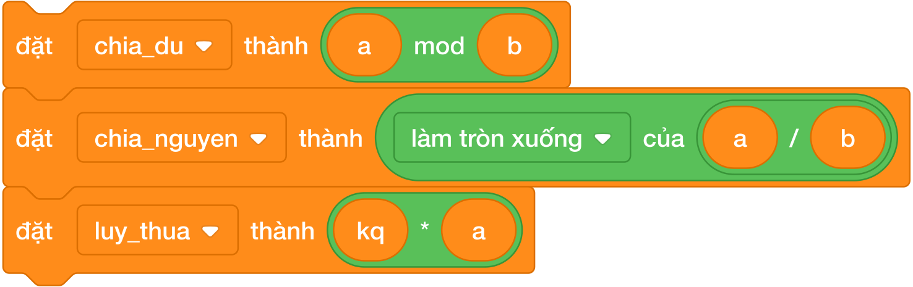

### 1.1. Phép chia lấy phần dư: Khối `() mod ()`
- Ký hiệu `mod` (viết tắt của Modulo) trả về **số dư còn lại** sau khi thực hiện phép chia giữa hai số nguyên.
- **Tính chất cốt lõi:**
  - `(17) mod (5)` $= 2$ (vì $17 = 5 \times 3 + 2$).
  - `(20) mod (4)` $= 0$ (chia hết thì số dư luôn bằng $0$).
  - Số dư của $A \pmod B$ luôn nằm trong phạm vi từ $0$ đến $B - 1$.
- **Ứng dụng thực chiến:**
  - Kiểm tra số chẵn/lẻ: `((n) mod (2)) = (0)` là số chẵn, `((n) mod (2)) = (1)` là số lẻ.
  - Kiểm tra tính chia hết: `((a) mod (b)) = (0)` nghĩa là $a$ chia hết cho $b$.

### 1.2. Phép chia lấy phần nguyên trong Scratch
Trong Scratch, không có sẵn một khối đơn lẻ mang tên chia nguyên.
Ta phối hợp hai khối lệnh màu xanh lá:

1. Thực hiện phép chia thực: `(A) / (B)`

2. Thả vào khối hàm toán học: chọn tùy chọn **`làm tròn xuống ▼ của ()`** (tương đương hàm `floor` trong toán học).

$$\text{Chia nguyên } A \text{ cho } B = \text{làm tròn xuống của } ((A) / (B))$$

- Ví dụ: `(17) / (5) = 3.4` $\implies$ `làm tròn xuống của (3.4) = 3`.

---

## 2. Bài Toán Quy Đổi Thời Gian & Đơn Vị Đo Lường Thực Tế

Một trong những dạng bài kinh điển trong lập trình là: *Cho tổng số giây $T$, hãy đổi ra Giờ, Phút, Giây.*

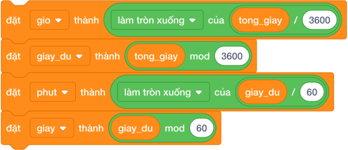

### Thuật toán quy đổi thời gian 4 bước:

1. **Tính số Giờ:** Lấy tổng số giây chia nguyên cho $3600$ (vì 1 giờ = 3600 giây):
   `đặt [gio v] thành ([làm tròn xuống v] của ((tong_giay) / (3600)))`

2. **Tính số giây còn dư lại sau khi đã đổi ra giờ:**
   `đặt [giay_du v] thành ((tong_giay) mod (3600))`

3. **Tính số Phút:** Lấy số giây dư chia nguyên cho $60$ (vì 1 phút = 60 giây):
   `đặt [phut v] thành ([làm tròn xuống v] của ((giay_du) / (60)))`

4. **Tính số Giây cuối cùng:**
   `đặt [giay v] thành ((giay_du) mod (60))`

---

## 3. Phép Tính Lũy Thừa Bằng Vòng Lặp

Để tính $A^B$ ($A$ mũ $B$, tích của $B$ số $A$ nhân với nhau):

- Khởi tạo biến kết quả bằng 1: `đặt [kq v] thành (1)`.
- Lặp lại $B$ lần: nhân dồn $A$ vào kết quả:
  `lặp lại (B) lần { đặt [kq v] thành ((kq) * (A)) }`.

---

## 4. Bảng Mô Phỏng Từng Bước Đổi $T = 3725$ Giây (Dry Run Table)

| Bước thực hiện | Khối lệnh Scratch | Phép tính toán học | Giá trị biến lưu trong RAM |
|:---:|---|---|:---:|
| 1 | `đặt [gio v] thành ([floor] của (3725 / 3600))` | $3725 / 3600 = 1.034 \to \mathbf{1}$ | `gio = 1` |
| 2 | `đặt [giay_du v] thành (3725 mod 3600)` | $3725 - 3600 \times 1 = \mathbf{125}$ | `giay_du = 125` |
| 3 | `đặt [phut v] thành ([floor] của (125 / 60))` | $125 / 60 = 2.083 \to \mathbf{2}$ | `phut = 2` |
| 4 | `đặt [giay v] thành (125 mod 60)` | $125 - 60 \times 2 = \mathbf{5}$ | `giay = 5` |

$\implies$ Kết quả: $3725$ giây = **$1$ giờ $2$ phút $5$ giây**.

---

## 5. Tử Huyệt & Các Bẫy Lỗi Kinh Điển (Bug Traps)

> **Bẫy 1: Dùng nhầm khối `làm tròn của ()` thay vì `làm tròn xuống của ()`**
> - *Khối `làm tròn` (Round):* Sẽ làm tròn lên số nguyên gần nhất nếu phần thập phân $\ge 0.5$.
> - *Ví dụ:* $7 / 4 = 1.75$. Nếu dùng `làm tròn`, kết quả ra $2$ (SAI, vì chia nguyên $7$ cho $4$ chỉ được thương là $1$!).
> - *Khắc phục:* Bắt buộc chọn chính xác **`làm tròn xuống ▼`** trong danh sách thả xuống.

> **Bẫy 2: Chia dư cho số 0**
> - *Hiện tượng:* `(x) mod (0)`.
> - *Hậu quả:* Scratch sẽ trả về giá trị `NaN` (Not a Number), làm tê liệt toàn bộ chương trình!

---

## 6. Bộ Câu Hỏi Trắc Nghiệm Củng Cố (Concept Quizzes)

1. **Khối lệnh `(23) mod (5)` trả về kết quả là bao nhiêu?**
   - A. 4
   - B. 3 *(Đáp án đúng: vì 23 = 5 * 4 + 3)*
   - C. 2
   - D. 5

2. **Muốn kiểm tra một số nguyên $N$ có phải là số chẵn hay không, điều kiện nào sau đây là ĐÚNG?**
   - A. `< ((N) mod (2)) = (0) >` *(Đáp án đúng)*
   - B. `< ((N) mod (2)) = (1) >`
   - C. `< ((N) / (2)) = (0) >`
   - D. `< (N) > (2) >`

3. **Để thực hiện phép chia lấy phần nguyên của $A$ cho $B$ trong Scratch, ta dùng khối nào?**
   - A. `làm tròn của ((A) / (B))`
   - B. `làm tròn xuống của ((A) / (B))` *(Đáp án đúng)*
   - C. `căn bậc hai của ((A) / (B))`
   - D. `(A) mod (B)`

4. **Giá trị của biểu thức `[làm tròn xuống v] của ((19) / (4))` là:**
   - A. 4.75
   - B. 5
   - C. 4 *(Đáp án đúng: 19 chia 4 được 4 dư 3)*
   - D. 3

5. **Nếu $A$ chia hết cho $B$, thì biểu thức `(A) mod (B)` luôn luôn bằng:**
   - A. 1
   - B. B
   - C. 0 *(Đáp án đúng)*
   - D. A

6. **Một năm nhuận có 366 ngày. Một tuần có 7 ngày. Phép tính nào cho biết số ngày lẻ còn dư ra của năm nhuận?**
   - A. `(366) / (7)`
   - B. `(366) mod (7)` *(Đáp án đúng: 366 mod 7 = 2 ngày dư)*
   - C. `(366) - (7)`
   - D. `(366) * (7)`

7. **Biểu thức `(10) mod (10)` trả về:**
   - A. 0 *(Đáp án đúng)*
   - B. 1
   - C. 10
   - D. 100

8. **Để lấy chữ số tận cùng của một số tự nhiên $N$ (ví dụ số 358 lấy ra số 8), ta dùng biểu thức:**
   - A. `(N) / (10)`
   - B. `(N) mod (10)` *(Đáp án đúng)*
   - C. `(N) - (10)`
   - D. `làm tròn xuống của (N)`

9. **Kết quả của `(4) mod (7)` là:**
   - A. 0
   - B. 3
   - C. 4 *(Đáp án đúng: Số bị chia nhỏ hơn số chia thì số dư chính là số bị chia)*
   - D. 7

10. **Khởi tạo biến `kq = 1`, lặp lại 3 lần nhân với 2, kết quả cuối cùng là:**
    - A. 6
    - B. 8 *(Đáp án đúng: 2 mũ 3 = 8)*
    - C. 9
    - D. 16

## Bài tập lesson

# DANH SÁCH BÀI TẬP THỰC HÀNH: BÀI 05 — PHÉP CHIA NGUYÊN, CHIA DƯ VÀ LUỸ THỪA

**Khóa học:** iKHEDU Scratch  
**Chuyên đề:** Chương 2: Lập Trình Tính Toán Cơ Bản & Biến Số  
> **Tổng số bài tập thực hành:** `33 bài` chuẩn hóa 100% (Từ kho bài tập `courses/scratch-bang-a/problems/`).  

---

## 1. Ma Trận Phân Tầng Bài Tập Toàn Diện

| STT | Mã bài toán | Tên bài tập | Phân tầng | Mức nhận thức | Thao tác trọng tâm |
|:---:|---|---|:---:|:---:|---|
| 1 | `sca_l05_p01_hinh_vuong` | Chu vi và diện tích hình vuông | **P0** | Khởi động & Quan sát | Nhập một số nguyên dương $A$ là cạnh hình vuông. In ra chu v... |
| 2 | `sca_l05_p02_hinh_chu_nhat` | Chu vi và diện tích hình chữ nhật | **P0** | Khởi động & Quan sát | Nhập hai số nguyên dương $A$ và $B$ trên cùng 1 dòng. In ra ... |
| 3 | `sca_l05_p03_chu_vi_tam_giac` | Chu vi hình tam giác | **P0** | Khởi động & Quan sát | Nhập 3 số nguyên dương $A, B, C$ trên cùng một dòng. In ra c... |
| 4 | `sca_l05_p04_canh_con_lai_cua_hinh_chu_nhat` | Cạnh còn lại của hình chữ nhật | **P0** | Khởi động & Quan sát | Hãy tính và in ra độ dài của cạnh còn lại của hình chữ nhật. |
| 5 | `sca_l05_p05_dien_tich_hinh_thang` | Diện tích hình thang | **P0** | Khởi động & Quan sát | Nhập 3 số nguyên dương $A, B, H$ trên cùng một dòng. In ra d... |
| 6 | `sca_l05_p06_doi_don_vi_dai` | Đổi mét sang centimet và milimet | **P0** | Khởi động & Quan sát | Nhập số nguyên dương $M$ (đơn vị mét). In ra 2 số trên 1 dòn... |
| 7 | `sca_l05_p07_doi_khoi_luong` | Đổi tạ và yến sang kilogram | **P0** | Khởi động & Quan sát | Nhập hai số nguyên $T$ và $Y$ trên cùng 1 dòng. In ra tổng k... |
| 8 | `sca_l05_p08_thuan_di_gap_anh` | Thuận đi gặp ánh | **P0** | Khởi động & Quan sát | Sau bao nhiêu giờ thì Thuận sẽ gặp được Ánh? |
| 9 | `sca_l05_p09_phut_sang_gio_phut` | Đổi phút sang giờ và phút | **P1** | Cơ bản & Hoàn thành | Nhập số nguyên dương $M$ ($1 \le M \le 10^6$). In ra định dạ... |
| 10 | `sca_l05_p10_dien_tich_bon_hoa_chu_thap` | Diện tích bồn hoa chữ thập | **P1** | Cơ bản & Hoàn thành | Hãy tính diện tích thực tế của toàn bộ bồn hoa chữ thập này ... |
| 11 | `sca_l05_p11_dien_tich_tam_giac_vuong` | Diện tích tam giác vuông | **P1** | Cơ bản & Hoàn thành | Hãy tính diện tích của hình tam giác vuông có hai cạnh góc v... |
| 12 | `sca_l05_p12_khoang_cach_thoi_gian` | Khoảng thời gian giữa hai thời điểm trong ngày | **P1** | Cơ bản & Hoàn thành | Nhập 4 số nguyên $H_1, M_1, H_2, M_2$ trên 1 dòng. In ra kho... |
| 13 | `sca_l05_p13_diem_trung_binh` | Điểm trung bình môn học | **P1** | Cơ bản & Hoàn thành | Nhập 3 số thực là điểm của 3 môn trên cùng 1 dòng. In ra điể... |
| 14 | `sca_l05_p14_doi_do_c_sang_do_f` | Đổi độ C sang độ F | **P1** | Cơ bản & Hoàn thành | Hãy đổi nhiệt độ $C$ độ C sang độ F theo công thức $F = C \t... |
| 15 | `sca_l05_p15_lat_gach_nen_nha` | Lát nền phòng học | **P1** | Cơ bản & Hoàn thành | Nhập 3 số nguyên dương $L, W, D$ trên cùng 1 dòng ($L, W$ tí... |
| 16 | `sca_l05_p16_loi_di_quanh_ho` | Diện tích lối đi quanh hồ nước | **P1** | Cơ bản & Hoàn thành | Nhập 3 số nguyên $A, B, D$ trên cùng 1 dòng. Hãy tính diện t... |
| 17 | `sca_l05_p17_son_tuong_phong` | Tính tiền mua sơn quét tường | **P2** | Luyện tập & Vận dụng | Nhập 5 số nguyên $A, H, X, Y, G$ trên cùng 1 dòng. In ra tổn... |
| 18 | `sca_l05_p18_chay_bo_gap_nhau` | Bài toán chạy bộ hai người ngược chiều | **P2** | Luyện tập & Vận dụng | Nhập 3 số nguyên $S, V_1, V_2$ trên cùng 1 dòng. In ra thời ... |
| 19 | `sca_l05_p19_manh_vuon_chu_nhat` | Mảnh vườn chữ nhật | **P2** | Luyện tập & Vận dụng | Hãy tính chu vi và diện tích của mảnh vườn đó. |
| 20 | `sca_l05_p20_khung_tranh_hinh_vuong` | Khung tranh hình vuông | **P2** | Luyện tập & Vận dụng | Cho độ dài cạnh hình vuông $a$. Hãy tính chu vi của khung hì... |
| 21 | `sca_l05_p21_chu_vi_tam_giac_abc` | Chu vi tam giác ABC | **P2** | Luyện tập & Vận dụng | Hãy lập trình tính và đưa ra chu vi của tam giác $ABC$. |
| 22 | `sca_l05_p22_dien_tich_tam_giac_vuong` | Diện tích tam giác vuông | **P2** | Luyện tập & Vận dụng | Nhập hai số nguyên dương $A, B$ trên cùng 1 dòng. In ra diện... |
| 23 | `sca_l05_p23_ho_ca_sau_va_dao_nho` | Hồ cá sấu và đảo nhỏ | **P2** | Luyện tập & Vận dụng | Hãy tính diện tích phần mặt nước còn lại sau khi đã xây hòn ... |
| 24 | `sca_l05_p24_doi_giay_sang_gio_phut_giay` | Đổi giây sang giờ phút giây | **P2** | Luyện tập & Vận dụng | Nhập vào tổng số giây $S$. Hãy phân rã thành $H$ giờ, $M$ ph... |
| 25 | `sca_l05_p25_lat_gach_san_truong` | Lát gạch sân trường | **P3** | Vận dụng cao & Sáng tạo | Tính số lượng viên gạch men cần dùng để lát kín mặt sân. |
| 26 | `sca_l05_p26_van_toc_trung_binh` | Tính vận tốc trung bình | **P3** | Vận dụng cao & Sáng tạo | Nhập hai số nguyên $S$ và $T$ ($1 \le T \le 100$, $1 \le S \... |
| 27 | `sca_l05_p27_rao_quanh_vuon_hoa_co_cua` | Rào quanh vườn hoa có cửa | **P3** | Vận dụng cao & Sáng tạo | Tính tổng số tiền (nghìn đồng) bác thợ cần dùng để mua đủ rà... |
| 28 | `sca_l05_p28_doi_giay_sang_gio_phut_giay` | Đổi tổng số giây sang giờ, phút, giây | **P3** | Vận dụng cao & Sáng tạo | Nhập số nguyên dương $T$ ($1 \le T \le 10^9$). In ra theo đị... |
| 29 | `sca_l05_p29_doi_sang_tong_giay` | Đổi giờ - phút - giây sang tổng số giây | **P3** | Vận dụng cao & Sáng tạo | Nhập 3 số nguyên $H, M, S$ trên cùng 1 dòng ($0 \le H \le 10... |
| 30 | `sca_l05_p30_the_tich_hop_chu_nhat` | Thể tích hộp chữ nhật | **P3** | Vận dụng cao & Sáng tạo | Hãy tính thể tích của hình hộp chữ nhật có ba kích thước $d,... |
| 31 | `sca_l05_p31_doi_do_la_sang_tien_viet` | Đổi đô la sang tiền việt | **P3** | Vận dụng cao & Sáng tạo | Hãy tính số tiền Việt Nam (đồng) đổi được từ $D$ đô la Mỹ. |
| 32 | `sca_l05_p32_hang_rao_manh_dat` | Hàng rào quanh mảnh đất | **P3** | Vận dụng cao & Sáng tạo | Nhập 3 số nguyên $A, B, C$ trên cùng 1 dòng ($C < 2 \times (... |
| 33 | `sca_l05_p33_tinh_van_toc_lam_tron` | Tính vận tốc làm tròn | **P3** | Vận dụng cao & Sáng tạo | Hãy tính vận tốc trung bình $V = D : T$ (km/h) và in ra kết ... |

---

## 2. Chi Tiết Từng Bài Tập Thực Hành

### Bài 1 (P0): Chu vi và diện tích hình vuông
* **Mã bài toán:** `sca_l05_p01_hinh_vuong`
* **Độ khó & Phân tầng:** P0 (Khởi động & Quan sát)
* **Bối cảnh:** Bác thợ mộc Năm ở xưởng nội thất Hoàng Gia nhận được đơn hàng gia công một lô mặt bàn trà hình vuông cao cấp. Theo bản vẽ thiết kế, mỗi mặt bàn có cạnh dài $A$ mét. Trước khi cắt gỗ, bác cần tính chính xác chu vi (để dán viền bao quanh) và diện tích (để ước lượng lượng sơn phủ bề mặt) của mỗi tấm mặt bàn.
* **Nhiệm vụ:** Nhập một số nguyên dương $A$ là cạnh hình vuông. In ra chu vi và diện tích của hình vuông trên cùng một dòng cách nhau dấu cách.
* **Dữ liệu vào (Input):** Một dòng chứa số nguyên dương $A$ ($1 \le A \le 10^4$).
* **Kết quả ra (Output):** In ra chu vi và diện tích cách nhau một dấu cách.
* **Dữ liệu mẫu (Sample):**

### Input
```text
6
```
### Output
```text
24 36
```
### Giải thích
Chu vi $6 \times 4 = 24$, Diện tích $6 \times 6 = 36$.

---

### Bài 2 (P0): Chu vi và diện tích hình chữ nhật
* **Mã bài toán:** `sca_l05_p02_hinh_chu_nhat`
* **Độ khó & Phân tầng:** P0 (Khởi động & Quan sát)
* **Bối cảnh:** Sân bóng rổ đa năng của trường trung học cơ sở Lê Quý Đôn vừa được tân trang lại. Theo bản đo đạc, sân có chiều dài $A$ mét và chiều rộng $B$ mét. Ban quản lý cơ sở vật chất cần tính chu vi sân để mua đủ lưới rào bảo vệ, đồng thời tính diện tích sân để đặt mua sơn kẻ vạch sân thi đấu theo tiêu chuẩn.
* **Nhiệm vụ:** Nhập hai số nguyên dương $A$ và $B$ trên cùng 1 dòng. In ra chu vi và diện tích của sân bóng rổ trên cùng một dòng cách nhau dấu cách.
* **Dữ liệu vào (Input):** Một dòng chứa hai số nguyên dương $A, B$ ($1 \le B \le A \le 10^4$).
* **Kết quả ra (Output):** In ra chu vi và diện tích.
* **Dữ liệu mẫu (Sample):**

### Input
```text
10 6
```
### Output
```text
32 60
```
### Giải thích
Chu vi $2 \times (10 + 6) = 32$, Diện tích $10 \times 6 = 60$.

---

### Bài 3 (P0): Chu vi hình tam giác
* **Mã bài toán:** `sca_l05_p03_chu_vi_tam_giac`
* **Độ khó & Phân tầng:** P0 (Khởi động & Quan sát)
* **Bối cảnh:** Đội thi đấu robotics của trường cần thiết kế một tấm chắn bảo vệ hình tam giác cho robot chiến đấu. Ba cạnh của tấm chắn có độ dài lần lượt là $a$, $b$ và $c$ xen-ti-mét. Để mua đủ thanh nhôm gia cố viền ngoài, đội trưởng cần tính chính xác chu vi của tấm chắn tam giác này.
* **Nhiệm vụ:** Nhập 3 số nguyên dương $A, B, C$ trên cùng một dòng. In ra chu vi của bồn hoa đó.
* **Dữ liệu vào (Input):** Một dòng chứa 3 số nguyên dương $A, B, C$ ($1 \le A, B, C \le 10^4$).
* **Kết quả ra (Output):** In ra chu vi hình tam giác.
* **Dữ liệu mẫu (Sample):**

### Input
```text
5 7 8
```
### Output
```text
20
```
### Giải thích
Chu vi $= 5 + 7 + 8 = 20$.

---

### Bài 4 (P0): Cạnh còn lại của hình chữ nhật
* **Mã bài toán:** `sca_l05_p04_canh_con_lai_cua_hinh_chu_nhat`
* **Độ khó & Phân tầng:** P0 (Khởi động & Quan sát)
* **Bối cảnh:** Ngoài làng có một cái ao cá hình chữ nhật rất mát, một cạnh của ao bằng $a\text{ mét}$ và chu vi của ao là $P\text{ mét}$ ($P$ là số chẵn). Cuối tuần, các người dùng rủ nhau ra ao câu cá và đố nhau tìm cạnh còn lại của ao. Hãy giúp các bạn tính độ dài cạnh còn lại.
* **Nhiệm vụ:** Hãy tính và in ra độ dài của cạnh còn lại của hình chữ nhật.
* **Dữ liệu vào (Input):** Gồm 2 dòng: dòng 1 chứa chu vi $P$ ($P$ chẵn, $P \le 10^6$), dòng 2 chứa độ dài cạnh đã biết $a$ ($1 \le a < P // 2$).
* **Kết quả ra (Output):** Một số tự nhiên là độ dài cạnh còn lại.
* **Dữ liệu mẫu (Sample):**

### Input
```text
30
5
```
### Output
```text
10
```
### Giải thích

Nửa chu vi là: $30 : 2 = 15$. Cạnh còn lại: $15 - 5 = 10$.

---

### Bài 5 (P0): Diện tích hình thang
* **Mã bài toán:** `sca_l05_p05_dien_tich_hinh_thang`
* **Độ khó & Phân tầng:** P0 (Khởi động & Quan sát)
* **Bối cảnh:** Thửa ruộng nhà ông Ba ở Cần Thơ có hình dạng hình thang cân, với đáy lớn dài $a$ mét, đáy nhỏ dài $b$ mét và chiều cao $h$ mét. Cuối vụ mùa, hợp tác xã cần tính diện tích thửa ruộng để quy đổi sản lượng lúa thu hoạch trên mỗi mét vuông và lập báo cáo năng suất nông nghiệp.
* **Nhiệm vụ:** Nhập 3 số nguyên dương $A, B, H$ trên cùng một dòng. In ra diện tích thửa ruộng dưới dạng số thực lấy đúng 1 chữ số thập phân.
* **Dữ liệu vào (Input):** Một dòng chứa 3 số nguyên $A, B, H$ ($1 \le B \le A \le 10^4$, $1 \le H \le 10^4$).
* **Kết quả ra (Output):** In ra diện tích định dạng `f"{S:.1f}"`.
* **Dữ liệu mẫu (Sample):**

### Input
```text
12 8 5
```
### Output
```text
50.0
```
### Giải thích
Diện tích $= ((12 + 8) \times 5) / 2 = 50.0$.

---

### Bài 6 (P0): Đổi mét sang centimet và milimet
* **Mã bài toán:** `sca_l05_p06_doi_don_vi_dai`
* **Độ khó & Phân tầng:** P0 (Khởi động & Quan sát)
* **Bối cảnh:** Trên công trường xây dựng cầu vượt, kỹ sư trưởng nhận được bản vẽ ghi kích thước bằng đơn vị mét, nhưng máy cắt thép CNC lại yêu cầu nhập liệu theo xen-ti-mét. Anh cần một công cụ chuyển đổi nhanh giữa các đơn vị đo chiều dài: $1$ mét $= 100$ xen-ti-mét, $1$ ki-lô-mét $= 1000$ mét. Em hãy lập trình thực hiện phép chuyển đổi đơn vị chiều dài.
* **Nhiệm vụ:** Nhập số nguyên dương $M$ (đơn vị mét). In ra 2 số trên 1 dòng cách nhau dấu cách: độ dài tương ứng theo centimet ($\text{cm}$) và milimet ($\text{mm}$).
* **Dữ liệu vào (Input):** Một dòng chứa số nguyên $M$ ($1 \le M \le 1000$).
* **Kết quả ra (Output):** In ra hai số nguyên cách nhau dấu cách.
* **Dữ liệu mẫu (Sample):**

### Input
```text
3
```
### Output
```text
300 3000
```
### Giải thích
$3\text{m} = 300\text{cm} = 3000\text{mm}$.

---

### Bài 7 (P0): Đổi tạ và yến sang kilogram
* **Mã bài toán:** `sca_l05_p07_doi_khoi_luong`
* **Độ khó & Phân tầng:** P0 (Khởi động & Quan sát)
* **Bối cảnh:** Tại cảng xuất khẩu nông sản Cát Lái, mỗi container hàng ghi trọng lượng bằng đơn vị gam. Tuy nhiên, phiếu hải quan yêu cầu khai báo bằng ki-lô-gam và tấn. Nhân viên kho vận cần một chương trình chuyển đổi nhanh giữa các đơn vị khối lượng: $1$ ki-lô-gam $= 1000$ gam, $1$ tấn $= 1000$ ki-lô-gam. Em hãy giúp họ tự động hóa việc quy đổi.
* **Nhiệm vụ:** Nhập hai số nguyên $T$ và $Y$ trên cùng 1 dòng. In ra tổng khối lượng thóc tính bằng kilogram ($\text{kg}$).
* **Dữ liệu vào (Input):** Một dòng chứa hai số nguyên $T, Y$ ($0 \le T, Y \le 1000$).
* **Kết quả ra (Output):** In ra tổng khối lượng theo $\text{kg}$.
* **Dữ liệu mẫu (Sample):**

### Input
```text
5 3
```
### Output
```text
530
```
### Giải thích
$5\text{ tạ} = 500\text{kg}$, $3\text{ yến} = 30\text{kg}$. Tổng $= 500 + 30 = 530\text{kg}$.

---

### Bài 8 (P0): Thuận đi gặp ánh
* **Mã bài toán:** `sca_l05_p08_thuan_di_gap_anh`
* **Độ khó & Phân tầng:** P0 (Khởi động & Quan sát)
* **Bối cảnh:** Chiều nắng đẹp, hai bạn Thuận và Ánh sống trên một con đường làng thẳng có các mốc tọa độ tính bằng kilomet. Thuận đang đứng ở vị trí $x$, còn Ánh đang đứng ở vị trí $y$ ($x < y$). Thuận nhảy lên xe đạp và phóng về phía nhà Ánh với vận tốc không đổi là $v\text{ km/h}$ để rủ bạn đi đá bóng.
* **Biết rằng:** Khoảng cách $y - x$ chia hết cho vận tốc $v$.
Ánh đứng chờ ở cổng, hồi hộp không biết bao lâu bạn tới. Hãy giúp hai bạn tính thời gian Thuận đi gặp Ánh.
* **Nhiệm vụ:** Sau bao nhiêu giờ thì Thuận sẽ gặp được Ánh?
* **Dữ liệu vào (Input):** Ba dòng lần lượt chứa 3 số tự nhiên $x, y, v$ ($0 \le x < y \le 10^9, 1 \le v \le 10^9$).
* **Kết quả ra (Output):** Số giờ để Thuận gặp Ánh.
* **Dữ liệu mẫu (Sample):**

### Input
```text
10
70
15
```
### Output
```text
4
```
### Giải thích

Khoảng cách giữa 2 bạn: $70 - 10 = 60\text{ km}$.
Thời gian gặp nhau: $60 : 15 = 4$ giờ.

---

### Bài 9 (P1): Đổi phút sang giờ và phút
* **Mã bài toán:** `sca_l05_p09_phut_sang_gio_phut`
* **Độ khó & Phân tầng:** P1 (Cơ bản & Hoàn thành)
* **Bối cảnh:** Tại trung tâm huấn luyện thể thao quốc gia, huấn luyện viên ghi lại thời gian thi đấu của vận động viên bằng tổng số phút (ví dụ: $135$ phút). Để báo cáo lên ban huấn luyện, anh cần quy đổi sang dạng "$X$ giờ $Y$ phút" cho trực quan. Em hãy viết chương trình chuyển đổi từ tổng số phút sang dạng giờ-phút.
* **Nhiệm vụ:** Nhập số nguyên dương $M$ ($1 \le M \le 10^6$). In ra định dạng `X gio Y phut`.
* **Dữ liệu vào (Input):** Một dòng chứa số nguyên $M$.
* **Kết quả ra (Output):** In ra định dạng `X gio Y phut`.
* **Dữ liệu mẫu (Sample):**

### Input
```text
135
```
### Output
```text
2 gio 15 phut
```
### Giải thích
$135 // 60 = 2$ giờ và $135 \% 60 = 15$ phút.

---

### Bài 10 (P1): Diện tích bồn hoa chữ thập
* **Mã bài toán:** `sca_l05_p10_dien_tich_bon_hoa_chu_thap`
* **Độ khó & Phân tầng:** P1 (Cơ bản & Hoàn thành)
* **Bối cảnh:** Trong công viên xanh mát có một bồn hoa hình chữ thập (dấu cộng) rất đẹp được tạo thành bởi hai luống hoa hình chữ nhật đặt chồng lên nhau:

 * Một luống hoa nằm ngang có kích thước $a \times b$ ($a$ là chiều dài, $b$ là chiều rộng).
 * Một luống hoa nằm dọc có kích thước $b \times a$ ($b$ là chiều rộng, $a$ là chiều dài).
 * Hai luống hoa giao nhau ở chính giữa tạo thành một hình vuông kích thước $b \times b$.
Cô công nhân muốn biết diện tích thật để gieo hạt, vì phần giao nhau ở giữa không được tính hai lần. Hãy giúp cô tính diện tích bồn hoa.
* **Nhiệm vụ:** Hãy tính diện tích thực tế của toàn bộ bồn hoa chữ thập này (không được tính trùng lặp phần diện tích giao nhau ở chính giữa).
* **Dữ liệu vào (Input):** Nhập 2 số tự nhiên $a$ và $b$ ($1 \le b \le a \le 10^4$) trên 2 dòng.
* **Kết quả ra (Output):** Diện tích thực tế của bồn hoa.
* **Dữ liệu mẫu (Sample):**

### Input
```text
10
3
```
### Output
```text
51
```
### Giải thích

- Luống ngang: $10 \times 3 = 30$.
- Luống dọc: $3 \times 10 = 30$.
- Phần giao nhau ở giữa: $3 \times 3 = 9$.
- Diện tích bồn hoa: $30 + 30 - 9 = 51$.

---

### Bài 11 (P1): Diện tích tam giác vuông
* **Mã bài toán:** `sca_l05_p11_dien_tich_tam_giac_vuong`
* **Độ khó & Phân tầng:** P1 (Cơ bản & Hoàn thành)
* **Bối cảnh:** Na có một miếng bánh hình tam giác vuông rất xinh. Hai cạnh góc vuông của miếng bánh dài $a\text{ cm}$ và $h\text{ cm}$. Tích $a \times h$ luôn là số chẵn. Na muốn biết miếng bánh của mình rộng bao nhiêu để khoe với cả lớp. Hãy tính diện tích miếng bánh.
* **Nhiệm vụ:** Hãy tính diện tích của hình tam giác vuông có hai cạnh góc vuông là $a$ và $h$.
* **Dữ liệu vào (Input):** Nhập 2 số tự nhiên $a$ và $h$ ($1 \le a, h \le 1000$, tích $a \times h$ chia hết cho $2$) trên 2 dòng.
* **Kết quả ra (Output):** Diện tích của hình tam giác vuông (số nguyên).
* **Dữ liệu mẫu (Sample):**

### Input
```text
6
4
```
### Output
```text
12
```
### Giải thích

- Tích hai cạnh góc vuông: $6 \times 4 = 24$.
- Diện tích tam giác: $24 : 2 = 12$.

---

### Bài 12 (P1): Khoảng thời gian giữa hai thời điểm trong ngày
* **Mã bài toán:** `sca_l05_p12_khoang_cach_thoi_gian`
* **Độ khó & Phân tầng:** P1 (Cơ bản & Hoàn thành)
* **Bối cảnh:** Bạn Minh bắt đầu học bài lúc $H_1$ giờ $M_1$ phút và kết thúc lúc $H_2$ giờ $M_2$ phút (trong cùng một ngày).
* **Nhiệm vụ:** Nhập 4 số nguyên $H_1, M_1, H_2, M_2$ trên 1 dòng. In ra khoảng thời gian học tính theo đơn vị phút.
* **Dữ liệu vào (Input):** Một dòng chứa 4 số nguyên ($0 \le H_1 \le H_2 \le 23$, $0 \le M_1, M_2 < 60$, thời điểm 2 không sớm hơn thời điểm 1).
* **Kết quả ra (Output):** In ra số phút chênh lệch.
* **Dữ liệu mẫu (Sample):**

### Input
```text
8 30 10 15
```
### Output
```text
105
```
### Giải thích
Từ 8h30 đến 10h15 là 1 giờ 45 phút $= 60 + 45 = 105$ phút.

---

### Bài 13 (P1): Điểm trung bình môn học
* **Mã bài toán:** `sca_l05_p13_diem_trung_binh`
* **Độ khó & Phân tầng:** P1 (Cơ bản & Hoàn thành)
* **Bối cảnh:** Cuối học kỳ, hệ thống quản lý điểm số của trường tự động tính điểm trung bình từ các bài kiểm tra. Một học sinh có điểm ba môn chính lần lượt là $a$, $b$ và $c$. Điểm trung bình được tính bằng công thức $\text{TB} = \frac{a + b + c}{3}$. Em hãy lập trình tính điểm trung bình và in kết quả với số thập phân chính xác.
* **Nhiệm vụ:** Nhập 3 số thực là điểm của 3 môn trên cùng 1 dòng. In ra điểm trung bình cộng làm tròn đúng 2 chữ số thập phân.
* **Dữ liệu vào (Input):** Một dòng chứa 3 số thực ($0 \le d_1, d_2, d_3 \le 10$).
* **Kết quả ra (Output):** In ra điểm trung bình dạng `f"{dtb:.2f}"`.
* **Dữ liệu mẫu (Sample):**

### Input
```text
8.5 9.0 7.5
```
### Output
```text
8.33
```
### Giải thích
$(8.5 + 9.0 + 7.5) / 3 = 25.0 / 3 \approx 8.3333... \implies 8.33$.

---

### Bài 14 (P1): Đổi độ C sang độ F
* **Mã bài toán:** `sca_l05_p14_doi_do_c_sang_do_f`
* **Độ khó & Phân tầng:** P1 (Cơ bản & Hoàn thành)
* **Bối cảnh:** Trong giờ học khoa học, cô giáo đố cả lớp một điều thú vị. Ở Việt Nam, nhiệt độ được đo bằng độ C, còn ở nước Mỹ người ta lại dùng độ F. Hôm nay trời nóng $C$ độ C, và $C$ luôn chia hết cho $5$. Hãy giúp cả lớp đổi nhiệt độ này sang độ F để kể cho người dùng ở Mỹ nghe.
* **Nhiệm vụ:** Hãy đổi nhiệt độ $C$ độ C sang độ F theo công thức $F = C \times 9 : 5 + 32$.
* **Dữ liệu vào (Input):** Nhập 1 số nguyên $C$ ($-50 \le C \le 50$, $C$ chia hết cho $5$) trên 1 dòng.
* **Kết quả ra (Output):** Nhiệt độ tính bằng độ F (số nguyên).
* **Dữ liệu mẫu (Sample):**

### Input
```text
30
```
### Output
```text
86
```
### Giải thích

- Đổi sang độ F: $30 \times 9 : 5 + 32 = 270 : 5 + 32 = 54 + 32 = 86$.

---

### Bài 15 (P1): Lát nền phòng học
* **Mã bài toán:** `sca_l05_p15_lat_gach_nen_nha`
* **Độ khó & Phân tầng:** P1 (Cơ bản & Hoàn thành)
* **Bối cảnh:** Phòng học hình chữ nhật có chiều dài $L$ mét và chiều rộng $W$ mét. Người ta dùng các viên gạch hoa hình vuông cạnh $D$ centimet để lát nền.
* **Nhiệm vụ:** Nhập 3 số nguyên dương $L, W, D$ trên cùng 1 dòng ($L, W$ tính bằng mét, $D$ tính bằng centimet). Giả sử phòng học vừa khít các viên gạch, hãy in ra tổng số viên gạch cần dùng.
* **Dữ liệu vào (Input):** Một dòng chứa 3 số nguyên $L, W, D$ ($1 \le L, W \le 100$, $10 \le D \le 100$).
* **Kết quả ra (Output):** In ra số viên gạch cần dùng.
* **Dữ liệu mẫu (Sample):**

### Input
```text
6 4 50
```
### Output
```text
96
```
### Giải thích
Đổi $L = 600\text{cm}, W = 400\text{cm}$. Diện tích sàn $= 600 \times 400 = 240000\text{cm}^2$. Diện tích 1 viên gạch $= 50 \times 50 = 2500\text{cm}^2$. Số gạch $= 240000 // 2500 = 96$ viên.

---

### Bài 16 (P1): Diện tích lối đi quanh hồ nước
* **Mã bài toán:** `sca_l05_p16_loi_di_quanh_ho`
* **Độ khó & Phân tầng:** P1 (Cơ bản & Hoàn thành)
* **Bối cảnh:** Trong công viên có một hồ nước hình chữ nhật kích thước dài $A$ mét, rộng $B$ mét. Xung quanh hồ, người ta làm một lối đi dạo có bề rộng đồng đều là $D$ mét.
* **Nhiệm vụ:** Nhập 3 số nguyên $A, B, D$ trên cùng 1 dòng. Hãy tính diện tích của lối đi dạo đó.
* **Dữ liệu vào (Input):** Một dòng chứa 3 số nguyên $A, B, D$ ($1 \le A, B \le 10^4$, $1 \le D \le 100$).
* **Kết quả ra (Output):** In ra diện tích lối đi.
* **Dữ liệu mẫu (Sample):**

### Input
```text
10 8 2
```
### Output
```text
88
```
### Giải thích
Kích thước cả hồ và lối đi là $(10 + 2 \times 2) = 14\text{m}$ và $(8 + 2 \times 2) = 12\text{m}$. Diện tích toàn phần $= 14 \times 12 = 168\text{m}^2$. Diện tích hồ $= 10 \times 8 = 80\text{m}^2$. Diện tích lối đi $= 168 - 80 = 88\text{m}^2$.

---

### Bài 17 (P2): Tính tiền mua sơn quét tường
* **Mã bài toán:** `sca_l05_p17_son_tuong_phong`
* **Độ khó & Phân tầng:** P2 (Luyện tập & Vận dụng)
* **Bối cảnh:** Một bức tường hình chữ nhật có chiều dài $A$ mét và chiều cao $H$ mét. Trên tường có một cửa sổ hình chữ nhật kích thước $X \times Y$ mét không cần quét sơn. Biết mỗi mét vuông tường tốn $G$ đồng tiền sơn.
* **Nhiệm vụ:** Nhập 5 số nguyên $A, H, X, Y, G$ trên cùng 1 dòng. In ra tổng số tiền sơn cần chuẩn bị.
* **Dữ liệu vào (Input):** Một dòng chứa 5 số nguyên dương ($X < A, Y < H$, $1 \le A, H \le 100$, $1 \le G \le 10^5$).
* **Kết quả ra (Output):** In ra tổng số tiền sơn.
* **Dữ liệu mẫu (Sample):**

### Input
```text
6 3 2 1 50000
```
### Output
```text
800000
```
### Giải thích
Diện tích tường $= 6 \times 3 = 18\text{m}^2$. Diện tích cửa sổ $= 2 \times 1 = 2\text{m}^2$. Diện tích cần sơn $= 18 - 2 = 16\text{m}^2$. Tổng tiền $= 16 \times 50000 = 800000$ đồng.

---

### Bài 18 (P2): Bài toán chạy bộ hai người ngược chiều
* **Mã bài toán:** `sca_l05_p18_chay_bo_gap_nhau`
* **Độ khó & Phân tầng:** P2 (Luyện tập & Vận dụng)
* **Bối cảnh:** Hai bạn An và Bình ở hai đầu một con đường thẳng dài $S$ mét. Cùng lúc, hai bạn chạy lại phía nhau: An chạy với vận tốc $V_1$ mét/giây, Bình chạy với vận tốc $V_2$ mét/giây.
* **Nhiệm vụ:** Nhập 3 số nguyên $S, V_1, V_2$ trên cùng 1 dòng. In ra thời gian (tính bằng giây) kể từ lúc bắt đầu chạy cho đến khi hai bạn gặp nhau, làm tròn 1 chữ số thập phân.
* **Dữ liệu vào (Input):** Một dòng chứa 3 số nguyên dương $S, V_1, V_2$ ($1 \le S \le 10^5$, $1 \le V_1, V_2 \le 100$).
* **Kết quả ra (Output):** In ra thời gian gặp nhau dạng `f"{t:.1f}"`.
* **Dữ liệu mẫu (Sample):**

### Input
```text
150 2 3
```
### Output
```text
30.0
```
### Giải thích
Vận tốc tiếp cận $= 2 + 3 = 5\text{m/s}$. Thời gian gặp nhau $= 150 / 5 = 30.0$ giây.

---

### Bài 19 (P2): Mảnh vườn chữ nhật
* **Mã bài toán:** `sca_l05_p19_manh_vuon_chu_nhat`
* **Độ khó & Phân tầng:** P2 (Luyện tập & Vận dụng)
* **Bối cảnh:** Cuối làng có bác nông dân chăm chỉ với một mảnh vườn trồng rau hình chữ nhật có chiều dài $a\text{ mét}$ và chiều rộng $b\text{ mét}$. Mỗi sáng, bác ra vườn tưới rau xanh mướt, nhưng bác muốn rào quanh vườn và tính diện tích để trồng thêm rau mới. Hãy giúp bác tính chu vi và diện tích của mảnh vườn.
* **Nhiệm vụ:** Hãy tính chu vi và diện tích của mảnh vườn đó.
* **Dữ liệu vào (Input):** Gồm 2 dòng lần lượt chứa 2 số tự nhiên $a$ và $b$ ($1 \le b \le a \le 10^4$).
* **Kết quả ra (Output):** In ra trên một dòng 2 số nguyên cách nhau một dấu cách lần lượt là: Chu vi và Diện tích của mảnh vườn.
* **Dữ liệu mẫu (Sample):**

### Input
```text
10
6
```
### Output
```text
32 60
```
### Giải thích

Chu vi: $(10 + 6) \times 2 = 32$. Diện tích: $10 \times 6 = 60$.

---

### Bài 20 (P2): Khung tranh hình vuông
* **Mã bài toán:** `sca_l05_p20_khung_tranh_hinh_vuong`
* **Độ khó & Phân tầng:** P2 (Luyện tập & Vận dụng)
* **Bối cảnh:** Trong quy trình gia công khung nhôm kính, người thợ cần chuẩn bị thanh nẹp viền bao quanh một tấm kính hình vuông có cạnh độ dài $a$.
* **Nhiệm vụ:** Cho độ dài cạnh hình vuông $a$. Hãy tính chu vi của khung hình vuông ($4 \times a$).
* **Dữ liệu vào (Input):** Một số tự nhiên $a$ ($1 \le a \le 10^4$).
* **Kết quả ra (Output):** In ra 2 số nguyên cách nhau một khoảng trắng: Chu vi và Diện tích.
* **Dữ liệu mẫu (Sample):**

### Input
```text
8
```
### Output
```text
32 64
```
### Giải thích

Cạnh hình vuông có độ dài $a = 6$. Chu vi của hình vuông được tính bằng $4 \times 6 = 24$. Kết quả in ra là `24`.

---

### Bài 21 (P2): Chu vi tam giác ABC
* **Mã bài toán:** `sca_l05_p21_chu_vi_tam_giac_abc`
* **Độ khó & Phân tầng:** P2 (Luyện tập & Vận dụng)
* **Bối cảnh:** Trong giờ học hình học vui nhộn, thầy giáo vẽ một hình tam giác $ABC$ lên bảng và đố cả lớp. Thầy cho 3 số tự nhiên $a, b, c$ lần lượt là độ dài 3 cạnh của tam giác $ABC$. Các bạn thi nhau giơ tay xung phong tính chu vi. Hãy giúp cả lớp tính chu vi của tam giác $ABC$.
* **Nhiệm vụ:** Hãy lập trình tính và đưa ra chu vi của tam giác $ABC$.
* **Dữ liệu vào (Input):** Ba dòng lần lượt ghi 3 số tự nhiên $a, b, c$ ($1 \le a, b, c \le 10^8$).
* **Kết quả ra (Output):** In ra một số tự nhiên duy nhất là chu vi tam giác.
* **Dữ liệu mẫu (Sample):**

### Input
```text
3
4
5
```
### Output
```text
12
```
### Giải thích

Chu vi: $3 + 4 + 5 = 12$.

---

### Bài 22 (P2): Diện tích tam giác vuông
* **Mã bài toán:** `sca_l05_p22_dien_tich_tam_giac_vuong`
* **Độ khó & Phân tầng:** P2 (Luyện tập & Vận dụng)
* **Bối cảnh:** Kiến trúc sư Hà đang thiết kế một khu vườn trang trí trước sảnh tòa nhà văn phòng. Khu vườn có dạng hình tam giác vuông với hai cạnh góc vuông lần lượt dài $a$ mét và $b$ mét. Để ước tính lượng cỏ nhân tạo cần trải và chi phí thi công, cô cần tính chính xác diện tích khu vườn tam giác vuông này.
* **Nhiệm vụ:** Nhập hai số nguyên dương $A, B$ trên cùng 1 dòng. In ra diện tích lá cờ dưới dạng số thực lấy đúng 1 chữ số thập phân.
* **Dữ liệu vào (Input):** Một dòng chứa hai số nguyên $A, B$ ($1 \le A, B \le 10^4$).
* **Kết quả ra (Output):** In ra diện tích định dạng `f"{S:.1f}"`.
* **Dữ liệu mẫu (Sample):**

### Input
```text
5 7
```
### Output
```text
17.5
```
### Giải thích
Diện tích $= (5 \times 7) / 2 = 17.5$.

---

### Bài 23 (P2): Hồ cá sấu và đảo nhỏ
* **Mã bài toán:** `sca_l05_p23_ho_ca_sau_va_dao_nho`
* **Độ khó & Phân tầng:** P2 (Luyện tập & Vận dụng)
* **Bối cảnh:** Ở một trang trại vui vẻ có một hồ nước hình vuông cạnh $A$ nuôi những chú cá sấu con hiền lành. Ở chính giữa hồ, người ta xây một hòn đảo nhỏ hình chữ nhật có kích thước $B \times C$ để cá sấu bò lên phơi nắng (hòn đảo nằm trọn trong hồ nước và không chạm vào bờ hồ). Các người dùng thắc mắc mặt nước còn lại rộng bao nhiêu để cá bơi lội. Hãy giúp các bạn tính diện tích mặt nước còn lại.
* **Nhiệm vụ:** Hãy tính diện tích phần mặt nước còn lại sau khi đã xây hòn đảo nhỏ.
* **Dữ liệu vào (Input):** Ba số tự nhiên $A, B, C$ trên 3 dòng ($1 \le B, C < A \le 10^4$).
* **Kết quả ra (Output):** Một số nguyên duy nhất là diện tích mặt nước còn lại.
* **Dữ liệu mẫu (Sample):**

### Input
```text
10
3
4
```
### Output
```text
88
```
### Giải thích

Diện tích hồ: $10 \times 10 = 100$. Diện tích đảo: $3 \times 4 = 12$.
Mặt nước còn lại: $100 - 12 = 88$.

---

### Bài 24 (P2): Đổi giây sang giờ phút giây
* **Mã bài toán:** `sca_l05_p24_doi_giay_sang_gio_phut_giay`
* **Độ khó & Phân tầng:** P2 (Luyện tập & Vận dụng)
* **Bối cảnh:** Trong hệ thống theo dõi quỹ đạo trạm không gian, đồng hồ đo ghi nhận thời gian hoàn thành một vòng quỹ đạo là tổng cộng $S$ giây. Hệ thống cần hiển thị giá trị này dưới dạng tường minh: gồm bao nhiêu giờ ($H$), bao nhiêu phút ($M$) và bao nhiêu giây ($S$).
* **Nhiệm vụ:** Nhập vào tổng số giây $S$. Hãy phân rã thành $H$ giờ, $M$ phút, $S$ giây.
* **Dữ liệu vào (Input):** Một số nguyên $S$ ($0 \le S \le 10^8$).
* **Kết quả ra (Output):** In ra ba số nguyên $H, M, S$ cách nhau một khoảng trắng.
* **Dữ liệu mẫu (Sample):**

### Input
```text
3665
```
### Output
```text
1 1 5
```
### Giải thích

3665 giây = 1 giờ (3600s) + 1 phút (60s) + 5 giây.

---

### Bài 25 (P3): Lát gạch sân trường
* **Mã bài toán:** `sca_l05_p25_lat_gach_san_truong`
* **Độ khó & Phân tầng:** P3 (Vận dụng cao & Sáng tạo)
* **Bối cảnh:** Sân trường của trường học sinh iKHEDU có hình chữ nhật dài $D\text{ mét}$ và rộng $R\text{ mét}$, nơi các bạn chơi nhảy dây mỗi giờ ra chơi. Hè này, nhà trường muốn lát gạch men cho toàn bộ sân trường bằng các viên gạch hình vuông có cạnh là $K\text{ mét}$ ($D$ và $R$ đều chia hết cho $K$). Bác lao công đã chở gạch đến đầy sân. Hãy giúp bác đếm số viên gạch cần dùng.
* **Nhiệm vụ:** Tính số lượng viên gạch men cần dùng để lát kín mặt sân.
* **Dữ liệu vào (Input):** Ba dòng lần lượt chứa 3 số tự nhiên $D, R, K$ ($1 \le K \le R \le D \le 1000$).
* **Kết quả ra (Output):** Một số nguyên duy nhất là số viên gạch.
* **Dữ liệu mẫu (Sample):**

### Input
```text
20
10
2
```
### Output
```text
50
```
### Giải thích

Diện tích sân: $20 \times 10 = 200$. Diện tích 1 viên gạch: $2 \times 2 = 4$.
Số gạch cần: $200 : 4 = 50$ viên.

---

### Bài 26 (P3): Tính vận tốc trung bình
* **Mã bài toán:** `sca_l05_p26_van_toc_trung_binh`
* **Độ khó & Phân tầng:** P3 (Vận dụng cao & Sáng tạo)
* **Bối cảnh:** Xe buýt tuyến 01 khởi hành từ bến xe Miền Đông đi bến xe Miền Tây, quãng đường dài $S$ ki-lô-mét và xe chạy hết $T$ giờ (kể cả thời gian dừng đón trả khách). Công ty vận tải cần tính vận tốc trung bình thực tế của chuyến xe để đánh giá hiệu suất và điều chỉnh lịch trình cho phù hợp.
* **Nhiệm vụ:** Nhập hai số nguyên $S$ và $T$ ($1 \le T \le 100$, $1 \le S \le 10^5$). In ra vận tốc trung bình của ô tô làm tròn 2 chữ số thập phân.
* **Dữ liệu vào (Input):** Một dòng chứa $S$ và $T$.
* **Kết quả ra (Output):** In ra vận tốc dạng `f"{v:.2f}"` (đơn vị $\text{km/h}$).
* **Dữ liệu mẫu (Sample):**

### Input
```text
100 3
```
### Output
```text
33.33
```
### Giải thích
$100 / 3 \approx 33.3333... \implies 33.33$.

---

### Bài 27 (P3): Rào quanh vườn hoa có cửa
* **Mã bài toán:** `sca_l05_p27_rao_quanh_vuon_hoa_co_cua`
* **Độ khó & Phân tầng:** P3 (Vận dụng cao & Sáng tạo)
* **Bối cảnh:** Bác thợ làm vườn có một vườn hoa rực rỡ hình chữ nhật với chiều dài $a\text{ mét}$, chiều rộng $b\text{ mét}$, thơm ngát mùi hoa hồng. Bác muốn dựng một hàng rào thép gai xung quanh vườn hoa, nhưng chừa lại một lối đi ở một góc vườn làm cổng ra vào rộng đúng $c\text{ mét}$ (không rào cửa).
* **Biết giá thành làm rào:** Mỗi mét hàng rào tốn $15$ nghìn đồng.
Bác đã chuẩn bị tiền nhưng chưa biết có đủ không. Hãy giúp bác tính tổng số tiền mua rào.
* **Nhiệm vụ:** Tính tổng số tiền (nghìn đồng) bác thợ cần dùng để mua đủ rào thép.
* **Dữ liệu vào (Input):** Ba dòng lần lượt là $a, b, c$ ($1 \le a, b \le 10^4, 1 \le c < (a + b) * 2$).
* **Kết quả ra (Output):** Một số nguyên là số tiền (nghìn đồng).
* **Dữ liệu mẫu (Sample):**

### Input
```text
12
8
2
```
### Output
```text
570
```
### Giải thích

Chu vi cả vườn: $(12 + 8) \times 2 = 40\text{ m}$.
Độ dài rào cần mua: $40 - 2 = 38\text{ m}$.
Số tiền: $38 \times 15 = 570$ nghìn đồng.

---

### Bài 28 (P3): Đổi tổng số giây sang giờ, phút, giây
* **Mã bài toán:** `sca_l05_p28_doi_giay_sang_gio_phut_giay`
* **Độ khó & Phân tầng:** P3 (Vận dụng cao & Sáng tạo)
* **Bối cảnh:** Đồng hồ bấm giờ trong cuộc thi chạy marathon ghi nhận tổng thời gian là $T$ giây.
* **Nhiệm vụ:** Nhập số nguyên dương $T$ ($1 \le T \le 10^9$). In ra theo định dạng `H:M:S`.
* **Dữ liệu vào (Input):** Một dòng chứa số nguyên $T$.
* **Kết quả ra (Output):** In ra chuỗi `H:M:S` (với $H$ là giờ, $M$ là phút, $S$ là giây).
* **Dữ liệu mẫu (Sample):**

### Input
```text
3665
```
### Output
```text
1:1:5
```
### Giải thích
1 giờ 1 phút 5 giây.

---

### Bài 29 (P3): Đổi giờ - phút - giây sang tổng số giây
* **Mã bài toán:** `sca_l05_p29_doi_sang_tong_giay`
* **Độ khó & Phân tầng:** P3 (Vận dụng cao & Sáng tạo)
* **Bối cảnh:** Bài toán ngược lại: Cần quy đổi thời gian hiển thị `H giờ M phút S giây` về một số giây duy nhất để máy tính dễ so sánh.
* **Nhiệm vụ:** Nhập 3 số nguyên $H, M, S$ trên cùng 1 dòng ($0 \le H \le 1000$, $0 \le M, S < 60$). In ra tổng số giây.
* **Dữ liệu vào (Input):** Một dòng chứa 3 số nguyên $H, M, S$.
* **Kết quả ra (Output):** In ra một số nguyên là tổng số giây.
* **Dữ liệu mẫu (Sample):**

### Input
```text
2 15 30
```
### Output
```text
8130
```
### Giải thích
$2 \times 3600 + 15 \times 60 + 30 = 7200 + 900 + 30 = 8130$.

---

### Bài 30 (P3): Thể tích hộp chữ nhật
* **Mã bài toán:** `sca_l05_p30_the_tich_hop_chu_nhat`
* **Độ khó & Phân tầng:** P3 (Vận dụng cao & Sáng tạo)
* **Bối cảnh:** Một khối hộp vừa được tặng một hộp sữa dâu hình hộp chữ nhật. Hộp sữa có chiều dài $d\text{ cm}$, chiều rộng $r\text{ cm}$ và chiều cao $c\text{ cm}$. Một khối hộp tò mò muốn biết hộp sữa của mình chứa được bao nhiêu sữa. Hãy giúp bài toán tính thể tích của hộp sữa.
* **Nhiệm vụ:** Hãy tính thể tích của hình hộp chữ nhật có ba kích thước $d, r, c$.
* **Dữ liệu vào (Input):** Nhập 3 số tự nhiên $d, r, c$ ($1 \le d, r, c \le 1000$) trên 3 dòng.
* **Kết quả ra (Output):** Thể tích của hình hộp chữ nhật (số nguyên).
* **Dữ liệu mẫu (Sample):**

### Input
```text
5
3
2
```
### Output
```text
30
```
### Giải thích

- Thể tích hộp: $5 \times 3 \times 2 = 30$.

---

### Bài 31 (P3): Đổi đô la sang tiền việt
* **Mã bài toán:** `sca_l05_p31_doi_do_la_sang_tien_viet`
* **Độ khó & Phân tầng:** P3 (Vận dụng cao & Sáng tạo)
* **Bối cảnh:** Bác Hùng đi công tác ở nước ngoài về và mang theo $D$ tờ đô la Mỹ, mỗi tờ trị giá $1$ đô la. Bác muốn đổi hết sang tiền Việt Nam để mua quà cho cả nhà. Biết rằng ngân hàng đổi $1$ đô la lấy $25000$ đồng. Hãy giúp bác Hùng tính xem bác sẽ nhận được bao nhiêu tiền Việt Nam.
* **Nhiệm vụ:** Hãy tính số tiền Việt Nam (đồng) đổi được từ $D$ đô la Mỹ.
* **Dữ liệu vào (Input):** Nhập 1 số tự nhiên $D$ ($1 \le D \le 10^6$) trên 1 dòng.
* **Kết quả ra (Output):** Số tiền Việt Nam tính bằng đồng (số nguyên).
* **Dữ liệu mẫu (Sample):**

### Input
```text
4
```
### Output
```text
100000
```
### Giải thích

- Mỗi đô la đổi được $25000$ đồng.
- $4$ đô la đổi được: $4 \times 25000 = 100000$ đồng.

---

### Bài 32 (P3): Hàng rào quanh mảnh đất
* **Mã bài toán:** `sca_l05_p32_hang_rao_manh_dat`
* **Độ khó & Phân tầng:** P3 (Vận dụng cao & Sáng tạo)
* **Bối cảnh:** Bác Năm có mảnh vườn hình chữ nhật dài $A$ mét, rộng $B$ mét. Bác muốn làm hàng rào lưới thép xung quanh, chừa lại một cổng ra vào rộng $C$ mét.
* **Nhiệm vụ:** Nhập 3 số nguyên $A, B, C$ trên cùng 1 dòng ($C < 2 \times (A + B)$). In ra tổng chiều dài hàng rào lưới thép cần mua.
* **Dữ liệu vào (Input):** Một dòng chứa 3 số nguyên $A, B, C$ ($1 \le A, B \le 10^4$, $1 \le C \le 100$).
* **Kết quả ra (Output):** In ra chiều dài hàng rào.
* **Dữ liệu mẫu (Sample):**

### Input
```text
20 15 3
```
### Output
```text
67
```
### Giải thích
Chu vi mảnh vườn $= 2 \times (20 + 15) = 70\text{m}$. Trừ cổng $3\text{m} \implies 70 - 3 = 67\text{m}$.

---

### Bài 33 (P3): Tính vận tốc làm tròn
* **Mã bài toán:** `sca_l05_p33_tinh_van_toc_lam_tron`
* **Độ khó & Phân tầng:** P3 (Vận dụng cao & Sáng tạo)
* **Bối cảnh:** Cuối tuần, bạn Mít đạp xe đi thăm bà ngoại. Quãng đường từ nhà Mít đến nhà bà dài $D\text{ km}$, và bạn Mít đạp xe hết $T$ giờ. Mẹ dặn bạn Mít phải ghi lại vận tốc trung bình của chuyến đi, làm tròn đến đúng $2$ chữ số sau dấu chấm thập phân. Hãy giúp bạn Mít tính vận tốc của chuyến đi.
* **Nhiệm vụ:** Hãy tính vận tốc trung bình $V = D : T$ (km/h) và in ra kết quả làm tròn đến $2$ chữ số thập phân.
* **Dữ liệu vào (Input):** Nhập 2 số trên 2 dòng: quãng đường $D$ ($1 \le D \le 10^4$) và thời gian $T$ ($1 \le T \le 10^4$). Cả hai đều là số nguyên.
* **Kết quả ra (Output):** Vận tốc trung bình làm tròn đến $2$ chữ số thập phân.
* **Dữ liệu mẫu (Sample):**

### Input
```text
100
6
```
### Output
```text
16.67
```
### Giải thích

- Vận tốc: $100 : 6 = 16.666\ldots$.
- Làm tròn đến $2$ chữ số thập phân được $16.67$ km/h.

---

================================================================================
# CHƯƠNG 03: CẤU TRÚC RẼ NHÁNH & CẤU TRÚC VÒNG LẶP
================================================================================

--------------------------------------------------------------------------------
<!-- Bài 06: Cấu trúc rẽ nhánh -->
--------------------------------------------------------------------------------

## Lý thuyết và Concept Quiz

# Bài 06: Cấu trúc rẽ nhánh

## 1. Bản Chất Của Cấu Trúc Rẽ Nhánh Trong Khoa Học Máy Tính

Trong các chương trình tuần tự, các khối lệnh được thực thi lần lượt từ trên xuống dưới. Tuy nhiên, để giải quyết các bài toán thông minh trong thực tế, máy tính cần có khả năng **ra quyết định**: *Nếu điều kiện này đúng thì thực hiện hành động A, nếu sai thì chuyển sang thực hiện hành động B*.

Cấu trúc cho phép máy tính thay đổi luồng thực thi dựa trên kết quả kiểm tra điều kiện được gọi là **Cấu trúc rẽ nhánh**.

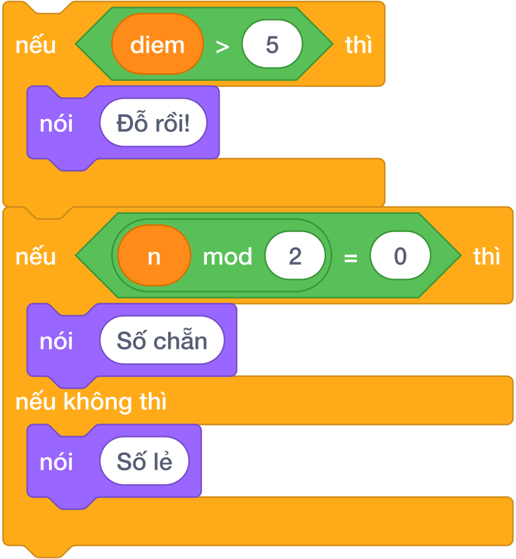

---

## 2. Hai Dạng Khối Lệnh Rẽ Nhánh Trong Scratch 3.0

Trong nhóm **Điều khiển (Control)** màu vàng cam, Scratch cung cấp hai khối bao quanh hình chữ C đặc trưng:

### 2.1. Cấu trúc rẽ nhánh khuyết: `nếu < > thì`
- Dùng khi chỉ cần can thiệp nếu gặp trường hợp đặc biệt; nếu không đúng điều kiện thì bỏ qua và đi tiếp.
- **Cơ chế hoạt động:**
  - Nếu điều kiện lục giác trả về `Đúng` (True): Máy tính thực thi các khối lệnh nằm kẹp bên trong miệng chữ C.
  - Nếu điều kiện trả về `Sai` (False): Toàn bộ khối bên trong chữ C bị bỏ qua, máy tính nhảy thẳng xuống chạy khối lệnh tiếp theo bên dưới.

### 2.2. Cấu trúc rẽ nhánh đủ: `nếu < > thì ... nếu không thì`
- Dùng khi bài toán có hai con đường đối lập nhau và bắt buộc phải chọn đúng một con đường:

  - Nếu điều kiện **ĐÚNG**: Thực thi nhánh trên (sau chữ `thì`).
  - Nếu điều kiện **SAI**: Thực thi nhánh dưới (sau chữ `nếu không thì`).
- **Ví dụ kinh điển:** Kiểm tra số chẵn lẻ:

  - Nếu `((n) mod (2)) = (0)` thì nói `Số chẵn`.
  - Nếu không thì nói `Số lẻ`.

---

## 3. Các Toán Tử So Sánh & Ghép Điều Kiện Logic Phức Tạp

Để tạo ra điều kiện cho khối rẽ nhánh, ta sử dụng các khối hình lục giác góc nhọn màu xanh lá trong nhóm **Các phép toán (Operators)**:

| Khối lục giác Scratch | Ký hiệu toán học | Ý nghĩa logic | Ví dụ cài đặt thực tế |
|:---:|:---:|---|---|
| `< () > () >` | $>$ | So sánh lớn hơn | `< (diem) > (5) >` |
| `< () < () >` | $<$ | So sánh nhỏ hơn | `< (tuoi) < (18) >` |
| `< () = () >` | $=$ | So sánh bằng *(chú ý chỉ 1 dấu bằng)* | `< ((n) mod (2)) = (0) >` |
| `< < > và < > >` | $\text{AND}$ | **ĐỒNG THỜI**: Đúng khi cả hai điều kiện con đều đúng | `< (a > 0) và (b > 0) >` |
| `< < > hoặc < > >` | $\text{OR}$ | **HOẶC**: Đúng khi có ít nhất một điều kiện đúng | `< (thang = 1) hoặc (thang = 3) >` |
| `< không phải < > >` | $\text{NOT}$ | **PHỦ ĐỊNH**: Đảo ngược kết quả từ đúng thành sai | `< không phải < (tuoi) < (6) > >` |

---

## 4. Các Mẫu Thuật Toán Rẽ Nhánh Kinh Điển

### 4.1. Mẫu 1: Thuật toán tìm giá trị lớn nhất của 3 số ($A, B, C$)
Ta áp dụng kỹ thuật **"Đặt vương miện giả định"**:

1. Giả sử số đầu tiên lớn nhất: `đặt [max v] thành (A)`.

2. Lấy $B$ so sánh với vương miện: nếu $B > \text{max}$ thì trao vương miện cho $B$.

3. Lấy $C$ so sánh tiếp: nếu $C > \text{max}$ thì trao vương miện cho $C$.

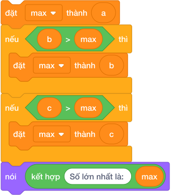

### 4.2. Mẫu 2: Cấu trúc đa nhánh lồng nhau (Tương đương `if - elif - else`)
Trong các bài toán xếp loại học sinh (Giỏi $\ge 8.0$, Khá $\ge 6.5$, Trung bình $\ge 5.0$, Yếu $< 5.0$), ta lồng các khối `nếu...nếu không thì` vào nhánh `nếu không thì` của khối trước:

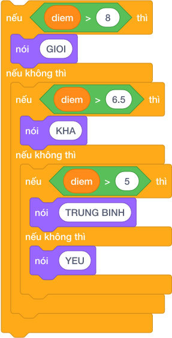

---

## 5. Bảng Mô Phỏng Tìm Số Lớn Nhất Trong $A = 12, B = 25, C = 18$ (Dry Run Table)

| Bước | Khối lệnh thực thi | Biến `max` | Biểu thức kiểm tra | Kết quả điều kiện | Hành động máy tính |
|:---:|---|:---:|---|:---:|---|
| **1** | `đặt [max v] thành (A)` | **12** | — | — | Giả định `max = 12` |
| **2** | `nếu < (B) > (max) > thì` | 12 | $25 > 12$ | **ĐÚNG** (True) | Bước vào nhánh: `đặt [max] thành 25` |
| **3** | Cập nhật `max` | **25** | — | — | Vương miện thuộc về $B$ |
| **4** | `nếu < (C) > (max) > thì` | 25 | $18 > 25$ | **SAI** (False) | Bỏ qua nhánh |
| **5** | `nói (max)` | **25** | — | — | Chú Mèo nói: `25` |

---

## 6. Tử Huyệt & Các Bẫy Lỗi Kinh Điển (Bug Traps)

> **Bẫy 1: Xếp các khối `nếu...thì` độc lập thay vì dùng `nếu...nếu không thì`**
> - *Hiện tượng:* Đặt 2 khối `nếu` tách rời nhau:
>   - `nếu < (diem) >= (5) > thì nói [Đỗ]`
>   - `nếu < (diem) < (5) > thì nói [Trượt]`
> - *Nguy cơ:* Nếu viết nhầm dấu so sánh, chú Mèo có thể nói cả hai câu cùng lúc làm hỏng logic!
> - *Khắc phục:* Luôn dùng cấu trúc đủ `nếu ... thì ... nếu không thì`.

> **Bẫy 2: Nhầm lẫn giữa liên từ `và` (AND) với `hoặc` (OR)**
> - *Ví dụ:* Điều kiện để 3 cạnh $a, b, c$ tạo thành tam giác hợp lệ:
>   $$\text{ĐÚNG: } < < (a + b > c) \text{ và } (b + c > a) > \text{ và } (c + a > b) >$$
> - Nếu nhầm thành `hoặc`, bộ ba cạnh $1, 2, 100$ cũng bị công nhận là tam giác!

> **Bẫy 3: Viết điều kiện kẹp đôi kiểu toán học `3 < x < 10`**
> - Scratch **không cho phép** đặt 3 đối tượng vào một khối so sánh.
> - Bắt buộc phải tách thành hai biểu thức con ghép lại: `< < (x) > (3) > và < (x) < (10) > >`.

---

## 7. Bộ Câu Hỏi Trắc Nghiệm Củng Cố (Concept Quizzes)

1. **Khi điều kiện lục giác trong khối `nếu < > thì` trả về kết quả SAI, máy tính sẽ:**
   - A. Dừng chương trình
   - B. Bỏ qua các lệnh bên trong và chạy tiếp các khối phía dưới *(Đáp án đúng)*
   - C. Báo lỗi đỏ
   - D. Lặp lại từ đầu

2. **Muốn kiểm tra số nguyên $N$ có chia hết cho cả 3 và 5 không, ta dùng khối:**
   - A. `< ((N mod 3) = 0) hoặc ((N mod 5) = 0) >`
   - B. `< ((N mod 3) = 0) và ((N mod 5) = 0) >` *(Đáp án đúng)*
   - C. `< không phải < (N mod 15) = 0 > >`
   - D. `< (N mod 3) = (N mod 5) >`

3. **Biểu thức `< không phải < (A) > (B) > >` tương đương với:**
   - A. $A < B$
   - B. $A = B$
   - C. $A \le B$ ($A$ nhỏ hơn hoặc bằng $B$) *(Đáp án đúng)*
   - D. $A \ne B$

4. **Cho $A = 8, B = 3$. Giá trị của biểu thức `< (A > 5) và (B > 5) >` là:**
   - A. Đúng (True)
   - B. Sai (False) *(Đáp án đúng: vì B > 5 bị Sai)*
   - C. 8
   - D. 3

5. **Để tìm số lớn hơn giữa 2 số $A$ và $B$, khối nào viết chuẩn nhất?**
   - A. `nếu < A > B > thì đặt max thành A, nếu không thì đặt max thành B` *(Đáp án đúng)*
   - B. `lặp lại A lần đặt max thành B`
   - C. `đặt max thành A + B`
   - D. `nói A và B`

6. **Trong Scratch, khối so sánh bằng sử dụng bao nhiêu dấu bằng?**
   - A. 1 dấu `=` *(Đáp án đúng)*
   - B. 2 dấu `==`
   - C. Dấu `:=`
   - D. Dấu `equals`

7. **Cho biến `tuoi = 15`. Đoạn lệnh `nếu < tuoi >= 18 > thì nói [Người lớn] nếu không thì nói [Trẻ em]` sẽ nói:**
   - A. Người lớn
   - B. Trẻ em *(Đáp án đúng)*
   - C. Cả hai câu
   - D. Không nói gì

8. **Muốn kiểm tra điểm thi có nằm trong khoảng hợp lệ từ 0 đến 10 hay không, ta ghép điều kiện:**
   - A. `< (diem >= 0) và (diem <= 10) >` *(Đáp án đúng)*
   - B. `< (diem >= 0) hoặc (diem <= 10) >`
   - C. `< 0 <= diem <= 10 >`
   - D. `< không phải (diem = 0) >`

9. **Khi cả hai nhánh của `nếu ... nếu không thì` đều có lệnh giống nhau ở cuối, ta nên:**
   - A. Để nguyên trong từng nhánh
   - B. Kéo lệnh đó ra ngoài đặt ở ngay phía dưới khối rẽ nhánh *(Đáp án đúng: tối ưu mã)*
   - C. Xóa bỏ lệnh đó
   - D. Nhân đôi số lần thực hiện

10. **Biểu thức `< (thang = 1) hoặc < (thang = 2) hoặc (thang = 3) > >` dùng để kiểm tra:**
    - A. Tháng 1
    - B. Tháng thuộc Quý 1 trong năm *(Đáp án đúng)*
    - C. Cả năm
    - D. Lỗi cú pháp

## Bài tập lesson

# DANH SÁCH BÀI TẬP THỰC HÀNH: BÀI 06 — Cấu trúc rẽ nhánh

**Khóa học:** iKHEDU Scratch  
**Chuyên đề:** Chương 3: Cấu Trúc Rẽ Nhánh & Vòng Lặp  
> **Tổng số bài tập thực hành:** `37 bài` chuẩn hóa 100% (Từ kho bài tập `courses/scratch-bang-a/problems/`).  

---

## 1. Ma Trận Phân Tầng Bài Tập Toàn Diện

| STT | Mã bài toán | Tên bài tập | Phân tầng | Mức nhận thức | Thao tác trọng tâm |
|:---:|---|---|:---:|:---:|---|
| 1 | `sca_l06_p01_kiem_tra_so_chan_le` | Kiểm tra số chẵn lẻ | **P0** | Khởi động & Quan sát | Cho số tự nhiên $N$. Hãy kiểm tra nếu $N$ là số chẵn in ra `... |
| 2 | `sca_l06_p02_ve_vao_cong_vien` | Vé vào công viên | **P0** | Khởi động & Quan sát | Nếu chiều cao $h \ge 130\text{ cm}$, in ra `VE NGUOI LON`. N... |
| 3 | `sca_l06_p03_ai_cao_hon` | Ai cao hơn? | **P0** | Khởi động & Quan sát | Biết rằng $a \ne b$, hãy xác định và in ra tên của người có ... |
| 4 | `sca_l06_p04_so_lon_nhat_trong_hai_so` | Số lớn nhất trong hai số | **P0** | Khởi động & Quan sát | Cho hai số nguyên $A$ và $B$. Hãy tìm và in ra giá trị lớn n... |
| 5 | `sca_l06_p05_chia_keo_cong_bang` | Chia kẹo công bằng | **P0** | Khởi động & Quan sát | Kiểm tra xem số kẹo có chia đều được hay không? Nếu chia đều... |
| 6 | `sca_l06_p06_dien_phep_tinh_lon_nhat` | Điền phép tính lớn nhất | **P0** | Khởi động & Quan sát | Hãy dùng một trong các phép tính $+$, $-$, $\times$ điền vào... |
| 7 | `sca_l06_p07_giam_gia_sieu_thi` | Giảm giá siêu thị | **P0** | Khởi động & Quan sát | Nhập vào tổng tiền đơn hàng $N$ (nghìn đồng). Hãy in ra số t... |
| 8 | `sca_l06_p08_cap_so_bang_nhau_hay_khac` | Cặp số bằng nhau hay khác? | **P0** | Khởi động & Quan sát | Nhập vào 2 số nguyên $a$ và $b$. Hãy so sánh và nhân vật nói... |
| 9 | `sca_l06_p09_tri_tuyet_doi_cua_mot_so` | Trị tuyệt đối của một số | **P0** | Khởi động & Quan sát | Cho số nguyên $x$. Hãy tính và in ra giá trị tuyệt đối $|x|$... |
| 10 | `sca_l06_p10_bac_tho_moc_cat_go` | Bác thợ mộc cắt gỗ | **P1** | Cơ bản & Hoàn thành | Cho hai số nguyên dương $L$ và $k$. Hãy tính số đoạn gỗ cưa ... |
| 11 | `sca_l06_p11_canh_thu_tu_hinh_chu_nhat` | Cạnh thứ tư hình chữ nhật | **P1** | Cơ bản & Hoàn thành | Hãy tìm độ dài thanh gỗ thứ 4 còn thiếu để ghép vừa khít thà... |
| 12 | `sca_l06_p12_tro_choi_oan_tu_ti` | Trò chơi oẳn tù tì | **P1** | Cơ bản & Hoàn thành | Nhập vào lựa chọn của Tí và Tèo. Hãy in ra kết quả: `TI THAN... |
| 13 | `sca_l06_p13_den_giao_thong_nga_tu` | Đèn giao thông ngã tư | **P1** | Cơ bản & Hoàn thành | Nhập vào một chữ cái in hoa đại diện cho màu đèn: `D` (Đỏ), ... |
| 14 | `sca_l06_p14_dau_cua_so_nguyen` | Dấu của số nguyên | **P1** | Cơ bản & Hoàn thành | Nhập vào số nguyên $N$. Hãy in ra:

 * `DUONG` nếu $N > 0$.
 ... |
| 15 | `sca_l06_p15_so_lon_nhat_trong_ba_so` | Số lớn nhất trong ba số | **P1** | Cơ bản & Hoàn thành | Nhập vào 3 số nguyên $a, b, c$ mỗi số trên một dòng. Hãy tìm... |
| 16 | `sca_l06_p16_xep_loai_hoc_luc` | Xếp loại học lực | **P1** | Cơ bản & Hoàn thành | Nhập vào điểm trung bình môn Tin học của một người dùng (số ... |
| 17 | `sca_l06_p17_ve_gui_xe_ben_bai` | Vé gửi xe bến bãi | **P1** | Cơ bản & Hoàn thành | Nhập vào mã loại xe và in ra giá vé tương ứng; nếu mã không ... |
| 18 | `sca_l06_p18_mario_cuu_cong_chua` | Mario cứu công chúa | **P1** | Cơ bản & Hoàn thành | Hỏi với mức năng lượng hiện có, Mario và Công chúa có thể gặ... |
| 19 | `sca_l06_p19_tinh_cuoc_taxi_bac_thang` | Tính cước taxi bậc thang | **P2** | Luyện tập & Vận dụng | Nhập vào số kilomet $N$ mà khách đã đi (số nguyên $N \ge 1$)... |
| 20 | `sca_l06_p20_phan_loai_tam_giac` | Phân loại tam giác | **P2** | Luyện tập & Vận dụng | Hãy phân loại tam giác đó:

 * Nếu 3 cạnh bằng nhau ($a == b ... |
| 21 | `sca_l06_p21_thuan_di_tim_anh_da_van_toc` | Thuận đi tìm ánh đa vận tốc | **P2** | Luyện tập & Vận dụng | Hãy phân tích các tình huống:

 * Nếu $x == y$: in `DA GAP NH... |
| 22 | `sca_l06_p22_thu_may_trong_tuan` | Thứ mấy trong tuần? | **P2** | Luyện tập & Vận dụng | Cho biết ngày thứ $K$ trong năm đó là thứ mấy?
 * Biết rằng:... |
| 23 | `sca_l06_p23_cua_hang_banh_bot_loc_khuyen_mai` | Cửa hàng bánh bột lọc khuyến mãi | **P2** | Luyện tập & Vận dụng | Nhập vào số lượng bánh $N$ mà khách muốn mua. Tính tổng số t... |
| 24 | `sca_l06_p24_bon_mua_trong_nam` | Bốn mùa trong năm | **P2** | Luyện tập & Vận dụng | Nhập vào một số nguyên $M$.
 * Nếu $1 \le M \le 12$, hãy in ... |
| 25 | `sca_l06_p25_so_chan_co_hai_chu_so` | Số chẵn có hai chữ số | **P2** | Luyện tập & Vận dụng | Nhập vào một số tự nhiên $N$. Kiểm tra xem $N$ có phải là **... |
| 26 | `sca_l06_p26_boi_chung_cua_3_va_5` | Bội chung của 3 và 5 | **P2** | Luyện tập & Vận dụng | Nhập vào số tự nhiên $N$. Nếu $N$ chia hết cho cả 3 và 5 thì... |
| 27 | `sca_l06_p27_ngay_nghi_cuoi_tuan` | Ngày nghỉ cuối tuần | **P2** | Luyện tập & Vận dụng | Nhập vào một số nguyên $d$ đại diện cho một ngày. Nếu $d$ là... |
| 28 | `sca_l06_p28_diem_nam_trong_hinh_chu_nhat` | Điểm nằm trong hình chữ nhật | **P3** | Vận dụng cao & Sáng tạo | Nhập vào $W, H$ và tọa độ của một điểm $(x, y)$. Kiểm tra xe... |
| 29 | `sca_l06_p29_ba_canh_tam_giac_hop_le` | Ba cạnh tam giác hợp lệ | **P3** | Vận dụng cao & Sáng tạo | Nhập vào 3 số tự nhiên $a, b, c$ trên 3 dòng. Kiểm tra xem 3... |
| 30 | `sca_l06_p30_kiem_tra_nam_nhuan` | Kiểm tra năm nhuận | **P3** | Vận dụng cao & Sáng tạo | Nhập vào một năm dương lịch $Y$. Hãy in ra `NAM NHUAN` nếu n... |
| 31 | `sca_l06_p31_so_ngay_trong_thang` | Số ngày trong tháng | **P3** | Vận dụng cao & Sáng tạo | Nhập vào tháng $M$ ($1 \le M \le 12$) và năm $Y$ ($1 \le Y \... |
| 32 | `sca_l06_p32_tam_giac_vuong_hay_khong` | Tam giác vuông hay không? | **P3** | Vận dụng cao & Sáng tạo | Cho 3 số dương $a, b, c$. Nếu chúng tạo thành một tam giác v... |
| 33 | `sca_l06_p33_rut_the_may_man` | Rút thẻ may mắn | **P3** | Vận dụng cao & Sáng tạo | Nhập vào số $N$ trên thẻ. In ra `TRUNG THUONG` nếu trúng thư... |
| 34 | `sca_l06_p34_ngay_ke_tiep_trong_nam` | Ngày kế tiếp trong năm | **P3** | Vận dụng cao & Sáng tạo | Hãy tính và in ra ngày, tháng, năm của **ngày kế tiếp ngay s... |
| 35 | `sca_l06_p35_cap_doi_cung_dau_hay_trai_dau` | Cặp đôi cùng dấu hay trái dấu | **P3** | Vận dụng cao & Sáng tạo | Nhập vào hai số nguyên $a$ và $b$ (có thể âm, dương hoặc bằn... |
| 36 | `sca_l06_p36_giao_nhau_cua_hai_doan_thang` | Giao nhau của hai đoạn thẳng | **P3** | Vận dụng cao & Sáng tạo | Hãy kiểm tra xem hai đoạn thẳng này có điểm chung (giao nhau... |
| 37 | `sca_l06_p37_tien_dien_bac_thang` | Tiền điện bậc thang | **P3** | Vận dụng cao & Sáng tạo | Hãy tính tổng tiền điện (đồng) phải trả cho $N$ số điện theo... |

---

## 2. Chi Tiết Từng Bài Tập Thực Hành

### Bài 1 (P0): Kiểm tra số chẵn lẻ
* **Mã bài toán:** `sca_l06_p01_kiem_tra_so_chan_le`
* **Độ khó & Phân tầng:** P0 (Khởi động & Quan sát)
* **Bối cảnh:** Trong thuật toán phân nhánh xử lý luồng dữ liệu mạng, các gói tin mang số định danh chẵn và lẻ được chuyển tiếp qua hai kênh truyền tải khác nhau.
* **Nhiệm vụ:** Cho số tự nhiên $N$. Hãy kiểm tra nếu $N$ là số chẵn in ra `CHAN`, ngược lại in ra `LE`.
* **Dữ liệu vào (Input):** Một số tự nhiên $N$ ($0 \le N \le 10^9$).
* **Kết quả ra (Output):** Chuỗi `CHAN` hoặc `LE`.
* **Dữ liệu mẫu (Sample):**

### Input
```text
18
```
### Output
```text
CHAN
```
### Giải thích

Số đầu vào là $18$. Vì $18$ chia hết cho $2$ ($18 \% 2 = 0$), nên đây là số chẵn. Kết quả in ra: `CHAN`.

---

### Bài 2 (P0): Vé vào công viên
* **Mã bài toán:** `sca_l06_p02_ve_vao_cong_vien`
* **Độ khó & Phân tầng:** P0 (Khởi động & Quan sát)
* **Bối cảnh:** Tại trạm kiểm soát tự động của công viên nước, hệ thống cảm biến quang học đo chiều cao $h$ (cm) của khách hàng để phân loại vé hợp lệ.
* **Nhiệm vụ:** Nếu chiều cao $h \ge 130\text{ cm}$, in ra `VE NGUOI LON`. Nếu $h < 130\text{ cm}$, in ra `VE TRE EM`.
* **Dữ liệu vào (Input):** Một số nguyên $h$ ($1 \le h \le 200$).
* **Kết quả ra (Output):** `VE NGUOI LON` hoặc `VE TRE EM`.
* **Dữ liệu mẫu (Sample):**

### Input
```text
135
```
### Output
```text
VE NGUOI LON
```
### Giải thích

Chiều cao đo được là $135\text{ cm}$. Do $135 \ge 130$, khách hàng cần áp dụng mức vé người lớn. Kết quả in ra: `VE NGUOI LON`.

---

### Bài 3 (P0): Ai cao hơn?
* **Mã bài toán:** `sca_l06_p03_ai_cao_hon`
* **Độ khó & Phân tầng:** P0 (Khởi động & Quan sát)
* **Bối cảnh:** Trong hệ thống dữ liệu kiểm tra thể lực, số đo chiều cao của hai ứng viên Minh ($a\text{ cm}$) và Nam ($b\text{ cm}$) được ghi nhận.
* **Nhiệm vụ:** Biết rằng $a \ne b$, hãy xác định và in ra tên của người có chiều cao lớn hơn (`Minh` hoặc `Nam`).
* **Dữ liệu vào (Input):** Hai số tự nhiên $a$ và $b$ trên 2 dòng ($50 \le a, b \le 200, a \ne b$).
* **Kết quả ra (Output):** Tên bạn cao hơn.
* **Dữ liệu mẫu (Sample):**

### Input
```text
142
138
```
### Output
```text
Minh
```
### Giải thích

Chiều cao của Minh là $142\text{ cm}$ và Nam là $138\text{ cm}$. Vì $142 > 138$, bạn Minh cao hơn. Kết quả in ra: `Minh`.

---

### Bài 4 (P0): Số lớn nhất trong hai số
* **Mã bài toán:** `sca_l06_p04_so_lon_nhat_trong_hai_so`
* **Độ khó & Phân tầng:** P0 (Khởi động & Quan sát)
* **Bối cảnh:** Bộ vi xử lý cần thực hiện thao tác so sánh logic giữa hai thanh ghi dữ liệu $A$ và $B$ để giữ lại giá trị cực đại phục vụ tính toán tiếp theo.
* **Nhiệm vụ:** Cho hai số nguyên $A$ và $B$. Hãy tìm và in ra giá trị lớn nhất trong hai số đó.
* **Dữ liệu vào (Input):** Hai số nguyên $a, b$ ($-10^9 \le a, b \le 10^9$).
* **Kết quả ra (Output):** Một số nguyên là giá trị lớn nhất.
* **Dữ liệu mẫu (Sample):**

### Input
```text
-15
8
```
### Output
```text
8
```
### Giải thích

Hai số đầu vào là $25$ và $42$. Số lớn hơn là $42$. Kết quả in ra: `42`.

---

### Bài 5 (P0): Chia kẹo công bằng
* **Mã bài toán:** `sca_l06_p05_chia_keo_cong_bang`
* **Độ khó & Phân tầng:** P0 (Khởi động & Quan sát)
* **Bối cảnh:** Hôm liên hoan lớp, cô giáo mang đến một túi có $a$ chiếc kẹo thơm ngon để chia cho $b$ bạn học sinh. Cô muốn chia thật công bằng sao cho tất cả các bạn đều nhận được số kẹo bằng nhau và không còn thừa cái nào, để không bạn nào phải buồn. Cả lớp nín thở chờ xem túi kẹo có chia vừa khít hay không. Hãy giúp cô kiểm tra xem số kẹo có chia đều được không.
* **Nhiệm vụ:** Kiểm tra xem số kẹo có chia đều được hay không? Nếu chia đều được thì in `YES`, ngược lại in `NO`.
* **Dữ liệu vào (Input):** Hai số nguyên dương $a, b$ ($1 \le a, b \le 10^6$).
* **Kết quả ra (Output):** `YES` hoặc `NO`.
* **Dữ liệu mẫu (Sample):**

### Input
```text
20
4
```
### Output
```text
YES
```
### Giải thích

20 chia hết cho 4, mỗi bạn 5 cái kẹo.

---

### Bài 6 (P0): Điền phép tính lớn nhất
* **Mã bài toán:** `sca_l06_p06_dien_phep_tinh_lon_nhat`
* **Độ khó & Phân tầng:** P0 (Khởi động & Quan sát)
* **Bối cảnh:** Trong giờ toán vui, cô giáo viết lên bảng một số tự nhiên $A$ và biểu thức bí ẩn sau: $A \text{ ? } A = B$. Cô đố cả lớp hãy chọn một dấu trong ba dấu cộng, trừ, nhân để lấp vào chỗ dấu hỏi chấm. Thí sinh nào tìm được số $B$ to nhất sẽ được thưởng một tràng pháo tay. Hãy giúp cả lớp tìm ra số $B$ lớn nhất có thể.
* **Nhiệm vụ:** Hãy dùng một trong các phép tính $+$, $-$, $\times$ điền vào dấu $?$ để giá trị $B$ đạt được là **lớn nhất**. In ra số $B$ lớn nhất tìm được.
* **Dữ liệu vào (Input):** Một số tự nhiên $A$ ($0 \le A \le 100$).
* **Kết quả ra (Output):** Một số nguyên duy nhất là số $B$ lớn nhất.
* **Dữ liệu mẫu (Sample):**

### Input
```text
3
```
### Output
```text
9
```
### Giải thích

$3 + 3 = 6$, $3 - 3 = 0$, $3 \times 3 = 9$. Số lớn nhất là 9.

---

### Bài 7 (P0): Giảm giá siêu thị
* **Mã bài toán:** `sca_l06_p07_giam_gia_sieu_thi`
* **Độ khó & Phân tầng:** P0 (Khởi động & Quan sát)
* **Bối cảnh:** Cuối tuần, mẹ dẫn Bi đi siêu thị mua đồ thật vui. Siêu thị đang có chương trình khuyến mãi: khách hàng mua đơn hàng có tổng giá trị từ $500$ nghìn đồng trở lên sẽ được giảm giá ngay $50$ nghìn đồng, còn các đơn hàng dưới $500$ nghìn đồng thì giữ nguyên giá. Bi xung phong ra quầy tính tiền giúp mẹ. Hãy tính xem phải trả bao nhiêu tiền.
* **Nhiệm vụ:** Nhập vào tổng tiền đơn hàng $N$ (nghìn đồng). Hãy in ra số tiền thực tế khách hàng phải trả sau khi đã áp dụng khuyến mãi.
* **Dữ liệu vào (Input):** Một số nguyên dương $N$ ($1 \le N \le 10^6$).
* **Kết quả ra (Output):** Số tiền phải trả.
* **Dữ liệu mẫu (Sample):**

### Input
```text
620
```
### Output
```text
570
```
### Giải thích

Được giảm 50 nghìn: $620 - 50 = 570$.

---

### Bài 8 (P0): Cặp số bằng nhau hay khác?
* **Mã bài toán:** `sca_l06_p08_cap_so_bang_nhau_hay_khac`
* **Độ khó & Phân tầng:** P0 (Khởi động & Quan sát)
* **Bối cảnh:** Trong trò chơi ghép đôi, hai lá bài được lật lên. Nếu hai lá bài có cùng giá trị thì người chơi được cộng điểm. Hãy kiểm tra xem hai số có bằng nhau không.
* **Nhiệm vụ:** Nhập vào 2 số nguyên $a$ và $b$. Hãy so sánh và nhân vật nói ra màn hình một trong ba thông báo:

 * `a LON HON b` (nếu $a > b$)
 * `a NHO HON b` (nếu $a < b$)
 * `HAI SO BANG NHAU` (nếu $a == b$)
* **Dữ liệu vào (Input):** Hai số nguyên $a, b$ ($-10^9 \le a, b \le 10^9$).
* **Kết quả ra (Output):** Một dòng thông báo theo đúng mẫu.
* **Dữ liệu mẫu (Sample):**

### Input
```text
15 28
```
### Output
```text
a NHO HON b
```
### Giải thích
Số 15 nhỏ hơn số 28 nên in ra a NHO HON b.

---

### Bài 9 (P0): Trị tuyệt đối của một số
* **Mã bài toán:** `sca_l06_p09_tri_tuyet_doi_cua_mot_so`
* **Độ khó & Phân tầng:** P0 (Khởi động & Quan sát)
* **Bối cảnh:** Trong tính toán tọa độ và độ lệch kỹ thuật số, giá trị tuyệt đối $|x|$ thể hiện khoảng cách từ điểm đo đến mốc tham chiếu số 0.
* **Nhiệm vụ:** Cho số nguyên $x$. Hãy tính và in ra giá trị tuyệt đối $|x|$ của số đó.
* **Dữ liệu vào (Input):** Một số nguyên $N$ ($-10^9 \le N \le 10^9$).
* **Kết quả ra (Output):** Giá trị tuyệt đối của $N$.
* **Dữ liệu mẫu (Sample):**

### Input
```text
-25
```
### Output
```text
25
```
### Giải thích

Số đầu vào là $-15$. Giá trị tuyệt đối của $-15$ là $|-15| = 15$. Kết quả in ra: `15`.

---

### Bài 10 (P1): Bác thợ mộc cắt gỗ
* **Mã bài toán:** `sca_l06_p10_bac_tho_moc_cat_go`
* **Độ khó & Phân tầng:** P1 (Cơ bản & Hoàn thành)
* **Bối cảnh:** Trong xưởng gia công nội thất, một thanh gỗ có chiều dài $L$ được cưa thành các đoạn nhỏ có chiều dài đúng bằng $k$.
* **Nhiệm vụ:** Cho hai số nguyên dương $L$ và $k$. Hãy tính số đoạn gỗ cưa được và phần chiều dài gỗ vụn còn thừa.
* **Dữ liệu vào (Input):** Hai số tự nhiên $L$ và $K$ trên 2 dòng ($1 \le L, K \le 10^9$).
* **Kết quả ra (Output):** Hai số cách nhau dấu cách `so_doan go_thua` hoặc in chữ `KHONG DU`.
* **Dữ liệu mẫu (Sample):**

### Input
```text
17
5
```
### Output
```text
3 2
```
### Giải thích

Thanh gỗ dài $17\text{ cm}$ cưa thành các đoạn $5\text{ cm}$. Số đoạn cưa được là $17 // 5 = 3$ đoạn, phần gỗ vụn còn thừa là $17 \% 5 = 2\text{ cm}$. Kết quả in ra: `3 2`.

---

### Bài 11 (P1): Cạnh thứ tư hình chữ nhật
* **Mã bài toán:** `sca_l06_p11_canh_thu_tu_hinh_chu_nhat`
* **Độ khó & Phân tầng:** P1 (Cơ bản & Hoàn thành)
* **Bối cảnh:** Sau giờ thủ công, bạn Nam nhặt được 3 thanh gỗ có độ dài là $A, B, C$ ở góc lớp học. Cô giáo mỉm cười cho biết chắc chắn 3 thanh này là 3 cạnh của một hình chữ nhật, mà một hình chữ nhật luôn có 4 cạnh tạo thành 2 cặp cạnh đối bằng nhau (2 chiều dài bằng nhau và 2 chiều rộng bằng nhau). Nam muốn tìm thêm đúng một thanh gỗ nữa để ghép vừa khít thành khung hình. Hãy giúp bạn Nam tìm độ dài thanh gỗ còn thiếu.
* **Nhiệm vụ:** Hãy tìm độ dài thanh gỗ thứ 4 còn thiếu để ghép vừa khít thành hình chữ nhật.
* **Dữ liệu vào (Input):** Ba số tự nhiên $A, B, C$ trên 3 dòng ($1 \le A, B, C \le 1000$).
* **Kết quả ra (Output):** Độ dài cạnh thứ 4.
* **Dữ liệu mẫu (Sample):**

### Input
```text
3
5
3
```
### Output
```text
5
```
### Giải thích

Đã có 2 cạnh bằng 3, vậy cạnh còn lại phải là 5.

---

### Bài 12 (P1): Trò chơi oẳn tù tì
* **Mã bài toán:** `sca_l06_p12_tro_choi_oan_tu_ti`
* **Độ khó & Phân tầng:** P1 (Cơ bản & Hoàn thành)
* **Bối cảnh:** Giờ ra chơi, hai bạn Tí và Tèo rủ nhau chơi trò Oẳn Tù Tì thật sôi nổi. Hai bạn quy ước các lựa chọn bằng số: `1` là Búa (Đấm), `2` là Kéo, `3` là Bao (Lá). Luật chơi là: Búa (1) thắng Kéo (2); Kéo (2) thắng Bao (3); Bao (3) thắng Búa (1), còn nếu ra cùng số thì hòa nhau. Cả hai cùng hô to và ra tay mà chưa biết ai thắng. Hãy giúp hai bạn xem ai là người thắng cuộc.
* **Nhiệm vụ:** Nhập vào lựa chọn của Tí và Tèo. Hãy in ra kết quả: `TI THANG`, `TEO THANG` hoặc `HOA`.
* **Dữ liệu vào (Input):** Hai số tự nhiên lần lượt là lựa chọn của Tí và Tèo ($1, 2, 3$).
* **Kết quả ra (Output):** `TI THANG`, `TEO THANG` hoặc `HOA`.
* **Dữ liệu mẫu (Sample):**

### Input
```text
1
2
```
### Output
```text
TI THANG
```
### Giải thích

Tí ra Búa (1), Tèo ra Kéo (2) $\to$ Tí thắng.

---

### Bài 13 (P1): Đèn giao thông ngã tư
* **Mã bài toán:** `sca_l06_p13_den_giao_thong_nga_tu`
* **Độ khó & Phân tầng:** P1 (Cơ bản & Hoàn thành)
* **Bối cảnh:** Tại ngã tư gần trường, đèn giao thông điều khiển lưu lượng xe. Mỗi màu đèn có ý nghĩa khác nhau: đỏ thì dừng, vàng thì chuẩn bị, xanh thì đi. Hãy lập trình mô phỏng hệ thống đèn giao thông.
* **Nhiệm vụ:** Nhập vào một chữ cái in hoa đại diện cho màu đèn: `D` (Đỏ), `V` (Vàng), `X` (Xanh).
 * Nếu là `D`: in ra `DUNG LAI`.
 * Nếu là `V`: in ra `DI CHAM`.
 * Nếu là `X`: in ra `DUOC DI`.
* **Dữ liệu vào (Input):** Một ký tự `D`, `V` hoặc `X`.
* **Kết quả ra (Output):** Thông báo tương ứng.
* **Dữ liệu mẫu (Sample):**

### Input
```text
do
```
### Output
```text
DUNG LAI
```
### Giải thích
Màu đèn là "do" nên in ra thông báo DUNG LAI.

---

### Bài 14 (P1): Dấu của số nguyên
* **Mã bài toán:** `sca_l06_p14_dau_cua_so_nguyen`
* **Độ khó & Phân tầng:** P1 (Cơ bản & Hoàn thành)
* **Bối cảnh:** Trong bài kiểm tra toán, thầy giáo yêu cầu phân loại các số nguyên thành ba nhóm: số dương, số âm và số không. Hãy viết chương trình phân loại tự động.
* **Nhiệm vụ:** Nhập vào số nguyên $N$. Hãy in ra:

 * `DUONG` nếu $N > 0$.
 * `AM` nếu $N < 0$.
 * `KHONG` nếu $N == 0$.
* **Dữ liệu vào (Input):** Một số nguyên $N$ ($-10^9 \le N \le 10^9$).
* **Kết quả ra (Output):** Chuỗi kết quả.
* **Dữ liệu mẫu (Sample):**

### Input
```text
-15
```
### Output
```text
AM
```
### Giải thích
Số -15 nhỏ hơn 0 nên in ra AM.

---

### Bài 15 (P1): Số lớn nhất trong ba số
* **Mã bài toán:** `sca_l06_p15_so_lon_nhat_trong_ba_so`
* **Độ khó & Phân tầng:** P1 (Cơ bản & Hoàn thành)
* **Bối cảnh:** Ba bạn học sinh thi chạy 100 mét. Mỗi bạn chạy được một thành tích khác nhau. Hãy tìm bạn có thành tích tốt nhất (số lớn nhất).
* **Nhiệm vụ:** Nhập vào 3 số nguyên $a, b, c$ mỗi số trên một dòng. Hãy tìm và in ra số có giá trị lớn nhất trong 3 số đó.
* **Dữ liệu vào (Input):** Ba số nguyên $a, b, c$ ($-10^9 \le a, b, c \le 10^9$).
* **Kết quả ra (Output):** Một số nguyên duy nhất là số lớn nhất.
* **Dữ liệu mẫu (Sample):**

### Input
```text
15
28
9
```
### Output
```text
28
```
### Giải thích

Với dữ liệu đầu vào là `15
28
9`, kết quả thu được tương ứng là `28`.

---

### Bài 16 (P1): Xếp loại học lực
* **Mã bài toán:** `sca_l06_p16_xep_loai_hoc_luc`
* **Độ khó & Phân tầng:** P1 (Cơ bản & Hoàn thành)
* **Bối cảnh:** Cuối học kỳ, cô giáo cần xếp loại học lực cho từng học sinh dựa vào điểm trung bình. Hãy giúp cô giáo viết chương trình xếp loại tự động.
* **Nhiệm vụ:** Nhập vào điểm trung bình môn Tin học của một người dùng (số thực $0.0 \le diem \le 10.0$).
 * Điểm $\ge 9.0$: in `XUAT SAC`.
 * Điểm $\ge 8.0$ và $< 9.0$: in `GIOI`.
 * Điểm $\ge 6.5$ và $< 8.0$: in `KHA`.
 * Điểm $< 6.5$: in `CAN CO GANG`.
* **Dữ liệu vào (Input):** Một số thực $diem$.
* **Kết quả ra (Output):** Xếp loại tương ứng.
* **Dữ liệu mẫu (Sample):**

### Input
```text
8.5
```
### Output
```text
GIOI
```
### Giải thích
Điểm 8.5 thuộc thang điểm giỏi (từ 8.0 trở lên).

---

### Bài 17 (P1): Vé gửi xe bến bãi
* **Mã bài toán:** `sca_l06_p17_ve_gui_xe_ben_bai`
* **Độ khó & Phân tầng:** P1 (Cơ bản & Hoàn thành)
* **Bối cảnh:** Sáng chủ nhật, cả nhà Bo đến khu vui chơi gửi xe ở bãi giữ xe thông minh. Bác bảo vệ vui tính chỉ bảng giá vé theo loại phương tiện: loại `1` (Xe đạp) giá $2$ nghìn đồng, loại `2` (Xe máy) giá $5$ nghìn đồng, loại `3` (Xe ô tô) giá $30$ nghìn đồng, còn các loại khác thì máy báo `LOI PHUONG TIEN`. Bo xung phong đọc mã loại xe giúp bác. Hãy tính đúng giá vé.
* **Nhiệm vụ:** Nhập vào mã loại xe và in ra giá vé tương ứng; nếu mã không thuộc `1`, `2`, `3` thì in `LOI PHUONG TIEN`.
* **Dữ liệu vào (Input):** Một số nguyên mã loại xe.
* **Kết quả ra (Output):** Số tiền gửi xe hoặc chữ `LOI PHUONG TIEN`.
* **Dữ liệu mẫu (Sample):**

### Input
```text
xe may
```
### Output
```text
5000
```
### Giải thích
Phương tiện gửi là xe máy có mức phí 5000 đồng.

---

### Bài 18 (P1): Mario cứu công chúa
* **Mã bài toán:** `sca_l06_p18_mario_cuu_cong_chua`
* **Độ khó & Phân tầng:** P1 (Cơ bản & Hoàn thành)
* **Bối cảnh:** Trong khu vườn trò chơi, bạn Mario có $K$ năng lượng còn Công chúa có $P$ năng lượng. Giữa hai người là một chiếc cầu thang có đỉnh cao $N$ bậc: Mario đứng ở chân cầu thang bên trái (cần đi lên $N$ bậc và đi xuống $N$ bậc), Công chúa đứng ở chân cầu thang bên phải (cần đi lên $N$ bậc). Mỗi bậc thang Mario đi tốn $1$ năng lượng, còn mỗi bậc thang Công chúa đi tốn $2$ năng lượng. Cả hai đều mong gặp được nhau trên cầu thang. Hãy giúp hai bạn xem với sức của mình có gặp được nhau không.
* **Nhiệm vụ:** Hỏi với mức năng lượng hiện có, Mario và Công chúa có thể gặp được nhau ở một điểm nào đó trên cầu thang hay không? Nếu gặp được in `YES`, ngược lại in `NO`.
* **Biết rằng:** Tổng số bậc cầu thang từ chân bên này sang chân bên kia là $2N$. Để gặp nhau, tổng số bậc mà Mario leo được cộng với tổng số bậc mà Công chúa leo được phải $\ge 2N$.
* **Dữ liệu vào (Input):** Ba số tự nhiên $K, P, N$ ($1 \le K, P, N \le 1000$).
* **Kết quả ra (Output):** `YES` hoặc `NO`.
* **Dữ liệu mẫu (Sample):**

### Input
```text
3
3
2
```
### Output
```text
YES
```
### Giải thích

Cầu thang $2N = 4$ bậc. Mario đi được $\min(3, 4) = 3$ bậc. Công chúa có 3 năng lượng đi được $3 // 2 = 1$ bậc. Tổng số bậc đi được là $3 + 1 = 4 \ge 4 \implies$ Gặp nhau!

---

### Bài 19 (P2): Tính cước taxi bậc thang
* **Mã bài toán:** `sca_l06_p19_tinh_cuoc_taxi_bac_thang`
* **Độ khó & Phân tầng:** P2 (Luyện tập & Vận dụng)
* **Bối cảnh:** Hôm nay cả lớp đi dã ngoại bằng chiếc taxi "Rùa Con" rất dễ thương. Bác tài xế dán bảng giá lên cửa xe: giá mở cửa cho $1\text{ km}$ đầu tiên là $10$ nghìn đồng, từ kilomet thứ 2 đến kilomet thứ 10 giá $8$ nghìn đồng mỗi km, còn từ kilomet thứ 11 trở đi giá $6$ nghìn đồng mỗi km. Mi ngồi ghế đầu, tay cầm đồng hồ đo quãng đường và muốn tính tiền giúp cả lớp. Hãy tính tổng tiền cước.
* **Nhiệm vụ:** Nhập vào số kilomet $N$ mà khách đã đi (số nguyên $N \ge 1$). Tính tổng số tiền cước (nghìn đồng).
* **Dữ liệu vào (Input):** Một số tự nhiên $N$ ($1 \le N \le 100$).
* **Kết quả ra (Output):** Tổng tiền cước taxi.
* **Dữ liệu mẫu (Sample):**

### Input
```text
1
```
### Output
```text
10
```
### Giải thích

Đúng 1 km đầu: 10 nghìn.

---

### Bài 20 (P2): Phân loại tam giác
* **Mã bài toán:** `sca_l06_p20_phan_loai_tam_giac`
* **Độ khó & Phân tầng:** P2 (Luyện tập & Vận dụng)
* **Bối cảnh:** Trong giờ thủ công, Na cắt được một miếng bìa hình tam giác có 3 cạnh dài $a, b, c$ và cô giáo bảo đó là một tam giác hợp lệ. Cả lớp tò mò không biết miếng bìa của Na thuộc loại tam giác nào. Na muốn khoe với mẹ mà chưa gọi đúng tên hình. Hãy giúp bạn Na gọi đúng tên loại tam giác.
* **Nhiệm vụ:** Hãy phân loại tam giác đó:

 * Nếu 3 cạnh bằng nhau ($a == b == c$): in `TAM GIAC DEU`.
 * Nếu có 2 cạnh bằng nhau ($a == b$ hoặc $b == c$ hoặc $c == a$): in `TAM GIAC CAN`.
 * Các trường hợp còn lại: in `TAM GIAC THUONG`.
* **Dữ liệu vào (Input):** Ba số tự nhiên $a, b, c$ trên 3 dòng ($1 \le a, b, c \le 1000$).
* **Kết quả ra (Output):** Tên phân loại tam giác.
* **Dữ liệu mẫu (Sample):**

### Input
```text
3 3 3
```
### Output
```text
DEU
```
### Giải thích
Ba cạnh có độ dài bằng nhau nên tam giác là tam giác đều.

---

### Bài 21 (P2): Thuận đi tìm ánh đa vận tốc
* **Mã bài toán:** `sca_l06_p21_thuan_di_tim_anh_da_van_toc`
* **Độ khó & Phân tầng:** P2 (Luyện tập & Vận dụng)
* **Bối cảnh:** Một buổi chiều đẹp trời, bạn Thuận đứng ở vị trí $x$ còn bạn Ánh đứng ở vị trí $y$ trong sân trường rộng. Thuận rất nhớ bạn nên đi bộ về phía Ánh với vận tốc $v\text{ km/h}$. Cả hai hồi hộp không biết bao giờ thì gặp được nhau. Hãy giúp hai bạn xem khi nào thì gặp nhau.
* **Nhiệm vụ:** Hãy phân tích các tình huống:

 * Nếu $x == y$: in `DA GAP NHAU` (vì đang đứng cùng một chỗ).
 * Nếu $x \ne y$ nhưng $v == 0$: in `KHONG THE GAP` (vì Thuận đứng yên).
 * Nếu $x \ne y$ và $v > 0$:

 * Nếu khoảng cách $|y - x|$ chia hết cho $v$: in ra số giờ để gặp nhau.
 * Nếu không chia hết: in `GAP NHAU LE GIO`.
* **Dữ liệu vào (Input):** Ba số nguyên $x, y, v$ ($-10^9 \le x, y \le 10^9, 0 \le v \le 10^9$).
* **Kết quả ra (Output):** Thông báo tương ứng hoặc số giờ nguyên.
* **Dữ liệu mẫu (Sample):**

### Input
```text
15
```
### Output
```text
XE DAP
```
### Giải thích
Vận tốc 15 km/h nằm trong khoảng từ 10 đến 30 km/h nên Thuận đi xe đạp.

---

### Bài 22 (P2): Thứ mấy trong tuần?
* **Mã bài toán:** `sca_l06_p22_thu_may_trong_tuan`
* **Độ khó & Phân tầng:** P2 (Luyện tập & Vận dụng)
* **Bối cảnh:** Đầu năm mới, Bin treo một tờ lịch thật đẹp trong phòng học. Mẹ đố Bin rằng ngày mùng 1 tháng Giêng năm nay là ngày **Thứ Hai**. Bin rất thích lật từng tờ lịch và đếm xem các ngày tiếp theo rơi vào thứ mấy. Hãy giúp Bin trả lời ngày thứ $K$ là thứ mấy.
* **Nhiệm vụ:** Cho biết ngày thứ $K$ trong năm đó là thứ mấy?
 * Biết rằng: ngày 1 là Thứ Hai, ngày 2 là Thứ Ba, ..., ngày 7 là Chủ Nhật, ngày 8 lại quay về Thứ Hai.
* **Dữ liệu vào (Input):** Một số tự nhiên $K$ ($1 \le K \le 365$).
* **Kết quả ra (Output):** In ra một trong các chuỗi: `THU HAI`, `THU BA`, `THU TU`, `THU NAM`, `THU SAU`, `THU BAY`, `CHU NHAT`.
* **Dữ liệu mẫu (Sample):**

### Input
```text
2
```
### Output
```text
THU 2
```
### Giải thích
Ngày thứ 2 trong tuần là Thứ Hai.

---

### Bài 23 (P2): Cửa hàng bánh bột lọc khuyến mãi
* **Mã bài toán:** `sca_l06_p23_cua_hang_banh_bot_loc_khuyen_mai`
* **Độ khó & Phân tầng:** P2 (Luyện tập & Vận dụng)
* **Bối cảnh:** Cuối tuần, cô chủ nhỏ mở một cửa hàng bánh bột lọc thơm ngon trước cổng trường. Cô treo bảng ưu đãi số lượng thật hấp dẫn: mua dưới 10 cái giá $5$ nghìn đồng một cái, mua từ 10 đến 49 cái giá $4$ nghìn đồng một cái, còn mua từ 50 cái trở lên giá chỉ còn $3$ nghìn đồng một cái. Các người dùng xếp hàng dài chờ mua bánh mang về liên hoan. Hãy giúp cô chủ nhỏ tính tiền cho khách.
* **Nhiệm vụ:** Nhập vào số lượng bánh $N$ mà khách muốn mua. Tính tổng số tiền khách phải trả.
* **Dữ liệu vào (Input):** Một số tự nhiên $N$ ($1 \le N \le 1000$).
* **Kết quả ra (Output):** Tổng số tiền (nghìn đồng).
* **Dữ liệu mẫu (Sample):**

### Input
```text
25
```
### Output
```text
100000
```
### Giải thích
Mua 25 chiếc (từ 20 chiếc trở lên) được giá 4000 đ/chiếc: 25 x 4000 = 100000 đ.

---

### Bài 24 (P2): Bốn mùa trong năm
* **Mã bài toán:** `sca_l06_p24_bon_mua_trong_nam`
* **Độ khó & Phân tầng:** P2 (Luyện tập & Vận dụng)
* **Bối cảnh:** Trong giờ khoa học, cô giáo treo bức tranh bốn mùa thật đẹp lên bảng. Cô giảng rằng một năm có 12 tháng được chia thành 4 mùa: **Mùa Xuân** gồm tháng 1, 2, 3; **Mùa Hạ (Hè)** gồm tháng 4, 5, 6; **Mùa Thu** gồm tháng 7, 8, 9; còn **Mùa Đông** gồm tháng 10, 11, 12. Su thích nhất mùa hè vì được đi biển cùng gia đình. Hãy xác định một tháng bất kỳ thuộc mùa nào.
* **Nhiệm vụ:** Nhập vào một số nguyên $M$.
 * Nếu $1 \le M \le 12$, hãy in ra tên mùa tương ứng (`XUAN`, `HA`, `THU`, `DONG`).
 * Nếu $M$ không nằm từ 1 đến 12, in ra `THANG KHONG HOP LE`.
* **Dữ liệu vào (Input):** Một số nguyên $M$ ($-100 \le M \le 100$).
* **Kết quả ra (Output):** Tên mùa hoặc thông báo lỗi.
* **Dữ liệu mẫu (Sample):**

### Input
```text
4
```
### Output
```text
HA
```
### Giải thích
Tháng 4 thuộc mùa hạ (mùa hè).

---

### Bài 25 (P2): Số chẵn có hai chữ số
* **Mã bài toán:** `sca_l06_p25_so_chan_co_hai_chu_so`
* **Độ khó & Phân tầng:** P2 (Luyện tập & Vận dụng)
* **Bối cảnh:** Bạn Minh đang sưu tập các số chẵn có đúng hai chữ số để trang trí bảng tin lớp học. Hãy giúp Minh liệt kê tất cả các số đó.
* **Nhiệm vụ:** Nhập vào một số tự nhiên $N$. Kiểm tra xem $N$ có phải là **số chẵn có đúng hai chữ số** hay không? Nếu đúng in `YES`, ngược lại in `NO`.
* **Dữ liệu vào (Input):** Một số tự nhiên $N$ ($1 \le N \le 1000$).
* **Kết quả ra (Output):** `YES` hoặc `NO`.
* **Dữ liệu mẫu (Sample):**

### Input
```text
24
```
### Output
```text
YES
```
### Giải thích

24 là số chẵn và có 2 chữ số.

---

### Bài 26 (P2): Bội chung của 3 và 5
* **Mã bài toán:** `sca_l06_p26_boi_chung_cua_3_va_5`
* **Độ khó & Phân tầng:** P2 (Luyện tập & Vận dụng)
* **Bối cảnh:** Trong trò chơi FizzBuzz phổ biến trên toàn thế giới, người chơi cần nhận biết các số chia hết cho 3, cho 5 hoặc cho cả hai. Hãy lập trình kiểm tra.
* **Nhiệm vụ:** Nhập vào số tự nhiên $N$. Nếu $N$ chia hết cho cả 3 và 5 thì in `FIZZBUZZ`. Ngược lại in `KHONG`.
* **Dữ liệu vào (Input):** Một số tự nhiên $N$ ($1 \le N \le 10^9$).
* **Kết quả ra (Output):** `FIZZBUZZ` hoặc `KHONG`.
* **Dữ liệu mẫu (Sample):**

### Input
```text
15
```
### Output
```text
YES
```
### Giải thích
Số 15 vừa chia hết cho 3 vừa chia hết cho 5.

---

### Bài 27 (P2): Ngày nghỉ cuối tuần
* **Mã bài toán:** `sca_l06_p27_ngay_nghi_cuoi_tuan`
* **Độ khó & Phân tầng:** P2 (Luyện tập & Vận dụng)
* **Bối cảnh:** Cô giáo chủ nhiệm dán thời khóa biểu tuần lên bảng và dạy cả lớp cách nhớ các ngày bằng số: `2` là Thứ Hai, `3` là Thứ Ba, cứ thế đến `7` là Thứ Bảy và `8` là Chủ Nhật. Bạn Cún thích nhất hai ngày cuối tuần vì được nghỉ học đi chơi với ông bà. Sáng nào Cún cũng nhìn vào con số trên lịch và đoán xem hôm nay thế nào. Hãy giúp Cún xem hôm đó được nghỉ hay phải đi học.
* **Nhiệm vụ:** Nhập vào một số nguyên $d$ đại diện cho một ngày. Nếu $d$ là Thứ Bảy hoặc Chủ Nhật thì in `NGHI HOC`, ngược lại in `DI HOC`.
* **Dữ liệu vào (Input):** Một số nguyên $d$ ($2 \le d \le 8$).
* **Kết quả ra (Output):** `NGHI HOC` hoặc `DI HOC`.
* **Dữ liệu mẫu (Sample):**

### Input
```text
7
```
### Output
```text
NGHI
```
### Giải thích
Ngày 7 là thứ Bảy nên được nghỉ học.

---

### Bài 28 (P3): Điểm nằm trong hình chữ nhật
* **Mã bài toán:** `sca_l06_p28_diem_nam_trong_hinh_chu_nhat`
* **Độ khó & Phân tầng:** P3 (Vận dụng cao & Sáng tạo)
* **Bối cảnh:** Trong giờ vẽ, Mít vẽ một khu vườn hình chữ nhật trên giấy ô ly. Bạn đặt góc dưới-trái của vườn tại điểm $(0, 0)$ và góc trên-phải tại điểm $(W, H)$ trong mặt phẳng tọa độ. Mít còn chấm một chú bướm đậu ở đâu đó và đố bạn xem bướm đậu trong vườn hay bay ra ngoài. Hãy giúp Mít kiểm tra chú bướm có nằm trong vườn không.
* **Nhiệm vụ:** Nhập vào $W, H$ và tọa độ của một điểm $(x, y)$. Kiểm tra xem điểm $(x, y)$ có nằm bên trong hoặc trên mép biên của hình chữ nhật hay không? Nếu có in `TRONG`, ngược lại in `NGOAI`.
* **Dữ liệu vào (Input):** Bốn số tự nhiên $W, H, x, y$ trên 4 dòng ($1 \le W, H \le 1000, 0 \le x, y \le 1000$).
* **Kết quả ra (Output):** `TRONG` hoặc `NGOAI`.
* **Dữ liệu mẫu (Sample):**

### Input
```text
2 3 5 5
```
### Output
```text
TRONG
```
### Giải thích
Điểm (2, 3) nằm trọn vẹn bên trong hình chữ nhật từ (0, 0) đến (5, 5).

---

### Bài 29 (P3): Ba cạnh tam giác hợp lệ
* **Mã bài toán:** `sca_l06_p29_ba_canh_tam_giac_hop_le`
* **Độ khó & Phân tầng:** P3 (Vận dụng cao & Sáng tạo)
* **Bối cảnh:** Thí sinh có ba que tính với các độ dài khác nhau. Bạn ấy muốn biết liệu ba que tính đó có thể ghép thành một hình tam giác hay không. Hãy giúp kiểm tra.
* **Nhiệm vụ:** Nhập vào 3 số tự nhiên $a, b, c$ trên 3 dòng. Kiểm tra xem 3 số này có thể tạo thành độ dài 3 cạnh của một tam giác hay không? Nếu có in `HOP LE`, ngược lại in `KHONG HOP LE`.
* **Dữ liệu vào (Input):** Ba số tự nhiên $a, b, c$ ($1 \le a, b, c \le 10^9$).
* **Kết quả ra (Output):** `HOP LE` hoặc `KHONG HOP LE`.
* **Dữ liệu mẫu (Sample):**

### Input
```text
3
4
5
```
### Output
```text
HOP LE
```
### Giải thích

$3+4>5$, $3+5>4$, $4+5>3$ đều đúng.

---

### Bài 30 (P3): Kiểm tra năm nhuận
* **Mã bài toán:** `sca_l06_p30_kiem_tra_nam_nhuan`
* **Độ khó & Phân tầng:** P3 (Vận dụng cao & Sáng tạo)
* **Bối cảnh:** Lịch treo tường năm nay có 365 hay 366 ngày? Để biết được, em cần xác định năm đó có phải năm nhuận hay không. Hãy viết chương trình kiểm tra.
* **Nhiệm vụ:** Nhập vào một năm dương lịch $Y$. Hãy in ra `NAM NHUAN` nếu năm đó là năm nhuận, ngược lại in `NAM THUONG`.
* **Quy tắc:** Năm nhuận là năm chia hết cho 400, HOẶC chia hết cho 4 nhưng không chia hết cho 100.
* **Dữ liệu vào (Input):** Một số tự nhiên $Y$ ($1 \le Y \le 10^5$).
* **Kết quả ra (Output):** `NAM NHUAN` hoặc `NAM THUONG`.
* **Dữ liệu mẫu (Sample):**

### Input
```text
2024
```
### Output
```text
NAM NHUAN
```
### Giải thích

Với dữ liệu đầu vào là `2024`, kết quả thu được tương ứng là `NAM NHUAN`.

---

### Bài 31 (P3): Số ngày trong tháng
* **Mã bài toán:** `sca_l06_p31_so_ngay_trong_thang`
* **Độ khó & Phân tầng:** P3 (Vận dụng cao & Sáng tạo)
* **Bối cảnh:** Bạn Lan muốn biết tháng sinh nhật của mình có bao nhiêu ngày. Mỗi tháng trong năm có số ngày khác nhau, đặc biệt tháng 2 còn phụ thuộc vào năm nhuận. Hãy giúp Lan.
* **Nhiệm vụ:** Nhập vào tháng $M$ ($1 \le M \le 12$) và năm $Y$ ($1 \le Y \le 10^5$). Hãy in ra số lượng ngày của tháng đó trong năm $Y$.
* **Biết rằng:**
 * Tháng 1, 3, 5, 7, 8, 10, 12 có đúng 31 ngày.
 * Tháng 4, 6, 9, 11 có đúng 30 ngày.
 * Tháng 2: có 29 ngày nếu $Y$ là năm nhuận, có 28 ngày nếu $Y$ là năm thường.
* **Dữ liệu vào (Input):** Hai dòng lần lượt là $M$ và $Y$.
* **Kết quả ra (Output):** Một số nguyên duy nhất là số ngày của tháng.
* **Dữ liệu mẫu (Sample):**

### Input
```text
2
2024
```
### Output
```text
29
```
### Giải thích

Với dữ liệu đầu vào là `2
2024`, kết quả thu được tương ứng là `29`.

---

### Bài 32 (P3): Tam giác vuông hay không?
* **Mã bài toán:** `sca_l06_p32_tam_giac_vuong_hay_khong`
* **Độ khó & Phân tầng:** P3 (Vận dụng cao & Sáng tạo)
* **Bối cảnh:** Trong giờ toán hình, cô giáo kể về định lý Pytago nổi tiếng: tam giác có 3 cạnh $a, b, c$ là tam giác vuông nếu bình phương một cạnh bằng tổng bình phương hai cạnh còn lại ($a^2 + b^2 = c^2$ hoặc $a^2 + c^2 = b^2$ hoặc $b^2 + c^2 = a^2$). Bạn Tôm rất thích xếp que tính thành hình tam giác và đoán xem hình nào có góc vuông. Tôm loay hoay mãi chưa chắc chắn. Hãy giúp Tôm kiểm tra xem ba que tính có tạo thành tam giác vuông không.
* **Nhiệm vụ:** Cho 3 số dương $a, b, c$. Nếu chúng tạo thành một tam giác vuông thì in `VUONG`, ngược lại in `KHONG VUONG`.
* **Dữ liệu vào (Input):** Ba số nguyên $a, b, c$ ($1 \le a, b, c \le 10^4$).
* **Kết quả ra (Output):** `VUONG` hoặc `KHONG VUONG`.
* **Dữ liệu mẫu (Sample):**

### Input
```text
3
4
5
```
### Output
```text
VUONG
```
### Giải thích

$3^2 + 4^2 = 9 + 16 = 25 = 5^2$.

---

### Bài 33 (P3): Rút thẻ may mắn
* **Mã bài toán:** `sca_l06_p33_rut_the_may_man`
* **Độ khó & Phân tầng:** P3 (Vận dụng cao & Sáng tạo)
* **Bối cảnh:** Ngày hội chợ xuân, sân trường rộn ràng tiếng cười nói. Mỗi người dùng được bốc một chiếc thẻ có ghi một số tự nhiên $N$. Cô tổng phụ trách reo lên rằng chiếc thẻ được coi là "Thẻ Trúng Thưởng" nếu số $N$ chia hết cho 7, **HOẶC** số $N$ có chữ số tận cùng là 7. Bạn Tèo run run mở chiếc thẻ trên tay, hồi hộp không biết mình có trúng thưởng không. Hãy giúp Tèo xem chiếc thẻ có trúng thưởng không.
* **Nhiệm vụ:** Nhập vào số $N$ trên thẻ. In ra `TRUNG THUONG` nếu trúng thưởng, ngược lại in `CHUC MAY MAN LAN SAU`.
* **Dữ liệu vào (Input):** Một số tự nhiên $N$ ($1 \le N \le 10^9$).
* **Kết quả ra (Output):** Thông báo tương ứng.
* **Dữ liệu mẫu (Sample):**

### Input
```text
14
```
### Output
```text
TRUNG THUONG
```
### Giải thích
Số 14 chia hết cho 7 nên chiếc thẻ trúng thưởng.

---

### Bài 34 (P3): Ngày kế tiếp trong năm
* **Mã bài toán:** `sca_l06_p34_ngay_ke_tiep_trong_nam`
* **Độ khó & Phân tầng:** P3 (Vận dụng cao & Sáng tạo)
* **Bối cảnh:** Bạn Bông có một cuốn lịch để bàn rất xinh và ngày nào cũng tự tay xé một tờ. Hôm nay tờ lịch ghi một ngày hợp lệ gồm 3 số: ngày $D$, tháng $M$, năm $Y$. Bông tò mò muốn biết lật sang tờ tiếp theo sẽ là ngày tháng năm nào. Mẹ dặn rằng phải nhớ cả tháng dài tháng ngắn và năm nhuận nữa. Hãy giúp Bông tìm ra ngày kế tiếp ngay sau đó.
* **Nhiệm vụ:** Hãy tính và in ra ngày, tháng, năm của **ngày kế tiếp ngay sau đó**.
* **Dữ liệu vào (Input):** Ba số tự nhiên $D, M, Y$ trên 3 dòng.
* **Kết quả ra (Output):** Ba số nguyên cách nhau một dấu cách `D_tiep M_tiep Y_tiep`.
* **Dữ liệu mẫu (Sample):**

### Input
```text
31
12
2024
```
### Output
```text
1 1 2025
```
### Giải thích

Ngày cuối năm chuyển sang ngày đầu năm mới!

---

### Bài 35 (P3): Cặp đôi cùng dấu hay trái dấu
* **Mã bài toán:** `sca_l06_p35_cap_doi_cung_dau_hay_trai_dau`
* **Độ khó & Phân tầng:** P3 (Vận dụng cao & Sáng tạo)
* **Bối cảnh:** Hai số nguyên được gọi là "cùng dấu" nếu cả hai đều dương hoặc cả hai đều âm. Ngược lại chúng "trái dấu". Hãy kiểm tra cặp số.
* **Nhiệm vụ:** Nhập vào hai số nguyên $a$ và $b$ (có thể âm, dương hoặc bằng 0).
 * In `CO SO KHONG` nếu có ít nhất một số bằng 0 ($a == 0$ hoặc $b == 0$).
 * In `CUNG DAU` nếu cả hai số cùng mang dấu dương hoặc cùng mang dấu âm ($a \times b > 0$).
 * In `TRAI DAU` nếu một số dương và một số âm ($a \times b < 0$).
* **Dữ liệu vào (Input):** Hai số nguyên $a, b$ ($-10^9 \le a, b \le 10^9$).
* **Kết quả ra (Output):** Thông báo theo quy định.
* **Dữ liệu mẫu (Sample):**

### Input
```text
5 10
```
### Output
```text
CUNG DAU
```
### Giải thích
Cả hai số 5 và 10 đều là số dương nên cùng dấu.

---

### Bài 36 (P3): Giao nhau của hai đoạn thẳng
* **Mã bài toán:** `sca_l06_p36_giao_nhau_cua_hai_doan_thang`
* **Độ khó & Phân tầng:** P3 (Vận dụng cao & Sáng tạo)
* **Bối cảnh:** Trong giờ chơi xếp hình, hai bạn An và Bình mỗi bạn có một đoạn dây thun màu căng trên cây thước dài. Trên trục số thực, đoạn dây thứ nhất nối từ điểm $L_1$ đến $R_1$ ($L_1 \le R_1$), đoạn dây thứ hai nối từ điểm $L_2$ đến $R_2$ ($L_2 \le R_2$). Hai bạn thắc mắc không biết hai đoạn dây có chồng lên nhau ở chỗ nào không. Hãy giúp hai bạn kiểm tra xem hai đoạn dây có điểm chung không.
* **Nhiệm vụ:** Hãy kiểm tra xem hai đoạn thẳng này có điểm chung (giao nhau) hay không?
 * Nếu có giao nhau: in ra `GIAO NHAU` và độ dài của đoạn giao nhau đó.
 * Nếu không giao nhau: in `KHONG GIAO NHAU`.
* **Dữ liệu vào (Input):** Bốn số nguyên $L_1, R_1, L_2, R_2$ trên 4 dòng ($-10^9 \le L_1 \le R_1 \le 10^9, -10^9 \le L_2 \le R_2 \le 10^9$).
* **Kết quả ra (Output):** `GIAO NHAU [do_dai]` hoặc `KHONG GIAO NHAU`.
* **Dữ liệu mẫu (Sample):**

### Input
```text
1
6
4
9
```
### Output
```text
GIAO NHAU 2
```
### Giải thích

Đoạn giao nhau từ 4 đến 6, độ dài: $6 - 4 = 2$.

---

### Bài 37 (P3): Tiền điện bậc thang
* **Mã bài toán:** `sca_l06_p37_tien_dien_bac_thang`
* **Độ khó & Phân tầng:** P3 (Vận dụng cao & Sáng tạo)
* **Bối cảnh:** Gia đình bạn Bông vừa nhận hóa đơn tiền điện tháng này. Nhà bạn đã dùng hết $N$ số điện. Giá điện được tính rất đơn giản: $100$ số điện đầu tiên có giá $2000$ đồng một số, từ số điện thứ $101$ trở đi có giá $3500$ đồng một số. Hãy giúp bạn Bông tính tổng số tiền điện cả nhà phải trả.
* **Nhiệm vụ:** Hãy tính tổng tiền điện (đồng) phải trả cho $N$ số điện theo bảng giá trên.
* **Dữ liệu vào (Input):** Nhập 1 số tự nhiên $N$ ($1 \le N \le 10^6$) trên 1 dòng.
* **Kết quả ra (Output):** Tổng số tiền điện phải trả (số nguyên, tính bằng đồng).
* **Dữ liệu mẫu (Sample):**

### Input
```text
120
```
### Output
```text
270000
```
### Giải thích

- $100$ số đầu: $100 \times 2000 = 200000$ đồng.
- $20$ số còn lại: $20 \times 3500 = 70000$ đồng.
- Tổng cộng: $200000 + 70000 = 270000$ đồng.

---

--------------------------------------------------------------------------------
<!-- Bài 07: Vòng lặp for và hàm range -->
--------------------------------------------------------------------------------

## Lý thuyết và Concept Quiz

# Bài 07: Vòng lặp for và hàm range

## 1. Bản Chất Của Vòng Lặp Trong Khoa Học Máy Tính

Trong lập trình, có những công việc cần thực hiện lặp đi lặp lại hàng chục, hàng trăm, thậm chí hàng triệu lần (ví dụ: tính tổng các số từ 1 đến 1000, in bảng cửu chương, duyệt qua danh sách thí sinh). 

Nếu không có vòng lặp, con người sẽ phải ghép hàng nghìn khối lệnh thủ công. **Vòng lặp ra đời để giải phóng sức lao động**: ta chỉ cần lập trình công việc một lần và ra lệnh cho máy tính tự động lặp lại.

Khi đã **biết trước chính xác số lần lặp**, khối lệnh chuẩn mực nhất trong Scratch là **`lặp lại () lần`** kết hợp với **biến đếm thủ công (Manual Counter)**.

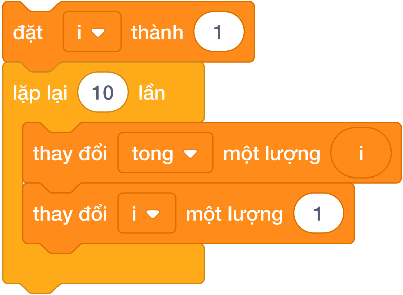

---

## 2. Kỹ Thuật Thiết Lập Biến Đếm 3 Bước Vàng

Trong Scratch, khối `lặp lại () lần` chỉ lặp lại hành động mà không tự động tăng một biến đếm nào cả. Do đó, để quản lý số thứ tự các lần lặp, chúng ta áp dụng **Quy tắc 3 bước vàng**:

1. **Bước 1 — Khởi tạo giá trị bắt đầu (Initialization):** Đặt ở bên ngoài, ngay trước khi bước vào vòng lặp.
   `đặt [i v] thành (1)`

2. **Bước 2 — Xác định số lần lặp:** Thả số vòng cần chạy vào ô tròn của khối `lặp lại () lần`.

3. **Bước 3 — Tăng biến đếm (Increment):** Đặt ở **dòng cuối cùng bên trong vòng lặp** để chuẩn bị giá trị mới cho vòng kế tiếp.
   `thay đổi [i v] một lượng (1)`

---

## 3. Các Mẫu Thuật Toán Tích Lũy Kinh Điển

### 3.1. Mẫu 1: Thuật toán Tính Tổng tích lũy ($S = 1 + 2 + \dots + N$)
- Khởi tạo biến tổng bằng 0: `đặt [tong v] thành (0)`.
- Trong mỗi vòng lặp, cộng dồn giá trị của `i` vào `tong`:
  `thay đổi [tong v] một lượng (i)`.

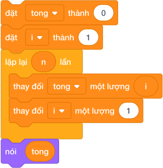

### 3.2. Mẫu 2: Thuật toán Tính Tích giai thừa ($N! = 1 \times 2 \times \dots \times N$)
- **BẮT BUỘC:** Khởi tạo biến tích lũy phép nhân bằng 1 (nếu khởi tạo bằng 0 thì mọi phép nhân đều bằng 0!).
- Trong mỗi vòng lặp, nhân dồn `i` vào biến `giai_thua`:
  `đặt [giai_thua v] thành ((giai_thua) * (i))`.

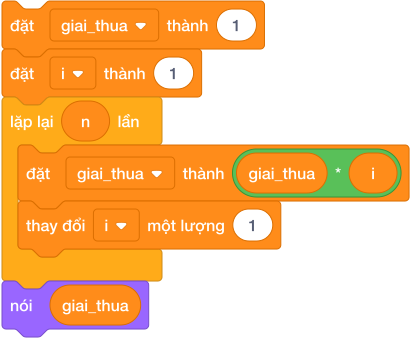

---

## 4. Bảng Mô Phỏng Từng Bước Tính Tổng $S = 1 + 2 + 3 + 4$ ($N = 4$) (Dry Run Table)

| Vòng lặp số | Khối lệnh thực thi trong thân lặp | Biến `i` trước lặp | Biến `tong` sau cộng | Biến `i` sau khi tăng | Ý nghĩa phép toán |
|:---:|---|:---:|:---:|:---:|---|
| *Khởi tạo* | `đặt [tong] thành 0`, `đặt [i] thành 1` | — | **$0$** | **$1$** | Chuẩn bị trước vòng lặp |
| **Vòng 1** | `thay đổi [tong] một lượng (i)` $\to$ `tăng i` | $1$ | $0 + 1 = \mathbf{1}$ | $1 + 1 = \mathbf{2}$ | Cộng số 1 vào tổng |
| **Vòng 2** | `thay đổi [tong] một lượng (i)` $\to$ `tăng i` | $2$ | $1 + 2 = \mathbf{3}$ | $2 + 1 = \mathbf{3}$ | Cộng số 2 vào tổng |
| **Vòng 3** | `thay đổi [tong] một lượng (i)` $\to$ `tăng i` | $3$ | $3 + 3 = \mathbf{6}$ | $3 + 1 = \mathbf{4}$ | Cộng số 3 vào tổng |
| **Vòng 4** | `thay đổi [tong] một lượng (i)` $\to$ `tăng i` | $4$ | $6 + 4 = \mathbf{10}$ | $4 + 1 = \mathbf{5}$ | Cộng số 4 vào tổng |
| *Sau lặp* | Thoát khỏi vòng lặp, hiển thị kết quả | $5$ | **$10$** | — | Chú Mèo nói: `10` |

---

## 5. Tử Huyệt & Các Bẫy Lỗi Kinh Điển (Bug Traps)

> **Bẫy 1: Quên khối `thay đổi [i v] một lượng (1)`**
> - *Hiện tượng:* Biến `i` mãi mãi nhận giá trị $1$.
> - *Hậu quả:* Máy tính tính tổng $1 + 1 + 1 + 1$ thay vì $1 + 2 + 3 + 4$, kết quả sai lệch hoàn toàn!
> - *Khắc phục:* Luôn luôn kiểm tra bước 3 ở đáy vòng lặp.

> **Bẫy 2: Kéo nhầm khối `đặt [tong v] thành 0` VÀO TRONG vòng lặp**
> - *Hiện tượng:* Đặt lệnh khởi tạo bên trong miệng chữ C.
> - *Hậu quả:* Cứ mỗi vòng lặp mới, biến tổng lại bị xóa sạch về 0. Kết thúc vòng lặp, tổng chỉ bằng giá trị của vòng lặp cuối cùng!
> - *Khắc phục:* Mọi lệnh khởi tạo biến ban đầu **BẮT BUỘC ĐẶT Ở BÊN NGOÀI**.

> **Bẫy 3: Khởi tạo biến tích bằng 0**
> - *Hiện tượng:* `đặt [tich v] thành 0`.
> - *Hậu quả:* Số 0 nhân với bất kỳ số nào cũng bằng 0.

---

## 6. Bộ Câu Hỏi Trắc Nghiệm Củng Cố (Concept Quizzes)

1. **Khối lệnh nào trong Scratch tương đương với vòng lặp biết trước số lần lặp?**
   - A. `lặp lại () lần` *(Đáp án đúng)*
   - B. `lặp lại liên tục`
   - C. `lặp lại cho đến khi <>`
   - D. `nếu <> thì`

2. **Để biến đếm `i` tăng dần sau mỗi vòng lặp, ta đặt khối lệnh nào ở cuối thân vòng lặp?**
   - A. `đặt [i v] thành (1)`
   - B. `thay đổi [i v] một lượng (1)` *(Đáp án đúng)*
   - C. `thay đổi [i v] một lượng (-1)`
   - D. `đặt [i v] thành (i)`

3. **Khi tính tổng tích lũy $S = 1 + 2 + \dots + N$, giá trị khởi tạo an toàn nhất cho biến `tong` trước khi vào vòng lặp là:**
   - A. 1
   - B. 0 *(Đáp án đúng)*
   - C. N
   - D. -1

4. **Khi tính tích lũy giai thừa $P = 1 \times 2 \times \dots \times N$, giá trị khởi tạo bắt buộc cho biến `tich` là:**
   - A. 0
   - B. 1 *(Đáp án đúng: vì nếu là 0 thì tích luôn bằng 0)*
   - C. 2
   - D. 10

5. **Nếu vòng lặp `lặp lại (5) lần` chạy xong, biến `i` bắt đầu từ 1 và mỗi vòng tăng 1, thì sau khi thoát khỏi vòng lặp, giá trị của `i` là:**
   - A. 4
   - B. 5
   - C. 6 *(Đáp án đúng: sau lần lặp thứ 5, i được tăng lên 6 rồi mới dừng)*
   - D. 0

6. **Đoạn lệnh: `đặt [tong v] thành 0`, lặp lại 3 lần `thay đổi [tong v] một lượng 5`. Kết quả của biến `tong` là:**
   - A. 5
   - B. 10
   - C. 15 *(Đáp án đúng: 5 * 3 = 15)*
   - D. 20

7. **Vị trí đúng của khối lệnh khởi tạo biến tích lũy ban đầu là ở đâu?**
   - A. Bên trong vòng lặp ở đầu thân lặp
   - B. Ngay phía trước khi bước vào vòng lặp *(Đáp án đúng)*
   - C. Ở cuối vòng lặp
   - D. Sau khi chương trình kết thúc

8. **Muốn lặp qua các số chẵn $2, 4, 6, 8, \dots$, ta khởi tạo `i = 2` và mỗi lần lặp thay đổi `i` một lượng:**
   - A. 1
   - B. 2 *(Đáp án đúng)*
   - C. 3
   - D. 4

9. **Nếu muốn đếm lùi từ 10 về 1, ta khởi tạo `i = 10` và sau mỗi lần lặp dùng khối:**
   - A. `thay đổi [i v] một lượng (1)`
   - B. `thay đổi [i v] một lượng (-1)` *(Đáp án đúng)*
   - C. `đặt [i v] thành (i - 1)`
   - D. Cả B và C đều đúng

10. **Khi cần đếm xem có bao nhiêu số chia hết cho 3 từ 1 đến N, mỗi khi gặp số thỏa mãn, ta dùng khối:**
    - A. `đặt [dem v] thành (1)`
    - B. `thay đổi [dem v] một lượng (1)` *(Đáp án đúng)*
    - C. `thay đổi [dem v] một lượng (3)`
    - D. `đặt [dem v] thành (dem + 3)`

## Bài tập lesson

# DANH SÁCH BÀI TẬP THỰC HÀNH: BÀI 07 — Vòng lặp for và hàm range

**Khóa học:** iKHEDU Scratch  
**Chuyên đề:** Chương 3: Cấu Trúc Rẽ Nhánh & Vòng Lặp  
> **Tổng số bài tập thực hành:** `14 bài` chuẩn hóa 100% (Từ kho bài tập `courses/scratch-bang-a/problems/`).  

---

## 1. Ma Trận Phân Tầng Bài Tập Toàn Diện

| STT | Mã bài toán | Tên bài tập | Phân tầng | Mức nhận thức | Thao tác trọng tâm |
|:---:|---|---|:---:|:---:|---|
| 1 | `sca_l07_p01_dem_sao_len_troi` | Đếm sao lên trời | **P0** | Khởi động & Quan sát | Nhập vào một số tự nhiên $N$. Hãy in các số từ $1$ đến $N$ t... |
| 2 | `sca_l07_p02_dem_nguoc_phong_ten_lua` | Đếm ngược phóng tên lửa | **P0** | Khởi động & Quan sát | Trước khi phóng tàu vũ trụ, đồng hồ đếm ngược từ $N$ về 1, c... |
| 3 | `sca_l07_p03_tong_cac_so_tu_nhien` | Tổng các số tự nhiên | **P0** | Khởi động & Quan sát | Nhập số nguyên dương $N$. Hãy tính tổng $S = 1 + 2 + 3 + \do... |
| 4 | `sca_l07_p04_bang_cuu_chuong` | Bảng cửu chương | **P1** | Cơ bản & Hoàn thành | Nhập vào một số nguyên $K$ ($1 \le K \le 9$). Hãy in ra bảng... |
| 5 | `sca_l07_p05_tong_so_chan_trong_doan` | Tổng số chẵn trong đoạn | **P1** | Cơ bản & Hoàn thành | Cho hai số nguyên dương $A$ và $B$ ($A \le B$). Hãy tính tổn... |
| 6 | `sca_l07_p06_dem_boi_so_cua_k` | Đếm bội số của K | **P1** | Cơ bản & Hoàn thành | Nhập vào 3 số tự nhiên $A, B, K$ ($A \le B$). Hãy đếm xem có... |
| 7 | `sca_l07_p07_tinh_giai_thua_n` | Tính giai thừa $N!$ | **P1** | Cơ bản & Hoàn thành | Nhập số tự nhiên $N$ ($1 \le N \le 20$). Hãy tính và in ra g... |
| 8 | `sca_l07_p08_day_so_cach_deu` | Dãy số cách đều | **P2** | Luyện tập & Vận dụng | Nhập vào số bắt đầu $a$, khoảng cách $d$ và số lượng phần tử... |
| 9 | `sca_l07_p09_tim_uoc_so_cua_n` | Tìm ước số của N | **P2** | Luyện tập & Vận dụng | Nhập vào số tự nhiên $N$. Hãy in ra tất cả các ước số dương ... |
| 10 | `sca_l07_p10_tong_binh_phuong` | Tổng bình phương | **P2** | Luyện tập & Vận dụng | Nhập vào số nguyên dương $N$. Hãy tính tổng:
 $$S = 1^2 + 2^... |
| 11 | `sca_l07_p11_doc_sach_moi_ngay` | Đọc sách mỗi ngày | **P3** | Vận dụng cao & Sáng tạo | Hỏi sau đúng bao nhiêu ngày thì Hoa sẽ đọc hết (hoặc vượt qu... |
| 12 | `sca_l07_p12_hang_cot_dau_sao` | Hàng cột dấu sao | **P3** | Vận dụng cao & Sáng tạo | Nhập vào số hàng $R$ và số cột $C$. Hãy in ra một hình chữ n... |
| 13 | `sca_l07_p13_tam_giac_vuong_dau_sao` | Tam giác vuông dấu sao | **P3** | Vận dụng cao & Sáng tạo | Nhập vào chiều cao $N$ của tam giác vuông. Hãy in ra tam giá... |
| 14 | `sca_l07_p14_tong_day_sieu_lon_khong_lap` | Tổng dãy siêu lớn không lặp | **P3** | Vận dụng cao & Sáng tạo | Hãy tính tổng $S = 1 + 2 + \dots + N$ với thời gian chạy tức... |

---

## 2. Chi Tiết Từng Bài Tập Thực Hành

### Bài 1 (P0): Đếm sao lên trời
* **Mã bài toán:** `sca_l07_p01_dem_sao_len_troi`
* **Độ khó & Phân tầng:** P0 (Khởi động & Quan sát)
* **Bối cảnh:** Đêm hè, người dùng ngước nhìn bầu trời đầy sao và bắt đầu đếm: 1, 2, 3... Hãy giúp in dãy số đếm sao từ 1 đến $N$.
* **Nhiệm vụ:** Nhập vào một số tự nhiên $N$. Hãy in các số từ $1$ đến $N$ trên cùng một dòng, mỗi số cách nhau một khoảng trắng.
* **Dữ liệu vào (Input):** Một số tự nhiên $N$ ($1 \le N \le 100$).
* **Kết quả ra (Output):** Dãy số từ 1 đến $N$.
* **Dữ liệu mẫu (Sample):**

### Input
```text
5
```
### Output
```text
1 2 3 4 5
```
### Giải thích

Với dữ liệu đầu vào là `5`, kết quả thu được tương ứng là `1 2 3 4 5`.

---

### Bài 2 (P0): Đếm ngược phóng tên lửa
* **Mã bài toán:** `sca_l07_p02_dem_nguoc_phong_ten_lua`
* **Độ khó & Phân tầng:** P0 (Khởi động & Quan sát)
* **Bối cảnh:** Trạm phóng tên lửa bắt đầu đếm ngược: 10, 9, 8... 1, PHONG! Hãy lập trình mô phỏng đếm ngược phóng tên lửa.
* **Nhiệm vụ:** Trước khi phóng tàu vũ trụ, đồng hồ đếm ngược từ $N$ về 1, cuối cùng in ra chữ `PHONG!`.
* **Dữ liệu vào (Input):** Một số tự nhiên $N$ ($1 \le N \le 20$).
* **Kết quả ra (Output):** Mỗi số trên một dòng, dòng cuối in `PHONG!`.
* **Dữ liệu mẫu (Sample):**

### Input
```text
3
```
### Output
```text
3
2
1
PHONG!
```
### Giải thích

Với dữ liệu đầu vào là `3`, kết quả thu được tương ứng là `3
2
1
PHONG!`.

---

### Bài 3 (P0): Tổng các số tự nhiên
* **Mã bài toán:** `sca_l07_p03_tong_cac_so_tu_nhien`
* **Độ khó & Phân tầng:** P0 (Khởi động & Quan sát)
* **Bối cảnh:** Nhà toán học Gauss khi còn đã tìm ra cách tính nhanh tổng các số từ 1 đến 100. Hãy viết chương trình tính tổng $1 + 2 + \dots + N$.
* **Nhiệm vụ:** Nhập số nguyên dương $N$. Hãy tính tổng $S = 1 + 2 + 3 + \dots + N$.
* **Dữ liệu vào (Input):** Một số tự nhiên $N$ ($1 \le N \le 10^5$).
* **Kết quả ra (Output):** Một số nguyên duy nhất là tổng $S$.
* **Dữ liệu mẫu (Sample):**

### Input
```text
4
```
### Output
```text
10
```
### Giải thích

$1 + 2 + 3 + 4 = 10$.

---

### Bài 4 (P1): Bảng cửu chương
* **Mã bài toán:** `sca_l07_p04_bang_cuu_chuong`
* **Độ khó & Phân tầng:** P1 (Cơ bản & Hoàn thành)
* **Bối cảnh:** Trong giờ Toán, cô giáo yêu cầu học sinh in bảng cửu chương của một số $K$ bất kỳ. Hãy viết chương trình in bảng nhân tự động.
* **Nhiệm vụ:** Nhập vào một số nguyên $K$ ($1 \le K \le 9$). Hãy in ra bảng cửu chương nhân của số $K$ từ 1 đến 10 theo đúng mẫu.
* **Dữ liệu vào (Input):** Một số nguyên $K$.
* **Kết quả ra (Output):** Gồm 10 dòng, mỗi dòng có định dạng: `K x i = [ket_qua]`.
* **Dữ liệu mẫu (Sample):**

### Input
```text
5
```
### Output
```text
5 x 1 = 5
5 x 2 = 10
5 x 3 = 15
5 x 4 = 20
5 x 5 = 25
5 x 6 = 30
5 x 7 = 35
5 x 8 = 40
5 x 9 = 45
5 x 10 = 50
```
### Giải thích

Với dữ liệu đầu vào là `5`, kết quả thu được tương ứng là `5 x 1 = 5
5 x 2 = 10
5 x 3 = 15
5 x 4 = 20
5 x 5 = 25
5 x 6 = 30
5 x 7 = 35
5 x 8 = 40
5 x 9 = 45
5 x 10 = 50`.

---

### Bài 5 (P1): Tổng số chẵn trong đoạn
* **Mã bài toán:** `sca_l07_p05_tong_so_chan_trong_doan`
* **Độ khó & Phân tầng:** P1 (Cơ bản & Hoàn thành)
* **Bối cảnh:** Thí sinh muốn tính tổng tất cả các số chẵn nằm trong đoạn từ $A$ đến $B$. Hãy giúp bạn ấy viết chương trình tính nhanh.
* **Nhiệm vụ:** Cho hai số nguyên dương $A$ và $B$ ($A \le B$). Hãy tính tổng tất cả các số chẵn nằm trong đoạn từ $A$ đến $B$ (tính cả $A$ và $B$ nếu chúng là số chẵn).
* **Dữ liệu vào (Input):** Hai số tự nhiên $A$ và $B$ trên 2 dòng ($1 \le A \le B \le 10^4$).
* **Kết quả ra (Output):** Tổng các số chẵn.
* **Dữ liệu mẫu (Sample):**

### Input
```text
3
8
```
### Output
```text
18
```
### Giải thích

Các số chẵn là: 4, 6, 8. Tổng: $4 + 6 + 8 = 18$.

---

### Bài 6 (P1): Đếm bội số của K
* **Mã bài toán:** `sca_l07_p06_dem_boi_so_cua_k`
* **Độ khó & Phân tầng:** P1 (Cơ bản & Hoàn thành)
* **Bối cảnh:** Cô giáo hỏi: "Trong đoạn từ $A$ đến $B$, có bao nhiêu số chia hết cho $K$?". Hãy viết chương trình đếm nhanh.
* **Nhiệm vụ:** Nhập vào 3 số tự nhiên $A, B, K$ ($A \le B$). Hãy đếm xem có bao nhiêu số trong đoạn $[A, B]$ chia hết cho $K$.
* **Dữ liệu vào (Input):** Ba số $A, B, K$ trên 3 dòng ($1 \le A \le B \le 10^5, 1 \le K \le 100$).
* **Kết quả ra (Output):** Số lượng số chia hết cho $K$.
* **Dữ liệu mẫu (Sample):**

### Input
```text
1
10
3
```
### Output
```text
3
```
### Giải thích

Gồm các số: 3, 6, 9. Tổng cộng 3 số.

---

### Bài 7 (P1): Tính giai thừa $N!$
* **Mã bài toán:** `sca_l07_p07_tinh_giai_thua_n`
* **Độ khó & Phân tầng:** P1 (Cơ bản & Hoàn thành)
* **Bối cảnh:** Cuối tuần, bạn Tý mở một gian hàng kẹo nhỏ trước cổng trường. Tý xếp kẹo thành từng hàng vui nhộn: hàng có số tự nhiên $N$ thì Tý nhân tất cả các số tự nhiên từ 1 đến $N$ với nhau. Cách nhân dồn này được gọi là giai thừa, ký hiệu là $N!$, và được tính bằng công thức:
 $$N! = 1 \times 2 \times 3 \times \dots \times N$$
Hôm nay khách đông quá, Tý tính không kịp. Hãy giúp Tý tính nhanh giá trị $N!$.
* **Nhiệm vụ:** Nhập số tự nhiên $N$ ($1 \le N \le 20$). Hãy tính và in ra giá trị $N!$.
* **Dữ liệu vào (Input):** Một số tự nhiên $N$.
* **Kết quả ra (Output):** Giá trị $N!$.
* **Dữ liệu mẫu (Sample):**

### Input
```text
5
```
### Output
```text
120
```
### Giải thích

$1 \times 2 \times 3 \times 4 \times 5 = 120$.

---

### Bài 8 (P2): Dãy số cách đều
* **Mã bài toán:** `sca_l07_p08_day_so_cach_deu`
* **Độ khó & Phân tầng:** P2 (Luyện tập & Vận dụng)
* **Bối cảnh:** Lớp bạn Na chơi trò nhảy ô số rất vui trên sân trường. Cả lớp thống nhất chọn số bắt đầu là số $a$, rồi mỗi bước nhảy phải dài đúng $d$ đơn vị, nghĩa là số tiếp theo hơn số đứng trước nó đúng $d$ đơn vị. Các bạn xếp thành một hàng dài và đọc to từng số mình nhảy tới. Na đếm mãi mà quên mất, hãy Na viết tiếp dãy số này.
* **Nhiệm vụ:** Nhập vào số bắt đầu $a$, khoảng cách $d$ và số lượng phần tử cần in $n$. Hãy in ra $n$ số đầu tiên của dãy trên một dòng, cách nhau dấu cách.
* **Dữ liệu vào (Input):** Ba số tự nhiên $a, d, n$ ($1 \le a, d, n \le 100$).
* **Kết quả ra (Output):** Dãy số gồm $n$ phần tử.
* **Dữ liệu mẫu (Sample):**

### Input
```text
2
3
5
```
### Output
```text
2 5 8 11 14
```
### Giải thích

Với dữ liệu đầu vào là `2
3
5`, kết quả thu được tương ứng là `2 5 8 11 14`.

---

### Bài 9 (P2): Tìm ước số của N
* **Mã bài toán:** `sca_l07_p09_tim_uoc_so_cua_n`
* **Độ khó & Phân tầng:** P2 (Luyện tập & Vận dụng)
* **Bối cảnh:** Thí sinh đang học về ước số trong giờ Toán. Hãy viết chương trình liệt kê tất cả các ước số của một số $N$ cho trước.
* **Nhiệm vụ:** Nhập vào số tự nhiên $N$. Hãy in ra tất cả các ước số dương của $N$ theo thứ tự tăng dần trên một dòng.
* **Dữ liệu vào (Input):** Một số tự nhiên $N$ ($1 \le N \le 10^4$).
* **Kết quả ra (Output):** Các ước số của $N$ cách nhau một dấu cách.
* **Dữ liệu mẫu (Sample):**

### Input
```text
12
```
### Output
```text
1 2 3 4 6 12
```
### Giải thích

Với dữ liệu đầu vào là `12`, kết quả thu được tương ứng là `1 2 3 4 6 12`.

---

### Bài 10 (P2): Tổng bình phương
* **Mã bài toán:** `sca_l07_p10_tong_binh_phuong`
* **Độ khó & Phân tầng:** P2 (Luyện tập & Vận dụng)
* **Bối cảnh:** Nhà toán học muốn tính tổng bình phương của các số từ 1 đến $N$: $1^2 + 2^2 + 3^2 + \dots + N^2$. Hãy viết chương trình tính.
* **Nhiệm vụ:** Nhập vào số nguyên dương $N$. Hãy tính tổng:
 $$S = 1^2 + 2^2 + 3^2 + \dots + N^2$$
* **Dữ liệu vào (Input):** Một số tự nhiên $N$ ($1 \le N \le 1000$).
* **Kết quả ra (Output):** Một số nguyên duy nhất là tổng $S$.
* **Dữ liệu mẫu (Sample):**

### Input
```text
3
```
### Output
```text
14
```
### Giải thích

$1^2 + 2^2 + 3^2 = 1 + 4 + 9 = 14$.

---

### Bài 11 (P3): Đọc sách mỗi ngày
* **Mã bài toán:** `sca_l07_p11_doc_sach_moi_ngay`
* **Độ khó & Phân tầng:** P3 (Vận dụng cao & Sáng tạo)
* **Bối cảnh:** Nghỉ hè, bạn Hoa mượn ở thư viện một cuốn truyện thật dày có tổng cộng $N$ trang để rèn thói quen đọc sách mỗi ngày. Ngày thứ nhất Hoa đọc được 1 trang thật ngon lành.
 * Ngày thứ hai Hoa đọc được 2 trang.
 * Ngày thứ ba Hoa đọc được 3 trang.
 * Cứ như vậy, ngày thứ $k$ Hoa đọc được $k$ trang.
Hoa háo hức muốn biết mình đọc hết truyện sau mấy ngày. Hãy đếm số ngày.
* **Nhiệm vụ:** Hỏi sau đúng bao nhiêu ngày thì Hoa sẽ đọc hết (hoặc vượt quá) $N$ trang của cuốn sách?
* **Dữ liệu vào (Input):** Một số tự nhiên $N$ ($1 \le N \le 10^4$).
* **Kết quả ra (Output):** Số ngày ít nhất để Hoa đọc xong cuốn sách.
* **Dữ liệu mẫu (Sample):**

### Input
```text
10
```
### Output
```text
4
```
### Giải thích

Ngày 1: 1 trang; ngày 2: 2 trang (tổng 3); ngày 3: 3 trang (tổng 6); ngày 4: 4 trang (tổng 10 $\ge 10$). Sau 4 ngày đọc xong.

---

### Bài 12 (P3): Hàng cột dấu sao
* **Mã bài toán:** `sca_l07_p12_hang_cot_dau_sao`
* **Độ khó & Phân tầng:** P3 (Vận dụng cao & Sáng tạo)
* **Bối cảnh:** Trong giờ tin học, thầy giáo yêu cầu vẽ một hình chữ nhật bằng dấu sao `*`. Hãy viết chương trình vẽ hình.
* **Nhiệm vụ:** Nhập vào số hàng $R$ và số cột $C$. Hãy in ra một hình chữ nhật đặc gồm các dấu sao `*` có kích thước $R$ hàng và $C$ cột.
* **Dữ liệu vào (Input):** Hai số tự nhiên $R$ và $C$ ($1 \le R, C \le 50$).
* **Kết quả ra (Output):** Hình chữ nhật dấu `*`.
* **Dữ liệu mẫu (Sample):**

### Input
```text
3
5
```
### Output
```text
*****
*****
*****
```
### Giải thích

Với dữ liệu đầu vào là `3
5`, kết quả thu được tương ứng là `*****
*****
*****`.

---

### Bài 13 (P3): Tam giác vuông dấu sao
* **Mã bài toán:** `sca_l07_p13_tam_giac_vuong_dau_sao`
* **Độ khó & Phân tầng:** P3 (Vận dụng cao & Sáng tạo)
* **Bối cảnh:** Thí sinh muốn vẽ một tam giác vuông bằng dấu sao, mỗi hàng tăng thêm một ngôi sao. Hãy giúp bạn ấy.
* **Nhiệm vụ:** Nhập vào chiều cao $N$ của tam giác vuông. Hãy in ra tam giác vuông cân gồm các dấu sao theo mẫu:

 * Dòng 1 có 1 dấu `*`
 * Dòng 2 có 2 dấu `*`
 * ...
 * Dòng $N$ có $N$ dấu `*`.
* **Dữ liệu vào (Input):** Một số tự nhiên $N$ ($1 \le N \le 50$).
* **Kết quả ra (Output):** Tam giác vuông dấu `*`.
* **Dữ liệu mẫu (Sample):**

### Input
```text
4
```
### Output
```text
*
**
***
****
```
### Giải thích

Với dữ liệu đầu vào là `4`, kết quả thu được tương ứng là `*
**
***
****`.

---

### Bài 14 (P3): Tổng dãy siêu lớn không lặp
* **Mã bài toán:** `sca_l07_p14_tong_day_sieu_lon_khong_lap`
* **Độ khó & Phân tầng:** P3 (Vận dụng cao & Sáng tạo)
* **Bối cảnh:** Trong hội thi lập trình của trường, ban giám khảo đố cả lớp một số $N$ cực lớn lên tới $10^9$ ($1$ tỷ) bạn nào cũng tròn mắt ngạc nhiên. Cô giáo dặn rằng nếu em dùng vòng lặp `for i in range(1, N + 1):` thì chương trình sẽ bị chạy quá thời gian quy định (Time Limit Exceeded - TLE) vì máy tính phải lặp 1 tỷ lần mất hơn 10 giây! Cả lớp đang loay hoay chưa biết làm sao cho nhanh. Hãy giúp cả lớp tìm cách tính thật nhanh.
* **Nhiệm vụ:** Hãy tính tổng $S = 1 + 2 + \dots + N$ với thời gian chạy tức thì ($< 0.001$ giây) bằng công thức toán học.
* **Dữ liệu vào (Input):** Một số nguyên $N$ ($1 \le N \le 10^9$).
* **Kết quả ra (Output):** Giá trị tổng $S$.
* **Dữ liệu mẫu (Sample):**

### Input
```text
1000000000
```
### Output
```text
500000000500000000
```
### Giải thích

Với dữ liệu đầu vào là `1000000000`, kết quả thu được tương ứng là `500000000500000000`.

---

--------------------------------------------------------------------------------
<!-- Bài 08: Vòng lặp while và biến cờ -->
--------------------------------------------------------------------------------

## Lý thuyết và Concept Quiz

# Bài 08: Vòng lặp while và biến cờ

## 1. Bản Chất Vòng Lặp Khi Chưa Biết Trước Số Lần Lặp

Trong nhiều bài toán thực tế, ta **không thể biết trước được công việc cần lặp lại chính xác bao nhiêu lần**:

- *Ví dụ 1:* Bác thợ mộc cưa một khúc gỗ dài $N$ mét cho đến khi độ dài còn lại nhỏ hơn $1$ mét.
- *Ví dụ 2:* Nhập mật khẩu từ bàn phím cho đến khi người dùng nhập đúng thì thôi.
- *Ví dụ 3:* Bóc tách các chữ số của số nguyên $N$ cho đến khi số $N$ giảm về $0$.

Khi số lần lặp phụ thuộc vào một điều kiện động, khối lệnh chuẩn mực nhất trong Scratch là **`lặp lại cho đến khi <điều_kiện>`** (trong nhóm **Điều khiển** màu cam).


---

## 2. Bẫy Ngược Logic Của Khối `lặp lại cho đến khi`

| Khối lệnh | Cơ chế kiểm tra điều kiện | Ý nghĩa hành động |
|:---:|---|---|
| `lặp lại cho đến khi <điều_kiện>` | **LẶP KHI ĐIỀU KIỆN SAI** | Điều kiện còn Sai thì còn lặp tiếp; **khi điều kiện trở thành ĐÚNG THÌ DỪNG LẠI NGAY**! |

> **BÍ QUYẾT XÁC ĐỊNH ĐIỀU KIỆN DỪNG:**
> - Hãy tự hỏi: *"Khi nào thì kịch bản này PHẢI DỪNG LẠI?"*
> - Ví dụ: Muốn trừ dần $N$ cho đến khi $N$ bằng 0 thì dừng $\implies$ Điều kiện đặt vào khối là `< (N) = (0) >`.
> - Nếu đặt nhầm điều kiện còn chạy (như `< (N) > (0) >`), chương trình sẽ dừng ngay từ bước đầu tiên và không lặp lần nào!

---

## 3. Các Mẫu Thuật Toán Vòng Lặp Điều Kiện Kinh Điển

### 3.1. Mẫu 1: Thuật toán Dãy số Collatz ($3n + 1$)
Bài toán: Cho số nguyên dương $N$. Nếu $N$ chẵn thì chia đôi $N = N / 2$; nếu $N$ lẻ thì biến đổi thành $N = 3N + 1$. Lặp lại quá trình này cho đến khi $N$ giảm về $1$.

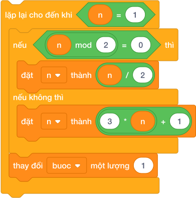

### 3.2. Mẫu 2: Kỹ thuật Biến Cờ Dừng (Sentinel Flag)
Bài toán: Kiểm tra xem số $N$ có phải là số chính phương hay không ($N = i \times i$).
- Khởi tạo biến cờ: `đặt [tim_thay v] thành 0`.
- Cho `i` chạy từ 1, lặp lại cho đến khi **đã tìm thấy cờ** HOẶC **$i > N$**:

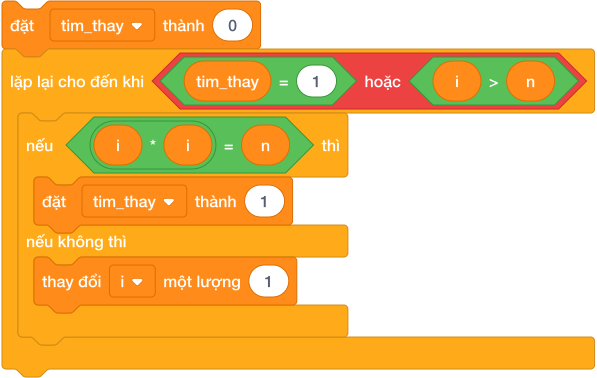

---

## 4. Bảng Mô Phỏng Biến Đổi Collatz Với $N = 6$ (Dry Run Table)

| Vòng lặp | Giá trị $N$ hiện tại | Kiểm tra điều kiện dừng `< N = 1 >` | Kiểm tra chẵn/lẻ | Phép tính thực thi | Giá trị $N$ mới |
|:---:|:---:|:---:|:---:|---|:---:|
| *Bắt đầu* | **$6$** | $6 = 1$ $\to$ **SAI** (Lặp tiếp) | $6$ chẵn | $6 / 2 = \mathbf{3}$ | $3$ |
| **Vòng 1** | **$3$** | $3 = 1$ $\to$ **SAI** (Lặp tiếp) | $3$ lẻ | $3 \times 3 + 1 = \mathbf{10}$ | $10$ |
| **Vòng 2** | **$10$** | $10 = 1$ $\to$ **SAI** (Lặp tiếp) | $10$ chẵn | $10 / 2 = \mathbf{5}$ | $5$ |
| **Vòng 3** | **$5$** | $5 = 1$ $\to$ **SAI** (Lặp tiếp) | $5$ lẻ | $5 \times 3 + 1 = \mathbf{16}$ | $16$ |
| **Vòng 4** | **$16$** | $16 = 1$ $\to$ **SAI** (Lặp tiếp) | $16$ chẵn | $16 / 2 = \mathbf{8}$ | $8$ |
| **Vòng 5** | **$8$** | $8 = 1$ $\to$ **SAI** (Lặp tiếp) | $8$ chẵn | $8 / 2 = \mathbf{4}$ | $4$ |
| **Vòng 6** | **$4$** | $4 = 1$ $\to$ **SAI** (Lặp tiếp) | $4$ chẵn | $4 / 2 = \mathbf{2}$ | $2$ |
| **Vòng 7** | **$2$** | $2 = 1$ $\to$ **SAI** (Lặp tiếp) | $2$ chẵn | $2 / 2 = \mathbf{1}$ | $1$ |
| **Vòng 8** | **$1$** | $1 = 1$ $\to$ **ĐÚNG** (DỪNG NGAY) | — | Thoát vòng lặp | **$1$** |

$\implies$ Sau đúng 8 bước lặp, số $N$ chạm về 1 và vòng lặp kết thúc hoàn toàn.

---

## 5. Tử Huyệt & Các Bẫy Lỗi Kinh Điển (Bug Traps)

> **Bẫy 1: Treo đơ chương trình do Vòng lặp vô tận (Infinite Loop)**
> - *Hiện tượng:* Bên trong vòng lặp không có bất kỳ câu lệnh nào làm thay đổi điều kiện dừng.
> - *Hậu quả:* Điều kiện dừng mãi mãi là SAI, máy tính lặp đi lặp lại không có điểm dừng, trình duyệt bị treo cứng!
> - *Khắc phục:* Luôn đảm bảo có khối làm biến số tiến dần về phía điều kiện dừng.

> **Bẫy 2: Viết nhầm điều kiện dừng thành điều kiện chạy**
> - *Sai lầm:* Muốn lặp khi $N > 0$ nhưng lại viết `lặp lại cho đến khi < N > 0 >`.
> - *Hậu quả:* Ngay tại bước đầu tiên, vì $N$ đang lớn hơn 0 nên điều kiện trả về ĐÚNG, máy tính **không chạy vòng lặp lấy một lần nào**!

---

## 6. Bộ Câu Hỏi Trắc Nghiệm Củng Cố (Concept Quizzes)

1. **Khối lệnh `lặp lại cho đến khi <>` sẽ dừng lại khi điều kiện lục giác bên trong trả về:**
   - A. Đúng (True) *(Đáp án đúng: gặp Đúng thì Dừng)*
   - B. Sai (False)
   - C. Bằng 0
   - D. Bằng 1

2. **Muốn thực hiện lặp khi biến $N$ còn lớn hơn 0, điều kiện trong khối `lặp lại cho đến khi` của Scratch phải là:**
   - A. `< (N) > (0) >`
   - B. `< (N) <= (0) >` hoặc `< (N) = (0) >` *(Đáp án đúng: phủ định của N > 0)*
   - C. `< (N) > (1) >`
   - D. `< không phải < (N) = (0) > >`

3. **Hiện tượng "Treo vòng lặp vô tận" xảy ra khi nào?**
   - A. Điều kiện dừng không bao giờ đạt được giá trị Đúng *(Đáp án đúng)*
   - B. Số lần lặp vượt quá 100 lần
   - C. Khởi tạo biến quá lớn
   - D. Dùng lệnh nói bên trong vòng lặp

4. **Kỹ thuật "Biến cờ dừng" thường được khởi tạo giá trị ban đầu là bao nhiêu để báo hiệu chưa tìm thấy?**
   - A. 0 *(Đáp án đúng)*
   - B. 1
   - C. 100
   - D. -1

5. **Trong thuật toán Collatz, quá trình biến đổi sẽ dừng lại khi số $N$ bằng mấy?**
   - A. 0
   - B. 1 *(Đáp án đúng)*
   - C. 2
   - D. 3

6. **Đoạn lệnh: `đặt [x v] thành 10`, `lặp lại cho đến khi < x = 0 > { thay đổi [x] một lượng (-2) }`. Số lần lặp được thực thi là:**
   - A. 4 lần
   - B. 5 lần *(Đáp án đúng: 10 -> 8 -> 6 -> 4 -> 2 -> 0)*
   - C. 10 lần
   - D. Vô tận

7. **Nếu viết `đặt [x v] thành 5`, `lặp lại cho đến khi < x > 0 > { thay đổi [x] một lượng (1) }`, điều gì sẽ xảy ra?**
   - A. Vòng lặp chạy 5 lần
   - B. Vòng lặp chạy vô tận
   - C. Vòng lặp không chạy lần nào cả *(Đáp án đúng: vì x = 5 > 0 ngay từ đầu)*
   - D. Báo lỗi

8. **Để đếm xem một số nguyên $N$ có bao nhiêu chữ số, mỗi lần lặp ta giảm $N$ đi 10 lần và dừng khi:**
   - A. `< (N) = (0) >` *(Đáp án đúng)*
   - B. `< (N) > (0) >`
   - C. `< (N) = (1) >`
   - D. `< (N) < (0) >`

9. **Khi kiểm tra một số có phải nguyên tố không, nếu phát hiện một ước số thì ta nên:**
   - A. Tiếp tục chạy hết vòng lặp
   - B. Bật biến cờ lên 0 và dừng sớm vòng lặp *(Đáp án đúng)*
   - C. Xóa biến
   - D. Báo lỗi

10. **Sự khác biệt cơ bản nhất giữa `lặp lại () lần` và `lặp lại cho đến khi <>` là:**
    - A. Một bên biết trước số lần lặp, một bên dừng theo điều kiện động *(Đáp án đúng)*
    - B. Một bên dùng số, một bên dùng chữ
    - C. Một bên chạy nhanh hơn
    - D. Không có sự khác biệt

## Bài tập lesson

# DANH SÁCH BÀI TẬP THỰC HÀNH: BÀI 08 — Vòng lặp while và biến cờ

**Khóa học:** iKHEDU Scratch  
**Chuyên đề:** Chương 3: Cấu Trúc Rẽ Nhánh & Vòng Lặp  
> **Tổng số bài tập thực hành:** `12 bài` chuẩn hóa 100% (Từ kho bài tập `courses/scratch-bang-a/problems/`).  

---

## 1. Ma Trận Phân Tầng Bài Tập Toàn Diện

| STT | Mã bài toán | Tên bài tập | Phân tầng | Mức nhận thức | Thao tác trọng tâm |
|:---:|---|---|:---:|:---:|---|
| 1 | `sca_l08_p01_dem_xuoi_bang_while` | Đếm xuôi bằng while | **P0** | Khởi động & Quan sát | Nhập vào số tự nhiên $N$. Dùng vòng lặp `while`, hãy in ra c... |
| 2 | `sca_l08_p02_rut_tham_den_khi_trung` | Rút thăm đến khi trúng | **P0** | Khởi động & Quan sát | Nhập liên tục các số nguyên từ bàn phím cho đến khi gặp số 7... |
| 3 | `sca_l08_p03_nhap_so_den_khi_gap_so_0` | Nhập số đến khi gặp số 0 | **P0** | Khởi động & Quan sát | Viết chương trình nhập liên tiếp các số nguyên từ bàn phím. ... |
| 4 | `sca_l08_p04_tong_day_so_ket_thuc_bang_0` | Tổng dãy số kết thúc bằng 0 | **P1** | Cơ bản & Hoàn thành | Nhập liên tục các số nguyên từ bàn phím cho đến khi gặp số 0... |
| 5 | `sca_l08_p05_dem_so_chan_den_khi_gap_0` | Đếm số chẵn đến khi gặp 0 | **P1** | Cơ bản & Hoàn thành | Nhập liên tiếp các số nguyên từ bàn phím cho đến khi nhập số... |
| 6 | `sca_l08_p06_gap_doi_to_giay_len_mat_trang` | Gấp đôi tờ giấy lên mặt trăng | **P1** | Cơ bản & Hoàn thành | Hỏi cần phải gấp đôi tờ giấy ít nhất bao nhiêu lần để độ dày... |
| 7 | `sca_l08_p07_ong_heo_mua_xe_may` | Ống heo mua xe máy | **P2** | Luyện tập & Vận dụng | Hỏi sau bao nhiêu ngày thì tổng số tiền trong ống heo của bá... |
| 8 | `sca_l08_p08_tim_luy_thua_cua_2_lon_hon_n` | Tìm lũy thừa của 2 lớn hơn N | **P2** | Luyện tập & Vận dụng | Nhập vào số tự nhiên $N$. Hãy tìm số có dạng lũy thừa của 2 ... |
| 9 | `sca_l08_p09_chu_oc_sen_leo_cot_co` | Chú ốc sên leo cột cờ | **P2** | Luyện tập & Vận dụng | Hỏi chú ốc sên mất bao nhiêu ngày để leo lên tới đỉnh cột cờ... |
| 10 | `sca_l08_p10_dem_so_luong_chu_so_cua_n` | Đếm số lượng chữ số của N | **P3** | Vận dụng cao & Sáng tạo | Nhập vào một số nguyên dương $N$. Dùng vòng lặp `while` và p... |
| 11 | `sca_l08_p11_tro_choi_doan_so_nhi_phan` | Trò chơi đoán số nhị phân | **P3** | Vận dụng cao & Sáng tạo | Hỏi trong trường hợp xấu nhất, Bình phải đoán **nhiều nhất b... |
| 12 | `sca_l08_p12_day_so_collatz_3n_1` | Dãy số Collatz (3n + 1) | **P3** | Vận dụng cao & Sáng tạo | Nhập vào số tự nhiên $N$. Hãy in ra số bước biến đổi để $N$ ... |

---

## 2. Chi Tiết Từng Bài Tập Thực Hành

### Bài 1 (P0): Đếm xuôi bằng while
* **Mã bài toán:** `sca_l08_p01_dem_xuoi_bang_while`
* **Độ khó & Phân tầng:** P0 (Khởi động & Quan sát)
* **Bối cảnh:** Bạn robot đang tập đếm số từ 1 đến $N$ bằng vòng lặp `while`. Hãy giúp robot hoàn thành nhiệm vụ.
* **Nhiệm vụ:** Nhập vào số tự nhiên $N$. Dùng vòng lặp `while`, hãy in ra các số từ $1$ đến $N$ trên một dòng.
* **Dữ liệu vào (Input):** Một số tự nhiên $N$ ($1 \le N \le 100$).
* **Kết quả ra (Output):** Dãy số từ 1 đến $N$.
 ```text
 N = int(câu trả lời)
 i = 1
 while i <= N:
 print(i, end=" ")
 i = i + 1
 ```
* **Dữ liệu mẫu (Sample):**

### Input
```text
5
```
### Output
```text
1 2 3 4 5
```
### Giải thích
In các số từ 1 đến 5 trên một dòng cách nhau khoảng trắng.

---

### Bài 2 (P0): Rút thăm đến khi trúng
* **Mã bài toán:** `sca_l08_p02_rut_tham_den_khi_trung`
* **Độ khó & Phân tầng:** P0 (Khởi động & Quan sát)
* **Bối cảnh:** Giờ ra chơi, Bo tổ chức trò bốc thăm trúng thưởng cho cả lớp thật rộn ràng. Bo bỏ vào hộp thật nhiều lá phiếu có ghi số, rồi bốc lên từng lá một. Cả lớp reo hò vì ai cũng mong chờ, và Bo sẽ dừng lại ngay khi bốc trúng lá phiếu ghi số **7**. Trò chơi vui quá nên ai cũng muốn biết kết quả. Hãy giúp Bo công bố kết quả bốc thăm.
* **Nhiệm vụ:** Nhập liên tục các số nguyên từ bàn phím cho đến khi gặp số 7 thì dừng lại. Hãy in ra dòng chữ: `DA TRUNG THUONG!`
* **Dữ liệu vào (Input):** Một dãy các số nguyên, mỗi số trên một dòng, số cuối cùng chắc chắn là số 7.
* **Kết quả ra (Output):** In `DA TRUNG THUONG!` sau khi vòng lặp dừng.
* **Dữ liệu mẫu (Sample):**

### Input
```text
10
25
7
```
### Output
```text
DA TRUNG THUONG!
```
### Giải thích
Sau khi nhập hai số 10 và 25, số thứ ba nhập vào là 7 nên vòng lặp dừng và in ra thông báo `DA TRUNG THUONG!`.

---

### Bài 3 (P0): Nhập số đến khi gặp số 0
* **Mã bài toán:** `sca_l08_p03_nhap_so_den_khi_gap_so_0`
* **Độ khó & Phân tầng:** P0 (Khởi động & Quan sát)
* **Bối cảnh:** Trò chơi nhập số: Người chơi nhập liên tục các số, chương trình đếm tổng số lượng số đã nhập cho đến khi gặp số 0 thì dừng lại.
* **Nhiệm vụ:** Viết chương trình nhập liên tiếp các số nguyên từ bàn phím. Việc nhập kết thúc khi người dùng nhập số 0. Hãy đếm xem người dùng đã nhập **bao nhiêu số** (không tính số 0 cuối cùng).
* **Dữ liệu vào (Input):** Một dãy các số nguyên, kết thúc bằng số 0.
* **Kết quả ra (Output):** Một số nguyên duy nhất là số lượng các số đã nhập trước số 0.
* **Dữ liệu mẫu (Sample):**

### Input
```text
5
12
8
0
```
### Output
```text
3
```
### Giải thích

Có 3 số: 5, 12, 8 đã được nhập trước khi gặp 0.

---

### Bài 4 (P1): Tổng dãy số kết thúc bằng 0
* **Mã bài toán:** `sca_l08_p04_tong_day_so_ket_thuc_bang_0`
* **Độ khó & Phân tầng:** P1 (Cơ bản & Hoàn thành)
* **Bối cảnh:** Thí sinh nhập liên tiếp các số nguyên. Khi nhập số 0, chương trình dừng lại và in ra tổng tất cả các số đã nhập trước đó.
* **Nhiệm vụ:** Nhập liên tục các số nguyên từ bàn phím cho đến khi gặp số 0. Hãy tính và in ra **tổng của tất cả các số** đã nhập.
* **Dữ liệu vào (Input):** Một dãy số nguyên kết thúc bằng 0.
* **Kết quả ra (Output):** Tổng các số.
* **Dữ liệu mẫu (Sample):**

### Input
```text
10
20
5
0
```
### Output
```text
35
```
### Giải thích

$10 + 20 + 5 = 35$.

---

### Bài 5 (P1): Đếm số chẵn đến khi gặp 0
* **Mã bài toán:** `sca_l08_p05_dem_so_chan_den_khi_gap_0`
* **Độ khó & Phân tầng:** P1 (Cơ bản & Hoàn thành)
* **Bối cảnh:** Trong trò chơi đếm số, người dùng nhập các số liên tục. Chương trình đếm xem có bao nhiêu số chẵn đã được nhập, cho đến khi gặp số 0 thì dừng.
* **Nhiệm vụ:** Nhập liên tiếp các số nguyên từ bàn phím cho đến khi nhập số 0. Hãy đếm xem có bao nhiêu số chẵn trong các số đã nhập (không tính số 0).
* **Dữ liệu vào (Input):** Dãy số nguyên kết thúc bằng 0.
* **Kết quả ra (Output):** Số lượng số chẵn.
* **Dữ liệu mẫu (Sample):**

### Input
```text
4
7
8
12
0
```
### Output
```text
3
```
### Giải thích

Có 3 số chẵn là 4, 8, 12.

---

### Bài 6 (P1): Gấp đôi tờ giấy lên mặt trăng
* **Mã bài toán:** `sca_l08_p06_gap_doi_to_giay_len_mat_trang`
* **Độ khó & Phân tầng:** P1 (Cơ bản & Hoàn thành)
* **Bối cảnh:** Trong giờ thủ công, bạn Mít lấy ra một tờ giấy siêu mỏng ban đầu có độ dày là $1\text{ mm}$ để làm thí nghiệm vui. Mít gấp đôi tờ giấy lại, và lạ chưa: cứ mỗi lần gấp đôi tờ giấy lại, độ dày của nó lại tăng gấp đôi ($2\text{ mm}, 4\text{ mm}, 8\text{ mm}, \dots$). Mít mơ ước chồng giấy của mình sẽ cao chạm tới mặt trăng. Hãy giúp Mít đếm số lần gấp.
* **Nhiệm vụ:** Hỏi cần phải gấp đôi tờ giấy ít nhất bao nhiêu lần để độ dày của nó đạt hoặc vượt quá độ cao $H\text{ mm}$?
* **Dữ liệu vào (Input):** Một số tự nhiên $H$ ($1 \le H \le 10^9$).
* **Kết quả ra (Output):** Số lần gấp đôi tối thiểu.
* **Dữ liệu mẫu (Sample):**

### Input
```text
10
```
### Output
```text
4
```
### Giải thích

Lần 1: 2mm, lần 2: 4mm, lần 3: 8mm, lần 4: 16mm ($\ge 10$). Cần 4 lần.

---

### Bài 7 (P2): Ống heo mua xe máy
* **Mã bài toán:** `sca_l08_p07_ong_heo_mua_xe_may`
* **Độ khó & Phân tầng:** P2 (Luyện tập & Vận dụng)
* **Bối cảnh:** Bác Nam có một chú heo đất thật xinh đặt ở góc nhà. Bác muốn tiết kiệm tiền để mua một chiếc xe máy có giá $P$ nghìn đồng cho cả gia đình đi chơi.
 * Ngày thứ nhất bác bỏ vào ống heo 1 nghìn đồng.
 * Ngày thứ hai bác bỏ vào 2 nghìn đồng.
 * Ngày thứ $k$ bác bỏ vào đúng $k$ nghìn đồng.
Mỗi tối bác đều lắc heo nghe kêu leng keng rất vui. Hãy giúp bác Nam đếm xem sau mấy ngày thì đủ tiền.
* **Nhiệm vụ:** Hỏi sau bao nhiêu ngày thì tổng số tiền trong ống heo của bác Nam đạt hoặc vượt quá $P$ nghìn đồng?
* **Dữ liệu vào (Input):** Một số tự nhiên $P$ ($1 \le P \le 10^7$).
* **Kết quả ra (Output):** Số ngày ít nhất.
* **Dữ liệu mẫu (Sample):**

### Input
```text
15
```
### Output
```text
5
```
### Giải thích

Ngày 1: 1k, ngày 2: 2k (tổng 3k), ngày 3: 3k (tổng 6k), ngày 4: 4k (tổng 10k), ngày 5: 5k (tổng 15k $\ge 15$). Sau 5 ngày.

---

### Bài 8 (P2): Tìm lũy thừa của 2 lớn hơn N
* **Mã bài toán:** `sca_l08_p08_tim_luy_thua_cua_2_lon_hon_n`
* **Độ khó & Phân tầng:** P2 (Luyện tập & Vận dụng)
* **Bối cảnh:** Tìm lũy thừa nhỏ nhất của 2 mà lớn hơn hoặc bằng số $N$ cho trước. Đây là bài toán cơ bản trong khoa học máy tính liên quan đến cấp phát bộ nhớ.
* **Nhiệm vụ:** Nhập vào số tự nhiên $N$. Hãy tìm số có dạng lũy thừa của 2 ($1, 2, 4, 8, 16, 32, \dots$) **nhỏ nhất mà lớn hơn $N$**.
* **Dữ liệu vào (Input):** Một số tự nhiên $N$ ($1 \le N \le 10^9$).
* **Kết quả ra (Output):** Số lũy thừa của 2 tìm được.
* **Dữ liệu mẫu (Sample):**

### Input
```text
10
```
### Output
```text
16
```
### Giải thích

Lũy thừa của 2 gồm 1, 2, 4, 8, 16... Số nhỏ nhất $> 10$ là 16.

---

### Bài 9 (P2): Chú ốc sên leo cột cờ
* **Mã bài toán:** `sca_l08_p09_chu_oc_sen_leo_cot_co`
* **Độ khó & Phân tầng:** P2 (Luyện tập & Vận dụng)
* **Bối cảnh:** Sáng nay, chú ốc sên chăm chỉ thức dậy dưới chân một cột cờ cao $H$ mét trong sân trường và quyết tâm leo lên đỉnh để ngắm mây trời.
 * Ban ngày, chú ốc sên bò lên được $A$ mét.
 * Ban đêm, khi ngủ chú bị tụt xuống $B$ mét ($B < A$).
 * Khi chú chạm tới hoặc vượt qua đỉnh cột cờ vào ban ngày, chú sẽ dừng lại và cắm cờ (không bị tụt nữa).
Các bạn kiến đứng dưới cổ vũ ầm ĩ. Hãy giúp chú ốc sên tính xem mình leo mất mấy ngày.
* **Nhiệm vụ:** Hỏi chú ốc sên mất bao nhiêu ngày để leo lên tới đỉnh cột cờ?
* **Dữ liệu vào (Input):** Ba số tự nhiên $H, A, B$ trên 3 dòng ($1 \le B < A \le H \le 10^6$).
* **Kết quả ra (Output):** Số ngày để ốc sên chạm đỉnh.
* **Dữ liệu mẫu (Sample):**

### Input
```text
5
3
1
```
### Output
```text
2
```
### Giải thích

Ngày 1: leo lên 3m, đêm tụt 1m còn 2m.
Ngày 2: từ 2m leo thêm 3m lên 5m (chạm đỉnh ngay trong ngày!). Vậy mất 2 ngày.

---

### Bài 10 (P3): Đếm số lượng chữ số của N
* **Mã bài toán:** `sca_l08_p10_dem_so_luong_chu_so_cua_n`
* **Độ khó & Phân tầng:** P3 (Vận dụng cao & Sáng tạo)
* **Bối cảnh:** Cho một số nguyên dương $N$. Hãy đếm xem số đó có bao nhiêu chữ số. Ví dụ: $12345$ có $5$ chữ số.
* **Nhiệm vụ:** Nhập vào một số nguyên dương $N$. Dùng vòng lặp `while` và phép chia nguyên `// 10`, hãy đếm xem số $N$ có bao nhiêu chữ số.
* **Dữ liệu vào (Input):** Một số tự nhiên $N$ ($1 \le N \le 10^{18}$).
* **Kết quả ra (Output):** Số lượng chữ số của $N$.
* **Dữ liệu mẫu (Sample):**

### Input
```text
2026
```
### Output
```text
4
```
### Giải thích

Với dữ liệu đầu vào là `2026`, kết quả thu được tương ứng là `4`.

---

### Bài 11 (P3): Trò chơi đoán số nhị phân
* **Mã bài toán:** `sca_l08_p11_tro_choi_doan_so_nhi_phan`
* **Độ khó & Phân tầng:** P3 (Vận dụng cao & Sáng tạo)
* **Bối cảnh:** Giờ ra chơi, bạn An nghĩ ra một số bí mật từ 1 đến $N$ rồi đố cả lớp cùng đoán. Bạn Bình xung phong với chiến thuật rất hay tên là "Chặt đôi khoảng tìm kiếm" (Tìm kiếm nhị phân) để đoán số: mỗi câu hỏi Bình chia đôi khoảng đang xét ($N = N // 2$). Cả lớp nín thở theo dõi từng lượt đoán của Bình. Hãy giúp Bình tính trước xem mình cần đoán mấy lượt.
* **Nhiệm vụ:** Hỏi trong trường hợp xấu nhất, Bình phải đoán **nhiều nhất bao nhiêu lần** thì chắc chắn tìm ra số của An (lặp cho đến khi khoảng chỉ còn 1 số: $N == 1$)?
* **Dữ liệu vào (Input):** Một số tự nhiên $N$ ($1 \le N \le 10^9$).
* **Kết quả ra (Output):** Số bước đoán tối đa.
* **Dữ liệu mẫu (Sample):**

### Input
```text
8
```
### Output
```text
4
```
### Giải thích

Các bước: $8 \to 4 \to 2 \to 1$ (cần 4 bước).

---

### Bài 12 (P3): Dãy số Collatz (3n + 1)
* **Mã bài toán:** `sca_l08_p12_day_so_collatz_3n_1`
* **Độ khó & Phân tầng:** P3 (Vận dụng cao & Sáng tạo)
* **Bối cảnh:** Bạn Tí vừa đọc được một câu đố toán học kỳ bí tên là giả thuyết Collatz trong quyển truyện tranh khoa học ở thư viện. Trò biến hình số bắt đầu từ số tự nhiên $N > 0$ như sau:

 * Nếu $N$ là số chẵn: chia đôi $N = N // 2$.
 * Nếu $N$ là số lẻ: nhân ba cộng một $N = 3 \times N + 1$.
 * Lặp lại quy trình trên cho đến khi số $N$ biến thành số $1$ thì dừng lại!
Tí khoe với cả lớp mà chưa bạn nào đếm đúng số bước. Hãy giúp Tí đếm số bước biến hình.
* **Nhiệm vụ:** Nhập vào số tự nhiên $N$. Hãy in ra số bước biến đổi để $N$ trở thành 1.
* **Dữ liệu vào (Input):** Một số tự nhiên $N$ ($1 \le N \le 10^5$).
* **Kết quả ra (Output):** Số bước biến đổi.
* **Dữ liệu mẫu (Sample):**

### Input
```text
6
```
### Output
```text
8
```
### Giải thích

Dãy biến đổi: $6 \to 3 \to 10 \to 5 \to 16 \to 8 \to 4 \to 2 \to 1$ (qua 8 bước biến đổi).

---

================================================================================
# CHƯƠNG 04: BÀI TOÁN SỐ HỌC & TÁCH CHỮ SỐ
================================================================================

--------------------------------------------------------------------------------
<!-- Bài 09: Quy luật dãy số và tam giác số -->
--------------------------------------------------------------------------------

## Lý thuyết và Concept Quiz

# Bài 09: QUY LUẬT DÃY SỐ VÀ TAM GIÁC SỐ

## 1. Bản Chất Các Bài Toán Quy Luật Dãy Số Trong Lập Trình

Khi lập trình, bài toán về dãy số xuất hiện với tần suất rất cao:

- **Dãy số cách đều (Cấp số cộng):** $1, 4, 7, 10, 13, \dots$ (mỗi số cách nhau khoảng cách $d$).
- **Dãy số Fibonacci:** $1, 1, 2, 3, 5, 8, 13, 21, \dots$ (số sau bằng tổng hai số liền trước).
- **Quy luật lũy tiến:** $1, 3, 6, 10, 15, \dots$ (khoảng cách tăng dần: $+2, +3, +4, +5$).

Thay vì học vẹt công thức, học sinh cần rèn luyện tư duy: **Xác định giá trị khởi đầu $\to$ Tìm quy luật chuyển đổi giữa 2 bước liên tiếp $\to$ Đưa vào vòng lặp**.

---

## 2. Kỹ Thuật Biến Lăn (Rolling Variables) — Thuật Toán Fibonacci

Để tính số Fibonacci thứ $N$, ta không cần lưu toàn bộ dãy số vào bộ nhớ mà chỉ cần duy trì đúng **hai biến nhớ liền kề (`a` và `b`)**:

- Ban đầu: `a = 1, b = 1`.
- Ở mỗi bước lặp:
  1. Tính số tiếp theo: `c = a + b`.
  2. Dịch chuyển ô nhớ: gán `a = b` và gán `b = c`.

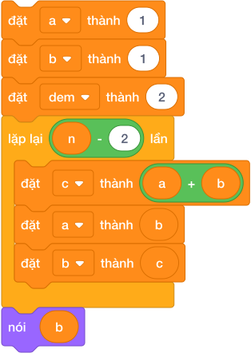

---

## 3. Kỹ Thuật Hai Vòng Lặp Lồng Nhau — In Tam Giác Sao

Khi bài toán yêu cầu in hình dạng 2 chiều (ví dụ: tam giác sao, bảng cửu chương, ma trận ô số):

- **Vòng lặp ngoài (Outer Loop):** Điều khiển **Dòng** chạy từ $1$ đến $N$.
- **Vòng lặp trong (Inner Loop):** Điều khiển **Cột** (số lượng dấu sao trên dòng đó) chạy từ $1$ đến `dong`.

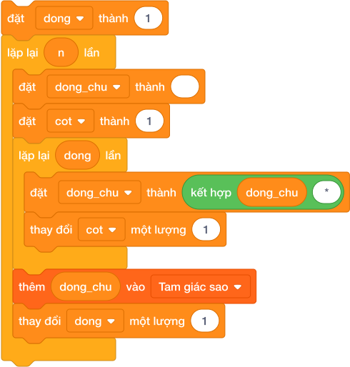

### Cơ chế ghép chuỗi dòng:

- Đầu mỗi dòng: khởi tạo `dong_chu = ""` (chuỗi rỗng).
- Vòng lặp trong: cứ mỗi cột, nối thêm ký tự `*` vào dòng: `đặt [dong_chu v] thành (kết hợp (dong_chu) [*])`.
- Hết vòng lặp trong: nạp cả dòng hoàn chỉnh vào Danh sách hiển thị.

---

## 4. Bảng Mô Phỏng Từng Bước Dãy Fibonacci Đến $N = 6$ (Dry Run Table)

| Vòng lặp | Biến `a` (Số trước) | Biến `b` (Số hiện tại) | Tính `c = a + b` | Dịch `a = b` | Dịch `b = c` | Giá trị phần tử sinh ra |
|:---:|:---:|:---:|:---:|:---:|:---:|:---:|
| *Khởi tạo* | **$1$** | **$1$** | — | — | — | Số thứ 1: $1$, Số thứ 2: $1$ |
| **Vòng 1** | $1$ | $1$ | $1 + 1 = \mathbf{2}$ | $a \leftarrow 1$ | $b \leftarrow \mathbf{2}$ | **Số thứ 3: $2$** |
| **Vòng 2** | $1$ | $2$ | $1 + 2 = \mathbf{3}$ | $a \leftarrow 2$ | $b \leftarrow \mathbf{3}$ | **Số thứ 4: $3$** |
| **Vòng 3** | $2$ | $3$ | $2 + 3 = \mathbf{5}$ | $a \leftarrow 3$ | $b \leftarrow \mathbf{5}$ | **Số thứ 5: $5$** |
| **Vòng 4** | $3$ | $5$ | $3 + 5 = \mathbf{8}$ | $a \leftarrow 5$ | $b \leftarrow \mathbf{8}$ | **Số thứ 6: $8$** |

$\implies$ Sau 4 lượt lặp (ứng với $N - 2$), biến `b` chứa chính xác số Fibonacci thứ 6 là **$8$**.

---

## 5. Tử Huyệt & Các Bẫy Lỗi Thường Gặp (Bug Traps)

> **Bẫy 1: Sai thứ tự dịch chuyển biến làm mất giá trị**
> - *Sai lầm:* `đặt [a v] thành (b)` trước rồi mới tính `c = a + b`.
> - *Hậu quả:* Lúc này `a` đã bị đè thành `b`, nên `c = b + b = 2b`, toàn bộ dãy số bị sai lệch!
> - *Khắc phục:* Phải tính số mới `c` trước, hoặc dùng biến tạm.

> **Bẫy 2: Quên làm sạch dòng chữ ở đầu mỗi dòng mới**
> - *Hiện tượng:* Không đặt `dong_chu = ""` trước vòng lặp trong.
> - *Hậu quả:* Dòng sau sẽ nối dài tiếp từ dòng trước, tam giác biến thành một dải dài vô tận!

---

## 6. Bộ Câu Hỏi Trắc Nghiệm Củng Cố (Concept Quizzes)

1. **Số tiếp theo trong dãy số Fibonacci $1, 1, 2, 3, 5, 8, \dots$ là:**
   - A. 11
   - B. 12
   - C. 13 *(Đáp án đúng: 5 + 8 = 13)*
   - D. 15

2. **Để tính số Fibonacci thứ $N$ ($N \ge 3$), vòng lặp cần chạy bao nhiêu lần nếu đã khởi tạo 2 số đầu?**
   - A. $N$ lần
   - B. $N - 1$ lần
   - C. $N - 2$ lần *(Đáp án đúng)*
   - D. 2 lần

3. **Trong kỹ thuật in tam giác sao bằng hai vòng lặp lồng nhau, vòng lặp ngoài điều khiển:**
   - A. Số cột
   - B. Số dòng *(Đáp án đúng)*
   - C. Kích thước dấu sao
   - D. Màu sắc

4. **Khi in dòng thứ $i$ của tam giác vuông cân sao, vòng lặp bên trong cần lặp bao nhiêu lần?**
   - A. 1 lần
   - B. $i$ lần *(Đáp án đúng)*
   - C. $N$ lần
   - D. $i + 1$ lần

5. **Dãy số cách đều $3, 7, 11, 15, \dots$ có khoảng cách bước nhảy là:**
   - A. 3
   - B. 4 *(Đáp án đúng: 7 - 3 = 4)*
   - C. 5
   - D. 7

6. **Công thức toán học tính số hạng thứ $N$ của dãy cách đều có số đầu $u_1$ và khoảng cách $d$ là:**
   - A. $u_n = u_1 + N \times d$
   - B. $u_n = u_1 + (N - 1) \times d$ *(Đáp án đúng)*
   - C. $u_n = N \times d$
   - D. $u_n = u_1 \times d$

7. **Trước khi bắt đầu ghép các dấu sao cho một dòng mới, biến `dong_chu` cần được đặt thành:**
   - A. Dấu cách
   - B. Chuỗi rỗng `""` *(Đáp án đúng)*
   - C. Dấu sao `*`
   - D. Số 0

8. **Tổng của dãy số tự nhiên $S = 1 + 2 + 3 + \dots + N$ có công thức tính nhanh là:**
   - A. $N \times (N + 1) / 2$ *(Đáp án đúng)*
   - B. $N \times N / 2$
   - C. $(N + 1) / 2$
   - D. $N \times (N - 1) / 2$

9. **Nếu một tam giác sao có 5 dòng, tổng số dấu sao được in ra là:**
   - A. 10
   - B. 15 *(Đáp án đúng: 1 + 2 + 3 + 4 + 5 = 15)*
   - C. 20
   - D. 25

10. **Đặc điểm của biến lăn (Rolling Variables) là:**
    - A. Cần dùng rất nhiều biến
    - B. Chỉ cần số lượng biến cố định để tính trạng thái tiếp theo *(Đáp án đúng: tiết kiệm bộ nhớ)*
    - C. Không thể dùng trong Scratch
    - D. Luôn chạy chậm hơn

## Bài tập lesson

# DANH SÁCH BÀI TẬP THỰC HÀNH: BÀI 09 — QUY LUẬT DÃY SỐ VÀ TAM GIÁC SỐ

**Khóa học:** iKHEDU Scratch  
**Chuyên đề:** Chương 4: Số Học & Thuật Toán Tách Số  
> **Tổng số bài tập thực hành:** `14 bài` chuẩn hóa 100% (Từ kho bài tập `courses/scratch-bang-a/problems/`).  

---

## 1. Ma Trận Phân Tầng Bài Tập Toàn Diện

| STT | Mã bài toán | Tên bài tập | Phân tầng | Mức nhận thức | Thao tác trọng tâm |
|:---:|---|---|:---:|:---:|---|
| 1 | `sca_l09_p01_trao_doi_hai_chiec_coc` | Tráo đổi hai chiếc cốc | **P0** | Khởi động & Quan sát | Nhập vào 2 số nguyên $A$ và $B$. Hãy hoán đổi giá trị của ch... |
| 2 | `sca_l09_p02_day_so_nhan_doi` | Dãy số nhân đôi | **P0** | Khởi động & Quan sát | Nhập số nguyên $N$ ($1 \le N \le 30$). Hãy in ra $N$ số đầu ... |
| 3 | `sca_l09_p03_so_hang_day_cap_so_cong` | Số hạng dãy cấp số cộng | **P0** | Khởi động & Quan sát | Cho một dãy số cách đều có số đầu tiên là $u_1$ và khoảng cá... |
| 4 | `sca_l09_p04_so_fibonacci_thu_n` | Số Fibonacci thứ N | **P1** | Cơ bản & Hoàn thành | Dãy Fibonacci được định nghĩa: $F_1 = 1, F_2 = 1, F_n = F_{n... |
| 5 | `sca_l09_p05_day_so_dan_dau` | Dãy số đan dấu | **P1** | Cơ bản & Hoàn thành | Cho số nguyên dương $N$. Hãy tính tổng của dãy số đan dấu:
 ... |
| 6 | `sca_l09_p06_tong_tich_hai_so_lien_nhau` | Tổng tích hai số liền nhau | **P1** | Cơ bản & Hoàn thành | Cho số nguyên dương $N$. Hãy tính tổng:
 $$S = 1 \times 2 + ... |
| 7 | `sca_l09_p07_day_so_boi_ba_boi_nam` | Dãy số bội ba bội năm | **P1** | Cơ bản & Hoàn thành | Xét dãy các số nguyên dương chia hết cho 3 hoặc chia hết cho... |
| 8 | `sca_l09_p08_tam_giac_so_don_gian` | Tam giác số đơn giản | **P2** | Luyện tập & Vận dụng | In ra tháp tam giác số có $N$ dòng theo quy luật minh họa ở ... |
| 9 | `sca_l09_p09_tam_giac_sao_can` | Tam giác sao cân | **P2** | Luyện tập & Vận dụng | In ra một tháp sao tam giác cân đối xứng có độ cao $N$.
* **... |
| 10 | `sca_l09_p10_day_so_tam_giac_triangular_numbers` | Dãy số tam giác (triangular numbers) | **P2** | Luyện tập & Vận dụng | Cho số tự nhiên $K$. Hãy kiểm tra xem $K$ có phải là một "Số... |
| 11 | `sca_l09_p11_day_so_tribonacci` | Dãy số Tribonacci | **P3** | Vận dụng cao & Sáng tạo | Dãy Tribonacci mở rộng từ Fibonacci với 3 số đầu tiên là $1,... |
| 12 | `sca_l09_p12_ma_tran_so_ban_co_dan_xen` | Ma trận số bàn cờ đan xen | **P3** | Vận dụng cao & Sáng tạo | In ra một bảng ma trận vuông kích thước $N \times N$ gồm các... |
| 13 | `sca_l09_p13_tam_giac_floyd` | Tam giác Floyd | **P3** | Vận dụng cao & Sáng tạo | In ra tam giác Floyd có $N$ dòng (điền liên tiếp các số tự n... |
| 14 | `sca_l09_p14_tim_vi_tri_trong_day_tu_nhien_dai` | Tìm vị trí trong dãy tự nhiên dài | **P3** | Vận dụng cao & Sáng tạo | Cho số nguyên dương $K$ ($1 \le K \le 10^5$). Hãy xác định c... |

---

## 2. Chi Tiết Từng Bài Tập Thực Hành

### Bài 1 (P0): Tráo đổi hai chiếc cốc
* **Mã bài toán:** `sca_l09_p01_trao_doi_hai_chiec_coc`
* **Độ khó & Phân tầng:** P0 (Khởi động & Quan sát)
* **Bối cảnh:** Trong bài toán quản lý bộ nhớ, hai biến lưu trữ giá trị $A$ và $B$ cần được hoán đổi nội dung cho nhau. Bài toán yêu cầu tráo đổi dữ liệu của hai biến và xuất ra màn hình theo đúng thứ tự mới.
* **Nhiệm vụ:** Nhập vào 2 số nguyên $A$ và $B$. Hãy hoán đổi giá trị của chúng và in ra theo thứ tự $A$ trước, $B$ sau.
* **Dữ liệu vào (Input):** Hai số nguyên $A$ và $B$ trên một dòng, cách nhau bởi khoảng trắng.
* **Kết quả ra (Output):** Giá trị mới của $A$ và $B$ sau khi hoán đổi.
* **Dữ liệu mẫu (Sample):**

### Input
```text
5 12
```
### Output
```text
12 5
```
### Giải thích

Ban đầu $A=5, B=12$. Sau khi đổi $A=12, B=5$.

---

### Bài 2 (P0): Dãy số nhân đôi
* **Mã bài toán:** `sca_l09_p02_day_so_nhan_doi`
* **Độ khó & Phân tầng:** P0 (Khởi động & Quan sát)
* **Bối cảnh:** Thí sinh viết dãy số: bắt đầu từ 1, mỗi số tiếp theo gấp đôi số trước. Hãy in ra $N$ số đầu tiên của dãy.
* **Nhiệm vụ:** Nhập số nguyên $N$ ($1 \le N \le 30$). Hãy in ra $N$ số đầu tiên của dãy số nhân đôi: $1, 2, 4, 8, 16, 32, \dots$ trên cùng một dòng.
* **Dữ liệu vào (Input):** Một số nguyên $N$.
* **Kết quả ra (Output):** Dãy $N$ số, cách nhau bởi dấu cách.
* **Dữ liệu mẫu (Sample):**

### Input
```text
5
```
### Output
```text
1 2 4 8 16
```
### Giải thích

Với dữ liệu đầu vào là `5`, kết quả thu được tương ứng là `1 2 4 8 16`.

---

### Bài 3 (P0): Số hạng dãy cấp số cộng
* **Mã bài toán:** `sca_l09_p03_so_hang_day_cap_so_cong`
* **Độ khó & Phân tầng:** P0 (Khởi động & Quan sát)
* **Bối cảnh:** Cấp số cộng là dãy số mà hiệu giữa hai số liên tiếp luôn bằng nhau. Cho số hạng đầu $u_1$ và công sai $d$, tìm số hạng thứ $N$.
* **Nhiệm vụ:** Cho một dãy số cách đều có số đầu tiên là $u_1$ và khoảng cách giữa 2 số liền kề là $d$. Cho số nguyên dương $N$. Hãy tìm số hạng thứ $N$ của dãy số.
* **Dữ liệu vào (Input):** Ba số nguyên $u_1, d, N$ ($1 \le u_1, d, N \le 10^6$).
* **Kết quả ra (Output):** Một số nguyên là số hạng thứ $N$.
* **Dữ liệu mẫu (Sample):**

### Input
```text
3 4 5
```
### Output
```text
19
```
### Giải thích

Dãy số là: 3, 7, 11, 15, 19. Số thứ 5 là 19.
* **Công thức toán học:** $u_N = u_1 + (N - 1) \times d$.

---

### Bài 4 (P1): Số Fibonacci thứ N
* **Mã bài toán:** `sca_l09_p04_so_fibonacci_thu_n`
* **Độ khó & Phân tầng:** P1 (Cơ bản & Hoàn thành)
* **Bối cảnh:** Dãy Fibonacci: $1, 1, 2, 3, 5, 8, 13, \dots$ — mỗi số bằng tổng hai số liền trước. Đây là dãy số kỳ diệu xuất hiện khắp nơi trong tự nhiên, từ cánh hoa hướng dương đến vỏ ốc biển.
* **Nhiệm vụ:** Dãy Fibonacci được định nghĩa: $F_1 = 1, F_2 = 1, F_n = F_{n-1} + F_{n-2}$ với $n \ge 3$. Nhập vào số tự nhiên $N$. Hãy tìm và in ra số Fibonacci thứ $N$.
* **Dữ liệu vào (Input):** Một số tự nhiên $N$ ($1 \le N \le 40$).
* **Kết quả ra (Output):** Giá trị $F_N$.
* **Dữ liệu mẫu (Sample):**

### Input
```text
6
```
### Output
```text
8
```
### Giải thích

Dãy là 1, 1, 2, 3, 5, 8. Số thứ 6 là 8.

---

### Bài 5 (P1): Dãy số đan dấu
* **Mã bài toán:** `sca_l09_p05_day_so_dan_dau`
* **Độ khó & Phân tầng:** P1 (Cơ bản & Hoàn thành)
* **Bối cảnh:** Thí sinh tạo ra dãy số với quy luật đặc biệt: số đầu tiên cho trước, các số tiếp theo tuân theo một công thức biến đổi nhất định. Hãy in $N$ số đầu tiên.
* **Nhiệm vụ:** Cho số nguyên dương $N$. Hãy tính tổng của dãy số đan dấu:
 $$S = 1 - 2 + 3 - 4 + 5 - 6 + \dots + (-1)^{N+1} N$$
* **Dữ liệu vào (Input):** Một số nguyên $N$ ($1 \le N \le 10^6$).
* **Kết quả ra (Output):** Giá trị của tổng $S$.
* **Dữ liệu mẫu (Sample):**

### Input
```text
5
```
### Output
```text
3
```
### Giải thích

$1 - 2 + 3 - 4 + 5 = 3$.

---

### Bài 6 (P1): Tổng tích hai số liền nhau
* **Mã bài toán:** `sca_l09_p06_tong_tich_hai_so_lien_nhau`
* **Độ khó & Phân tầng:** P1 (Cơ bản & Hoàn thành)
* **Bối cảnh:** Tính tổng hoặc tích của các cặp số liên tiếp trong một dãy số. Đây là bài toán luyện kỹ thuật cuốn chiếu (rolling variables).
* **Nhiệm vụ:** Cho số nguyên dương $N$. Hãy tính tổng:
 $$S = 1 \times 2 + 2 \times 3 + 3 \times 4 + \dots + N \times (N + 1)$$
* **Dữ liệu vào (Input):** Một số nguyên dương $N$ ($1 \le N \le 10^5$).
* **Kết quả ra (Output):** Tổng $S$.
* **Dữ liệu mẫu (Sample):**

### Input
```text
3
```
### Output
```text
20
```
### Giải thích

$1 \times 2 + 2 \times 3 + 3 \times 4 = 2 + 6 + 12 = 20$.

---

### Bài 7 (P1): Dãy số bội ba bội năm
* **Mã bài toán:** `sca_l09_p07_day_so_boi_ba_boi_nam`
* **Độ khó & Phân tầng:** P1 (Cơ bản & Hoàn thành)
* **Bối cảnh:** Liệt kê các số từ 1 đến $N$ chia hết cho 3 hoặc chia hết cho 5. Đây là bài toán kinh điển rèn luyện điều kiện logic phức hợp.
* **Nhiệm vụ:** Xét dãy các số nguyên dương chia hết cho 3 hoặc chia hết cho 5 theo thứ tự tăng dần: $3, 5, 6, 9, 10, 12, 15, \dots$. Cho số tự nhiên $N$. Hãy in ra $N$ số đầu tiên của dãy này.
* **Dữ liệu vào (Input):** Một số nguyên dương $N$ ($1 \le N \le 10^4$).
* **Kết quả ra (Output):** $N$ số đầu tiên của dãy trên một dòng, cách nhau bởi dấu cách.
* **Dữ liệu mẫu (Sample):**

### Input
```text
6
```
### Output
```text
3 5 6 9 10 12
```
### Giải thích

Với dữ liệu đầu vào là `6`, kết quả thu được tương ứng là `3 5 6 9 10 12`.

---

### Bài 8 (P2): Tam giác số đơn giản
* **Mã bài toán:** `sca_l09_p08_tam_giac_so_don_gian`
* **Độ khó & Phân tầng:** P2 (Luyện tập & Vận dụng)
* **Bối cảnh:** In ra tam giác số với chiều cao $N$: hàng thứ $i$ chứa các số từ 1 đến $i$. Đây là bài toán kinh điển rèn luyện vòng lặp lồng nhau.
* **Nhiệm vụ:** In ra tháp tam giác số có $N$ dòng theo quy luật minh họa ở Sample 1 (dòng thứ $i$ in các số từ $1$ đến $i$).
* **Dữ liệu vào (Input):** Một số tự nhiên $N$ ($1 \le N \le 20$).
* **Kết quả ra (Output):** Tháp tam giác số có $N$ dòng đúng quy luật trên.
* **Dữ liệu mẫu (Sample):**

### Input
```text
4
```
### Output
```text
1
1 2
1 2 3
1 2 3 4
```
### Giải thích

Với dữ liệu đầu vào là `4`, kết quả thu được tương ứng là `1
1 2
1 2 3
1 2 3 4`.

---

### Bài 9 (P2): Tam giác sao cân
* **Mã bài toán:** `sca_l09_p09_tam_giac_sao_can`
* **Độ khó & Phân tầng:** P2 (Luyện tập & Vận dụng)
* **Bối cảnh:** Vẽ tam giác cân bằng dấu sao `*` với chiều cao $N$. Mỗi hàng cần tính số khoảng trắng và số sao phù hợp để hình tam giác cân đối.
* **Nhiệm vụ:** In ra một tháp sao tam giác cân đối xứng có độ cao $N$.
* **Quy luật:** Dòng thứ $i$ (từ 1 đến $N$) có $(N - i)$ dấu cách phía trước, tiếp theo là $(2i - 1)$ dấu sao `*`.
* **Dữ liệu vào (Input):** Độ cao $N$ của tam giác ($1 \le N \le 20$).
* **Kết quả ra (Output):** Tháp sao tam giác cân có $N$ dòng đúng quy luật trên.
* **Dữ liệu mẫu (Sample):**

### Input
```text
3
```
### Output
```text
  *
 ***
*****
```
### Giải thích

Với dữ liệu đầu vào là `3`, kết quả thu được tương ứng là `*
 ***
*****`.

---

### Bài 10 (P2): Dãy số tam giác (triangular numbers)
* **Mã bài toán:** `sca_l09_p10_day_so_tam_giac_triangular_numbers`
* **Độ khó & Phân tầng:** P2 (Luyện tập & Vận dụng)
* **Bối cảnh:** Trong giờ kể chuyện lịch sử, cô giáo kể rằng người Hy Lạp cổ đại ngày xưa rất thích xếp các viên sỏi nhỏ thành hình tam giác đều để chơi:

 * Tầng 1: 1 viên
 * Tầng 2: 1 + 2 = 3 viên
 * Tầng 3: 1 + 2 + 3 = 6 viên
 * Tầng 4: 1 + 2 + 3 + 4 = 10 viên
Cả lớp ai cũng muốn tự xếp sỏi giống như vậy. Hãy giúp các bạn kiểm tra xem một số sỏi có xếp được thành hình tam giác không.
* **Nhiệm vụ:** Cho số tự nhiên $K$. Hãy kiểm tra xem $K$ có phải là một "Số tam giác" hay không (nghĩa là có tồn tại số nguyên dương $N$ sao cho $\frac{N(N+1)}{2} = K$)? Nếu có, in ra `YES` và số $N$, ngược lại in `NO`.
* **Dữ liệu vào (Input):** Một số nguyên $K$ ($1 \le K \le 10^9$).
* **Kết quả ra (Output):** `YES <N>` hoặc `NO`.
* **Dữ liệu mẫu (Sample):**

### Input
```text
10
```
### Output
```text
YES 4
```
### Giải thích

Với dữ liệu đầu vào là `10`, kết quả thu được tương ứng là `YES 4`.

---

### Bài 11 (P3): Dãy số Tribonacci
* **Mã bài toán:** `sca_l09_p11_day_so_tribonacci`
* **Độ khó & Phân tầng:** P3 (Vận dụng cao & Sáng tạo)
* **Bối cảnh:** Dãy Tribonacci mở rộng từ Fibonacci: mỗi số bằng tổng ba số liền trước. Hãy tính số hạng thứ $N$ của dãy.
* **Nhiệm vụ:** Dãy Tribonacci mở rộng từ Fibonacci với 3 số đầu tiên là $1, 1, 2$. Kể từ số thứ tư, mỗi số bằng tổng của 3 số liền kề trước nó:
 $$T_1 = 1, T_2 = 1, T_3 = 2, \quad T_n = T_{n-1} + T_{n-2} + T_{n-3} \quad (n \ge 4)$$
 Nhập vào số tự nhiên $N$ ($1 \le N \le 35$). Hãy in ra số Tribonacci thứ $N$.
* **Dữ liệu vào (Input):** Một số nguyên $N$.
* **Kết quả ra (Output):** Giá trị $T_N$.
* **Dữ liệu mẫu (Sample):**

### Input
```text
5
```
### Output
```text
7
```
### Giải thích

Dãy là: 1, 1, 2, 4, 7... Số thứ 5 là $1+2+4=7$.

---

### Bài 12 (P3): Ma trận số bàn cờ đan xen
* **Mã bài toán:** `sca_l09_p12_ma_tran_so_ban_co_dan_xen`
* **Độ khó & Phân tầng:** P3 (Vận dụng cao & Sáng tạo)
* **Bối cảnh:** In bảng số $N \times M$ với các giá trị xen kẽ theo quy luật bàn cờ: ô đen ô trắng luân phiên.
* **Nhiệm vụ:** In ra một bảng ma trận vuông kích thước $N \times N$ gồm các số $0$ và $1$ xếp so le như bàn cờ vua, với ô góc trên cùng bên trái luôn là số $1$.
* **Dữ liệu vào (Input):** Một số tự nhiên $N$ ($1 \le N \le 50$).
* **Kết quả ra (Output):** Ma trận vuông $N \times N$ đúng quy luật trên, mỗi dòng in $N$ số cách nhau một khoảng trắng.
* **Dữ liệu mẫu (Sample):**

### Input
```text
4
```
### Output
```text
1 0 1 0
0 1 0 1
1 0 1 0
0 1 0 1
```
### Giải thích

Với dữ liệu đầu vào là `4`, kết quả thu được tương ứng là `1 0 1 0
0 1 0 1
1 0 1 0
0 1 0 1`.

---

### Bài 13 (P3): Tam giác Floyd
* **Mã bài toán:** `sca_l09_p13_tam_giac_floyd`
* **Độ khó & Phân tầng:** P3 (Vận dụng cao & Sáng tạo)
* **Bối cảnh:** Trong câu lạc bộ toán vui, bạn Xoài đố cả nhóm xếp một tháp số thật đẹp. Luật chơi là tam giác Floyd: một tam giác số vuông được điền liên tiếp các số tự nhiên tăng dần bắt đầu từ 1. Các bạn xếp mãi mà tháp cứ lệch, ai cũng bật cười vui vẻ. Hãy giúp nhóm bạn Xoài xếp tháp số này cho ngay ngắn.
* **Nhiệm vụ:** In ra tam giác Floyd có $N$ dòng (điền liên tiếp các số tự nhiên từ 1 như minh họa ở Sample 1).
* **Dữ liệu vào (Input):** Một số nguyên dương $N$ ($1 \le N \le 20$).
* **Kết quả ra (Output):** Tam giác Floyd có $N$ dòng đúng quy luật trên.
* **Dữ liệu mẫu (Sample):**

### Input
```text
4
```
### Output
```text
1
2 3
4 5 6
7 8 9 10
```
### Giải thích

Với dữ liệu đầu vào là `4`, kết quả thu được tương ứng là `1
2 3
4 5 6
7 8 9 10`.

---

### Bài 14 (P3): Tìm vị trí trong dãy tự nhiên dài
* **Mã bài toán:** `sca_l09_p14_tim_vi_tri_trong_day_tu_nhien_dai`
* **Độ khó & Phân tầng:** P3 (Vận dụng cao & Sáng tạo)
* **Bối cảnh:** Giờ học vui, An lấy phấn viết liên tiếp các số tự nhiên bắt đầu từ 1 thành một dải số dài vô tận khắp sân trường:
 `123456789101112131415161718192021...`
Các bạn xúm lại đọc to từng chữ số, vừa đọc vừa cười khanh khách. Đến chữ số ở xa thì không ai đếm nổi bằng mắt nữa. Hãy tìm nhanh chữ số đó.
* **Nhiệm vụ:** Cho số nguyên dương $K$ ($1 \le K \le 10^5$). Hãy xác định chữ số thứ $K$ trong dải số trên là chữ số nào?
* **Dữ liệu vào (Input):** Một số nguyên $K$.
* **Kết quả ra (Output):** Chữ số tại vị trí $K$ (đếm từ 1).
* **Dữ liệu mẫu (Sample):**

### Input
```text
7
```
### Output
```text
7
```
### Giải thích

Ký tự thứ 7 là số 7.

---

--------------------------------------------------------------------------------
<!-- Bài 10: Kỹ thuật tách chữ số và xử lý số nguyên qua vòng lặp while -->
--------------------------------------------------------------------------------

## Lý thuyết và Concept Quiz

# Bài 10: Kỹ thuật tách chữ số và xử lý số nguyên qua vòng lặp while

## 1. Bí Thuật Hai Bước Tách Chữ Số Bằng Phép Toán

Trong các bài toán lập trình, xử lý các con số (tính tổng các chữ số, đếm số lượng chữ số chẵn/lẻ, kiểm tra số đối xứng, tạo số đảo ngược) là một trong những dạng đề bài kinh điển nhất.

Để "bóc tách" từng chữ số của một số nguyên $N$ từ phải qua trái mà không cần chuyển sang chuỗi văn bản, ta sử dụng **Bí thuật 2 bước số học**:


### Bước 1 — Lấy chữ số tận cùng bên phải:
$$\text{chữ\_số} = N \pmod{10}$$
Khối lệnh Scratch:
`đặt [chu_so v] thành ((N) mod (10))`
- Ví dụ: $358 \pmod{10} = 8$.

### Bước 2 — Cắt bỏ chữ số cuối cùng để thu nhỏ số $N$:
$$N = \lfloor N / 10 \rfloor$$
Khối lệnh Scratch:
`đặt [N v] thành ([làm tròn xuống v] của ((N) / (10)))`
- Ví dụ: $\lfloor 358 / 10 \rfloor = 35$. Số $N$ từ 3 chữ số đã được thu gọn thành 2 chữ số!

---

## 2. Khung Mẫu Chuẩn (Template) Vòng Lặp Xử Lý Chữ Số

Kết hợp bí thuật 2 bước với vòng lặp `lặp lại cho đến khi < (N) = (0) >`:

- Trước vòng lặp: chuẩn bị biến tích lũy (ví dụ: `tong_chu_so = 0`).
- Trong thân lặp:
  1. Tách chữ số cuối: `chu_so = N mod 10`.
  2. Xử lý bài toán với `chu_so` (cộng vào tổng, kiểm tra chẵn/lẻ...).
  3. Cắt bỏ chữ số cuối: `N = floor(N / 10)`.
- Khi $N = 0$: toàn bộ các chữ số đã được bóc tách xong, vòng lặp dừng tự động.

---

## 3. Thuật Toán Tạo Số Đảo Ngược

Bài toán: Cho số nguyên dương $N = 1234$, hãy tạo ra số đảo ngược $4321$.

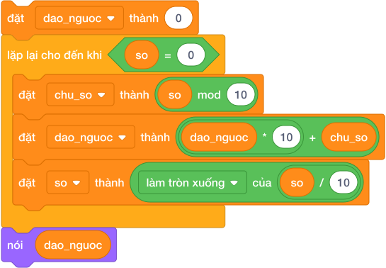

### Cơ chế dồn hàng đơn vị thành hàng chục:
Mỗi khi bóc tách được một chữ số mới, ta nhân số đảo ngược hiện tại với $10$ rồi cộng thêm chữ số mới vào:
$$\text{dao\_nguoc} = \text{dao\_nguoc} \times 10 + \text{chu\_so}$$

- Ban đầu: `dao_nguoc = 0`.
- Lần 1: bóc số 4 $\implies 0 \times 10 + 4 = 4$.
- Lần 2: bóc số 3 $\implies 4 \times 10 + 3 = 43$.
- Lần 3: bóc số 2 $\implies 43 \times 10 + 2 = 432$.
- Lần 4: bóc số 1 $\implies 432 \times 10 + 1 = 4321$.

---

## 4. Bảng Mô Phỏng Từng Bước Bóc Tách Số $N = 358$ (Dry Run Table)

| Vòng lặp | $N$ trước bóc | Tách `chu_so = N mod 10` | Thu nhỏ `N = floor(N / 10)` | Cộng `tong = tong + chu_so` | Biến `dao_nguoc` | Kiểm tra dừng `< N = 0 >` |
|:---:|:---:|:---:|:---:|:---:|:---:|:---:|
| *Bắt đầu* | **$358$** | — | — | $0$ | $0$ | $358 = 0$ $\to$ **SAI** |
| **Vòng 1** | $358$ | $358 \bmod 10 = \mathbf{8}$ | $\lfloor 358 / 10 \rfloor = \mathbf{35}$ | $0 + 8 = \mathbf{8}$ | $0 \times 10 + 8 = \mathbf{8}$ | $35 = 0$ $\to$ **SAI** |
| **Vòng 2** | $35$ | $35 \bmod 10 = \mathbf{5}$ | $\lfloor 35 / 10 \rfloor = \mathbf{3}$ | $8 + 5 = \mathbf{13}$ | $8 \times 10 + 5 = \mathbf{85}$ | $3 = 0$ $\to$ **SAI** |
| **Vòng 3** | $3$ | $3 \bmod 10 = \mathbf{3}$ | $\lfloor 3 / 10 \rfloor = \mathbf{0}$ | $13 + 3 = \mathbf{16}$ | $85 \times 10 + 3 = \mathbf{853}$ | $0 = 0$ $\to$ **ĐÚNG (DỪNG)** |

$\implies$ Sau 3 vòng lặp: Tổng các chữ số là **$16$**, số đảo ngược là **$853$**.

---

## 5. Tử Huyệt & Các Bẫy Lỗi Thường Gặp (Bug Traps)

> **Bẫy 1: Làm mất giá trị gốc của số $N$ ban đầu**
> - *Hậu quả:* Quá trình bóc tách sẽ làm số $N$ giảm dần về $0$. Nếu đề bài yêu cầu so sánh số đảo ngược với số ban đầu (để kiểm tra số đối xứng / Palindrome), ta không còn giá trị gốc của $N$ nữa!
> - *Khắc phục:* Luôn sao lưu vào một biến nhớ tạm trước khi bóc tách: `đặt [goc v] thành (N)`.

> **Bẫy 2: Quên bước cắt bỏ chữ số cuối `N = floor(N / 10)`**
> - *Hậu quả:* Số $N$ không bao giờ giảm, vòng lặp trở thành vô tận và chương trình bị treo cứng!

---

## 6. Bộ Câu Hỏi Trắc Nghiệm Củng Cố (Concept Quizzes)

1. **Khối lệnh nào dùng để lấy ra chữ số hàng đơn vị của số nguyên dương $N$?**
   - A. `(N) / (10)`
   - B. `(N) mod (10)` *(Đáp án đúng)*
   - C. `[làm tròn xuống] của (N / 10)`
   - D. `(N) - (10)`

2. **Muốn cắt bỏ chữ số cuối cùng của số nguyên dương $N$, ta gán lại $N$ bằng:**
   - A. `(N) mod (10)`
   - B. `[làm tròn xuống v] của ((N) / (10))` *(Đáp án đúng)*
   - C. `(N) - (10)`
   - D. `(N) / (10)`

3. **Vòng lặp bóc tách chữ số chuẩn mực sẽ dừng lại khi biến $N$ bằng bao nhiêu?**
   - A. 1
   - B. 0 *(Đáp án đúng)*
   - C. 10
   - D. -1

4. **Cho $N = 407$. Sau lệnh `đặt [chu_so v] thành ((N) mod (10))`, biến `chu_so` có giá trị là:**
   - A. 4
   - B. 0
   - C. 7 *(Đáp án đúng)*
   - D. 40

5. **Để kiểm tra một số có phải là số đối xứng (Palindrome) hay không, ta so sánh số ban đầu với:**
   - A. Tổng các chữ số
   - B. Số đảo ngược của nó *(Đáp án đúng: ví dụ 121 đảo ngược vẫn là 121)*
   - C. Số lượng chữ số
   - D. Số chữ số chẵn

6. **Công thức dồn chữ số để tạo số đảo ngược là:**
   - A. `dao_nguoc = dao_nguoc + chu_so`
   - B. `dao_nguoc = dao_nguoc * 10 + chu_so` *(Đáp án đúng)*
   - C. `dao_nguoc = dao_nguoc * chu_so`
   - D. `dao_nguoc = chu_so * 10`

7. **Số $N = 2026$ có tổng các chữ số bằng bao nhiêu?**
   - A. 8
   - B. 10 *(Đáp án đúng: 2 + 0 + 2 + 6 = 10)*
   - C. 12
   - D. 14

8. **Để đếm xem số $N$ có bao nhiêu chữ số chẵn, sau khi tách `chu_so`, ta kiểm tra điều kiện:**
   - A. `< ((chu_so) mod (2)) = (0) >` *(Đáp án đúng)*
   - B. `< ((N) mod (2)) = (0) >`
   - C. `< chu_so > 2 >`
   - D. `< chu_so = 2 >`

9. **Tại sao cần tạo biến `goc = N` trước khi bước vào vòng lặp tách chữ số?**
   - A. Để chương trình chạy nhanh hơn
   - B. Vì biến N sẽ bị giảm về 0 sau vòng lặp, cần lưu lại để sử dụng sau này *(Đáp án đúng)*
   - C. Để Scratch không bị báo lỗi
   - D. Bắt buộc theo quy tắc Scratch

10. **Số nguyên nào sau đây là số đối xứng?**
    - A. 123
    - B. 1221 *(Đáp án đúng)*
    - C. 1231
    - D. 2026

## Bài tập lesson

# DANH SÁCH BÀI TẬP THỰC HÀNH: BÀI 10 — Kỹ thuật tách chữ số và xử lý số nguyên qua vòng lặp while

**Khóa học:** iKHEDU Scratch  
**Chuyên đề:** Chương 4: Số Học & Thuật Toán Tách Số  
> **Tổng số bài tập thực hành:** `14 bài` chuẩn hóa 100% (Từ kho bài tập `courses/scratch-bang-a/problems/`).  

---

## 1. Ma Trận Phân Tầng Bài Tập Toàn Diện

| STT | Mã bài toán | Tên bài tập | Phân tầng | Mức nhận thức | Thao tác trọng tâm |
|:---:|---|---|:---:|:---:|---|
| 1 | `sca_l10_p01_lay_chu_so_don_vi_chuc` | Lấy chữ số đơn vị & chục | **P0** | Khởi động & Quan sát | Nhập một số nguyên dương $N$ có đúng 2 chữ số. Hãy in ra chữ... |
| 2 | `sca_l10_p02_tong_chu_so_cua_so_3_chu_so` | Tổng chữ số của số 3 chữ số | **P0** | Khởi động & Quan sát | Nhập một số nguyên dương $N$ có đúng 3 chữ số. Hãy tính tổng... |
| 3 | `sca_l10_p03_tong_cac_chu_so_cua_n` | Tổng các chữ số của N | **P0** | Khởi động & Quan sát | Cho một số tự nhiên $N$ bất kỳ. Hãy tính tổng tất cả các chữ... |
| 4 | `sca_l10_p04_dem_so_luong_chu_so` | Đếm số lượng chữ số | **P1** | Cơ bản & Hoàn thành | Cho số nguyên không âm $N$. Hãy cho biết số $N$ có bao nhiêu... |
| 5 | `sca_l10_p05_tich_cac_chu_so_khac_khong` | Tích các chữ số khác không | **P1** | Cơ bản & Hoàn thành | Cho số nguyên dương $N$. Hãy tính tích của tất cả các chữ số... |
| 6 | `sca_l10_p06_dem_chu_so_chan_va_le` | Đếm chữ số chẵn và lẻ | **P1** | Cơ bản & Hoàn thành | Cho số nguyên dương $N$. Hãy đếm xem trong số $N$ có bao nhi... |
| 7 | `sca_l10_p07_chu_so_lon_nhat_nho_nhat` | Chữ số lớn nhất & nhỏ nhất | **P1** | Cơ bản & Hoàn thành | Cho số nguyên dương $N$. Hãy tìm chữ số lớn nhất và chữ số n... |
| 8 | `sca_l10_p08_so_dao_nguoc` | Số đảo ngược | **P2** | Luyện tập & Vận dụng | Cho số nguyên dương $N$. Hãy in ra số đảo ngược của $N$ (bỏ ... |
| 9 | `sca_l10_p09_kiem_tra_so_doi_xung_palindrome` | Kiểm tra số đối xứng (palindrome) | **P2** | Luyện tập & Vận dụng | Nhập vào số tự nhiên $N$. Kiểm tra xem $N$ có phải số đối xứ... |
| 10 | `sca_l10_p10_so_toan_chan_hoac_toan_le` | Số toàn chẵn hoặc toàn lẻ | **P2** | Luyện tập & Vận dụng | Nhập số nguyên dương $N$. In ra `TOAN CHAN` nếu $N$ là số to... |
| 11 | `sca_l10_p11_so_may_man_chua_so_7` | Số may mắn chứa số 7 | **P3** | Vận dụng cao & Sáng tạo | An coi số 7 là con số mang lại may mắn. Một số tự nhiên $N$ ... |
| 12 | `sca_l10_p12_dem_so_luong_so_doi_xung_trong_doan` | Đếm số lượng số đối xứng trong đoạn | **P3** | Vận dụng cao & Sáng tạo | Cho hai số nguyên dương $A$ và $B$ ($1 \le A \le B \le 10^5$... |
| 13 | `sca_l10_p13_can_bac_so_hoc_digital_root` | Căn bậc số học (digital root) | **P3** | Vận dụng cao & Sáng tạo | Nhập vào số tự nhiên $N$. Hãy tìm căn bậc số học của $N$. |
| 14 | `sca_l10_p14_so_tang_giam_dep` | Số tăng giảm đẹp | **P3** | Vận dụng cao & Sáng tạo | Cho số $N$. In ra `TANG` nếu $N$ là số tăng dần, in `GIAM` n... |

---

## 2. Chi Tiết Từng Bài Tập Thực Hành

### Bài 1 (P0): Lấy chữ số đơn vị & chục
* **Mã bài toán:** `sca_l10_p01_lay_chu_so_don_vi_chuc`
* **Độ khó & Phân tầng:** P0 (Khởi động & Quan sát)
* **Bối cảnh:** Trong hệ thống xử lý số liệu đo lường, mỗi con số gồm hai chữ số đều mang thông tin độc lập ở hàng chục và hàng đơn vị. Để chuẩn hóa dữ liệu, hệ thống cần tách riêng hai giá trị này.
* **Nhiệm vụ:** Nhập một số nguyên dương $N$ có đúng 2 chữ số. Hãy in ra chữ số hàng chục và chữ số hàng đơn vị của $N$ trên cùng một dòng, cách nhau một khoảng trắng.
* **Dữ liệu vào (Input):** Một số nguyên $N$ ($10 \le N \le 99$).
* **Kết quả ra (Output):** Chữ số hàng chục, tiếp theo là chữ số hàng đơn vị.
* **Dữ liệu mẫu (Sample):**

### Input
```text
47
```
### Output
```text
4 7
```
### Giải thích

Với dữ liệu đầu vào là `47`, kết quả thu được tương ứng là `4 7`.

---

### Bài 2 (P0): Tổng chữ số của số 3 chữ số
* **Mã bài toán:** `sca_l10_p02_tong_chu_so_cua_so_3_chu_so`
* **Độ khó & Phân tầng:** P0 (Khởi động & Quan sát)
* **Bối cảnh:** Trong bài kiểm tra, người dùng cần tính nhanh tổng một dãy số. Hãy viết chương trình hỗ trợ tính toán.
* **Nhiệm vụ:** Nhập một số nguyên dương $N$ có đúng 3 chữ số. Hãy tính tổng của 3 chữ số đó.
* **Dữ liệu vào (Input):** Một số tự nhiên $N$ ($100 \le N \le 999$).
* **Kết quả ra (Output):** Tổng 3 chữ số.
* **Dữ liệu mẫu (Sample):**

### Input
```text
358
```
### Output
```text
16
```
### Giải thích

$3 + 5 + 8 = 16$.

---

### Bài 3 (P0): Tổng các chữ số của N
* **Mã bài toán:** `sca_l10_p03_tong_cac_chu_so_cua_n`
* **Độ khó & Phân tầng:** P0 (Khởi động & Quan sát)
* **Bối cảnh:** Trong bài kiểm tra, người dùng cần tính nhanh tổng một dãy số. Hãy viết chương trình hỗ trợ tính toán.
* **Nhiệm vụ:** Cho một số tự nhiên $N$ bất kỳ. Hãy tính tổng tất cả các chữ số cấu tạo nên số $N$.
* **Dữ liệu vào (Input):** Một số nguyên $N$ ($0 \le N \le 10^{18}$).
* **Kết quả ra (Output):** Tổng các chữ số của $N$.
* **Dữ liệu mẫu (Sample):**

### Input
```text
2024
```
### Output
```text
8
```
### Giải thích

$2 + 0 + 2 + 4 = 8$.

---

### Bài 4 (P1): Đếm số lượng chữ số
* **Mã bài toán:** `sca_l10_p04_dem_so_luong_chu_so`
* **Độ khó & Phân tầng:** P1 (Cơ bản & Hoàn thành)
* **Bối cảnh:** Trong lưu trữ dữ liệu số học, việc xác định độ dài số lượng chữ số của một số nguyên giúp hệ thống cấp phát bộ nhớ và căn chỉnh bảng biểu một cách chính xác.
* **Nhiệm vụ:** Cho số nguyên không âm $N$. Hãy cho biết số $N$ có bao nhiêu chữ số.
* **Dữ liệu vào (Input):** Một số nguyên $N$ ($0 \le N \le 10^{18}$).
* **Kết quả ra (Output):** Số lượng chữ số.
* **Dữ liệu mẫu (Sample):**

### Input
```text
123456
```
### Output
```text
6
```
### Giải thích

Có 6 chữ số.

---

### Bài 5 (P1): Tích các chữ số khác không
* **Mã bài toán:** `sca_l10_p05_tich_cac_chu_so_khac_khong`
* **Độ khó & Phân tầng:** P1 (Cơ bản & Hoàn thành)
* **Bối cảnh:** Trong một số thuật toán tạo mã băm và mã kiểm tra dữ liệu, tích của các chữ số có nghĩa (khác số 0) thường được dùng để tạo khóa đại diện cho số nguyên ban đầu.
* **Nhiệm vụ:** Cho số nguyên dương $N$. Hãy tính tích của tất cả các chữ số **khác 0** của $N$.
* **Dữ liệu vào (Input):** Một số tự nhiên $N$ ($1 \le N \le 10^9$).
* **Kết quả ra (Output):** Tích các chữ số khác 0.
* **Dữ liệu mẫu (Sample):**

### Input
```text
205
```
### Output
```text
10
```
### Giải thích

Bỏ qua chữ số 0, tích là $2 \times 5 = 10$.

---

### Bài 6 (P1): Đếm chữ số chẵn và lẻ
* **Mã bài toán:** `sca_l10_p06_dem_chu_so_chan_va_le`
* **Độ khó & Phân tầng:** P1 (Cơ bản & Hoàn thành)
* **Bối cảnh:** Phân tích cấu trúc chẵn lẻ của các chữ số là bước kiểm định tính cân bằng số học trong các hệ thống mã hóa và kiểm thử dữ liệu đầu vào.
* **Nhiệm vụ:** Cho số nguyên dương $N$. Hãy đếm xem trong số $N$ có bao nhiêu chữ số chẵn (0, 2, 4, 6, 8) và bao nhiêu chữ số lẻ (1, 3, 5, 7, 9).
* **Dữ liệu vào (Input):** Một số tự nhiên $N$ ($1 \le N \le 10^{12}$).
* **Kết quả ra (Output):** In hai số nguyên cách nhau một khoảng trắng: số lượng chữ số chẵn trước, số lượng chữ số lẻ sau.
* **Dữ liệu mẫu (Sample):**

### Input
```text
2035
```
### Output
```text
2 2
```
### Giải thích

Chữ số chẵn: 2, 0 (2 số). Chữ số lẻ: 3, 5 (2 số).

---

### Bài 7 (P1): Chữ số lớn nhất & nhỏ nhất
* **Mã bài toán:** `sca_l10_p07_chu_so_lon_nhat_nho_nhat`
* **Độ khó & Phân tầng:** P1 (Cơ bản & Hoàn thành)
* **Bối cảnh:** Thí sinh cần tìm giá trị lớn nhất hoặc nhỏ nhất trong một tập dữ liệu. Hãy viết chương trình tìm kiếm.
* **Nhiệm vụ:** Cho số nguyên dương $N$. Hãy tìm chữ số lớn nhất và chữ số nhỏ nhất xuất hiện trong số $N$.
* **Dữ liệu vào (Input):** Một số nguyên $N$ ($1 \le N \le 10^{12}$).
* **Kết quả ra (Output):** Chữ số lớn nhất, theo sau là chữ số nhỏ nhất, cách nhau một khoảng trắng.
* **Dữ liệu mẫu (Sample):**

### Input
```text
9418
```
### Output
```text
9 1
```
### Giải thích

Chữ số lớn nhất là 9, nhỏ nhất là 1.

---

### Bài 8 (P2): Số đảo ngược
* **Mã bài toán:** `sca_l10_p08_so_dao_nguoc`
* **Độ khó & Phân tầng:** P2 (Luyện tập & Vận dụng)
* **Bối cảnh:** Thao tác đảo ngược thứ tự các chữ số là nền tảng quan trọng trong các bài toán kiểm tra tính đối xứng và biến đổi số học.
* **Nhiệm vụ:** Cho số nguyên dương $N$. Hãy in ra số đảo ngược của $N$ (bỏ qua các chữ số 0 ở đầu nếu có sau khi đảo).
* **Dữ liệu vào (Input):** Một số tự nhiên $N$ ($1 \le N \le 10^{12}$).
* **Kết quả ra (Output):** Số đảo ngược.
* **Dữ liệu mẫu (Sample):**

### Input
```text
1234
```
### Output
```text
4321
```
### Giải thích

Đảo ngược các chữ số.

---

### Bài 9 (P2): Kiểm tra số đối xứng (palindrome)
* **Mã bài toán:** `sca_l10_p09_kiem_tra_so_doi_xung_palindrome`
* **Độ khó & Phân tầng:** P2 (Luyện tập & Vận dụng)
* **Bối cảnh:** Na rất thích soi gương vì trong gương mọi thứ trông giống hệt ở ngoài. Một hôm, bạn Tí đố Na tìm những con số cũng "soi gương" được như vậy. Đó chính là số đối xứng (Palindrome): số đọc từ trái sang phải hay từ phải sang trái đều thu được số giống hệt nhau (ví dụ: $121$, $1331$, $5$, $88$). Na loay hoay mãi chưa kiểm tra hết, hãy bạn ấy.
* **Nhiệm vụ:** Nhập vào số tự nhiên $N$. Kiểm tra xem $N$ có phải số đối xứng không. Nếu có in `YES`, ngược lại in `NO`.
* **Dữ liệu vào (Input):** Một số nguyên $N$ ($1 \le N \le 10^{15}$).
* **Kết quả ra (Output):** `YES` hoặc `NO`.
* **Dữ liệu mẫu (Sample):**

### Input
```text
12321
```
### Output
```text
YES
```
### Giải thích

Với dữ liệu đầu vào là `12321`, kết quả thu được tương ứng là `YES`.

---

### Bài 10 (P2): Số toàn chẵn hoặc toàn lẻ
* **Mã bài toán:** `sca_l10_p10_so_toan_chan_hoac_toan_le`
* **Độ khó & Phân tầng:** P2 (Luyện tập & Vận dụng)
* **Bối cảnh:** Lớp của Bi chia thành hai đội chơi xếp số rất vui. Đội Chẵn chỉ thích những số "Toàn chẵn", tức là số mà mọi chữ số của nó đều là số chẵn. Đội Lẻ lại mê những số "Toàn lẻ", tức là số mà mọi chữ số của nó đều là số lẻ. Trọng tài Tí nhờ em giúp phân xử mỗi con số, hãy bạn ấy.
* **Nhiệm vụ:** Nhập số nguyên dương $N$. In ra `TOAN CHAN` nếu $N$ là số toàn chẵn, in `TOAN LE` nếu $N$ toàn lẻ, ngược lại in `BINH THUONG`.
* **Dữ liệu vào (Input):** Một số tự nhiên $N$ ($1 \le N \le 10^{15}$).
* **Kết quả ra (Output):** `TOAN CHAN`, `TOAN LE` hoặc `BINH THUONG`.
* **Dữ liệu mẫu (Sample):**

### Input
```text
2468
```
### Output
```text
TOAN CHAN
```
### Giải thích

Với dữ liệu đầu vào là `2468`, kết quả thu được tương ứng là `TOAN CHAN`.

---

### Bài 11 (P3): Số may mắn chứa số 7
* **Mã bài toán:** `sca_l10_p11_so_may_man_chua_so_7`
* **Độ khó & Phân tầng:** P3 (Vận dụng cao & Sáng tạo)
* **Bối cảnh:** Trong hệ thống lọc vé thưởng tự động, các số thẻ có chứa chữ số 7 được coi là thỏa mãn điều kiện nhận mã ưu tiên. Hệ thống cần kiểm tra nhanh tính chất này trên mỗi số thẻ.
* **Nhiệm vụ:** An coi số 7 là con số mang lại may mắn. Một số tự nhiên $N$ được gọi là "May mắn" nếu trong các chữ số của nó có ít nhất một chữ số 7. Cho số $N$, hãy kiểm tra xem $N$ có may mắn không. In `YES` nếu có, `NO` nếu không.
* **Dữ liệu vào (Input):** Số nguyên $N$ ($1 \le N \le 10^9$).
* **Kết quả ra (Output):** `YES` hoặc `NO`.
* **Dữ liệu mẫu (Sample):**

### Input
```text
372
```
### Output
```text
YES
```
### Giải thích

Với dữ liệu đầu vào là `372`, kết quả thu được tương ứng là `YES`.

---

### Bài 12 (P3): Đếm số lượng số đối xứng trong đoạn
* **Mã bài toán:** `sca_l10_p12_dem_so_luong_so_doi_xung_trong_doan`
* **Độ khó & Phân tầng:** P3 (Vận dụng cao & Sáng tạo)
* **Bối cảnh:** Các số đối xứng (palindrome) sở hữu tính cân bằng cấu trúc đặc biệt và xuất hiện thường xuyên trong bài toán sinh mã định danh và nén số liệu.
* **Nhiệm vụ:** Cho hai số nguyên dương $A$ và $B$ ($1 \le A \le B \le 10^5$). Hãy đếm xem có bao nhiêu số đối xứng nằm trong đoạn từ $A$ đến $B$ (tính cả $A$ và $B$).
* **Dữ liệu vào (Input):** Hai số nguyên $A, B$ trên cùng một dòng.
* **Kết quả ra (Output):** Số lượng số đối xứng trong đoạn $[A, B]$.
* **Dữ liệu mẫu (Sample):**

### Input
```text
1 20
```
### Output
```text
10
```
### Giải thích

Các số đối xứng là: 1, 2, 3, 4, 5, 6, 7, 8, 9, 11 (tổng cộng 10 số).

---

### Bài 13 (P3): Căn bậc số học (digital root)
* **Mã bài toán:** `sca_l10_p13_can_bac_so_hoc_digital_root`
* **Độ khó & Phân tầng:** P3 (Vận dụng cao & Sáng tạo)
* **Bối cảnh:** Bạn Mít chơi trò "gộp hạt đậu": mỗi lần bạn ấy cộng dồn liên tục các chữ số của một số tự nhiên cho đến khi chỉ còn lại đúng **một chữ số duy nhất**, và bạn ấy gọi đó là căn bậc số học của số đó.
 Ví dụ: $9875 \to 9 + 8 + 7 + 5 = 29 \to 2 + 9 = 11 \to 1 + 1 = 2$. Căn bậc số học của 9875 là 2. Mít cộng mãi mà vẫn hay nhầm, hãy bạn ấy tính thật nhanh.
* **Nhiệm vụ:** Nhập vào số tự nhiên $N$. Hãy tìm căn bậc số học của $N$.
* **Dữ liệu vào (Input):** Một số tự nhiên $N$ ($1 \le N \le 10^{18}$).
* **Kết quả ra (Output):** Một chữ số duy nhất (từ 1 đến 9).
* **Dữ liệu mẫu (Sample):**

### Input
```text
9875
```
### Output
```text
2
```
### Giải thích

Với dữ liệu đầu vào là `9875`, kết quả thu được tương ứng là `2`.

---

### Bài 14 (P3): Số tăng giảm đẹp
* **Mã bài toán:** `sca_l10_p14_so_tang_giam_dep`
* **Độ khó & Phân tầng:** P3 (Vận dụng cao & Sáng tạo)
* **Bối cảnh:** Bạn Cún thích xếp những bậc thang bằng các chữ số. Có hôm bạn ấy xếp được cầu thang đi lên thật đẹp, có hôm lại xếp được cầu thang đi xuống thật gọn. Cô giáo gọi đó là:

 * **Số Tăng Dần:** Nếu mỗi chữ số đứng sau luôn lớn hơn chữ số đứng trước nó (ví dụ: $1379, 258$).
 * **Số Giảm Dần:** Nếu mỗi chữ số đứng sau luôn nhỏ hơn chữ số đứng trước nó (ví dụ: $9641, 852$). Cún nhờ em nhìn giúp xem mỗi con số là cầu thang lên, cầu thang xuống hay không phải cầu thang.
* **Nhiệm vụ:** Cho số $N$. In ra `TANG` nếu $N$ là số tăng dần, in `GIAM` nếu $N$ là số giảm dần, và in `KHONG` nếu không thỏa mãn cả 2 tính chất trên.
* **Dữ liệu vào (Input):** Một số nguyên $N$ ($10 \le N \le 10^{12}$).
* **Kết quả ra (Output):** `TANG`, `GIAM` hoặc `KHONG`.
* **Dữ liệu mẫu (Sample):**

### Input
```text
1379
```
### Output
```text
TANG
```
### Giải thích

Với dữ liệu đầu vào là `1379`, kết quả thu được tương ứng là `TANG`.

---

--------------------------------------------------------------------------------
<!-- Bài 11: Ước số, Bội số và Số nguyên tố -->
--------------------------------------------------------------------------------

## Lý thuyết và Concept Quiz

# Bài 11: ƯỚC SỐ, BỘI SỐ VÀ SỐ NGUYÊN TỐ

## 1. Bản Chất Toán Học Của Ước Số & Bội Số Trong Lập Trình

Trong số học, số nguyên dương $d$ được gọi là **ước số** của số nguyên dương $N$ (và $N$ là **bội số** của $d$) nếu $N$ chia hết cho $d$ mà không còn dư:
$$\text{Điều kiện trong Scratch: } < ((N) \text{ mod } (d)) = (0) >$$

- *Ví dụ:* Các ước số của $12$ là: $1, 2, 3, 4, 6, 12$ (tổng cộng 6 ước số).

---

## 2. Định Nghĩa Số Nguyên Tố & Thuật Toán Cơ Bản

**Số nguyên tố** là số tự nhiên lớn hơn 1 và **chỉ có đúng 2 ước số** là 1 và chính nó ($2, 3, 5, 7, 11, 13, 17, \dots$).
- Số $0$ và số $1$ **KHÔNG PHẢI** là số nguyên tố.
- Số $2$ là số nguyên tố chẵn duy nhất (và cũng là số nguyên tố nhỏ nhất).

### Cách 1: Thuật toán đếm ước (Duyệt trâu)
Cho biến $i$ chạy từ $1$ đến $N$, nếu $N \pmod i = 0$ thì tăng biến `dem_uoc` lên 1.
Sau vòng lặp: nếu `dem_uoc = 2` $\implies N$ là số nguyên tố!

---

## 3. Thuật Toán Tối Ưu Với Biến Cờ Dừng Sớm & Căn Bậc Hai $\sqrt{N}$

Khi $N$ lớn (ví dụ $N = 1000000$), việc cho vòng lặp chạy $1$ triệu lần sẽ làm chương trình Scratch chạy rất chậm. Ta áp dụng 2 nguyên lý toán học tối ưu đỉnh cao:

1. **Nguyên lý căn bậc hai:** Nếu $N$ có một ước số lớn hơn $\sqrt{N}$, thì chắc chắn nó phải có một ước số tương ứng nhỏ hơn $\sqrt{N}$. Do đó, ta chỉ cần kiểm tra các số $d$ thỏa mãn $d \times d \le N$!

2. **Nguyên lý dừng sớm bằng biến cờ:** Ngay khi phát hiện ra một số $d \ge 2$ chia hết cho $N$, ta khẳng định ngay $N$ là hợp số, lập tức đặt cờ `la_nguyen_to = 0` và dừng vòng lặp ngay lập tức!

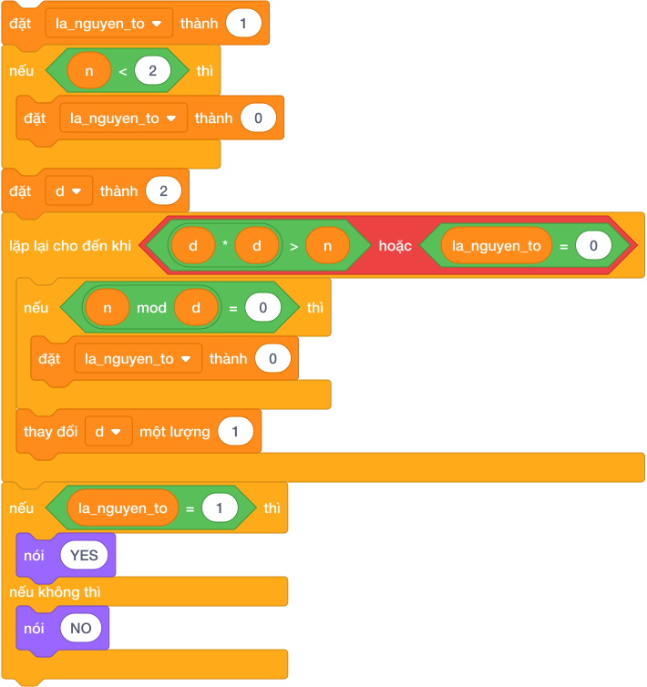

---

## 4. Bảng Mô Phỏng Kiểm Tra Số $N = 37$ (Dry Run Table)

| Vòng lặp | Biến `d` | Kiểm tra điều kiện lặp `< d * d <= N >` | Kiểm tra chia hết `< N mod d = 0 >` | Biến cờ `la_nguyen_to` | Kết luận bước |
|:---:|:---:|:---:|:---:|:---:|---|
| *Khởi tạo* | $d = 2$ | $2 \times 2 = 4 \le 37$ $\to$ **ĐÚNG** | $37 \bmod 2 = 1 \ne 0$ | **$1$** | Không chia hết, tăng $d = 3$ |
| **Vòng 1** | $d = 3$ | $3 \times 3 = 9 \le 37$ $\to$ **ĐÚNG** | $37 \bmod 3 = 1 \ne 0$ | $1$ | Không chia hết, tăng $d = 4$ |
| **Vòng 2** | $d = 4$ | $4 \times 4 = 16 \le 37$ $\to$ **ĐÚNG** | $37 \bmod 4 = 1 \ne 0$ | $1$ | Không chia hết, tăng $d = 5$ |
| **Vòng 3** | $d = 5$ | $5 \times 5 = 25 \le 37$ $\to$ **ĐÚNG** | $37 \bmod 5 = 2 \ne 0$ | $1$ | Không chia hết, tăng $d = 6$ |
| **Vòng 4** | $d = 6$ | $6 \times 6 = 36 \le 37$ $\to$ **ĐÚNG** | $37 \bmod 6 = 1 \ne 0$ | $1$ | Không chia hết, tăng $d = 7$ |
| **Dừng** | $d = 7$ | $7 \times 7 = 49 > 37$ $\to$ **DỪNG** | — | **$1$** | Vòng lặp kết thúc |

$\implies$ Sau khi dừng, cờ `la_nguyen_to` vẫn giữ nguyên giá trị **$1$**. Kết luận: $37$ là số nguyên tố (in ra `YES`). Chỉ cần kiểm tra $5$ lần thay vì $37$ lần!

---

## 5. Tử Huyệt & Các Bẫy Lỗi Thường Gặp (Bug Traps)

> **Bẫy 1: Quên xử lý trường hợp đặc biệt $N < 2$**
> - *Hiện tượng:* Với $N = 1$ hoặc $N = 0$, nếu không chặn trước, chương trình sẽ kết luận nhầm $1$ là số nguyên tố!
> - *Khắc phục:* Luôn có khối kiểm tra đầu tiên: `nếu < N < 2 > thì đặt [la_nguyen_to v] thành 0`.

> **Bẫy 2: Chạy kiểm tra ước bắt đầu từ $d = 1$**
> - *Hậu quả:* Mọi số đều chia hết cho $1$ ($N \pmod 1 = 0$), nếu bắt đầu từ 1 thì cờ bị bật về 0 ngay lập tức, dẫn đến kết luận không có số nào là số nguyên tố!
> - *Khắc phục:* Biến chia `d` bắt buộc phải **khởi tạo từ số 2**.

---

## 6. Bộ Câu Hỏi Trắc Nghiệm Củng Cố (Concept Quizzes)

1. **Điều kiện nào trong Scratch chứng tỏ số nguyên $d$ là một ước số của số nguyên $N$?**
   - A. `< ((N) mod (d)) = (0) >` *(Đáp án đúng)*
   - B. `< ((d) mod (N)) = (0) >`
   - C. `< ((N) / (d)) = (0) >`
   - D. `< N = d >`

2. **Số nguyên tố nhỏ nhất là số nào?**
   - A. 0
   - B. 1
   - C. 2 *(Đáp án đúng)*
   - D. 3

3. **Số nào sau đây KHÔNG PHẢI là số nguyên tố?**
   - A. 2
   - B. 3
   - C. 9 *(Đáp án đúng: 9 có 3 ước là 1, 3, 9)*
   - D. 11

4. **Để kiểm tra số $N$ có phải nguyên tố không, ta chỉ cần thử chia $N$ cho các số từ 2 đến:**
   - A. $N / 2$
   - B. Căn bậc hai của $N$ ($\sqrt{N}$) *(Đáp án đúng: d * d <= N)*
   - C. $N - 1$
   - D. 10

5. **Số 1 có phải là số nguyên tố không?**
   - A. Có
   - B. Không *(Đáp án đúng: vì số 1 chỉ có đúng 1 ước số)*
   - C. Tùy từng trường hợp
   - D. Là số nguyên tố đặc biệt

6. **Số lượng ước số của số 12 là bao nhiêu?**
   - A. 4
   - B. 5
   - C. 6 *(Đáp án đúng: 1, 2, 3, 4, 6, 12)*
   - D. 7

7. **Khi kiểm tra tính nguyên tố của $N = 100$, chỉ cần thử các ước số $d$ tối đa đến số mấy?**
   - A. 10 *(Đáp án đúng: vì 10 * 10 = 100)*
   - B. 50
   - C. 99
   - D. 20

8. **Một số nguyên dương lớn hơn 1 không phải là số nguyên tố thì được gọi là:**
   - A. Số chẵn
   - B. Số lẻ
   - C. Hợp số *(Đáp án đúng)*
   - D. Số hoàn hảo

9. **Nếu số $N$ chia hết cho biến $d$ ($2 \le d < N$), ta có thể kết luận ngay $N$ là:**
   - A. Số nguyên tố
   - B. Hợp số *(Đáp án đúng: vì đã tìm thấy thêm ước thứ 3)*
   - C. Số chính phương
   - D. Số âm

10. **Cặp số nguyên tố nào sau đây được gọi là số nguyên tố sinh đôi (Twin Primes - hơn kém nhau 2 đơn vị)?**
    - A. 2 và 3
    - B. 3 và 5 *(Đáp án đúng)*
    - C. 7 và 11
    - D. 9 và 11

## Bài tập lesson

# DANH SÁCH BÀI TẬP THỰC HÀNH: BÀI 11 — ƯỚC SỐ, BỘI SỐ VÀ SỐ NGUYÊN TỐ

**Khóa học:** iKHEDU Scratch  
**Chuyên đề:** Chương 4: Số Học & Thuật Toán Tách Số  
> **Tổng số bài tập thực hành:** `14 bài` chuẩn hóa 100% (Từ kho bài tập `courses/scratch-bang-a/problems/`).  

---

## 1. Ma Trận Phân Tầng Bài Tập Toàn Diện

| STT | Mã bài toán | Tên bài tập | Phân tầng | Mức nhận thức | Thao tác trọng tâm |
|:---:|---|---|:---:|:---:|---|
| 1 | `sca_l11_p01_liet_ke_tat_ca_uoc_so` | Liệt kê tất cả ước số | **P0** | Khởi động & Quan sát | Nhập một số tự nhiên $N$. Hãy in ra tất cả các ước số nguyên... |
| 2 | `sca_l11_p02_dem_so_luong_uoc_so` | Đếm số lượng ước số | **P0** | Khởi động & Quan sát | Cho số tự nhiên $N$. Hãy cho biết số $N$ có tất cả bao nhiêu... |
| 3 | `sca_l11_p03_tinh_tong_cac_uoc_so` | Tính tổng các ước số | **P0** | Khởi động & Quan sát | Cho số nguyên dương $N$. Hãy tính tổng tất cả các ước số của... |
| 4 | `sca_l11_p04_kiem_tra_so_nguyen_to` | Kiểm tra số nguyên tố | **P1** | Cơ bản & Hoàn thành | Nhập vào số nguyên $N$. Hãy kiểm tra xem $N$ có phải là số n... |
| 5 | `sca_l11_p05_kiem_tra_so_chinh_phuong` | Kiểm tra số chính phương | **P1** | Cơ bản & Hoàn thành | Nhập số nguyên dương $N$. Kiểm tra $N$ có phải số chính phươ... |
| 6 | `sca_l11_p06_uoc_chung_lon_nhat_bcnn` | Ước chung lớn nhất & BCNN | **P1** | Cơ bản & Hoàn thành | Cho 2 số nguyên dương $A$ và $B$. Hãy tìm Ước chung lớn nhất... |
| 7 | `sca_l11_p07_dem_uoc_chan_cua_n` | Đếm ước chẵn của N | **P1** | Cơ bản & Hoàn thành | Cho số nguyên dương $N$. Hãy đếm xem có bao nhiêu ước số của... |
| 8 | `sca_l11_p08_tim_uoc_so_lon_thu_hai` | Tìm ước số lớn thứ hai | **P2** | Luyện tập & Vận dụng | Cho số nguyên dương $N$ ($N \ge 2$). Ước số lớn nhất của $N$... |
| 9 | `sca_l11_p09_dem_so_nguyen_to_trong_doan` | Đếm số nguyên tố trong đoạn | **P2** | Luyện tập & Vận dụng | Cho hai số nguyên dương $A$ và $B$ ($1 \le A \le B \le 10^4$... |
| 10 | `sca_l11_p10_hai_so_nguyen_to_cung_nhau` | Hai số nguyên tố cùng nhau | **P2** | Luyện tập & Vận dụng | Cho 2 số nguyên dương $A$ và $B$. In ra `YES` nếu chúng nguy... |
| 11 | `sca_l11_p11_cap_so_nguyen_to_sinh_doi` | Cặp số nguyên tố sinh đôi | **P3** | Vận dụng cao & Sáng tạo | Cho số tự nhiên $N$ ($1 \le N \le 10^4$). Hãy in ra tất cả c... |
| 12 | `sca_l11_p12_so_sieu_nguyen_to_super_prime` | Số siêu nguyên tố (super prime) | **P3** | Vận dụng cao & Sáng tạo | Cho số tự nhiên $N$. Hãy kiểm tra xem $N$ có phải là Siêu ng... |
| 13 | `sca_l11_p13_phan_tich_ra_thua_so_nguyen_to` | Phân tích ra thừa số nguyên tố | **P3** | Vận dụng cao & Sáng tạo | Mọi số tự nhiên $N \ge 2$ đều có thể phân tích thành tích củ... |
| 14 | `sca_l11_p14_tim_so_co_dung_3_uoc_so` | Tìm số có đúng 3 ước số | **P3** | Vận dụng cao & Sáng tạo | Cho số nguyên dương $N$. Hãy đếm xem có bao nhiêu số nhỏ hơn... |

---

## 2. Chi Tiết Từng Bài Tập Thực Hành

### Bài 1 (P0): Liệt kê tất cả ước số
* **Mã bài toán:** `sca_l11_p01_liet_ke_tat_ca_uoc_so`
* **Độ khó & Phân tầng:** P0 (Khởi động & Quan sát)
* **Bối cảnh:** Xác định toàn bộ các ước số nguyên dương của một số nguyên là phép phân tích cơ bản trong số học, giúp giải quyết các bài toán chia đều tài nguyên và phân nhóm phần tử.
* **Nhiệm vụ:** Nhập một số tự nhiên $N$. Hãy in ra tất cả các ước số nguyên dương của $N$ theo thứ tự tăng dần trên một dòng, cách nhau bởi khoảng trắng.
* **Dữ liệu vào (Input):** Một số tự nhiên $N$ ($1 \le N \le 1000$).
* **Kết quả ra (Output):** Dãy các ước số của $N$.
* **Dữ liệu mẫu (Sample):**

### Input
```text
12
```
### Output
```text
1 2 3 4 6 12
```
### Giải thích

Với dữ liệu đầu vào là `12`, kết quả thu được tương ứng là `1 2 3 4 6 12`.

---

### Bài 2 (P0): Đếm số lượng ước số
* **Mã bài toán:** `sca_l11_p02_dem_so_luong_uoc_so`
* **Độ khó & Phân tầng:** P0 (Khởi động & Quan sát)
* **Bối cảnh:** Số lượng ước số là chỉ số quan trọng phản ánh tính chia hết của một số nguyên, đồng thời là cơ sở nhận biết số nguyên tố và số chính phương.
* **Nhiệm vụ:** Cho số tự nhiên $N$. Hãy cho biết số $N$ có tất cả bao nhiêu ước số nguyên dương.
* **Dữ liệu vào (Input):** Một số tự nhiên $N$ ($1 \le N \le 10^5$).
* **Kết quả ra (Output):** Một số nguyên duy nhất là số lượng ước số của $N$.
* **Dữ liệu mẫu (Sample):**

### Input
```text
10
```
### Output
```text
4
```
### Giải thích

Số 10 có 4 ước: 1, 2, 5, 10.

---

### Bài 3 (P0): Tính tổng các ước số
* **Mã bài toán:** `sca_l11_p03_tinh_tong_cac_uoc_so`
* **Độ khó & Phân tầng:** P0 (Khởi động & Quan sát)
* **Bối cảnh:** Trong bài kiểm tra, người dùng cần tính nhanh tổng một dãy số. Hãy viết chương trình hỗ trợ tính toán.
* **Nhiệm vụ:** Cho số nguyên dương $N$. Hãy tính tổng tất cả các ước số của $N$.
* **Dữ liệu vào (Input):** Một số nguyên $N$ ($1 \le N \le 10^5$).
* **Kết quả ra (Output):** Tổng các ước số của $N$.
* **Dữ liệu mẫu (Sample):**

### Input
```text
6
```
### Output
```text
12
```
### Giải thích

Các ước là 1, 2, 3, 6 $\implies 1 + 2 + 3 + 6 = 12$.

---

### Bài 4 (P1): Kiểm tra số nguyên tố
* **Mã bài toán:** `sca_l11_p04_kiem_tra_so_nguyen_to`
* **Độ khó & Phân tầng:** P1 (Cơ bản & Hoàn thành)
* **Bối cảnh:** Trong giờ lập trình, thầy giáo đưa ra một bài toán kiểm tra tính chất của số. Hãy viết chương trình kiểm tra tự động.
* **Nhiệm vụ:** Nhập vào số nguyên $N$. Hãy kiểm tra xem $N$ có phải là số nguyên tố hay không. Nếu có in `YES`, nếu không in `NO`.
* **Dữ liệu vào (Input):** Một số nguyên $N$ ($0 \le N \le 10^7$).
* **Kết quả ra (Output):** `YES` hoặc `NO`.
* **Dữ liệu mẫu (Sample):**

### Input
```text
7
```
### Output
```text
YES
```
### Giải thích

Với dữ liệu đầu vào là `7`, kết quả thu được tương ứng là `YES`.

---

### Bài 5 (P1): Kiểm tra số chính phương
* **Mã bài toán:** `sca_l11_p05_kiem_tra_so_chinh_phuong`
* **Độ khó & Phân tầng:** P1 (Cơ bản & Hoàn thành)
* **Bối cảnh:** Giờ xếp hình, Bo xếp các viên gạch thành một ô vuông thật ngay ngắn. Cô giáo cười và bảo những số gạch xếp được thành hình vuông như vậy gọi là số chính phương: số bằng bình phương của một số tự nhiên (ví dụ: $0, 1, 4, 9, 16, 25, \dots$). Bo có một đống gạch mà chưa biết có xếp vuông được không, hãy bạn ấy kiểm tra.
* **Nhiệm vụ:** Nhập số nguyên dương $N$. Kiểm tra $N$ có phải số chính phương không. Nếu đúng in `YES`, ngược lại in `NO`.
* **Dữ liệu vào (Input):** Một số nguyên $N$ ($1 \le N \le 10^9$).
* **Kết quả ra (Output):** `YES` hoặc `NO`.
* **Dữ liệu mẫu (Sample):**

### Input
```text
25
```
### Output
```text
YES
```
### Giải thích

Với dữ liệu đầu vào là `25`, kết quả thu được tương ứng là `YES`.

---

### Bài 6 (P1): Ước chung lớn nhất & BCNN
* **Mã bài toán:** `sca_l11_p06_uoc_chung_lon_nhat_bcnn`
* **Độ khó & Phân tầng:** P1 (Cơ bản & Hoàn thành)
* **Bối cảnh:** Thí sinh cần tìm giá trị lớn nhất hoặc nhỏ nhất trong một tập dữ liệu. Hãy viết chương trình tìm kiếm.
* **Nhiệm vụ:** Cho 2 số nguyên dương $A$ và $B$. Hãy tìm Ước chung lớn nhất ($\text{GCD}$) và Bội chung nhỏ nhất ($\text{LCM}$) của 2 số này.
* **Dữ liệu vào (Input):** Hai số nguyên $A, B$ cách nhau bởi khoảng trắng ($1 \le A, B \le 10^9$).
* **Kết quả ra (Output):** Hai số nguyên: $\text{GCD}$ trước, $\text{LCM}$ sau, cách nhau một khoảng trắng.
* **Dữ liệu mẫu (Sample):**

### Input
```text
12 18
```
### Output
```text
6 36
```
### Giải thích

$\text{GCD}(12, 18) = 6$, $\text{LCM}(12, 18) = (12 \times 18) // 6 = 36$.

---

### Bài 7 (P1): Đếm ước chẵn của N
* **Mã bài toán:** `sca_l11_p07_dem_uoc_chan_cua_n`
* **Độ khó & Phân tầng:** P1 (Cơ bản & Hoàn thành)
* **Bối cảnh:** Trong phân tích chia nhóm chẵn lẻ, việc xác định các ước số chẵn giúp tối ưu hóa việc phân chia tài nguyên thành các phần có kích thước chia hết cho 2.
* **Nhiệm vụ:** Cho số nguyên dương $N$. Hãy đếm xem có bao nhiêu ước số của $N$ là số chẵn.
* **Dữ liệu vào (Input):** Một số tự nhiên $N$ ($1 \le N \le 10^6$).
* **Kết quả ra (Output):** Số lượng ước chẵn của $N$.
* **Dữ liệu mẫu (Sample):**

### Input
```text
12
```
### Output
```text
4
```
### Giải thích

Các ước của 12 là: 1, 2, 3, 4, 6, 12. Trong đó các ước chẵn là: 2, 4, 6, 12 (có 4 số).

---

### Bài 8 (P2): Tìm ước số lớn thứ hai
* **Mã bài toán:** `sca_l11_p08_tim_uoc_so_lon_thu_hai`
* **Độ khó & Phân tầng:** P2 (Luyện tập & Vận dụng)
* **Bối cảnh:** Thí sinh đang tìm kiếm một giá trị đặc biệt trong tập dữ liệu. Hãy viết chương trình tìm kiếm hiệu quả.
* **Nhiệm vụ:** Cho số nguyên dương $N$ ($N \ge 2$). Ước số lớn nhất của $N$ luôn là chính nó ($N$). Hãy tìm ước số lớn thứ hai của $N$ (tức là ước số lớn nhất nhưng nhỏ hơn $N$).
* **Dữ liệu vào (Input):** Một số tự nhiên $N$ ($2 \le N \le 10^9$).
* **Kết quả ra (Output):** Ước số lớn thứ hai của $N$.
* **Dữ liệu mẫu (Sample):**

### Input
```text
24
```
### Output
```text
12
```
### Giải thích

Ước lớn nhất là 24, lớn thứ hai là 12.

---

### Bài 9 (P2): Đếm số nguyên tố trong đoạn
* **Mã bài toán:** `sca_l11_p09_dem_so_nguyen_to_trong_doan`
* **Độ khó & Phân tầng:** P2 (Luyện tập & Vận dụng)
* **Bối cảnh:** Đếm số lượng số nguyên tố trong một khoảng giá trị cho trước là dạng toán kinh điển đánh giá hiệu quả của các thuật toán sàng lọc và kiểm tra số nguyên tố.
* **Nhiệm vụ:** Cho hai số nguyên dương $A$ và $B$ ($1 \le A \le B \le 10^4$). Hãy đếm xem có bao nhiêu số nguyên tố nằm trong đoạn từ $A$ đến $B$ (tính cả $A$ và $B$).
* **Dữ liệu vào (Input):** Hai số $A, B$ trên cùng một dòng.
* **Kết quả ra (Output):** Số lượng số nguyên tố trong đoạn $[A, B]$.
* **Dữ liệu mẫu (Sample):**

### Input
```text
10 20
```
### Output
```text
4
```
### Giải thích

Có 4 số nguyên tố: 11, 13, 17, 19.

---

### Bài 10 (P2): Hai số nguyên tố cùng nhau
* **Mã bài toán:** `sca_l11_p10_hai_so_nguyen_to_cung_nhau`
* **Độ khó & Phân tầng:** P2 (Luyện tập & Vận dụng)
* **Bối cảnh:** An và Bình mỗi bạn có một rổ bi. Hai bạn muốn biết hai rổ bi của mình có "hợp nhau" không. Cô giáo bảo hai số $A$ và $B$ được gọi là nguyên tố cùng nhau nếu Ước chung lớn nhất của chúng bằng 1 ($\text{GCD}(A, B) = 1$). Hai bạn đếm mãi chưa xong, hãy hai bạn kiểm tra.
* **Nhiệm vụ:** Cho 2 số nguyên dương $A$ và $B$. In ra `YES` nếu chúng nguyên tố cùng nhau, ngược lại in `NO`.
* **Dữ liệu vào (Input):** Hai số $A, B$ ($1 \le A, B \le 10^9$).
* **Kết quả ra (Output):** `YES` hoặc `NO`.
* **Dữ liệu mẫu (Sample):**

### Input
```text
8 9
```
### Output
```text
YES
```
### Giải thích

Với dữ liệu đầu vào là `8 9`, kết quả thu được tương ứng là `YES`.

---

### Bài 11 (P3): Cặp số nguyên tố sinh đôi
* **Mã bài toán:** `sca_l11_p11_cap_so_nguyen_to_sinh_doi`
* **Độ khó & Phân tầng:** P3 (Vận dụng cao & Sáng tạo)
* **Bối cảnh:** Hai chị em Song sinh nhà bạn Tí lúc nào cũng ngồi cạnh nhau thật thân thiết. Nghe chuyện đó, cô giáo đố cả lớp tìm những cặp số nguyên tố cũng "sinh đôi" như vậy. Hai số nguyên tố được gọi là "Sinh đôi" (Twin Primes) nếu chúng hơn kém nhau đúng 2 đơn vị (ví dụ: $(3, 5), (5, 7), (11, 13), (17, 19)$). Cả lớp tìm mãi chưa đủ, hãy các bạn liệt kê.
* **Nhiệm vụ:** Cho số tự nhiên $N$ ($1 \le N \le 10^4$). Hãy in ra tất cả các cặp số nguyên tố sinh đôi $(P, P+2)$ sao cho $P+2 \le N$.
* **Dữ liệu vào (Input):** Một số nguyên $N$.
* **Kết quả ra (Output):** Mỗi dòng in một cặp số nguyên tố sinh đôi cách nhau bởi khoảng trắng, theo thứ tự tăng dần.
* **Dữ liệu mẫu (Sample):**

### Input
```text
15
```
### Output
```text
3 5
5 7
11 13
```
### Giải thích

Với dữ liệu đầu vào là `15`, kết quả thu được tương ứng là `3 5
5 7
11 13`.

---

### Bài 12 (P3): Số siêu nguyên tố (super prime)
* **Mã bài toán:** `sca_l11_p12_so_sieu_nguyen_to_super_prime`
* **Độ khó & Phân tầng:** P3 (Vận dụng cao & Sáng tạo)
* **Bối cảnh:** Bi có một chiếc tàu lượn bằng các chữ số rất lạ. Mỗi lần tàu chạy qua, chữ số ở cuối toa lại rơi xuống một cái. Bạn ấy reo lên khi phát hiện có những con số gọi là "Siêu nguyên tố": bản thân nó là số nguyên tố, và khi ta lần lượt xóa bớt chữ số tận cùng bên phải thì các số thu được vẫn luôn là số nguyên tố!
 * Ví dụ: Số $239$ là số nguyên tố.
 * Cắt đuôi 9 còn $23$ (vẫn là số nguyên tố).
 * Cắt đuôi 3 còn $2$ (vẫn là số nguyên tố).
 $\implies 239$ là một Siêu nguyên tố! Bi đố em tìm thêm thật nhiều số đặc biệt như vậy, hãy bạn ấy.
* **Nhiệm vụ:** Cho số tự nhiên $N$. Hãy kiểm tra xem $N$ có phải là Siêu nguyên tố hay không. In `YES` hoặc `NO`.
* **Dữ liệu vào (Input):** Một số tự nhiên $N$ ($1 \le N \le 10^7$).
* **Kết quả ra (Output):** `YES` hoặc `NO`.
* **Dữ liệu mẫu (Sample):**

### Input
```text
239
```
### Output
```text
YES
```
### Giải thích

Với dữ liệu đầu vào là `239`, kết quả thu được tương ứng là `YES`.

---

### Bài 13 (P3): Phân tích ra thừa số nguyên tố
* **Mã bài toán:** `sca_l11_p13_phan_tich_ra_thua_so_nguyen_to`
* **Độ khó & Phân tầng:** P3 (Vận dụng cao & Sáng tạo)
* **Bối cảnh:** Định lý cơ bản của số học khẳng định mọi số tự nhiên lớn hơn 1 đều phân tích được duy nhất thành tích các thừa số nguyên tố. Phép phân tích này đóng vai trò cốt lõi trong mật mã học.
* **Nhiệm vụ:** Mọi số tự nhiên $N \ge 2$ đều có thể phân tích thành tích của các thừa số nguyên tố. Cho số tự nhiên $N$. Hãy in ra dạng phân tích của $N$.
* **Dữ liệu vào (Input):** Một số tự nhiên $N$ ($2 \le N \le 10^6$).
* **Kết quả ra (Output):** Dãy các thừa số nguyên tố tăng dần theo định dạng `p1 * p2 * ...`.
* **Dữ liệu mẫu (Sample):**

### Input
```text
60
```
### Output
```text
2 * 2 * 3 * 5
```
### Giải thích

Với dữ liệu đầu vào là `60`, kết quả thu được tương ứng là `2 * 2 * 3 * 5`.

---

### Bài 14 (P3): Tìm số có đúng 3 ước số
* **Mã bài toán:** `sca_l11_p14_tim_so_co_dung_3_uoc_so`
* **Độ khó & Phân tầng:** P3 (Vận dụng cao & Sáng tạo)
* **Bối cảnh:** Bạn Xoài mở một câu lạc bộ sưu tầm những viên đá rất kén chọn. Bạn ấy chỉ giữ lại những viên đá mang số $X$ đặc biệt: một số tự nhiên $X$ có đúng 3 ước số nguyên dương khi và chỉ khi $X$ là bình phương của một số nguyên tố ($X = P^2$, ví dụ: $4 = 2^2, 9 = 3^2, 25 = 5^2, 49 = 7^2$). Xoài có cả một hộp đá mà đếm mãi chưa xong, hãy bạn ấy đếm.
* **Nhiệm vụ:** Cho số nguyên dương $N$. Hãy đếm xem có bao nhiêu số nhỏ hơn hoặc bằng $N$ mà có **đúng 3 ước số**.
* **Dữ liệu vào (Input):** Một số tự nhiên $N$ ($1 \le N \le 10^9$).
* **Kết quả ra (Output):** Số lượng các số có đúng 3 ước số $\le N$.
* **Dữ liệu mẫu (Sample):**

### Input
```text
30
```
### Output
```text
3
```
### Giải thích

Có 3 số là: 4 ($2^2$), 9 ($3^2$), 25 ($5^2$).

---

--------------------------------------------------------------------------------
<!-- Bài 12: Đếm số theo quy luật và số đặc biệt -->
--------------------------------------------------------------------------------

## Lý thuyết và Concept Quiz

# Bài 12: ĐẾM SỐ THEO QUY LUẬT VÀ SỐ ĐẶC BIỆT

## 1. Bản Chất Bài Toán Đếm Số Theo Quy Luật

Khi lập trình giải các bài toán, dạng toán **đếm số lượng số thỏa mãn một tính chất nào đó trong một khoảng $[A, B]$** là một trong những dạng toán kinh điển và xuất hiện nhiều nhất:

- Đếm số lượng số chia hết cho $K$ trong đoạn từ $A$ đến $B$.
- Đếm số lượng số lẻ, số chẵn, hoặc số có chữ số tận cùng là 5.
- Đếm các số đặc biệt: số chính phương, số hoàn hảo, số tự mãn (Armstrong / Narcissistic).

Tùy thuộc vào giới hạn của bài toán ($B - A \le 10^5$ hay $B \le 10^{12}$), chúng ta có 2 phương pháp tiếp cận hoàn toàn khác nhau.

---

## 2. Kỹ Thuật Đếm Trong Đoạn Bằng Vòng Lặp Duyệt Từng Số

Khi khoảng cách giữa $A$ và $B$ nhỏ (dưới vài chục nghìn số), máy tính có thể duyệt qua từng số một cách nhanh chóng.

### 2.1. Quy tắc tính số lần lặp trong đoạn $[A, B]$
Muốn duyệt từ số $A$ đến số $B$ (tính cả 2 đầu mút $A$ và $B$), số lượng số cần kiểm tra là:
$$\text{Số lần lặp} = B - A + 1$$

> **Ví dụ:** Từ số $3$ đến số $7$ có bao nhiêu số?
> - Phép tính sai lầm: $7 - 3 = 4$ số.
> - Thực tế đếm tay: $3, 4, 5, 6, 7$ $\implies$ Có đúng **5 số** ($7 - 3 + 1 = 5$).

### 2.2. Khối lệnh Scratch đếm số chia hết cho $K$ trong $[A, B]$

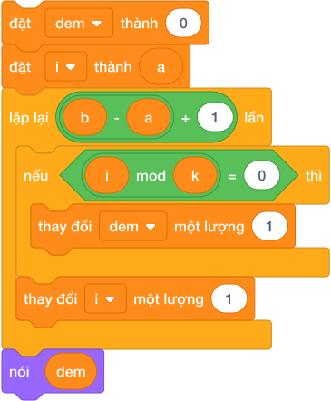

**Các bước thuật toán:**

1. Khởi tạo biến đếm: `đặt [dem v] thành (0)`.

2. Bắt đầu từ số nhỏ nhất: `đặt [i v] thành (A)`.

3. Lặp đúng `(B - A + 1)` lần:

   - Nếu số hiện tại chia hết cho $K$ (`< (i mod K) = 0 >`) thì tăng biến đếm lên 1.
   - Luôn tăng biến `i` lên 1 để chuyển sang số kế tiếp.

4. Thông báo kết quả qua biến `dem`.

---

## 3. Công Thức Đếm Toán Học Siêu Tốc $\mathcal{O}(1)$

Khi $A$ và $B$ là các con số khổng lồ (ví dụ đếm số chia hết cho 7 từ $1$ đến $1\,000\,000\,000$), việc chạy vòng lặp $1$ tỷ lần sẽ làm máy tính bị treo (Time Limit Exceeded). Ta dùng công thức toán học tính ngay lập tức trong **1 phép tính**:

### 3.1. Nguyên lý đếm từ $1$ đến $N$
Số lượng các số chia hết cho $K$ trong đoạn $[1, N]$ chính là phần nguyên của phép chia $N$ cho $K$:
$$\text{Count}(1, N) = \lfloor N / K \rfloor$$
Trong Scratch: `[làm tròn xuống v] của ((N) / (K))`.

> **Ví dụ:** Từ 1 đến 20 có bao nhiêu số chia hết cho 3?
> - Các số đó là: $3, 6, 9, 12, 15, 18$ (tổng cộng 6 số).
> - Tính nhanh: $\lfloor 20 / 3 \rfloor = 6$.

### 3.2. Nguyên lý bù trừ cho đoạn bất kỳ $[A, B]$
Để đếm trong đoạn $[A, B]$, ta lấy số lượng số chia hết từ $1 \to B$ trừ đi số lượng số chia hết từ $1 \to (A - 1)$:
$$\text{Count}(A, B) = \lfloor B / K \rfloor - \lfloor (A - 1) / K \rfloor$$

Khối phép toán trong Scratch:
`(([làm tròn xuống v] của ((B) / (K))) - ([làm tròn xuống v] của (((A) - (1)) / (K))))`

---

## 4. Các Dạng Số Đặc Biệt Thường Gặp Trong Lập Trình

### 4.1. Số Chính Phương (Perfect Square)
Số chính phương là số tự nhiên có căn bậc hai là một số nguyên (nghĩa là bằng bình phương của một số tự nhiên: $0, 1, 4, 9, 16, 25, 36, 49, \dots$).
- **Cách kiểm tra trong Scratch:** Lấy căn bậc hai của $N$, làm tròn xuống rồi bình phương lại xem có bằng chính $N$ không:
  $$< (([làm tròn xuống v] của ([căn bậc hai v] của (N))) \times ([làm tròn xuống v] của ([căn bậc hai v] của (N)))) = (N) >$$

### 4.2. Số Hoàn Hảo (Perfect Number)
Số hoàn hảo là số nguyên dương có **tổng tất cả các ước số thực sự của nó (ngoại trừ chính nó) bằng chính nó**.
- Số hoàn hảo nhỏ nhất là $6$: các ước nhỏ hơn 6 là $1, 2, 3$, và $1 + 2 + 3 = 6$.
- Số hoàn hảo tiếp theo là $28$: các ước nhỏ hơn 28 là $1, 2, 4, 7, 14$, và $1 + 2 + 4 + 7 + 14 = 28$.

### 4.3. Số Tự Mãn (Số Armstrong / Narcissistic)
Là số có $k$ chữ số, và tổng lũy thừa bậc $k$ của từng chữ số bằng chính nó.
- Ví dụ số 3 chữ số: $153 = 1^3 + 5^3 + 3^3 = 1 + 125 + 27 = 153$.
- Ta kết hợp thuật toán tách chữ số (Bài 10) và tích lũy thừa (Bài 05) để kiểm tra.

---

## 5. Bảng Mô Phỏng Đếm Số Chia Hết Cho 3 Trong Đoạn $[4, 12]$ (Dry Run Table)

Giả sử $A = 4, B = 12, K = 3$. Số lần lặp $= 12 - 4 + 1 = 9$ lần.

| Bước | Giá trị `i` | Điều kiện `< (i mod 3) = 0 >` | Biến đếm `dem` | Hành động tiếp theo |
|:---:|:---:|:---:|:---:|---|
| *Bắt đầu* | $i = 4$ | — | **$0$** | Bắt đầu vòng lặp |
| **1** | $i = 4$ | $4 \bmod 3 = 1 \ne 0$ $\to$ SAI | $0$ | Tăng $i = 5$ |
| **2** | $i = 5$ | $5 \bmod 3 = 2 \ne 0$ $\to$ SAI | $0$ | Tăng $i = 6$ |
| **3** | $i = 6$ | $6 \bmod 3 = 0$ $\to$ **ĐÚNG** | **$1$** | Đếm số 6! Tăng $i = 7$ |
| **4** | $i = 7$ | $7 \bmod 3 = 1 \ne 0$ $\to$ SAI | $1$ | Tăng $i = 8$ |
| **5** | $i = 8$ | $8 \bmod 3 = 2 \ne 0$ $\to$ SAI | $1$ | Tăng $i = 9$ |
| **6** | $i = 9$ | $9 \bmod 3 = 0$ $\to$ **ĐÚNG** | **$2$** | Đếm số 9! Tăng $i = 10$ |
| **7** | $i = 10$ | $10 \bmod 3 = 1 \ne 0$ $\to$ SAI | $2$ | Tăng $i = 11$ |
| **8** | $i = 11$ | $11 \bmod 3 = 2 \ne 0$ $\to$ SAI | $2$ | Tăng $i = 12$ |
| **9** | $i = 12$ | $12 \bmod 3 = 0$ $\to$ **ĐÚNG** | **$3$** | Đếm số 12! Tăng $i = 13$ |

$\implies$ Kết quả: `dem = 3` (các số $6, 9, 12$).
- Kiểm tra lại bằng công thức toán: $\lfloor 12 / 3 \rfloor - \lfloor (4 - 1) / 3 \rfloor = 4 - 1 = 3$ số (hoàn toàn chuẩn xác!).

---

## 6. Tử Huyệt & Các Bẫy Lỗi Thường Gặp (Bug Traps)

> **Bẫy 1: Quên trừ 1 ở đầu mút $A$ trong công thức toán $\mathcal{O}(1)$**
> - *Hiện tượng:* Tính `floor(B / K) - floor(A / K)`.
> - *Hậu quả:* Nếu chính số $A$ chia hết cho $K$ (như $A = 6, B = 12, K = 3$), ta có $12/3 - 6/3 = 4 - 2 = 2$ số (trong khi thực tế có 3 số là $6, 9, 12$). Phép trừ đã làm biến mất luôn chính số $A$!
> - *Khắc phục:* Luôn luôn là `floor((A - 1) / K)`.

> **Bẫy 2: Số lần lặp trong đoạn $[A, B]$**
> - *Hiện tượng:* Cho vòng lặp chạy `B - A` lần.
> - *Hậu quả:* Bị thiếu mất 1 số ở cuối mút.
> - *Khắc phục:* Số lần lặp luôn là `((B) - (A)) + (1)`.

> **Bẫy 3: Đặt khối tăng biến đếm `i` nằm bên trong khối `nếu...thì`**
> - *Hậu quả:* Chỉ khi nào số đó thỏa điều kiện thì `i` mới tăng, nếu gặp số không thỏa thì `i` đứng yên vĩnh viễn $\implies$ Vòng lặp vô tận, đơ chương trình!
> - *Khắc phục:* Khối `thay đổi [i v] một lượng 1` phải luôn nằm **bên ngoài** khối `nếu...thì`.

---

## 7. Bộ Câu Hỏi Trắc Nghiệm Củng Cố (Concept Quizzes)

1. **Từ số 1 đến số 10 có bao nhiêu số nguyên?**
   - A. 9
   - B. 10 *(Đáp án đúng: $10 - 1 + 1 = 10$)*
   - C. 11
   - D. 8

2. **Từ 1 đến 100 có bao nhiêu số chia hết cho 5?**
   - A. 20 *(Đáp án đúng: $\lfloor 100 / 5 \rfloor = 20$)*
   - B. 19
   - C. 25
   - D. 10

3. **Công thức toán tính nhanh số lượng số chia hết cho $K$ trong đoạn $[A, B]$ là:**
   - A. `(B / K) - (A / K)`
   - B. `floor(B / K) - floor((A - 1) / K)` *(Đáp án đúng)*
   - C. `floor(B / K) - floor(A / K)`
   - D. `(B - A) / K`

4. **Số nào sau đây là một số chính phương?**
   - A. 12
   - B. 24
   - C. 49 *(Đáp án đúng: $7 \times 7 = 49$)*
   - D. 50

5. **Số hoàn hảo nhỏ nhất là số nào?**
   - A. 1
   - B. 2
   - C. 6 *(Đáp án đúng: $1 + 2 + 3 = 6$)*
   - D. 28

6. **Điều kiện nào trong Scratch kiểm tra số $N$ là số chẵn?**
   - A. `< ((N) mod (2)) = (0) >` *(Đáp án đúng)*
   - B. `< ((N) mod (2)) = (1) >`
   - C. `< ((N) / (2)) = (0) >`
   - D. `< (N) > (2) >`

7. **Trong đoạn từ $10$ đến $30$, có bao nhiêu số chia hết cho $10$?**
   - A. 2
   - B. 3 *(Đáp án đúng: 10, 20, 30)*
   - C. 4
   - D. 1

8. **Nếu muốn duyệt các số chẵn từ $A$ (với $A$ chẵn) đến $B$, sau mỗi bước ta nên tăng biến `i` một lượng:**
   - A. 1
   - B. 2 *(Đáp án đúng: nhảy cách 2 đơn vị)*
   - C. 3
   - D. A

9. **Số 153 là một số đặc biệt thuộc loại nào?**
   - A. Số nguyên tố
   - B. Số hoàn hảo
   - C. Số Armstrong / Tự mãn *(Đáp án đúng: $1^3 + 5^3 + 3^3 = 153$)*
   - D. Số chính phương

10. **Khi viết vòng lặp kiểm tra các số từ $A$ đến $B$, nếu $A > B$ thì vòng lặp đếm `B - A + 1` lần sẽ:**
    - A. Chạy lùi về $B$
    - B. Không chạy hoặc gây lỗi vì số lần lặp bị âm *(Đáp án đúng)*
    - C. Tự động đổi chỗ $A$ và $B$
    - D. In ra kết quả 0

## Bài tập lesson

# DANH SÁCH BÀI TẬP THỰC HÀNH: BÀI 12 — ĐẾM SỐ THEO QUY LUẬT VÀ SỐ ĐẶC BIỆT

**Khóa học:** iKHEDU Scratch  
**Chuyên đề:** Chương 4: Số Học & Thuật Toán Tách Số  
> **Tổng số bài tập thực hành:** `12 bài` chuẩn hóa 100% (Từ kho bài tập `courses/scratch-bang-a/problems/`).  

---

## 1. Ma Trận Phân Tầng Bài Tập Toàn Diện

| STT | Mã bài toán | Tên bài tập | Phân tầng | Mức nhận thức | Thao tác trọng tâm |
|:---:|---|---|:---:|:---:|---|
| 1 | `sca_l12_p01_dem_so_chia_het_cho_k` | Đếm số chia hết cho K | **P0** | Khởi động & Quan sát | Cho 2 số nguyên dương $N$ và $K$. Hãy đếm xem trong các số t... |
| 2 | `sca_l12_p02_dem_so_le_trong_doan` | Đếm số lẻ trong đoạn | **P0** | Khởi động & Quan sát | Cho 2 số nguyên dương $A$ và $B$ ($1 \le A \le B \le 10^9$).... |
| 3 | `sca_l12_p03_kiem_tra_so_hoan_hao` | Kiểm tra số hoàn hảo | **P0** | Khởi động & Quan sát | Nhập số nguyên dương $N$. Kiểm tra $N$ có phải số hoàn hảo k... |
| 4 | `sca_l12_p04_so_armstrong_ba_chu_so` | Số Armstrong ba chữ số | **P1** | Cơ bản & Hoàn thành | Cho một số có đúng 3 chữ số $N$. Kiểm tra xem $N$ có phải là... |
| 5 | `sca_l12_p05_tim_tat_ca_so_hoan_hao_nho_hon_n` | Tìm tất cả số hoàn hảo nhỏ hơn N | **P1** | Cơ bản & Hoàn thành | Cho số nguyên dương $N$ ($1 \le N \le 10^4$). Hãy in ra tất ... |
| 6 | `sca_l12_p06_dem_boi_cua_3_nhung_khong_chia_het_cho_5` | Đếm bội của 3 nhưng không chia hết cho 5 | **P1** | Cơ bản & Hoàn thành | Cho 2 số nguyên dương $A$ và $B$ ($1 \le A \le B \le 10^{12}... |
| 7 | `sca_l12_p07_dem_so_chia_het_cho_2_hoac_3` | Đếm số chia hết cho 2 hoặc 3 | **P2** | Luyện tập & Vận dụng | Cho số nguyên dương $N$ ($1 \le N \le 10^{12}$). Hãy đếm xem... |
| 8 | `sca_l12_p08_cap_so_than_thiet` | Cặp số thân thiết | **P2** | Luyện tập & Vận dụng | Cho 2 số nguyên dương $A$ và $B$. In ra `YES` nếu chúng là c... |
| 9 | `sca_l12_p09_so_phong_phu_abundant_number` | Số phong phú (abundant number) | **P2** | Luyện tập & Vận dụng | Nhập số nguyên dương $N$. Hãy in ra tất cả các số phong phú ... |
| 10 | `sca_l12_p10_dem_so_khong_chua_chu_so_0` | Đếm số không chứa chữ số 0 | **P3** | Vận dụng cao & Sáng tạo | Cho số nguyên dương $N$. Hãy đếm xem từ 1 đến $N$ có bao nhi... |
| 11 | `sca_l12_p11_dem_so_chinh_phuong_trong_doan` | Đếm số chính phương trong đoạn | **P3** | Vận dụng cao & Sáng tạo | Cho 2 số nguyên dương $A$ và $B$ ($1 \le A \le B \le 10^{14}... |
| 12 | `sca_l12_p12_so_tu_man_narcissistic_number_k_chu_so` | Số tự mãn (Narcissistic number K chữ số) | **P3** | Vận dụng cao & Sáng tạo | Cho số nguyên dương $N$ ($1 \le N \le 10^9$). Hãy kiểm tra x... |

---

## 2. Chi Tiết Từng Bài Tập Thực Hành

### Bài 1 (P0): Đếm số chia hết cho K
* **Mã bài toán:** `sca_l12_p01_dem_so_chia_het_cho_k`
* **Độ khó & Phân tầng:** P0 (Khởi động & Quan sát)
* **Bối cảnh:** Bài toán đếm số phần tử chia hết cho một số nguyên $K$ trong một khoảng số liên tiếp là nền tảng xây dựng các thuật toán tối ưu thời gian $\mathcal{O}(1)$.
* **Nhiệm vụ:** Cho 2 số nguyên dương $N$ và $K$. Hãy đếm xem trong các số từ $1$ đến $N$, có bao nhiêu số chia hết cho $K$.
* **Dữ liệu vào (Input):** Hai số nguyên $N$ và $K$ ($1 \le N, K \le 10^9$) cách nhau bởi khoảng trắng.
* **Kết quả ra (Output):** Một số nguyên duy nhất là số lượng các số chia hết cho $K$.
* **Dữ liệu mẫu (Sample):**

### Input
```text
20 3
```
### Output
```text
6
```
### Giải thích

Có 6 số: 3, 6, 9, 12, 15, 18.

---

### Bài 2 (P0): Đếm số lẻ trong đoạn
* **Mã bài toán:** `sca_l12_p02_dem_so_le_trong_doan`
* **Độ khó & Phân tầng:** P0 (Khởi động & Quan sát)
* **Bối cảnh:** Trong thống kê dữ liệu liên tục, việc xác định số lượng phần tử lẻ trong một đoạn đóng vai trò kiểm tra tính phân bố đều của tập số liệu.
* **Nhiệm vụ:** Cho 2 số nguyên dương $A$ và $B$ ($1 \le A \le B \le 10^9$). Hãy đếm xem có bao nhiêu số lẻ nằm trong đoạn từ $A$ đến $B$ (tính cả $A$ và $B$).
* **Dữ liệu vào (Input):** Hai số $A, B$ trên cùng một dòng.
* **Kết quả ra (Output):** Số lượng số lẻ.
* **Dữ liệu mẫu (Sample):**

### Input
```text
3 8
```
### Output
```text
3
```
### Giải thích

Có 3 số lẻ là: 3, 5, 7.

---

### Bài 3 (P0): Kiểm tra số hoàn hảo
* **Mã bài toán:** `sca_l12_p03_kiem_tra_so_hoan_hao`
* **Độ khó & Phân tầng:** P0 (Khởi động & Quan sát)
* **Bối cảnh:** Bạn Mèo chia những chiếc kẹo cho các bạn búp bê của mình. Có hôm bạn ấy ngạc nhiên vì số kẹo chia ra vừa khít, không thừa chiếc nào. Cô giáo bảo đó chính là "Số hoàn hảo": một số nguyên dương $N$ được gọi là "Số hoàn hảo" nếu tổng tất cả các ước số nguyên dương nhỏ hơn $N$ bằng chính số $N$. Mèo có nhiều gói kẹo mà kiểm tra mãi chưa hết, hãy bạn ấy.
* **Nhiệm vụ:** Nhập số nguyên dương $N$. Kiểm tra $N$ có phải số hoàn hảo không. In `YES` nếu đúng, ngược lại in `NO`.
* **Dữ liệu vào (Input):** Một số nguyên $N$ ($1 \le N \le 10^6$).
* **Kết quả ra (Output):** `YES` hoặc `NO`.
* **Dữ liệu mẫu (Sample):**

### Input
```text
6
```
### Output
```text
YES
```
### Giải thích

Với dữ liệu đầu vào là `6`, kết quả thu được tương ứng là `YES`.

---

### Bài 4 (P1): Số Armstrong ba chữ số
* **Mã bài toán:** `sca_l12_p04_so_armstrong_ba_chu_so`
* **Độ khó & Phân tầng:** P1 (Cơ bản & Hoàn thành)
* **Bối cảnh:** Bạn Tôm tìm thấy một chiếc hộp phép thuật có khóa bằng số. Trên hộp ghi rằng chỉ những số Armstrong mới mở được khóa. Số Armstrong có 3 chữ số là số tự nhiên có dạng $\overline{abc}$ thỏa mãn $a^3 + b^3 + c^3 = \overline{abc}$. Tôm thử mãi chưa mở được hộp, hãy bạn ấy kiểm tra.
* **Nhiệm vụ:** Cho một số có đúng 3 chữ số $N$. Kiểm tra xem $N$ có phải là số Armstrong không. In `YES` hoặc `NO`.
* **Dữ liệu vào (Input):** Một số nguyên $N$ ($100 \le N \le 999$).
* **Kết quả ra (Output):** `YES` hoặc `NO`.
* **Dữ liệu mẫu (Sample):**

### Input
```text
153
```
### Output
```text
YES
```
### Giải thích

Với dữ liệu đầu vào là `153`, kết quả thu được tương ứng là `YES`.

---

### Bài 5 (P1): Tìm tất cả số hoàn hảo nhỏ hơn N
* **Mã bài toán:** `sca_l12_p05_tim_tat_ca_so_hoan_hao_nho_hon_n`
* **Độ khó & Phân tầng:** P1 (Cơ bản & Hoàn thành)
* **Bối cảnh:** Thí sinh đang tìm kiếm một giá trị đặc biệt trong tập dữ liệu. Hãy viết chương trình tìm kiếm hiệu quả.
* **Nhiệm vụ:** Cho số nguyên dương $N$ ($1 \le N \le 10^4$). Hãy in ra tất cả các số hoàn hảo nhỏ hơn hoặc bằng $N$ theo thứ tự tăng dần.
* **Dữ liệu vào (Input):** Một số nguyên $N$.
* **Kết quả ra (Output):** Các số hoàn hảo, cách nhau bởi khoảng trắng.
* **Dữ liệu mẫu (Sample):**

### Input
```text
30
```
### Output
```text
6 28
```
### Giải thích

Với dữ liệu đầu vào là `30`, kết quả thu được tương ứng là `6 28`.

---

### Bài 6 (P1): Đếm bội của 3 nhưng không chia hết cho 5
* **Mã bài toán:** `sca_l12_p06_dem_boi_cua_3_nhung_khong_chia_het_cho_5`
* **Độ khó & Phân tầng:** P1 (Cơ bản & Hoàn thành)
* **Bối cảnh:** Trong lý thuyết tập hợp, bài toán xác định các phần tử thuộc tập này nhưng không thuộc tập khác đòi hỏi kỹ thuật trừ tập hợp chính xác để tránh đếm lặp.
* **Nhiệm vụ:** Cho 2 số nguyên dương $A$ và $B$ ($1 \le A \le B \le 10^{12}$). Hãy đếm xem trong đoạn từ $A$ đến $B$ có bao nhiêu số chia hết cho 3 nhưng **không chia hết cho 5**.
* **Dữ liệu vào (Input):** Hai số $A$ và $B$ cách nhau bởi khoảng trắng.
* **Kết quả ra (Output):** Số lượng số thỏa mãn.
* **Dữ liệu mẫu (Sample):**

### Input
```text
1 30
```
### Output
```text
8
```
### Giải thích

Với dữ liệu đầu vào là `1 30`, kết quả thu được tương ứng là `8`.

---

### Bài 7 (P2): Đếm số chia hết cho 2 hoặc 3
* **Mã bài toán:** `sca_l12_p07_dem_so_chia_het_cho_2_hoac_3`
* **Độ khó & Phân tầng:** P2 (Luyện tập & Vận dụng)
* **Bối cảnh:** Bài toán đếm số lượng phần tử thỏa mãn ít nhất một trong hai điều kiện chia hết là bài toán mẫu mực áp dụng Nguyên lý Bao hàm – Loại trừ (Inclusion-Exclusion).
* **Nhiệm vụ:** Cho số nguyên dương $N$ ($1 \le N \le 10^{12}$). Hãy đếm xem từ 1 đến $N$ có bao nhiêu số chia hết cho 2 hoặc chia hết cho 3.
* **Dữ liệu vào (Input):** Một số nguyên $N$.
* **Kết quả ra (Output):** Số lượng số thỏa mãn.
* **Dữ liệu mẫu (Sample):**

### Input
```text
10
```
### Output
```text
7
```
### Giải thích

Các số là: 2, 3, 4, 6, 8, 9, 10 (có 7 số).

---

### Bài 8 (P2): Cặp số thân thiết
* **Mã bài toán:** `sca_l12_p08_cap_so_than_thiet`
* **Độ khó & Phân tầng:** P2 (Luyện tập & Vận dụng)
* **Bối cảnh:** Hai bạn thân Nấm và Mít chơi trò chia kẹo công bằng cho nhau. Cô giáo kể rằng trong thế giới các con số cũng có những đôi bạn như vậy. Hai số $A$ và $B$ ($A \ne B$) được gọi là "Cặp số thân thiết" nếu tổng các ước số nhỏ hơn $A$ bằng $B$, và tổng các ước số nhỏ hơn $B$ bằng $A$. Hai bạn tìm mãi chưa ra các cặp số thân nhau, hãy hai bạn kiểm tra.
* **Nhiệm vụ:** Cho 2 số nguyên dương $A$ và $B$. In ra `YES` nếu chúng là cặp số thân thiết, ngược lại in `NO`.
* **Dữ liệu vào (Input):** Hai số $A, B$ ($1 \le A, B \le 10^5$).
* **Kết quả ra (Output):** `YES` hoặc `NO`.
* **Dữ liệu mẫu (Sample):**

### Input
```text
220 284
```
### Output
```text
YES
```
### Giải thích

Với dữ liệu đầu vào là `220 284`, kết quả thu được tương ứng là `YES`.

---

### Bài 9 (P2): Số phong phú (abundant number)
* **Mã bài toán:** `sca_l12_p09_so_phong_phu_abundant_number`
* **Độ khó & Phân tầng:** P2 (Luyện tập & Vận dụng)
* **Bối cảnh:** Bạn Ổi có một giỏ đầy những quả ngọt để chia cho bạn bè. Có những con số cũng "rộng rãi" giống như giỏ quả của Ổi vậy. Một số tự nhiên được gọi là "Số phong phú" nếu tổng các ước số nhỏ hơn nó lớn hơn chính nó (ví dụ: số 12 có tổng các ước nhỏ hơn nó là $1+2+3+4+6=16 > 12$). Ổi muốn tìm thật nhiều con số rộng rãi như thế, hãy bạn ấy.
* **Nhiệm vụ:** Nhập số nguyên dương $N$. Hãy in ra tất cả các số phong phú nhỏ hơn hoặc bằng $N$.
* **Dữ liệu vào (Input):** Số nguyên $N$ ($1 \le N \le 10^4$).
* **Kết quả ra (Output):** Dãy các số phong phú tăng dần trên một dòng.
* **Dữ liệu mẫu (Sample):**

### Input
```text
20
```
### Output
```text
12 18 20
```
### Giải thích

Với dữ liệu đầu vào là `20`, kết quả thu được tương ứng là `12 18 20`.

---

### Bài 10 (P3): Đếm số không chứa chữ số 0
* **Mã bài toán:** `sca_l12_p10_dem_so_khong_chua_chu_so_0`
* **Độ khó & Phân tầng:** P3 (Vận dụng cao & Sáng tạo)
* **Bối cảnh:** Trong thiết kế hệ thống hiển thị số không hỗ trợ ký tự 0, các số chỉ tạo bởi các chữ số từ 1 đến 9 được coi là số hợp lệ cần được thống kê chính xác.
* **Nhiệm vụ:** Cho số nguyên dương $N$. Hãy đếm xem từ 1 đến $N$ có bao nhiêu số mà trong cách ghi thập phân của nó **không chứa bất kỳ chữ số 0 nào**.
* **Dữ liệu vào (Input):** Một số nguyên $N$ ($1 \le N \le 10^6$).
* **Kết quả ra (Output):** Số lượng số thỏa mãn.
* **Dữ liệu mẫu (Sample):**

### Input
```text
15
```
### Output
```text
14
```
### Giải thích

Từ 1 đến 15 chỉ có duy nhất số 10 chứa chữ số 0. Vậy có $15 - 1 = 14$ số.

---

### Bài 11 (P3): Đếm số chính phương trong đoạn
* **Mã bài toán:** `sca_l12_p11_dem_so_chinh_phuong_trong_doan`
* **Độ khó & Phân tầng:** P3 (Vận dụng cao & Sáng tạo)
* **Bối cảnh:** Xác định số lượng số chính phương trong một phạm vi lớn là bài toán tối ưu quan trọng, yêu cầu chuyển đổi từ duyệt từng phần tử sang phương pháp tính giải tích bằng căn bậc hai.
* **Nhiệm vụ:** Cho 2 số nguyên dương $A$ và $B$ ($1 \le A \le B \le 10^{14}$). Hãy đếm xem có bao nhiêu số chính phương nằm trong đoạn từ $A$ đến $B$.
* **Dữ liệu vào (Input):** Hai số nguyên $A, B$ trên cùng một dòng.
* **Kết quả ra (Output):** Số lượng số chính phương trong đoạn $[A, B]$.
* **Dữ liệu mẫu (Sample):**

### Input
```text
5 25
```
### Output
```text
3
```
### Giải thích

Có 3 số chính phương là 9, 16, 25.

---

### Bài 12 (P3): Số tự mãn (Narcissistic number K chữ số)
* **Mã bài toán:** `sca_l12_p12_so_tu_man_narcissistic_number_k_chu_so`
* **Độ khó & Phân tầng:** P3 (Vận dụng cao & Sáng tạo)
* **Bối cảnh:** Bạn Kiến rất tự hào vì mỗi bạn kiến trong đàn đều góp sức làm nên tổ lớn. Bạn ấy nghe cô kể về những con số cũng "tự hào" như vậy. Một số tự nhiên $N$ có $K$ chữ số được gọi là "Số tự mãn" (Narcissistic number) nếu tổng lũy thừa bậc $K$ của các chữ số của nó đúng bằng chính số $N$.
 Ví dụ:

 * $N = 153$ có 3 chữ số: $1^3 + 5^3 + 3^3 = 153$ $\implies$ Thỏa mãn.
 * $N = 1634$ có 4 chữ số: $1^4 + 6^4 + 3^4 + 4^4 = 1 + 1296 + 81 + 256 = 1634$ $\implies$ Thỏa mãn. Kiến đố em tìm thêm những con số đặc biệt này, hãy bạn ấy.
* **Nhiệm vụ:** Cho số nguyên dương $N$ ($1 \le N \le 10^9$). Hãy kiểm tra xem $N$ có phải là số tự mãn không. In `YES` nếu đúng, ngược lại in `NO`.
* **Dữ liệu vào (Input):** Một số nguyên $N$.
* **Kết quả ra (Output):** `YES` hoặc `NO`.
* **Dữ liệu mẫu (Sample):**

### Input
```text
1634
```
### Output
```text
YES
```
### Giải thích

Với dữ liệu đầu vào là `1634`, kết quả thu được tương ứng là `YES`.

---

================================================================================
# CHƯƠNG 05: DANH SÁCH (LIST) & THỐNG KÊ DỮ LIỆU
================================================================================

--------------------------------------------------------------------------------
<!-- Bài 13: Danh sách và thao tác cơ bản -->
--------------------------------------------------------------------------------

## Lý thuyết và Concept Quiz

# Bài 13: Danh sách và thao tác cơ bản

## 1. Bản Chất Của Danh Sách (List) — Cấu Trúc Dữ Liệu Nền Tảng

Cho đến bài học trước, mỗi biến số trong Scratch chỉ lưu trữ được **đúng 1 giá trị duy nhất** tại một thời điểm (như một chiếc hộp nhỏ chỉ đựng vừa một quả bóng). Nếu muốn lưu điểm kiểm tra của 40 bạn học sinh trong lớp, chẳng lẽ ta phải tạo 40 biến số khác nhau: `diem1`, `diem2`, ..., `diem40`?

Điều đó là bất khả thi và cồng kềnh. Khoa học máy tính giải quyết vấn đề này bằng **Danh sách (List)**:

- **Danh sách** giống như một dãy tủ có nhiều ngăn được đánh số thứ tự từ $1, 2, 3, \dots, N$.
- Mỗi ngăn tủ gọi là một **phần tử (Element)**, chứa một dữ liệu riêng biệt.
- Chỉ số của ngăn tủ gọi là **vị trí / chỉ số (Index)**.

---

## 2. Bảng Tra Cứu Các Khối Lệnh Danh Sách Trong Scratch 3.0

Trong nhóm **Các biến số (Variables)**, bấm nút **Tạo một danh sách** để xuất hiện nhóm khối lệnh màu cam đậm:


| Khối lệnh Scratch 3.0 Tiếng Việt | Thao tác | Ý nghĩa sư phạm & Chức năng |
|---|---|---|
| `thêm (X) vào [Dãy số v]` | Thêm vào cuối | Chèn thêm giá trị $X$ vào cuối cùng của danh sách |
| `xóa (1) của [Dãy số v]` | Xóa phần tử | Xóa phần tử tại vị trí chỉ định, các phần tử sau dồn lên |
| `xóa tất cả của [Dãy số v]` | Làm sạch danh sách | Xóa sạch toàn bộ danh sách (về 0 phần tử) |
| `chèn (X) vào (1) của [Dãy số v]` | Chèn vào vị trí | Nhét $X$ vào vị trí cụ thể, đẩy các phần tử khác lùi lại |
| `thay thế phần tử (i) của [Dãy số v] bằng (X)` | Thay thế giá trị | Ghi đè giá trị mới vào ô thứ $i$ |
| `phần tử (i) của [Dãy số v]` | Đọc giá trị ô | Khối tròn: Đọc giá trị tại ngăn thứ $i$ |
| `vị trí của (X) trong [Dãy số v]` | Tìm vị trí | Tìm xem giá trị $X$ nằm ở ngăn số mấy |
| `kích thước của [Dãy số v]` | Đếm số phần tử | Khối tròn: Đếm tổng số lượng phần tử hiện có |
| `[Dãy số v] chứa (X) ?` | Kiểm tra tồn tại | Khối lục giác điều kiện: Kiểm tra xem $X$ có tồn tại trong danh sách không |

> ⚠️ **Quy tắc vàng:** Trong Scratch, chỉ số danh sách bắt đầu từ **vị trí 1** (1-based index). Phần tử đầu tiên luôn là `phần tử (1)`, phần tử cuối cùng là `phần tử (kích thước của danh sách)`.

---

## 3. Khung Mẫu Thuật Toán Nhập $N$ Số & Xử Lý Dữ Liệu

Trong các bài toán lập trình, bài toán thường yêu cầu: *"Cho số nguyên $N$, sau đó nhập lần lượt $N$ số nguyên vào danh sách rồi tính tổng..."*.


### Các giai đoạn thực thi chuẩn mực:

1. **Giai đoạn khởi tạo:** Luôn dùng `xóa tất cả của [Dãy số v]` để làm sạch bộ nhớ từ các lần chạy trước.

2. **Giai đoạn nhập dữ liệu:** Hỏi số lượng $N$, sau đó lặp đúng $N$ lần, mỗi lần hỏi một số và lập tức dùng `thêm (câu trả lời) vào [Dãy số v]`.

3. **Giai đoạn duyệt danh sách:** 
   - Đặt biến chỉ số `i = 1`, biến tích lũy `tong = 0`.
   - Lặp `(kích thước của [Dãy số v])` lần:

     - Cộng dồn `phần tử (i) của [Dãy số v]` vào biến `tong`.
     - Tăng chỉ số `i` lên 1 để bước sang ngăn tủ kế tiếp.

---

## 4. Bảng Mô Phỏng Duyệt Danh Sách `[5, 8, 3]` (Dry Run Table)

Giả sử danh sách `Dãy số` hiện có 3 phần tử: ngăn 1 chứa `5`, ngăn 2 chứa `8`, ngăn 3 chứa `3`. Kích thước $= 3$.

| Bước | Biến chỉ số `i` | Khối `phần tử (i)` lấy được | Phép tính biến `tong` | Kết quả `tong` | Hành động chuyển tiếp |
|:---:|:---:|:---:|:---:|:---:|---|
| *Khởi tạo* | $i = 1$ | — | Khởi tạo ban đầu | **$0$** | Bắt đầu vòng lặp duyệt |
| **Vòng 1** | $i = 1$ | `phần tử (1)` $\to$ **$5$** | $0 + 5$ | **$5$** | Tăng $i = 2$ |
| **Vòng 2** | $i = 2$ | `phần tử (2)` $\to$ **$8$** | $5 + 8$ | **$13$** | Tăng $i = 3$ |
| **Vòng 3** | $i = 3$ | `phần tử (3)` $\to$ **$3$** | $13 + 3$ | **$16$** | Tăng $i = 4$ |
| **Dừng** | $i = 4$ | — | $4 > 3$ (vượt kích thước) | **$16$** | Vòng lặp kết thúc |

$\implies$ Sau 3 vòng lặp, nhân vật thông báo kết quả: `Tổng = 16`.

---

## 5. Tử Huyệt & Các Bẫy Lỗi Thường Gặp (Bug Traps)

> **Bẫy 1: Quên xóa sạch danh sách ở đầu kịch bản**
> - *Hiện tượng:* Không đặt `xóa tất cả của [Dãy số v]` dưới cờ xanh.
> - *Hậu quả:* Mỗi lần bấm cờ xanh để chạy thử lại bài, các con số mới sẽ được nối đuôi vào các con số cũ! Danh sách tăng từ 3 lên 6, 9 phần tử $\implies$ Kết quả tính toán sai hoàn toàn!
> - *Khắc phục:* Luôn luôn dọn sạch danh sách ngay dòng đầu tiên.

> **Bẫy 2: Bẫy chỉ số 0 (Zero-Index Trap)**
> - *Hiện tượng:* Nhập thói quen từ ngôn ngữ khác hoặc viết `phần tử (0) của [Dãy số v]`.
> - *Hậu quả:* Trong Scratch không có phần tử số 0! Khối này sẽ trả về giá trị rỗng hoặc `0`, làm sai lệch thuật toán.
> - *Khắc phục:* Luôn bắt đầu duyệt từ `i = 1`.

> **Bẫy 3: Xóa phần tử khi đang duyệt danh sách bằng vòng lặp xuôi**
> - *Hiện tượng:* Khi duyệt từ $1 \to N$, nếu gặp số âm ta bấm `xóa (i) của [Dãy số]`.
> - *Hậu quả:* Khi xóa phần tử thứ $i$, phần tử thứ $i+1$ sẽ lập tức bị kéo dồn lên thành vị trí $i$. Bước tiếp theo vòng lặp tăng $i$ lên 1, dẫn đến **bỏ qua hoàn toàn phần tử vừa dồn lên**!
> - *Khắc phục:* Muốn xóa các phần tử trong danh sách, ta phải **duyệt ngược từ cuối về đầu** (từ `kích thước` giảm dần về `1`).

---

## 6. Bộ Câu Hỏi Trắc Nghiệm Củng Cố (Concept Quizzes)

1. **Phần tử đầu tiên trong một danh sách Scratch được đánh số thứ tự là:**
   - A. 0
   - B. 1 *(Đáp án đúng: Scratch dùng 1-based indexing)*
   - C. -1
   - D. Tùy ý người lập trình

2. **Muốn biết danh sách hiện tại đang có bao nhiêu phần tử, ta dùng khối:**
   - A. `độ dài của [Dãy số v]`
   - B. `kích thước của [Dãy số v]` *(Đáp án đúng)*
   - C. `số lượng của [Dãy số v]`
   - D. `tổng của [Dãy số v]`

3. **Khối lệnh nào sau đây dùng để chèn thêm một phần tử vào cuối danh sách?**
   - A. `thay thế phần tử cuối của danh sách`
   - B. `chèn (X) vào (cuối) của danh sách`
   - C. `thêm (X) vào [danh_sách v]` *(Đáp án đúng)*
   - D. `đặt [danh_sách v] thành (X)`

4. **Nếu danh sách đang có 5 phần tử, khối `phần tử (kích thước của [Dãy số v]) của [Dãy số v]` sẽ lấy ra:**
   - A. Phần tử đầu tiên
   - B. Phần tử ở chính giữa
   - C. Phần tử cuối cùng *(Đáp án đúng: phần tử thứ 5)*
   - D. Số 5

5. **Để làm sạch hoàn toàn một danh sách trước khi nhập dữ liệu mới, ta dùng khối:**
   - A. `xóa (1) của [danh_sách v]`
   - B. `xóa (cuối) của [danh_sách v]`
   - C. `xóa tất cả của [danh_sách v]` *(Đáp án đúng)*
   - D. `đặt [danh_sách v] thành (0)`

6. **Điều kiện nào kiểm tra xem giá trị `10` đã có mặt trong danh sách `Điểm` hay chưa?**
   - A. `< [Điểm v] chứa (10) ?>` *(Đáp án đúng)*
   - B. `< (10) trong [Điểm v] ?>`
   - C. `< [Điểm v] = (10) >`
   - D. `< phần tử (10) của [Điểm v] >`

7. **Giả sử danh sách có các số $[4, 7, 9]$. Sau khi chạy lệnh `xóa (2) của [Dãy số v]`, danh sách còn lại là:**
   - A. $[4, 9]$ *(Đáp án đúng: xóa số 7 ở vị trí 2, số 9 dồn lên vị trí 2)*
   - B. $[7, 9]$
   - C. $[4, 7]$
   - D. $[4, 0, 9]$

8. **Khi duyệt qua toàn bộ một danh sách gồm $N$ phần tử, biến chỉ số `i` cần chạy từ:**
   - A. $0$ đến $N - 1$
   - B. $1$ đến $N$ *(Đáp án đúng)*
   - C. $1$ đến $N + 1$
   - D. $0$ đến $N$

9. **Nếu gọi `phần tử (10) của [Dãy số v]` trong khi danh sách chỉ có 3 phần tử, kết quả trả về là:**
   - A. Báo lỗi đơ chương trình
   - B. Giá trị rỗng (hoặc 0) *(Đáp án đúng)*
   - C. Trả về phần tử thứ 3
   - D. Tự động thêm 7 phần tử nữa

10. **Lý do vì sao phải duyệt danh sách từ cuối về đầu khi cần xóa các phần tử thỏa mãn điều kiện là:**
    - A. Vì chạy ngược máy tính chạy nhanh hơn
    - B. Để tránh hiện tượng các phần tử phía sau bị kéo dồn vị trí làm sót phần tử *(Đáp án đúng)*
    - C. Vì Scratch không cho phép xóa từ đầu
    - D. Để danh sách tự động đảo ngược

## Bài tập lesson

# DANH SÁCH BÀI TẬP THỰC HÀNH: BÀI 13 — Danh sách và thao tác cơ bản

**Khóa học:** iKHEDU Scratch  
**Chuyên đề:** Chương 5: Danh Sách & Thống Kê Dữ Liệu  
> **Tổng số bài tập thực hành:** `26 bài` chuẩn hóa 100% (Từ kho bài tập `courses/scratch-bang-a/problems/`).  

---

## 1. Ma Trận Phân Tầng Bài Tập Toàn Diện

| STT | Mã bài toán | Tên bài tập | Phân tầng | Mức nhận thức | Thao tác trọng tâm |
|:---:|---|---|:---:|:---:|---|
| 1 | `sca_l13_p01_nhap_day_so_in_phan_tu_dau_cuoi` | Nhập dãy số & in phần tử đầu - cuối | **P0** | Khởi động & Quan sát | Cho một dãy gồm $N$ số nguyên. Hãy in ra phần tử đầu tiên và... |
| 2 | `sca_l13_p02_them_diem_vao_danh_sach` | Thêm điểm vào danh sách | **P0** | Khởi động & Quan sát | Cho danh sách các số nguyên ban đầu và số $X$. Hãy thêm $X$ ... |
| 3 | `sca_l13_p03_tinh_tong_cac_phan_tu_trong_day` | Tính tổng các phần tử trong dãy | **P0** | Khởi động & Quan sát | Cho một dãy gồm $N$ số nguyên. Hãy tính tổng tất cả các phần... |
| 4 | `sca_l13_p04_dem_so_luong_so_chan_trong_mang` | Đếm số lượng số chẵn trong mảng | **P0** | Khởi động & Quan sát | Cho một dãy gồm $N$ số nguyên dương. Hãy đếm xem có bao nhiê... |
| 5 | `sca_l13_p05_tim_so_lon_nhat_nho_nhat` | Tìm số lớn nhất & nhỏ nhất | **P0** | Khởi động & Quan sát | Cho dãy $N$ số nguyên. Hãy tìm giá trị lớn nhất và giá trị n... |
| 6 | `sca_l13_p06_in_day_so_theo_thu_tu_dao_nguoc` | In dãy số theo thứ tự đảo ngược | **P0** | Khởi động & Quan sát | Cho dãy $N$ số nguyên. Hãy in ra dãy số theo thứ tự ngược lạ... |
| 7 | `sca_l13_p07_dem_so_lan_xuat_hien_cua_x` | Đếm số lần xuất hiện của X | **P1** | Cơ bản & Hoàn thành | Cho dãy $N$ số nguyên và một số nguyên $X$. Hãy đếm xem số $... |
| 8 | `sca_l13_p08_tim_vi_tri_dau_tien_cua_x` | Tìm vị trí đầu tiên của X | **P1** | Cơ bản & Hoàn thành | Cho dãy $N$ số nguyên và số $X$. Hãy tìm vị trí (chỉ số inde... |
| 9 | `sca_l13_p09_tach_mang_chan_va_mang_le` | Tách mảng chẵn và mảng lẻ | **P1** | Cơ bản & Hoàn thành | Cho dãy $N$ số nguyên. Hãy tách dãy thành 2 danh sách: một d... |
| 10 | `sca_l13_p10_xoa_phan_tu_dau_tien_bang_x` | Xóa phần tử đầu tiên bằng X | **P1** | Cơ bản & Hoàn thành | Cho dãy $N$ số nguyên và số $X$. Nếu $X$ có trong dãy, hãy x... |
| 11 | `sca_l13_p11_thay_the_tat_ca_so_am_bang_so_0` | Thay thế tất cả số âm bằng số 0 | **P1** | Cơ bản & Hoàn thành | Cho dãy $N$ số nguyên gồm cả số âm và số dương. Hãy thay thế... |
| 12 | `sca_l13_p12_chen_so_vao_vi_tri_k` | Chèn số vào vị trí K | **P1** | Cơ bản & Hoàn thành | Cho dãy $N$ số nguyên, số nguyên $X$ và vị trí index $K$ ($0... |
| 13 | `sca_l13_p13_xoay_vong_danh_sach_sang_phai` | Xoay vòng danh sách sang phải | **P1** | Cơ bản & Hoàn thành | Cho dãy $N$ số nguyên và số $K$ ($1 \le K \le N \le 10^5$). ... |
| 14 | `sca_l13_p14_cap_so_co_tong_bang_s` | Cặp số có tổng bằng S | **P2** | Luyện tập & Vận dụng | Cho dãy gồm $N$ số nguyên đôi một khác nhau và một số nguyên... |
| 15 | `sca_l13_p15_heo_dat_tiet_kiem` | Heo đất tiết kiệm | **P2** | Luyện tập & Vận dụng | Hãy tính tổng số tiền trong heo đất sau $N$ ngày. |
| 16 | `sca_l13_p16_ve_so_may_man` | Vé số may mắn | **P2** | Luyện tập & Vận dụng | Hãy kiểm tra xem tấm vé số $N$ có phải là vé may mắn không. ... |
| 17 | `sca_l13_p17_bang_diem_lop_hoc` | Bảng điểm lớp học | **P2** | Luyện tập & Vận dụng | Cho điểm của $N$ bạn. Hãy in ra điểm cao nhất, điểm thấp nhấ... |
| 18 | `sca_l13_p18_mat_khau_bi_an` | Mật khẩu bị ẩn | **P2** | Luyện tập & Vận dụng | Cho chuỗi $S$. Hãy đếm xem có bao nhiêu ký tự trong $S$ là c... |
| 19 | `sca_l13_p19_dem_keo_chan_le` | Đếm kẹo chẵn lẻ | **P2** | Luyện tập & Vận dụng | Cho $N$ số nguyên. Hãy đếm số lượng số chẵn và số lượng số l... |
| 20 | `sca_l13_p20_tong_chu_so_lon_nhat` | Tổng chữ số lớn nhất | **P3** | Vận dụng cao & Sáng tạo | Hãy tìm số báo danh của bạn thắng cuộc. |
| 21 | `sca_l13_p21_so_ghe_doi_xung` | Số ghế đối xứng | **P3** | Vận dụng cao & Sáng tạo | Hãy kiểm tra số $N$ có phải số đối xứng không. In `YES` nếu ... |
| 22 | `sca_l13_p22_xep_hang_chieu_cao` | Xếp hàng chiều cao | **P3** | Vận dụng cao & Sáng tạo | Cho chiều cao của $N$ bạn. Hãy in ra chiều cao theo thứ tự t... |
| 23 | `sca_l13_p23_thuong_doc_sach` | Thưởng đọc sách | **P3** | Vận dụng cao & Sáng tạo | Cho số $N$. Hãy tính tổng số sao từ quyển 1 đến quyển $N$. |
| 24 | `sca_l13_p24_dem_tu_dai` | Đếm từ dài | **P3** | Vận dụng cao & Sáng tạo | Cho số $K$ và câu văn $S$. Hãy đếm số từ có độ dài lớn hơn $... |
| 25 | `sca_l13_p25_dem_sao_nguyen_to` | Đếm sao nguyên tố | **P3** | Vận dụng cao & Sáng tạo | Cho số $N$. Hãy đếm có bao nhiêu số nguyên tố từ 1 đến $N$. |
| 26 | `sca_l13_p26_chuyen_tau_vuot_deo` | Chuyến tàu vượt đèo | **P3** | Vận dụng cao & Sáng tạo | Cho dãy $N$ số. Hãy đếm số lần phần tử lớn hơn tất cả các ph... |

---

## 2. Chi Tiết Từng Bài Tập Thực Hành

### Bài 1 (P0): Nhập dãy số & in phần tử đầu - cuối
* **Mã bài toán:** `sca_l13_p01_nhap_day_so_in_phan_tu_dau_cuoi`
* **Độ khó & Phân tầng:** P0 (Khởi động & Quan sát)
* **Bối cảnh:** Truy xuất phần tử biên (đầu dãy và cuối dãy) là thao tác truy cập nhanh có độ phức tạp $\mathcal{O}(1)$ trên cấu trúc dữ liệu danh sách.
* **Nhiệm vụ:** Cho một dãy gồm $N$ số nguyên. Hãy in ra phần tử đầu tiên và phần tử cuối cùng của dãy số đó.
* **Dữ liệu vào (Input):** * Dòng 1: Số nguyên dương $N$ ($1 \le N \le 1000$).
 * Dòng 2: Gồm $N$ số nguyên cách nhau bởi khoảng trắng.
* **Kết quả ra (Output):** In phần tử đầu tiên và phần tử cuối cùng trên một dòng, cách nhau một khoảng trắng.
* **Dữ liệu mẫu (Sample):**

### Input
```text
5
10 25 3 47 99
```
### Output
```text
10 99
```
### Giải thích

Với dữ liệu đầu vào là `5
10 25 3 47 99`, kết quả thu được tương ứng là `10 99`.

---

### Bài 2 (P0): Thêm điểm vào danh sách
* **Mã bài toán:** `sca_l13_p02_them_diem_vao_danh_sach`
* **Độ khó & Phân tầng:** P0 (Khởi động & Quan sát)
* **Bối cảnh:** Lớp của bạn Na vừa làm bài kiểm tra nên cô giáo có một danh sách điểm kiểm tra ban đầu. Sáng nay, bạn Tí nộp bài muộn và cô đã chấm cho bạn điểm $X$. Cô muốn viết thêm điểm $X$ này vào cuối danh sách mà không làm mất điểm của các bạn khác. Hãy giúp cô thêm điểm mới vào danh sách.
* **Nhiệm vụ:** Cho danh sách các số nguyên ban đầu và số $X$. Hãy thêm $X$ vào cuối danh sách và in ra toàn bộ danh sách mới.
* **Dữ liệu vào (Input):** * Dòng 1: Danh sách các số nguyên cách nhau bởi khoảng trắng.
 * Dòng 2: Số nguyên $X$.
* **Kết quả ra (Output):** Danh sách các số sau khi thêm $X$, cách nhau bởi khoảng trắng.
* **Dữ liệu mẫu (Sample):**

### Input
```text
8 9 7 10
9
```
### Output
```text
8 9 7 10 9
```
### Giải thích

Với dữ liệu đầu vào là `8 9 7 10
9`, kết quả thu được tương ứng là `8 9 7 10 9`.

---

### Bài 3 (P0): Tính tổng các phần tử trong dãy
* **Mã bài toán:** `sca_l13_p03_tinh_tong_cac_phan_tu_trong_day`
* **Độ khó & Phân tầng:** P0 (Khởi động & Quan sát)
* **Bối cảnh:** Trong bài kiểm tra, người dùng cần tính nhanh tổng một dãy số. Hãy viết chương trình hỗ trợ tính toán.
* **Nhiệm vụ:** Cho một dãy gồm $N$ số nguyên. Hãy tính tổng tất cả các phần tử trong dãy số.
* **Dữ liệu vào (Input):** * Dòng 1: Số nguyên dương $N$ ($1 \le N \le 10^5$).
 * Dòng 2: $N$ số nguyên ($|A_i| \le 10^9$).
* **Kết quả ra (Output):** Tổng các phần tử trong dãy.
* **Dữ liệu mẫu (Sample):**

### Input
```text
4
10 20 30 40
```
### Output
```text
100
```
### Giải thích

Với dữ liệu đầu vào là `4
10 20 30 40`, kết quả thu được tương ứng là `100`.

---

### Bài 4 (P0): Đếm số lượng số chẵn trong mảng
* **Mã bài toán:** `sca_l13_p04_dem_so_luong_so_chan_trong_mang`
* **Độ khó & Phân tầng:** P0 (Khởi động & Quan sát)
* **Bối cảnh:** Thống kê số lượng phần tử chẵn trong mảng dữ liệu là bài toán lọc dữ liệu cơ bản để phân loại luồng số liệu đầu vào.
* **Nhiệm vụ:** Cho một dãy gồm $N$ số nguyên dương. Hãy đếm xem có bao nhiêu số chẵn trong dãy.
* **Dữ liệu vào (Input):** * Dòng 1: Số nguyên $N$ ($1 \le N \le 10^5$).
 * Dòng 2: $N$ số nguyên.
* **Kết quả ra (Output):** Số lượng số chẵn.
* **Dữ liệu mẫu (Sample):**

### Input
```text
5
2 5 8 10 13
```
### Output
```text
3
```
### Giải thích

Với dữ liệu đầu vào là `5
2 5 8 10 13`, kết quả thu được tương ứng là `3`.

---

### Bài 5 (P0): Tìm số lớn nhất & nhỏ nhất
* **Mã bài toán:** `sca_l13_p05_tim_so_lon_nhat_nho_nhat`
* **Độ khó & Phân tầng:** P0 (Khởi động & Quan sát)
* **Bối cảnh:** Thí sinh đang tìm kiếm một giá trị đặc biệt trong tập dữ liệu. Hãy viết chương trình tìm kiếm hiệu quả.
* **Nhiệm vụ:** Cho dãy $N$ số nguyên. Hãy tìm giá trị lớn nhất và giá trị nhỏ nhất trong dãy số.
* **Dữ liệu vào (Input):** * Dòng 1: Số nguyên $N$ ($1 \le N \le 10^5$).
 * Dòng 2: $N$ số nguyên.
* **Kết quả ra (Output):** Giá trị lớn nhất, theo sau là giá trị nhỏ nhất, cách nhau một khoảng trắng.
* **Dữ liệu mẫu (Sample):**

### Input
```text
5
12 5 89 3 45
```
### Output
```text
89 3
```
### Giải thích

Với dữ liệu đầu vào là `5
12 5 89 3 45`, kết quả thu được tương ứng là `89 3`.

---

### Bài 6 (P0): In dãy số theo thứ tự đảo ngược
* **Mã bài toán:** `sca_l13_p06_in_day_so_theo_thu_tu_dao_nguoc`
* **Độ khó & Phân tầng:** P0 (Khởi động & Quan sát)
* **Bối cảnh:** Đảo ngược thứ tự các phần tử trong danh sách dữ liệu thường được yêu cầu khi cần phân tích luồng sự kiện theo trình tự thời gian từ mới nhất về cũ nhất.
* **Nhiệm vụ:** Cho dãy $N$ số nguyên. Hãy in ra dãy số theo thứ tự ngược lại (từ phần tử cuối cùng về phần tử đầu tiên).
* **Dữ liệu vào (Input):** * Dòng 1: Số nguyên $N$ ($1 \le N \le 10^5$).
 * Dòng 2: $N$ số nguyên.
* **Kết quả ra (Output):** Dãy số sau khi đảo ngược trên một dòng.
* **Dữ liệu mẫu (Sample):**

### Input
```text
4
1 2 3 4
```
### Output
```text
4 3 2 1
```
### Giải thích

Với dữ liệu đầu vào là `4
1 2 3 4`, kết quả thu được tương ứng là `4 3 2 1`.

---

### Bài 7 (P1): Đếm số lần xuất hiện của X
* **Mã bài toán:** `sca_l13_p07_dem_so_lan_xuat_hien_cua_x`
* **Độ khó & Phân tầng:** P1 (Cơ bản & Hoàn thành)
* **Bối cảnh:** Đếm số lần xuất hiện của một giá trị mục tiêu trong danh sách hỗ trợ xác định tần suất dữ liệu và kiểm tra trùng lặp.
* **Nhiệm vụ:** Cho dãy $N$ số nguyên và một số nguyên $X$. Hãy đếm xem số $X$ xuất hiện bao nhiêu lần trong dãy số.
* **Dữ liệu vào (Input):** * Dòng 1: Hai số nguyên $N$ và $X$ ($1 \le N \le 10^5$).
 * Dòng 2: $N$ số nguyên.
* **Kết quả ra (Output):** Số lần xuất hiện của $X$.
* **Dữ liệu mẫu (Sample):**

### Input
```text
6 5
5 2 5 7 5 9
```
### Output
```text
3
```
### Giải thích

Với dữ liệu đầu vào là `6 5
5 2 5 7 5 9`, kết quả thu được tương ứng là `3`.

---

### Bài 8 (P1): Tìm vị trí đầu tiên của X
* **Mã bài toán:** `sca_l13_p08_tim_vi_tri_dau_tien_cua_x`
* **Độ khó & Phân tầng:** P1 (Cơ bản & Hoàn thành)
* **Bối cảnh:** Thí sinh đang tìm kiếm một giá trị đặc biệt trong tập dữ liệu. Hãy viết chương trình tìm kiếm hiệu quả.
* **Nhiệm vụ:** Cho dãy $N$ số nguyên và số $X$. Hãy tìm vị trí (chỉ số index từ 0) xuất hiện **đầu tiên** của số $X$ trong dãy. Nếu số $X$ không có trong dãy, in ra `-1`.
* **Dữ liệu vào (Input):** * Dòng 1: Hai số nguyên $N$ và $X$.
 * Dòng 2: $N$ số nguyên.
* **Kết quả ra (Output):** Vị trí index đầu tiên của $X$, hoặc `-1`.
* **Dữ liệu mẫu (Sample):**

### Input
```text
5 7
3 5 7 9 7
```
### Output
```text
2
```
### Giải thích

Với dữ liệu đầu vào là `5 7
3 5 7 9 7`, kết quả thu được tương ứng là `2`.

---

### Bài 9 (P1): Tách mảng chẵn và mảng lẻ
* **Mã bài toán:** `sca_l13_p09_tach_mang_chan_va_mang_le`
* **Độ khó & Phân tầng:** P1 (Cơ bản & Hoàn thành)
* **Bối cảnh:** Tách một mảng tổng hợp thành hai luồng số chẵn và số lẻ độc lập giúp tối ưu hóa việc phân luồng xử lý dữ liệu chuyên biệt.
* **Nhiệm vụ:** Cho dãy $N$ số nguyên. Hãy tách dãy thành 2 danh sách: một danh sách gồm các số chẵn, một danh sách gồm các số lẻ (giữ nguyên thứ tự xuất hiện ban đầu).
* **Dữ liệu vào (Input):** * Dòng 1: Số nguyên $N$ ($1 \le N \le 10^5$).
 * Dòng 2: $N$ số nguyên.
* **Kết quả ra (Output):** * Dòng 1: Các số chẵn (cách nhau bởi khoảng trắng).
 * Dòng 2: Các số lẻ (cách nhau bởi khoảng trắng).
* **Dữ liệu mẫu (Sample):**

### Input
```text
6
1 4 7 8 2 9
```
### Output
```text
4 8 2
1 7 9
```
### Giải thích

Với dữ liệu đầu vào là `6
1 4 7 8 2 9`, kết quả thu được tương ứng là `4 8 2
1 7 9`.

---

### Bài 10 (P1): Xóa phần tử đầu tiên bằng X
* **Mã bài toán:** `sca_l13_p10_xoa_phan_tu_dau_tien_bang_x`
* **Độ khó & Phân tầng:** P1 (Cơ bản & Hoàn thành)
* **Bối cảnh:** Xóa phần tử đầu tiên thỏa mãn điều kiện là thao tác cơ bản trong quản lý danh sách đợi và cập nhật trạng thái dữ liệu.
* **Nhiệm vụ:** Cho dãy $N$ số nguyên và số $X$. Nếu $X$ có trong dãy, hãy xóa phần tử đầu tiên có giá trị bằng $X$ và in ra dãy số còn lại. Nếu $X$ không có trong dãy, in ra `KHONG CO`.
* **Dữ liệu vào (Input):** * Dòng 1: Hai số $N, X$.
 * Dòng 2: $N$ số nguyên.
* **Kết quả ra (Output):** Dãy số sau khi xóa, hoặc `KHONG CO`.
* **Dữ liệu mẫu (Sample):**

### Input
```text
5 3
1 3 5 3 7
```
### Output
```text
1 5 3 7
```
### Giải thích

Với dữ liệu đầu vào là `5 3
1 3 5 3 7`, kết quả thu được tương ứng là `1 5 3 7`.

---

### Bài 11 (P1): Thay thế tất cả số âm bằng số 0
* **Mã bài toán:** `sca_l13_p11_thay_the_tat_ca_so_am_bang_so_0`
* **Độ khó & Phân tầng:** P1 (Cơ bản & Hoàn thành)
* **Bối cảnh:** Trong chuẩn hóa tín hiệu số, các giá trị âm không hợp lệ thường được quy chuẩn về ngưỡng giá trị sàn bằng 0.
* **Nhiệm vụ:** Cho dãy $N$ số nguyên gồm cả số âm và số dương. Hãy thay thế toàn bộ các số âm trong dãy bằng số 0 và in ra dãy mới.
* **Dữ liệu vào (Input):** * Dòng 1: Số nguyên $N$ ($1 \le N \le 10^5$).
 * Dòng 2: $N$ số nguyên.
* **Kết quả ra (Output):** Dãy số sau khi thay thế.
* **Dữ liệu mẫu (Sample):**

### Input
```text
5
3 -5 8 -2 0
```
### Output
```text
3 0 8 0 0
```
### Giải thích

Với dữ liệu đầu vào là `5
3 -5 8 -2 0`, kết quả thu được tương ứng là `3 0 8 0 0`.

---

### Bài 12 (P1): Chèn số vào vị trí K
* **Mã bài toán:** `sca_l13_p12_chen_so_vao_vi_tri_k`
* **Độ khó & Phân tầng:** P1 (Cơ bản & Hoàn thành)
* **Bối cảnh:** Chèn thêm phần tử mới vào một vị trí chỉ định trong danh sách là thao tác cấu trúc dữ liệu phổ biến khi bổ sung dữ liệu có thứ tự.
* **Nhiệm vụ:** Cho dãy $N$ số nguyên, số nguyên $X$ và vị trí index $K$ ($0 \le K \le N$). Hãy chèn số $X$ vào đúng vị trí $K$ của dãy số và in ra dãy mới gồm $(N + 1)$ phần tử.
* **Dữ liệu vào (Input):** * Dòng 1: Số nguyên $N$.
 * Dòng 2: $N$ số nguyên.
 * Dòng 3: Hai số nguyên $X$ và $K$.
* **Kết quả ra (Output):** Dãy số sau khi chèn.
* **Dữ liệu mẫu (Sample):**

### Input
```text
4
10 20 30 40
99 1
```
### Output
```text
10 99 20 30 40
```
### Giải thích

Với dữ liệu đầu vào là `4
10 20 30 40
99 1`, kết quả thu được tương ứng là `10 99 20 30 40`.

---

### Bài 13 (P1): Xoay vòng danh sách sang phải
* **Mã bài toán:** `sca_l13_p13_xoay_vong_danh_sach_sang_phai`
* **Độ khó & Phân tầng:** P1 (Cơ bản & Hoàn thành)
* **Bối cảnh:** Các người dùng lớp 3A đang chơi trò đoàn tàu, mỗi bạn cầm một tấm thẻ số và nối đuôi nhau thành một hàng dài. Cô giáo hô hiệu lệnh "xoay phải $K$ vị trí", nghĩa là cả lớp sẽ nhấc $K$ phần tử cuối cùng của mảng đem gắn lên đầu mảng. Các người dùng xoay xong thì rối hết cả hàng mà vẫn cười khúc khích. Hãy giúp cả lớp tìm xem sau trò chơi, hàng thẻ số sẽ trông như thế nào.
* **Nhiệm vụ:** Cho dãy $N$ số nguyên và số $K$ ($1 \le K \le N \le 10^5$). Hãy in ra dãy số sau khi xoay phải $K$ vị trí.
* **Dữ liệu vào (Input):** * Dòng 1: Hai số $N$ và $K$.
 * Dòng 2: $N$ số nguyên.
* **Kết quả ra (Output):** Dãy số sau khi xoay phải.
* **Dữ liệu mẫu (Sample):**

### Input
```text
5 2
1 2 3 4 5
```
### Output
```text
4 5 1 2 3
```
### Giải thích

Hai phần tử cuối là 4, 5 được đưa lên đầu.

---

### Bài 14 (P2): Cặp số có tổng bằng S
* **Mã bài toán:** `sca_l13_p14_cap_so_co_tong_bang_s`
* **Độ khó & Phân tầng:** P2 (Luyện tập & Vận dụng)
* **Bối cảnh:** Trong bài kiểm tra, người dùng cần tính nhanh tổng một dãy số. Hãy viết chương trình hỗ trợ tính toán.
* **Nhiệm vụ:** Cho dãy gồm $N$ số nguyên đôi một khác nhau và một số nguyên mục tiêu $S$. Hãy đếm xem có bao nhiêu cặp chỉ số $(i, j)$ với $i < j$ thỏa mãn:
 $$A_i + A_j = S$$
* **Dữ liệu vào (Input):** * Dòng 1: Hai số nguyên $N$ và $S$ ($1 \le N \le 10^4, |S| \le 10^9$).
 * Dòng 2: $N$ số nguyên.
* **Kết quả ra (Output):** Số lượng cặp thỏa mãn.
* **Dữ liệu mẫu (Sample):**

### Input
```text
5 10
2 4 6 8 3
```
### Output
```text
2
```
### Giải thích

Có 2 cặp là $(2, 8)$ và $(4, 6)$.

---

### Bài 15 (P2): Heo đất tiết kiệm
* **Mã bài toán:** `sca_l13_p15_heo_dat_tiet_kiem`
* **Độ khó & Phân tầng:** P2 (Luyện tập & Vận dụng)
* **Bối cảnh:** Na có một chú heo đất màu hồng rất xinh. Mỗi ngày, nhỏ bỏ vào heo $A$ đồng tiền ăn sáng để dành. Đặc biệt, cứ vào các ngày chẵn (ngày thứ 2, 4, 6, ...) nhỏ còn được mẹ thưởng thêm $B$ đồng vì chăm ngoan. Sau $N$ ngày, Na hồi hộp muốn biết trong heo có tất cả bao nhiêu tiền.
* **Nhiệm vụ:** Hãy tính tổng số tiền trong heo đất sau $N$ ngày.
* **Dữ liệu vào (Input):** Một dòng gồm ba số nguyên $N$, $A$, $B$ ($1 \le N \le 10^6$, $1 \le A, B \le 10^4$).
* **Kết quả ra (Output):** In ra một số nguyên duy nhất là tổng số tiền.
* **Dữ liệu mẫu (Sample):**

### Input

```text
5 10 3
```

### Output

```text
56
```

### Giải thích

5 ngày, mỗi ngày 10 đồng được 50 đồng. Các ngày chẵn là ngày 2 và ngày 4, được thưởng thêm $2 \times 3 = 6$ đồng. Tổng cộng $50 + 6 = 56$ đồng.

---

### Bài 16 (P2): Vé số may mắn
* **Mã bài toán:** `sca_l13_p16_ve_so_may_man`
* **Độ khó & Phân tầng:** P2 (Luyện tập & Vận dụng)
* **Bối cảnh:** Hội chợ trường em tổ chức trò chơi quay số trúng thưởng. Mỗi người dùng được phát một tấm vé in một số tự nhiên $N$. Ban tổ chức gọi đó là vé may mắn nếu tổng các chữ số của $N$ chia hết cho $7$. Một khối hộp cầm vé số $1234$ trên tay, hồi hộp không biết mình có trúng thưởng không.
* **Nhiệm vụ:** Hãy kiểm tra xem tấm vé số $N$ có phải là vé may mắn không. In `YES` nếu đúng, ngược lại in `NO`.
* **Dữ liệu vào (Input):** Một số tự nhiên $N$ ($1 \le N \le 10^{18}$).
* **Kết quả ra (Output):** In ra `YES` hoặc `NO`.
* **Dữ liệu mẫu (Sample):**

### Input

```text
1234
```

### Output

```text
NO
```

### Giải thích

Tổng các chữ số là $1 + 2 + 3 + 4 = 10$. Vì 10 không chia hết cho 7 nên đáp án là `NO`. (Ví dụ vé số $16$ có tổng là 7 nên đáp án là `YES`.)

---

### Bài 17 (P2): Bảng điểm lớp học
* **Mã bài toán:** `sca_l13_p17_bang_diem_lop_hoc`
* **Độ khó & Phân tầng:** P2 (Luyện tập & Vận dụng)
* **Bối cảnh:** Cuối tuần, cô giáo muốn tổng kết điểm thi đua của cả lớp. Cả lớp có $N$ bạn, mỗi bạn có một điểm số là số nguyên từ 0 đến 10. Cô nhờ Na tìm giúp điểm cao nhất, điểm thấp nhất và điểm trung bình của cả lớp để ghi vào sổ thi đua.
* **Nhiệm vụ:** Cho điểm của $N$ bạn. Hãy in ra điểm cao nhất, điểm thấp nhất và điểm trung bình (lấy 1 chữ số thập phân).
* **Dữ liệu vào (Input):** Dòng 1: số nguyên $N$ ($1 \le N \le 10^5$). Dòng 2: $N$ số nguyên là điểm của các bạn ($0 \le A_i \le 10$).
* **Kết quả ra (Output):** In ra 3 dòng: dòng 1 là điểm cao nhất, dòng 2 là điểm thấp nhất, dòng 3 là điểm trung bình với đúng 1 chữ số thập phân.
* **Dữ liệu mẫu (Sample):**

### Input

```text
5
8 7 10 6 9
```

### Output

```text
10
6
8.0
```

### Giải thích

Điểm cao nhất là 10, thấp nhất là 6. Trung bình là $(8 + 7 + 10 + 6 + 9) / 5 = 8.0$.

---

### Bài 18 (P2): Mật khẩu bị ẩn
* **Mã bài toán:** `sca_l13_p18_mat_khau_bi_an`
* **Độ khó & Phân tầng:** P2 (Luyện tập & Vận dụng)
* **Bối cảnh:** Bo đặt mật khẩu cho nhật ký điện tử của mình bằng một chuỗi gồm chữ cái và chữ số, ví dụ như `Abc123x`. Để kiểm tra độ mạnh, nhỏ muốn biết mật khẩu của mình chứa bao nhiêu ký tự là chữ số. Hãy đếm.
* **Nhiệm vụ:** Cho chuỗi $S$. Hãy đếm xem có bao nhiêu ký tự trong $S$ là chữ số từ `0` đến `9`.
* **Dữ liệu vào (Input):** Một dòng chứa chuỗi $S$ ($1 \le |S| \le 10^5$, gồm chữ cái, chữ số và khoảng trắng).
* **Kết quả ra (Output):** In ra một số nguyên duy nhất là số lượng chữ số.
* **Dữ liệu mẫu (Sample):**

### Input

```text
Abc123x
```

### Output

```text
3
```

### Giải thích

Trong chuỗi `Abc123x` có 3 ký tự là chữ số: `1`, `2` và `3`.

---

### Bài 19 (P2): Đếm kẹo chẵn lẻ
* **Mã bài toán:** `sca_l13_p19_dem_keo_chan_le`
* **Độ khó & Phân tầng:** P2 (Luyện tập & Vận dụng)
* **Bối cảnh:** Liên hoan cuối năm, cô giáo mua $N$ gói kẹo, mỗi gói có $A_i$ viên kẹo. Cô muốn chia các gói kẹo thành hai mâm: mâm gói chẵn (số kẹo là số chẵn) và mâm gói lẻ (số kẹo là số lẻ). Hãy giúp cô đếm xem mỗi mâm có bao nhiêu gói.
* **Nhiệm vụ:** Cho $N$ số nguyên. Hãy đếm số lượng số chẵn và số lượng số lẻ, in trên một dòng.
* **Dữ liệu vào (Input):** Dòng 1: số nguyên $N$ ($1 \le N \le 10^5$). Dòng 2: $N$ số nguyên ($0 \le A_i \le 10^9$).
* **Kết quả ra (Output):** In ra hai số trên một dòng: số lượng số chẵn trước, số lượng số lẻ sau.
* **Dữ liệu mẫu (Sample):**

### Input

```text
6
1 2 3 4 5 6
```

### Output

```text
3 3
```

### Giải thích

Các số chẵn là 2, 4, 6 (3 gói). Các số lẻ là 1, 3, 5 (3 gói).

---

### Bài 20 (P3): Tổng chữ số lớn nhất
* **Mã bài toán:** `sca_l13_p20_tong_chu_so_lon_nhat`
* **Độ khó & Phân tầng:** P3 (Vận dụng cao & Sáng tạo)
* **Bối cảnh:** Trong giờ ra chơi, các bạn thi nhau khoe số báo danh của mình. Bạn nào có tổng các chữ số lớn nhất sẽ được làm lớp trưởng ngày mai. Có $N$ bạn tham gia, mỗi bạn có một số báo danh. Nếu hai bạn có tổng chữ số bằng nhau thì bạn có số báo danh nhỏ hơn sẽ thắng.
* **Nhiệm vụ:** Hãy tìm số báo danh của bạn thắng cuộc.
* **Dữ liệu vào (Input):** Dòng 1: số nguyên $N$ ($1 \le N \le 10^5$). Dòng 2: $N$ số tự nhiên ($0 \le A_i \le 10^{18}$).
* **Kết quả ra (Output):** In ra số báo danh thắng cuộc.
* **Dữ liệu mẫu (Sample):**

### Input

```text
5
12 99 45 100 38
```

### Output

```text
99
```

### Giải thích

Tổng chữ số của 12 là 3, của 99 là 18, của 45 là 9, của 100 là 1, của 38 là 11. Tổng lớn nhất là 18 của số 99.

---

### Bài 21 (P3): Số ghế đối xứng
* **Mã bài toán:** `sca_l13_p21_so_ghe_doi_xung`
* **Độ khó & Phân tầng:** P3 (Vận dụng cao & Sáng tạo)
* **Bối cảnh:** Rạp xiếc trong thành phố có một hàng ghế đặc biệt: những ghế mang số đối xứng (đọc từ trái sang phải hay từ phải sang trái đều giống nhau, như 121 hay 44) được gọi là ghế vàng và ngồi xem rất rõ. Mi mua được vé ghế số $N$ và muốn biết ghế của mình có phải ghế vàng không.
* **Nhiệm vụ:** Hãy kiểm tra số $N$ có phải số đối xứng không. In `YES` nếu đúng, ngược lại in `NO`.
* **Dữ liệu vào (Input):** Một số tự nhiên $N$ ($1 \le N \le 10^{18}$).
* **Kết quả ra (Output):** In ra `YES` hoặc `NO`.
* **Dữ liệu mẫu (Sample):**

### Input

```text
121
```

### Output

```text
YES
```

### Giải thích

Số 121 đọc xuôi là 121, đọc ngược cũng là 121 nên đây là ghế vàng.

---

### Bài 22 (P3): Xếp hàng chiều cao
* **Mã bài toán:** `sca_l13_p22_xep_hang_chieu_cao`
* **Độ khó & Phân tầng:** P3 (Vận dụng cao & Sáng tạo)
* **Bối cảnh:** Giờ thể dục, thầy giáo yêu cầu $N$ người dùng xếp thành một hàng từ thấp đến cao để tập đội hình đội ngũ. Thầy đọc chiều cao của từng bạn và nhờ Na xếp lại giúp. Hãy in ra chiều cao của các bạn theo thứ tự tăng dần.
* **Nhiệm vụ:** Cho chiều cao của $N$ bạn. Hãy in ra chiều cao theo thứ tự tăng dần, cách nhau bởi một dấu cách.
* **Dữ liệu vào (Input):** Dòng 1: số nguyên $N$ ($1 \le N \le 10^5$). Dòng 2: $N$ số nguyên là chiều cao ($100 \le A_i \le 200$).
* **Kết quả ra (Output):** In ra $N$ số theo thứ tự tăng dần trên một dòng.
* **Dữ liệu mẫu (Sample):**

### Input

```text
5
160 150 175 165 155
```

### Output

```text
150 155 160 165 175
```

### Giải thích

Sắp xếp 5 chiều cao từ thấp đến cao được dãy 150 155 160 165 175.

---

### Bài 23 (P3): Thưởng đọc sách
* **Mã bài toán:** `sca_l13_p23_thuong_doc_sach`
* **Độ khó & Phân tầng:** P3 (Vận dụng cao & Sáng tạo)
* **Bối cảnh:** Để khuyến khích đọc sách, thư viện treo giải: bạn nào đọc hết $N$ quyển sách sẽ được thưởng sao. Quyển thứ 1 được 1 sao, quyển thứ 2 được 2 sao, cứ thế quyển thứ $N$ được $N$ sao. An quyết tâm đọc hết $N$ quyển và muốn biết trước mình sẽ nhận được bao nhiêu sao.
* **Nhiệm vụ:** Cho số $N$. Hãy tính tổng số sao từ quyển 1 đến quyển $N$.
* **Dữ liệu vào (Input):** Một số nguyên $N$ ($1 \le N \le 10^{12}$).
* **Kết quả ra (Output):** In ra một số nguyên duy nhất là tổng số sao.
* **Dữ liệu mẫu (Sample):**

### Input

```text
5
```

### Output

```text
15
```

### Giải thích

$1 + 2 + 3 + 4 + 5 = 15$ sao.

---

### Bài 24 (P3): Đếm từ dài
* **Mã bài toán:** `sca_l13_p24_dem_tu_dai`
* **Độ khó & Phân tầng:** P3 (Vận dụng cao & Sáng tạo)
* **Bối cảnh:** Cô giáo ra trò chơi: cho một câu văn và một số $K$, bạn nào đếm đúng có bao nhiêu từ dài hơn $K$ ký tự sẽ được điểm 10. Từ là một nhóm ký tự liền nhau, các từ cách nhau bởi dấu cách. Na nhờ em đếm giúp để chắc chắn được điểm 10.
* **Nhiệm vụ:** Cho số $K$ và câu văn $S$. Hãy đếm số từ có độ dài lớn hơn $K$.
* **Dữ liệu vào (Input):** Dòng 1: số nguyên $K$ ($0 \le K \le 100$). Dòng 2: câu văn $S$ ($1 \le |S| \le 10^4$).
* **Kết quả ra (Output):** In ra một số nguyên duy nhất là số từ thỏa mãn.
* **Dữ liệu mẫu (Sample):**

### Input

```text
3
Hom nay Bin di hoc cung ban Na
```

### Output

```text
1
```

### Giải thích

Các từ là: Hom, nay, Bin, di, hoc, cung, ban, Na. Chỉ có từ `cung` dài 4 ký tự, lớn hơn 3 nên đáp án là 1.

---

### Bài 25 (P3): Đếm sao nguyên tố
* **Mã bài toán:** `sca_l13_p25_dem_sao_nguyen_to`
* **Độ khó & Phân tầng:** P3 (Vận dụng cao & Sáng tạo)
* **Bối cảnh:** Đêm hội trăng rằm, các người dùng dán lên bầu trời giấy $N$ ngôi sao được đánh số từ 1 đến $N$. Thầy giáo đố: có bao nhiêu ngôi sao mang số nguyên tố (số chỉ chia hết cho 1 và chính nó, số 1 không phải số nguyên tố)? Bạn nào đếm đúng sẽ được rước đèn đầu tiên.
* **Nhiệm vụ:** Cho số $N$. Hãy đếm có bao nhiêu số nguyên tố từ 1 đến $N$.
* **Dữ liệu vào (Input):** Một số nguyên $N$ ($1 \le N \le 10^6$).
* **Kết quả ra (Output):** In ra một số nguyên duy nhất là số lượng số nguyên tố.
* **Dữ liệu mẫu (Sample):**

### Input

```text
10
```

### Output

```text
4
```

### Giải thích

Từ 1 đến 10 có 4 số nguyên tố là 2, 3, 5 và 7.

---

### Bài 26 (P3): Chuyến tàu vượt đèo
* **Mã bài toán:** `sca_l13_p26_chuyen_tau_vuot_deo`
* **Độ khó & Phân tầng:** P3 (Vận dụng cao & Sáng tạo)
* **Bối cảnh:** Một đoàn tàu đồ chơi chạy qua $N$ ngọn đèo, ngọn thứ $i$ cao $A_i$ mét. Học sinh lái tàu reo lên mỗi khi tàu chinh phục một ngọn đèo cao hơn tất cả các ngọn đèo đã đi qua trước đó (ngọn đầu tiên luôn được reo một lần). Hãy đếm xem nhỏ reo lên tất cả bao nhiêu lần.
* **Nhiệm vụ:** Cho dãy $N$ số. Hãy đếm số lần phần tử lớn hơn tất cả các phần tử đứng trước nó.
* **Dữ liệu vào (Input):** Dòng 1: số nguyên $N$ ($1 \le N \le 10^5$). Dòng 2: $N$ số nguyên ($|A_i| \le 10^9$).
* **Kết quả ra (Output):** In ra một số nguyên duy nhất là số lần reo.
* **Dữ liệu mẫu (Sample):**

### Input

```text
6
1 3 5 2 4 7
```

### Output

```text
4
```

### Giải thích

Các kỷ lục mới là 1, 3, 5 rồi 7, tổng cộng 4 lần reo.

---

--------------------------------------------------------------------------------
<!-- Bài 14: Thống kê danh sách và thuật toán sắp xếp -->
--------------------------------------------------------------------------------

## Lý thuyết và Concept Quiz

# Bài 14: THỐNG KÊ DANH SÁCH VÀ THUẬT TOÁN SẮP XẾP

## 1. Sức Mạnh Của Thống Kê Dữ Liệu Trong Lập Trình

Sau khi đã lưu trữ được hàng loạt con số vào danh sách, nhiệm vụ quan trọng tiếp theo của người lập trình là **trích xuất thông tin có giá trị** từ mớ dữ liệu thô đó:

- Tìm giá trị lớn nhất (**Max**) hoặc nhỏ nhất (**Min**) trong các bài toán đo lường, chấm thi.
- Tính giá trị **Trung bình cộng** của dãy số.
- Đếm số lượng phần tử thỏa mãn tính chất đặc thù (bao nhiêu số nguyên tố, bao nhiêu bạn đạt điểm 10).
- **Sắp xếp thứ tự (Sorting):** Một trong những thuật toán kinh điển và quan trọng nhất của khoa học máy tính.

---

## 2. Thuật Toán Tìm Giá Trị Lớn Nhất (Max) & Nhỏ Nhất (Min)

Trong Scratch, không có sẵn khối tìm Max tự động cho cả danh sách tự động. Do đó, học sinh bắt buộc phải tự cài đặt thuật toán tìm kiếm tuần tự.

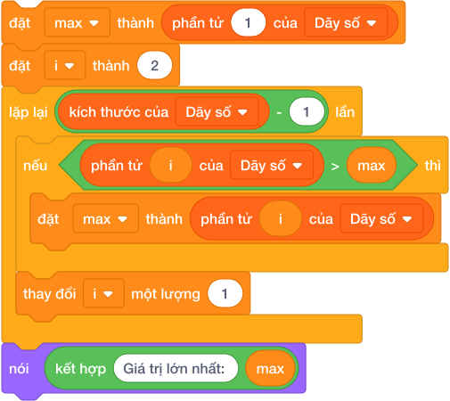

### 2.1. Bản chất tư duy của thuật toán tìm Max:

1. **Giả định ban đầu:** Coi phần tử đầu tiên là số lớn nhất tạm thời: `đặt [max v] thành (phần tử (1) của [Dãy số v])`, đồng thời ghi nhận `đặt [vi_tri_max v] thành (1)`.

2. **Duyệt qua các phần tử còn lại:** Cho biến `i` chạy từ vị trí `2` đến hết danh sách (`kích thước - 1` lần).

3. **So sánh & cập nhật:** Nếu gặp bất kỳ phần tử nào lớn hơn `max` hiện tại (`< (phần tử (i) của [Dãy số]) > (max) >`):

   - Cập nhật kỷ lục mới: `đặt [max v] thành (phần tử (i) của [Dãy số v])`.
   - Cập nhật vị trí mới: `đặt [vi_tri_max v] thành (i)`.

4. Sau khi duyệt hết danh sách, biến `max` chắc chắn giữ giá trị lớn nhất toàn bộ dãy.

> 💡 **Mẹo đối xứng:** Để tìm giá trị nhỏ nhất (**Min**), ta làm y hệt, chỉ cần đổi dấu so sánh thành `< (phần tử (i) của [Dãy số]) < (min) >`.

---

## 3. Thuật Toán Sắp Xếp Nổi Bọt (Bubble Sort)

**Sắp xếp nổi bọt (Bubble Sort)** là thuật toán sắp xếp trực quan và dễ hiểu nhất cho học sinh Tiểu học.

### 3.1. Ý tưởng thuật toán:
Giống như các bọt khí nhẹ hơn sẽ nổi dần lên mặt nước:

- Ta duyệt qua danh sách, so sánh từng cặp hai phần tử đứng liền kề nhau: `phần tử (j)` và `phần tử (j + 1)`.
- Nếu phần tử đứng trước lại lớn hơn phần tử đứng sau (sai trật tự tăng dần), ta lập tức **hoán đổi vị trí** của chúng!
- Lặp lại quá trình so sánh cặp này nhiều vòng, cho đến khi toàn bộ các số lớn đều dạt dần về cuối danh sách.

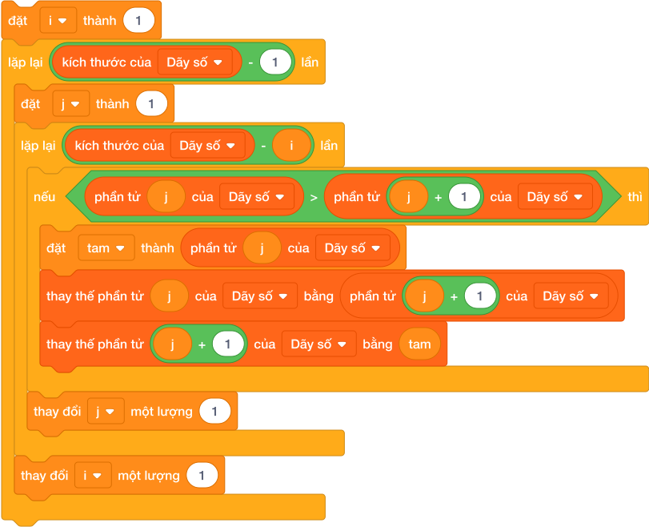

### 3.2. Kỹ thuật hoán đổi 2 phần tử bằng biến trung gian `tam`:
Để đổi chỗ giá trị ở vị trí `j` và `j + 1` mà không làm mất dữ liệu:

1. `đặt [tam v] thành (phần tử (j) của [Dãy số v])` *(Cất giá trị ô thứ j vào biến tam)*

2. `thay thế phần tử (j) của [Dãy số v] bằng (phần tử ((j) + (1)) của [Dãy số v])` *(Ghi đè ô j+1 vào ô j)*

3. `thay thế phần tử ((j) + (1)) của [Dãy số v] bằng (tam)` *(Lấy giá trị từ biến tam ghi vào ô j+1)*

---

## 4. Bảng Mô Phỏng Sắp Xếp Dãy Số `[9, 4, 2]` Bằng Bubble Sort (Dry Run Table)

Giả sử danh sách gồm 3 phần tử ban đầu: `[9, 4, 2]`. $N = 3$.

| Lần lặp ngoài `i` | Lần lặp trong `j` | Cặp so sánh `(j, j+1)` | So sánh `< ds[j] > ds[j+1] >` | Hành động | Trạng thái danh sách sau bước |
|:---:|:---:|:---:|:---:|---|:---:|
| — | — | — | — | Trạng thái bắt đầu | `[9, 4, 2]` |
| **Vòng 1** | $j = 1$ | `(9, 4)` | $9 > 4$ $\to$ **ĐÚNG** | Hoán đổi $9$ và $4$ bằng biến `tam` | `[4, 9, 2]` |
| | $j = 2$ | `(9, 2)` | $9 > 2$ $\to$ **ĐÚNG** | Hoán đổi $9$ và $2$ bằng biến `tam` | `[4, 2, 9]` |
| | *(Hết vòng 1: Số 9 lớn nhất đã nổi bọt về đúng vị trí cuối cùng!)* | | | | |
| **Vòng 2** | $j = 1$ | `(4, 2)` | $4 > 2$ $\to$ **ĐÚNG** | Hoán đổi $4$ và $2$ bằng biến `tam` | `[2, 4, 9]` |
| | $j = 2$ | `(4, 9)` | $4 > 9$ $\to$ SAI | Không đổi chỗ | `[2, 4, 9]` |

$\implies$ Sau 2 vòng lặp lớn, danh sách đã được sắp xếp tăng dần hoàn hảo: `[2, 4, 9]`.

---

## 5. Tử Huyệt & Các Bẫy Lỗi Thường Gặp (Bug Traps)

> **Bẫy 1: Khởi tạo biến `max` bằng số 0**
> - *Hiện tượng:* Đặt `max = 0` khi chuẩn bị tìm giá trị lớn nhất trong danh sách.
> - *Hậu quả khủng khiếp:* Nếu tất cả các số trong danh sách đều là số âm (ví dụ: `[-15, -7, -32, -4]`), máy tính sẽ so sánh và kết luận số lớn nhất là **0**! (Trong khi số 0 hoàn toàn không hề có trong danh sách!).
> - *Khắc phục:* Luôn luôn khởi tạo `max = phần tử (1) của danh sách`.

> **Bẫy 2: Hoán đổi trực tiếp không dùng biến trung gian `tam`**
> - *Hiện tượng:* Học sinh thay thế ngay: `thay thế phần tử (j) bằng phần tử (j + 1)` rồi lại `thay thế phần tử (j + 1) bằng phần tử (j)`.
> - *Hậu quả:* Ngay tại bước 1, giá trị ban đầu của phần tử `j` đã bị ghi đè và mất sạch vĩnh viễn! Hai ngăn tủ lúc này đều chứa cùng một giá trị giống hệt nhau!
> - *Khắc phục:* Bắt buộc phải dùng chiếc cốc phụ (biến `tam`) để hứng dữ liệu tạm thời.

> **Bẫy 3: Duyệt chỉ số `j` vượt quá biên danh sách**
> - *Hiện tượng:* Trong vòng lặp trong, cho $j$ chạy đến tận $N$ (`kích thước của danh sách`).
> - *Hậu quả:* Lúc này khối `phần tử (j + 1)` sẽ truy cập vào vị trí $N + 1$ (vị trí không tồn tại, giá trị rỗng). Phép so sánh sẽ bị sai lệch hoàn toàn.
> - *Khắc phục:* Vòng lặp trong chỉ cho $j$ chạy tối đa đến `kích thước - 1`.

---

## 6. Bộ Câu Hỏi Trắc Nghiệm Củng Cố (Concept Quizzes)

1. **Giá trị khởi tạo an toàn nhất cho biến `max` khi tìm số lớn nhất trong danh sách là:**
   - A. Phần tử thứ nhất của danh sách *(Đáp án đúng: `phần tử (1)`)*
   - B. Số 0
   - C. Số 999999
   - D. Số âm vô cùng

2. **Muốn tính trung bình cộng của toàn bộ danh sách, ta lấy tổng các phần tử chia cho:**
   - A. `kích thước của [Dãy số v]` *(Đáp án đúng: số lượng phần tử)*
   - B. 2
   - C. 10
   - D. Phần tử cuối cùng của danh sách

3. **Thuật toán sắp xếp nổi bọt (Bubble Sort) hoạt động dựa trên nguyên lý nào?**
   - A. Chia đôi danh sách thành hai nửa
   - B. Liên tục so sánh và hoán đổi các cặp phần tử đứng liền kề nếu chúng sai thứ tự *(Đáp án đúng)*
   - C. Tìm phần tử nhỏ nhất rồi ném ra danh sách mới
   - D. Chọn ngẫu nhiên hai phần tử để đổi chỗ

4. **Để hoán đổi giá trị giữa hai ô nhớ mà không bị mất dữ liệu, ta cần tối thiểu:**
   - A. 1 bước duy nhất
   - B. 2 bước
   - C. 3 bước kết hợp 1 biến trung gian *(Đáp án đúng)*
   - D. Không thể làm được trong Scratch

5. **Nếu danh sách đang có 4 phần tử, sau vòng duyệt thứ nhất của Bubble Sort (vòng lặp $j$), phần tử nào chắc chắn đã về đúng vị trí cuối cùng?**
   - A. Phần tử nhỏ nhất
   - B. Phần tử lớn nhất toàn danh sách *(Đáp án đúng: số lớn nhất đã nổi về cuối)*
   - C. Phần tử đứng đầu
   - D. Phần tử ở vị trí thứ hai

6. **Khi tìm giá trị nhỏ nhất (Min), ta cần khởi tạo biến `min` bằng:**
   - A. Phần tử thứ nhất của danh sách *(Đáp án đúng: `phần tử (1)`)*
   - B. Số 0
   - C. Số lớn nhất có thể
   - D. Số âm vô cùng

7. **Điều kiện nào trong Bubble Sort chứng tỏ cặp số liền kề đang bị sai thứ tự (cần sắp xếp tăng dần)?**
   - A. `< (phần tử (j)) < (phần tử ((j) + (1))) >`
   - B. `< (phần tử (j)) > (phần tử ((j) + (1))) >` *(Đáp án đúng: số trước lớn hơn số sau)*
   - C. `< (phần tử (j)) = (phần tử ((j) + (1))) >`
   - D. `< (j) > ((j) + (1)) >`

8. **Trong vòng lặp trong của Bubble Sort, biến chỉ số `j` chỉ được chạy đến:**
   - A. `kích thước của danh sách`
   - B. `(kích thước của danh sách) - 1` *(Đáp án đúng: để `j + 1` không bị vượt biên)*
   - C. `(kích thước của danh sách) + 1`
   - D. 1

9. **Nếu một danh sách có 5 phần tử đã được sắp xếp tăng dần, ta muốn sắp xếp giảm dần thì chỉ cần:**
   - A. Đổi dấu so sánh từ `>` thành `<` trong điều kiện hoán đổi *(Đáp án đúng)*
   - B. Xóa danh sách và nhập lại
   - C. Nhân tất cả các số với -1
   - D. Bỏ biến trung gian `tam`

10. **Giả sử danh sách đang là `[8, 2, 5]`. Sau 1 lần hoán đổi đầu tiên giữa $j=1$ và $j=2$, danh sách trở thành:**
    - A. `[2, 8, 5]` *(Đáp án đúng: số 8 và số 2 đổi chỗ cho nhau)*
    - B. `[8, 5, 2]`
    - C. `[2, 5, 8]`
    - D. `[5, 2, 8]`

## Bài tập lesson

# DANH SÁCH BÀI TẬP THỰC HÀNH: BÀI 14 — THỐNG KÊ DANH SÁCH VÀ THUẬT TOÁN SẮP XẾP

**Khóa học:** iKHEDU Scratch  
**Chuyên đề:** Chương 5: Danh Sách & Thống Kê Dữ Liệu  
> **Tổng số bài tập thực hành:** `14 bài` chuẩn hóa 100% (Từ kho bài tập `courses/scratch-bang-a/problems/`).  

---

## 1. Ma Trận Phân Tầng Bài Tập Toàn Diện

| STT | Mã bài toán | Tên bài tập | Phân tầng | Mức nhận thức | Thao tác trọng tâm |
|:---:|---|---|:---:|:---:|---|
| 1 | `sca_l14_p01_diem_so_cao_nhat_thap_nhat` | Điểm số cao nhất & thấp nhất | **P0** | Khởi động & Quan sát | Cho danh sách điểm thi của $N$ bạn học sinh. Hãy in ra điểm ... |
| 2 | `sca_l14_p02_sap_xep_tang_dan_don_gian` | Sắp xếp tăng dần đơn giản | **P0** | Khởi động & Quan sát | Cho dãy $N$ số nguyên. Hãy sắp xếp dãy số theo thứ tự tăng d... |
| 3 | `sca_l14_p03_diem_trung_binh_mon_hoc` | Điểm trung bình môn học | **P0** | Khởi động & Quan sát | Cho danh sách điểm kiểm tra của $N$ bài thi. Hãy tính điểm t... |
| 4 | `sca_l14_p04_sap_xep_giam_dan_bang_xep_hang` | Sắp xếp giảm dần bảng xếp hạng | **P1** | Cơ bản & Hoàn thành | Cho danh sách điểm số của $N$ thí sinh tham gia cuộc thi. Hã... |
| 5 | `sca_l14_p05_tim_so_lon_thu_nhi_trong_mang` | Tìm số lớn thứ nhì trong mảng | **P1** | Cơ bản & Hoàn thành | Cho dãy $N$ số nguyên. Hãy tìm giá trị lớn thứ nhì trong dãy... |
| 6 | `sca_l14_p06_dem_so_luong_hoc_sinh_tren_diem_trung_binh` | Đếm số lượng học sinh trên điểm trung bình | **P1** | Cơ bản & Hoàn thành | Cho điểm thi của $N$ học sinh. Hãy đếm xem có bao nhiêu bạn ... |
| 7 | `sca_l14_p07_loc_bo_cac_so_trung_lap` | Lọc bỏ các số trùng lặp | **P1** | Cơ bản & Hoàn thành | Cho dãy gồm $N$ số nguyên có thể chứa nhiều số bị trùng lặp.... |
| 8 | `sca_l14_p08_diem_olympic_bo_max_bo_min` | Điểm olympic bỏ max bỏ min | **P2** | Luyện tập & Vận dụng | Cho $N$ điểm số. Hãy tính điểm chính thức của vận động viên ... |
| 9 | `sca_l14_p09_sap_xep_ten_theo_thu_tu_bang_chu_cai` | Sắp xếp tên theo thứ tự bảng chữ cái | **P2** | Luyện tập & Vận dụng | Cho danh sách gồm $N$ từ tiếng Anh. Hãy sắp xếp danh sách từ... |
| 10 | `sca_l14_p10_chenh_lech_nho_nhat_giua_hai_so` | Chênh lệch nhỏ nhất giữa hai số | **P2** | Luyện tập & Vận dụng | Cho dãy $N$ số nguyên đôi một khác nhau. Hãy tìm độ chênh lệ... |
| 11 | `sca_l14_p11_trung_vi_cua_day_so_median` | Trung vị của dãy số (Median) | **P3** | Vận dụng cao & Sáng tạo | Cho dãy $N$ số nguyên ($N$ lẻ). Hãy tìm số trung vị của dãy ... |
| 12 | `sca_l14_p12_so_xuat_hien_nhieu_lan_nhat_mode` | Số xuất hiện nhiều lần nhất (Mode) | **P3** | Vận dụng cao & Sáng tạo | Cho dãy $N$ số nguyên. Hãy tìm số xuất hiện nhiều lần nhất t... |
| 13 | `sca_l14_p13_ghep_hai_day_da_sap_xep` | Ghép hai dãy đã sắp xếp | **P3** | Vận dụng cao & Sáng tạo | Cho hai dãy số nguyên $A$ (gồm $N$ phần tử) và $B$ (gồm $M$ ... |
| 14 | `sca_l14_p14_xep_hang_mua_tra_sua_greedy` | Xếp hàng mua trà sữa (Greedy) | **P3** | Vận dụng cao & Sáng tạo | Hãy tìm cách sắp xếp thứ tự các bạn vào mua trà sữa sao cho ... |

---

## 2. Chi Tiết Từng Bài Tập Thực Hành

### Bài 1 (P0): Điểm số cao nhất & thấp nhất
* **Mã bài toán:** `sca_l14_p01_diem_so_cao_nhat_thap_nhat`
* **Độ khó & Phân tầng:** P0 (Khởi động & Quan sát)
* **Bối cảnh:** Xác định giá trị cực đại và cực tiểu trong tập số liệu điểm số là chỉ số đánh giá tổng quan phổ điểm của một đợt khảo sát.
* **Nhiệm vụ:** Cho danh sách điểm thi của $N$ bạn học sinh. Hãy in ra điểm số cao nhất và điểm số thấp nhất trong danh sách.
* **Dữ liệu vào (Input):** * Dòng 1: Số nguyên $N$ ($1 \le N \le 1000$).
 * Dòng 2: $N$ số nguyên là điểm của các bạn ($0 \le A_i \le 100$).
* **Kết quả ra (Output):** Điểm cao nhất, theo sau là điểm thấp nhất.
* **Dữ liệu mẫu (Sample):**

### Input
```text
5
80 95 60 100 75
```
### Output
```text
100 60
```
### Giải thích

Với dữ liệu đầu vào là `5
80 95 60 100 75`, kết quả thu được tương ứng là `100 60`.

---

### Bài 2 (P0): Sắp xếp tăng dần đơn giản
* **Mã bài toán:** `sca_l14_p02_sap_xep_tang_dan_don_gian`
* **Độ khó & Phân tầng:** P0 (Khởi động & Quan sát)
* **Bối cảnh:** Cô giáo cần sắp xếp lại danh sách điểm số của học sinh theo thứ tự. Yêu cầu sắp xếp dãy số tăng dần để phục vụ thống kê và tra cứu.
* **Nhiệm vụ:** Cho dãy $N$ số nguyên. Hãy sắp xếp dãy số theo thứ tự tăng dần và nhân vật nói ra màn hình trên một dòng.
* **Dữ liệu vào (Input):** * Dòng 1: Số nguyên $N$ ($1 \le N \le 1000$).
 * Dòng 2: $N$ số nguyên.
* **Kết quả ra (Output):** Dãy số sau khi sắp xếp tăng dần, cách nhau bởi khoảng trắng.
* **Dữ liệu mẫu (Sample):**

### Input
```text
5
9 2 7 1 5
```
### Output
```text
1 2 5 7 9
```
### Giải thích

Với dữ liệu đầu vào là `5
9 2 7 1 5`, kết quả thu được tương ứng là `1 2 5 7 9`.

---

### Bài 3 (P0): Điểm trung bình môn học
* **Mã bài toán:** `sca_l14_p03_diem_trung_binh_mon_hoc`
* **Độ khó & Phân tầng:** P0 (Khởi động & Quan sát)
* **Bối cảnh:** Tính trung bình cộng của một tập hợp giá trị đo lường là phép toán thống kê cơ bản nhất trong xử lý số liệu thực nghiệm.
* **Nhiệm vụ:** Cho danh sách điểm kiểm tra của $N$ bài thi. Hãy tính điểm trung bình cộng của các bài thi và in ra với đúng 2 chữ số sau dấu phẩy.
* **Dữ liệu vào (Input):** * Dòng 1: Số nguyên $N$ ($1 \le N \le 1000$).
 * Dòng 2: $N$ số thực hoặc số nguyên là điểm các bài thi.
* **Kết quả ra (Output):** Điểm trung bình cộng (định dạng `f"{tb:.2f}"`).
* **Dữ liệu mẫu (Sample):**

### Input
```text
4
8 9 7 10
```
### Output
```text
8.50
```
### Giải thích

$(8 + 9 + 7 + 10) / 4 = 8.5$.

---

### Bài 4 (P1): Sắp xếp giảm dần bảng xếp hạng
* **Mã bài toán:** `sca_l14_p04_sap_xep_giam_dan_bang_xep_hang`
* **Độ khó & Phân tầng:** P1 (Cơ bản & Hoàn thành)
* **Bối cảnh:** Cô giáo cần sắp xếp lại danh sách điểm số của học sinh theo thứ tự. Hãy viết chương trình sắp xếp.
* **Nhiệm vụ:** Cho danh sách điểm số của $N$ thí sinh tham gia cuộc thi. Hãy sắp xếp bảng điểm theo thứ tự từ cao xuống thấp (giảm dần) để trao giải.
* **Dữ liệu vào (Input):** * Dòng 1: Số nguyên $N$ ($1 \le N \le 10^5$).
 * Dòng 2: $N$ số nguyên.
* **Kết quả ra (Output):** Bảng điểm sắp xếp giảm dần trên một dòng.
* **Dữ liệu mẫu (Sample):**

### Input
```text
5
20 80 40 100 60
```
### Output
```text
100 80 60 40 20
```
### Giải thích

Với dữ liệu đầu vào là `5
20 80 40 100 60`, kết quả thu được tương ứng là `100 80 60 40 20`.

---

### Bài 5 (P1): Tìm số lớn thứ nhì trong mảng
* **Mã bài toán:** `sca_l14_p05_tim_so_lon_thu_nhi_trong_mang`
* **Độ khó & Phân tầng:** P1 (Cơ bản & Hoàn thành)
* **Bối cảnh:** Thí sinh đang tìm kiếm một giá trị đặc biệt trong tập dữ liệu. Hãy viết chương trình tìm kiếm hiệu quả.
* **Nhiệm vụ:** Cho dãy $N$ số nguyên. Hãy tìm giá trị lớn thứ nhì trong dãy số (nghĩa là giá trị lớn nhất trong số các phần tử nhỏ hơn giá trị cực đại). Nếu tất cả các phần tử trong mảng đều bằng nhau, in ra `KHONG CO`.
* **Dữ liệu vào (Input):** * Dòng 1: Số nguyên $N$ ($2 \le N \le 10^5$).
 * Dòng 2: $N$ số nguyên.
* **Kết quả ra (Output):** Giá trị lớn thứ nhì, hoặc `KHONG CO`.
* **Dữ liệu mẫu (Sample):**

### Input
```text
5
10 20 20 15 5
```
### Output
```text
15
```
### Giải thích

Số lớn nhất là 20. Số lớn thứ hai nhỏ hơn 20 là 15.

---

### Bài 6 (P1): Đếm số lượng học sinh trên điểm trung bình
* **Mã bài toán:** `sca_l14_p06_dem_so_luong_hoc_sinh_tren_diem_trung_binh`
* **Độ khó & Phân tầng:** P1 (Cơ bản & Hoàn thành)
* **Bối cảnh:** So sánh từng phần tử với giá trị trung bình của cả tập hợp giúp đánh giá độ phân tán và chất lượng của các chỉ số thành phần.
* **Nhiệm vụ:** Cho điểm thi của $N$ học sinh. Hãy đếm xem có bao nhiêu bạn học sinh có điểm số lớn hơn hoặc bằng điểm trung bình cộng của cả lớp.
* **Dữ liệu vào (Input):** * Dòng 1: Số nguyên $N$ ($1 \le N \le 10^5$).
 * Dòng 2: $N$ số thực.
* **Kết quả ra (Output):** Số lượng học sinh đạt điểm $\ge$ điểm trung bình.
* **Dữ liệu mẫu (Sample):**

### Input
```text
4
8 6 10 4
```
### Output
```text
2
```
### Giải thích

Điểm TB: $(8+6+10+4)/4 = 7.0$. Các bạn có điểm $\ge 7$ là 8 và 10 (có 2 bạn).

---

### Bài 7 (P1): Lọc bỏ các số trùng lặp
* **Mã bài toán:** `sca_l14_p07_loc_bo_cac_so_trung_lap`
* **Độ khó & Phân tầng:** P1 (Cơ bản & Hoàn thành)
* **Bối cảnh:** Loại bỏ các phần tử trùng lặp và sắp xếp lại tập hợp là bước tiền xử lý quan trọng trong làm sạch dữ liệu.
* **Nhiệm vụ:** Cho dãy gồm $N$ số nguyên có thể chứa nhiều số bị trùng lặp. Hãy lọc bỏ các phần tử trùng lặp và in ra các số độc nhất theo thứ tự tăng dần.
* **Dữ liệu vào (Input):** * Dòng 1: Số nguyên $N$ ($1 \le N \le 10^5$).
 * Dòng 2: $N$ số nguyên.
* **Kết quả ra (Output):** Các số độc nhất sắp xếp tăng dần trên một dòng.
* **Dữ liệu mẫu (Sample):**

### Input
```text
7
3 1 4 1 5 9 2
```
### Output
```text
1 2 3 4 5 9
```
### Giải thích

Với dữ liệu đầu vào là `7
3 1 4 1 5 9 2`, kết quả thu được tương ứng là `1 2 3 4 5 9`.

---

### Bài 8 (P2): Điểm olympic bỏ max bỏ min
* **Mã bài toán:** `sca_l14_p08_diem_olympic_bo_max_bo_min`
* **Độ khó & Phân tầng:** P2 (Luyện tập & Vận dụng)
* **Bối cảnh:** Cuối tuần này, trường em tổ chức hội thi Bơi lội Olympic thật vui nhộn. Có $N$ giám khảo cùng ngồi chấm điểm cho mỗi người dùng ($N \ge 3$). Để cho thật công bằng, điểm số chính thức của vận động viên sẽ là trung bình cộng sau khi đã **bỏ đi một điểm cao nhất và một điểm thấp nhất**. Trọng tài đang lúng túng với đống bảng điểm nên hãy bác ấy tính điểm thật chính xác.
* **Nhiệm vụ:** Cho $N$ điểm số. Hãy tính điểm chính thức của vận động viên (làm tròn 2 chữ số thập phân).
* **Dữ liệu vào (Input):** * Dòng 1: Số nguyên $N$ ($3 \le N \le 1000$).
 * Dòng 2: $N$ số thực cách nhau bởi khoảng trắng.
* **Kết quả ra (Output):** Điểm trung bình sau khi loại bỏ 1 điểm max và 1 điểm min.
* **Dữ liệu mẫu (Sample):**

### Input
```text
5
7.0 9.0 8.0 10.0 6.0
```
### Output
```text
8.00
```
### Giải thích

Bỏ min là 6.0, bỏ max là 10.0. Còn lại: 7.0, 8.0, 9.0. Trung bình là 8.00.

---

### Bài 9 (P2): Sắp xếp tên theo thứ tự bảng chữ cái
* **Mã bài toán:** `sca_l14_p09_sap_xep_ten_theo_thu_tu_bang_chu_cai`
* **Độ khó & Phân tầng:** P2 (Luyện tập & Vận dụng)
* **Bối cảnh:** Cô giáo cần sắp xếp lại danh sách điểm số của học sinh theo thứ tự. Hãy viết chương trình sắp xếp.
* **Nhiệm vụ:** Cho danh sách gồm $N$ từ tiếng Anh. Hãy sắp xếp danh sách từ theo thứ tự từ điển A-Z (tăng dần).
* **Dữ liệu vào (Input):** * Dòng 1: Số nguyên $N$ ($1 \le N \le 1000$).
 * Dòng 2: $N$ từ viết thường cách nhau bởi khoảng trắng.
* **Kết quả ra (Output):** Danh sách từ sau khi sắp xếp trên một dòng.
* **Dữ liệu mẫu (Sample):**

### Input
```text
4
orange apple banana grape
```
### Output
```text
apple banana grape orange
```
### Giải thích

Với dữ liệu đầu vào là `4
orange apple banana grape`, kết quả thu được tương ứng là `apple banana grape orange`.

---

### Bài 10 (P2): Chênh lệch nhỏ nhất giữa hai số
* **Mã bài toán:** `sca_l14_p10_chenh_lech_nho_nhat_giua_hai_so`
* **Độ khó & Phân tầng:** P2 (Luyện tập & Vận dụng)
* **Bối cảnh:** Thí sinh cần tìm giá trị lớn nhất hoặc nhỏ nhất trong một tập dữ liệu. Hãy viết chương trình tìm kiếm.
* **Nhiệm vụ:** Cho dãy $N$ số nguyên đôi một khác nhau. Hãy tìm độ chênh lệch nhỏ nhất giữa 2 phần tử bất kỳ trong dãy (tức là giá trị $|A_i - A_j|$ nhỏ nhất với $i \ne j$).
* **Dữ liệu vào (Input):** * Dòng 1: Số nguyên $N$ ($2 \le N \le 10^5$).
 * Dòng 2: $N$ số nguyên.
* **Kết quả ra (Output):** Độ chênh lệch nhỏ nhất.
* **Dữ liệu mẫu (Sample):**

### Input
```text
4
10 1 8 15
```
### Output
```text
2
```
### Giải thích

Sắp xếp: [1, 8, 10, 15]. Chênh lệch giữa 8 và 10 là $

---

### Bài 11 (P3): Trung vị của dãy số (Median)
* **Mã bài toán:** `sca_l14_p11_trung_vi_cua_day_so_median`
* **Độ khó & Phân tầng:** P3 (Vận dụng cao & Sáng tạo)
* **Bối cảnh:** Giờ ra chơi, các người dùng xếp thành một hàng dọc gồm $N$ bạn, trong đó $N$ là số lẻ. Cô giáo muốn tìm bạn đứng chính giữa sau khi cả hàng đã xếp theo chiều cao tăng dần, và bạn đó được gọi là trung vị của dãy: tức là phần tử nằm chính giữa sau khi dãy đã được sắp xếp tăng dần. Các bạn cứ nhốn nháo đổi chỗ mãi không xong. Hãy giúp cô tìm ra bạn đứng ở vị trí chính giữa.
* **Nhiệm vụ:** Cho dãy $N$ số nguyên ($N$ lẻ). Hãy tìm số trung vị của dãy số.
* **Dữ liệu vào (Input):** * Dòng 1: Số nguyên lẻ $N$ ($1 \le N \le 10^5$).
 * Dòng 2: $N$ số nguyên.
* **Kết quả ra (Output):** Giá trị trung vị.
* **Dữ liệu mẫu (Sample):**

### Input
```text
5
10 2 8 4 6
```
### Output
```text
6
```
### Giải thích

Sắp xếp: [2, 4, 6, 8, 10]. Số chính giữa là 6.

---

### Bài 12 (P3): Số xuất hiện nhiều lần nhất (Mode)
* **Mã bài toán:** `sca_l14_p12_so_xuat_hien_nhieu_lan_nhat_mode`
* **Độ khó & Phân tầng:** P3 (Vận dụng cao & Sáng tạo)
* **Bối cảnh:** Tìm giá trị có tần số xuất hiện cao nhất (giá trị mốt - mode) là bài toán thống kê đặc trưng để nhận diện xu hướng dữ liệu phổ biến nhất.
* **Nhiệm vụ:** Cho dãy $N$ số nguyên. Hãy tìm số xuất hiện nhiều lần nhất trong dãy. Nếu có nhiều số có cùng số lần xuất hiện nhiều nhất, hãy in ra số có giá trị nhỏ nhất trong các số đó.
* **Dữ liệu vào (Input):** * Dòng 1: Số nguyên $N$ ($1 \le N \le 10^5$).
 * Dòng 2: $N$ số nguyên.
* **Kết quả ra (Output):** Số xuất hiện nhiều nhất.
* **Dữ liệu mẫu (Sample):**

### Input
```text
7
2 3 5 2 3 7 2
```
### Output
```text
2
```
### Giải thích

Với dữ liệu đầu vào là `7
2 3 5 2 3 7 2`, kết quả thu được tương ứng là `2`.

---

### Bài 13 (P3): Ghép hai dãy đã sắp xếp
* **Mã bài toán:** `sca_l14_p13_ghep_hai_day_da_sap_xep`
* **Độ khó & Phân tầng:** P3 (Vận dụng cao & Sáng tạo)
* **Bối cảnh:** Cô giáo cần sắp xếp lại danh sách điểm số của học sinh theo thứ tự. Hãy viết chương trình sắp xếp.
* **Nhiệm vụ:** Cho hai dãy số nguyên $A$ (gồm $N$ phần tử) và $B$ (gồm $M$ phần tử) đều đã được sắp xếp tăng dần. Hãy ghép hai dãy lại thành một dãy duy nhất gồm $(N + M)$ phần tử cũng được sắp xếp tăng dần.
* **Dữ liệu vào (Input):** * Dòng 1: Hai số $N$ và $M$ ($1 \le N, M \le 10^5$).
 * Dòng 2: $N$ số nguyên của dãy $A$.
 * Dòng 3: $M$ số nguyên của dãy $B$.
* **Kết quả ra (Output):** Dãy hợp nhất gồm $(N + M)$ phần tử tăng dần trên một dòng.
* **Dữ liệu mẫu (Sample):**

### Input
```text
3 4
1 4 7
2 3 5 8
```
### Output
```text
1 2 3 4 5 7 8
```
### Giải thích

Với dữ liệu đầu vào là `3 4
1 4 7
2 3 5 8`, kết quả thu được tương ứng là `1 2 3 4 5 7 8`.

---

### Bài 14 (P3): Xếp hàng mua trà sữa (Greedy)
* **Mã bài toán:** `sca_l14_p14_xep_hang_mua_tra_sua_greedy`
* **Độ khó & Phân tầng:** P3 (Vận dụng cao & Sáng tạo)
* **Bối cảnh:** Giờ tan học, có $N$ bạn học sinh cùng ríu rít xếp hàng mua trà sữa ở căng tin trường. Bạn thứ $i$ cần $T_i$ phút để người bán hàng pha chế xong cốc trà sữa của mình. Tổng thời gian chờ đợi của tất cả các bạn sẽ là tổng thời gian mà mỗi bạn phải đứng xếp hàng chờ cho đến khi nhận được trà sữa. Nhìn hàng dài mà các bạn ai cũng mỏi chân, hãy cô bán hàng tìm cách xếp hàng sao cho mọi người chờ ít nhất.
* **Nhiệm vụ:** Hãy tìm cách sắp xếp thứ tự các bạn vào mua trà sữa sao cho **tổng thời gian chờ đợi của tất cả các bạn là NHỎ NHẤT CÓ THỂ**. Hãy in ra tổng thời gian chờ đợi nhỏ nhất đó.
* **Dữ liệu vào (Input):** * Dòng 1: Số nguyên $N$ ($1 \le N \le 10^5$).
 * Dòng 2: $N$ số nguyên $T_i$ ($1 \le T_i \le 1000$).
* **Kết quả ra (Output):** Một số nguyên duy nhất là tổng thời gian chờ đợi nhỏ nhất.
* **Dữ liệu mẫu (Sample):**

### Input
```text
3
3 1 2
```
### Output
```text
10
```
### Giải thích

Sắp xếp người làm nhanh lên trước: thời gian làm lần lượt là 1, 2, 3.
- Bạn 1 chờ 1 phút.
- Bạn 2 chờ $1 + 2 = 3$ phút.
- Bạn 3 chờ $1 + 2 + 3 = 6$ phút.
Tổng thời gian chờ: $1 + 3 + 6 = 10$ phút (tối ưu nhất).

---

================================================================================
# CHƯƠNG 06: XỬ LÝ CHUỖI KÝ TỰ
================================================================================

--------------------------------------------------------------------------------
<!-- Bài 15: Chuỗi ký tự — Chỉ số, cắt lát và duyệt ký tự -->
--------------------------------------------------------------------------------

## Lý thuyết và Concept Quiz

# Bài 15: Chuỗi ký tự — Chỉ số, cắt lát và duyệt ký tự

## 1. Chuỗi Ký Tự (String) — Thế Giới Của Văn Bản & Ngôn Ngữ

Bên cạnh các con số phục vụ tính toán, máy tính còn phải xử lý văn bản: tên người, địa chỉ, mật khẩu, lời thoại nhân vật... Tất cả những dữ liệu này được gọi là **Chuỗi ký tự (String)**.
- **Chuỗi ký tự** là một dãy các ký tự (chữ cái, chữ số, dấu câu, khoảng trắng) được xếp nối tiếp nhau thành một hàng ngang.
- Ví dụ: `"SCRATCH"`, `"IKH EDU"`, `"12345"`, `"Hoc Lap Trinh 2026"`.

---

## 2. Bảng Tra Cứu Các Khối Lệnh Xử Lý Chuỗi Trong Scratch 3.0

Các khối lệnh xử lý chuỗi nằm trong nhóm **Các phép toán (Operators)** màu xanh lá cây:


| Khối lệnh Scratch 3.0 Tiếng Việt | Thao tác | Ví dụ với chuỗi `s = "TIN HOC"` | Kết quả thực tế |
|---|---|---|:---:|
| `ký tự (1) của (s)` | Ký tự đầu tiên | Ký tự đầu tiên | `"T"` |
| `ký tự (4) của (s)` | Ký tự giữa | Ký tự tại vị trí số 4 | `" "` *(dấu cách)* |
| `ký tự (độ dài của (s)) của (s)` | Ký tự cuối | Ký tự cuối cùng của chuỗi | `"C"` |
| `độ dài của (s)` | Độ dài chuỗi | Đếm tổng số lượng ký tự trong chuỗi | `7` |
| `kết hợp (A) và (B)` | Ghép chuỗi | Ghép nối 2 chuỗi văn bản lại với nhau | Chuỗi dính liền |
| `(s) chứa (c) ?` | Kiểm tra ký tự | Kiểm tra chuỗi `s` có chứa ký tự `c` không | Đúng / Sai |

> ⚠️ **Quy tắc vàng 1-Based Indexing:** Giống như danh sách, các ký tự trong chuỗi Scratch được đánh số thứ tự bắt đầu từ **vị trí 1** đến `độ dài của chuỗi`. Trong Scratch **không có ký tự số 0**!

---

## 3. Thuật Toán Trích Xuất Chuỗi Con (Substring / Slicing)

Để cắt ra một đoạn văn bản từ ký tự thứ $L$ đến ký tự thứ $R$ của chuỗi ban đầu, học sinh cần tự xây dựng thuật toán tích lũy chuỗi con:

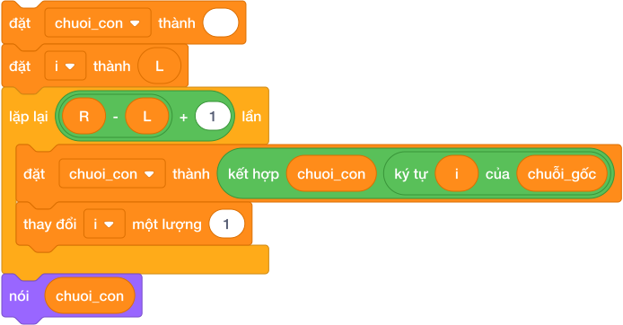

### Các bước thuật toán:

1. **Khởi tạo chuỗi kết quả rỗng:** `đặt [chuoi_con v] thành []` (để trống không chứa ký tự nào).

2. **Khởi tạo chỉ số bắt đầu:** `đặt [i v] thành (L)`.

3. **Số lần lặp:** Từ vị trí $L$ đến $R$ có đúng `(R - L + 1)` ký tự.

4. **Vòng lặp tích lũy ký tự:**
   - Dùng khối ghép: `đặt [chuoi_con v] thành (kết hợp (chuoi_con) (ký tự (i) của (chuoi_goc)))`.
   - Tăng chỉ số: `thay đổi [i v] một lượng (1)`.

5. Sau khi kết thúc vòng lặp, biến `chuoi_con` sẽ chứa trọn vẹn đoạn văn bản cần trích xuất.

---

## 4. Bảng Mô Phỏng Trích Xuất Chuỗi Từ $L = 2$ Đến $R = 4$ Của Chuỗi `"SCRATCH"` (Dry Run Table)

Chuỗi gốc $S = 	ext{"SCRATCH"}$. Độ dài $= 6$. Cần cắt từ $L = 2$ đến $R = 4$.
- Số lần lặp $= 4 - 2 + 1 = 3$ lần (vị trí 2, 3, 4).

| Vòng lặp | Biến chỉ số `i` | Lệnh `ký tự (i) của (S)` | Ghép chuỗi `chuoi_con` | Giá trị mới của `chuoi_con` | Hành động tiếp theo |
|:---:|:---:|:---:|:---:|:---:|---|
| *Bắt đầu* | $i = 2$ | — | Khởi tạo rỗng `""` | `""` | Bắt đầu vòng lặp |
| **Vòng 1** | $i = 2$ | `ký tự (2)` $\to$ **`"Y"`** | `""` kết hợp `"Y"` | `"Y"` | Tăng $i = 3$ |
| **Vòng 2** | $i = 3$ | `ký tự (3)` $\to$ **`"T"`** | `"Y"` kết hợp `"T"` | `"YT"` | Tăng $i = 4$ |
| **Vòng 3** | $i = 4$ | `ký tự (4)` $\to$ **`"H"`** | `"YT"` kết hợp `"H"` | **`"YTH"`** | Tăng $i = 5$ |
| **Dừng** | $i = 5$ | — | Đã lặp đủ 3 lần | **`"YTH"`** | Vòng lặp kết thúc |

$\implies$ Nhân vật thông báo kết quả trích xuất: `"YTH"`.

---

## 5. Tử Huyệt & Các Bẫy Lỗi Thường Gặp (Bug Traps)

> **Bẫy 1: Bẫy ký tự số 0 trong chuỗi (Zero-Index Trap)**
> - *Hiện tượng:* Học sinh gọi `ký tự (0) của (chuỗi)`.
> - *Hậu quả:* Trong Scratch không có vị trí 0! Khối này sẽ trả về chuỗi rỗng (`""`).
> - *Khắc phục:* Luôn nhớ ký tự đầu tiên là `ký tự (1)`.

> **Bẫy 2: Dấu cách (khoảng trắng) cũng là một ký tự hợp lệ**
> - *Hiện tượng:* Học sinh đếm chuỗi `"IKH EDU"` chỉ có 6 chữ cái nên đoán độ dài là 6.
> - *Hậu quả:* Kết quả thực tế là **7**! Dấu cách ở giữa cũng chiếm đúng một vị trí chỉ số như mọi chữ cái bình thường.
> - *Khắc phục:* Luôn tính cả dấu cách khi đếm độ dài và cắt chuỗi.

> **Bẫy 3: Quên làm rỗng biến `chuoi_con` trước khi bắt đầu ghép**
> - *Hiện tượng:* Không dùng lệnh `đặt [chuoi_con v] thành []` ở đầu kịch bản.
> - *Hậu quả:* Nếu kịch bản chạy lần thứ hai, chuỗi con mới sẽ bị ghép nối đuôi vào chuỗi con của lần chạy trước!
> - *Khắc phục:* Luôn dọn sạch chuỗi tích lũy trước vòng lặp.

---

## 6. Bộ Câu Hỏi Trắc Nghiệm Củng Cố (Concept Quizzes)

1. **Với chuỗi văn bản `"ROBOT"`, khối `độ dài của (chuỗi)` trả về kết quả là:**
   - A. 4
   - B. 5 *(Đáp án đúng: có 5 ký tự)*
   - C. 6
   - D. 0

2. **Ký tự đầu tiên của một chuỗi trong Scratch được lấy bằng khối lệnh nào?**
   - A. `ký tự (0) của (chuỗi)`
   - B. `ký tự (1) của (chuỗi)` *(Đáp án đúng)*
   - C. `ký tự (-1) của (chuỗi)`
   - D. `phần tử (1) của (chuỗi)`

3. **Để lấy ký tự cuối cùng của chuỗi văn bản bất kỳ `S`, ta dùng khối:**
   - A. `ký tự (cuối) của (S)`
   - B. `ký tự (độ dài của (S)) của (S)` *(Đáp án đúng)*
   - C. `ký tự (độ dài của (S) - 1) của (S)`
   - D. `ký tự (-1) của (S)`

4. **Khối lệnh `kết hợp (Lap) (Trinh)` sẽ trả về kết quả là:**
   - A. `"Lap Trinh"`
   - B. `"LapTrinh"` *(Đáp án đúng: dính liền nhau không có khoảng trắng)*
   - C. `"Lap, Trinh"`
   - D. Báo lỗi

5. **Chuỗi `"TIN HOC 2026"` có độ dài bằng bao nhiêu?**
   - A. 10
   - B. 11
   - C. 12 *(Đáp án đúng: 3 chữ TIN + 1 cách + 3 chữ HOC + 1 cách + 4 số 2026 = 12)*
   - D. 9

6. **Điều kiện nào kiểm tra xem chuỗi `Email` có chứa ký tự `@` hay không?**
   - A. `< [Email v] chứa [@] ?>` *(Đáp án đúng)*
   - B. `< [@] trong [Email v] ?>`
   - C. `< [Email v] = [@] >`
   - D. `< ký tự (@) của [Email v] >`

7. **Muốn trích xuất các ký tự từ vị trí $L$ đến vị trí $R$ trong chuỗi, vòng lặp cần chạy bao nhiêu lần?**
   - A. `R - L` lần
   - B. `R - L + 1` lần *(Đáp án đúng: tính cả hai đầu mút)*
   - C. `R` lần
   - D. `L` lần

8. **Nếu ta gọi `ký tự (100) của [Scratch]`, khối lệnh sẽ trả về:**
   - A. Báo lỗi treo máy
   - B. Chuỗi rỗng `""` *(Đáp án đúng)*
   - C. Chữ `"h"`
   - D. Số 0

9. **Để ghép 3 chuỗi văn bản $A, B, C$ lại với nhau trong Scratch, ta cần:**
   - A. Lồng 2 khối `kết hợp () ()` vào nhau *(Đáp án đúng)*
   - B. Dùng khối `kết hợp (A) (B) (C)`
   - C. Dùng toán tử cộng `A + B + C`
   - D. Dùng danh sách

10. **Biểu thức `kết hợp (kết hợp [Xin] [ ]) [chao]` sẽ tạo ra chuỗi:**
    - A. `"Xin chao"` *(Đáp án đúng: có một dấu cách ở giữa)*
    - B. `"Xinchao"`
    - C. `"Xin  chao"`
    - D. `"chao Xin"`

## Bài tập lesson

# DANH SÁCH BÀI TẬP THỰC HÀNH: BÀI 15 — Chuỗi ký tự — Chỉ số, cắt lát và duyệt ký tự

**Khóa học:** iKHEDU Scratch  
**Chuyên đề:** Chương 6: Xử Lý Chuỗi Ký Tự  
> **Tổng số bài tập thực hành:** `12 bài` chuẩn hóa 100% (Từ kho bài tập `courses/scratch-bang-a/problems/`).  

---

## 1. Ma Trận Phân Tầng Bài Tập Toàn Diện

| STT | Mã bài toán | Tên bài tập | Phân tầng | Mức nhận thức | Thao tác trọng tâm |
|:---:|---|---|:---:|:---:|---|
| 1 | `sca_l15_p01_ky_tu_dau_ky_tu_cuoi` | Ký tự đầu & ký tự cuối | **P0** | Khởi động & Quan sát | Nhập vào một chuỗi ký tự $S$ không chứa dấu cách. Hãy in ra ... |
| 2 | `sca_l15_p02_do_dai_cua_chuoi` | Độ dài của chuỗi | **P0** | Khởi động & Quan sát | Nhập một dòng văn bản $S$ từ bàn phím. Hãy đếm và in ra xem ... |
| 3 | `sca_l15_p03_cat_ba_ky_tu_dau_tien` | Cắt ba ký tự đầu tiên | **P0** | Khởi động & Quan sát | Nhập vào một chuỗi $S$ có ít nhất 3 ký tự. Hãy in ra 3 ký tự... |
| 4 | `sca_l15_p04_dao_nguoc_ten_rieng` | Đảo ngược tên riêng | **P1** | Cơ bản & Hoàn thành | Nhập một chuỗi ký tự $S$. Hãy in ra chuỗi đảo ngược của $S$. |
| 5 | `sca_l15_p05_kiem_tra_tu_doi_xung_palindrome` | Kiểm tra từ đối xứng (palindrome) | **P1** | Cơ bản & Hoàn thành | Cho một từ $S$. Kiểm tra xem $S$ có phải từ đối xứng không. ... |
| 6 | `sca_l15_p06_cat_doi_chuoi_ky_tu` | Cắt đôi chuỗi ký tự | **P1** | Cơ bản & Hoàn thành | Cho một chuỗi $S$ có độ dài chẵn. Hãy chia chuỗi $S$ thành 2... |
| 7 | `sca_l15_p07_rut_trich_ten_mien_email` | Rút trích tên miền email | **P2** | Luyện tập & Vận dụng | Cho một địa chỉ email hợp lệ. Hãy in ra phần tên miền của đị... |
| 8 | `sca_l15_p08_ky_tu_o_vi_tri_chan` | Ký tự Ở vị trí chẵn | **P2** | Luyện tập & Vận dụng | Cho một chuỗi $S$. Hãy tạo ra một chuỗi mới chỉ gồm các ký t... |
| 9 | `sca_l15_p09_hoan_doi_nua_dau_nua_sau` | Hoán đổi nửa đầu nửa sau | **P2** | Luyện tập & Vận dụng | Cho chuỗi ký tự $S$ có độ dài chẵn $2N$. Hãy hoán đổi vị trí... |
| 10 | `sca_l15_p10_xoa_ky_tu_o_vi_tri_k` | Xóa ký tự ở vị trí K | **P3** | Vận dụng cao & Sáng tạo | Cho chuỗi $S$ và chỉ số nguyên $K$ ($0 \le K < |S|$). Hãy xó... |
| 11 | `sca_l15_p11_dich_chuyen_vong_quanh_left_rotation` | Dịch chuyển vòng quanh (left rotation) | **P3** | Vận dụng cao & Sáng tạo | Cho chuỗi $S$ và số nguyên $K$ ($1 \le K \le |S| \le 10^5$).... |
| 12 | `sca_l15_p12_chuoi_con_doi_xung_dai_nhat` | Chuỗi con đối xứng dài nhất | **P3** | Vận dụng cao & Sáng tạo | Cho một chuỗi ký tự $S$. Hãy tìm độ dài của chuỗi con liên t... |

---

## 2. Chi Tiết Từng Bài Tập Thực Hành

### Bài 1 (P0): Ký tự đầu & ký tự cuối
* **Mã bài toán:** `sca_l15_p01_ky_tu_dau_ky_tu_cuoi`
* **Độ khó & Phân tầng:** P0 (Khởi động & Quan sát)
* **Bối cảnh:** Trong xử lý văn bản, việc trích xuất ký tự mở đầu và kết thúc của một từ mã giúp hệ thống nhanh chóng kiểm tra định dạng khung truyền tin.
* **Nhiệm vụ:** Nhập vào một chuỗi ký tự $S$ không chứa dấu cách. Hãy in ra ký tự đầu tiên và ký tự cuối cùng của chuỗi $S$, cách nhau bởi một dấu cách.
* **Dữ liệu vào (Input):** Một chuỗi ký tự $S$ ($1 \le |S| \le 100$).
* **Kết quả ra (Output):** Ký tự đầu và ký tự cuối.
* **Dữ liệu mẫu (Sample):**

### Input
```text
SCRATCH
```
### Output
```text
P N
```
### Giải thích

Với dữ liệu đầu vào là `SCRATCH`, kết quả thu được tương ứng là `P N`.

---

### Bài 2 (P0): Độ dài của chuỗi
* **Mã bài toán:** `sca_l15_p02_do_dai_cua_chuoi`
* **Độ khó & Phân tầng:** P0 (Khởi động & Quan sát)
* **Bối cảnh:** Độ dài chuỗi ký tự là thông số cơ bản nhất để kiểm soát giới hạn bộ đệm và tính hợp lệ của dữ liệu chuỗi đầu vào.
* **Nhiệm vụ:** Nhập một dòng văn bản $S$ từ bàn phím. Hãy đếm và in ra xem chuỗi $S$ có bao nhiêu ký tự (tính cả các ký tự khoảng trắng nếu có).
* **Dữ liệu vào (Input):** Một chuỗi ký tự $S$.
* **Kết quả ra (Output):** Một số nguyên là độ dài chuỗi.
* **Dữ liệu mẫu (Sample):**

### Input
```text
Scratch
```
### Output
```text
6
```
### Giải thích

Với dữ liệu đầu vào là `Scratch`, kết quả thu được tương ứng là `6`.

---

### Bài 3 (P0): Cắt ba ký tự đầu tiên
* **Mã bài toán:** `sca_l15_p03_cat_ba_ky_tu_dau_tien`
* **Độ khó & Phân tầng:** P0 (Khởi động & Quan sát)
* **Bối cảnh:** Trong các hệ thống phân loại mã bưu chính hoặc mã vùng, ba ký tự đầu tiên thường đại diện cho mã quốc gia hoặc mã tiền tố phân luồng.
* **Nhiệm vụ:** Nhập vào một chuỗi $S$ có ít nhất 3 ký tự. Hãy in ra 3 ký tự đầu tiên của chuỗi đó.
* **Dữ liệu vào (Input):** Một chuỗi $S$ ($3 \le |S| \le 100$).
* **Kết quả ra (Output):** 3 ký tự đầu tiên.
* **Dữ liệu mẫu (Sample):**

### Input
```text
VIETNAM
```
### Output
```text
VIE
```
### Giải thích

Với dữ liệu đầu vào là `VIETNAM`, kết quả thu được tương ứng là `VIE`.

---

### Bài 4 (P1): Đảo ngược tên riêng
* **Mã bài toán:** `sca_l15_p04_dao_nguoc_ten_rieng`
* **Độ khó & Phân tầng:** P1 (Cơ bản & Hoàn thành)
* **Bối cảnh:** Bạn Bo có một cuốn sổ để viết tên của mình và các bạn trong lớp. Một hôm, Bo nghĩ ra trò đọc ngược tên để tạo biệt danh bí mật cho vui. Cả lớp cười vang khi nghe tên mình bị đọc ngược lại thật ngộ nghĩnh. Hãy viết chương trình đọc ngược mọi cái tên.
* **Nhiệm vụ:** Nhập một chuỗi ký tự $S$. Hãy in ra chuỗi đảo ngược của $S$.
* **Dữ liệu vào (Input):** Một chuỗi ký tự $S$.
* **Kết quả ra (Output):** Chuỗi $S$ sau khi đảo ngược.
* **Dữ liệu mẫu (Sample):**

### Input
```text
DORAEMON
```
### Output
```text
NOMEAROD
```
### Giải thích

Với dữ liệu đầu vào là `DORAEMON`, kết quả thu được tương ứng là `NOMEAROD`.

---

### Bài 5 (P1): Kiểm tra từ đối xứng (palindrome)
* **Mã bài toán:** `sca_l15_p05_kiem_tra_tu_doi_xung_palindrome`
* **Độ khó & Phân tầng:** P1 (Cơ bản & Hoàn thành)
* **Bối cảnh:** Trong giờ ra chơi, bạn Na rủ cả lớp chơi trò soi gương với các con chữ. Na phát hiện một từ được gọi là từ đối xứng nếu đọc xuôi hay đọc ngược đều hoàn toàn giống nhau (ví dụ: `radar`, `level`, `madam`, `noon`). Cả lớp thi nhau tìm thêm thật nhiều từ ngộ nghĩnh như vậy. Hãy viết chương trình kiểm tra xem một từ có đối xứng hay không.
* **Nhiệm vụ:** Cho một từ $S$. Kiểm tra xem $S$ có phải từ đối xứng không. In `YES` nếu đúng, ngược lại in `NO`.
* **Dữ liệu vào (Input):** Một chuỗi $S$ viết liền ($1 \le |S| \le 1000$).
* **Kết quả ra (Output):** `YES` hoặc `NO`.
* **Dữ liệu mẫu (Sample):**

### Input
```text
RADAR
```
### Output
```text
YES
```
### Giải thích

Với dữ liệu đầu vào là `RADAR`, kết quả thu được tương ứng là `YES`.

---

### Bài 6 (P1): Cắt đôi chuỗi ký tự
* **Mã bài toán:** `sca_l15_p06_cat_doi_chuoi_ky_tu`
* **Độ khó & Phân tầng:** P1 (Cơ bản & Hoàn thành)
* **Bối cảnh:** Kỹ thuật chia đôi văn bản là bước khởi đầu trong nhiều thuật toán nén dữ liệu và mã hóa hai nửa đối xứng.
* **Nhiệm vụ:** Cho một chuỗi $S$ có độ dài chẵn. Hãy chia chuỗi $S$ thành 2 nửa bằng nhau và in mỗi nửa trên một dòng.
* **Dữ liệu vào (Input):** Một chuỗi $S$ có độ dài chẵn ($2 \le |S| \le 1000$).
* **Kết quả ra (Output):** Dòng 1 in nửa đầu, dòng 2 in nửa sau.
* **Dữ liệu mẫu (Sample):**

### Input
```text
SCRATCH
```
### Output
```text
PYT
HON
```
### Giải thích

Với dữ liệu đầu vào là `SCRATCH`, kết quả thu được tương ứng là `PYT
HON`.

---

### Bài 7 (P2): Rút trích tên miền email
* **Mã bài toán:** `sca_l15_p07_rut_trich_ten_mien_email`
* **Độ khó & Phân tầng:** P2 (Luyện tập & Vận dụng)
* **Bối cảnh:** Cô giáo dạy Tin học viết lên bảng một địa chỉ thư điện tử dạng `tentaikhoan@domain.com` để cả lớp cùng xem. Cô đố cả lớp phần đứng sau ký tự `@` được gọi là tên miền (domain). Bạn nào tìm đúng tên miền sẽ được một sticker ngôi sao. Hãy giúp cả lớp viết chương trình tìm tên miền thật nhanh.
* **Nhiệm vụ:** Cho một địa chỉ email hợp lệ. Hãy in ra phần tên miền của địa chỉ đó.
* **Dữ liệu vào (Input):** Một chuỗi email chứa đúng 1 ký tự `@`.
* **Kết quả ra (Output):** Phần tên miền đứng sau `@`.
* **Dữ liệu mẫu (Sample):**

### Input
```text
hocsinh@ikhedu.vn
```
### Output
```text
ikhedu.vn
```
### Giải thích

Với dữ liệu đầu vào là `hocsinh@ikhedu.vn`, kết quả thu được tương ứng là `ikhedu.vn`.

---

### Bài 8 (P2): Ký tự Ở vị trí chẵn
* **Mã bài toán:** `sca_l15_p08_ky_tu_o_vi_tri_chan`
* **Độ khó & Phân tầng:** P2 (Luyện tập & Vận dụng)
* **Bối cảnh:** Trích xuất các ký tự tại các vị trí chỉ số chẵn là phương pháp lấy mẫu tín hiệu rời rạc phổ biến trong xử lý chuỗi văn bản.
* **Nhiệm vụ:** Cho một chuỗi $S$. Hãy tạo ra một chuỗi mới chỉ gồm các ký tự nằm ở **chỉ số index chẵn** ($0, 2, 4, 6 \dots$) của chuỗi $S$.
* **Dữ liệu vào (Input):** Một chuỗi ký tự $S$ ($1 \le |S| \le 1000$).
* **Kết quả ra (Output):** Chuỗi mới thu được.
* **Dữ liệu mẫu (Sample):**

### Input
```text
ABCDEF
```
### Output
```text
ACE
```
### Giải thích

Lấy các vị trí 0 ('A'), 2 ('C'), 4 ('E').

---

### Bài 9 (P2): Hoán đổi nửa đầu nửa sau
* **Mã bài toán:** `sca_l15_p09_hoan_doi_nua_dau_nua_sau`
* **Độ khó & Phân tầng:** P2 (Luyện tập & Vận dụng)
* **Bối cảnh:** Phép tráo đổi hai nửa của một chuỗi dữ liệu có độ dài chẵn thường được ứng dụng trong các giao thức hoán vị thông tin cơ bản.
* **Nhiệm vụ:** Cho chuỗi ký tự $S$ có độ dài chẵn $2N$. Hãy hoán đổi vị trí của nửa đầu chuỗi và nửa sau chuỗi với nhau.
* **Dữ liệu vào (Input):** Một chuỗi $S$ có độ dài chẵn ($2 \le |S| \le 10^5$).
* **Kết quả ra (Output):** Chuỗi sau khi hoán đổi 2 nửa.
* **Dữ liệu mẫu (Sample):**

### Input
```text
ABCDEF
```
### Output
```text
DEFABC
```
### Giải thích

Với dữ liệu đầu vào là `ABCDEF`, kết quả thu được tương ứng là `DEFABC`.

---

### Bài 10 (P3): Xóa ký tự ở vị trí K
* **Mã bài toán:** `sca_l15_p10_xoa_ky_tu_o_vi_tri_k`
* **Độ khó & Phân tầng:** P3 (Vận dụng cao & Sáng tạo)
* **Bối cảnh:** Bạn Tí viết tên mình lên bảng rồi lỡ viết thừa một chữ cái ở giữa. Tí muốn xóa một chữ cái thừa ở vị trí chỉ định để có được từ ngữ chính xác. Hãy giúp Tí lập trình Scratch để ghép các phần còn lại và loại bỏ chữ thừa.
* **Nhiệm vụ:** Cho chuỗi $S$ và chỉ số nguyên $K$ ($0 \le K < |S|$). Hãy xóa ký tự tại vị trí $K$ và in ra chuỗi còn lại.
* **Dữ liệu vào (Input):** Dòng 1 chứa chuỗi $S$. Dòng 2 chứa số nguyên $K$.
* **Kết quả ra (Output):** Chuỗi sau khi xóa ký tự thứ $K$.
* **Dữ liệu mẫu (Sample):**

### Input
```text
SCRATCH
2
```
### Output
```text
PYHON
```
### Giải thích

Xóa ký tự tại index 2 là chữ 'T'.

---

### Bài 11 (P3): Dịch chuyển vòng quanh (left rotation)
* **Mã bài toán:** `sca_l15_p11_dich_chuyen_vong_quanh_left_rotation`
* **Độ khó & Phân tầng:** P3 (Vận dụng cao & Sáng tạo)
* **Bối cảnh:** Trong trò chơi xếp chữ, bạn Bi rủ cả lớp chơi trò tàu lửa nối đuôi nhau. Phép dịch trái chuỗi $K$ vị trí là thao tác nhấc $K$ ký tự đầu tiên của chuỗi đem gắn ra phía sau cùng.
 Ví dụ: Chuỗi `ABCDE` dịch trái 2 ký tự sẽ thành `CDEAB`.
Cả lớp reo lên vì đoàn tàu chữ chạy vòng quanh thật vui. Hãy giúp bạn Bi viết chương trình chạy đoàn tàu chữ này.
* **Nhiệm vụ:** Cho chuỗi $S$ và số nguyên $K$ ($1 \le K \le |S| \le 10^5$). Hãy in ra chuỗi $S$ sau khi dịch trái $K$ vị trí.
* **Dữ liệu vào (Input):** Dòng 1 chứa chuỗi $S$. Dòng 2 chứa số $K$.
* **Kết quả ra (Output):** Chuỗi sau khi dịch.
* **Dữ liệu mẫu (Sample):**

### Input
```text
ABCDE
2
```
### Output
```text
CDEAB
```
### Giải thích

Với dữ liệu đầu vào là `ABCDE
2`, kết quả thu được tương ứng là `CDEAB`.

---

### Bài 12 (P3): Chuỗi con đối xứng dài nhất
* **Mã bài toán:** `sca_l15_p12_chuoi_con_doi_xung_dai_nhat`
* **Độ khó & Phân tầng:** P3 (Vận dụng cao & Sáng tạo)
* **Bối cảnh:** Bạn Mít có một vòng hạt với nhiều chữ cái xinh xắn xâu liền nhau. Cô giáo nói một chuỗi con là một đoạn các ký tự liên tiếp nhau của chuỗi ban đầu. Mít muốn tìm đoạn hạt đọc xuôi ngược giống nhau mà dài nhất để làm mặt dây chuyền. Hãy giúp bạn Mít tìm đoạn hạt đặc biệt đó.
* **Nhiệm vụ:** Cho một chuỗi ký tự $S$. Hãy tìm độ dài của chuỗi con liên tiếp đối xứng dài nhất nằm trong chuỗi $S$.
* **Dữ liệu vào (Input):** Một chuỗi ký tự $S$ ($1 \le |S| \le 200$).
* **Kết quả ra (Output):** Độ dài lớn nhất tìm được.
* **Dữ liệu mẫu (Sample):**

### Input
```text
ABCBADE
```
### Output
```text
5
```
### Giải thích

Chuỗi con đối xứng dài nhất là `ABCBA` có độ dài 5.

---

--------------------------------------------------------------------------------
<!-- Bài 16: Duyệt chuỗi, biến đổi ký tự và tách từ -->
--------------------------------------------------------------------------------

## Lý thuyết và Concept Quiz

# Bài 16: DUYỆT CHUỖI, BIẾN ĐỔI KÝ TỰ VÀ TÁCH TỪ

## 1. Nâng Tầm Xử Lý Chuỗi — Từ Đọc Hiểu Đến Biến Đổi Văn Bản

Trong bài 15, chúng ta đã nắm vững các khối lệnh cơ bản và kỹ thuật trích xuất chuỗi con. Trong bài học này, chúng ta sẽ bước vào những kỹ thuật xử lý văn bản đỉnh cao thường xuyên xuất hiện trong các đề thi lập trình:

- **Duyệt qua từng ký tự của chuỗi:** Đếm tần số xuất hiện của một chữ cái, đếm số lượng chữ số, nguyên âm, phụ âm.
- **Biến đổi chuỗi (String Transformation):** Thay thế một ký tự này bằng ký tự khác, loại bỏ ký tự rác, chuẩn hóa khoảng trắng.
- **Tách từ (Split Words):** Phân rã một câu văn hoàn chỉnh thành từng từ độc lập nạp vào Danh sách (List).

---

## 2. Kỹ Thuật Duyệt Chuỗi & Đếm Ký Tự

Để kiểm tra xem một chữ cái (ví dụ chữ `'a'`) xuất hiện bao nhiêu lần trong câu văn $S$:

1. Khởi tạo biến đếm: `đặt [dem v] thành (0)`.

2. Khởi tạo chỉ số: `đặt [i v] thành (1)`.

3. Lặp đúng `(độ dài của (S))` lần:

   - Nếu ký tự thứ $i$ đúng là chữ `'a'` (`< (ký tự (i) của (S)) = [a] >`): Tăng `dem` lên 1.
   - Luôn tăng `i` lên 1 để kiểm tra ký tự tiếp theo.

4. Sau vòng lặp, `dem` chứa số lần xuất hiện của chữ `'a'`.

---

## 3. Thuật Toán Tách Từ (Split) Nạp Vào Danh Sách

Trong Scratch, không có sẵn một khối đơn lẻ để tách từ tự động. Đây là bài toán kiểm tra năng lực tư duy thuật toán tuyệt vời của học sinh.

### 3.1. Bản chất tư duy của thuật toán tách từ:

- Một câu văn gồm các từ được ngăn cách nhau bởi **dấu cách (khoảng trắng `[ ]`)**.
- Ta dùng một chiếc hộp tạm thời mang tên **`tu_tam`** (chuỗi ký tự rỗng ban đầu).
- Duyệt qua từng ký tự từ đầu đến cuối câu:

  - Nếu ký tự đang xét **không phải là dấu cách**: Ta ghép ký tự đó vào đuôi của `tu_tam` (`kết hợp (tu_tam) (ký tự hiện tại)`).
  - Nếu gặp **dấu cách**: Điều đó báo hiệu một từ vừa hoàn thành! Nếu `tu_tam` không rỗng, ta lập tức **đưa `tu_tam` vào Danh sách từ**, sau đó **làm rỗng `tu_tam`** để sẵn sàng đón nhận từ tiếp theo!
- **Bước chốt hạ quan trọng:** Sau khi duyệt hết câu, từ cuối cùng thường không có dấu cách phía sau để kích hoạt, do đó ta phải kiểm tra và đưa `tu_tam` cuối cùng vào danh sách!

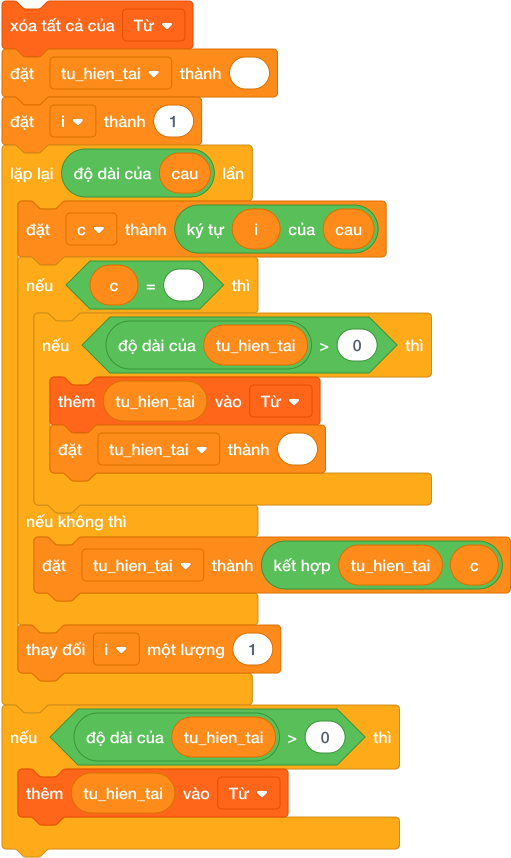

---

## 4. Bảng Mô Phỏng Tách Câu `"DI HOC"` Vào Danh Sách (Dry Run Table)

Câu ban đầu: $S = \text{"DI HOC"}$. Độ dài $= 6$. Ký tự tại các vị trí:

- Vị trí 1: `'D'`
- Vị trí 2: `'I'`
- Vị trí 3: `' '` *(dấu cách)*
- Vị trí 4: `'H'`
- Vị trí 5: `'O'`
- Vị trí 6: `'C'`

| Vòng lặp | Chỉ số `i` | Ký tự `S[i]` | Có phải dấu cách không? | Biến `tu_tam` sau bước | Danh sách `[Danh sách Từ]` |
|:---:|:---:|:---:|:---:|:---:|:---:|
| *Bắt đầu* | — | — | — | `""` | `[]` *(Rỗng)* |
| **1** | $i = 1$ | `'D'` | Không | `"D"` | `[]` |
| **2** | $i = 2$ | `'I'` | Không | `"DI"` | `[]` |
| **3** | $i = 3$ | `' '` | **CÓ** (Gặp dấu cách!) | `""` *(Làm rỗng)* | `["DI"]` *(Đã nạp từ thứ nhất)* |
| **4** | $i = 4$ | `'H'` | Không | `"H"` | `["DI"]` |
| **5** | $i = 5$ | `'O'` | Không | `"HO"` | `["DI"]` |
| **6** | $i = 6$ | `'C'` | Không | `"HOC"` | `["DI"]` |
| **Sau lặp** | — | — | *Xử lý từ cuối:* `tu_tam = "HOC"` | `""` | `["DI", "HOC"]` *(Hoàn thành!)* |

$\implies$ Kết quả: `[Danh sách Từ]` có đúng 2 phần tử là `"DI"` và `"HOC"`.

---

## 5. Tử Huyệt & Các Bẫy Lỗi Thường Gặp (Bug Traps)

> **Bẫy 1: Bỏ quên từ cuối cùng của câu văn (The Last Word Bug)**
> - *Hiện tượng:* Người dùng nhập câu văn bình thường mà không gõ phím cách ở cuối câu (ví dụ: `"EM YEU SCRATCH"`).
> - *Hậu quả:* Vòng lặp duyệt hết ký tự cuối cùng `'H'`, nhưng vì không gặp dấu cách nên kịch bản không thêm vào danh sách. Khi kết thúc chương trình, từ `"SCRATCH"` vẫn nằm kẹt trong biến `tu_tam`!
> - *Khắc phục:* Luôn luôn bổ sung khối kiểm tra ngay sau vòng lặp:
>   `nếu < (độ dài của (tu_tam)) > (0) > thì thêm (tu_tam) vào [Danh sách Từ v]`.

> **Bẫy 2: Lỗi nhiều dấu cách liên tiếp nhau (Double Spaces Trap)**
> - *Hiện tượng:* Giữa hai từ người dùng bấm 2 hoặc 3 dấu cách liên tiếp (ví dụ `"HOC   TIN"`).
> - *Hậu quả:* Nếu không kiểm tra `< (độ dài của (tu_tam)) > 0 >`, các từ rỗng (khoảng trắng rác) sẽ bị nạp liên tục vào danh sách!
> - *Khắc phục:* Chỉ thêm vào danh sách khi biến `tu_tam` thực sự có chứa chữ cái (`độ dài > 0`).

> **Bẫy 3: Phân biệt chữ hoa và chữ thường trong Scratch**
> - *Hiện tượng:* Trong Scratch, khối so sánh `< [A] = [a] >` mặc định coi là **BẰNG NHAU** (Scratch không phân biệt hoa - thường trong phép so sánh bằng).
> - *Hậu quả:* Nếu đề bài yêu cầu đếm riêng chữ cái viết hoa và chữ cái viết thường, phép so sánh bằng thông thường sẽ đếm gộp cả hai.
> - *Khắc phục sư phạm:* Khi cần phân biệt tuyệt đối hoa - thường, giáo viên hướng dẫn học sinh kỹ thuật so khớp qua trang phục nhân vật (Costume Name) hoặc bảng mã quy ước.

---

## 6. Bộ Câu Hỏi Trắc Nghiệm Củng Cố (Concept Quizzes)

1. **Vòng lặp duyệt qua toàn bộ một chuỗi ký tự $S$ cần chạy đúng bao nhiêu lần?**
   - A. `(độ dài của (S)) - 1` lần
   - B. `độ dài của (S)` lần *(Đáp án đúng: duyệt từ ký tự 1 đến hết)*
   - C. `(độ dài của (S)) + 1` lần
   - D. 10 lần

2. **Dấu hiệu cơ bản nhất để nhận biết sự kết thúc của một từ trong câu văn thông thường là:**
   - A. Dấu chấm phẩy
   - B. Dấu cách (khoảng trắng) *(Đáp án đúng)*
   - C. Chữ cái 'Z'
   - D. Chữ số 0

3. **Trong thuật toán tách từ, biến `tu_tam` có vai trò gì?**
   - A. Đếm số lượng từ trong câu
   - B. Tích lũy ghép các chữ cái của một từ đang đọc dở *(Đáp án đúng)*
   - C. Lưu độ dài của câu văn
   - D. Xóa dấu cách thừa

4. **Khi gặp một dấu cách, sau khi đã đưa `tu_tam` vào danh sách, ta bắt buộc phải:**
   - A. Tăng `tu_tam` lên 1
   - B. Làm rỗng biến `tu_tam` để chuẩn bị đón từ mới *(Đáp án đúng)*
   - C. Dừng vòng lặp ngay lập tức
   - D. Đặt `tu_tam` thành dấu cách

5. **Vì sao phải có khối lệnh kiểm tra và thêm `tu_tam` vào danh sách ở ngay sau vòng lặp duyệt chuỗi?**
   - A. Để câu văn dài hơn
   - B. Để tránh bỏ sót từ cuối cùng của câu khi không có dấu cách ở đuôi *(Đáp án đúng)*
   - C. Để đảo ngược câu văn
   - D. Để xóa danh sách

6. **Trong Scratch, biểu thức điều kiện `< [M] = [m] >` sẽ trả về giá trị:**
   - A. SAI
   - B. ĐÚNG *(Đáp án đúng: Scratch mặc định không phân biệt hoa thường khi so sánh chuỗi)*
   - C. Báo lỗi cú pháp
   - D. Không xác định

7. **Giả sử $S = \text{"A B C"}$. Sau khi chạy qua thuật toán tách từ chuẩn, danh sách sẽ có bao nhiêu phần tử?**
   - A. 1
   - B. 2
   - C. 3 *(Đáp án đúng: `"A"`, `"B"`, `"C"`)*
   - D. 5

8. **Để đếm xem câu văn có bao nhiêu dấu cách, ta làm thế nào?**
   - A. Cho biến đếm tăng 1 mỗi khi gặp `< (ký tự (i) của (S)) = [ ] >` *(Đáp án đúng)*
   - B. Lấy `độ dài của (S)` chia đôi
   - C. Dùng khối `kích thước của danh sách`
   - D. Không thể đếm được trong Scratch

9. **Nếu giữa hai từ có 3 dấu cách liên tiếp, điều kiện nào giúp ta không thêm các từ rỗng vào danh sách?**
   - A. `< (i) > (1) >`
   - B. `< (độ dài của (tu_tam)) > (0) >` *(Đáp án đúng: chỉ thêm khi từ tạm có ký tự)*
   - C. `< (tu_tam) = [ ] >`
   - D. `< (độ dài của (S)) > (0) >`

10. **Kỹ thuật ghép từng ký tự vào biến kết quả `chuoi_moi` bằng lệnh `đặt [chuoi_moi] thành (kết hợp (chuoi_moi) (ký tự))` được gọi là:**
    - A. Tích lũy chuỗi (String Accumulation) *(Đáp án đúng)*
    - B. Xóa chuỗi
    - C. Cắt lát chuỗi
    - D. Sắp xếp chuỗi

## Bài tập lesson

# DANH SÁCH BÀI TẬP THỰC HÀNH: BÀI 16 — DUYỆT CHUỖI, BIẾN ĐỔI KÝ TỰ VÀ TÁCH TỪ

**Khóa học:** iKHEDU Scratch  
**Chuyên đề:** Chương 6: Xử Lý Chuỗi Ký Tự  
> **Tổng số bài tập thực hành:** `24 bài` chuẩn hóa 100% (Từ kho bài tập `courses/scratch-bang-a/problems/`).  

---

## 1. Ma Trận Phân Tầng Bài Tập Toàn Diện

| STT | Mã bài toán | Tên bài tập | Phân tầng | Mức nhận thức | Thao tác trọng tâm |
|:---:|---|---|:---:|:---:|---|
| 1 | `sca_l16_p01_in_tung_chu_cai_xuong_dong` | In từng chữ cái xuống dòng | **P0** | Khởi động & Quan sát | Nhập vào một từ $S$. Hãy in ra từng chữ cái của từ đó, mỗi c... |
| 2 | `sca_l16_p02_chuyen_toan_bo_thanh_chu_hoa` | Chuyển toàn bộ thành chữ hoa | **P0** | Khởi động & Quan sát | Nhập một dòng văn bản $S$. Hãy chuyển tất cả các chữ cái tro... |
| 3 | `sca_l16_p03_dem_ky_tu_a_ca_hoa_lan_thuong` | Đếm ký tự 'A' (cả hoa lẫn thường) | **P0** | Khởi động & Quan sát | Cho một chuỗi ký tự $S$. Hãy đếm xem có bao nhiêu chữ cái `'... |
| 4 | `sca_l16_p04_dem_chu_cai_in_hoa_in_thuong` | Đếm chữ cái in hoa & in thường | **P0** | Khởi động & Quan sát | Cho một chuỗi $S$. Hãy đếm xem có bao nhiêu chữ cái in hoa v... |
| 5 | `sca_l16_p05_tach_rieng_chu_so_ra_khoi_van_ban` | Tách riêng chữ số ra khỏi văn bản | **P0** | Khởi động & Quan sát | Cho chuỗi $S$. Hãy nhặt ra toàn bộ các ký tự là chữ số ('0' ... |
| 6 | `sca_l16_p06_tinh_tong_cac_chu_so_trong_chuoi` | Tính tổng các chữ số trong chuỗi | **P0** | Khởi động & Quan sát | Cho một chuỗi văn bản $S$. Hãy tính tổng giá trị của tất cả ... |
| 7 | `sca_l16_p07_doi_chu_hoa_thanh_thuong_nguoc_lai` | Đổi chữ hoa thành thường & ngược lại | **P1** | Cơ bản & Hoàn thành | Cho chuỗi ký tự $S$. Hãy biến đổi chuỗi bằng quy tắc: chữ ho... |
| 8 | `sca_l16_p08_thay_the_ky_tu_bi_mat` | Thay thế ký tự bí mật | **P1** | Cơ bản & Hoàn thành | Nhập một chuỗi $S$. Hãy thay thế tất cả các ký tự khoảng trắ... |
| 9 | `sca_l16_p09_xoa_bo_toan_bo_dau_cach` | Xóa bỏ toàn bộ dấu cách | **P1** | Cơ bản & Hoàn thành | Cho một dòng văn bản $S$. Hãy xóa bỏ tất cả các ký tự khoảng... |
| 10 | `sca_l16_p10_dem_so_luong_nguyen_am` | Đếm số lượng nguyên âm | **P1** | Cơ bản & Hoàn thành | Cho một chuỗi ký tự $S$. Hãy đếm xem có bao nhiêu ký tự nguy... |
| 11 | `sca_l16_p11_nen_chuoi_ky_tu_runlength_encoding` | Nén chuỗi ký tự (Run-Length encoding) | **P1** | Cơ bản & Hoàn thành | Cho một chuỗi $S$ chỉ gồm các chữ cái in hoa. Hãy in ra dạng... |
| 12 | `sca_l16_p12_trich_xuat_so_lon_nhat_trong_van_ban` | Trích xuất số lớn nhất trong văn bản | **P1** | Cơ bản & Hoàn thành | Cho chuỗi văn bản $S$. Hãy tìm và in ra giá trị của **con số... |
| 13 | `sca_l16_p13_dem_so_tu_trong_cau` | Đếm số từ trong câu | **P2** | Luyện tập & Vận dụng | Nhập một dòng văn bản $S$ có thể chứa nhiều khoảng trắng thừ... |
| 14 | `sca_l16_p14_tu_dau_tien_tu_cuoi_cung` | Từ đầu tiên & từ cuối cùng | **P2** | Luyện tập & Vận dụng | Cho một câu văn $S$. Hãy in ra từ đầu tiên và từ cuối cùng c... |
| 15 | `sca_l16_p15_ma_ascii_cua_ky_tu` | Mã ASCII của ký tự | **P2** | Luyện tập & Vận dụng | Nhập một ký tự bất kỳ từ bàn phím. Hãy in ra mã số ASCII của... |
| 16 | `sca_l16_p16_ky_tu_ke_tiep_trong_bang_chu_cai` | Ký tự kế tiếp trong bảng chữ cái | **P2** | Luyện tập & Vận dụng | Nhập vào một chữ cái in hoa từ `'A'` đến `'Y'`. Hãy in ra ch... |
| 17 | `sca_l16_p17_tim_tu_dai_nhat_trong_cau` | Tìm từ dài nhất trong câu | **P2** | Luyện tập & Vận dụng | Cho một câu văn $S$. Hãy tìm và in ra từ có độ dài dài nhất ... |
| 18 | `sca_l16_p18_chuan_hoa_khoang_trang` | Chuẩn hóa khoảng trắng | **P2** | Luyện tập & Vận dụng | Cho chuỗi văn bản $S$. Hãy chuẩn hóa câu văn sao cho: không ... |
| 19 | `sca_l16_p19_viet_hoa_chu_cai_dau_moi_tu_title_case` | Viết hoa chữ cái đầu mỗi từ (title case) | **P3** | Vận dụng cao & Sáng tạo | Nhập họ và tên của một bạn học sinh viết chưa đúng quy tắc (... |
| 20 | `sca_l16_p20_dao_nguoc_tung_tu_trong_cau` | Đảo ngược từng từ trong câu | **P3** | Vận dụng cao & Sáng tạo | Cho một câu văn. Hãy đảo ngược thứ tự các chữ cái trong từng... |
| 21 | `sca_l16_p21_mat_ma_caesar_dich_chuyen_k` | Mật mã Caesar dịch chuyển K | **P3** | Vận dụng cao & Sáng tạo | Cho chuỗi $S$ chỉ gồm các chữ cái in hoa và số nguyên $K$ ($... |
| 22 | `sca_l16_p22_giai_ma_mat_thu_caesar` | Giải mã mật thư Caesar | **P3** | Vận dụng cao & Sáng tạo | Cho một bản mật mã $S$ (chỉ gồm các chữ cái in hoa) đã bị mã... |
| 23 | `sca_l16_p23_tu_xuat_hien_nhieu_nhat_trong_doan` | Từ xuất hiện nhiều nhất trong đoạn | **P3** | Vận dụng cao & Sáng tạo | Cho một đoạn văn bản chỉ gồm các từ cách nhau bởi khoảng trắ... |
| 24 | `sca_l16_p24_mat_ma_thay_the_hoan_vi_anagram` | Mật mã thay thế hoán vị (anagram) | **P3** | Vận dụng cao & Sáng tạo | Cho 2 từ $S_1$ và $S_2$. Kiểm tra xem chúng có phải là Anagr... |

---

## 2. Chi Tiết Từng Bài Tập Thực Hành

### Bài 1 (P0): In từng chữ cái xuống dòng
* **Mã bài toán:** `sca_l16_p01_in_tung_chu_cai_xuong_dong`
* **Độ khó & Phân tầng:** P0 (Khởi động & Quan sát)
* **Bối cảnh:** Duyệt tuần tự qua từng ký tự của văn bản là thao tác nền tảng để phân tích cú pháp và kiểm định luồng dữ liệu ký tự.
* **Nhiệm vụ:** Nhập vào một từ $S$. Hãy in ra từng chữ cái của từ đó, mỗi chữ cái nằm trên một dòng riêng biệt.
* **Dữ liệu vào (Input):** Một chuỗi ký tự $S$ ($1 \le |S| \le 100$).
* **Kết quả ra (Output):** Mỗi ký tự trên một dòng.
* **Dữ liệu mẫu (Sample):**

### Input
```text
CAT
```
### Output
```text
C
A
T
```
### Giải thích

Với dữ liệu đầu vào là `CAT`, kết quả thu được tương ứng là `C
A
T`.

---

### Bài 2 (P0): Chuyển toàn bộ thành chữ hoa
* **Mã bài toán:** `sca_l16_p02_chuyen_toan_bo_thanh_chu_hoa`
* **Độ khó & Phân tầng:** P0 (Khởi động & Quan sát)
* **Bối cảnh:** Chuẩn hóa toàn bộ văn bản sang dạng chữ in hoa giúp việc đối sánh chuỗi trong các cơ sở dữ liệu không bị ảnh hưởng bởi quy cách gõ phím.
* **Nhiệm vụ:** Nhập một dòng văn bản $S$. Hãy chuyển tất cả các chữ cái trong $S$ thành chữ in hoa và nhân vật nói ra màn hình.
* **Dữ liệu vào (Input):** Một dòng văn bản $S$.
* **Kết quả ra (Output):** Chuỗi sau khi đã in hoa toàn bộ.
* **Dữ liệu mẫu (Sample):**

### Input
```text
ikhedu vietnam
```
### Output
```text
IKHEDU VIETNAM
```
### Giải thích

Với dữ liệu đầu vào là `ikhedu vietnam`, kết quả thu được tương ứng là `IKHEDU VIETNAM`.

---

### Bài 3 (P0): Đếm ký tự 'A' (cả hoa lẫn thường)
* **Mã bài toán:** `sca_l16_p03_dem_ky_tu_a_ca_hoa_lan_thuong`
* **Độ khó & Phân tầng:** P0 (Khởi động & Quan sát)
* **Bối cảnh:** Thống kê tần suất xuất hiện của một chữ cái cụ thể (không phân biệt hoa thường) là thao tác căn bản trong phân tích văn bản ngôn ngữ.
* **Nhiệm vụ:** Cho một chuỗi ký tự $S$. Hãy đếm xem có bao nhiêu chữ cái `'A'` hoặc `'a'` xuất hiện trong chuỗi $S$.
* **Dữ liệu vào (Input):** Một chuỗi văn bản $S$ ($1 \le |S| \le 1000$).
* **Kết quả ra (Output):** Số lượng chữ cái 'A' hoặc 'a'.
* **Dữ liệu mẫu (Sample):**

### Input
```text
An va Ba hoc bai
```
### Output
```text
4
```
### Giải thích

Gồm chữ 'A' (1 lần) và 'a' (3 lần trong 'va', 'Ba', 'bai').

---

### Bài 4 (P0): Đếm chữ cái in hoa & in thường
* **Mã bài toán:** `sca_l16_p04_dem_chu_cai_in_hoa_in_thuong`
* **Độ khó & Phân tầng:** P0 (Khởi động & Quan sát)
* **Bối cảnh:** Đo lường tỉ lệ giữa chữ cái in hoa và in thường giúp hệ thống tự động đánh giá độ phức tạp và độ an toàn của mật khẩu.
* **Nhiệm vụ:** Cho một chuỗi $S$. Hãy đếm xem có bao nhiêu chữ cái in hoa và bao nhiêu chữ cái in thường trong chuỗi đó.
* **Dữ liệu vào (Input):** Chuỗi ký tự $S$.
* **Kết quả ra (Output):** Hai số nguyên cách nhau một khoảng trắng: số lượng chữ in hoa trước, số lượng chữ in thường sau.
* **Dữ liệu mẫu (Sample):**

### Input
```text
Lap Trinh Scratch
```
### Output
```text
3 11
```
### Giải thích

Chữ in hoa: 'L', 'T', 'P' (3 chữ).

---

### Bài 5 (P0): Tách riêng chữ số ra khỏi văn bản
* **Mã bài toán:** `sca_l16_p05_tach_rieng_chu_so_ra_khoi_van_ban`
* **Độ khó & Phân tầng:** P0 (Khởi động & Quan sát)
* **Bối cảnh:** Bạn An nhận được một bức thư mật mã, trong đó có các chữ số bị giấu lẫn vào giữa các chữ cái. An phải thật tinh mắt mới thấy những con số trốn kỹ trong dòng chữ. Cả nhóm bạn quyết tâm nhặt hết các chữ số ra để đọc mật thư. Hãy giúp bạn An nhặt hết các chữ số bí mật này.
* **Nhiệm vụ:** Cho chuỗi $S$. Hãy nhặt ra toàn bộ các ký tự là chữ số ('0' - '9') và ghép chúng lại theo thứ tự ban đầu để nhân vật nói ra màn hình. Nếu không có chữ số nào, in ra `KHONG CO`.
* **Dữ liệu vào (Input):** Chuỗi văn bản $S$ ($1 \le |S| \le 1000$).
* **Kết quả ra (Output):** Chuỗi các chữ số ghép lại, hoặc `KHONG CO`.
* **Dữ liệu mẫu (Sample):**

### Input
```text
Toi sinh nam 2014 vao thang 08
```
### Output
```text
201408
```
### Giải thích

Với dữ liệu đầu vào là `Toi sinh nam 2014 vao thang 08`, kết quả thu được tương ứng là `201408`.

---

### Bài 6 (P0): Tính tổng các chữ số trong chuỗi
* **Mã bài toán:** `sca_l16_p06_tinh_tong_cac_chu_so_trong_chuoi`
* **Độ khó & Phân tầng:** P0 (Khởi động & Quan sát)
* **Bối cảnh:** Trong bài kiểm tra, người dùng cần tính nhanh tổng một dãy số. Hãy viết chương trình hỗ trợ tính toán.
* **Nhiệm vụ:** Cho một chuỗi văn bản $S$. Hãy tính tổng giá trị của tất cả các chữ số xuất hiện trong chuỗi đó.
* **Dữ liệu vào (Input):** Chuỗi văn bản $S$ ($1 \le |S| \le 10^5$).
* **Kết quả ra (Output):** Một số nguyên duy nhất là tổng các chữ số.
* **Dữ liệu mẫu (Sample):**

### Input
```text
A1B2C3D4
```
### Output
```text
10
```
### Giải thích

$1 + 2 + 3 + 4 = 10$.

---

### Bài 7 (P1): Đổi chữ hoa thành thường & ngược lại
* **Mã bài toán:** `sca_l16_p07_doi_chu_hoa_thanh_thuong_nguoc_lai`
* **Độ khó & Phân tầng:** P1 (Cơ bản & Hoàn thành)
* **Bối cảnh:** Đảo ngược trạng thái viết hoa và viết thường trên toàn bộ văn bản là thao tác chuyển đổi định dạng thường gặp trong các trình biên tập mã nguồn.
* **Nhiệm vụ:** Cho chuỗi ký tự $S$. Hãy biến đổi chuỗi bằng quy tắc: chữ hoa đổi thành chữ thường, chữ thường đổi thành chữ hoa, các ký tự khác (số, dấu câu, khoảng trắng) giữ nguyên.
* **Dữ liệu vào (Input):** Một chuỗi văn bản $S$.
* **Kết quả ra (Output):** Chuỗi sau khi biến đổi.
* **Dữ liệu mẫu (Sample):**

### Input
```text
Hello World 123
```
### Output
```text
hELLO wORLD 123
```
### Giải thích

Với dữ liệu đầu vào là `Hello World 123`, kết quả thu được tương ứng là `hELLO wORLD 123`.

---

### Bài 8 (P1): Thay thế ký tự bí mật
* **Mã bài toán:** `sca_l16_p08_thay_the_ky_tu_bi_mat`
* **Độ khó & Phân tầng:** P1 (Cơ bản & Hoàn thành)
* **Bối cảnh:** Để chuẩn hóa định dạng văn bản cho đường dẫn liên kết, hệ thống cần thay thế toàn bộ khoảng trống bằng ký tự gạch dưới phân tách.
* **Nhiệm vụ:** Nhập một chuỗi $S$. Hãy thay thế tất cả các ký tự khoảng trắng `" "` trong $S$ bằng dấu gạch dưới `"_"` và in ra kết quả.
* **Dữ liệu vào (Input):** Một chuỗi $S$.
* **Kết quả ra (Output):** Chuỗi sau khi thay thế.
* **Dữ liệu mẫu (Sample):**

### Input
```text
hoc lap trinh de vui
```
### Output
```text
hoc_lap_trinh_de_vui
```
### Giải thích

Với dữ liệu đầu vào là `hoc lap trinh de vui`, kết quả thu được tương ứng là `hoc_lap_trinh_de_vui`.

---

### Bài 9 (P1): Xóa bỏ toàn bộ dấu cách
* **Mã bài toán:** `sca_l16_p09_xoa_bo_toan_bo_dau_cach`
* **Độ khó & Phân tầng:** P1 (Cơ bản & Hoàn thành)
* **Bối cảnh:** Loại bỏ toàn bộ khoảng trắng thừa giúp nén kích thước chuỗi và chuẩn hóa dữ liệu khóa tìm kiếm.
* **Nhiệm vụ:** Cho một dòng văn bản $S$. Hãy xóa bỏ tất cả các ký tự khoảng trắng trong chuỗi để thu được một chuỗi viết liền hoàn toàn.
* **Dữ liệu vào (Input):** Một dòng văn bản $S$ ($1 \le |S| \le 10^5$).
* **Kết quả ra (Output):** Chuỗi viết liền không còn khoảng trắng.
* **Dữ liệu mẫu (Sample):**

### Input
```text
Lap Trinh Scratch Bang A
```
### Output
```text
LapTrinhScratchBangA
```
### Giải thích

Với dữ liệu đầu vào là `Lap Trinh Scratch Bang A`, kết quả thu được tương ứng là `LapTrinhScratchBangA`.

---

### Bài 10 (P1): Đếm số lượng nguyên âm
* **Mã bài toán:** `sca_l16_p10_dem_so_luong_nguyen_am`
* **Độ khó & Phân tầng:** P1 (Cơ bản & Hoàn thành)
* **Bối cảnh:** Trong giờ tiếng Anh, cô giáo dạy cả lớp bài hát về các chữ cái vui nhộn. Cô nói trong tiếng Anh, 5 chữ cái: `A, E, I, O, U` (cả hoa lẫn thường) được gọi là nguyên âm (vowels). Bạn nào đếm đúng số nguyên âm trong một từ sẽ được hát trước cả lớp. Hãy giúp cả lớp đếm số nguyên âm thật nhanh.
* **Nhiệm vụ:** Cho một chuỗi ký tự $S$. Hãy đếm xem có bao nhiêu ký tự nguyên âm trong chuỗi $S$.
* **Dữ liệu vào (Input):** Chuỗi văn bản $S$ ($1 \le |S| \le 1000$).
* **Kết quả ra (Output):** Số lượng nguyên âm.
* **Dữ liệu mẫu (Sample):**

### Input
```text
EDUCATION
```
### Output
```text
5
```
### Giải thích

Các nguyên âm: E, U, A, I, O (có 5 nguyên âm).

---

### Bài 11 (P1): Nén chuỗi ký tự (Run-Length encoding)
* **Mã bài toán:** `sca_l16_p11_nen_chuoi_ky_tu_runlength_encoding`
* **Độ khó & Phân tầng:** P1 (Cơ bản & Hoàn thành)
* **Bối cảnh:** Bạn Nam gấp thật nhiều ngôi sao giấy cùng màu rồi xếp chúng thành hàng dài trên bàn. Cô giáo dạy thuật toán nén chuỗi đơn giản thay thế một dãy các ký tự giống nhau liên tiếp bằng ký tự đó kèm theo số lần lặp lại.
 Ví dụ: `AAABBC` nén thành `A3B2C1`.
Nam muốn ghi lại hàng ngôi sao thật gọn vào sổ. Hãy giúp bạn Nam viết chương trình nén chuỗi thật gọn.
* **Nhiệm vụ:** Cho một chuỗi $S$ chỉ gồm các chữ cái in hoa. Hãy in ra dạng nén của chuỗi $S$.
* **Dữ liệu vào (Input):** Một chuỗi $S$ ($1 \le |S| \le 1000$).
* **Kết quả ra (Output):** Chuỗi sau khi nén.
* **Dữ liệu mẫu (Sample):**

### Input
```text
AAABBCCCC
```
### Output
```text
A3B2C4
```
### Giải thích

Với dữ liệu đầu vào là `AAABBCCCC`, kết quả thu được tương ứng là `A3B2C4`.

---

### Bài 12 (P1): Trích xuất số lớn nhất trong văn bản
* **Mã bài toán:** `sca_l16_p12_trich_xuat_so_lon_nhat_trong_van_ban`
* **Độ khó & Phân tầng:** P1 (Cơ bản & Hoàn thành)
* **Bối cảnh:** Lớp trưởng ghi một bài báo cáo, trong đó có các con số nằm rải rác giữa các câu chữ. Một con số có thể có nhiều chữ số liên tiếp nhau. Cả lớp muốn biết con số nào to nhất để khen bạn được điểm cao. Hãy giúp lớp trưởng tìm ra con số lớn nhất trong bài báo cáo.
* **Nhiệm vụ:** Cho chuỗi văn bản $S$. Hãy tìm và in ra giá trị của **con số nguyên lớn nhất** xuất hiện trong chuỗi đó. Dữ liệu đảm bảo có ít nhất 1 chữ số.
* **Dữ liệu vào (Input):** Một chuỗi văn bản $S$ ($1 \le |S| \le 1000$).
* **Kết quả ra (Output):** Số nguyên lớn nhất tìm được.
* **Dữ liệu mẫu (Sample):**

### Input
```text
Lop 5A co 38 hoc sinh va 105 quyen sach
```
### Output
```text
105
```
### Giải thích

Các con số xuất hiện là: 5, 38, 105. Số lớn nhất là 105.

---

### Bài 13 (P2): Đếm số từ trong câu
* **Mã bài toán:** `sca_l16_p13_dem_so_tu_trong_cau`
* **Độ khó & Phân tầng:** P2 (Luyện tập & Vận dụng)
* **Bối cảnh:** Đếm số lượng từ trong một đoạn văn bản là chỉ số cơ bản nhất của các phần mềm xử lý soạn thảo và phân tích ngôn ngữ tự nhiên.
* **Nhiệm vụ:** Nhập một dòng văn bản $S$ có thể chứa nhiều khoảng trắng thừa ở đầu, cuối hoặc giữa các từ. Hãy đếm xem câu văn đó có bao nhiêu từ.
* **Dữ liệu vào (Input):** Một dòng văn bản $S$ ($1 \le |S| \le 1000$).
* **Kết quả ra (Output):** Số lượng từ trong câu.
* **Dữ liệu mẫu (Sample):**

### Input
```text
 Chuc mung nam moi 
```
### Output
```text
4
```
### Giải thích

Có 4 từ: 'Chuc', 'mung', 'nam', 'moi'.

---

### Bài 14 (P2): Từ đầu tiên & từ cuối cùng
* **Mã bài toán:** `sca_l16_p14_tu_dau_tien_tu_cuoi_cung`
* **Độ khó & Phân tầng:** P2 (Luyện tập & Vận dụng)
* **Bối cảnh:** Trích xuất từ mở đầu và từ kết thúc hỗ trợ xác định cấu trúc ngữ pháp và tiêu đề của một câu lệnh truy vấn.
* **Nhiệm vụ:** Cho một câu văn $S$. Hãy in ra từ đầu tiên và từ cuối cùng của câu văn đó trên 2 dòng riêng biệt.
* **Dữ liệu vào (Input):** Một dòng văn bản có ít nhất 1 từ.
* **Kết quả ra (Output):** Dòng 1 in từ đầu tiên, dòng 2 in từ cuối cùng.
* **Dữ liệu mẫu (Sample):**

### Input
```text
Hoc Scratch cuc vui
```
### Output
```text
Hoc
vui
```
### Giải thích

Với dữ liệu đầu vào là `Hoc Scratch cuc vui`, kết quả thu được tương ứng là `Hoc
vui`.

---

### Bài 15 (P2): Mã ASCII của ký tự
* **Mã bài toán:** `sca_l16_p15_ma_ascii_cua_ky_tu`
* **Độ khó & Phân tầng:** P2 (Luyện tập & Vận dụng)
* **Bối cảnh:** Mỗi ký tự hiển thị trên máy tính đều được mã hóa bằng một số nguyên duy nhất theo chuẩn ASCII. Việc tra cứu mã này là kiến thức cốt lõi về biểu diễn dữ liệu.
* **Nhiệm vụ:** Nhập một ký tự bất kỳ từ bàn phím. Hãy in ra mã số ASCII của ký tự đó.
* **Dữ liệu vào (Input):** Một ký tự duy nhất $C$.
* **Kết quả ra (Output):** Một số nguyên là mã ASCII.
* **Dữ liệu mẫu (Sample):**

### Input
```text
A
```
### Output
```text
65
```
### Giải thích

Với dữ liệu đầu vào là `A`, kết quả thu được tương ứng là `65`.

---

### Bài 16 (P2): Ký tự kế tiếp trong bảng chữ cái
* **Mã bài toán:** `sca_l16_p16_ky_tu_ke_tiep_trong_bang_chu_cai`
* **Độ khó & Phân tầng:** P2 (Luyện tập & Vận dụng)
* **Bối cảnh:** Xác định ký tự liền sau trong bảng chữ cái dựa trên phép tịnh tiến mã số ASCII là nền tảng của nhiều thuật toán sinh khóa và mã hóa cổ điển.
* **Nhiệm vụ:** Nhập vào một chữ cái in hoa từ `'A'` đến `'Y'`. Hãy in ra chữ cái đứng ngay liền sau nó trong bảng chữ cái tiếng Anh.
* **Dữ liệu vào (Input):** Một ký tự in hoa $C \in ['A' \dots 'Y']$.
* **Kết quả ra (Output):** Chữ cái liền sau.
* **Dữ liệu mẫu (Sample):**

### Input
```text
C
```
### Output
```text
D
```
### Giải thích

Với dữ liệu đầu vào là `C`, kết quả thu được tương ứng là `D`.

---

### Bài 17 (P2): Tìm từ dài nhất trong câu
* **Mã bài toán:** `sca_l16_p17_tim_tu_dai_nhat_trong_cau`
* **Độ khó & Phân tầng:** P2 (Luyện tập & Vận dụng)
* **Bối cảnh:** Thí sinh đang tìm kiếm một giá trị đặc biệt trong tập dữ liệu. Hãy viết chương trình tìm kiếm hiệu quả.
* **Nhiệm vụ:** Cho một câu văn $S$. Hãy tìm và in ra từ có độ dài dài nhất trong câu. Nếu có nhiều từ cùng độ dài dài nhất, in ra từ đầu tiên xuất hiện.
* **Dữ liệu vào (Input):** Một dòng văn bản $S$.
* **Kết quả ra (Output):** Từ dài nhất tìm được.
* **Dữ liệu mẫu (Sample):**

### Input
```text
Hoc lap trinh rat thu vi
```
### Output
```text
trinh
```
### Giải thích

Từ 'trinh' có 5 chữ cái (dài nhất).

---

### Bài 18 (P2): Chuẩn hóa khoảng trắng
* **Mã bài toán:** `sca_l16_p18_chuan_hoa_khoang_trang`
* **Độ khó & Phân tầng:** P2 (Luyện tập & Vận dụng)
* **Bối cảnh:** Na tập đánh máy để viết thiệp mời sinh nhật cho cả lớp. Khi đánh máy, một bạn học sinh lỡ tay bấm rất nhiều dấu cách thừa giữa các từ và ở hai đầu câu văn. Tấm thiệp trông rời rạc và chưa đẹp mắt chút nào. Hãy giúp Na dọn dẹp tấm thiệp cho gọn gàng.
* **Nhiệm vụ:** Cho chuỗi văn bản $S$. Hãy chuẩn hóa câu văn sao cho: không còn khoảng trắng ở đầu và cuối câu, giữa mỗi từ chỉ có duy nhất **một dấu cách**.
* **Dữ liệu vào (Input):** Một dòng văn bản $S$ ($1 \le |S| \le 1000$).
* **Kết quả ra (Output):** Câu văn chuẩn hóa.
* **Dữ liệu mẫu (Sample):**

### Input
```text
 Scratch rat la tuyet 
```
### Output
```text
Scratch rat la tuyet
```
### Giải thích

Với dữ liệu đầu vào là `Scratch rat la tuyet`, kết quả thu được tương ứng là `Scratch rat la tuyet`.

---

### Bài 19 (P3): Viết hoa chữ cái đầu mỗi từ (title case)
* **Mã bài toán:** `sca_l16_p19_viet_hoa_chu_cai_dau_moi_tu_title_case`
* **Độ khó & Phân tầng:** P3 (Vận dụng cao & Sáng tạo)
* **Bối cảnh:** Quy tắc viết hoa chữ cái đầu mỗi từ là chuẩn mực định dạng bắt buộc khi lưu trữ danh tính người dùng trong hệ thống cơ sở dữ liệu.
* **Nhiệm vụ:** Nhập họ và tên của một bạn học sinh viết chưa đúng quy tắc (ví dụ: `nguyen van an`). Hãy chuẩn hóa họ tên bằng cách viết hoa chữ cái đầu tiên của mỗi từ và viết thường các chữ cái còn lại.
* **Dữ liệu vào (Input):** Một chuỗi họ tên.
* **Kết quả ra (Output):** Họ tên sau khi chuẩn hóa.
* **Dữ liệu mẫu (Sample):**

### Input
```text
nguyen van an
```
### Output
```text
Nguyen Van An
```
### Giải thích

Với dữ liệu đầu vào là `nguyen van an`, kết quả thu được tương ứng là `Nguyen Van An`.

---

### Bài 20 (P3): Đảo ngược từng từ trong câu
* **Mã bài toán:** `sca_l16_p20_dao_nguoc_tung_tu_trong_cau`
* **Độ khó & Phân tầng:** P3 (Vận dụng cao & Sáng tạo)
* **Bối cảnh:** Đảo ngược các ký tự nội bộ của từng từ trong khi vẫn bảo toàn thứ tự các từ trong câu là bài toán rèn luyện kỹ năng kết hợp tách từ và cắt lát chuỗi.
* **Nhiệm vụ:** Cho một câu văn. Hãy đảo ngược thứ tự các chữ cái trong từng từ một, nhưng giữ nguyên vị trí của các từ trong câu.
* **Dữ liệu vào (Input):** Một dòng văn bản.
* **Kết quả ra (Output):** Câu văn mới với từng từ bị đảo ngược.
* **Dữ liệu mẫu (Sample):**

### Input
```text
Toi yeu Viet Nam
```
### Output
```text
ioT uey teiV maN
```
### Giải thích

'Toi' -> 'ioT', 'yeu' -> 'uey'...

---

### Bài 21 (P3): Mật mã Caesar dịch chuyển K
* **Mã bài toán:** `sca_l16_p21_mat_ma_caesar_dich_chuyen_k`
* **Độ khó & Phân tầng:** P3 (Vận dụng cao & Sáng tạo)
* **Bối cảnh:** Bạn Bin và cả nhóm chơi trò điệp viên gửi thư bí mật cho nhau trong sân trường. Hoàng đế Caesar mã hóa bức thư gồm các chữ cái in hoa (`'A'` đến `'Z'`) bằng cách dịch chuyển mỗi chữ cái sang phải $K$ bước theo vòng tròn 26 chữ cái ($A \to B \dots Z \to A$). Cả nhóm háo hức muốn tự mã hóa thư của riêng mình. Hãy giúp bạn Bin viết chương trình mã hóa thư.
* **Nhiệm vụ:** Cho chuỗi $S$ chỉ gồm các chữ cái in hoa và số nguyên $K$ ($1 \le K \le 25$). Hãy in ra bản mật mã sau khi mã hóa.
* **Dữ liệu vào (Input):** Dòng 1 chứa chuỗi $S$. Dòng 2 chứa số $K$.
* **Kết quả ra (Output):** Chuỗi sau khi mã hóa.
* **Dữ liệu mẫu (Sample):**

### Input
```text
ABCXYZ
3
```
### Output
```text
DEFABC
```
### Giải thích

'A'->'D', 'B'->'E', 'X'->'A', 'Y'->'B', 'Z'->'C'.
* **Công thức toán học:** `chr((ord(ch) - ord('A') + k) % 26 + ord('A'))`.

---

### Bài 22 (P3): Giải mã mật thư Caesar
* **Mã bài toán:** `sca_l16_p22_giai_ma_mat_thu_caesar`
* **Độ khó & Phân tầng:** P3 (Vận dụng cao & Sáng tạo)
* **Bối cảnh:** Mật mã Caesar là một trong những phương pháp mã hóa thay thế lâu đời nhất, hoạt động bằng cách dịch chuyển từng chữ cái trong bảng mã theo một bước nhảy cố định.
* **Nhiệm vụ:** Cho một bản mật mã $S$ (chỉ gồm các chữ cái in hoa) đã bị mã hóa Caesar với bước nhảy $K$. Hãy giải mã để tìm lại thông điệp ban đầu.
* **Dữ liệu vào (Input):** Dòng 1 chứa bản mật mã $S$. Dòng 2 chứa số nguyên $K$ ($1 \le K \le 25$).
* **Kết quả ra (Output):** Thông điệp ban đầu trước khi mã hóa.
* **Dữ liệu mẫu (Sample):**

### Input
```text
DEFABC
3
```
### Output
```text
ABCXYZ
```
### Giải thích

Với dữ liệu đầu vào là `DEFABC
3`, kết quả thu được tương ứng là `ABCXYZ`.

---

### Bài 23 (P3): Từ xuất hiện nhiều nhất trong đoạn
* **Mã bài toán:** `sca_l16_p23_tu_xuat_hien_nhieu_nhat_trong_doan`
* **Độ khó & Phân tầng:** P3 (Vận dụng cao & Sáng tạo)
* **Bối cảnh:** Tìm từ xuất hiện với tần suất cao nhất trong một văn bản là bài toán quan trọng trong trích xuất từ khóa và khai phá dữ liệu văn bản.
* **Nhiệm vụ:** Cho một đoạn văn bản chỉ gồm các từ cách nhau bởi khoảng trắng. Hãy tìm xem từ nào xuất hiện nhiều lần nhất trong đoạn văn đó và xuất hiện bao nhiêu lần. Dữ liệu đảm bảo chỉ có 1 từ xuất hiện nhiều nhất.
* **Dữ liệu vào (Input):** Một đoạn văn bản $S$ gồm các chữ cái viết thường.
* **Kết quả ra (Output):** Từ xuất hiện nhiều nhất và số lần xuất hiện, cách nhau một khoảng trắng.
* **Dữ liệu mẫu (Sample):**

### Input
```text
cam quyt mit dua cam xoai cam dua
```
### Output
```text
cam 3
```
### Giải thích

Với dữ liệu đầu vào là `cam quyt mit dua cam xoai cam dua`, kết quả thu được tương ứng là `cam 3`.

---

### Bài 24 (P3): Mật mã thay thế hoán vị (anagram)
* **Mã bài toán:** `sca_l16_p24_mat_ma_thay_the_hoan_vi_anagram`
* **Độ khó & Phân tầng:** P3 (Vận dụng cao & Sáng tạo)
* **Bối cảnh:** Trong giờ thủ công, hai bạn cùng xáo trộn các thẻ chữ cái để xếp thành từ mới. Hai từ được gọi là "Anagram" (hoán vị ký tự của nhau) nếu chúng có thể tạo thành từ nhau bằng cách xáo trộn lại thứ tự các chữ cái (ví dụ: `silent` và `listen`, `heart` và `earth`). Cả lớp thi xem ai xếp được cặp từ trùng khớp nhau. Hãy giúp các bạn kiểm tra xem hai từ có phải Anagram không.
* **Nhiệm vụ:** Cho 2 từ $S_1$ và $S_2$. Kiểm tra xem chúng có phải là Anagram của nhau không. In `YES` nếu đúng, ngược lại in `NO`.
* **Dữ liệu vào (Input):** Hai dòng, mỗi dòng chứa một từ viết thường ($1 \le |S_1|, |S_2| \le 10^5$).
* **Kết quả ra (Output):** `YES` hoặc `NO`.
* **Dữ liệu mẫu (Sample):**

### Input
```text
listen
silent
```
### Output
```text
YES
```
### Giải thích

Với dữ liệu đầu vào là `listen
silent`, kết quả thu được tương ứng là `YES`.

---
