# DANH SÁCH BÀI TẬP THỰC HÀNH: BÀI 01 — VẼ HÌNH VỚI PEN VÀ REPEAT

**Khóa học:** iKHEDU Scratch  
**Chuyên đề:** Chương 1: Bút Vẽ Pen & Đồ Họa  
> **Tổng số bài tập thực hành:** `16 bài` chuẩn hóa 100% (Từ kho bài tập `courses/scratch-bang-a/problems/`).  

---

## 1. Ma Trận Phân Tầng Bài Tập Toàn Diện

| STT | Mã bài toán | Tên bài tập | Phân tầng | Mức nhận thức | Thao tác trọng tâm |
|:---:|---|---|:---:|:---:|---|
| 1 | `sca_pen_p00_setup_net_ve` | Khởi động nét vẽ & Dấu cộng trung tâm | **P0** | Khởi động & Quan sát | Em hãy lập trình điều khiển chú Mèo Scratch thực hiện các bư... |
| 2 | `sca_pen_p01_da_giac_deu` | Bộ 4 Đa Giác Đều Cơ Bản | **P0** | Khởi động & Quan sát | Lập trình vẽ các hình đa giác đều với độ dài cạnh 100 bước v... |
| 3 | `sca_pen_p02_ban_phim_da_giac` | Bàn Phím Đa Giác Tương Tác | **P0** | Khởi động & Quan sát | Lập trình sự kiện: Phím 1 vẽ Tam giác đều, Phím 2 vẽ Hình vu... |
| 4 | `sca_pen_p03_doi_mau_net_dam` | Đổi Màu Và Tăng Nét Đậm | **P0** | Khởi động & Quan sát | Sử dụng khối 'đặt kích thước bút vẽ' và 'thay đổi màu bút vẽ... |
| 5 | `sca_pen_p04_cap_tam_giac_doi_xung` | Cặp Tam Giác Đối Xứng Qua Tâm | **P0** | Khởi động & Quan sát | Vẽ 1 tam giác đều hướng lên, sau đó đổi hướng 180 độ và vẽ t... |
| 6 | `sca_pen_p05_vuong_dong_tam` | Hình Vuông Đồng Tâm Mở Rộng | **P1** | Cơ bản & Hoàn thành | Lập trình vẽ N hình vuông lồng nhau, mỗi hình vuông có độ dà... |
| 7 | `sca_pen_p06_la_co_xoay_vong` | Lá Cờ Xoay Vòng Quanh Tâm | **P1** | Cơ bản & Hoàn thành | Tạo mảnh ghép lá cờ (My Blocks), sau đó dùng vòng lặp quay q... |
| 8 | `sca_pen_p07_ngoi_sao_5_canh` | Ngôi Sao 5 Cánh Khép Kín | **P1** | Cơ bản & Hoàn thành | Vẽ ngôi sao 5 cánh nét liền với góc quay đỉnh sao là 144 độ ... |
| 9 | `sca_pen_p08_tam_giac_xoay_chong` | Hoa Văn Tam Giác Xoay Chồng | **P1** | Cơ bản & Hoàn thành | Lập trình vẽ N hình tam giác đều chung một đỉnh, mỗi lần vẽ ... |
| 10 | `sca_pen_p09_hoa_tiet_hinh_thoi` | Hoa Hình Thoi Xoay Vòng | **P1** | Cơ bản & Hoàn thành | Viết thủ tục vẽ hình thoi cạnh 80, góc 60 và 120; sau đó lặp... |
| 11 | `sca_pen_p10_kim_tu_thap_bac_thang` | Kim Tự Tháp Bậc Thang | **P2** | Luyện tập & Vận dụng | Lập trình vẽ Kim tự tháp có N bậc thang, mỗi bậc có độ dài t... |
| 12 | `sca_pen_p11_luoi_o_vuong_ban_co` | Bàn Cờ Lưới Ô Vuông M x N | **P2** | Luyện tập & Vận dụng | Sử dụng 2 vòng lặp lồng nhau điều khiển tọa độ để vẽ lưới gồ... |
| 13 | `sca_pen_p12_tam_giac_nhieu_tang` | Tam Giác Nhiều Tầng Xếp Chồng | **P2** | Luyện tập & Vận dụng | Vẽ tháp tam giác có T tầng, tầng đáy có T hình tam giác. |
| 14 | `sca_pen_p13_luc_giac_long_nhau` | Lục Giác Tổ Ong Đồng Tâm | **P2** | Luyện tập & Vận dụng | Lập trình vẽ N hình lục giác đều lồng nhau từ cạnh lớn đến c... |
| 15 | `sca_pen_p14_ngoi_sao_8_canh_nghe_thuat` | Ngôi Sao 8 Cánh Nghệ Thuật | **P2** | Luyện tập & Vận dụng | Ghép 2 hình vuông xoay góc 45 độ hoặc ghép 8 hình tam giác n... |
| 16 | `sca_pen_p15_cay_thong_noel` | Cây Thông Noel Đa Tầng | **P3** | Vận dụng cao & Sáng tạo | Vẽ 3 tán lá tam giác xếp chồng lên nhau và một gốc cây hình ... |

---

## 2. Đặc Tả Chi Tiết Từng Bài Tập (Phân Tầng P0 $\longrightarrow$ P3)

### Bài 1 (P0): Khởi động nét vẽ & Dấu cộng trung tâm
* **Mã bài toán:** `sca_pen_p00_setup_net_ve`

* **Hình ảnh mẫu minh họa:**


  

* **Độ khó & Phân tầng:** P0 (Khởi động & Quan sát)
* **Bối cảnh:** Trước khi bắt đầu hành trình vẽ các kỳ quan và hoa văn hình học rực rỡ trên sân khấu Scratch, chú Mèo Scratch cần kiểm tra xem chiếc bút vẽ thần kỳ của mình có hoạt động hoàn hảo hay không. Để kiểm tra chiếc bút, chú Mèo quyết định vẽ một ký hiệu dấu cộng màu đỏ tươi rực rỡ ngay chính giữa tâm sân khấu.
* **Nhiệm vụ:** Em hãy lập trình điều khiển chú Mèo Scratch thực hiện các bước sau:

1. Xóa sạch toàn bộ nét vẽ cũ trên sân khấu.

2. Di chuyển về tâm sân khấu tại tọa độ $(0, 0)$ và quay mặt về hướng $90^\circ$ (hướng sang phải).

3. Thiết lập màu bút vẽ là màu đỏ và độ dày nét vẽ là $3$.

4. Đặt bút xuống và vẽ một dấu cộng gồm $4$ nhánh cân đối tỏa ra $4$ hướng chính (Đông, Tây, Nam, Bắc), mỗi nhánh có độ dài $50$ bước. Sau khi vẽ mỗi nhánh, nhân vật lùi về đúng tâm $(0, 0)$ rồi mới xoay hướng vẽ nhánh tiếp theo.
* **Dữ liệu mẫu (Sample):**

### Kịch bản chạy
```text
Sự kiện: Nhấn Cờ Xanh
Hành động: 

- Xóa màn hình

- Đặt nét vẽ màu đỏ, độ dày 3

- Vẽ nhánh phải: đi 50 bước, lùi 50 bước, xoay phải 90 độ

- Vẽ nhánh dưới: đi 50 bước, lùi 50 bước, xoay phải 90 độ

- Vẽ nhánh trái: đi 50 bước, lùi 50 bước, xoay phải 90 độ

- Vẽ nhánh trên: đi 50 bước, lùi 50 bước, xoay phải 90 độ
```

### Kết quả trên sân khấu
Dấu cộng màu đỏ đối xứng 4 hướng xuất hiện tại $(0, 0)$.

### Giải thích
Nhân vật lần lượt di chuyển ra ngoài $50$ bước để vẽ nét mực, sau đó lùi lại $-50$ bước trên chính đường vừa vẽ để trở về tâm rồi mới đổi hướng $90^\circ$. Bằng cách này, cả 4 nhánh đều xuất phát từ tâm mà không cần phải nhấc bút nhiều lần.

---

### Khối lệnh Scratch gợi ý giải bài


---
### Bài 2 (P0): Bộ 4 Đa Giác Đều Cơ Bản
* **Mã bài toán:** `sca_pen_p01_da_giac_deu`

* **Hình ảnh mẫu minh họa:**


  

  

  

  

* **Độ khó & Phân tầng:** P0 (Khởi động & Quan sát)
* **Bối cảnh:** Trong công viên hình học Scratch Park, chú Mèo Scratch được giao nhiệm vụ vẽ 4 bồn hoa đa giác đều hoàn hảo: Tam giác đều (3 cạnh), Hình vuông (4 cạnh), Ngũ giác đều (5 cạnh), Lục giác đều (6 cạnh).
* **Nhiệm vụ:** Lập trình vẽ các hình đa giác đều với độ dài cạnh 100 bước và góc quay ngoài 360 / N độ.
* **Kịch bản tương tác:** Khởi động khi nhấn biểu tượng Cờ Xanh (không cần nhập dữ liệu từ bàn phím).
* **Kết quả mong đợi:** Hình đa giác đều khép kín trên sân khấu.
* **Dữ liệu mẫu (Sample):**

### Kịch bản chạy trên sân khấu

- **Thao tác khởi động:** Nhấn cờ xanh để bắt đầu.

- **Kết quả hình ảnh:** Hình đa giác đều khép kín trên sân khấu.

### Giải thích

Tam giác: lặp 3 [đi 100, xoay 120]. Hình vuông: lặp 4 [đi 100, xoay 90].

---

### Khối lệnh Scratch gợi ý giải bài

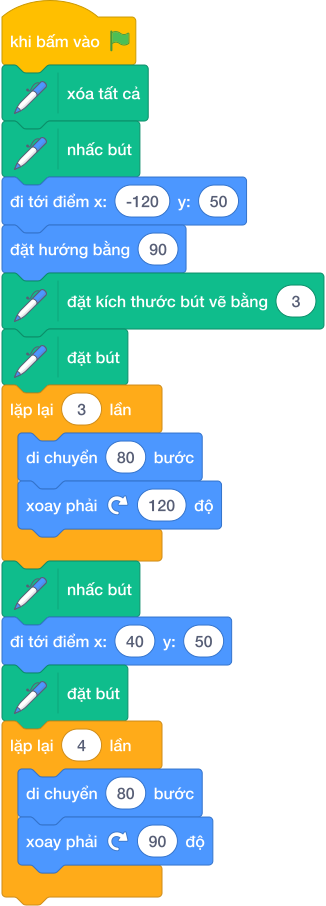

---
### Bài 3 (P0): Bàn Phím Đa Giác Tương Tác
* **Mã bài toán:** `sca_pen_p02_ban_phim_da_giac`

* **Hình ảnh mẫu minh họa:**


  

  

  

  

* **Độ khó & Phân tầng:** P0 (Khởi động & Quan sát)
* **Bối cảnh:** Nhà thiết kế game muốn người chơi tương tác bằng các phím số 1, 2, 3, 4 trên bàn phím để vẽ nhanh các hình khối tương ứng.
* **Nhiệm vụ:** Lập trình sự kiện: Phím 1 vẽ Tam giác đều, Phím 2 vẽ Hình vuông, Phím 3 vẽ Ngũ giác đều, Phím 4 vẽ Lục giác đều.
* **Kịch bản tương tác:** Nhấn phím 1, 2, 3 hoặc 4 trên bàn phím.
* **Kết quả mong đợi:** Mỗi phím vẽ ra hình đa giác tương ứng với màu sắc khác nhau.
* **Dữ liệu mẫu (Sample):**

### Kịch bản chạy trên sân khấu

- **Thao tác khởi động:** Nhấn phím 1, 2, 3 hoặc 4 trên bàn phím.

- **Kết quả hình ảnh:** Mỗi phím vẽ ra hình đa giác tương ứng với màu sắc khác nhau.

### Giải thích

Bấm phím 1 -> Mèo vẽ Tam giác màu đỏ. Bấm phím 2 -> Mèo vẽ Hình vuông màu xanh.

---

### Khối lệnh Scratch gợi ý giải bài

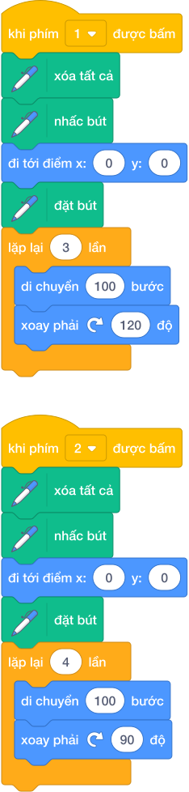

---
### Bài 4 (P0): Đổi Màu Và Tăng Nét Đậm
* **Mã bài toán:** `sca_pen_p03_doi_mau_net_dam`

* **Hình ảnh mẫu minh họa:**


  

  

  

  

* **Độ khó & Phân tầng:** P0 (Khởi động & Quan sát)
* **Bối cảnh:** Họa sĩ Mèo muốn tạo ra bức tranh ấn tượng với các nét vẽ dày dặn và màu sắc biến đổi linh hoạt.
* **Nhiệm vụ:** Sử dụng khối 'đặt kích thước bút vẽ' và 'thay đổi màu bút vẽ một lượng 10' sau mỗi cạnh vẽ.
* **Kịch bản tương tác:** Khởi động khi nhấn biểu tượng Cờ Xanh (không cần nhập dữ liệu từ bàn phím).
* **Kết quả mong đợi:** Hình đa giác có mỗi cạnh mang một màu sắc rực rỡ khác nhau.
* **Dữ liệu mẫu (Sample):**

### Kịch bản chạy trên sân khấu

- **Thao tác khởi động:** Nhấn cờ xanh.

- **Kết quả hình ảnh:** Hình đa giác có mỗi cạnh mang một màu sắc rực rỡ khác nhau.

### Giải thích

Cạnh 1 màu đỏ, Cạnh 2 màu vàng, Cạnh 3 màu lục, Cạnh 4 màu lam.

---

### Khối lệnh Scratch gợi ý giải bài

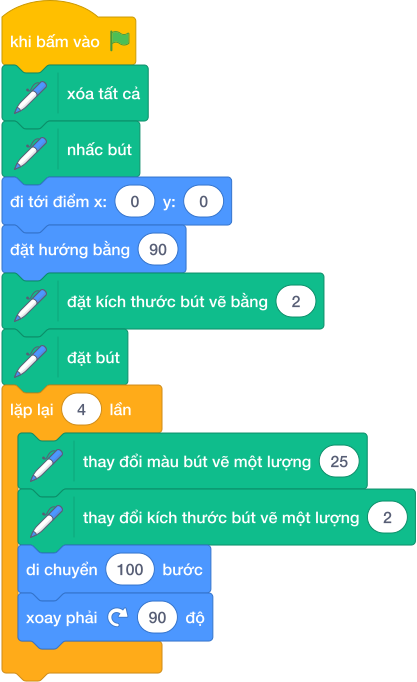

---
### Bài 5 (P0): Cặp Tam Giác Đối Xứng Qua Tâm
* **Mã bài toán:** `sca_pen_p04_cap_tam_giac_doi_xung`

* **Hình ảnh mẫu minh họa:**


  

* **Độ khó & Phân tầng:** P0 (Khởi động & Quan sát)
* **Bối cảnh:** Biểu tượng của hội toán học gồm hai hình tam giác đều ghép đối xứng nhau tạo thành hình ngôi sao 6 cánh David.
* **Nhiệm vụ:** Vẽ 1 tam giác đều hướng lên, sau đó đổi hướng 180 độ và vẽ tam giác đều thứ hai lồng vào nhau.
* **Kịch bản tương tác:** Khởi động khi nhấn biểu tượng Cờ Xanh (không cần nhập dữ liệu từ bàn phím).
* **Kết quả mong đợi:** Hai hình tam giác lồng nhau tạo thành ngôi sao 6 cánh sắc nét.
* **Dữ liệu mẫu (Sample):**

### Kịch bản chạy trên sân khấu

- **Thao tác khởi động:** Nhấn cờ xanh.

- **Kết quả hình ảnh:** Hai hình tam giác lồng nhau tạo thành ngôi sao 6 cánh sắc nét.

### Giải thích

Vẽ tam giác 1, nhấc bút di chuyển đến vị trí đối xứng, đặt bút vẽ tam giác 2.

---

### Khối lệnh Scratch gợi ý giải bài

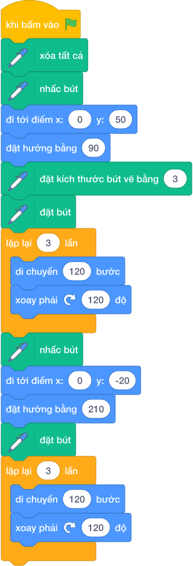

---
### Bài 6 (P1): Hình Vuông Đồng Tâm Mở Rộng
* **Mã bài toán:** `sca_pen_p05_vuong_dong_tam`

* **Hình ảnh mẫu minh họa:**


  

  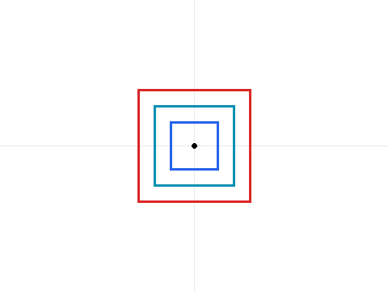

* **Độ khó & Phân tầng:** P1 (Cơ bản & Hoàn thành)
* **Bối cảnh:** Thiết kế bia ngắm bắn mục tiêu gồm nhiều hình vuông lồng nhau từ nhỏ đến lớn.
* **Nhiệm vụ:** Lập trình vẽ N hình vuông lồng nhau, mỗi hình vuông có độ dài cạnh tăng dần 20 bước.
* **Kịch bản tương tác:** Nhập số lượng hình vuông N từ bàn phím.
* **Kết quả mong đợi:** N hình vuông đồng tâm nằm ngay ngắn giữa sân khấu.
* **Dữ liệu mẫu (Sample):**

### Kịch bản chạy trên sân khấu

- **Thao tác khởi động:** Nhập số lượng hình vuông N từ bàn phím.

- **Kết quả hình ảnh:** N hình vuông đồng tâm nằm ngay ngắn giữa sân khấu.

### Giải thích

Hình 1 cạnh 20, hình 2 cạnh 40, hình 3 cạnh 60.

---

### Khối lệnh Scratch gợi ý giải bài

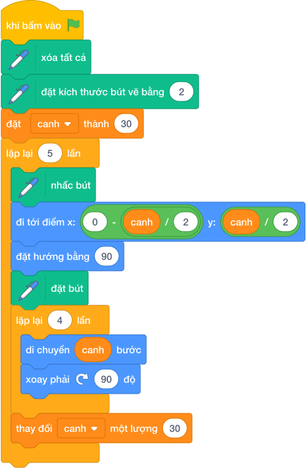

---
### Bài 7 (P1): Lá Cờ Xoay Vòng Quanh Tâm
* **Mã bài toán:** `sca_pen_p06_la_co_xoay_vong`

* **Hình ảnh mẫu minh họa:**


  

  

* **Độ khó & Phân tầng:** P1 (Cơ bản & Hoàn thành)
* **Bối cảnh:** Lễ hội thể thao cần một họa tiết gồm các lá cờ tam giác xoay tròn xung quanh cột cờ trung tâm.
* **Nhiệm vụ:** Tạo mảnh ghép lá cờ (My Blocks), sau đó dùng vòng lặp quay quanh tâm để vẽ N lá cờ.
* **Kịch bản tương tác:** Nhập số lượng lá cờ N từ bàn phím.
* **Kết quả mong đợi:** Họa tiết chong chóng lá cờ xoay đều 360 độ quanh tâm.
* **Dữ liệu mẫu (Sample):**

### Kịch bản chạy trên sân khấu

- **Thao tác khởi động:** Nhập số lượng lá cờ N từ bàn phím.

- **Kết quả hình ảnh:** Họa tiết chong chóng lá cờ xoay đều 360 độ quanh tâm.

### Giải thích

Nhập N = 8 -> Xoay mỗi bước 360 / 8 = 45 độ, vẽ 8 lá cờ.

---

### Khối lệnh Scratch gợi ý giải bài


---
### Bài 8 (P1): Ngôi Sao 5 Cánh Khép Kín
* **Mã bài toán:** `sca_pen_p07_ngoi_sao_5_canh`

* **Hình ảnh mẫu minh họa:**


  

  

* **Độ khó & Phân tầng:** P1 (Cơ bản & Hoàn thành)
* **Bối cảnh:** Vẽ lá cờ Tổ quốc Việt Nam với ngôi sao vàng 5 cánh rực rỡ ở chính giữa.
* **Nhiệm vụ:** Vẽ ngôi sao 5 cánh nét liền với góc quay đỉnh sao là 144 độ (hoặc 72 độ).
* **Kịch bản tương tác:** Khởi động khi nhấn biểu tượng Cờ Xanh (không cần nhập dữ liệu từ bàn phím).
* **Kết quả mong đợi:** Ngôi sao 5 cánh hoàn hảo khép kín.
* **Dữ liệu mẫu (Sample):**

### Kịch bản chạy trên sân khấu

- **Thao tác khởi động:** Nhấn cờ xanh.

- **Kết quả hình ảnh:** Ngôi sao 5 cánh hoàn hảo khép kín.

### Giải thích

Lặp 5 lần: [Đi 150 bước, Xoay phải 144 độ].

---

### Khối lệnh Scratch gợi ý giải bài

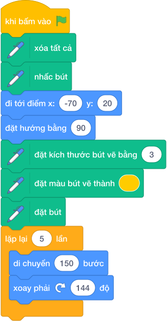

---
### Bài 9 (P1): Hoa Văn Tam Giác Xoay Chồng
* **Mã bài toán:** `sca_pen_p08_tam_giac_xoay_chong`

* **Hình ảnh mẫu minh họa:**


  

* **Độ khó & Phân tầng:** P1 (Cơ bản & Hoàn thành)
* **Bối cảnh:** Họa tiết gạch men cổ điển tạo bởi các hình tam giác đều xoay quanh một đỉnh chung.
* **Nhiệm vụ:** Lập trình vẽ N hình tam giác đều chung một đỉnh, mỗi lần vẽ xoay một góc 360 / N độ.
* **Kịch bản tương tác:** Nhập số hình tam giác N.
* **Kết quả mong đợi:** Bông hoa hình học đa giác xoay đều sắc sảo.
* **Dữ liệu mẫu (Sample):**

### Kịch bản chạy trên sân khấu

- **Thao tác khởi động:** Nhập số hình tam giác N.

- **Kết quả hình ảnh:** Bông hoa hình học đa giác xoay đều sắc sảo.

### Giải thích

N = 12 -> Xoay mỗi lần 30 độ, vẽ 12 tam giác.

---

### Khối lệnh Scratch gợi ý giải bài

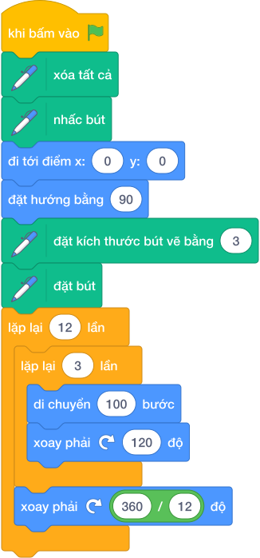

---
### Bài 10 (P1): Hoa Hình Thoi Xoay Vòng
* **Mã bài toán:** `sca_pen_p09_hoa_tiet_hinh_thoi`

* **Hình ảnh mẫu minh họa:**


  

  

* **Độ khó & Phân tầng:** P1 (Cơ bản & Hoàn thành)
* **Bối cảnh:** Cánh hoa hình thoi có góc nhọn 60 độ và góc tù 120 độ ghép lại thành bông hoa 6 cánh thanh lịch.
* **Nhiệm vụ:** Viết thủ tục vẽ hình thoi cạnh 80, góc 60 và 120; sau đó lặp lại để tạo bông hoa hoàn chỉnh.
* **Kịch bản tương tác:** Nhập số lượng cánh hoa.
* **Kết quả mong đợi:** Bông hoa hình thoi nở rộ giữa sân khấu.
* **Dữ liệu mẫu (Sample):**

### Kịch bản chạy trên sân khấu

- **Thao tác khởi động:** Nhập số lượng cánh hoa.

- **Kết quả hình ảnh:** Bông hoa hình thoi nở rộ giữa sân khấu.

### Giải thích

Cánh hình thoi: lặp 2 [đi 80, xoay 60, đi 80, xoay 120].

---

### Khối lệnh Scratch gợi ý giải bài

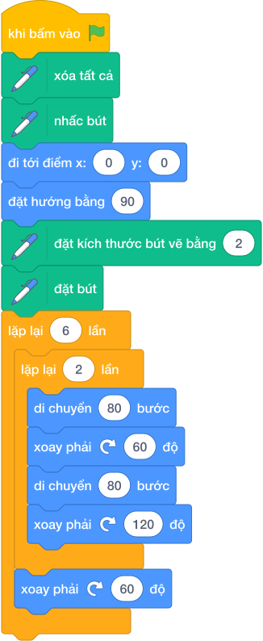

---
### Bài 11 (P2): Kim Tự Tháp Bậc Thang
* **Mã bài toán:** `sca_pen_p10_kim_tu_thap_bac_thang`

* **Hình ảnh mẫu minh họa:**


  

* **Độ khó & Phân tầng:** P2 (Luyện tập & Vận dụng)
* **Bối cảnh:** Kỳ quan Kim tự tháp Ai Cập cổ đại được xây dựng từ các tầng đá xếp chồng lên nhau hình bậc thang.
* **Nhiệm vụ:** Lập trình vẽ Kim tự tháp có N bậc thang, mỗi bậc có độ dài thu hẹp dần lên đỉnh.
* **Kịch bản tương tác:** Nhập số tầng N (ví dụ N = 5).
* **Kết quả mong đợi:** Hình vẽ Kim tự tháp bậc thang cân xứng.
* **Dữ liệu mẫu (Sample):**

### Kịch bản chạy trên sân khấu

- **Thao tác khởi động:** Nhập số tầng N (ví dụ N = 5).

- **Kết quả hình ảnh:** Hình vẽ Kim tự tháp bậc thang cân xứng.

### Giải thích

Tầng 1 rộng 150, tầng 2 rộng 120, tầng 3 rộng 90...

---

### Khối lệnh Scratch gợi ý giải bài


---
### Bài 12 (P2): Bàn Cờ Lưới Ô Vuông M x N
* **Mã bài toán:** `sca_pen_p11_luoi_o_vuong_ban_co`

* **Hình ảnh mẫu minh họa:**


  

  

* **Độ khó & Phân tầng:** P2 (Luyện tập & Vận dụng)
* **Bối cảnh:** Thiết kế bàn cờ caro hoặc mê cung lưới hình chữ nhật gồm nhiều ô vuông nhỏ liền kề.
* **Nhiệm vụ:** Sử dụng 2 vòng lặp lồng nhau điều khiển tọa độ để vẽ lưới gồm R hàng và C cột ô vuông.
* **Kịch bản tương tác:** Nhập số hàng R và số cột C.
* **Kết quả mong đợi:** Lưới ô vuông thẳng tắp, đều đặn.
* **Dữ liệu mẫu (Sample):**

### Kịch bản chạy trên sân khấu

- **Thao tác khởi động:** Nhập số hàng R và số cột C.

- **Kết quả hình ảnh:** Lưới ô vuông thẳng tắp, đều đặn.

### Giải thích

R = 4, C = 5 -> Vẽ lưới 4x5 ô vuông.

---

### Khối lệnh Scratch gợi ý giải bài

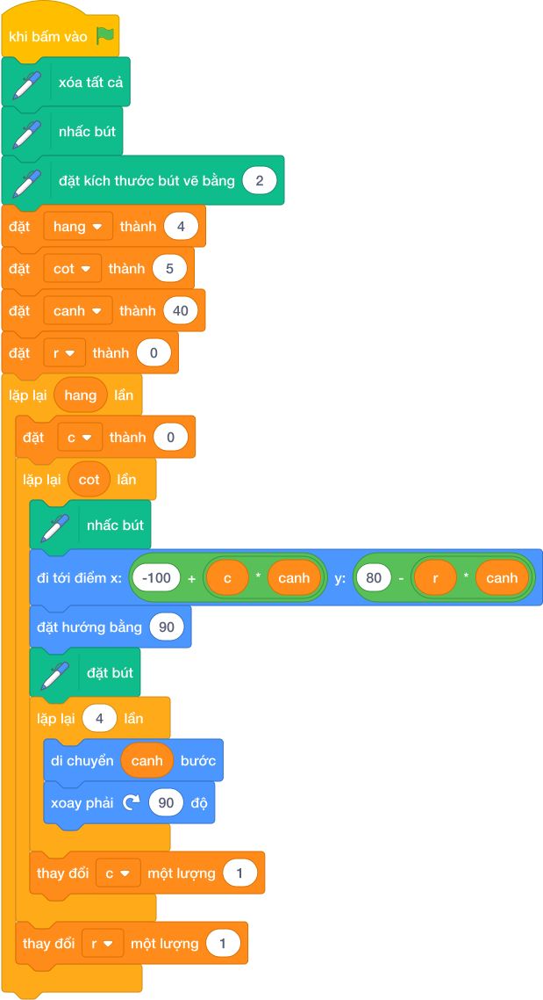

---
### Bài 13 (P2): Tam Giác Nhiều Tầng Xếp Chồng
* **Mã bài toán:** `sca_pen_p12_tam_giac_nhieu_tang`

* **Hình ảnh mẫu minh họa:**


  

* **Độ khó & Phân tầng:** P2 (Luyện tập & Vận dụng)
* **Bối cảnh:** Mô hình tháp tam giác gồm các viên gạch tam giác nhỏ xếp sít nhau thành hình tam giác lớn.
* **Nhiệm vụ:** Vẽ tháp tam giác có T tầng, tầng đáy có T hình tam giác.
* **Kịch bản tương tác:** Nhập số tầng T từ bàn phím.
* **Kết quả mong đợi:** Tháp tam giác hùng vĩ trên sân khấu.
* **Dữ liệu mẫu (Sample):**

### Kịch bản chạy trên sân khấu

- **Thao tác khởi động:** Nhập số tầng T từ bàn phím.

- **Kết quả hình ảnh:** Tháp tam giác hùng vĩ trên sân khấu.

### Giải thích

T = 3 tầng.

---

### Khối lệnh Scratch gợi ý giải bài

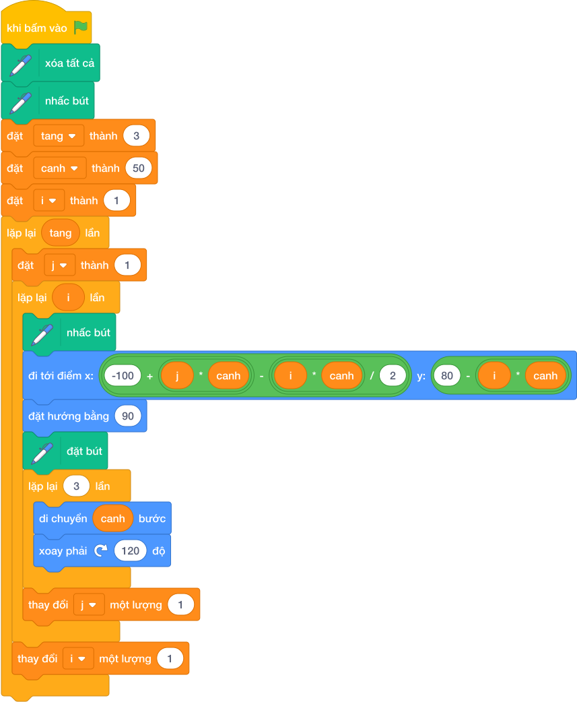

---
### Bài 14 (P2): Lục Giác Tổ Ong Đồng Tâm
* **Mã bài toán:** `sca_pen_p13_luc_giac_long_nhau`

* **Hình ảnh mẫu minh họa:**


  

* **Độ khó & Phân tầng:** P3 (Vận dụng cao & Sáng tạo)
* **Bối cảnh:** Cấu trúc tổ ong thiên nhiên gồm các hình lục giác đều lồng khít vào nhau cực kỳ vững chắc.
* **Nhiệm vụ:** Lập trình vẽ N hình lục giác đều lồng nhau từ cạnh lớn đến cạnh nhỏ.
* **Kịch bản tương tác:** Nhập kích thước cạnh ngoài cùng.
* **Kết quả mong đợi:** Mô hình tổ ong hình học tinh xảo.
* **Dữ liệu mẫu (Sample):**

### Kịch bản chạy trên sân khấu

- **Thao tác khởi động:** Nhập kích thước cạnh ngoài cùng.

- **Kết quả hình ảnh:** Mô hình tổ ong hình học tinh xảo.

### Giải thích

Cạnh lục giác giảm dần 15 bước sau mỗi tầng.

---

### Khối lệnh Scratch gợi ý giải bài

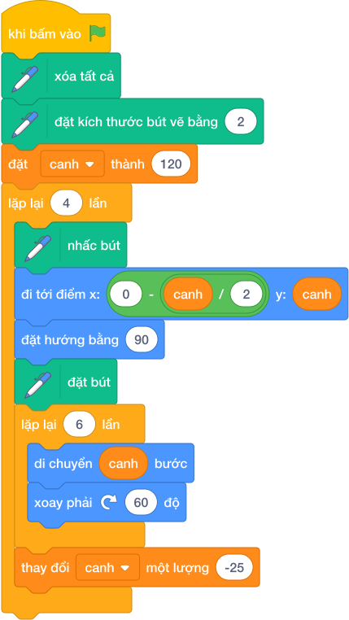

---
### Bài 15 (P2): Ngôi Sao 8 Cánh Nghệ Thuật
* **Mã bài toán:** `sca_pen_p14_ngoi_sao_8_canh_nghe_thuat`

* **Hình ảnh mẫu minh họa:**

  
  * **Độ khó & Phân tầng:** P3 (Vận dụng cao & Sáng tạo)
* **Bối cảnh:** Họa tiết hoa văn trống đồng và la bàn hàng hải với ngôi sao 8 cánh cân đối.
* **Nhiệm vụ:** Ghép 2 hình vuông xoay góc 45 độ hoặc ghép 8 hình tam giác nhọn quanh tâm.
* **Kịch bản tương tác:** Khởi động khi nhấn biểu tượng Cờ Xanh (không cần nhập dữ liệu từ bàn phím).
* **Kết quả mong đợi:** Biểu tượng la bàn ngôi sao 8 cánh.
* **Dữ liệu mẫu (Sample):**

### Kịch bản chạy trên sân khấu

- **Thao tác khởi động:** Nhấn cờ xanh.

- **Kết quả hình ảnh:** Biểu tượng la bàn ngôi sao 8 cánh.

### Giải thích

Vẽ hình vuông 1, xoay phải 45 độ, vẽ hình vuông 2.

---

### Khối lệnh Scratch gợi ý giải bài

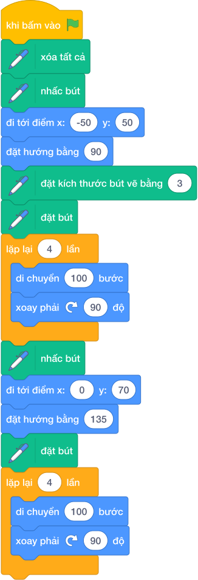

---
### Bài 16 (P3): Cây Thông Noel Đa Tầng
* **Mã bài toán:** `sca_pen_p15_cay_thong_noel`

* **Hình ảnh mẫu minh họa:**


  

  

* **Độ khó & Phân tầng:** P3 (Vận dụng cao & Sáng tạo)
* **Bối cảnh:** Mùa Giáng Sinh đến, Mèo Scratch muốn vẽ một cây thông Noel xanh mướt từ các tán lá tam giác.
* **Nhiệm vụ:** Vẽ 3 tán lá tam giác xếp chồng lên nhau và một gốc cây hình chữ nhật màu nâu.
* **Kịch bản tương tác:** Khởi động khi nhấn biểu tượng Cờ Xanh (không cần nhập dữ liệu từ bàn phím).
* **Kết quả mong đợi:** Cây thông Noel xinh xắn.
* **Dữ liệu mẫu (Sample):**

### Kịch bản chạy trên sân khấu

- **Thao tác khởi động:** Nhấn cờ xanh.

- **Kết quả hình ảnh:** Cây thông Noel xinh xắn.

### Giải thích

Tam giác nhỏ trên đỉnh, tam giác vừa ở giữa, tam giác lớn ở dưới cùng.

### Khối lệnh Scratch gợi ý giải bài

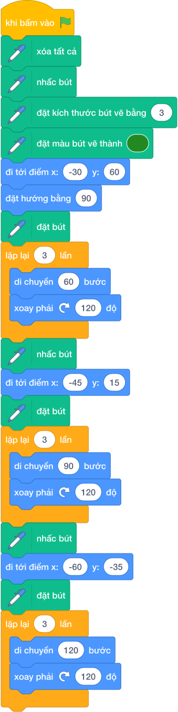

---
