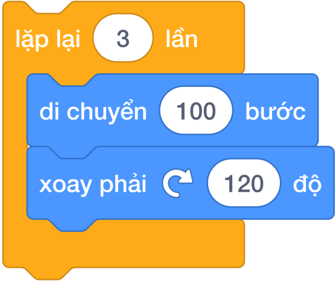
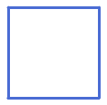
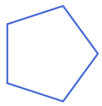
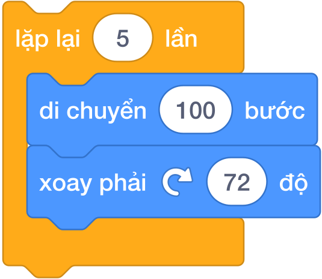
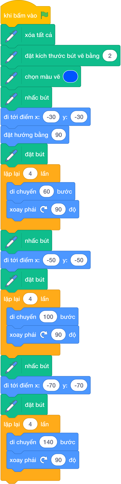
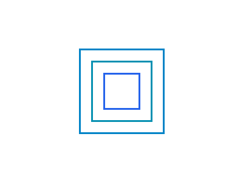
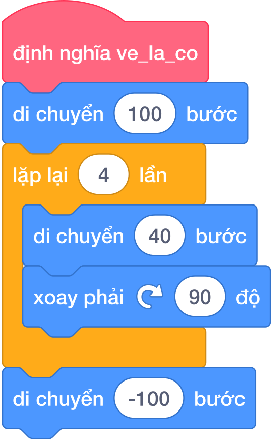
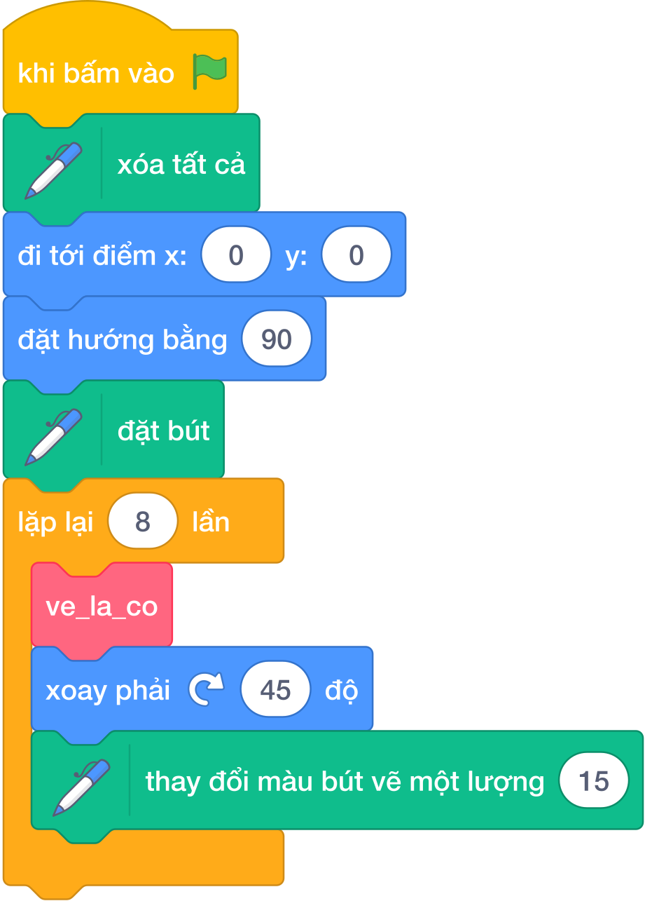

# Bài 01: VẼ HÌNH VỚI PEN VÀ REPEAT

## 1. Khám phá sân khấu và hệ tọa độ Oxy

Sân khấu Scratch là một mặt phẳng hình chữ nhật gồm các điểm ảnh (pixel), được quản lý chính xác thông qua hệ trục tọa độ hai chiều $Oxy$:

| Trục tọa độ | Hướng không gian | Điểm cực tiểu | Điểm trung tâm | Điểm cực đại | Tổng độ dài |
|:---:|:---:|:---:|:---:|:---:|:---:|
| **Trục $X$ (Ngang)** | Trái $\longleftrightarrow$ Phải | $x = -240$ (Mép trái) | $x = 0$ (Tâm) | $x = 240$ (Mép phải) | $480$ bước |
| **Trục $Y$ (Dọc)** | Dưới $\longleftrightarrow$ Trên | $y = -180$ (Mép dưới) | $y = 0$ (Tâm) | $y = 180$ (Mép trên) | $360$ bước |

> **Quy tắc vàng về tọa độ khởi tạo:**
> Mọi chương trình vẽ hình trên Scratch bắt buộc phải có câu lệnh đưa nhân vật về vị trí ban đầu rõ ràng:
> - 🔵 Lệnh di chuyển: **`đi tới điểm x: (0) y: (0)`** (đưa về gốc tọa độ tâm sân khấu)
> - 🔵 Lệnh hướng nhìn: **`đặt hướng bằng (90)`** (hướng nhìn sang phải)
> 
>   
> 

### Bốn hướng di chuyển trên la bàn Scratch
Nhân vật chú Mèo di chuyển theo hướng mũi tên kim la bàn. Góc quay được tính theo chiều kim đồng hồ:

- **Hướng $90^\circ$ (Mặc định)**: Mũi nhân vật nhìn sang phải.

- **Hướng $0^\circ$**: Mũi nhân vật nhìn thẳng lên đỉnh sân khấu.

- **Hướng $180^\circ$**: Mũi nhân vật nhìn thẳng xuống đáy sân khấu.

- **Hướng $-90^\circ$ (hoặc $270^\circ$)**: Mũi nhân vật nhìn sang trái.

---

## 2. Bộ công cụ bút vẽ Pen (Pen Extension)

Để bật công cụ vẽ trong Scratch 3.0, chúng ta bấm vào biểu tượng **Thêm phần mở rộng (Add Extension)** ở góc dưới cùng bên trái màn hình và chọn **Bút vẽ (Pen)**.

Nhóm Bút vẽ cung cấp các khối lệnh thao tác như một chiếc bút viết thật trên giấy:

| Khối lệnh trực quan Scratch 3.0 | Ý nghĩa thực tế | Lưu ý sư phạm khi lập trình |
|:---:|---|---|
|  | Tẩy sạch toàn bộ nét vẽ cũ | **Bắt buộc đặt ngay sau cờ xanh** để làm sạch màn hình trước khi vẽ hình mới. |
|  | Hạ đầu bút chạm xuống giấy | Sau khi đặt bút, mỗi bước nhân vật di chuyển sẽ để lại một vệt mực tương ứng. |
|  | Nhấc đầu bút lên khỏi giấy | Dùng khi muốn di chuyển nhân vật sang vị trí khác mà **không để lại vệt mực lem**. |
|  | Chọn màu mực cố định | Nhấp chuột vào ô màu để chọn màu sắc yêu thích trực tiếp trên bảng màu. |
|  | Thay đổi màu sắc liên tục | Tăng chỉ số màu để tạo hiệu ứng cầu vồng rực rỡ khi vẽ nhiều hình xoay quanh tâm. |
|  | Chỉnh độ đậm nhạt của nét vẽ | Mặc định là $1$ (rất mảnh). Khuyên dùng $2$ hoặc $3$ để nét vẽ rõ nét trên màn hình. |
|  | Tăng dần nét vẽ theo thời gian | Giúp tạo hiệu ứng nét vẽ đậm dần từ trong ra ngoài. |

### Cụm lệnh khởi động chuẩn (Chuẩn bị giấy và bút)
Trước khi vẽ bất kỳ hình nào, chúng ta luôn thiết lập cụm lệnh "chuẩn bị giấy bút" gồm 8 bước theo đúng chuẩn giao diện Tiếng Việt của Scratch 3.0:

*Quy trình 8 bước chuẩn:*

1. 🟡 **Khi bấm vào cờ xanh** (Sự kiện bắt đầu chương trình).

2. 🟢 **Xóa tất cả** (Lau sạch màn hình vẽ cũ).

3. 🟢 **Nhấc bút** (Tránh làm lem mực khi di chuyển về vị trí xuất phát).

4. 🔵 **Đi tới điểm x: (0) y: (0)** (Đưa nhân vật về tâm sân khấu).

5. 🔵 **Đặt hướng bằng (90)** (Đặt mũi nhìn sang phải).

6. 🟢 **Chọn màu vẽ [Xanh dương]** (Chọn màu mực yêu thích).

7. 🟢 **Đặt kích thước bút vẽ bằng (3)** (Chỉnh nét bút rõ nét).

8. 🟢 **Đặt bút** (Hạ đầu bút chạm mặt giấy sẵn sàng vẽ).

---

## 3. Vòng lặp và quy tắc vẽ đa giác đều

### Vấn đề: Vẽ thủ công từng nét lặp lại
Để vẽ một hình vuông cạnh $100$ bước:

- Chú Mèo đi $100$ bước $\to$ Xoay phải $90^\circ$.

- Lại đi $100$ bước $\to$ Xoay phải $90^\circ$.

- Lại đi $100$ bước $\to$ Xoay phải $90^\circ$.

- Lại đi $100$ bước $\to$ Xoay phải $90^\circ$.

Nếu viết thủ công, chúng ta phải ghép tới $8$ khối lệnh liên tiếp! Nếu vẽ hình $20$ cạnh hay $100$ cạnh thì kịch bản sẽ quá dài.

### Giải pháp: Khối lệnh `lặp lại () lần`
Khối lệnh **`lặp lại () lần`** (trong nhóm Điều khiển màu cam) cho phép lặp lại một cụm câu lệnh bên trong một số lần định trước:

### Công thức tính góc quay
Khi nhân vật vẽ một hình đa giác khép kín và quay trở lại hướng xuất phát ban đầu, tổng số góc mà nhân vật đã xoay tròn trọn vẹn đúng $1$ vòng là $360^\circ$.

Do đó, với bất kỳ đa giác đều gồm $N$ cạnh nào, góc quay ngoài tại mỗi đỉnh luôn là:
$$\text{Góc xoay} = \frac{360^\circ}{N}$$

### Bảng tra cứu các đa giác đều chuẩn với khối lệnh Scratch trực quan

| Tên đa giác | Hình minh họa mẫu | Số cạnh ($N$) | Góc xoay ngoài ($360^\circ / N$) | Khối lệnh Scratch 3.0 trực quan |
|---|:---:|:---:|:---:|:---:|
| **Tam giác đều** |  | $3$ | $\dfrac{360^\circ}{3} = 120^\circ$ |  |
| **Hình vuông** |  | $4$ | $\dfrac{360^\circ}{4} = 90^\circ$ |  |
| **Ngũ giác đều** |  | $5$ | $\dfrac{360^\circ}{5} = 72^\circ$ |  |
| **Lục giác đều** |  | $6$ | $\dfrac{360^\circ}{6} = 60^\circ$ |  |

> **Bẫy lỗi kinh điển về góc quay:**
> Rất nhiều học sinh nhầm lẫn giữa **góc trong của hình học** và **góc xoay ngoài của nhân vật**.
> - *Ví dụ:* Góc trong của tam giác đều là $60^\circ$. Nếu cho nhân vật xoay $60^\circ$, chú Mèo sẽ vẽ ra hình lục giác ($360 / 60 = 6$) chứ không phải tam giác! Muốn vẽ tam giác đều, góc xoay bắt buộc phải là $360 / 3 = 120^\circ$.

---

## 4. Kỹ thuật đổi điểm vẽ và hình vuông đồng tâm

Khi cần vẽ nhiều hình tách rời nhau hoặc vẽ các hình lồng nhau (như hình vuông đồng tâm):

1. Vẽ xong hình thứ nhất.

2. **Nhấc bút (`nhấc bút`) ngay lập tức**.

3. Di chuyển nhân vật đến vị trí mới (dùng `đi tới điểm x: () y: ()` hoặc `di chuyển () bước`).

4. **Đặt bút xuống (`đặt bút`)**.

5. Bắt đầu vẽ hình tiếp theo.

### Ví dụ: Vẽ 3 hình vuông đồng tâm bằng phương pháp tuần tự
Khi chưa học khối lệnh tự tạo, ta thực hiện vẽ tuần tự từng hình một bằng các khối lệnh cơ bản:

- Hình vuông 1: Cạnh 60 bước, bắt đầu từ $(-30, -30)$, vẽ lặp 4 lần (di chuyển 60, xoay phải 90).

- Nhấc bút $\to$ Di chuyển đến $(-50, -50)$ $\to$ Đặt bút.

- Hình vuông 2: Cạnh 100 bước, vẽ lặp 4 lần (di chuyển 100, xoay phải 90).

- Nhấc bút $\to$ Di chuyển đến $(-70, -70)$ $\to$ Đặt bút.

- Hình vuông 3: Cạnh 140 bước, vẽ lặp 4 lần (di chuyển 140, xoay phải 90).

| Khối lệnh Scratch tuần tự vẽ 3 hình vuông đồng tâm | Kết quả trên sân khấu |
|:---:|:---:|
|  |  |
| *Quy trình tuần tự: vẽ hình - nhấc bút - đổi tọa độ - hạ bút* | *3 hình vuông lồng nhau đối xứng qua gốc (0, 0)* |

> **Nhận xét quan trọng:**
> Để ý rằng cụm 4 lệnh `lặp lại (4) lần [di chuyển... xoay phải 90]` bị lặp đi lặp lại tới 3 lần khiến chương trình rất dài dòng.  
> Để khắc phục điều này và làm cho mã nguồn ngắn gọn, chuyên nghiệp hơn, chúng ta sẽ làm quen với **Khối của tôi (My Blocks)** ở phần tiếp theo ngay dưới đây!

---

## 5. Khối lệnh tự tạo (Khối của tôi) và kỹ thuật tạo mảnh ghép

### 5.1. Khái niệm Khối của tôi (My Blocks / Thủ tục)
Khi một hình vẽ xuất hiện nhiều lần trong bài (ví dụ vẽ một bông hoa gồm 12 chiếc lá cờ), nếu viết lặp đi lặp lại cụm lệnh vẽ lá cờ thì chương trình sẽ rất dài dòng và khó sửa lỗi.

Scratch cung cấp tính năng **Khối của tôi (My Blocks)** màu hồng đậm:

- Giúp đóng gói một đoạn lệnh thành một "chiếc khuôn" mang tên riêng.

- Khi cần dùng, chỉ việc gọi tên chiếc khuôn đó ra.

| Định nghĩa Khối của tôi | Lệnh gọi Khối của tôi |
|:---:|:---:|
|  |  |
| *Tạo chiếc khuôn thủ tục mang tên riêng* | *Gọi chiếc khuôn ra sử dụng mọi lúc* |

### 5.2. Ứng dụng thực tế: Mảnh ghép lá cờ và nghệ thuật hoa văn xoay quanh tâm

Trong tài liệu học tập, kỹ thuật tạo mảnh ghép lá cờ rồi xoay quanh tâm là một trong những bài học nền tảng:

- **Cấu tạo một lá cờ đơn lẻ:**
  - Cán cờ: Đi thẳng $100$ bước (`di chuyển (100) bước`).
  - Lá cờ hình vuông: Lặp lại $4$ lần cụm lệnh cạnh $40$ bước, xoay phải $90^\circ$ (`lặp lại (4) lần: di chuyển (40) bước, xoay phải 90 độ`).
  - Lùi về tâm: Lùi ngược lại đúng $100$ bước (`di chuyển (-100) bước`) để bảo toàn vị trí đứng của nhân vật tại tâm sân khấu.

| Mảnh ghép đơn lẻ | Kết quả xoay quanh tâm nhiều lần |
|:---:|:---:|
|  |  |
| *Hình 1: Một lá cờ đơn lẻ (cán 100, cờ vuông 40x40)* | *Hình 2: Hoa văn 8 lá cờ xoay quanh tâm (mỗi bước xoay 45 độ)* |

**Khối lệnh Scratch chi tiết:**

| Định nghĩa thủ tục Lá_Cờ | Chương trình chính vẽ hoa văn 8 lá cờ |
|:---:|:---:|
|  |  |
| *Tạo thủ tục: Đi tới 100 vẽ cờ vuông rồi lùi về tâm* | *Lặp 8 lần: Gọi Lá_Cờ, xoay 45 độ và đổi màu bút* |

---

## 6. Bảng mô phỏng từng bước vẽ hình vuông (Dry run)

Mô phỏng hành trình vẽ hình vuông cạnh $100$ bước xuất phát tại $(0, 0)$, hướng $90^\circ$:

| Bước | Lệnh thực hiện | Tọa độ $(x, y)$ sau lệnh | Hướng nhìn | Vệt mực để lại trên sân khấu |
|:---:|---|:---:|:---:|---|
| **0** | `đi tới x: 0 y: 0`, `đặt hướng 90`, `đặt bút` | $(0, 0)$ | $90^\circ$ (Phải) | Chưa có (mới đặt bút tại gốc) |
| **1** | `di chuyển 100 bước` | $(100, 0)$ | $90^\circ$ | Nét ngang dưới từ $(0, 0) \to (100, 0)$ |
| **2** | `xoay phải ↻ 90 độ` | $(100, 0)$ | $180^\circ$ (Xuống) | Đổi hướng nhìn xuống đáy sân khấu |
| **3** | `di chuyển 100 bước` | $(100, -100)$ | $180^\circ$ | Nét dọc phải từ $(100, 0) \to (100, -100)$ |
| **4** | `xoay phải ↻ 90 độ` | $(100, -100)$ | $-90^\circ$ (Trái) | Đổi hướng nhìn sang trái |
| **5** | `di chuyển 100 bước` | $(0, -100)$ | $-90^\circ$ | Nét ngang trên từ $(100, -100) \to (0, -100)$ |
| **6** | `xoay phải ↻ 90 độ` | $(0, -100)$ | $0^\circ$ (Lên) | Đổi hướng nhìn lên trên |
| **7** | `di chuyển 100 bước` | $(0, 0)$ | $0^\circ$ | Nét dọc trái từ $(0, -100) \to (0, 0)$ |
| **8** | `xoay phải ↻ 90 độ` | $(0, 0)$ | $90^\circ$ (Phải) | Trở về đúng hướng ban đầu, khép kín hình |

---

## 7. Các bẫy lỗi thường gặp (Bug Traps)

> **Bẫy 1: Quên nhấc bút khi di chuyển nhân vật sang vị trí mới**
> - *Hiện tượng:* Trên màn hình xuất hiện một vệt mực chéo nối từ hình này sang hình kia.
> - *Khắc phục:* Luôn ghi nhớ quy tắc: Trước khi đổi tọa độ, phải `nhấc bút`. Đến nơi mới thì `đặt bút`.

> **Bẫy 2: Nhầm lẫn góc quay trong và góc quay ngoài**
> - *Hậu quả:* Hình vẽ bị méo mó hoặc vẽ ra số cạnh sai hoàn toàn.
> - *Khắc phục:* Luôn lấy $360$ chia cho số cạnh ($360 / N$).

> **Bẫy 3: Quên lệnh xóa tất cả ở đầu chương trình**
> - *Hiện tượng:* Bấm cờ xanh chạy lại nhưng hình cũ vẫn còn nguyên, hình mới đè lên lem nhem.
> - *Khắc phục:* Luôn đặt `xóa tất cả` ngay dưới cờ xanh.

---

## 8. Bộ câu hỏi trắc nghiệm củng cố (Concept Quizzes)

#### Câu 1
Tọa độ chính giữa tâm sân khấu Scratch là:

- A. $(x: 240, y: 180)$

- B. $(x: -240, y: -180)$

- C. $(x: 0, y: 0)$ *(Đáp án đúng)*

- D. $(x: 100, y: 100)$

#### Câu 2
Để nhân vật nhìn thẳng lên phía trên màn hình, ta dùng khối lệnh:

- A. `đặt hướng bằng (90)`

- B. `đặt hướng bằng (0)` *(Đáp án đúng)*

- C. `đặt hướng bằng (180)`

- D. `đặt hướng bằng (-90)`

#### Câu 3
Muốn vẽ một hình lục giác đều (6 cạnh), góc xoay tại mỗi đỉnh là:

- A. $60^\circ$ *(Đáp án đúng: $360 / 6 = 60$)*

- B. $90^\circ$

- C. $120^\circ$

- D. $72^\circ$

#### Câu 4
Nếu muốn nhân vật di chuyển từ điểm $A$ sang điểm $B$ mà không để lại nét mực, ta cần thực hiện lệnh nào trước khi đi?

- A. `đặt bút`

- B. `nhấc bút` *(Đáp án đúng)*

- C. `xóa tất cả`

- D. `chọn màu vẽ`

#### Câu 5
Khối lệnh sau đây vẽ ra hình gì?

- A. Hình tam giác đều

- B. Hình vuông

- C. Ngũ giác đều *(Đáp án đúng: 5 cạnh, góc quay 360 / 5 = 72 độ)*

- D. Lục giác đều

#### Câu 6
Khối lệnh tự tạo (Khối của tôi) có tác dụng gì quan trọng nhất?

- A. Giúp nhân vật chạy nhanh hơn

- B. Đóng gói đoạn lệnh để tái sử dụng nhiều lần, giúp chương trình gọn gàng *(Đáp án đúng)*

- C. Đổi màu sân khấu tự động

- D. Tự động vẽ hình mà không cần bút vẽ

#### Câu 7
Khi muốn vẽ hoa văn gồm 10 hình tam giác đều xoay quanh tâm, sau mỗi lần vẽ xong 1 hình tam giác và lùi về tâm, nhân vật cần xoay một góc bằng bao nhiêu độ?

- A. $120^\circ$

- B. $60^\circ$

- C. $36^\circ$ *(Đáp án đúng: $360 / 10 = 36$ độ)*

- D. $90^\circ$

#### Câu 8
Muốn tăng độ dày nét vẽ cho rõ nét hơn, ta dùng khối lệnh nào?

- A. `đặt kích thước bút vẽ bằng (3)` *(Đáp án đúng)*

- B. `chọn màu vẽ`

- C. `di chuyển (3) bước`

- D. `thay đổi x một lượng (3)`

#### Câu 9
Khối lệnh `xóa tất cả` nằm trong nhóm lệnh nào?

- A. Chuyển động

- B. Hiển thị

- C. Bút vẽ (Pen) *(Đáp án đúng)*

- D. Sự kiện

#### Câu 10
Để tạo hiệu ứng nét vẽ đổi màu liên tục khi vẽ hoa văn, ta nên đặt khối lệnh nào vào trong vòng lặp?

- A. `thay đổi màu bút vẽ một lượng (10)` *(Đáp án đúng)*

- B. `đặt bút`

- C. `nhấc bút`

- D. `đặt hướng bằng (90)`
