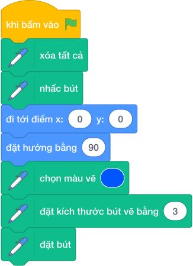
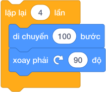
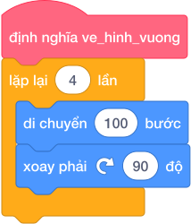
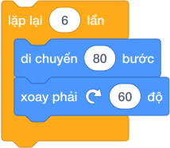

# BÀI 01: VẼ HÌNH VỚI PEN VÀ REPEAT

**Khóa học:** iKHEDU Scratch — Bảng A (Level 1)  
**Chương 1:** Bút vẽ Pen & Đồ họa (Native Scratch Foundation)  
**Mã bài học:** `SCA-L01` | **Thời lượng khuyến nghị:** 90 phút  
**Tài liệu tham chiếu:** [`docs/LO_TRINH_SCRATCH.md`](file:///Users/vu/Developer/ikhEdu_lessons/docs/LO_TRINH_SCRATCH.md)  

---

## 1. Mục Tiêu Bài Học & Chuẩn Đầu Ra (Learning Objectives)

Sau khi hoàn thành bài học này, học sinh sẽ đạt được:
* **`LO-01 (Stage Coordinates)`**: Hiểu và làm chủ hệ tọa độ sân khấu Scratch: Tọa độ gốc tâm sân khấu $(0, 0)$, phạm vi trục ngang $X$ từ $-240$ đến $240$, phạm vi trục dọc $Y$ từ $-180$ đến $180$.
* **`LO-02 (Compass Directions)`**: Ghi nhớ và điều khiển chính xác 4 hướng di chuyển cơ bản của nhân vật: $0^\circ$ (Lên trên / Hướng Bắc), $90^\circ$ (Sang phải / Hướng Đông - mặc định), $180^\circ$ (Xuống dưới / Hướng Nam), và $-90^\circ$ hoặc $270^\circ$ (Sang trái / Hướng Tây).
* **`LO-03 (Pen Operations)`**: Sử dụng thành thạo nhóm lệnh mở rộng Bút vẽ (Pen): Đặt bút (`pen down`), Nhấc bút (`pen up`), Xóa tất cả (`erase all`), Thiết lập màu sắc và độ dày nét vẽ (`set pen size`).
* **`LO-04 (Polygon Rotation Formula)`**: Nắm vững nguyên lý góc quay ngoài của đa giác đều: $\text{Góc xoay} = \dfrac{360^\circ}{\text{Số cạnh}}$. Ứng dụng vòng lặp `repeat` để vẽ tam giác đều, hình vuông, ngũ giác đều, lục giác đều chỉ với $1$ dòng lệnh lặp.
* **`LO-05 (Drawing Management & Bug Avoidance)`**: Tránh triệt để 2 bẫy lỗi kinh điển của người mới học vẽ Scratch: Quên xóa nét vẽ cũ (`erase all`) khi bắt đầu và quên nhấc bút (`pen up`) trước khi di chuyển nhân vật đến vị trí mới.

---

## 2. Khám Phá Sân Khấu & Hệ Tọa Độ Oxy

Sân khấu Scratch là một mặt phẳng hình chữ nhật được chia thành các điểm ảnh thông qua hệ trục tọa độ hai chiều $Oxy$:

| Trục tọa độ | Hướng không gian | Điểm cực tiểu | Điểm trung tâm | Điểm cực đại | Tổng độ dài |
|:---:|:---:|:---:|:---:|:---:|:---:|
| **Trục $X$ (Ngang)** | Trái $\longleftrightarrow$ Phải | $x = -240$ (Mép trái) | $x = 0$ (Tâm) | $x = 240$ (Mép phải) | $480$ bước |
| **Trục $Y$ (Dọc)** | Dưới $\longleftrightarrow$ Trên | $y = -180$ (Mép dưới) | $y = 0$ (Tâm) | $y = 180$ (Mép trên) | $360$ bước |

> **Quy tắc vàng về Tọa độ khởi tạo:**
> Mọi chương trình vẽ hình trên Scratch bắt buộc phải có câu lệnh đưa nhân vật về vị trí ban đầu rõ ràng:
> - 🔵 Lệnh di chuyển: **`đi tới điểm x: (0) y: (0)`** (đưa về gốc tọa độ tâm sân khấu)
> - 🔵 Lệnh hướng nhìn: **`đặt hướng bằng (90)`** (hướng nhìn sang phải)
> 
>   
> 

### Bốn Hướng Di Chuyển Trên La Bàn Scratch
Nhân vật chú Mèo di chuyển theo hướng mũi tên kim la bàn. Góc quay được tính theo chiều kim đồng hồ:
- **Hướng $90^\circ$ (Mặc định)**: Mũi nhân vật nhìn sang phải.
- **Hướng $0^\circ$**: Mũi nhân vật nhìn thẳng lên đỉnh sân khấu.
- **Hướng $180^\circ$**: Mũi nhân vật nhìn thẳng xuống đáy sân khấu.
- **Hướng $-90^\circ$ (hoặc $270^\circ$)**: Mũi nhân vật nhìn sang trái.

---

## 3. Bộ Công Cụ Bút Vẽ Pen (Pen Extension)

Để bật công cụ vẽ trong Scratch 3.0, học sinh bấm vào biểu tượng **Thêm phần mở rộng (Add Extension)** ở góc dưới cùng bên trái màn hình và chọn **Bút vẽ (Pen)**.

Nhóm Bút vẽ cung cấp các khối lệnh thao tác như một chiếc bút viết thật:

| Khối lệnh Tiếng Việt (.vi) | Ý nghĩa thực tế | Lưu ý sư phạm |
|---|---|---|
| 🟢 `xóa tất cả` | Tẩy sạch toàn bộ màn hình | **Bắt buộc đặt ngay sau cờ xanh** để xóa hình vẽ của lần chạy trước. |
| 🟢 `đặt bút` | Đặt đầu bút chạm xuống giấy | Sau khi đặt bút, mỗi bước nhân vật di chuyển sẽ để lại một vệt mực. |
| 🟢 `nhấc bút` | Nhấc đầu bút lên khỏi giấy | Dùng khi muốn chú Mèo đi sang chỗ khác mà **không để lại vết mực bẩn**. |
| 🟢 `chọn màu vẽ [ ]` | Chọn màu mực vẽ | Có thể chấm chọn màu sắc yêu thích trực tiếp trên bảng màu. |
| 🟢 `đặt kích thước bút vẽ bằng (3)` | Chỉnh độ đậm của nét bút | Mặc định là $1$ (rất mảnh). Khuyên dùng $2$ hoặc $3$ để nét vẽ rõ đẹp. |

### Cụm Lệnh Khởi Động Chuẩn (Chuẩn bị Giấy & Bút)
Trước khi vẽ bất kỳ hình gì, luôn tạo cụm lệnh "chuẩn bị giấy bút" gồm 8 bước ghép theo đúng giao diện Tiếng Việt của Scratch 3.0:

*Quy trình 8 bước chuẩn:*
1. 🟡 **Khi bấm vào cờ xanh** (Sự kiện bắt đầu chương trình).
2. 🟢 **Xóa tất cả** (Lau sạch màn hình vẽ cũ).
3. 🟢 **Nhấc bút** (Tránh làm lem mực khi di chuyển).
4. 🔵 **Đi tới điểm x: (0) y: (0)** (Đưa nhân vật về tâm sân khấu).
5. 🔵 **Đặt hướng bằng (90)** (Đặt mũi nhìn sang phải).
6. 🟢 **Chọn màu vẽ [Xanh dương]** (Chọn màu mực yêu thích).
7. 🟢 **Đặt kích thước bút vẽ bằng (3)** (Chỉnh nét bút rõ nét).
8. 🟢 **Đặt bút** (Hạ đầu bút chạm mặt giấy sẵn sàng vẽ).

---

## 4. Vòng Lặp Lặp Lại & Quy Tắc Vàng Vẽ Đa Giác Đều

### Vấn đề: Vẽ tay từng nét lặp lại
Để vẽ một hình vuông cạnh $100$ bước:
- Chú Mèo đi $100$ bước $\to$ Xoay phải $90^\circ$.
- Lại đi $100$ bước $\to$ Xoay phải $90^\circ$.
- Lại đi $100$ bước $\to$ Xoay phải $90^\circ$.
- Lại đi $100$ bước $\to$ Xoay phải $90^\circ$.

Nếu viết tay, ta phải ghép tới $8$ khối lệnh liên tiếp! Nhưng nếu vẽ hình $20$ cạnh hay $100$ cạnh thì sao?

### Giải pháp: Khối lệnh `lặp lại () lần`
Khối lệnh **`lặp lại () lần`** (trong nhóm Điều khiển màu cam) cho phép lặp lại một cụm câu lệnh bên trong một số lần định trước:

### Công Thức Góc Quay Thần Thánh
Khi nhân vật vẽ một hình đa giác khép kín và quay trở lại hướng xuất phát, tổng số góc mà nhân vật đã xoay tròn trọn vẹn đúng $1$ vòng tròn là $360^\circ$.

Do đó, với bất kỳ đa giác đều gồm $N$ cạnh nào, góc quay ngoài tại mỗi đỉnh luôn luôn là:
$$\text{Góc xoay} = \frac{360^\circ}{N}$$

### Bảng Tra Cứu Đa Giác Đều Chuẩn
| Tên đa giác | Số cạnh ($N$) | Số lần lặp | Góc xoay phải | Khối lệnh Scratch Tiếng Việt |
|---|:---:|:---:|:---:|---|
| **Tam giác đều** | $3$ | `lặp lại (3) lần` | $\dfrac{360^\circ}{3} = 120^\circ$ | 🟠 `lặp lại (3) lần` &nbsp;&nbsp;🔵 `di chuyển (100) bước` &nbsp;&nbsp;🔵 `xoay phải ↻ (120) độ` |
| **Hình vuông** | $4$ | `lặp lại (4) lần` | $\dfrac{360^\circ}{4} = 90^\circ$ | 🟠 `lặp lại (4) lần` &nbsp;&nbsp;🔵 `di chuyển (100) bước` &nbsp;&nbsp;🔵 `xoay phải ↻ (90) độ` |
| **Ngũ giác đều** | $5$ | `lặp lại (5) lần` | $\dfrac{360^\circ}{5} = 72^\circ$ | 🟠 `lặp lại (5) lần` &nbsp;&nbsp;🔵 `di chuyển (100) bước` &nbsp;&nbsp;🔵 `xoay phải ↻ (72) độ` |
| **Lục giác đều** | $6$ | `lặp lại (6) lần` | $\dfrac{360^\circ}{6} = 60^\circ$ | 🟠 `lặp lại (6) lần` &nbsp;&nbsp;🔵 `di chuyển (80) bước` &nbsp;&nbsp;🔵 `xoay phải ↻ (60) độ` |
| **Bát giác đều** | $8$ | `lặp lại (8) lần` | $\dfrac{360^\circ}{8} = 45^\circ$ | 🟠 `lặp lại (8) lần` &nbsp;&nbsp;🔵 `di chuyển (60) bước` &nbsp;&nbsp;🔵 `xoay phải ↻ (45) độ` |

> **Bẫy lỗi kinh điển về Góc quay:**
> Rất nhiều học sinh nhầm lẫn giữa **góc trong của hình** và **góc xoay ngoài của nhân vật**.
> Ví dụ: Góc trong của tam giác đều là $60^\circ$. Nếu cho nhân vật xoay $60^\circ$, chú Mèo sẽ vẽ ra hình lục giác ($360 / 60 = 6$) chứ không phải tam giác! Muốn vẽ tam giác đều, góc xoay bắt buộc phải là $360 / 3 = 120^\circ$.

---

## 5. Kỹ Thuật Đổi Điểm Vẽ & Hình Vuông Đồng Tâm

Khi cần vẽ nhiều hình tách rời nhau hoặc vẽ các hình lồng nhau (như hình vuông đồng tâm):
1. Vẽ xong hình thứ nhất.
2. **Nhấc bút (`nhấc bút`) ngay lập tức**.
3. Di chuyển nhân vật đến vị trí mới (dùng `đi tới điểm x: () y: ()` hoặc `di chuyển () bước`).
4. **Đặt bút xuống (`đặt bút`)**.
5. Bắt đầu vẽ hình tiếp theo.

### Ví Dụ: Vẽ 3 Hình Vuông Đồng Tâm
Để các hình vuông đồng tâm có chung tâm tại gốc $(0, 0)$:
- Hình 1 (cạnh $60$): Bắt đầu từ $x: -30, y: 30$.
- Hình 2 (cạnh $100$): Bắt đầu từ $x: -50, y: 50$.
- Hình 3 (cạnh $140$): Bắt đầu từ $x: -70, y: 70$.

Mỗi lần chuyển hình, nhân vật **nhấc bút $\to$ chuyển tọa độ $\to$ đặt bút**, tạo ra bức tranh $3$ hình vuông lồng nhau hoàn hảo mà không bị dính nét mực nối.

---

## 6. Khối Lệnh Tự Tạo (Khối Của Tôi - My Blocks) Cơ Bản

Khi một đoạn lệnh vẽ hình (ví dụ vẽ hình vuông) phải dùng đi dùng lại nhiều lần, ta gom các khối lệnh đó thành một khối riêng có tên gọi là **Khối của tôi (My Blocks)**:

Sau khi định nghĩa, bất cứ khi nào cần vẽ hình vuông, ta chỉ cần gọi một khối lệnh duy nhất:

Điều này giúp kịch bản lập trình gọn gàng, trong sáng và không bị rối mắt.

---

## 7. Bảng Mô Phỏng Từng Bước (Dry Run Table)

Dưới đây là bảng trace vết di chuyển của nhân vật khi thực hiện kịch bản vẽ hình vuông cạnh $100$ bước, bắt đầu từ $(0, 0)$ hướng $90^\circ$:

| Vòng lặp | Lệnh thực thi | Tọa độ sau lệnh ($x, y$) | Hướng sau lệnh | Trạng thái nét vẽ |
|:---:|---|:---:|:---:|---|
| **Khởi động** | `đi tới điểm x: (0) y: (0)`, `đặt hướng bằng (90)`, `đặt bút` | $(0, 0)$ | $90^\circ$ (Phải) | Đã hạ bút chạm giấy tại $(0, 0)$ |
| **Lần 1** | `di chuyển (100) bước` | $(100, 0)$ | $90^\circ$ (Phải) | Vẽ cạnh đáy nằm ngang dài $100$ |
| | `xoay phải ↻ (90) độ` | $(100, 0)$ | $180^\circ$ (Xuống) | Đổi hướng nhìn cắm thẳng xuống dưới |
| **Lần 2** | `di chuyển (100) bước` | $(100, -100)$ | $180^\circ$ (Xuống) | Vẽ cạnh thẳng đứng bên phải dài $100$ |
| | `xoay phải ↻ (90) độ` | $(100, -100)$ | $-90^\circ$ (Trái) | Đổi hướng nhìn sang trái |
| **Lần 3** | `di chuyển (100) bước` | $(0, -100)$ | $-90^\circ$ (Trái) | Vẽ cạnh đáy dưới nằm ngang dài $100$ |
| | `xoay phải ↻ (90) độ` | $(0, -100)$ | $0^\circ$ (Lên) | Đổi hướng nhìn thẳng lên trên |
| **Lần 4** | `di chuyển (100) bước` | $(0, 0)$ | $0^\circ$ (Lên) | Vẽ cạnh bên trái khép kín về $(0, 0)$ |
| | `xoay phải ↻ (90) độ` | $(0, 0)$ | $90^\circ$ (Phải) | Trở lại đúng hướng xuất phát ban đầu |

---

## 8. Tử Huyệt & Các Bẫy Lỗi Kinh Điển (Bug Traps)

> **Bẫy 1: Quên câu lệnh `xóa tất cả` lúc bấm cờ xanh**
> - *Hiện tượng:* Khi bấm Cờ Xanh lần thứ hai, hình vẽ mới đè lên hình vẽ cũ làm màn hình rối tung.
> - *Khắc phục:* Luôn luôn đặt khối `xóa tất cả` ngay dưới khối `khi bấm vào cờ xanh`.

> **Bẫy 2: Quên nhấc bút (`nhấc bút`) trước khi đổi chỗ**
> - *Hiện tượng:* Khi nhân vật di chuyển sang vị trí mới để vẽ hình tiếp theo, một nét mực gạch chéo xấu xí xuất hiện trên sân khấu.
> - *Khắc phục:* Nhớ câu thần chú: **"Muốn đi đâu, nhấc bút lên (`nhấc bút`) rồi mới đi; tới nơi rồi mới đặt bút xuống (`đặt bút`)"**.

> **Bẫy 3: Nhân vật bị kẹt ở mép sân khấu**
> - *Hiện tượng:* Nếu cho số bước quá lớn (ví dụ $500$ bước), nhân vật chạm mép sân khấu sẽ bị khựng lại và góc quay bị méo mó.
> - *Khắc phục:* Kích thước các hình đa giác nên chọn chiều dài cạnh từ $50$ đến $120$ bước để vừa vặn trong màn hình $480 \times 360$.

---

## 9. Concept Quiz (10 Câu Trắc Nghiệm Kiểm Tra Nhận Thức)

#### Câu 1 (Nhận biết tọa độ)
Tâm chính giữa của sân khấu Scratch có tọa độ là bao nhiêu?
- A. $x = 100, y = 100$
- B. $x = 0, y = 0$
- C. $x = 240, y = 180$
- D. $x = -240, y = -180$
> **Đáp án:** B  
> **Giải thích:** Gốc tọa độ $(0, 0)$ là điểm chính giữa của sân khấu Scratch.

#### Câu 2 (Hướng di chuyển)
Khối lệnh **`đặt hướng bằng (90)`** sẽ hướng mũi của nhân vật nhìn về phía nào?
- A. Thẳng lên trên
- B. Thẳng xuống dưới
- C. Sang bên phải
- D. Sang bên trái
> **Đáp án:** C  
> **Giải thích:** Hướng $90^\circ$ là hướng Đông (sang phải), $0^\circ$ là hướng Bắc (lên trên), $180^\circ$ là hướng Nam (xuống dưới), $-90^\circ$ là hướng Tây (sang trái).

#### Câu 3 (Lệnh bắt buộc đầu chương trình)
Khối lệnh nào sau đây giúp xóa sạch toàn bộ các nét vẽ cũ trên sân khấu khi bắt đầu chạy chương trình?
- A. `nhấc bút`
- B. `xóa tất cả`
- C. `ẩn`
- D. `dừng lại tất cả`
> **Đáp án:** B  
> **Giải thích:** Khối `xóa tất cả` (trong nhóm Bút vẽ) sẽ xóa sạch mọi nét mực do bút vẽ để lại trên màn hình.

#### Câu 4 (Công thức góc quay đa giác)
Để vẽ một hình tam giác đều có 3 cạnh bằng nhau, tại mỗi đỉnh nhân vật cần quay một góc bao nhiêu độ?
- A. $60^\circ$
- B. $90^\circ$
- C. $120^\circ$
- D. $180^\circ$
> **Đáp án:** C  
> **Giải thích:** Công thức góc quay là $360^\circ / N$. Với tam giác đều ($N = 3$), góc quay ngoài là $360 / 3 = 120^\circ$. (Góc $60^\circ$ là góc trong của hình tam giác, không phải góc quay của nhân vật).

#### Câu 5 (Dự đoán hình vẽ)
Khối lệnh sau đây sẽ vẽ ra hình gì trên sân khấu?

- A. Hình ngũ giác đều (5 cạnh)
- B. Hình lục giác đều (6 cạnh)
- C. Hình bát giác đều (8 cạnh)
- D. Hình vuông (4 cạnh)
> **Đáp án:** B  
> **Giải thích:** Khối `lặp lại 6 lần` và góc xoay $60^\circ$ ($360 / 6 = 60$) sẽ tạo ra hình lục giác đều 6 cạnh.

#### Câu 6 (Thao tác nhấc bút)
Nếu muốn nhân vật di chuyển từ điểm $A$ sang điểm $B$ mà KHÔNG để lại nét mực trên màn hình, ta phải dùng khối lệnh nào trước khi di chuyển?
- A. `đặt bút`
- B. `nhấc bút`
- C. `đặt kích thước bút vẽ bằng (0)`
- D. `xóa tất cả`
> **Đáp án:** B  
> **Giải thích:** Khối `nhấc bút` làm ngắt tiếp xúc giữa đầu bút và trang giấy, giúp nhân vật di chuyển tự do mà không vẽ ra đường nét.

#### Câu 7 (Độ dày nét bút)
Muốn nét vẽ của nhân vật trở nên đậm hơn và nhìn rõ hơn, ta sử dụng khối lệnh nào?
- A. `thay đổi màu bút vẽ một lượng (10)`
- B. `đặt kích thước bút vẽ bằng (3)`
- C. `di chuyển (10) bước`
- D. `đặt hướng bằng (0)`
> **Đáp án:** B  
> **Giải thích:** Khối `đặt kích thước bút vẽ bằng (3)` đặt độ dày nét bút là 3 đơn vị pixel, giúp nét vẽ đậm và sắc nét.

#### Câu 8 (Góc quay ngũ giác đều)
Một bạn học sinh muốn lập trình vẽ hình ngũ giác đều (5 cạnh bằng nhau). Bạn ấy dùng khối lệnh `lặp lại (5) lần` nhưng chưa biết phải điền góc xoay bao nhiêu độ. Em hãy giúp bạn tính góc xoay:
- A. $72^\circ$
- B. $108^\circ$
- C. $70^\circ$
- D. $60^\circ$
> **Đáp án:** A  
> **Giải thích:** Áp dụng công thức $360^\circ / 5 = 72^\circ$.

#### Câu 9 (Bắt lỗi kịch bản)
Một bạn viết kịch bản vẽ hình vuông: Chú Mèo đi $100$ bước rồi xoay phải $90^\circ$, lặp lại 4 lần. Nhưng khi bấm Cờ Xanh, chú Mèo di chuyển đủ 4 cạnh mà trên màn hình không xuất hiện bất kỳ nét vẽ nào. Nguyên nhân chính là gì?
- A. Bạn quên đặt khối `đặt bút` trước khi lặp.
- B. Bạn chọn sai màu vẽ.
- C. Bạn chưa bấm phím Space.
- D. Sân khấu bị phóng to quá mức.
> **Đáp án:** A  
> **Giải thích:** Nếu không có lệnh `đặt bút`, nhân vật vẫn di chuyển theo hình vuông nhưng bút vẽ đang ở trạng thái nhấc lên nên không có mực trên màn hình.

#### Câu 10 (Lợi ích của Khối Của Tôi)
Tại sao ta nên tạo khối lệnh riêng (**Khối của tôi - My Blocks**) như `ve_hinh_vuong` khi viết các chương trình vẽ hình phức tạp?
- A. Để chương trình chạy nhanh gấp đôi.
- B. Để tái sử dụng cụm lệnh nhiều lần mà không cần kéo lại từng khối, giúp chương trình gọn gàng dễ đọc.
- C. Để đổi màu bút vẽ tự động.
- D. Bắt buộc phải có Khối của tôi thì Scratch mới cho phép vẽ.
> **Đáp án:** B  
> **Giải thích:** Khối của tôi đóng vai trò như một chương trình con giúp đóng gói và tái sử dụng mã nguồn, nâng cao tính cấu trúc của chương trình.

---

## 10. Tóm Tắt & Hướng Dẫn Thực Hành

> **GHI NHỚ CỐT LÕI:**
> 1. Sân khấu có kích thước $480 \times 360$, tâm là $(0, 0)$. Hướng $90^\circ$ là sang phải.
> 2. Luôn bắt đầu chương trình bằng: 🟡 **khi bấm vào cờ xanh** $\to$ 🟢 **xóa tất cả** $\to$ 🟢 **nhấc bút** $\to$ 🔵 **đi tới điểm x: (0) y: (0)** $\to$ 🔵 **đặt hướng bằng (90)** $\to$ 🟢 **đặt bút**.
> 3. Công thức vẽ mọi đa giác đều $N$ cạnh:
>    $$\text{Lặp } N \text{ lần } \Big[\text{Đi } C \text{ bước, Xoay phải } \frac{360^\circ}{N} \text{ độ}\Big]$$
> 4. Chuyển vị trí vẽ mới: Nhớ câu thần chú **"Nhấc bút (`nhấc bút`) $\to$ Đi tới nơi $\to$ Đặt bút (`đặt bút`)"**.

👉 **Tiếp theo:** Mở file [`Bai_Tap.md`](file:///Users/vu/Developer/ikhEdu_lessons/courses/scratch-bang-a/lessons/lesson-01-ve-hinh-pen-repeat/Bai_Tap.md) để bắt đầu thực hành các bài tập vẽ hình thực tế từ `sca_pen_p00` đến `sca_pen_p05`!
