# DANH SÁCH BÀI TẬP THỰC HÀNH: BÀI 02 — HÌNH TRÒN, CUNG TRÒN VÀ HOA VĂN

**Khóa học:** iKHEDU Scratch  
**Chuyên đề:** Chương 1: Bút Vẽ Pen & Đồ Họa  
> **Tổng số bài tập thực hành:** `21 bài` chuẩn hóa 100% (Từ kho bài tập `courses/scratch-bang-a/problems/`).  

---

## 1. Ma Trận Phân Tầng Bài Tập Toàn Diện

| STT | Mã bài toán | Tên bài tập | Phân tầng | Mức nhận thức | Thao tác trọng tâm |
|:---:|---|---|:---:|:---:|---|
| 1 | `sca_pen_p10_hinh_tron_dong_tam` | 3 Hình tròn đồng tâm | **P0** | Khởi động & Quan sát | Lập trình điều khiển nhân vật Scratch sử dụng công cụ Bút vẽ... |
| 2 | `sca_pen_p11_cung_tron_cau_vong` | Cung tròn cầu vồng 180 độ | **P0** | Khởi động & Quan sát | Lập trình điều khiển nhân vật Scratch sử dụng công cụ Bút vẽ... |
| 3 | `sca_pen_p12_logo_olympic` | Biểu tượng 5 vòng tròn Olympic thế giới | **P0** | Khởi động & Quan sát | Em hãy lập trình điều khiển chú Mèo Scratch vẽ lại biểu tượn... |
| 4 | `sca_pen_p13_canh_hoa_co_ban` | Cánh hoa mắt ngọc 2 cung 90 độ | **P0** | Khởi động & Quan sát | Lập trình điều khiển nhân vật Scratch sử dụng công cụ Bút vẽ... |
| 5 | `sca_pen_p14_bong_hoa_8_canh` | Đóa hoa 8 cánh sắc màu diệu kỳ | **P0** | Khởi động & Quan sát | Em hãy lập trình điều khiển chú Mèo Scratch hoàn thành bức t... |
| 6 | `sca_pen_p15_hoa_chong_chong` | Hoa văn chong chóng tự động | **P1** | Cơ bản & Hoàn thành | Lập trình điều khiển nhân vật Scratch sử dụng công cụ Bút vẽ... |
| 7 | `sca_pen_p21_hinh_tron_co_ban` | Hình Tròn Chuẩn Bằng 360 Bước Cong | **P1** | Cơ bản & Hoàn thành | Lập trình vẽ hình tròn bán kính R theo công thức bước đi bướ... |
| 8 | `sca_pen_p22_hinh_tron_dong_tam_da_sac` | Hình Tròn Đồng Tâm Đa Sắc | **P1** | Cơ bản & Hoàn thành | Viết thủ tục vẽ hình tròn với tham số bán kính, sau đó vẽ cá... |
| 9 | `sca_pen_p23_logo_olympic_5_mau` | Biểu Tượng 5 Vòng Tròn Olympic | **P1** | Cơ bản & Hoàn thành | Lập trình vẽ chính xác 5 vòng tròn nét to (size = 10) tại cá... |
| 10 | `sca_pen_p24_cung_tron_cau_vong_7_mau` | Cầu Vồng 7 Sắc Rực Rỡ | **P1** | Cơ bản & Hoàn thành | Vẽ 7 cung tròn 180 độ lồng nhau với nét vẽ dày 12, theo thứ ... |
| 11 | `sca_pen_p25_canh_hoa_cung_tron_90` | Cánh Hoa Mảnh Ghép Cung Tròn 90 Độ | **P2** | Luyện tập & Vận dụng | Tạo thủ tục Canh_Hoa: Lặp 2 lần [Lặp 90 lần (đi, xoay 1 độ),... |
| 12 | `sca_pen_p26_bong_hoa_da_canh` | Bông Hoa K Cánh Nở Rộ | **P2** | Luyện tập & Vận dụng | Sử dụng thủ tục Canh_Hoa, xoay quanh tâm 360 / K độ để vẽ bô... |
| 13 | `sca_pen_p27_chong_chong_gio` | Chong Chóng Gió Xoay Tít | **P2** | Luyện tập & Vận dụng | Vẽ các cánh chong chóng lệch tâm cong vút kết hợp màu sắc tư... |
| 14 | `sca_pen_p28_bong_hoa_tuyet_pha_le` | Bông Hoa Tuyết Pha Lê 6 Nhánh | **P2** | Luyện tập & Vận dụng | Tạo thủ tục Nhánh_Tuyết có các nhánh con đối xứng, sau đó lặ... |
| 15 | `sca_pen_p29_hinh_tron_khuyet` | Vầng Trăng Khuyết Nghệ Thuật | **P2** | Luyện tập & Vận dụng | Vẽ cung tròn lớn, sau đó quay ngược lại vẽ cung tròn nhỏ để ... |
| 16 | `sca_pen_p30_chia_banh_pizza_n_phan` | Chia Bánh Pizza N Miếng Đa Sắc | **P3** | Vận dụng cao & Sáng tạo | Vẽ đường tròn và các nan quạt từ tâm ra đường viền, chia góc... |
| 17 | `sca_pen_p31_hoa_van_xoan_oc` | Vỏ Ốc Xoắn Archimedes | **P3** | Vận dụng cao & Sáng tạo | Vòng lặp vẽ đường cong với bán kính hoặc bước đi tăng dần sa... |
| 18 | `sca_pen_p32_chuoi_vong_ngoc_trai` | Chuỗi Vòng Ngọc Trai Lấp Lánh | **P3** | Vận dụng cao & Sáng tạo | Đi theo đường tròn lớn, tại mỗi khoảng cách đều đặn dừng lại... |
| 19 | `sca_pen_p33_hoa_tiet_trang_tri_vien` | Họa Tiết Đường Viền Sóng Biển | **P3** | Vận dụng cao & Sáng tạo | Lặp lại N lần cung tròn 180 độ uốn lượn liên tiếp theo chiều... |
| 20 | `sca_pen_p34_hoa_van_gach_hoa_co_dien` | Gạch Hoa Cổ Điển Đông Dương | **P3** | Vận dụng cao & Sáng tạo | Vẽ hình vuông trung tâm và 4 cánh hoa uốn cong tại 4 cạnh hì... |
| 21 | `sca_pen_p35_dai_ngan_ha_van_hoa` | Kính Vạn Hoa Đa Chiều (Kaleidoscope) | **P3** | Vận dụng cao & Sáng tạo | Xoay một cụm họa tiết gồm đa giác và cung tròn 36 lần quanh ... |

---

## 2. Đặc Tả Chi Tiết Từng Bài Tập (Phân Tầng P0 $\longrightarrow$ P3)

### Bài 1 (P0): 3 Hình tròn đồng tâm
* **Mã bài toán:** `sca_pen_p10_hinh_tron_dong_tam`

* **Hình ảnh mẫu minh họa:**


  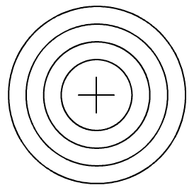

  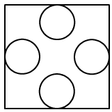

* **Độ khó & Phân tầng:** P1 (Cơ bản & Hoàn thành)
* **Bối cảnh:** Trích từ chuyên đề Bút vẽ Pen & Đồ họa Scratch (Tài liệu gốc ).
* **Nhiệm vụ:** Lập trình điều khiển nhân vật Scratch sử dụng công cụ Bút vẽ Pen và các khối lệnh Chuyển động để vẽ hoàn chỉnh hình học theo yêu cầu kỹ thuật.
---

### Khối lệnh Scratch gợi ý giải bài

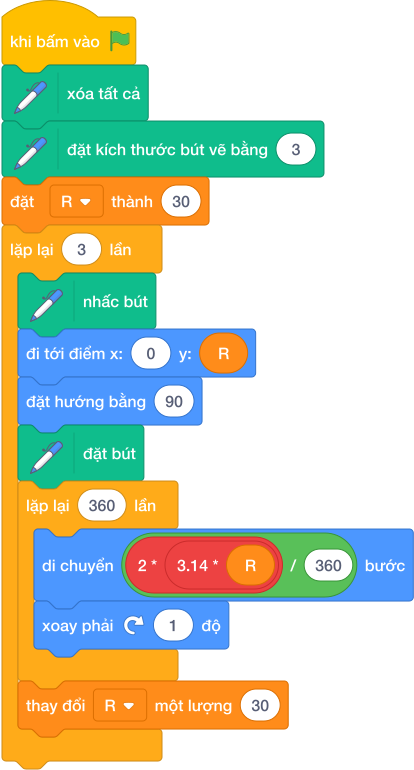

---
### Bài 2 (P0): Cung tròn cầu vồng 180 độ
* **Mã bài toán:** `sca_pen_p11_cung_tron_cau_vong`

* **Hình ảnh mẫu minh họa:**


  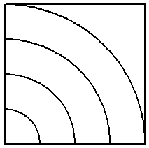

  

* **Độ khó & Phân tầng:** P2 (Luyện tập & Vận dụng)
* **Bối cảnh:** Trích từ chuyên đề Bút vẽ Pen & Đồ họa Scratch (Tài liệu gốc ).
* **Nhiệm vụ:** Lập trình điều khiển nhân vật Scratch sử dụng công cụ Bút vẽ Pen và các khối lệnh Chuyển động để vẽ hoàn chỉnh hình học theo yêu cầu kỹ thuật.
---

### Khối lệnh Scratch gợi ý giải bài

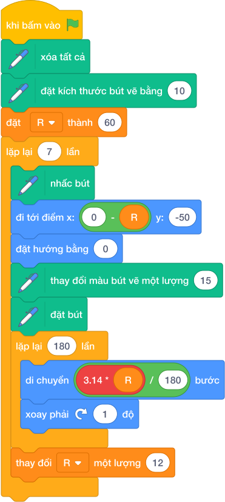

---
### Bài 3 (P0): Biểu tượng 5 vòng tròn Olympic thế giới
* **Mã bài toán:** `sca_pen_p12_logo_olympic`

* **Hình ảnh mẫu minh họa:**


  

* **Độ khó & Phân tầng:** P2 (Luyện tập & Vận dụng)
* **Bối cảnh:** Thế vận hội Olympic là ngày hội thể thao lớn nhất hành tinh, nơi các vận động viên xuất sắc nhất từ khắp các châu lục cùng nhau tranh tài. Biểu tượng chính thức của Olympic gồm 5 vòng tròn lồng vào nhau trên nền trắng, tượng trưng cho tình đoàn kết và hữu nghị của 5 châu lục:

- Hàng trên gồm 3 vòng tròn: **Xanh da trời** (Châu Âu), **Đen** (Châu Phi), **Đỏ** (Châu Mỹ).

- Hàng dưới gồm 2 vòng tròn: **Vàng** (Châu Á), **Xanh lá cây** (Châu Đại Dương).

Nhân dịp Thế vận hội sắp khai mạc, chú Mèo Scratch được giao nhiệm vụ thiết kế biểu tượng thể thao này bằng những nét vẽ lập trình sắc sảo và chính xác.
* **Nhiệm vụ:** Em hãy lập trình điều khiển chú Mèo Scratch vẽ lại biểu tượng 5 vòng tròn Olympic với các yêu cầu kỹ thuật sau:

1. Độ dày nét vẽ của các vòng tròn là $6$.

2. Mỗi vòng tròn có bán kính $R = 40$ bước (được tạo bằng cách lặp lại $360$ lần: mỗi lần đi khoảng $0.7$ bước rồi xoay phải $1^\circ$).

3. Vị trí và màu sắc của 5 vòng tròn được bố trí như sau:

   - **Hàng trên** (cùng độ cao $y = 40$):

     - Vòng 1: Màu xanh da trời, bắt đầu từ $x = -110, y = 40$.
     - Vòng 2: Màu đen, bắt đầu từ $x = -30, y = 40$.
     - Vòng 3: Màu đỏ, bắt đầu từ $x = 50, y = 40$.
   - **Hàng dưới** (cùng độ cao $y = 0$, so le lồng vào giữa các vòng hàng trên):

     - Vòng 4: Màu vàng, bắt đầu từ $x = -70, y = 0$.
     - Vòng 5: Màu xanh lá cây, bắt đầu từ $x = 10, y = 0$.

4. Giữa mỗi lần vẽ xong một vòng tròn, nhân vật bắt buộc phải nhấc bút trước khi di chuyển sang vị trí mới để không để lại vệt mực thừa.
* **Dữ liệu mẫu (Sample):**

### Kịch bản chạy
```text
Sự kiện: Bấm Cờ Xanh
Hành động:

- Xóa màn hình, đặt nét vẽ to bằng 6

- Vẽ vòng 1 tại (-110, 40): Màu Xanh da trời

- Nhấc bút, chuyển sang (-30, 40), đặt bút

- Vẽ vòng 2 tại (-30, 40): Màu Đen

- Nhấc bút, chuyển sang (50, 40), đặt bút

- Vẽ vòng 3 tại (50, 40): Màu Đỏ

- Nhấc bút, chuyển sang (-70, 0), đặt bút

- Vẽ vòng 4 tại (-70, 0): Màu Vàng

- Nhấc bút, chuyển sang (10, 0), đặt bút

- Vẽ vòng 5 tại (10, 0): Màu Xanh lá cây

- Nhấc bút, ẩn nhân vật
```

### Kết quả trên sân khấu
Logo 5 vòng tròn Olympic hiện lên hoàn chỉnh tại trung tâm sân khấu như hình mẫu.

### Giải thích
Chương trình lần lượt thực hiện quy trình chuẩn: di chuyển tới tọa độ đích $\to$ đổi màu tương ứng $\to$ hạ bút $\to$ quay một vòng tròn khép kín $\to$ nhấc bút. Nhờ giữ khoảng cách ngang giữa các tâm là $80$ bước và độ lệch dọc $40$ bước, hai hàng vòng tròn lồng ghép so le rất đẹp mắt.

---

### Khối lệnh Scratch gợi ý giải bài

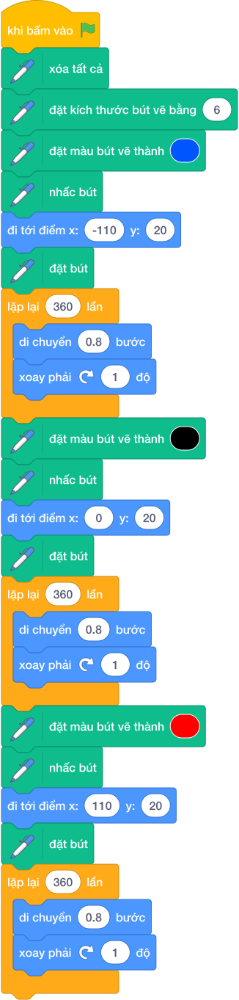

---
### Bài 4 (P0): Cánh hoa mắt ngọc 2 cung 90 độ
* **Mã bài toán:** `sca_pen_p13_canh_hoa_co_ban`

* **Hình ảnh mẫu minh họa:**


  

  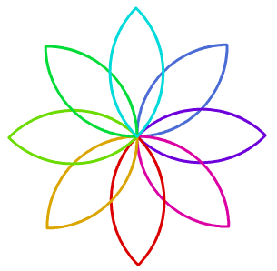

* **Độ khó & Phân tầng:** P3 (Vận dụng cao & Sáng tạo)
* **Bối cảnh:** Trích từ chuyên đề Bút vẽ Pen & Đồ họa Scratch (Tài liệu gốc ).
* **Nhiệm vụ:** Lập trình điều khiển nhân vật Scratch sử dụng công cụ Bút vẽ Pen và các khối lệnh Chuyển động để vẽ hoàn chỉnh hình học theo yêu cầu kỹ thuật.
---

### Khối lệnh Scratch gợi ý giải bài


---
### Bài 5 (P0): Đóa hoa 8 cánh sắc màu diệu kỳ
* **Mã bài toán:** `sca_pen_p14_bong_hoa_8_canh`

* **Hình ảnh mẫu minh họa:**

  
  * **Độ khó & Phân tầng:** P3 (Vận dụng cao & Sáng tạo)
* **Bối cảnh:** Trong khu vườn mùa xuân của xứ sở Scratch, muôn hoa đua nhau khoe sắc thắm. Để chào đón ngày hội hoa xuân, chú Mèo Scratch muốn lập trình tạo ra một đóa hoa 8 cánh tuyệt đẹp: mỗi chiếc cánh hoa được uốn lượn cong cong mềm mại từ hai cung tròn đối xứng, và mỗi cánh hoa lại mang một màu sắc biến đổi rực rỡ như cầu vồng.
* **Nhiệm vụ:** Em hãy lập trình điều khiển chú Mèo Scratch hoàn thành bức tranh đóa hoa 8 cánh với các yêu cầu kỹ thuật sau:

1. Đặt nét bút vẽ có độ dày bằng $3$.

2. Tạo thủ tục con vẽ một chiếc cánh hoa đơn lẻ gồm hai cung tròn $90^\circ$ (mỗi bước vi phân dài $1.2$ bước) khép kín đối xứng nhau tại 2 đỉnh.

3. Sử dụng vòng lặp xoay quanh gốc tâm $(0, 0)$ đúng $8$ lần:

   - Vẽ một chiếc cánh hoa.
   - Thay đổi màu bút vẽ một lượng thích hợp (ví dụ $15$ hoặc $20$) để cánh tiếp theo có màu mới.
   - Xoay phải quanh tâm đúng góc: $\text{Góc xoay} = \dfrac{360^\circ}{8} = 45^\circ$.

4. Khi hoàn thành, đóa hoa 8 cánh xòe đều cân xứng quanh tâm, tạo thành một họa tiết hoa văn rực rỡ và hài hòa.
* **Dữ liệu mẫu (Sample):**

### Kịch bản chạy
```text
Sự kiện: Bấm Cờ Xanh
Hành động:

- Xóa màn hình, đưa Mèo về (0, 0), hướng 0 độ (hướng lên)

- Đặt nét bút bằng 3

- Lặp lại 8 lần:

  + Vẽ 1 cánh hoa (2 cung 90 độ)
  + Đổi màu bút vẽ một lượng 15
  + Xoay phải 45 độ

- Ẩn nhân vật
```

### Kết quả trên sân khấu
Một đóa hoa 8 cánh nở rộ cân đối giữa màn hình.

### Giải thích
Mỗi cánh hoa uốn lượn từ tâm $(0, 0)$ rồi lại khép kín quay về đúng tâm $(0, 0)$. Nhờ tính chất bảo toàn vị trí này, lệnh xoay phải $45^\circ$ sẽ đưa nhân vật vào hướng chuẩn bị vẽ cánh tiếp theo mà không làm xê dịch tâm hoa.

---

### Khối lệnh Scratch gợi ý giải bài

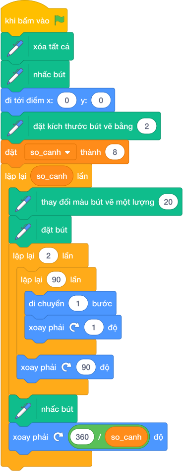

---
### Bài 6 (P1): Hoa văn chong chóng tự động
* **Mã bài toán:** `sca_pen_p15_hoa_chong_chong`

* **Hình ảnh mẫu minh họa:**


  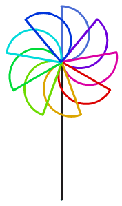

  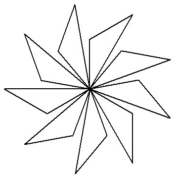

* **Độ khó & Phân tầng:** P3 (Vận dụng cao & Sáng tạo)
* **Bối cảnh:** Trích từ chuyên đề Bút vẽ Pen & Đồ họa Scratch (Tài liệu gốc ).
* **Nhiệm vụ:** Lập trình điều khiển nhân vật Scratch sử dụng công cụ Bút vẽ Pen và các khối lệnh Chuyển động để vẽ hoàn chỉnh hình học theo yêu cầu kỹ thuật.
---

### Khối lệnh Scratch gợi ý giải bài

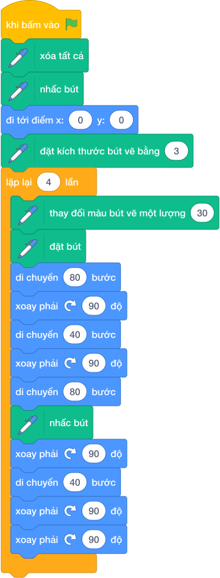

---
### Bài 7 (P1): Hình Tròn Chuẩn Bằng 360 Bước Cong
* **Mã bài toán:** `sca_pen_p21_hinh_tron_co_ban`

* **Hình ảnh mẫu minh họa:**


  

  

* **Độ khó & Phân tầng:** P0 (Khởi động & Quan sát)
* **Bối cảnh:** Khám phá bí mật đường cong: Hình tròn thực chất là một đa giác 360 cạnh siêu nhỏ.
* **Nhiệm vụ:** Lập trình vẽ hình tròn bán kính R theo công thức bước đi bước_cong = (2 * 3.14 * R) / 360.
* **Kịch bản tương tác:** Nhập bán kính R từ bàn phím.
* **Kết quả mong đợi:** Đường tròn tròn xoe, mượt mà không góc cạnh.
* **Dữ liệu mẫu (Sample):**

### Kịch bản chạy trên sân khấu

- **Thao tác khởi động:** Nhập bán kính R từ bàn phím.

- **Kết quả hình ảnh:** Đường tròn tròn xoe, mượt mà không góc cạnh.

### Giải thích

Lặp 360 [đi bước_cong, xoay phải 1 độ].

---

### Khối lệnh Scratch gợi ý giải bài

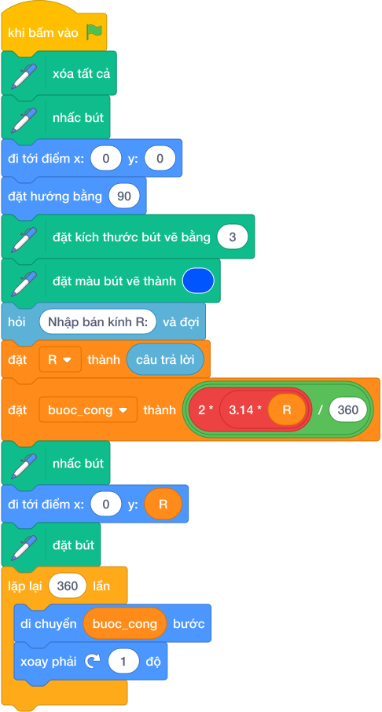

---
### Bài 8 (P1): Hình Tròn Đồng Tâm Đa Sắc
* **Mã bài toán:** `sca_pen_p22_hinh_tron_dong_tam_da_sac`

* **Hình ảnh mẫu minh họa:**


  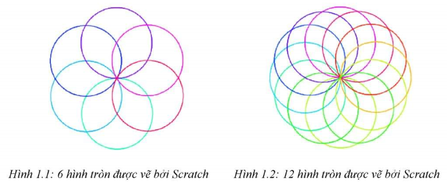

* **Độ khó & Phân tầng:** P0 (Khởi động & Quan sát)
* **Bối cảnh:** Tấm bia bắn cung Thế vận hội gồm 5 vòng tròn đồng tâm với các màu sắc: vàng, đỏ, xanh lam, đen, trắng.
* **Nhiệm vụ:** Viết thủ tục vẽ hình tròn với tham số bán kính, sau đó vẽ các vòng tròn có bán kính tăng dần cùng tâm (0,0).
* **Kịch bản tương tác:** Nhập số vòng tròn N.
* **Kết quả mong đợi:** Bia ngắm bắn hình tròn đồng tâm rực rỡ.
* **Dữ liệu mẫu (Sample):**

### Kịch bản chạy trên sân khấu

- **Thao tác khởi động:** Nhập số vòng tròn N.

- **Kết quả hình ảnh:** Bia ngắm bắn hình tròn đồng tâm rực rỡ.

### Giải thích

R = 30, 60, 90, 120...

---

### Khối lệnh Scratch gợi ý giải bài

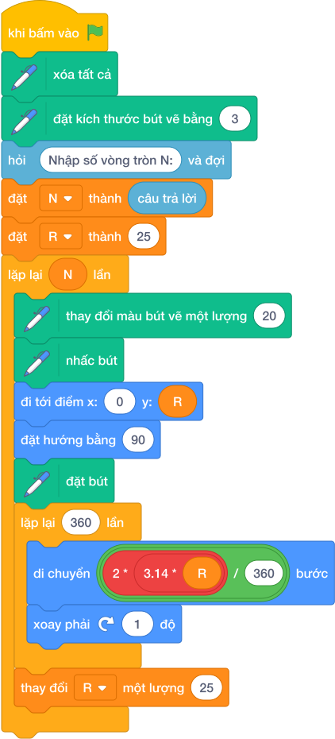

---
### Bài 9 (P1): Biểu Tượng 5 Vòng Tròn Olympic
* **Mã bài toán:** `sca_pen_p23_logo_olympic_5_mau`

* **Hình ảnh mẫu minh họa:**


  

* **Độ khó & Phân tầng:** P0 (Khởi động & Quan sát)
* **Bối cảnh:** Logo Thế vận hội Olympic gồm 5 vòng tròn đan xen nhau đại diện cho 5 châu lục: Xanh lam, Vàng, Đen, Xanh lá, Đỏ.
* **Nhiệm vụ:** Lập trình vẽ chính xác 5 vòng tròn nét to (size = 10) tại các tọa độ chuẩn xác lồng vào nhau.
* **Kịch bản tương tác:** Khởi động khi nhấn biểu tượng Cờ Xanh (không cần nhập dữ liệu từ bàn phím).
* **Kết quả mong đợi:** Logo Olympic hoàn chỉnh đúng chuẩn quốc tế.
* **Dữ liệu mẫu (Sample):**

### Kịch bản chạy trên sân khấu

- **Thao tác khởi động:** Nhấn cờ xanh.

- **Kết quả hình ảnh:** Logo Olympic hoàn chỉnh đúng chuẩn quốc tế.

### Giải thích

3 vòng hàng trên, 2 vòng so le hàng dưới.

---

### Khối lệnh Scratch gợi ý giải bài

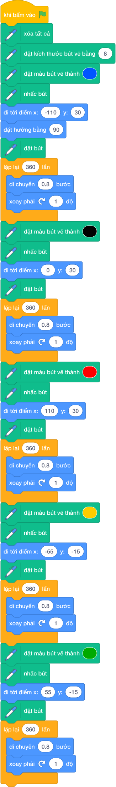

---
### Bài 10 (P1): Cầu Vồng 7 Sắc Rực Rỡ
* **Mã bài toán:** `sca_pen_p24_cung_tron_cau_vong_7_mau`

* **Hình ảnh mẫu minh họa:**


  

* **Độ khó & Phân tầng:** P1 (Cơ bản & Hoàn thành)
* **Bối cảnh:** Sau cơn mưa rào, một chiếc cầu vồng 7 sắc xuất hiện uốn cong trên bầu trời.
* **Nhiệm vụ:** Vẽ 7 cung tròn 180 độ lồng nhau với nét vẽ dày 12, theo thứ tự màu: Đỏ, Cam, Vàng, Lục, Lam, Chàm, Tím.
* **Kịch bản tương tác:** Khởi động khi nhấn biểu tượng Cờ Xanh (không cần nhập dữ liệu từ bàn phím).
* **Kết quả mong đợi:** Cầu vồng 7 sắc cong vút tuyệt đẹp.
* **Dữ liệu mẫu (Sample):**

### Kịch bản chạy trên sân khấu

- **Thao tác khởi động:** Nhấn cờ xanh.

- **Kết quả hình ảnh:** Cầu vồng 7 sắc cong vút tuyệt đẹp.

### Giải thích

Cung tròn 180 độ: lặp 180 [đi bước_cong, xoay 1 độ].

---

### Khối lệnh Scratch gợi ý giải bài

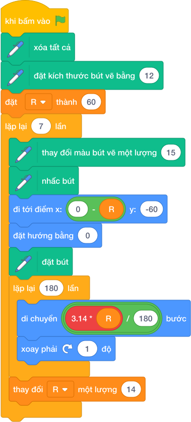

---
### Bài 11 (P2): Cánh Hoa Mảnh Ghép Cung Tròn 90 Độ
* **Mã bài toán:** `sca_pen_p25_canh_hoa_cung_tron_90`

* **Hình ảnh mẫu minh họa:**


  

  

* **Độ khó & Phân tầng:** P1 (Cơ bản & Hoàn thành)
* **Bối cảnh:** Một cánh hoa mềm mại được tạo thành bởi 2 cung tròn 90 độ khép cong đối xứng nhau.
* **Nhiệm vụ:** Tạo thủ tục Canh_Hoa: Lặp 2 lần [Lặp 90 lần (đi, xoay 1 độ), xoay phải 90 độ].
* **Kịch bản tương tác:** Khởi động khi nhấn biểu tượng Cờ Xanh (không cần nhập dữ liệu từ bàn phím).
* **Kết quả mong đợi:** Một cánh hoa hình thoi cong thanh thoát.
* **Dữ liệu mẫu (Sample):**

### Kịch bản chạy trên sân khấu

- **Thao tác khởi động:** Nhấn cờ xanh.

- **Kết quả hình ảnh:** Một cánh hoa hình thoi cong thanh thoát.

### Giải thích

Hai cung tròn 90 độ cong úp vào nhau.

---

### Khối lệnh Scratch gợi ý giải bài

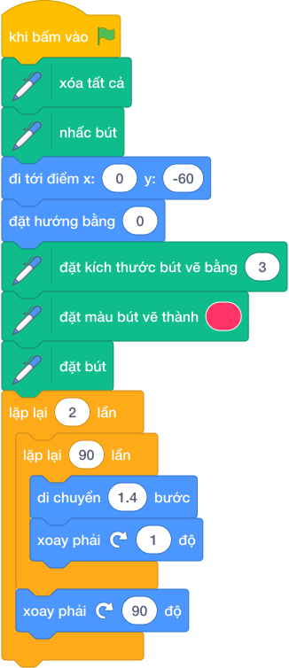

---
### Bài 12 (P2): Bông Hoa K Cánh Nở Rộ
* **Mã bài toán:** `sca_pen_p26_bong_hoa_da_canh`

* **Hình ảnh mẫu minh họa:**


  

  

  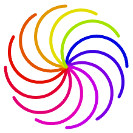

* **Độ khó & Phân tầng:** P1 (Cơ bản & Hoàn thành)
* **Bối cảnh:** Từ cánh hoa cơ bản, ta có thể tạo ra bông hoa 6 cánh, 8 cánh hoặc 12 cánh bằng cách quay quanh tâm.
* **Nhiệm vụ:** Sử dụng thủ tục Canh_Hoa, xoay quanh tâm 360 / K độ để vẽ bông hoa K cánh đổi màu.
* **Kịch bản tương tác:** Nhập số cánh hoa K từ bàn phím.
* **Kết quả mong đợi:** Bông hoa đa cánh nở rộ rực rỡ.
* **Dữ liệu mẫu (Sample):**

### Kịch bản chạy trên sân khấu

- **Thao tác khởi động:** Nhập số cánh hoa K từ bàn phím.

- **Kết quả hình ảnh:** Bông hoa đa cánh nở rộ rực rỡ.

### Giải thích

K = 8 cánh -> Xoay mỗi lần 45 độ.

---

### Khối lệnh Scratch gợi ý giải bài

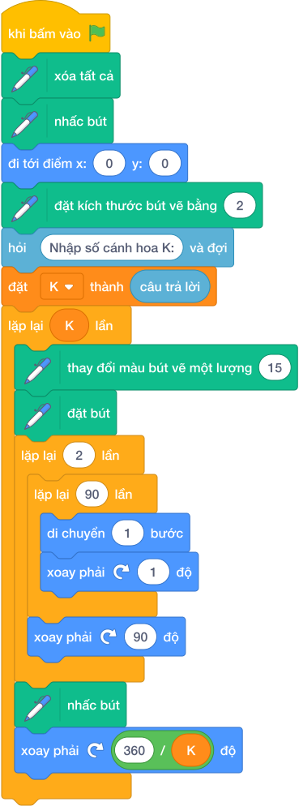

---
### Bài 13 (P2): Chong Chóng Gió Xoay Tít
* **Mã bài toán:** `sca_pen_p27_chong_chong_gio`

* **Hình ảnh mẫu minh họa:**


  

  

  

  

* **Độ khó & Phân tầng:** P1 (Cơ bản & Hoàn thành)
* **Bối cảnh:** Chiếc chong chóng gió tuổi thơ quay tít trước hiên nhà trong những ngày hè lộng gió.
* **Nhiệm vụ:** Vẽ các cánh chong chóng lệch tâm cong vút kết hợp màu sắc tương phản.
* **Kịch bản tương tác:** Nhập số cánh chong chóng (4 hoặc 6).
* **Kết quả mong đợi:** Chong chóng gió chuyển động xoay đều.
* **Dữ liệu mẫu (Sample):**

### Kịch bản chạy trên sân khấu

- **Thao tác khởi động:** Nhập số cánh chong chóng (4 hoặc 6).

- **Kết quả hình ảnh:** Chong chóng gió chuyển động xoay đều.

### Giải thích

Vẽ 4 cánh chong chóng xoay góc 90 độ.

---

### Khối lệnh Scratch gợi ý giải bài

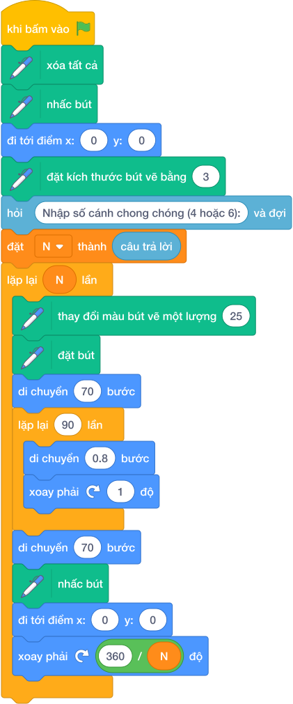

---
### Bài 14 (P2): Bông Hoa Tuyết Pha Lê 6 Nhánh
* **Mã bài toán:** `sca_pen_p28_bong_hoa_tuyet_pha_le`

* **Hình ảnh mẫu minh họa:**


  

  

* **Độ khó & Phân tầng:** P2 (Luyện tập & Vận dụng)
* **Bối cảnh:** Những bông hoa tuyết mùa đông rơi xuống mang hình dạng đối xứng 6 nhánh tinh xảo.
* **Nhiệm vụ:** Tạo thủ tục Nhánh_Tuyết có các nhánh con đối xứng, sau đó lặp lại 6 lần quanh tâm.
* **Kịch bản tương tác:** Khởi động khi nhấn biểu tượng Cờ Xanh (không cần nhập dữ liệu từ bàn phím).
* **Kết quả mong đợi:** Bông hoa tuyết pha lê màu xanh lấp lánh.
* **Dữ liệu mẫu (Sample):**

### Kịch bản chạy trên sân khấu

- **Thao tác khởi động:** Nhấn cờ xanh.

- **Kết quả hình ảnh:** Bông hoa tuyết pha lê màu xanh lấp lánh.

### Giải thích

6 nhánh tuyết xoay góc 60 độ quanh tâm.

---

### Khối lệnh Scratch gợi ý giải bài

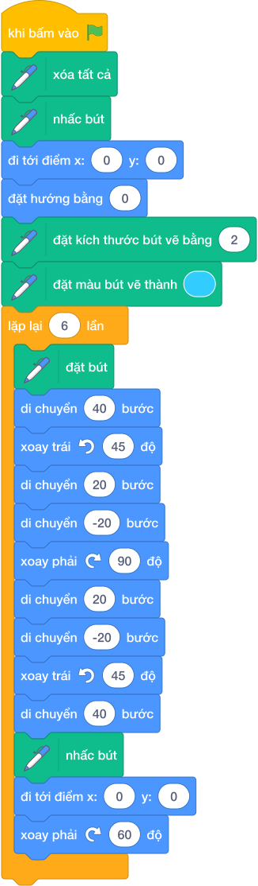

---
### Bài 15 (P2): Vầng Trăng Khuyết Nghệ Thuật
* **Mã bài toán:** `sca_pen_p29_hinh_tron_khuyet`

* **Hình ảnh mẫu minh họa:**


  

  

* **Độ khó & Phân tầng:** P2 (Luyện tập & Vận dụng)
* **Bối cảnh:** Bầu trời đêm rằm với vầng trăng khuyết dịu dàng chiếu sáng không gian.
* **Nhiệm vụ:** Vẽ cung tròn lớn, sau đó quay ngược lại vẽ cung tròn nhỏ để tạo hình trăng khuyết.
* **Kịch bản tương tác:** Khởi động khi nhấn biểu tượng Cờ Xanh (không cần nhập dữ liệu từ bàn phím).
* **Kết quả mong đợi:** Hình vầng trăng khuyết màu vàng óng ả.
* **Dữ liệu mẫu (Sample):**

### Kịch bản chạy trên sân khấu

- **Thao tác khởi động:** Nhấn cờ xanh.

- **Kết quả hình ảnh:** Hình vầng trăng khuyết màu vàng óng ả.

### Giải thích

Cung tròn ngoài bán kính lớn, cung trong bán kính nhỏ.

---

### Khối lệnh Scratch gợi ý giải bài

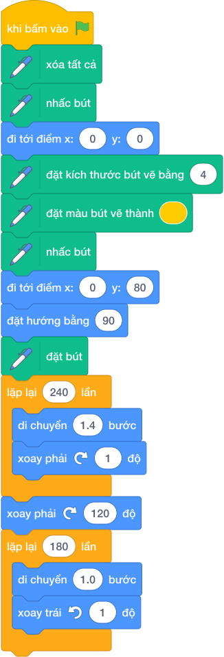

---
### Bài 16 (P3): Chia Bánh Pizza N Miếng Đa Sắc
* **Mã bài toán:** `sca_pen_p30_chia_banh_pizza_n_phan`

* **Hình ảnh mẫu minh họa:**


  

  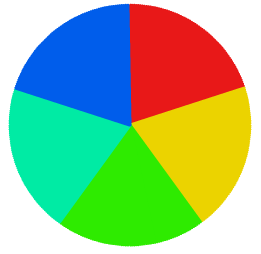

* **Độ khó & Phân tầng:** P2 (Luyện tập & Vận dụng)
* **Bối cảnh:** Bữa tiệc sinh nhật có chiếc bánh pizza tròn cần chia đều cho N bạn nhỏ, mỗi miếng một vị và màu sắc khác nhau.
* **Nhiệm vụ:** Vẽ đường tròn và các nan quạt từ tâm ra đường viền, chia góc 360 / N độ.
* **Kịch bản tương tác:** Nhập số phần N (ví dụ N = 6 hoặc 8).
* **Kết quả mong đợi:** Chiếc bánh tròn được chia thành N nan quạt màu sắc rực rỡ.
* **Dữ liệu mẫu (Sample):**

### Kịch bản chạy trên sân khấu

- **Thao tác khởi động:** Nhập số phần N (ví dụ N = 6 hoặc 8).

- **Kết quả hình ảnh:** Chiếc bánh tròn được chia thành N nan quạt màu sắc rực rỡ.

### Giải thích

Mỗi nan quạt đi từ tâm ra bán kính R, xoay góc, đi về tâm.

---

### Khối lệnh Scratch gợi ý giải bài

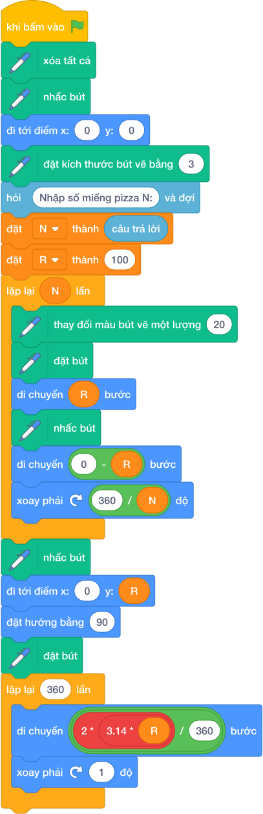

---
### Bài 17 (P3): Vỏ Ốc Xoắn Archimedes
* **Mã bài toán:** `sca_pen_p31_hoa_van_xoan_oc`

* **Hình ảnh mẫu minh họa:**


  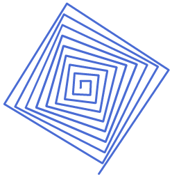

  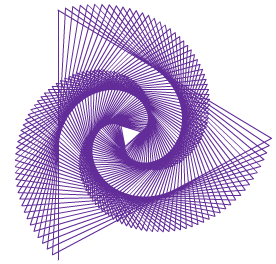

  

* **Độ khó & Phân tầng:** P2 (Luyện tập & Vận dụng)
* **Bối cảnh:** Quy luật xoắn ốc tuyệt mỹ trong thiên nhiên được tìm thấy trên vỏ ốc biển và dải ngân hà.
* **Nhiệm vụ:** Vòng lặp vẽ đường cong với bán kính hoặc bước đi tăng dần sau mỗi góc xoay nhỏ.
* **Kịch bản tương tác:** Khởi động khi nhấn biểu tượng Cờ Xanh (không cần nhập dữ liệu từ bàn phím).
* **Kết quả mong đợi:** Đường xoắn ốc Archimedes mượt mà từ tâm lan tỏa ra ngoài.
* **Dữ liệu mẫu (Sample):**

### Kịch bản chạy trên sân khấu

- **Thao tác khởi động:** Nhấn cờ xanh.

- **Kết quả hình ảnh:** Đường xoắn ốc Archimedes mượt mà từ tâm lan tỏa ra ngoài.

### Giải thích

Lặp 500 lần: đi (i * 0.05) bước, xoay 5 độ.

---

### Khối lệnh Scratch gợi ý giải bài

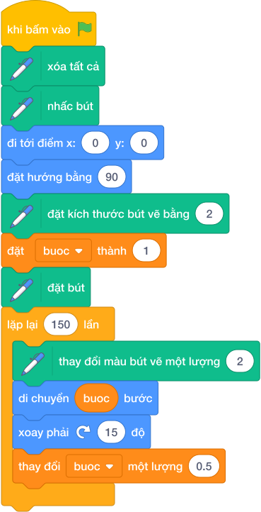

---
### Bài 18 (P3): Chuỗi Vòng Ngọc Trai Lấp Lánh
* **Mã bài toán:** `sca_pen_p32_chuoi_vong_ngoc_trai`

* **Hình ảnh mẫu minh họa:**


  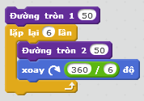

  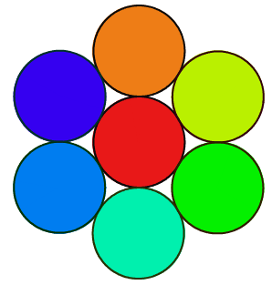

* **Độ khó & Phân tầng:** P3 (Vận dụng cao & Sáng tạo)
* **Bối cảnh:** Chuỗi vòng cổ quý phái đính các viên ngọc trai tròn xoe xếp đều trên một đường tròn lớn.
* **Nhiệm vụ:** Đi theo đường tròn lớn, tại mỗi khoảng cách đều đặn dừng lại vẽ một viên ngọc trai nhỏ.
* **Kịch bản tương tác:** Nhập số lượng hạt ngọc trai K.
* **Kết quả mong đợi:** Chuỗi vòng ngọc trai lộng lẫy.
* **Dữ liệu mẫu (Sample):**

### Kịch bản chạy trên sân khấu

- **Thao tác khởi động:** Nhập số lượng hạt ngọc trai K.

- **Kết quả hình ảnh:** Chuỗi vòng ngọc trai lộng lẫy.

### Giải thích

K = 12 hạt ngọc xếp tròn quanh tâm.

---

### Khối lệnh Scratch gợi ý giải bài

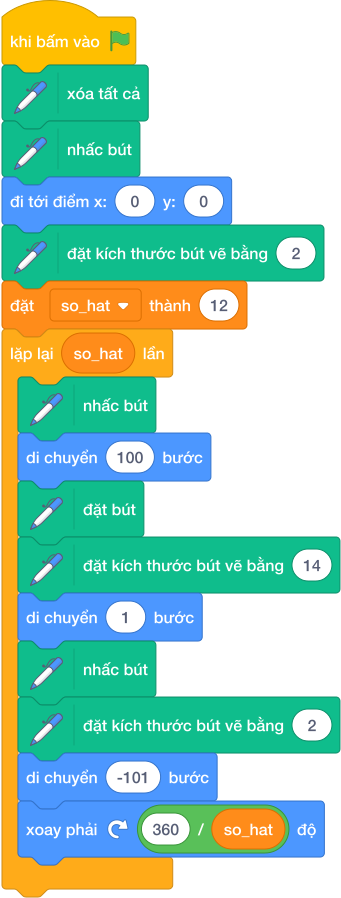

---
### Bài 19 (P3): Họa Tiết Đường Viền Sóng Biển
* **Mã bài toán:** `sca_pen_p33_hoa_tiet_trang_tri_vien`

* **Hình ảnh mẫu minh họa:**


  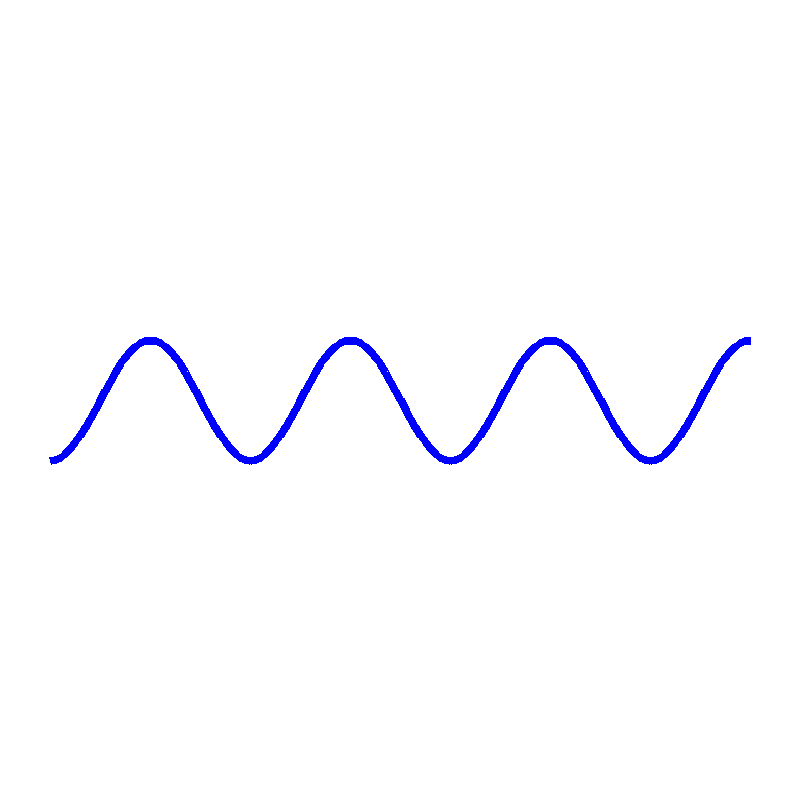

  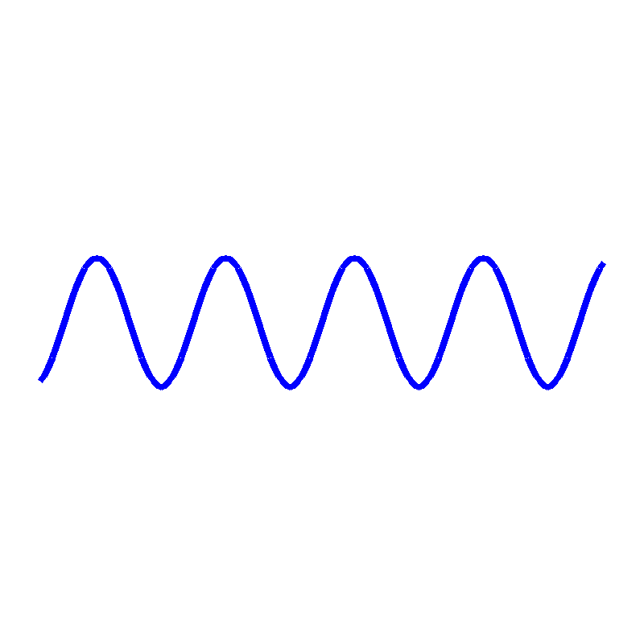

* **Độ khó & Phân tầng:** P3 (Vận dụng cao & Sáng tạo)
* **Bối cảnh:** Trang trí mép thảm trải sàn hoặc khung ảnh bằng chuỗi cung tròn sóng biển dập dềnh liên tiếp.
* **Nhiệm vụ:** Lặp lại N lần cung tròn 180 độ uốn lượn liên tiếp theo chiều ngang.
* **Kịch bản tương tác:** Nhập chiều dài đường viền.
* **Kết quả mong đợi:** Dải hoa văn viền sóng biển uốn lượn liên tục.
* **Dữ liệu mẫu (Sample):**

### Kịch bản chạy trên sân khấu

- **Thao tác khởi động:** Nhập chiều dài đường viền.

- **Kết quả hình ảnh:** Dải hoa văn viền sóng biển uốn lượn liên tục.

### Giải thích

Cung uốn lên rồi cung uốn xuống xen kẽ.

---

### Khối lệnh Scratch gợi ý giải bài

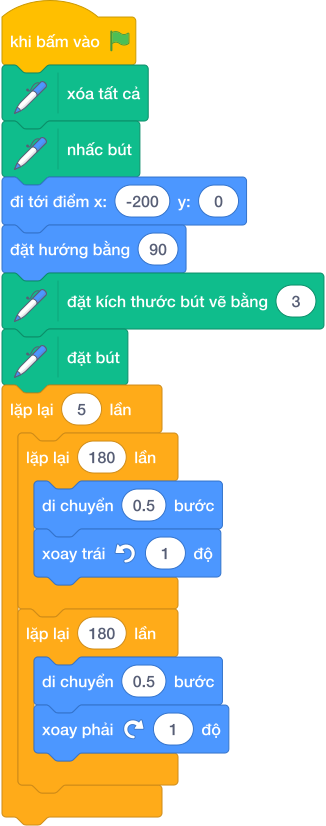

---
### Bài 20 (P3): Gạch Hoa Cổ Điển Đông Dương
* **Mã bài toán:** `sca_pen_p34_hoa_van_gach_hoa_co_dien`

* **Hình ảnh mẫu minh họa:**


  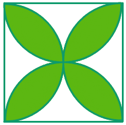

  

* **Độ khó & Phân tầng:** P3 (Vận dụng cao & Sáng tạo)
* **Bối cảnh:** Nền nhà cổ kính với những viên gạch hoa văn kết hợp tinh tế giữa hình vuông và 4 cánh hoa tròn bao quanh.
* **Nhiệm vụ:** Vẽ hình vuông trung tâm và 4 cánh hoa uốn cong tại 4 cạnh hình vuông.
* **Kịch bản tương tác:** Khởi động khi nhấn biểu tượng Cờ Xanh (không cần nhập dữ liệu từ bàn phím).
* **Kết quả mong đợi:** Họa tiết viên gạch hoa Đông Dương sang trọng.
* **Dữ liệu mẫu (Sample):**

### Kịch bản chạy trên sân khấu

- **Thao tác khởi động:** Nhấn cờ xanh.

- **Kết quả hình ảnh:** Họa tiết viên gạch hoa Đông Dương sang trọng.

### Giải thích

1 hình vuông + 4 cung tròn cánh hoa.

---

### Khối lệnh Scratch gợi ý giải bài

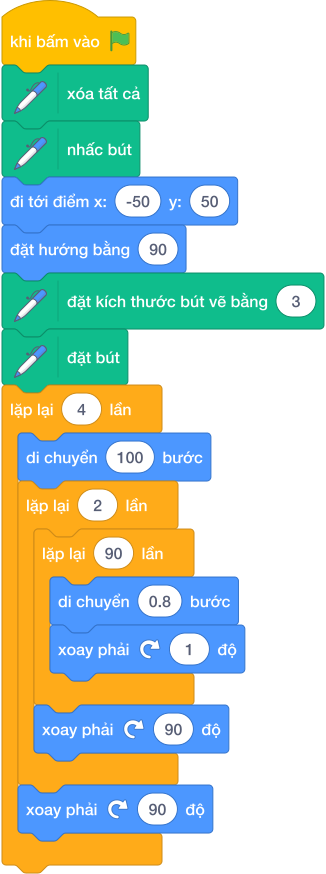

---
### Bài 21 (P3): Kính Vạn Hoa Đa Chiều (Kaleidoscope)
* **Mã bài toán:** `sca_pen_p35_dai_ngan_ha_van_hoa`

* **Hình ảnh mẫu minh họa:**


  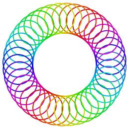

  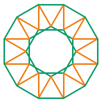

* **Độ khó & Phân tầng:** P3 (Vận dụng cao & Sáng tạo)
* **Bối cảnh:** Ống kính vạn hoa đồ chơi tạo nên vô số hoa văn kỳ ảo khi xoay chuyển trước ánh sáng.
* **Nhiệm vụ:** Xoay một cụm họa tiết gồm đa giác và cung tròn 36 lần quanh tâm (mỗi lần 10 độ) với màu sắc cầu vồng ngẫu nhiên.
* **Kịch bản tương tác:** Khởi động khi nhấn biểu tượng Cờ Xanh (không cần nhập dữ liệu từ bàn phím).
* **Kết quả mong đợi:** Bức tranh kính vạn hoa lộng lẫy, choáng ngợp.
* **Dữ liệu mẫu (Sample):**

### Kịch bản chạy trên sân khấu

- **Thao tác khởi động:** Nhấn cờ xanh.

- **Kết quả hình ảnh:** Bức tranh kính vạn hoa lộng lẫy, choáng ngợp.

### Giải thích

Hiệu ứng xoay tròn 36 lần liên tục đổi màu.

### Khối lệnh Scratch gợi ý giải bài

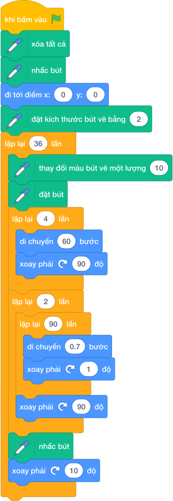

---
