# Bài 02: HÌNH TRÒN, CUNG TRÒN & NGHỆ THUẬT HOA VĂN

## 1. Từ đa giác đều đến đường cong mềm mại

Trong Bài 01, chúng ta đã khám phá công thức vẽ đa giác đều: muốn vẽ hình $N$ cạnh, ta lặp lại $N$ lần: `di chuyển (bước) bước` rồi `xoay phải ↻ (360 / N) độ`.

- Khi $N = 3$: Tam giác đều (xoay $120^\circ$).

- Khi $N = 6$: Lục giác đều (xoay $60^\circ$).

- Khi $N = 12$: Thập nhị giác đều (xoay $30^\circ$).

- Khi $N = 36$: Hình 36 cạnh (xoay $10^\circ$).

- Khi $N = 360$: Mỗi bước đi cực nhỏ và xoay đúng $1^\circ$, các cạnh thẳng li ti nối tiếp nhau mượt mà đến mức mắt thường nhìn thấy một **đường tròn hoàn hảo**!

---

## 2. Hai kỹ thuật vẽ hình tròn kinh điển trong Scratch

Trong tài liệu đồ họa Scratch chuẩn, có **hai phương pháp vẽ hình tròn** với bản chất hình học, vị trí đứng của nhân vật và ứng dụng hoàn toàn khác biệt:

### 2.1. Đường tròn 1: Nhân vật ở tâm đường tròn (Kỹ thuật quay nan hoa)
Ở phương pháp này, nhân vật đứng cố định tại **tâm đường tròn** với tọa độ $(x_0, y_0)$. Mỗi chu kỳ vẽ, nhân vật phóng ra mép vẽ một phần đường viền rồi lùi về tâm, tựa như từng chiếc nan hoa xe đạp tỏa ra xung quanh:

| Sơ đồ vị trí nhân vật tại tâm | Khối lệnh định nghĩa "Đường tròn 1" | Hoa văn 6 đường tròn từ tâm |
|:---:|:---:|:---:|
| 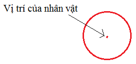 | 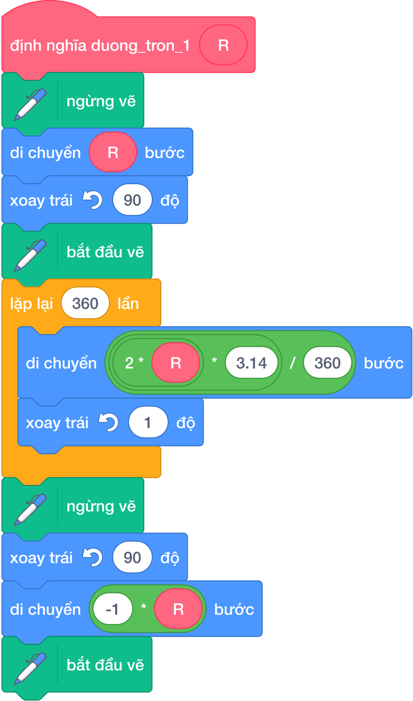 | 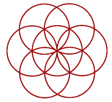 |
| *Nhân vật đứng tại tâm đường tròn* | *Thủ tục Đường tròn 1 với bán kính R* | *Hoa văn xoay quanh tâm 6 lần* |

- **Bản chất thuật toán chi tiết (từng bước):**
  1. Tạo khối thủ tục `Đường tròn 1 (R)` với tham số đầu vào là bán kính $R$.
  2. Bắt đầu vẽ:
     - `ngừng vẽ` (nhấc bút) để không để lại vệt mực khi di chuyển ra mép.
     - `di chuyển (R) bước` để đưa đầu bút từ tâm ra đúng chu vi đường tròn.
     - `xoay trái 90 độ` để hướng đầu bút tiếp xúc theo phương tiếp tuyến của đường tròn.
     - `bắt đầu vẽ` (đặt bút).
  3. Vẽ chu vi: Lặp lại $360$ lần cụm lệnh:
     - `di chuyển ((2 * R * 3.14) / 360) bước`
     - `xoay trái 1 độ`
  4. Trở về tâm:
     - `ngừng vẽ` (nhấc bút).
     - **Cách 1 (Chuẩn góc):** `xoay trái 90 độ` để quay đầu thẳng hướng về lại tâm, sau đó `di chuyển (R) bước` tiến về đúng vị trí xuất phát ban đầu.
     - **Cách 2 (Đi lùi từ hướng tiếp tuyến):** Giữ nguyên hướng tiếp tuyến và dùng khối `đi tới điểm x: (x0) y: (y0)` để trở về tâm tuyệt đối chính xác mà không sợ lệch góc.
     - `bắt đầu vẽ` (đặt bút) để sẵn sàng thực hiện lệnh kế tiếp.

- **Ứng dụng vẽ hoa văn hình tròn xoay quanh tâm (Ví dụ 4 trong giáo trình gốc):**
Sau khi định nghĩa xong thủ tục `Đường tròn 1` hoặc `Đường tròn 2`, ta gọi thủ tục này trong một vòng lặp xoay quanh tâm sân khấu để tạo ra những hoa văn hình học lộng lẫy:

| Khối lệnh gọi xoay hoa văn quanh tâm (Ví dụ 4) | Hoa văn 6 hình tròn giao nhau quanh tâm |
|:---:|:---:|
|  |  |
| *Gọi Đường tròn 1 kết hợp vòng lặp 6 lần và xoay 60°* | *6 đường tròn bán kính 50 giao nhau đối xứng qua tâm* |

- **Ứng dụng vẽ đường tròn đồng tâm (Câu 10 trong giáo trình gốc):**
Vì sau khi vẽ xong mỗi đường tròn từ tâm, nhân vật luôn tự động lùi bút trở về đúng tọa độ $(x_0, y_0)$ ban đầu, ta có thể lặp lại việc gọi `Đường tròn 1` với các bán kính $R$ tăng dần ($20, 40, 60, 80$) để tạo chùm hình tròn đồng tâm:

| Hình ảnh minh họa chùm đường tròn đồng tâm | Kỹ thuật lập trình trong Scratch |
|:---:|---|
|  | 1. Vẽ dấu chữ thập (+) làm tọa độ mốc tại tâm. 2. Khởi tạo bán kính ban đầu $R = 20$. 3. Lặp lại 4 lần: Gọi `Đường tròn 1 (R)`, sau đó `thay đổi [R] một lượng (20)`. |
| *4 vòng tròn đồng tâm xuất phát từ tâm chữ thập (+)* | *Mỗi lần vẽ xong nhân vật tự lui về tâm nên không bị lệch hình* |

---

### 2.2. Đường tròn 2: Nhân vật ở mép đường tròn (Điểm cực trái)
Ở phương pháp này, nhân vật không đứng ở tâm mà đứng ngay tại **mép ngoài (điểm cực trái)** của đường tròn và men theo chu vi để vẽ trọn vẹn $360^\circ$:

| Sơ đồ vị trí nhân vật tại mép | Khối lệnh định nghĩa "Đường tròn 2" | Hoa văn 8 đường tròn giao mép |
|:---:|:---:|:---:|
| 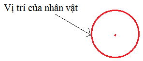 | 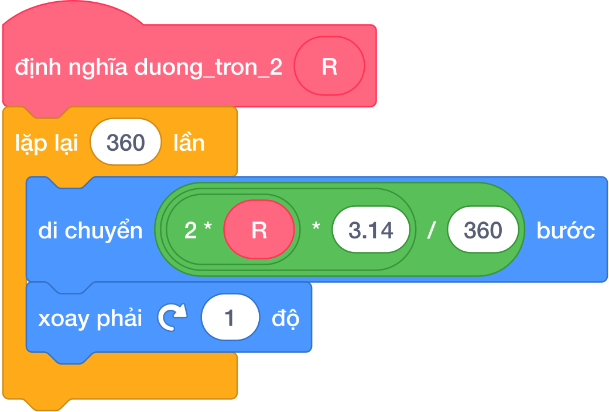 | 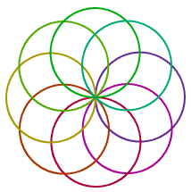 |
| *Nhân vật đứng ở mép ngoài đường tròn* | *Thủ tục Đường tròn 2 (lặp 360 lần)* | *8 hình tròn xoay quanh điểm tiếp xúc mép* |

- **Bản chất thuật toán chi tiết:**
  - Định nghĩa thủ tục `Đường tròn 2 (R)`.
  - Lặp lại đúng $360$ lần:
    - `di chuyển ((2 * R * 3.14) / 360) bước`
    - `xoay phải 1 độ`
  - Sau khi quay đủ $360$ lần $\times 1^\circ = 360^\circ$, nhân vật tự động khép kín vòng tròn và trở về đúng vị trí và hướng ban đầu tại mép ngoài!

---

### 2.3. Bảng tính nhẩm bước đi theo bán kính $R$
Khi vẽ đường tròn theo chu vi ngoài (vòng lặp $360$ lần), chu vi $C = 2 \times \pi \times R \approx 6.28 \times R$.  
Mỗi bước đi trong $360$ lần lặp được tính bằng:
$$\text{Bước đi} = \frac{2 \times \pi \times R}{360} \approx R \times 0.01745$$

| Bán kính mong muốn ($R$) | Công thức bước đi tính nhẩm | Bước đi cài đặt vào Scratch | Chu vi thực tế ($360 \times \text{bước}$) |
|:---:|:---:|:---:|:---:|
| $R = 30$ bước | $30 \times 0.01745$ | **$0.52$ bước** | $\approx 188$ bước |
| $R = 50$ bước | $50 \times 0.01745$ | **$0.87$ bước** | $\approx 314$ bước |
| $R = 60$ bước | $60 \times 0.01745$ | **$1.05$ bước** | $\approx 377$ bước |
| $R = 100$ bước | $100 \times 0.01745$ | **$1.75$ bước** | $\approx 628$ bước |

---

## 3. Kỹ thuật vẽ cung tròn (Arc) và các ứng dụng nâng cao

**Cung tròn** là một đoạn uốn cong của đường tròn. Vì toàn bộ đường tròn khép kín tương ứng với $360^\circ$, nên **số lần lặp chính là số độ của cung tròn** cần vẽ!

### 3.1. Định nghĩa thủ tục Cung tròn tổng quát
Để tái sử dụng linh hoạt trong mọi bài toán, chúng ta tạo một mảnh ghép thủ tục riêng mang tên `ve_cung_tron` với hai tham số đầu vào: `(goc)` và `(buoc)`:

| Khối lệnh định nghĩa Cung tròn | Minh họa cung tròn $360^\circ$ khép kín |
|:---:|:---:|
|  | 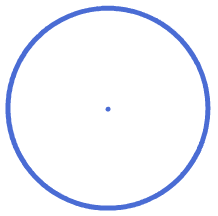 |
| *Thủ tục Cung tròn biến thiên theo góc và bước đi* | *Vẽ cung đủ 360° tạo thành vòng tròn khép kín* |

### 3.2. Bảng tra cứu các cung tròn cơ bản theo độ góc

| Tên cung tròn | Hình vẽ minh họa | Số độ góc ở tâm | Số lần lặp trong Scratch | Góc xoay mỗi bước | Ứng dụng thực tế |
|---|:---:|:---:|:---:|:---:|---|
| **Cung $45^\circ$** |  | $45^\circ$ | `lặp lại (45) lần` | $1^\circ$ | Cánh hoa thon nhọn, lá cây mảnh mai |
| **Cung $90^\circ$** |  | $90^\circ$ | `lặp lại (90) lần` | $1^\circ$ | Mảnh ghép cấu tạo cánh hoa mắt ngọc chuẩn |
| **Cung $180^\circ$** |  | $180^\circ$ | `lặp lại (180) lần` | $1^\circ$ | Cầu vồng 7 sắc, cây quạt nan, vòm cổng |
| **Cung $360^\circ$** |  | $360^\circ$ | `lặp lại (360) lần` | $1^\circ$ | Đường tròn khép kín trọn vẹn |

### 3.3. Ứng dụng cung tròn: Hình vuông lượn 4 góc nhọn (Ví dụ 6)
Một bài toán ứng dụng kinh điển kết hợp giữa đoạn thẳng và cung tròn: Vẽ một hình vuông lớn màu xanh bao bọc, bên trong là 4 cung tròn $90^\circ$ uốn cong màu đỏ tạo hình ngôi sao 4 cánh lõm:

| Khối lệnh giải Ví dụ 6 | Hình vuông lượn góc cung tròn thực tế |
|:---:|:---:|
| 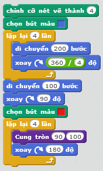 | 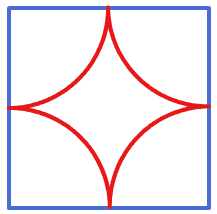 |
| *Vòng lặp 4 lần vẽ cạnh vuông xanh và cung cong đỏ* | *Hình vuông 4 cạnh kết hợp 4 cung tròn uốn cong mềm mại* |

### 3.4. Kỹ thuật vẽ Cây quạt nan đổi màu (Ví dụ 7)
Một bài toán ứng dụng kết hợp cung tròn vô cùng sinh động là **Cây quạt nan**:

- Phần nan quạt bên trong: Nhân vật đứng tại cán quạt (tâm), đi tới $150$ bước vẽ nan quạt rồi lùi về, liên tục đổi màu sắc tạo nên dải màu rực rỡ.

- Phần viền quạt bên ngoài: Vẽ một đường cung tròn bán kính $155$ bao bọc lấy toàn bộ các nan quạt.

| Hình ảnh Cây quạt nan | Khối lệnh lập trình Scratch chi tiết |
|:---:|:---:|
| 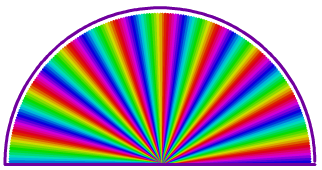 | 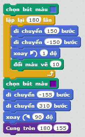 |
| *Cây quạt nan bán kính 150 viền tím ngoài* | *Cụm lệnh kết hợp xoay nan quạt và viền cung tròn ngoài* |

### 3.5. Kỹ thuật vẽ Cầu vồng 7 sắc và Cánh cung $180^\circ$ (Câu 15 và Câu 17)

- **Cầu vồng 7 sắc:** Gồm $7$ cung tròn $180^\circ$ lồng nhau từ ngoài vào trong: Đỏ, Cam, Vàng, Xanh lá, Xanh dương nhạt, Xanh dương đậm, Tím với nét vẽ đậm ($12$).

- **Cánh cung xoay:** Tạo mảnh ghép cung tròn $180^\circ$ bán kính $50$, sau đó xoay quanh tâm $12$ lần để tạo hoa văn cánh quạt xoay vòng lộng lẫy.

| Cầu vồng 7 sắc lồng nhau | Hoa văn 12 cánh cung 180° |
|:---:|:---:|
|  |  |
| *7 cung tròn 180° lồng nhau* | *12 cánh cung 180° xoay quanh tâm* |

---

## 4. Kỹ thuật ghép cánh hoa mắt ngọc (Petal)

**Cánh hoa mắt ngọc** là mảnh ghép nghệ thuật quan trọng bậc nhất trong lập trình vẽ đồ họa Scratch.

### Bản chất hình học của cánh hoa
Một cánh hoa cong đối xứng được ghép từ **hai cung tròn $90^\circ$ uốn ngược chiều nhau**:

1. Cung thứ nhất: Vẽ cung $90^\circ$ uốn cong sang một bên (`ve_cung_tron 90 buoc`).

2. Tại đỉnh cánh hoa: Nhân vật xoay góc bù $180^\circ - 90^\circ = 90^\circ$ (`xoay phải 90 độ`) để quay đầu theo hướng cong ngược lại.

3. Cung thứ hai: Vẽ tiếp cung $90^\circ$ để uốn cong khép kín trở về gốc ban đầu.

4. Tại gốc cánh hoa: Xoay tiếp $90^\circ$ để đưa nhân vật về đúng hướng xuất phát ban đầu.

| Mảnh ghép 1 cánh hoa đơn lẻ | Khối lệnh tạo mảnh ghép Cánh hoa |
|:---:|:---:|
|  |  |
| *Cánh hoa đơn lẻ gồm 2 cung 90° uốn cong đối xứng* | *Thủ tục ve_canh_hoa lặp 2 lần [ve_cung_tron 90, xoay 90°]* |

---

## 5. Nghệ thuật đối xứng tâm: Vẽ đóa hoa và hoa văn trang trí

Sau khi đã tạo xong chiếc khuôn thủ tục `ve_canh_hoa`, chúng ta có thể vẽ những đóa hoa $K$ cánh lộng lẫy bằng cách xoay quanh tâm sân khấu:

| Bông hoa 8 cánh đa sắc | Khối lệnh điều khiển bông hoa 8 cánh |
|:---:|:---:|
|  |  |
| *Bông hoa 8 cánh xoay quanh tâm* | *Vòng lặp 8 lần kết hợp đổi màu bút vẽ sau mỗi cánh* |

### Bảng tra cứu các hoa văn đối xứng tâm kinh điển

| Mẫu hoa văn | Hình ảnh thực tế | Số cánh / nhánh ($K$) | Góc xoay quanh tâm | Kỹ thuật kết hợp |
|---|:---:|:---:|:---:|---|
| **Hoa chong chóng** |  | $8$ cánh | $360^\circ / 8 = 45^\circ$ | Cánh nhọn đa giác kết hợp xoay tâm |
| **Logo Olympic** |  | $5$ vòng tròn | — | $5$ hình tròn bán kính $40$, nét vẽ $10$, lồng so le 2 hàng màu sắc |
| **Hoa nan tròn** | 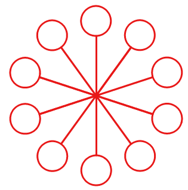 | $10$ nhánh | $360^\circ / 10 = 36^\circ$ | Nhánh thẳng kết hợp hình tròn ở đầu |
| **Đóa hoa đa sắc** |  | $8$ hoặc $12$ cánh | $360^\circ / K$ | Cánh hoa $90^\circ$ kết hợp `thay đổi màu bút vẽ một lượng (15)` |

---

## 6. Chuyên đề đặc biệt: Kỹ thuật tô màu hình học (Shape Filling)

Trong các bài tập vẽ hình, bên cạnh vẽ viền ngoài, chúng ta thường gặp yêu cầu: *"Vẽ hình tam giác tô màu đặc"*, *"Vẽ hình chữ nhật tô màu đặc"*, *"Vẽ hình tròn tô màu đặc"*. Do Scratch không có công cụ "đổ thùng sơn" tự động, chúng ta dùng tư duy thuật toán để tô kín hình:

### 6.1. Thuật toán tô màu đa giác bằng biến chạy thu nhỏ dần
Để tô kín một hình đa giác (tam giác đều, hình vuông, ngũ giác...):

1. Khởi tạo một biến số mang tên `Cạnh` bằng kích thước ban đầu (ví dụ $100$).

2. Vòng lặp: Lặp lại liên tục trong khi `Cạnh > 0`:
   - Vẽ một hình đa giác với độ dài `Cạnh` hiện tại.
   - Giảm `Cạnh` đi $1$ hoặc $2$ bước (`thay đổi [Cạnh] một lượng (-1)`).
   - Tiếp tục vẽ lặp lại cho đến khi hình thu nhỏ dần về $0$ $\implies$ Toàn bộ lòng hình được tô kín hoàn toàn!

### 6.2. Thuật toán tô màu hình chữ nhật bằng kỹ thuật quét đường thẳng (Scanline)
Để tô kín một hình chữ nhật kích thước rộng $\times$ dài:

- Cho nhân vật đi tới $100$ bước vẽ nét ngang thứ nhất, rồi đi lùi về $-100$ bước.

- Nhích sang ngang $1$ bước.

- Lặp lại $200$ lần quét để tô kín toàn bộ bề mặt hình chữ nhật!

| Khối lệnh tô màu quét ngang Chữ nhật | Khối lệnh tô màu Hình tròn quét 360 tia |
|:---:|:---:|
| 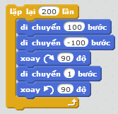 | 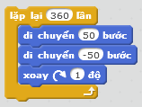 |
| *Lặp 200 lần: quét ngang 100 bước rồi nhích 1 bước* | *Lặp 360 lần: quét nan hoa 50 bước từ tâm rồi xoay 1 độ* |

### 6.3. Bảng tổng hợp kết quả các hình được tô màu đặc thực tế

| Tam giác đặc (Cạnh giảm dần) | Hình chữ nhật đặc (Quét ngang) | Hình tròn đặc (Quét nan hoa) | Ngôi sao đặc (Nét quét) |
|:---:|:---:|:---:|:---:|
|  |  | 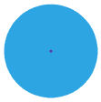 |  |
| *Tam giác xanh đặc ruột* | *Chữ nhật đỏ đặc ruột* | *Hình tròn lam có chấm tâm* | *Ngôi sao vàng đặc ruột* |

---

## 7. Bảng mô phỏng từng bước vẽ 1 cánh hoa 2 cung $90^\circ$ (Dry run)

Mô phỏng quy trình vẽ cánh hoa mắt ngọc bán kính $R = 50$:

| Bước | Hành động | Hướng quay | Kết quả đạt được |
|:---:|---|:---:|---|
| **1** | Bắt đầu tại gốc $(0, 0)$, hướng $90^\circ$ | — | Chuẩn bị vẽ cung thứ nhất |
| **2** | Lặp 90 lần: `di chuyển (0.87) bước`, `xoay phải 1 độ` | Xoay từ $90^\circ \to 180^\circ$ | Vẽ xong nửa cánh hoa thứ nhất, đến đỉnh cánh |
| **3** | Tại đỉnh: `xoay phải ↻ 90 độ` | Xoay từ $180^\circ \to 270^\circ$ | Quay đầu ngược lại để vẽ cung khép kín |
| **4** | Lặp 90 lần: `di chuyển (0.87) bước`, `xoay phải 1 độ` | Xoay từ $270^\circ \to 360^\circ$ ($0^\circ$) | Vẽ xong nửa cánh hoa thứ hai, về lại gốc $(0, 0)$ |
| **5** | Tại gốc: `xoay phải ↻ 90 độ` | Xoay từ $0^\circ \to 90^\circ$ | Trả lại hướng ban đầu, sẵn sàng xoay tâm vẽ cánh tiếp theo |

---

## 8. Các bẫy lỗi thường gặp (Bug Traps)

> **Bẫy 1: Bước đi quá lớn làm hình tròn vỡ góc và tràn khỏi sân khấu**
> - *Hiện tượng:* Học sinh đặt `di chuyển (10) bước` trong vòng lặp 360 lần.
> - *Hậu quả:* Chu vi lên tới $3600$ bước (quá lớn so với sân khấu rộng $480$ bước), nhân vật bị kẹt vào mép viền và hình vẽ bị méo mó.
> - *Khắc phục:* Luôn dùng công thức tính bước đi nhỏ ($< 2$ bước) phù hợp với bán kính $R$.

> **Bẫy 2: Quên góc xoay $90^\circ$ tại đỉnh khi ghép cánh hoa**
> - *Hiện tượng:* Vẽ xong cung 1 lập tức vẽ cung 2.
> - *Hậu quả:* Nhân vật tiếp tục uốn cong tạo thành hình tròn chứ không tạo ra chóp nhọn của cánh hoa!
> - *Khắc phục:* Phải có lệnh `xoay phải ↻ (180 - số_độ_cung) độ` giữa hai cung.

---

## 9. Bộ câu hỏi trắc nghiệm củng cố (Concept Quizzes)

#### Câu 1
Muốn vẽ một hình tròn hoàn chỉnh bằng cách đi men theo đường viền, nhân vật cần lặp lại bao nhiêu lần nếu mỗi lần xoay $1^\circ$?

- A. 90 lần

- B. 180 lần

- C. 360 lần *(Đáp án đúng: đủ 360 độ 1 vòng tròn)*

- D. 100 lần

#### Câu 2
Nếu muốn vẽ một cung tròn $180^\circ$ (nửa hình tròn), ta cho vòng lặp chạy bao nhiêu lần (mỗi lần xoay $1^\circ$)?

- A. 90 lần

- B. 180 lần *(Đáp án đúng)*

- C. 270 lần

- D. 360 lần

#### Câu 3
Một cánh hoa mắt ngọc chuẩn được ghép từ mấy cung tròn đối xứng nhau?

- A. 1 cung tròn

- B. 2 cung tròn *(Đáp án đúng: 2 cung uốn ngược chiều nhau)*

- C. 3 cung tròn

- D. 4 cung tròn

#### Câu 4
Khi vẽ một bông hoa gồm 6 cánh phân bố đều quanh tâm, sau khi vẽ xong một cánh và trở về tâm, nhân vật cần xoay một góc bao nhiêu độ?

- A. $90^\circ$

- B. $45^\circ$

- C. $60^\circ$ *(Đáp án đúng: $360 / 6 = 60$ độ)*

- D. $30^\circ$

#### Câu 5
Khối lệnh nào sau đây vẽ ra một vòm cầu vồng (cung tròn $180^\circ$)?

- A. `lặp lại (90) lần { di chuyển 1 bước, xoay phải 1 độ }`

- B. `lặp lại (180) lần { di chuyển 1 bước, xoay phải 1 độ }` *(Đáp án đúng)*

- C. `lặp lại (360) lần { di chuyển 1 bước, xoay phải 1 độ }`

- D. `lặp lại (4) lần { di chuyển 100 bước, xoay phải 90 độ }`

#### Câu 6
Trong biểu tượng 5 vòng tròn Olympic, hàng phía trên gồm bao nhiêu vòng tròn?

- A. 2 vòng tròn

- B. 3 vòng tròn *(Đáp án đúng: Xanh da trời, Đen, Đỏ)*

- C. 4 vòng tròn

- D. 5 vòng tròn

#### Câu 7
Cách đơn giản nhất để tạo ra một hình tròn đặc ruột có bán kính $R = 50$ trong Scratch là gì?

- A. Đặt kích thước bút vẽ bằng 100 rồi hạ bút và nhấc bút tại một chỗ *(Đáp án đúng: đường kính 2*R)*

- B. Lặp 360 lần đi 50 bước

- C. Vẽ 100 hình vuông lồng nhau

- D. Dùng lệnh xóa tất cả

#### Câu 8
Muốn tạo ra hiệu ứng bông hoa nở rộ với các cánh có màu sắc khác nhau, ta đặt lệnh nào ngay sau mỗi lần vẽ xong 1 cánh hoa?

- A. `đổi màu bút một lượng (15)` *(Đáp án đúng)*

- B. `xóa tất cả`

- C. `nhấc bút`

- D. `đặt kích thước bút vẽ bằng (1)`

#### Câu 9
Tại đỉnh của cánh hoa tạo bởi hai cung $90^\circ$, góc quay đổi chiều của nhân vật bằng bao nhiêu độ?

- A. $45^\circ$

- B. $60^\circ$

- C. $90^\circ$ *(Đáp án đúng: $180 - 90 = 90$ độ)*

- D. $180^\circ$

#### Câu 10
Khi vẽ một tia nan hoa từ tâm tỏa ra mép (đi tới $R$ bước), để đưa đầu bút trở về lại đúng tâm mà không đổi hướng nhìn của nhân vật, thao tác chuẩn xác nhất là:

- A. Xoay 180 độ rồi nhấc bút

- B. Đi lùi lại $-R$ bước (hoặc `di chuyển (-1 * R) bước`) dọc theo đúng đường thẳng vừa đi ra *(Đáp án đúng)*

- C. Dùng lệnh xóa tất cả

- D. Đi tới vị trí ngẫu nhiên

