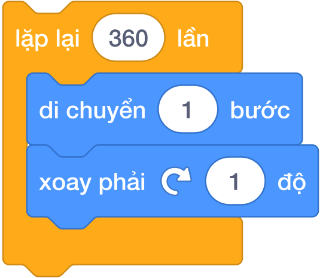
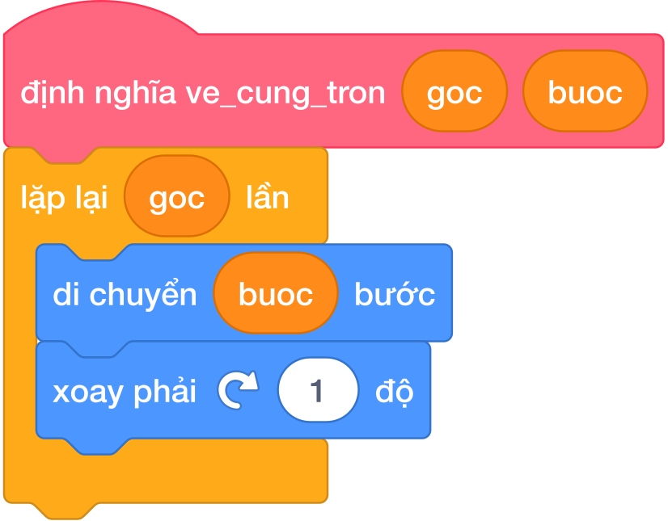
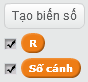
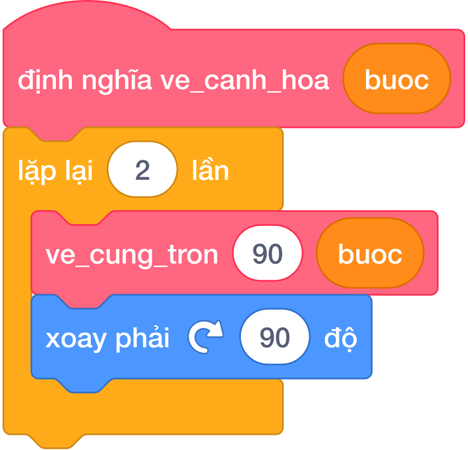
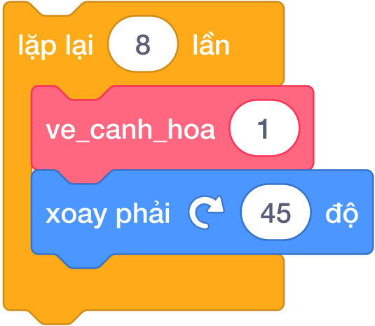

# Bài 02: HÌNH TRÒN, CUNG TRÒN & NGHỆ THUẬT HOA VĂN

## 1. Khởi Động: Từ Đa Giác Đều Đến Đường Cong Mềm Mại

Ở Bài 01, chúng ta đã khám phá công thức vẽ các hình đa giác đều:

- Tam giác đều ($3$ cạnh): Xoay ngoài $360^\circ / 3 = 120^\circ$.
- Hình vuông ($4$ cạnh): Xoay ngoài $360^\circ / 4 = 90^\circ$.
- Lục giác đều ($6$ cạnh): Xoay ngoài $360^\circ / 6 = 60^\circ$.
- Bát giác đều ($8$ cạnh): Xoay ngoài $360^\circ / 8 = 45^\circ$.

> 💡 **Quan sát thú vị:**
> Khi số cạnh $N$ càng lớn (10 cạnh, 20 cạnh, 50 cạnh...), các góc nhọn của đa giác phẳng dần ra và hình dáng tổng thể ngày càng tròn trịa, uốn lượn mềm mại như một quả bóng!

Nếu ta tăng số cạnh lên đúng **$360$ cạnh**, mỗi bước nhân vật chỉ bước một đoạn cực ngắn rồi xoay phải đúng $1^\circ$. Bắt mắt người nhìn, $360$ đoạn thẳng tí hon ghép lại sẽ tạo thành một **đường tròn hoàn hảo tuyệt đối**!

---

## 2. Công Thức Vẽ Hình Tròn 360 Cạnh

### 2.1. Kịch bản cơ bản 360 lần lặp
Khối lệnh căn bản nhất để vẽ một đường tròn khép kín trong Scratch:

*Quy trình thực hiện:*

- 🟠 **Lặp lại (360) lần**:

  - 🔵 `di chuyển (1) bước`
  - 🔵 `xoay phải ↻ (1) độ`

Tổng góc xoay sau 360 lần lặp là $360 \times 1^\circ = 360^\circ$ (tròn vẹn 1 vòng), nhân vật quay trở lại đúng vị trí và hướng xuất phát ban đầu.

---

### 2.2. Công thức toán học: Mối quan hệ giữa Bán kính $R$ và Bước đi
Trong hình học:

- Chu vi hình tròn: $C = 2 \times \pi \times R \approx 2 \times 3.14 \times R = 6.28 \times R$.
- Vì hình tròn gồm $360$ bước nhỏ ghép lại, độ dài mỗi bước đi của nhân vật tương ứng với $1^\circ$ là:
  $$\text{Bước đi} = \frac{C}{360} = \frac{2 \times 3.14 \times R}{360}$$

### Bảng Tra Cứu Bước Đi Cho Các Bán Kính Chuẩn
| Bán kính ($R$) | Chu vi ước tính ($C$) | Công thức tính bước đi | Chiều dài bước đi (`di chuyển`) | Lưu ý hiển thị |
|:---:|:---:|:---:|:---:|---|
| **$R = 30$** (Nhỏ) | $\approx 188.4$ | $188.4 / 360$ | $\approx 0.52$ bước | Vừa vặn vẽ logo hoặc mắt nhân vật |
| **$R = 50$** (Vừa) | $\approx 314$ | $314 / 360$ | $\approx 0.87$ bước | Rất thích hợp làm cánh hoa, logo Olympic |
| **$R = 60$** (Chuẩn) | $\approx 376.8$ | $376.8 / 360$ | $\approx 1.05$ bước | Có thể làm tròn thành $1$ bước |
| **$R = 100$** (Lớn) | $\approx 628$ | $628 / 360$ | $\approx 1.74$ bước | Chiếm gần nửa chiều cao sân khấu |

---

## 3. Kỹ Thuật Vẽ Cung Tròn (Arc) Bất Kỳ

Một **cung tròn** là một phần của đường tròn. Số độ của cung tròn chính là góc mở ở tâm:

- Cung $90^\circ$: Bằng $\frac{1}{4}$ đường tròn (góc vuông).
- Cung $180^\circ$: Bằng $\frac{1}{2}$ đường tròn (nửa hình tròn / cầu vồng).
- Cung $60^\circ$: Bằng $\frac{1}{6}$ đường tròn.

### Quy tắc vàng vẽ Cung tròn:
> **Muốn vẽ cung tròn có góc mở bao nhiêu độ, chỉ cần cho nhân vật `lặp lại () lần` đúng bấy nhiêu lần!**

Để tái sử dụng linh hoạt, ta đóng gói cụm lệnh này vào một **Khối của tôi (My Blocks)** mang tên `ve_cung_tron` với 2 tham số: `goc` và `buoc`:

*Cấu trúc khối lệnh:*
- 🔴 **định nghĩa ve_cung_tron (goc) (buoc)**:

  - 🟠 `lặp lại (goc) lần`:

    - 🔵 `di chuyển (buoc) bước`
    - 🔵 `xoay phải ↻ (1) độ`

---

## 4. Kỹ Thuật Ghép Cánh Hoa Mắt Ngọc (Petal)

Làm sao để vẽ được một chiếc cánh hoa uốn cong duyên dáng?  
Bí quyết nằm ở chỗ: **Một chiếc cánh hoa được tạo bởi $2$ cung tròn uốn ngược nhau khép kín tại 2 đầu đỉnh nhọn**.

### Các bước tạo cánh hoa góc $90^\circ$:

1. Vẽ cung tròn thứ nhất $90^\circ$: Gọi `ve_cung_tron (90) (buoc)`.

2. Tại đỉnh nhọn trên cùng, nhân vật cần quay một góc bù để quay mặt hướng về điểm xuất phát:
   $$\text{Góc xoay đỉnh} = 180^\circ - 90^\circ = 90^\circ$$

3. Vẽ tiếp cung tròn thứ hai $90^\circ$: Gọi `ve_cung_tron (90) (buoc)`.

4. Tại đỉnh nhọn dưới cùng, nhân vật lại xoay phải $90^\circ$ để trở lại hướng ban đầu.

Vì hai bước này lặp lại y hệt nhau, ta gom gọn bằng một vòng lặp `lặp lại 2 lần`:

*Cấu trúc khối lệnh:*
- 🔴 **định nghĩa ve_canh_hoa (buoc)**:

  - 🟠 `lặp lại (2) lần`:

    - 🔴 `ve_cung_tron (90) (buoc)`
    - 🔵 `xoay phải ↻ (90) độ`

---

## 5. Nghệ Thuật Đối Xứng Tâm: Vẽ Bông Hoa & Hoa Văn

Khi đã sở hữu khối lệnh `ve_canh_hoa`, ta có thể tạo ra vô số kiệt tác hoa văn lung linh chỉ bằng cách **xoay quanh một tâm cố định**.

### Công Thức Góc Xoay Tâm
Nếu muốn vẽ một bông hoa gồm $K$ cánh tỏa đều ra $360^\circ$ quanh tâm, sau mỗi lần vẽ xong một cánh hoa, nhân vật cần xoay tâm một góc:
$$\text{Góc xoay tâm} = \frac{360^\circ}{K}$$

### Bảng Tra Cứu Hoa Văn Đối Xứng
| Tên hình vẽ | Số cánh ($K$) | Số lần lặp | Góc xoay tâm (`xoay phải ↻`) | Hình mẫu thực tế |
|---|:---:|:---:|:---:|:---:|
| **Cỏ 4 lá** | $4$ | `lặp lại (4) lần` | $360 / 4 = 90^\circ$ | Nở vuông vức 4 hướng |
| **Hoa huệ 6 cánh** | $6$ | `lặp lại (6) lần` | $360 / 6 = 60^\circ$ | Cân đối lục giác |
| **Bông hoa 8 cánh** | $8$ | `lặp lại (8) lần` | $360 / 8 = 45^\circ$ | Bông cúc họa mi |
| **Hoa hướng dương 12 cánh** | $12$ | `lặp lại (12) lần` | $360 / 12 = 30^\circ$ | Các cánh xếp đan khít |
| **Mạn đà la 36 cánh** | $36$ | `lặp lại (36) lần` | $360 / 36 = 10^\circ$ | Vòng xoáy ảo diệu |

---

## 6. Bảng Mô Phỏng Từng Bước (Dry Run Table)

Dưới đây là bảng trace vết di chuyển của nhân vật khi thực hiện khối lệnh `ve_canh_hoa` (gồm 2 cung $90^\circ$, mỗi bước $1$ pixel), xuất phát từ $(0, 0)$ hướng $0^\circ$ (hướng lên trên):

| Giai đoạn | Thao tác lệnh | Tọa độ sau giai đoạn ($x, y$) | Hướng sau giai đoạn | Nét vẽ xuất hiện |
|:---:|---|:---:|:---:|---|
| **Bắt đầu** | Đặt bút tại gốc tọa độ | $(0, 0)$ | $0^\circ$ (Lên) | Đầu nhọn phía dưới của cánh hoa |
| **Nửa cánh 1** | `ve_cung_tron (90) (1)` | $\approx (57, 57)$ | $90^\circ$ (Phải) | Cung tròn thứ nhất uốn cong sang phải |
| **Đổi hướng 1** | `xoay phải ↻ (90) độ` | $(57, 57)$ | $180^\circ$ (Xuống) | Chuẩn bị uốn cong quay về tâm |
| **Nửa cánh 2** | `ve_cung_tron (90) (1)` | $(0, 0)$ | $-90^\circ$ (Trái) | Cung tròn thứ hai uốn cong khép về gốc $(0, 0)$ |
| **Đổi hướng 2** | `xoay phải ↻ (90) độ` | $(0, 0)$ | $0^\circ$ (Lên) | Trở lại đúng hướng xuất phát ban đầu |

> **Nhận xét then chốt:** Sau khi vẽ xong 1 cánh hoa, nhân vật quay về **chính xác vị trí xuất phát $(0, 0)$** và giữ nguyên hướng nhìn ban đầu. Nhờ tính bất biến này, ta có thể thoải mái lặp vòng xoay tâm mà không bao giờ bị lệch tâm hoa!

---

## 7. Tử Huyệt & Bẫy Lỗi Kinh Điển (Bug Traps)

> **Bẫy 1: Bán kính quá lớn làm vỡ góc tại mép sân khấu**
> - *Hiện tượng:* Chọn bán kính $R = 150$, khi nhân vật chạy đến mép sân khấu thì bị khựng lại, đường tròn bị bẹp một bên hoặc góc quay bị méo mó.
> - *Khắc phục:* Luôn nhớ sân khấu Scratch có chiều cao tối đa $360$ bước (từ $-180$ đến $+180$). Bán kính vẽ đường tròn hoặc cánh hoa nên giới hạn từ $R = 20$ đến $R = 70$.

> **Bẫy 2: Nhầm lẫn giữa góc cung $\alpha$ và góc xoay đỉnh**
> - *Hiện tượng:* Vẽ cung tròn $60^\circ$ nhưng ở đỉnh lại xoay $60^\circ$ khiến 2 cung tròn bị tẽ ra hai hướng như chiếc sừng hươu thay vì khép lại thành cánh hoa.
> - *Khắc phục:* Ghi nhớ công thức góc bù đỉnh:  
>   $$\text{Góc xoay đỉnh} = 180^\circ - \text{Góc cung}$$
>   (Ví dụ: Cung $90^\circ$ thì xoay đỉnh $90^\circ$; Cung $60^\circ$ thì xoay đỉnh $180 - 60 = 120^\circ$).

> **Bẫy 3: Quên nhấc bút khi vẽ các hình tách rời (Logo Olympic)**
> - *Hiện tượng:* Vẽ xong vòng tròn màu xanh, chạy sang vị trí mới để vẽ vòng màu vàng thì để lại một vệt mực nối chéo màn hình.
> - *Khắc phục:* Thuộc lòng câu khẩu quyết: **"Nhấc bút (`nhấc bút`) $\to$ Đi tới tọa độ mới $\to$ Đặt hướng $\to$ Đặt bút (`đặt bút`)"**.

---

## 8. Concept Quiz (10 Câu Trắc Nghiệm Trực Quan)

#### Câu 1 (Bản chất hình tròn Scratch)
Trong Scratch, một đường tròn khép kín được tạo ra bằng cách nào?
- A. Dùng một câu lệnh đặc biệt có tên là `draw circle`.
- B. Lặp lại 360 lần: Mỗi lần đi một đoạn ngắn rồi xoay phải đúng $1^\circ$.
- C. Đổi kích thước của chú Mèo thành hình tròn.
- D. Bấm chuột 360 lần liên tiếp vào lá cờ xanh.
> **Đáp án:** B  
> **Giải thích:** Scratch không có lệnh vẽ hình tròn sẵn, mà xấp xỉ hình tròn bằng đa giác đều 360 cạnh tí hon.

#### Câu 2 (Tổng góc xoay)
Khi vẽ xong một hình tròn trọn vẹn, nhân vật đã xoay tổng cộng một góc bao nhiêu độ?
- A. $90^\circ$
- B. $180^\circ$
- C. $270^\circ$
- D. $360^\circ$
> **Đáp án:** D  
> **Giải thích:** Một vòng tròn khép kín luôn có tổng số góc xoay là $360^\circ$.

#### Câu 3 (Độ dài cung tròn)
Nếu muốn vẽ một nửa đường tròn (cung $180^\circ$ hình cầu vồng), trong khối lệnh ta cần thiết lập số lần lặp là bao nhiêu?
- A. `lặp lại (90) lần`
- B. `lặp lại (180) lần`
- C. `lặp lại (360) lần`
- D. `lặp lại (45) lần`
> **Đáp án:** B  
> **Giải thích:** Mỗi lần lặp nhân vật xoay $1^\circ$. Để quay đủ nửa vòng tròn ($180^\circ$), cần lặp lại đúng $180$ lần.

#### Câu 4 (Công thức bước đi)
Đoạn code nào dưới đây tính toán đúng độ dài bước đi vi phân cho hình tròn có bán kính $R$?
- A. `(2 * R) / 360`
- B. `(2 * 3.14 * R) / 360`
- C. `(3.14 * R) / 180`
- D. Cả B và C đều đúng
> **Đáp án:** D  
> **Giải thích:** Chu vi $C = 2 \times 3.14 \times R$. Bước đi cho $1^\circ$ là $C / 360 = (2 \times 3.14 \times R) / 360 = (3.14 \times R) / 180$. Cả hai cách viết đều cho kết quả chính xác.

#### Câu 5 (Cấu tạo cánh hoa)
Một cánh hoa mắt ngọc được tạo thành bởi:

- A. 4 đoạn thẳng khép kín.
- B. 2 cung tròn uốn cong đối xứng nhau khép kín tại 2 đầu đỉnh.
- C. 1 hình tròn và 1 hình tam giác.
- D. 2 hình vuông lồng nhau.
> **Đáp án:** B  
> **Giải thích:** Cánh hoa cơ bản được tạo bởi 2 cung tròn (thường là $90^\circ$ hoặc $60^\circ$) ghép nối tại 2 đỉnh nhọn.

#### Câu 6 (Góc xoay đỉnh cánh hoa)
Nếu mỗi cung tròn của cánh hoa có góc mở là $60^\circ$, thì khi vẽ xong cung thứ nhất, nhân vật cần xoay phải một góc bao nhiêu độ tại đỉnh nhọn để quay đầu vẽ cung thứ hai?
- A. $60^\circ$
- B. $90^\circ$
- C. $120^\circ$
- D. $180^\circ$
> **Đáp án:** C  
> **Giải thích:** Áp dụng công thức góc bù đỉnh: $180^\circ - 60^\circ = 120^\circ$.

#### Câu 7 (Bông hoa 8 cánh)
Muốn vẽ một bông hoa gồm 8 cánh tỏa đều quanh tâm, sau khi vẽ xong mỗi cánh hoa, nhân vật cần xoay tâm một góc bao nhiêu độ?
- A. $30^\circ$
- B. $45^\circ$
- C. $60^\circ$
- D. $90^\circ$
> **Đáp án:** B  
> **Giải thích:** Công thức góc xoay tâm: $360^\circ / 8 = 45^\circ$.

#### Câu 8 (Phân tích khối lệnh)
Đoạn khối lệnh sau đây thực hiện chức năng gì?

- A. Vẽ một hình tròn hoàn chỉnh.
- B. Vẽ một chiếc cánh hoa gồm 2 cung tròn $90^\circ$.
- C. Vẽ một hình vuông góc tròn.
- D. Xóa sạch màn hình sân khấu.
> **Đáp án:** B  
> **Giải thích:** Đây là khối tự tạo `ve_canh_hoa` với 2 lần lặp: vẽ cung $90^\circ$ và xoay đỉnh $90^\circ$.

#### Câu 9 (Logo 5 vòng tròn Olympic)
Logo Olympic gồm 5 vòng tròn lồng nhau: 3 vòng hàng trên (Xanh dương, Đen, Đỏ) và 2 vòng hàng dưới (Vàng, Xanh lá). Khi chuyển từ vòng tròn này sang vòng tròn khác, thao tác nào là BẮT BUỘC?
- A. Bấm phím cách (Space).
- B. Đổi nhân vật sang chú gấu.
- C. 🟢 **Nhấc bút** trước khi di chuyển và 🟢 **Đặt bút** khi tới vị trí mới.
- D. Phải xóa toàn bộ màn hình rồi vẽ lại từ đầu.
> **Đáp án:** C  
> **Giải thích:** Nếu không nhấc bút trước khi di chuyển tọa độ, trên sân khấu sẽ bị dính vệt mực nối chéo xấu xí giữa các vòng tròn.

#### Câu 10 (Ứng dụng My Blocks)
Ưu điểm vượt trội của việc tạo khối `ve_cung_tron (goc) (buoc)` so với việc viết vòng lặp thủ công là gì?
- A. Giúp chương trình vẽ nhanh hơn gấp 10 lần.
- B. Chỉ cần định nghĩa một lần, có thể dùng lại để vẽ bất kỳ cung tròn nào ($60^\circ, 90^\circ, 180^\circ, 360^\circ$) với kích thước tùy ý mà không phải ghép lại từng khối lệnh.
- C. Tự động đổi màu bút vẽ mà không cần câu lệnh đổi màu.
- D. Giúp Scratch không bị nóng máy.
> **Đáp án:** B  
> **Giải thích:** Tham số hóa My Blocks mang lại khả năng tái sử dụng mã nguồn đỉnh cao, giúp kịch bản lập trình cực kỳ chuyên nghiệp và trong sáng.

---
