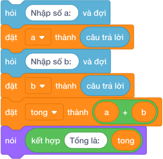
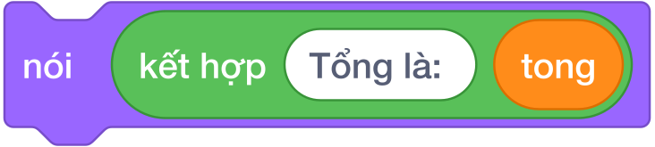
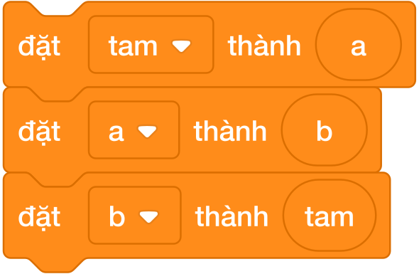

# Bài 03: LỆNH XUẤT NHẬP VÀ BIẾN SỐ TRONG SCRATCH

## 1. Bản chất chương trình máy tính và luồng dữ liệu vào - ra

Trong khoa học máy tính và lập trình, một chương trình thực chất là một chuỗi chỉ thị có trật tự điều khiển nhân vật biến đổi dữ liệu đầu vào thành kết quả đầu ra theo yêu cầu bài toán.

Mọi bài toán trong các kỳ thi lập trình Bảng A đều vận hành nghiêm ngặt theo **luồng dữ liệu 3 bước khép kín (Đầu vào $\to$ Xử lý $\to$ Đầu ra)**:

| Giai đoạn luồng dữ liệu | Thiết bị & Khối lệnh Scratch 3.0 | Vai trò trong chương trình |
|---|---|---|
| **1. Đầu vào (Input)** | Bàn phím $\longrightarrow$ `hỏi [Nhập dữ liệu] và đợi` | Đọc dữ liệu người dùng gõ vào ô `câu trả lời` |
| **2. Lưu trữ & Xử lý** | Biến số $\longrightarrow$ `đặt [biến v] thành (câu trả lời)` | Cất dữ liệu vào chiếc hộp dán nhãn để tính toán |
| **3. Đầu ra (Output)** | Sân khấu $\longrightarrow$ `nói (kết quả)` | Xuất kết quả cuối cùng ra màn hình cho người dùng quan sát |

1. **Đầu vào (Input):** Chú Mèo Scratch nhận dữ liệu từ bàn phím thông qua khối màu xanh lơ: `hỏi () và đợi`.

2. **Lưu trữ & Xử lý (Process):** Dữ liệu được cất giữ cẩn thận trong các **Biến số** (Variables). Các khối toán tử màu xanh lá thực hiện tính toán.

3. **Đầu ra (Output):** Xuất kết quả cuối cùng lên sân khấu thông qua khối màu tím: `nói ()`.

---

## 2. Kiểu dữ liệu trong Scratch

Trong Scratch, dữ liệu được phân thành 3 dạng chính rất trực quan:
- **Số (Number):** Dùng để tính toán cộng, trừ, nhân, chia (ví dụ: `10`, `3.14`, `-5`).
- **Chuỗi văn bản (String):** Dãy các ký tự hay từ ngữ đặt trong ô văn bản (ví dụ: `"Xin chao"`, `"IKH EDU"`).
- **Giá trị Đúng / Sai (Boolean):** Kết quả của các phép so sánh, nằm trong các ô góc nhọn hình lục giác (chỉ mang giá trị `true` hoặc `false`).

---

## 3. Lệnh nhập dữ liệu và biến `câu trả lời`

### 3.1. Cú pháp và cơ chế của khối `hỏi () và đợi`
Trong nhóm **Cảm biến (Sensing)** màu xanh lơ, Scratch cung cấp khối lệnh nhập dữ liệu chính thức:

Khi khối lệnh này chạy:

- Chú Mèo Scratch sẽ xuất hiện bong bóng câu hỏi kèm một thanh nhập văn bản ở cạnh đáy sân khấu.

- Toàn bộ chương trình **tạm dừng hoàn toàn** để đợi người dùng gõ phím.

- Khi người dùng bấm phím **Enter** hoặc nhấp chuột vào dấu tick xanh ✔, nội dung vừa gõ được tự động nạp vào khối tròn màu xanh lơ: `câu trả lời`.

### 3.2. Tử huyệt bẫy ghi đè biến `câu trả lời`
> **LỖI TỬ HUYỆT:**
> Biến `câu trả lời` là một biến tạm thời của hệ thống. Mỗi khi một khối `hỏi () và đợi` mới được kích hoạt, giá trị cũ trong `câu trả lời` **sẽ bị xóa sạch và ghi đè ngay lập tức**!
>
> Nếu viết:
> - Hỏi "Nhập số A:" và đợi
> - Hỏi "Nhập số B:" và đợi
> - Đặt tong thành `câu trả lời` + `câu trả lời`
>
> $\implies$ Kết quả hoàn toàn SAI vì lúc này cả hai `câu trả lời` đều mang giá trị của số B!

**Quy tắc bất biến:** Phải cất ngay `câu trả lời` vào một biến số riêng biệt trước khi gọi lệnh `hỏi` tiếp theo.

---

## 4. Khái Niệm Biến Số & Chiếc Hộp Dán Nhãn

Biến số giống như một chiếc hộp được dán nhãn tên ngoài vỏ dùng để cất giữ một giá trị:

- **Tạo biến số:** Trong nhóm **Các biến số (Variables)** màu cam đậm, bấm vào *Tạo một biến* và đặt tên gợi nhớ (ví dụ: `a`, `b`, `tong`, `chu_vi`).

- **Khối `đặt [biến v] thành ()`:** Dùng để gán giá trị ban đầu vào chiếc hộp.

- **Khối `thay đổi [biến v] một lượng ()`:** Dùng để tăng hoặc giảm giá trị hiện tại của chiếc hộp.

### Chương trình chuẩn mực nhập 2 số và in tổng:

Quy trình chuẩn 6 bước:

1. `hỏi [Nhập số a: ] và đợi`

2. `đặt [a v] thành (câu trả lời)`

3. `hỏi [Nhập số b: ] và đợi`

4. `đặt [b v] thành (câu trả lời)`

5. `đặt [tong v] thành ((a) + (b))`

6. `nói (kết hợp [Tổng là: ] (tong))`

---

## 5. Lệnh Xuất Dữ Liệu: Khối `nói ()` & Ghép Chuỗi

Trong nhóm **Hiển thị (Looks)** màu tím:

- **Khối `nói () trong () giây`:** Hiển thị bong bóng thoại trong khoảng thời gian định trước rồi biến mất.

- **Khối `nói ()` (không có thời gian):** Hiển thị kết quả vĩnh viễn trên màn hình cho đến khi có lệnh nói khác thay thế. Khi lập trình, **luôn ưu tiên dùng khối `nói ()` này** để ban giám khảo và hệ thống chấm nhìn thấy rõ kết quả.

### Kỹ thuật ghép chuỗi hiển thị:
Để hiển thị kết quả kèm lời dẫn hoặc in nhiều biến cùng lúc, ta dùng khối tròn màu xanh lá `kết hợp () và ()`:

---

## 6. Thuật Toán Hoán Đổi Hai Biến Số ($A \longleftrightarrow B$)

Giả sử có 2 chiếc cốc: Cốc $A$ đựng nước cam, Cốc $B$ đựng nước dâu. Làm thế nào để đổi nước dâu sang cốc $A$ và nước cam sang cốc $B$ mà không bị lẫn lộn?
$\implies$ Ta bắt buộc phải dùng thêm một **chiếc cốc phụ trung gian (biến `tam`)**!

Quy trình 3 bước vàng:

1. `đặt [tam v] thành (a)` *(Rót cam sang cốc tạm)*

2. `đặt [a v] thành (b)` *(Rót dâu sang cốc a)*

3. `đặt [b v] thành (tam)` *(Rót cam từ cốc tạm sang cốc b)*

---

## 7. Bảng mô phỏng Biến Thiên Ô Nhớ Từng Bước (Dry run)

Xét kịch bản nhập $A = 15$ và $B = 7$:

| Bước | Khối lệnh thực thi | Biến `a` | Biến `b` | Biến `tam` | Màn hình hiển thị |
|:---:|---|:---:|:---:|:---:|---|
| 1 | `đặt [a v] thành (15)` | **15** | Chưa có | Chưa có | |
| 2 | `đặt [b v] thành (7)` | 15 | **7** | Chưa có | |
| 3 | `đặt [tam v] thành (a)` | 15 | 7 | **15** | |
| 4 | `đặt [a v] thành (b)` | **7** | 7 | 15 | |
| 5 | `đặt [b v] thành (tam)` | 7 | **15** | 15 | |
| 6 | `nói (kết hợp (a) (kết hợp [ ] (b)))` | 7 | 15 | 15 | Mèo nói: `7 15` |

---

## 8. Các bẫy lỗi thường gặp (Bug Traps)

> **Bẫy 1: Không đặt biến trước khi hỏi lần tiếp theo**
> - *Hậu quả:* Mất sạch dữ liệu của lần nhập trước do `câu trả lời` bị ghi đè.
> - *Khắc phục:* Cứ sau mỗi lệnh `hỏi`, dòng tiếp theo bắt buộc phải là `đặt [tên_biến v] thành (câu trả lời)`.

> **Bẫy 2: Hoán đổi trực tiếp không dùng biến tạm**
> - *Sai lầm:* `đặt [a v] thành (b)` rồi ngay sau đó `đặt [b v] thành (a)`.
> - *Hậu quả:* Biến `a` bị mất giá trị ban đầu và cả hai chiếc hộp đều chứa giá trị của `b`!

> **Bẫy 3: Đặt tên biến không có nghĩa**
> - *Sai lầm:* Đặt tên biến là `x1`, `x2`, `abc`, `bien1`.
> - *Khắc phục:* Luôn đặt tên biến theo đúng ý nghĩa thực tế: `chieu_dai`, `chieu_rong`, `chu_vi`, `dien_tich`.

---

## 9. Bộ câu hỏi trắc nghiệm củng cố (Concept Quizzes)

1. **Khối lệnh nào trong Scratch dùng để nhận dữ liệu gõ từ bàn phím?**
   - A. `nói [] và đợi`
   - B. `hỏi [] và đợi` *(Đáp án đúng)*
   - C. `đặt [] thành ()`
   - D. `thay đổi [] một lượng ()`

2. **Dữ liệu người dùng vừa nhập xong sẽ được tự động cất vào khối tròn nào?**
   - A. `biến của tôi`
   - B. `kết hợp`
   - C. `câu trả lời` *(Đáp án đúng)*
   - D. `vị trí x`

3. **Khi thực thi hai lệnh `hỏi` liên tiếp mà không gán vào biến, giá trị của lần hỏi đầu tiên sẽ:**
   - A. Được lưu vào danh sách
   - B. Bị xóa và ghi đè bởi giá trị lần hỏi thứ hai *(Đáp án đúng)*
   - C. Tự động cộng dồn với lần thứ hai
   - D. Báo lỗi chương trình

4. **Để hoán đổi giá trị giữa 2 biến số $X$ và $Y$, ta cần ít nhất bao nhiêu biến phụ trung gian?**
   - A. 0 biến
   - B. 1 biến *(Đáp án đúng)*
   - C. 2 biến
   - D. 3 biến

5. **Muốn chú Mèo hiển thị dòng chữ kết quả cố định không biến mất, ta nên dùng khối nào?**
   - A. `nói [] trong (2) giây`
   - B. `nói []` *(Đáp án đúng)*
   - C. `nghĩ [] trong (2) giây`
   - D. `ẩn`

6. **Đoạn lệnh: `đặt [x v] thành 5`, `đặt [y v] thành 10`, `đặt [x v] thành (y)` sẽ cho giá trị cuối cùng của x là:**
   - A. 5
   - B. 10 *(Đáp án đúng)*
   - C. 15
   - D. 0

7. **Khối `kết hợp [Xin ] [chao]` sẽ tạo ra kết quả văn bản nào?**
   - A. `Xinchao` *(Đáp án đúng: vì không có dấu cách giữa 2 từ)*
   - B. `Xin chao`
   - C. `Xin`
   - D. `chao`

8. **Khi lập trình, lập trình, khi in kết quả bài toán tính tổng 2 số, chú Mèo nên nói gì?**
   - A. `nói [Tổng hai số là:]`
   - B. `nói (tong)` *(Đáp án đúng: in chính xác đáp số)*
   - C. `nói [Đáp số của bài toán =]`
   - D. `nói [Mời bạn xem kết quả]`

9. **Nếu người dùng nhập vào số âm `-25`, biến `câu trả lời` có nhận được số âm không?**
   - A. Không, Scratch chỉ nhận số dương
   - B. Có, nhận chính xác giá trị số âm `-25` *(Đáp án đúng)*
   - C. Báo lỗi cú pháp
   - D. Biến tự động đổi thành số 0

10. **Lệnh nào dùng để tăng giá trị của biến `diem` lên 5 đơn vị?**
    - A. `đặt [diem v] thành (5)`
    - B. `thay đổi [diem v] một lượng (5)` *(Đáp án đúng)*
    - C. `thay đổi [diem v] một lượng (-5)`
    - D. `đặt [diem v] thành (diem)`
