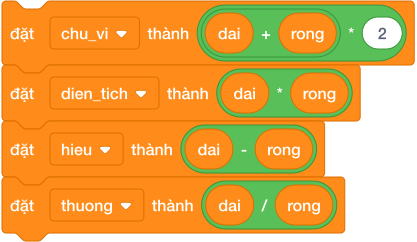

# Bài 04: Toán tử và biểu thức

## 1. Bốn Phép Toán Số Học Cơ Bản Trong Scratch

Trong nhóm **Các phép toán (Operators)** màu xanh lá cây, Scratch cung cấp các khối tròn cơ bản để tính toán:

| Khối toán tử Scratch | Tên gọi | Ví dụ minh họa | Kết quả | Ghi chú quan trọng |
|:---:|---|---|:---:|---|
| `() + ()` | Phép cộng | `(15) + (25)` | `40` | Cộng hai giá trị số |
| `() - ()` | Phép trừ | `(50) - (18)` | `32` | Trừ hai giá trị số |
| `() * ()` | Phép nhân | `(6) * (7)` | `42` | Dấu sao `*` là phép nhân |
| `() / ()` | Phép chia | `(9) / (2)` | `4.5` | Dấu gạch chéo `/` là phép chia |

---

## 2. Kỹ thuật lồng khối thay thế cho dấu ngoặc đơn `()`

Trong toán học viết tay, ta dùng dấu ngoặc đơn `( )` để chỉ định thứ tự ưu tiên tính toán (Ví dụ: $(Dài + Rộng) 	imes 2$).

**Trong Scratch không có phím ngoặc đơn!** Thay vào đó, Scratch sử dụng quy tắc **"Khối Lồng Khối"**:

- Khối nào được thả **vào bên trong** sẽ được máy tính tính toán trước.

- Kết quả của khối con bên trong sẽ trở thành giá trị đầu vào cho khối cha bên ngoài.

### Các bước lắp ráp công thức $(a + b) 	imes 2$:

1. Lấy khối `() * ()` đặt ra ngoài.

2. Ô thứ nhất của phép nhân: Thả khối `() + ()` vào trong.

3. Trong khối cộng: Thả biến `chieu_dai` và `chieu_rong`.

4. Ô thứ hai của phép nhân: Gõ con số `2`.

---

## 3. Bảng tra cứu các biểu thức hình học cơ bản

| Bài toán hình học | Công thức toán học | Biểu thức khối lệnh Scratch chuẩn |
|---|---|---|
| **Chu vi hình chữ nhật** | $C = (a + b) 	imes 2$ | `((a) + (b)) * (2)` |
| **Diện tích hình chữ nhật** | $S = a 	imes b$ | `(a) * (b)` |
| **Chu vi hình vuông** | $C = a 	imes 4$ | `(a) * (4)` |
| **Diện tích hình vuông** | $S = a 	imes a$ | `(a) * (a)` |
| **Diện tích tam giác vuông** | $S = \dfrac{a 	imes b}{2}$ | `((a) * (b)) / (2)` |
| **Diện tích hình thang** | $S = \dfrac{(a + b) 	imes h}{2}$ | `(((a) + (b)) * (h)) / (2)` |

---

## 4. Bảng mô phỏng tính biểu thức (Dry run)

Xét bài toán tính diện tích hình thang với đáy lớn $a = 8$, đáy nhỏ $b = 4$, chiều cao $h = 5$:
Công thức: $S = \dfrac{(a + b) 	imes h}{2}$.

| Bước tính | Biểu thức con được giải quyết | Phép tính cụ thể | Giá trị tạm thời |
|:---:|---|---|:---:|
| **Bước 1** | Khối cộng trong cùng: `(a) + (b)` | $8 + 4$ | **$12$** |
| **Bước 2** | Khối nhân ở giữa: `(kết_quả_1) * (h)` | $12 	imes 5$ | **$60$** |
| **Bước 3** | Khối chia ngoài cùng: `(kết_quả_2) / (2)` | $60 / 2$ | **$30$** |

$\implies$ Kết quả cuối cùng được gán vào biến `dien_tich` là **$30$**.

---

## 5. Các bẫy lỗi thường gặp (Bug Traps)

> **Bẫy 1: Thả nhầm vị trí khối con làm sai thứ tự ưu tiên**
> - *Sai lầm:* Thả `chieu_dai` vào trước, rồi thả `(chieu_rong) * (2)` phía sau.
> - *Biểu thức tạo ra:* $a + b 	imes 2$. Lúc này máy tính nhân trước cộng sau, kết quả sai hoàn toàn!
> - *Khắc phục:* Luôn kiểm tra kỹ hình dáng khối lồng bao quanh.

> **Bẫy 2: Nhầm lẫn giữa dấu gạch chia `/` và phép trừ `-`**
> - *Hiện tượng:* Nhìn nhầm khối trừ thành khối chia trong danh mục màu xanh lá.
> - *Khắc phục:* Quan sát ký hiệu phép toán ở giữa hai ô tròn.

> **Bẫy 3: Chia cho số 0 (Zero Division)**
> - *Hiện tượng:* Biến mẫu số nhận giá trị $0$.
> - *Hậu quả trong Scratch:* Khối chia cho 0 sẽ trả về `Infinity` (Vô cực), làm các phép toán tiếp theo bị hỏng toàn bộ!

---

## 6. Bộ câu hỏi trắc nghiệm củng cố (Concept Quizzes)

1. **Khối lệnh nào sau đây thực hiện phép tính $15 	imes 4$?**
   - A. `(15) + (4)`
   - B. `(15) * (4)` *(Đáp án đúng)*
   - C. `(15) / (4)`
   - D. `(15) - (4)`

2. **Muốn tính $A + B 	imes C$ đúng thứ tự ưu tiên toán học (nhân trước cộng sau), ta lồng khối như thế nào?**
   - A. Đặt khối cộng ra ngoài, khối nhân nằm ở ô thứ hai bên trong *(Đáp án đúng)*
   - B. Đặt khối nhân ra ngoài, khối cộng nằm ở ô thứ nhất bên trong
   - C. Đặt khối cộng và khối nhân ngang hàng
   - D. Scratch tự động thêm dấu ngoặc mà không cần lồng

3. **Biểu thức `((10) - (2)) * (3)` cho kết quả là:**
   - A. 4
   - B. 16
   - C. 24 *(Đáp án đúng: (10 - 2) = 8, 8 * 3 = 24)*
   - D. 28

4. **Để tính chu vi hình chữ nhật có hai cạnh là `dai` và `rong`, biểu thức nào sau đây ĐÚNG?**
   - A. `((dai) + (rong)) * (2)` *(Đáp án đúng)*
   - B. `(dai) + ((rong) * (2))`
   - C. `(dai) * (rong)`
   - D. `((dai) * (2)) + (rong)`

5. **Trong Scratch, kết quả của phép chia `(7) / (2)` là:**
   - A. 3
   - B. 3.5 *(Đáp án đúng)*
   - C. 4
   - D. 1

6. **Khối lệnh nào biểu diễn diện tích tam giác vuông có hai cạnh góc vuông `a` và `b`?**
   - A. `((a) * (b)) / (2)` *(Đáp án đúng)*
   - B. `((a) + (b)) / (2)`
   - C. `(a) * (b)`
   - D. `((a) * (b)) * (2)`

7. **Khi chia một số dương cho 0 trong Scratch, kết quả nhận được sẽ là chữ gì?**
   - A. Error
   - B. 0
   - C. Infinity *(Đáp án đúng: Vô cực)*
   - D. NaN

8. **Biểu thức `((20) / (4)) + ((3) * (2))` có giá trị là:**
   - A. 11 *(Đáp án đúng: 5 + 6 = 11)*
   - B. 16
   - C. 10
   - D. 8

9. **Nếu biến `canh = 5`, biểu thức `(canh) * (canh)` tính ra diện tích hình vuông là:**
   - A. 10
   - B. 20
   - C. 25 *(Đáp án đúng)*
   - D. 30

10. **Làm thế nào để lấy số đối của một biến `x` (tức là $-x$)?**
    - A. `(0) - (x)` *(Đáp án đúng)*
    - B. `(x) - (0)`
    - C. `(x) / (-1)`
    - D. Cả A và C đều đúng
