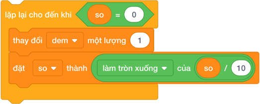

# BÀI 08: VÒNG LẶP CHO ĐẾN KHI VÀ BIẾN CỜ DỪNG

**Khóa học:** Scratch — Tư duy Khối lệnh, Đồ họa & Thuật toán Thi đấu (Bảng A)  
**Mã bài học:** `SCA-L08` | **Chương 3:** Cấu Trúc Rẽ Nhánh & Vòng Lặp  
**Thời lượng khuyến nghị:** 2 – 3 buổi học (90 phút/buổi)  
**Ánh xạ chuẩn:** Tương đương Bài 08 của Python Bảng A (`courses/python-bang-a/lessons/lesson-08`)  

---

## 1. Mục Tiêu Học Tập & Chuẩn Đầu Ra (Learning Objectives)

Sau khi hoàn thành bài học này, học sinh sẽ đạt được các chuẩn năng lực:
- **`LO-01` (Khối `lặp lại cho đến khi <điều_kiện>`):** Hiểu cơ chế hoạt động của vòng lặp không xác định số lần trước; vòng lặp sẽ tiếp tục chạy khi điều kiện **SAI** và sẽ dừng ngay lập tức khi điều kiện trở thành **ĐÚNG**.
- **`LO-02` (Bẫy tư duy ngược giữa Python `while` và Scratch `repeat until`):**
  - Trong Python: `while dieu_kien:` $\to$ Lặp khi điều kiện **ĐÚNG**.
  - Trong Scratch: `lặp lại cho đến khi <dieu_kien>` $\to$ Dừng khi điều kiện **ĐÚNG** (tức là lặp khi điều kiện **SAI**).
  - Quy tắc chuyển đổi: Muốn mô phỏng `while C:` trong Scratch, ta viết:
    $$\text{lặp lại cho đến khi } < \text{không phải } < C > >$$
- **`LO-03` (Bẫy lặp vô tận - Infinite Loop):** Nhận diện nguyên nhân khiến chương trình bị đơ/treo do điều kiện dừng không bao giờ đạt được; luôn đảm bảo bên trong vòng lặp có khối lệnh làm thay đổi biến điều kiện.
- **`LO-04` (Kỹ thuật Biến Cờ Dừng - Flag Variable):** Sử dụng một biến (ví dụ `da_tim_thay = 0` hoặc `1`) để báo hiệu khi thỏa mãn yêu cầu và dừng vòng lặp sớm.
- **`LO-05` (Bài toán kinh điển):** Dãy số Collatz ($3n+1$), tìm ước chung lớn nhất (Euclid trừ dần), nhập số cho đến khi gặp số 0.

---

## 2. Bản Chất Vòng Lặp Cho Đến Khi Trong Scratch



### 2.1. So sánh tư duy Python vs Scratch
| Đặc điểm | Python `while` | Scratch `lặp lại cho đến khi` |
|---|---|---|
| **Điều kiện gắn kèm** | Điều kiện **ĐỂ CHẠY TIẾP** | Điều kiện **ĐỂ DỪNG LẠI** |
| **Ví dụ: Chạy khi $N > 0$** | `while N > 0:` | `lặp lại cho đến khi < N = 0 >` hoặc `< không phải < N > 0 > >` |
| **Ví dụ: Chạy khi chưa xong** | `while not xong:` | `lặp lại cho đến khi < xong = 1 >` |

---

## 3. Thuật Toán Dãy Số Collatz ($3n + 1$)

Một bài toán nổi tiếng trong toán học:
- Bắt đầu từ số nguyên dương $N$.
- Nếu $N$ chẵn: $N = N / 2$.
- Nếu $N$ lẻ: $N = 3N + 1$.
- Quá trình lặp lại cho đến khi $N = 1$.

```text
đặt [N v] thành (câu trả lời)
lặp lại cho đến khi < (N) = (1) >
    nếu < ((N) mod (2)) = (0) > thì
        đặt [N v] thành ([làm tròn xuống] của ((N) / (2)))
    nếu không thì
        đặt [N v] thành (((3) * (N)) + (1))
    thay đổi [so_buoc v] một lượng (1)
nói (so_buoc)
```

---

## 4. Tử Huyệt & Các Bẫy Lỗi Thường Gặp (Bug Traps)

> **Bẫy 1: Nhầm lẫn giữa điều kiện CHẠY và điều kiện DỪNG**
> - *Hiện tượng:* Trong Python viết `while n > 0:`, sang Scratch kéo thẳng `< n > 0 >` vào khối `lặp lại cho đến khi`.
> - *Hậu quả:* Vì ngay từ đầu $n > 0$ là ĐÚNG, nên vòng lặp dừng ngay lập tức và không chạy lần nào!
> - *Khắc phục:* Nhớ câu thần chú: **"Cho đến khi ĐÚNG thì DỪNG"**, do đó phải đảo ngược điều kiện thành `< (n) = (0) >` hoặc dùng `< không phải < (n) > (0) > >`.

> **Bẫy 2: Lặp vô tận làm treo trình duyệt**
> - *Hiện tượng:* Trong thân vòng lặp không có khối lệnh nào làm biến số tiến gần tới điều kiện dừng.
> - *Khắc phục:* Luôn kiểm tra xem sau mỗi vòng lặp, biến số có biến đổi về phía đích hay không.

---

## 5. Bộ Câu Hỏi Trắc Nghiệm Củng Cố (Concept Quizzes)

1. **Khối lệnh `lặp lại cho đến khi <điều_kiện>` sẽ DỪNG lặp khi nào?**
   - A. Khi điều kiện có giá trị ĐÚNG (True) *(Đáp án đúng)*
   - B. Khi điều kiện có giá trị SAI (False)
   - C. Luôn lặp đúng 10 lần
   - D. Khi người dùng click chuột

2. **Để lặp lại khi $X < 100$, trong Scratch ta dùng khối:**
   - A. `lặp lại cho đến khi < X = 100 >` hoặc `< X > 99 >` *(Đáp án đúng)*
   - B. `lặp lại cho đến khi < X < 100 >`
   - C. `lặp lại (100) lần`
   - D. `nếu < X < 100 > thì`

3. **Hiện tượng "Lặp vô tận" (Infinite Loop) xảy ra khi:**
   - A. Máy tính hết pin
   - B. Điều kiện dừng không bao giờ trở thành ĐÚNG *(Đáp án đúng)*
   - C. Sử dụng quá nhiều khối lệnh
   - D. Đặt biến đếm bằng 0

4. **Trong bài toán Collatz, điều kiện dừng của vòng lặp là:**
   - A. `< N = 0 >`
   - B. `< N = 1 >` *(Đáp án đúng)*
   - C. `< N > 1000 >`
   - D. `< N mod 2 = 0 >`

5. **Lệnh `while a != b:` trong Python chuyển sang Scratch là:**
   - A. `lặp lại cho đến khi < a = b >` *(Đáp án đúng)*
   - B. `lặp lại cho đến khi < a > b >`
   - C. `lặp lại cho đến khi < a < b >`
   - D. `lặp lại (a) lần`

6. **Khi cần dừng vòng lặp sớm khi tìm thấy kết quả, ta sử dụng kỹ thuật:**
   - A. Biến cờ dừng (Flag variable) *(Đáp án đúng)*
   - B. Tắt máy tính
   - C. Khối phát tin
   - D. Đổi trang phục

7. **Vòng lặp `đặt X thành 1; lặp lại cho đến khi < X = 10 >: thay đổi X một lượng 2` sẽ:**
   - A. Dừng khi X = 10
   - B. Lặp vô tận vì X nhảy 1, 3, 5, 7, 9, 11 (không bao giờ bằng 10!) *(Đáp án đúng)*
   - C. Báo lỗi cú pháp
   - D. Dừng ngay lập tức

8. **Để tránh bẫy câu 7, điều kiện dừng an toàn nên là:**
   - A. `< X > 9 >` hoặc `< (X = 10) hoặc (X > 10) >` *(Đáp án đúng)*
   - B. `< X < 10 >`
   - C. `< X = 0 >`
   - D. `< X mod 2 = 0 >`

9. **Thuật toán trừ dần Euclid tìm ƯCLN của 2 số $a, b$ dừng lại khi:**
   - A. `< a = b >` *(Đáp án đúng)*
   - B. `< a = 0 >`
   - C. `< b = 0 >`
   - D. `< a > b >`

10. **Biến cờ thường nhận những giá trị nào?**
    - A. $0$ (chưa thấy) và $1$ (đã thấy) *(Đáp án đúng)*
    - B. Tên của học sinh
    - C. Màu sắc
    - D. Tọa độ x, y
