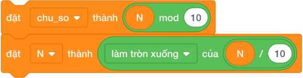

# Bài 10: KỸ THUẬT TÁCH CHỮ SỐ CỦA SỐ NGUYÊN

## 1. Bí Thuật Hai Bước Tách Chữ Số Bằng Phép Toán



Mỗi lần thực hiện hai khối lệnh này, ta bóc được một chữ số:
1. **Lấy chữ số hàng đơn vị ra dùng:**
   `đặt [chu_so v] thành ((N) mod (10))`
2. **Vứt bỏ chữ số hàng đơn vị đó đi để chuẩn bị cho chữ số tiếp theo:**
   `đặt [N v] thành ([làm tròn xuống v] của ((N) / (10)))`

---

## 2. Khung Mẫu Chuẩn (Template) Vòng Lặp Tách Chữ Số

```text
đặt [tong v] thành (0)
lặp lại cho đến khi < (N) = (0) >
    đặt [chu_so v] thành ((N) mod (10))
    thay đổi [tong v] một lượng (chu_so)
    đặt [N v] thành ([làm tròn xuống v] của ((N) / (10)))
nói (tong)
```

### Mô phỏng chạy tay trên số $N = 358$:
| Vòng lặp | Biến `N` ban đầu | `chu_so = N mod 10` | `tong = tong + chu_so` | `N mới = floor(N / 10)` |
|:---:|:---:|:---:|:---:|:---:|
| 1 | $358$ | $8$ | $0 + 8 = 8$ | $35$ |
| 2 | $35$ | $5$ | $8 + 5 = 13$ | $3$ |
| 3 | $3$ | $3$ | $13 + 3 = \mathbf{16}$ | $0$ (Dừng lặp!) |

Kết quả: Tổng các chữ số của $358$ là $16$!

---

## 3. Thuật Toán Tạo Số Đảo Ngược

Để đảo ngược số $N = 123 \to 321$:
- Khởi tạo `dao = 0`.
- Mỗi lần bóc được `chu_so`:
  $$\text{dao} = (\text{dao} \times 10) + \text{chu\_so}$$

Ví dụ với số $123$:
1. `dao = 0 * 10 + 3 = 3`
2. `dao = 3 * 10 + 2 = 32`
3. `dao = 32 * 10 + 1 = 321`

---

## 4. Tử Huyệt & Các Bẫy Lỗi Thường Gặp (Bug Traps)

> **Bẫy 1: Quên lưu bản sao biến gốc ban đầu**
> - *Hiện tượng:* Sau vòng lặp tách số, biến $N$ đã bị biến đổi thành $0$. Nếu ở cuối muốn so sánh `nếu < dao = N >` để kiểm tra đối xứng thì $N$ đã mất tiêu rồi!
> - *Khắc phục:* Luôn tạo bản sao trước vòng lặp: `đặt [goc v] thành (N)`. Cuối cùng so sánh `nếu < dao = goc >`.

> **Bẫy 2: Trường hợp đặc biệt khi $N = 0$**
> - *Hiện tượng:* Nếu người dùng nhập số 0, điều kiện dừng `< N = 0 >` ngay từ đầu khiến vòng lặp không chạy lần nào.
> - *Hậu quả:* Kết quả đếm số chữ số ra 0 (trong khi số 0 có 1 chữ số!).
> - *Khắc phục:* Thêm khối `nếu < N = 0 > thì nói 1` trước.

---

## 5. Bộ Câu Hỏi Trắc Nghiệm Củng Cố (Concept Quizzes)

1. **Khối `(345) mod (10)` lấy ra chữ số nào?**
   - A. 3
   - B. 4
   - C. 5 *(Đáp án đúng: chữ số hàng đơn vị)*
   - D. 34

2. **Khối `[làm tròn xuống] của ((345) / (10))` cho ra kết quả:**
   - A. 34.5
   - B. 34 *(Đáp án đúng: cắt bỏ chữ số cuối)*
   - C. 35
   - D. 5

3. **Điều kiện dừng của vòng lặp tách chữ số là:**
   - A. `< N = 0 >` *(Đáp án đúng)*
   - B. `< N = 1 >`
   - C. `< N < 0 >`
   - D. `< N mod 10 = 0 >`

4. **Số nào sau đây là số đối xứng (Palindrome)?**
   - A. 123
   - B. 1221 *(Đáp án đúng)*
   - C. 1231
   - D. 456

5. **Để ghép thêm một chữ số $d$ vào cuối số $X$, công thức là:**
   - A. `(X * 10) + d` *(Đáp án đúng)*
   - B. `X + d`
   - C. `(X * 100) + d`
   - D. `X * d`

6. **Tổng các chữ số của số $2026$ là:**
   - A. 10 *(Đáp án đúng: 2 + 0 + 2 + 6 = 10)*
   - B. 8
   - C. 12
   - D. 20

7. **Tại sao phải dùng biến `goc` để lưu giá trị của $N$ trước khi tách số?**
   - A. Vì biến $N$ sẽ bị giảm về 0 sau vòng lặp *(Đáp án đúng)*
   - B. Để tăng tốc độ chương trình
   - C. Bắt buộc phải có 2 biến mới chạy được
   - D. Để đổi màu nhân vật

8. **Muốn lấy chữ số hàng chục của số có 2 chữ số, ta tính:**
   - A. `[làm tròn xuống] của (N / 10)` *(Đáp án đúng)*
   - B. `N mod 10`
   - C. `N / 100`
   - D. `N * 10`

9. **Số Armstrong $153$ có tính chất đặc biệt là:**
   - A. $1^3 + 5^3 + 3^3 = 1 + 125 + 27 = 153$ *(Đáp án đúng)*
   - B. Là số nguyên tố
   - C. Chia hết cho 10
   - D. Có 2 chữ số

10. **Số $9$ có bao nhiêu chữ số?**
    - A. 1 *(Đáp án đúng)*
    - B. 2
    - C. 0
    - D. 9
