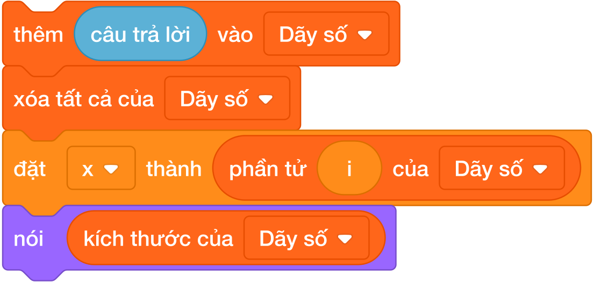

# Bài 13: Danh sách và thao tác cơ bản

## 1. Bản chất của danh sách (List) và cấu trúc dữ liệu

Cho đến bài học trước, mỗi biến số trong Scratch chỉ lưu trữ được **đúng 1 giá trị duy nhất** tại một thời điểm (như một chiếc hộp nhỏ chỉ đựng vừa một quả bóng). Nếu muốn lưu điểm kiểm tra của 40 bạn học sinh trong lớp, chẳng lẽ ta phải tạo 40 biến số khác nhau: `diem1`, `diem2`, ..., `diem40`?

Điều đó là bất khả thi và cồng kềnh. Khoa học máy tính giải quyết vấn đề này bằng **Danh sách (List)**:

- **Danh sách** giống như một dãy tủ có nhiều ngăn được đánh số thứ tự từ $1, 2, 3, \dots, N$.

- Mỗi ngăn tủ gọi là một **phần tử (Element)**, chứa một dữ liệu riêng biệt.

- Chỉ số của ngăn tủ gọi là **vị trí / chỉ số (Index)**.

---

## 2. Bảng tra cứu các khối lệnh danh sách trong Scratch 3.0

Trong nhóm **Các biến số (Variables)**, bấm nút **Tạo một danh sách** để xuất hiện nhóm khối lệnh màu cam đậm:

| Khối lệnh trực quan Scratch 3.0 | Thao tác | Ý nghĩa sư phạm & Chức năng |
|:---:|---|---|
|  | Thêm vào cuối | Chèn thêm giá trị $X$ vào cuối cùng của danh sách |
|  | Xóa phần tử | Xóa phần tử tại vị trí chỉ định, các phần tử sau dồn lên |
|  | Làm sạch danh sách | Xóa sạch toàn bộ danh sách (về 0 phần tử) |
|  | Chèn vào vị trí | Nhét $X$ vào vị trí cụ thể, đẩy các phần tử khác lùi lại |
|  | Thay thế giá trị | Ghi đè giá trị mới vào ô thứ $i$ |
|  | Đọc giá trị ô | Khối tròn: Đọc giá trị tại ngăn thứ $i$ |
|  | Tìm vị trí | Tìm xem giá trị $X$ nằm ở ngăn số mấy |
|  | Đếm số phần tử | Khối tròn: Đếm tổng số lượng phần tử hiện có |
|  | Kiểm tra tồn tại | Khối lục giác điều kiện: Kiểm tra xem $X$ có tồn tại trong danh sách không |

> ⚠️ **Quy tắc vàng:** Trong Scratch, chỉ số danh sách bắt đầu từ **vị trí 1** (1-based index). Phần tử đầu tiên luôn là `phần tử (1)`, phần tử cuối cùng là `phần tử (kích thước của danh sách)`.

---

## 3. Khung mẫu thuật toán nhập $N$ số và xử lý dữ liệu

Trong các bài toán lập trình, bài toán thường yêu cầu: *"Cho số nguyên $N$, sau đó nhập lần lượt $N$ số nguyên vào danh sách rồi tính tổng..."*.

### Các giai đoạn thực thi chuẩn mực:

1. **Giai đoạn khởi tạo:** Luôn dùng `xóa tất cả của [Dãy số v]` để làm sạch bộ nhớ từ các lần chạy trước.

2. **Giai đoạn nhập dữ liệu:** Hỏi số lượng $N$, sau đó lặp đúng $N$ lần, mỗi lần hỏi một số và lập tức dùng `thêm (câu trả lời) vào [Dãy số v]`.

3. **Giai đoạn duyệt danh sách:** 
   - Đặt biến chỉ số `i = 1`, biến tích lũy `tong = 0`.
   - Lặp `(kích thước của [Dãy số v])` lần:

     - Cộng dồn `phần tử (i) của [Dãy số v]` vào biến `tong`.
     - Tăng chỉ số `i` lên 1 để bước sang ngăn tủ kế tiếp.

---

## 4. Bảng mô phỏng duyệt danh sách `[5, 8, 3]` (Dry run)

Giả sử danh sách `Dãy số` hiện có 3 phần tử: ngăn 1 chứa `5`, ngăn 2 chứa `8`, ngăn 3 chứa `3`. Kích thước $= 3$.

| Bước | Biến chỉ số `i` | Khối `phần tử (i)` lấy được | Phép tính biến `tong` | Kết quả `tong` | Hành động chuyển tiếp |
|:---:|:---:|:---:|:---:|:---:|---|
| *Khởi tạo* | $i = 1$ | — | Khởi tạo ban đầu | **$0$** | Bắt đầu vòng lặp duyệt |
| **Vòng 1** | $i = 1$ | `phần tử (1)` $\to$ **$5$** | $0 + 5$ | **$5$** | Tăng $i = 2$ |
| **Vòng 2** | $i = 2$ | `phần tử (2)` $\to$ **$8$** | $5 + 8$ | **$13$** | Tăng $i = 3$ |
| **Vòng 3** | $i = 3$ | `phần tử (3)` $\to$ **$3$** | $13 + 3$ | **$16$** | Tăng $i = 4$ |
| **Dừng** | $i = 4$ | — | $4 > 3$ (vượt kích thước) | **$16$** | Vòng lặp kết thúc |

$\implies$ Sau 3 vòng lặp, nhân vật thông báo kết quả: `Tổng = 16`.

---

## 5. Các bẫy lỗi thường gặp (Bug Traps)

> **Bẫy 1: Quên xóa sạch danh sách ở đầu kịch bản**
> - *Hiện tượng:* Không đặt `xóa tất cả của [Dãy số v]` dưới cờ xanh.
> - *Hậu quả:* Mỗi lần bấm cờ xanh để chạy thử lại bài, các con số mới sẽ được nối đuôi vào các con số cũ! Danh sách tăng từ 3 lên 6, 9 phần tử $\implies$ Kết quả tính toán sai hoàn toàn!
> - *Khắc phục:* Luôn luôn dọn sạch danh sách ngay dòng đầu tiên.

> **Bẫy 2: Bẫy chỉ số 0 (Zero-Index Trap)**
> - *Hiện tượng:* Nhập thói quen từ ngôn ngữ khác hoặc viết `phần tử (0) của [Dãy số v]`.
> - *Hậu quả:* Trong Scratch không có phần tử số 0! Khối này sẽ trả về giá trị rỗng hoặc `0`, làm sai lệch thuật toán.
> - *Khắc phục:* Luôn bắt đầu duyệt từ `i = 1`.

> **Bẫy 3: Xóa phần tử khi đang duyệt danh sách bằng vòng lặp xuôi**
> - *Hiện tượng:* Khi duyệt từ $1 \to N$, nếu gặp số âm ta bấm `xóa (i) của [Dãy số]`.
> - *Hậu quả:* Khi xóa phần tử thứ $i$, phần tử thứ $i+1$ sẽ lập tức bị kéo dồn lên thành vị trí $i$. Bước tiếp theo vòng lặp tăng $i$ lên 1, dẫn đến **bỏ qua hoàn toàn phần tử vừa dồn lên**!
> - *Khắc phục:* Muốn xóa các phần tử trong danh sách, ta phải **duyệt ngược từ cuối về đầu** (từ `kích thước` giảm dần về `1`).

---

## 6. Bộ câu hỏi trắc nghiệm củng cố (Concept Quizzes)

1. **Phần tử đầu tiên trong một danh sách Scratch được đánh số thứ tự là:**
   - A. 0
   - B. 1 *(Đáp án đúng: Scratch dùng 1-based indexing)*
   - C. -1
   - D. Tùy ý người lập trình

2. **Muốn biết danh sách hiện tại đang có bao nhiêu phần tử, ta dùng khối:**
   - A. `độ dài của [Dãy số v]`
   - B. `kích thước của [Dãy số v]` *(Đáp án đúng)*
   - C. `số lượng của [Dãy số v]`
   - D. `tổng của [Dãy số v]`

3. **Khối lệnh nào sau đây dùng để chèn thêm một phần tử vào cuối danh sách?**
   - A. `thay thế phần tử cuối của danh sách`
   - B. `chèn (X) vào (cuối) của danh sách`
   - C. `thêm (X) vào [danh_sách v]` *(Đáp án đúng)*
   - D. `đặt [danh_sách v] thành (X)`

4. **Nếu danh sách đang có 5 phần tử, khối `phần tử (kích thước của [Dãy số v]) của [Dãy số v]` sẽ lấy ra:**
   - A. Phần tử đầu tiên
   - B. Phần tử ở chính giữa
   - C. Phần tử cuối cùng *(Đáp án đúng: phần tử thứ 5)*
   - D. Số 5

5. **Để làm sạch hoàn toàn một danh sách trước khi nhập dữ liệu mới, ta dùng khối:**
   - A. `xóa (1) của [danh_sách v]`
   - B. `xóa (cuối) của [danh_sách v]`
   - C. `xóa tất cả của [danh_sách v]` *(Đáp án đúng)*
   - D. `đặt [danh_sách v] thành (0)`

6. **Điều kiện nào kiểm tra xem giá trị `10` đã có mặt trong danh sách `Điểm` hay chưa?**
   - A. `< [Điểm v] chứa (10) ?>` *(Đáp án đúng)*
   - B. `< (10) trong [Điểm v] ?>`
   - C. `< [Điểm v] = (10) >`
   - D. `< phần tử (10) của [Điểm v] >`

7. **Giả sử danh sách có các số $[4, 7, 9]$. Sau khi chạy lệnh `xóa (2) của [Dãy số v]`, danh sách còn lại là:**
   - A. $[4, 9]$ *(Đáp án đúng: xóa số 7 ở vị trí 2, số 9 dồn lên vị trí 2)*
   - B. $[7, 9]$
   - C. $[4, 7]$
   - D. $[4, 0, 9]$

8. **Khi duyệt qua toàn bộ một danh sách gồm $N$ phần tử, biến chỉ số `i` cần chạy từ:**
   - A. $0$ đến $N - 1$
   - B. $1$ đến $N$ *(Đáp án đúng)*
   - C. $1$ đến $N + 1$
   - D. $0$ đến $N$

9. **Nếu gọi `phần tử (10) của [Dãy số v]` trong khi danh sách chỉ có 3 phần tử, kết quả trả về là:**
   - A. Báo lỗi đơ chương trình
   - B. Giá trị rỗng (hoặc 0) *(Đáp án đúng)*
   - C. Trả về phần tử thứ 3
   - D. Tự động thêm 7 phần tử nữa

10. **Lý do vì sao phải duyệt danh sách từ cuối về đầu khi cần xóa các phần tử thỏa mãn điều kiện là:**
    - A. Vì chạy ngược máy tính chạy nhanh hơn
    - B. Để tránh hiện tượng các phần tử phía sau bị kéo dồn vị trí làm sót phần tử *(Đáp án đúng)*
    - C. Vì Scratch không cho phép xóa từ đầu
    - D. Để danh sách tự động đảo ngược
