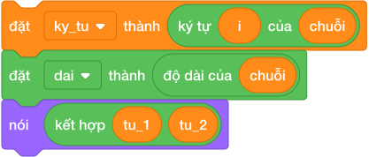

# BÀI 15: CHUỖI KÝ TỰ, CHỈ SỐ VÀ TRÍCH XUẤT

**Khóa học:** Scratch — Tư duy Khối lệnh, Đồ họa & Thuật toán Thi đấu (Bảng A)  
**Mã bài học:** `SCA-L15` | **Chương 6:** Xử Lý Chuỗi Ký Tự  
**Thời lượng khuyến nghị:** 2 – 3 buổi học (90 phút/buổi)  
**Ánh xạ chuẩn:** Tương đương Bài 13 của Python Bảng A (`courses/python-bang-a/problems/pya_l13_*`)  

---

## 1. Mục Tiêu Học Tập & Chuẩn Đầu Ra (Learning Objectives)

Sau khi hoàn thành bài học này, học sinh sẽ đạt được các chuẩn năng lực:
- **`LO-01` (Khối `ký tự (i) của (chuỗi)`):** Trích xuất một ký tự tại vị trí thứ $i$ trong chuỗi (chỉ số 1-based, bắt đầu từ 1).
- **`LO-02` (Khối `độ dài của (chuỗi)`):** Đếm chính xác tổng số lượng ký tự có trong chuỗi (kể cả dấu cách và ký tự đặc biệt).
- **`LO-03` (Khối `kết hợp () và ()`):** Nối các chuỗi hoặc ký tự lại với nhau thành một từ/câu mới.
- **`LO-04` (Kỹ thuật Cắt chuỗi con - Substring thủ công):** Vì Scratch không có cú pháp cắt lát `s[start:end]` như Python, học sinh sử dụng vòng lặp từ `start` đến `end` kết hợp khối `kết hợp` để trích xuất đoạn chuỗi con.
- **`LO-05` (Bài toán kinh điển):** Lấy ký tự đầu/cuối của tên, đảo ngược chuỗi ký tự, kiểm tra từ đối xứng (Palindrome chuỗi).

---

## 2. Các Khối Lệnh Xử Lý Chuỗi Trong Scratch 3.0

Trong nhóm **Các phép toán (Operators)** màu xanh lá cây:



| Khối lệnh Scratch | Tương đương Python | Ví dụ với chuỗi `s = "SCRATCH"` | Kết quả |
|---|---|---|:---:|
| `ký tự (1) của (s)` | `s[0]` | Ký tự đầu tiên | `"S"` |
| `ký tự (độ dài của (s)) của (s)` | `s[-1]` | Ký tự cuối cùng | `"H"` |
| `độ dài của (s)` | `len(s)` | Đếm số ký tự | `7` |
| `kết hợp (A) và (B)` | `A + B` | Ghép 2 chuỗi | Nối liền nhau |
| `(s) chứa (c) ?` | `c in s` | Kiểm tra ký tự có trong chuỗi | Đúng / Sai |

---

## 3. Thuật Toán Trích Xuất Chuỗi Con Từ Vị Trí $L$ Đến $R$

Để cắt chuỗi con từ ký tự thứ $L$ đến thứ $R$ của chuỗi $S$:
```text
đặt [chuoi_con v] thành []
đặt [i v] thành (L)
lặp lại (((R) - (L)) + (1)) lần
    đặt [chuoi_con v] thành (kết hợp (chuoi_con) (ký tự (i) của (S)))
    thay đổi [i v] một lượng (1)
nói (chuoi_con)
```

Ví dụ với $S = \text{"VIETNAM"}$, cắt từ $L = 1$ đến $R = 4 \implies$ Kết quả được $\text{"VIET"}$.

---

## 4. Tử Huyệt & Các Bẫy Lỗi Thường Gặp (Bug Traps)

> **Bẫy 1: Chỉ số 0 trong chuỗi (Off-by-one trap)**
> - *Hiện tượng:* Gọi `ký tự (0) của (chuỗi)`.
> - *Hậu quả:* Scratch trả về chuỗi rỗng! Ký tự đầu tiên bắt buộc là **vị trí 1**.

> **Bẫy 2: Dấu cách cũng là một ký tự hợp lệ**
> - *Hiện tượng:* Chuỗi `"IKH EDU"` có 7 ký tự (3 chữ cái + 1 dấu cách + 3 chữ cái).
> - *Khắc phục:* Nhắc học sinh dấu cách cũng chiếm một vị trí và tính vào độ dài chuỗi.

---

## 5. Bộ Câu Hỏi Trắc Nghiệm Củng Cố (Concept Quizzes)

1. **Với chuỗi `"ROBOT"`, khối `độ dài của (chuỗi)` trả về:**
   - A. 5 *(Đáp án đúng)*
   - B. 4
   - C. 6
   - D. 0

2. **Ký tự đầu tiên của chuỗi được lấy bằng khối:**
   - A. `ký tự (1) của (chuỗi)` *(Đáp án đúng)*
   - B. `ký tự (0) của (chuỗi)`
   - C. `ký tự (-1) của (chuỗi)`
   - D. `phần tử (1) của (chuỗi)`

3. **Ký tự cuối cùng của chuỗi $S$ được lấy bằng biểu thức:**
   - A. `ký tự (độ dài của (S)) của (S)` *(Đáp án đúng)*
   - B. `ký tự (0) của (S)`
   - C. `ký tự cuối của (S)`
   - D. `độ dài của (S)`

4. **Khối `kết hợp [Tin ] và [hoc]` cho ra kết quả:**
   - A. `"Tin hoc"` *(Đáp án đúng: vì có sẵn dấu cách sau chữ Tin)*
   - B. `"Tinhoc"`
   - C. `"Tin, hoc"`
   - D. Báo lỗi

5. **Nếu $i > \text{độ dài của chuỗi}$, khối `ký tự (i) của (chuỗi)` trả về:**
   - A. Chuỗi rỗng (không có gì) *(Đáp án đúng)*
   - B. Báo lỗi
   - C. Ký tự cuối cùng
   - D. Số 0

6. **Chuỗi `"A B C"` có độ dài là bao nhiêu?**
   - A. 3
   - B. 5 *(Đáp án đúng: 3 chữ cái + 2 dấu cách)*
   - C. 4
   - D. 6

7. **Để kiểm tra chuỗi có chứa chữ cái `'x'` hay không, ta dùng khối lục giác:**
   - A. `(chuỗi) chứa [x] ?` *(Đáp án đúng)*
   - B. `chuỗi = x`
   - C. `ký tự của chuỗi = x`
   - D. `độ dài của chuỗi > 0`

8. **Số lần lặp để cắt chuỗi từ vị trí $L$ đến $R$ là:**
   - A. `R - L + 1` *(Đáp án đúng)*
   - B. `R - L`
   - C. `R + L`
   - D. `R`

9. **Kết quả của `kết hợp (kết hợp [1] [2]) [3]` là:**
   - A. `"123"` *(Đáp án đúng)*
   - B. `"6"`
   - C. `"1 2 3"`
   - D. `"321"`

10. **Từ `"MADAM"` đọc xuôi hay ngược đều giống nhau, từ này được gọi là:**
    - A. Từ đối xứng (Palindrome) *(Đáp án đúng)*
    - B. Từ nguyên tố
    - C. Từ hoàn hảo
    - D. Từ chính phương
