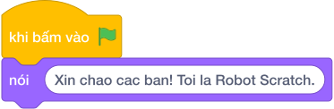

# Hướng Dẫn Giảng Dạy: Lời chào robot
Chuyên đề: **Lập Trình Thuật Toán & Khối Lệnh Scratch 3.0**

---

## 1. Ý tưởng & Phân tích thuật toán
- Bản chất của bài này là in ra một câu chữ cố định: `Xin chao cac ban! Toi la Robot Scratch.` Thầy cô giải thích cho các con rằng chương trình không cần đọc gì từ bàn phím, chỉ cần hiện đúng câu chào ra màn hình.
- Quy trình chỉ có một bước duy nhất: gọi lệnh `nói (...)` với đúng chuỗi chữ trong ngoặc kép, gồm chữ hoa ở đầu `Xin`, dấu chấm than sau `ban!`, chữ `Toi`, chữ `Robot Scratch` và dấu chấm cuối câu.
- Xử lý biên: bài này không có số liệu vào nên không có giá trị biên. Thầy cô nhắc các con sao chép từng chữ cái cho khớp, vì thiếu hay thừa một dấu cách cũng làm kết quả khác đi.

---

## 2. Bảng chạy tay trên số liệu mẫu (Dry Run Table - Sample 1: (không có dữ liệu vào))
| Bước | Lệnh chạy | Màn hình hiện ra |
|------|-----------|------------------|
| 1 | `nói ("Xin chao cac ban! Toi la Robot Scratch.")` | `Xin chao cac ban! Toi la Robot Scratch.` |
| 2 | Kết thúc chương trình | Kết quả cuối cùng: `Xin chao cac ban! Toi la Robot Scratch.` |

---

## 3. Lưu ý & Bẫy lỗi thường gặp
- Bẫy 1: quên dấu ngoặc kép quanh câu chữ, ví dụ viết `nói (Xin chao cac ban! Toi la Robot Scratch.)`. Chương trình báo lỗi và không in ra gì cả. Cách sửa: luôn đặt câu chữ trong cặp dấu ngoặc kép `"..."`.
- Bẫy 2: gõ sai một chữ, ví dụ `nói ("Xin chao cac ban! Toi la Robot python.")` (chữ `p` thường). Màn hình hiện `... Robot python.` thay vì `... Robot Scratch.` nên bị tính là kết quả sai. Cách sửa: đối chiếu từng chữ với đề bài trước khi chạy.
- Bẫy 3: thêm lệnh `hỏi và đợi` ở đầu vì tưởng bài nào cũng phải nhập. Khi chạy, chương trình cứ đứng chờ các con gõ thêm, không in ra câu chào ngay. Cách sửa: bài này không có dữ liệu vào nên xóa dòng `hỏi và đợi`, chỉ giữ một dòng `nói (...)`.

---

## 4. Lời giải tham khảo & Kịch bản Khối lệnh Scratch 3.0

### 4.1. Khối lệnh đồ họa trực quan (Visual Scratch Blocks)

> 💡 **Kịch bản thực hiện từng bước:**
> - khi bấm vào cờ xanh
> - nói [Xin chao cac ban! Toi la Robot Scratch.]
