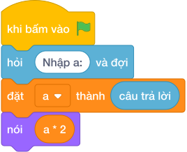

# Hướng Dẫn Giảng Dạy: Cặp số nhân đôi
Chuyên đề: **Lập Trình Thuật Toán & Khối Lệnh Scratch 3.0**

---

## 1. Ý tưởng & Phân tích thuật toán
- Bản chất của bài này là mạch khuếch đại nhân đôi biên độ tín hiệu: vào `A = 15` thì ra `15 * 2 = 30`. Thầy cô ví như tiếng loa được vặn to gấp đôi.
- Quy trình gồm hai bước với biến `a` trong lời giải: đọc `15` vào `a` bằng `int(hỏi và đợi.strip())` (có gọt khoảng trắng thừa quanh số), rồi tính `a * 2` tức `30` và in ra.
- Xử lý biên: ràng buộc cho `A` từ 0 tới `10^6`. Thầy cô cho các con thử giá trị biên `0` cho ra `0`, và giá trị biên `1000000` cho ra `2000000`.

---

## 2. Bảng chạy tay trên số liệu mẫu (Dry Run Table - Sample 1: 15)
| Bước | Lệnh chạy | Giá trị biến | Màn hình hiện ra |
|------|-----------|--------------|------------------|
| 1 | `a = int(hỏi và đợi.strip())` với bàn phím gõ `15` | `a = 15` | (chưa in gì) |
| 2 | `nói (a * 2)` tức `nói (15 * 2)` | `a = 15` | `30` |
| 3 | Kết thúc chương trình | — | Kết quả cuối cùng: `30`. |

---

## 3. Lưu ý & Bẫy lỗi thường gặp
- Bẫy 1: quên `int()`, viết `a = hỏi và đợi.strip()` rồi `nói (a * 2)` thì với mẫu `15` máy lặp chữ hai lần, hiện `1515` thay vì `30`. Cách sửa: viết `a = int(hỏi và đợi.strip())`.
- Bẫy 2: viết `nói (a + 2)` thì với mẫu `15` màn hình hiện `17` thay vì `30`. Cách sửa: nhân đôi nghĩa là nhân với 2, viết `a * 2`.
- Bẫy 3: viết `nói (a * a)` (bình phương) thì với mẫu `15` màn hình hiện `225` thay vì `30`. Cách sửa: chỉ nhân với số 2 cố định.

---

## 4. Lời giải tham khảo & Kịch bản Khối lệnh Scratch 3.0

### 4.1. Khối lệnh đồ họa trực quan (Visual Scratch Blocks)

> 💡 **Kịch bản thực hiện từng bước:**
> - khi bấm vào cờ xanh
> - hỏi [Nhập a:] và đợi
> - đặt [a] thành (câu trả lời)
> - nói (a * 2)
