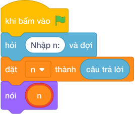

# Hướng Dẫn Giảng Dạy

## 1. Ý tưởng & Phân tích thuật toán
- Bản chất của bài này là đọc lại mã số may mắn `N` rồi hiện lại đúng số đó. Thầy cô ví biến `n` như một chiếc hộp đựng con số mà máy đếm vé vừa nhận được.
- Quy trình gồm hai bước với biến `n` trong lời giải: đọc dòng chữ `"2026"` từ bàn phím rồi đổi thành số nguyên bằng `int(...)` và cất vào `n`, sau đó `nói (n)` hiện giá trị của `n` ra màn hình, với số mẫu cho ra `2026`.
- Xử lý biên: ràng buộc cho `N` từ `-10^9` tới `10^9`, nên thầy cô cho các con thử thêm hai đầu biên `-1000000000` và `1000000000` để thấy chương trình vẫn đọc và in lại đúng, kể cả số âm có dấu trừ đằng trước.

---

## 2. Bảng chạy tay trên số liệu mẫu (Dry Run Table - Sample 1: 2026)
| Bước | Lệnh chạy | Giá trị biến | Màn hình hiện ra |
|------|-----------|--------------|------------------|
| 1 | `n = int(hỏi và đợi)` với bàn phím gõ `2026` | `n = 2026` | (chưa in gì) |
| 2 | `nói (n)` | `n = 2026` | `2026` |
| 3 | Kết thúc chương trình | — | Kết quả cuối cùng: `2026`. |

---

## 3. Lưu ý & Bẫy lỗi thường gặp
- Bẫy 1: quên đổi sang số, viết `n = hỏi và đợi` rồi `nói (n * 2)` ở bài khác thì với mẫu `2026` sẽ ra `20262026` do nối chữ. Ngay trong bài này tuy in lại vẫn đúng, nhưng thói quen thiếu `int()` sẽ gây sai ở bài tính toán. Cách sửa: luôn viết `n = int(hỏi và đợi)`.
- Bẫy 2: in kèm chữ trang trí, ví dụ `nói ("N =", n)` thì với mẫu `2026` màn hình hiện `N = 2026` thay vì `2026`. Cách sửa: chỉ viết `nói (n)`.
- Bẫy 3: đọc thừa một dòng, ví dụ gọi `hỏi và đợi` hai lần thì chương trình cứ chờ nhập thêm sau khi đã gõ `2026`. Cách sửa: bài này chỉ có một số nên chỉ gọi `hỏi và đợi` một lần.

---

## 4. Lời giải tham khảo & Kịch bản Khối lệnh Scratch 3.0

### 4.1. Khối lệnh đồ họa trực quan (Visual Scratch Blocks)

> 💡 **Kịch bản thực hiện từng bước:**
> - khi bấm vào cờ xanh
> - hỏi [Nhập n:] và đợi
> - đặt [n] thành (câu trả lời)
> - nói (n)
