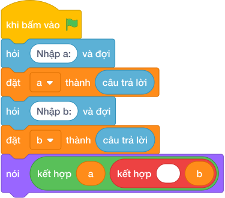

# Hướng Dẫn Giảng Dạy: Chiếc hộp hoán đổi bí mật
Chuyên đề: **Lập Trình Thuật Toán & Khối Lệnh Scratch 3.0**

---

## 1. Ý tưởng & Phân tích thuật toán
- Bản chất của bài này là hai hộp kẹo đổi chỗ cho nhau: hộp `A = 7` và hộp `B = 12`, sau khi đổi thì `A = 12` và `B = 7`. Thầy cô kể chuyện Tèo và Tí đổi kẹo để các con dễ nhớ.
- Quy trình gồm ba bước với hai biến `a` và `b` trong lời giải: đọc `7` vào `a` và `12` vào `b` bằng `int(hỏi và đợi.strip())`, đổi chỗ cùng lúc bằng `a, b = b, a`, rồi `nói (a, b)` in ra `12 7`.
- Xử lý biên: ràng buộc cho `A, B` từ 0 tới `10^9`. Thầy cô cho các con thử cặp biên `0` và `1000000000` để thấy lệnh đổi chỗ vẫn đúng.

---

## 2. Bảng chạy tay trên số liệu mẫu (Dry Run Table - Sample 1: 7 và 12)
| Bước | Lệnh chạy | Giá trị biến | Màn hình hiện ra |
|------|-----------|--------------|------------------|
| 1 | `a = int(hỏi và đợi.strip())` với dòng 1 gõ `7` | `a = 7` | (chưa in gì) |
| 2 | `b = int(hỏi và đợi.strip())` với dòng 2 gõ `12` | `b = 12` | (chưa in gì) |
| 3 | `a, b = b, a` | `a = 12`, `b = 7` | (chưa in gì) |
| 4 | `nói (a, b)` | `a = 12`, `b = 7` | `12 7` |
| 5 | Kết thúc chương trình | — | Kết quả cuối cùng: `12 7`. |

---

## 3. Lưu ý & Bẫy lỗi thường gặp
- Bẫy 1: gán lần lượt `a = b` rồi `b = a` thì sau dòng đầu `a` đã thành `12`, dòng sau `b` cũng thành `12` nên in ra `12 12` thay vì `12 7`. Cách sửa: đổi cùng lúc bằng `a, b = b, a`.
- Bẫy 2: quên dòng đổi chỗ, đọc xong in ngay thì với mẫu `7` và `12` màn hình hiện `7 12` thay vì `12 7`. Cách sửa: thêm dòng `a, b = b, a` trước lệnh in.
- Bẫy 3: in mỗi số một dòng bằng hai lệnh `nói (a)` và `nói (b)` thì màn hình hiện hai dòng thay vì `12 7` trên một dòng. Cách sửa: viết gọn `nói (a, b)`.

---

## 4. Lời giải tham khảo & Kịch bản Khối lệnh Scratch 3.0

### 4.1. Khối lệnh đồ họa trực quan (Visual Scratch Blocks)

> 💡 **Kịch bản thực hiện từng bước:**
> - khi bấm vào cờ xanh
> - hỏi [Nhập a:] và đợi
> - đặt [a] thành (câu trả lời)
> - hỏi [Nhập b:] và đợi
> - đặt [b] thành (câu trả lời)
> - nói (kết hợp a và " " và b)
