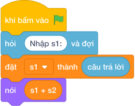

# Hướng Dẫn Giảng Dạy: Đoàn tàu toa xe ghép số
Chuyên đề: **Lập Trình Thuật Toán & Khối Lệnh Scratch 3.0**

---

## 1. Ý tưởng & Phân tích thuật toán
- Bản chất của bài này là phân biệt chữ với số: hai toa `a = 25` và `b = 30` khi ghép chữ cho ra `2530`, khi cộng số cho ra `55`. Thầy cô ví ghép chữ như nối hai toa tàu lại, còn cộng số như đổ kẹo hai toa vào chung một hộp.
- Quy trình gồm ba bước với hai biến `s1` và `s2` trong lời giải: đọc nguyên văn hai dòng `"25"` vào `s1` và `"30"` vào `s2` bằng `hỏi và đợi.strip()` (giữ dạng chữ), dòng 1 in `s1 + s2` tức `"25" + "30" = "2530"`, dòng 2 in `int(s1) + int(s2)` tức `25 + 30 = 55`.
- Xử lý biên: ràng buộc cho `a, b` từ 1 tới 100. Thầy cô cho các con thử cặp biên `1` và `1` cho ra dòng 1 là `11` và dòng 2 là `2`, cặp `100` và `100` cho ra `100100` và `200`.

---

## 2. Bảng chạy tay trên số liệu mẫu (Dry Run Table - Sample 1: 25 và 30)
| Bước | Lệnh chạy | Giá trị biến | Màn hình hiện ra |
|------|-----------|--------------|------------------|
| 1 | `s1 = hỏi và đợi.strip()` với dòng 1 gõ `25` | `s1 = "25"` | (chưa in gì) |
| 2 | `s2 = hỏi và đợi.strip()` với dòng 2 gõ `30` | `s2 = "30"` | (chưa in gì) |
| 3 | `nói (s1 + s2)` tức `nói ("25" + "30")` | `s1 = "25"`, `s2 = "30"` | `2530` |
| 4 | `nói (int(s1) + int(s2))` tức `nói (25 + 30)` | `s1 = "25"`, `s2 = "30"` | `55` |
| 5 | Kết thúc chương trình | — | Kết quả cuối cùng đúng hai dòng `2530` và `55`. |

---

## 3. Lưu ý & Bẫy lỗi thường gặp
- Bẫy 1: đổi sang số ngay từ đầu bằng `s1 = int(hỏi và đợi)` thì dòng ghép `s1 + s2` với mẫu `25` và `30` sẽ tính `25 + 30 = 55` ở cả hai dòng, mất dòng `2530`. Cách sửa: giữ nguyên chữ bằng `hỏi và đợi.strip()`, chỉ đổi sang số ở dòng cộng.
- Bẫy 2: quên đổi sang số ở dòng hai, viết `nói (s1 + s2)` hai lần thì cả hai dòng đều hiện `2530`, mất dòng `55`. Cách sửa: dòng hai viết `nói (int(s1) + int(s2))`.
- Bẫy 3: in hai kết quả trên một dòng như `nói (s1 + s2, int(s1) + int(s2))` thì màn hình hiện `2530 55` chung một dòng thay vì hai dòng riêng. Cách sửa: viết hai khối lệnh `nói ()` riêng cho hai dòng.

---

## 4. Lời giải tham khảo & Kịch bản Khối lệnh Scratch 3.0

### 4.1. Khối lệnh đồ họa trực quan (Visual Scratch Blocks)

> 💡 **Kịch bản thực hiện từng bước:**
> - khi bấm vào cờ xanh
> - hỏi [Nhập s1:] và đợi
> - đặt [s1] thành (câu trả lời)
> - nói (s1 + s2)
