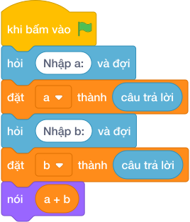

# Hướng Dẫn Giảng Dạy: Tổng hai số trên cùng 1 dòng
Chuyên đề: **Lập Trình Thuật Toán & Khối Lệnh Scratch 3.0**

---

## 1. Ý tưởng & Phân tích thuật toán
- Bản chất của bài này là cộng hai số `A = 45` và `B = 55` nằm chung trên một dòng, kết quả `45 + 55 = 100`. Thầy cô giải thích cả dòng `"45 55"` được cắt thành hai mảnh tại dấu cách rồi mới đổi sang số.
- Quy trình gồm hai bước với hai biến `a` và `b` trong lời giải: dùng `map(int, hỏi và đợi.split())` để cắt dòng `45 55` thành `45` và `55` rồi cất vào `a` và `b`, sau đó `nói (a + b)` in ra `100`.
- Xử lý biên: ràng buộc cho `A, B` từ `-10^9` tới `10^9`. Thầy cô cho các con thử cặp biên `-1000000000 -1000000000` cho ra `-2000000000`, và cặp `1000000000 1000000000` cho ra `2000000000`.

---

## 2. Bảng chạy tay trên số liệu mẫu (Dry Run Table - Sample 1: 45 55)
| Bước | Lệnh chạy | Giá trị biến | Màn hình hiện ra |
|------|-----------|--------------|------------------|
| 1 | `a, b = map(int, hỏi và đợi.split())` với bàn phím gõ `45 55` | `a = 45`, `b = 55` | (chưa in gì) |
| 2 | `nói (a + b)` tức `nói (45 + 55)` | `a = 45`, `b = 55` | `100` |
| 3 | Kết thúc chương trình | — | Kết quả cuối cùng: `100`. |

---

## 3. Lưu ý & Bẫy lỗi thường gặp
- Bẫy 1: đọc bằng hai lệnh `int(hỏi và đợi)` riêng thì sau dòng `45 55` dòng đầu đã nuốt cả hai số và dòng thứ hai không còn gì để đọc, chương trình cứ chờ thêm. Cách sửa: đọc một dòng rồi cắt bằng `map(int, hỏi và đợi.split())`.
- Bẫy 2: quên đổi sang số, viết `a, b = hỏi và đợi.split()` rồi `nói (a + b)` thì với mẫu `45 55` máy nối chữ thành `4555` thay vì `100`. Cách sửa: bọc `map(int, ...)` để đổi cả hai mảnh thành số.
- Bẫy 3: trừ thay vì cộng, viết `nói (a - b)` thì với mẫu `45 55` màn hình hiện `-10` thay vì `100`. Cách sửa: bài hỏi tổng nên viết dấu `+`.

---

## 4. Lời giải tham khảo & Kịch bản Khối lệnh Scratch 3.0

### 4.1. Khối lệnh đồ họa trực quan (Visual Scratch Blocks)

> 💡 **Kịch bản thực hiện từng bước:**
> - khi bấm vào cờ xanh
> - hỏi [Nhập a:] và đợi
> - đặt [a] thành (câu trả lời)
> - hỏi [Nhập b:] và đợi
> - đặt [b] thành (câu trả lời)
> - nói (a + b)
