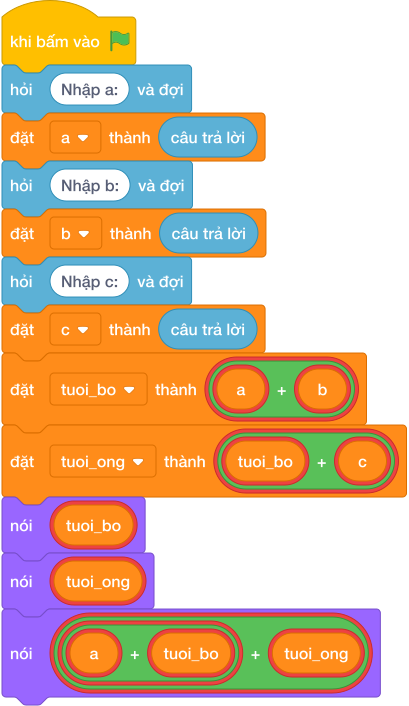

# Hướng Dẫn Giảng Dạy

## 1. Ý tưởng & Phân tích thuật toán
- Bản chất của bài này là tính tuổi ba thế hệ dây chuyền: con `a = 10`, bố hơn con `b = 30` nên bố `10 + 30 = 40`, ông hơn bố `c = 25` nên ông `40 + 25 = 65`, tổng cả ba là `10 + 40 + 65 = 115`. Thầy cô vẽ cây gia đình ba tầng để các con dễ thấy.
- Quy trình gồm bốn bước với các biến `a`, `b`, `c`, `tuoi_bo`, `tuoi_ong` trong lời giải: đọc `10` vào `a`, `30` vào `b`, `25` vào `c`, tính `tuoi_bo = a + b = 40`, tính `tuoi_ong = tuoi_bo + c = 65`, rồi in ba dòng `40`, `65`, `115`.
- Xử lý biên: ràng buộc cho `a` từ 1 tới 20, `b` và `c` từ 20 tới 40. Thầy cô cho các con thử biên nhỏ `1, 20, 20` cho ra `21`, `41`, `63`, và biên lớn `20, 40, 40` cho ra `60`, `100`, `180`.

---

## 2. Bảng chạy tay trên số liệu mẫu (Dry Run Table - Sample 1: 10, 30 và 25)
| Bước | Lệnh chạy | Giá trị biến | Màn hình hiện ra |
|------|-----------|--------------|------------------|
| 1 | `a = int(hỏi và đợi)` với dòng 1 gõ `10` | `a = 10` | (chưa in gì) |
| 2 | `b = int(hỏi và đợi)` với dòng 2 gõ `30` | `b = 30` | (chưa in gì) |
| 3 | `c = int(hỏi và đợi)` với dòng 3 gõ `25` | `c = 25` | (chưa in gì) |
| 4 | `tuoi_bo = a + b` tức `10 + 30` | `tuoi_bo = 40` | (chưa in gì) |
| 5 | `tuoi_ong = tuoi_bo + c` tức `40 + 25` | `tuoi_ong = 65` | (chưa in gì) |
| 6 | `nói (tuoi_bo)` | — | `40` |
| 7 | `nói (tuoi_ong)` | — | `65` |
| 8 | `nói (a + tuoi_bo + tuoi_ong)` tức `10 + 40 + 65` | — | `115` |

---

## 3. Lưu ý & Bẫy lỗi thường gặp
- Bẫy 1: tính tuổi ông từ tuổi con, viết `tuoi_ong = a + c` thì với mẫu `10, 30, 25` tuổi ông ra `35` thay vì `65`. Cách sửa: ông hơn bố nên viết `tuoi_ong = tuoi_bo + c`.
- Bẫy 2: tính tổng sai, viết `nói (a + b + c)` thì với mẫu màn hình hiện `65` thay vì `115` vì đó chỉ là tổng các khoảng chênh. Cách sửa: tổng ba người là `a + tuoi_bo + tuoi_ong`.
- Bẫy 3: in cả ba tuổi trên một dòng như `nói (tuoi_bo, tuoi_ong, ...)` thì màn hình hiện `40 65 115` chung một dòng thay vì ba dòng riêng. Cách sửa: viết ba khối lệnh `nói ()` riêng.

---

## 4. Lời giải tham khảo & Kịch bản Khối lệnh Scratch 3.0

### 4.1. Khối lệnh đồ họa trực quan (Visual Scratch Blocks)

> 💡 **Kịch bản thực hiện từng bước:**
> - khi bấm vào cờ xanh
> - hỏi [Nhập a:] và đợi
> - đặt [a] thành (câu trả lời)
> - hỏi [Nhập b:] và đợi
> - đặt [b] thành (câu trả lời)
> - hỏi [Nhập c:] và đợi
> - đặt [c] thành (câu trả lời)
> - đặt [tuoi_bo] thành (a + b)
> - đặt [tuoi_ong] thành (tuoi_bo + c)
> - nói (tuoi_bo)
> - nói (tuoi_ong)
> - nói (a + tuoi_bo + tuoi_ong)
