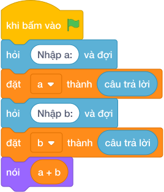

# Hướng Dẫn Giảng Dạy: Bốn phép tính đồng thời
Chuyên đề: **Lập Trình Thuật Toán & Khối Lệnh Scratch 3.0**

---

## 1. Ý tưởng & Phân tích thuật toán
- Bản chất của bài này là từ hai số `A = 8` và `B = 5` tính ra ba kết quả: tổng `8 + 5 = 13`, hiệu `8 - 5 = 3`, tích `8 * 5 = 40`, mỗi kết quả nằm trên một dòng. Thầy cô ví như máy tính bỏ túi bấm một lần hiện đủ ba đáp số.
- Quy trình gồm hai bước với hai biến `a` và `b` trong lời giải: dùng `map(int, hỏi và đợi.split())` để cắt dòng `8 5` thành `8` và `5` rồi cất vào `a` và `b`, sau đó in ba dòng `nói (a + b)`, `nói (a - b)`, `nói (a * b)` cho ra `13`, `3`, `40`.
- Xử lý biên: ràng buộc cho `A, B` từ `-10^4` tới `10^4`. Thầy cô cho các con thử cặp biên `-10000 -10000` cho ra `-20000`, `0`, `100000000`, và cặp `10000 10000` cho ra `20000`, `0`, `100000000`.

---

## 2. Bảng chạy tay trên số liệu mẫu (Dry Run Table - Sample 1: 8 5)
| Bước | Lệnh chạy | Giá trị biến | Màn hình hiện ra |
|------|-----------|--------------|------------------|
| 1 | `a, b = map(int, hỏi và đợi.split())` với bàn phím gõ `8 5` | `a = 8`, `b = 5` | (chưa in gì) |
| 2 | `nói (a + b)` tức `nói (8 + 5)` | `a = 8`, `b = 5` | `13` |
| 3 | `nói (a - b)` tức `nói (8 - 5)` | `a = 8`, `b = 5` | `3` |
| 4 | `nói (a * b)` tức `nói (8 * 5)` | `a = 8`, `b = 5` | `40` |
| 5 | Kết thúc chương trình | — | Kết quả cuối cùng đúng ba dòng `13`, `3`, `40`. |

---

## 3. Lưu ý & Bẫy lỗi thường gặp
- Bẫy 1: in cả ba kết quả trên một dòng như `nói (a + b, a - b, a * b)` thì với mẫu `8 5` màn hình hiện `13 3 40` chung một dòng thay vì ba dòng riêng. Cách sửa: viết ba khối lệnh `nói ()` riêng.
- Bẫy 2: sai thứ tự các dòng, ví dụ in tích trước tổng thì ba dòng hiện `40`, `3`, `13` bị đảo chỗ. Cách sửa: giữ đúng thứ tự tổng rồi hiệu rồi tích.
- Bẫy 3: quên `int()` khi cắt dòng, viết `a, b = hỏi và đợi.split()` rồi `nói (a + b)` thì với mẫu `8 5` máy nối chữ thành `85` thay vì `13`. Cách sửa: bọc `map(int, ...)` để đổi thành số.

---

## 4. Lời giải tham khảo & Kịch bản Khối lệnh Scratch 3.0

### 4.1. Khối lệnh đồ họa trực quan (Visual Scratch Blocks)

> 💡 **Kịch bản thực hiện từng bước:**
> - khi bấm vào cờ xanh
> - hỏi [Nhập a:] và đợi
> - đặt [a] thành (câu trả lời)
> - hỏi [Nhập b:] và đợi
> - đặt [b] thành (câu trả lời)
> - nói (a + b)
