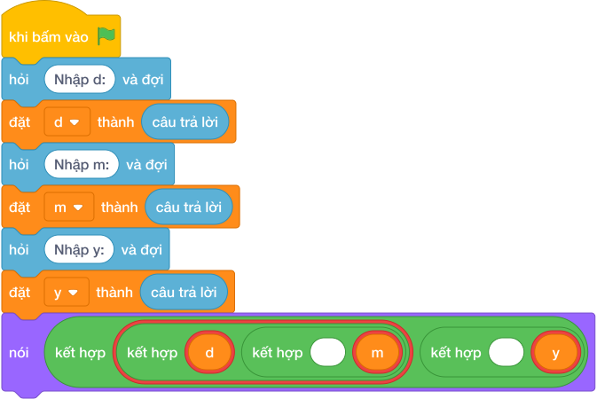

# Hướng Dẫn Giảng Dạy

## 1. Ý tưởng & Phân tích thuật toán
- Bản chất của bài này là xếp ba con số ngày `D = 4`, tháng `M = 9`, năm `Y = 2026` thành lịch chuẩn `4/9/2026`, với dấu gạch chéo `/` nằm giữa các số. Thầy cô ví dấu `/` như vách ngăn giữa ba ô lịch.
- Quy trình gồm hai bước với ba biến `d`, `m`, `y` trong lời giải: dùng `các khối hỏi và đợi cho từng biến` để cắt dòng `4 9 2026` thành `4`, `9`, `2026` rồi cất vào `d`, `m`, `y`, sau đó `nói (d, m, y, sep="/")` đặt dấu `/` vào giữa các số và in ra `4/9/2026`.
- Xử lý biên: ràng buộc cho ngày từ 1 tới 31, tháng từ 1 tới 12, năm từ 1900 tới 2100. Thầy cô cho các con thử biên `1 1 1900` cho ra `1/1/1900` và `31 12 2100` cho ra `31/12/2100`.

---

## 2. Bảng chạy tay trên số liệu mẫu (Dry Run Table - Sample 1: 4 9 2026)
| Bước | Lệnh chạy | Giá trị biến | Màn hình hiện ra |
|------|-----------|--------------|------------------|
| 1 | `d, m, y = các khối hỏi và đợi cho từng biến` với bàn phím gõ `4 9 2026` | `d = 4`, `m = 9`, `y = 2026` | (chưa in gì) |
| 2 | `nói (d, m, y, sep="/")` | `d = 4`, `m = 9`, `y = 2026` | `4/9/2026` |
| 3 | Kết thúc chương trình | — | Kết quả cuối cùng: `4/9/2026`. |

---

## 3. Lưu ý & Bẫy lỗi thường gặp
- Bẫy 1: quên `sep="/"`, viết `nói (d, m, y)` thì với mẫu `4 9 2026` màn hình hiện `4 9 2026` với dấu cách thay vì `4/9/2026`. Cách sửa: thêm `sep="/"` vào khối lệnh `nói ()`.
- Bẫy 2: dùng dấu nối sai, ví dụ `nói (d, m, y, sep="-")` thì màn hình hiện `4-9-2026` thay vì `4/9/2026`. Cách sửa: dùng đúng dấu gạch chéo `"/"`.
- Bẫy 3: đọc bằng ba lệnh `int(hỏi và đợi)` riêng trong khi đề cho cả ba số trên một dòng thì chương trình sẽ chờ thiếu số sau khi đã gõ `4 9 2026`. Cách sửa: đọc một dòng rồi cắt bằng `các khối hỏi và đợi cho từng biến`.

---

## 4. Lời giải tham khảo & Kịch bản Khối lệnh Scratch 3.0

### 4.1. Khối lệnh đồ họa trực quan (Visual Scratch Blocks)

> 💡 **Kịch bản thực hiện từng bước:**
> - khi bấm vào cờ xanh
> - hỏi [Nhập d:] và đợi
> - đặt [d] thành (câu trả lời)
> - hỏi [Nhập m:] và đợi
> - đặt [m] thành (câu trả lời)
> - hỏi [Nhập y:] và đợi
> - đặt [y] thành (câu trả lời)
> - nói (kết hợp d và ' ' và m và ' ' và y)
