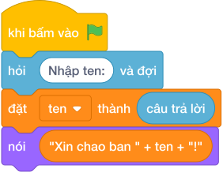

# Hướng Dẫn Giảng Dạy: Tấm danh thiếp thông minh
Chuyên đề: **Lập Trình Thuật Toán & Khối Lệnh Scratch 3.0**

---

## 1. Ý tưởng & Phân tích thuật toán
- Bản chất của bài này là ghép tên người tham dự vào mẫu `Xin chao ban [Ten]!`. Với mẫu thì tên là `Nam` nên kết quả là `Xin chao ban Nam!`.
- Quy trình gồm hai bước với biến `ten` trong lời giải: đọc chuỗi `"Nam"` vào `ten` bằng `hỏi và đợi.strip()` (có gọt khoảng trắng thừa ở hai đầu), rồi dùng phép cộng chuỗi `"Xin chao ban " + ten + "!"` để nối ba mảnh lại thành câu hoàn chỉnh.
- Xử lý biên: tên là chuỗi ký tự bất kỳ, có thể dài như mẫu thứ hai `Bao Anh` cho ra `Xin chao ban Bao Anh!`. Thầy cô nhắc các con giữ đúng một dấu cách sau chữ `ban` và dấu `!` ở cuối.

---

## 2. Bảng chạy tay trên số liệu mẫu (Dry Run Table - Sample 1: Nam)
| Bước | Lệnh chạy | Giá trị biến | Màn hình hiện ra |
|------|-----------|--------------|------------------|
| 1 | `ten = hỏi và đợi.strip()` với bàn phím gõ `Nam` | `ten = "Nam"` | (chưa in gì) |
| 2 | `nói ("Xin chao ban " + ten + "!")` tức ghép `"Xin chao ban "` với `"Nam"` và `"!"` | `ten = "Nam"` | `Xin chao ban Nam!` |
| 3 | Kết thúc chương trình | — | Kết quả cuối cùng: `Xin chao ban Nam!`. |

---

## 3. Lưu ý & Bẫy lỗi thường gặp
- Bẫy 1: đổi tên sang số bằng `ten = int(hỏi và đợi)` thì với mẫu `Nam` chương trình báo lỗi vì `Nam` không phải số. Cách sửa: tên là chữ nên chỉ viết `ten = hỏi và đợi.strip()`.
- Bẫy 2: quên dấu cách sau chữ `ban`, viết `"Xin chao ban" + ten + "!"` thì với mẫu `Nam` màn hình hiện `Xin chao banNam!` bị dính chữ. Cách sửa: viết `"Xin chao ban "` có một dấu cách ở cuối.
- Bẫy 3: quên dấu chấm than cuối câu, in ra `Xin chao ban Nam` thay vì `Xin chao ban Nam!` nên bị tính là kết quả sai. Cách sửa: cộng thêm `"!"` ở cuối.

---

## 4. Lời giải tham khảo & Kịch bản Khối lệnh Scratch 3.0

### 4.1. Khối lệnh đồ họa trực quan (Visual Scratch Blocks)

> 💡 **Kịch bản thực hiện từng bước:**
> - khi bấm vào cờ xanh
> - hỏi [Nhập ten:] và đợi
> - đặt [ten] thành (câu trả lời)
> - nói ("Xin chao ban " + ten + "!")
