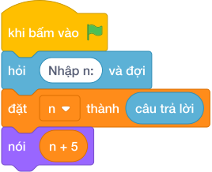

# Hướng Dẫn Giảng Dạy: Tuổi của bé sau 5 năm
Chuyên đề: **Lập Trình Thuật Toán & Khối Lệnh Scratch 3.0**

---

## 1. Ý tưởng & Phân tích thuật toán
- Bản chất của bài này là dự đoán tuổi sau 5 năm nữa: lấy tuổi hiện tại `N = 8` cộng thêm 5 được `13`. Thầy cô cho các con giơ 8 ngón tay rồi đếm thêm 5 nữa.
- Quy trình gồm hai bước với biến `n` trong lời giải: đọc `8` vào `n` bằng `int(hỏi và đợi.strip())`, rồi tính `n + 5` tức `8 + 5 = 13` và in ra.
- Xử lý biên: ràng buộc cho `N` từ 1 tới 12. Thầy cô cho các con thử giá trị biên `1` cho ra `6`, và giá trị biên `12` cho ra `17`.

---

## 2. Bảng chạy tay trên số liệu mẫu (Dry Run Table - Sample 1: 8)
| Bước | Lệnh chạy | Giá trị biến | Màn hình hiện ra |
|------|-----------|--------------|------------------|
| 1 | `n = int(hỏi và đợi.strip())` với bàn phím gõ `8` | `n = 8` | (chưa in gì) |
| 2 | `nói (n + 5)` tức `nói (8 + 5)` | `n = 8` | `13` |
| 3 | Kết thúc chương trình | — | Kết quả cuối cùng: `13`. |

---

## 3. Lưu ý & Bẫy lỗi thường gặp
- Bẫy 1: nhân thay vì cộng, viết `nói (n * 5)` thì với mẫu `8` màn hình hiện `40` thay vì `13`. Cách sửa: tuổi tăng theo năm nên viết dấu `+`, tức `n + 5`.
- Bẫy 2: cộng sai số năm, viết `nói (n + 3)` thì với mẫu `8` màn hình hiện `11` thay vì `13`. Cách sửa: đề hỏi sau 5 năm nên cộng đúng số 5.
- Bẫy 3: quên `int()`, viết `n = hỏi và đợi.strip()` rồi `nói (n + 5)` thì chương trình báo lỗi vì không cộng chữ với số được. Cách sửa: viết `n = int(hỏi và đợi.strip())`.

---

## 4. Lời giải tham khảo & Kịch bản Khối lệnh Scratch 3.0

### 4.1. Khối lệnh đồ họa trực quan (Visual Scratch Blocks)

> 💡 **Kịch bản thực hiện từng bước:**
> - khi bấm vào cờ xanh
> - hỏi [Nhập n:] và đợi
> - đặt [n] thành (câu trả lời)
> - nói (n + 5)
