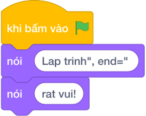

# Hướng Dẫn Giảng Dạy: In không xuống dòng với end
Chuyên đề: **Lập Trình Thuật Toán & Khối Lệnh Scratch 3.0**

---

## 1. Ý tưởng & Phân tích thuật toán
- Bản chất của bài này là ghép khẩu hiệu `Lap trinh rat vui!` từ hai mảnh bằng hai lệnh `khối nói` nhưng vẫn nằm trên cùng một dòng. Thầy cô giải thích `end=" "` nghĩa là sau khi in xong thì dừng lại bằng một dấu cách thay vì xuống dòng.
- Quy trình gồm hai bước: lệnh thứ nhất `nói ("Lap trinh", end=" ")` in `Lap trinh` kèm một dấu cách ở cuối và giữ con trỏ ở lại, lệnh thứ hai `nói ("rat vui!")` in tiếp `rat vui!` ngay sau dấu cách đó, tạo thành `Lap trinh rat vui!`.
- Xử lý biên: bài này không có số liệu vào nên không có giá trị biên. Thầy cô nhắc các con giữ đúng một dấu cách giữa `trinh` và `rat`, vì thiếu dấu cách sẽ dính thành `Lap trinhrat vui!`.

---

## 2. Bảng chạy tay trên số liệu mẫu (Dry Run Table - Sample 1: (không có dữ liệu vào))
| Bước | Lệnh chạy | Màn hình hiện ra |
|------|-----------|------------------|
| 1 | `nói ("Lap trinh", end=" ")` | `Lap trinh ` (con trỏ vẫn ở cùng dòng, chưa xuống dòng) |
| 2 | `nói ("rat vui!")` | nối tiếp thành `Lap trinh rat vui!` rồi xuống dòng |
| 3 | Kết thúc chương trình | Kết quả cuối cùng: `Lap trinh rat vui!`. |

---

## 3. Lưu ý & Bẫy lỗi thường gặp
- Bẫy 1: quên `end=" "`, viết hai lệnh `nói ("Lap trinh")` và `nói ("rat vui!")` thì màn hình hiện hai dòng rời nhau thay vì một dòng `Lap trinh rat vui!`. Cách sửa: thêm `end=" "` vào lệnh thứ nhất.
- Bẫy 2: viết `end=""` không có dấu cách thì màn hình hiện `Lap trinhrat vui!` bị dính chữ. Cách sửa: viết đúng `end=" "` có một dấu cách ở giữa.
- Bẫy 3: gộp dấu cách sai chỗ, ví dụ `nói ("Lap trinh ", end=" ")` kèm thêm cách sẽ tạo hai dấu cách liên tiếp thành `Lap trinh  rat vui!`. Cách sửa: chỉ để một dấu cách duy nhất, hoặc trong chữ hoặc trong `end`.

---

## 4. Lời giải tham khảo & Kịch bản Khối lệnh Scratch 3.0

### 4.1. Khối lệnh đồ họa trực quan (Visual Scratch Blocks)

> 💡 **Kịch bản thực hiện từng bước:**
> - khi bấm vào cờ xanh
> - nói [Lap trinh", end=" ]
> - nói [rat vui!]
