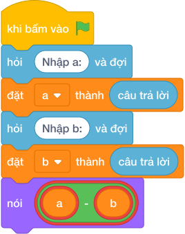

# Hướng Dẫn Giảng Dạy

## 1. Ý tưởng & Phân tích thuật toán
- Bản chất của bài này là tính vải còn lại: cuộn vải dài `A = 100` mét trừ đi `B = 35` mét đã cắt, còn `65` mét. Thầy cô cho các con hình dung cắt bớt một đoạn thì độ dài ngắn lại.
- Quy trình gồm ba bước với hai biến `a` và `b` trong lời giải: đọc `100` vào `a`, đọc `35` vào `b`, rồi tính `a - b` tức `100 - 35 = 65` và in ra.
- Xử lý biên: ràng buộc cho `0 <= B <= A <= 10^9` nên hiệu không bao giờ âm. Thầy cô cho các con thử cặp biên bằng nhau như `100` và `100` cho ra `0`, và cặp `1000000000` và `0` cho ra `1000000000`.

---

## 2. Bảng chạy tay trên số liệu mẫu (Dry Run Table - Sample 1: 100 và 35)
| Bước | Lệnh chạy | Giá trị biến | Màn hình hiện ra |
|------|-----------|--------------|------------------|
| 1 | `a = int(hỏi và đợi)` với dòng 1 gõ `100` | `a = 100` | (chưa in gì) |
| 2 | `b = int(hỏi và đợi)` với dòng 2 gõ `35` | `b = 35` | (chưa in gì) |
| 3 | `nói (a - b)` tức `nói (100 - 35)` | `a = 100`, `b = 35` | `65` |
| 4 | Kết thúc chương trình | — | Kết quả cuối cùng: `65`. |

---

## 3. Lưu ý & Bẫy lỗi thường gặp
- Bẫy 1: viết ngược thứ tự `nói (b - a)` thì với mẫu `100` và `35` màn hình hiện `-65` thay vì `65`. Cách sửa: nhớ lấy số lớn trừ số nhỏ, viết `a - b`.
- Bẫy 2: cộng thay vì trừ, viết `nói (a + b)` thì với mẫu `100` và `35` màn hình hiện `135` thay vì `65`. Cách sửa: bài hỏi phần còn lại nên viết dấu `-`.
- Bẫy 3: quên `int()` khiến `a - b` báo lỗi vì không trừ được chữ. Cách sửa: viết `a = int(hỏi và đợi)` và `b = int(hỏi và đợi)`.

---

## 4. Lời giải tham khảo & Kịch bản Khối lệnh Scratch 3.0

### 4.1. Khối lệnh đồ họa trực quan (Visual Scratch Blocks)

> 💡 **Kịch bản thực hiện từng bước:**
> - khi bấm vào cờ xanh
> - hỏi [Nhập a:] và đợi
> - đặt [a] thành (câu trả lời)
> - hỏi [Nhập b:] và đợi
> - đặt [b] thành (câu trả lời)
> - nói (a - b)
