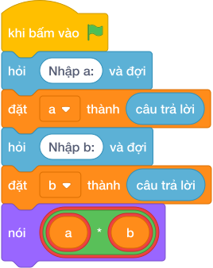

# Hướng Dẫn Giảng Dạy

## 1. Ý tưởng & Phân tích thuật toán
- Bản chất của bài này là đếm kẹo trong một thùng: mỗi thùng có `A = 12` hộp, mỗi hộp có `B = 8` chiếc kẹo, vậy tổng là `12 * 8 = 96` chiếc. Thầy cô cho các con xếp 12 hàng, mỗi hàng 8 chiếc rồi đếm gộp.
- Quy trình gồm ba bước với hai biến `a` và `b` trong lời giải: đọc `12` vào `a`, đọc `8` vào `b`, rồi tính `a * b` tức `12 * 8 = 96` và in ra.
- Xử lý biên: ràng buộc cho `A, B` từ 0 tới `10^4`. Thầy cô cho các con thử cặp biên `0` và `10000` cho ra `0`, cặp `10000` và `10000` cho ra `100000000` để thấy chương trình vẫn đúng.

---

## 2. Bảng chạy tay trên số liệu mẫu (Dry Run Table - Sample 1: 12 và 8)
| Bước | Lệnh chạy | Giá trị biến | Màn hình hiện ra |
|------|-----------|--------------|------------------|
| 1 | `a = int(hỏi và đợi)` với dòng 1 gõ `12` | `a = 12` | (chưa in gì) |
| 2 | `b = int(hỏi và đợi)` với dòng 2 gõ `8` | `b = 8` | (chưa in gì) |
| 3 | `nói (a * b)` tức `nói (12 * 8)` | `a = 12`, `b = 8` | `96` |
| 4 | Kết thúc chương trình | — | Kết quả cuối cùng: `96`. |

---

## 3. Lưu ý & Bẫy lỗi thường gặp
- Bẫy 1: viết dấu nhân toán học `x`, ví dụ `nói (a x b)` thì chương trình báo lỗi vì Scratch chỉ hiểu dấu `*`. Cách sửa: viết `nói (a * b)`.
- Bẫy 2: cộng thay vì nhân, viết `nói (a + b)` thì với mẫu `12` và `8` màn hình hiện `20` thay vì `96`. Cách sửa: bài hỏi tổng số kẹo trong thùng nên viết dấu `*`.
- Bẫy 3: quên `int()`, viết `a = hỏi và đợi` rồi `nói (a * b)` thì với `a` là chữ `"12"` máy lặp chữ, cho ra kết quả lạ thay vì `96`. Cách sửa: viết `a = int(hỏi và đợi)` và `b = int(hỏi và đợi)`.

---

## 4. Lời giải tham khảo & Kịch bản Khối lệnh Scratch 3.0

### 4.1. Khối lệnh đồ họa trực quan (Visual Scratch Blocks)

> 💡 **Kịch bản thực hiện từng bước:**
> - khi bấm vào cờ xanh
> - hỏi [Nhập a:] và đợi
> - đặt [a] thành (câu trả lời)
> - hỏi [Nhập b:] và đợi
> - đặt [b] thành (câu trả lời)
> - nói (a * b)
