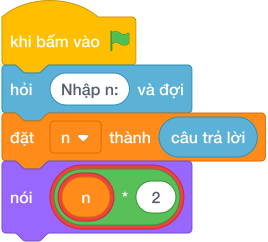

# Hướng Dẫn Giảng Dạy

## 1. Ý tưởng & Phân tích thuật toán
- Bản chất của bài này là dự đoán sản lượng năm sau gấp đôi năm nay: lấy `N` nhân với 2. Thầy cô kể câu chuyện bác Tư thu hoạch 75 quả năm nay thì năm sau được 150 quả.
- Quy trình gồm hai bước với biến `n` trong lời giải: đọc số `75` vào `n` bằng `int(hỏi và đợi)`, rồi tính `n * 2` tức `75 * 2 = 150` và in ra.
- Xử lý biên: ràng buộc cho `N` từ 0 tới `10^9`. Thầy cô cho các con thử giá trị biên `0` cho ra `0`, và giá trị biên `1000000000` cho ra `2000000000` để thấy chương trình vẫn đúng ở hai đầu.

---

## 2. Bảng chạy tay trên số liệu mẫu (Dry Run Table - Sample 1: 75)
| Bước | Lệnh chạy | Giá trị biến | Màn hình hiện ra |
|------|-----------|--------------|------------------|
| 1 | `n = int(hỏi và đợi)` với bàn phím gõ `75` | `n = 75` | (chưa in gì) |
| 2 | `nói (n * 2)` tức `nói (75 * 2)` | `n = 75` | `150` |
| 3 | Kết thúc chương trình | — | Kết quả cuối cùng: `150`. |

---

## 3. Lưu ý & Bẫy lỗi thường gặp
- Bẫy 1: quên `int()`, viết `n = hỏi và đợi` rồi `nói (n * 2)` thì với mẫu `75` máy hiểu `"75"` là chữ nên lặp chữ hai lần, hiện `7575` thay vì `150`. Cách sửa: viết `n = int(hỏi và đợi)`.
- Bẫy 2: in ra `n` mà quên nhân, viết `nói (n)` thì với mẫu `75` màn hình hiện `75` thay vì `150`. Cách sửa: viết `nói (n * 2)`.
- Bẫy 3: cộng thay vì nhân, viết `nói (n + 2)` thì với mẫu `75` màn hình hiện `77` thay vì `150`. Cách sửa: nhớ gấp đôi nghĩa là nhân với 2, viết `n * 2`.

---

## 4. Lời giải tham khảo & Kịch bản Khối lệnh Scratch 3.0

### 4.1. Khối lệnh đồ họa trực quan (Visual Scratch Blocks)

> 💡 **Kịch bản thực hiện từng bước:**
> - khi bấm vào cờ xanh
> - hỏi [Nhập n:] và đợi
> - đặt [n] thành (câu trả lời)
> - nói (n * 2)
