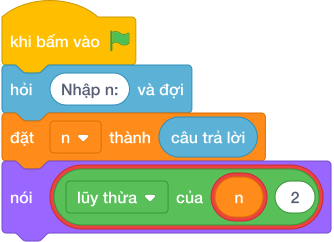

# Hướng Dẫn Giảng Dạy

## 1. Ý tưởng & Phân tích thuật toán

- Bản chất là bình phương: với `n = 8` thì `n ** 2 = 8 ** 2 = 64`, chính là diện tích hình vuông cạnh `8`.
- Quy trình trong lời giải: đọc `n` từ một dòng duy nhất rồi in `n ** 2`; không cần biến phụ, không cần vòng lặp.
- Xử lý biên: `n = 0` cho `0`; `n = -10^4` cho `100000000` (số âm bình phương thành số dương); `n = 10^4` cho `100000000`.

---

## 2. Bảng chạy tay trên số liệu mẫu (Dry Run Table - Sample 1: 8)

| Bước | Diễn giải | Giá trị |
|------|-----------|---------|
| 1 | Đọc một dòng, biến `n` nhận giá trị | `n = 8` |
| 2 | Tính `n ** 2` | `8 ** 2 = 64` |
| 3 | In kết quả | `64` |

---

## 3. Lưu ý & Bẫy lỗi thường gặp

**Bẫy 1: Dùng `n * 2` thay vì `n ** 2`.**

```text
nói (n * 2)

```

Với số liệu mẫu trên, đoạn này cho `n = 8` in ra `16` thay vì `64`.

Cách sửa: dùng `n ** 2` hoặc `n * n`.

**Bẫy 2: Dùng `n ^ 2` (tưởng là mũ).**

```text
nói (n ^ 2)

```

Với số liệu mẫu trên, đoạn này cho `n = 8` thì `8 ^ 2 = 10` vì `^` là phép khác, không phải lũy thừa.

Cách sửa: toán tử mũ trong Scratch là `**`.

---

## 4. Lời giải tham khảo & Kịch bản Khối lệnh Scratch 3.0

### 4.1. Khối lệnh đồ họa trực quan (Visual Scratch Blocks)



> 💡 **Kịch bản thực hiện từng bước:**
> - khi bấm vào cờ xanh
> - hỏi [Nhập n:] và đợi
> - đặt [n] thành (câu trả lời)
> - nói (n + 2)
