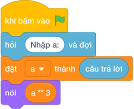

# Hướng Dẫn Giảng Dạy: Lập Phương Một Số
Chuyên đề: **Lập Trình Thuật Toán & Khối Lệnh Scratch 3.0**

---

## 1. Ý tưởng & Phân tích thuật toán

- Bản chất là lập phương thể tích: với `a = 5` thì `a ** 3 = 5 ** 3 = 125`, là thể tích hộp cạnh `5`.
- Quy trình trong lời giải: đọc `a` từ một dòng rồi in `a ** 3`; phép `** 3` nhân `a` ba lần với nhau.
- Xử lý biên: `a = 1` cho `1`; `a = 1000` cho `1000000000`; đề cho `a` dương nên không lo số âm.

---

## 2. Bảng chạy tay trên số liệu mẫu (Dry Run Table - Sample 1: 5)

| Bước | Diễn giải | Giá trị |
|------|-----------|---------|
| 1 | Đọc một dòng, biến `a` nhận giá trị | `a = 5` |
| 2 | Tính `a ** 3` | `5 ** 3 = 125` |
| 3 | In kết quả | `125` |

---

## 3. Lưu ý & Bẫy lỗi thường gặp

**Bẫy 1: Dùng `a * 3` thay vì `a ** 3`.**

```text
print(a * 3)
```

Với số liệu mẫu trên, đoạn này cho `a = 5` in ra `15` thay vì `125`.

Cách sửa: dùng `a ** 3`.

**Bẫy 2: Dùng `a ^ 3`.**

```text
print(a ^ 3)
```

Với số liệu mẫu trên, đoạn này cho `a = 5` thì `5 ^ 3 = 6`, hoàn toàn khác `125`.

Cách sửa: toán tử mũ là `**`.

---

## 4. Lời giải tham khảo & Kịch bản Khối lệnh Scratch 3.0

### 4.1. Khối lệnh đồ họa trực quan (Visual Scratch Blocks)



> 💡 **Kịch bản thực hiện từng bước:**
> - khi bấm vào cờ xanh
> - hỏi [Nhập a:] và đợi
> - đặt [a] thành (câu trả lời)
> - nói (a ** 3)
